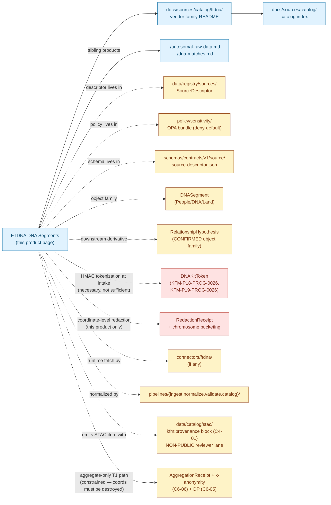

<!-- [KFM_META_BLOCK_V2]
doc_id: kfm://doc/docs-sources-catalog-ftdna-dna-segments
title: FTDNA DNA Segments
type: product-page
version: v0.2
status: draft
owners: <PLACEHOLDER — Docs steward + Source steward for ftdna + People/DNA/Land domain steward + Sensitivity reviewer + Rights-holder representative>
created: 2026-05-20
updated: 2026-05-21
policy_label: public
related:
  - docs/sources/catalog/ftdna/README.md
  - docs/sources/catalog/ftdna/autosomal-raw-data.md
  - docs/sources/catalog/ftdna/dna-matches.md
  - docs/sources/catalog/ftdna/IDENTITY.md
  - docs/sources/catalog/ftdna/RIGHTS-AND-SENSITIVITY-MAP.md
  - docs/sources/catalog/ftdna/_examples/stac-item-example.json
  - docs/sources/catalog/README.md
  - docs/doctrine/directory-rules.md
  - docs/standards/SENSITIVITY_RUBRIC.md
  - docs/runbooks/revocation.md
tags: [kfm, docs, sources, catalog, ftdna, dtc, dna, segments, ibd, triangulation, people-dna-land, t4, third-party, cross-vendor]
notes:
  - "PROPOSED product-page scaffold; sibling-link presence verified in Claude Code session."
  - "FTDNA is not named in the KFM corpus (C9-03 names 23andMe, AncestryDNA, MyHeritage); FTDNA is treated as a structurally analogous DTC vendor."
  - "Maps to the DNASegment object family (Atlas §B, CONFIRMED); downstream consumers may include RelationshipHypothesis (CONFIRMED object family)."
  - "CRITICAL: segment coordinates are themselves uniquely re-identifying — they function as a biometric-level fingerprint independent of the kit identifier."
  - "Atlas Part 1 §D lists 'DNA vendor match CSV/segment/triangulation data' as a single CONFIRMED source family with the note 'sensitive joins fail closed' — segments inherit the same default-deny posture as match lists, with additional cross-vendor re-identification risk."
  - "Type is `product-page` (not `standard`); this file carries the full presentation standard but is intentionally a scaffold, not steady-state."
[/KFM_META_BLOCK_V2] -->

# FTDNA DNA Segments

> IBD segment-level data with chromosome coordinates; **denied by default at tier T4** per Atlas §24.5.2. Segment coordinates are themselves uniquely re-identifying — read §[Why segments are different](#why-segments-are-different) before any admission planning.

<p>
  
  
  
  
  
  
  
  
  
  
  
  
</p>

**Status:** PROPOSED — scaffold only · **Family:** [`ftdna`](./README.md) · **Catalog index:** [`../README.md`](../README.md) · **Sibling products:** [Autosomal Raw Data](./autosomal-raw-data.md), [DNA Matches](./dna-matches.md) · **Last reviewed:** 2026-05-21

> [!CAUTION]
> **Segment coordinates are uniquely re-identifying — they are a biometric-level fingerprint.** Even with kit identifiers fully HMAC-tokenized, the **chromosome + start position + end position** tuple is sufficient to cross-match against external databases (the GEDmatch-style risk pattern) and re-identify both parties. Per Atlas §24.5.2 (CONFIRMED), raw DNA segment data is **T4 — Denied** with no transform releasing it to a public tier; T3 only under explicit named research agreement. Per Atlas Part 1 §D (CONFIRMED source-family note for "DNA vendor match CSV/segment/triangulation data"), **sensitive joins fail closed**.

---

## Quick Jump

- [Overview](#overview)
- [Why segments are different](#why-segments-are-different)
- [Triangulation risk](#triangulation-risk)
- [Catalog relationships](#catalog-relationships)
- [Source authority](#source-authority)
- [Catalog profiles used](#catalog-profiles-used)
- [Collection identity](#collection-identity)
- [Provenance fields](#provenance-fields)
- [Temporal handling](#temporal-handling)
- [Geometry and projection](#geometry-and-projection)
- [Rights and sensitivity](#rights-and-sensitivity)
- [Validation and catalog closure](#validation-and-catalog-closure)
- [Related contracts and schemas](#related-contracts-and-schemas)
- [Related connectors and pipelines](#related-connectors-and-pipelines)
- [Examples](#examples)
- [Open questions](#open-questions)

---

## Overview

This page describes the **FTDNA DNA Segments product** — the chromosome-painted Identity-By-Descent (IBD) segment table that quantifies, per chromosome interval, where the uploader's genome shares a recent common ancestor with each of their matches — as a *catalog target*: what it is, which catalog profiles it serves, what the STAC shape looks like, and which gates it crosses. It is a **scaffold**, not a steady-state product page; product-specific operational facts (export-format version, file shape, asset roles, cadence, current endpoint URL, retention window, threshold cM defaults) are **NEEDS VERIFICATION** until inspected against a real export at admission.

**What it is** (CONFIRMED doctrine, applied by analogy). The IBD segment product maps to the **`DNASegment`** object family (Atlas §B, CONFIRMED term inside People/DNA/Land — appears alongside `DNAMatchEvidence` and `RelationshipHypothesis`). Per `C9-03` (CONFIRMED for 23andMe / AncestryDNA / MyHeritage; **INFERRED** for FTDNA), derived data from DTC inputs — including "**IBD segment counts**" specifically named in the corpus — can be released only when k-anonymity is satisfied for living individuals (`C6-06`, CONFIRMED) and only under a documented consent scope. Differential privacy (`C6-05`, CONFIRMED) applies to aggregate statistics that cross the publication boundary. The raw segment table itself is **not publishable in any form** that preserves individual coordinates.

**What this page is not.**

- **Not a SourceDescriptor.** See [`data/registry/sources/`](../../../../data/registry/sources/) for the authoritative descriptor.
- **Not a policy.** See [`policy/sensitivity/`](../../../../policy/sensitivity/) and [`RIGHTS-AND-SENSITIVITY-MAP.md`](./RIGHTS-AND-SENSITIVITY-MAP.md).
- **Not a schema.** See [`schemas/contracts/v1/source/`](../../../../schemas/contracts/v1/source/) per ADR-0001.
- **Not an admission decision.** Admission requires a completed SourceDescriptor, rights resolution, sensitivity tagging, consent stack (including third-party considerations), HMAC-tokenization of kit identifiers, **coordinate-level redaction or aggregation policy**, and reviewer sign-off.

> [!IMPORTANT]
> **PROPOSED scope** *(NEEDS VERIFICATION at admission)*: export format version, file shape, asset roles, cadence, segment-cM threshold (vendors typically apply a minimum-cM filter, e.g., 7 cM), chromosome-build assumption (e.g., GRCh37 vs GRCh38), current endpoint URL, rights status, license terms, retention window.

[↑ Back to top](#ftdna-dna-segments)

---

## Why segments are different

The three FTDNA DTC products share the T4 default and the HMAC-tokenization-of-kit-IDs rule established in [`./dna-matches.md`](./dna-matches.md). Segment data adds a class of risk that *cannot* be tokenized away because **the genetic coordinate itself is the identifier**.

| Concern | Autosomal Raw | Match List | DNA Segments |
|---|---|---|---|
| Subject of payload | Uploader only | Uploader + named third parties | Uploader + named third parties + **shared genetic coordinates** |
| Re-identification path | Reupload to a matching service | Vendor kit-ID lookup | **Cross-vendor coordinate lookup** (GEDmatch-style) |
| Tokenization sufficient? | n/a (no third parties named) | **Yes** — HMAC kit-ID is sufficient | **No** — coordinates themselves are identifying |
| Triangulation risk | None | Low | **High** — three or more shared segments reveal facts about uninvolved relatives |
| Aggregate-only T1 path | Plausible (cohort-level) | Plausible (network-level) | **Constrained** — aggregations that preserve coordinate detail still re-identify |

> [!WARNING]
> **Tokenizing kit identifiers is necessary but not sufficient for segment data.** Where the match-list product can be normalized to "tokenized pairs with relatedness metrics," the segment product carries the *evidence itself* (the IBD interval) in its coordinates. Any release path for segment data must either (a) aggregate to a level where coordinate detail is destroyed (e.g., chromosome-level shared-cM counts), or (b) remain restricted to a named research agreement under T3 with the rights-holder representative's approval (Atlas §24.5.2, CONFIRMED).

[↑ Back to top](#ftdna-dna-segments)

---

## Triangulation risk

Triangulation is the process of finding chromosome intervals where **three or more** kits all share IBD segments at the same location. The corpus addresses this implicitly through the "sensitive joins fail closed" rule (Atlas Part 1 §D source-family note for DNA vendor match/segment/triangulation data; CONFIRMED). The product-specific concern: triangulation reveals genetic facts about **uninvolved relatives** — people who never tested with any DTC vendor — because IBD inheritance patterns are deducible from a small number of tested relatives.

| Triangulation scenario | Risk class | Default posture (PROPOSED) |
|---|---|---|
| 2-way segment join (uploader + one match) | High | T4 — Denied |
| 3-way segment triangulation (uploader + two matches at same interval) | **Critical** — implies a shared ancestor not necessarily in any database | T4 — Denied; reviewer-only research lane T3 only |
| Cohort-level "how many KFM users share segments on chromosome N" aggregate | Moderate | T1 candidate only after k-anonymity + DP + ReviewRecord |
| Genealogical research with named consent of all parties | T3-eligible | Per-agreement; named research only |

> [!CAUTION]
> **KFM is not a triangulation service.** This product page does not authorize KFM to construct or expose a triangulation matrix even internally. Any triangulation-style derivative is a separate object (likely `RelationshipHypothesis`, CONFIRMED object family) that requires its own admission, gates, and review — and the corpus position is that such derivatives "fail closed" on sensitive joins.

[↑ Back to top](#ftdna-dna-segments)

---

## Catalog relationships



> [!NOTE]
> Diagram structure (solid = doc-to-doc; dashed = doc-to-non-doc) is grounded in Directory Rules §6 placement law (CONFIRMED). Two red nodes are highlighted because segment data requires both HMAC kit tokenization (shared with the match-list product) **and** coordinate-level redaction (unique to this product). Paths inside the diagram are **PROPOSED** and **NEEDS VERIFICATION**.

[↑ Back to top](#ftdna-dna-segments)

---

## Source authority

See [`data/registry/sources/`](../../../../data/registry/sources/) for the authoritative `SourceDescriptor`. **Do not duplicate descriptor fields here.**

| Cross-reference | Path *(PROPOSED unless stated)* | Authority |
|---|---|---|
| SourceDescriptor (machine) | `data/registry/sources/ftdna/...` | **Canonical** (Directory Rules §13.1) |
| SourceDescriptor schema | `schemas/contracts/v1/source/source-descriptor.json` | **Canonical** per ADR-0001 (Directory Rules §0, CONFIRMED authority) |
| Source steward register | `control_plane/source_authority_register.yaml` | **PROPOSED** (referenced by Encyclopedia §8) |
| Source family note | Atlas Part 1 §D — "DNA vendor match CSV/segment/triangulation data" | **CONFIRMED** group identity; segments + match lists + triangulation share one source-family designation |
| Vendor README | [`./README.md`](./README.md) | Sibling — INFERRED present from prior session note |
| Sibling product pages | [`./autosomal-raw-data.md`](./autosomal-raw-data.md), [`./dna-matches.md`](./dna-matches.md) | Sibling — INFERRED present from prior session note |
| Catalog README | [`../README.md`](../README.md) | Parent — INFERRED present from prior session note |

> [!NOTE]
> **PROPOSED `source_role`** at admission: `candidate` (Atlas §24.1.3 enum). Segments are vendor-computed *inferences* about IBD intervals — never observed events — so the role should be `candidate` at admission and only ever promote to `modeled` (with `role_model_run_ref` pointing at the vendor's matching algorithm version), **never** to `observed`. The source-role-collapse anti-pattern (Doctrine Synthesis §29.3, CONFIRMED) is particularly acute for segment data because users naturally read "shared segment" as an observed fact about ancestry.

[↑ Back to top](#ftdna-dna-segments)

---

## Catalog profiles used

Per Pass-10 `C4` (CONFIRMED doctrine), every promoted dataset must have a STAC Item or Collection (spatiotemporal assets), a DCAT entry (catalog-level metadata), and a PROV record (lineage), with the evidence-bundle JSON-LD attached as a content-addressed asset.

| Profile | Lane *(PROPOSED paths per Directory Rules §13.1)* | Used by this product? | Truth label |
|---|---|---|---|
| **STAC** (with `kfm:provenance`, `C4-01`) | `data/catalog/stac/people-dna-land/ftdna/segments/...` | **PROPOSED — Yes (reviewer-only lane)** | Item shape grounded in `C4-01` (CONFIRMED); per-product item presence NEEDS VERIFICATION |
| **DCAT** (`C4-05`) | `data/catalog/dcat/people-dna-land/...` | PROPOSED — Yes / No (NEEDS VERIFICATION) | Required for catalog-level discoverability |
| **PROV-O** | `data/catalog/prov/...` | PROPOSED — Yes / No (NEEDS VERIFICATION) | Required for lineage projection — especially important here because segments are vendor-computed inferences |
| **Domain projection** | `data/catalog/domain/people-dna-land/...` | PROPOSED — Yes / No (NEEDS VERIFICATION) | Per `KFM-P1-IDEA-0069` "domain lanes as proof-bearing slices" |
| **Aggregate-derivative STAC** (separate Item / Collection) | `data/catalog/stac/people-dna-land/aggregates/...` | **PROPOSED — Yes (T1 path only after coordinate destruction)** | Only public-facing STAC route; requires coordinate-level destruction + AggregationReceipt + k-anonymity + DP |
| **CARE extension** (`kfm:care`, `C15-02`) | (extension namespace in DCAT / STAC) | **PROPOSED — TBD** | Applicability depends on consent posture; flag for review |

> [!WARNING]
> **No public STAC publication that preserves coordinates.** Per `C9-03` (CONFIRMED): "raw genotype data is never republished, only aggregate or k-anonymized derived data crosses the publication boundary." For segments, "aggregate" must mean **coordinate detail is destroyed** — chromosome-level counts, decile bucketing, or coarser. A STAC item that exposes any interval finer than ~chromosome-arm resolution fails the segment-specific sensitivity test.

[↑ Back to top](#ftdna-dna-segments)

---

## Collection identity

- **PROPOSED Collection id pattern:** `kfm-ftdna-dna-segments` (vendor-product slug; see [`./IDENTITY.md`](./IDENTITY.md) for the canonical pattern).
- **PROPOSED namespace:** `kfm:` *(see OPEN-DSC-03 — the `kfm:` vs `ks-kfm:` choice remains open per `C4-01` open question, CONFIRMED).*
- **PROPOSED aggregate-derivative Collection id pattern:** `kfm-ftdna-dna-segments-agg` *(separate Collection because the tier, consent semantics, and allowed coordinate resolution differ — reviewer-only T4 with raw coords vs aggregate-only T1 with coords destroyed).*
- **Asset roles:** NEEDS VERIFICATION — confirm against [`schemas/contracts/v1/source/`](../../../../schemas/contracts/v1/source/). At minimum: `data` (the tokenized segment table), `metadata` (any vendor-supplied sidecar describing the matching algorithm and threshold), `checksum` (per-asset `file:checksum`). **The plaintext segment table MUST NOT appear as a STAC asset** even with kit tokens; the coordinates remain identifying.

[↑ Back to top](#ftdna-dna-segments)

---

## Provenance fields

STAC `properties.kfm:provenance` block (CONFIRMED shape per `C4-01`; PROPOSED for FTDNA DNA Segments scope):

| Field | Type | Purpose |
|---|---|---|
| `spec_hash` | string (sha256) | Canonical-record hash via JCS (RFC 8785); identity of this record |
| `evidence_bundle_ref` | `kfm://evidence/<digest>` | Resolves to the JSON-LD EvidenceBundle for this item (CONFIRMED `C4-04`) |
| `run_record_ref` | `kfm://run/<run-id>` | Points at the RunReceipt that produced this item |
| `audit_ref` | `kfm://audit/<attestation-id>` | SLSA / OPA attestation pointer |
| `policy_digest` | string (sha256) | Hash of the policy bundle in force at promotion |

**Per-asset integrity** (CONFIRMED `C4-01`): `file:checksum` on every asset (STAC file extension).

**Segment-specific optional fields** *(PROPOSED)*:

- `kfm:source_role` — `candidate` at admission; never `observed` (Atlas §24.1.3).
- `kfm:object_family` — `DNASegment` (Atlas §B, CONFIRMED term).
- `kfm:export_format_version` — vendor export format version pinned per `C9-03` expansion direction (CONFIRMED).
- `kfm:consent_token_ref` — pointer to the GA4GH-DUO-coded consent receipt of the **uploader** (`C6-07` + `C9-04`, CONFIRMED). Does not represent third-party consent.
- `kfm:third_party_token_scheme` — identifier of the HMAC scheme used to tokenize match kit identifiers (`KFM-P19-PROG-0026`, CONFIRMED carry-forward).
- `kfm:kit_token_salt_ref` — opaque reference to the salt used; the salt itself MUST NOT appear in the STAC item.
- `kfm:coordinate_redaction_class` *(this product only)* — one of `none-reviewer-only` | `chromosome-arm` | `chromosome-only` | `whole-genome-cM-total` (PROPOSED enum; see [Open questions](#open-questions)).
- `kfm:chromosome_build` — chromosome reference build of the source data (e.g., `GRCh37`, `GRCh38`); NEEDS VERIFICATION against vendor export.
- `kfm:min_segment_cM` — vendor-applied minimum-cM threshold for inclusion in the export (e.g., `7.0`); NEEDS VERIFICATION.
- `kfm:matching_algorithm_ref` *(when source_role = `modeled`)* — points at a ModelRunReceipt for the vendor matching algorithm version, per Atlas §24.1.3 `role_model_run_ref` (PROPOSED).
- `kfm:k_anonymity_k` *(aggregate items only)* — `k` value satisfied (`C6-06`).
- `kfm:dp_epsilon` *(aggregate items only)* — DP epsilon used (`C6-05`).
- `kfm:triangulation_disabled` *(boolean)* — `true` MUST be asserted on every catalog item; an item where this is `false` or absent fails the validator (see [Validation and catalog closure](#validation-and-catalog-closure)).

> [!IMPORTANT]
> **EvidenceRef must resolve and the policy_digest must match the bundle in force.** A STAC item whose `evidence_bundle_ref` does not resolve, whose `policy_digest` does not match a registered policy bundle, **or whose `kfm:triangulation_disabled` is not asserted `true`** is a **catalog-closure failure** per `KFM-P1-IDEA-0020` (CONFIRMED doctrine); promotion fails closed.

[↑ Back to top](#ftdna-dna-segments)

---

## Temporal handling

PROPOSED — distinct **source / observed / valid / retrieval / release / correction** times where material (Atlas §E temporal-handling rule, **CONFIRMED**: "source, observed, valid, retrieval, release, and correction times stay distinct where material").

| Time concept | Likely value for this product | Truth label |
|---|---|---|
| Source time | Vendor's matching-algorithm run timestamp (the segment set is a point-in-time inference) | PROPOSED — vendor-dependent; NEEDS VERIFICATION |
| Observed time | n/a (segments are inferences, not observations) | INFERRED |
| Valid time | Bounded by the vendor's matching-algorithm recomputation cadence; changing the algorithm or threshold invalidates prior segments | INFERRED |
| Retrieval time | Timestamp of the user-initiated export | PROPOSED — must be recorded in run receipt |
| Release time | Timestamp of any aggregate derivative crossing a publication boundary | PROPOSED |
| Correction time | Timestamp of any post-release correction or revocation (including consent revocation, vendor data-breach response, or matching-algorithm change) | PROPOSED |

> [!NOTE]
> **Segment sets age with algorithm changes.** Unlike a match list (which ages with new users joining), the segment table can change *retroactively* if the vendor updates its matching algorithm, threshold, or chromosome build. The catalog MUST capture both the snapshot timestamp and the matching-algorithm version surfaced in the export.

[↑ Back to top](#ftdna-dna-segments)

---

## Geometry and projection

PROPOSED — DNA segment data has a **genomic** coordinate system (chromosome + position in cM and bp), **not** a geographic one. The KFM STAC Projection lint (`KFM-P27-FEAT-0003`, CONFIRMED) is targeted at geographic CRS conformance and does not apply to genomic coordinates. **This creates an open issue** — see [Open questions](#open-questions).

| Concern | Default for this product | Truth label |
|---|---|---|
| Geographic CRS | n/a — no geographic geometry on the raw asset | INFERRED |
| `proj:code` / `proj:bbox` / `proj:geometry` | **Absent** — must be set to a non-spatial sentinel per KFM front-matter convention | NEEDS VERIFICATION against `KFM-P27-FEAT-0003` STAC Projection lint behavior on non-geographic items |
| Genomic coordinate space | chromosome (1–22, X, Y, MT) + position in **bp** and **cM** | INFERRED — vendor schema NEEDS VERIFICATION |
| Reference build | e.g., GRCh37 / GRCh38 / T2T-CHM13 | NEEDS VERIFICATION at admission; captured in `kfm:chromosome_build` |
| Geographic annotation of segments (e.g., ancestral-origin overlays) | **Never merged with segment payload.** Separate object (likely `RelationshipHypothesis` or an ethnicity-summary object) with its own gates | CONFIRMED doctrine pattern (Atlas §E identity rule) |
| Aggregate-derivative geometry | Coordinate detail MUST be destroyed — only chromosome-level or coarser bucketing permitted on any public path | PROPOSED |

[↑ Back to top](#ftdna-dna-segments)

---

## Rights and sensitivity

NEEDS VERIFICATION — see [`policy/sensitivity/`](../../../../policy/sensitivity/) and [`./RIGHTS-AND-SENSITIVITY-MAP.md`](./RIGHTS-AND-SENSITIVITY-MAP.md). **Do not restate policy here.**

| Concern | Default for this product | Citation |
|---|---|---|
| Sensitivity tier | **T4 — Denied** (raw DNA segment data per Atlas §24.5.2 — explicit row) | CONFIRMED |
| Allowed transforms to T1 | **Coordinate-destroyed aggregate-only** derivatives, after AggregationReceipt + k-anonymity (`C6-06`) + DP (`C6-05`) | CONFIRMED `C9-03` + Atlas §24.5.2 ("No transform releases this to a public tier; T3 only under explicit research agreement") |
| Allowed transforms to T0 | None for the raw segment table; aggregates may move T1 → T0 only with ReleaseManifest + ReviewRecord and only at chromosome-or-coarser resolution | CONFIRMED Atlas §24.5.2/3 |
| Allowed transforms to T3 | Only under explicit named research agreement with rights-holder representative approval | CONFIRMED Atlas §24.5.2 |
| Consent model (uploader) | User-controlled export + GA4GH DUO-coded consent receipt | CONFIRMED `C6-07` + `C9-04` |
| Consent model (third parties / matched kits) | **No upstream consent path exists.** HMAC tokenization at intake is required; segment coordinates require additional redaction | INFERRED from `KFM-P18-PROG-0026` + `KFM-P19-PROG-0026` (CONFIRMED carry-forwards) |
| Consent model (uninvolved relatives revealed by triangulation) | **No consent path exists at all.** Triangulation-style derivatives must remain T4 or T3-research-only | INFERRED from Atlas Part 1 §D "sensitive joins fail closed" |
| Cross-vendor re-identification posture | Coordinate-level data MUST NOT be exposed in any form that can be cross-matched against external IBD databases | INFERRED from `C9-03` republish prohibition + Atlas Part 1 §D |
| Revocation model | Tombstone (`C5-09`) + cache invalidation (`C6-08`); uploader revocation cascades to all segment derivatives, including triangulation derivatives | CONFIRMED |
| Vendor-risk watchlist | Yes — FTDNA on watchlist by analogy with `C9-07` reference incident | INFERRED |
| CARE applicability | Open — see `RIGHTS-AND-SENSITIVITY-MAP.md` | NEEDS VERIFICATION (`C15-01` MetaBlock v2 fields) |

> [!CAUTION]
> **No tier upgrade without paired artifacts — and no segment release without coordinate destruction.** Atlas §24.5.3 (CONFIRMED): a tier upgrade toward more public always requires *both* a transform receipt **and** a ReviewRecord. For segment-derivative aggregates, paired artifacts MUST be **RedactionReceipt (coordinate destruction) + AggregationReceipt + ReviewRecord**. Style-only hiding fails the sensitivity test (Doctrine Synthesis §30, CONFIRMED) — the coordinates leak through any client that can read the underlying STAC item.

[↑ Back to top](#ftdna-dna-segments)

---

## Validation and catalog closure

Catalog closure is the final discoverability and accountability gate before publication (`KFM-P1-IDEA-0020`, CONFIRMED). The checks below apply specifically to STAC items emitted for this product.

- **Catalog closure** before public release (`KFM-P1-IDEA-0020`, CONFIRMED). PROPOSED for FTDNA scope; requires EvidenceRef resolution, source-role check, policy-decision capture, ReleaseManifest pointer, and rollback target.
- **HMAC-tokenization gate** *(PROPOSED, shared with `dna-matches.md`)*. The validator MUST reject any candidate item whose `data` asset contains plaintext kit identifiers (`KFM-P18-PROG-0026` + `KFM-P19-PROG-0026`, CONFIRMED carry-forwards). Failure routes to QUARANTINE.
- **Coordinate-redaction gate** *(PROPOSED, this product)*. For any candidate item routed toward a non-reviewer lane, the validator MUST verify that `kfm:coordinate_redaction_class` is asserted and is one of `chromosome-arm` / `chromosome-only` / `whole-genome-cM-total` — never `none-reviewer-only` outside the explicit reviewer lane.
- **Triangulation-disabled assertion** *(PROPOSED, this product)*. The validator MUST verify `kfm:triangulation_disabled: true` on every released item. Absent or false = QUARANTINE.
- **k-anonymity / DP gate** *(PROPOSED, aggregate items only)*. For any T1 aggregate, the AggregationReceipt MUST record the `k` value satisfied (`C6-06`) and the DP epsilon used (`C6-05`); both CONFIRMED doctrine.
- **STAC Projection lint** (`KFM-P27-FEAT-0003`, CONFIRMED). PROPOSED — for this product the lint should expect *absent* geographic projection fields on every item (raw or aggregate), since the data is genomic, not geographic.
- **STAC checksum closure** against the ReleaseManifest digest (`KFM-P22-PROG-0037`, CONFIRMED). PROPOSED.
- **No-public-raw-path** gate (Master MapLibre §M, CONFIRMED anti-pattern): the raw segment asset MUST NOT be reachable via the public CDN, governed API, or any MapLibre style.
- **No-style-only-hiding** check: any sensitive asset hidden only via MapLibre opacity / layer visibility fails sensitivity-test review (Doctrine Synthesis §30, CONFIRMED).
- **Cross-vendor-coordinate-leak audit** *(PROPOSED, this product)*. Periodic review that no published item, no API response, no Evidence Drawer payload, and no AI surface answer surfaces coordinate detail finer than the redaction class permits.
- **TOS-watcher freshness** (`KFM-P19-PROG-0024`, CONFIRMED carry-forward). PROPOSED — FTDNA's TOS / privacy / change-log / export pages SHOULD be polled with ETag / Last-Modified before any new admission.
- **Salt-handling check** *(PROPOSED, shared with `dna-matches.md`)*. The validator MUST confirm the `kfm:kit_token_salt_ref` is an opaque reference and that the salt's storage path lies outside the catalog reader's access scope.

[↑ Back to top](#ftdna-dna-segments)

---

## Related contracts and schemas

- [`contracts/source/`](../../../../contracts/source/) — semantic meaning for source-class objects (NEEDS VERIFICATION; Directory Rules §6.3, CONFIRMED authority).
- [`contracts/people-dna-land/`](../../../../contracts/people-dna-land/) — domain contracts including `DNASegment`, `DNAMatchEvidence`, `RelationshipHypothesis`, `DNAKitToken`, `ConsentGrant`, `RevocationReceipt` (CONFIRMED terms per Atlas People/DNA/Land glossary; file presence NEEDS VERIFICATION).
- [`schemas/contracts/v1/source/source-descriptor.json`](../../../../schemas/contracts/v1/source/source-descriptor.json) — machine shape per ADR-0001 (NEEDS VERIFICATION).
- [`schemas/contracts/v1/people-dna-land/dna-segment.schema.json`](../../../../schemas/contracts/v1/people-dna-land/dna-segment.schema.json) — PROPOSED; presence NEEDS VERIFICATION.
- [`schemas/contracts/v1/people-dna-land/relationship-hypothesis.schema.json`](../../../../schemas/contracts/v1/people-dna-land/relationship-hypothesis.schema.json) — PROPOSED downstream-derivative schema; presence NEEDS VERIFICATION.
- [`schemas/contracts/v1/receipts/`](../../../../schemas/contracts/v1/receipts/) — receipt schemas (RawCaptureReceipt, TransformReceipt, RedactionReceipt, AggregationReceipt, ReleaseManifest, ModelRunReceipt, etc.) — PROPOSED per Atlas §24.2.1.
- [`schemas/contracts/v1/evidence/evidence_bundle.schema.json`](../../../../schemas/contracts/v1/evidence/evidence_bundle.schema.json) — PROPOSED per `KFM-P26-PROG-0004`.

[↑ Back to top](#ftdna-dna-segments)

---

## Related connectors and pipelines

- [`connectors/ftdna/`](../../../../connectors/ftdna/) — source-specific fetch / admission logic (Directory Rules §7.3, CONFIRMED).
  - **Posture:** PROPOSED quarantine-only intake. Connectors MUST NOT pull DTC payloads on behalf of users without an attested per-user grant. The FTDNA segment connector MUST apply HMAC tokenization at intake **and** the coordinate-redaction policy before the payload reaches any non-quarantine lane.
- [`pipelines/ingest/`](../../../../pipelines/ingest/), [`pipelines/normalize/`](../../../../pipelines/normalize/), [`pipelines/validate/`](../../../../pipelines/validate/), [`pipelines/catalog/`](../../../../pipelines/catalog/) — lifecycle phase pipelines (Directory Rules §7.4, CONFIRMED).
- [`pipeline_specs/people-dna-land/`](../../../../pipeline_specs/people-dna-land/) — declarative specs for the People/DNA/Land domain lane (Directory Rules §13.1, CONFIRMED domain-lane skeleton).

[↑ Back to top](#ftdna-dna-segments)

---

## Examples

*Illustrative only — do not treat as authoritative. Field values are placeholders.*

See [`./_examples/stac-item-example.json`](./_examples/stac-item-example.json) for the canonical minimal shape. The fragments below show two views: the **raw (reviewer-only)** item and the **aggregate-derivative (T1 candidate)** item, both grounded in `C4-01` (CONFIRMED).

<details>
<summary><strong>Minimal STAC Item <code>properties</code> fragment — raw segment set (reviewer-only, click to expand)</strong></summary>

```json
{
  "type": "Feature",
  "stac_version": "1.0.0",
  "id": "<TBD-item-id>",
  "collection": "kfm-ftdna-dna-segments",
  "properties": {
    "datetime": "<source_time-or-retrieval_time>",
    "kfm:source_role": "candidate",
    "kfm:object_family": "DNASegment",
    "kfm:export_format_version": "<NEEDS VERIFICATION at admission>",
    "kfm:third_party_token_scheme": "hmac-sha256-tenant-salt-v1",
    "kfm:kit_token_salt_ref": "kfm://salt/<opaque-ref>",
    "kfm:coordinate_redaction_class": "none-reviewer-only",
    "kfm:chromosome_build": "<GRCh37|GRCh38>",
    "kfm:min_segment_cM": "<vendor-threshold-as-float>",
    "kfm:triangulation_disabled": true,
    "kfm:provenance": {
      "spec_hash": "sha256:<TBD>",
      "evidence_bundle_ref": "kfm://evidence/<digest>",
      "run_record_ref": "kfm://run/<run-id>",
      "audit_ref": "kfm://audit/<attestation-id>",
      "policy_digest": "sha256:<TBD>"
    }
  },
  "assets": {
    "data": {
      "href": "<NON-PUBLIC reviewer-only URI to tokenized segment table>",
      "type": "application/x-ndjson",
      "roles": ["data"],
      "file:checksum": "1220<sha256-bytes>"
    }
  },
  "links": [
    { "rel": "self",     "href": "./item.json" },
    { "rel": "parent",   "href": "../collection.json" },
    { "rel": "evidence", "href": "kfm://evidence/<digest>", "type": "application/ld+json" }
  ]
}
```

</details>

<details>
<summary><strong>Aggregate-derivative STAC Item <code>properties</code> fragment — T1 candidate, coordinates destroyed (click to expand)</strong></summary>

```json
{
  "type": "Feature",
  "stac_version": "1.0.0",
  "id": "<TBD-aggregate-item-id>",
  "collection": "kfm-ftdna-dna-segments-agg",
  "properties": {
    "datetime": "<aggregation_release_time>",
    "kfm:source_role": "aggregate",
    "kfm:object_family": "DNASegment",
    "kfm:coordinate_redaction_class": "chromosome-only",
    "kfm:k_anonymity_k": "<k-value-as-integer; NEEDS VERIFICATION against C6-06 default>",
    "kfm:dp_epsilon": "<epsilon-as-float; NEEDS VERIFICATION against C6-05 default>",
    "kfm:aggregation_unit": "chromosome",
    "kfm:triangulation_disabled": true,
    "kfm:provenance": {
      "spec_hash": "sha256:<TBD>",
      "evidence_bundle_ref": "kfm://evidence/<digest>",
      "run_record_ref": "kfm://run/<run-id>",
      "audit_ref": "kfm://audit/<attestation-id>",
      "policy_digest": "sha256:<TBD>"
    }
  },
  "assets": {
    "data": {
      "href": "<governed-API-URI for the aggregate>",
      "type": "application/json",
      "roles": ["data"],
      "file:checksum": "1220<sha256-bytes>"
    }
  }
}
```

</details>

> [!NOTE]
> The raw item carries `kfm:coordinate_redaction_class: "none-reviewer-only"` — this value is only valid in the reviewer-only lane and is rejected by the validator outside it. The aggregate item destroys coordinate detail down to `chromosome` and explicitly asserts `kfm:triangulation_disabled: true`. The geographic `proj:*` fields are absent from both items because the data is genomic, not geographic — the STAC Projection lint should be configured to permit absence for this Collection (see [Open questions](#open-questions)). Shapes PROPOSED; NEEDS VERIFICATION against the mounted STAC linter.

[↑ Back to top](#ftdna-dna-segments)

---

## Open questions

- **OPEN-DSC-03** — `kfm:` vs `ks-kfm:` namespace choice. CONFIRMED open per `C4-01` corpus open question; resolution belongs in an ADR.
- **OPEN-SEG-01** *(new)* — **Genomic coordinate space in STAC.** The KFM STAC Projection lint and front-matter gate (`KFM-P27-FEAT-0003`, `KFM-P27-IDEA-0009`) are designed for geographic CRS. Genomic coordinates do not fit this model. Options: (a) add a `kfm:genomic_projection` namespace; (b) treat segments as non-spatial STAC items with no `proj:*` fields; (c) push the genomic coordinate model into a separate non-STAC catalog lane entirely. Resolve via ADR.
- **OPEN-SEG-02** *(new)* — **`kfm:coordinate_redaction_class` enum.** The PROPOSED values (`none-reviewer-only`, `chromosome-arm`, `chromosome-only`, `whole-genome-cM-total`) are not corpus-finalized. Confirm the enum and the per-tier mapping.
- **OPEN-SEG-03** *(new)* — **Triangulation derivative handling.** Does KFM admit triangulation-style derivatives at all, even at T3-research-only? If yes, they require their own product page and gates. If no, this should be a flat doctrine deny in `RIGHTS-AND-SENSITIVITY-MAP.md`.
- **OPEN-SEG-04** *(new)* — **Chromosome-build normalization.** Vendors export at different reference builds. Does KFM normalize at intake (e.g., liftover to GRCh38) or preserve as-exported? Liftover introduces transformation noise; preservation creates a heterogeneous catalog.
- **OPEN-SEG-05** *(new)* — **`kfm:min_segment_cM` cross-vendor harmonization.** Different vendors apply different default cM thresholds (commonly 6–8 cM). For any aggregate that mixes vendors, the harmonized threshold MUST be the *largest* per-vendor threshold present in the input set.
- **Cadence and current endpoint URL.** OPEN — vendor-dependent; record in SourceDescriptor at admission.
- **Vendor matching-algorithm versioning.** OPEN — does FTDNA expose the algorithm version in the export? If so, capture it as `kfm:matching_algorithm_ref`; if not, treat the entire export as a single opaque version per `retrieval_time`.
- **Rights status and CARE applicability.** OPEN — see `./RIGHTS-AND-SENSITIVITY-MAP.md`. CARE applicability is a curatorial judgment (`C15-01` expansion direction, CONFIRMED).
- **Collection scoping.** OPEN — this scaffold proposes **two** Collections (`kfm-ftdna-dna-segments` for the reviewer-only raw item, `kfm-ftdna-dna-segments-agg` for the T1 aggregate path). Confirm in `./IDENTITY.md`.
- **k and epsilon defaults.** OPEN — `C6-06` expansion direction calls for *"per-class k thresholds"* and `C6-05` calls for a *"default epsilon table"*; neither is finalized for DNASegment specifically. Resolve before any T1 aggregate release.
- **Retention window.** OPEN — solvent-vs-distressed retention is a `C9-03` open question.
- **Tombstone-vs-erasure boundary.** OPEN — `C5-09` open question; the cross-vendor re-identification risk argues for physical erasure rather than tombstoning for segment data specifically.
- **Third-party notification policy on revocation.** OPEN — when the uploader revokes consent, segments derived from their export implicate matched and triangulated parties; notification policy is not addressed in the corpus.
- **Salt rotation policy.** OPEN — when (if ever) does KFM rotate `kfm:kit_token_salt_ref`? For segments the trade-off is more acute than for matches because rotation invalidates triangulation-disabling proofs.
- **TOS-watcher coverage.** OPEN — confirm FTDNA is on the `KFM-P19-PROG-0024` watcher target list.

[↑ Back to top](#ftdna-dna-segments)

---

## Related docs

- [`./README.md`](./README.md) — FTDNA vendor family README
- [`./autosomal-raw-data.md`](./autosomal-raw-data.md) — sibling product page (autosomal raw genotype)
- [`./dna-matches.md`](./dna-matches.md) — sibling product page (kit-to-kit match list)
- [`./IDENTITY.md`](./IDENTITY.md) — collection-id pattern and namespace doctrine
- [`./RIGHTS-AND-SENSITIVITY-MAP.md`](./RIGHTS-AND-SENSITIVITY-MAP.md) — product-by-product rights and sensitivity map
- [`./_examples/stac-item-example.json`](./_examples/stac-item-example.json) — canonical minimal STAC shape
- [`../README.md`](../README.md) — catalog index
- [`../../../doctrine/directory-rules.md`](../../../doctrine/directory-rules.md) — placement and lifecycle invariants
- [`../../../standards/SENSITIVITY_RUBRIC.md`](../../../standards/SENSITIVITY_RUBRIC.md) — `C6-01` 0–5 rubric *(PROPOSED in corpus; not yet authored)*
- [`../../../runbooks/revocation.md`](../../../runbooks/revocation.md) — tombstone + embargo + cache-invalidation runbook *(PROPOSED — referenced in `C5-09` / `C6-08`)*

---

<sub>Last updated: 2026-05-21 *(Claude Code product-page scaffold session).* · Status: PROPOSED scaffold (v0.2) · Owners: <PLACEHOLDER — Docs steward + Source steward for ftdna + People/DNA/Land domain steward + Sensitivity reviewer + Rights-holder representative></sub>

<p align="right"><a href="#ftdna-dna-segments">↑ Back to top</a></p>
