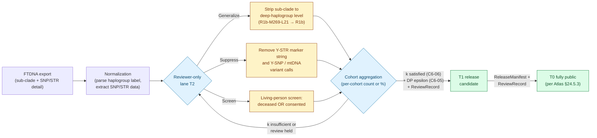
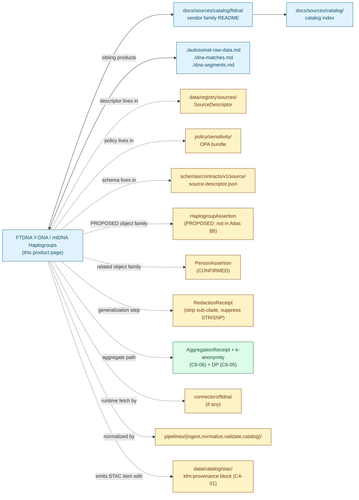

<!-- [KFM_META_BLOCK_V2]
doc_id: kfm://doc/docs-sources-catalog-ftdna-haplogroup-data
title: FTDNA Y-DNA and mtDNA Haplogroups
type: product-page
version: v0.2
status: draft
owners: <PLACEHOLDER — Docs steward + Source steward for ftdna + People/DNA/Land domain steward + Sensitivity reviewer>
created: 2026-05-20
updated: 2026-05-21
policy_label: public
related:
  - docs/sources/catalog/ftdna/README.md
  - docs/sources/catalog/ftdna/autosomal-raw-data.md
  - docs/sources/catalog/ftdna/dna-matches.md
  - docs/sources/catalog/ftdna/dna-segments.md
  - docs/sources/catalog/ftdna/IDENTITY.md
  - docs/sources/catalog/ftdna/RIGHTS-AND-SENSITIVITY-MAP.md
  - docs/sources/catalog/ftdna/_examples/stac-item-example.json
  - docs/sources/catalog/README.md
  - docs/doctrine/directory-rules.md
  - docs/standards/SENSITIVITY_RUBRIC.md
  - docs/runbooks/revocation.md
tags: [kfm, docs, sources, catalog, ftdna, dtc, dna, haplogroup, y-dna, mtdna, people-dna-land, t2, t1-after-generalization]
notes:
  - "PROPOSED product-page scaffold; sibling-link presence verified in Claude Code session."
  - "FTDNA is not named in the KFM corpus (C9-03 names 23andMe, AncestryDNA, MyHeritage); FTDNA is treated as a structurally analogous DTC vendor."
  - "TIER POSTURE IS INFERRED, NOT CONFIRMED: The T2-default/T1-after-generalization rule is not a verbatim row in Atlas §24.5.2 (which directly addresses raw DNA segment data, living-person fields, person-parcel join). It is INFERRED from C9-03 doctrine that ancestry composition vectors are publishable derived data after k-anonymity, and from the consistent KFM redaction-receipt-plus-review-record pattern for sensitive tier transitions."
  - "Haplogroups are not named as a standalone object family in the People/DNA/Land glossary (Atlas §B); a `HaplogroupAssertion` family is PROPOSED here pending ADR."
  - "Type is `product-page` (not `standard`); this file carries the full presentation standard but is intentionally a scaffold, not steady-state."
[/KFM_META_BLOCK_V2] -->

# FTDNA Y-DNA and mtDNA Haplogroups

> Lineage classifications from Y-DNA (paternal-line) and mtDNA (maternal-line) tests. **Reviewer-only at tier T2 by default; T1 release possible after generalization to deep-haplogroup level** *(INFERRED, see §[Tier posture and its evidence basis](#tier-posture-and-its-evidence-basis))*. The first FTDNA product class for which public release is genuinely viable.

<p>
  
  
  
  
  
  
  
  
  
  
  
  
</p>

**Status:** PROPOSED — scaffold only · **Family:** [`ftdna`](./README.md) · **Catalog index:** [`../README.md`](../README.md) · **Sibling products:** [Autosomal Raw](./autosomal-raw-data.md), [DNA Matches](./dna-matches.md), [DNA Segments](./dna-segments.md) · **Last reviewed:** 2026-05-21

> [!IMPORTANT]
> **Haplogroups are the first FTDNA product for which public release at T1 is realistic** — but only after explicit generalization. The opportunity is a Kansas-frontier-genealogy research output (e.g., haplogroup distributions among settler cohorts). The cost is that haplogroup tier doctrine is **INFERRED**, not CONFIRMED — read [Tier posture and its evidence basis](#tier-posture-and-its-evidence-basis) before any admission planning.

---

## Quick Jump

- [Overview](#overview)
- [Tier posture and its evidence basis](#tier-posture-and-its-evidence-basis)
- [Y-DNA vs mtDNA: comparing the two sub-products](#y-dna-vs-mtdna-comparing-the-two-sub-products)
- [Generalization workflow](#generalization-workflow)
- [Catalog relationships](#catalog-relationships)
- [Source authority](#source-authority)
- [Catalog profiles used](#catalog-profiles-used)
- [Collection identity](#collection-identity)
- [Provenance fields](#provenance-fields)
- [Temporal handling](#temporal-handling)
- [Geometry and projection](#geometry-and-projection)
- [Rights and sensitivity](#rights-and-sensitivity)
- [Validation and catalog closure](#validation-and-catalog-closure)
- [Related contracts and schemas](#related-contracts-and-schemas)
- [Related connectors and pipelines](#related-connectors-and-pipelines)
- [Examples](#examples)
- [Open questions](#open-questions)

---

## Overview

This page describes the **FTDNA Y-DNA and mtDNA haplogroup product** — the lineage classification(s) assigned to an uploader's paternal-line (Y-DNA) and/or maternal-line (mtDNA) test results — as a *catalog target*: what it is, which catalog profiles it serves, what the STAC shape looks like, and which gates it crosses. It is a **scaffold**, not a steady-state product page; product-specific operational facts (export-format version, file shape, asset roles, cadence, current endpoint URL, retention window, FTDNA-specific test offerings) are **NEEDS VERIFICATION** until inspected against a real export at admission.

**What it is.** Y-DNA and mtDNA tests assign each tested individual to a haplogroup — a discrete classification of paternal or maternal genetic lineage shared with a large population. Modern haplogroup nomenclature (e.g., R1b, H1, J2a) is a tree with deep root labels (single letters: R, Q, I, J, H, T, U, K, etc.) and progressively finer sub-clades (R1b → R1b-M269 → R1b-M269-L21 → R1b-M269-L21-DF13 → R1b-M269-L21-DF13-L513). **The deeper one descends the tree, the more identifying the assignment becomes** because fewer people share the deeper sub-clade.

**Why this product is materially different from the sibling FTDNA products.**

- **No third-party data.** Unlike DNA Matches and DNA Segments, the haplogroup assignment is about the uploader alone. No HMAC tokenization of third parties is required.
- **T2 default (INFERRED), not T4.** Unlike Autosomal Raw, DNA Matches, and DNA Segments — all of which are T4 by default with no public-release path for the raw asset — haplogroups admit a T2-reviewer-only default and a T1-after-generalization release path. This is the first FTDNA product where public publication is doctrinally viable.
- **Cohort aggregation is research-actionable.** Per-cohort haplogroup distributions (e.g., "haplogroups represented among documented Kansas frontier-era male settlers") are a recognized historical-genealogy research output and would benefit the broader Frontier Matrix work.

**What this page is not.**

- **Not a SourceDescriptor.** See [`data/registry/sources/`](../../../../data/registry/sources/) for the authoritative descriptor.
- **Not a policy.** See [`policy/sensitivity/`](../../../../policy/sensitivity/) and [`RIGHTS-AND-SENSITIVITY-MAP.md`](./RIGHTS-AND-SENSITIVITY-MAP.md).
- **Not a schema.** See [`schemas/contracts/v1/source/`](../../../../schemas/contracts/v1/source/) per ADR-0001.
- **Not an admission decision.** Admission requires a completed SourceDescriptor, rights resolution, sensitivity tagging, consent stack, generalization-rule selection, and reviewer sign-off.

> [!IMPORTANT]
> **PROPOSED scope** *(NEEDS VERIFICATION at admission)*: which FTDNA product lines this page covers (Y-37, Y-67, Y-111, Big Y-700, mtDNA Plus, mtFull Sequence, mtHVR1/HVR2, etc.); cadence; geographic coverage; current endpoint URL; rights status; license terms; retention window; bundled ethnicity / ancestral-origin estimates if any.

[↑ Back to top](#ftdna-y-dna-and-mtdna-haplogroups)

---

## Tier posture and its evidence basis

The opening tier statement (T2 default, T1 after generalization to deep-haplogroup level, suppress STR/SNP detail, living-person screen, RedactionReceipt + ReviewRecord) is **INFERRED doctrine**, not a verbatim row in the corpus. The reviewer's path to confirming or revising this posture is laid out below.

### What the corpus directly says

| Element | Corpus location | Truth label |
|---|---|---|
| **Raw DNA segment data: T4** | Atlas §24.5.2, explicit row | CONFIRMED |
| **Living-person fields: T4** with aggregation-to-tract-or-county → T1 | Atlas §24.5.2, explicit row | CONFIRMED |
| **Private person-parcel join: T4** | Atlas §24.5.2, explicit row | CONFIRMED |
| **Ancestry composition vectors** publishable as derived data **only when k-anonymity satisfied for living individuals** (`C6-06`) and **only under a documented consent scope** | `C9-03` Detailed Explanation, verbatim | CONFIRMED |
| **DP for aggregates** required when aggregate statistics cross the publication boundary | `C9-03` + `C6-05` | CONFIRMED |
| **Tier upgrade always requires** transform receipt **and** review record | Atlas §24.5.3 | CONFIRMED |

### What the corpus does *not* directly say

- The corpus does **not** name "Y-DNA haplogroup" or "mtDNA haplogroup" as an explicit row in Atlas §24.5.2.
- The corpus does **not** define a `HaplogroupAssertion` object family in the People/DNA/Land glossary (Atlas §B lists Person Assertion, PersonCanonical, NameAssertion, LifeEvent, Residence Event, Migration Event, Genealogy Relationship, FamilyGroup, **DNA Match Evidence**, **DNASegment**, **Relationship Hypothesis**, LandParcel — no haplogroup family).
- The corpus does **not** specify the threshold for "deep haplogroup level" — what level of sub-clade detail constitutes a publishable generalization.

### The PROPOSED tier mapping for this product

| Form of haplogroup data | PROPOSED default tier | PROPOSED transforms allowed | PROPOSED gates required | Truth label |
|---|---|---|---|---|
| Sub-clade assignment with SNP / STR detail (e.g., R1b-M269-L21-DF13-L513 + 67-marker Y-STR string) | **T2 — Reviewer** | Suppress STR / SNP detail; living-person screen; generalize to deep haplogroup | RedactionReceipt + ReviewRecord | PROPOSED (INFERRED from `C9-03` derived-data rule) |
| Deep haplogroup label only (e.g., R1b, H, J) | **T1 — Generalized** *(candidate)* | Cohort-level aggregation; k-anonymity (`C6-06`) check on cohort | AggregationReceipt + ReviewRecord | PROPOSED (INFERRED) |
| Cohort haplogroup distribution (aggregate count or percentage by named cohort) | **T1 — Generalized** | DP epsilon (`C6-05`) on counts; cohort size satisfies `k` threshold | AggregationReceipt + ReviewRecord | PROPOSED (INFERRED, mirrors C9-03 ancestry-composition rule) |
| Cohort haplogroup distribution at T0 (fully public) | T1 → T0 transition | ReleaseManifest + ReviewRecord | Per Atlas §24.5.3 T1 → T0 transition rule | INFERRED |

> [!CAUTION]
> **This tier posture must be ratified before any FTDNA haplogroup data is admitted.** The right path is an ADR that either (a) confirms the PROPOSED mapping above, (b) modifies it, or (c) declines the product class entirely. Reviewer guidance for the ADR: the haplogroup case is materially closer to the corpus's "ancestry composition vectors" doctrine than to its "raw DNA segment data" doctrine, but reasonable people could read the precedent either way.

[↑ Back to top](#ftdna-y-dna-and-mtdna-haplogroups)

---

## Y-DNA vs mtDNA: comparing the two sub-products

This single product page covers two distinct FTDNA test families. Where they share defaults, they share gates; where they diverge, the gate behavior diverges.

| Aspect | Y-DNA | mtDNA |
|---|---|---|
| Inheritance pattern | Father → son only | Mother → all children |
| Whose haplogroup it identifies | Uploader's paternal-line ancestor | Uploader's maternal-line ancestor |
| Sex disclosure of data subject | **Yes** — presence of Y-DNA data implies the data subject was assigned-male-at-birth (PROPOSED inference) | No |
| Common test offerings (FTDNA) | Y-12, Y-25, Y-37, Y-67, Y-111, Big Y-700 *(presence and naming NEEDS VERIFICATION)* | mtHVR1, mtHVR2 (HVR1+HVR2), mtFull Sequence (FMS) *(presence and naming NEEDS VERIFICATION)* |
| Granularity range | Deep haplogroup (R) → sub-clade (R1b) → terminal SNP (R1b-M269-L21-DF13-L513) | Deep haplogroup (H) → sub-clade (H1a1) → coding-region variant |
| Identifying STR / sequence detail | Y-STR marker string at the test's marker count | mtDNA sequence variant calls; coding-region detail most identifying |
| Living-person screen at admission | Required *(PROPOSED)* | Required *(PROPOSED)* |
| Sex-disclosure mitigation | Generalization to top-level haplogroup is sufficient *(PROPOSED — the top-level Y-DNA letter still implies male assignment)*; flag for sensitivity reviewer when data subject is living | n/a |

> [!NOTE]
> Treating Y-DNA and mtDNA as a single product page (rather than two) is a **PROPOSED** scoping choice — see [Open questions](#open-questions). The argument for one page: shared default tier, shared generalization workflow, shared release path. The argument for two: Y-DNA has the sex-disclosure complication that mtDNA does not.

[↑ Back to top](#ftdna-y-dna-and-mtdna-haplogroups)

---

## Generalization workflow

The technical core of this product is **generalization to deep-haplogroup level**, which is the precondition for the T2 → T1 transition.



> [!NOTE]
> Diagram structure follows Atlas §24.5.3 tier-transition rule (CONFIRMED: paired transform receipt + review record required for every upgrade). Specific transforms (sub-clade stripping, marker suppression, living-person screen) are **PROPOSED** as the canonical generalization workflow; their threshold values (what counts as "deep haplogroup level," what `k` value satisfies the cohort threshold, what DP epsilon) are **NEEDS VERIFICATION** via ADR.

### PROPOSED generalization rules

| Rule | PROPOSED value | Source / rationale |
|---|---|---|
| Deep-haplogroup level for Y-DNA | Single-letter or letter+digit *(e.g., `R`, `R1`, `R1a`, `R1b`)*; **stop at the second level for most major haplogroups** | INFERRED from common phylogenetic practice; NEEDS VERIFICATION via ADR |
| Deep-haplogroup level for mtDNA | Single-letter or letter+digit *(e.g., `H`, `H1`, `J1`)*; **stop at the second level** | INFERRED; NEEDS VERIFICATION |
| Y-STR marker string in any release-class derivative | **Suppress entirely** | PROPOSED, mirrors `C9-03` raw-genotype suppression posture |
| Y-SNP terminal-marker name in any release-class derivative | **Suppress entirely** | PROPOSED |
| mtDNA coding-region variant calls | **Suppress entirely** | PROPOSED |
| mtDNA HVR1 / HVR2 variant calls | **Suppress entirely in T1**; T2 reviewer lane may retain for research | PROPOSED |
| Living-person screen at admission | Required; data subject deceased OR consented to T2 review-only | PROPOSED, mirrors Atlas §24.5.2 living-person-fields rule |
| Cohort `k` threshold for T1 release | `k ≥ <NEEDS VERIFICATION>` — corpus does not finalize a per-class threshold | PROPOSED, per `C6-06` "Per-class k thresholds" expansion direction |
| DP epsilon on cohort counts | `epsilon ≤ <NEEDS VERIFICATION>` — corpus does not finalize a default epsilon table | PROPOSED, per `C6-05` "Default epsilon table" expansion direction |

[↑ Back to top](#ftdna-y-dna-and-mtdna-haplogroups)

---

## Catalog relationships



> [!NOTE]
> Unlike the match-list and segment Mermaid diagrams in the sibling pages, **no node is highlighted red here** — there is no third-party data exposure for haplogroups. The aggregate node is highlighted green because, unlike sibling products, the aggregate path is a realistic public-publication route for this product.

[↑ Back to top](#ftdna-y-dna-and-mtdna-haplogroups)

---

## Source authority

See [`data/registry/sources/`](../../../../data/registry/sources/) for the authoritative `SourceDescriptor`. **Do not duplicate descriptor fields here.**

| Cross-reference | Path *(PROPOSED unless stated)* | Authority |
|---|---|---|
| SourceDescriptor (machine) | `data/registry/sources/ftdna/...` | **Canonical** (Directory Rules §13.1) |
| SourceDescriptor schema | `schemas/contracts/v1/source/source-descriptor.json` | **Canonical** per ADR-0001 |
| Source steward register | `control_plane/source_authority_register.yaml` | **PROPOSED** |
| Vendor README | [`./README.md`](./README.md) | Sibling — INFERRED present |
| Sibling product pages | [`./autosomal-raw-data.md`](./autosomal-raw-data.md), [`./dna-matches.md`](./dna-matches.md), [`./dna-segments.md`](./dna-segments.md) | Sibling — INFERRED present |
| Catalog README | [`../README.md`](../README.md) | Parent — INFERRED present |

> [!NOTE]
> **PROPOSED `source_role`** at admission: `candidate`. The vendor's haplogroup *assignment* is a vendor-computed inference (their phylogenetic tree + algorithm + reference panel), so post-promotion the role should be `modeled` (Atlas §24.1.3 enum) with `role_model_run_ref` pointing at the vendor's haplogroup-assignment algorithm version — **never** `observed`. Cohort-aggregate derivatives admit `source_role: aggregate` with `role_aggregation_unit` per §24.1.3.

[↑ Back to top](#ftdna-y-dna-and-mtdna-haplogroups)

---

## Catalog profiles used

Per Pass-10 `C4` (CONFIRMED doctrine), every promoted dataset must have a STAC Item or Collection, a DCAT entry, and a PROV record, with the evidence-bundle JSON-LD attached as a content-addressed asset.

| Profile | Lane *(PROPOSED paths per Directory Rules §13.1)* | Used by this product? | Truth label |
|---|---|---|---|
| **STAC** (with `kfm:provenance`, `C4-01`) | `data/catalog/stac/people-dna-land/ftdna/haplogroups/...` | **PROPOSED — Yes (reviewer lane)** | Item shape grounded in `C4-01` (CONFIRMED); per-product item presence NEEDS VERIFICATION |
| **DCAT** (`C4-05`) | `data/catalog/dcat/people-dna-land/...` | PROPOSED — Yes / No (NEEDS VERIFICATION) | Required for catalog-level discoverability |
| **PROV-O** | `data/catalog/prov/...` | PROPOSED — Yes / No (NEEDS VERIFICATION) | Required for lineage projection — important here because haplogroups are vendor-computed inferences whose assignment algorithm version matters |
| **Domain projection** | `data/catalog/domain/people-dna-land/...` | PROPOSED — Yes / No (NEEDS VERIFICATION) | Per `KFM-P1-IDEA-0069` "domain lanes as proof-bearing slices" |
| **Aggregate-derivative STAC** *(this is the public-facing lane)* | `data/catalog/stac/people-dna-land/aggregates/...` | **PROPOSED — Yes (T1 / T0 path)** | The recommended public lane; requires AggregationReceipt + k-anonymity + DP + ReviewRecord |
| **CARE extension** (`kfm:care`, `C15-02`) | (extension namespace in DCAT / STAC) | **PROPOSED — TBD** | Applicability depends on consent posture and on whether the haplogroup is being used to make ancestry / kinship-with-tribal-nations claims; flag for review |

> [!IMPORTANT]
> **Unlike the sibling FTDNA products, the public lane is the aggregate-derivative lane.** Individual reviewer-lane items remain T2 — useful for research review but not for public publication. The expected public output is per-cohort haplogroup distribution.

[↑ Back to top](#ftdna-y-dna-and-mtdna-haplogroups)

---

## Collection identity

- **PROPOSED Collection id pattern (reviewer lane):** `kfm-ftdna-haplogroups` (vendor-product slug; see [`./IDENTITY.md`](./IDENTITY.md) for the canonical pattern).
- **PROPOSED Collection id pattern (aggregate lane):** `kfm-ftdna-haplogroups-agg`.
- **PROPOSED namespace:** `kfm:` *(see OPEN-DSC-03 — the `kfm:` vs `ks-kfm:` choice remains open per `C4-01` open question, CONFIRMED).*
- **PROPOSED Y-DNA vs mtDNA split:** *if* an ADR resolves OPEN-HG-04 in favor of two pages, two Collections would follow: `kfm-ftdna-y-haplogroups{,-agg}` and `kfm-ftdna-mt-haplogroups{,-agg}`.
- **Asset roles:** NEEDS VERIFICATION — confirm against [`schemas/contracts/v1/source/`](../../../../schemas/contracts/v1/source/). At minimum: `data` (the per-subject haplogroup record), `metadata` (any vendor-supplied sidecar including assignment-algorithm version), `checksum` (per-asset `file:checksum`).

[↑ Back to top](#ftdna-y-dna-and-mtdna-haplogroups)

---

## Provenance fields

STAC `properties.kfm:provenance` block (CONFIRMED shape per `C4-01`; PROPOSED for FTDNA haplogroups scope):

| Field | Type | Purpose |
|---|---|---|
| `spec_hash` | string (sha256) | Canonical-record hash via JCS (RFC 8785); identity of this record |
| `evidence_bundle_ref` | `kfm://evidence/<digest>` | Resolves to the JSON-LD EvidenceBundle for this item (CONFIRMED `C4-04`) |
| `run_record_ref` | `kfm://run/<run-id>` | Points at the RunReceipt that produced this item |
| `audit_ref` | `kfm://audit/<attestation-id>` | SLSA / OPA attestation pointer |
| `policy_digest` | string (sha256) | Hash of the policy bundle in force at promotion |

**Per-asset integrity** (CONFIRMED `C4-01`): `file:checksum` on every asset (STAC file extension).

**Haplogroup-specific optional fields** *(PROPOSED)*:

- `kfm:source_role` — `candidate` at admission; post-promotion `modeled` or `aggregate` (Atlas §24.1.3).
- `kfm:object_family` — `HaplogroupAssertion` *(PROPOSED new object family; not in Atlas §B — see OPEN-HG-01).*
- `kfm:haplogroup_type` — `y-dna` | `mtdna` (PROPOSED enum).
- `kfm:haplogroup_label` *(reviewer items)* | `kfm:haplogroup_generalized_label` *(release items)* — the actual label, e.g., `R1b-M269-L21` (T2 only) or `R1b` (T1 generalized).
- `kfm:generalization_level` — one of `none-reviewer-only` | `deep-haplogroup` (PROPOSED enum; mirrors the `coordinate_redaction_class` pattern from segments).
- `kfm:str_snp_suppressed` *(boolean, MUST be `true` for any release-class derivative)* — assertion that Y-STR marker strings, Y-SNP terminal-marker names, and mtDNA variant calls have been suppressed.
- `kfm:living_person_screen` *(boolean, MUST be `true` for any release-class derivative)* — assertion that the living-person screen has been applied.
- `kfm:assignment_algorithm_ref` *(when source_role = `modeled`)* — points at a ModelRunReceipt for the vendor's haplogroup-assignment algorithm version, per Atlas §24.1.3 `role_model_run_ref` (PROPOSED).
- `kfm:reference_tree_version` — e.g., ISOGG Y-tree version, PhyloTree mt-tree version *(PROPOSED — NEEDS VERIFICATION of FTDNA's reference tree publication policy).*
- `kfm:export_format_version` — vendor export format version pinned per `C9-03` expansion direction.
- `kfm:k_anonymity_k` *(aggregate items only)* — `k` value satisfied (`C6-06`).
- `kfm:dp_epsilon` *(aggregate items only)* — DP epsilon used (`C6-05`).
- `kfm:cohort_definition_ref` *(aggregate items only)* — opaque reference to the cohort definition (e.g., "documented Kansas frontier-era male settlers, 1854–1890") that defines what is being aggregated.

> [!IMPORTANT]
> **EvidenceRef must resolve and required assertions must be `true`.** A release-class STAC item where `kfm:str_snp_suppressed`, `kfm:living_person_screen`, or `kfm:generalization_level: deep-haplogroup` are not asserted is a **catalog-closure failure** per `KFM-P1-IDEA-0020` (CONFIRMED); promotion fails closed.

[↑ Back to top](#ftdna-y-dna-and-mtdna-haplogroups)

---

## Temporal handling

PROPOSED — distinct **source / observed / valid / retrieval / release / correction** times where material (Atlas §E temporal-handling rule, **CONFIRMED**).

| Time concept | Likely value for this product | Truth label |
|---|---|---|
| Source time | Vendor's haplogroup-assignment-algorithm run timestamp | PROPOSED — vendor-dependent; NEEDS VERIFICATION |
| Observed time | n/a (haplogroup is a vendor-computed inference, not an observed event) | INFERRED |
| Valid time | Bounded by the vendor's phylogenetic-tree version and assignment-algorithm version — a label can change retroactively when the reference tree is updated (e.g., ISOGG annual updates) | INFERRED |
| Retrieval time | Timestamp of the user-initiated export | PROPOSED |
| Release time | Timestamp of the aggregate derivative crossing the publication boundary | PROPOSED |
| Correction time | Timestamp of any post-release correction (e.g., reference-tree update reassigns the cohort distribution) | PROPOSED |

> [!NOTE]
> **Haplogroup labels age with the phylogenetic tree.** When the vendor or community (ISOGG, PhyloTree) revises the reference tree, prior haplogroup labels can change name without the data subject changing. The catalog MUST capture the reference-tree version in `kfm:reference_tree_version`; corrections must trigger a `CorrectionNotice` per Atlas §24.6.1.

[↑ Back to top](#ftdna-y-dna-and-mtdna-haplogroups)

---

## Geometry and projection

PROPOSED — haplogroup data **has no inherent geographic geometry**, though haplogroups are often correlated with geographic populations for interpretive purposes. Any geographic projection of a haplogroup distribution (e.g., a Kansas county map of dominant Y-DNA haplogroups among settlers) is a **separate visualization object** built from the aggregate derivative; the projection itself is not part of the haplogroup payload.

| Concern | Default for this product | Truth label |
|---|---|---|
| Geographic CRS | n/a on the raw asset; may apply to aggregate visualizations | INFERRED |
| `proj:code` / `proj:bbox` / `proj:geometry` | **Absent on the raw item**; **present** on geographic-aggregate-derivative items per `KFM-P27-FEAT-0003` STAC Projection lint | NEEDS VERIFICATION |
| Generalization rules (haplogroup label) | See [Generalization workflow](#generalization-workflow) | PROPOSED |
| Generalization rules (cohort geography) | Coarse aggregation per `C6-04` grid generalization (county / state / decade) | PROPOSED |
| Living-person-residence join | **Denied by default** — never join the haplogroup label of a living person to a precise residence | CONFIRMED doctrine via Atlas §24.5.2 |

[↑ Back to top](#ftdna-y-dna-and-mtdna-haplogroups)

---

## Rights and sensitivity

NEEDS VERIFICATION — see [`policy/sensitivity/`](../../../../policy/sensitivity/) and [`./RIGHTS-AND-SENSITIVITY-MAP.md`](./RIGHTS-AND-SENSITIVITY-MAP.md). **Do not restate policy here.**

| Concern | Default for this product | Citation |
|---|---|---|
| Sensitivity tier (raw with sub-clade + STR/SNP detail) | **T2 — Reviewer** *(PROPOSED, INFERRED from C9-03 derived-data doctrine)* | INFERRED |
| Sensitivity tier (deep haplogroup, suppressed detail, living-person screen passed) | **T1 — Generalized** *(PROPOSED, INFERRED)* | INFERRED |
| Sensitivity tier (cohort aggregate with k-anonymity + DP) | **T1 → T0 candidate** *(PROPOSED, INFERRED, mirrors C9-03 ancestry-composition rule)* | INFERRED |
| Allowed transforms to T1 | Generalize sub-clade to deep-haplogroup level; suppress STR / SNP / variant-call detail; living-person screen | PROPOSED |
| Allowed transforms to T0 | Cohort aggregation with k-anonymity (`C6-06`) + DP (`C6-05`) + ReleaseManifest + ReviewRecord | INFERRED |
| Consent model (uploader) | User-controlled export + GA4GH DUO-coded consent receipt | CONFIRMED `C6-07` + `C9-04` |
| Consent model (third parties / matches) | **Not applicable** — haplogroup data is about the uploader only | INFERRED |
| Sex disclosure (Y-DNA only) | Presence of Y-DNA data implies the data subject was assigned-male-at-birth; flag for sensitivity reviewer when data subject is living and has not disclosed sex elsewhere | PROPOSED inference |
| Tribal / sovereign-data interaction | Haplogroup statements that could imply tribal or sovereign-nation affiliation **MUST be reviewed by the rights-holder representative** per the cross-domain archaeology / sovereignty-review rule | INFERRED from Atlas §24.5.2 archaeology row + Doctrine Synthesis CARE posture |
| Revocation model | Tombstone (`C5-09`) + cache invalidation (`C6-08`) | CONFIRMED |
| Vendor-risk watchlist | Yes — FTDNA on watchlist by analogy with `C9-07` | INFERRED |
| CARE applicability | Open — see `RIGHTS-AND-SENSITIVITY-MAP.md`. **CARE is most likely to apply here among the four FTDNA products** because haplogroup distributions can be used to make population-origin claims with sovereignty implications | NEEDS VERIFICATION (`C15-01`) |

> [!CAUTION]
> **No tier upgrade without paired artifacts.** Atlas §24.5.3 (CONFIRMED): a tier upgrade always requires a transform receipt **and** a ReviewRecord. For the T2 → T1 step, paired artifacts MUST be **RedactionReceipt (generalization + suppression) + ReviewRecord**. For the T1 → T0 step on aggregates, paired artifacts MUST be **AggregationReceipt + ReleaseManifest + ReviewRecord**.

> [!CAUTION]
> **Haplogroups are misread as ancestry more readily than other DNA data.** Public consumers often interpret "your maternal-line haplogroup is H" as a population-origin statement ("you are European"), which conflates haplogroup with ancestry composition. Any KFM publication of haplogroup data MUST be paired with explanatory language that distinguishes lineage from ancestry — the `AIReceipt` discipline (cite-or-abstain, no fluent-text-as-evidence) applies with extra force here.

[↑ Back to top](#ftdna-y-dna-and-mtdna-haplogroups)

---

## Validation and catalog closure

Catalog closure is the final discoverability and accountability gate before publication (`KFM-P1-IDEA-0020`, CONFIRMED). The checks below apply specifically to STAC items emitted for this product.

- **Catalog closure** before public release (`KFM-P1-IDEA-0020`, CONFIRMED). PROPOSED for FTDNA scope; requires EvidenceRef resolution, source-role check, policy-decision capture, ReleaseManifest pointer, and rollback target.
- **Generalization gate** *(PROPOSED, this product)*. The validator MUST reject any release-class item where `kfm:generalization_level` is `none-reviewer-only` outside the explicit reviewer lane.
- **STR / SNP suppression gate** *(PROPOSED, this product)*. The validator MUST verify `kfm:str_snp_suppressed: true` and confirm no Y-STR marker string, Y-SNP terminal name, mtDNA HVR / coding variant call appears anywhere in the item assets, properties, or Evidence Drawer payload.
- **Living-person screen gate** *(PROPOSED, this product)*. The validator MUST verify `kfm:living_person_screen: true` with paired evidence (deceased-status assertion in the EvidenceBundle, OR consent receipt with DUO scope permitting T2 review).
- **k-anonymity / DP gate** *(PROPOSED, aggregate items only)*. AggregationReceipt MUST record the `k` value (`C6-06`) and DP epsilon (`C6-05`); both CONFIRMED doctrine.
- **STAC Projection lint** (`KFM-P27-FEAT-0003`, CONFIRMED). PROPOSED — for reviewer / per-subject items the lint should expect absent geographic projection fields; for geographic-aggregate visualizations the lint applies normally.
- **STAC checksum closure** against the ReleaseManifest digest (`KFM-P22-PROG-0037`, CONFIRMED). PROPOSED.
- **No-style-only-hiding** check (Doctrine Synthesis §30, CONFIRMED). PROPOSED.
- **Reference-tree-drift audit** *(PROPOSED, this product)*. Periodic check that the published `kfm:reference_tree_version` matches the current vendor / community tree; mismatches trigger `CorrectionNotice` per Atlas §24.6.1.
- **Ancestry-conflation audit at AI surface** *(PROPOSED, this product)*. Any Focus Mode / Evidence Drawer surface that displays haplogroup data MUST be reviewed for ancestry-as-haplogroup misreading, per the `AIReceipt` cite-or-abstain rule.
- **TOS-watcher freshness** (`KFM-P19-PROG-0024`, CONFIRMED carry-forward). PROPOSED.

> [!NOTE]
> Unlike the match-list and segment product pages, **no HMAC tokenization gate is required** for haplogroup data — there are no third-party identifiers to tokenize. This is the structural reason the product can reach T1 / T0 at all.

[↑ Back to top](#ftdna-y-dna-and-mtdna-haplogroups)

---

## Related contracts and schemas

- [`contracts/source/`](../../../../contracts/source/) — semantic meaning for source-class objects (NEEDS VERIFICATION; Directory Rules §6.3, CONFIRMED authority).
- [`contracts/people-dna-land/`](../../../../contracts/people-dna-land/) — domain contracts including the existing People/DNA/Land glossary (Person Assertion, NameAssertion, etc.); PROPOSED addition: `HaplogroupAssertion`. CONFIRMED authority of `contracts/`; file presence and HaplogroupAssertion entry NEEDS VERIFICATION.
- [`schemas/contracts/v1/source/source-descriptor.json`](../../../../schemas/contracts/v1/source/source-descriptor.json) — machine shape per ADR-0001 (NEEDS VERIFICATION).
- [`schemas/contracts/v1/people-dna-land/haplogroup-assertion.schema.json`](../../../../schemas/contracts/v1/people-dna-land/haplogroup-assertion.schema.json) — **PROPOSED new schema**; presence NEEDS VERIFICATION; ADR required to add the object family.
- [`schemas/contracts/v1/receipts/`](../../../../schemas/contracts/v1/receipts/) — receipt schemas (RawCaptureReceipt, TransformReceipt, RedactionReceipt, AggregationReceipt, ReleaseManifest, ModelRunReceipt) — PROPOSED per Atlas §24.2.1.
- [`schemas/contracts/v1/evidence/evidence_bundle.schema.json`](../../../../schemas/contracts/v1/evidence/evidence_bundle.schema.json) — PROPOSED per `KFM-P26-PROG-0004`.

[↑ Back to top](#ftdna-y-dna-and-mtdna-haplogroups)

---

## Related connectors and pipelines

- [`connectors/ftdna/`](../../../../connectors/ftdna/) — source-specific fetch / admission logic (Directory Rules §7.3, CONFIRMED).
  - **Posture:** PROPOSED quarantine-only intake. The connector MUST capture the vendor's reference-tree version and assignment-algorithm version into the run receipt before the payload reaches any non-quarantine lane.
- [`pipelines/ingest/`](../../../../pipelines/ingest/), [`pipelines/normalize/`](../../../../pipelines/normalize/), [`pipelines/validate/`](../../../../pipelines/validate/), [`pipelines/catalog/`](../../../../pipelines/catalog/) — lifecycle phase pipelines (Directory Rules §7.4, CONFIRMED).
- [`pipeline_specs/people-dna-land/`](../../../../pipeline_specs/people-dna-land/) — declarative specs for the People/DNA/Land domain lane (Directory Rules §13.1, CONFIRMED).

[↑ Back to top](#ftdna-y-dna-and-mtdna-haplogroups)

---

## Examples

*Illustrative only — do not treat as authoritative. Field values are placeholders.*

See [`./_examples/stac-item-example.json`](./_examples/stac-item-example.json) for the canonical minimal shape. Two fragments below: the **reviewer-only T2** item with full sub-clade detail, and the **T1 cohort-aggregate** item — the recommended public publication form for this product.

<details>
<summary><strong>Minimal STAC Item <code>properties</code> fragment — reviewer-only T2 (per-subject, full sub-clade, click to expand)</strong></summary>

```json
{
  "type": "Feature",
  "stac_version": "1.0.0",
  "id": "<TBD-item-id>",
  "collection": "kfm-ftdna-haplogroups",
  "properties": {
    "datetime": "<source_time-or-retrieval_time>",
    "kfm:source_role": "modeled",
    "kfm:object_family": "HaplogroupAssertion",
    "kfm:haplogroup_type": "y-dna",
    "kfm:haplogroup_label": "<vendor-assigned sub-clade, e.g., R1b-M269-L21-DF13-L513>",
    "kfm:generalization_level": "none-reviewer-only",
    "kfm:str_snp_suppressed": false,
    "kfm:living_person_screen": true,
    "kfm:assignment_algorithm_ref": "kfm://model-run/<run-id>",
    "kfm:reference_tree_version": "<e.g., ISOGG-2024.x>",
    "kfm:export_format_version": "<NEEDS VERIFICATION at admission>",
    "kfm:provenance": {
      "spec_hash": "sha256:<TBD>",
      "evidence_bundle_ref": "kfm://evidence/<digest>",
      "run_record_ref": "kfm://run/<run-id>",
      "audit_ref": "kfm://audit/<attestation-id>",
      "policy_digest": "sha256:<TBD>"
    }
  },
  "assets": {
    "data": {
      "href": "<NON-PUBLIC reviewer-only URI to per-subject haplogroup record>",
      "type": "application/json",
      "roles": ["data"],
      "file:checksum": "1220<sha256-bytes>"
    }
  }
}
```

</details>

<details>
<summary><strong>Minimal STAC Item <code>properties</code> fragment — T1 cohort aggregate (recommended public form, click to expand)</strong></summary>

```json
{
  "type": "Feature",
  "stac_version": "1.0.0",
  "id": "<TBD-aggregate-item-id>",
  "collection": "kfm-ftdna-haplogroups-agg",
  "properties": {
    "datetime": "<aggregation_release_time>",
    "kfm:source_role": "aggregate",
    "kfm:object_family": "HaplogroupAssertion",
    "kfm:haplogroup_type": "y-dna",
    "kfm:generalization_level": "deep-haplogroup",
    "kfm:str_snp_suppressed": true,
    "kfm:living_person_screen": true,
    "kfm:cohort_definition_ref": "kfm://cohort/<opaque-ref to e.g., 'documented-ks-frontier-male-settlers-1854-1890'>",
    "kfm:k_anonymity_k": "<k-value-as-integer; NEEDS VERIFICATION against C6-06 default>",
    "kfm:dp_epsilon": "<epsilon-as-float; NEEDS VERIFICATION against C6-05 default>",
    "kfm:aggregation_unit": "cohort",
    "kfm:reference_tree_version": "<e.g., ISOGG-2024.x>",
    "kfm:provenance": {
      "spec_hash": "sha256:<TBD>",
      "evidence_bundle_ref": "kfm://evidence/<digest>",
      "run_record_ref": "kfm://run/<run-id>",
      "audit_ref": "kfm://audit/<attestation-id>",
      "policy_digest": "sha256:<TBD>"
    }
  },
  "assets": {
    "data": {
      "href": "<governed-API-URI for the cohort haplogroup distribution>",
      "type": "application/json",
      "roles": ["data"],
      "file:checksum": "1220<sha256-bytes>"
    }
  }
}
```

</details>

> [!NOTE]
> The reviewer-only item carries `kfm:str_snp_suppressed: false` and `kfm:generalization_level: none-reviewer-only` — both values are only valid in the reviewer lane and are rejected by the validator outside it. The aggregate item asserts `deep-haplogroup`, `str_snp_suppressed: true`, and a `cohort_definition_ref` that names the cohort being aggregated. Shapes PROPOSED; NEEDS VERIFICATION against the mounted STAC linter.

[↑ Back to top](#ftdna-y-dna-and-mtdna-haplogroups)

---

## Open questions

- **OPEN-DSC-03** — `kfm:` vs `ks-kfm:` namespace choice. CONFIRMED open per `C4-01`.
- **OPEN-HG-01** *(new)* — **`HaplogroupAssertion` as a new object family.** Atlas §B does not list a haplogroup family. Options: (a) add `HaplogroupAssertion` to the People/DNA/Land glossary via ADR; (b) model haplogroup as a specialization of `PersonAssertion` (the assertion *that* a person belongs to haplogroup X); (c) decline to model haplogroups in KFM at all.
- **OPEN-HG-02** *(new)* — **Tier mapping ratification.** The T2-default / T1-after-generalization posture is INFERRED, not corpus-verbatim. Resolve via ADR; reviewer guidance for the ADR is in [Tier posture and its evidence basis](#tier-posture-and-its-evidence-basis).
- **OPEN-HG-03** *(new)* — **Deep-haplogroup threshold.** What level of sub-clade is "deep enough" for T1 release? Single letter (`R`)? Letter + first digit + first lowercase (`R1b`)? Different thresholds for major haplogroups? Resolve via ADR informed by phylogenetic-tree subgroup populations.
- **OPEN-HG-04** *(new)* — **Y-DNA vs mtDNA: one page or two?** The scaffold currently treats both as a single product. Y-DNA has a sex-disclosure complication that mtDNA does not. Resolve via ADR.
- **OPEN-HG-05** *(new)* — **Sex-disclosure mitigation for Y-DNA.** Even at top-level haplogroup, Y-DNA presence implies the data subject was assigned-male-at-birth. For living data subjects who have not publicly disclosed sex, is the T1 generalized haplogroup still publishable, or does Y-DNA always require a stricter living-person screen than mtDNA?
- **OPEN-HG-06** *(new)* — **Reference-tree-version stability.** ISOGG, FTDNA's internal tree, and PhyloTree mt revise haplogroup names periodically. How does KFM record the binding between a published haplogroup label and the tree version that produced it? Resolve in `kfm:reference_tree_version` semantics.
- **OPEN-HG-07** *(new)* — **Ethnicity / ancestral-origin bundling.** Some FTDNA products bundle haplogroup with ethnicity / ancestral-origin estimates. Does this product page cover bundled ethnicity, or does that go in a separate `ethnicity-estimates.md` product page? Recommend separate page because the corpus's "ancestry composition vectors" rule (`C9-03`) is more direct for ethnicity than for haplogroup.
- **OPEN-HG-08** *(new)* — **Tribal-nation / CARE interaction.** Haplogroup distributions are sometimes used to support or contest claims of descent from specific populations, including Tribal Nations. The corpus's archaeology / sovereignty-review rule (Atlas §24.5.2) should apply by analogy. Resolve via ADR with rights-holder-representative consultation.
- **Cadence and current endpoint URL.** OPEN — vendor-dependent.
- **k and epsilon defaults.** OPEN — `C6-06` "Per-class k thresholds" expansion direction calls for finalization; same for `C6-05` epsilon table.
- **Retention window.** OPEN — solvent-vs-distressed retention is a `C9-03` open question.
- **TOS-watcher coverage.** OPEN — confirm FTDNA on `KFM-P19-PROG-0024` target list.

[↑ Back to top](#ftdna-y-dna-and-mtdna-haplogroups)

---

## Related docs

- [`./README.md`](./README.md) — FTDNA vendor family README
- [`./autosomal-raw-data.md`](./autosomal-raw-data.md) — sibling product (autosomal raw genotype)
- [`./dna-matches.md`](./dna-matches.md) — sibling product (kit-to-kit match list)
- [`./dna-segments.md`](./dna-segments.md) — sibling product (IBD segment data)
- [`./IDENTITY.md`](./IDENTITY.md) — collection-id pattern and namespace doctrine
- [`./RIGHTS-AND-SENSITIVITY-MAP.md`](./RIGHTS-AND-SENSITIVITY-MAP.md) — product-by-product rights and sensitivity map
- [`./_examples/stac-item-example.json`](./_examples/stac-item-example.json) — canonical minimal STAC shape
- [`../README.md`](../README.md) — catalog index
- [`../../../doctrine/directory-rules.md`](../../../doctrine/directory-rules.md) — placement and lifecycle invariants
- [`../../../standards/SENSITIVITY_RUBRIC.md`](../../../standards/SENSITIVITY_RUBRIC.md) — `C6-01` 0–5 rubric *(PROPOSED in corpus; not yet authored)*
- [`../../../runbooks/revocation.md`](../../../runbooks/revocation.md) — tombstone + embargo + cache-invalidation runbook *(PROPOSED — referenced in `C5-09` / `C6-08`)*

---

<sub>Last updated: 2026-05-21 *(Claude Code product-page scaffold session).* · Status: PROPOSED scaffold (v0.2) · Owners: <PLACEHOLDER — Docs steward + Source steward for ftdna + People/DNA/Land domain steward + Sensitivity reviewer></sub>

<p align="right"><a href="#ftdna-y-dna-and-mtdna-haplogroups">↑ Back to top</a></p>
