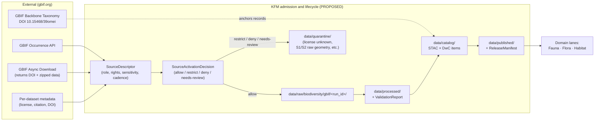
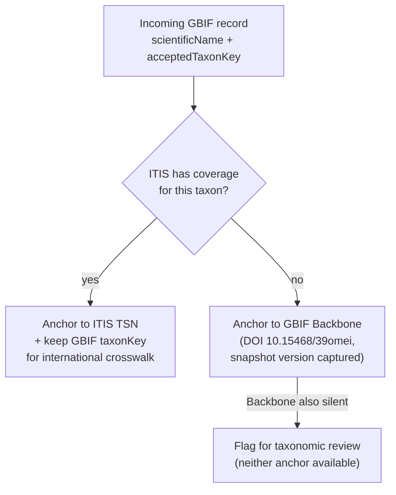

<!-- [KFM_META_BLOCK_V2]
doc_id: kfm://doc/source-catalog/gbif
title: GBIF — Global Biodiversity Information Facility (KFM Source Catalog Entry)
type: standard
version: v0.2
status: draft
owners: [TODO: biodiversity-lane steward], [TODO: source registry owner], [TODO: sensitivity reviewer], docs steward
created: 2026-05-13
updated: 2026-05-21
policy_label: public
related:
  - docs/doctrine/directory-rules.md
  - docs/sources/SOURCE_DESCRIPTOR_STANDARD.md         # PROPOSED — see §11
  - docs/sources/catalog/README.md                     # PROPOSED — see §11
  - docs/sources/catalog/ftdna.md                      # Sibling source-catalog entry (PROPOSED path)
  - docs/domains/fauna/                                # PROPOSED — CONFIRMED domain in Atlas Part 1
  - docs/domains/flora/                                # PROPOSED — CONFIRMED domain in Atlas Part 1
  - docs/domains/habitat/                              # PROPOSED — CONFIRMED domain in Atlas Part 1
  - schemas/contracts/v1/source/source-descriptor.json # PROPOSED per ADR-0001
  - schemas/contracts/v1/fauna/occurrence-evidence.schema.json  # PROPOSED — CONFIRMED object family
  - control_plane/source_authority_register.yaml       # PROPOSED
  - policy/sensitivity/                                # PROPOSED
  - policy/rights/                                     # PROPOSED
tags: [kfm, source, biodiversity, gbif, taxonomy, dwc, stac, fauna, flora, habitat]
notes:
  - "Repository is not mounted in this session; all repo-state-shaped claims are PROPOSED or NEEDS VERIFICATION."
  - "GBIF as canonical aggregated biodiversity authority is CONFIRMED per KFM-P2-IDEA-0018 and C10-06."
  - "Source role assignments below are doctrinal defaults; final values are set at admission per SourceDescriptor."
  - "v0.2 corrections from v0.1: (1) replaced spurious C10-12 reference with C10-06 (where EBD restricted-use actually lives); (2) corrected sibling-README link from `../README.md` to `./README.md`; (3) added Domain consumer map (§3.1) tying CONFIRMED Fauna/Flora object families to GBIF inputs; (4) tightened several PROPOSED → CONFIRMED truth labels where the corpus directly supports them; (5) refined source-role badge from misleading single-value claim to multi-value-by-artifact."
[/KFM_META_BLOCK_V2] -->

# GBIF — Global Biodiversity Information Facility

> KFM source catalog entry — international biodiversity occurrence aggregator and taxonomic backbone, admitted under license gating, sensitivity controls, and Backbone-DOI versioning.

-orange)


> [!NOTE]
> **Status & scope.** This document describes KFM's intended posture toward GBIF as a **source** — admission, rights gating, sensitivity treatment, taxonomic anchoring, and pipeline shape. It does not assert that any connector, schema file, policy bundle, or workflow is implemented. Repository inspection has not been performed in this session; concrete paths, route names, and validator IDs remain `PROPOSED` or `NEEDS VERIFICATION` per KFM truth labels.

---

## Quick jump

- [1. Scope](#1-scope)
- [2. Repo fit](#2-repo-fit)
- [3. What GBIF is, in KFM terms](#3-what-gbif-is-in-kfm-terms)
- [3.1 Domain consumer map](#31-domain-consumer-map)
- [4. Source role and authority posture](#4-source-role-and-authority-posture)
- [5. SourceDescriptor — fields and defaults](#5-sourcedescriptor--fields-and-defaults)
- [6. Rights, licensing, and gating](#6-rights-licensing-and-gating)
- [7. Sensitivity posture and geoprivacy](#7-sensitivity-posture-and-geoprivacy)
- [8. Taxonomic anchoring — ITIS first, GBIF Backbone second](#8-taxonomic-anchoring--itis-first-gbif-backbone-second)
- [9. STAC × Darwin Core encoding](#9-stac--darwin-core-encoding)
- [10. Pipeline shape (RAW → PUBLISHED)](#10-pipeline-shape-raw--published)
- [11. Proposed file homes](#11-proposed-file-homes)
- [12. Validators, fixtures, and tests](#12-validators-fixtures-and-tests)
- [13. Operational reference (illustrative)](#13-operational-reference-illustrative)
- [14. Open questions and verification backlog](#14-open-questions-and-verification-backlog)
- [15. Related docs](#15-related-docs)

---

## 1. Scope

GBIF is admitted in KFM as **two distinct things that must not be conflated**:

1. **A biodiversity occurrence aggregator** — an international index of species occurrence records contributed by museums, herbaria, citizen-science platforms, monitoring programs, and government agencies. Records carry their **originating institution** and travel under the **upstream dataset's license**, not under a single GBIF license. *(CONFIRMED, KFM-P2-IDEA-0018: "GBIF is treated as the canonical aggregated authority for biodiversity occurrences, ingested via the governed-pull pattern with Darwin Core (DwC) compliance.")*
2. **A taxonomic backbone** — the GBIF Backbone Taxonomy (DOI [`10.15468/39omei`](https://doi.org/10.15468/39omei)), a synthesized, versioned hierarchy used by KFM as the **international crosswalk** where ITIS coverage is incomplete or international comparability is required. *(CONFIRMED, C7-08.)*

KFM's biodiversity stack pairs GBIF with **ITIS TSN** (U.S.-canonical), **iNaturalist** (research-grade citizen-science), **eBird EBD** (canonical bird occurrences, restricted-use terms), **NatureServe** (conservation status that drives sensitivity), **USFWS** (listed-species and critical habitat), **iDigBio / Symbiota** (U.S. specimen aggregators), and in-state collections (**KU Biodiversity Institute** at ~454,000 specimens cited in the corpus, **FHSU Sternberg Museum**). *(CONFIRMED, C10-06.)*

> [!IMPORTANT]
> **GBIF is not the sole or final taxonomic authority for KFM.** ITIS TSN is the U.S.-canonical anchor *(CONFIRMED, C7-07)*; GBIF Backbone is the international second-line anchor and the international crosswalk *(CONFIRMED, C7-08)*. Records lacking *both* anchors fail a doctrinal completeness check (PROPOSED CI rule per C7-07 Suggested Future Work).

[↑ Back to top](#gbif--global-biodiversity-information-facility)

---

## 2. Repo fit

```text
docs/
└── sources/
    └── catalog/
        └── gbif.md                ← this document  (PROPOSED path)
```

| Field                                       | Value                                                                                           |
| ------------------------------------------- | ----------------------------------------------------------------------------------------------- |
| **Doc home (this file)**                    | `docs/sources/catalog/gbif.md` — PROPOSED                                                       |
| **Sibling source-catalog entry**            | [`docs/sources/catalog/ftdna.md`](./ftdna.md) — PROPOSED                                        |
| **Upstream (canonical KFM doctrine)**       | `docs/doctrine/directory-rules.md` · KFM core invariants · authority ladder                     |
| **Sibling standard**                        | `docs/sources/SOURCE_DESCRIPTOR_STANDARD.md` — PROPOSED                                         |
| **Downstream (consumers)**                  | `docs/domains/fauna/`, `docs/domains/flora/`, `docs/domains/habitat/` — PROPOSED                |
| **Machine-readable register**               | `control_plane/source_authority_register.yaml` — PROPOSED                                       |
| **Schema home (SourceDescriptor)**          | `schemas/contracts/v1/source/source-descriptor.json` — PROPOSED per ADR-0001                   |
| **Connector home (output to `data/raw/`)** | `connectors/gbif/` — PROPOSED                                                                   |
| **Policy home (rights & sensitivity)**      | `policy/sensitivity/`, `policy/rights/` — PROPOSED                                              |

> [!WARNING]
> The `docs/sources/catalog/` subdirectory is **PROPOSED**. Directory Rules canonical tree (line 291 of the mounted `directory-rules.md`, CONFIRMED) lists `docs/sources/` as the home for "source-descriptor standards, source families" but does not enumerate a `catalog/` sub-folder. The repo may use a different layout (e.g., flat `docs/sources/<source>.md`, or a domain-grouped layout). Note also that "catalog" is the KFM lifecycle phase noun (RAW → WORK / QUARANTINE → PROCESSED → **CATALOG** / TRIPLET → PUBLISHED) and the name of the canonical lifecycle root `data/catalog/`, so using `catalog/` as a `docs/` subfolder risks reader confusion. Verify against mounted repo and open a `docs/registers/DRIFT_REGISTER.md` entry if a different convention is in force.

### What belongs in this doc

- KFM's posture toward GBIF as a source (admission, role, rights, sensitivity, anchoring, pipeline placement).
- Cross-references to authoritative schemas, policies, and domain dossiers.
- Operational notes that *describe* how GBIF data flows through KFM lifecycle stages.

### What does **not** belong here

| Subject                                              | Belongs in                                                                                |
| ---------------------------------------------------- | ----------------------------------------------------------------------------------------- |
| Field-level shape of `SourceDescriptor`              | `schemas/contracts/v1/source/source-descriptor.json` (PROPOSED) + `contracts/`            |
| Allow/deny rules                                     | `policy/sensitivity/`, `policy/rights/` (PROPOSED)                                        |
| Connector code (fetching, retries, ETag handling)    | `connectors/gbif/` (PROPOSED)                                                             |
| Run receipts and content hashes                      | `data/receipts/` (PROPOSED home; emitted by the connector)                                |
| Domain-specific record mapping (fauna, flora, etc.)  | `docs/domains/<domain>/sources.md` (PROPOSED) + domain pipeline specs                     |

[↑ Back to top](#gbif--global-biodiversity-information-facility)

---

## 3. What GBIF is, in KFM terms



<sup>*Diagram: KFM's PROPOSED admission and lifecycle flow for GBIF data. The Backbone DOI is consulted at the **catalog** stage to anchor `properties.taxon`; per-dataset license metadata is consulted at **admission** to drive the SourceActivationDecision. Diagram reflects CONFIRMED KFM lifecycle invariant (RAW → WORK/QUARANTINE → PROCESSED → CATALOG/TRIPLET → PUBLISHED, per Directory Rules §0) and the CONFIRMED GBIF integration pattern (KFM-P2-IDEA-0018, C10-06); specific paths are PROPOSED until repo-verified.*</sup>

> [!CAUTION]
> **GBIF is upstream of the trust membrane, not part of it.** Public KFM clients **never** read directly from GBIF — they read released artifacts through the governed API. Promotion of any GBIF-derived record requires the full publication gate (validation, source/rights/sensitivity checks, review state, release manifest, correction path, rollback target). *(CONFIRMED doctrine; see Operating Law in `kfm_encyclopedia.pdf` §4.)*

[↑ Back to top](#gbif--global-biodiversity-information-facility)

---

## 3.1 Domain consumer map

GBIF feeds three KFM domain lanes — Fauna, Flora, and Habitat. The corpus defines the destination object families in each domain (Atlas Part 1 §E for Fauna; §E for Flora). The table below maps GBIF inputs to those CONFIRMED destinations.

| GBIF input | Destination domain | CONFIRMED destination object family | Notes |
|---|---|---|---|
| Animal specimen / observation record | Fauna | `OccurrenceEvidence` *(CONFIRMED object family in Atlas Part 1 §E Fauna)* | The general atomic unit of species-occurrence support. |
| Sensitive animal occurrence (S1/S2, nest/den/roost, etc.) | Fauna | `OccurrenceRestricted` *(CONFIRMED)* | Routed before any T0/T1 release; redaction profile applied. |
| Public-safe animal occurrence derivative | Fauna | `OccurrencePublic` *(CONFIRMED)* | The T0/T1 release form after sensitivity treatment. |
| Animal taxonomic resolution | Fauna | `Taxon` + `TaxonCrosswalk` *(CONFIRMED)* | Anchored ITIS TSN first, GBIF Backbone second. |
| Conservation status (NatureServe / KDWP SINC overlay) | Fauna | `ConservationStatus` *(CONFIRMED)* | Drives sensitivity decisions; status itself is admitted as separate evidence. |
| Range polygon (if from GBIF-hosted modeled asset) | Fauna | `RangePolygon` *(CONFIRMED)* | `source_role = modeled`; `role_model_run_ref` MUST resolve. |
| Plant specimen / observation record | Flora | `Flora Occurrence` *(CONFIRMED)* | Most herbarium specimens; iNaturalist plant observations. |
| Plant taxonomic resolution | Flora | `Plant Taxon` + `FloraTaxon Crosswalk` *(CONFIRMED)* | Anchoring rule identical to Fauna. |
| Rare plant record | Flora | `Rare Plant Record` *(CONFIRMED)* | T4-default per the rare-plant tier rule (Atlas §24.5.2). |
| Specimen-level record (museum / herbarium voucher) | Flora | `SpecimenRecord` *(CONFIRMED)* | Preserves originating institution + specimen barcode. |
| Habitat-associated occurrence | Habitat | `Habitat Association` *(CONFIRMED in Flora §E; cross-references Habitat lane)* | Join key; never the join target itself. |

> [!NOTE]
> The object families above are **CONFIRMED** in the corpus's per-domain ubiquitous-language tables and object-family tables (Atlas Part 1, Fauna and Flora chapters). Their *schema realizations* under `schemas/contracts/v1/fauna/...` and `schemas/contracts/v1/flora/...` are PROPOSED per Directory Rules §13.1 and ADR-0001, with file presence **NEEDS VERIFICATION** against a mounted repo.

[↑ Back to top](#gbif--global-biodiversity-information-facility)

---

## 4. Source role and authority posture

The KFM `source_role` field is **fixed at admission** and **never edited in place**; corrections produce a new descriptor plus a CorrectionNotice. *(CONFIRMED doctrine; Atlas §24.1.3.)*

| GBIF artifact                                                              | Default `source_role`                                  | Notes                                                                                                                                              |
| -------------------------------------------------------------------------- | ------------------------------------------------------ | -------------------------------------------------------------------------------------------------------------------------------------------------- |
| Specimen records (museum, herbarium)                                       | `observed`                                             | Preserve originating institution; per-dataset license applies.                                                                                     |
| Field observations (e.g., iNaturalist research-grade republished via GBIF) | `observed`                                             | Confidence and identification quality must be preserved in `properties.taxon`.                                                                     |
| Citizen-science aggregates (e.g., eBird via GBIF)                          | `observed` **but flagged restricted**                  | eBird EBD travels under restricted-use terms; **redistribution may be denied** even when license string parses. See §6 and `policy/rights/`. *(CONFIRMED restricted-use posture, C10-06.)* |
| GBIF Backbone Taxonomy                                                     | `administrative` (taxonomic authority, not occurrence) | Used as anchor only; never published as occurrence evidence. DOI version captured in run receipt.                                                  |
| Aggregated occurrence counts (cell, county, grid)                          | `aggregate`                                            | Geometry-scope token (county, HUC, grid) **MUST** be recorded; aggregate cells must not be cited as per-place observations. *(CONFIRMED doctrine, Atlas §24.1.3.)* |
| Modeled species range polygons (if pulled from GBIF-hosted modeled assets) | `modeled`                                              | `role_model_run_ref` MUST resolve to a ModelRunReceipt; never publish as observation.                                                              |

> [!IMPORTANT]
> **Source role is not upgraded by promotion.** Modeled GBIF range polygons do not become "observed" by passing through validation. The trust membrane treats source-role collapse as a DENY-grade anti-pattern. *(CONFIRMED, Doctrine Synthesis §29.3.)*

[↑ Back to top](#gbif--global-biodiversity-information-facility)

---

## 5. SourceDescriptor — fields and defaults

The canonical SourceDescriptor schema home is `schemas/contracts/v1/source/source-descriptor.json` per Directory Rules §7.4 / ADR-0001 (PROPOSED until repo-verified). The table below is **illustrative**, drawn from KFM doctrine — it is not a substitute for the schema and is not authoritative on field names.

| Field                          | Doctrinal default for GBIF                                                                | Required? | Notes                                                                                                          |
| ------------------------------ | ----------------------------------------------------------------------------------------- | --------- | -------------------------------------------------------------------------------------------------------------- |
| `source_id`                    | e.g. `gbif`, `gbif-backbone`, `gbif-dataset-<key>` (PROPOSED)                              | MUST      | Stable, never reused; per-dataset descriptors PROPOSED for fine-grained rights tracking.                       |
| `source_role`                  | See §4                                                                                    | MUST      | Set at admission; never edited in place.                                                                       |
| `role_authority`               | `"Global Biodiversity Information Facility (gbif.org)"`                                   | MUST when role is `regulatory \| modeled \| aggregate` | Disambiguates cite text.                                                                                       |
| `role_aggregation_unit`        | e.g. `county`, `grid_0p1deg` (only when role = `aggregate`)                               | MUST when `aggregate` | Prevents geometry-scope drift on join. *(CONFIRMED, Atlas §24.1.3.)*                                          |
| `rights.license`               | Per-dataset, parsed from GBIF metadata endpoint                                            | MUST      | Permitted set: `CC0`, `CC-BY`, `CC-BY-SA`. Unknown → fail closed.                                              |
| `rights.attribution_text`      | Per-dataset citation block + GBIF Download DOI                                            | MUST      | Carried through to public surfaces.                                                                            |
| `rights.terms_url`             | Per-dataset terms; for Backbone, the DOI URL                                              | MUST      | Used by rights-checker; archived in evidence bundle.                                                           |
| `sensitivity.default_rank`     | Driven by NatureServe + KDWP SINC; S1/S2 → redaction profile                              | MUST      | See §7.                                                                                                        |
| `sensitivity.redaction_profile`| Grid generalization / coordinate truncation / deny — chosen per taxon                     | MUST when sensitive | See §7.                                                                                                        |
| `access_method`                | `https-api` (Occurrence API) or `async-download` (returns DOI)                            | MUST      | Async preferred for bulk reproducibility (DOI is the citation handle).                                          |
| `cadence`                      | e.g. `on-demand`, `weekly-watcher` (PROPOSED defaults)                                    | MUST      | Watcher schedule binds to the SourceActivationDecision.                                                        |
| `steward`                      | [TODO: biodiversity-lane steward]                                                          | MUST      | Owns rights, sensitivity, and source-role review for this entry.                                               |
| `freshness_expectation`        | TBD per domain (e.g., Fauna: weekly; Backbone: annual rotation)                           | SHOULD    | Drives staleness banners.                                                                                       |
| `public_release_class`         | `public-safe-derivative-only` (NEVER raw API responses)                                   | MUST      | Public surfaces serve cataloged, validated, sensitivity-treated artifacts only.                                |
| `backbone_doi_version`         | The exact GBIF Backbone DOI version at fetch time (e.g., `10.15468/39omei`, snapshot id)  | MUST when anchoring uses Backbone | Captured in `RunReceipt`; required for replayable resolution. *(CONFIRMED, C7-08.)*                          |

> [!NOTE]
> **Per-dataset SourceDescriptors are recommended (PROPOSED).** GBIF aggregates from thousands of upstream datasets under heterogeneous licenses. A single `gbif` descriptor cannot carry the rights granularity required for promotion gates. The corpus's PROPOSED pattern is one envelope descriptor for the GBIF aggregator plus per-dataset descriptors for any dataset whose records are admitted to RAW.

[↑ Back to top](#gbif--global-biodiversity-information-facility)

---

## 6. Rights, licensing, and gating

KFM's rights posture is **fail-closed**: unknown rights, unresolved source role, missing evidence, or unresolved sensitivity blocks public promotion. *(CONFIRMED, Operating Law; Atlas §I.)*

### Permitted licenses (gating set)

| License     | Admit to RAW? | Promote to PUBLISHED? | Notes                                                                                                                    |
| ----------- | ------------- | --------------------- | ------------------------------------------------------------------------------------------------------------------------ |
| `CC0`       | ✅ Yes        | ✅ Yes (subject to sensitivity gate) | No attribution required, but KFM preserves originating institution and per-record citation by convention.                |
| `CC-BY`     | ✅ Yes        | ✅ Yes (with attribution carried through) | Attribution string + dataset DOI must travel in EvidenceBundle and on public surfaces.                                  |
| `CC-BY-SA`  | ✅ Yes        | ⚠️ Conditional — derivative-share constraints | Derivative outputs (mosaics, joins, summaries) may inherit `BY-SA`; release manager confirms downstream compatibility.    |
| Other / unknown | ❌ No     | ❌ No                 | Routes to QUARANTINE; fails closed. SourceActivationDecision must explicitly resolve before any further movement.        |

### Restricted-use special cases

> [!WARNING]
> **eBird Basic Dataset (EBD) — restricted republication.** eBird records distributed through GBIF carry eBird's terms in addition to the dataset license string. The corpus is explicit: *"any KFM release derived from EBD must be checked against the EBD terms and may require approval."* A general license check is **not sufficient**. Routing logic must inspect the originating dataset and apply the **biodiversity restricted-use registry** (PROPOSED, `policy/rights/biodiversity_restricted_use.yaml`) before promotion. *(CONFIRMED, C10-06 Tensions / Expansion Directions.)*

> [!WARNING]
> **NatureServe access tier.** NatureServe conservation status drives KFM's sensitivity gate, but **NatureServe Explorer PRO access is rights-controlled**. Records pulled from NatureServe-gated endpoints are not licensed for republication; KFM uses NatureServe **rankings** as policy inputs, not as published evidence rows. *(CONFIRMED posture, C10-06; specific NatureServe-Pro access terms NEEDS VERIFICATION at admission.)*

### Download identity and citation

- **Async downloads** issue a citable **GBIF Download DOI**. This DOI is the canonical citation handle and **MUST** be captured in the `RunReceipt` and surfaced in every downstream EvidenceBundle. *(Per GBIF technical documentation, as cited in the KFM corpus.)*
- **Occurrence search** (synchronous) is suitable for small subsets but does not yield a DOI; for any public-facing derivative, **prefer async + DOI** for reproducibility. *(Per KFM corpus citing techdocs.gbif.org.)*

[↑ Back to top](#gbif--global-biodiversity-information-facility)

---

## 7. Sensitivity posture and geoprivacy

KFM applies the **C6 sensitivity machinery** to biodiversity records — biodiversity is the domain where sensitivity is exercised most heavily and where the FAIR + CARE tension is most operationally visible. *(CONFIRMED, C10-06.)*

| Sensitivity input                                  | KFM treatment (PROPOSED defaults)                                                          | Citation               |
| -------------------------------------------------- | ------------------------------------------------------------------------------------------ | ---------------------- |
| **NatureServe S1 / S2** (critically imperiled / imperiled) | Redact precise coordinates by default; publish via grid generalization or county-level only | *(C6, C10-06)*         |
| **KDWP SINC** (Species in Need of Conservation)    | Same as NatureServe S1/S2; in-state authority overlay                                      | *(C7-10, C10-06)*      |
| **Nest / den / roost / hibernacula / spawning site locations** | Fail closed unless documented geoprivacy transform + review state allow release           | *(DOM-FAUNA §§12-13)*  |
| **Steward-controlled records**                     | Respect upstream restriction; do not relax                                                  | *(DOM-FAUNA)*          |
| **Exact occurrence geometry, sensitive taxa**      | Apply `redaction_profile` (truncation, grid, county); record `GeoprivacyTransformReceipt`   | *(C6-04, DOM-FAUNA)*   |
| **Living-person observers (collector names, etc.)** | Subject to People/Land sensitivity rules; minimize in public surfaces                       | *(C9, DOM-PEOPLE)*     |

> [!CAUTION]
> **No "hide in style."** Sensitive geometry cannot be hidden through MapLibre style filters alone — it must be transformed (masked, generalized, restricted-tier, or denied) **before** public tile or layer generation. Renderer-level concealment is a documented anti-pattern. *(CONFIRMED, Master MapLibre Components Trust-Membrane chapter; Doctrine Synthesis §30 risk register.)*

### Geoprivacy transform receipts

Any sensitivity-driven transformation MUST emit a `GeoprivacyTransformReceipt` (or `RedactionReceipt` for non-geometric fields) recording:

- input record id and digest
- transformation kind (truncate / grid / generalize-to-polygon / deny)
- policy rule id that triggered the transform
- output geometry digest
- reviewer / approval state where required

*(CONFIRMED receipt-family doctrine per Atlas §24.2.1; specific `GeoprivacyTransformReceipt` field set is PROPOSED.)*

[↑ Back to top](#gbif--global-biodiversity-information-facility)

---

## 8. Taxonomic anchoring — ITIS first, GBIF Backbone second

KFM's taxonomic anchoring rule is precise: **every species-level record anchors to ITIS TSN where ITIS has coverage; GBIF Backbone serves as the second-line anchor and the international crosswalk where ITIS is silent or stale (notably for many invertebrates, fungi, and microbiota).** *(CONFIRMED, C7-07, C7-08.)*



> [!IMPORTANT]
> **Backbone DOI version must be captured in the run receipt.** The Backbone is re-versioned periodically; a record anchored to Backbone version A may resolve differently against version B. KFM requires `backbone_doi_version` in `RunReceipt` so downstream queries can replay against the same snapshot. *(CONFIRMED, C7-08.)*

### ITIS / GBIF disagreement

The corpus is explicit that the **ITIS/GBIF tie-breaker policy is not yet codified** in the policy bundle. *(CONFIRMED open question, C7-07.)* The PROPOSED default is: **ITIS wins for U.S. federal-data reconciliation; GBIF wins for international comparability queries.** Records where the two authorities place a name in different higher classifications must be surfaced in an **ITIS-vs-GBIF disagreement report** (PROPOSED per C7-07 Expansion Directions).

[↑ Back to top](#gbif--global-biodiversity-information-facility)

---

## 9. STAC × Darwin Core encoding

KFM encodes biodiversity occurrences as a **STAC × DwC hybrid**: a STAC Item (Feature with geometry and datetime) whose `properties` carry Darwin Core terms inside a `taxon` object, plus a `redaction_profile` and an evidence block. *(CONFIRMED, C4-03.)*

```jsonc
// Illustrative skeleton — not a fixture, not a schema.
// Final shape is governed by schemas/contracts/v1/... (PROPOSED).
{
  "type": "Feature",
  "stac_version": "1.0.0",
  "id": "kfm-gbif-occ-<deterministic-id>",
  "collection": "kfm-gbif-occurrences",            // PROPOSED Collection id convention
  "geometry": { "type": "Point", "coordinates": [/* see redaction_profile */] },
  "bbox": [/* … */],
  "properties": {
    "datetime": "<DwC eventDate, normalized>",
    "kfm:object_family": "OccurrenceEvidence",     // CONFIRMED Fauna object family (Atlas §E)
    "kfm:source_role": "observed",                  // see §4
    "taxon": {
      "scientific_name":   "<DwC scientificName>",
      "common_name":       "<DwC vernacularName, if present>",
      "itis_tsn":          "<TSN or null>",
      "gbif_taxon_key":    "<integer>",
      "gbif_backbone_doi": "10.15468/39omei",
      "kbs_id":            "<if KBS-anchored>",     // KU Biodiversity Survey id
      "kdwp_status":       "<if applicable>",
      "sensitivity_rank":  "<NatureServe rank or KDWP SINC>"
    },
    "redaction_profile": {
      "applied":     true,
      "method":      "<truncate|grid|county|deny>",
      "receipt_ref": "kfm://receipt/geoprivacy/<id>"
    },
    "evidence": {
      "source_id":               "gbif",
      "gbif_dataset_key":        "<uuid>",
      "gbif_download_doi":       "<DOI string>",
      "originating_institution": "<institutionCode>",
      "license":                 "<CC0|CC-BY|CC-BY-SA>",
      "rights_holder":           "<rightsHolder>",
      "evidence_bundle_ref":     "kfm://evidence/<id>"
    },
    "kfm:provenance": {                             // CONFIRMED block per C4-01
      "spec_hash":           "sha256:<TBD>",
      "evidence_bundle_ref": "kfm://evidence/<digest>",
      "run_record_ref":      "kfm://run/<run-id>",
      "audit_ref":           "kfm://audit/<attestation-id>",
      "policy_digest":       "sha256:<TBD>"
    }
  },
  "assets":   { /* … */ },
  "links":    [ /* … */ ]
}
```

> [!NOTE]
> **DwC terms live under `properties.taxon`, not at the top level.** This keeps the STAC envelope clean while preserving DwC semantics for biodiversity-aware consumers (GBIF, iDigBio, Symbiota). *(CONFIRMED, C4-03.)* The `kfm:provenance` block is the CONFIRMED `C4-01` provenance shape; the `kfm:object_family` field signals which CONFIRMED Fauna object family this item realizes.

### DwC Event records (surveys)

The hybrid extends to **Darwin Core Event records** for surveys, with `eventID`, `eventDate`, `samplingProtocol`, `sampleSizeValue`, plus linked **MeasurementOrFact** rows capturing counts, effort, seasonal status, and detection / non-detection. *(CONFIRMED, C4-03.)*

> [!NOTE]
> The corpus is **silent** on whether KFM should round-trip through DwC-Archive (DwC-A) ZIP bundles or treat STAC × DwC as canonical. This is on the verification backlog (§14).

[↑ Back to top](#gbif--global-biodiversity-information-facility)

---

## 10. Pipeline shape (RAW → PUBLISHED)

KFM lifecycle law applies: **RAW → WORK / QUARANTINE → PROCESSED → CATALOG / TRIPLET → PUBLISHED**. Promotion is a **governed state transition**, not a file move. *(CONFIRMED doctrine; Directory Rules §0.)*

| Stage           | What happens with GBIF data                                                                                                                     | Gate                                                                                                  | Status (this session) |
| --------------- | ------------------------------------------------------------------------------------------------------------------------------------------------ | ----------------------------------------------------------------------------------------------------- | --------------------- |
| **RAW**         | Connector emits immutable source payload (DwC-A, JSON, CSV) under `data/raw/biodiversity/gbif/<run_id>/`, with `RawCaptureReceipt`, checksum, ETag/Last-Modified, GBIF Download DOI when async. | `SourceDescriptor` exists; `SourceActivationDecision = allow` for this dataset.                       | PROPOSED              |
| **WORK / QUARANTINE** | Normalize schema, geometry, time, identity, evidence, rights, and policy; hold rights-unknown, license-unparsable, sensitive-raw-geometry, and integrity-failure cases.   | Validation + policy gate pass, **or** quarantine reason recorded.                                     | PROPOSED              |
| **PROCESSED**   | Emit validated, normalized occurrence/event objects; emit `ValidationReport`; resolve ITIS/Backbone anchors; apply redaction profile.            | `EvidenceRef` resolvable; `ValidationReport` present; digest closure exists.                          | PROPOSED              |
| **CATALOG / TRIPLET** | Emit STAC × DwC items, `EvidenceBundle`s, and graph/triplet projection.                                                                  | Catalog / proof closure passes per `KFM-P1-IDEA-0020` (CONFIRMED).                                    | PROPOSED              |
| **PUBLISHED**   | Serve released, public-safe artifacts through the governed API and layer manifests; expose Evidence Drawer; allow Focus Mode queries.            | `ReleaseManifest` + correction path + rollback target + review/policy state.                          | PROPOSED              |

> [!CAUTION]
> **Connectors do not publish.** A GBIF connector writes to `data/raw/` or `data/quarantine/` **only** — never to `data/processed/`, `data/catalog/`, or `data/published/`. *(CONFIRMED, Directory Rules §7.3.)*

[↑ Back to top](#gbif--global-biodiversity-information-facility)

---

## 11. Proposed file homes

Specific paths below are PROPOSED until verified against a mounted repo. They follow Directory Rules §§6–7 conventions.

<details>
<summary><b>Show full PROPOSED layout for GBIF</b></summary>

```text
docs/
└── sources/
    ├── SOURCE_DESCRIPTOR_STANDARD.md        # PROPOSED — sibling standard
    └── catalog/
        ├── README.md                        # PROPOSED — index of source catalog entries
        ├── gbif.md                          # PROPOSED — THIS FILE
        └── ftdna.md                         # PROPOSED — sibling source-catalog entry

contracts/
├── OBJECT_MAP.md                            # PROPOSED — names SourceDescriptor and related
└── source/                                  # PROPOSED — object meaning for source family
    └── source-descriptor.md                 # PROPOSED

schemas/
└── contracts/v1/
    ├── source/
    │   └── source-descriptor.json           # PROPOSED per ADR-0001
    ├── fauna/
    │   ├── occurrence-evidence.schema.json  # PROPOSED — CONFIRMED object family
    │   ├── occurrence-public.schema.json    # PROPOSED — CONFIRMED object family
    │   └── occurrence-restricted.schema.json # PROPOSED — CONFIRMED object family
    └── flora/
        └── flora-occurrence.schema.json     # PROPOSED — CONFIRMED object family

connectors/
└── gbif/
    ├── README.md                            # PROPOSED — connector overview, references this file
    ├── occurrence_search.py                 # PROPOSED — sync, small subsets
    ├── async_download.py                    # PROPOSED — bulk + DOI
    ├── dataset_metadata.py                  # PROPOSED — license/citation lookup
    ├── backbone.py                          # PROPOSED — taxonomy resolution + version capture
    └── fixtures/                            # PROPOSED — recorded responses for tests

pipelines/
├── ingest/
│   └── biodiversity/gbif/                   # PROPOSED — how to run
└── normalize/
    └── biodiversity/                        # PROPOSED — STAC × DwC mapping

pipeline_specs/
└── biodiversity/
    └── gbif.yaml                            # PROPOSED — what to run, declaratively

policy/
├── rights/
│   ├── biodiversity_license_gate.rego       # PROPOSED — CC0/CC-BY/CC-BY-SA gating
│   └── biodiversity_restricted_use.yaml     # PROPOSED — eBird EBD, NatureServe terms
└── sensitivity/
    ├── biodiversity_natureserve.rego        # PROPOSED — S1/S2 redaction
    └── biodiversity_kdwp_sinc.rego          # PROPOSED — Kansas-specific overlay

tests/
└── fixtures/
    └── biodiversity/gbif/
        ├── valid/                           # PROPOSED — admission, license, anchoring happy paths
        └── invalid/                         # PROPOSED — unknown-license, missing-anchor, sensitive-raw-geometry

control_plane/
├── source_authority_register.yaml           # PROPOSED — names gbif and per-dataset descriptors
└── object_family_register.yaml              # PROPOSED — names SourceDescriptor, EvidenceBundle, etc.

docs/adr/
└── ADR-XXXX-gbif-admission.md               # PROPOSED — if/when GBIF admission requires an ADR
```

</details>

> [!NOTE]
> **No new root-level domain folders.** Per Directory Rules §3 (CONFIRMED), biodiversity does not get a `gbif/` or `biodiversity/` at repo root. Everything lives under responsibility roots (`docs/`, `schemas/`, `policy/`, `connectors/`, `pipelines/`, `tests/`, `data/`).

[↑ Back to top](#gbif--global-biodiversity-information-facility)

---

## 12. Validators, fixtures, and tests

The corpus consistently requires these for biodiversity-source admission. All are **PROPOSED** in this session.

| Validator / fixture                       | Purpose                                                                                                       | Status   |
| ----------------------------------------- | ------------------------------------------------------------------------------------------------------------- | -------- |
| `SourceDescriptor` schema validator       | Reject descriptors missing role, rights, sensitivity, cadence, steward, release class, backbone_doi_version.  | PROPOSED |
| License-gate negative fixtures            | `license: ""`, `license: "unknown"`, license string that does not parse to a permitted CC license.            | PROPOSED |
| Restricted-use negative fixtures          | Records from eBird EBD redistributed via GBIF; NatureServe-Pro-gated derivatives.                              | PROPOSED |
| Sensitivity / geoprivacy negative fixtures | Sensitive taxon with raw coordinate; missing `redaction_profile`; nest/den site present without transform.    | PROPOSED |
| Anchor-completeness validator             | Reject records with neither ITIS TSN nor GBIF Backbone key resolvable.                                         | PROPOSED |
| Backbone-version-rotation drill           | Simulate a Backbone DOI version bump; confirm prior receipts remain replayable.                                | PROPOSED |
| STAC × DwC schema conformance             | Validate `properties.taxon` shape, `evidence` block, `redaction_profile`, datetime, geometry.                  | PROPOSED |
| Source-role collapse test                 | Modeled-range record promoted as observed → DENY.                                                              | PROPOSED |
| Aggregate-as-per-place test               | Aggregate cell cited as per-place observation → DENY at AI, DENY at publication.                               | PROPOSED |
| Object-family routing test                | OccurrenceRestricted record on a public path → DENY (CONFIRMED Fauna family routing).                          | PROPOSED |
| End-to-end RAW → PUBLISHED lane test      | One thin slice (e.g., a single county, one taxon) exercising every gate.                                       | PROPOSED |

[↑ Back to top](#gbif--global-biodiversity-information-facility)

---

## 13. Operational reference (illustrative)

> [!WARNING]
> **The snippets below are illustrative.** They describe behavior documented in KFM source notes citing GBIF technical documentation (`techdocs.gbif.org`, `pygbif.readthedocs.io`). They are not the connector code, are not version-pinned, and are not safe to copy without rights review and sensitivity treatment.

### Spatial subset (Occurrence Search, synchronous)

GBIF's Occurrence API accepts a `geometry` parameter as **Well-Known Text (WKT)** for spatial filtering.

```text
# Illustrative — see connectors/gbif/ for the actual connector when implemented.
# - WKT must be COUNTER-CLOCKWISE in (longitude, latitude) order.
# - Clockwise rings are interpreted as HOLES.
# - Misordered rings silently return unexpected subsets — always smoke-test.

GET https://api.gbif.org/v1/occurrence/search
    ?geometry=POLYGON((-98.5 38.2, -98.5 38.6, -98.0 38.6, -98.0 38.2, -98.5 38.2))
    &hasCoordinate=true
    &country=US
    &stateProvince=Kansas
```

### Bulk subset (Async Download, returns DOI)

```text
# Illustrative — the async download is the citable, reproducible path.
# 1. POST a JSON predicate (within geometry + taxon + year + hasCoordinate)
# 2. Poll the job until status = SUCCEEDED
# 3. Receive a DOI and a zipped archive
# 4. Capture the DOI in RunReceipt.gbif_download_doi
# 5. Verify checksums; admit ZIP to data/raw/biodiversity/gbif/<run_id>/
```

### License check (per-dataset)

```text
# Illustrative — license gating happens BEFORE records are admitted to RAW.
GET https://api.gbif.org/v1/dataset/<DATASET_KEY>
# → inspect response.license; permit CC0 | CC-BY | CC-BY-SA; otherwise quarantine.
```

### Backbone match (taxonomy anchoring)

```text
# Illustrative — Backbone resolution happens at the PROCESSED → CATALOG stage,
# AFTER ITIS coverage has been checked.
GET https://api.gbif.org/v1/species/match?name=<scientificName>
# → record acceptedTaxonKey AND the Backbone DOI snapshot identifier in the run receipt.
```

[↑ Back to top](#gbif--global-biodiversity-information-facility)

---

## 14. Open questions and verification backlog

| #     | Question / item                                                                                                                                | Where it gets resolved                                                                |
| ----- | ---------------------------------------------------------------------------------------------------------------------------------------------- | ------------------------------------------------------------------------------------- |
| Q-1   | Does this repo have a `docs/sources/catalog/` subdirectory, or a different layout for per-source docs?                                          | Mounted-repo inspection → `docs/registers/DRIFT_REGISTER.md` if it conflicts.         |
| Q-2   | Is `SourceDescriptor` schema actually at `schemas/contracts/v1/source/source-descriptor.json`?                                                  | Mounted-repo inspection → ADR-0001 alignment check.                                   |
| Q-3   | One-envelope-plus-per-dataset SourceDescriptor pattern: is this codified anywhere, or only PROPOSED in this doc?                                | New ADR or extension of `SOURCE_DESCRIPTOR_STANDARD.md`.                              |
| Q-4   | ITIS / GBIF tie-breaker policy is not yet codified in the policy bundle. *(CONFIRMED open question, C7-07.)*                                    | Author per C7-07 Suggested Future Work; CI check that flags un-double-anchored records. |
| Q-5   | Backbone-version-rotation cadence (annual? on-demand? upstream-driven?) and deprecated-taxon handling. *(CONFIRMED open question, C7-08.)*       | Author Backbone-rotation playbook per C7-08 Suggested Future Work.                    |
| Q-6   | Should KFM round-trip through DwC-Archive (DwC-A), or treat STAC × DwC as canonical?                                                            | Codify in `docs/standards/stac-dwc-hybrid.md` (PROPOSED).                             |
| Q-7   | Are there restricted-use biodiversity datasets beyond eBird EBD and NatureServe Pro that KFM has not yet catalogued? *(CONFIRMED open question, C10-06.)* | Build the **biodiversity restricted-use registry** per C10-06 Suggested Future Work.  |
| Q-8   | Does KFM publish a Collection-id convention (e.g., `kfm-gbif-occurrences`, `kfm-<org>-<product>`)? *(CONFIRMED open question, C4-02.)*           | C4-02 Open Questions → STAC profile doc; align with the sibling FTDNA catalog entry pattern. |
| Q-9   | How should aggregate-vs-per-place detection be enforced at the AI / Focus Mode boundary for GBIF aggregate products?                            | Citation validator + aggregate-as-per-place negative fixture (§12).                   |
| Q-10  | EBD-derivative-release policy: what can KFM publish from eBird-via-GBIF, and what requires upstream approval? *(CONFIRMED expansion direction, C10-06.)* | Author EBD-derivative-release policy.                                                  |
| Q-11  | Path collision: `docs/sources/catalog/` shares the noun "catalog" with the lifecycle phase **CATALOG** and the canonical lifecycle root `data/catalog/`. Resolve before this path is ratified. | ADR.                                                                                  |
| Q-12  | Fauna object-family routing: when does an incoming GBIF record become `OccurrenceEvidence` vs `OccurrencePublic` vs `OccurrenceRestricted`? Where is the canonical routing rule? | Domain dossier `docs/domains/fauna/` + `policy/sensitivity/biodiversity_*.rego`.        |

[↑ Back to top](#gbif--global-biodiversity-information-facility)

---

## 15. Related docs

- [`docs/doctrine/directory-rules.md`](../../doctrine/directory-rules.md) — placement law, lifecycle invariant, schema-home convention. **(CONFIRMED reference.)**
- [`docs/sources/SOURCE_DESCRIPTOR_STANDARD.md`](../SOURCE_DESCRIPTOR_STANDARD.md) — sibling standard, source-descriptor fields. **(PROPOSED — see §11.)**
- [`docs/sources/catalog/README.md`](./README.md) — index of source catalog entries. **(PROPOSED — see §11.)**
- [`docs/sources/catalog/ftdna.md`](./ftdna.md) — sibling source-catalog entry (FTDNA DTC genetic-genealogy vendor). **(PROPOSED — same catalog convention as this file.)**
- [`docs/domains/fauna/`](../../domains/fauna/) — Fauna lane that consumes GBIF occurrence data via `OccurrenceEvidence` / `OccurrencePublic` / `OccurrenceRestricted` object families. **(CONFIRMED domain doctrine, Atlas Part 1; folder PROPOSED.)**
- [`docs/domains/flora/`](../../domains/flora/) — Flora lane (herbaria + observations) via `Flora Occurrence` / `SpecimenRecord` / `Rare Plant Record` object families. **(CONFIRMED domain doctrine; folder PROPOSED.)**
- [`docs/domains/habitat/`](../../domains/habitat/) — Habitat lane that joins occurrences to habitat surfaces. **(CONFIRMED domain doctrine; folder PROPOSED.)**
- [`docs/standards/stac-dwc-hybrid.md`](../../standards/stac-dwc-hybrid.md) — STAC × DwC profile. **(PROPOSED — see C4-03.)**
- [`docs/registers/DRIFT_REGISTER.md`](../../registers/DRIFT_REGISTER.md) — log discrepancies between this doc and mounted-repo evidence. **(PROPOSED.)**
- [`docs/registers/VERIFICATION_BACKLOG.md`](../../registers/VERIFICATION_BACKLOG.md) — verification items from §14. **(PROPOSED.)**

---

<sub>Last updated: 2026-05-21 · Status: draft (v0.2) · Owners: [TODO]. This document encodes KFM's PROPOSED admission posture for the Global Biodiversity Information Facility as a source; specific paths, schemas, policies, validators, fixtures, and runtime behavior remain PROPOSED or NEEDS VERIFICATION until verified against a mounted repository. [↑ Back to top](#gbif--global-biodiversity-information-facility)</sub>
