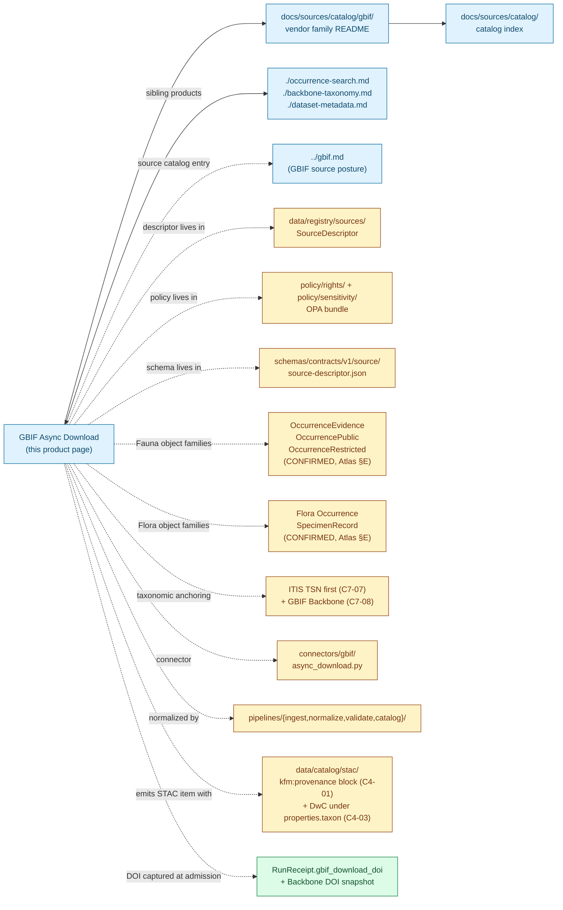

<!-- [KFM_META_BLOCK_V2]
doc_id: kfm://doc/docs-sources-catalog-gbif-async-download
title: GBIF Async Download
type: product-page
version: v0.2
status: draft
owners: <PLACEHOLDER — Docs steward + Source steward for gbif + Biodiversity-lane steward + Sensitivity reviewer>
created: 2026-05-20
updated: 2026-05-21
policy_label: public
related:
  - docs/sources/catalog/gbif/README.md
  - docs/sources/catalog/gbif/occurrence-search.md
  - docs/sources/catalog/gbif/backbone-taxonomy.md
  - docs/sources/catalog/gbif/dataset-metadata.md
  - docs/sources/catalog/gbif/IDENTITY.md
  - docs/sources/catalog/gbif/RIGHTS-AND-SENSITIVITY-MAP.md
  - docs/sources/catalog/gbif/_examples/stac-item-example.json
  - docs/sources/catalog/README.md
  - docs/sources/catalog/gbif.md
  - docs/doctrine/directory-rules.md
  - docs/standards/SENSITIVITY_RUBRIC.md
  - docs/standards/stac-dwc-hybrid.md
tags: [kfm, docs, sources, catalog, gbif, biodiversity, async, doi, dwc-a, fauna, flora, replayable]
notes:
  - "PROPOSED product-page scaffold; sibling-link presence verified in Claude Code session."
  - "GBIF as the canonical aggregated biodiversity authority is CONFIRMED per KFM-P2-IDEA-0018 and C10-06."
  - "The Async Download workflow returns a GBIF Download DOI — distinct from the Backbone Taxonomy DOI (10.15468/39omei) — and is the citable, reproducible path. (CONFIRMED operational pattern.)"
  - "Sensitivity is per-record (NatureServe S1/S2, KDWP SINC, nest/den sites, EBD-restricted datasets), not per-product. License gating (CC0/CC-BY/CC-BY-SA) applies at admission."
  - "Type is `product-page` (not `standard`); this file carries the full presentation standard but is intentionally a scaffold, not steady-state."
[/KFM_META_BLOCK_V2] -->

# GBIF Async Download

> Bulk predicate-based download from GBIF that returns a citable **Download DOI** and a zipped Darwin Core Archive. The reproducible, replayable path — distinct from the synchronous Occurrence Search sibling.

<p>
  
  
  
  
  
  
  
  
  
  
  
  
</p>

**Status:** PROPOSED — scaffold only · **Family:** [`gbif`](./README.md) · **Catalog index:** [`../README.md`](../README.md) · **Source catalog entry:** [`../gbif.md`](../gbif.md) · **Sibling products:** [Occurrence Search](./occurrence-search.md), [Backbone Taxonomy](./backbone-taxonomy.md), [Dataset Metadata](./dataset-metadata.md) · **Last reviewed:** 2026-05-21

> [!IMPORTANT]
> **The async download is the *reproducible* path.** Per GBIF technical documentation cited in the KFM corpus, async downloads issue a **GBIF Download DOI** that is the canonical citation handle for the exact dataset version retrieved. For any KFM derivative that crosses the publication boundary, prefer async + DOI over the synchronous Occurrence Search — the DOI is the reproducibility guarantee.

> [!NOTE]
> **Sensitivity is per-record, not per-product.** Unlike DNA-class products that carry a single tier default for the whole payload, GBIF Async Download admits records under per-dataset license gating (CC0 / CC-BY / CC-BY-SA) and applies per-record sensitivity (NatureServe S1/S2, KDWP SINC, nest/den sites, restricted-use datasets like eBird EBD). The product itself has no single tier.

---

## Quick Jump

- [Overview](#overview)
- [Why async (and not sync)](#why-async-and-not-sync)
- [The Download DOI as canonical citation handle](#the-download-doi-as-canonical-citation-handle)
- [Async job lifecycle](#async-job-lifecycle)
- [Catalog relationships](#catalog-relationships)
- [Source authority](#source-authority)
- [Catalog profiles used](#catalog-profiles-used)
- [Collection identity](#collection-identity)
- [Provenance fields](#provenance-fields)
- [Temporal handling](#temporal-handling)
- [Geometry and projection](#geometry-and-projection)
- [Rights and sensitivity](#rights-and-sensitivity)
- [Validation and catalog closure](#validation-and-catalog-closure)
- [Related contracts and schemas](#related-contracts-and-schemas)
- [Related connectors and pipelines](#related-connectors-and-pipelines)
- [Examples](#examples)
- [Open questions](#open-questions)

---

## Overview

This page describes the **GBIF Async Download product** — the bulk, predicate-based download API at `api.gbif.org/v1/occurrence/download/request` that returns a **GBIF Download DOI** and a zipped Darwin Core Archive — as a *catalog target*: what it is, which catalog profiles it serves, what the STAC shape looks like, and which gates it crosses. It is a **scaffold**, not a steady-state product page; product-specific operational facts (predicate-language version, archive format pin, poll timeout, retention window, default request format) are **NEEDS VERIFICATION** until inspected against a real download at admission.

**What it is** (CONFIRMED context from the corpus). GBIF is the canonical aggregated biodiversity authority *(CONFIRMED, KFM-P2-IDEA-0018 and C10-06)*. The async download workflow is the citable, replayable path for bulk subsets: KFM POSTs a JSON predicate describing the desired subset (geometry, taxon, year, hasCoordinate filters), polls the job to completion, and receives a Download DOI plus a ZIP archive. The Download DOI is captured in the run receipt as the citation handle for every downstream derivative *(per GBIF technical documentation as cited in the KFM corpus)*.

**Why this product is materially different from the sibling Occurrence Search.**

- **Returns a citable DOI.** The sync Occurrence Search does not. For any public-facing derivative, the corpus directs KFM to "prefer async + DOI for reproducibility."
- **Bulk, predicate-defined.** A single download can encompass hundreds of thousands to millions of records. The sync API caps at small subsets.
- **Asynchronous lifecycle.** A job is submitted, polled, and completes minutes to hours later — operationally different from a single HTTPS request.
- **DwC-A ZIP, not JSON.** The async download returns a Darwin Core Archive (DwC-A) — a ZIP bundle with a multi-table relational structure (occurrence.txt, multimedia.txt, verbatim.txt, meta.xml, etc.). Normalization shape is distinct from the JSON Occurrence Search response.

**What this page is not.**

- **Not a SourceDescriptor.** See [`data/registry/sources/`](../../../../data/registry/sources/) for the authoritative descriptor.
- **Not a policy.** See [`policy/sensitivity/`](../../../../policy/sensitivity/) and [`./RIGHTS-AND-SENSITIVITY-MAP.md`](./RIGHTS-AND-SENSITIVITY-MAP.md).
- **Not a schema.** See [`schemas/contracts/v1/source/`](../../../../schemas/contracts/v1/source/) per ADR-0001.
- **Not an admission decision.** Admission requires a completed SourceDescriptor, per-dataset license parsing, sensitivity tagging, anchor resolution (ITIS first, GBIF Backbone second), and reviewer sign-off.

> [!IMPORTANT]
> **PROPOSED scope** *(NEEDS VERIFICATION at admission)*: predicate-language version (GBIF API version pin); archive format version (DwC-A vs simpler CSV); poll cadence and timeout; default request fields; whether KFM retains the ZIP indefinitely or only the normalized extract; multi-job concurrency posture.

[↑ Back to top](#gbif-async-download)

---

## Why async (and not sync)

The two GBIF access methods serve different needs. This product page covers async; the sibling [`./occurrence-search.md`](./occurrence-search.md) covers sync.

| Aspect | Async Download *(this product)* | Sync Occurrence Search |
|---|---|---|
| Endpoint | `POST /v1/occurrence/download/request` | `GET /v1/occurrence/search` |
| Returns a citable DOI? | **Yes — the GBIF Download DOI** | No |
| Predicate language | JSON predicate object | URL query parameters |
| Typical subset size | Hundreds of thousands to millions of records | Up to ~100,000 records (paginated) |
| Workflow | Submit job → poll → SUCCEEDED → fetch ZIP | Single request → JSON response |
| Format | DwC-A ZIP | JSON |
| Reproducibility | **High** — DOI pins the exact dataset version | Low — query-by-query, no version pin |
| KFM recommended use | **Public-facing derivatives** (catalog releases, layer products) | **Exploratory** (small-scale checks, smoke tests) |
| Cadence binding to watcher | Watcher submits async jobs on schedule; outputs go to RAW | Watcher uses sync for change detection only |

> [!CAUTION]
> **Do not publish from sync.** Per the source-catalog entry ([`../gbif.md`](../gbif.md) §6, CONFIRMED operational direction from the corpus): "for any public-facing derivative, prefer async + DOI." A KFM release manifest that cites sync-Occurrence-Search results without a corresponding async DOI fails the reproducibility check.

[↑ Back to top](#gbif-async-download)

---

## The Download DOI as canonical citation handle

Every async download produces a **GBIF Download DOI** that identifies the exact subset (predicate + result set + Backbone version + execution time). The DOI is the citation handle that travels with every downstream derivative.

| Identifier | Where it comes from | Purpose | Captured in |
|---|---|---|---|
| **GBIF Download DOI** (e.g., `10.15468/dl.<short>`) | Returned by the async download job at SUCCEEDED state | Citation handle for this specific subset / version | `RunReceipt.gbif_download_doi`; carried in every downstream `EvidenceBundle` |
| **GBIF Backbone Taxonomy DOI** (`10.15468/39omei`) *(CONFIRMED, C7-08)* | The taxonomic snapshot in force at fetch time | Replayable resolution of `scientificName` → `acceptedTaxonKey` | `RunReceipt.gbif_backbone_doi` |
| **Per-dataset DOI / citation** (e.g., per source dataset within the download) | Per-dataset metadata in `dataset.txt` of the DwC-A | Per-record attribution (originating institution, license, dataset DOI) | `EvidenceBundle.evidence.per_dataset` entries |
| **KFM `spec_hash`** | JCS-canonicalized hash of the KFM catalog record | KFM-internal content identity | `kfm:provenance.spec_hash` (per `C4-01`) |

> [!IMPORTANT]
> **Three DOIs co-exist on every async-derived item.** The Download DOI cites *this subset*; the Backbone DOI cites *the taxonomic frame*; the per-dataset DOI cites *the originating contribution*. None substitutes for the others. Public surfaces MUST surface all three when citing GBIF-derived content.

[↑ Back to top](#gbif-async-download)

---

## Async job lifecycle

```mermaid
sequenceDiagram
    participant K as KFM connector
    participant G as GBIF Async Download API
    participant R as KFM RunReceipt store
    participant D as data/raw/biodiversity/gbif/<run_id>/

    K->>G: POST /v1/occurrence/download/request<br/>(JSON predicate)
    G-->>K: 201 Created + downloadKey
    K->>R: Append: job submitted, predicate hash, submit_time

    loop Poll until terminal
        K->>G: GET /v1/occurrence/download/<downloadKey>
        G-->>K: status = PREPARING | RUNNING | SUCCEEDED | FAILED | CANCELLED
    end

    alt SUCCEEDED
        G-->>K: Download URL + DOI + content size + checksum
        K->>K: Verify checksum
        K->>D: Admit ZIP to data/raw/biodiversity/gbif/<run_id>/
        K->>R: Append: DOI, Backbone DOI snapshot, content hash, retrieval_time
    else FAILED | CANCELLED
        K->>R: Append: failure reason, predicate hash
        Note over K,R: Route to QUARANTINE; do not retry without<br/>predicate review.
    end

    Note over K,D: At this point: RAW capture is complete.<br/>Normalization, anchoring (ITIS first, GBIF Backbone second),<br/>sensitivity application, and STAC × DwC catalog emission happen in subsequent stages.
```

> [!NOTE]
> Diagram structure is grounded in the CONFIRMED operational pattern documented in the parent source-catalog entry ([`../gbif.md`](../gbif.md) §13) and in the corpus's citations of GBIF technical documentation. Specific status enum values (`PREPARING` / `RUNNING` / `SUCCEEDED` / `FAILED` / `CANCELLED`) and the exact `downloadKey`-vs-DOI relationship are **NEEDS VERIFICATION** against current GBIF API documentation at admission.

[↑ Back to top](#gbif-async-download)

---

## Catalog relationships



> [!NOTE]
> Solid edges = doc-to-doc; dashed = doc-to-non-doc. The DOI-capture node is highlighted green because the Download DOI is the central identity for this product (unlike the FTDNA sibling pages, which had no positive central identity). Paths in the diagram are **PROPOSED** and **NEEDS VERIFICATION**.

[↑ Back to top](#gbif-async-download)

---

## Source authority

See [`data/registry/sources/`](../../../../data/registry/sources/) for the authoritative `SourceDescriptor`. **Do not duplicate descriptor fields here.**

| Cross-reference | Path *(PROPOSED unless stated)* | Authority |
|---|---|---|
| Parent source-catalog entry | [`../gbif.md`](../gbif.md) | PROPOSED sibling; same catalog convention |
| SourceDescriptor (machine, envelope) | `data/registry/sources/gbif/...` | **Canonical** (Directory Rules §13.1) |
| SourceDescriptor (machine, per-dataset) | `data/registry/sources/gbif-dataset-<key>/...` | **PROPOSED** — fine-grained rights tracking per [`../gbif.md`](../gbif.md) §5 |
| SourceDescriptor schema | `schemas/contracts/v1/source/source-descriptor.json` | **Canonical** per ADR-0001 |
| Source steward register | `control_plane/source_authority_register.yaml` | **PROPOSED** |
| Vendor README | [`./README.md`](./README.md) | Sibling — INFERRED present |
| Sibling product pages | [`./occurrence-search.md`](./occurrence-search.md), [`./backbone-taxonomy.md`](./backbone-taxonomy.md), [`./dataset-metadata.md`](./dataset-metadata.md) | Sibling — INFERRED present |
| Catalog README | [`../README.md`](../README.md) | Parent — INFERRED present |

> [!NOTE]
> **PROPOSED `source_role`** at admission: depends on the dataset and the kind of record (per [`../gbif.md`](../gbif.md) §4, CONFIRMED multi-value role per artifact). For most async-download outputs the dominant role is `observed` (specimen and field-observation records); citizen-science aggregates from eBird via GBIF are `observed` but `flagged restricted`; aggregated occurrence counts are `aggregate`. Per Doctrine Synthesis §29.3 (CONFIRMED anti-pattern), `source_role` is fixed at admission and never upgraded by promotion.

[↑ Back to top](#gbif-async-download)

---

## Catalog profiles used

Per Pass-10 `C4` (CONFIRMED doctrine), every promoted dataset must have a STAC Item or Collection, a DCAT entry, and a PROV record, with the evidence-bundle JSON-LD attached as a content-addressed asset.

| Profile | Lane *(PROPOSED paths per Directory Rules §13.1)* | Used by this product? | Truth label |
|---|---|---|---|
| **STAC × DwC hybrid** (with `kfm:provenance`, `C4-01` + `C4-03`) | `data/catalog/stac/biodiversity/gbif/...` | **PROPOSED — Yes** | STAC × DwC hybrid CONFIRMED per `C4-03`; per-product item presence NEEDS VERIFICATION |
| **DCAT** (`C4-05`) | `data/catalog/dcat/biodiversity/...` | **PROPOSED — Yes** (Download DOI as DCAT Distribution identifier) | Required for catalog-level discoverability |
| **PROV-O** | `data/catalog/prov/...` | **PROPOSED — Yes** | Required for lineage projection — the predicate, Download DOI, and Backbone DOI form a reproducible PROV chain |
| **Domain projection (Fauna)** | `data/catalog/domain/fauna/...` | **PROPOSED — Yes** | Per `KFM-P1-IDEA-0069`; routes to `OccurrenceEvidence` / `OccurrencePublic` / `OccurrenceRestricted` |
| **Domain projection (Flora)** | `data/catalog/domain/flora/...` | **PROPOSED — Yes** | Routes to `Flora Occurrence` / `SpecimenRecord` / `Rare Plant Record` |
| **DwC-A round-trip preservation** | `data/raw/biodiversity/gbif/<run_id>/<doi>.zip` | **PROPOSED — Yes** | The original ZIP is preserved under RAW as the immutable source payload; the corpus is silent on whether KFM re-emits DwC-A as canonical output (see [Open questions](#open-questions)) |

> [!IMPORTANT]
> **License gating happens BEFORE catalog emission.** A record whose dataset metadata fails the license check (CC0 / CC-BY / CC-BY-SA) MUST NOT receive a STAC item — it routes to QUARANTINE. Per [`../gbif.md`](../gbif.md) §6 (CONFIRMED), unknown license fails closed.

[↑ Back to top](#gbif-async-download)

---

## Collection identity

- **PROPOSED Collection id pattern (general):** `kfm-gbif-occurrences` (per [`../gbif.md`](../gbif.md) §9 PROPOSED Collection id; the singular envelope Collection).
- **PROPOSED per-download Collection id pattern:** `kfm-gbif-async-<download-doi-suffix>` — *if* an ADR resolves OPEN-AD-04 in favor of per-download Collections rather than continuous envelope.
- **PROPOSED namespace:** `kfm:` *(see OPEN-DSC-03 — the `kfm:` vs `ks-kfm:` choice remains open per `C4-01` open question, CONFIRMED).*
- **PROPOSED domain-projected Collections:** `kfm-fauna-occurrences`, `kfm-flora-occurrences` *(downstream of this product, materialized by the domain projection pipelines).*
- **Asset roles:** NEEDS VERIFICATION — confirm against [`schemas/contracts/v1/source/`](../../../../schemas/contracts/v1/source/). At minimum:
  - `data` (the DwC-A ZIP archive)
  - `metadata` (the `meta.xml` and `dataset.txt` inside the archive)
  - `checksum` (per-asset `file:checksum`)
  - `citation` (per-dataset attribution + GBIF Download DOI)

[↑ Back to top](#gbif-async-download)

---

## Provenance fields

STAC `properties.kfm:provenance` block (CONFIRMED shape per `C4-01`; PROPOSED for GBIF async-download scope):

| Field | Type | Purpose |
|---|---|---|
| `spec_hash` | string (sha256) | Canonical-record hash via JCS (RFC 8785); identity of this record |
| `evidence_bundle_ref` | `kfm://evidence/<digest>` | Resolves to the JSON-LD EvidenceBundle for this item (CONFIRMED `C4-04`) |
| `run_record_ref` | `kfm://run/<run-id>` | Points at the RunReceipt that produced this item |
| `audit_ref` | `kfm://audit/<attestation-id>` | SLSA / OPA attestation pointer |
| `policy_digest` | string (sha256) | Hash of the policy bundle in force at promotion |

**Per-asset integrity** (CONFIRMED `C4-01`): `file:checksum` on every asset (STAC file extension).

**Async-download-specific optional fields** *(PROPOSED)*:

- `kfm:source_role` — `observed` for most records; `aggregate` for derivative cells; `modeled` for range polygons (Atlas §24.1.3).
- `kfm:object_family` — one of `OccurrenceEvidence` | `OccurrencePublic` | `OccurrenceRestricted` (Fauna, CONFIRMED) or `Flora Occurrence` | `SpecimenRecord` | `Rare Plant Record` (Flora, CONFIRMED).
- `kfm:gbif_download_doi` — the Download DOI from this product (e.g., `10.15468/dl.<short>`) — central identity for this product.
- `kfm:gbif_backbone_doi` — `10.15468/39omei` plus snapshot version *(CONFIRMED requirement, C7-08)*.
- `kfm:gbif_dataset_key` — UUID of the originating dataset within the download.
- `kfm:gbif_predicate_hash` — JCS-canonicalized hash of the predicate JSON that defined this download — required for replay.
- `kfm:dwc_archive_format_version` — version of the DwC-A spec the archive conforms to (NEEDS VERIFICATION at admission).
- `kfm:originating_institution` — `institutionCode` from DwC; preserved as attribution.
- `kfm:license` — one of `CC0` | `CC-BY` | `CC-BY-SA` (CONFIRMED gating set per [`../gbif.md`](../gbif.md) §6).
- `kfm:rights_holder` — `rightsHolder` from DwC.
- `kfm:restricted_use_flag` *(boolean)* — `true` if the originating dataset is on the biodiversity restricted-use registry (e.g., eBird EBD, CONFIRMED per C10-06).
- `kfm:sensitivity_redaction_profile` *(when sensitive)* — references the GeoprivacyTransformReceipt that recorded the per-record redaction.
- `kfm:itis_tsn` — ITIS TSN if anchored (per C7-07); `null` if ITIS silent and Backbone-only anchored.

> [!IMPORTANT]
> **EvidenceRef must resolve and the predicate hash must be replayable.** A STAC item where `evidence_bundle_ref` does not resolve, where `policy_digest` does not match a registered policy bundle, or where `kfm:gbif_predicate_hash` does not match a stored canonical predicate is a **catalog-closure failure** per `KFM-P1-IDEA-0020` (CONFIRMED); promotion fails closed.

[↑ Back to top](#gbif-async-download)

---

## Temporal handling

PROPOSED — distinct **source / observed / valid / retrieval / release / correction** times where material (Atlas §E temporal-handling rule, **CONFIRMED**).

| Time concept | Likely value for this product | Truth label |
|---|---|---|
| Source time | GBIF's per-record `lastInterpreted` (when GBIF last processed this record) | INFERRED — DwC field present; NEEDS VERIFICATION |
| Observed time | Per-record `eventDate` (DwC) — the actual observation date | CONFIRMED via C4-03 STAC × DwC mapping |
| Valid time | Indefinite — an observation record does not "expire," though taxonomic interpretation may change | INFERRED |
| Retrieval time | Timestamp at which the async job reached SUCCEEDED — pinned by the Download DOI | PROPOSED — DOI is the citable handle |
| Release time | Timestamp of any catalog item crossing the publication boundary | PROPOSED |
| Correction time | Timestamp of any post-release correction (e.g., Backbone version change reassigns a `scientificName`) | PROPOSED |

> [!NOTE]
> **The Download DOI pins the snapshot, but the Backbone DOI ages.** The Download DOI fixes *which records were in this subset*. The Backbone DOI snapshot in force *at fetch time* fixes *how those records were named*. A later Backbone version may rename or move taxa without the underlying observations changing — correction logic must distinguish these two flavors of "change" (record-set change vs taxonomic-interpretation change).

[↑ Back to top](#gbif-async-download)

---

## Geometry and projection

PROPOSED — async-download records carry geographic point geometry (latitude / longitude) in `EPSG:4326` (WGS84). Predicates accept Well-Known Text (WKT) polygons with a strict winding-order convention.

| Concern | Default for this product | Truth label |
|---|---|---|
| Source CRS | `EPSG:4326` (WGS84) per GBIF API | INFERRED — vendor convention; NEEDS VERIFICATION |
| `proj:code` / `proj:bbox` / `proj:geometry` | Present on catalog items; lint via `KFM-P27-FEAT-0003` (CONFIRMED) | PROPOSED |
| Predicate WKT convention | **WKT must be COUNTER-CLOCKWISE in (longitude, latitude) order.** Clockwise rings are interpreted as HOLES by GBIF. Misordered rings silently return unexpected subsets. | CONFIRMED operational gotcha (per [`../gbif.md`](../gbif.md) §13, citing GBIF technical documentation) |
| Predicate WKT smoke test | Required before any download against a new geometry | PROPOSED |
| Coordinate precision | DwC `coordinateUncertaintyInMeters` preserved per record | INFERRED |
| Sensitive-species generalization | Apply `redaction_profile` (truncate / grid / county / deny) per `C6-04` grid generalization (CONFIRMED) | CONFIRMED |
| Living-person-residence join | **Denied by default** — never join an occurrence point to a residence parcel for any living-person association | CONFIRMED doctrine pattern |

> [!CAUTION]
> **Always smoke-test predicate geometry.** Misordered WKT rings (clockwise instead of counter-clockwise) are accepted by the API and silently return the *complement* subset (everything OUTSIDE your intended polygon). This is a corpus-confirmed operational pitfall.

[↑ Back to top](#gbif-async-download)

---

## Rights and sensitivity

NEEDS VERIFICATION — see [`policy/sensitivity/`](../../../../policy/sensitivity/) and [`./RIGHTS-AND-SENSITIVITY-MAP.md`](./RIGHTS-AND-SENSITIVITY-MAP.md). **Do not restate policy here.** The parent source-catalog entry [`../gbif.md`](../gbif.md) §§6–7 is the authoritative source family rights and sensitivity posture; this product page applies it.

| Concern | Default for this product | Citation |
|---|---|---|
| License gating | `CC0` / `CC-BY` / `CC-BY-SA` admitted; other / unknown → QUARANTINE | CONFIRMED per [`../gbif.md`](../gbif.md) §6 + C10-06 |
| Per-dataset license parsing | Required at admission via per-dataset metadata in `dataset.txt` of the DwC-A | PROPOSED |
| Attribution carriage | Originating institution + dataset DOI + GBIF Download DOI MUST travel in EvidenceBundle and on public surfaces | CONFIRMED |
| Restricted-use special cases | eBird EBD (CONFIRMED, C10-06); NatureServe Pro (CONFIRMED, C10-06); routed via `policy/rights/biodiversity_restricted_use.yaml` *(PROPOSED)* | CONFIRMED |
| Per-record sensitivity (NatureServe S1/S2) | Redact precise coordinates by default; publish via grid generalization or county-level | CONFIRMED (C6, C10-06) |
| Per-record sensitivity (KDWP SINC) | Same as S1/S2; in-state authority overlay | CONFIRMED (C7-10, C10-06) |
| Nest / den / roost / hibernacula / spawning sites | Fail closed unless documented geoprivacy transform + review allow release | CONFIRMED (DOM-FAUNA) |
| Living-person observer fields (collector names) | Subject to People/Land sensitivity rules; minimize on public surfaces | CONFIRMED (C9, DOM-PEOPLE) |
| CARE applicability | Open — see `RIGHTS-AND-SENSITIVITY-MAP.md`; biodiversity is among the most likely lanes for CARE consultation when records overlap tribal lands or species of cultural significance | NEEDS VERIFICATION (`C15-01`) |
| Vendor-risk watchlist | GBIF is institutional (international consortium) rather than a single corporate vendor; corporate-distress posture from `C9-07` does not directly apply, but TOS-watcher pattern does | INFERRED |

> [!CAUTION]
> **No tier upgrade without paired artifacts.** Atlas §24.5.3 (CONFIRMED): a tier upgrade always requires a transform receipt **and** a ReviewRecord. For sensitive-species generalization, paired artifacts MUST be **GeoprivacyTransformReceipt + ReviewRecord**. Style-only hiding fails the sensitivity test (Doctrine Synthesis §30, CONFIRMED).

> [!WARNING]
> **eBird EBD records require special routing.** Per C10-06 (CONFIRMED): *"any KFM release derived from EBD must be checked against the EBD terms and may require approval."* The async-download payload may include eBird-via-GBIF records — the connector MUST inspect `dataset.txt` for EBD-originating records and route them through the restricted-use lane.

[↑ Back to top](#gbif-async-download)

---

## Validation and catalog closure

Catalog closure is the final discoverability and accountability gate before publication (`KFM-P1-IDEA-0020`, CONFIRMED). The checks below apply specifically to STAC items emitted for this product.

- **Catalog closure** before public release (`KFM-P1-IDEA-0020`, CONFIRMED). Requires EvidenceRef resolution, source-role check, policy-decision capture, ReleaseManifest pointer, and rollback target.
- **License gate** *(PROPOSED, this product)*. Per-dataset license MUST be one of `CC0` / `CC-BY` / `CC-BY-SA`; unknown / other → QUARANTINE per [`../gbif.md`](../gbif.md) §6.
- **Restricted-use gate** *(PROPOSED, this product)*. Records originating from `eBird EBD` or `NatureServe-Pro-gated` datasets MUST be routed via `policy/rights/biodiversity_restricted_use.yaml` *(PROPOSED)* — license-gate alone is insufficient (CONFIRMED, C10-06).
- **DOI-presence gate** *(PROPOSED, this product)*. RunReceipt MUST carry both `gbif_download_doi` and `gbif_backbone_doi` — items without either fail closed.
- **Predicate-replay gate** *(PROPOSED, this product)*. The connector MUST persist the canonical predicate (JCS-canonicalized) and the `predicate_hash`; mismatches between the recorded predicate and the downloaded subset trigger a CorrectionNotice.
- **Checksum-on-ZIP gate** *(PROPOSED, this product)*. ZIP content MUST be verified against the GBIF-reported checksum before admission to RAW.
- **Anchor-completeness validator** (PROPOSED, family-wide per [`../gbif.md`](../gbif.md) §12). Reject records with neither ITIS TSN nor GBIF Backbone key resolvable.
- **Backbone-version capture** *(PROPOSED, family-wide)*. Every catalog item carries `kfm:gbif_backbone_doi` with the snapshot version in force at fetch.
- **Sensitivity / geoprivacy gate** *(PROPOSED, family-wide)*. For S1/S2 species, KDWP SINC species, and nest/den/roost sites: `redaction_profile` MUST be applied and a `GeoprivacyTransformReceipt` emitted before catalog emission.
- **Object-family routing gate** *(PROPOSED, this product)*. A record reaching the public lane with `kfm:object_family: OccurrenceRestricted` → DENY. Public lanes accept `OccurrencePublic` only (CONFIRMED Fauna families).
- **STAC × DwC schema conformance** (CONFIRMED requirement per C4-03). Validate `properties.taxon` shape, `evidence` block, `redaction_profile`, datetime, geometry.
- **STAC Projection lint** (`KFM-P27-FEAT-0003`, CONFIRMED). Catalog items emitted from this product carry `proj:code = EPSG:4326`; lint should require the field present.
- **STAC checksum closure** against the ReleaseManifest digest (`KFM-P22-PROG-0037`, CONFIRMED). PROPOSED.
- **No-public-raw-path** gate (Master MapLibre §M, CONFIRMED anti-pattern): the raw DwC-A ZIP MUST NOT be reachable via the public CDN.
- **Source-role collapse test** (CONFIRMED anti-pattern, Doctrine Synthesis §29.3): aggregate records cited as per-place observations → DENY at AI surfaces and at publication.
- **TOS-watcher freshness** (`KFM-P19-PROG-0024`-style pattern adapted to GBIF). PROPOSED.

[↑ Back to top](#gbif-async-download)

---

## Related contracts and schemas

- [`contracts/source/`](../../../../contracts/source/) — semantic meaning for source-class objects (NEEDS VERIFICATION; Directory Rules §6.3, CONFIRMED authority).
- [`contracts/fauna/`](../../../../contracts/fauna/) — domain contracts including `OccurrenceEvidence`, `OccurrencePublic`, `OccurrenceRestricted`, `Taxon`, `TaxonCrosswalk`, `ConservationStatus` (CONFIRMED terms per Atlas Part 1 Fauna chapter; file presence NEEDS VERIFICATION).
- [`contracts/flora/`](../../../../contracts/flora/) — domain contracts including `Flora Occurrence`, `SpecimenRecord`, `Rare Plant Record`, `Plant Taxon`, `FloraTaxon Crosswalk`, `Habitat Association` (CONFIRMED terms per Atlas Part 1 Flora chapter; file presence NEEDS VERIFICATION).
- [`schemas/contracts/v1/source/source-descriptor.json`](../../../../schemas/contracts/v1/source/source-descriptor.json) — machine shape per ADR-0001 (NEEDS VERIFICATION).
- [`schemas/contracts/v1/fauna/occurrence-evidence.schema.json`](../../../../schemas/contracts/v1/fauna/occurrence-evidence.schema.json), `occurrence-public.schema.json`, `occurrence-restricted.schema.json` — PROPOSED schemas for CONFIRMED Fauna object families; file presence NEEDS VERIFICATION.
- [`schemas/contracts/v1/flora/flora-occurrence.schema.json`](../../../../schemas/contracts/v1/flora/flora-occurrence.schema.json) — PROPOSED schema for CONFIRMED Flora object family; presence NEEDS VERIFICATION.
- [`schemas/contracts/v1/receipts/`](../../../../schemas/contracts/v1/receipts/) — receipt schemas (RawCaptureReceipt, TransformReceipt, GeoprivacyTransformReceipt, RedactionReceipt, AggregationReceipt, ReleaseManifest) — PROPOSED per Atlas §24.2.1.
- [`schemas/contracts/v1/evidence/evidence_bundle.schema.json`](../../../../schemas/contracts/v1/evidence/evidence_bundle.schema.json) — PROPOSED per `KFM-P26-PROG-0004`.

[↑ Back to top](#gbif-async-download)

---

## Related connectors and pipelines

- [`connectors/gbif/`](../../../../connectors/gbif/) — source-specific fetch / admission logic (Directory Rules §7.3, CONFIRMED).
  - `connectors/gbif/async_download.py` — submits the POST predicate, polls, captures the DOI, verifies checksum, admits ZIP to RAW.
  - `connectors/gbif/dataset_metadata.py` — per-dataset license + citation lookup (gates admission).
  - `connectors/gbif/backbone.py` — taxonomy resolution + Backbone DOI snapshot capture (CONFIRMED requirement, C7-08).
- [`pipelines/ingest/`](../../../../pipelines/ingest/), [`pipelines/normalize/`](../../../../pipelines/normalize/), [`pipelines/validate/`](../../../../pipelines/validate/), [`pipelines/catalog/`](../../../../pipelines/catalog/) — lifecycle phase pipelines (Directory Rules §7.4, CONFIRMED).
- [`pipeline_specs/biodiversity/`](../../../../pipeline_specs/biodiversity/) — declarative specs for the biodiversity domain lane.

[↑ Back to top](#gbif-async-download)

---

## Examples

*Illustrative only — do not treat as authoritative. Field values are placeholders.*

See [`./_examples/stac-item-example.json`](./_examples/stac-item-example.json) for the canonical minimal shape. Two fragments below: a minimal predicate skeleton (submitted to the API), and a STAC × DwC catalog item emitted from the download.

<details>
<summary><strong>Illustrative async-download predicate (submitted to GBIF, click to expand)</strong></summary>

```json
{
  "creator": "<KFM service account>",
  "notificationAddresses": ["<TODO>"],
  "sendNotification": false,
  "format": "DWCA",
  "predicate": {
    "type": "and",
    "predicates": [
      { "type": "equals", "key": "HAS_COORDINATE", "value": "true" },
      { "type": "equals", "key": "COUNTRY", "value": "US" },
      { "type": "equals", "key": "STATE_PROVINCE", "value": "Kansas" },
      { "type": "within", "geometry":
        "POLYGON((-98.5 38.2, -98.0 38.2, -98.0 38.6, -98.5 38.6, -98.5 38.2))"
      },
      { "type": "greaterThanOrEquals", "key": "YEAR", "value": "1854" },
      { "type": "lessThanOrEquals",    "key": "YEAR", "value": "1890" }
    ]
  }
}
```

</details>

<details>
<summary><strong>Minimal STAC Item <code>properties</code> fragment — single-record catalog emission (click to expand)</strong></summary>

```json
{
  "type": "Feature",
  "stac_version": "1.0.0",
  "id": "kfm-gbif-occ-<deterministic-id>",
  "collection": "kfm-gbif-occurrences",
  "geometry": { "type": "Point", "coordinates": [-98.21, 38.43] },
  "bbox": [-98.21, 38.43, -98.21, 38.43],
  "properties": {
    "datetime": "<DwC eventDate, normalized>",
    "kfm:source_role": "observed",
    "kfm:object_family": "OccurrenceEvidence",
    "kfm:gbif_download_doi": "10.15468/dl.<short>",
    "kfm:gbif_backbone_doi": "10.15468/39omei",
    "kfm:gbif_dataset_key": "<uuid>",
    "kfm:gbif_predicate_hash": "sha256:<TBD>",
    "kfm:dwc_archive_format_version": "<NEEDS VERIFICATION at admission>",
    "kfm:originating_institution": "<DwC institutionCode>",
    "kfm:license": "CC-BY",
    "kfm:rights_holder": "<DwC rightsHolder>",
    "kfm:restricted_use_flag": false,
    "kfm:itis_tsn": "<TSN or null>",
    "taxon": {
      "scientific_name":   "<DwC scientificName>",
      "common_name":       "<DwC vernacularName, if present>",
      "itis_tsn":          "<TSN or null>",
      "gbif_taxon_key":    "<integer>",
      "gbif_backbone_doi": "10.15468/39omei",
      "kdwp_status":       "<if applicable>",
      "sensitivity_rank":  "<NatureServe rank or KDWP SINC>"
    },
    "redaction_profile": {
      "applied":     false,
      "method":      null,
      "receipt_ref": null
    },
    "kfm:provenance": {
      "spec_hash":           "sha256:<TBD>",
      "evidence_bundle_ref": "kfm://evidence/<digest>",
      "run_record_ref":      "kfm://run/<run-id>",
      "audit_ref":           "kfm://audit/<attestation-id>",
      "policy_digest":       "sha256:<TBD>"
    },
    "proj:code": "EPSG:4326"
  },
  "assets": {
    "data": {
      "href": "<governed-API-URI for this catalog item>",
      "type": "application/json",
      "roles": ["data"],
      "file:checksum": "1220<sha256-bytes>"
    }
  }
}
```

</details>

> [!NOTE]
> The catalog item shows `redaction_profile.applied: false` because this example shows a non-sensitive record. For an S1/S2 species or a nest-site record, `applied: true` and the `receipt_ref` MUST point at a GeoprivacyTransformReceipt. Shapes PROPOSED; NEEDS VERIFICATION against the mounted STAC linter.

[↑ Back to top](#gbif-async-download)

---

## Open questions

- **OPEN-DSC-03** — `kfm:` vs `ks-kfm:` namespace choice. CONFIRMED open per `C4-01`.
- **OPEN-AD-01** *(new)* — **Poll cadence and timeout posture.** What is the maximum acceptable wall-clock time before an async job is considered failed and cancelled? Does KFM resubmit after timeout, and if so with what backoff?
- **OPEN-AD-02** *(new)* — **Partial-download handling.** What does the connector do if the job reaches SUCCEEDED but the ZIP fetch is interrupted? Resume vs re-request vs quarantine?
- **OPEN-AD-03** *(new)* — **ZIP retention vs extract retention.** Once normalized, does KFM retain the original DwC-A ZIP under RAW indefinitely, or prune it after a window? The DOI guarantees re-fetchability from GBIF, but local retention has cost-vs-replayability tradeoffs.
- **OPEN-AD-04** *(new)* — **Per-download Collection vs continuous envelope Collection.** Should each async-download Job map to its own STAC Collection (`kfm-gbif-async-<doi-suffix>`), or do all downloads contribute to a single rolling `kfm-gbif-occurrences` Collection? The first preserves per-DOI identity; the second reduces catalog proliferation.
- **OPEN-AD-05** *(new)* — **Predicate-language compatibility matrix.** GBIF's predicate language evolves. How does KFM pin the predicate-language version? Where does the compatibility matrix live?
- **OPEN-AD-06** *(new)* — **DwC-A format version pin.** The DwC-A specification has versions. Confirm GBIF's currently-emitted DwC-A version and pin it in the run receipt.
- **OPEN-AD-07** *(new)* — **Multi-job concurrency posture.** Can the GBIF connector submit multiple downloads in parallel? Per-job-state vs global rate limiting?
- **OPEN-AD-08** *(new)* — **DwC-A round-trip emission.** Should KFM re-emit DwC-A as a canonical output (so downstream consumers can use existing DwC tooling), or treat STAC × DwC as the only canonical output? The corpus is silent (parent source-catalog entry §9 Note).
- **OPEN-AD-09** *(new)* — **eBird EBD detection in `dataset.txt`.** What is the canonical signal in a DwC-A `dataset.txt` that identifies an eBird-EBD-originating dataset? Without a reliable signal, the restricted-use gate cannot fire automatically.
- **OPEN-AD-10** *(new)* — **Three-DOI surfacing convention.** Public surfaces must cite the Download DOI, Backbone DOI, and per-dataset DOI. What is the visual / textual convention that surfaces all three without overwhelming the reader?
- **Rights status and CARE applicability.** OPEN — see `./RIGHTS-AND-SENSITIVITY-MAP.md`.
- **Collection scoping.** See OPEN-AD-04.
- **TOS-watcher coverage.** OPEN — confirm whether KFM polls GBIF's terms-of-service / API documentation pages.

[↑ Back to top](#gbif-async-download)

---

## Related docs

- [`./README.md`](./README.md) — GBIF vendor family README
- [`./occurrence-search.md`](./occurrence-search.md) — sibling product page (sync, exploratory, no DOI)
- [`./backbone-taxonomy.md`](./backbone-taxonomy.md) — sibling product page (taxonomic anchor; DOI `10.15468/39omei`)
- [`./dataset-metadata.md`](./dataset-metadata.md) — sibling product page (per-dataset license + citation lookup)
- [`./IDENTITY.md`](./IDENTITY.md) — collection-id pattern and namespace doctrine
- [`./RIGHTS-AND-SENSITIVITY-MAP.md`](./RIGHTS-AND-SENSITIVITY-MAP.md) — product-by-product rights and sensitivity map
- [`./_examples/stac-item-example.json`](./_examples/stac-item-example.json) — canonical minimal STAC shape
- [`../README.md`](../README.md) — catalog index
- [`../gbif.md`](../gbif.md) — GBIF source-catalog entry (parent doctrine for the family)
- [`../../../doctrine/directory-rules.md`](../../../doctrine/directory-rules.md) — placement and lifecycle invariants
- [`../../../standards/stac-dwc-hybrid.md`](../../../standards/stac-dwc-hybrid.md) — STAC × DwC profile *(PROPOSED; see C4-03)*
- [`../../../standards/SENSITIVITY_RUBRIC.md`](../../../standards/SENSITIVITY_RUBRIC.md) — `C6-01` 0–5 rubric *(PROPOSED in corpus; not yet authored)*

---

<sub>Last updated: 2026-05-21 *(Claude Code product-page scaffold session).* · Status: PROPOSED scaffold (v0.2) · Owners: <PLACEHOLDER — Docs steward + Source steward for gbif + Biodiversity-lane steward + Sensitivity reviewer></sub>

<p align="right"><a href="#gbif-async-download">↑ Back to top</a></p>
