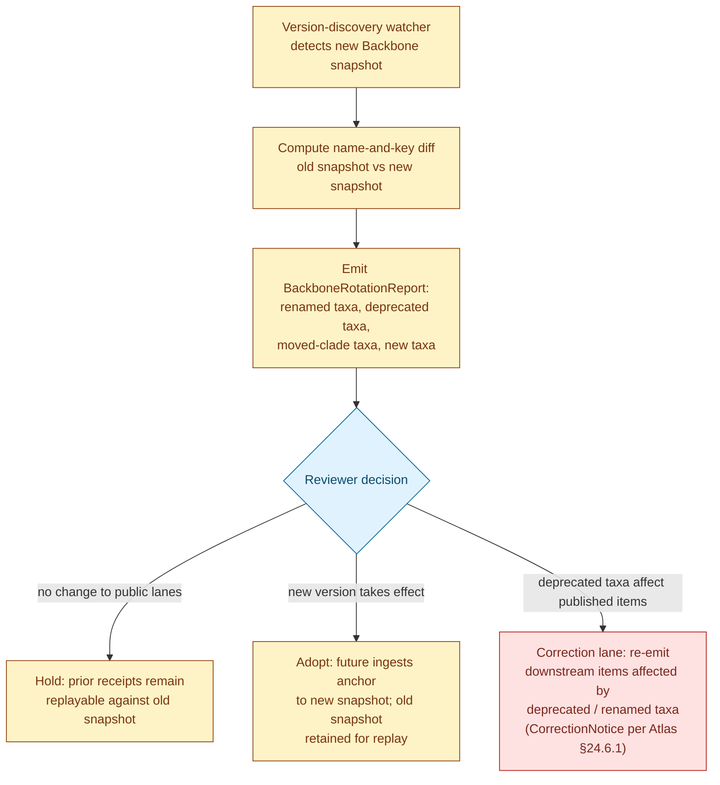
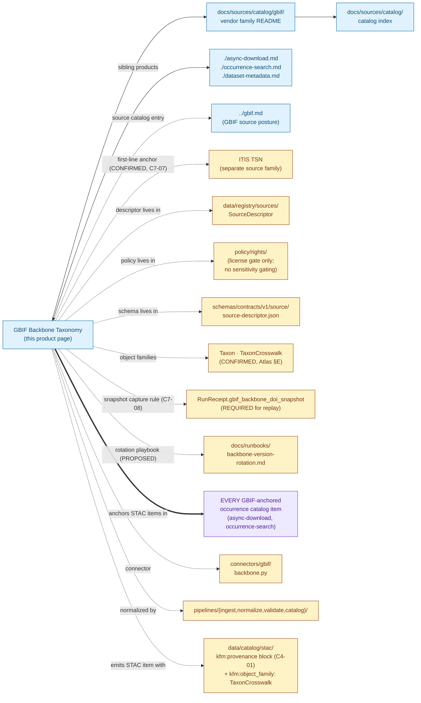

<!-- [KFM_META_BLOCK_V2]
doc_id: kfm://doc/docs-sources-catalog-gbif-backbone-taxonomy
title: GBIF Backbone Taxonomy
type: product-page
version: v0.2
status: draft
owners: <PLACEHOLDER — Docs steward + Source steward for gbif + Biodiversity-lane steward + Taxonomy-authority reviewer>
created: 2026-05-20
updated: 2026-05-21
policy_label: public
related:
  - docs/sources/catalog/gbif/README.md
  - docs/sources/catalog/gbif/async-download.md
  - docs/sources/catalog/gbif/occurrence-search.md
  - docs/sources/catalog/gbif/dataset-metadata.md
  - docs/sources/catalog/gbif/IDENTITY.md
  - docs/sources/catalog/gbif/RIGHTS-AND-SENSITIVITY-MAP.md
  - docs/sources/catalog/gbif/_examples/stac-item-example.json
  - docs/sources/catalog/README.md
  - docs/sources/catalog/gbif.md
  - docs/doctrine/directory-rules.md
  - docs/standards/stac-dwc-hybrid.md
  - docs/runbooks/backbone-version-rotation.md
tags: [kfm, docs, sources, catalog, gbif, backbone, taxonomy, anchor, crosswalk, itis, fauna, flora, reference-data]
notes:
  - "PROPOSED product-page scaffold; sibling-link presence verified in Claude Code session."
  - "GBIF Backbone Taxonomy DOI 10.15468/39omei is CONFIRMED per C7-08 as the international taxonomic crosswalk used by KFM where ITIS coverage is incomplete or international comparability is required."
  - "This product is an ANCHOR / AUTHORITY, not occurrence data. Source role is `administrative` (CONFIRMED per parent source-catalog entry §4). The Backbone is consulted at the PROCESSED → CATALOG stage; it is never published as occurrence evidence."
  - "CONFIRMED rule (C7-08): the GBIF Backbone DOI version MUST be captured in RunReceipt for any record that uses GBIF anchoring, so downstream queries can replay against the same snapshot."
  - "CONFIRMED tension (C7-08): the Backbone is updated and re-versioned periodically; long-running pipelines must tolerate a Backbone version change without invalidating prior receipts."
  - "Object families this product enables: Taxon and TaxonCrosswalk (CONFIRMED in Atlas §E for both Fauna and Flora)."
  - "Type is `product-page` (not `standard`); this file carries the full presentation standard but is intentionally a scaffold, not steady-state."
[/KFM_META_BLOCK_V2] -->

# GBIF Backbone Taxonomy

> The GBIF Backbone Taxonomy — a synthesized, versioned taxonomic hierarchy citable by DOI [`10.15468/39omei`](https://doi.org/10.15468/39omei) — used by KFM as the **international taxonomic crosswalk** where ITIS coverage is incomplete or international comparability is required. **An anchor, not a dataset.**

<p>
  
  
  
  
  
  
  
  
  
  
  
  
</p>

**Status:** PROPOSED — scaffold only · **Family:** [`gbif`](./README.md) · **Catalog index:** [`../README.md`](../README.md) · **Source catalog entry:** [`../gbif.md`](../gbif.md) · **Sibling products:** [Async Download](./async-download.md), [Occurrence Search](./occurrence-search.md), [Dataset Metadata](./dataset-metadata.md) · **Last reviewed:** 2026-05-21

> [!IMPORTANT]
> **The Backbone is an anchor, not a dataset.** Per the parent source-catalog entry [`../gbif.md`](../gbif.md) §4 (CONFIRMED): "Source role is `administrative` (taxonomic authority, not occurrence). Used as anchor only; never published as occurrence evidence." This product's purpose is to be the resolution target for `kfm:gbif_backbone_doi` references that appear in *every other* GBIF-anchored catalog item across KFM's biodiversity lane.

> [!CAUTION]
> **The Backbone re-versions.** Per C7-08 (CONFIRMED): "The Backbone is updated and re-versioned periodically; long-running pipelines must tolerate a Backbone version change without invalidating prior receipts." Every catalog item that anchors to the Backbone MUST capture the snapshot version in force at retrieval time — see [§Backbone-version rotation and deprecated taxa](#backbone-version-rotation-and-deprecated-taxa).

---

## Quick Jump

- [Overview](#overview)
- [Why the Backbone is an anchor, not a dataset](#why-the-backbone-is-an-anchor-not-a-dataset)
- [Concept DOI vs version DOI](#concept-doi-vs-version-doi)
- [Backbone-version rotation and deprecated taxa](#backbone-version-rotation-and-deprecated-taxa)
- [ITIS / Backbone disagreement](#itis--backbone-disagreement)
- [Catalog relationships](#catalog-relationships)
- [Source authority](#source-authority)
- [Catalog profiles used](#catalog-profiles-used)
- [Collection identity](#collection-identity)
- [Provenance fields](#provenance-fields)
- [Temporal handling](#temporal-handling)
- [Geometry and projection](#geometry-and-projection)
- [Rights and sensitivity](#rights-and-sensitivity)
- [Validation and catalog closure](#validation-and-catalog-closure)
- [Related contracts and schemas](#related-contracts-and-schemas)
- [Related connectors and pipelines](#related-connectors-and-pipelines)
- [Examples](#examples)
- [Open questions](#open-questions)

---

## Overview

This page describes the **GBIF Backbone Taxonomy product** — the synthesized taxonomic hierarchy GBIF maintains by merging multiple authoritative checklists, citable by DOI `10.15468/39omei` — as a *catalog target*: what it is, which catalog profiles it serves, what the STAC shape looks like, and which gates it crosses. It is a **scaffold**, not a steady-state product page; product-specific operational facts (current endpoint URL pattern, version-discovery mechanism, exact snapshot-identifier shape) are **NEEDS VERIFICATION** until inspected against a real Backbone fetch at admission.

**What it is** (CONFIRMED context from the corpus, C7-08). The GBIF Backbone Taxonomy is "a synthetic taxonomic backbone constructed by merging multiple authoritative checklists. The Backbone DOI versions the snapshot, which is critical for reproducibility: a record that anchors to GBIF Backbone version A may resolve differently against version B if the taxonomy has been revised." It is the **second-line taxonomic anchor** in KFM's authority ladder, paired with ITIS TSN as the first-line U.S.-canonical anchor (CONFIRMED, C7-07).

**Why the Backbone matters in KFM** (CONFIRMED, C7-08 Why It Matters): "International partners and many EU funders require GBIF Backbone anchoring; Kansas biodiversity data must be expressible in those frames to be usable outside the U.S. federal data ecosystem."

**Why this product is materially different from the sibling Async Download.**

- **It produces no occurrence records.** Async Download produces hundreds of thousands of occurrence records per job. This product produces *one* catalog representation per Backbone snapshot — used as an anchor.
- **It has `source_role: administrative`, not `observed`.** The Backbone is a taxonomic authority, never an observation. Source-role-collapse to `observed` would be a CONFIRMED DENY-grade anti-pattern (Doctrine Synthesis §29.3).
- **Sensitivity is non-gating.** Unlike occurrence data (where NatureServe S1/S2, KDWP SINC, nest-site sensitivity routinely fires), Backbone records are public reference data. No per-record sensitivity profile applies to the taxonomic facts themselves. (License gating still applies — see [Rights and sensitivity](#rights-and-sensitivity).)
- **It has no geometry.** Taxonomy is non-spatial; the STAC Projection lint must be configured to permit absent `proj:*` fields on Backbone items.
- **It re-versions periodically.** Async-download subsets are pinned by their Download DOI at issue time. The Backbone itself is rotated by GBIF on an upstream cadence — KFM must capture which snapshot was used and tolerate version drift.

**What this page is not.**

- **Not a SourceDescriptor.** See [`data/registry/sources/`](../../../../data/registry/sources/).
- **Not a policy.** See [`policy/sensitivity/`](../../../../policy/sensitivity/) and [`./RIGHTS-AND-SENSITIVITY-MAP.md`](./RIGHTS-AND-SENSITIVITY-MAP.md).
- **Not a schema.** See [`schemas/contracts/v1/source/`](../../../../schemas/contracts/v1/source/) per ADR-0001.
- **Not the ITIS authority.** ITIS TSN is the *first-line* anchor (CONFIRMED, C7-07); the Backbone is consulted only when ITIS is silent or stale, or when international comparability requires it.

> [!IMPORTANT]
> **PROPOSED scope** *(NEEDS VERIFICATION at admission)*: current Backbone endpoint URL pattern; version-discovery mechanism (how KFM detects that GBIF has published a new Backbone version); exact snapshot-identifier shape (the corpus describes "DOI snapshot identifier" but does not codify the form); whether KFM mirrors the Backbone locally or fetches on demand; retention window for retired Backbone versions.

[↑ Back to top](#gbif-backbone-taxonomy)

---

## Why the Backbone is an anchor, not a dataset

This distinction is the most important fact on this page. The Backbone Taxonomy is *consulted* during the PROCESSED → CATALOG stage of every GBIF-anchored record; it is *referenced* by `kfm:gbif_backbone_doi` in every downstream STAC item; it is *never* the substantive content of a published occurrence.

| Question | Async Download (sibling) | Backbone Taxonomy (this product) |
|---|---|---|
| What does the product produce in `data/raw/`? | DwC-A ZIP per job (millions of occurrence rows) | One snapshot record per Backbone version (PROPOSED) |
| What does it produce in `data/catalog/`? | STAC × DwC items, one per occurrence | One STAC catalog item per Backbone version (PROPOSED) |
| Is it ever an occurrence? | Yes — every record is an observation, specimen, or aggregate | **No** — taxonomic facts only |
| What `source_role` does it carry? | `observed` (mostly); `aggregate` / `modeled` for derivatives | **`administrative`** — taxonomic authority |
| Does it appear in domain lanes? | Yes — Fauna `OccurrenceEvidence`, Flora `Flora Occurrence`, etc. | Yes, as **`Taxon`** + **`TaxonCrosswalk`** object families (CONFIRMED, Atlas §E) |
| Does sensitivity gating apply? | Yes — per-record (NatureServe, KDWP SINC, nest-sites) | **No to taxonomic content**; license gating still applies (see §Rights) |
| Does living-person sensitivity apply? | Yes — collector names | No |
| Does CARE applicability apply? | Sometimes — when records touch tribal lands or species of cultural significance | Rarely — taxonomy itself is non-place-specific; flag for review only when a taxon has cultural significance and the name reflects that |
| What identifier travels with each downstream reference? | `gbif_download_doi` (per-subset DOI) | **`gbif_backbone_doi`** (this product's DOI) |
| Is it re-emitted to public surfaces? | Yes — as a public-safe catalog item | **No occurrence emission** — but the taxonomic block (`properties.taxon`) inside other products is shaped by this Backbone version |

> [!CAUTION]
> **Source-role collapse for the Backbone is a category error.** A Backbone snapshot promoted as an occurrence record would be doctrinally meaningless — it has no observation, no event date, no location. The validator MUST reject any candidate that pairs `kfm:source_role: administrative` with an `OccurrenceEvidence` / `OccurrencePublic` object family.

[↑ Back to top](#gbif-backbone-taxonomy)

---

## Concept DOI vs version DOI

The DOI `10.15468/39omei` is a **concept DOI** — it always resolves to the *current* Backbone version. For replayable resolution, KFM must capture the **version snapshot identifier** that was in force at the moment of fetch.

| Identifier flavor | What it points at | Where KFM uses it |
|---|---|---|
| **Concept DOI** — `10.15468/39omei` | The Backbone Taxonomy as an evolving artifact (latest version) | Public attribution, citation prose, the URL printed in evidence bundles |
| **Version snapshot identifier** | A specific frozen version (e.g., a specific date or sub-DOI) | `RunReceipt.gbif_backbone_doi_snapshot` *(PROPOSED field name; see OPEN-BT-01)* — required for replayable name resolution |
| **Per-record `acceptedTaxonKey`** | A specific node in the Backbone tree as it existed in that snapshot | `properties.taxon.gbif_taxon_key` on every anchored STAC item |

> [!IMPORTANT]
> **A `gbif_taxon_key` without a `gbif_backbone_doi_snapshot` is not replayable.** A taxon key is meaningful only relative to the version of the Backbone in which it was assigned. If the Backbone is bumped and the key is reassigned (which the corpus acknowledges can happen — see [Backbone-version rotation](#backbone-version-rotation-and-deprecated-taxa)), the same key may now resolve to a different name. **The snapshot identifier is mandatory.**

[↑ Back to top](#gbif-backbone-taxonomy)

---

## Backbone-version rotation and deprecated taxa

The corpus is explicit about both the rotation reality and the open questions it creates *(CONFIRMED, C7-08 Tensions / Open Questions / Suggested Future Work)*:

- **Tension (CONFIRMED):** "The Backbone is updated and re-versioned periodically; long-running pipelines must tolerate a Backbone version change without invalidating prior receipts."
- **Open question (CONFIRMED):** "What is the right cadence for Backbone version updates — annual, on-demand, or driven by upstream release notes? How are deprecated taxa handled?"
- **Suggested future work (CONFIRMED):** "Add a Backbone-version-rotation playbook to the operations runbook."

The PROPOSED Backbone-version-rotation pattern for KFM:



> [!NOTE]
> Diagram structure follows the CONFIRMED CorrectionNotice pattern (Atlas §24.6.1). The specific **`BackboneRotationReport`** object name is PROPOSED — the corpus calls for a "Backbone-version-rotation playbook" but does not name the artifacts. Old snapshots must be retained for replay: a `RunReceipt` produced against Backbone snapshot A MUST remain resolvable against snapshot A indefinitely, even after KFM has adopted snapshot B.

### Handling deprecated taxa

A taxon that was valid in Backbone version A may be deprecated in version B (typical when the taxonomy moves a species between genera, splits a species, or lumps two species). The PROPOSED KFM rule: **the downstream record's `acceptedTaxonKey` is bound to the snapshot in which it was assigned**. Re-anchoring to the new version is a **correction** (CorrectionNotice + ReviewRecord), not a silent update.

[↑ Back to top](#gbif-backbone-taxonomy)

---

## ITIS / Backbone disagreement

The ITIS-vs-Backbone tie-breaker policy is **a CONFIRMED open question in the corpus** (C7-07 Open Questions): "What is the policy when ITIS and GBIF disagree on the accepted name? Default to ITIS for federal-data reconciliation, GBIF for international biodiversity queries — but the corpus does not yet codify this in the policy bundle." Resolution is delegated to the parent source-catalog entry [`../gbif.md`](../gbif.md) §8 and to a future ADR.

The PROPOSED ITIS-first-Backbone-second resolution flow is documented in the parent source-catalog entry; this product page does not re-state it. The relevant fact for *this product specifically*: when a record is anchored only to Backbone (because ITIS is silent), the Backbone snapshot version is the sole taxonomic authority for that record — making `gbif_backbone_doi_snapshot` capture even more important.

[↑ Back to top](#gbif-backbone-taxonomy)

---

## Catalog relationships



> [!NOTE]
> The thick `==>` edge from this product to "every GBIF-anchored occurrence catalog item" represents the *anchoring* relationship — this product is consulted by every other GBIF product and its DOI snapshot is captured in their STAC items. This is the structural reason the Backbone deserves a product page despite producing no occurrence data of its own. Paths in the diagram are **PROPOSED** and **NEEDS VERIFICATION**.

[↑ Back to top](#gbif-backbone-taxonomy)

---

## Source authority

See [`data/registry/sources/`](../../../../data/registry/sources/) for the authoritative `SourceDescriptor`. **Do not duplicate descriptor fields here.**

| Cross-reference | Path *(PROPOSED unless stated)* | Authority |
|---|---|---|
| Parent source-catalog entry | [`../gbif.md`](../gbif.md) | PROPOSED sibling; same catalog convention |
| SourceDescriptor (machine) | `data/registry/sources/gbif-backbone/...` *(PROPOSED separate descriptor; the envelope GBIF descriptor is at `data/registry/sources/gbif/...`)* | **Canonical** (Directory Rules §13.1) |
| SourceDescriptor schema | `schemas/contracts/v1/source/source-descriptor.json` | **Canonical** per ADR-0001 |
| ITIS source family (first-line anchor) | `docs/sources/catalog/itis.md` *(PROPOSED — sibling source-catalog entry not yet authored)* | First-line authority per C7-07 |
| Source steward register | `control_plane/source_authority_register.yaml` | **PROPOSED** |
| Vendor README | [`./README.md`](./README.md) | Sibling — INFERRED present |
| Sibling product pages | [`./async-download.md`](./async-download.md), [`./occurrence-search.md`](./occurrence-search.md), [`./dataset-metadata.md`](./dataset-metadata.md) | Sibling — INFERRED present |
| Catalog README | [`../README.md`](../README.md) | Parent — INFERRED present |

> [!NOTE]
> **PROPOSED `source_role`** at admission: **`administrative`** *(CONFIRMED per parent source-catalog entry §4 — "Used as anchor only; never published as occurrence evidence")*. The Backbone is a taxonomic authority, not an observation, aggregate, or model. The role is fixed at admission and never edited in place (CONFIRMED, Atlas §24.1.3); the source-role-collapse anti-pattern is particularly acute here because nothing prevents a careless promotion path from re-typing a Backbone record as `observed`.

> [!NOTE]
> **PROPOSED `source_id`**: `gbif-backbone` *(distinct from the envelope `gbif` descriptor that covers the Occurrence Download and Occurrence Search products)*. The parent source-catalog entry §5 supports per-product descriptors: "The corpus's PROPOSED pattern is one envelope descriptor for the GBIF aggregator plus per-dataset descriptors for any dataset whose records are admitted to RAW."

[↑ Back to top](#gbif-backbone-taxonomy)

---

## Catalog profiles used

Per Pass-10 `C4` (CONFIRMED doctrine), every promoted dataset must have a STAC Item or Collection, a DCAT entry, and a PROV record, with the evidence-bundle JSON-LD attached as a content-addressed asset. For *this* product, the STAC representation is **one item per Backbone snapshot version** — not one item per taxon.

| Profile | Lane *(PROPOSED paths per Directory Rules §13.1)* | Used by this product? | Truth label |
|---|---|---|---|
| **STAC** (with `kfm:provenance`, `C4-01`) | `data/catalog/stac/biodiversity/gbif-backbone/...` | **PROPOSED — Yes (one item per Backbone version)** | Item shape grounded in `C4-01` (CONFIRMED); per-version item presence NEEDS VERIFICATION |
| **DCAT** (`C4-05`) | `data/catalog/dcat/biodiversity/...` | **PROPOSED — Yes** | Required for catalog-level discoverability; concept DOI as Dataset identity, version-snapshot DOI as Distribution |
| **PROV-O** | `data/catalog/prov/...` | **PROPOSED — Yes** | Important here because rotation events form a PROV chain of supersession (`wasRevisionOf`) |
| **Domain projection (Fauna)** | `data/catalog/domain/fauna/taxonomy/...` | **PROPOSED — Yes** | Routes to `Taxon` / `TaxonCrosswalk` (CONFIRMED Fauna object families, Atlas §E) |
| **Domain projection (Flora)** | `data/catalog/domain/flora/taxonomy/...` | **PROPOSED — Yes** | Routes to `Plant Taxon` / `FloraTaxon Crosswalk` (CONFIRMED Flora object families, Atlas §E) |
| **STAC × DwC hybrid** (`C4-03`) | n/a for the Backbone item itself | **PROPOSED — No** | DwC is the occurrence schema; the Backbone is taxonomy. The Backbone snapshot is referenced *from* DwC-anchored items but is not itself DwC-shaped. |

> [!IMPORTANT]
> **No occurrence emission.** Even though the Backbone gets catalog entries, those entries describe a *taxonomic snapshot*, not occurrences. They MUST NOT carry `kfm:object_family: OccurrenceEvidence` / `OccurrencePublic` / `OccurrenceRestricted`. The validator MUST reject any Backbone catalog item paired with an occurrence object family (see [Validation and catalog closure](#validation-and-catalog-closure)).

[↑ Back to top](#gbif-backbone-taxonomy)

---

## Collection identity

- **PROPOSED Collection id pattern:** `kfm-gbif-backbone` (one Collection, with one Item per Backbone snapshot version).
- **PROPOSED Item id pattern:** `kfm-gbif-backbone-<snapshot-identifier>` (one Item per version; the snapshot identifier is the `gbif_backbone_doi_snapshot` value).
- **PROPOSED namespace:** `kfm:` *(see OPEN-DSC-03 — the `kfm:` vs `ks-kfm:` choice remains open per `C4-01` open question, CONFIRMED).*
- **Asset roles:** NEEDS VERIFICATION — confirm against [`schemas/contracts/v1/source/`](../../../../schemas/contracts/v1/source/). At minimum:
  - `data` (the Backbone snapshot extract or hash manifest; the full taxonomy is large — see OPEN-BT-04)
  - `metadata` (snapshot publication date, upstream changelog reference)
  - `checksum` (per-asset `file:checksum`)
  - `citation` (concept DOI + version snapshot identifier)

[↑ Back to top](#gbif-backbone-taxonomy)

---

## Provenance fields

STAC `properties.kfm:provenance` block (CONFIRMED shape per `C4-01`; PROPOSED for GBIF Backbone scope):

| Field | Type | Purpose |
|---|---|---|
| `spec_hash` | string (sha256) | Canonical-record hash via JCS (RFC 8785); identity of this record |
| `evidence_bundle_ref` | `kfm://evidence/<digest>` | Resolves to the JSON-LD EvidenceBundle for this item (CONFIRMED `C4-04`) |
| `run_record_ref` | `kfm://run/<run-id>` | Points at the RunReceipt that produced this item |
| `audit_ref` | `kfm://audit/<attestation-id>` | SLSA / OPA attestation pointer |
| `policy_digest` | string (sha256) | Hash of the policy bundle in force at promotion |

**Per-asset integrity** (CONFIRMED `C4-01`): `file:checksum` on every asset (STAC file extension).

**Backbone-specific optional fields** *(PROPOSED)*:

- `kfm:source_role` — `administrative` (CONFIRMED, this product). MUST be `administrative`; the validator rejects other values.
- `kfm:object_family` — `TaxonCrosswalk` (CONFIRMED Fauna + Flora object family, Atlas §E). MUST be `Taxon` or `TaxonCrosswalk`; the validator rejects occurrence families on Backbone items.
- `kfm:gbif_backbone_doi_concept` — the concept DOI `10.15468/39omei` (CONFIRMED, C7-08).
- `kfm:gbif_backbone_doi_snapshot` — the version snapshot identifier (PROPOSED field name; see OPEN-BT-01).
- `kfm:gbif_backbone_published_at` — the publication date of this snapshot from GBIF (PROPOSED).
- `kfm:gbif_backbone_supersedes` — reference to the prior Backbone snapshot item this version supersedes (PROPOSED; supports `prov:wasRevisionOf` semantics).
- `kfm:gbif_backbone_taxon_count` — count of taxa in this snapshot (PROPOSED — useful for drift detection).
- `kfm:gbif_backbone_changelog_ref` — opaque reference to a `BackboneRotationReport` documenting the diff against the prior snapshot (PROPOSED).
- `kfm:itis_first_anchor` *(boolean)* — `true` on every Backbone item to assert that the ITIS-first-Backbone-second authority order applies (CONFIRMED, C7-07).
- `kfm:license` — license string for the Backbone artifact (PROPOSED; typically `CC-BY-4.0` but **NEEDS VERIFICATION** at admission).

> [!IMPORTANT]
> **The snapshot identifier is the central replayable handle.** A Backbone item where `kfm:gbif_backbone_doi_snapshot` is absent, blank, or matches the concept DOI only is a **catalog-closure failure** per `KFM-P1-IDEA-0020` (CONFIRMED) — the item cannot serve its anchoring purpose.

[↑ Back to top](#gbif-backbone-taxonomy)

---

## Temporal handling

PROPOSED — distinct **source / observed / valid / retrieval / release / correction** times where material (Atlas §E temporal-handling rule, **CONFIRMED**). Taxonomy has a non-occurrence time profile:

| Time concept | Likely value for this product | Truth label |
|---|---|---|
| Source time | The Backbone snapshot's GBIF-published publication date | PROPOSED — captured in `kfm:gbif_backbone_published_at` |
| Observed time | n/a (taxonomy is not an observation) | INFERRED |
| Valid time | Bounded by snapshot currency — valid until KFM adopts a successor snapshot; the corpus is explicit that older snapshots remain replayable indefinitely (C7-08 Tension) | CONFIRMED in principle; field name NEEDS VERIFICATION |
| Retrieval time | Timestamp at which KFM fetched / cached this snapshot | PROPOSED |
| Release time | Timestamp at which this snapshot was promoted to the public lane | PROPOSED |
| Correction time | Timestamp of any `CorrectionNotice` triggered by adoption of a successor snapshot (per Atlas §24.6.1) | PROPOSED |

> [!NOTE]
> **The Backbone's time semantics are unusual.** Most KFM time models presume an observation. The Backbone has no observation — it has a publication-by-GBIF and an adoption-by-KFM. The `valid_time` here means "valid as KFM's adopted Backbone snapshot," not "valid in nature" — every taxon in the Backbone reflects a current scientific best-guess that may itself be revised. Downstream consumers should not over-interpret `valid_time` on Backbone items.

[↑ Back to top](#gbif-backbone-taxonomy)

---

## Geometry and projection

**Not applicable.** The Backbone Taxonomy is non-spatial — there is no geographic geometry on taxonomic records.

| Concern | Default for this product | Truth label |
|---|---|---|
| Geographic CRS | **n/a** | CONFIRMED — taxonomy is non-spatial |
| `proj:code` / `proj:bbox` / `proj:geometry` | **Absent on Backbone items** | PROPOSED — STAC Projection lint (`KFM-P27-FEAT-0003`) must permit absence for this Collection |
| GeoJSON `geometry` field on STAC item | `null` (or a sentinel non-spatial value) | NEEDS VERIFICATION against STAC validator behavior on null geometry |
| Generalization rules | n/a | — |
| Range polygons | Not produced here. Range polygons attached to a taxon are a **separate** Fauna `RangePolygon` object (CONFIRMED Atlas §E); they reference a Backbone taxonomic node but are not part of this product | CONFIRMED |

> [!NOTE]
> Even though the Backbone item itself has no geometry, **records that anchor to it do**. A Fauna `OccurrenceEvidence` item carries a `Point` geometry and references the Backbone snapshot in its `kfm:gbif_backbone_doi_snapshot` field; that reference does not flow geographic data back into the Backbone item.

[↑ Back to top](#gbif-backbone-taxonomy)

---

## Rights and sensitivity

NEEDS VERIFICATION — see [`policy/sensitivity/`](../../../../policy/sensitivity/) and [`./RIGHTS-AND-SENSITIVITY-MAP.md`](./RIGHTS-AND-SENSITIVITY-MAP.md). **Do not restate policy here.**

| Concern | Default for this product | Citation |
|---|---|---|
| Sensitivity tier (taxonomic content) | **Public reference data — no sensitivity gating** | INFERRED from C7-08 framing of Backbone as canonical reference |
| License gating | License-check still applies at admission; if the Backbone license is not in the permitted set (`CC0` / `CC-BY` / `CC-BY-SA`), routes to QUARANTINE | CONFIRMED admission posture (parent source-catalog entry §6); per-product license value **NEEDS VERIFICATION** |
| Attribution carriage | Concept DOI + version snapshot identifier MUST travel in EvidenceBundle and on public surfaces | CONFIRMED requirement, C7-08 |
| Per-record sensitivity (taxa themselves) | None — taxonomic identity is not a sensitive attribute | INFERRED |
| Cultural-significance sensitivity | A taxonomic name that reflects a colonial or culturally insensitive epithet may warrant CARE consultation; flag via `RIGHTS-AND-SENSITIVITY-MAP.md` rather than per-record policy here | INFERRED |
| Living-person privacy | n/a — Backbone records have no human subject | CONFIRMED |
| CARE applicability | Rarely direct, but the Backbone is the *reference frame* against which species-of-cultural-significance assertions are made — a CARE-relevant downstream concern even if not in this product's payload | INFERRED |
| Vendor-risk watchlist | GBIF is institutional (international consortium); corporate-distress posture from `C9-07` does not apply | INFERRED |
| Revocation model | The Backbone itself is not revocable per consent (no human subjects); supersession of a snapshot is handled via the rotation playbook, not via tombstones | INFERRED |

> [!NOTE]
> **The Backbone has rights but not sensitivity.** This is genuinely different from every other GBIF or FTDNA product page in this catalog: rights checking (license parsing, attribution carriage) still applies at admission, but there is no per-record sensitivity profile, no living-person screen, no nest-site rule, no S1/S2 gating. The product earns a green "public reference" sensitivity badge.

[↑ Back to top](#gbif-backbone-taxonomy)

---

## Validation and catalog closure

Catalog closure is the final discoverability and accountability gate before publication (`KFM-P1-IDEA-0020`, CONFIRMED). The checks below apply specifically to STAC items emitted for this product.

- **Catalog closure** before public release (`KFM-P1-IDEA-0020`, CONFIRMED). PROPOSED for Backbone scope; requires EvidenceRef resolution, source-role check, ReleaseManifest pointer.
- **Source-role gate** *(PROPOSED, this product)*. The validator MUST require `kfm:source_role: administrative` and reject any other value on Backbone items. Source-role-collapse to `observed` is a CONFIRMED DENY-grade anti-pattern (Doctrine Synthesis §29.3).
- **Object-family gate** *(PROPOSED, this product)*. The validator MUST require `kfm:object_family` ∈ `{Taxon, TaxonCrosswalk}` (CONFIRMED Atlas §E) and reject occurrence families on Backbone items.
- **Snapshot-identifier-presence gate** *(PROPOSED, this product)*. The validator MUST require `kfm:gbif_backbone_doi_snapshot` to be present, non-empty, and distinct from the concept DOI alone. Items lacking a snapshot identifier fail closed.
- **Concept-DOI gate** *(PROPOSED, this product)*. The validator MUST verify `kfm:gbif_backbone_doi_concept == "10.15468/39omei"` (CONFIRMED, C7-08).
- **License gate** *(PROPOSED)*. License MUST be in the permitted set (`CC0` / `CC-BY` / `CC-BY-SA`) per the parent source-catalog entry §6; unknown / other → QUARANTINE.
- **No-occurrence-emission gate** *(PROPOSED, this product)*. Backbone items MUST NOT appear in the Fauna `OccurrencePublic` or Flora `Flora Occurrence` lanes. Pipeline routing rules MUST keep Backbone items in the `TaxonCrosswalk` lane.
- **No-geometry assertion** *(PROPOSED, this product)*. The STAC Projection lint (`KFM-P27-FEAT-0003`, CONFIRMED) MUST be configured to permit absent `proj:*` fields on the `kfm-gbif-backbone` Collection.
- **Supersession-chain integrity gate** *(PROPOSED, this product)*. For any Backbone item with `kfm:gbif_backbone_supersedes`, the referenced prior item MUST exist in the catalog and MUST itself be a Backbone item.
- **Rotation playbook freshness audit** *(PROPOSED, this product)*. The Backbone-rotation watcher (PROPOSED) MUST report when a new GBIF Backbone snapshot has been published that KFM has not yet adopted; staleness beyond `<NEEDS VERIFICATION>` weeks triggers a `BackboneStalenessNotice`.
- **STAC checksum closure** against the ReleaseManifest digest (`KFM-P22-PROG-0037`, CONFIRMED). PROPOSED.
- **No-public-raw-path** gate (Master MapLibre §M, CONFIRMED): the full Backbone payload, if mirrored locally, MUST NOT be reachable via the public CDN (the public-facing artifact is the catalog item describing the snapshot, not the snapshot's full taxon list).

> [!NOTE]
> Unlike the Async Download product page, no HMAC-tokenization gate or sensitivity-gate is required here — the data is public reference. The main rigor is around the source-role / object-family / snapshot-identifier triple that ensures the Backbone serves its anchoring role correctly.

[↑ Back to top](#gbif-backbone-taxonomy)

---

## Related contracts and schemas

- [`contracts/source/`](../../../../contracts/source/) — semantic meaning for source-class objects (NEEDS VERIFICATION; Directory Rules §6.3, CONFIRMED authority).
- [`contracts/fauna/`](../../../../contracts/fauna/) — Fauna domain contracts including `Taxon` and `TaxonCrosswalk` (CONFIRMED terms per Atlas Part 1 Fauna §E; file presence NEEDS VERIFICATION).
- [`contracts/flora/`](../../../../contracts/flora/) — Flora domain contracts including `Plant Taxon` and `FloraTaxon Crosswalk` (CONFIRMED terms per Atlas Part 1 Flora §E; file presence NEEDS VERIFICATION).
- [`schemas/contracts/v1/source/source-descriptor.json`](../../../../schemas/contracts/v1/source/source-descriptor.json) — machine shape per ADR-0001 (NEEDS VERIFICATION).
- [`schemas/contracts/v1/fauna/taxon-crosswalk.schema.json`](../../../../schemas/contracts/v1/fauna/taxon-crosswalk.schema.json) — PROPOSED schema for CONFIRMED Fauna object family; presence NEEDS VERIFICATION.
- [`schemas/contracts/v1/flora/flora-taxon-crosswalk.schema.json`](../../../../schemas/contracts/v1/flora/flora-taxon-crosswalk.schema.json) — PROPOSED schema for CONFIRMED Flora object family; presence NEEDS VERIFICATION.
- [`schemas/contracts/v1/receipts/`](../../../../schemas/contracts/v1/receipts/) — receipt schemas including a PROPOSED `BackboneRotationReceipt` for adoption events; PROPOSED per Atlas §24.2.1.
- [`schemas/contracts/v1/evidence/evidence_bundle.schema.json`](../../../../schemas/contracts/v1/evidence/evidence_bundle.schema.json) — PROPOSED per `KFM-P26-PROG-0004`.

[↑ Back to top](#gbif-backbone-taxonomy)

---

## Related connectors and pipelines

- [`connectors/gbif/`](../../../../connectors/gbif/) — source-specific fetch / admission logic (Directory Rules §7.3, CONFIRMED).
  - `connectors/gbif/backbone.py` — taxonomy resolution + Backbone DOI snapshot capture *(CONFIRMED requirement, C7-08)*. Called from every PROCESSED-stage anchoring step in the biodiversity lane.
- [`pipelines/ingest/`](../../../../pipelines/ingest/), [`pipelines/normalize/`](../../../../pipelines/normalize/), [`pipelines/validate/`](../../../../pipelines/validate/), [`pipelines/catalog/`](../../../../pipelines/catalog/) — lifecycle phase pipelines (Directory Rules §7.4, CONFIRMED).
- [`pipeline_specs/biodiversity/`](../../../../pipeline_specs/biodiversity/) — declarative specs.
- [`pipeline_specs/biodiversity/backbone-rotation.yaml`](../../../../pipeline_specs/biodiversity/backbone-rotation.yaml) — PROPOSED rotation playbook spec per C7-08 Suggested Future Work.

[↑ Back to top](#gbif-backbone-taxonomy)

---

## Examples

*Illustrative only — do not treat as authoritative. Field values are placeholders.*

See [`./_examples/stac-item-example.json`](./_examples/stac-item-example.json) for the canonical minimal shape. Two fragments below: a name-match API call (the operational entry point), and the STAC catalog item that represents a Backbone snapshot.

<details>
<summary><strong>Illustrative API calls (click to expand)</strong></summary>

```text
# Name match — used at PROCESSED → CATALOG to anchor an incoming
# scientificName to a Backbone taxonKey.
GET https://api.gbif.org/v1/species/match?name=Bison%20bison
# → response includes: usageKey (acceptedTaxonKey), scientificName,
#   rank, status, classification path, matchType, confidence

# Direct lookup by taxonKey
GET https://api.gbif.org/v1/species/<taxonKey>
# → response includes: nubKey, kingdom, phylum, class, order, family,
#   genus, species, accepted/synonym status, references to nomenclatural acts

# Version-discovery (NEEDS VERIFICATION: GBIF's actual versioning endpoint)
# The corpus is explicit that the Backbone is versioned but does not pin
# the version-discovery endpoint URL. Resolve at admission per OPEN-BT-01.
```

</details>

<details>
<summary><strong>Minimal STAC Item <code>properties</code> fragment — Backbone snapshot item (click to expand)</strong></summary>

```json
{
  "type": "Feature",
  "stac_version": "1.0.0",
  "id": "kfm-gbif-backbone-<snapshot-identifier>",
  "collection": "kfm-gbif-backbone",
  "geometry": null,
  "bbox": null,
  "properties": {
    "datetime": "<gbif_backbone_published_at>",
    "kfm:source_role": "administrative",
    "kfm:object_family": "TaxonCrosswalk",
    "kfm:gbif_backbone_doi_concept": "10.15468/39omei",
    "kfm:gbif_backbone_doi_snapshot": "<NEEDS VERIFICATION: snapshot DOI form>",
    "kfm:gbif_backbone_published_at": "<ISO8601 publication date>",
    "kfm:gbif_backbone_supersedes": "kfm://stac/kfm-gbif-backbone/<prior-snapshot-id>",
    "kfm:gbif_backbone_taxon_count": "<integer>",
    "kfm:gbif_backbone_changelog_ref": "kfm://report/backbone-rotation/<run-id>",
    "kfm:itis_first_anchor": true,
    "kfm:license": "<NEEDS VERIFICATION at admission; typically CC-BY-4.0>",
    "kfm:provenance": {
      "spec_hash":           "sha256:<TBD>",
      "evidence_bundle_ref": "kfm://evidence/<digest>",
      "run_record_ref":      "kfm://run/<run-id>",
      "audit_ref":           "kfm://audit/<attestation-id>",
      "policy_digest":       "sha256:<TBD>"
    }
  },
  "assets": {
    "data": {
      "href": "<governed-API-URI for this snapshot's taxon-table extract>",
      "type": "application/json",
      "roles": ["data"],
      "file:checksum": "1220<sha256-bytes>"
    },
    "metadata": {
      "href": "<governed-API-URI for the changelog / rotation report>",
      "type": "application/json",
      "roles": ["metadata"]
    }
  },
  "links": [
    { "rel": "self",      "href": "./item.json" },
    { "rel": "parent",    "href": "../collection.json" },
    { "rel": "predecessor-version", "href": "../<prior-snapshot-id>/item.json" },
    { "rel": "cite-as",   "href": "https://doi.org/10.15468/39omei" }
  ]
}
```

</details>

> [!NOTE]
> The Backbone item has `geometry: null` and no `proj:*` fields because taxonomy is non-spatial. The `predecessor-version` link materializes the supersession chain per `kfm:gbif_backbone_supersedes`. The concept DOI is the `cite-as` target (per current STAC + DOI conventions in the corpus's external-standards posture); the version snapshot identifier is the local identity. Shapes PROPOSED; NEEDS VERIFICATION against the mounted STAC linter.

[↑ Back to top](#gbif-backbone-taxonomy)

---

## Open questions

- **OPEN-DSC-03** — `kfm:` vs `ks-kfm:` namespace choice. CONFIRMED open per `C4-01`.
- **OPEN-BT-01** *(new)* — **Version snapshot identifier form.** What exactly is the "DOI snapshot identifier" cited in C7-08? Is it a sub-DOI under the concept DOI? A date string? A GBIF-internal version number? Resolve at admission against the current GBIF API.
- **OPEN-BT-02** *(new)* — **Backbone-version-rotation cadence.** CONFIRMED open per C7-08: "What is the right cadence for Backbone version updates — annual, on-demand, or driven by upstream release notes?" Resolve via ADR informed by the GBIF Secretariat's actual publication pattern.
- **OPEN-BT-03** *(new)* — **Deprecated-taxon handling rule.** CONFIRMED open per C7-08. When a Backbone snapshot deprecates a taxon, what happens to downstream records that anchored to the now-deprecated taxon? The PROPOSED rule in this scaffold is "CorrectionNotice + ReviewRecord," but the corpus does not finalize this. Resolve in the rotation playbook.
- **OPEN-BT-04** *(new)* — **Local mirror vs on-demand fetch.** The full Backbone is hundreds of thousands of taxa. Does KFM mirror locally (faster anchoring, more storage, freshness risk) or fetch on demand (slower, simpler, network dependency)? Hybrid (cache with TTL) is also viable.
- **OPEN-BT-05** *(new)* — **`BackboneRotationReport` shape.** The diff between two Backbone snapshots needs a canonical reporting shape (renamed taxa, deprecated taxa, moved-clade taxa, new taxa). Codify in `contracts/fauna/backbone-rotation-report.md` or equivalent.
- **OPEN-BT-06** *(new)* — **ITIS-Backbone disagreement workflow at the AI surface.** When the Evidence Drawer surfaces a record whose ITIS name and Backbone name disagree, what does the AI surface say? Cite-or-abstain (`AIReceipt` discipline, CONFIRMED) implies abstain on the disputed claim; confirm at the AI-surface specification.
- **OPEN-BT-07** *(new)* — **Backbone license.** What is the current license on the GBIF Backbone artifact? Typically `CC-BY-4.0` for GBIF outputs but the corpus does not pin this. Confirm at admission and record in SourceDescriptor.
- **OPEN-BT-08** *(new)* — **Concept-DOI URL form on public surfaces.** Public attribution should display the concept DOI (always-current); machine resolution should use the snapshot identifier. The visual / textual convention for showing both without confusing the reader needs design.
- **ITIS / GBIF tie-breaker policy.** CONFIRMED open per C7-07; resolve in the parent source-catalog entry [`../gbif.md`](../gbif.md) and a future ADR.
- **Cadence and current endpoint URL.** OPEN — see OPEN-BT-01.
- **CARE applicability.** OPEN — see `./RIGHTS-AND-SENSITIVITY-MAP.md`; rarely direct for taxonomy but relevant when taxa carry culturally-sensitive epithets.

[↑ Back to top](#gbif-backbone-taxonomy)

---

## Related docs

- [`./README.md`](./README.md) — GBIF vendor family README
- [`./async-download.md`](./async-download.md) — sibling product (bulk async download with citable DOI)
- [`./occurrence-search.md`](./occurrence-search.md) — sibling product (sync exploratory search)
- [`./dataset-metadata.md`](./dataset-metadata.md) — sibling product (per-dataset license + citation lookup)
- [`./IDENTITY.md`](./IDENTITY.md) — collection-id pattern and namespace doctrine
- [`./RIGHTS-AND-SENSITIVITY-MAP.md`](./RIGHTS-AND-SENSITIVITY-MAP.md) — product-by-product rights and sensitivity map
- [`./_examples/stac-item-example.json`](./_examples/stac-item-example.json) — canonical minimal STAC shape
- [`../README.md`](../README.md) — catalog index
- [`../gbif.md`](../gbif.md) — GBIF source-catalog entry (parent doctrine for the family)
- [`../../../doctrine/directory-rules.md`](../../../doctrine/directory-rules.md) — placement and lifecycle invariants
- [`../../../standards/stac-dwc-hybrid.md`](../../../standards/stac-dwc-hybrid.md) — STAC × DwC profile *(PROPOSED; see C4-03)*
- [`../../../runbooks/backbone-version-rotation.md`](../../../runbooks/backbone-version-rotation.md) — Backbone-version-rotation playbook *(PROPOSED — referenced in C7-08 Suggested Future Work)*

---

<sub>Last updated: 2026-05-21 *(Claude Code product-page scaffold session).* · Status: PROPOSED scaffold (v0.2) · Owners: <PLACEHOLDER — Docs steward + Source steward for gbif + Biodiversity-lane steward + Taxonomy-authority reviewer></sub>

<p align="right"><a href="#gbif-backbone-taxonomy">↑ Back to top</a></p>
