<!-- [KFM_META_BLOCK_V2]
doc_id: kfm://doc/docs-sources-catalog-gbif-dataset-metadata
title: GBIF Dataset Metadata
type: product-page
version: v0.2
status: draft
owners: <PLACEHOLDER — Docs steward + Source steward for gbif>
created: 2026-05-20
updated: 2026-05-21
policy_label: public
related:
  - docs/sources/catalog/gbif/README.md
  - docs/sources/catalog/gbif/IDENTITY.md
  - docs/sources/catalog/gbif/RIGHTS-AND-SENSITIVITY-MAP.md
  - docs/sources/catalog/gbif/_examples/stac-item-example.json
  - docs/sources/catalog/README.md
  - docs/doctrine/directory-rules.md
  - docs/standards/PROV.md
tags: [kfm, docs, sources, catalog, gbif, fauna, biodiversity]
notes:
  - "PROPOSED product-page scaffold; sibling-link presence verified in prior Claude Code session, NEEDS VERIFICATION against mounted repo."
  - "v0.2: applied KFM presentation standard; added corpus-CONFIRMED Backbone DOI, license map, and STAC × DwC hybrid references."
[/KFM_META_BLOCK_V2] -->

# 🌍 GBIF Dataset Metadata

> Per-dataset license, citation, and DOI metadata consulted at admission, used to gate rights, drive catalog closure, and bind every GBIF-anchored claim to a replayable evidence chain.

[](#) [](#) [](./README.md) [](../../../doctrine/directory-rules.md) [](../../../../policy/sensitivity/) [](#) [](#open-questions)

**Status:** PROPOSED — scaffold + v0.2 polish · **Family:** [`gbif`](./README.md) · **Owners:** *PLACEHOLDER — Docs steward + Source steward for gbif* · **Last reviewed:** 2026-05-21

> [!NOTE]
> This is a **product-page**, not a SourceDescriptor. The canonical descriptor — identity, role, rights posture, cadence, endpoints — lives under [`data/registry/sources/`](../../../../data/registry/sources/) per `directory-rules.md §7.4` and `ADR-0001`. **PROPOSED**, **NEEDS VERIFICATION** against the mounted repo. Do **not** duplicate descriptor fields here.

---

## Mini-TOC

- [1. Overview](#1-overview)
- [2. Source authority](#2-source-authority)
- [3. Catalog profiles used](#3-catalog-profiles-used)
- [4. Collection identity](#4-collection-identity)
- [5. Provenance fields](#5-provenance-fields)
- [6. Temporal handling](#6-temporal-handling)
- [7. Geometry and projection](#7-geometry-and-projection)
- [8. Rights and sensitivity](#8-rights-and-sensitivity)
- [9. Validation and catalog closure](#9-validation-and-catalog-closure)
- [10. Related contracts and schemas](#10-related-contracts-and-schemas)
- [11. Related connectors and pipelines](#11-related-connectors-and-pipelines)
- [12. Lifecycle diagram](#12-lifecycle-diagram)
- [13. Examples](#13-examples)
- [14. Open questions](#14-open-questions)
- [15. Related docs](#15-related-docs)

---

## 1. Overview

**CONFIRMED (doctrine, KFM-P2-IDEA-0018, Pass 32):** The Global Biodiversity Information Facility (GBIF) is treated as the canonical aggregated authority for biodiversity occurrences, ingested via the governed-pull pattern with Darwin Core (DwC) compliance. License and source-attribution propagate through the watcher.

**CONFIRMED (doctrine, C10-06):** GBIF sits alongside iNaturalist, eBird EBD, NatureServe, USFWS, iDigBio, Symbiota, KU Biodiversity Institute, and the FHSU Sternberg Museum in the Kansas biodiversity stack. Within that stack, GBIF is the **aggregator** role; institutional sources (KANU, KSC, Sternberg) supplement where Kansas coverage is insufficient and carry **specimen-backed primacy** over crowd observations.

**PROPOSED — NEEDS VERIFICATION (this product instance):** scope, refresh cadence, geographic coverage filter, current endpoint URL, pinned API version, pinned GBIF Backbone DOI version, license matrix snapshot, and rights status are all NEEDS VERIFICATION against the mounted repo's `data/registry/sources/<…>/gbif.…` descriptor.

> [!IMPORTANT]
> **Cite-or-abstain.** Any KFM claim derived from GBIF data must resolve to a GBIF Download DOI (or pinned snapshot identifier) in the EvidenceBundle. Where no DOI is captured, the claim must ABSTAIN at the runtime envelope.

[Back to top](#-gbif-dataset-metadata)

---

## 2. Source authority

| Field | Authoritative home | Status here |
|---|---|---|
| SourceDescriptor (identity, role, endpoints, cadence, terms) | [`data/registry/sources/`](../../../../data/registry/sources/) — schema home `schemas/contracts/v1/source/source-descriptor.json` per ADR-0001 | **Do not duplicate** in this page (PROPOSED) |
| Source-role classification | Source-role registry (PROPOSED, KFM-P20-IDEA-0001) | GBIF role: **`aggregator`** with `corroborative` evidence weight relative to specimen-backed sources (PROPOSED) |
| Rights / license matrix | [`policy/sensitivity/`](../../../../policy/sensitivity/) + license-map JSON (PROPOSED) | See §[8. Rights and sensitivity](#8-rights-and-sensitivity) |
| Taxon backbone | GBIF Backbone Taxonomy, DOI [`10.15468/39omei`](https://doi.org/10.15468/39omei) — **CONFIRMED (C7-08)**; Backbone version pinned in run receipt | Used where ITIS TSN is silent or international comparability is required |

[Back to top](#-gbif-dataset-metadata)

---

## 3. Catalog profiles used

**PROPOSED.** A GBIF product family is expected to emit records into the four lanes below; per-product realization is **NEEDS VERIFICATION** until inspected.

| Profile | Lane | Required for GBIF? | Notes |
|---|---|---|---|
| **STAC × Darwin Core hybrid** | `data/catalog/stac/` | **CONFIRMED (C4-03)** — Yes | Items are `Feature` with geometry + datetime; DwC terms sit inside `properties.taxon`, not at top level. |
| **DCAT Distribution** | `data/catalog/dcat/` | **PROPOSED — Yes / No (NEEDS VERIFICATION)** | DCAT mirror for cross-catalog discovery (data.gov-style clearinghouses) per C4-05. |
| **PROV-O lineage** | `data/catalog/prov/` | **PROPOSED — Yes (NEEDS VERIFICATION)** | Required when promotion edges must be inspectable. |
| **Domain projection** | `data/catalog/domain/fauna/` | **PROPOSED — Yes (NEEDS VERIFICATION)** | Fauna-specific projection for steward review and Focus Mode payloads. |

> [!TIP]
> GBIF data is biodiversity-typed. The **STAC × DwC hybrid (C4-03)** is the corpus-canonical envelope; consumers expecting plain STAC see a clean envelope, consumers expecting DwC see `properties.taxon` carrying the DwC terms (`scientificName`, `kingdom..species`, `basisOfRecord`, `institutionCode`, etc.).

[Back to top](#-gbif-dataset-metadata)

---

## 4. Collection identity

- **PROPOSED Collection id pattern:** `kfm-<org>-<product>` — corpus expansion direction for C4-02. Concrete example shape: `kfm-gbif-occurrences-kansas` (illustrative, **not** authoritative until the [`IDENTITY.md`](./IDENTITY.md) sibling pins it).
- **PROPOSED KFM namespace:** `kfm:` (short, KFM-global) — **OPEN-DSC-03 (PROPOSED tracking id; NEEDS VERIFICATION against the docs/sources/catalog open-questions register)**. The corpus records this as an unresolved choice between `kfm:` and `ks-kfm:` (Kansas-scoped) at C4-01.
- **CONFIRMED (C7-08):** The GBIF Backbone DOI version used at admission **must be pinned in the RunReceipt and EvidenceBundle** so downstream queries can replay against the same backbone. Backbone version bumps are a **separately governed event**, not a silent upgrade.
- **Asset roles:** **NEEDS VERIFICATION** — confirm against `schemas/contracts/v1/source/` and any STAC asset-role conventions adopted by the catalog lane README.

[Back to top](#-gbif-dataset-metadata)

---

## 5. Provenance fields

**CONFIRMED (C4-01):** STAC Items emitted by KFM carry an `item.properties.kfm:provenance` block. The fields below are the KFM-canonical set; per-asset integrity is recorded as STAC `file:checksum`.

```json
{
  "type": "Feature",
  "stac_version": "1.0.0",
  "properties": {
    "datetime": "<observed/event ISO-8601>",
    "taxon": {
      "scientificName": "<binomen>",
      "kingdom": "...", "phylum": "...", "class": "...",
      "order": "...", "family": "...", "genus": "...", "species": "...",
      "basisOfRecord": "HUMAN_OBSERVATION | PRESERVED_SPECIMEN | ...",
      "institutionCode": "...",
      "collectionCode": "...",
      "catalogNumber": "...",
      "kbs_id": "<ITIS TSN or GBIF taxonKey>",
      "kdwp_status": "<S1|S2|... or null>",
      "sensitivity_rank": "<C6 rubric value>"
    },
    "kfm:provenance": {
      "spec_hash": "sha256:<JCS-canonicalized record hash>",
      "evidence_bundle_ref": "kfm://evidence/<digest>",
      "run_record_ref": "kfm://run/<run-id>",
      "audit_ref": "kfm://audit/<attestation-id>",
      "policy_digest": "sha256:<policy bundle digest>"
    },
    "redaction_profile": "<public-safe profile id or null>"
  },
  "assets": {
    "data": { "href": "...", "file:checksum": "sha256:<asset-bytes>" }
  }
}
```

| Field | Source of authority | Status |
|---|---|---|
| `spec_hash` | RFC 8785 JCS over the canonical record → SHA-256 (corpus §13 identity rule) | **CONFIRMED doctrine / PROPOSED field realization** |
| `evidence_bundle_ref` | Resolves to content-addressed EvidenceBundle (C4-04) | **CONFIRMED doctrine / PROPOSED field realization** |
| `run_record_ref` | Resolves to the immutable RunReceipt (C1-01) | **CONFIRMED doctrine / PROPOSED field realization** |
| `audit_ref` | Resolves to the SLSA/OPA promotion attestation | **CONFIRMED doctrine / PROPOSED field realization** |
| `policy_digest` | SHA-256 of the policy bundle active at promotion | **CONFIRMED doctrine / PROPOSED field realization** |
| `file:checksum` | STAC `file` extension, per-asset bytes | CONFIRMED (STAC extension) |

> [!WARNING]
> The KFM namespace token (`kfm:` vs `ks-kfm:`) is **unsettled** at C4-01. Until OPEN-DSC-03 is closed, do **not** mint Collections under both prefixes; pick one in [`IDENTITY.md`](./IDENTITY.md) and treat the other as a redirect candidate.

[Back to top](#-gbif-dataset-metadata)

---

## 6. Temporal handling

**CONFIRMED (Fauna dossier, Section E):** source, observed, valid, retrieval, release, and correction times stay **distinct** where material. For GBIF occurrences these typically map as follows:

| Time concept | Carrier (PROPOSED) | Notes |
|---|---|---|
| **source time** | DwC `eventDate` after canonical parsing | Original observation/collection event. |
| **observed time** | Same as source for `HUMAN_OBSERVATION`; specimen-prep-adjusted for `PRESERVED_SPECIMEN` (NEEDS VERIFICATION) | Crowd vs specimen-backed semantics differ. |
| **valid time** | EvidenceBundle `valid_from` / `valid_to` (PROPOSED) | When the claim is considered current. |
| **retrieval time** | Connector RunReceipt `fetched_at` | When KFM pulled the record. |
| **release time** | ReleaseManifest `released_at` | When the public artifact was published. |
| **correction time** | CorrectionNotice `corrected_at` | Records supersession events. |

**NEEDS VERIFICATION:** per-product carrier mapping against the mounted source descriptor and the `schemas/contracts/v1/fauna/` shapes.

[Back to top](#-gbif-dataset-metadata)

---

## 7. Geometry and projection

- **PROPOSED (KFM-P2-PROG-0001):** canonical KFM record uses **EPSG:4326** geometry; DwC `decimalLatitude` / `decimalLongitude` → `Point`; `coordinateUncertaintyInMeters` → uncertainty field.
- **PROPOSED:** STAC Projection fields (`proj:code`, `proj:bbox`, `proj:geometry`, `proj:shape`, `proj:transform`) lint-checked against KFM-P27-FEAT-0003 ("STAC Projection lint report").
- **NEEDS VERIFICATION** per product: scale-dependent generalization rules, jitter/round-down for sensitive taxa (see §[8](#8-rights-and-sensitivity)), and CRS handling for any non-WGS84 inputs.

[Back to top](#-gbif-dataset-metadata)

---

## 8. Rights and sensitivity

> [!CAUTION]
> **Fail-closed by default.** When a GBIF record's license is unknown, unparseable, or restricted, admission **denies publication** and routes to QUARANTINE. Re-admission requires an explicit `SourceActivationDecision`.

**CONFIRMED (KFM-P2-PROG-0001 thin slice):** license is mapped at admission into a fail-closed enumeration:

| License token | Disposition (PROPOSED, fail-closed) | Notes |
|---|---|---|
| `CC0` | Public-safe path allowed | Attribution recorded for courtesy, not legal requirement. |
| `CC-BY-4.0` | Public-safe path allowed | Attribution string propagated to all derivative artifacts. |
| `restricted` | Quarantine / deny by default | Re-admission requires `SourceActivationDecision` and steward review. |
| *unrecognized* | Quarantine / deny by default | Treated as `restricted` until classified. |

**Sensitive-taxa redaction (CONFIRMED doctrine, C10-06 + C6-01):**

- Any species ranked **S1/S2** by NatureServe **or** carried as **Threatened/Endangered/SINC** by KDWP triggers `sensitivity:restricted`, coordinate redaction (jitter, generalize to county/HUC, or withhold per C6 rubric), and review-required status.
- The corpus convention is to anchor every occurrence to ITIS TSN, falling back to GBIF Backbone where ITIS is silent. The Backbone DOI version is **pinned per run** so a downstream sensitivity recomputation is replayable.
- **NEEDS VERIFICATION:** specific sensitive-taxa registry path, geoprivacy-transform parameters, and AI no-leak audit results for the mounted repo.

See [`policy/sensitivity/`](../../../../policy/sensitivity/) and the sibling [`RIGHTS-AND-SENSITIVITY-MAP.md`](./RIGHTS-AND-SENSITIVITY-MAP.md). **Do not restate policy here.**

[Back to top](#-gbif-dataset-metadata)

---

## 9. Validation and catalog closure

- **CONFIRMED doctrine (Pass-10 / KFM-P1-IDEA-0020):** Catalog closure is the final discoverability and accountability gate **before** public release. STAC + DCAT + PROV lanes must close before promotion.
- **PROPOSED (KFM-P27-FEAT-0003):** STAC Projection lint on `proj:code/bbox/geometry/shape/transform` runs as a fail-closed gate.
- **PROPOSED (KFM-P22-PROG-0037):** STAC checksum closure against the `ReleaseManifest` digest before release.
- **PROPOSED (KFM-P27-PROG-0012 / -0013):** `tools/.../run_catalog_qa.py` and the `catalog-qa` GitHub workflow check parseability, required keys, and link reachability; **NEEDS VERIFICATION** against the orchestrator path debate in `directory-rules.md §7.5.a` and OPEN-DR-07.

[Back to top](#-gbif-dataset-metadata)

---

## 10. Related contracts and schemas

- `contracts/domains/fauna/` — semantic contracts for biodiversity records. **NEEDS VERIFICATION.**
- `schemas/contracts/v1/source/` — canonical SourceDescriptor home per **ADR-0001** (PROPOSED in mounted-repo evidence; **NEEDS VERIFICATION** against current commit).
- `schemas/contracts/v1/fauna/` — canonical fauna evidence/occurrence schema home (PROPOSED).
- `contracts/evidence/` — EvidenceBundle / EvidenceRef contracts (KFM-P26-PROG-0004 / -0005).

[Back to top](#-gbif-dataset-metadata)

---

## 11. Related connectors and pipelines

- [`connectors/gbif/`](../../../../connectors/gbif/) — source-specific fetch and admission per `directory-rules.md §7.3`. Outputs to `data/raw/<domain>/gbif/<run_id>/` or `data/quarantine/...`; **does not publish**.
- `pipelines/ingest/`, `pipelines/normalize/`, `pipelines/validate/`, `pipelines/catalog/` — executable pipeline lanes per `directory-rules.md §7.4`.
- `pipeline_specs/fauna/` — declarative pipeline specs for the fauna domain.
- **PROPOSED (KFM-P2-PROG-0001 thin slice):** `connectors/gbif/` + DwC-A IPT endpoints; normalize → EPSG:4326; dedupe primary on `(institutionCode|catalogNumber)` with rounded-coordinate fallback; license-map; sensitivity-redact; emit Parquet + EvidenceBundle + signed RunReceipt under `data/receipts/`.

[Back to top](#-gbif-dataset-metadata)

---

## 12. Lifecycle diagram

> [!NOTE]
> The diagram below shows the **expected lifecycle** of a GBIF occurrence through the KFM trust membrane. It reflects corpus doctrine (C4-01, C4-03, C10-06, KFM-P2-PROG-0001). **Implementation maturity remains UNKNOWN until mounted-repo verification.**

```mermaid
flowchart LR
    A["GBIF API / DwC-A IPT<br/>(external)"] -->|connectors/gbif/| B["data/raw/fauna/gbif/&lt;run_id&gt;/<br/>RAW"]
    B -->|license + DwC parse| C{"license known &<br/>parseable?"}
    C -- no --> Q["data/quarantine/fauna/...<br/>QUARANTINE"]
    C -- yes --> D["pipelines/normalize<br/>EPSG:4326 + JCS spec_hash"]
    D --> E["pipelines/validate<br/>+ sensitivity policy<br/>(NatureServe S1/S2, KDWP SINC)"]
    E -->|fail closed| Q
    E -->|pass| F["data/processed/fauna/&lt;dataset&gt;/&lt;version&gt;/<br/>PROCESSED"]
    F --> G["pipelines/catalog<br/>STAC × DwC + DCAT + PROV"]
    G --> H["data/catalog/{stac,dcat,prov,domain/fauna}/<br/>CATALOG"]
    H --> I["EvidenceBundle + RunReceipt<br/>+ Backbone DOI pin"]
    I --> J{"PromotionDecision<br/>(gates A–G)"}
    J -- deny / hold --> R["RollbackCard /<br/>steward review"]
    J -- allow --> K["release/<br/>ReleaseManifest + ProofPack"]
    K --> L["data/published/...<br/>PUBLISHED (public-safe only)"]

    classDef quar fill:#fde0e0,stroke:#b00020,color:#000;
    classDef pub fill:#e7f5ee,stroke:#2e7d32,color:#000;
    classDef gate fill:#fff8e1,stroke:#9a6700,color:#000;
    class Q,R quar;
    class K,L pub;
    class C,E,J gate;
```



[Back to top](#-gbif-dataset-metadata)

---

## 13. Examples

*Illustrative only — do not treat as authoritative.*

See [`_examples/stac-item-example.json`](../_examples/stac-item-example.json) for the minimal STAC × DwC + `kfm:provenance` shape **(NEEDS VERIFICATION of sibling file presence)**.

<details>
<summary>📄 Minimal STAC × DwC + <code>kfm:provenance</code> shape (illustrative)</summary>

```json
{
  "type": "Feature",
  "stac_version": "1.0.0",
  "id": "kfm-gbif-occ-<uuid>",
  "collection": "kfm-gbif-occurrences-kansas",
  "geometry": { "type": "Point", "coordinates": [-98.0, 38.5] },
  "bbox": [-98.0, 38.5, -98.0, 38.5],
  "properties": {
    "datetime": "2024-06-15T14:22:00Z",
    "proj:code": "EPSG:4326",
    "taxon": {
      "scientificName": "Sterna forsteri",
      "kbs_id": "176849",
      "basisOfRecord": "HUMAN_OBSERVATION",
      "institutionCode": "iNaturalist",
      "collectionCode": "Observations",
      "catalogNumber": "12345678",
      "kdwp_status": null,
      "sensitivity_rank": "public"
    },
    "kfm:provenance": {
      "spec_hash": "sha256:abc…",
      "evidence_bundle_ref": "kfm://evidence/sha256:def…",
      "run_record_ref": "kfm://run/run-2026-05-21-001",
      "audit_ref": "kfm://audit/attest-…",
      "policy_digest": "sha256:ghi…"
    },
    "redaction_profile": null
  },
  "assets": {
    "data": {
      "href": "../data.parquet",
      "type": "application/vnd.apache.parquet",
      "file:checksum": "sha256:jkl…"
    }
  },
  "links": [
    { "rel": "collection", "href": "../collection.json" },
    { "rel": "self", "href": "./item.json" },
    {
      "rel": "cite-as",
      "href": "https://doi.org/10.15468/dl.<download-doi>",
      "title": "GBIF Download DOI"
    }
  ]
}
```

</details>

<details>
<summary>📋 PROPOSED license map (KFM-P2-PROG-0001 thin-slice excerpt, illustrative)</summary>

```json
{
  "license_map": {
    "http://creativecommons.org/publicdomain/zero/1.0/legalcode": "CC0",
    "https://creativecommons.org/licenses/by/4.0/legalcode": "CC-BY-4.0",
    "https://creativecommons.org/licenses/by-nc/4.0/legalcode": "restricted",
    "https://creativecommons.org/licenses/by-nc-sa/4.0/legalcode": "restricted"
  },
  "default": "restricted",
  "fail_closed": true
}
```

</details>

[Back to top](#-gbif-dataset-metadata)

---

## 14. Open questions

| ID | Question | Class | Status |
|---|---|---|---|
| OPEN-GBIF-01 | Confirm GBIF refresh **cadence** (incremental modified-since vs frozen snapshot per release) and the policy on citable Download DOIs vs rolling snapshots. | doctrine ↔ ops | **NEEDS VERIFICATION** (KFM-P2-IDEA-0018, KFM-P2-PROG-0001 open questions) |
| OPEN-GBIF-02 | Confirm current GBIF **endpoint URL** and API version pin. | ops | **NEEDS VERIFICATION** |
| OPEN-GBIF-03 | Confirm **rights status** matrix and CARE-principles applicability for any Indigenous-data-sovereignty-relevant subsets. | rights / sovereignty | **NEEDS VERIFICATION** |
| OPEN-GBIF-04 | Should this product warrant its **own STAC Collection** or share one with sibling products (iNaturalist, eBird, iDigBio aggregator records)? | catalog | **OPEN** (PROPOSED: separate Collection per source aggregator, per C4-02 stability) |
| OPEN-GBIF-05 | **ITIS vs GBIF Backbone tie-breaker** when accepted-name disagreements occur. | authority | **OPEN** — corpus default: ITIS for federal-data reconciliation; GBIF for international comparability; not yet codified in `policy/` (C7-08 open question). |
| OPEN-GBIF-06 | **Backbone version rotation cadence** — annual, on-demand, or upstream-driven; deprecated-taxon handling. | catalog | **OPEN** (C7-08 expansion direction) |
| OPEN-DSC-03 | KFM namespace token (`kfm:` vs `ks-kfm:`) for STAC Collection summaries. | identity | **OPEN** — corpus C4-01 records this as unresolved. **PROPOSED tracking id; NEEDS VERIFICATION** against the project-wide open-questions register. |

[Back to top](#-gbif-dataset-metadata)

---

## 15. Related docs

- [`docs/sources/catalog/gbif/README.md`](./README.md) — family landing page *(PROPOSED sibling; NEEDS VERIFICATION)*
- [`docs/sources/catalog/gbif/IDENTITY.md`](./IDENTITY.md) — Collection id + namespace pin *(PROPOSED sibling; NEEDS VERIFICATION)*
- [`docs/sources/catalog/gbif/RIGHTS-AND-SENSITIVITY-MAP.md`](./RIGHTS-AND-SENSITIVITY-MAP.md) — per-license / per-taxon sensitivity map *(PROPOSED sibling; NEEDS VERIFICATION)*
- [`docs/sources/catalog/README.md`](../README.md) — catalog source-pages index *(PROPOSED sibling; NEEDS VERIFICATION)*
- [`docs/doctrine/directory-rules.md`](../../../doctrine/directory-rules.md) — placement, lifecycle, and naming authority
- [`docs/standards/PROV.md`](../../../standards/PROV.md) — W3C PROV-O profile (note: filename `PROV.md` vs corpus reference `PROVENANCE.md` is **OPEN-DR-01** in `directory-rules.md §18`)
- [`docs/standards/ISO-19115.md`](../../../standards/ISO-19115.md), [`OAI-PMH.md`](../../../standards/OAI-PMH.md), [`OGC-API-TILES.md`](../../../standards/OGC-API-TILES.md), [`PMTILES.md`](../../../standards/PMTILES.md) — external-standard profiles consulted by the catalog lane
- [`docs/runbooks/fauna/SOURCE_REFRESH_RUNBOOK.md`](../../../runbooks/fauna/SOURCE_REFRESH_RUNBOOK.md) — operational source-refresh procedure for fauna sources including GBIF

---

<sub>**Last reviewed:** 2026-05-21 *(Claude Code product-page polish session; KFM presentation standard v2 applied)* · **Version:** v0.2 (draft) · **Doc ID:** `kfm://doc/docs-sources-catalog-gbif-dataset-metadata` · [Back to top ↑](#-gbif-dataset-metadata)</sub>
