<!-- [KFM_META_BLOCK_V2]
doc_id: kfm://doc/docs-sources-catalog-gbif-occurrence-api
title: GBIF Occurrence API
type: product-page
version: v0.2
status: draft
owners: <PLACEHOLDER — Docs steward + Source steward for gbif>
created: 2026-05-20
updated: 2026-05-21
policy_label: public
related:
  - docs/sources/catalog/gbif/README.md
  - docs/sources/catalog/gbif/dataset-metadata.md
  - docs/sources/catalog/gbif/occurrence-download.md
  - docs/sources/catalog/gbif/IDENTITY.md
  - docs/sources/catalog/gbif/RIGHTS-AND-SENSITIVITY-MAP.md
  - docs/sources/catalog/gbif/_examples/stac-item-example.json
  - docs/sources/catalog/README.md
  - docs/doctrine/directory-rules.md
  - docs/standards/PROV.md
tags: [kfm, docs, sources, catalog, gbif, fauna, biodiversity, api, watcher]
notes:
  - "PROPOSED product-page scaffold; sibling-link presence verified in prior Claude Code session, NEEDS VERIFICATION against mounted repo."
  - "v0.2: applied KFM presentation standard; added replay-non-determinism doctrine, API-class watcher pattern, and API vs Download contrast."
[/KFM_META_BLOCK_V2] -->

# 🛰️ GBIF Occurrence API

> Synchronous occurrence search delivering spatial subsets of biodiversity occurrence records — a **runtime, exploratory surface** that emits receipts and candidates, never publication-class evidence on its own.

[](#) [](#) [](./README.md) [](#1-overview) [](#12-lifecycle-diagram) [](#13-replay-and-determinism) [](../../../../policy/sensitivity/) [](#) [](#15-open-questions)

**Status:** PROPOSED — scaffold + v0.2 polish · **Family:** [`gbif`](./README.md) · **Owners:** *PLACEHOLDER — Docs steward + Source steward for gbif* · **Last reviewed:** 2026-05-21

> [!IMPORTANT]
> **The Occurrence API is a runtime surface, not a publication source.** Synchronous search responses are **not byte-stable** across time: records may be added, retracted, georeferenced, or revised between calls. Any KFM claim that requires reproducible evidence MUST be paired with a citable GBIF Download DOI (see [`occurrence-download.md`](./occurrence-download.md), *NEEDS VERIFICATION* of sibling presence) or with a content-addressed cached response under `tests/replay/fixtures/<use_case>/cached_responses/`. Otherwise the runtime envelope MUST ABSTAIN.

---

## Mini-TOC

- [1. Overview](#1-overview)
- [2. Source authority](#2-source-authority)
- [3. API vs Download — surface contrast](#3-api-vs-download--surface-contrast)
- [4. Catalog profiles used](#4-catalog-profiles-used)
- [5. Collection identity](#5-collection-identity)
- [6. Provenance fields](#6-provenance-fields)
- [7. Temporal handling](#7-temporal-handling)
- [8. Geometry and projection](#8-geometry-and-projection)
- [9. Rights and sensitivity](#9-rights-and-sensitivity)
- [10. Validation and catalog closure](#10-validation-and-catalog-closure)
- [11. Related contracts and schemas](#11-related-contracts-and-schemas)
- [12. Lifecycle diagram](#12-lifecycle-diagram)
- [13. Replay and determinism](#13-replay-and-determinism)
- [14. Examples](#14-examples)
- [15. Open questions](#15-open-questions)
- [16. Related docs](#16-related-docs)

---

## 1. Overview

**CONFIRMED (doctrine, KFM-P2-IDEA-0018, Pass 32):** GBIF is treated as the canonical aggregated authority for biodiversity occurrences. **Within that family**, the Occurrence API is the **synchronous, query-driven surface**: callers send spatial / taxonomic / temporal filters and receive paginated occurrence records in the HTTP response.

**PROPOSED — appropriate use cases for this product:**

| Use case | Posture |
|---|---|
| Focus-mode runtime queries (county / HUC / corridor scopes) | **OK with caveats** — runtime envelope must mark response time and abstain if downstream cite-as fails. |
| Watchers detecting new/changed records since last poll | **OK** — emit `RunReceipt` (including no-op receipt per KFM-P21-PROG-0048); never mutate catalog. |
| Exploratory map overlays before pinning a Download DOI | **OK** with explicit "preview" badge in the UI envelope. |
| **Standing as the source of a PUBLISHED claim** | **DENY by default.** Use [Occurrence Download](./occurrence-download.md) (paired Download DOI) instead. |
| **Driving Citation Validation reports** | **DENY** unless paired with cached fixture or Download DOI. |

**NEEDS VERIFICATION (this product instance):** current endpoint URL, pinned API version, per-call rate limit, maximum-records-per-search ceiling, pagination semantics (`limit` / `offset` defaults and caps), polling cadence for watcher use, and which Kansas-scope filters are CONFIRMED to behave correctly.

[Back to top](#-gbif-occurrence-api)

---

## 2. Source authority

| Field | Authoritative home | Status here |
|---|---|---|
| SourceDescriptor (identity, role, endpoints, cadence, terms, **`watcher_type: api`**) | [`data/registry/sources/`](../../../../data/registry/sources/) — schema home `schemas/contracts/v1/source/source-descriptor.json` per **ADR-0001** | **Do not duplicate** in this page (PROPOSED) |
| Source role | Source-role registry (PROPOSED, KFM-P20-IDEA-0001). GBIF Occurrence API role: **`aggregator`** with `corroborative` weight vs specimen-backed sources (KANU, KSC, FHSU Sternberg). | PROPOSED |
| Watcher classification | Watcher schema type enum — **CONFIRMED includes** `stac, gtfs, tile, file, api` (ML-063-058). This product is **`watcher_type: api`**. | CONFIRMED type / PROPOSED instance |
| Rights / license matrix | [`policy/sensitivity/`](../../../../policy/sensitivity/) + license-map JSON (PROPOSED). License is **per-dataset**, not per-call; see [`dataset-metadata.md`](./dataset-metadata.md). | See §[9](#9-rights-and-sensitivity) |
| Taxon backbone | GBIF Backbone Taxonomy, DOI [`10.15468/39omei`](https://doi.org/10.15468/39omei) — **CONFIRMED (C7-08)**; Backbone version pinned in `RunReceipt`. | CONFIRMED requirement |

[Back to top](#-gbif-occurrence-api)

---

## 3. API vs Download — surface contrast

> [!NOTE]
> The two GBIF surfaces are **complementary**, not redundant. The corpus recognizes both (Pass-23 dependencies list: *"Source descriptors for KANU IPT, KSC IPT, GBIF (occurrence and download)…"*). They differ in trust class.

| Dimension | Occurrence API (this page) | Occurrence Download |
|---|---|---|
| **Pattern** | Synchronous HTTP search (paginated) | Asynchronous bulk request → ZIP/DwC-A |
| **Citability** | **No DOI minted per call** | **GBIF mints a Download DOI** (e.g., `10.15468/dl.<key>`) |
| **Replay-stability** | **Non-deterministic** — records change between calls | **Stable** — frozen snapshot at request time |
| **Suitable as PUBLISHED-class evidence** | **No** — must be paired with a Download DOI or cached fixture | **Yes** (subject to license + sensitivity gates) |
| **Typical KFM use** | Runtime focus-mode queries; watcher polling; exploratory overlays | Canonical ingest for releases (KFM-P2-PROG-0001 thin-slice) |
| **Connector responsibility** | Honor rate limits; emit RunReceipt per call with query params + response digest | Honor rate limits; emit Download DOI + DwC-A digest |
| **Lifecycle home** | Connector output → `data/raw/<domain>/gbif/<run_id>/api/` (PROPOSED) | Connector output → `data/raw/<domain>/gbif/<run_id>/download/` (PROPOSED) |
| **Cite-or-abstain default** | ABSTAIN unless paired evidence resolves | ANSWER if EvidenceBundle resolves and gates pass |

[Back to top](#-gbif-occurrence-api)

---

## 4. Catalog profiles used

**PROPOSED.** A query response is normalized into the same STAC × DwC envelope KFM uses for the Download path, so downstream catalog tooling does not need to know which surface produced an Item. Provenance, however, **must record that the source was the synchronous API** so replay and trust class are clear.

| Profile | Lane | Used by this product? | Notes |
|---|---|---|---|
| **STAC × Darwin Core hybrid** | `data/catalog/stac/` | **CONFIRMED (C4-03)** — Yes, when promoted | Items only enter catalog after being **paired** with replay-stable evidence (cached fixture or Download DOI). |
| **DCAT Distribution** | `data/catalog/dcat/` | **PROPOSED — usually no** | DCAT is for dataset-level metadata; the API itself is not a dataset distribution. |
| **PROV-O lineage** | `data/catalog/prov/` | **PROPOSED — Yes** | PROV must show API call → cached response → normalize → catalog. |
| **Domain projection** | `data/catalog/domain/fauna/` | **PROPOSED — Yes (NEEDS VERIFICATION)** | Fauna-specific projection for steward review and Focus Mode payloads. |

> [!WARNING]
> A common drift pattern is to publish API-derived Items **without** the paired cached fixture or Download DOI. The catalog-closure gate (§[10](#10-validation-and-catalog-closure)) MUST fail closed when an Item's `kfm:provenance.source_surface == "api"` and no replayable evidence ref resolves.

[Back to top](#-gbif-occurrence-api)

---

## 5. Collection identity

- **PROPOSED Collection id pattern:** `kfm-<org>-<product>` (corpus expansion direction, C4-02). For this product an illustrative shape is `kfm-gbif-occurrences-api-kansas` (illustrative, not authoritative until [`IDENTITY.md`](./IDENTITY.md) pins it).
- **PROPOSED KFM namespace:** `kfm:` — **OPEN-DSC-03 (PROPOSED tracking id; NEEDS VERIFICATION).** Corpus C4-01 records the `kfm:` vs `ks-kfm:` choice as unresolved.
- **CONFIRMED (C7-08):** the GBIF Backbone DOI version used by the API call MUST be captured in the `RunReceipt`. Backbone version drift across calls is a **build break** for any replay-tied claim (per §[13](#13-replay-and-determinism)).
- **PROPOSED — share or split?** Whether the synchronous-API Items share a Collection with Download-derived Items or live in a separate Collection is **OPEN-GBIF-API-04**. Recommendation: **separate Collections** so trust class and replay-stability stay legible at the Collection level.

[Back to top](#-gbif-occurrence-api)

---

## 6. Provenance fields

**CONFIRMED (C4-01):** STAC Items emitted by KFM carry an `item.properties.kfm:provenance` block. For the API surface, the block is **extended** (PROPOSED) with API-call discriminators so trust class and replay-stability are inspectable.

```json
{
  "properties": {
    "datetime": "<observed/event ISO-8601>",
    "taxon": { /* DwC terms, see §6 of dataset-metadata.md */ },
    "kfm:provenance": {
      "spec_hash": "sha256:<JCS-canonicalized record hash>",
      "evidence_bundle_ref": "kfm://evidence/<digest>",
      "run_record_ref": "kfm://run/<run-id>",
      "audit_ref": "kfm://audit/<attestation-id>",
      "policy_digest": "sha256:<policy bundle digest>",

      "source_surface": "api",
      "api_call_ref": "kfm://run/<run-id>#call-<seq>",
      "request_spec_hash": "sha256:<JCS of normalized query params>",
      "response_digest": "sha256:<bytes of cached HTTP response>",
      "fetched_at": "<RFC 3339 timestamp>",
      "etag": "<upstream ETag or null>",
      "paired_evidence_ref": "kfm://evidence/<download-doi-bundle-digest|cached-fixture-digest|null>",
      "backbone_doi_version": "10.15468/39omei@<snapshot-id>"
    },
    "redaction_profile": "<public-safe profile id or null>"
  }
}
```

| Field | Required for API surface? | Source of authority |
|---|---|---|
| `spec_hash`, `evidence_bundle_ref`, `run_record_ref`, `audit_ref`, `policy_digest`, `file:checksum` | **Yes** (same as all KFM STAC Items) | **CONFIRMED (C4-01)** |
| `source_surface: "api"` | **Yes** | PROPOSED extension — makes trust class inspectable in the catalog |
| `api_call_ref` | **Yes** | PROPOSED — receipt-first watcher handoff (KFM-P15-* pattern) |
| `request_spec_hash` | **Yes** | PROPOSED — RFC 8785 JCS over normalized query params; same family as record spec_hash |
| `response_digest` | **Yes** | PROPOSED — content-addresses the cached HTTP response body |
| `fetched_at`, `etag` | **Yes** | PROPOSED — supports conditional GET (C3-01) and no-op receipts (KFM-P21-PROG-0048) |
| `paired_evidence_ref` | **Yes for promotion**, null for runtime-only | PROPOSED — link to Download DOI bundle or cached fixture; null → ABSTAIN at publication |
| `backbone_doi_version` | **Yes** | **CONFIRMED requirement (C7-08)**; specific snapshot identifier NEEDS VERIFICATION per call |

> [!CAUTION]
> A `kfm:provenance` block missing `paired_evidence_ref` is **fine at the runtime/exploratory layer** and **forbidden at publication**. The promotion gate MUST deny on null.

[Back to top](#-gbif-occurrence-api)

---

## 7. Temporal handling

**CONFIRMED (Fauna dossier):** source, observed, valid, retrieval, release, and correction times stay **distinct** where material. For the synchronous API, **retrieval time is operationally prominent** because the API has no DOI to lean on; the receipt's `fetched_at` is the only stable temporal anchor between caller and upstream.

| Time concept | Carrier (PROPOSED) | API-specific notes |
|---|---|---|
| **source time** | DwC `eventDate` | Original observation/collection event. |
| **observed time** | Source for `HUMAN_OBSERVATION`; specimen-prep-adjusted for `PRESERVED_SPECIMEN` | NEEDS VERIFICATION per `basisOfRecord`. |
| **valid time** | EvidenceBundle `valid_from` / `valid_to` | API-derived items get a **short** default valid window unless paired. |
| **retrieval time** | `RunReceipt.fetched_at` (also reflected in `kfm:provenance.fetched_at`) | **Critical** for API surface — defines snapshot moment. |
| **release time** | `ReleaseManifest.released_at` | Only set after promotion (which requires `paired_evidence_ref`). |
| **correction time** | `CorrectionNotice.corrected_at` | Records supersession; common when a record is updated upstream between calls. |

[Back to top](#-gbif-occurrence-api)

---

## 8. Geometry and projection

- **PROPOSED:** API spatial filters normalize to EPSG:4326 inputs (`decimalLatitude` / `decimalLongitude`, `geometry` WKT, `country=US`, `gadmGid` Kansas-scope). Outputs are written as **`Point`** geometry in canonical KFM records (KFM-P2-PROG-0001).
- **NEEDS VERIFICATION:** the exact spatial-filter parameter combination used for Kansas scope (preference order: `gadmGid` → `stateProvince=Kansas` → bbox); whether multi-polygon `geometry` is accepted at the rate-limited endpoint.
- **PROPOSED:** STAC Projection fields (`proj:code`, `proj:bbox`, `proj:geometry`, `proj:shape`, `proj:transform`) lint-checked against KFM-P27-FEAT-0003.
- **PROPOSED:** sensitive-taxa generalization (jitter, county/HUC roll-up, withhold) applies **before** any redaction profile is emitted; see §[9](#9-rights-and-sensitivity).

[Back to top](#-gbif-occurrence-api)

---

## 9. Rights and sensitivity

> [!CAUTION]
> **License is per-dataset, not per-record.** The Occurrence API returns occurrence records, not full license terms. The connector MUST resolve each occurrence's `datasetKey` to its dataset-level license **before** the record is allowed past quarantine. Where dataset license is unknown, parsing fails, or terms have moved, admission **DENIES** and routes to QUARANTINE.

**CONFIRMED (KFM-P2-PROG-0001 license map, fail-closed):**

| License token | Disposition | Notes |
|---|---|---|
| `CC0` | Public-safe path allowed | Attribution recorded for courtesy. |
| `CC-BY-4.0` | Public-safe path allowed | Attribution string propagated to all derivatives. |
| `restricted` | Quarantine / deny by default | Requires explicit `SourceActivationDecision`. |
| *unrecognized* | Quarantine / deny by default | Treated as `restricted` until classified. |

**Sensitive-taxa redaction (CONFIRMED doctrine, C10-06 + C6-01):**

- NatureServe S1/S2 **or** KDWP Threatened/Endangered/SINC → `sensitivity:restricted`, coordinate generalization (jitter / county-roll-up / withhold per C6 rubric), review-required status.
- API-derived items inherit the same sensitivity logic as Download-derived items; the **earlier** the gate fires (ideally at the connector boundary, before any cache write), the smaller the leak surface.

See [`policy/sensitivity/`](../../../../policy/sensitivity/) and the sibling [`RIGHTS-AND-SENSITIVITY-MAP.md`](./RIGHTS-AND-SENSITIVITY-MAP.md). **Do not restate policy here.**

[Back to top](#-gbif-occurrence-api)

---

## 10. Validation and catalog closure

- **CONFIRMED doctrine (Pass-10 / KFM-P1-IDEA-0020):** Catalog closure is the final discoverability and accountability gate before public release.
- **PROPOSED API-specific gate (this product):** an Item with `kfm:provenance.source_surface == "api"` and a null `paired_evidence_ref` is **denied promotion**. Runtime use is fine; publication requires pairing.
- **PROPOSED (KFM-P27-FEAT-0003):** STAC Projection lint as a fail-closed gate.
- **PROPOSED (KFM-P22-PROG-0037):** STAC checksum closure against the `ReleaseManifest` digest.
- **PROPOSED (KFM-P27-PROG-0012 / -0013):** `run_catalog_qa.py` + `catalog-qa` GitHub workflow. **NEEDS VERIFICATION** against `directory-rules.md §7.5.a` and OPEN-DR-07 (validator orchestrator location).
- **PROPOSED (KFM-P21-PROG-0048):** the API watcher emits a **no-op `RunReceipt`** on calls that observe no material change, so audit continuity is preserved.

[Back to top](#-gbif-occurrence-api)

---

## 11. Related contracts and schemas

- `contracts/domains/fauna/` — semantic contracts for biodiversity records. **NEEDS VERIFICATION.**
- `schemas/contracts/v1/source/` — canonical SourceDescriptor home per **ADR-0001** (PROPOSED in mounted-repo evidence; **NEEDS VERIFICATION**).
- `schemas/contracts/v1/source/watcher.schema.json` — watcher contract carrying `watcher_type: api` (PROPOSED; ML-063-058 confirms the type enum).
- `schemas/contracts/v1/fauna/` — canonical fauna occurrence schema (PROPOSED).
- `contracts/evidence/` — EvidenceBundle / EvidenceRef contracts (KFM-P26-PROG-0004 / -0005).

[Back to top](#-gbif-occurrence-api)

---

## 12. Lifecycle diagram

> [!NOTE]
> The diagram shows the **expected lifecycle** of a GBIF Occurrence-API call through KFM. It reflects corpus doctrine (C3-01 conditional GET, KFM-P21-PROG-0048 no-op receipt, watcher-as-non-publisher, KFM-P2-PROG-0001 thin slice). **Implementation maturity remains UNKNOWN until mounted-repo verification.**

```mermaid
flowchart LR
    Q["Caller (focus-mode,<br/>watcher, or operator)"] -->|query params<br/>+ If-None-Match ETag| C["connectors/gbif/<br/>(watcher_type: api)"]
    C -->|HTTPS| G["GBIF Occurrence API<br/>(external)"]
    G -->|200 / 304| C
    C --> R["RunReceipt<br/>(fetched_at, etag,<br/>request_spec_hash,<br/>response_digest)"]
    R --> M{"304 Not Modified<br/>or empty diff?"}
    M -- yes --> NO["No-op RunReceipt<br/>(KFM-P21-PROG-0048)"]
    M -- no --> CR["Cached response<br/>(content-addressed)<br/>tests/replay/fixtures/<br/>&lt;use_case&gt;/cached_responses/"]
    CR --> LC{"license known &<br/>parseable<br/>(via dataset metadata)?"}
    LC -- no --> QR["data/quarantine/<br/>fauna/&lt;reason&gt;/&lt;run_id&gt;/<br/>QUARANTINE"]
    LC -- yes --> N["pipelines/normalize<br/>EPSG:4326 + JCS spec_hash"]
    N --> S["pipelines/validate<br/>+ sensitivity policy"]
    S -- fail closed --> QR
    S -- pass --> CAND["Candidate Items<br/>(source_surface: api,<br/>paired_evidence_ref: null)"]
    CAND --> RUNTIME["Runtime envelope<br/>(focus-mode preview,<br/>ABSTAIN-eligible)"]
    CAND --> PAIR{"Pair with<br/>Download DOI<br/>or cached fixture?"}
    PAIR -- no --> END["Stop. API result<br/>cannot promote."]
    PAIR -- yes --> CAT["pipelines/catalog<br/>STAC × DwC + PROV<br/>+ source_surface: api"]
    CAT --> H["data/catalog/{stac,prov,domain/fauna}/<br/>CATALOG"]
    H --> J{"PromotionDecision<br/>(gates A–G,<br/>paired_evidence_ref required)"}
    J -- deny / hold --> RB["RollbackCard /<br/>steward review"]
    J -- allow --> REL["release/<br/>ReleaseManifest + ProofPack"]
    REL --> P["data/published/...<br/>PUBLISHED (public-safe only)"]

    classDef quar fill:#fde0e0,stroke:#b00020,color:#000;
    classDef noop fill:#eef2f7,stroke:#46555f,color:#000;
    classDef gate fill:#fff8e1,stroke:#9a6700,color:#000;
    classDef pub fill:#e7f5ee,stroke:#2e7d32,color:#000;
    class QR,RB quar;
    class NO,END,RUNTIME noop;
    class M,LC,S,PAIR,J gate;
    class REL,P pub;
```



[Back to top](#-gbif-occurrence-api)

---

## 13. Replay and determinism

> **Evidence basis: doctrine §13 identity rule; replay-verification invariant; remote/non-deterministic deps rule (`tests/replay/fixtures/<use_case>/cached_responses/`).**

**CONFIRMED doctrine.** Replay drift is a **build break**. Given the same input evidence, prompt contract hash, model + parameter pin, and seed, a deterministic pipeline must reproduce its recorded golden hash.

**Problem with synchronous APIs.** The Occurrence API is **not** a deterministic dependency — the upstream may add, retract, or revise records between calls. A naive replay against the live endpoint will diverge.

**PROPOSED resolution for this product:**

| Strategy | When | Status |
|---|---|---|
| **Wrap with content-addressed cached response** stored under `tests/replay/fixtures/gbif_occurrence_api/cached_responses/<request-spec-hash>.json` | Default for all pipelines that need to be replay-stable | **CONFIRMED doctrine pattern** / PROPOSED filesystem path |
| **Pair with a Download DOI** and treat the API call as exploratory only | When the use case crosses the publication threshold | PROPOSED |
| **Mark pipeline `replay_class: live-only`** and exclude from `make replay-verify` | Watcher-style monitoring only; never feeds catalog | PROPOSED, requires steward sign-off |
| **Live re-fetch + diff vs golden** | Forbidden for promotion-bearing pipelines | DENY by default |

> [!TIP]
> The simplest viable pattern: connector emits the call, persists the **raw HTTP response body** to a content-addressed path, writes `response_digest` into the RunReceipt, and downstream stages consume the **cached body**, not the live endpoint. The replay harness then reads the same cached body and produces a deterministic hash chain.

[Back to top](#-gbif-occurrence-api)

---

## 14. Examples

*Illustrative only — do not treat as authoritative.*

<details>
<summary>📡 PROPOSED normalized query envelope (input to <code>request_spec_hash</code>)</summary>

```json
{
  "kfm:request_envelope": {
    "endpoint": "<NEEDS VERIFICATION: pinned GBIF Occurrence Search endpoint>",
    "api_version": "<NEEDS VERIFICATION: pinned version>",
    "params": {
      "country": "US",
      "stateProvince": "Kansas",
      "gadmGid": "<NEEDS VERIFICATION: Kansas GADM identifier>",
      "hasCoordinate": true,
      "hasGeospatialIssue": false,
      "occurrenceStatus": "PRESENT",
      "limit": 300,
      "offset": 0
    },
    "params_canonical_order": ["country", "gadmGid", "hasCoordinate", "hasGeospatialIssue", "limit", "occurrenceStatus", "offset", "stateProvince"]
  }
}
```

The JCS canonicalization (RFC 8785) over `params` sorted by `params_canonical_order` produces `request_spec_hash`.

</details>

<details>
<summary>🧾 PROPOSED RunReceipt fragment for an API call</summary>

```json
{
  "kfm:run_receipt": {
    "run_id": "run-2026-05-21-001",
    "watcher_type": "api",
    "source": "gbif-occurrence-api",
    "fetched_at": "2026-05-21T14:22:10Z",
    "etag": "W/\"abc123…\"",
    "request_spec_hash": "sha256:<JCS over normalized params>",
    "response_status": 200,
    "response_digest": "sha256:<bytes of response body>",
    "cached_path": "tests/replay/fixtures/gbif_occurrence_api/cached_responses/<request-spec-hash>.json",
    "backbone_doi_version": "10.15468/39omei@<snapshot>",
    "spec_hash": "sha256:<JCS canonical of this receipt>",
    "outcome": "OK",
    "candidate_items_emitted": 142
  }
}
```

</details>

<details>
<summary>📄 STAC × DwC fragment with API source_surface (illustrative)</summary>

```json
{
  "type": "Feature",
  "stac_version": "1.0.0",
  "id": "kfm-gbif-occ-api-<uuid>",
  "collection": "kfm-gbif-occurrences-api-kansas",
  "geometry": { "type": "Point", "coordinates": [-98.0, 38.5] },
  "properties": {
    "datetime": "2024-06-15T14:22:00Z",
    "taxon": {
      "scientificName": "Sterna forsteri",
      "kbs_id": "176849",
      "basisOfRecord": "HUMAN_OBSERVATION",
      "institutionCode": "iNaturalist",
      "kdwp_status": null,
      "sensitivity_rank": "public"
    },
    "kfm:provenance": {
      "spec_hash": "sha256:abc…",
      "evidence_bundle_ref": "kfm://evidence/sha256:def…",
      "run_record_ref": "kfm://run/run-2026-05-21-001",
      "audit_ref": "kfm://audit/attest-…",
      "policy_digest": "sha256:ghi…",
      "source_surface": "api",
      "api_call_ref": "kfm://run/run-2026-05-21-001#call-7",
      "request_spec_hash": "sha256:jkl…",
      "response_digest": "sha256:mno…",
      "fetched_at": "2026-05-21T14:22:10Z",
      "etag": "W/\"abc123…\"",
      "paired_evidence_ref": null,
      "backbone_doi_version": "10.15468/39omei@<snapshot>"
    },
    "redaction_profile": null
  }
}
```

</details>

See also [`_examples/stac-item-example.json`](../_examples/stac-item-example.json) for the family-shared shape *(PROPOSED sibling; NEEDS VERIFICATION)*.

[Back to top](#-gbif-occurrence-api)

---

## 15. Open questions

| ID | Question | Class | Status |
|---|---|---|---|
| OPEN-GBIF-API-01 | Confirm current GBIF Occurrence Search **endpoint URL** and API version pin. | ops | **NEEDS VERIFICATION** |
| OPEN-GBIF-API-02 | Confirm **rate limit**, polite-poll interval, and Kansas-scope query parameter set (`gadmGid` vs `stateProvince` vs bbox). | ops | **NEEDS VERIFICATION** |
| OPEN-GBIF-API-03 | Confirm **pagination semantics** and the per-search cap (records and pages); document graceful fallback to Occurrence Download when the cap is exceeded. | ops + doctrine | **OPEN** |
| OPEN-GBIF-API-04 | Should API-derived Items share a STAC Collection with Download-derived Items, or live in a **separate Collection** so trust class stays legible at the Collection level? | catalog | **OPEN** — recommendation: **separate** (C4-02 stability argument). |
| OPEN-GBIF-API-05 | Where exactly does the **cached-response store** live, and what is its retention/compaction policy? (Receipts grow without bound — corpus-flagged tension.) | ops + storage | **NEEDS VERIFICATION** |
| OPEN-GBIF-API-06 | Should the **`paired_evidence_ref` requirement** be enforced via OPA policy at promotion, or only via a schema-level lint? | governance | **OPEN** — recommendation: OPA gate (KFM-P5-PROG-0010 policy parity). |
| OPEN-DSC-03 | KFM namespace token (`kfm:` vs `ks-kfm:`) for STAC Collection summaries. | identity | **OPEN** — corpus C4-01 records this as unresolved. **PROPOSED tracking id; NEEDS VERIFICATION**. |

[Back to top](#-gbif-occurrence-api)

---

## 16. Related docs

- [`docs/sources/catalog/gbif/README.md`](./README.md) — family landing page *(PROPOSED sibling; NEEDS VERIFICATION)*
- [`docs/sources/catalog/gbif/dataset-metadata.md`](./dataset-metadata.md) — dataset-level license, citation, and DOI metadata
- [`docs/sources/catalog/gbif/occurrence-download.md`](./occurrence-download.md) — **paired** asynchronous Download DOI surface *(PROPOSED sibling; NEEDS VERIFICATION)*
- [`docs/sources/catalog/gbif/IDENTITY.md`](./IDENTITY.md) — Collection id + namespace pin *(PROPOSED sibling; NEEDS VERIFICATION)*
- [`docs/sources/catalog/gbif/RIGHTS-AND-SENSITIVITY-MAP.md`](./RIGHTS-AND-SENSITIVITY-MAP.md) — per-license / per-taxon sensitivity map *(PROPOSED sibling; NEEDS VERIFICATION)*
- [`docs/sources/catalog/README.md`](../README.md) — catalog source-pages index
- [`docs/doctrine/directory-rules.md`](../../../doctrine/directory-rules.md) — placement, lifecycle, and naming authority
- [`docs/standards/PROV.md`](../../../standards/PROV.md) — W3C PROV-O profile (note: filename `PROV.md` vs corpus `PROVENANCE.md` is **OPEN-DR-01** in `directory-rules.md §18`)
- [`docs/runbooks/fauna/SOURCE_REFRESH_RUNBOOK.md`](../../../runbooks/fauna/SOURCE_REFRESH_RUNBOOK.md) — operational source-refresh procedure for fauna sources

---

<sub>**Last reviewed:** 2026-05-21 *(Claude Code product-page polish session; KFM presentation standard v2 applied)* · **Version:** v0.2 (draft) · **Doc ID:** `kfm://doc/docs-sources-catalog-gbif-occurrence-api` · [Back to top ↑](#-gbif-occurrence-api)</sub>
