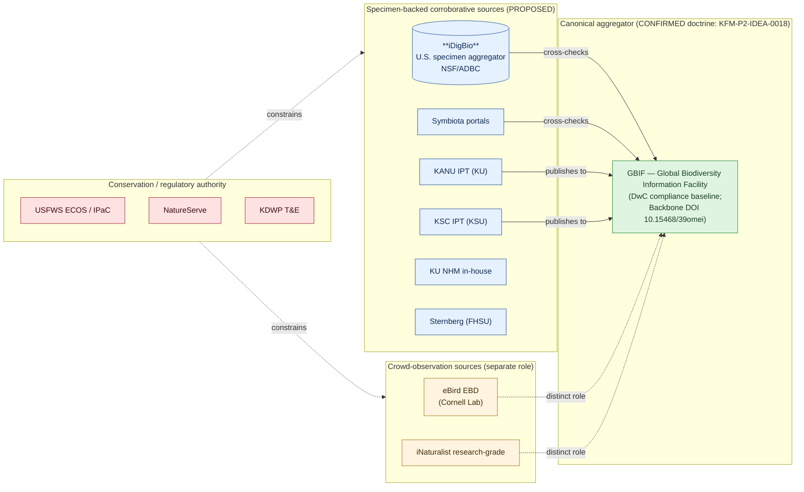
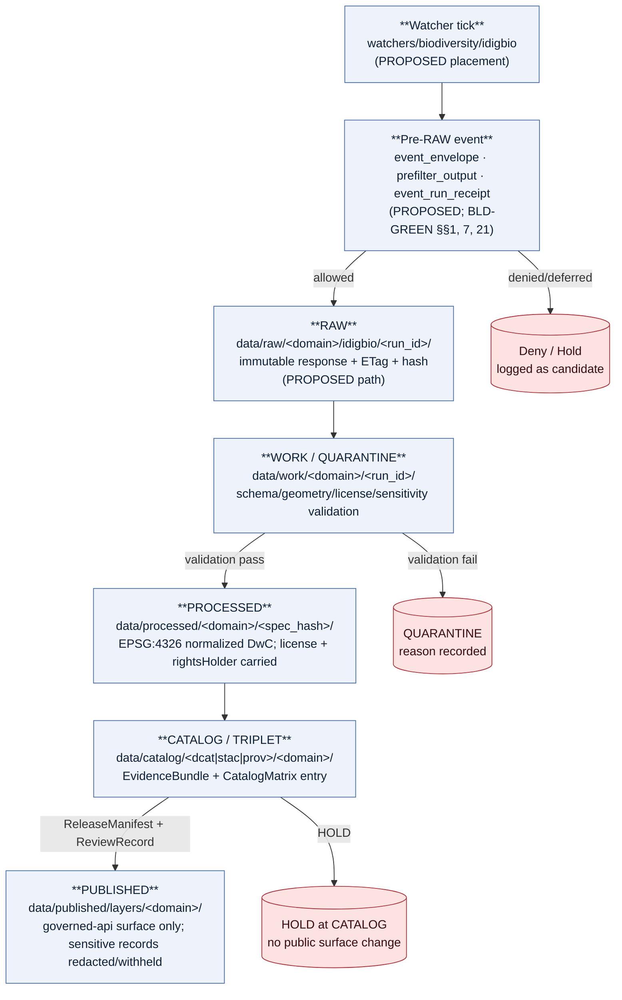

<!-- [KFM_META_BLOCK_V2]
doc_id: kfm://doc/sources/catalog/idigbio
title: iDigBio — Integrated Digitized Biocollections (Source Dossier)
type: standard
version: v2
status: draft
owners: TODO — sources steward (docs/sources/); Fauna domain owner; Flora domain owner; Source-registry steward
created: 2026-05-20
updated: 2026-05-21
policy_label: public
related:
  - docs/sources/SOURCE_DESCRIPTOR_STANDARD.md
  - docs/sources/catalog/README.md
  - docs/sources/catalog/OPEN-QUESTIONS.md
  - docs/sources/catalog/IDENTITY.md
  - docs/sources/catalog/RIGHTS-AND-SENSITIVITY-MAP.md
  - docs/sources/catalog/gbif.md
  - docs/sources/catalog/gbif/README.md
  - docs/sources/catalog/gbif/dataset-metadata.md
  - docs/domains/fauna/README.md
  - docs/domains/flora/README.md
  - docs/runbooks/fauna/SOURCE_REFRESH_RUNBOOK.md
  - docs/doctrine/directory-rules.md
  - docs/standards/PROV.md
  - schemas/contracts/v1/source/source-descriptor.schema.json
  - data/registry/sources/fauna/
  - data/registry/sources/flora/
  - connectors/idigbio/README.md
  - policy/sensitivity/fauna/
  - policy/sensitivity/flora/
tags: [kfm, sources, catalog, biodiversity, specimen, darwin-core, dwc, audubon-core, cc-by, c10-06, corroborative]
notes:
  - Path `docs/sources/catalog/idigbio.md` is PROPOSED (flat-dossier convention). It diverges from the family-folder convention used by sibling families (e.g., `docs/sources/catalog/gbif/`, `docs/sources/catalog/hifld/`). Reconciliation tracked as OQ-11 in §11.
  - Owners, badge targets, related-doc URLs, and registry filenames are placeholders pending mounted-repo inspection.
  - iDigBio is positioned in the KFM biodiversity stack as a **corroborative specimen-backed source**, not the canonical aggregator. GBIF holds the canonical-aggregator role; see §3.
  - v2 (2026-05-21):  EXTERNAL claims rewritten as paraphrased prose with traceable citations to iDigBio primary sources; license list corrected to include CC BY-NC-SA per the iDigBio IP Policy; UF/FSU/KU lead/subawardee framing corrected per idigbio.org; v1→v2 API supersession tightened; flat-path vs family-folder convention question surfaced as OQ-11.
[/KFM_META_BLOCK_V2] -->

# 🦋 iDigBio — Integrated Digitized Biocollections

> **A per-source dossier for iDigBio, the U.S. national specimen-record aggregator, capturing role, rights, cadence, sensitivity posture, and lifecycle placement under KFM governance.**

<!-- Badge row: targets are PROPOSED/TODO until mounted-repo URLs are confirmed -->

-green)

-lightgrey)
-yellow)

| | |
|---|---|
| **Status** | `draft` — PROPOSED for review |
| **Owners** | TODO — sources steward · Fauna domain owner · Flora domain owner |
| **Last updated** | 2026-05-21 |
| **Version** | v2 (citations + license-list correction + path-convention surfacing) |

---

## 📚 Contents

1. [Why this document exists](#1-why-this-document-exists)
2. [Path placement & repo fit](#2-path-placement--repo-fit)
3. [What iDigBio is (and where it sits in the KFM authority ladder)](#3-what-idigbio-is-and-where-it-sits-in-the-kfm-authority-ladder)
4. [Source-role posture](#4-source-role-posture)
5. [Source descriptor — proposed shape](#5-source-descriptor--proposed-shape)
6. [Lifecycle placement](#6-lifecycle-placement)
7. [Rights, license, and citation](#7-rights-license-and-citation)
8. [Sensitivity, geoprivacy, and deny-by-default rules](#8-sensitivity-geoprivacy-and-deny-by-default-rules)
9. [Identifiers, Darwin Core mapping, and dedupe keys](#9-identifiers-darwin-core-mapping-and-dedupe-keys)
10. [What iDigBio is **not**](#10-what-idigbio-is-not)
11. [Open questions and verification backlog](#11-open-questions-and-verification-backlog)
12. [Related docs](#12-related-docs)

---

## 1. Why this document exists

`docs/sources/catalog/idigbio.md` is the **human-readable per-source briefing** for iDigBio. It explains, in one place:

- what iDigBio is and what it is not,
- how iDigBio is positioned in the KFM source-authority hierarchy,
- what `SourceDescriptor` fields KFM expects to record for iDigBio,
- which sensitivity, license, and citation obligations propagate end-to-end,
- where iDigBio material lives across the RAW → PUBLISHED lifecycle,
- and the open questions stewards must resolve before activation.

The **normative shape** of the descriptor lives in `schemas/contracts/v1/source/source-descriptor.schema.json` (NEEDS VERIFICATION). The **machine record** lives in the source registry under `data/registry/sources/<domain>/` (NEEDS VERIFICATION). This file explains the record in prose; it does not replace it.

> [!IMPORTANT]
> **No claim in this doc asserts mounted-repo presence.** Per Directory Rules and KFM truth posture, every implementation-shaped claim below is PROPOSED or NEEDS VERIFICATION until a mounted-repo inspection or PR confirms the corresponding artifact. EXTERNAL claims about iDigBio's APIs and policies are cited inline to iDigBio's primary documentation and are version-sensitive (see OQ-10).

[Back to top](#-idigbio--integrated-digitized-biocollections)

---

## 2. Path placement & repo fit

**Proposed path:** `docs/sources/catalog/idigbio.md` *(flat-dossier convention — diverges from the family-folder pattern used by `docs/sources/catalog/gbif/` and `docs/sources/catalog/hifld/`; see OQ-11)*

**Directory Rules basis** (CONFIRMED doctrine; specific path NEEDS VERIFICATION):

- `docs/` is the canonical human-facing control plane (Directory Rules v1.1 §5, §6.1).
- `docs/sources/` is enumerated in Directory Rules v1.1 §6.1 as the home for **source-descriptor standards and source families** — i.e., human prose about sources, not the machine descriptor itself.
- `catalog/` as a subdirectory of `docs/sources/` is a **PROPOSED convention** consistent with prior-session per-source dossier authoring; it is **not** explicitly enumerated in Directory Rules §6.1 and remains NEEDS VERIFICATION until a `docs/sources/README.md` or ADR freezes the layout.

> [!WARNING]
> **Convention divergence.** Two competing layouts exist in prior-session work:
> - **Flat dossier** (this file): `docs/sources/catalog/<family>.md` — used by FamilySearch, KHRI, and this iDigBio dossier.
> - **Family folder**: `docs/sources/catalog/<family>/README.md` plus per-surface product pages — used by `gbif/`, `hifld/`.
>
> Both cannot coexist long-term without confusion. Reconciliation is **OQ-11** below. Either pick one; or document the rule for when each applies. Until then, this file uses the flat-dossier convention because it was the convention in force when authored.

| Concern | Belongs here? | Where it actually lives |
|---|---|---|
| Human-readable description of iDigBio | ✅ this file | `docs/sources/catalog/idigbio.md` |
| Machine source-descriptor record | ❌ | `data/registry/sources/<domain>/idigbio.<ext>` (PROPOSED; NEEDS VERIFICATION) |
| Source-descriptor **schema** (shape) | ❌ | `schemas/contracts/v1/source/source-descriptor.schema.json` (PROPOSED home per ADR-0001) |
| Source-descriptor **meaning** (semantics) | ❌ | `contracts/source/source_descriptor.md` (PROPOSED) |
| iDigBio fetcher / admitter | ❌ | `connectors/idigbio/` (PROPOSED per Directory Rules §7.3) |
| Allow/deny/restrict/abstain policy | ❌ | `policy/sensitivity/<domain>/…` (PROPOSED) |
| Pipeline spec invoking iDigBio | ❌ | `pipeline_specs/fauna/…`, `pipeline_specs/flora/…` (PROPOSED) |
| Validator fixtures for iDigBio responses | ❌ | `fixtures/domains/<domain>/idigbio/…` (PROPOSED) |

> [!NOTE]
> **Cross-domain reach.** iDigBio is **not single-domain**. It primarily serves the Fauna and Flora domains, but its specimen scope can touch Geology (paleontological collections), Habitat (vouchered occurrence context), and Archaeology (faunal/floral remains where DwC fields apply). The dossier lives once under `docs/sources/catalog/`; per-domain wiring lives under each domain's lane.

[Back to top](#-idigbio--integrated-digitized-biocollections)

---

## 3. What iDigBio is (and where it sits in the KFM authority ladder)

CONFIRMED doctrine: the **Kansas biodiversity stack** consolidated in Pass 10 idea **C10-06** lists "GBIF, iNaturalist, eBird EBD, NatureServe, USFWS, **iDigBio**, Symbiota, KU NHM (~454k specimens), FHSU Sternberg" as the standing source mix, with iDigBio called out as a **specimen-record aggregator** distinct from crowd-observation sources.

EXTERNAL: iDigBio (Integrated Digitized Biocollections) is the U.S. National Resource funded by the National Science Foundation (NSF) under the Advancing Digitization of Biodiversity Collections (ADBC) program, with the mission of curating, connecting, and publishing data and images for biological specimens for use by the research community, government, education, and the public. It was established in 2011 as the national coordinating center for the ADBC grant, awarded by NSF to the University of Florida, with Florida State University and the University of Kansas as grant subawardees. 

> [!TIP]
> **KFM-relevant context:** the University of Kansas is explicitly named as an iDigBio grant subawardee, which is one reason iDigBio coverage of Kansas biodiversity material is materially rich relative to many other states. This does **not** displace the KFM authority hierarchy below — KU NHM / KANU IPT / KSU KSC remain the primary direct sources; iDigBio remains corroborative.

EXTERNAL: Records submitted to iDigBio receive a Globally Unique Identifier of type UUID, exposed through the `idigbio:uuid` data field; data elements generally conform to the TDWG (Biodiversity Information Standards) Darwin Core and Audubon Core vocabularies.  The public iDigBio API is a RESTful web service that accepts HTTP GET and POST requests for data read operations only and returns JSON; every response includes a top-level attribution block identifying the recordsets covered by the query. 

### 3.1 KFM authority ladder for biodiversity occurrences

CONFIRMED doctrine (KFM-P20-IDEA-0001 + KFM-P2-IDEA-0018 + KFM-P2-PROG-0001/0002): the KFM biodiversity hierarchy treats sources as **distinct authoritative and corroborative families**, not as a flat list. iDigBio sits in a **specific role** within that ladder:

> [!NOTE]
> Diagram reflects KFM doctrine on source-role separation (Pass 10 C10-06, atlas idea KFM-P20-IDEA-0001, watcher cards KFM-P2-PROG-0001/0002). GBIF Backbone DOI is CONFIRMED per C7-08. Specific package/route/registry placements are PROPOSED and NEEDS VERIFICATION.

[Back to top](#-idigbio--integrated-digitized-biocollections)

---

## 4. Source-role posture

CONFIRMED doctrine (Domains Atlas §24.1.3, KFM-P1-PROG-0007): every admitted source has a `source_role` set at admission and never silently upgraded. The enumeration is `observed | regulatory | modeled | aggregate | administrative | candidate | synthetic`.

PROPOSED role mapping for iDigBio response subsets:

| iDigBio response | PROPOSED `source_role` | Rationale |
|---|---|---|
| `/v2/search/records/` specimen records with `basisofrecord` ∈ {`preservedspecimen`, `fossilspecimen`, `materialsample`} | **`observed`** (specimen-backed) | The record carries a vouchered physical object as evidence; this is the corpus's preferred admissible-observation form (KFM-P2-PROG-0001/0002). |
| `/v2/search/records/` records with `basisofrecord` ∈ {`humanobservation`, `machineobservation`} | **`observed`** (non-specimen) | Still observation, but the specimen-primacy preference does not apply; treat as iNaturalist-class evidence and **do not** allow it to outrank KANU/KSC/KU NHM/Sternberg specimen-backed records in dedupe. |
| `/v2/search/media/` media records (images, audio, video) | **`observed`** (media-attached) | Carried as `mediarecords[]` references on the parent occurrence (Audubon Core); license-mapping required per §7. |
| `/v2/summary/count/*` aggregations | **`aggregate`** | Records-per-recordset counts; `role_aggregation_unit` MUST be set to prevent geometry-scope drift on join. |
| `/v2/search/recordsets/` recordset metadata | **`administrative`** | Recordset is a publisher's bundle of records, not an observation. |
| Records flagged with iDigBio data-quality issues (DQS < threshold, missing geopoint, missing date) | **`candidate`** | Carries `role_candidate_disposition` ∈ `pending | merged | rejected | quarantined`; PUBLISHED edge forbidden until merged. |

> [!IMPORTANT]
> **No silent upgrade.** Source-role corrections produce a **new descriptor** and a `CorrectionNotice`; they never edit a published descriptor in place (Atlas §24.1.3).

[Back to top](#-idigbio--integrated-digitized-biocollections)

---

## 5. Source descriptor — proposed shape

The descriptor below is the **human-readable view** of the record that lives under `data/registry/sources/<domain>/idigbio.<ext>` (NEEDS VERIFICATION). Field names are PROPOSED until the mounted `source-descriptor.schema.json` is verified against this view. EXTERNAL values are cited inline to iDigBio's primary documentation.

| Field | PROPOSED value for iDigBio | Notes |
|---|---|---|
| `source_id` | `idigbio-search-api-v2` | Stable. Renames require a new descriptor + `CorrectionNotice`. |
| `source_role` | per-subset (see §4) | Set at admission; never edited in place. |
| `role_authority` | `Integrated Digitized Biocollections (iDigBio) — National Resource funded by NSF/ADBC; lead award to the University of Florida (with Florida State University and University of Kansas as subawardees)` | EXTERNAL: iDigBio's lead award is to the University of Florida; Florida State University and the University of Kansas are grant subawardees.  |
| `endpoint_base` | `https://search.idigbio.org/v2/` | EXTERNAL: v2 Search API base, exposed as a RESTful JSON service.  |
| `endpoint_records` | `https://search.idigbio.org/v2/search/records/` | EXTERNAL: Specimen/occurrence record search endpoint; accepts GET or POST with a JSON `rq` query body.  |
| `endpoint_media` | `https://search.idigbio.org/v2/search/media` | EXTERNAL: Media metadata search endpoint; returns media-record metadata (not the media bytes themselves).  |
| `endpoint_summary` | `https://search.idigbio.org/v2/summary/count/{records\|media\|recordsets}/` | EXTERNAL: Summary count endpoints exist for records, media records, and recordsets; admit as `aggregate`.  |
| `bulk_distribution` | iDigBio Portal downloads (Darwin Core Archive) | EXTERNAL: Providers publish to iDigBio via Darwin Core Archive packages produced by IPT or Symbiota and exposed on an RSS feed.  |
| `data_standards` | Darwin Core (TDWG); Audubon Core for media | EXTERNAL: iDigBio records generally conform to the TDWG Darwin Core and Audubon Core vocabularies.  |
| `identifier_field` | `idigbio:uuid` (record UUID); `dwc:occurrenceID` (provider GUID) | EXTERNAL: Every iDigBio record is assigned a UUID-typed GUID exposed via the `idigbio:uuid` field.  |
| `cadence` | NEEDS VERIFICATION — bulk: snapshot-based; API: continuous | Use ETag / Last-Modified for incremental probes; full DwC-A refresh on a steward-chosen interval (e.g., quarterly). The corpus does not pin a cadence for iDigBio specifically. |
| `default_license` | `CC BY 4.0` default; alternatives are `CC0`, `CC BY-SA 4.0`, and `CC BY-NC-SA 4.0` | EXTERNAL: iDigBio's IP policy requires providers to assign one of CC0, CC BY, CC BY-SA, or CC BY-NC-SA to their submissions; if a provider does not select a license, the default applied is CC BY.  **Per-record license MUST be carried; do not collapse to a single source-wide license.** |
| `rights_holder_field` | `dcterms:rightsHolder` (per provider) | EXTERNAL: iDigBio surfaces attribution as submitted by providers, paired with the chosen Creative Commons license for each submission.  |
| `attribution_field` | `dcterms:bibliographicCitation` per record + recordset-level provider attribution | iDigBio downloads include a per-record citation suggestion plus a `citations.txt` (see §7.3). |
| `sensitivity_default` | **T0 for non-sensitive specimen records; T4 (deny) for occurrences of sensitive taxa** (see §8) | Sensitivity is **record-level**, not source-level — the descriptor records the **default**; per-record evaluation gates against listed/restricted taxa. |
| `geometry_field` | `geopoint` (lat/lon); `decimalLatitude`/`decimalLongitude` in raw DwC | EPSG:4326 normalization is required per KFM-P26-IDEA-0012 (canonical DwC normalizer). |
| `temporal_field` | `datecollected` (indexed); `dwc:eventDate` (raw) | Temporal-scope-distinct from `datemodified`, `etag` (record version). |
| `kfm_spec_hash` | computed at descriptor-write time | JCS+SHA-256 over the canonicalized descriptor body. NEEDS VERIFICATION against mounted hashing tooling. |
| `activation_decision` | PROPOSED: `needs-review` until stewards confirm sensitive-taxa policy | Per BLD-COMP §8.1-8.2 (Unified Manual §3.6): connectors/watchers stay inactive until `SourceActivationDecision` is `allowed` or `restricted`. |

<strong>📜 Reference: indexed query fields available on iDigBio Records (EXTERNAL)</strong>

 

EXTERNAL: The iDigBio v2 Search API exposes a fielded query language whose indexed terms include identifiers (`uuid`, `recordset`, `occurrenceid`), specimen metadata (`catalognumber`, `collectioncode`, `collectionid`, `collectionname`, `institutioncode`, `institutionid`, `institutionname`), taxonomy (`kingdom`, `phylum`, `class`, `order`, `family`, `genus`, `scientificname`, `specificepithet`, `infraspecificepithet`, `commonname`, `highertaxon`, `typestatus`), event (`datecollected`, `datemodified`, `etag`, `collector`, `fieldnumber`), place (`continent`, `country`, `stateprovince`, `county`, `municipality`, `locality`, `geopoint`, `mindepth`, `maxdepth`, `minelevation`, `maxelevation`), and media flags (`hasImage`, `mediarecords`). 

Raw DwC content is also queryable via `data.dwc:*` prefixes (e.g., `data.dwc:dynamicProperties`, `data.dwc:verbatimLatitude`). The fielded query language is documented at the iDigBio search-api wiki; queries are passed via the `rq` parameter as nested JSON objects. 

[Back to top](#-idigbio--integrated-digitized-biocollections)

---

## 6. Lifecycle placement

CONFIRMED doctrine: every source follows the canonical lifecycle **RAW → WORK / QUARANTINE → PROCESSED → CATALOG / TRIPLET → PUBLISHED**, with promotion as a governed state transition, not a file move (Directory Rules §0; Atlas §24.6.1; Unified Manual §3.2).

| Phase | What iDigBio material looks like here | Required artifact |
|---|---|---|
| Pre-RAW | Watcher classification (`api` type) + event envelope | `event_run_receipt` (PROPOSED) |
| RAW | Immutable JSON response payload + ETag + retrieval timestamp + hash | `SourceDescriptor` reference; payload hash |
| WORK / QUARANTINE | Schema check (required DwC fields), geometry validity (EPSG:4326 bounds), license presence, sensitivity match | `TransformReceipt`; `ValidationReport`; `PolicyDecision` |
| PROCESSED | Canonicalized KFM record carrying `license`, `rightsHolder`, `datasetID`, dedupe key | `ValidationReport` pass; `RedactionReceipt` if sensitivity applies |
| CATALOG / TRIPLET | DCAT/STAC/PROV catalog entry; EvidenceBundle; graph projection if applicable | `CatalogMatrix entry`; `EvidenceBundle` |
| PUBLISHED | Public-safe occurrence layer via governed API; sensitive occurrences excluded or generalized | `ReleaseManifest`; rollback target; correction path; `ReviewRecord` |

> [!WARNING]
> **Watcher-as-non-publisher invariant** (CONFIRMED doctrine, KFM-P20-PROG-0019; Directory Rules §7.3). The iDigBio connector MUST NOT write under `data/processed/`, `data/catalog/`, or `data/published/`. It writes RAW (and quarantine, when applicable) and emits receipts; everything else is downstream.

[Back to top](#-idigbio--integrated-digitized-biocollections)

---

## 7. Rights, license, and citation

### 7.1 License posture

EXTERNAL: iDigBio's IP Policy requires every content provider to designate one of four Creative Commons mechanisms at submission — CC0 (public-domain dedication), CC BY (attribution), CC BY-SA (attribution + share-alike), or CC BY-NC-SA (attribution + non-commercial + share-alike) — and applies CC BY as the default when no choice is recorded.  iDigBio neither claims nor permits providers to claim IP rights over public-domain materials served through the portal. 

PROPOSED KFM rule (consistent with KFM-P2-PROG-0001 license-map-and-attribute requirement): **the per-record license MUST be carried end-to-end** — RAW → WORK → PROCESSED → CATALOG → PUBLISHED — and never collapsed to a single source-wide value. Records lacking `dcterms:license` and `dcterms:rightsHolder` at WORK validation MUST be quarantined, not normalized with a default.

> [!CAUTION]
> **CC BY-NC-SA cannot pass straight to PUBLISHED.** The `-NC` clause is not a public-safe license for KFM's open public layers without an additional non-commercial-use review and a tier downgrade with a `RedactionReceipt`. Treat CC BY-NC-SA records as **restricted by default** at promotion until policy clarifies.

### 7.2 Attribution

EXTERNAL: iDigBio surfaces provider-submitted attribution metadata alongside the chosen Creative Commons license for every served submission.  The portal also exposes a recordset-level provider block in every API response.

PROPOSED carrier: KFM records derived from iDigBio MUST carry both **per-record `rightsHolder`** and **recordset-level provider attribution**; the EvidenceBundle MUST resolve to both, not to one.

### 7.3 Citation

EXTERNAL: Every iDigBio API response carries a top-level attribution block listing the recordsets covered by the request, sometimes including counts.  Portal downloads also bundle a citations file enumerating the contributing recordsets per query, intended to ground downstream citations in the originating providers.

PROPOSED KFM behavior: every PUBLISHED claim grounded in iDigBio material MUST resolve through its `EvidenceBundle` to a citation that includes (a) the iDigBio query, (b) the retrieval timestamp, (c) the contributing recordset identifier(s), and (d) the per-record provider attribution.

[Back to top](#-idigbio--integrated-digitized-biocollections)

---

## 8. Sensitivity, geoprivacy, and deny-by-default rules

CONFIRMED doctrine (Atlas §24.5.1 sensitivity tier scheme; KFM-P1-PROG-0035 rare-species geoprivacy; KFM-P25-IDEA-0006 sensitive fauna precision degradation; KFM-P25-PROG-0017 fauna geoprivacy conditional schema; KFM-P25-PROG-0023 NatureServe rare-data access gate):

| Record class | Default KFM tier | Allowed transforms | Required gates |
|---|---|---|---|
| Common-taxon specimen records, no rare flag | **T0** Open | None required | Standard Gates A–G |
| Specimen records of taxa listed by USFWS ECOS / NatureServe / KDWP T&E / state-listed | **T4** Denied (default) | Generalization to county/HUC + `RedactionReceipt` → T1 | `RedactionReceipt` + `ReviewRecord` + `PolicyDecision` |
| Specimen records with precise locality on sensitive sites (sacred, archaeological co-location, private parcels) | **T4** Denied | Steward review + generalization → T2 or T1 | `RedactionReceipt` + `ReviewRecord` + `PolicyDecision` |
| Aggregate counts via `/v2/summary/count/` | **T0/T1** | `role_aggregation_unit` set; geometry-scope guard | `AggregationReceipt` |
| `CC BY-NC-SA`–licensed records | **T2+** at admission, regardless of taxon | NonCommercial-use review; downgrade with `RedactionReceipt` | License-tier gate + `PolicyDecision` |

> [!CAUTION]
> **iDigBio does not pre-filter for KFM sensitivity.** iDigBio does not know KFM's sensitivity rubric, the KDWP state-listed register, the NatureServe rare-data terms, or any KFM steward's correction state. Treat every iDigBio record as **sensitivity-unevaluated at admission** and run the deny-by-default gate at WORK before any normalization. This rule applies whether the iDigBio record is reached via the v2 Search API, the portal download, or a third-party mirror.

> [!WARNING]
> **Public-layer protection.** No record promoted from iDigBio to a PUBLISHED layer at point precision may name a T4-defaulted taxon without a current `RedactionReceipt` + `ReviewRecord`. The watcher and the catalog closer both MUST honor this; cross-system tests should prove no public client can reach RAW or WORK iDigBio bytes (Atlas Master Validator/Test Catalogue §20.4).

[Back to top](#-idigbio--integrated-digitized-biocollections)

---

## 9. Identifiers, Darwin Core mapping, and dedupe keys

### 9.1 Identifier hierarchy

| Identifier | Source | Stability | KFM use |
|---|---|---|---|
| `idigbio:uuid` | iDigBio (record-level GUID, type UUID — EXTERNAL iDigBio assigns each record a UUID-typed GUID exposed through `idigbio:uuid`)  | Stable per iDigBio promise | Carrier for EvidenceRef to the iDigBio response |
| `dwc:occurrenceID` | Provider (institution) | Provider-controlled; may change on republish | Primary cross-source identifier |
| `(institutionCode, collectionCode, catalogNumber)` | Provider | Stable for vouchered specimens | Tiebreaker for dedupe |
| `recordset` UUID | iDigBio | Stable | Attribution carrier |
| ITIS TSN → GBIF Backbone fallback | KFM taxonomic anchor (C7-08, Backbone DOI `10.15468/39omei`) | Pinned per run receipt | Taxonomic identity; replay-safe |

> [!TIP]
> **Taxonomic anchoring for replay.** The corpus is firm at **C7-08**: any KFM record that uses GBIF Backbone (via direct GBIF, via iDigBio cross-check, or via Symbiota / IPT) MUST capture the Backbone DOI version (`10.15468/39omei@<snapshot>`) in its `RunReceipt`. Backbone drift across calls is a build break for any claim that depends on replayable name resolution.

### 9.2 Dedupe key (PROPOSED, consistent with KFM-P2-PROG-0001)

PROPOSED dedupe order across the biodiversity stack:

1. **Primary key:** `(institutionCode|catalogNumber)` exact match for specimen records — collapses iDigBio, GBIF, KANU, KSC, Symbiota, and direct IPT pulls of the **same specimen** into one canonical KFM occurrence.
2. **Tiebreaker:** rounded-coordinate fallback (e.g., 3 decimal places) + `eventDate` + `scientificName`.
3. **Authority precedence on conflict:** prefer the source closest to the specimen — direct IPT > iDigBio > GBIF — but **record both EvidenceRefs**; conflict is preserved, not smoothed.

> [!IMPORTANT]
> **eBird and iNaturalist records do not collapse against specimen records.** Citizen-science observation IDs must not dedupe against `institutionCode|catalogNumber`; they are a separate occurrence-class in the catalog (KFM-P2-PROG-0005, KFM-P2-IDEA-0020).

### 9.3 Darwin Core canonicalization

CONFIRMED doctrine (KFM-P26-IDEA-0012 Canonical DwC normalizer before dedupe; KFM-P13-PROG-0026 DwC↔STAC/DCAT mapper): iDigBio's indexed DwC fields and the raw `data.dwc:*` payload pass through a canonical normalizer that produces:

- strict field-mapping (drop iDigBio-specific Elasticsearch lowercasing back to canonical TDWG term casing where consumers expect it),
- EPSG:4326 geometry,
- deterministic field order,
- a stable `kfm:spec_hash` (JCS + SHA-256),

…**before** dedupe or licensing decisions are made. The normalizer is the cut between RAW and WORK; it is not optional.

[Back to top](#-idigbio--integrated-digitized-biocollections)

---

## 10. What iDigBio is **not**

> [!CAUTION]
> Each of the following is a guardrail. The descriptor MUST reflect every one of them; the watcher and policy gates MUST refuse to silently violate them.
>
> - **Not the canonical biodiversity aggregator for KFM.** GBIF holds that role (KFM-P2-IDEA-0018). iDigBio is corroborative and U.S.-scoped.
> - **Not a substitute for KU NHM / Sternberg / KANU / KSC IPT.** When a Kansas-based specimen record is available from the in-state institution's own IPT, that direct source is the preferred admission path; iDigBio is the **cross-check** and **coverage fill**, not the primary. (KU being an iDigBio subawardee does not change this.)
> - **Not a citizen-science observation source.** iDigBio carries specimen-backed records (and some human/machine observations); it is not a substitute for eBird EBD or iNaturalist research-grade — those have their own admission terms and their own role.
> - **Not a conservation authority.** Listed-status decisions come from USFWS ECOS, NatureServe, and KDWP — never inferred from iDigBio record counts or coverage.
> - **Not a media license assertion.** Media records carry their own license; do not assume the parent occurrence's license applies to attached images, audio, or video.
> - **Not pre-filtered for sensitivity.** iDigBio does not know KFM's sensitivity rubric. The deny-by-default gate at WORK is non-negotiable.
> - **Not a real-time feed.** iDigBio is a snapshot-aggregator with provider-controlled refresh cadence. Treat freshness with a stale-state badge in the UI where it matters.
> - **Not the v1 API.** EXTERNAL: iDigBio's v1 API has been superseded by the v2 / iDigBio Search API, and providers are advised to migrate to the most recent version.  KFM MUST pin v2 explicitly; v1 admission is forbidden.

[Back to top](#-idigbio--integrated-digitized-biocollections)

---

## 11. Open questions and verification backlog

| # | Item | Status | Evidence that would settle it |
|---|---|---|---|
| OQ-1 | Does the mounted repo expose `docs/sources/catalog/` as the canonical subdirectory, or a different convention? | NEEDS VERIFICATION | `docs/sources/README.md` or ADR; mounted-repo `ls docs/sources/` |
| OQ-2 | Which domain owns the iDigBio descriptor — Fauna, Flora, both, or a shared cross-domain registry? | UNKNOWN | `data/registry/sources/<domain>/` inspection; per-domain README; Atlas §24.1.3 cross-domain rule check |
| OQ-3 | What watcher cadence is policy-set for iDigBio (snapshot interval; ETag probe interval)? | NEEDS VERIFICATION | `pipeline_specs/<domain>/idigbio.yaml`; steward decision in `control_plane/source_authority_register.yaml` |
| OQ-4 | Does KFM ingest iDigBio via the v2 Search API (record-by-record), portal DwC-A bulk downloads, or both? Default cadence by mode? | UNKNOWN | Connector README; pipeline spec; ADR if mode is policy-significant |
| OQ-5 | Is the sensitive-taxa list at WORK driven by NatureServe + USFWS + KDWP unioned, or per-domain separately? | NEEDS VERIFICATION | `policy/sensitivity/<domain>/…`; `data/registry/sensitivity/` |
| OQ-6 | Does the dedupe key `(institutionCode\|catalogNumber)` need a normalizer for case/whitespace/punctuation before comparison? | NEEDS VERIFICATION | `tools/validators/biodiversity_dwca_validator/`; canonical normalizer spec |
| OQ-7 | Should iDigBio-derived public points be released at original precision, generalized cells, or both (with tier separation)? | NEEDS VERIFICATION | `policy/release/<domain>/`; ReviewRecord |
| OQ-8 | What is the rollback target for an iDigBio-grounded PUBLISHED layer when a provider revokes a recordset's license? | PROPOSED | `release/candidates/<domain>/` rollback card; correction flow |
| OQ-9 | Does Fauna or Flora maintain a `dataset_id_allowlist` against iDigBio recordsets to bias against low-quality recordsets at admission? | UNKNOWN | Source registry entry; connector config |
| OQ-10 | iDigBio API v1 vs v2 — pin v2 explicitly. **CONFIRMED-EXTERNAL** that v1 is superseded; v1 endpoint behavior past EOL is still unknown. | NEEDS VERIFICATION (EXTERNAL); v1 deprecation CONFIRMED v1 has been superseded by v2 and the v1 spec advises migration to the current version  | iDigBio status page; current API docs |
| OQ-11 | **Flat-dossier vs family-folder convention** under `docs/sources/catalog/`. iDigBio uses the flat-dossier pattern (`idigbio.md`); GBIF and HIFLD use the family-folder pattern (`gbif/`, `hifld/`). Both cannot coexist long-term. | OPEN — ADR-class | `docs/sources/catalog/README.md` or ADR fixing the rule; cross-cutting OPEN-DSC-* register entry |
| OQ-12 | **Per-record CC BY-NC-SA records.** Are NonCommercial-licensed iDigBio records admissible to PUBLISHED at all, or always quarantined? | OPEN — policy-class | `policy/sensitivity/<domain>/`; ReviewRecord; steward decision |
| OQ-13 | License-list completeness. iDigBio's IP Policy enumerates CC0 / CC BY / CC BY-SA / CC BY-NC-SA. Should KFM also handle records that arrive **without** a license value (legacy submissions)? Default: quarantine. | NEEDS VERIFICATION | `tools/validators/license_resolver/`; ingest fixture coverage |
| OPEN-DSC-03 | KFM namespace token for STAC Collection summaries: `kfm:` vs `ks-kfm:`. Tracked lane-wide. | OPEN — corpus C4-01 unresolved | `docs/sources/catalog/OPEN-QUESTIONS.md` (lane-wide register) |

[Back to top](#-idigbio--integrated-digitized-biocollections)

---

## 12. Related docs

> [!NOTE]
> Targets below are PROPOSED. Each is NEEDS VERIFICATION against the mounted repo before it should be relied on as a live link.

- `docs/sources/SOURCE_DESCRIPTOR_STANDARD.md` — the source-descriptor standard this dossier instantiates (PROPOSED)
- `docs/sources/catalog/README.md` — catalog index (PROPOSED; OQ-1)
- `docs/sources/catalog/OPEN-QUESTIONS.md` — lane-wide `OPEN-DSC-*` register (PROPOSED; bears OPEN-DSC-03 and OQ-11)
- `docs/sources/catalog/IDENTITY.md` — Collection-id + namespace conventions (PROPOSED)
- `docs/sources/catalog/RIGHTS-AND-SENSITIVITY-MAP.md` — per-license + per-feature sensitivity map (PROPOSED)
- `docs/sources/catalog/gbif.md` *or* `docs/sources/catalog/gbif/README.md` — companion dossier; GBIF is the canonical aggregator referenced throughout this file (path is **PROPOSED** and pending OQ-11 reconciliation)
- `docs/sources/catalog/gbif/dataset-metadata.md`, `docs/sources/catalog/gbif/occurrence-api.md` — per-surface product pages under the family-folder convention (PROPOSED)
- `docs/sources/catalog/inaturalist.md` — companion dossier; distinct role (citizen-science observation) (PROPOSED)
- `docs/sources/catalog/ebird.md` — companion dossier; distinct role (citizen-science avian) (PROPOSED)
- `docs/sources/catalog/symbiota.md` — companion dossier; sibling specimen-backed aggregator (PROPOSED)
- `docs/domains/fauna/README.md` — Fauna domain README; primary downstream consumer (PROPOSED)
- `docs/domains/flora/README.md` — Flora domain README; primary downstream consumer (PROPOSED)
- `docs/runbooks/fauna/SOURCE_REFRESH_RUNBOOK.md` — operational refresh runbook (CONFIRMED authored prior session; mounted-repo presence NEEDS VERIFICATION)
- `docs/doctrine/directory-rules.md` — governs path placement (this file)
- `docs/doctrine/truth-posture.md` — governs the CONFIRMED/PROPOSED/EXTERNAL labels used here (PROPOSED)
- `docs/architecture/governed-api.md` — the only public path for iDigBio-derived claims (PROPOSED)
- `docs/standards/PROV.md` — W3C PROV-O profile (note: filename `PROV.md` vs corpus `PROVENANCE.md` is an open naming question — see `directory-rules.md §18` OPEN-DR-01)
- `schemas/contracts/v1/source/source-descriptor.schema.json` — normative descriptor shape (PROPOSED home per ADR-0001)
- `contracts/source/source_descriptor.md` — descriptor semantics (PROPOSED)
- `connectors/idigbio/README.md` — connector implementation (PROPOSED)
- `policy/sensitivity/fauna/`, `policy/sensitivity/flora/` — sensitivity policy bundles (PROPOSED)

📎 Appendix — primary external sources cited in this dossier

EXTERNAL citations resolve to iDigBio's primary documentation:

- **iDigBio IP Policy** — `https://www.idigbio.org/content/idigbio-intellectual-property-policy` — license enumeration (CC0, CC BY, CC BY-SA, CC BY-NC-SA) and CC BY default.
- **iDigBio Home** — `https://www.idigbio.org/` — NSF/ADBC funding lineage; UF lead, FSU + KU subawardees.
- **iDigBio Wikipedia entry** — broader institutional framing; cross-checked against iDigBio's own pages.
- **iDigBio Search API Wiki (Home + Examples + Code Samples)** — `https://github.com/iDigBio/idigbio-search-api/wiki` — v2 REST/JSON behavior, endpoint shapes, indexed field enumeration, attribution-block presence in responses.
- **iDigBio v1 API Specification (archived)** — `https://www.idigbio.org/wiki/index.php?title=IDigBio_API_v1_Specification` — `idigbio:uuid` UUID-typed GUID; TDWG DwC + Audubon Core conformance statement; v1 deprecation in favor of v2.
- **iDigBio Data Ingestion Guidance** — `https://www.idigbio.org/wiki/index.php?title=Data_Ingestion_Guidance` — DwC-Archive publishing path via IPT / Symbiota.

External sources are version-sensitive; the v1 API spec page itself notes its supersession. KFM stewards should re-verify cited claims on a steward-chosen cadence (OQ-10).

---

> *Where a file lives encodes who owns it, what governance it answers to, and what lifecycle it belongs to. iDigBio is a corroborative specimen-backed source; it does not get to be the authority just because it is convenient.* — paraphrased from KFM Directory Rules §0

**Last updated:** 2026-05-21 · **Status:** `draft` · **Version:** v2 · **Path status:** PROPOSED (flat-dossier; see OQ-11) · [⬆ Back to top](#-idigbio--integrated-digitized-biocollections)
