<!-- [KFM_META_BLOCK_V2]
doc_id: kfm://doc/docs-sources-catalog-idigbio-media-records
title: iDigBio Media Records
type: product-page
version: v0.2
status: draft
owners: <PLACEHOLDER — Docs steward + Source steward for idigbio>
created: 2026-05-20
updated: 2026-05-21
policy_label: public
related:
  - docs/sources/catalog/idigbio/README.md
  - docs/sources/catalog/idigbio/occurrence-search.md
  - docs/sources/catalog/idigbio.md
  - docs/sources/catalog/README.md
  - docs/sources/catalog/IDENTITY.md
  - docs/sources/catalog/PROFILES.md
  - docs/sources/catalog/RIGHTS-AND-SENSITIVITY-MAP.md
  - docs/sources/catalog/OPEN-QUESTIONS.md
  - docs/sources/catalog/_template/SOURCE_PRODUCT_TEMPLATE.md
  - docs/sources/catalog/idigbio/_examples/audubon-core-example.json
  - docs/doctrine/directory-rules.md
  - docs/standards/PROV.md
  - docs/domains/fauna/README.md
  - docs/domains/flora/README.md
tags: [kfm, docs, sources, catalog, idigbio, media, audubon-core, deny-default, exif-risk]
notes:
  - "PROPOSED product-page scaffold; sibling-link presence verified in prior Claude Code session, NEEDS VERIFICATION against mounted repo."
  - "v0.2: applied KFM presentation standard; added Audubon Core ↔ Darwin Core surface contrast, accessURI / byte-handling section (hot-link vs mirror), EXIF / embedded-geo leak risk callout, per-media-license-not-occurrence-license enforcement, and parallel structure with the iDigBio dossier (which currently sits at the flat path — see OPEN-IDB-CONV-01)."
[/KFM_META_BLOCK_V2] -->

# 📷 iDigBio Media Records

> Specimen-attached images, audio, video, and 3D scans — described under **Audubon Core** (not Darwin Core), with **byte locations hosted by the original provider, not by iDigBio or KFM**.

[](#) [](#) [](./README.md) [](#3-audubon-core-vs-darwin-core--surface-contrast) [-9a6700)](#14-media-byte-handling-and-caching) [-orange)](#9-rights-and-sensitivity) [](#9-rights-and-sensitivity) [](#) [-yellow)](#16-open-questions)

**Status:** PROPOSED — scaffold + v0.2 polish · **Family:** [`idigbio`](./README.md) · **Owners:** `<PLACEHOLDER — Docs steward + Source steward for idigbio>` · **Last reviewed:** 2026-05-21

> [!IMPORTANT]
> **Three operational facts dominate this product**: (1) media records carry **Audubon Core**, not Darwin Core — different vocabulary, different field semantics; (2) iDigBio returns **metadata only** — the actual bytes (images, audio, video) live at `accessURI` URLs hosted by the original provider, which can move, change, or disappear; (3) **media license is per-media** and does **not** inherit from the parent occurrence — a CC0 specimen record can carry a CC BY photograph, and the photographer's rights apply to the photograph regardless of the specimen-data license.

---

## Mini-TOC

- [1. Overview](#1-overview)
- [2. Source authority](#2-source-authority)
- [3. Audubon Core vs Darwin Core — surface contrast](#3-audubon-core-vs-darwin-core--surface-contrast)
- [4. Catalog profiles used](#4-catalog-profiles-used)
- [5. Collection identity](#5-collection-identity)
- [6. Provenance fields](#6-provenance-fields)
- [7. Temporal handling](#7-temporal-handling)
- [8. Geometry and projection](#8-geometry-and-projection)
- [9. Rights and sensitivity](#9-rights-and-sensitivity)
- [10. Validation and catalog closure](#10-validation-and-catalog-closure)
- [11. Related contracts and schemas](#11-related-contracts-and-schemas)
- [12. Related connectors and pipelines](#12-related-connectors-and-pipelines)
- [13. Lifecycle diagram](#13-lifecycle-diagram)
- [14. Media-byte handling and caching](#14-media-byte-handling-and-caching)
- [15. Examples](#15-examples)
- [16. Open questions](#16-open-questions)
- [17. Related docs](#17-related-docs)

---

## 1. Overview

**CONFIRMED (KFM doctrine, C10-06):** iDigBio is part of the Kansas biodiversity stack alongside KU NHM, KANU IPT, KSU KSC, FHSU Sternberg, Symbiota, GBIF, eBird, iNaturalist, NatureServe, and USFWS. Within iDigBio, **media records** are a distinct product class from occurrence records: the media records describe digital files (still images, audio, video, 3D scans) that depict the specimens/observations.

**EXTERNAL:** Audubon Core is the TDWG vocabulary used to describe digital media files representing natural history objects; it is structured as an extension to Darwin Core and borrows terms from Dublin Core and others.  The vocabulary now also describes emerging 3D digitization formats including surface scans, volumetric scans (microCT, MRI), and photogrammetry-derived models. 

**PROPOSED — appropriate use cases for this product:**

| Use case | Posture |
|---|---|
| Display thumbnails alongside released occurrence records (governed-API surface) | **OK with caveats** — must enforce per-media license + EXIF-strip; runtime envelope must badge link freshness. |
| Drive a "specimen viewer" Focus Mode payload that links to original bytes | **OK** — only with a current `accessURI` health check and a `mediarecords[]` resolution receipt; pair with a content-cached fallback. |
| Republish bytes (mirror images, host audio) on KFM-controlled infrastructure | **HOLD pending policy** — license-by-license review; see §[14](#14-media-byte-handling-and-caching) and **OPEN-IDB-MED-06**. |
| Train AI models on media bytes (vision, audio classification, etc.) | **DENY by default** — separate review path; commercial / training rights are not covered by the standard CC matrix. |
| Stand as PUBLISHED evidence for a taxonomic identification claim | **OK** when paired with the EvidenceBundle, the source occurrence record, **and** a current accessURI health check. |
| Cite media-derived counts (e.g., "X media items for taxon Y") as KFM facts | **ABSTAIN** — iDigBio coverage is non-uniform; never publish a "media completeness" claim without a sampling caveat. |

**NEEDS VERIFICATION (this product instance):** current endpoint URL pin, per-query rate limit, pagination semantics on `/v2/search/media`, current 3D-format support breadth, and Kansas-scope coverage by media type.

[Back to top](#-idigbio-media-records)

---

## 2. Source authority

| Field | Authoritative home | Status here |
|---|---|---|
| SourceDescriptor (identity, role, endpoints, cadence, terms, **`watcher_type: api`**) | [`data/registry/sources/`](../../../../data/registry/sources/) — schema home `schemas/contracts/v1/source/source-descriptor.schema.json` per **ADR-0001** | **Do not duplicate** here (PROPOSED; NEEDS VERIFICATION) |
| Source role | Source-role registry (PROPOSED, KFM-P20-IDEA-0001). iDigBio Media role: **`observed`** (media-attached) for typical responses; **`aggregate`** for `/v2/summary/count/media/`. | PROPOSED |
| Vocabulary | **Audubon Core** (TDWG), an extension to Darwin Core for digital media | **CONFIRMED EXTERNAL** Audubon Core is the TDWG extension to Darwin Core for describing digital media files.  |
| Rights / license matrix | [`policy/sensitivity/`](../../../../policy/sensitivity/) + license-map JSON. **Per-media license is independent of per-occurrence license**. | See §[9](#9-rights-and-sensitivity) |
| Byte custody | **Provider-hosted at `accessURI`**, not at iDigBio, not at KFM | See §[14](#14-media-byte-handling-and-caching) |
| Taxon backbone | ITIS TSN → GBIF Backbone fallback per **C7-08** (DOI `10.15468/39omei`); pinned in `RunReceipt` | CONFIRMED requirement |
| Parent dossier | [`docs/sources/catalog/idigbio.md`](../idigbio.md) *(flat-dossier path; see OPEN-IDB-CONV-01)* | CONFIRMED authored prior session |

[Back to top](#-idigbio-media-records)

---

## 3. Audubon Core vs Darwin Core — surface contrast

> [!NOTE]
> Media records and occurrence records are **complementary**, not redundant. They share a backbone (the specimen / observation event) but use different vocabularies and carry different rights.

| Dimension | Occurrence records (Darwin Core) | **Media records (Audubon Core — this page)** |
|---|---|---|
| **Endpoint** | `https://search.idigbio.org/v2/search/records/` | `https://search.idigbio.org/v2/search/media` |
| **Vocabulary** | TDWG Darwin Core | TDWG Audubon Core — an extension to Darwin Core, with many terms borrowed from Dublin Core  |
| **What is described** | The biological specimen or observation (object) | The **digital file** that depicts the specimen or observation (carrier) |
| **Object kind** | `basisOfRecord` ∈ `{preservedspecimen, fossilspecimen, materialsample, humanobservation, machineobservation}` | `type` ∈ `{StillImage, MovingImage, Sound, 3D, ...}` |
| **Bytes location** | N/A (the object is physical, or is a single occurrence record) | **`accessURI`** points to provider-hosted bytes; KFM does **not** hold them by default |
| **Identifier** | `dwc:occurrenceID` + `idigbio:uuid` | `dcterms:identifier` (often `urn:uuid:<UUID>`) + iDigBio media UUID + parent `coreid` linking to specimen |
| **License carrier** | `dwc:license` / `dcterms:license` on the occurrence | `dcterms:rights` (or equivalent AC term) — **distinct from occurrence license** |
| **Rights holder** | Specimen institution | Photographer / videographer / sound recordist (often **a person**, not the institution) |
| **Sensitive content** | Coordinates of the observation | **Image / audio content** plus **EXIF / embedded-geo metadata** |
| **Linking** | `mediarecords[]` array on the occurrence references this product | `coreid` field on the media record links back to the specimen |
| **Typical use in KFM** | Authoritative occurrence claims, taxonomic anchoring | Visual reference, identification training, public engagement |

> [!CAUTION]
> **The most common cross-vocabulary mistake** is to assume a CC0 occurrence record means the attached images are CC0. **It does not.** The photographer holds copyright on the photograph; only the photographer's chosen license governs the image bytes. Enforce this at admission, not at publication.

[Back to top](#-idigbio-media-records)

---

## 4. Catalog profiles used

**PROPOSED.** Media records land in the same catalog lanes as occurrence records but as a distinct STAC `Item` type (or as STAC `Asset` rows on an occurrence Item; see OPEN-IDB-MED-08).

| Profile | Lane | Default for iDigBio Media Records (PROPOSED) | Notes |
|---|---|---|---|
| **STAC** | [`data/catalog/stac/`](../../../../data/catalog/stac/) | **Yes** | Media as STAC Item with `kfm:provenance` block, OR as STAC `Asset` rows on the parent occurrence Item — see **OPEN-IDB-MED-08**. |
| **DCAT Distribution** | [`data/catalog/dcat/`](../../../../data/catalog/dcat/) | **Optional** | Useful when media is bulk-distributed; not required per-record. |
| **PROV-O** | [`data/catalog/prov/`](../../../../data/catalog/prov/) | **Yes** | Required when promotion edges must be inspectable. |
| **Domain projection** | `data/catalog/domain/fauna/` and/or `data/catalog/domain/flora/` | **Yes** | Domain-specific projection for steward review and Focus Mode payloads. |

> [!WARNING]
> **Media as STAC Item vs STAC Asset is a real modeling choice.** A separate Item gives each media file its own provenance, lifecycle, sensitivity, and license — at the cost of catalog volume. An Asset row on the parent occurrence keeps the catalog compact but **conflates the occurrence's license with the media's license**, which is exactly the failure mode §3 warns against. Default: **separate STAC Item per media record**, unless an explicit policy decision says otherwise (OPEN-IDB-MED-08).

[Back to top](#-idigbio-media-records)

---

## 5. Collection identity

- **PROPOSED Collection id pattern:** `kfm-<org>-<product>` (C4-02 expansion direction). Illustrative shape: `kfm-idigbio-media-kansas`. Not authoritative until [`IDENTITY.md`](../IDENTITY.md) pins.
- **PROPOSED KFM namespace:** `kfm:` — **OPEN-DSC-03** (corpus C4-01 unresolved: `kfm:` vs `ks-kfm:`).
- **PROPOSED — split Collections by media type** (`StillImage`, `Sound`, `MovingImage`, `3D`) when volume justifies it; trust class and rights-handling differ across types (e.g., 3D models carry storage / streaming considerations that still-images do not).
- **CONFIRMED requirement (C7-08):** the GBIF Backbone DOI version used when resolving the parent occurrence's taxonomy MUST be captured in the `RunReceipt`. Backbone drift across calls is a build break for any media-attached identification claim.

[Back to top](#-idigbio-media-records)

---

## 6. Provenance fields

**CONFIRMED (C4-01):** STAC Items carry `item.properties.kfm:provenance`. For the media surface, the block is **extended (PROPOSED)** with media-specific discriminators so byte custody, license inheritance, and EXIF-handling are inspectable.

```json
{
  "type": "Feature",
  "stac_version": "1.0.0",
  "properties": {
    "datetime": "<observed/event ISO-8601 from parent occurrence>",
    "ac:type": "StillImage | Sound | MovingImage | 3D | ...",
    "ac:format": "image/jpeg | audio/wav | model/gltf-binary | ...",
    "dc:creator": "<photographer / videographer / sound recordist>",
    "dc:rights": "<AC-encoded rights string for this media file>",
    "kfm:provenance": {
      "spec_hash": "sha256:<JCS-canonicalized record hash>",
      "evidence_bundle_ref": "kfm://evidence/<digest>",
      "run_record_ref": "kfm://run/<run-id>",
      "audit_ref": "kfm://audit/<attestation-id>",
      "policy_digest": "sha256:<policy bundle digest>",

      "source_surface": "idigbio-media-api",
      "vocabulary": "audubon-core",
      "parent_coreid": "<DwC coreid of the source occurrence>",
      "parent_occurrence_ref": "kfm://catalog/idigbio-occ/<uuid>",
      "media_uuid": "<iDigBio media UUID>",
      "access_uri": "<provider-hosted URL>",
      "access_uri_resolved_at": "<RFC 3339>",
      "access_uri_status": "200 | 301 | 404 | tls-fail | timeout | ...",
      "byte_custody": "provider | kfm-cached | kfm-mirrored",
      "bytes_digest": "sha256:<cached bytes digest, null if not cached>",
      "exif_stripped": true,
      "exif_geo_present_at_admission": true,
      "media_license_distinct_from_parent": true,
      "backbone_doi_version": "10.15468/39omei@<snapshot>"
    },
    "redaction_profile": "<public-safe profile id or null>"
  },
  "assets": {
    "thumbnail": { "href": "...", "type": "image/jpeg", "file:checksum": "sha256:<thumb-bytes>" }
  }
}
```

| Field | Required for media surface? | Source of authority |
|---|---|---|
| `spec_hash`, `evidence_bundle_ref`, `run_record_ref`, `audit_ref`, `policy_digest` | **Yes** (same as all KFM STAC Items) | **CONFIRMED (C4-01)** |
| `source_surface: "idigbio-media-api"` | **Yes** | PROPOSED — disambiguates from occurrence surface and from other media aggregators. |
| `vocabulary: "audubon-core"` | **Yes** | PROPOSED — makes vocabulary explicit; some media products use DwC `associatedMedia` instead. |
| `parent_coreid` + `parent_occurrence_ref` | **Yes** | PROPOSED — every media record MUST resolve back to a specimen/observation. Orphan media → quarantine. |
| `media_uuid` | **Yes** | PROPOSED — iDigBio-assigned media UUID; preserve as carrier identifier. |
| `access_uri` + `access_uri_resolved_at` + `access_uri_status` | **Yes** | PROPOSED — required for the byte-custody / hot-link discipline (§14). |
| `byte_custody` | **Yes** | PROPOSED — enumerated value records whether KFM holds bytes; drives rights / sensitivity gates. |
| `bytes_digest` | **Yes when `byte_custody != "provider"`** | PROPOSED — content-address for any cached/mirrored bytes; null otherwise. |
| `exif_stripped`, `exif_geo_present_at_admission` | **Yes for cached/mirrored bytes** | PROPOSED — the EXIF-leak gate (see §9). |
| `media_license_distinct_from_parent` | **Yes** | PROPOSED — a boolean flag that surfaces the per-media license discipline; defaults to `true` for safety. |
| `backbone_doi_version` | **Yes** | CONFIRMED requirement (C7-08) for the linked occurrence's taxonomic anchor. |

[Back to top](#-idigbio-media-records)

---

## 7. Temporal handling

**CONFIRMED doctrine:** source, observed, valid, retrieval, release, and correction times stay **distinct** where material. Media records introduce one additional temporal anchor: the moment the `accessURI` was last successfully resolved.

| Time concept | Carrier (PROPOSED) | Media-specific notes |
|---|---|---|
| **source time** | AC `created` on the media record (when the digital file was made) | Distinct from the event date of the underlying observation. |
| **observed time** | DwC `eventDate` from the **parent** occurrence | Inherited via `parent_coreid`. |
| **valid time** | EvidenceBundle `valid_from` / `valid_to` | Per-media; PROPOSED short default window for API-derived media. |
| **retrieval time** | `RunReceipt.fetched_at` (metadata) + `access_uri_resolved_at` (bytes) | **Two separate moments** for media — when the metadata was fetched, and when the byte URL was last checked. |
| **release time** | `ReleaseManifest.released_at` | Only set after promotion. |
| **correction time** | `CorrectionNotice.corrected_at` | Common for media: provider re-publishes file at a new URL. |

> [!CAUTION]
> **`access_uri_status` ages out fast.** Provider-hosted media bytes can move at any time. KFM's runtime envelope MUST badge media items as stale if `access_uri_resolved_at` is older than a steward-chosen window (default: 30 days, NEEDS VERIFICATION).

[Back to top](#-idigbio-media-records)

---

## 8. Geometry and projection

- **PROPOSED:** Media records do not carry their own primary geometry; geometry is inherited from the **parent occurrence** via `parent_coreid` / `parent_occurrence_ref`.
- **PROPOSED:** Where a media file has **embedded GPS** (EXIF on images, GPMF on video, AAX on audio recorders), that embedded coordinate **MAY disagree** with the DwC coordinates of the parent occurrence. KFM treats the parent occurrence's coordinates as authoritative; embedded coordinates are recorded only for forensics, never used to drive any displayed coordinate.
- **PROPOSED:** STAC Projection fields lint per KFM-P27-FEAT-0003 apply to the parent occurrence, not to the media Item directly (media is typically point-anchored via parent).

> [!WARNING]
> **Embedded geo is a leak vector even when the catalog coordinates are generalized.** A sensitive-taxon record whose `dwc:decimalLatitude/Longitude` is generalized to county centroid can still expose precise coordinates **inside the EXIF of an attached photograph**. The connector MUST strip embedded geo before any cached/mirrored byte enters KFM storage. See §[9](#9-rights-and-sensitivity).

[Back to top](#-idigbio-media-records)

---

## 9. Rights and sensitivity

> [!CAUTION]
> Three independent risks dominate media-rights handling:
> 1. **Per-media license ≠ per-occurrence license.** Photographer holds copyright on the photograph regardless of the specimen-data license.
> 2. **EXIF-leak.** Embedded geo / time / device metadata can survive after KFM coordinates are generalized.
> 3. **Hot-link risk.** Provider bytes can be replaced, removed, or substituted at any time — a media record that displayed a public-safe image yesterday might surface a sensitive image today.

### 9.1 License map (per-media)

**CONFIRMED EXTERNAL (iDigBio IP Policy applies to media):** iDigBio's IP policy requires content providers to designate one of CC0, CC BY, CC BY-SA, or CC BY-NC-SA on submission, with CC BY as the default when none is selected.  The same matrix applies to media records, but the **assigning party is typically the photographer**, not the specimen institution.

| License token (per media) | Disposition at admission (PROPOSED, fail-closed) | Notes |
|---|---|---|
| `CC0` | Public-safe path allowed | Attribution recorded for courtesy. |
| `CC BY 4.0` | Public-safe path allowed | Per-media attribution string propagated; **must include the photographer**, not just the institution. |
| `CC BY-SA 4.0` | Public-safe path allowed with derivative-license obligation | Any KFM derivative inherits the share-alike obligation. |
| `CC BY-NC-SA 4.0` | **Quarantine by default** | The `-NC` clause is incompatible with KFM's open public layers without an additional NonCommercial-use review and a tier downgrade. See **OPEN-IDB-MED-09**. |
| *unrecognized / absent* | Quarantine by default | iDigBio's CC BY default does **not** apply at the KFM admission gate; KFM is fail-closed where iDigBio is fail-open. |

### 9.2 Sensitivity rules specific to media

| Trigger | Disposition | Doctrine source |
|---|---|---|
| Parent occurrence is a NatureServe S1/S2 or KDWP-listed taxon | **Withhold full-resolution media**; thumbnail-only release after `RedactionReceipt`; **EXIF-strip required** | C10-06 + C6-01 generalized; KFM-P25-IDEA-0006 |
| Image clearly depicts a sensitive collection locality (signage, GPS overlay, recognizable backdrop near nest/den/cave) | Steward review required | PROPOSED; cultural-sensitivity adjacent |
| Audio recording contains identifying voice (collector ID, private property reference) | Steward review required | PROPOSED — personally-identifying content |
| Embedded EXIF / GPMF / AAX geo present | EXIF-strip required before any byte cache | PROPOSED — non-negotiable |
| `byte_custody == "kfm-mirrored"` AND parent occurrence is sensitive | Default-deny mirror; ADR required to mirror sensitive-taxon media | PROPOSED — minimizes KFM's storage of sensitive-taxon-precise content |

> [!IMPORTANT]
> **Public-layer protection.** No media item promoted to PUBLISHED that depicts a T4-defaulted taxon may carry an `accessURI` that resolves to a precise locality, embedded-geo image without a current `RedactionReceipt` + `ReviewRecord` + EXIF-strip evidence. The watcher and the catalog closer both MUST honor this.

[Back to top](#-idigbio-media-records)

---

## 10. Validation and catalog closure

- **CONFIRMED doctrine (Pass-10 / KFM-P1-IDEA-0020):** catalog closure is the final discoverability and accountability gate before public release.
- **PROPOSED media-specific gate (this product):** an Item with `source_surface == "idigbio-media-api"` and `media_license_distinct_from_parent == true` (the default) MUST carry an explicit per-media license value; missing license → quarantine.
- **PROPOSED media-specific gate:** an Item where `byte_custody != "provider"` MUST have `exif_stripped == true` for image / video MIME types.
- **PROPOSED media-specific gate:** an Item whose `access_uri_status` is non-200 at promotion is **held**, not published. (A stale link in the public catalog is worse than no link.)
- **PROPOSED (KFM-P27-FEAT-0003):** STAC Projection lint applies to the parent occurrence; media inherits.
- **PROPOSED (KFM-P22-PROG-0037):** STAC checksum closure for any cached/mirrored bytes (`bytes_digest`) against the `ReleaseManifest`.

[Back to top](#-idigbio-media-records)

---

## 11. Related contracts and schemas

- `contracts/domains/fauna/`, `contracts/domains/flora/` — semantic contracts for the per-domain consumers. **NEEDS VERIFICATION.**
- `schemas/contracts/v1/source/` — SourceDescriptor home per **ADR-0001** (PROPOSED; NEEDS VERIFICATION).
- `schemas/contracts/v1/media/` — media-specific schema home (PROPOSED). Until pinned, media records use the generic fauna/flora schemas with Audubon Core extension fields.
- `contracts/evidence/` — EvidenceBundle / EvidenceRef contracts (KFM-P26-PROG-0004 / -0005).

[Back to top](#-idigbio-media-records)

---

## 12. Related connectors and pipelines

- [`connectors/idigbio/`](../../../../connectors/idigbio/) — source-specific fetch and admission per `directory-rules.md §7.3`. **CONFIRMED this session: stub** (NEEDS VERIFICATION against mounted-repo commit). Outputs to `data/raw/<domain>/idigbio/<run_id>/media/` (PROPOSED); never writes to processed / catalog / published.
- `pipelines/ingest/`, `pipelines/normalize/`, `pipelines/validate/`, `pipelines/catalog/` — executable pipeline lanes per `directory-rules.md §7.4`.
- `pipeline_specs/fauna/idigbio-media.yaml`, `pipeline_specs/flora/idigbio-media.yaml` — declarative specs (PROPOSED).
- **PROPOSED:** a separate `pipelines/media_cache/` or `tools/media_cache/` lane for any KFM-cached/mirrored bytes (with EXIF-strip enforcement). NEEDS VERIFICATION of canonical home.

[Back to top](#-idigbio-media-records)

---

## 13. Lifecycle diagram

> [!NOTE]
> The diagram shows the **expected lifecycle** of a media record through the KFM trust membrane. It reflects corpus doctrine (C4-01 `kfm:provenance`, C5-02 default-deny promotion, KFM-P21-PROG-0048 no-op receipt, watcher-as-non-publisher) plus media-specific gates introduced above. **Implementation maturity remains UNKNOWN** until `connectors/idigbio/` gains content.

```mermaid
flowchart LR
    Q["Caller (focus-mode,<br/>watcher, viewer)"] -->|query params<br/>+ If-None-Match ETag| C["connectors/idigbio/<br/>(watcher_type: api)"]
    C -->|HTTPS| API["GBIF Media Search<br/>(external)<br/>v2/search/media"]
    API -->|JSON metadata| C
    C --> R["RunReceipt<br/>(fetched_at, etag,<br/>request_spec_hash,<br/>response_digest)"]
    R --> L{"license present<br/>per-media?"}
    L -- no --> QR["data/quarantine/<br/>&lt;domain&gt;/&lt;reason&gt;/<br/>QUARANTINE<br/>(KFM fail-closed,<br/>not iDigBio CC BY default)"]
    L -- yes --> P{"parent occurrence<br/>resolves?"}
    P -- no --> QR
    P -- yes --> S{"parent occurrence<br/>sensitive?<br/>(NatureServe S1/S2,<br/>KDWP T&E)"}
    S -- yes --> SR["Steward review<br/>+ thumbnail-only profile<br/>+ EXIF-strip required"]
    SR -->|approved| BC{"byte_custody<br/>decision?"}
    SR -->|denied| QR
    S -- no --> BC
    BC -- "provider (hot-link)" --> AU{"accessURI<br/>health check<br/>200 OK?"}
    BC -- "kfm-cached" --> EX["EXIF-strip<br/>(images/video)<br/>+ content-address bytes"]
    BC -- "kfm-mirrored" --> ADR2["Default-deny;<br/>ADR required<br/>(OPEN-IDB-MED-06)"]
    EX --> AU
    AU -- no --> HOLD["HOLD<br/>(no public link)"]
    AU -- yes --> N["pipelines/normalize<br/>JCS spec_hash + AC field map"]
    N --> CAT["pipelines/catalog<br/>STAC + PROV<br/>+ source_surface: idigbio-media-api"]
    CAT --> H["data/catalog/{stac,prov,domain/...}/<br/>CATALOG"]
    H --> EB["EvidenceBundle +<br/>RunReceipt + ProofPack"]
    EB --> J{"PromotionDecision<br/>(gates A–G,<br/>per-media license + EXIF gate + URI status)"}
    J -- deny / hold --> RB["RollbackCard /<br/>steward review"]
    J -- allow --> REL["release/<br/>ReleaseManifest"]
    REL --> PUB["data/published/...<br/>PUBLISHED (public-safe only)"]

    classDef quar fill:#fde0e0,stroke:#b00020,color:#000;
    classDef sens fill:#fff3e0,stroke:#c25e00,color:#000;
    classDef gate fill:#fff8e1,stroke:#9a6700,color:#000;
    classDef pub fill:#e7f5ee,stroke:#2e7d32,color:#000;
    classDef hold fill:#eef2f7,stroke:#46555f,color:#000;
    class QR,RB,ADR2 quar;
    class S,SR,EX sens;
    class L,P,BC,AU,J gate;
    class REL,PUB pub;
    class HOLD hold;
```



[Back to top](#-idigbio-media-records)

---

## 14. Media-byte handling and caching

> **The single biggest operational difference between media records and occurrence records: KFM does not own the bytes.** Three custody postures are possible, each with distinct trust implications:

| Posture | Description | When to use | KFM artifacts required |
|---|---|---|---|
| **`provider` (hot-link)** | KFM stores the `accessURI` only; users / clients fetch the file directly from the provider | Default. Lowest storage cost; preserves provider attribution and analytics. | `access_uri`, `access_uri_resolved_at`, `access_uri_status` |
| **`kfm-cached`** | KFM stores a content-addressed copy under a transient cache (e.g., `data/cache/media/<digest>`), refreshes on TTL, EXIF-stripped | When freshness, performance, or replay-stability matter | `bytes_digest`, `exif_stripped`, retention TTL, **`RedactionReceipt`** if EXIF contained sensitive geo |
| **`kfm-mirrored`** | KFM holds a durable copy under release-managed storage; functions as the authoritative byte source for downstream | When the provider is unstable or unreliable, and an ADR has approved mirroring under the per-media license terms | All of the cached row, plus a **dedicated ADR**, an explicit `ReviewRecord`, and rights-holder notification where required |

> [!CAUTION]
> **Mirroring is default-deny.** Many CC licenses (especially CC BY-SA and CC BY-NC-SA) impose obligations on the mirror operator that KFM may not be positioned to honor. The mirror posture is **ADR-class** per `directory-rules.md §2.4(2)`-analog and tracked as **OPEN-IDB-MED-06**. Until that ADR closes, the only allowed postures are `provider` and `kfm-cached` (the latter with explicit retention TTL).

> [!TIP]
> **Thumbnail caching is a useful middle ground.** Thumbnails (low-resolution previews) carry far lower rights / sensitivity / storage risk than full-resolution media. A "thumbnail-only release tier" is the recommended default for sensitive-taxon media that survives steward review — see **OPEN-IDB-MED-07**.

[Back to top](#-idigbio-media-records)

---

## 15. Examples

*Illustrative only — do not treat as authoritative.*

See [`_examples/audubon-core-example.json`](./_examples/audubon-core-example.json) for the minimal Audubon Core + `kfm:provenance` shape *(PROPOSED sibling; NEEDS VERIFICATION)*.

<details>
<summary>📷 Minimal Audubon Core record shape (illustrative)</summary>

Based on the iDigBio Audubon Core extension CSV pattern (coreid, identifier, type, format, accessURI, rights, owner, creator, metadataLanguage): 

```json
{
  "ac:coreid": "urn:catalog:KU:fish:123",
  "dc:identifier": "urn:uuid:32e5da5d-c747-435c-a368-07d989259bf4",
  "ac:type": "StillImage",
  "dc:format": "image/jpeg",
  "ac:accessURI": "https://example.org/images/KU-fish-123-dorsal.jpg",
  "dc:rights": "https://creativecommons.org/publicdomain/zero/1.0/",
  "ac:owner": "University of Kansas Biodiversity Institute",
  "dc:creator": "Jane Photographer",
  "dc:language": "eng"
}
```

</details>

<details>
<summary>🧾 STAC Item fragment with media kfm:provenance (illustrative)</summary>

```json
{
  "type": "Feature",
  "stac_version": "1.0.0",
  "id": "kfm-idigbio-media-<uuid>",
  "collection": "kfm-idigbio-media-kansas",
  "geometry": "<inherited from parent occurrence>",
  "properties": {
    "datetime": "2024-06-15T14:22:00Z",
    "ac:type": "StillImage",
    "ac:format": "image/jpeg",
    "dc:creator": "Jane Photographer",
    "dc:rights": "https://creativecommons.org/licenses/by/4.0/",
    "kfm:provenance": {
      "spec_hash": "sha256:abc…",
      "evidence_bundle_ref": "kfm://evidence/sha256:def…",
      "run_record_ref": "kfm://run/run-2026-05-21-001",
      "audit_ref": "kfm://audit/attest-…",
      "policy_digest": "sha256:ghi…",
      "source_surface": "idigbio-media-api",
      "vocabulary": "audubon-core",
      "parent_coreid": "urn:catalog:KU:fish:123",
      "parent_occurrence_ref": "kfm://catalog/idigbio-occ/sha256:jkl…",
      "media_uuid": "32e5da5d-c747-435c-a368-07d989259bf4",
      "access_uri": "https://example.org/images/KU-fish-123-dorsal.jpg",
      "access_uri_resolved_at": "2026-05-21T14:22:10Z",
      "access_uri_status": "200",
      "byte_custody": "provider",
      "bytes_digest": null,
      "exif_stripped": false,
      "exif_geo_present_at_admission": false,
      "media_license_distinct_from_parent": true,
      "backbone_doi_version": "10.15468/39omei@<snapshot>"
    },
    "redaction_profile": null
  },
  "assets": {
    "thumbnail": {
      "href": "./thumb.jpg",
      "type": "image/jpeg",
      "file:checksum": "sha256:mno…"
    }
  },
  "links": [
    { "rel": "derived_from", "href": "kfm://catalog/idigbio-occ/sha256:jkl…", "title": "parent occurrence" },
    { "rel": "self", "href": "./item.json" }
  ]
}
```

</details>

<details>
<summary>⚠️ Illustrative <em>denied</em> Item for a sensitive-taxon image with EXIF-geo</summary>

```json
{
  "type": "Feature",
  "stac_version": "1.0.0",
  "id": "kfm-idigbio-media-<uuid>",
  "collection": "kfm-idigbio-media-kansas",
  "geometry": "<inherited; generalized to county centroid>",
  "properties": {
    "kfm:provenance": {
      "source_surface": "idigbio-media-api",
      "byte_custody": "kfm-cached",
      "exif_geo_present_at_admission": true,
      "exif_stripped": true,
      "media_license_distinct_from_parent": true
    },
    "redaction_profile": "sensitive-taxon-thumbnail-only-exif-stripped",
    "policy_decision": "RESTRICT — steward review approved thumbnail-only release at county centroid; full-resolution and accessURI withheld"
  }
}
```

</details>

[Back to top](#-idigbio-media-records)

---

## 16. Open questions

| ID | Question | Class | Status |
|---|---|---|---|
| OPEN-IDB-MED-01 | Confirm current iDigBio Media Search **endpoint URL** and API version pin. | ops | **NEEDS VERIFICATION** |
| OPEN-IDB-MED-02 | Confirm the **`accessURI` health-check cadence** and TTL for runtime envelope freshness badging. | ops | **NEEDS VERIFICATION** (default 30 days proposed) |
| OPEN-IDB-MED-03 | Confirm the **per-media license enforcement** policy: quarantine on missing license, or accept iDigBio's CC BY default? Recommendation: **quarantine** (fail-closed). | rights / policy | **OPEN** |
| OPEN-IDB-MED-04 | Confirm the **EXIF / embedded-geo strip** policy: required for all cached / mirrored bytes, or only for sensitive-taxon parents? Recommendation: **required for all**. | sensitivity | **OPEN** |
| OPEN-IDB-MED-05 | Confirm **3D model format support** breadth (glTF, OBJ, USDZ, etc.) and storage/streaming implications. | ops | **NEEDS VERIFICATION** |
| **OPEN-IDB-MED-06** | **Mirroring policy.** Under what license/sensitivity conditions may KFM host a durable copy of media bytes? ADR-class. | governance / rights | **OPEN — ADR required** |
| OPEN-IDB-MED-07 | **Thumbnail-only release tier.** Define the resolution / format / EXIF posture for the public thumbnail tier. | UX / policy | **OPEN** |
| OPEN-IDB-MED-08 | **STAC modeling**: media as separate STAC Item per record, or as STAC Asset rows on the parent occurrence? Recommendation: **separate Item** (license-class legibility). | catalog | **OPEN** |
| OPEN-IDB-MED-09 | **CC BY-NC-SA admissibility.** Is NonCommercial-licensed media admissible to KFM open public layers at all? Default: **no**. | rights / policy | **OPEN** |
| **OPEN-IDB-CONV-01** | **Flat-dossier vs family-folder convention.** The parallel iDigBio dossier sits at the flat path [`docs/sources/catalog/idigbio.md`](../idigbio.md), while this product page sits in a family folder. Sibling families `gbif/` and `hifld/` use the family-folder pattern. Reconciliation required. | governance / ADR | **OPEN — ADR-class** (companion to OQ-11 in the iDigBio dossier) |
| OPEN-DSC-03 | KFM namespace token (`kfm:` vs `ks-kfm:`) for STAC Collection summaries. | identity | **OPEN** — corpus C4-01 unresolved. |
| OPEN-DSC-* | Lane-wide open items — see [`OPEN-QUESTIONS.md`](../OPEN-QUESTIONS.md). | various | various |

[Back to top](#-idigbio-media-records)

---

## 17. Related docs

- [`docs/sources/catalog/idigbio/README.md`](./README.md) — family landing page *(PROPOSED; NEEDS VERIFICATION)*
- [`docs/sources/catalog/idigbio/occurrence-search.md`](./occurrence-search.md) — companion product page for the occurrence surface *(PROPOSED sibling; NEEDS VERIFICATION)*
- [`docs/sources/catalog/idigbio.md`](../idigbio.md) — **parallel iDigBio source dossier (flat-path convention)**; reconciled by OPEN-IDB-CONV-01
- [`docs/sources/catalog/README.md`](../README.md) — catalog source-pages index
- [`docs/sources/catalog/IDENTITY.md`](../IDENTITY.md) — Collection-id + namespace conventions
- [`docs/sources/catalog/PROFILES.md`](../PROFILES.md) — catalog profile lanes
- [`docs/sources/catalog/RIGHTS-AND-SENSITIVITY-MAP.md`](../RIGHTS-AND-SENSITIVITY-MAP.md) — per-license + per-feature sensitivity map
- [`docs/sources/catalog/OPEN-QUESTIONS.md`](../OPEN-QUESTIONS.md) — lane-wide `OPEN-DSC-*` register
- [`docs/sources/catalog/_template/SOURCE_PRODUCT_TEMPLATE.md`](../_template/SOURCE_PRODUCT_TEMPLATE.md) — template every product page follows
- [`docs/doctrine/directory-rules.md`](../../../doctrine/directory-rules.md) — placement, lifecycle, and naming authority
- [`docs/standards/PROV.md`](../../../standards/PROV.md) — W3C PROV-O profile (filename `PROV.md` vs corpus `PROVENANCE.md` is OPEN-DR-01 in `directory-rules.md §18`)
- [`docs/domains/fauna/README.md`](../../../domains/fauna/README.md), [`docs/domains/flora/README.md`](../../../domains/flora/README.md) — primary downstream consumers
- **External (cited inline):** iDigBio Search API wiki, iDigBio Data Ingestion Guidance, iDigBio Darwin Core Hour on Audubon Core / 3D data — see the dossier appendix in [`../idigbio.md`](../idigbio.md) for primary-source URLs.

<details>
<summary>📎 Appendix — corpus citations grounding this product page</summary>

- **C4-01 STAC `kfm:provenance`** (CONFIRMED) — `spec_hash`, `evidence_bundle_ref`, `run_record_ref`, `audit_ref`, `policy_digest`; per-asset `file:checksum`.
- **C4-02 Collection identity** (CONFIRMED expansion direction) — `kfm-<org>-<product>` pattern.
- **C5-02 Default-deny promotion** (CONFIRMED) — promotion fails closed; explicit allow-rule required.
- **C6-01 Sensitivity Rubric 0–5** (CONFIRMED) — six-level rubric.
- **C7-08 GBIF Backbone DOI** `10.15468/39omei` (CONFIRMED) — Backbone version pinned in RunReceipt.
- **C10-06 Kansas biodiversity stack** (CONFIRMED) — iDigBio named alongside KU NHM, KANU, KSC, Sternberg, Symbiota, GBIF, eBird, iNaturalist, NatureServe, USFWS.
- **KFM-P21-PROG-0048** (PROPOSED, Pass 32) — watcher no-op receipt for audit continuity when no material change observed.
- **KFM-P25-IDEA-0006 / KFM-P25-PROG-0017** (PROPOSED) — sensitive fauna precision degradation, fauna geoprivacy conditional schema.
- **KFM-P26-IDEA-0012** (PROPOSED) — canonical DwC normalizer before dedupe; analog applies to AC.
- **`directory-rules.md §7.3`** (CONFIRMED) — connectors emit RAW/quarantine only; never publish.
- **`directory-rules.md §2.4(2)`** (CONFIRMED) — adding/removing canonical root or canonical-family rule is ADR-class; mirror policy treated as ADR-class by analogy.
- **ADR-0001** (PROPOSED) — `schemas/contracts/v1/` schema home.

</details>

---

<sub>**Last reviewed:** 2026-05-21 *(Claude Code product-page polish session; KFM presentation standard v2 applied)* · **Version:** v0.2 (draft) · **Doc ID:** `kfm://doc/docs-sources-catalog-idigbio-media-records` · [Back to top ↑](#-idigbio-media-records)</sub>
