<!-- [KFM_META_BLOCK_V2]
doc_id: kfm://doc/docs-sources-catalog-idigbio-specimen-records
title: iDigBio Specimen Records
type: product-page
version: v0.2
status: draft
owners: <PLACEHOLDER — Docs steward + Source steward for idigbio>
created: 2026-05-20
updated: 2026-05-21
policy_label: public
related:
  - docs/sources/catalog/idigbio/README.md
  - docs/sources/catalog/idigbio/occurrence-search.md
  - docs/sources/catalog/idigbio/media-records.md
  - docs/sources/catalog/idigbio/portal-dwca-downloads.md
  - docs/sources/catalog/idigbio.md
  - docs/sources/catalog/README.md
  - docs/sources/catalog/IDENTITY.md
  - docs/sources/catalog/PROFILES.md
  - docs/sources/catalog/RIGHTS-AND-SENSITIVITY-MAP.md
  - docs/sources/catalog/OPEN-QUESTIONS.md
  - docs/sources/catalog/_template/SOURCE_PRODUCT_TEMPLATE.md
  - docs/sources/catalog/idigbio/_examples/specimen-record-example.json
  - docs/doctrine/directory-rules.md
  - docs/standards/PROV.md
  - docs/runbooks/fauna/SOURCE_REFRESH_RUNBOOK.md
  - docs/domains/fauna/README.md
  - docs/domains/flora/README.md
tags: [kfm, docs, sources, catalog, idigbio, specimen, darwin-core, dwc, basis-of-record, specimen-primacy, in-state-shadowing, type-specimen, material-sample]
notes:
  - "PROPOSED product-page scaffold; sibling-link presence verified in prior Claude Code session, NEEDS VERIFICATION against mounted repo."
  - "v0.2: applied KFM presentation standard; this product is the SPECIMEN-FILTERED subset of the v2 Search API (basisOfRecord ∈ {preservedspecimen, fossilspecimen, materialsample}); doctrinally distinct from the broader occurrence-search.md by virtue of specimen-primacy in dedupe authority and in-state institutional shadowing (corpus C10-06, KFM-P2-PROG-0001, parent dossier §10); preserves OPEN-IDB-CONV-01 carry-forward."
[/KFM_META_BLOCK_V2] -->

# 🦴 iDigBio Specimen Records

> The **specimen-backed slice** of the iDigBio v2 Search API — vouchered physical objects (preserved specimens, fossils, material samples) carrying the highest trust class among iDigBio responses, subject to **specimen-primacy dedupe** and **in-state institutional shadowing** when the same record is also available from KU NHM, KANU, KSU KSC, or Sternberg.

[](#) [](#) [](./README.md) [-blueviolet)](#3-surface-scope-and-admission-filter) [](#4-specimen-primacy-and-in-state-institutional-shadowing) [](#4-specimen-primacy-and-in-state-institutional-shadowing) [](#15-replay-and-determinism) [](#) [-yellow)](#17-open-questions)

**Status:** PROPOSED — scaffold + v0.2 polish · **Family:** [`idigbio`](./README.md) · **Owners:** `<PLACEHOLDER — Docs steward + Source steward for idigbio>` · **Last reviewed:** 2026-05-21

> [!IMPORTANT]
> **Two operational facts dominate this product**: (1) the admission filter is `basisOfRecord ∈ {preservedspecimen, fossilspecimen, materialsample}` — records that fall outside this set belong to the broader [`occurrence-search.md`](./occurrence-search.md) product, not here; (2) when an iDigBio specimen record carries an `institutionCode` for a Kansas in-state collection (KU NHM, KANU, KSU KSC, Sternberg), KFM's authority hierarchy says the **direct IPT pull is preferred** and the iDigBio record should be **deduplicated as a shadow**, not promoted as primary evidence.

---

## Mini-TOC

- [1. Overview](#1-overview)
- [2. Source authority](#2-source-authority)
- [3. Surface scope and admission filter](#3-surface-scope-and-admission-filter)
- [4. Specimen primacy and in-state institutional shadowing](#4-specimen-primacy-and-in-state-institutional-shadowing)
- [5. Catalog profiles used](#5-catalog-profiles-used)
- [6. Collection identity](#6-collection-identity)
- [7. Provenance fields](#7-provenance-fields)
- [8. Temporal handling](#8-temporal-handling)
- [9. Geometry and projection](#9-geometry-and-projection)
- [10. Rights, type specimens, and sensitivity](#10-rights-type-specimens-and-sensitivity)
- [11. Material samples and DNA-aware handling](#11-material-samples-and-dna-aware-handling)
- [12. Validation and catalog closure](#12-validation-and-catalog-closure)
- [13. Related contracts and schemas](#13-related-contracts-and-schemas)
- [14. Related connectors and pipelines](#14-related-connectors-and-pipelines)
- [15. Replay and determinism](#15-replay-and-determinism)
- [16. Lifecycle diagram](#16-lifecycle-diagram)
- [17. Examples](#17-examples)
- [18. Open questions](#18-open-questions)
- [19. Related docs](#19-related-docs)

---

## 1. Overview

**CONFIRMED (KFM doctrine, C10-06):** iDigBio is part of the Kansas biodiversity stack and is explicitly characterized in the corpus as a **specimen-record aggregator**, distinguishing it from crowd-observation sources (eBird, iNaturalist). Within the iDigBio family, **specimen records** are the high-trust subset — vouchered physical objects (preserved specimens, fossils, tissue/sample materials) that the KFM authority hierarchy weights most heavily within the corroborative source class.

**CONFIRMED corpus thin slice (KFM-P2-PROG-0001):** the canonical KFM biodiversity ETL recipe specifies specimen-record dedupe by `(institutionCode|catalogNumber)` exact match, a rounded-coordinate fallback tiebreaker, and license-map admission (`CC0 / CC-BY-4.0 / restricted`).

**PROPOSED — appropriate use cases for this product:**

| Use case | Posture |
|---|---|
| Cross-checking direct in-state IPT pulls (KU NHM / KANU / KSU KSC / Sternberg) for coverage and consistency | **OK** — this is the corpus-CONFIRMED corroborative use (parent dossier §10). |
| Filling Kansas-relevant coverage gaps for institutions that do **not** publish a direct IPT to KFM | **OK** — primary use case for iDigBio specimen records that have no direct counterpart. |
| Standing as the primary source of a PUBLISHED claim **about** a KU/KANU/KSU/Sternberg specimen | **DENY** — use the direct IPT pull. iDigBio is the shadow, not the primary. |
| Standing as the primary source for an out-of-state institution's specimen with no direct IPT to KFM | **OK** with caveats — must pass through specimen-primacy, license map, sensitivity gate, and (for publication) be paired with a DwC-A snapshot (see [`portal-dwca-downloads.md`](./portal-dwca-downloads.md)) or cached fixture for replay-stability. |
| Driving type-specimen / nomenclatural-anchor reference layers | **OK with caveats** — type specimens carry distinct citability conventions (see §[10](#10-rights-type-specimens-and-sensitivity)). |
| Sole evidence for a sensitive-taxon publication | **DENY** — Search API non-determinism + sensitive-taxon coordinates is a double risk; route to DwC-A snapshot + sensitivity review. |
| Backing material-sample / tissue / eDNA claims | **OK with caveats** — `MaterialSample` carries DNA-aware downstream handling (see §[11](#11-material-samples-and-dna-aware-handling)). |

**NEEDS VERIFICATION (this product instance):** current endpoint URL pin, the exact `basisOfRecord` admission filter expression in the connector, the Kansas-scope query parameter combination, and pagination semantics for large specimen result sets.

[Back to top](#-idigbio-specimen-records)

---

## 2. Source authority

| Field | Authoritative home | Status here |
|---|---|---|
| SourceDescriptor (identity, role, endpoints, cadence, terms, **`watcher_type: api`**) | [`data/registry/sources/`](../../../../data/registry/sources/) — schema home `schemas/contracts/v1/source/source-descriptor.schema.json` per **ADR-0001** | **Do not duplicate** here (PROPOSED; NEEDS VERIFICATION) |
| Source role | Source-role registry (PROPOSED, KFM-P20-IDEA-0001). iDigBio Specimen-Records role: **`observed`** (specimen-backed) — this is the *preferred admissible-observation form* per KFM-P2-PROG-0001/0002. | PROPOSED |
| Vocabulary | **Darwin Core** (TDWG) — same vocabulary as the broader Search API; distinct from `media-records.md` which uses Audubon Core. | CONFIRMED |
| Rights / license matrix | [`policy/sensitivity/`](../../../../policy/sensitivity/) + license-map JSON. Per-record license carried; iDigBio's CC BY default does **not** override KFM's fail-closed admission gate. | See §[10](#10-rights-type-specimens-and-sensitivity) |
| Authority precedence (CONFIRMED parent-dossier §10) | **Direct in-state IPT > iDigBio > GBIF** for any Kansas in-state institution's specimen | See §[4](#4-specimen-primacy-and-in-state-institutional-shadowing) |
| Taxon backbone | ITIS TSN → GBIF Backbone fallback per **C7-08** (DOI `10.15468/39omei`); pinned in `RunReceipt` | CONFIRMED requirement |
| Sibling product surfaces | [`occurrence-search.md`](./occurrence-search.md), [`media-records.md`](./media-records.md), [`portal-dwca-downloads.md`](./portal-dwca-downloads.md) | CONFIRMED authored prior session |
| Parent dossier | [`docs/sources/catalog/idigbio.md`](../idigbio.md) *(flat-dossier path; see OPEN-IDB-CONV-01)* | CONFIRMED authored prior session |

[Back to top](#-idigbio-specimen-records)

---

## 3. Surface scope and admission filter

This product is a **subset of the v2 Search API** scoped by the `basisOfRecord` Darwin Core controlled-vocabulary term. The broader API surface lives at [`occurrence-search.md`](./occurrence-search.md); this page covers only the specimen-backed slice.

**PROPOSED admission filter (connector enforces at fetch-time):**

| `basisOfRecord` value (DwC) | Admitted by this product? | Trust class |
|---|---|---|
| `PreservedSpecimen` | **Yes** | High — preserved physical voucher held by an institution. |
| `FossilSpecimen` | **Yes** | High — vouchered fossil; distinct curation context but same primacy. |
| `MaterialSample` | **Yes** | High — tissue, DNA extract, eDNA sample, or environmental material; carries additional DNA-aware handling (§[11](#11-material-samples-and-dna-aware-handling)). |
| `LivingSpecimen` | **Yes (with caveats)** | Living individual in a botanical garden, zoo, aquarium, or culture collection; locality semantics differ from in-the-wild observation. |
| `HumanObservation` | **No** — admitted by [`occurrence-search.md`](./occurrence-search.md) instead | Lower than specimen-backed in dedupe authority. |
| `MachineObservation` | **No** — admitted by [`occurrence-search.md`](./occurrence-search.md) instead | Camera trap, acoustic monitor, etc. |
| `Occurrence` (generic / unspecified) | **No (default-deny)** | Insufficient information to admit; route to quarantine for steward review. |
| `Taxon`, `Event`, `Organism`, *(other DwC record types)* | **No** | Out of product scope. |

> [!IMPORTANT]
> **The admission filter is operational identity, not just a query hint.** A connector that fetches specimen-class records but writes them into the same RAW path as observation-class records collapses the trust-class distinction at the storage layer. Keep them in separate RAW paths so downstream policy gates can reason about them differently.

### 3.1 Surface contrast — where does this fit among the iDigBio family?

| Dimension | **Specimen Records (this page)** | [Occurrence Search](./occurrence-search.md) | [Media Records](./media-records.md) | [Portal DwC-A](./portal-dwca-downloads.md) |
|---|---|---|---|---|
| Endpoint | `/v2/search/records/` (filtered) | `/v2/search/records/` (broad) | `/v2/search/media` | bulk download |
| Vocabulary | Darwin Core | Darwin Core | Audubon Core | DwC-A archive (DwC + AC extensions) |
| `basisOfRecord` filter | `PreservedSpecimen` ∪ `FossilSpecimen` ∪ `MaterialSample` ∪ `LivingSpecimen` | no filter | n/a (media-attached) | per-query filter at portal |
| Replay-stability | **Non-deterministic** | **Non-deterministic** | **Non-deterministic** | **Byte-stable snapshot** |
| Citability | API-call non-citable; pair with DwC-A or cached fixture | API-call non-citable | API-call non-citable | **`citations.txt` bound** |
| Dedupe primacy | **Highest** within iDigBio family | Mixed (specimen + observation in same response) | Inherits from parent occurrence | Highest (specimen-class records) |
| Suitable as PUBLISHED-class evidence | **OK** when paired with DwC-A snapshot or cached fixture | **No** — must pair | **OK** with paired media-byte custody + EXIF gate | **Yes** (subject to gates) |

[Back to top](#-idigbio-specimen-records)

---

## 4. Specimen primacy and in-state institutional shadowing

> [!CAUTION]
> **The single most consequential doctrinal rule for this product.** When the same physical specimen is available from both iDigBio (an aggregator) and a direct in-state IPT (KU NHM, KANU, KSU KSC, Sternberg), the direct IPT is the **primary evidence**; the iDigBio copy is its **shadow**.

### 4.1 Specimen-primacy dedupe doctrine (CONFIRMED, KFM-P2-PROG-0001)

The KFM biodiversity stack dedupes occurrences across sources by:

1. **Primary key**: `(institutionCode | catalogNumber)` exact match for specimen records — collapses iDigBio, GBIF, KANU, KSC, Symbiota, and direct IPT pulls of the **same specimen** into one canonical KFM occurrence.
2. **Tiebreaker**: rounded-coordinate fallback (e.g., 3 decimal places) + `eventDate` + `scientificName`.
3. **Authority precedence on conflict (CONFIRMED — parent dossier §9.2):** prefer the source closest to the specimen — **direct IPT > iDigBio > GBIF** — but **record both EvidenceRefs**; conflict is preserved, not smoothed.

> [!IMPORTANT]
> **eBird and iNaturalist records do not collapse against specimen records.** Citizen-science observation IDs must not dedupe against `institutionCode|catalogNumber`; they are a separate occurrence-class in the catalog (KFM-P2-PROG-0005, KFM-P2-IDEA-0020).

### 4.2 In-state institutional shadowing rule

| `institutionCode` (illustrative) | Institution | Shadow rule when seen via iDigBio (PROPOSED) |
|---|---|---|
| `KU` | University of Kansas Biodiversity Institute / Natural History Museum | If the direct **KANU** or KU NHM IPT pull contains the same `(institutionCode|catalogNumber)`, **dedupe to the direct IPT record** and mark this iDigBio record as `shadowed_by: <direct-ipt-ref>`. |
| `KSU` | Kansas State University | If the direct **KSC** IPT pull contains the same key, **dedupe to the direct IPT record**. |
| `FHSM` *(Sternberg Museum of Natural History)* | Fort Hays State University | If the direct Sternberg pull contains the same key, **dedupe to the direct IPT record**. |
| Out-of-state institution with no direct IPT to KFM | (varies) | Admit as primary; record iDigBio recordset as `EvidenceRef`. |
| Out-of-state institution **with** a direct IPT to KFM (PROPOSED Symbiota mirror, etc.) | (varies) | Same shadow rule — direct IPT wins. |

> [!TIP]
> **Shadow does not mean ignore.** A shadowed iDigBio record is preserved as `EvidenceRef` on the canonical occurrence — it provides an independent cross-check signal (catalog drift detection, attribution verification, etc.) without being promoted as primary.

> [!WARNING]
> **The institutionCode list is illustrative.** The authoritative mapping of in-state-institution → direct-IPT-source belongs in `data/registry/sources/<domain>/` and the source-authority register, not in this page. Treat the table above as a starting set for stewards to refine — see **OPEN-IDB-SPEC-04**.

[Back to top](#-idigbio-specimen-records)

---

## 5. Catalog profiles used

**PROPOSED.** Specimen-records land in the same catalog lanes as the broader Search API surface, but trust-class and dedupe semantics differ enough to recommend separate STAC Collections.

| Profile | Lane | Default for iDigBio Specimen Records (PROPOSED) | Notes |
|---|---|---|---|
| **STAC × Darwin Core hybrid** | [`data/catalog/stac/`](../../../../data/catalog/stac/) | **Yes** (per-specimen Items) | C4-03 hybrid; C4-01 `kfm:provenance` block; `source_surface: "idigbio-search-api-specimens"`. |
| **DCAT Distribution** | [`data/catalog/dcat/`](../../../../data/catalog/dcat/) | **Optional** | Useful for the contributing-recordset metadata; not required per-record. |
| **PROV-O** | [`data/catalog/prov/`](../../../../data/catalog/prov/) | **Yes** | Required to capture the shadowed-vs-primary relationship (when applicable). |
| **Domain projection** | `data/catalog/domain/fauna/` and/or `data/catalog/domain/flora/` | **Yes (NEEDS VERIFICATION)** | Plus `data/catalog/domain/geology/` for fossil specimens (PROPOSED). |

> [!NOTE]
> **Fossil specimens land in geology too.** A specimen with `basisOfRecord == FossilSpecimen` carries a paleontological context (stratigraphy, formation, age) that the geology domain owns. The same canonical occurrence may surface in both fauna/flora and geology domain projections.

[Back to top](#-idigbio-specimen-records)

---

## 6. Collection identity

- **PROPOSED Collection id pattern:** `kfm-<org>-<product>` (corpus expansion direction, C4-02). Illustrative shape: `kfm-idigbio-specimens-kansas`. Not authoritative until [`IDENTITY.md`](../IDENTITY.md) pins.
- **PROPOSED KFM namespace:** `kfm:` — **OPEN-DSC-03** (corpus C4-01 records `kfm:` vs `ks-kfm:` as unresolved).
- **PROPOSED — separate Collection from the broader Search-API surface.** Specimen-records and observation-records have distinct trust class and dedupe primacy; mixing them in one Collection collapses the distinction at the discovery layer. See **OPEN-IDB-SPEC-05**.
- **PROPOSED — sub-Collections by basisOfRecord may be useful** when volume justifies it: `kfm-idigbio-specimens-preserved-kansas`, `kfm-idigbio-specimens-fossil-kansas`, `kfm-idigbio-specimens-material-kansas`. Decision tracked at **OPEN-IDB-SPEC-06**.
- **CONFIRMED requirement (C7-08):** the GBIF Backbone DOI version used by the canonicalization step MUST be captured in the `RunReceipt`. Type-specimen identifications in particular depend on stable backbone resolution.

[Back to top](#-idigbio-specimen-records)

---

## 7. Provenance fields

**CONFIRMED (C4-01):** STAC Items carry an `item.properties.kfm:provenance` block. For the specimen surface, the block is **extended (PROPOSED)** with specimen-specific discriminators so dedupe primacy, shadowing state, type-specimen flag, and material-sample DNA-awareness are inspectable at the catalog level.

```json
{
  "type": "Feature",
  "stac_version": "1.0.0",
  "properties": {
    "datetime": "<observed/event ISO-8601>",
    "taxon": { /* DwC terms */ },
    "kfm:provenance": {
      "spec_hash": "sha256:<JCS-canonicalized record hash>",
      "evidence_bundle_ref": "kfm://evidence/<digest>",
      "run_record_ref": "kfm://run/<run-id>",
      "audit_ref": "kfm://audit/<attestation-id>",
      "policy_digest": "sha256:<policy bundle digest>",

      "source_surface": "idigbio-search-api-specimens",
      "vocabulary": "darwin-core",
      "basis_of_record": "PreservedSpecimen | FossilSpecimen | MaterialSample | LivingSpecimen",
      "basis_of_record_admitted_set": ["PreservedSpecimen","FossilSpecimen","MaterialSample","LivingSpecimen"],
      "request_spec_hash": "sha256:<JCS of normalized query params>",
      "response_digest": "sha256:<bytes of cached HTTP response>",
      "paired_evidence_ref": "kfm://evidence/<dwca-bundle-digest|cached-fixture-digest|null>",

      "is_type_specimen": false,
      "type_status": null,
      "is_material_sample": false,
      "material_sample_kind": null,
      "is_in_state_kansas_institution": true,
      "institution_code": "KU",
      "shadowed_by": "kfm://catalog/kanu-ipt/sha256:abc…",

      "backbone_doi_version": "10.15468/39omei@<snapshot>"
    },
    "redaction_profile": "<public-safe profile id or null>"
  }
}
```

| Field | Required for specimen surface? | Source of authority |
|---|---|---|
| `spec_hash`, `evidence_bundle_ref`, `run_record_ref`, `audit_ref`, `policy_digest` | **Yes** (same as all KFM STAC Items) | **CONFIRMED (C4-01)** |
| `source_surface: "idigbio-search-api-specimens"` | **Yes** | PROPOSED — disambiguates from the broader Search API surface and the DwC-A surface. |
| `vocabulary: "darwin-core"` | **Yes** | PROPOSED — same vocab as occurrence-search; distinct from media-records (Audubon Core). |
| `basis_of_record` | **Yes** | PROPOSED — DwC controlled-vocabulary value; admission filter enforces membership in the admitted set. |
| `basis_of_record_admitted_set` | **Yes** | PROPOSED — the connector's admission filter expression; makes the slice identity inspectable. |
| `request_spec_hash`, `response_digest`, `paired_evidence_ref` | **Yes** | PROPOSED — same replay-non-determinism handling as `occurrence-search.md` (this is still an API surface). |
| `is_type_specimen`, `type_status` | **Yes** | PROPOSED — drives type-specimen handling (§[10](#10-rights-type-specimens-and-sensitivity)); `type_status` carries DwC `typeStatus` (e.g., `holotype`, `paratype`, `syntype`, `lectotype`, `neotype`). |
| `is_material_sample`, `material_sample_kind` | **Yes** | PROPOSED — gates DNA-aware downstream handling (§[11](#11-material-samples-and-dna-aware-handling)). |
| `is_in_state_kansas_institution`, `institution_code` | **Yes** | PROPOSED — drives the in-state shadowing logic (§[4](#4-specimen-primacy-and-in-state-institutional-shadowing)). |
| `shadowed_by` | **Yes** (null when not shadowed) | PROPOSED — if non-null, points to the direct-IPT canonical record; the iDigBio record is an EvidenceRef shadow. |
| `backbone_doi_version` | **Yes** | **CONFIRMED requirement (C7-08)** |

[Back to top](#-idigbio-specimen-records)

---

## 8. Temporal handling

**CONFIRMED doctrine:** source, observed, valid, retrieval, release, and correction times stay **distinct** where material. Specimen records introduce a temporal nuance that observation-only records lack: **collection date is not observation date**, and both differ from preparation / accession dates.

| Time concept | Carrier (PROPOSED) | Specimen-specific notes |
|---|---|---|
| **source time** | DwC `eventDate` (collection event) | The moment the specimen was collected in the field. |
| **observed time** | Per `basisOfRecord`: for `PreservedSpecimen`, prep date may be relevant; for `FossilSpecimen`, the geologic-age concept applies (millions to billions of years) | NEEDS VERIFICATION per basisOfRecord; **fossil "observed time" is not RFC 3339-representable** — handle via DwC `geologicalContext` fields instead. |
| **valid time** | EvidenceBundle `valid_from` / `valid_to` | Specimen identifications can be revised; type designations rarely so. |
| **retrieval time** | `RunReceipt.fetched_at` (also in `kfm:provenance.fetched_at`) | Critical for replay anchoring on API surface. |
| **release time** | `ReleaseManifest.released_at` | Only set after promotion (which requires `paired_evidence_ref`). |
| **correction time** | `CorrectionNotice.corrected_at` | Common for specimens: re-identification, lectotype designation, type-locality clarification. |
| **accession time** (PROPOSED) | DwC `catalogNumber`-adjacent fields | When the specimen entered the institution's collection; useful for catalog drift detection. |

> [!WARNING]
> **Fossil specimens require geological-context handling.** A fossil `eventDate` (when the fossil was collected from outcrop) is RFC 3339-representable, but the **age of the fossil itself** (the geological-context time) is not — it's a stratigraphic / chronostratigraphic interval. KFM's standard temporal handling does not collapse these; geology-domain consumers MUST read `dwc:geologicalContext.*` rather than `dwc:eventDate` to get the fossil's age.

[Back to top](#-idigbio-specimen-records)

---

## 9. Geometry and projection

- **PROPOSED:** Specimen-records normalize to **EPSG:4326** at admission, preserving original projection metadata in `kfm:provenance.source_native_crs` (PROPOSED extension).
- **PROPOSED:** STAC Projection fields (`proj:code`, `proj:bbox`, `proj:geometry`, `proj:shape`, `proj:transform`) lint-checked against **KFM-P27-FEAT-0003**.
- **CONFIRMED doctrine (KFM-P2-PROG-0001):** Kansas-scope dedupe uses 3-decimal-place coordinate rounding as the tiebreaker after `(institutionCode|catalogNumber)` exact match.
- **PROPOSED:** sensitive-taxa generalization (jitter, county/HUC roll-up, withhold) applies **before** any redaction profile is emitted; see §[10](#10-rights-type-specimens-and-sensitivity).
- **NEEDS VERIFICATION:** the exact Kansas-scope spatial-filter parameter set (preference order: `gadmGid` → `stateProvince=Kansas` → bbox).

> [!CAUTION]
> **Coordinate precision on specimens is often historical and inconsistent.** A specimen collected in 1932 may have a `dwc:coordinateUncertaintyInMeters` of 10,000 m (a county-level guess); a specimen collected in 2024 may have GPS-grade precision. The dedupe-tiebreaker rounding (3 decimal places ≈ 100 m) is appropriate for modern records but can over-collapse historical records. Steward review required where historical coordinate provenance is unclear.

[Back to top](#-idigbio-specimen-records)

---

## 10. Rights, type specimens, and sensitivity

### 10.1 License map (per-record, fail-closed at admission)

**CONFIRMED EXTERNAL** *(from parent dossier prior-turn citations)*: iDigBio's IP Policy enumerates CC0 / CC BY / CC BY-SA / CC BY-NC-SA with CC BY as default when no license is selected. KFM's admission gate is fail-closed (license-absent → quarantine) and does **not** apply iDigBio's CC BY default.

| License token (per record) | Disposition at admission (PROPOSED, fail-closed) | Notes |
|---|---|---|
| `CC0` | Public-safe path allowed | Attribution recorded for courtesy. |
| `CC BY 4.0` | Public-safe path allowed | Per-record attribution propagated. |
| `CC BY-SA 4.0` | Public-safe path allowed with derivative-license obligation | Any KFM derivative inherits the share-alike obligation. |
| `CC BY-NC-SA 4.0` | **Quarantine by default** | NonCommercial review required (composes with OPEN-IDB-MED-09 / OPEN-IDB-DWCA-06). |
| *unrecognized / absent* | Quarantine by default | iDigBio's CC BY default does **not** apply at the KFM admission gate. |

### 10.2 Type specimens

**EXTERNAL (TDWG Darwin Core):** the DwC `typeStatus` term carries the type-specimen designation: `holotype`, `paratype`, `syntype`, `lectotype`, `neotype`, `isotype`, etc. Type specimens are the physical reference standards for taxon names — they have distinct standing in nomenclature and are often referenced verbatim in published descriptions.

| Type-status class | KFM disposition (PROPOSED) | Notes |
|---|---|---|
| `holotype` (single primary type) | Highest authority for the species name; **may be public-safe at higher precision than non-type sensitive-taxon records** because the type locality is typically published | Subject to license + steward review; never assume publication-safe without check. |
| `paratype`, `syntype`, `lectotype`, `neotype` (other primary types) | Same as holotype | |
| `isotype` (duplicate of holotype) | Same as holotype | |
| `topotype`, `paralectotype`, *(other reference types)* | Same as holotype with steward note | |
| *(no `typeStatus`)* | Standard sensitive-taxon rules apply | Generalize coordinates for T4-listed taxa. |

> [!TIP]
> **Type-specimen handling is a deliberate exception to the sensitive-taxon coordinate-generalization rule.** When a holotype's type locality is published in the original species description, withholding coordinates in a KFM display layer offers no privacy benefit (the information is already public) at the cost of scientific clarity. Steward review remains required; the default for type specimens of T4-listed taxa is **"refer to original description"** rather than "withhold."

### 10.3 Sensitivity rules

| Trigger | Disposition | Doctrine source |
|---|---|---|
| Parent record names a NatureServe S1/S2 or KDWP-listed taxon **AND** `typeStatus` is null | **T4 deny by default**; generalize to county/HUC + `RedactionReceipt` to admit at T1 | C10-06 + C6-01; KFM-P25-IDEA-0006 |
| Parent record names a NatureServe S1/S2 or KDWP-listed taxon **AND** `typeStatus` is non-null | Steward review with type-locality reference check (§10.2) | PROPOSED — type-specimen exception |
| Precise locality on sensitive site (sacred, archaeological co-location, private parcels) | **T4 denied**; steward review + generalization → T2 or T1 | PROPOSED — cultural sensitivity adjacent |
| Material sample with DNA / tissue / eDNA component | Additional DNA-aware handling — see §[11](#11-material-samples-and-dna-aware-handling) | KFM-P25-* |
| `is_in_state_kansas_institution == true` AND shadowed by direct IPT | Inherit sensitivity decision from the canonical (direct-IPT) record | PROPOSED |

> [!CAUTION]
> **iDigBio does not pre-filter for KFM sensitivity.** The deny-by-default gate at WORK is non-negotiable; type-specimen exceptions are evaluated by stewards, not inferred by the admission gate.

[Back to top](#-idigbio-specimen-records)

---

## 11. Material samples and DNA-aware handling

**EXTERNAL (TDWG Darwin Core):** the DwC `basisOfRecord` value `MaterialSample` covers tissue samples, DNA extracts, environmental DNA (eDNA) samples, and other physical materials that derive from or relate to an occurrence. iDigBio admits such records when the provider has chosen `MaterialSample` as the basis.

**KFM doctrinal considerations for material samples:**

| Material-sample kind (PROPOSED `material_sample_kind`) | KFM disposition | Doctrine basis |
|---|---|---|
| `tissue` (preserved tissue voucher) | Standard specimen treatment | KFM-P2-PROG-0001 |
| `dna_extract` (extracted genomic DNA) | Standard specimen treatment **plus** explicit `kfm:provenance.contains_genetic_material: true` flag | KFM general DNA-aware doctrine |
| `edna` (environmental DNA — water, soil, swab) | Standard specimen treatment **plus** locality-collection-method note; sensitive-site rules apply | KFM general DNA-aware doctrine |
| `tissue + sensitive taxon` | T4 deny by default; steward review required for any release | C6-01 + KFM-P25-IDEA-0006 |
| `dna_extract + sensitive taxon` | T4 deny by default; release requires explicit consent path from rights-holder if applicable | KFM general DNA-aware doctrine |

> [!CAUTION]
> **DNA / genetic data carries elevated sensitivity beyond coordinate sensitivity.** While wildlife DNA does not raise the living-person consent issues that human DNA does, it does raise:
> - **Species-poaching risk** for rare-taxon DNA samples (precise locality + tissue availability is a poaching map);
> - **Re-identification risk** for tissue from rare individuals tracked by other means (e.g., banded birds, collared mammals);
> - **Provider rights** that may include downstream-use restrictions beyond the standard CC license.
>
> Default-deny for sensitive-taxon material samples; steward review required.

[Back to top](#-idigbio-specimen-records)

---

## 12. Validation and catalog closure

- **CONFIRMED doctrine (Pass-10 / KFM-P1-IDEA-0020):** catalog closure is the final discoverability and accountability gate before public release.
- **PROPOSED specimen-specific gate (this product):** an Item with `kfm:provenance.basis_of_record` not in the admitted set is **denied promotion** — these should not have been admitted in the first place, but the gate is a final closure check.
- **PROPOSED specimen-specific gate:** an Item with `is_in_state_kansas_institution == true` and `shadowed_by == null` is **held for steward review** before promotion — the steward confirms either (a) no direct-IPT record exists, or (b) the dedupe key did not match (catalog drift or provider data quality issue worth investigating).
- **PROPOSED specimen-specific gate:** an Item with `is_type_specimen == true` requires `ReviewRecord` from a taxonomic steward before any public release at higher-than-T4 precision — type-specimen handling is per-record judgment, not bulk policy.
- **PROPOSED specimen-specific gate:** an Item with `paired_evidence_ref == null` and `source_surface == "idigbio-search-api-specimens"` is **denied promotion** (same as the broader API surface — replay-stability requires pairing with a DwC-A snapshot or cached fixture).
- **PROPOSED (KFM-P27-FEAT-0003):** STAC Projection lint as a fail-closed gate.
- **PROPOSED (KFM-P22-PROG-0037):** STAC checksum closure against the `ReleaseManifest` digest.
- **PROPOSED (KFM-P21-PROG-0048):** the specimen-records watcher emits a **no-op `RunReceipt`** when polling produces no new or changed records.

[Back to top](#-idigbio-specimen-records)

---

## 13. Related contracts and schemas

- `contracts/domains/fauna/`, `contracts/domains/flora/`, `contracts/domains/geology/` — semantic contracts for the per-domain consumers (geology only for `FossilSpecimen`). **NEEDS VERIFICATION.**
- `schemas/contracts/v1/source/` — canonical SourceDescriptor home per **ADR-0001** (PROPOSED; NEEDS VERIFICATION).
- `schemas/contracts/v1/source/watcher.schema.json` — watcher contract carrying `watcher_type: api` (PROPOSED).
- `contracts/evidence/` — EvidenceBundle / EvidenceRef contracts (KFM-P26-PROG-0004 / -0005).
- `tools/validators/biodiversity_dwca_validator/` (PROPOSED) — DwC schema + license + sensitivity validator referenced by the parent dossier OQ-6.

[Back to top](#-idigbio-specimen-records)

---

## 14. Related connectors and pipelines

- [`connectors/idigbio/`](../../../../connectors/idigbio/) — source-specific fetch and admission per `directory-rules.md §7.3`. **CONFIRMED this session: stub** (NEEDS VERIFICATION). Outputs to `data/raw/<domain>/idigbio/<run_id>/specimens/` (PROPOSED); never writes to processed/catalog/published.
- `pipelines/ingest/`, `pipelines/normalize/`, `pipelines/validate/`, `pipelines/catalog/` — executable pipeline lanes per `directory-rules.md §7.4`.
- `pipeline_specs/fauna/idigbio-specimens.yaml`, `pipeline_specs/flora/idigbio-specimens.yaml`, `pipeline_specs/geology/idigbio-specimens-fossils.yaml` — declarative specs (PROPOSED).
- **PROPOSED:** the connector's admission filter is configured as a `basisOfRecord` allow-set in the pipeline spec; changes are tracked via `CorrectionNotice` (not silent edits to the connector code).

[Back to top](#-idigbio-specimen-records)

---

## 15. Replay and determinism

> **Evidence basis: §13 identity rule; replay-verification invariant; remote/non-deterministic deps rule (`tests/replay/fixtures/<use_case>/cached_responses/`).**

**CONFIRMED doctrine.** Replay drift is a **build break**.

This product **shares the non-determinism of the broader Search API surface** — between two calls, providers may add, retract, or revise specimen records. The corresponding remediations apply:

| Strategy | When | Status |
|---|---|---|
| **Wrap with content-addressed cached response** under `tests/replay/fixtures/idigbio_search_api_specimens/cached_responses/<request-spec-hash>.json` | Default for replay-stable pipelines | **CONFIRMED doctrine pattern** / PROPOSED filesystem path |
| **Pair with a DwC-A snapshot** ([`portal-dwca-downloads.md`](./portal-dwca-downloads.md)) and treat the API call as the discovery surface only | When the use case crosses the publication threshold | PROPOSED — the strongest pairing |
| **Mark pipeline `replay_class: live-only`** and exclude from `make replay-verify` | Watcher-style monitoring only; never feeds catalog | PROPOSED, requires steward sign-off |
| **Live re-fetch + diff vs golden** | Forbidden for promotion-bearing pipelines | DENY by default |

> [!TIP]
> **The strongest specimen-evidence chain pairs this product with a DwC-A snapshot.** Use this surface to discover candidate specimen records (Kansas in-state, taxon of interest, etc.); use the DwC-A surface to materialize the citable evidence anchor. The Search API discovers; the DwC-A bundle anchors.

[Back to top](#-idigbio-specimen-records)

---

## 16. Lifecycle diagram

> [!NOTE]
> The diagram shows the **expected lifecycle** of an iDigBio specimen record through the KFM trust membrane. It reflects corpus doctrine (KFM-P2-PROG-0001 thin slice, C4-01 `kfm:provenance`, C5-02 default-deny, KFM-P21-PROG-0048 no-op receipt, watcher-as-non-publisher, parent dossier specimen-primacy and in-state-shadowing rules) plus specimen-specific gates introduced above. **Implementation maturity remains UNKNOWN** until `connectors/idigbio/` gains content.

```mermaid
flowchart LR
    Q["Caller (focus-mode,<br/>watcher, steward)"] -->|specimen query<br/>+ If-None-Match ETag| C["connectors/idigbio/<br/>(watcher_type: api)<br/>basisOfRecord allow-set"]
    C -->|HTTPS| API["iDigBio v2 Search API<br/>(external)<br/>/v2/search/records/"]
    API -->|JSON metadata| C
    C --> BR{"basisOfRecord<br/>in admitted set?"}
    BR -- no --> ROUTE["Route to<br/>occurrence-search.md<br/>(out of this product's scope)"]
    BR -- yes --> R["RunReceipt<br/>(fetched_at, etag,<br/>request_spec_hash,<br/>response_digest)"]
    R --> CR["Cached response<br/>(content-addressed)<br/>tests/replay/fixtures/<br/>idigbio_search_api_specimens/<br/>cached_responses/"]
    CR --> LIC{"per-record license<br/>parseable?"}
    LIC -- no --> QR["data/quarantine/<br/>&lt;domain&gt;/<br/>missing-license"]
    LIC -- yes --> INST{"institution_code<br/>is Kansas in-state<br/>(KU, KSU, FHSM, ...)?"}
    INST -- yes --> SHADOW{"direct IPT pull<br/>contains same<br/>(institutionCode, catalogNumber)?"}
    SHADOW -- yes --> SH["Dedupe as shadow:<br/>shadowed_by = &lt;direct-ipt-ref&gt;<br/>(EvidenceRef preserved)"]
    SHADOW -- no --> STEWARD["Steward review:<br/>catalog drift?<br/>provider data quality?"]
    INST -- no --> TYPE{"is_type_specimen?<br/>(typeStatus non-null)"}
    SH --> TYPE
    STEWARD --> TYPE
    TYPE -- yes --> TS["Type-specimen profile:<br/>refer to original description;<br/>steward review required<br/>for public release"]
    TYPE -- no --> SENS{"sensitive taxon?<br/>(NatureServe S1/S2,<br/>KDWP T&E)"}
    TS --> SENS
    SENS -- yes --> SR["Generalization profile<br/>+ RedactionReceipt"]
    SR -->|approved| MS{"is_material_sample?"}
    SR -->|denied| QR
    SENS -- no --> MS
    MS -- yes --> DNA["DNA-aware handling<br/>(KFM-P25-*)"]
    DNA --> N["pipelines/normalize<br/>EPSG:4326 + JCS spec_hash<br/>+ dedupe (institutionCode|catalogNumber)"]
    MS -- no --> N
    N --> V["pipelines/validate"]
    V -- fail closed --> QR
    V -- pass --> P["data/processed/&lt;domain&gt;/<br/>PROCESSED"]
    P --> CAT["pipelines/catalog<br/>STAC × DwC + PROV<br/>+ source_surface: idigbio-search-api-specimens<br/>+ shadowed_by, is_type_specimen, is_material_sample"]
    CAT --> H["data/catalog/{stac,prov,domain/...}/<br/>CATALOG"]
    H --> EB["EvidenceBundle +<br/>RunReceipt + ProofPack"]
    EB --> J{"PromotionDecision<br/>(gates A–G + paired_evidence_ref +<br/>type-steward sign-off if needed)"}
    J -- deny / hold --> RB["RollbackCard /<br/>steward review"]
    J -- allow --> REL["release/<br/>ReleaseManifest"]
    REL --> PUB["data/published/...<br/>PUBLISHED (public-safe only)"]

    classDef quar fill:#fde0e0,stroke:#b00020,color:#000;
    classDef sens fill:#fff3e0,stroke:#c25e00,color:#000;
    classDef gate fill:#fff8e1,stroke:#9a6700,color:#000;
    classDef pub fill:#e7f5ee,stroke:#2e7d32,color:#000;
    classDef hold fill:#eef2f7,stroke:#46555f,color:#000;
    class QR,RB quar;
    class SENS,SR,DNA,TS sens;
    class BR,LIC,INST,SHADOW,TYPE,MS,V,J gate;
    class REL,PUB pub;
    class SH,STEWARD,ROUTE hold;
```



[Back to top](#-idigbio-specimen-records)

---

## 17. Examples

*Illustrative only — do not treat as authoritative.*

See [`_examples/specimen-record-example.json`](./_examples/specimen-record-example.json) for the minimal specimen + `kfm:provenance` shape *(PROPOSED sibling; NEEDS VERIFICATION)*.

<details>
<summary>📦 PROPOSED specimen-query envelope (input to <code>request_spec_hash</code>)</summary>

```json
{
  "kfm:request_envelope": {
    "endpoint": "<NEEDS VERIFICATION: pinned iDigBio v2 Search records endpoint>",
    "api_version": "v2",
    "params": {
      "country": "United States",
      "stateProvince": "Kansas",
      "gadmGid": "<NEEDS VERIFICATION: Kansas GADM identifier>",
      "hasCoordinate": true,
      "hasGeospatialIssue": false,
      "basisOfRecord": ["preservedspecimen", "fossilspecimen", "materialsample", "livingspecimen"],
      "limit": 300,
      "offset": 0
    },
    "params_canonical_order": ["basisOfRecord", "country", "gadmGid", "hasCoordinate", "hasGeospatialIssue", "limit", "offset", "stateProvince"]
  }
}
```

The JCS canonicalization (RFC 8785) over `params` sorted by `params_canonical_order` produces `request_spec_hash`.

</details>

<details>
<summary>📄 STAC × DwC fragment for a KU specimen, shadowed by direct KANU IPT (illustrative)</summary>

```json
{
  "type": "Feature",
  "stac_version": "1.0.0",
  "id": "kfm-idigbio-spec-<uuid>",
  "collection": "kfm-idigbio-specimens-kansas",
  "geometry": { "type": "Point", "coordinates": [-95.24, 38.95] },
  "properties": {
    "datetime": "1972-06-15T00:00:00Z",
    "proj:code": "EPSG:4326",
    "taxon": {
      "scientificName": "Sciurus niger",
      "basisOfRecord": "PreservedSpecimen",
      "institutionCode": "KU",
      "collectionCode": "Mammalogy",
      "catalogNumber": "78421",
      "kdwp_status": null,
      "sensitivity_rank": "public"
    },
    "kfm:provenance": {
      "spec_hash": "sha256:abc…",
      "evidence_bundle_ref": "kfm://evidence/sha256:def…",
      "run_record_ref": "kfm://run/run-2026-05-21-001",
      "audit_ref": "kfm://audit/attest-…",
      "policy_digest": "sha256:ghi…",
      "source_surface": "idigbio-search-api-specimens",
      "vocabulary": "darwin-core",
      "basis_of_record": "PreservedSpecimen",
      "basis_of_record_admitted_set": ["PreservedSpecimen","FossilSpecimen","MaterialSample","LivingSpecimen"],
      "request_spec_hash": "sha256:jkl…",
      "response_digest": "sha256:mno…",
      "paired_evidence_ref": "kfm://evidence/sha256:dwca-bundle-pqr…",
      "is_type_specimen": false,
      "type_status": null,
      "is_material_sample": false,
      "material_sample_kind": null,
      "is_in_state_kansas_institution": true,
      "institution_code": "KU",
      "shadowed_by": "kfm://catalog/kanu-ipt/sha256:stu…",
      "backbone_doi_version": "10.15468/39omei@<snapshot>"
    },
    "redaction_profile": null
  },
  "links": [
    { "rel": "canonical", "href": "kfm://catalog/kanu-ipt/sha256:stu…", "title": "Canonical (direct KANU IPT) record" },
    { "rel": "self", "href": "./item.json" }
  ]
}
```

</details>

<details>
<summary>🔬 STAC × DwC fragment for a holotype of a sensitive taxon (illustrative)</summary>

```json
{
  "type": "Feature",
  "stac_version": "1.0.0",
  "id": "kfm-idigbio-spec-<uuid>",
  "collection": "kfm-idigbio-specimens-kansas",
  "geometry": { "type": "Point", "coordinates": [-100.0, 38.0] },
  "properties": {
    "datetime": "1928-04-12T00:00:00Z",
    "taxon": {
      "scientificName": "<sensitive taxon>",
      "basisOfRecord": "PreservedSpecimen",
      "typeStatus": "holotype",
      "kdwp_status": "T",
      "sensitivity_rank": "sensitive"
    },
    "kfm:provenance": {
      "source_surface": "idigbio-search-api-specimens",
      "basis_of_record": "PreservedSpecimen",
      "is_type_specimen": true,
      "type_status": "holotype",
      "is_in_state_kansas_institution": false,
      "shadowed_by": null,
      "paired_evidence_ref": "kfm://evidence/sha256:dwca-bundle-xyz…"
    },
    "redaction_profile": "type-specimen-refer-to-original-description",
    "policy_decision": "ALLOW — steward review approved publication at original-description precision; type locality is already public via the original published species description"
  }
}
```

> The `policy_decision` field shape is illustrative; the concrete profile name belongs in `policy/sensitivity/`, not here.

</details>

<details>
<summary>🧪 STAC × DwC fragment for a material sample (eDNA) — illustrative</summary>

```json
{
  "type": "Feature",
  "stac_version": "1.0.0",
  "id": "kfm-idigbio-spec-<uuid>",
  "collection": "kfm-idigbio-specimens-material-kansas",
  "geometry": { "type": "Point", "coordinates": [-97.0, 39.0] },
  "properties": {
    "datetime": "2023-08-20T14:00:00Z",
    "taxon": {
      "basisOfRecord": "MaterialSample"
    },
    "kfm:provenance": {
      "source_surface": "idigbio-search-api-specimens",
      "basis_of_record": "MaterialSample",
      "is_material_sample": true,
      "material_sample_kind": "edna",
      "contains_genetic_material": true,
      "paired_evidence_ref": "kfm://evidence/sha256:dwca-bundle-…"
    },
    "redaction_profile": "edna-locality-context-generalized"
  }
}
```

</details>

[Back to top](#-idigbio-specimen-records)

---

## 18. Open questions

| ID | Question | Class | Status |
|---|---|---|---|
| OPEN-IDB-SPEC-01 | Confirm the **`basisOfRecord` admitted set** for this product. Default: `{PreservedSpecimen, FossilSpecimen, MaterialSample, LivingSpecimen}`. Confirm or restrict per domain. | ops | **OPEN** |
| OPEN-IDB-SPEC-02 | Confirm the **canonical Kansas-scope query parameter set** (`gadmGid` vs `stateProvince=Kansas` vs bbox). | ops | **NEEDS VERIFICATION** |
| OPEN-IDB-SPEC-03 | Confirm the **paired-evidence requirement** is enforced via OPA at promotion or via schema-level lint. | governance | **OPEN** (companion to OPEN-GBIF-API-06) |
| **OPEN-IDB-SPEC-04** | **In-state institution → direct-IPT-source mapping.** The illustrative table in §4.2 is a starting set; the authoritative mapping belongs in `data/registry/sources/` and the source-authority register. | catalog / authority | **OPEN — registry-class** |
| OPEN-IDB-SPEC-05 | Should specimen-records share a STAC Collection with observation-records (broader Search API), or live in a **separate Collection**? Recommendation: **separate**. | catalog | **OPEN** |
| OPEN-IDB-SPEC-06 | Sub-Collections by `basisOfRecord` (`-preserved`, `-fossil`, `-material`, `-living`) — split or share? | catalog | **OPEN** — volume-driven decision |
| OPEN-IDB-SPEC-07 | **Type-specimen exception policy.** Pin the per-record judgment criteria for releasing a type specimen of a T4-listed taxon at original-description precision. | policy | **OPEN** |
| OPEN-IDB-SPEC-08 | **Material-sample DNA-aware handling.** Pin the concrete `material_sample_kind` enumeration and per-kind disposition. | policy | **OPEN** |
| OPEN-IDB-SPEC-09 | **Coordinate-uncertainty-driven dedupe.** Should the 3-decimal-place rounding tiebreaker be adjusted by `dwc:coordinateUncertaintyInMeters`? | implementation | **OPEN** |
| OPEN-IDB-SPEC-10 | **Fossil geological-context handling.** Confirm that `dwc:geologicalContext` fields are preserved through normalize → catalog and exposed to the geology-domain projection. | implementation | **NEEDS VERIFICATION** |
| **OPEN-IDB-CONV-01** | **Flat-dossier vs family-folder convention.** Parallel iDigBio dossier sits at [`docs/sources/catalog/idigbio.md`](../idigbio.md); this product page sits in `docs/sources/catalog/idigbio/`. Reconciliation required. | governance / ADR | **OPEN — ADR-class** (companion to OQ-11 in the iDigBio dossier) |
| OPEN-DSC-03 | KFM namespace token (`kfm:` vs `ks-kfm:`) for STAC Collection summaries. | identity | **OPEN** — corpus C4-01 unresolved. |
| OPEN-DSC-* | Lane-wide open items — see [`OPEN-QUESTIONS.md`](../OPEN-QUESTIONS.md). | various | various |

[Back to top](#-idigbio-specimen-records)

---

## 19. Related docs

- [`docs/sources/catalog/idigbio/README.md`](./README.md) — family landing page *(PROPOSED; NEEDS VERIFICATION)*
- [`docs/sources/catalog/idigbio/occurrence-search.md`](./occurrence-search.md) — broader v2 Search API surface; observation-class records (companion / superset) *(PROPOSED; NEEDS VERIFICATION)*
- [`docs/sources/catalog/idigbio/media-records.md`](./media-records.md) — Audubon Core media records (companion)
- [`docs/sources/catalog/idigbio/portal-dwca-downloads.md`](./portal-dwca-downloads.md) — bulk DwC-A snapshot surface (the citable pair to this API surface)
- [`docs/sources/catalog/idigbio.md`](../idigbio.md) — **parallel iDigBio source dossier (flat-path convention)**; reconciled by OPEN-IDB-CONV-01
- [`docs/sources/catalog/README.md`](../README.md) — catalog source-pages index
- [`docs/sources/catalog/IDENTITY.md`](../IDENTITY.md) — Collection-id + namespace conventions
- [`docs/sources/catalog/PROFILES.md`](../PROFILES.md) — catalog profile lanes
- [`docs/sources/catalog/RIGHTS-AND-SENSITIVITY-MAP.md`](../RIGHTS-AND-SENSITIVITY-MAP.md) — per-license + per-feature sensitivity map
- [`docs/sources/catalog/OPEN-QUESTIONS.md`](../OPEN-QUESTIONS.md) — lane-wide `OPEN-DSC-*` register
- [`docs/sources/catalog/_template/SOURCE_PRODUCT_TEMPLATE.md`](../_template/SOURCE_PRODUCT_TEMPLATE.md) — template every product page follows
- [`docs/runbooks/fauna/SOURCE_REFRESH_RUNBOOK.md`](../../../runbooks/fauna/SOURCE_REFRESH_RUNBOOK.md) — operational refresh runbook
- [`docs/doctrine/directory-rules.md`](../../../doctrine/directory-rules.md) — placement, lifecycle, and naming authority
- [`docs/standards/PROV.md`](../../../standards/PROV.md) — W3C PROV-O profile (filename `PROV.md` vs corpus `PROVENANCE.md` is OPEN-DR-01)
- [`docs/domains/fauna/README.md`](../../../domains/fauna/README.md), [`docs/domains/flora/README.md`](../../../domains/flora/README.md) — primary downstream consumers; geology domain for `FossilSpecimen`
- **External (cited inline in this family):** iDigBio Search API wiki, iDigBio IP Policy, TDWG Darwin Core `basisOfRecord` / `typeStatus` / `MaterialSample` controlled vocabularies — see the dossier appendix in [`../idigbio.md`](../idigbio.md) for primary-source URLs.

<details>
<summary>📎 Appendix — corpus citations grounding this product page</summary>

- **C4-01 STAC `kfm:provenance`** (CONFIRMED) — required block on every Item.
- **C4-02 Collection identity** (CONFIRMED expansion direction) — `kfm-<org>-<product>` pattern.
- **C4-03 STAC × Darwin Core hybrid** (CONFIRMED) — DwC terms inside STAC `properties` under `taxon` object.
- **C5-02 Default-deny promotion** (CONFIRMED).
- **C6-01 Sensitivity Rubric 0–5** (CONFIRMED).
- **C7-08 GBIF Backbone DOI** `10.15468/39omei` (CONFIRMED) — Backbone version pinned in `RunReceipt`.
- **C10-06 Kansas biodiversity stack** (CONFIRMED) — iDigBio explicitly characterized as a **specimen-record aggregator**; KU NHM (~454k specimens) and FHSU Sternberg explicitly named as in-state collections of record.
- **KFM-P2-PROG-0001** (PROPOSED, Pass 32) — Kansas biodiversity ETL thin-slice recipe; dedupe by `(institutionCode|catalogNumber)` with rounded-coordinate tiebreaker; license-map admission; EvidenceBundle + signed RunReceipt.
- **KFM-P2-PROG-0002** (PROPOSED) — specimen-backed observation primacy in the source-role hierarchy.
- **KFM-P2-PROG-0005 / KFM-P2-IDEA-0020** (PROPOSED) — eBird / iNaturalist observation-class records as a **separate** occurrence class from specimen-class records (no cross-class dedupe).
- **KFM-P20-IDEA-0001** (PROPOSED) — biodiversity source-role hierarchy.
- **KFM-P21-PROG-0048** (PROPOSED) — watcher no-op receipt.
- **KFM-P25-IDEA-0006 / KFM-P25-PROG-0017** (PROPOSED) — sensitive fauna precision degradation; fauna geoprivacy conditional schema.
- **KFM-P26-IDEA-0012** (PROPOSED) — canonical DwC normalizer before dedupe.
- **KFM-P26-PROG-0004 / KFM-P26-PROG-0005** (PROPOSED) — EvidenceBundle / EvidenceRef schemas.
- **KFM-P27-FEAT-0003** (PROPOSED) — STAC Projection lint.
- **KFM-P22-PROG-0037** (PROPOSED) — STAC checksum closure against the ReleaseManifest digest.
- **`directory-rules.md §7.3`** (CONFIRMED) — connectors emit RAW/quarantine only; never publish.
- **ADR-0001** (PROPOSED) — `schemas/contracts/v1/` schema home.
- **Parent dossier [`../idigbio.md`](../idigbio.md) §4, §9.2, §10** — source-role posture, dedupe order, in-state-institutional-shadowing rule.

</details>

---

<sub>**Last reviewed:** 2026-05-21 *(Claude Code product-page polish session; KFM presentation standard v2 applied)* · **Version:** v0.2 (draft) · **Doc ID:** `kfm://doc/docs-sources-catalog-idigbio-specimen-records` · [Back to top ↑](#-idigbio-specimen-records)</sub>
