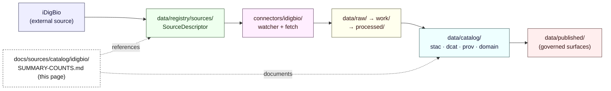

<!-- [KFM_META_BLOCK_V2]
doc_id: kfm://doc/docs-sources-catalog-idigbio-summary-counts
title: iDigBio Summary Counts
type: product-page
version: v0.2
status: draft
owners: <PLACEHOLDER — Docs steward + Source steward for idigbio>
created: 2026-05-20
updated: 2026-05-21
policy_label: public
related:
  - docs/sources/catalog/idigbio/README.md
  - docs/sources/catalog/README.md
  - docs/sources/catalog/IDENTITY.md
  - docs/sources/catalog/RIGHTS-AND-SENSITIVITY-MAP.md
  - docs/doctrine/directory-rules.md
  - data/registry/sources/
  - schemas/contracts/v1/source/
tags: [kfm, docs, sources, catalog, idigbio, biodiversity, product-page]
notes:
  - "PROPOSED product-page scaffold; substantive fields remain PROPOSED / NEEDS VERIFICATION."
  - "Sibling-link presence verified in prior Claude Code session; product-level facts unverified."
  - "Aligned to KFM Pass-10 C4-01 (STAC kfm:provenance) and KFM-P2-IDEA-0019 (iDigBio as Kansas-specific biodiversity authority)."
[/KFM_META_BLOCK_V2] -->

# iDigBio Summary Counts

> **Product-page scaffold** for iDigBio records-per-recordset counts and summary aggregations as a KFM-governed dataset product. PROPOSED at every product-level field below.


**Status:** PROPOSED — scaffold only · **Family:** [`idigbio`](./README.md) · **Owners:** _PLACEHOLDER — Docs steward + Source steward for `idigbio`_ · **Last updated:** 2026-05-21

> [!IMPORTANT]
> This page is a **product-level scaffold**. It does **not** assert that any catalog Item, Collection, schema, contract, policy decision, or pipeline run exists in the repository for this product. All implementation-shaped statements are **PROPOSED** or **NEEDS VERIFICATION** until checked against a mounted repository.

---

## Mini-TOC

- [Overview](#overview)
- [Where this product sits](#where-this-product-sits)
- [Source authority](#source-authority)
- [Catalog profiles used](#catalog-profiles-used)
- [Collection identity](#collection-identity)
- [Provenance fields](#provenance-fields)
- [Temporal handling](#temporal-handling)
- [Geometry and projection](#geometry-and-projection)
- [Rights and sensitivity](#rights-and-sensitivity)
- [Validation and catalog closure](#validation-and-catalog-closure)
- [Related contracts and schemas](#related-contracts-and-schemas)
- [Related connectors and pipelines](#related-connectors-and-pipelines)
- [Examples](#examples)
- [Open questions](#open-questions)
- [Related docs](#related-docs)

---

## Overview

**CONFIRMED (doctrine):** iDigBio is one of KFM's Kansas-relevant biodiversity authorities — the aggregator for digitized U.S. natural-history specimen records — supplementing GBIF and the in-state herbaria (KANU, KSC) under `KFM-P2-IDEA-0019` and the C10-06 biodiversity-stack family.

**PROPOSED (this product):** "Summary Counts" denotes iDigBio records-per-recordset counts and related summary aggregations expressed as a KFM-governed dataset product (its own STAC Collection or a slice within a shared biodiversity Collection — see [Open questions](#open-questions)).

> [!NOTE]
> **NEEDS VERIFICATION:** Product scope, refresh cadence, geographic coverage, current endpoint URL, terms of use, license text, and whether this product warrants its own Collection. Resolve before any catalog promotion or public release.

---

## Where this product sits

The diagram below sketches the **PROPOSED** lifecycle position of this product against the KFM responsibility roots. Lifecycle phases reflect the directory-rules invariant `RAW → WORK / QUARANTINE → PROCESSED → CATALOG / TRIPLET → PUBLISHED`. Concrete repo paths remain **NEEDS VERIFICATION**.



**PROPOSED — Directory Rules basis:**

- `docs/sources/` is the canonical lane for source-descriptor standards and source families (Directory Rules §6.1, docs tree).
- The `catalog/<family>/<PRODUCT>.md` sub-convention under `docs/sources/` is a **PROPOSED** product-page pattern not yet explicitly enumerated in Directory Rules. Flag for ADR consideration if the pattern hardens beyond `idigbio`.
- The descriptor lives at the **data plane** (`data/registry/sources/`), not in `docs/`. This page **documents**; it does not **own** the descriptor.

---

## Source authority

The authoritative source-of-truth for `idigbio` admission, identity, role, rights posture, cadence, authority scope, and verification obligations is the **SourceDescriptor** under [`data/registry/sources/`](../../../../data/registry/sources/) (Directory Rules §6.1 / KFM-P1-PROG-0007). The descriptor's schema home defaults to [`schemas/contracts/v1/source/`](../../../../schemas/contracts/v1/source/) per **ADR-0001 (schema home)**.

> [!WARNING]
> **Do not duplicate descriptor fields here.** Product pages link to the descriptor by reference. Inlining descriptor fields creates a parallel authority and is a Directory Rules drift pattern.

---

## Catalog profiles used

The KFM catalog lanes under `data/catalog/` are governed by the directory rules tree. Whether this product publishes through each lane is **NEEDS VERIFICATION** until the SourceDescriptor and pipeline specs are inspected.

| Profile | Lane (PROPOSED path) | Used by this product? | Notes |
|---|---|---|---|
| STAC | `data/catalog/stac/` | PROPOSED — Yes / No (**NEEDS VERIFICATION**) | Per Pass-10 C4-01 if used; pin Item vs Collection shape. |
| DCAT | `data/catalog/dcat/` | PROPOSED — Yes / No (**NEEDS VERIFICATION**) | Per Pass-10 C4-05 if non-spatial summary tables warrant DCAT. |
| PROV-O | `data/catalog/prov/` | PROPOSED — Yes / No (**NEEDS VERIFICATION**) | Per Pass-10 C8-03 / KFM PROV profile. |
| Domain projection | `data/catalog/domain/<domain>/` | PROPOSED — Yes / No (**NEEDS VERIFICATION**) | Domain (fauna / flora / habitat) TBD per descriptor. |

---

## Collection identity

- **PROPOSED Collection id pattern:** `kfm-<org>-<product>` (per Pass-10 C4-02; see [`IDENTITY.md`](../IDENTITY.md) for the catalog-level convention).
- **PROPOSED namespace:** `kfm:` — *see [Open questions](#open-questions) (OPEN-DSC-03: `kfm:` vs `ks-kfm:` is a known un-pinned choice in Pass-10 C4-01)*.
- **Asset roles:** **NEEDS VERIFICATION** — confirm role vocabulary against [`schemas/contracts/v1/source/`](../../../../schemas/contracts/v1/source/) and the SourceDescriptor's `source_role` field family (Atlas v1.1 §24.1 Source-Role Anti-Collapse Register).

---

## Provenance fields

**CONFIRMED (doctrine, Pass-10 C4-01):** STAC Items carry an `item.properties.kfm:provenance` block with the fields below. Per-asset integrity is recorded as `file:checksum`.

| Field | Type | Resolves to | Notes |
|---|---|---|---|
| `spec_hash` | sha256 hex | Canonical record JCS+SHA-256 digest | Identity for the record (Pass-10 C1-02). |
| `evidence_bundle_ref` | URI | `kfm://evidence/<digest>` | Content-addressed JSON-LD bundle (Pass-10 C4-04). |
| `run_record_ref` | URI | `kfm://run/<run-id>` | Pipeline run receipt (Pass-10 C1-01). |
| `audit_ref` | URI | `kfm://audit/<attestation-id>` | SLSA / OPA attestation. |
| `policy_digest` | sha256 hex | Policy bundle digest | Policy set used at promotion (Pass-10 C5-03). |
| `file:checksum` *(per-asset)* | sha256 hex | Per-file SHA-256 | Asset-level integrity (Pass-10 C3-02). |

> [!TIP]
> The `kfm:provenance` block is the **join point** between the catalog record and the rest of KFM's evidence machinery. Threading it consistently across iDigBio products keeps content-addressed deduplication and tamper-evidence intact.

---

## Temporal handling

**PROPOSED — distinct time fields where material:**

- **Source time** — as recorded by iDigBio.
- **Observed / event time** — DwC `eventDate` where the record carries it.
- **Valid time** — applicable interval for the count or aggregation.
- **Retrieval time** — when KFM fetched the record.
- **Release time** — when KFM published through the governed surface.
- **Correction time** — if a correction notice supersedes a prior release.

**NEEDS VERIFICATION:** which subset applies to *this* product, and whether summary counts carry an explicit aggregation window vs. an as-of timestamp.

---

## Geometry and projection

**PROPOSED:** Confirm CRS, generalization rules, scale support, and any sensitivity-driven generalization (per `policy/sensitivity/`) against `data/catalog/` artifacts and the master MapLibre projection-transform conventions. **NEEDS VERIFICATION** before public release.

---

## Rights and sensitivity

> [!CAUTION]
> Rights and sensitivity posture for biodiversity occurrence and aggregation products is **policy-bearing**. This page **must not** restate or override policy. The authoritative location is [`policy/sensitivity/`](../../../../policy/sensitivity/) and the catalog-level [`RIGHTS-AND-SENSITIVITY-MAP.md`](../RIGHTS-AND-SENSITIVITY-MAP.md).

**PROPOSED — applicable considerations** (subject to descriptor and policy review):

- **License propagation:** iDigBio aggregates records with heterogeneous licenses; license, rightsHolder, and datasetID should propagate end-to-end (cf. KFM-P2-PROG-0002 flora-watcher pattern).
- **Rare / listed species:** Any taxon ranked S1 / S2 by NatureServe or listed under KDWP SINC defaults to quarantine, redaction, or generalization per `policy/sensitivity/`.
- **CARE applicability:** **NEEDS VERIFICATION** — confirm whether `kfm:care` extension fields are required for this product (Pass-10 C15-02).

[↑ back to top](#idigbio-summary-counts)

---

## Validation and catalog closure

**PROPOSED gates** (before public release):

- **Catalog closure** required before public release — Pass-10 / KFM-P1-IDEA-0020 (closed-catalog rule).
- **STAC Projection lint** — KFM-P27-FEAT-0003. **NEEDS VERIFICATION** against current validator inventory.
- **STAC checksum closure** against the ReleaseManifest digest — KFM-P22-PROG-0037. **NEEDS VERIFICATION** against current release-manifest schema.
- **Promotion is a governed state transition, not a file move** (Directory Rules §lifecycle invariant). No PUBLISHED edge from WORK / QUARANTINE.

---

## Related contracts and schemas

- [`contracts/`](../../../../contracts/) — semantic meaning for biodiversity object families. **NEEDS VERIFICATION** for iDigBio-specific contracts.
- [`schemas/contracts/v1/source/`](../../../../schemas/contracts/v1/source/) — SourceDescriptor schema home per **ADR-0001**.
- `schemas/contracts/v1/biodiversity/` *(PROPOSED path)* — if a biodiversity-specific schema family exists; **NEEDS VERIFICATION**.

---

## Related connectors and pipelines

**PROPOSED responsibility-root placements:**

- [`connectors/idigbio/`](../../../../connectors/idigbio/) — watcher + fetcher (cf. KFM-P1-PROG-0009 source-watch pattern).
- [`pipelines/ingest/`](../../../../pipelines/ingest/) · [`pipelines/normalize/`](../../../../pipelines/normalize/) · [`pipelines/validate/`](../../../../pipelines/validate/) · [`pipelines/catalog/`](../../../../pipelines/catalog/) — staged lifecycle pipelines.
- [`pipeline_specs/<domain>/`](../../../../pipeline_specs/) — domain-scoped pipeline specifications.

All paths above are **PROPOSED / NEEDS VERIFICATION** until a mounted repo confirms.

---

## Examples

<details>
<summary><strong>Minimal STAC Item shape with <code>kfm:provenance</code> (illustrative, not authoritative)</strong></summary>

> The following is an **illustrative** STAC Item skeleton consistent with Pass-10 C4-01. It is **not** drawn from a verified repo artifact and **must not** be treated as the canonical shape. See [`../_examples/stac-item-example.json`](../_examples/stac-item-example.json) for the catalog-level reference once verified.

```json
{
  "type": "Feature",
  "stac_version": "1.0.0",
  "id": "kfm-idigbio-summary-counts--<spec_hash>",
  "collection": "kfm-idigbio-summary-counts",
  "geometry": null,
  "bbox": null,
  "properties": {
    "datetime": "<retrieval-time>",
    "kfm:provenance": {
      "spec_hash": "<sha256-of-canonical-record>",
      "evidence_bundle_ref": "kfm://evidence/<digest>",
      "run_record_ref": "kfm://run/<run-id>",
      "audit_ref": "kfm://audit/<attestation-id>",
      "policy_digest": "<sha256-of-policy-bundle>"
    }
  },
  "assets": {
    "summary": {
      "href": "<asset-uri>",
      "type": "application/json",
      "file:checksum": "<sha256-of-asset>"
    }
  },
  "links": []
}
```

**Caveats (PROPOSED):**

- Geometry shape (`null` vs aggregate footprint) is **NEEDS VERIFICATION** for summary counts.
- The Collection id pattern follows the catalog-level convention in [`IDENTITY.md`](../IDENTITY.md).
- The `kfm:` namespace remains the **OPEN-DSC-03** choice point.

</details>

---

## Open questions

| Tag | Question | Status |
|---|---|---|
| **OPEN-DSC-01** | Confirm cadence and current endpoint URL for the iDigBio Summary endpoint(s). | **NEEDS VERIFICATION** |
| **OPEN-DSC-02** | Confirm rights status and CARE applicability for this product. | **NEEDS VERIFICATION** |
| **OPEN-DSC-03** | Pin namespace choice: `kfm:` vs `ks-kfm:` (Pass-10 C4-01 open question). | **OPEN** |
| **OPEN-DSC-04** | Should Summary Counts have its own STAC Collection or share one with sibling iDigBio products? | **OPEN** |
| **OPEN-DSC-05** | Domain projection lane(s) — fauna only, or fauna + flora + habitat? | **NEEDS VERIFICATION** |
| **OPEN-DSC-06** | Does the substructure `docs/sources/catalog/<family>/<PRODUCT>.md` warrant an ADR or a `docs/sources/catalog/README.md` placement note? | **OPEN** |

[↑ back to top](#idigbio-summary-counts)

---

## Related docs

- [`docs/sources/catalog/idigbio/README.md`](./README.md) — `idigbio` family overview (PROPOSED).
- [`docs/sources/catalog/README.md`](../README.md) — catalog-collection overview (PROPOSED).
- [`docs/sources/catalog/IDENTITY.md`](../IDENTITY.md) — catalog-level Collection identity convention (PROPOSED).
- [`docs/sources/catalog/RIGHTS-AND-SENSITIVITY-MAP.md`](../RIGHTS-AND-SENSITIVITY-MAP.md) — catalog-level rights and sensitivity routing (PROPOSED).
- [`docs/doctrine/directory-rules.md`](../../../doctrine/directory-rules.md) — Directory Rules (CONFIRMED v1.2).
- [`docs/adr/ADR-0001-schema-home.md`](../../../adr/ADR-0001-schema-home.md) — schema home for SourceDescriptor (CONFIRMED).
- [`docs/standards/PROV.md`](../../../standards/PROV.md) — W3C PROV-O profile *(CONFIRMED authored; naming variance vs `PROVENANCE.md` per OPEN-DR-01)*.

---

**Last reviewed:** 2026-05-21 *(Claude Code product-page revision session; substantive product-level fields remain PROPOSED / NEEDS VERIFICATION).*

[↑ back to top](#idigbio-summary-counts)
