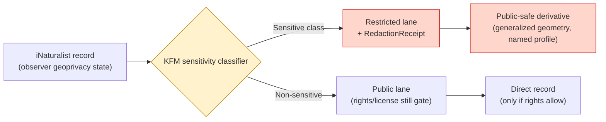
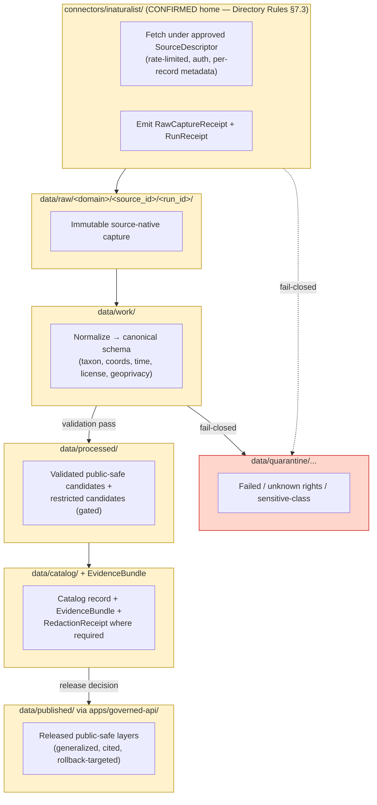

<!-- [KFM_META_BLOCK_V2]
doc_id: kfm://doc/source-catalog-inaturalist
title: iNaturalist — Source Catalog Profile
type: standard
version: v1
status: draft
owners: <source-steward + fauna-steward + flora-steward — TODO assign>
created: 2026-05-13
updated: 2026-05-13
policy_label: public
related:
  - docs/sources/README.md
  - docs/sources/SOURCE_DESCRIPTOR_STANDARD.md
  - docs/domains/fauna/README.md
  - docs/domains/flora/README.md
  - docs/doctrine/directory-rules.md
  - schemas/contracts/v1/source/source_descriptor.schema.json
  - connectors/inaturalist/README.md
tags: [kfm, source-catalog, biodiversity, fauna, flora, geoprivacy, ext-inat]
notes:
  - Path docs/sources/catalog/inaturalist.md is PROPOSED; `docs/sources/` is confirmed in Directory Rules §6.1, `catalog/` sub-segment is inferred from KFM source-family practice.
  - Operational facts (license per record, API rate limits, current endpoint) are NEEDS VERIFICATION and must be settled by source-steward review before connector activation.
[/KFM_META_BLOCK_V2] -->

# iNaturalist — Source Catalog Profile

> KFM-side profile of **iNaturalist** as a community-observation source family. Defines source identity, role, rights posture, sensitivity defaults, admission flow, and verification backlog. This document **explains**; it does not admit, activate, or publish anything.

<!-- Badge row — Shields.io placeholders; replace targets once owners/CI/policies land -->


-informational)


| Status | Owners | Last reviewed |
|---|---|---|
| Draft — PROPOSED profile, no admission decision | `<source-steward + fauna-steward + flora-steward — TODO assign>` | 2026-05-13 |

---

## Quick jump

- [1. Overview](#1-overview)
- [2. Source identity](#2-source-identity)
- [3. Source role(s)](#3-source-roles)
- [4. Rights, licensing, attribution](#4-rights-licensing-attribution)
- [5. Geoprivacy and sensitivity posture](#5-geoprivacy-and-sensitivity-posture)
- [6. KFM domain scope](#6-kfm-domain-scope)
- [7. Admission flow and lifecycle placement](#7-admission-flow-and-lifecycle-placement)
- [8. Source descriptor — where it lives](#8-source-descriptor--where-it-lives)
- [9. Cadence, freshness, and stale-state](#9-cadence-freshness-and-stale-state)
- [10. Taxonomy anchoring](#10-taxonomy-anchoring)
- [11. What this source can and cannot prove](#11-what-this-source-can-and-cannot-prove)
- [12. Validators, gates, and tests](#12-validators-gates-and-tests)
- [13. Related docs](#13-related-docs)
- [14. Verification backlog](#14-verification-backlog)
- [Appendix A — illustrative fixture skeleton](#appendix-a--illustrative-fixture-skeleton)
- [Appendix B — change log](#appendix-b--change-log)

---

## 1. Overview

> [!NOTE]
> **What this profile is:** a KFM-side reading of the iNaturalist source family — how KFM intends to admit, govern, redact where required, and cite iNaturalist-derived observations.
> **What it is not:** a connector specification, a release manifest, an admission decision, or evidence that any of this is implemented in the repository. Implementation status is **NEEDS VERIFICATION**.

iNaturalist is a community-science observation network. Within KFM, iNaturalist is treated as a **community-observation source family** under the biodiversity stack — useful as occurrence evidence with species-level confidence ratings, but **not** as authoritative legal-status, regulatory, or sensitive-location authority. **CONFIRMED doctrine:** iNaturalist appears as a source family in both the Fauna and Flora domains and is catalogued in the KFM external source ledger as `EXT-INAT`.

| KFM treats iNaturalist as | KFM does not treat iNaturalist as |
|---|---|
| Citizen-science observation aggregator | Authoritative legal/listed-status source |
| Species-level occurrence evidence with confidence ratings | A sovereign or steward record of sensitive taxa |
| One of several sources to be crosswalked at the catalog layer | A replacement for KDWP-, USFWS-, or NatureServe-class authority |
| A community-rated photographic record stream | A regulatory or emergency-operational feed |

[Back to top](#quick-jump)

---

## 2. Source identity

| Field | Value | Status |
|---|---|---|
| KFM external ledger id | `EXT-INAT` | CONFIRMED in KFM Encyclopedia external source table |
| Source-family memberships | `SRC-FAUNA`, `SRC-FLORA` (biodiversity stack) | CONFIRMED in Fauna §7.5 and Flora §7.6 source bases |
| Source provider | iNaturalist (joint initiative of the California Academy of Sciences and the National Geographic Society — `EXTERNAL`, NEEDS VERIFICATION against current provider page) | NEEDS VERIFICATION |
| Access pattern | Official iNaturalist API (per `EXT-INAT` row) | CONFIRMED at family level; specific endpoint, version, and auth posture NEEDS VERIFICATION |
| Authoritative for | Community-rated species observation records (point, photo, identifier-graded) | CONFIRMED at the family-level cataloguing |
| Not authoritative for | Legal/listed status, exact sensitive locations, regulatory event truth | CONFIRMED — explicitly carried in `EXT-INAT` "Cannot prove" column |
| Public release class | Restricted public-safe derivatives only; exact records for sensitive taxa fail closed | CONFIRMED doctrine; profile/redaction specifics PROPOSED |

> [!IMPORTANT]
> The "Cannot prove" column in the external source ledger is **doctrinal**. Any KFM artifact that cites iNaturalist as legal-status authority, regulatory authority, or exact-sensitive-location authority is a policy violation regardless of the artifact's quality.

[Back to top](#quick-jump)

---

## 3. Source role(s)

Per KFM `SourceDescriptor` doctrine, every source is admitted with a **source_role**. Roles are set at admission and **never edited in place** — corrections produce a new descriptor and a `CorrectionNotice`.

| Candidate role for iNaturalist | Permitted? | Rationale |
|---|---|---|
| `observed` (as occurrence aggregator) | **PROPOSED — primary role.** Community-graded occurrence records are observational, with explicit confidence ratings. |
| `aggregate` | Only when used for derived density/richness products with an `AggregationReceipt` and geometry-scope pin. |
| `regulatory` | **DENY.** iNaturalist is not a regulatory authority. Legal status comes from KDWP/USFWS/NatureServe. |
| `modeled` | **DENY** at the source-admission layer. Any modeled product derived from iNaturalist must be a separate object with `role_model_run_ref`. |
| `administrative` | **DENY.** Administrative compilations are not iNaturalist's role. |
| `candidate` | Permitted for individual records flagged for steward review before promotion. |
| `synthetic` | **DENY.** iNaturalist is not synthetic source material. |

Source role is doctrinal and **cannot be inferred by AI** — it is recorded in the descriptor at admission.

[Back to top](#quick-jump)

---

## 4. Rights, licensing, attribution

> [!CAUTION]
> Rights for iNaturalist are **per-record**, not per-source. Different observations carry different Creative Commons licenses or "all rights reserved" terms, and a KFM-wide rights stance cannot be set without per-record handling. Until per-record rights are captured in the connector and validated, public derivative publication of iNaturalist content **fails closed** under the KFM "unknown rights → DENY" rule.

### 4.1 What KFM requires before activation

Per `EXT-INAT` and KFM doctrine, the following must be resolved and recorded in the `SourceDescriptor` (and corroborated in `data/registry/sources/` and `policy/`) before any connector emits to `data/raw/` for promotion-track use:

| Requirement | Source | Status |
|---|---|---|
| Per-record license capture (CC0 / CC-BY / CC-BY-NC / © All rights reserved / unspecified) | iNaturalist record metadata | NEEDS VERIFICATION |
| Attribution string convention for KFM citations | iNaturalist Terms / standards review | NEEDS VERIFICATION |
| Redistribution allowance per license tier | iNaturalist Terms | NEEDS VERIFICATION |
| API auth posture (token / app id) and rate-limit handling | iNaturalist API docs | NEEDS VERIFICATION |
| Treatment of researcher-grade vs. casual-grade records | iNaturalist research-grade definition + KFM source-role rules | NEEDS VERIFICATION |
| Handling of records flagged as "captive/cultivated" | iNaturalist metadata | NEEDS VERIFICATION |

### 4.2 Fail-closed default

Until the rights/attestation/cadence verification block above is resolved by the source steward, the iNaturalist connector remains **inactive**, descriptor status is **PROPOSED**, and no iNaturalist-derived record reaches `data/processed/`, `data/catalog/`, or `data/published/`.

[Back to top](#quick-jump)

---

## 5. Geoprivacy and sensitivity posture

> [!WARNING]
> iNaturalist records carry their own geoprivacy state (e.g., a record may be reported with an obscured or private coordinate by the upstream observer or by iNaturalist's automated rare-taxa rules). KFM **must not** treat an obscured iNaturalist coordinate as if it were precise, and **must not** attempt to deobscure or back-fill exact location for restricted records.

### 5.1 KFM sensitivity rules that apply to iNaturalist content

| KFM rule (CONFIRMED doctrine) | Effect on iNaturalist records |
|---|---|
| Rare species: **DENY** public exact location; generalized products only | Records of sensitive taxa flow into the restricted/quarantine lane; only public-safe derivatives publish |
| Sensitive sites (nest, den, roost, hibernacula, spawning): exact location **DENY** | Any iNaturalist record that resolves to a sensitive-site class is governed by the sensitive register, not by the observer's geoprivacy field alone |
| Geoprivacy transform → `RedactionReceipt` required | Each public-facing transformation produces a deterministic, reviewable receipt naming the redaction profile applied |
| Public-safe surfaces use generalized geometry (county, ecoregion, HUC, grid cell) | iNaturalist density / richness / habitat-association layers must be derived under a named redaction profile (e.g., `point_10km_hex_seeded_v1`) |
| Sensitive geometry cannot be hidden only by MapLibre styling | Style-level hiding is not an acceptable sensitivity control; redaction happens upstream in the data layer |

### 5.2 Source-side geoprivacy vs. KFM sensitivity policy

The two are **not the same** and **stack additively**:



> **Reading the diagram:** even if iNaturalist marks a record as `open` geoprivacy, KFM's own sensitivity register can still classify the taxon as sensitive and route to the restricted lane. The opposite is also true: an observer's obscured coordinate is **not** a substitute for the KFM-side `RedactionReceipt`.

[Back to top](#quick-jump)

---

## 6. KFM domain scope

iNaturalist supports observation evidence in two KFM domains. The domain ownership of each downstream object family is **not** changed by the source:

| Domain | What iNaturalist contributes | What it does NOT contribute |
|---|---|---|
| **Fauna** (§7.5) | `OccurrenceEvidence` (animals), candidate `Taxon` anchors, density/richness inputs (via aggregation), invasive-species reports | `ConservationStatus`, `SensitiveSite`, `MigrationRoute` truth |
| **Flora** (§7.6) | `FloraOccurrence`, `SpecimenRecord`-adjacent community photo records (where allowed by license), invasive-plant context | `RarePlantRecord` truth, `VegetationCommunity`, `RestorationPlanting` |

Cross-domain edges that **may** consume iNaturalist-derived public-safe occurrence records:

- **Habitat** — public-safe occurrence joins to habitat patch / ecological system context (restricted occurrences never cross).
- **Agriculture** — taxonomic identity only; iNaturalist is not a source of crop-stress indicators.
- **Hazards** — mortality / wildlife-disease context where rights and stewardship checks allow.

Edges that **must not** be drawn from iNaturalist alone:

- iNaturalist → legal/listed status (use USFWS ECOS / NatureServe / KDWP).
- iNaturalist → exact sensitive-site location for any sensitive taxon.
- iNaturalist → emergency / life-safety claim.

[Back to top](#quick-jump)

---

## 7. Admission flow and lifecycle placement

KFM lifecycle is **CONFIRMED invariant**: `RAW → WORK / QUARANTINE → PROCESSED → CATALOG / TRIPLET → PUBLISHED`. Promotion is a **governed state transition, not a file move**. The iNaturalist connector lives in the connector layer and **never publishes**.



> [!NOTE]
> **The diagram is structural, not implementational.** Specific paths, run-id schemes, and validator names are PROPOSED until verified against mounted repo evidence. The lifecycle invariant itself is CONFIRMED doctrine.

### 7.1 Hard rules at each boundary

| Boundary | Rule (CONFIRMED) |
|---|---|
| Connector output | MUST go to `data/raw/<domain>/<source_id>/<run_id>/` or `data/quarantine/...`. Connectors MUST NOT write to `data/processed/`, `data/catalog/`, or `data/published/`. |
| `data/raw/` → `data/work/` | Normalization, schema, geometry, identity, time, rights, and policy checks; failures go to `quarantine/`. |
| `data/processed/` → `data/catalog/` | `EvidenceRef`, `ValidationReport`, and digest closure must exist. |
| `data/catalog/` → `data/published/` | `ReleaseManifest`, correction path, rollback target, review/policy state. Release decisions live in `release/`. |
| Public surface | All public reads pass through `apps/governed-api/`, never directly through canonical/internal stores. |

[Back to top](#quick-jump)

---

## 8. Source descriptor — where it lives

| Artifact | Proposed path | Authority | Status |
|---|---|---|---|
| Schema definition (machine shape) | `schemas/contracts/v1/source/source_descriptor.schema.json` | Default per Directory Rules §7.4 / ADR-0001 | **PROPOSED home, CONFIRMED schema-home rule** |
| Descriptor instance (this source) | `data/registry/sources/biodiversity/inaturalist.yaml` (or domain-keyed lanes — `fauna/`, `flora/`) | KFM source registry | **PROPOSED** — exact path NEEDS VERIFICATION against any mounted source registry |
| Connector README | `connectors/inaturalist/README.md` | Directory Rules §7.3 connector home | **PROPOSED home, CONFIRMED connector-root rule** |
| Domain references | `docs/domains/fauna/README.md`, `docs/domains/flora/README.md` | Domain dossiers | **PROPOSED home, CONFIRMED domain references** (Fauna §7.5, Flora §7.6) |
| Policy bindings | `policy/sensitivity/` and `policy/rights/` (per-record license handling) | Directory Rules §6.1 / §7.4 | **PROPOSED** — exact filenames NEEDS VERIFICATION |

> [!IMPORTANT]
> This doc does **not** declare the descriptor exists, nor that any of the paths above are populated. It declares **where the descriptor would belong** under current Directory Rules and ADR-0001. Treat all path assertions as PROPOSED until mounted-repo evidence confirms.

### 8.1 Required descriptor fields (illustrative; authoritative shape lives in the schema)

The fields below mirror the master `SourceDescriptor` field intent. The list is **illustrative**, not normative — the JSON Schema is authoritative.

| Field | Value (PROPOSED) for iNaturalist | Notes |
|---|---|---|
| `source_id` | `EXT-INAT` (external) ∩ `SRC-FAUNA` / `SRC-FLORA` (family memberships) | Source-family memberships per Fauna §7.5 and Flora §7.6 |
| `source_role` | `observed` (primary); `aggregate` for derived density/richness products | Source role anti-collapse: never invent or upgrade |
| `role_authority` | `<observer + iNaturalist platform + identifier community>` | Citation text must preserve attribution chain |
| `provider` | iNaturalist | NEEDS VERIFICATION — confirm legal entity / partner statement |
| `endpoint` | iNaturalist API base URL | NEEDS VERIFICATION |
| `access_method` | HTTPS API; bulk export via GBIF crosswalk where appropriate | NEEDS VERIFICATION |
| `rights` | Per-record license capture required (CC0/CC-BY/CC-BY-NC/©); unknown rights → DENY | Fail-closed default applies |
| `sensitivity` | Per-record + KFM sensitivity register; sensitive taxa restricted by default | See §5 |
| `cadence` | Continuous stream + bulk reconciliation cadence | NEEDS VERIFICATION |
| `freshness_tolerance` | Domain-specific; declared by source steward | NEEDS VERIFICATION |
| `attribution_required` | TRUE | Per-record license + observer/identifier credit |
| `public_release_class` | Restricted; public-safe derivatives only | Exact sensitive-taxa points never publish |
| `citation_guidance` | Observer + identifier(s) + iNaturalist URL + capture run-id + license | NEEDS VERIFICATION |

[Back to top](#quick-jump)

---

## 9. Cadence, freshness, and stale-state

KFM separates **stale** (evidence aged past tolerance) from **wrong** (substance incorrect). Both have visible markers and traceable lifecycles.

| Marker | Trigger (CONFIRMED doctrine) | KFM UI signal | Required action |
|---|---|---|---|
| Source freshness expired | Cadence in `SourceDescriptor` passed without a new admission | Stale source badge in Evidence Drawer | Re-admit or mark stale |
| Per-record license change | Observer changes record license | Per-record rights review | Re-evaluate publication state |
| Geoprivacy upgrade upstream | Observer or platform obscures a previously open record | Restricted-class re-classification | Rebuild public-safe derivative or withdraw |

Specific cadence numbers for iNaturalist are **NEEDS VERIFICATION** until the source steward records them in the descriptor.

[Back to top](#quick-jump)

---

## 10. Taxonomy anchoring

> [!TIP]
> The KFM biodiversity convention is to anchor every species-level record to **ITIS TSN** where ITIS has coverage, with the **GBIF Backbone Taxonomy** as the second-line authority. iNaturalist taxonomy is a working taxonomy, not the canonical anchor.

| Step | KFM rule | Source citation |
|---|---|---|
| 1 | Resolve iNaturalist `taxon_id` against ITIS TSN | C7-07 (ITIS authority) |
| 2 | If ITIS is silent, resolve against GBIF Backbone | C7-08 (GBIF backbone) |
| 3 | Record both anchors in the catalog row | C5-08 (lineage required) |
| 4 | Where ITIS and GBIF disagree, surface the ambiguity in the disagreement report; do not silently pick one | C7-07 open question; tie-breaker policy is PROPOSED in the KFM biodiversity backlog |

[Back to top](#quick-jump)

---

## 11. What this source can and cannot prove

Drawn directly from the external source ledger row for `EXT-INAT`:

| Supports | Cannot prove |
|---|---|
| Community observation source family | Not authoritative legal status |
| Species-level occurrence with confidence ratings | Usage limits apply |
| Citizen-science photographic record stream | Geoprivacy applies; not a substitute for KFM-side redaction |
| Cross-domain occurrence input under crosswalked taxonomy | Not a regulatory, emergency, or sensitive-site authority |

[Back to top](#quick-jump)

---

## 12. Validators, gates, and tests

The following validator and test families apply to iNaturalist-derived content. Names are **PROPOSED** unless mounted-repo evidence confirms; the underlying gate doctrine is CONFIRMED.

| Validator / gate | Purpose | Status |
|---|---|---|
| Source-descriptor completeness | Reject incomplete or unknown-rights descriptors at admission | CONFIRMED doctrine; implementation PROPOSED |
| Source-role authority test | Source role cannot be invented; mismatch → DENY | CONFIRMED |
| Per-record license capture test | Every ingested record carries an explicit license token | NEEDS VERIFICATION |
| Sensitive-taxa fail-closed test | Sensitive taxa never publish at exact location | CONFIRMED doctrine |
| Geoprivacy transform / `RedactionReceipt` validator | Every public-safe derivative carries a named, reproducible redaction profile | CONFIRMED doctrine |
| Tile field allowlist test | Public tiles cannot leak fields that bypass the redaction profile | CONFIRMED doctrine |
| Citation validation | Every released record's citation resolves to an `EvidenceBundle` | CONFIRMED doctrine |
| Runtime Response Envelope negative cases | ANSWER / ABSTAIN / DENY / ERROR all exercised | CONFIRMED doctrine |
| Connector gate | Connectors must not write to processed/catalog/published | CONFIRMED — Directory Rules §7.3 |
| Watcher-as-non-publisher | Watchers / workers emit receipts only | CONFIRMED |

[Back to top](#quick-jump)

---

## 13. Related docs

- [`docs/sources/README.md`](../../README.md) — source catalog index *(TODO link target — PROPOSED)*
- [`docs/sources/SOURCE_DESCRIPTOR_STANDARD.md`](../../SOURCE_DESCRIPTOR_STANDARD.md) — descriptor standard *(PROPOSED home per Whole-UI report Appendix A)*
- [`docs/domains/fauna/README.md`](../../../domains/fauna/README.md) — Fauna domain dossier *(PROPOSED home per Directory Rules §6.1)*
- [`docs/domains/flora/README.md`](../../../domains/flora/README.md) — Flora domain dossier *(PROPOSED home per Directory Rules §6.1)*
- [`docs/doctrine/directory-rules.md`](../../../doctrine/directory-rules.md) — placement authority
- `connectors/inaturalist/README.md` — connector reference *(PROPOSED — Directory Rules §7.3 confirms `connectors/inaturalist/` lane)*
- `schemas/contracts/v1/source/source_descriptor.schema.json` — descriptor schema *(default home per ADR-0001)*
- Sibling source profiles to author: `gbif.md`, `ebird.md`, `natureserve.md`, `usfws-ecos.md`, `kdwp.md`, `eddmaps.md`, `idigbio.md`

[Back to top](#quick-jump)

---

## 14. Verification backlog

Per KFM operating law, none of the items below have been verified against a mounted repo in this session. Each must close before iNaturalist is activated as a source.

| Item | Evidence that would settle it | Status |
|---|---|---|
| Confirm `docs/sources/catalog/` is the canonical home for per-source profiles (vs. a flat `docs/sources/` listing) | Mounted-repo `docs/sources/` tree; per-root README; or an ADR | NEEDS VERIFICATION |
| Confirm `SourceDescriptor` schema lives at `schemas/contracts/v1/source/source_descriptor.schema.json` | Mounted schema file; ADR-0001 acceptance | NEEDS VERIFICATION |
| Confirm `data/registry/sources/` layout (flat, domain-keyed, or source-family-keyed) | Mounted registry; ADR | NEEDS VERIFICATION |
| Confirm `connectors/inaturalist/` exists with a README per Directory Rules §7.3 | Mounted connector dir | NEEDS VERIFICATION |
| Resolve iNaturalist API endpoint, auth posture, rate-limit handling | Source steward + iNaturalist API docs review | NEEDS VERIFICATION |
| Resolve per-record license capture + attribution string | Source steward + iNaturalist Terms review | NEEDS VERIFICATION |
| Resolve sensitive-taxa redaction profile (e.g., `point_10km_hex_seeded_v1` or domain-specific) | Sensitivity reviewer + policy/redaction profile catalog | NEEDS VERIFICATION |
| Resolve ITIS/GBIF tie-breaker for taxa where authorities disagree | Biodiversity steward + ADR | OPEN — per C7-07 |
| Resolve `data/raw/` partitioning convention for iNaturalist (per-domain vs. per-source-family) | Pipeline owner + Directory Rules | NEEDS VERIFICATION |
| Confirm release-state separation of duties for iNaturalist-derived public releases | Release authority + sensitivity reviewer | CONFIRMED doctrine; implementation NEEDS VERIFICATION |

[Back to top](#quick-jump)

---

## Appendix A — illustrative fixture skeleton

> [!NOTE]
> **Illustrative only.** Field names and shapes follow the *intent* expressed in the KFM corpus. The authoritative shape lives in `schemas/contracts/v1/source/source_descriptor.schema.json`. Do not treat this block as a valid fixture without schema-side validation.

<details>
<summary>Click to expand — illustrative <code>source_descriptor</code> snippet (NOT validated, NOT canonical)</summary>

```yaml
# ILLUSTRATIVE — DO NOT TREAT AS AUTHORITATIVE
# Authoritative shape: schemas/contracts/v1/source/source_descriptor.schema.json
source_id: EXT-INAT
source_family:
  - SRC-FAUNA
  - SRC-FLORA
source_role: observed
role_authority: "iNaturalist platform + observer + identifier community"
provider: "iNaturalist"            # NEEDS VERIFICATION
endpoint: "<api-base-url>"         # NEEDS VERIFICATION
access_method: "https-api"         # NEEDS VERIFICATION

rights:
  capture_mode: per-record         # CC0 / CC-BY / CC-BY-NC / © / unspecified
  unknown_rights_behavior: DENY    # KFM fail-closed default
  attribution_required: true
  citation_template: |
    <observer> via iNaturalist (<record_url>), license: <license>,
    KFM run_id: <run_id>, retrieved: <retrieval_time>

sensitivity:
  inherits_kfm_register: true
  rare_species_default: DENY_PUBLIC_EXACT
  geoprivacy_transform_required: true   # public-safe derivatives only
  redaction_profile_default: "<profile-id>"  # NEEDS VERIFICATION

cadence:
  capture: "<cadence>"             # NEEDS VERIFICATION
  freshness_tolerance: "<duration>" # NEEDS VERIFICATION

taxonomy_anchors:
  primary: "ITIS_TSN"
  fallback: "GBIF_BACKBONE"
  on_disagreement: "surface_in_disagreement_report"

publication:
  public_release_class: restricted-derivatives-only
  exact_sensitive_points: DENY
  required_receipts:
    - RawCaptureReceipt
    - TransformReceipt
    - RedactionReceipt   # where sensitive
    - AggregationReceipt # where aggregated

status:
  descriptor: PROPOSED
  activation: NOT_ACTIVATED
  last_reviewed: 2026-05-13
  steward: "<source-steward — TODO>"
```

</details>

[Back to top](#quick-jump)

---

## Appendix B — change log

| Date | Author | Change | Reviewed by |
|---|---|---|---|
| 2026-05-13 | `<docs-steward — TODO>` | Initial PROPOSED profile drawn from KFM Encyclopedia, Culmination Atlas, Directory Rules, and Whole-UI report | `<source-steward — TODO>` |

---

### Footer

> **Related:** [Directory Rules](../../../doctrine/directory-rules.md) · [Fauna dossier](../../../domains/fauna/README.md) · [Flora dossier](../../../domains/flora/README.md) · [`SourceDescriptor` schema](../../../../schemas/contracts/v1/source/source_descriptor.schema.json)
> **Last updated:** 2026-05-13 · **Status:** draft · **Authority of this doc:** explanatory; does **not** decide admission, activation, or release.
> [⬆ Back to top](#inaturalist--source-catalog-profile)
