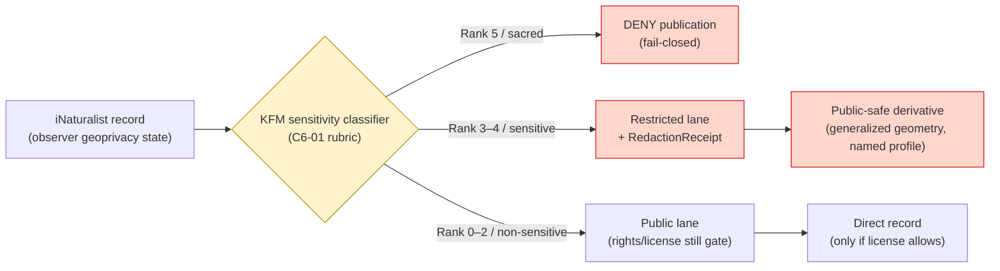
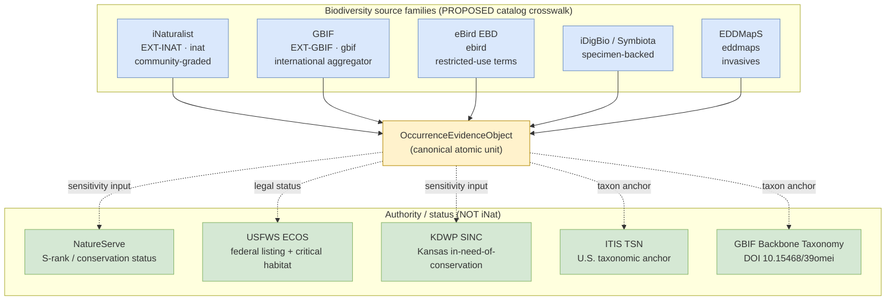
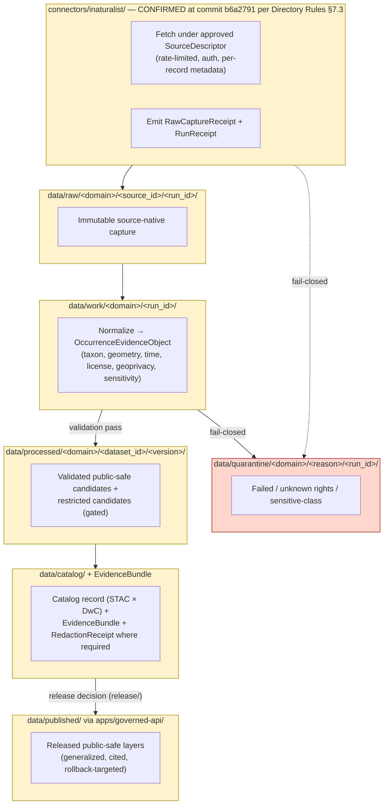

<!-- [KFM_META_BLOCK_V2]
doc_id: kfm://doc/source-catalog-inaturalist
title: iNaturalist — Source Catalog Profile
type: standard
version: v2
status: draft
owners: <source-steward + fauna-steward + flora-steward — TODO assign>
created: 2026-05-13
updated: 2026-05-21
policy_label: public
related:
  - docs/sources/README.md
  - docs/sources/SOURCE_DESCRIPTOR_STANDARD.md
  - docs/domains/fauna/README.md
  - docs/domains/flora/README.md
  - docs/doctrine/directory-rules.md
  - docs/standards/SENSITIVITY_RUBRIC.md
  - docs/standards/REDACTION_DETERMINISM.md
  - docs/registers/DRIFT_REGISTER.md
  - docs/registers/VERIFICATION_BACKLOG.md
  - schemas/contracts/v1/source/source_descriptor.schema.json
  - schemas/contracts/v1/biodiversity/occurrence_evidence.schema.json
  - connectors/inaturalist/README.md
  - policy/sensitivity/
  - policy/rights/
tags: [kfm, source-catalog, biodiversity, fauna, flora, geoprivacy, ext-inat, src-inat]
notes:
  - >-
    Path `docs/sources/catalog/inaturalist.md` remains PROPOSED. Directory Rules §6.1
    confirms `docs/sources/` as the source-descriptor-standards and source-family lane
    but does NOT name a `catalog/` subsegment. Filed against OPEN-DR-02 as a known
    subfolder-convention question.
  - >-
    `connectors/inaturalist/` is upgraded to CONFIRMED (at commit) per Directory Rules
    v1.2 §7.3 referencing the live repo at `b6a27916bbb9e07cbf3752870c867476e1e094e7`.
    All other repo-shaped claims remain PROPOSED until later mounted-repo evidence.
  - >-
    Operational facts (per-record license, current API endpoint, auth, rate limits)
    remain NEEDS VERIFICATION; source-steward review must close these before connector
    activation.
[/KFM_META_BLOCK_V2] -->

# iNaturalist — Source Catalog Profile

> KFM-side profile of **iNaturalist** as a community-observation source family. Defines source identity, role, rights posture, sensitivity defaults, admission flow, and verification backlog. This document **explains**; it does not admit, activate, or publish anything.

<!-- Badge row — Shields.io placeholders; replace targets once owners/CI/policies land -->


-informational)


| Status | Owners | Last reviewed |
|---|---|---|
| Draft — PROPOSED profile, no admission decision | `<source-steward + fauna-steward + flora-steward — TODO assign>` | 2026-05-21 |

---

## Quick jump

- [1. Overview](#1-overview)
- [2. Source identity](#2-source-identity)
- [3. Source role(s)](#3-source-roles)
- [4. Rights, licensing, attribution](#4-rights-licensing-attribution)
- [5. Geoprivacy and sensitivity posture](#5-geoprivacy-and-sensitivity-posture)
- [6. KFM domain scope](#6-kfm-domain-scope)
- [7. Sibling-source landscape](#7-sibling-source-landscape)
- [8. Admission flow and lifecycle placement](#8-admission-flow-and-lifecycle-placement)
- [9. Source descriptor — where it lives](#9-source-descriptor--where-it-lives)
- [10. OccurrenceEvidenceObject mapping](#10-occurrenceevidenceobject-mapping)
- [11. Cadence, freshness, and stale-state](#11-cadence-freshness-and-stale-state)
- [12. Taxonomy anchoring](#12-taxonomy-anchoring)
- [13. What this source can and cannot prove](#13-what-this-source-can-and-cannot-prove)
- [14. Validators, gates, and tests](#14-validators-gates-and-tests)
- [15. Carry-forward — KFM-P6-PROG-0001](#15-carry-forward--kfm-p6-prog-0001)
- [16. Related docs](#16-related-docs)
- [17. Verification backlog](#17-verification-backlog)
- [Appendix A — illustrative SourceDescriptor skeleton](#appendix-a--illustrative-sourcedescriptor-skeleton)
- [Appendix B — illustrative redaction-profile bindings](#appendix-b--illustrative-redaction-profile-bindings)
- [Appendix C — change log](#appendix-c--change-log)

---

## 1. Overview

> [!NOTE]
> **What this profile is:** a KFM-side reading of the iNaturalist source family — how KFM intends to admit, govern, redact where required, and cite iNaturalist-derived observations.
> **What it is not:** a connector specification, a release manifest, an admission decision, or evidence that any of this is implemented in the repository. Implementation status is **PROPOSED / NEEDS VERIFICATION** except where explicitly upgraded to CONFIRMED below.

iNaturalist is a community-science observation network. Within KFM, iNaturalist is treated as a **community-observation source family** under the biodiversity stack — useful as occurrence evidence with species-level confidence ratings, but **not** as authoritative legal-status, regulatory, or sensitive-location authority. **CONFIRMED doctrine:** iNaturalist appears as a source family in both the Fauna (§7.5) and Flora (§7.6) domain dossiers, is one of the corpus's two clearest descriptor instances (idea card `KFM-P6-PROG-0001`), and the iNaturalist record stream is keyed to the `OccurrenceEvidenceObject` `source_family` enum value `inat` (idea card `KFM-P3-PROG-0001`).

| KFM treats iNaturalist as | KFM does not treat iNaturalist as |
|---|---|
| Citizen-science observation aggregator | Authoritative legal/listed-status source |
| Species-level occurrence evidence with confidence ratings | A sovereign or steward record of sensitive taxa |
| One of several biodiversity sources crosswalked at the catalog layer | A replacement for KDWP-, USFWS-, or NatureServe-class authority |
| A community-rated photographic record stream | A regulatory or emergency-operational feed |
| A working taxonomy to be reconciled against ITIS/GBIF | A canonical taxonomic authority |

[Back to top](#quick-jump)

---

## 2. Source identity

| Field | Value | Status |
|---|---|---|
| KFM external ledger id | `EXT-INAT` | CONFIRMED in KFM Encyclopedia external source table |
| `OccurrenceEvidenceObject.source_family` enum value | `inat` | CONFIRMED per `KFM-P3-PROG-0001` (enum: `ebird \| inat \| gbif \| bison \| eddmaps \| other`) |
| Source-family memberships | `SRC-FAUNA`, `SRC-FLORA` (biodiversity stack) | CONFIRMED in Fauna §7.5 and Flora §7.6 source bases |
| Source provider | iNaturalist (joint initiative of the California Academy of Sciences and the National Geographic Society — `EXTERNAL`, NEEDS VERIFICATION against current provider page) | NEEDS VERIFICATION |
| Access pattern | Official iNaturalist API (per `EXT-INAT` row) | CONFIRMED at family level; specific endpoint, version, and auth posture NEEDS VERIFICATION |
| Authoritative for | Community-rated species observation records (point, photo, identifier-graded) | CONFIRMED at family-level cataloguing |
| Not authoritative for | Legal/listed status, exact sensitive locations, regulatory event truth | CONFIRMED — explicitly carried in `EXT-INAT` "Cannot prove" column |
| Public release class | Restricted public-safe derivatives only; exact records for sensitive taxa fail closed | CONFIRMED doctrine; profile/redaction specifics PROPOSED |
| Default sensitivity posture | Per C6-01 rubric (0–5); rare/SINC taxa default to rank 3+ with named redaction profile | CONFIRMED doctrine; specific rank-to-taxon mapping PROPOSED |

> [!IMPORTANT]
> The "Cannot prove" column in the external source ledger is **doctrinal**. Any KFM artifact that cites iNaturalist as legal-status authority, regulatory authority, or exact-sensitive-location authority is a policy violation regardless of the artifact's quality.

[Back to top](#quick-jump)

---

## 3. Source role(s)

Per KFM `SourceDescriptor` doctrine (Atlas §24.1), every source is admitted with a **`source_role`** drawn from a closed enum: `observed | regulatory | modeled | aggregate | administrative | candidate | synthetic`. Roles are set at admission and **never edited in place** — corrections produce a new descriptor and a `CorrectionNotice`.

| Candidate role for iNaturalist | Permitted? | Rationale |
|---|---|---|
| `observed` (as occurrence aggregator) | **PROPOSED — primary role.** Community-graded occurrence records are observational, with explicit confidence ratings. |
| `aggregate` | Only when used for derived density/richness products with an `AggregationReceipt` and `role_aggregation_unit` pinned (county / HUC / hex / year). |
| `regulatory` | **DENY.** iNaturalist is not a regulatory authority. Legal status comes from KDWP, USFWS, and NatureServe. |
| `modeled` | **DENY** at the source-admission layer. Any modeled product derived from iNaturalist must be a separate object with `role_model_run_ref` → `ModelRunReceipt`. |
| `administrative` | **DENY.** Administrative compilations are not iNaturalist's role. |
| `candidate` | Permitted for individual records flagged for steward review; `role_candidate_disposition` ∈ `{pending, merged, rejected, quarantined}`. |
| `synthetic` | **DENY.** iNaturalist is not synthetic source material. |

> [!CAUTION]
> **Source role anti-collapse rule** (CONFIRMED doctrine). Source role is doctrinal and **cannot be inferred by AI**. A record's role is recorded in the descriptor at admission, and any AI-drafted summary that upgrades or downgrades a role without descriptor support is a governance violation, not a stylistic choice.

[Back to top](#quick-jump)

---

## 4. Rights, licensing, attribution

> [!CAUTION]
> Rights for iNaturalist are **per-record**, not per-source. Different observations carry different Creative Commons licenses or "all rights reserved" terms, and a KFM-wide rights stance cannot be set without per-record handling. Until per-record rights are captured in the connector and validated, public derivative publication of iNaturalist content **fails closed** under the KFM "unknown rights → DENY" rule.

### 4.1 Concrete admission bar (carry-forward from KFM-P6-PROG-0001)

**CONFIRMED** doctrine from the corpus's clearest descriptor instance (idea card `KFM-P6-PROG-0001`):

- **Minimum bar:** research-grade observations with **normalized CC license metadata**.
- **Fail-closed triggers:** observations whose license **cannot be normalized to a recognized CC variant**, or whose **taxonomy cannot be resolved against a controlled vocabulary**, are rejected at the admission gate.
- **Rights posture:** the license is treated as a **runtime gate**, not a courtesy.
- **Geoprivacy posture:** obscured coordinates are treated as **evidence** (the obscuration itself is part of what the data carries) — never as missing data to be inferred away.

> [!NOTE]
> **Tension surfaced in the corpus.** Research-grade-only is an opinionated choice; the corpus does not deeply argue it against the alternative of admitting non-research-grade records under a downgraded support role. A paired descriptor for non-research-grade observations is a documented expansion direction, **not** an immediate admission. Filed as `OPEN-INAT-01` in §17.

### 4.2 What KFM requires before activation

Per `EXT-INAT`, the `SourceDescriptor` admission contract, and the KFM source-registry doctrine, the following must be resolved and recorded in the `SourceDescriptor` (and corroborated in `data/registry/sources/` and `policy/`) before any connector emits to `data/raw/` for promotion-track use:

| Requirement | Source | Status |
|---|---|---|
| Per-record license capture (CC0 / CC-BY / CC-BY-NC / © All rights reserved / unspecified) | iNaturalist record metadata | NEEDS VERIFICATION |
| License normalization to recognized CC variants | iNaturalist Terms + KFM rights map | CONFIRMED bar from `KFM-P6-PROG-0001`; implementation NEEDS VERIFICATION |
| Attribution string convention for KFM citations | iNaturalist Terms / standards review | NEEDS VERIFICATION |
| Redistribution allowance per license tier | iNaturalist Terms | NEEDS VERIFICATION |
| API auth posture (token / app id) and rate-limit handling | iNaturalist API docs | NEEDS VERIFICATION |
| Treatment of researcher-grade vs. casual-grade records | iNaturalist research-grade definition + KFM source-role rules | NEEDS VERIFICATION (see OPEN-INAT-01) |
| Handling of records flagged as "captive/cultivated" | iNaturalist metadata | NEEDS VERIFICATION |

### 4.3 Fail-closed default

Until the verification block in §4.2 is resolved by the source steward, the iNaturalist connector remains **inactive**, descriptor status is **PROPOSED**, and no iNaturalist-derived record reaches `data/processed/`, `data/catalog/`, or `data/published/`.

[Back to top](#quick-jump)

---

## 5. Geoprivacy and sensitivity posture

> [!WARNING]
> iNaturalist records carry their own geoprivacy state (e.g., a record may be reported with an obscured or private coordinate by the upstream observer or by iNaturalist's automated rare-taxa rules). KFM **must not** treat an obscured iNaturalist coordinate as if it were precise, and **must not** attempt to deobscure or back-fill exact location for restricted records.

### 5.1 KFM Sensitivity Rubric (C6-01)

KFM publication is governed by a **0–5 sensitivity rank** (CONFIRMED doctrine in Pass-10 `C6-01`). iNaturalist records inherit a per-taxon rank from the KFM sensitivity register, **not** from the observer's geoprivacy field alone.

| Rank | Class (C6-01) | Default behavior for iNaturalist records |
|---|---|---|
| 0 | Public / open | Direct release permitted **only** if per-record license also permits |
| 1 | Common, non-sensitive | Direct release permitted **only** if rights allow |
| 2 | Watchlist | Direct release with attribution; review trigger for shifts |
| 3 | SINC / locally sensitive (default profile `point_10km_hex_seeded_v1`) | Generalized release under named redaction profile; **no exact point** |
| 4 | Threatened / rare | Strict mask, larger generalization, or embargo |
| 5 | Sacred / critical | **Fail-closed**; no map/timeline exposure |

> [!IMPORTANT]
> The rubric ranks are CONFIRMED; the **specific rank assignment per taxon** is PROPOSED until the KFM sensitivity register and the KDWP-SINC / NatureServe S-rank crosswalk are populated. Where the rank is unknown, the **default is fail-closed (treat as rank ≥ 3).**

### 5.2 KFM Sensitivity rules that apply to iNaturalist content

| KFM rule (CONFIRMED doctrine) | Effect on iNaturalist records |
|---|---|
| Rare species: **DENY** public exact location; generalized products only | Records of sensitive taxa flow into the restricted/quarantine lane; only public-safe derivatives publish |
| Sensitive sites (nest, den, roost, hibernacula, spawning): exact location **DENY** | Any iNaturalist record that resolves to a sensitive-site class is governed by the sensitive register, not by the observer's geoprivacy field alone |
| Geoprivacy transform → `RedactionReceipt` required | Each public-facing transformation produces a deterministic, reviewable receipt naming the redaction profile applied |
| Named redaction profiles (C6-02) — versioned ids | Reference profiles by stable id (e.g., `point_10km_hex_seeded_v1`, `point_3km_jitter_v1`, `centroid_1km_v1`); never inline ad-hoc parameters |
| Seeded reproducible jitter (C6-03) | Jitter is PRNG-seeded by `spec_hash + occurrence_id` so the same record receives the same offset across renders, preventing temporal triangulation |
| Grid generalization (C6-04) | Square via `ST_SnapToGrid` or hex via H3; H3 is the recommended default |
| DP for aggregates only (C6-05) | Differential privacy applied **only** to aggregate outputs; raw points are never DP-noised |
| Public-safe surfaces use generalized geometry (county, ecoregion, HUC, grid cell) | iNaturalist density / richness / habitat-association layers must be derived under a named profile |
| Sensitive geometry cannot be hidden only by MapLibre styling | Style-level hiding is **not** an acceptable sensitivity control; redaction happens upstream in the data layer |

### 5.3 Source-side geoprivacy vs. KFM sensitivity policy

The two are **not the same** and **stack additively**:



> **Reading the diagram:** even if iNaturalist marks a record as `open` geoprivacy, KFM's own sensitivity register can still classify the taxon at rank ≥ 3 and route to the restricted lane. The opposite is also true: an observer's obscured coordinate is **not** a substitute for the KFM-side `RedactionReceipt`.

[Back to top](#quick-jump)

---

## 6. KFM domain scope

iNaturalist supports observation evidence in two KFM domains. The domain ownership of each downstream object family is **not** changed by the source:

| Domain | What iNaturalist contributes | What it does NOT contribute |
|---|---|---|
| **Fauna** (§7.5) | `OccurrenceEvidence` (animals), candidate `Taxon` anchors, density/richness inputs (via aggregation), invasive-species reports | `ConservationStatus`, `SensitiveSite`, `MigrationRoute` truth |
| **Flora** (§7.6) | `FloraOccurrence`, `SpecimenRecord`-adjacent community photo records (where allowed by license), invasive-plant context | `RarePlantRecord` truth, `VegetationCommunity`, `RestorationPlanting` |

Cross-domain edges that **may** consume iNaturalist-derived public-safe occurrence records:

- **Habitat** — public-safe occurrence joins to habitat patch / ecological system context (restricted occurrences never cross).
- **Agriculture** — taxonomic identity only; iNaturalist is not a source of crop-stress indicators.
- **Hazards** — mortality / wildlife-disease context where rights and stewardship checks allow.

Edges that **must not** be drawn from iNaturalist alone:

- iNaturalist → legal/listed status (use USFWS ECOS / NatureServe / KDWP SINC).
- iNaturalist → exact sensitive-site location for any sensitive taxon.
- iNaturalist → emergency / life-safety claim.

[Back to top](#quick-jump)

---

## 7. Sibling-source landscape

iNaturalist is **one of several** biodiversity sources crosswalked at the catalog layer (CONFIRMED doctrine, Pass-10 `C10-06`). Treat the source as one channel into the same `OccurrenceEvidenceObject` family — not as a sole authority.



> [!TIP]
> **Why crosswalk matters.** Biodiversity is the most plurally-sourced KFM domain. The KFM convention (CONFIRMED, `C10-06`) is to **anchor every occurrence to ITIS TSN** (or GBIF Backbone where ITIS is silent), **preserve the originating institution**, and **apply C6 redaction** for any species that NatureServe or KDWP SINC ranks at S1/S2 sensitivity.

[Back to top](#quick-jump)

---

## 8. Admission flow and lifecycle placement

KFM lifecycle is **CONFIRMED invariant**: `RAW → WORK / QUARANTINE → PROCESSED → CATALOG / TRIPLET → PUBLISHED`. Promotion is a **governed state transition, not a file move**. The iNaturalist connector lives in the connector layer and **never publishes**.



> [!NOTE]
> **The diagram is structural.** The lifecycle invariant itself is CONFIRMED. The `connectors/inaturalist/` lane is CONFIRMED (at commit `b6a27916bbb9e07cbf3752870c867476e1e094e7`) per Directory Rules v1.2 §7.3. Specific paths, run-id schemes, and validator names below the lane are PROPOSED until verified against later mounted-repo evidence.

### 8.1 Hard rules at each boundary

| Boundary | Rule (CONFIRMED) |
|---|---|
| Connector output | MUST go to `data/raw/<domain>/<source_id>/<run_id>/` or `data/quarantine/...`. Connectors MUST NOT write to `data/processed/`, `data/catalog/`, or `data/published/`. |
| `data/raw/` → `data/work/` | Normalization, schema, geometry, identity, time, rights, and policy checks; failures go to `quarantine/`. |
| `data/processed/` → `data/catalog/` | `EvidenceRef`, `ValidationReport`, and digest closure must exist. |
| `data/catalog/` → `data/published/` | `ReleaseManifest`, correction path, rollback target, review/policy state. Release decisions live in `release/`. |
| Public surface | All public reads pass through `apps/governed-api/`, never directly through canonical/internal stores. |
| Watcher / worker scope | Watchers and workers emit receipts and candidate decisions only — they never publish or rewrite catalog. |

[Back to top](#quick-jump)

---

## 9. Source descriptor — where it lives

| Artifact | Proposed path | Authority | Status |
|---|---|---|---|
| Schema definition (machine shape) | `schemas/contracts/v1/source/source_descriptor.schema.json` | Default per Directory Rules §7.4 / ADR-0001 | **PROPOSED home, CONFIRMED schema-home rule** |
| Descriptor instance (this source) | `data/registry/sources/biodiversity/inaturalist.yaml` (or domain-keyed lanes — `fauna/`, `flora/`) | KFM source registry | **PROPOSED** — exact path NEEDS VERIFICATION against any mounted source registry |
| Connector README | `connectors/inaturalist/README.md` | Directory Rules §7.3 connector home | **CONFIRMED (at commit) connector lane; README content PROPOSED** |
| Domain references | `docs/domains/fauna/README.md`, `docs/domains/flora/README.md` | Domain dossiers | **PROPOSED home, CONFIRMED domain references** (Fauna §7.5, Flora §7.6) |
| Sensitivity policy bindings | `policy/sensitivity/` | Directory Rules §6.5 / §7.4 | **PROPOSED** — exact filenames NEEDS VERIFICATION |
| Rights policy bindings | `policy/rights/` (per-record license handling) | Directory Rules §6.5 / §7.4 | **PROPOSED** — exact filenames NEEDS VERIFICATION |
| This profile (catalog) | `docs/sources/catalog/inaturalist.md` | Directory Rules §6.1 confirms `docs/sources/`; `catalog/` segment is **INFERRED** | **PROPOSED** — see OPEN-DR-02 |

> [!IMPORTANT]
> This doc does **not** declare the descriptor exists, nor that any of the paths above are populated. It declares **where the descriptor would belong** under current Directory Rules and ADR-0001. Treat all path assertions except `connectors/inaturalist/` (CONFIRMED at commit) as PROPOSED until mounted-repo evidence confirms.

### 9.1 Required descriptor fields (illustrative; authoritative shape lives in the schema)

The fields below mirror the master `SourceDescriptor` field intent. The list is **illustrative**, not normative — the JSON Schema is authoritative.

| Field | Value (PROPOSED) for iNaturalist | Notes |
|---|---|---|
| `source_id` | `EXT-INAT` (external) ∩ `SRC-FAUNA` / `SRC-FLORA` (family memberships) | Source-family memberships per Fauna §7.5 and Flora §7.6 |
| `source_family` enum | `inat` | CONFIRMED enum value per `KFM-P3-PROG-0001` |
| `source_role` | `observed` (primary); `aggregate` for derived density/richness products | Source role anti-collapse: never invent or upgrade |
| `role_authority` | `<observer + iNaturalist platform + identifier community>` | Citation text must preserve attribution chain |
| `provider` | iNaturalist | NEEDS VERIFICATION — confirm legal entity / partner statement |
| `endpoint` | iNaturalist API base URL | NEEDS VERIFICATION |
| `access_method` | HTTPS API; bulk export via GBIF crosswalk where appropriate | NEEDS VERIFICATION |
| `rights` | Per-record license capture required (CC0/CC-BY/CC-BY-NC/©); unknown rights → DENY | Fail-closed default applies; license is a runtime gate, not a courtesy (`KFM-P6-PROG-0001`) |
| `sensitivity` | Per-record + KFM sensitivity register; sensitive taxa restricted by default per C6-01 rubric | See §5 |
| `cadence` | Continuous stream + bulk reconciliation cadence | NEEDS VERIFICATION |
| `freshness_tolerance` | Domain-specific; declared by source steward | NEEDS VERIFICATION |
| `attribution_required` | TRUE | Per-record license + observer/identifier credit |
| `public_release_class` | Restricted; public-safe derivatives only | Exact sensitive-taxa points never publish |
| `citation_guidance` | Observer + identifier(s) + iNaturalist URL + capture `run_id` + license | NEEDS VERIFICATION |

[Back to top](#quick-jump)

---

## 10. OccurrenceEvidenceObject mapping

**CONFIRMED** doctrine (`KFM-P3-PROG-0001`): every iNaturalist record normalized into KFM resolves to one `OccurrenceEvidenceObject` instance. Schema home is `schemas/occurrence_evidence/occurrence_evidence.schema.json` (PROPOSED home; consolidation under `schemas/contracts/v1/biodiversity/` is PROPOSED).

| OccurrenceEvidenceObject block | Field intent | iNaturalist source / normalization (PROPOSED) |
|---|---|---|
| **top-level** | `object_type` | literal `occurrence_evidence` |
| | `schema_version` | corpus uses `v1` |
| | `spec_hash` | deterministic from `source_record_id`, `event_date`, normalized geometry, accepted taxon name (`KFM-IDX-OCC-007`) |
| | `occurrence_evidence_id` | `kfm://occurrence/<id>` |
| | `source_record_id` | provider-native id, e.g., `inat:98765` |
| | `source_family` | enum value `inat` |
| | `source_role` | enum from closed source-role vocabulary (`KFM-IDX-SRC-002`) |
| **taxon** | `scientific_name`, `accepted_scientific_name`, `common_name`, `taxon_rank` | iNaturalist taxon → ITIS-resolved accepted name (see §12) |
| **observation** | `event_date`, `basis_of_record` | `basis_of_record` typically `human_observation` |
| | `observation_method` | iNaturalist convention is `photo` |
| | `event_time`, `observed_by`, `individual_count` | optional; observer attribution preserved |
| **geometry** | `latitude`, `longitude`, `precision_class`, `geoprivacy_status` | iNaturalist obscured/private/open is preserved as evidence — never inferred away |
| | `public_safe_geometry` | conditionally REQUIRED when `geoprivacy_status` ∈ `{obscured, private, generalized}` (`KFM-P25-PROG-0017`) |
| **rights** | four required normalized rights fields (`KFM-IDX-SRC-003`) | per-record CC variant; unknown rights → DENY |
| **sensitivity** | `sensitive_species_flag`, `exact_location_public_safe`, `generalization_required`, `withhold_required`, `review_required` | inherits KFM sensitivity register, not iNaturalist alone |
| **provenance** | `source_uri`, run identifiers, retrieval/observed times | iNaturalist record URL + KFM `run_id` |
| **validation** | validator outcomes, gate results | promotion gates A through G per the canonical biodiversity thin-slice recipe |

> [!TIP]
> **Catalog encoding.** Biodiversity occurrences are catalogued as **STAC × Darwin Core hybrid** (CONFIRMED, `C4-03`): STAC anchors spatial/temporal context; DwC terms (`scientific_name`, `common_name`, `kbs_id`, `kdwp_status`, `sensitivity_rank`) live inside `properties.taxon` plus a `redaction_profile` and an `evidence` block.

[Back to top](#quick-jump)

---

## 11. Cadence, freshness, and stale-state

KFM separates **stale** (evidence aged past tolerance) from **wrong** (substance incorrect). Both have visible markers and traceable lifecycles (CONFIRMED doctrine, Atlas §24.8.1).

| Marker | Trigger (CONFIRMED doctrine) | KFM UI signal | Required action |
|---|---|---|---|
| Source freshness expired | Cadence in `SourceDescriptor` passed without a new admission | Stale source badge in Evidence Drawer | Re-admit or mark stale |
| Per-record license change | Observer changes record license | Per-record rights review | Re-evaluate publication state; emit `CorrectionNotice` if released |
| Geoprivacy upgrade upstream | Observer or platform obscures a previously open record | Restricted-class re-classification | Rebuild public-safe derivative or withdraw |
| Sensitivity register update | KFM upgrades a taxon's rank (e.g., 2 → 4) | Rights-changed / sensitivity-changed badge | Re-evaluate tier; potentially downgrade; tombstone if necessary |
| Taxonomy backbone version bump | GBIF Backbone DOI version changes | Schema-drift badge | Re-anchor; surface in disagreement report |

Specific cadence numbers for iNaturalist are **NEEDS VERIFICATION** until the source steward records them in the descriptor.

[Back to top](#quick-jump)

---

## 12. Taxonomy anchoring

> [!TIP]
> The KFM biodiversity convention (CONFIRMED, `C7-07` and `C7-08`) is to anchor every species-level record to **ITIS TSN** where ITIS has coverage, with the **GBIF Backbone Taxonomy** (DOI `10.15468/39omei`, version pinned in the run receipt) as the second-line authority. iNaturalist taxonomy is a **working taxonomy**, not the canonical anchor.

| Step | KFM rule | Source citation |
|---|---|---|
| 1 | Resolve iNaturalist `taxon_id` against ITIS TSN | C7-07 (ITIS authority) |
| 2 | If ITIS is silent, resolve against GBIF Backbone (pin DOI version in receipt) | C7-08 (GBIF backbone) |
| 3 | Record both anchors in the catalog row | C5-08 (lineage required) |
| 4 | Where ITIS and GBIF disagree, surface the ambiguity in the disagreement report; do not silently pick one | C7-07 open question; corpus default is **ITIS for federal-data reconciliation, GBIF for international biodiversity queries**, but this is **not codified in the policy bundle** — see OPEN-INAT-02 |

[Back to top](#quick-jump)

---

## 13. What this source can and cannot prove

Drawn directly from the external source ledger row for `EXT-INAT` and KFM source-ledger doctrine (`KFM-P1-IDEA-0014`):

| Supports | Cannot prove |
|---|---|
| Community observation source family | Not authoritative legal status |
| Species-level occurrence with confidence ratings | Usage limits apply |
| Citizen-science photographic record stream | Geoprivacy applies; not a substitute for KFM-side redaction |
| Cross-domain occurrence input under crosswalked taxonomy | Not a regulatory, emergency, or sensitive-site authority |
| Density / richness inputs (via aggregation with `AggregationReceipt`) | Not a per-place truth at aggregate-cell resolution |

[Back to top](#quick-jump)

---

## 14. Validators, gates, and tests

The following validator and test families apply to iNaturalist-derived content. Names are **PROPOSED** unless mounted-repo evidence confirms; the underlying gate doctrine is CONFIRMED.

| Validator / gate | Purpose | Status |
|---|---|---|
| Source-descriptor completeness | Reject incomplete or unknown-rights descriptors at admission | CONFIRMED doctrine; implementation PROPOSED |
| Source-role authority test | Source role cannot be invented; mismatch → DENY | CONFIRMED |
| Per-record license capture & CC normalization | Every ingested record carries an explicit, normalized license token | CONFIRMED bar per `KFM-P6-PROG-0001`; implementation NEEDS VERIFICATION |
| Taxonomy resolution gate | Reject records whose taxonomy cannot resolve to a controlled vocabulary | CONFIRMED bar per `KFM-P6-PROG-0001` |
| Geoprivacy conditional schema | `public_safe_geometry` MUST be present when `geoprivacy_status` ∈ `{obscured, private, generalized}` (`KFM-P25-PROG-0017`) | CONFIRMED doctrine; implementation PROPOSED |
| Sensitive-taxa fail-closed test | Sensitive taxa never publish at exact location | CONFIRMED doctrine |
| Geoprivacy transform / `RedactionReceipt` validator | Every public-safe derivative carries a named, reproducible redaction profile | CONFIRMED doctrine |
| Seeded jitter determinism check | Display jitter reproducible from `spec_hash + occurrence_id` (`C6-03`) | CONFIRMED doctrine |
| Tile field allowlist test | Public tiles cannot leak fields that bypass the redaction profile | CONFIRMED doctrine |
| Citation validation | Every released record's citation resolves to an `EvidenceBundle` | CONFIRMED doctrine |
| Runtime Response Envelope negative cases | ANSWER / ABSTAIN / DENY / ERROR all exercised | CONFIRMED doctrine |
| Connector gate | Connectors must not write to processed/catalog/published | CONFIRMED — Directory Rules §7.3 |
| Watcher-as-non-publisher | Watchers / workers emit receipts only | CONFIRMED |

[Back to top](#quick-jump)

---

## 15. Carry-forward — KFM-P6-PROG-0001

For traceability into the KFM Idea Index spine, this profile is the documentation surface for atlas idea card `KFM-P6-PROG-0001` — *iNaturalist source descriptor (research-grade, CC normalization)*.

| Field | Value |
|---|---|
| Stable ID | `KFM-P6-PROG-0001` |
| Pass (most recent canonical body) | Pass 32 (carry-forward UNCHANGED from Pass 31) |
| Class | programming |
| Category | DAT — Data Lifecycle, Provenance, Receipts |
| Status (in atlas) | active |
| Related ideas | `KFM-P1-PROG-0007` (SourceDescriptor + source-role registry), `KFM-P1-PROG-0032`, `KFM-P3-PROG-0001` (OccurrenceEvidenceObject), `KFM-IDX-SRC-001`, `KFM-IDX-EVI-005`, `KFM-IDX-CON-001` |
| Recorded tension | research-grade-only vs. admit-with-support-role-downgrade — see OPEN-INAT-01 |
| Expansion direction | paired descriptor for non-research-grade observations under a downgraded support role, if approved |

[Back to top](#quick-jump)

---

## 16. Related docs

- [`docs/sources/README.md`](../README.md) — source catalog index *(TODO link target — PROPOSED)*
- [`docs/sources/SOURCE_DESCRIPTOR_STANDARD.md`](../SOURCE_DESCRIPTOR_STANDARD.md) — descriptor standard *(PROPOSED home)*
- [`docs/domains/fauna/README.md`](../../domains/fauna/README.md) — Fauna domain dossier *(PROPOSED home per Directory Rules §6.1)*
- [`docs/domains/flora/README.md`](../../domains/flora/README.md) — Flora domain dossier *(PROPOSED home per Directory Rules §6.1)*
- [`docs/doctrine/directory-rules.md`](../../doctrine/directory-rules.md) — placement authority (v1.2)
- [`docs/standards/SENSITIVITY_RUBRIC.md`](../../standards/SENSITIVITY_RUBRIC.md) — C6-01 0–5 rubric *(PROPOSED in corpus; not yet authored)*
- [`docs/standards/REDACTION_DETERMINISM.md`](../../standards/REDACTION_DETERMINISM.md) — C6-03 seeded-jitter rule *(PROPOSED in corpus; not yet authored)*
- [`docs/registers/DRIFT_REGISTER.md`](../../registers/DRIFT_REGISTER.md) — placement and convention drift entries
- [`docs/registers/VERIFICATION_BACKLOG.md`](../../registers/VERIFICATION_BACKLOG.md) — KFM-wide verification queue
- `connectors/inaturalist/README.md` — connector reference *(CONFIRMED lane per Directory Rules §7.3 at commit `b6a2791`; README content PROPOSED)*
- `schemas/contracts/v1/source/source_descriptor.schema.json` — descriptor schema *(default home per ADR-0001)*
- `schemas/contracts/v1/biodiversity/occurrence_evidence.schema.json` — occurrence schema *(PROPOSED consolidation home; current PROPOSED home `schemas/occurrence_evidence/`)*
- Sibling source profiles to author: `gbif.md`, `ebird.md`, `natureserve.md`, `usfws-ecos.md`, `kdwp.md`, `eddmaps.md`, `idigbio.md`, `symbiota.md`, `ku-nhm.md`

[Back to top](#quick-jump)

---

## 17. Verification backlog

Per KFM operating law, only the `connectors/inaturalist/` lane is verified against a mounted repo (at commit `b6a27916bbb9e07cbf3752870c867476e1e094e7`); every other item below must close before iNaturalist is activated as a source.

| Item | Evidence that would settle it | Status |
|---|---|---|
| OPEN-DR-02 — Confirm `docs/sources/catalog/` is the canonical home for per-source profiles (vs. a flat `docs/sources/` listing) | Mounted-repo `docs/sources/` tree; per-root README; or an ADR | NEEDS VERIFICATION |
| Confirm `SourceDescriptor` schema lives at `schemas/contracts/v1/source/source_descriptor.schema.json` | Mounted schema file; ADR-0001 acceptance | NEEDS VERIFICATION |
| Confirm `data/registry/sources/` layout (flat, domain-keyed, or source-family-keyed) | Mounted registry; ADR | NEEDS VERIFICATION |
| Confirm `connectors/inaturalist/README.md` content meets Directory Rules §7.3 contract | Mounted README | NEEDS VERIFICATION (lane CONFIRMED at commit) |
| Resolve iNaturalist API endpoint, auth posture, rate-limit handling | Source steward + iNaturalist API docs review | NEEDS VERIFICATION |
| Resolve per-record license capture + attribution string | Source steward + iNaturalist Terms review | NEEDS VERIFICATION |
| Resolve sensitive-taxa redaction profile (e.g., `point_10km_hex_seeded_v1`) and rank bindings | Sensitivity reviewer + `policy/sensitivity/` + redaction-profile catalog | NEEDS VERIFICATION |
| OPEN-INAT-01 — Decide whether non-research-grade observations are admitted under a downgraded support role | Source steward + ADR | OPEN (corpus-recorded tension on `KFM-P6-PROG-0001`) |
| OPEN-INAT-02 — Codify ITIS/GBIF tie-breaker policy when authorities disagree | Biodiversity steward + ADR | OPEN — per C7-07 |
| Resolve `data/raw/` partitioning convention for iNaturalist (per-domain vs. per-source-family) | Pipeline owner + Directory Rules | NEEDS VERIFICATION |
| Confirm release-state separation of duties for iNaturalist-derived public releases | Release authority + sensitivity reviewer | CONFIRMED doctrine; implementation NEEDS VERIFICATION |
| KDWP SINC and NatureServe S-rank crosswalk against KFM C6-01 ranks | Sensitivity reviewer + KDWP + NatureServe | NEEDS VERIFICATION |

[Back to top](#quick-jump)

---

## Appendix A — illustrative SourceDescriptor skeleton

> [!NOTE]
> **Illustrative only.** Field names and shapes follow the *intent* expressed in the KFM corpus (Atlas §24.1.3). The authoritative shape lives in `schemas/contracts/v1/source/source_descriptor.schema.json`. Do not treat this block as a valid fixture without schema-side validation.

<details>
<summary>Click to expand — illustrative <code>source_descriptor</code> snippet (NOT validated, NOT canonical)</summary>

```yaml
# ILLUSTRATIVE — DO NOT TREAT AS AUTHORITATIVE
# Authoritative shape: schemas/contracts/v1/source/source_descriptor.schema.json
source_id: EXT-INAT
source_family_enum: inat              # CONFIRMED enum value per KFM-P3-PROG-0001
source_family:
  - SRC-FAUNA
  - SRC-FLORA
source_role: observed                  # closed enum per Atlas §24.1.3
role_authority: "iNaturalist platform + observer + identifier community"
provider: "iNaturalist"                # NEEDS VERIFICATION (joint CalAcademy + NatGeo initiative)
endpoint: "<api-base-url>"             # NEEDS VERIFICATION
access_method: "https-api"             # NEEDS VERIFICATION

rights:
  capture_mode: per-record             # CC0 / CC-BY / CC-BY-NC / © / unspecified
  normalize_to_cc_variant: true        # KFM-P6-PROG-0001 fail-closed bar
  unknown_rights_behavior: DENY        # KFM fail-closed default
  attribution_required: true
  citation_template: |
    <observer> via iNaturalist (<record_url>), license: <license>,
    KFM run_id: <run_id>, retrieved: <retrieval_time>

sensitivity:
  rubric: C6-01                        # CONFIRMED 0–5 scale
  default_rank_for_unknown_taxon: 3    # fail-closed: treat unknown as sensitive
  rare_species_default: DENY_PUBLIC_EXACT
  geoprivacy_transform_required: true   # public-safe derivatives only
  redaction_profile_default: "point_10km_hex_seeded_v1"  # C6-02; per-rank binding NEEDS VERIFICATION
  embargo_supported: true              # C6-08

cadence:
  capture: "<cadence>"                 # NEEDS VERIFICATION
  freshness_tolerance: "<duration>"    # NEEDS VERIFICATION

taxonomy_anchors:
  primary: "ITIS_TSN"                  # C7-07
  fallback: "GBIF_BACKBONE"            # C7-08; DOI 10.15468/39omei pinned in receipt
  on_disagreement: "surface_in_disagreement_report"  # OPEN-INAT-02

publication:
  public_release_class: restricted-derivatives-only
  exact_sensitive_points: DENY
  required_receipts:
    - RawCaptureReceipt
    - TransformReceipt
    - RedactionReceipt   # where sensitive
    - AggregationReceipt # where aggregated
    - AIReceipt          # where Focus Mode answers cite iNaturalist evidence

status:
  descriptor: PROPOSED
  activation: NOT_ACTIVATED
  last_reviewed: 2026-05-21
  steward: "<source-steward — TODO>"
  related_idea_card: "KFM-P6-PROG-0001"
```

</details>

[Back to top](#quick-jump)

---

## Appendix B — illustrative redaction-profile bindings

> [!NOTE]
> **Illustrative only.** Bindings below are PROPOSED at the descriptor layer and must be settled in `policy/sensitivity/` against the KFM redaction-profile catalog (C6-02). Profile ids and parameters are version-pinned and changes are breaking.

<details>
<summary>Click to expand — illustrative rank-to-profile bindings (NOT canonical)</summary>

| C6-01 rank | Default profile (C6-02) | Method (C6-02 / C6-03 / C6-04) | iNaturalist application |
|---|---|---|---|
| 0–1 | `kfm:redact:none` | passthrough | Release as-is **only** if license permits |
| 2 | `point_3km_jitter_v1` | seeded jitter, ~3 km radius | Watchlist taxa; jitter seed = `spec_hash + occurrence_id` |
| 3 | `point_10km_hex_seeded_v1` | H3 hex generalization, ~10 km cell | SINC / locally sensitive default; cell publishes, not point |
| 4 | `centroid_1km_v1` or higher-cell hex | grid centroid or coarser hex | Threatened / rare; aggressive generalization or embargo |
| 5 | DENY | no public surface | Sacred / critical; no map/timeline exposure |

All bindings ship with: profile method doc, Rego fixture stating which sensitivity ranks the profile satisfies, and a verifier that re-runs the transform from the receipt's parameters and checks determinism.

</details>

[Back to top](#quick-jump)

---

## Appendix C — change log

| Date | Author | Change | Reviewed by |
|---|---|---|---|
| 2026-05-13 | `<docs-steward — TODO>` | Initial PROPOSED profile drawn from KFM Encyclopedia, Culmination Atlas, Directory Rules, and Whole-UI report | `<source-steward — TODO>` |
| 2026-05-21 | `<docs-steward — TODO>` | **v2 refresh.** Upgraded `connectors/inaturalist/` to CONFIRMED (at commit) per Directory Rules v1.2 §7.3. Added §7 sibling-source landscape; §10 `OccurrenceEvidenceObject` mapping; §15 idea-card carry-forward (`KFM-P6-PROG-0001`); Appendix B redaction-profile bindings. Surfaced explicit references to C6-01 / C6-02 / C6-03 / C7-07 / C7-08, the `source_family: inat` enum, OPEN-INAT-01 (research-grade tension), and OPEN-INAT-02 (ITIS/GBIF tie-breaker). | `<source-steward — TODO>` |

---

### Footer

> **Related:** [Directory Rules](../../doctrine/directory-rules.md) · [Fauna dossier](../../domains/fauna/README.md) · [Flora dossier](../../domains/flora/README.md) · [`SourceDescriptor` schema](../../../schemas/contracts/v1/source/source_descriptor.schema.json) · [`OccurrenceEvidenceObject` schema](../../../schemas/contracts/v1/biodiversity/occurrence_evidence.schema.json)
> **Last updated:** 2026-05-21 · **Status:** draft (v2) · **Authority of this doc:** explanatory; does **not** decide admission, activation, or release.
> [⬆ Back to top](#inaturalist--source-catalog-profile)
