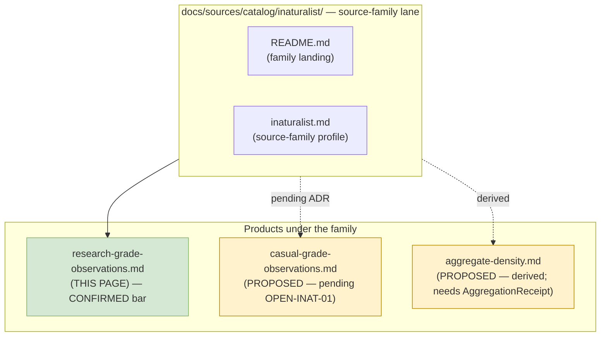

<!-- [KFM_META_BLOCK_V2]
doc_id: kfm://doc/docs-sources-catalog-inaturalist-research-grade-observations
title: iNaturalist Community Observations — Research-Grade
type: product-page
version: v0.2
status: draft
owners: <PLACEHOLDER — Docs steward + Source steward for inaturalist>
created: 2026-05-20
updated: 2026-05-21
policy_label: public
related:
  - docs/sources/catalog/inaturalist/README.md
  - docs/sources/catalog/inaturalist/inaturalist.md
  - docs/sources/catalog/README.md
  - docs/sources/catalog/IDENTITY.md
  - docs/sources/catalog/RIGHTS-AND-SENSITIVITY-MAP.md
  - docs/sources/catalog/_examples/stac-item-example.json
  - docs/doctrine/directory-rules.md
  - docs/standards/SENSITIVITY_RUBRIC.md
  - docs/standards/REDACTION_DETERMINISM.md
  - docs/registers/VERIFICATION_BACKLOG.md
  - schemas/contracts/v1/source/source_descriptor.schema.json
  - schemas/contracts/v1/biodiversity/occurrence_evidence.schema.json
  - connectors/inaturalist/README.md
  - policy/sensitivity/
  - policy/rights/
tags: [kfm, docs, sources, catalog, inaturalist, research-grade, biodiversity, src-inat]
notes:
  - >-
    Product-page scope: this doc covers ONE product within the iNaturalist source
    family — research-grade observations under normalized CC license. Sibling
    "casual-grade / non-research-grade" product is OPEN per OPEN-INAT-01 and not
    in scope here.
  - >-
    PROPOSED scaffold; sibling-link presence verified in Claude Code session but
    NOT against a mounted repo. All sibling-doc claims remain PROPOSED until
    later mounted-repo evidence confirms.
  - >-
    Research-grade-only admission bar is CONFIRMED doctrine per atlas idea card
    KFM-P6-PROG-0001; license normalization and geoprivacy-as-evidence are the
    fail-closed anchors.
[/KFM_META_BLOCK_V2] -->

# iNaturalist Community Observations — Research-Grade

> Community-rated, identifier-graded species occurrence records from the iNaturalist API, admitted under the **research-grade + normalized-CC** bar (CONFIRMED per `KFM-P6-PROG-0001`).

<!-- Badge row — Shields.io placeholders; replace targets once owners/CI/policies land -->


| Status | Owners | Last reviewed |
|---|---|---|
| Draft — PROPOSED scaffold, no admission decision | `<Docs steward + Source steward for inaturalist — TODO assign>` | 2026-05-21 |

> [!NOTE]
> **What this page is:** the product-page surface for the **research-grade** iNaturalist observation stream. It points at the authoritative SourceDescriptor, catalog profiles, and policy rather than restating them.
> **What it is not:** the source-family landing page (see [`./README.md`](./README.md) and [`./inaturalist.md`](./inaturalist.md)), a connector spec, or a release manifest.

---

## Quick jump

- [1. Overview](#1-overview)
- [2. Product identity & scope](#2-product-identity--scope)
- [3. Source authority](#3-source-authority)
- [4. Admission bar — research-grade only](#4-admission-bar--research-grade-only)
- [5. Catalog profiles used](#5-catalog-profiles-used)
- [6. Collection identity](#6-collection-identity)
- [7. Provenance fields (`kfm:provenance`)](#7-provenance-fields-kfmprovenance)
- [8. Temporal handling](#8-temporal-handling)
- [9. Geometry and projection](#9-geometry-and-projection)
- [10. Rights and sensitivity](#10-rights-and-sensitivity)
- [11. Validation and catalog closure](#11-validation-and-catalog-closure)
- [12. Related contracts and schemas](#12-related-contracts-and-schemas)
- [13. Related connectors and pipelines](#13-related-connectors-and-pipelines)
- [14. Examples](#14-examples)
- [15. Open questions](#15-open-questions)
- [16. Verification backlog](#16-verification-backlog)
- [Appendix A — Illustrative STAC × DwC skeleton](#appendix-a--illustrative-stac--dwc-skeleton)

---

## 1. Overview

PROPOSED scaffold for the **research-grade** product. The product surfaces iNaturalist records that have reached the **research-grade** quality state on the platform AND whose license can be **normalized to a recognized CC variant** AND whose taxonomy resolves against a KFM-controlled vocabulary (CONFIRMED admission bar per `KFM-P6-PROG-0001`).

Records that do not meet all three conditions never reach this product. They are routed to `data/quarantine/...` and may, separately and pending OPEN-INAT-01, be revisited under a paired **casual-grade** product with a downgraded support role.

NEEDS VERIFICATION: scope detail, geographic coverage envelope, cadence, current API endpoint URL, per-record rights handling.

[Back to top](#quick-jump)

---

## 2. Product identity & scope

This product is one of several possible products under the **iNaturalist** source family. Its scope is deliberately narrow.



| Field | Value | Status |
|---|---|---|
| Product slug | `research-grade-observations` | PROPOSED file slug |
| Source family | `inaturalist` (KFM external id `EXT-INAT`; `source_family` enum value `inat`) | CONFIRMED enum per `KFM-P3-PROG-0001` |
| Quality state on upstream | iNaturalist **research-grade** only | CONFIRMED bar per `KFM-P6-PROG-0001` |
| License posture | per-record; **normalize-to-CC** required; unknown → DENY | CONFIRMED bar per `KFM-P6-PROG-0001` |
| Sibling products | casual-grade (pending), aggregate-density (derived) | PROPOSED |

[Back to top](#quick-jump)

---

## 3. Source authority

See [`data/registry/sources/`](../../../../data/registry/sources/) for the authoritative `SourceDescriptor`. **Do not duplicate descriptor fields here.**

For the source-family-level reading (identity, role, sibling sources, taxonomy anchoring, redaction profiles), see the sibling profile [`./inaturalist.md`](./inaturalist.md).

> [!IMPORTANT]
> Product pages **cite** authority; they do not **own** it. The descriptor is the source of truth for identity, rights, sensitivity, cadence, and citation. The schema (per ADR-0001 default home `schemas/contracts/v1/source/source_descriptor.schema.json`) is the source of truth for descriptor shape.

[Back to top](#quick-jump)

---

## 4. Admission bar — research-grade only

This product is the operational embodiment of the **opinionated choice** recorded in atlas idea card `KFM-P6-PROG-0001`:

| Bar component | Rule | Citation |
|---|---|---|
| Quality state | iNaturalist record MUST be flagged **research-grade** by the upstream platform | CONFIRMED — `KFM-P6-PROG-0001` |
| License | MUST be normalizable to a recognized **CC variant** (e.g., `CC0`, `CC-BY-4.0`, `CC-BY-NC-4.0`); unknown / unnormalizable → **DENY at admission** | CONFIRMED — `KFM-P6-PROG-0001` |
| Taxonomy | MUST resolve to a controlled vocabulary (ITIS TSN preferred; GBIF Backbone fallback per `C7-07` / `C7-08`); unresolved → **DENY at admission** | CONFIRMED — `KFM-P6-PROG-0001` |
| Geoprivacy | Obscured / private coordinates are preserved **as evidence**, never inferred away or back-filled | CONFIRMED — `KFM-P6-PROG-0001` |
| Mapping target | One `OccurrenceEvidenceObject` instance per admitted record (`source_family = inat`) | CONFIRMED — `KFM-P3-PROG-0001` |

> [!CAUTION]
> **Doctrinal tension surfaced in the corpus** (`KFM-P6-PROG-0001`). Research-grade-only is opinionated; the corpus does not deeply argue it against the alternative of admitting non-research-grade observations under a downgraded support role. That alternative is the scope of a future sibling product (`casual-grade-observations`) and **is not in scope here**. Filed as OPEN-INAT-01 in §16.

[Back to top](#quick-jump)

---

## 5. Catalog profiles used

| Profile | Lane | Used by this product? | Citation |
|---|---|---|---|
| STAC (Item + Collection) | `data/catalog/stac/` | PROPOSED — **Yes** (NEEDS VERIFICATION) | `C4-01`, `C4-02` |
| STAC × Darwin Core hybrid | `data/catalog/stac/` (DwC inside `properties.taxon`) | PROPOSED — **Yes** (NEEDS VERIFICATION) | `C4-03` (CONFIRMED for biodiversity occurrences) |
| DCAT | `data/catalog/dcat/` | PROPOSED — Yes / No (NEEDS VERIFICATION) | `C4-05` |
| PROV-O | `data/catalog/prov/` | PROPOSED — Yes / No (NEEDS VERIFICATION) | `C8-03` |
| Domain projection | `data/catalog/domain/<domain>/` | PROPOSED — fauna and flora lanes (NEEDS VERIFICATION) | Directory Rules §6.1 |
| `kfm:care` extension namespace | `data/catalog/stac/` + `data/catalog/dcat/` | PROPOSED — applies when MetaBlock v2 declares non-empty `authority_to_control` | `C15-02` |

> [!TIP]
> **STAC × Darwin Core hybrid (`C4-03`, CONFIRMED).** Biodiversity occurrences are encoded as STAC Items (`Feature` with geometry and datetime) whose `properties` include a `taxon` object carrying DwC terms (`scientific_name`, `common_name`, `kbs_id`, `kdwp_status`, `sensitivity_rank`) plus a `redaction_profile` and an `evidence` block. DwC lives **inside** `properties.taxon` — never at the top level.

[Back to top](#quick-jump)

---

## 6. Collection identity

- PROPOSED Collection id pattern: `kfm-<org>-<product>` (see [`IDENTITY.md`](../IDENTITY.md)). Per `C4-02`, Collection ids are stable handles — renaming a Collection breaks links throughout the catalog.
- PROPOSED namespace: `kfm:` — **see OPEN-DSC-03**; namespace choice `kfm:` vs `ks-kfm:` is **unsettled in the corpus** per `C4-01` (Open Question).
- Asset roles: NEEDS VERIFICATION — confirm against `schemas/contracts/v1/source/`.

| Element | PROPOSED value | Source |
|---|---|---|
| Collection id | `kfm-<org>-inat-research-grade` | `C4-02` id convention |
| Title | iNaturalist research-grade observations — KFM governance | Convention |
| `kfm:` namespace | unsettled vs `ks-kfm:` | OPEN-DSC-03 / `C4-01` |
| License declaration | per-record; Collection declares "varies per Item" | `KFM-P6-PROG-0001` |
| Governance line | "Deterministically built occurrence stream with KFM governance" | `C4-02` convention |

[Back to top](#quick-jump)

---

## 7. Provenance fields (`kfm:provenance`)

STAC `item.properties.kfm:provenance` block (CONFIRMED block shape per `C4-01`):

| Field | Type | Description | Citation |
|---|---|---|---|
| `spec_hash` | sha256 hex | Deterministic digest of the canonical record (`source_record_id`, `event_date`, normalized geometry, accepted taxon name) | `C4-01`, `KFM-IDX-OCC-007` |
| `evidence_bundle_ref` | `kfm://evidence/<digest>` | Content-addressed JSON-LD bundle with receipts and validations | `C4-01`, `C4-04` |
| `run_record_ref` | `kfm://run/<run-id>` | Pointer to the connector run record | `C4-01` |
| `audit_ref` | `kfm://audit/<attestation-id>` | SLSA / OPA attestation pointer | `C4-01` |
| `policy_digest` | sha256 hex | Digest of the policy bundle in force at promotion | `C4-01` |

Per-asset integrity: `file:checksum` (per-file SHA-256, CONFIRMED per `C4-01` + `C3-02`).

[Back to top](#quick-jump)

---

## 8. Temporal handling

PROPOSED — distinct **source / observed / valid / retrieval / release / correction** times kept distinct where material (CONFIRMED doctrine across Fauna §7.5, Flora §7.6, and Atlas §24.8). NEEDS VERIFICATION per product.

| Time | Meaning for an iNaturalist record |
|---|---|
| Source time | When iNaturalist accepted the record onto the platform |
| Observed time | The observer's reported `event_date` / `event_time` |
| Valid time | Domain-specific; for occurrences, typically the observed moment |
| Retrieval time | When the KFM connector pulled the record |
| Release time | When KFM published the public-safe derivative |
| Correction time | When a `CorrectionNotice` or `RedactionReceipt` updated the released form |

[Back to top](#quick-jump)

---

## 9. Geometry and projection

PROPOSED — confirm CRS, generalization rules, and scale support against `data/catalog/` artifacts. NEEDS VERIFICATION.

| Aspect | PROPOSED value | Citation |
|---|---|---|
| Native CRS | EPSG:4326 (lat/lon decimal degrees) | iNaturalist API convention |
| Geometry block carries | `latitude`, `longitude`, `precision_class`, `geoprivacy_status`, conditional `public_safe_geometry` | `KFM-P3-PROG-0001`, `KFM-P25-PROG-0017` |
| Generalization (when sensitive) | Named redaction profile (e.g., `point_10km_hex_seeded_v1`, `point_3km_jitter_v1`, `centroid_1km_v1`) | `C6-02`, `C6-03`, `C6-04` |
| STAC Projection extension fields | `proj:code`, `proj:bbox`, `proj:geometry`, `proj:shape`, `proj:transform` validated by front-matter schema | `KFM-P27-PROG-0011` (PROPOSED) |

> [!WARNING]
> When `geoprivacy_status` ∈ `{obscured, private, generalized}`, the conditional schema (per `KFM-P25-PROG-0017`) **requires** `public_safe_geometry` to be present. Style-level hiding is **not** an acceptable substitute (CONFIRMED MapLibre doctrine).

[Back to top](#quick-jump)

---

## 10. Rights and sensitivity

NEEDS VERIFICATION — see [`policy/sensitivity/`](../../../../policy/sensitivity/) and [`RIGHTS-AND-SENSITIVITY-MAP.md`](../RIGHTS-AND-SENSITIVITY-MAP.md). **Do not restate policy here.**

| Concern | Where it lives | Rule (CONFIRMED) |
|---|---|---|
| Per-record license capture | `policy/rights/` + `SourceDescriptor.rights` | Unknown rights → **DENY**; license is a runtime gate (`KFM-P6-PROG-0001`) |
| Sensitivity rubric (0–5) | `docs/standards/SENSITIVITY_RUBRIC.md` (PROPOSED in corpus, not yet authored) | `C6-01` |
| Named redaction profiles | `policy/redaction/profiles.yaml` (PROPOSED home) | `C6-02` |
| Seeded jitter determinism | `docs/standards/REDACTION_DETERMINISM.md` (PROPOSED in corpus, not yet authored) | `C6-03` |
| CARE / `kfm:care` extension | `policy/sensitivity/` + catalog extension | `C15-02`, `C15-03` |

[Back to top](#quick-jump)

---

## 11. Validation and catalog closure

| Gate | Purpose | Status | Citation |
|---|---|---|---|
| Catalog closure required before public release | No PUBLISHED edge to WORK / QUARANTINE; release decisions live in `release/` | CONFIRMED doctrine | `KFM-P1-IDEA-0020` (referenced as PROPOSED) |
| STAC Projection front-matter validation | `proj:code`, `proj:bbox`, `proj:geometry`, `proj:shape`, `proj:transform` validated | PROPOSED | `KFM-P27-PROG-0011`; original scaffold also cites `KFM-P27-FEAT-0003` (NEEDS VERIFICATION) |
| STAC checksum closure against `ReleaseManifest` digest | Asset `file:checksum` matches manifest entry | PROPOSED | `KFM-P22-PROG-0037` (NEEDS VERIFICATION) |
| Spec-hash-match gate | Claimed `spec_hash` matches recomputed hash | CONFIRMED doctrine | `C5-04`, `C1-02` |
| Lineage required | Every published asset has OpenLineage trail back to receipts | CONFIRMED doctrine | `C5-08` |
| Default-deny promotion | Promotion fails closed; explicit allow-rule required | CONFIRMED doctrine | `C5-02` |
| Citation validation | Every released record resolves to an `EvidenceBundle` | CONFIRMED doctrine | `C4-04`, cite-or-abstain |

[Back to top](#quick-jump)

---

## 12. Related contracts and schemas

- [`contracts/`](../../../../contracts/) — semantic object families (NEEDS VERIFICATION).
- [`schemas/contracts/v1/source/`](../../../../schemas/contracts/v1/source/) — default schema home per ADR-0001.
- [`schemas/contracts/v1/biodiversity/`](../../../../schemas/contracts/v1/biodiversity/) — PROPOSED consolidation home for `OccurrenceEvidenceObject`; current PROPOSED home `schemas/occurrence_evidence/occurrence_evidence.schema.json`.

[Back to top](#quick-jump)

---

## 13. Related connectors and pipelines

- [`connectors/inaturalist/`](../../../../connectors/inaturalist/) — **CONFIRMED (at commit `b6a27916bbb9e07cbf3752870c867476e1e094e7`)** per Directory Rules v1.2 §7.3; connectors write only to `data/raw/...` or `data/quarantine/...`.
- [`pipelines/ingest/`](../../../../pipelines/ingest/), [`pipelines/normalize/`](../../../../pipelines/normalize/), [`pipelines/validate/`](../../../../pipelines/validate/), [`pipelines/catalog/`](../../../../pipelines/catalog/) — canonical executable pipeline roots.
- [`pipeline_specs/<domain>/`](../../../../pipeline_specs/) — declarative specs (fauna and flora lanes apply).

[Back to top](#quick-jump)

---

## 14. Examples

*(Illustrative only — do not treat as authoritative.)*

See [`_examples/stac-item-example.json`](../_examples/stac-item-example.json) for the minimal STAC + `kfm:provenance` shape. The skeleton below shows the **STAC × DwC hybrid** envelope this product targets.

<details>
<summary>Click to expand — illustrative STAC × DwC skeleton (NOT validated, NOT canonical)</summary>

```json
{
  "type": "Feature",
  "stac_version": "1.0.0",
  "id": "kfm://occurrence/<id>",
  "geometry": { "type": "Point", "coordinates": [-98.21, 38.74] },
  "bbox": [-98.21, 38.74, -98.21, 38.74],
  "properties": {
    "datetime": "2026-04-12T10:31:00Z",
    "taxon": {
      "scientific_name": "Sialia sialis",
      "accepted_scientific_name": "Sialia sialis",
      "common_name": "Eastern bluebird",
      "taxon_rank": "species",
      "itis_tsn": "<ITIS-TSN>",
      "gbif_backbone_doi": "10.15468/39omei",
      "gbif_backbone_version": "<version>",
      "kdwp_status": "<status>",
      "sensitivity_rank": 1
    },
    "kfm:provenance": {
      "spec_hash": "sha256:<hex>",
      "evidence_bundle_ref": "kfm://evidence/<digest>",
      "run_record_ref": "kfm://run/<run-id>",
      "audit_ref": "kfm://audit/<attestation-id>",
      "policy_digest": "sha256:<hex>"
    },
    "kfm:rights": {
      "license": "CC-BY-4.0",
      "license_normalized": true,
      "attribution": "<observer> via iNaturalist (<record_url>)"
    },
    "kfm:source": {
      "source_id": "EXT-INAT",
      "source_family": "inat",
      "source_role": "observed",
      "source_record_id": "inat:<id>"
    },
    "kfm:geoprivacy": {
      "status": "open",
      "public_safe_geometry": null
    },
    "redaction_profile": "kfm:redact:none"
  },
  "assets": {
    "evidence_bundle": {
      "href": "./<digest>.evidence.jsonld",
      "type": "application/ld+json",
      "file:checksum": "sha256:<hex>"
    }
  },
  "links": [
    { "rel": "collection", "href": "./collection.json" },
    { "rel": "self", "href": "./<id>.json" }
  ]
}
```

</details>

[Back to top](#quick-jump)

---

## 15. Open questions

- **OPEN-INAT-01** — Should non-research-grade observations be admitted under a downgraded support role as a sibling product? Recorded tension on `KFM-P6-PROG-0001`. Out of scope for this page; tracked at the source-family level.
- **OPEN-INAT-02** — Codify ITIS / GBIF tie-breaker policy when authorities disagree on accepted name. Open question carried from `C7-07`.
- **OPEN-DSC-03** — Settle the `kfm:` vs `ks-kfm:` STAC namespace question (carried from `C4-01`).
- Confirm cadence and current API endpoint URL.
- Confirm whether this product warrants its own STAC Collection or shares one with a sibling product.
- Confirm whether STAC × DwC is canonical, or whether KFM round-trips through DwC-A (tension on `C4-03`).
- Confirm CARE applicability for any subset of records bearing tribal or Indigenous-knowledge ties.

[Back to top](#quick-jump)

---

## 16. Verification backlog

Only the `connectors/inaturalist/` lane is verified at commit `b6a27916bbb9e07cbf3752870c867476e1e094e7`; every other item below must close before this product is activated.

| Item | Evidence that would settle it | Status |
|---|---|---|
| Confirm `docs/sources/catalog/inaturalist/` layout (sibling files: `README.md`, `inaturalist.md`, this product page, `_examples/`) | Mounted-repo `docs/sources/catalog/inaturalist/` tree | NEEDS VERIFICATION |
| Confirm `data/registry/sources/` descriptor instance for `EXT-INAT` | Mounted registry; SourceDescriptor file | NEEDS VERIFICATION |
| Confirm STAC × DwC profile JSON Schema location | Mounted schema; ADR if relocated | NEEDS VERIFICATION |
| Confirm STAC Collection id pattern adoption (`kfm-<org>-inat-research-grade`) | STAC profile doc; mounted Collection | NEEDS VERIFICATION |
| Confirm `kfm:` namespace vs `ks-kfm:` (OPEN-DSC-03) | ADR + STAC profile | OPEN |
| Confirm `KFM-P27-FEAT-0003` (STAC Projection lint) ID and whether it differs from `KFM-P27-PROG-0011` | Idea index entry | NEEDS VERIFICATION |
| Confirm `KFM-P22-PROG-0037` (STAC checksum closure) idea card | Idea index entry | NEEDS VERIFICATION |
| Confirm `KFM-P1-IDEA-0020` (catalog closure) idea card | Idea index entry | NEEDS VERIFICATION |
| Resolve license normalization map (CC0 / CC-BY / CC-BY-NC / ©) for iNaturalist per-record handling | Source steward + iNaturalist Terms review | NEEDS VERIFICATION |
| Resolve taxonomy controlled vocabulary for the admission gate | Biodiversity steward + ADR | OPEN-INAT-02 |
| Resolve sensitive-taxa redaction profile defaults | Sensitivity reviewer + `policy/sensitivity/` | NEEDS VERIFICATION |

[Back to top](#quick-jump)

---

## Appendix A — Illustrative STAC × DwC skeleton

The skeleton lives inline in §14 to keep this product page self-contained for reviewers. The canonical example file is [`../_examples/stac-item-example.json`](../_examples/stac-item-example.json) (PROPOSED sibling). Treat both as **illustrative**; the authoritative shape lives in the STAC × DwC JSON Schema (PROPOSED home under `schemas/contracts/v1/biodiversity/`).

[Back to top](#quick-jump)

---

### Footer

> **Related:** [`./README.md`](./README.md) (family landing) · [`./inaturalist.md`](./inaturalist.md) (source-family profile) · [`../README.md`](../README.md) (catalog index) · [`../IDENTITY.md`](../IDENTITY.md) · [`../RIGHTS-AND-SENSITIVITY-MAP.md`](../RIGHTS-AND-SENSITIVITY-MAP.md) · [Directory Rules](../../../doctrine/directory-rules.md)
> **Last updated:** 2026-05-21 *(Claude Code product-page revision; v0.1 → v0.2)* · **Status:** draft · **Authority of this doc:** explanatory product-page; does **not** decide admission, activation, or release.
> [⬆ Back to top](#inaturalist-community-observations--research-grade)
