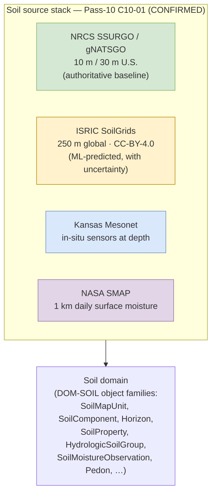

<!-- [KFM_META_BLOCK_V2]
doc_id: kfm://doc/docs-sources-catalog-isric-readme
title: ISRIC source family
type: readme
version: v0.2
status: draft
owners: <PLACEHOLDER — Docs steward + Source steward for isric>
created: 2026-05-21
updated: 2026-05-21
policy_label: public
related:
  - docs/sources/catalog/README.md
  - docs/sources/catalog/isric/isric-soilgrids.md
  - docs/sources/catalog/IDENTITY.md
  - docs/sources/catalog/PROFILES.md
  - docs/sources/catalog/RIGHTS-AND-SENSITIVITY-MAP.md
  - docs/sources/catalog/OPEN-QUESTIONS.md
  - docs/sources/catalog/_template/SOURCE_PRODUCT_TEMPLATE.md
  - docs/doctrine/directory-rules.md
  - docs/domains/soil/README.md
  - docs/standards/SENSITIVITY_RUBRIC.md
  - docs/registers/VERIFICATION_BACKLOG.md
  - schemas/contracts/v1/source/source_descriptor.schema.json
  - connectors/isric/
  - data/registry/sources/
  - policy/sensitivity/
tags: [kfm, docs, sources, catalog, isric, soil, soilgrids]
notes:
  - >-
    Family scaffolded from the connectors/ inventory; descriptions grounded in
    docs/domains soil registries and atlas idea cards (KFM-P24-PROG-0006 SoilGrids
    descriptor; KFM-P12-PROG-0003 soil composite framing; Pass-10 C10-01).
  - >-
    PROPOSED family: ISRIC is NOT one of the nine `directory-rules.md` §7.3
    canonical connector families. Promotion to canonical status requires an
    accepted ADR per Directory Rules §2.4. Tracked as OPEN-DSC-14.
  - >-
    `connectors/isric/` lane is reported by the scaffolding session as
    "currently empty stubs" — preserved as PROPOSED until mounted-repo evidence
    verifies.
[/KFM_META_BLOCK_V2] -->

# `isric` source family

> Source-oriented catalog documentation for the **ISRIC** (World Soil Information) source family. ISRIC produces global, ML-predicted soil-property datasets — most notably **SoilGrids** — used in KFM as an international-comparability lane alongside the NRCS authoritative U.S. baselines.

<!-- Badge row — Shields.io placeholders; replace targets once owners/CI/policies land -->

| Status | Owners | Last reviewed |
|---|---|---|
| Draft — PROPOSED family (beyond `directory-rules.md` §7.3) | `<Docs steward + Source steward for isric — TODO assign>` | 2026-05-21 |

> [!IMPORTANT]
> **Authority note.** `isric/` is **not** one of the nine canonical connector families enumerated in `directory-rules.md` §7.3 (`usgs/`, `fema/`, `noaa/`, `nrcs/`, `kansas/`, `gbif/`, `inaturalist/`, `census/`, `local_upload/`). This family folder was scaffolded on 2026-05-21 because a `connectors/isric/` companion exists. Adopting `isric/` as a canonical connector family requires an ADR per Directory Rules §2.4 — tracked as **OPEN-DSC-14**. Until then, treat this README as PROPOSED documentation, not a placement decision.

---

## Quick jump

- [1. Overview](#1-overview)
- [2. Family identity & position](#2-family-identity--position)
- [3. Product pages](#3-product-pages)
- [4. Source authority](#4-source-authority)
- [5. Catalog profiles](#5-catalog-profiles)
- [6. Identity & namespaces](#6-identity--namespaces)
- [7. Rights & sensitivity](#7-rights--sensitivity)
- [8. Validation](#8-validation)
- [9. Related contracts & schemas](#9-related-contracts--schemas)
- [10. Related connectors & pipelines](#10-related-connectors--pipelines)
- [11. Open questions](#11-open-questions)
- [12. Verification backlog](#12-verification-backlog)
- [Appendix A — Atlas idea-card lineage](#appendix-a--atlas-idea-card-lineage)

---

## 1. Overview

**ISRIC — World Soil Information** is the international body that produces global soil-property datasets. Within KFM, the ISRIC family is treated as a **modelled, international-comparability** source — **not** as the authoritative source of record for U.S. or Kansas soils.

| KFM treats ISRIC products as | KFM does not treat ISRIC products as |
|---|---|
| ML-predicted global soil-property layers with explicit uncertainty | The authoritative U.S. or Kansas soil baseline |
| The international-comparability lane in the multi-source soil stack | A substitute for NRCS SSURGO / gNATSGO at field-scale work |
| One channel of evidence into the `Soil` domain object families | A source of regulatory or listed-status truth |
| A useful coarse-resolution context layer (250 m global) | Capable of resolving 10 m SSURGO / 30 m gNATSGO detail |

> [!NOTE]
> **CONFIRMED doctrine, Pass-10 `C10-01`.** The Kansas soil stack includes **"ISRIC SoilGrids at 250-meter global resolution under CC-BY-4.0"** alongside SSURGO/gNATSGO (NRCS, U.S. baseline), Kansas Mesonet (in-situ sensors), and NASA SMAP (1 km daily satellite). Each source is ingested independently under its own receipt envelope.

[Back to top](#quick-jump)

---

## 2. Family identity & position

> [!CAUTION]
> **Resolution-mismatch warning** (CONFIRMED, `C10-01`). Cross-source queries that mix 10 m SSURGO, 30 m gNATSGO, **250 m SoilGrids**, and 1 km SMAP require explicit reprojection or aggregation. The corpus warns against **silent resampling** that conflates resolutions; any derived KFM product that mixes ISRIC with other soil sources must tag the value with source resolution and resampling method.

| Field | Value | Status |
|---|---|---|
| KFM source-family slug (this folder) | `isric` | PROPOSED — not yet in `directory-rules.md` §7.3 |
| Source organization | ISRIC — World Soil Information | CONFIRMED organization name |
| Primary product family | SoilGrids (250 m global, ML-predicted) | CONFIRMED — `C10-01`, `KFM-P24-PROG-0006` |
| KFM lane role | Modelled / international-comparability | CONFIRMED framing — `KFM-P12-PROG-0003` (distinguishes "authoritative NRCS map-unit baselines, ML-predicted SoilGrids layers with uncertainty, and KSSL pedons for QA/bias checks") |
| Authoritative for | International comparability of soil properties | CONFIRMED |
| Not authoritative for | U.S. or Kansas soils at field scale; regulatory soil baseline | CONFIRMED |
| Default `source_role` (PROPOSED) | `modeled` (requires `role_model_run_ref` → `ModelRunReceipt` per Atlas §24.1.3) | PROPOSED — per Atlas source-role enum |
| Anchor domain | `Soil` (`DOM-SOIL`) | CONFIRMED per Domains Atlas §soil |

> [!TIP]
> **`source_role: modeled` matters.** ISRIC SoilGrids is **ML-predicted**, not observed. Per Atlas §24.1.3, when `source_role = modeled`, the `SourceDescriptor` MUST carry `role_model_run_ref` pointing at a `ModelRunReceipt` that pins inputs, parameters, and version. Treating SoilGrids as observed evidence is a source-role collapse.

[Back to top](#quick-jump)

---

## 3. Product pages

| Page | Product | Resolution | License | Status |
|---|---|---|---|---|
| [`isric-soilgrids.md`](./isric-soilgrids.md) | ISRIC SoilGrids | 250 m global | CC-BY-4.0 (CONFIRMED, `C10-01`) | PROPOSED |

> [!NOTE]
> The product pages do the per-product work (depth bands, model version, uncertainty layer treatment, STAC × kfm:provenance, etc.). This README explains the **family** — identity, position in the soil stack, family-level rights posture, and where to find the rest.

[Back to top](#quick-jump)

---

## 4. Source authority

Authoritative `SourceDescriptor`s live in [`data/registry/sources/`](../../../../data/registry/sources/) — **do not duplicate descriptor fields here.**

The descriptor for SoilGrids should record (per `KFM-P24-PROG-0006`, PROPOSED): **250-meter depth bands**, texture and organic-matter analog fields, **model version**, `source_uri`, and **uncertainty notes**. The schema home for descriptors is `schemas/contracts/v1/source/source_descriptor.schema.json` per ADR-0001.

[Back to top](#quick-jump)

---

## 5. Catalog profiles

PROPOSED — see [`PROFILES.md`](../PROFILES.md). Confirm per product which of STAC, DCAT, PROV-O, and the domain projections in [`data/catalog/`](../../../../data/catalog/) each product lands in.

| Profile | Lane | Likely fit for ISRIC SoilGrids (PROPOSED) |
|---|---|---|
| STAC (Item + Collection) | `data/catalog/stac/` | **Yes** — gridded raster product fits STAC's spatiotemporal envelope (`C4-01`, `C4-02`) |
| DCAT distribution | `data/catalog/dcat/` | Likely yes for dataset-level metadata (`C4-05`) |
| PROV-O | `data/catalog/prov/` | Required for the model-run provenance trail (`C8-03`, `C5-08`) |
| Domain projection (`soil`) | `data/catalog/domain/soil/` | **Yes** — joins to `SoilMapUnit` / `SoilProperty` / `HydrologicSoilGroup` |
| `kfm:care` extension | catalog Items/Collections | Not expected — global soil-property data is not typically CARE-tagged |

[Back to top](#quick-jump)

---

## 6. Identity & namespaces

Collection-id and namespace conventions follow [`IDENTITY.md`](../IDENTITY.md).

- **Collection id pattern:** `kfm-<org>-<product>` (e.g., `kfm-<org>-isric-soilgrids`) per `C4-02`. Renaming a Collection breaks links throughout the catalog.
- **Namespace pin:** `kfm:` vs `ks-kfm:` is **unresolved** — see `OPEN-DSC-03` in [`OPEN-QUESTIONS.md`](../OPEN-QUESTIONS.md). The corpus (`C4-01`) leaves the choice open.

[Back to top](#quick-jump)

---

## 7. Rights & sensitivity

NEEDS VERIFICATION per product — see [`RIGHTS-AND-SENSITIVITY-MAP.md`](../RIGHTS-AND-SENSITIVITY-MAP.md) and [`policy/sensitivity/`](../../../../policy/sensitivity/). **Never restate policy here.**

| Concern | ISRIC family posture |
|---|---|
| Family-level license | **CC-BY-4.0** for SoilGrids per `C10-01` (CONFIRMED at family level; confirm per product against current ISRIC terms) |
| Attribution required | Yes — CC-BY requires attribution; KFM citation template must preserve ISRIC + SoilGrids + version |
| Sensitivity rubric (0–5, `C6-01`) | Default rank **0–1** (global soil-property layers are non-sensitive); no rare-species / sensitive-site overlap at the family level |
| Sovereignty / CARE | Not expected at family level; per-product review required if any subset overlaps tribal or Indigenous-knowledge ties |
| Source role | `modeled` (NOT `observed`) — model run receipts required |

> [!WARNING]
> **Family-level license clarity does not relieve per-product verification.** Confirm the SoilGrids version in use, its license string at the time of capture, and the attribution wording required by ISRIC's current terms. Treat any deviation from CC-BY-4.0 as a fail-closed signal until reviewed.

[Back to top](#quick-jump)

---

## 8. Validation

| Validator / gate | Purpose | Status |
|---|---|---|
| Markdown lint | Per-file Markdown conformance | NEEDS VERIFICATION — workflow not yet wired |
| Link integrity | Repo-relative targets resolve | NEEDS VERIFICATION |
| Per-product page conformance to [`_template/SOURCE_PRODUCT_TEMPLATE.md`](../_template/SOURCE_PRODUCT_TEMPLATE.md) | Structural consistency across product pages | PROPOSED |
| Source-descriptor completeness | Reject descriptors lacking `source_role`, `rights`, `sensitivity`, or model-run reference (for modelled sources) | CONFIRMED doctrine; implementation PROPOSED |
| `ModelRunReceipt` resolution gate (for `source_role = modeled`) | `role_model_run_ref` MUST resolve to a `ModelRunReceipt` that pins inputs, parameters, version | CONFIRMED doctrine (Atlas §24.1.3); implementation PROPOSED |

[Back to top](#quick-jump)

---

## 9. Related contracts & schemas

- [`schemas/contracts/v1/source/`](../../../../schemas/contracts/v1/source/) — `SourceDescriptor` machine shape (per ADR-0001).
- [`contracts/`](../../../../contracts/) — object families (notably the `Soil` domain object family per Domains Atlas §soil: `SoilMapUnit`, `SoilComponent`, `Horizon`, `SoilProperty`, `HydrologicSoilGroup`, `SoilMoistureObservation`, `Pedon`, `SuitabilityRating`, `ErosionRisk`, …).
- `ModelRunReceipt` schema home: `schemas/contracts/v1/receipts/` (PROPOSED per Atlas §24.2).

[Back to top](#quick-jump)

---

## 10. Related connectors & pipelines

- Connector folder: [`connectors/isric/`](../../../../connectors/isric/) — reported by the scaffolding session as **currently empty stubs** (PROPOSED — NEEDS VERIFICATION against mounted-repo evidence). Lane is **beyond** `directory-rules.md` §7.3 and pending OPEN-DSC-14.
- Pipelines: [`pipelines/ingest/`](../../../../pipelines/ingest/), [`pipelines/normalize/`](../../../../pipelines/normalize/), [`pipelines/validate/`](../../../../pipelines/validate/), [`pipelines/catalog/`](../../../../pipelines/catalog/).
- Pipeline specs: [`pipeline_specs/soil/`](../../../../pipeline_specs/soil/) (PROPOSED — the soil lane is where ISRIC SoilGrids ingest belongs).

> [!IMPORTANT]
> **Connector-as-non-publisher** rule (CONFIRMED, Directory Rules §7.3). Connector output MUST go to `data/raw/<domain>/<source_id>/<run_id>/` or `data/quarantine/...`. Connectors MUST NOT write to `data/processed/`, `data/catalog/`, or `data/published/`. This applies to `connectors/isric/` regardless of its eventual canonical status.

[Back to top](#quick-jump)

---

## 11. Open questions

- **OPEN-DSC-14** — Confirm whether `isric/` warrants `directory-rules.md` §7.3 promotion to a canonical connector family (ADR). Currently a scaffold beyond §7.3.
- **OPEN-DSC-03** — Settle the `kfm:` vs `ks-kfm:` namespace question (from `C4-01`).
- Confirm SoilGrids version in current use; pin the model version in any `ModelRunReceipt`.
- Confirm current ISRIC API endpoint, auth posture, and rate-limit handling.
- Confirm CC-BY-4.0 license string and attribution wording against current ISRIC terms (per-product, not just family).
- Confirm depth-band conventions to record in the descriptor (5–15 cm, 15–30 cm, 30–60 cm, 60–100 cm, 100–200 cm, etc.).
- See [`OPEN-QUESTIONS.md`](../OPEN-QUESTIONS.md) for lane-wide `OPEN-DSC-*` items.

[Back to top](#quick-jump)

---

## 12. Verification backlog

| Item | Evidence that would settle it | Status |
|---|---|---|
| OPEN-DSC-14 — ADR ratification of `isric/` as a §7.3 family | Accepted ADR | OPEN |
| `connectors/isric/` presence and contents | Mounted-repo connector dir | NEEDS VERIFICATION (currently "empty stubs" per scaffolding session) |
| `data/registry/sources/` descriptor instance for ISRIC SoilGrids | Mounted registry; SourceDescriptor file | NEEDS VERIFICATION |
| ISRIC SoilGrids API endpoint, version, auth, rate-limit handling | Source steward + ISRIC docs review | NEEDS VERIFICATION |
| Confirmation that current SoilGrids release remains CC-BY-4.0 | Source steward + ISRIC current terms | NEEDS VERIFICATION (CONFIRMED at family level in `C10-01`; per-version check required) |
| Depth-band convention and uncertainty-layer treatment | Source steward + ISRIC product docs + `KFM-P24-PROG-0006` | NEEDS VERIFICATION |
| `ModelRunReceipt` template for ML-predicted soil layers | Schema author + ADR if needed | PROPOSED |
| Resolution-tagging convention for derived multi-source soil products | Pipeline owner + ADR | OPEN per `C10-01` |
| Pipeline-spec lane (`pipeline_specs/soil/`) presence | Mounted-repo `pipeline_specs/` tree | NEEDS VERIFICATION |
| Sibling family-level files present (`PROFILES.md`, `IDENTITY.md`, `RIGHTS-AND-SENSITIVITY-MAP.md`, `OPEN-QUESTIONS.md`, `_template/SOURCE_PRODUCT_TEMPLATE.md`) | Mounted-repo `docs/sources/catalog/` tree | NEEDS VERIFICATION |

[Back to top](#quick-jump)

---

## Appendix A — Atlas idea-card lineage

For traceability into the KFM Idea Index spine, the ISRIC family draws on the following atlas cards:

Click to expand — idea-card lineage

| Stable ID | Title | Class | Status (atlas) | Relevance to this family |
|---|---|---|---|---|
| `C10-01` | Soil Stack: SSURGO/gNATSGO, SoilGrids, Mesonet, SMAP | CONFIRMED (Pass-10) | Active | Names ISRIC SoilGrids in the canonical soil stack with 250 m / CC-BY-4.0 |
| `KFM-P24-PROG-0006` | SoilGrids source descriptor | programming, CAT | Active | Descriptor MUST record 250 m depth bands, texture / organic-matter analog fields, model version, `source_uri`, uncertainty notes |
| `KFM-P12-PROG-0003` | Soil composite build from gNATSGO, STATSGO2, SoilGrids, and KSSL | programming, ANA | Active | Frames SoilGrids as "ML-predicted layers with uncertainty" distinct from NRCS authoritative baselines |
| `KFM-P24-PROG-0005` | gNATSGO source descriptor | programming, CAT | Active | Sibling lane (NRCS) — used in this README's family-position table |
| `KFM-P23-PROG-0043` | SSURGO static soil descriptor | programming, PIP | Active | Sibling lane (NRCS) — same authoritative-vs-modelled contrast |
| `KFM-P23-PROG-0042` | SMAP watcher descriptor | programming, PIP | Active | Sibling lane (NASA) — appears in the family-position table |

[Back to top](#quick-jump)

---

### Footer

> **Related:** [`../README.md`](../README.md) (catalog index) · [`./isric-soilgrids.md`](./isric-soilgrids.md) (product page) · [`../IDENTITY.md`](../IDENTITY.md) · [`../PROFILES.md`](../PROFILES.md) · [`../RIGHTS-AND-SENSITIVITY-MAP.md`](../RIGHTS-AND-SENSITIVITY-MAP.md) · [`../OPEN-QUESTIONS.md`](../OPEN-QUESTIONS.md) · [Directory Rules](../../../doctrine/directory-rules.md) · [Soil domain dossier](../../../domains/soil/README.md)
> **Last updated:** 2026-05-21 *(Claude Code session — family scaffolded from the connector inventory; descriptions grounded in docs/domains soil registry and atlas idea cards)* · **Status:** draft · **Authority of this doc:** explanatory family README; does **not** decide admission, activation, or release. ISRIC is **beyond** `directory-rules.md` §7.3 pending **OPEN-DSC-14** ADR ratification.
> [⬆ Back to top](#isric-source-family)
