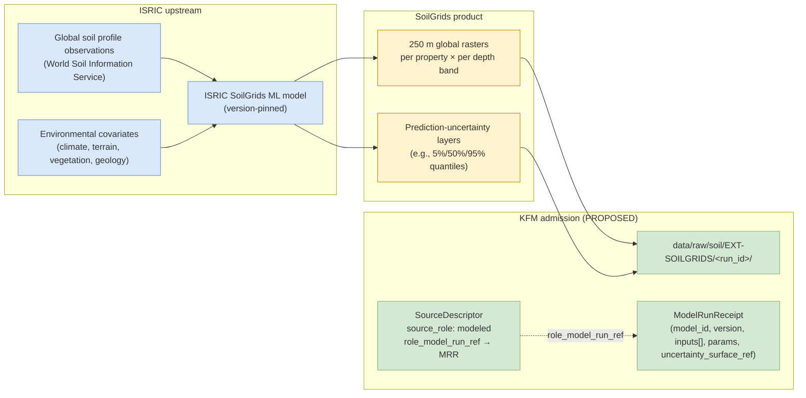

<!-- [KFM_META_BLOCK_V2]
doc_id: kfm://doc/docs-sources-catalog-isric-isric-soilgrids
title: ISRIC SoilGrids
type: product-page
version: v0.2
status: draft
owners: <PLACEHOLDER — Docs steward + Source steward for isric>
created: 2026-05-21
updated: 2026-05-21
policy_label: public
related:
  - docs/sources/catalog/isric/README.md
  - docs/sources/catalog/README.md
  - docs/sources/catalog/IDENTITY.md
  - docs/sources/catalog/PROFILES.md
  - docs/sources/catalog/RIGHTS-AND-SENSITIVITY-MAP.md
  - docs/sources/catalog/OPEN-QUESTIONS.md
  - docs/sources/catalog/_examples/stac-item-example.json
  - docs/sources/catalog/_template/SOURCE_PRODUCT_TEMPLATE.md
  - docs/doctrine/directory-rules.md
  - docs/domains/soil/README.md
  - docs/registers/VERIFICATION_BACKLOG.md
  - schemas/contracts/v1/source/source_descriptor.schema.json
  - schemas/contracts/v1/receipts/model_run_receipt.schema.json
  - connectors/isric/
  - data/registry/sources/
  - policy/sensitivity/
tags: [kfm, docs, sources, catalog, isric, soilgrids, soil, modeled-source]
notes:
  - >-
    Product-page scope: this doc covers ONE product within the ISRIC source
    family — SoilGrids global ML-modelled soil-property grids at 250 m. ISRIC
    is NOT a `directory-rules.md` §7.3 canonical family (see OPEN-DSC-14 in
    the family README).
  - >-
    Description grounded in docs/domains soil registry and atlas idea cards
    KFM-P24-PROG-0006 (SoilGrids descriptor — 250 m depth bands, model version,
    uncertainty notes) and KFM-P12-PROG-0003 (ML-predicted with uncertainty
    framing). License CC-BY-4.0 and 250 m resolution are CONFIRMED at family
    level per Pass-10 C10-01.
  - >-
    `connectors/isric/` is reported as a currently empty stub (PROPOSED — NEEDS
    VERIFICATION against mounted-repo evidence).
[/KFM_META_BLOCK_V2] -->

# ISRIC SoilGrids

> Global, ML-predicted soil-property grids at multiple depths, produced by ISRIC — World Soil Information at **250 m resolution** under **CC-BY-4.0** (CONFIRMED at family level per Pass-10 `C10-01`).

<!-- Badge row — Shields.io placeholders; replace targets once owners/CI/policies land -->


| Status | Owners | Last reviewed |
|---|---|---|
| Draft — PROPOSED scaffold, no admission decision | `<Docs steward + Source steward for isric — TODO assign>` | 2026-05-21 |

> [!IMPORTANT]
> **Modelled, not observed.** SoilGrids is the output of an ISRIC-run machine-learning model with explicit uncertainty layers. Within KFM, it is admitted as `source_role = modeled` (Atlas §24.1.3), which **requires** a `role_model_run_ref` pointing at a `ModelRunReceipt` that pins the model identity, version, inputs, parameters, and uncertainty-surface reference. Treating SoilGrids as observed evidence is a source-role collapse and is not permitted.

---

## Quick jump

- [1. Overview](#1-overview)
- [2. Product identity & scope](#2-product-identity--scope)
- [3. Source authority](#3-source-authority)
- [4. Admission posture — modelled source](#4-admission-posture--modelled-source)
- [5. Catalog profiles used](#5-catalog-profiles-used)
- [6. Collection identity](#6-collection-identity)
- [7. Provenance fields (`kfm:provenance` + `ModelRunReceipt`)](#7-provenance-fields-kfmprovenance--modelrunreceipt)
- [8. Temporal handling](#8-temporal-handling)
- [9. Geometry, projection, and depth structure](#9-geometry-projection-and-depth-structure)
- [10. Rights and sensitivity](#10-rights-and-sensitivity)
- [11. Validation and catalog closure](#11-validation-and-catalog-closure)
- [12. Related contracts and schemas](#12-related-contracts-and-schemas)
- [13. Related connectors and pipelines](#13-related-connectors-and-pipelines)
- [14. Examples](#14-examples)
- [15. Open questions](#15-open-questions)
- [16. Verification backlog](#16-verification-backlog)
- [Appendix A — Illustrative STAC raster Item skeleton](#appendix-a--illustrative-stac-raster-item-skeleton)

---

## 1. Overview

ISRIC SoilGrids is a **globally consistent** raster suite of soil properties — texture (sand/silt/clay), organic carbon, bulk density, pH, CEC, coarse fragments, and others — predicted by ISRIC's machine-learning models from a global compilation of soil profile observations and environmental covariates. KFM ingests SoilGrids as the **international-comparability lane** in the multi-source soil stack.

**CONFIRMED facts** (Pass-10 `C10-01`, idea cards `KFM-P24-PROG-0006` and `KFM-P12-PROG-0003`):

| Attribute | Value | Citation |
|---|---|---|
| Resolution | **250 m**, global | `C10-01` |
| License (family level) | **CC-BY-4.0** | `C10-01` |
| Production method | **ML-predicted** with uncertainty | `KFM-P12-PROG-0003` |
| Required descriptor fields | 250 m depth bands · texture and organic-matter analog fields · model version · `source_uri` · uncertainty notes | `KFM-P24-PROG-0006` (PROPOSED descriptor) |
| KFM lane role | International-comparability lane in soil stack (alongside SSURGO/gNATSGO authoritative U.S. baselines, Kansas Mesonet sensors, NASA SMAP satellite) | `C10-01` |

> [!NOTE]
> **What this page is:** the product-page surface for ISRIC SoilGrids — depth-band structure, uncertainty handling, raster catalog profile, modelled-source posture. It points at the authoritative `SourceDescriptor`, `ModelRunReceipt`, and policy rather than restating them.
> **What it is not:** the family landing page (see [`./README.md`](./README.md)), a connector spec, or a release manifest.

[Back to top](#quick-jump)

---

## 2. Product identity & scope



| Field | Value | Status |
|---|---|---|
| Product slug | `isric-soilgrids` | PROPOSED file slug |
| Source family | `isric` (KFM-side; **beyond** `directory-rules.md` §7.3) | PROPOSED — see OPEN-DSC-14 |
| Source organization | ISRIC — World Soil Information | CONFIRMED organization |
| Coverage | Global | CONFIRMED — `C10-01` |
| Resolution | 250 m | CONFIRMED — `C10-01` |
| Method | ML-predicted with uncertainty | CONFIRMED — `KFM-P12-PROG-0003` |
| KFM `source_role` | `modeled` | PROPOSED per Atlas §24.1.3 source-role enum |
| Anchor domain | Soil (`DOM-SOIL`) | CONFIRMED |

[Back to top](#quick-jump)

---

## 3. Source authority

See [`data/registry/sources/`](../../../../data/registry/sources/) for the authoritative `SourceDescriptor`. **Do not duplicate descriptor fields here.**

The descriptor for SoilGrids must record (per `KFM-P24-PROG-0006`, PROPOSED): **250-meter depth bands**, texture and organic-matter analog fields, **model version**, `source_uri`, and **uncertainty notes**. The schema home is `schemas/contracts/v1/source/source_descriptor.schema.json` per ADR-0001.

For family-level context (identity, position in the soil stack, sibling lanes), see [`./README.md`](./README.md).

[Back to top](#quick-jump)

---

## 4. Admission posture — modelled source

SoilGrids is the canonical KFM example of a **modelled** source. The Atlas §24.1.3 source-role enum and rule set apply unmodified:

| Rule (CONFIRMED doctrine) | Effect for SoilGrids |
|---|---|
| `source_role` is set at admission and **never edited in place**; corrections produce a new descriptor + `CorrectionNotice` | One descriptor per SoilGrids release; version bumps create new descriptors |
| When `source_role = modeled`, the descriptor MUST carry `role_model_run_ref` → `ModelRunReceipt` | Receipt MUST resolve before any record from this product can promote |
| `ModelRunReceipt` content: `model_id`, `model_version`, `inputs[]`, `parameters`, `run_time`, `uncertainty_surface_ref`, `validation_ref` (PROPOSED shape, Atlas §24.2.1) | `uncertainty_surface_ref` MUST point at the SoilGrids prediction-uncertainty raster set; receipt MUST pin the SoilGrids release identifier |
| Source-role anti-collapse: role cannot be inferred by AI or upgraded for convenience | A summary or AI answer that treats SoilGrids as observed evidence is a governance violation, not a stylistic choice |

> [!CAUTION]
> **Resolution-mismatch warning** (CONFIRMED, `C10-01`). Cross-source queries that mix **10 m SSURGO**, **30 m gNATSGO**, **250 m SoilGrids**, and **1 km SMAP** require explicit reprojection or aggregation. The corpus warns against **silent resampling** that conflates resolutions. Any derived KFM product that mixes SoilGrids with other soil sources MUST tag the derived value with source resolution and resampling method, and `KFM-P12-PROG-0003` requires distinguishing authoritative NRCS map-unit baselines from ML-predicted SoilGrids layers with uncertainty.

[Back to top](#quick-jump)

---

## 5. Catalog profiles used

> [!NOTE]
> SoilGrids is a **gridded raster** product. The biodiversity STAC × Darwin Core hybrid (`C4-03`) does NOT apply here. The relevant STAC extensions are **`proj`** (projection), **`raster`** (band statistics), and **`file`** (per-asset checksums), plus the KFM **`kfm:provenance`** namespace.

| Profile | Lane | Used by this product? | Citation |
|---|---|---|---|
| STAC Item (raster, geometry + datetime) | `data/catalog/stac/` | **Yes (PROPOSED)** — natural fit for gridded raster | `C4-01`, `C4-02` |
| STAC `proj` extension | inside STAC Item | **Yes (PROPOSED)** — CRS, bbox, transform fields | `KFM-P27-PROG-0011` |
| STAC `raster` extension | inside STAC Item | **Yes (PROPOSED)** — per-band statistics, no-data, units | external STAC convention |
| STAC × Darwin Core hybrid | — | **No** — DwC applies to biodiversity occurrences, not gridded soil | `C4-03` (scoped to biodiversity) |
| DCAT distribution | `data/catalog/dcat/` | **Yes (PROPOSED)** — dataset-level metadata | `C4-05` |
| PROV-O | `data/catalog/prov/` | **Yes (PROPOSED)** — required to carry the model-run provenance trail | `C8-03`, `C5-08` |
| Domain projection (`soil`) | `data/catalog/domain/soil/` | **Yes (PROPOSED)** — joins to `SoilProperty`, `HydrologicSoilGroup` | Directory Rules §6.1 |
| `kfm:care` extension | catalog | **Not expected** — global soil-property data is not typically CARE-tagged | `C15-02` |

[Back to top](#quick-jump)

---

## 6. Collection identity

- **PROPOSED Collection id pattern:** `kfm-<org>-isric-soilgrids` (see [`IDENTITY.md`](../IDENTITY.md)). Per `C4-02`, Collection ids are stable handles — renaming a Collection breaks links.
- **PROPOSED namespace:** `kfm:` — see **OPEN-DSC-03**; the `kfm:` vs `ks-kfm:` choice is unsettled per `C4-01`.
- **Asset roles** (PROPOSED, per-band layout):

| Asset key | Role | Content |
|---|---|---|
| `<property>_<depth>_mean` | `data` | Mean prediction raster for one property × depth band |
| `<property>_<depth>_uncertainty_q05` | `metadata` / `uncertainty` | 5th-quantile prediction surface |
| `<property>_<depth>_uncertainty_q95` | `metadata` / `uncertainty` | 95th-quantile prediction surface |
| `evidence_bundle` | `metadata` | KFM evidence bundle JSON-LD |
| `model_run_receipt` | `metadata` | `ModelRunReceipt` for the ISRIC release captured |

NEEDS VERIFICATION — confirm exact asset-key convention against `schemas/contracts/v1/source/`.

[Back to top](#quick-jump)

---

## 7. Provenance fields (`kfm:provenance` + `ModelRunReceipt`)

STAC `item.properties.kfm:provenance` block (CONFIRMED block shape per `C4-01`):

| Field | Type | Description | Citation |
|---|---|---|---|
| `spec_hash` | sha256 hex | Deterministic digest of the canonical record | `C4-01`, `C1-02` |
| `evidence_bundle_ref` | `kfm://evidence/<digest>` | Content-addressed JSON-LD bundle with receipts and validations | `C4-01`, `C4-04` |
| `run_record_ref` | `kfm://run/<run-id>` | Pointer to the KFM connector run record | `C4-01` |
| `audit_ref` | `kfm://audit/<attestation-id>` | SLSA / OPA attestation pointer | `C4-01` |
| `policy_digest` | sha256 hex | Digest of the policy bundle in force at promotion | `C4-01` |

Per-asset integrity: `file:checksum` (per-file SHA-256, CONFIRMED per `C4-01` + `C3-02`).

**Additional MUST for modelled sources** — the descriptor's `role_model_run_ref` resolves to a `ModelRunReceipt` carrying:

| Field | Description (PROPOSED shape per Atlas §24.2.1) |
|---|---|
| `model_id` | Stable identifier for the ISRIC SoilGrids model |
| `model_version` | SoilGrids release version (NEEDS VERIFICATION — pin per ingest) |
| `inputs[]` | Upstream training and covariate inputs (referenced, not duplicated) |
| `parameters` | Model parameters at the captured release |
| `run_time` | Time the model run was published by ISRIC |
| `uncertainty_surface_ref` | EvidenceRef to the prediction-uncertainty raster(s) |
| `validation_ref` | EvidenceRef to ISRIC's published validation / cross-validation results |

[Back to top](#quick-jump)

---

## 8. Temporal handling

PROPOSED — keep distinct **source / observed / valid / retrieval / release / correction** times where material (CONFIRMED doctrine, Atlas §24.8). For SoilGrids the time semantics are unusual because it is a modelled product, not an observation stream.

| Time | Meaning for ISRIC SoilGrids |
|---|---|
| Source time | Time the SoilGrids release was published by ISRIC |
| Observed time | **Not directly applicable** — model output, not a point-in-time observation. Record as `null` or as the model run's reference period |
| Valid time | The validity envelope ISRIC asserts for the release (if any); otherwise treat as "as of source time" |
| Retrieval time | When the KFM connector pulled the release |
| Release time | When KFM published the public-safe derivative |
| Correction time | When a `CorrectionNotice` updated the released form |

> [!TIP]
> **`SoilTimeCaveat`** — the Domains Atlas §soil registers a domain term `SoilTimeCaveat` to mark soil records whose temporal semantics differ from observed-event records. SoilGrids items SHOULD carry this caveat to prevent downstream time-series joins from treating modelled-grid values as observed measurements.

[Back to top](#quick-jump)

---

## 9. Geometry, projection, and depth structure

PROPOSED — confirm CRS, generalization rules, and depth-band convention against `data/catalog/` artifacts and the descriptor (per `KFM-P24-PROG-0006`).

| Aspect | PROPOSED value | Citation |
|---|---|---|
| Native CRS | NEEDS VERIFICATION — confirm against current ISRIC SoilGrids release (commonly an equal-area projection upstream; lat/lon EPSG:4326 also published) | ISRIC docs review |
| Resolution | 250 m | CONFIRMED — `C10-01` |
| Coverage | Global | CONFIRMED — `C10-01` |
| STAC `proj` fields | `proj:code`, `proj:bbox`, `proj:geometry`, `proj:shape`, `proj:transform` validated by front-matter schema | `KFM-P27-PROG-0011` (PROPOSED) |
| Depth-band convention | NEEDS VERIFICATION — descriptor MUST record the depth-band set in use (e.g., GlobalSoilMap-standard surface to 200 cm bands) | `KFM-P24-PROG-0006` |
| Per-property layers | Texture (sand / silt / clay), organic carbon, bulk density, pH, CEC, coarse fragments, etc. — exact property list NEEDS VERIFICATION against current ISRIC release | `KFM-P24-PROG-0006` |
| Per-property uncertainty | Prediction-quantile surfaces (e.g., 5th / 50th / 95th) — exact quantile set NEEDS VERIFICATION | `KFM-P24-PROG-0006` |

> [!WARNING]
> **Resolution discipline.** When SoilGrids values are reprojected, resampled, snapped to a grid, or aggregated, a `TransformReceipt` (Atlas §24.2.1) MUST record `input_geom_hash`, `output_geom_hash`, transform, parameters, tolerance, timestamp, and actor. The 250 m → coarser-grid case is common; never resample silently.

[Back to top](#quick-jump)

---

## 10. Rights and sensitivity

NEEDS VERIFICATION per release — see [`policy/sensitivity/`](../../../../policy/sensitivity/) and [`RIGHTS-AND-SENSITIVITY-MAP.md`](../RIGHTS-AND-SENSITIVITY-MAP.md). **Do not restate policy here.**

| Concern | SoilGrids posture |
|---|---|
| License | **CC-BY-4.0** for SoilGrids at family level per `C10-01` (CONFIRMED at family level; confirm per release against current ISRIC terms) |
| Attribution | Required — CC-BY mandates attribution; KFM citation template must preserve ISRIC + SoilGrids + version + license URL |
| Sensitivity rank (`C6-01`) | Default **0–1** (global soil-property layers are non-sensitive); no rare-species / sensitive-site overlap |
| Geoprivacy | Not applicable — gridded raster, not point-occurrence |
| CARE / `kfm:care` extension | Not expected at family level; per-derivative review required if joined with sensitive datasets |
| Cross-join sensitivity | Joining SoilGrids with sensitive datasets (e.g., rare-species occurrences) inherits the most-restrictive joined posture; SoilGrids itself does not introduce sensitivity |

[Back to top](#quick-jump)

---

## 11. Validation and catalog closure

| Gate | Purpose | Status |
|---|---|---|
| Catalog closure required before public release | No PUBLISHED edge from WORK / QUARANTINE; release decisions live in `release/` | CONFIRMED doctrine; original scaffold cites `KFM-P1-IDEA-0020` (NEEDS VERIFICATION) |
| STAC Projection front-matter validation | `proj:code`, `proj:bbox`, `proj:geometry`, `proj:shape`, `proj:transform` validated | PROPOSED — `KFM-P27-PROG-0011`; original scaffold also cites `KFM-P27-FEAT-0003` (NEEDS VERIFICATION) |
| STAC checksum closure against `ReleaseManifest` digest | Per-asset `file:checksum` matches manifest entry | PROPOSED — original scaffold cites `KFM-P22-PROG-0037` (NEEDS VERIFICATION) |
| Spec-hash-match gate | Claimed `spec_hash` matches recomputed hash | CONFIRMED doctrine — `C5-04`, `C1-02` |
| Lineage required | Every published asset has OpenLineage trail back to receipts | CONFIRMED doctrine — `C5-08` |
| Default-deny promotion | Promotion fails closed; explicit allow-rule required | CONFIRMED doctrine — `C5-02` |
| **`ModelRunReceipt` resolution gate** | `role_model_run_ref` MUST resolve to a `ModelRunReceipt` with `model_id`, `model_version`, `uncertainty_surface_ref` populated | CONFIRMED doctrine for modelled sources (Atlas §24.1.3 + §24.2.1); implementation PROPOSED |
| **Resolution-tagging gate** | Any derived product mixing SoilGrids with other soil sources MUST tag source resolution and resampling method | CONFIRMED doctrine — `C10-01` open question; tagging policy itself remains OPEN |
| Citation validation | Every released record resolves to an `EvidenceBundle` | CONFIRMED doctrine — `C4-04`, cite-or-abstain |

[Back to top](#quick-jump)

---

## 12. Related contracts and schemas

- [`contracts/`](../../../../contracts/) — object families (notably the `Soil` domain families per Domains Atlas §soil: `SoilMapUnit`, `SoilComponent`, `Horizon`, `SoilProperty`, `HydrologicSoilGroup`, `SoilMoistureObservation`, `Pedon`, `SuitabilityRating`, `ErosionRisk`, `ComponentHorizonJoin`, plus the term `SoilTimeCaveat`).
- [`schemas/contracts/v1/source/`](../../../../schemas/contracts/v1/source/) — `SourceDescriptor` machine shape per ADR-0001.
- [`schemas/contracts/v1/receipts/`](../../../../schemas/contracts/v1/receipts/) — `ModelRunReceipt` schema home (PROPOSED per Atlas §24.2).

[Back to top](#quick-jump)

---

## 13. Related connectors and pipelines

- [`connectors/isric/`](../../../../connectors/isric/) — connector folder, **reported as currently an empty stub** by the scaffolding session (NEEDS VERIFICATION). Per Directory Rules §7.3, connectors write only to `data/raw/...` or `data/quarantine/...`. ISRIC is **beyond** §7.3 pending OPEN-DSC-14.
- Pipelines: [`pipelines/ingest/`](../../../../pipelines/ingest/), [`pipelines/normalize/`](../../../../pipelines/normalize/), [`pipelines/validate/`](../../../../pipelines/validate/), [`pipelines/catalog/`](../../../../pipelines/catalog/).
- Pipeline specs: [`pipeline_specs/soil/`](../../../../pipeline_specs/soil/) (PROPOSED — the soil lane).

[Back to top](#quick-jump)

---

## 14. Examples

*(Illustrative only — do not treat as authoritative.)*

See [`_examples/stac-item-example.json`](../_examples/stac-item-example.json) for the minimal STAC + `kfm:provenance` shape. The skeleton in Appendix A shows the **STAC raster** envelope this product targets (note: **not** STAC × DwC).

[Back to top](#quick-jump)

---

## 15. Open questions

- **OPEN-DSC-14** — Confirm whether `isric/` warrants `directory-rules.md` §7.3 promotion (ADR). Inherited from the family-level README.
- **OPEN-DSC-03** — Settle `kfm:` vs `ks-kfm:` STAC namespace (from `C4-01`).
- Confirm SoilGrids version in current use and pin in `ModelRunReceipt`.
- Confirm SoilGrids API endpoint, auth, rate-limit handling, and bulk-download posture.
- Confirm CC-BY-4.0 license string and attribution wording against current ISRIC terms (per-release, not just family).
- Confirm depth-band convention to record in the descriptor.
- Confirm per-property layer list, units, scale factors, and no-data convention.
- Confirm per-property uncertainty layers (which quantiles ISRIC publishes, and how KFM references them in `uncertainty_surface_ref`).
- Confirm native CRS of the captured release.
- Confirm KFM resolution-tagging convention for derived multi-source soil products (open per `C10-01`).
- Confirm whether SoilGrids shares a STAC Collection with sibling soil products or has its own (likely its own given the unique CRS / resolution / method).

[Back to top](#quick-jump)

---

## 16. Verification backlog

Inheritance: every family-level OPEN item from [`./README.md`](./README.md#11-open-questions) applies. Product-specific items below.

| Item | Evidence that would settle it | Status |
|---|---|---|
| OPEN-DSC-14 — ADR for `isric/` family promotion to §7.3 | Accepted ADR | OPEN (inherited from family) |
| `connectors/isric/` content present and producing `data/raw/soil/EXT-SOILGRIDS/<run_id>/` | Mounted-repo connector dir + run output | NEEDS VERIFICATION (reported empty stub) |
| `data/registry/sources/` descriptor instance for SoilGrids (`source_role: modeled`, `role_model_run_ref` populated) | Mounted registry + descriptor file | NEEDS VERIFICATION |
| `ModelRunReceipt` schema present at `schemas/contracts/v1/receipts/model_run_receipt.schema.json` | Mounted schema | NEEDS VERIFICATION |
| Confirmation that current SoilGrids release remains CC-BY-4.0 | Source steward + ISRIC current terms | NEEDS VERIFICATION (CONFIRMED at family level in `C10-01`; per-release check required) |
| Depth-band convention, per-property layer list, scale factors, no-data convention | Source steward + ISRIC product docs | NEEDS VERIFICATION |
| Uncertainty-layer convention (which quantiles, how referenced) | Source steward + ISRIC product docs | NEEDS VERIFICATION |
| Native CRS confirmation for the captured release | Source steward + ISRIC product docs | NEEDS VERIFICATION |
| `KFM-P27-FEAT-0003` (STAC Projection lint) ID and relationship to `KFM-P27-PROG-0011` | Idea index entry | NEEDS VERIFICATION |
| `KFM-P22-PROG-0037` (STAC checksum closure) idea card | Idea index entry | NEEDS VERIFICATION |
| `KFM-P1-IDEA-0020` (catalog closure) idea card | Idea index entry | NEEDS VERIFICATION |
| `SoilTimeCaveat` term realization in the catalog row | Mounted schema + sample STAC Items | NEEDS VERIFICATION |
| Resolution-tagging convention adopted | ADR + policy update | OPEN per `C10-01` |
| Sibling family-level files present (`PROFILES.md`, `IDENTITY.md`, `RIGHTS-AND-SENSITIVITY-MAP.md`, `OPEN-QUESTIONS.md`, `_template/SOURCE_PRODUCT_TEMPLATE.md`) | Mounted-repo `docs/sources/catalog/` tree | NEEDS VERIFICATION |

[Back to top](#quick-jump)

---

## Appendix A — Illustrative STAC raster Item skeleton

> [!NOTE]
> **Illustrative only.** Field names follow STAC core + the `proj` and `raster` extensions + the KFM `kfm:provenance` namespace from `C4-01`. The authoritative STAC profile lives in (PROPOSED) `schemas/contracts/v1/source/`. Do not treat this block as a valid fixture without schema-side validation.

<details>
<summary>Click to expand — illustrative STAC raster Item (NOT validated, NOT canonical)</summary>

```json
{
  "type": "Feature",
  "stac_version": "1.0.0",
  "id": "kfm://soilgrids/<release>/<tile-id>",
  "geometry": { "type": "Polygon", "coordinates": [[ /* tile footprint */ ]] },
  "bbox": [ /* W, S, E, N */ ],
  "properties": {
    "datetime": null,
    "start_datetime": "<release-reference-start>",
    "end_datetime": "<release-reference-end>",
    "proj:code": "<EPSG-or-WKT2>",
    "proj:shape": [ /* rows, cols */ ],
    "proj:transform": [ /* affine */ ],
    "kfm:source": {
      "source_id": "EXT-SOILGRIDS",
      "source_family": "isric",
      "source_role": "modeled",
      "role_model_run_ref": "kfm://receipt/model-run/<receipt-id>"
    },
    "kfm:provenance": {
      "spec_hash": "sha256:<hex>",
      "evidence_bundle_ref": "kfm://evidence/<digest>",
      "run_record_ref": "kfm://run/<run-id>",
      "audit_ref": "kfm://audit/<attestation-id>",
      "policy_digest": "sha256:<hex>"
    },
    "kfm:rights": {
      "license": "CC-BY-4.0",
      "attribution": "© ISRIC — World Soil Information, SoilGrids <version> (CC-BY-4.0)"
    },
    "kfm:soil_time_caveat": true
  },
  "assets": {
    "clay_5-15cm_mean": {
      "href": "./clay_5-15cm_mean.tif",
      "type": "image/tiff; application=geotiff; profile=cloud-optimized",
      "roles": ["data"],
      "raster:bands": [
        {
          "data_type": "uint8",
          "nodata": 255,
          "unit": "g/kg",
          "scale": 1.0
        }
      ],
      "file:checksum": "sha256:<hex>"
    },
    "clay_5-15cm_uncertainty_q05": {
      "href": "./clay_5-15cm_q05.tif",
      "type": "image/tiff; application=geotiff; profile=cloud-optimized",
      "roles": ["metadata", "uncertainty"],
      "file:checksum": "sha256:<hex>"
    },
    "clay_5-15cm_uncertainty_q95": {
      "href": "./clay_5-15cm_q95.tif",
      "type": "image/tiff; application=geotiff; profile=cloud-optimized",
      "roles": ["metadata", "uncertainty"],
      "file:checksum": "sha256:<hex>"
    },
    "evidence_bundle": {
      "href": "./<digest>.evidence.jsonld",
      "type": "application/ld+json",
      "roles": ["metadata"],
      "file:checksum": "sha256:<hex>"
    },
    "model_run_receipt": {
      "href": "./<receipt-id>.model-run.json",
      "type": "application/json",
      "roles": ["metadata"],
      "file:checksum": "sha256:<hex>"
    }
  },
  "links": [
    { "rel": "collection", "href": "./collection.json" },
    { "rel": "self", "href": "./<id>.json" },
    { "rel": "via", "href": "<isric-soilgrids-release-url>", "title": "Upstream ISRIC SoilGrids release" }
  ]
}
```

</details>

[Back to top](#quick-jump)

---

### Footer

> **Related:** [`./README.md`](./README.md) (family landing) · [`../README.md`](../README.md) (catalog index) · [`../IDENTITY.md`](../IDENTITY.md) · [`../PROFILES.md`](../PROFILES.md) · [`../RIGHTS-AND-SENSITIVITY-MAP.md`](../RIGHTS-AND-SENSITIVITY-MAP.md) · [`../OPEN-QUESTIONS.md`](../OPEN-QUESTIONS.md) · [Directory Rules](../../../doctrine/directory-rules.md) · [Soil domain dossier](../../../domains/soil/README.md)
> **Last updated:** 2026-05-21 *(Claude Code product-page revision; v0.1 → v0.2)* · **Status:** draft · **Authority of this doc:** explanatory product-page; does **not** decide admission, activation, or release. Family is **beyond** `directory-rules.md` §7.3 pending **OPEN-DSC-14** ADR ratification.
> [⬆ Back to top](#isric-soilgrids)
