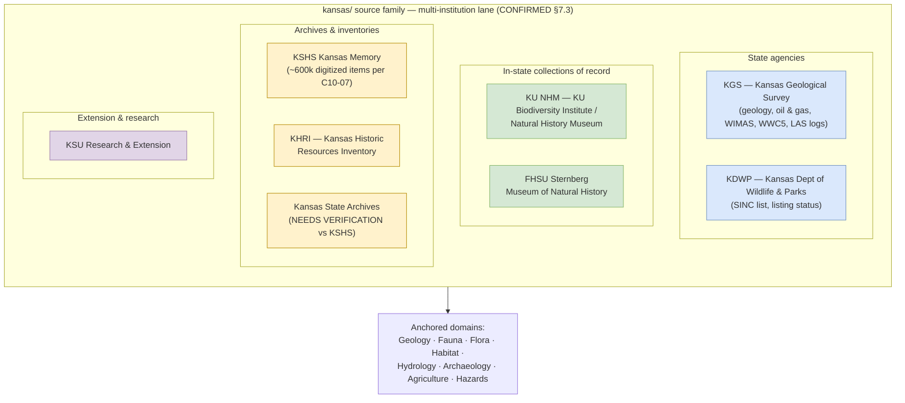

<!-- [KFM_META_BLOCK_V2]
doc_id: kfm://doc/docs-sources-catalog-kansas-readme
title: kansas source family
type: readme
version: v0.2
status: draft
owners: <PLACEHOLDER — Docs steward + Source steward for kansas>
created: 2026-05-20
updated: 2026-05-21
policy_label: public
related:
  - docs/sources/catalog/README.md
  - docs/sources/catalog/IDENTITY.md
  - docs/sources/catalog/PROFILES.md
  - docs/sources/catalog/RIGHTS-AND-SENSITIVITY-MAP.md
  - docs/sources/catalog/OPEN-QUESTIONS.md
  - docs/sources/catalog/_template/SOURCE_PRODUCT_TEMPLATE.md
  - docs/doctrine/directory-rules.md
  - docs/domains/geology/README.md
  - docs/domains/fauna/README.md
  - docs/domains/flora/README.md
  - docs/domains/archaeology/README.md
  - docs/standards/SENSITIVITY_RUBRIC.md
  - docs/registers/VERIFICATION_BACKLOG.md
  - schemas/contracts/v1/source/source_descriptor.schema.json
  - connectors/kansas/
  - data/registry/sources/
  - policy/sensitivity/
tags: [kfm, docs, sources, catalog, kansas, kansas-first, multi-institution]
notes:
  - >-
    `kansas/` is CONFIRMED (at commit `b6a27916bbb9e07cbf3752870c867476e1e094e7`)
    as one of the nine canonical connector families enumerated in
    `directory-rules.md` v1.2 §7.3. Family-level confirmation; per-institution
    descriptor and product-page presence remain NEEDS VERIFICATION.
  - >-
    Created as the `kansas` family overview during the flat-to-folder
    reorganization; sibling-link presence reported by the Claude Code session
    but NOT verified against a mounted repo. Atlas idea cards anchor the
    Kansas-first doctrine: `C7-10` Kansas-First Domain Authorities,
    `KFM-P2-IDEA-0024` (CONFIRMED Kansas agency list), `KFM-P19-IDEA-0005`
    (KDWP listing-status canonicity), `C10-06` (KU NHM, FHSU Sternberg in
    biodiversity stack), `C10-07` (KSHS Kansas Memory, KHRI in archives stack).
  - >-
    Original scaffold cites `ADR-0010` for deny-by-default sensitivity gating —
    preserved as referenced but NEEDS VERIFICATION; the corpus settles the
    deny-by-default posture via Pass-10 `C5-02` + KFM-P24-IDEA-0002 +
    KFM-P24-PROG-0013 rather than naming `ADR-0010` directly.
[/KFM_META_BLOCK_V2] -->

# `kansas` source family

> Source-oriented catalog documentation for the **Kansas state-scoped** source family — Kansas-first authorities (state agencies, universities, museums, archives) whose data KFM ingests in parallel with federal and international anchors.

<!-- Badge row — Shields.io placeholders; replace targets once owners/CI/policies land -->

| Status | Owners | Last reviewed |
|---|---|---|
| Draft — family lane CONFIRMED at §7.3; per-institution work PROPOSED | `<Docs steward + Source steward for kansas — TODO assign>` | 2026-05-21 |

> [!IMPORTANT]
> **Why this family matters** (CONFIRMED doctrine, Pass-10 `C7-10`). The Kansas-first dossiers must run against Kansas-specific authorities **even when federal authorities are present**, because the local authorities carry detail (cultural specificity, fine-grained habitat data, occurrence-level provenance) that federal authorities aggregate away. The KFM convention is to **store the Kansas-authority IRI in parallel with the federal or international anchor** — not to replace it.

---

## Quick jump

- [1. Overview](#1-overview)
- [2. Family identity & position](#2-family-identity--position)
- [3. Product pages](#3-product-pages)
- [4. Source authority](#4-source-authority)
- [5. Catalog profiles](#5-catalog-profiles)
- [6. Identity & namespaces](#6-identity--namespaces)
- [7. Rights & sensitivity](#7-rights--sensitivity)
- [8. Validation](#8-validation)
- [9. Related contracts & schemas](#9-related-contracts--schemas)
- [10. Related connectors & pipelines](#10-related-connectors--pipelines)
- [11. Open questions](#11-open-questions)
- [12. Verification backlog](#12-verification-backlog)
- [Appendix A — Atlas idea-card lineage](#appendix-a--atlas-idea-card-lineage)

---

## 1. Overview

The `kansas` family groups **Kansas state-scoped sources** — state agencies, the in-state biodiversity collections of record, historic-resources inventories, and archives whose data KFM ingests. Unlike single-product families, `kansas` aggregates **many distinct Kansas institutions**, each documented on its own product page.

> [!WARNING]
> **Non-API sources are common in this family** (CONFIRMED tension, Pass-10 `C7-10`). Several Kansas authorities lack stable HTTP APIs or persistent identifiers and rely on PDF or spreadsheet publication. The corpus warns that "the harvest layer must tolerate non-API sources for the foreseeable future." Treat per-product NEEDS VERIFICATION items about API surface, ETag/Last-Modified support, and bulk-download posture as the default expectation here, not an exception.

| KFM treats Kansas sources as | KFM does not treat Kansas sources as |
|---|---|
| The local-detail layer for Kansas-first dossiers | A substitute for federal or international anchors |
| The controlling authority for Kansas-specific regulatory state (e.g., KDWP listing status) | A replacement for USFWS / NatureServe federal listings |
| Drivers of C6 sensitivity policy (KDWP SINC at S1/S2 triggers redaction) | Sources of generic global truth |
| Multi-institution lane carrying state agencies, universities, museums, archives | A single homogeneous source |

[Back to top](#quick-jump)

---

## 2. Family identity & position

> [!NOTE]
> **Each Kansas authority has its own identifier scheme and access pattern.** Per `C7-10`, the KFM convention is to store the Kansas-authority IRI **in parallel with** the federal or international anchor (e.g., Kansas Memory record id + LCNAF/SNAC anchor; KU NHM specimen id + GBIF Backbone + ITIS TSN; KDWP SINC code + NatureServe S-rank).

[Back to top](#quick-jump)

---

## 3. Product pages

| Page | Source | Anchor domain(s) | Corpus citation |
|---|---|---|---|
| [`ksgs.md`](./ksgs.md) | Kansas Geological Survey (KGS) | Geology · Hydrology | `KFM-P2-IDEA-0024`, `KFM-P8-PROG-0024`, `KFM-P2-PROG-0017` (waterbody crosswalk), `KFM-P2-PROG-0009` (WIMAS/WWC5), Domains §geology source families |
| [`kdwp.md`](./kdwp.md) | Kansas Department of Wildlife and Parks | Fauna · Flora · Habitat | `KFM-P19-IDEA-0005` (KDWP listing-status canonicity), `C7-10` (KDWP SINC), `C6-01` (sensitivity rubric default profile `profile:sinc-obscure-10km`) |
| [`khri.md`](./khri.md) | Kansas Historic Resources Inventory | Archaeology · Settlements-Infrastructure | `C7-10`, `C10-07` (Kansas archives stack) |
| [`kansas-memory.md`](./kansas-memory.md) | Kansas Memory (KSHS) — ~600k digitized items | Archaeology · People-DNA-Land | `C10-07`, `KFM-P18-PROG-0033` (Kansas Memory source descriptor), `KFM-P17-PROG-0011` |
| [`kansas-state-archives.md`](./kansas-state-archives.md) | Kansas State Archives | Archaeology · People-DNA-Land | PROPOSED — relationship to KSHS Kansas Memory **NEEDS VERIFICATION** (may be the same institution or a distinct holdings stream) |
| [`ksu-research-extension.md`](./ksu-research-extension.md) | KSU Research and Extension | Agriculture · Soil · Flora | `C7-10`, Domains §agriculture and §soil source families |
| [`ku-nhm.md`](./ku-nhm.md) | KU Biodiversity Institute & Natural History Museum | Fauna · Flora · Habitat | `C10-06` (biodiversity stack), `C7-10`; corpus cites ~454k specimens |
| [`fhsu-sternberg.md`](./fhsu-sternberg.md) | FHSU Sternberg Museum of Natural History | Fauna · Flora · Geology | `C10-06` (biodiversity stack), `C7-10` |

> [!CAUTION]
> **Slug discrepancy flagged.** The corpus uses the abbreviation **`KGS`** for Kansas Geological Survey throughout. The product file slug is `ksgs.md` (note `S` between `K` and `G`). Either the slug is intentional and `kgs.md` is reserved, or this is a flat-to-folder migration typo. Preserved as-is pending OPEN-DSC-15 (new).

### Known Kansas sources without product pages yet

Surfaced for completeness from the Kansas authority lists in `KFM-P2-IDEA-0024`, `C7-10`, `C10-06`, `C10-07`, and the agriculture / soil / hydrology dossiers. None are in this README's product table; they are NEEDS VERIFICATION items that may warrant their own pages.

| Source | Why it's a candidate | Status |
|---|---|---|
| KDA — Kansas Department of Agriculture (incl. KDA-DWR for water rights) | CONFIRMED Kansas authority in `KFM-P2-IDEA-0024`; joint maintainer of WIMAS with KGS per `KFM-P2-PROG-0009` | OPEN |
| KDHE — Kansas Department of Health and Environment | CONFIRMED Kansas authority in `KFM-P2-IDEA-0024`; joint with KGS on WWC5 water-well program | OPEN |
| Kansas Mesonet (K-State) | CONFIRMED in `C10-01` soil stack and `C10-02` air-quality stack; in-state climate / soil-moisture sensors at 5/10/20/50 cm depths | OPEN |
| KSU Special Collections (~1M items per `C10-07`) | CONFIRMED in `C10-07` archives stack | OPEN |
| WSU Special Collections | CONFIRMED in `C10-07` archives stack | OPEN |
| KU Spencer Research Library | CONFIRMED in `C10-07` archives stack | OPEN |
| County historical societies | CONFIRMED in `C10-07` archives stack | OPEN |
| KBS NHI — Kansas Biological Survey / Natural Heritage Inventory | CONFIRMED in `C7-10` Kansas-First Domain Authorities | OPEN |

[Back to top](#quick-jump)

---

## 4. Source authority

Authoritative `SourceDescriptor`s live in [`data/registry/sources/`](../../../../data/registry/sources/) — **do not duplicate descriptor fields here.**

Per Atlas §24.1.3, each Kansas authority is admitted with its own descriptor and **its own `source_role`** drawn from the closed enum (`observed | regulatory | modeled | aggregate | administrative | candidate | synthetic`). For Kansas sources, common assignments are:

| Source | Likely `source_role` (PROPOSED) | Rationale |
|---|---|---|
| KDWP listing / SINC lists | `regulatory` | `KFM-P19-IDEA-0005` — controlling Kansas regulatory source family for listed-species status |
| KGS surficial geology, oil & gas, WIMAS, WWC5, LAS logs | `observed` / `aggregate` (per product) | Mix of survey observations and aggregations |
| KU NHM, Sternberg specimen records | `observed` | Specimen-backed observation |
| Kansas Memory items | `observed` (as digital-collection record) | Historical record evidence; per `KFM-P18-PROG-0033` |
| KHRI inventory entries | `administrative` (per Atlas administrative-compilation framing) | Inventory compilation, not field-event observation |
| KSU Research & Extension extension publications | `observed` / `administrative` (per product) | Mix |

> [!IMPORTANT]
> **Source-role anti-collapse** (CONFIRMED doctrine, Atlas §24.1.3). Role is set at admission and **never edited in place**. An AI summary that promotes KU NHM observation to "authoritative listing" or treats KGS observed data as "regulatory" is a governance violation. Corrections produce a new descriptor plus a `CorrectionNotice`.

[Back to top](#quick-jump)

---

## 5. Catalog profiles

Kansas sources span many domains and land across **STAC**, **DCAT**, **PROV-O**, and the domain projections in [`data/catalog/`](../../../../data/catalog/). See per-product pages and [`PROFILES.md`](../PROFILES.md).

| Profile | Typical Kansas usage (PROPOSED) | Citation |
|---|---|---|
| STAC × Darwin Core hybrid | KU NHM, Sternberg biodiversity occurrences | `C4-03` (CONFIRMED for biodiversity occurrences) |
| STAC raster + proj/raster extensions | KGS surficial geology / structure rasters where applicable | `C4-01`, `KFM-P27-PROG-0011` |
| DCAT | Dataset-level metadata for non-spatiotemporal extension publications | `C4-05` |
| PROV-O | Required to carry the provenance trail for Kansas Memory and KHRI records | `C8-03`, `C5-08` |
| Domain projections | Per anchor domain: `data/catalog/domain/{geology,fauna,flora,archaeology,settlements-infrastructure,agriculture,soil}/` | Directory Rules §6.1 |
| `kfm:care` extension | Apply when records overlap tribal or Indigenous-knowledge ties | `C15-02` |

[Back to top](#quick-jump)

---

## 6. Identity & namespaces

Collection-id and namespace conventions follow [`IDENTITY.md`](../IDENTITY.md).

- **Collection id pattern:** `kfm-<org>-<institution>-<product>` (e.g., `kfm-<org>-kdwp-listings`, `kfm-<org>-ku-nhm-specimens`) per `C4-02`. Renaming a Collection breaks links.
- **Namespace pin:** `kfm:` vs `ks-kfm:` is **unresolved** — see `OPEN-DSC-03` in [`OPEN-QUESTIONS.md`](../OPEN-QUESTIONS.md). Pass-10 `C4-01` explicitly lists this open question; the Kansas family is the most plausible argument **for** `ks-kfm:`, but the corpus does not settle it.
- **Per-authority IRI in parallel with federal/international anchor:** CONFIRMED convention per `C7-10`. Example: a KU NHM specimen carries the KU specimen id, the GBIF Backbone Taxonomy anchor (DOI `10.15468/39omei`), and the ITIS TSN anchor in parallel.

[Back to top](#quick-jump)

---

## 7. Rights & sensitivity

NEEDS VERIFICATION per source — see [`RIGHTS-AND-SENSITIVITY-MAP.md`](../RIGHTS-AND-SENSITIVITY-MAP.md) and [`policy/sensitivity/`](../../../../policy/sensitivity/). **Never restate policy here.**

> [!CAUTION]
> **Deny-by-default for sensitive Kansas natural-history and archaeological sources.** The original scaffold cites `ADR-0010` — preserved as referenced but **NEEDS VERIFICATION**. The corpus settles the deny-by-default posture via Pass-10 `C5-02` (default-deny promotion), `KFM-P24-IDEA-0002` (sensitive species deny-by-default), and `KFM-P24-PROG-0013` (sensitive taxa redaction policy). KDWP SINC is the **operational driver** of this posture (`C7-10`, `C6-01`, `KFM-P19-IDEA-0005`).

| Concern | Family-level posture | Citation |
|---|---|---|
| KDWP SINC / NatureServe S1–S2 species | **DENY public exact location**; route to restricted lane | `C10-06`, `C6-01` rank 3+ |
| Default redaction profile for rank-3 SINC | `profile:sinc-obscure-10km` (a.k.a. `point_10km_hex_seeded_v1`) | `C6-01`, `C6-02` |
| Archaeology — exact site location | **DENY** public exact location | Domains §archaeology |
| Living-person fields (genealogy / Kansas Memory ties) | Deny / k-anonymity (`C6-06`); LCNAF / SNAC anchor still preserved | `C6-06` |
| Sovereignty / CARE | Apply when records overlap tribal or Indigenous-knowledge ties (e.g., archaeology, ethnobotany); `kfm:care` extension required | `C15-01`, `C15-02`, `C15-03` |
| Rights variability per institution | High — each authority has its own terms, license, and access pattern | `C7-10` |

[Back to top](#quick-jump)

---

## 8. Validation

| Validator / gate | Purpose | Status |
|---|---|---|
| Markdown lint | Per-file Markdown conformance | NEEDS VERIFICATION — workflow not yet wired |
| Link integrity | Repo-relative targets resolve | NEEDS VERIFICATION |
| Per-product page conformance to [`_template/SOURCE_PRODUCT_TEMPLATE.md`](../_template/SOURCE_PRODUCT_TEMPLATE.md) | Structural consistency across product pages | PROPOSED |
| Source-descriptor completeness | Each Kansas authority MUST have its own descriptor with `source_role`, `rights`, `sensitivity`, `cadence` | CONFIRMED doctrine; implementation NEEDS VERIFICATION |
| Non-API source handling | Cadence + retrieval-method (PDF / CSV / spreadsheet harvest) recorded honestly in descriptor | CONFIRMED tension from `C7-10`; implementation PROPOSED |
| KDWP SINC sensitivity gate | Records of S1/S2 taxa fail closed on public exact location | CONFIRMED doctrine (`C5-02`, `KFM-P24-IDEA-0002`, `KFM-P24-PROG-0013`); implementation PROPOSED |
| Parallel-anchor rule | Kansas-authority IRI stored alongside federal/international anchor | CONFIRMED convention per `C7-10` |

[Back to top](#quick-jump)

---

## 9. Related contracts & schemas

- [`schemas/contracts/v1/source/`](../../../../schemas/contracts/v1/source/) — `SourceDescriptor` machine shape (per ADR-0001).
- [`contracts/`](../../../../contracts/) — object families. Kansas sources contribute evidence into object families across Geology (`Geologic Unit`, `SurficialUnit`, `BoreholeReference`, `Well LogReference`, `Mineral Occurrence`, `ResourceEstimate`, `Extraction Site`), Fauna / Flora (`OccurrenceEvidence`, `OccurrencePublic`, `OccurrenceRestricted`, `ConservationStatus`, `RangePolygon`, `SensitiveSite`), Archaeology, Settlements-Infrastructure, Agriculture, and People-DNA-Land.

[Back to top](#quick-jump)

---

## 10. Related connectors & pipelines

- [`connectors/kansas/`](../../../../connectors/kansas/) — connector implementation. **CONFIRMED (at commit `b6a27916bbb9e07cbf3752870c867476e1e094e7`)** as one of the nine canonical §7.3 connector families per Directory Rules v1.2. Per-institution adapter content NEEDS VERIFICATION.
- Pipelines: [`pipelines/ingest/`](../../../../pipelines/ingest/), [`pipelines/normalize/`](../../../../pipelines/normalize/), [`pipelines/validate/`](../../../../pipelines/validate/), [`pipelines/catalog/`](../../../../pipelines/catalog/).
- Pipeline specs (per anchor domain): [`pipeline_specs/geology/`](../../../../pipeline_specs/geology/), [`pipeline_specs/fauna/`](../../../../pipeline_specs/fauna/), [`pipeline_specs/flora/`](../../../../pipeline_specs/flora/), [`pipeline_specs/archaeology/`](../../../../pipeline_specs/archaeology/), [`pipeline_specs/agriculture/`](../../../../pipeline_specs/agriculture/), etc. (PROPOSED — confirm each per product).

> [!IMPORTANT]
> **Connector-as-non-publisher** rule (CONFIRMED, Directory Rules §7.3). Per-institution adapters under `connectors/kansas/<institution>/` write only to `data/raw/<domain>/<source_id>/<run_id>/` or `data/quarantine/<domain>/<reason>/<run_id>/`. They MUST NOT write to `data/processed/`, `data/catalog/`, or `data/published/`.

[Back to top](#quick-jump)

---

## 11. Open questions

- **OPEN-DSC-15** (new) — Resolve the `ksgs.md` vs `kgs.md` slug discrepancy (corpus uses `KGS`).
- **OPEN-DSC-03** — Settle `kfm:` vs `ks-kfm:` namespace (`C4-01`). The Kansas family is the most-cited argument for `ks-kfm:`.
- OPEN — confirm which Kansas institutions warrant their own STAC Collections vs. shared collections.
- OPEN — confirm rights / sensitivity tier per source.
- OPEN — relationship between **Kansas State Archives** and **KSHS Kansas Memory** (one institution or two distinct holdings streams).
- OPEN — pages for KDA, KDHE, Kansas Mesonet, KSU SC, WSU SC, KU Spencer, county historical societies, KBS NHI.
- OPEN — confirm whether `ADR-0010` (cited in original scaffold) exists and governs deny-by-default; otherwise rely on `C5-02` + `KFM-P24-IDEA-0002` + `KFM-P24-PROG-0013`.
- OPEN — Kansas-Authority Compatibility Report scoring each authority on API stability, identifier persistence, and harvest cadence (per `C7-10` future-work item).
- See [`OPEN-QUESTIONS.md`](../OPEN-QUESTIONS.md) for lane-wide `OPEN-DSC-*` items.

[Back to top](#quick-jump)

---

## 12. Verification backlog

| Item | Evidence that would settle it | Status |
|---|---|---|
| `connectors/kansas/<institution>/` adapter content per product page | Mounted-repo connector tree | NEEDS VERIFICATION (family lane CONFIRMED at commit) |
| `data/registry/sources/` descriptor instances for each Kansas institution | Mounted registry + descriptor files | NEEDS VERIFICATION |
| `ksgs.md` vs `kgs.md` slug (OPEN-DSC-15) | Convention decision + per-product page rename if needed | NEEDS VERIFICATION |
| Kansas State Archives ↔ KSHS relationship | Source steward + KSHS contact | OPEN |
| `ADR-0010` existence and content | Mounted-repo `docs/adr/` listing | NEEDS VERIFICATION |
| KU NHM specimen count (~454k cited; denominator ambiguous per `C7-10` evidence-needed list) | Source steward + KU NHM | NEEDS VERIFICATION |
| KSHS Kansas Memory count (~600k cited; denominator ambiguous per `C7-10`) | Source steward + KSHS | NEEDS VERIFICATION |
| KDWP SINC list cadence and current endpoint | Source steward + KDWP contact | NEEDS VERIFICATION |
| WIMAS / WWC5 access posture (KGS + KDA-DWR jointly maintained) | Source steward + KGS + KDA-DWR contacts | NEEDS VERIFICATION |
| Non-API source posture per institution (PDF / CSV / spreadsheet vs API) | Per-product source-steward review | OPEN per `C7-10` |
| Sibling family-level files present (`PROFILES.md`, `IDENTITY.md`, `RIGHTS-AND-SENSITIVITY-MAP.md`, `OPEN-QUESTIONS.md`, `_template/SOURCE_PRODUCT_TEMPLATE.md`) | Mounted-repo `docs/sources/catalog/` tree | NEEDS VERIFICATION |
| Kansas-Authority Compatibility Report | Author + steward review | OPEN per `C7-10` |
| Parallel-anchor convention adoption (Kansas IRI + federal/international IRI in catalog rows) | STAC profile + sample Items | NEEDS VERIFICATION |

[Back to top](#quick-jump)

---

## Appendix A — Atlas idea-card lineage

For traceability into the KFM Idea Index spine, the `kansas` family draws on the following atlas cards.

Click to expand — idea-card lineage

| Stable ID | Title | Status (atlas) | Relevance to this family |
|---|---|---|---|
| `C7-10` | Kansas-First Domain Authorities | CONFIRMED (Pass-10) | Foundational doctrine: KSHS, KHRI, KU NHM, KBS NHI, KDWP SINC — store Kansas-authority IRI in parallel with federal/international anchor |
| `KFM-P2-IDEA-0024` | USDA NASS, KGS, KDA, KDHE, KDWP as Kansas-specific agricultural and environmental authorities | CONFIRMED, Pass 32 | Confirms the Kansas agency list (KGS, KDA, KDHE, KDWP) and the per-agency watcher / license / cadence rule |
| `KFM-P19-IDEA-0005` | KDWP listing status is canonical regulatory context | active, Pass 32 | KDWP endangered, threatened, and SINC lists treated as the controlling Kansas regulatory source family |
| `C10-06` | Biodiversity Stack | CONFIRMED (Pass-10) | KU NHM and FHSU Sternberg as in-state collections of record; KDWP SINC S1/S2 triggers C6 redaction |
| `C10-07` | Archives Stack | CONFIRMED (Pass-10) | KSHS Kansas Memory (~600k items), KHRI, KU Spencer, KSU SC (~1M items), WSU SC, county historical societies |
| `C6-01` | Sensitivity Rubric 0–5 | CONFIRMED (Pass-10) | KDWP SINC rank-3 default profile is `profile:sinc-obscure-10km` (a.k.a. `point_10km_hex_seeded_v1`) |
| `KFM-P18-PROG-0033` | Kansas Memory source descriptor | active, Pass 32 | Kansas Memory described as a historical digital-collections source family with record identifiers, rights notes, media type, provenance role |
| `KFM-P17-PROG-0011` | Kansas historical provenance source object | active, Pass 32 | Historical claim evidence objects preserve source type, collection or program, source_ref, scan IDs, rights_spdx, page-level references |
| `KFM-P8-PROG-0024` | KGS surficial geology → minimal unit model | active, Pass 32 | KGS surficial geology ingested into a minimal unit model — flat schema of map units with stratigraphic attributes |
| `KFM-P2-PROG-0009` | Kansas-specific water systems (WIMAS and WWC5) ingest | active, Pass 32 | WIMAS + WWC5 jointly maintained by KGS and KDA-DWR; redact sensitive owner info and precise coordinates by default |
| `KFM-P2-PROG-0017` | Waterbody crosswalks: NHDPlus, NWIS site, KGS, and Kansas Mesonet | active, Pass 32 | KGS groundwater participates in the canonical waterbody crosswalk |
| `KFM-P24-IDEA-0002` | Sensitive species deny-by-default posture | active, Pass 32 | Fauna occurrence records for sensitive taxa default to DENY or ABSTAIN |
| `KFM-P24-PROG-0013` | Sensitive taxa redaction policy | active, Pass 32 | OPA policy returns ABSTAIN or DENY for sensitive fauna unless generalization / aggregation / access gating satisfied |

[Back to top](#quick-jump)

---

### Footer

> **Related:** [`../README.md`](../README.md) (catalog index) · [`../IDENTITY.md`](../IDENTITY.md) · [`../PROFILES.md`](../PROFILES.md) · [`../RIGHTS-AND-SENSITIVITY-MAP.md`](../RIGHTS-AND-SENSITIVITY-MAP.md) · [`../OPEN-QUESTIONS.md`](../OPEN-QUESTIONS.md) · [Directory Rules](../../../doctrine/directory-rules.md) · [Geology dossier](../../../domains/geology/README.md) · [Fauna dossier](../../../domains/fauna/README.md) · [Flora dossier](../../../domains/flora/README.md) · [Archaeology dossier](../../../domains/archaeology/README.md)
> **Last updated:** 2026-05-21 *(Claude Code revision — family overview enriched with Kansas-first authority doctrine from C7-10, KDWP SINC sensitivity hooks, and per-institution citation lineage)* · **Status:** draft · **Authority of this doc:** explanatory family README; does **not** decide admission, activation, or release. Family lane is CONFIRMED §7.3; per-institution work remains PROPOSED.
> [⬆ Back to top](#kansas-source-family)
