<!-- [KFM_META_BLOCK_V2]
doc_id: kfm://doc/docs-sources-catalog-kansas-ksgs
title: Kansas Geological Survey (KGS) — Source Catalog Entry
type: standard
subtype: source-catalog-entry
version: v0.2
status: draft
owners: <docs steward + Geology subsystem owner — PLACEHOLDER, NEEDS VERIFICATION>
created: 2026-05-13
updated: 2026-05-21
policy_label: public
related:
  - docs/sources/catalog/kansas/README.md
  - docs/sources/catalog/kansas/kcc-oil-gas-reg.md
  - docs/sources/catalog/kansas/kdwp.md
  - docs/sources/catalog/kansas/kdhe.md
  - docs/sources/catalog/kansas/kda.md
  - docs/sources/catalog/kansas/kansas-mesonet.md
  - docs/sources/catalog/kansas/kansas-state-archives.md
  - docs/sources/catalog/kansas/kansas-memory.md
  - docs/sources/catalog/kansas/khri.md
  - docs/sources/catalog/kansas/kbs.md
  - docs/sources/catalog/kansas/ku-nhm.md
  - docs/sources/catalog/kansas/fhsu-sternberg.md
  - docs/sources/catalog/README.md
  - docs/sources/catalog/IDENTITY.md
  - docs/sources/catalog/PROFILES.md
  - docs/sources/catalog/RIGHTS-AND-SENSITIVITY-MAP.md
  - docs/sources/catalog/OPEN-QUESTIONS.md
  - docs/sources/catalog/_template/SOURCE_PRODUCT_TEMPLATE.md
  - docs/sources/SOURCE_DESCRIPTOR_STANDARD.md
  - docs/doctrine/directory-rules.md
  - docs/doctrine/lifecycle-law.md
  - docs/doctrine/truth-posture.md
  - docs/domains/geology/README.md
  - docs/domains/hydrology/README.md
  - docs/domains/environment/README.md
  - docs/standards/SENSITIVITY_RUBRIC.md
  - docs/registers/AUTHORITY_LADDER.md
  - docs/registers/DRIFT_REGISTER.md
  - docs/registers/VERIFICATION_BACKLOG.md
  - docs/adr/ADR-0001-schema-home.md
  - control_plane/source_authority_register.yaml
  - schemas/contracts/v1/source/source_descriptor.schema.json
  - connectors/kansas/kgs/
  - data/registry/sources/
  - policy/sensitivity/
  - policy/rights/
tags: [kfm, sources, catalog, kansas, kansas-first, kgs, ksgs, geology, hydrology, oil-and-gas, wwc5, las, geoportal, c7-10, c10-03, dom-geol]
notes:
  - >-
    v0.2 path migration: this doc was at `docs/sources/catalog/ksgs.md` (flat)
    in v1 and has moved to `docs/sources/catalog/kansas/ksgs.md` (nested under
    the `kansas/` family folder per v0.2 catalog convention). The kansas
    family README v0.2 lists this brief explicitly.
  - >-
    Slug retention: v1 used `ksgs.md` rather than `kgs.md`. v0.2 PRESERVES the
    `ksgs` slug at the user's discretion (the original v1 NOTE callout flagged
    this as PROPOSED). Surfaced as OPEN-KSGS-13 in §13 — the slug-vs-corpus-
    abbreviation choice should be ratified by ADR or repo convention. This
    matches the long-standing OPEN-DSC-15 (Kansas family README v0.2 lane-wide
    item) which Andy flagged in the earlier kansas/README.md revision.
  - >-
    Connector path was ALREADY correct in v1: `connectors/kansas/kgs/` sits
    under the canonical `connectors/kansas/` §7.3 family. Note slug
    discrepancy — file uses `ksgs.md` while connector path uses `kgs/`. v0.2
    preserves both verbatim; see OPEN-KSGS-13 for ratification.
  - >-
    Atlas card lineage CONFIRMED: `DOM-GEOL` Domains Atlas §D Geology — FIVE
    KGS-related source-family rows ("Kansas Geological Survey data and maps";
    "KGS surficial geology and geologic maps"; "KGS oil and gas wells and
    production"; "KGS/KDHE WWC5 and water-well program"; "KGS LAS digital well
    logs and well tops"); `C10-03` Water Stack (WWC5 + KGS Geoportal);
    `C10-07`-adjacent geology stack; `KFM-P2-IDEA-0024` (KGS named as
    Kansas-specific authority); `KFM-P25-IDEA-0001` (KGS oil-and-gas refresh
    as analytic baseline change); `KFM-P25-PROG-0001` (KGS oil-and-gas source
    descriptor shape); `KFM-P2-PROG-0009` (WIMAS/WWC5 joint KGS+KDA-DWR);
    `KFM-P8-PROG-0024` (KGS surficial geology minimal unit model);
    `KFM-P2-PROG-0017` (waterbody crosswalks include KGS); `C7-10`
    parallel-anchor rule; `C7-09` GNIS federal place anchor.
  - >-
    `connectors/kansas/` lane is CONFIRMED (at commit
    `b6a27916bbb9e07cbf3752870c867476e1e094e7`) per Directory Rules v1.2 §7.3.
[/KFM_META_BLOCK_V2] -->

# Kansas Geological Survey (KGS) — Source Catalog Entry

> Per-publisher catalog entry for the **Kansas Geological Survey (KGS)** — publisher of Kansas bedrock and surficial geology, oil-and-gas wells and production, the WWC5 water-well program (jointly with KDHE per CONFIRMED `KFM-P2-PROG-0009` joint program), LAS digital well logs and well tops, and the KGS Geoportal. KGS is one of five Kansas-specific authorities named in CONFIRMED `KFM-P2-IDEA-0024`. Used across the Geology / Natural Resources and Hydrology lanes per CONFIRMED `DOM-GEOL` (five source-family rows) and `C10-03` Water Stack.

<!-- BADGES — Shields.io endpoints are PLACEHOLDERS; replace once review state is established. -->


-blue)


**Status:** `draft` (v0.2) &middot; **Owners:** `<docs steward + Geology subsystem owner>` *(placeholder, NEEDS VERIFICATION)* &middot; **Updated:** `2026-05-21`

---

> [!NOTE]
> **Path migration (v1 → v0.2).** This page was authored as `docs/sources/catalog/ksgs.md` in v1 (flat) and **moved to `docs/sources/catalog/kansas/ksgs.md`** in v0.2 (nested under the `kansas/` family folder per v0.2 catalog convention; v1 slug `ksgs` preserved — see OPEN-KSGS-13). The kansas family README v0.2 lists this brief explicitly.

> [!IMPORTANT]
> **Slug-vs-corpus-abbreviation discrepancy preserved (v1 NOTE → v0.2 OPEN-KSGS-13).** Across the KFM corpus the canonical short name for this publisher is **KGS** (Kansas Geological Survey). This file is preserved at the v1-supplied slug `ksgs` per Andy's discretion — possibly to disambiguate against another `kgs` collision (Kansas Genealogical Society, Kansas Gas Service, etc.). The connector path uses `connectors/kansas/kgs/` (per v1). v0.2 preserves both verbatim; reconciliation deferred to OPEN-KSGS-13 (this is the same pattern as the lane-wide OPEN-DSC-15 surfaced in the kansas family README v0.2).

> [!IMPORTANT]
> **Connector path was ALREADY correct in v1.** Like sibling KDWP v0.2 and KHRI v0.2 — and unlike sibling Kansas Mesonet (OPEN-MESO-01), KBS (OPEN-KBS-01), KCC oil-and-gas (OPEN-KCC-01), and KDOT (OPEN-KDOT-01) revisions — **KGS's v1 already used `connectors/kansas/kgs/`** correctly under the canonical `connectors/kansas/` §7.3 family lane. No path-correction OPEN item is needed for the connector lane (slug discrepancy is a separate item per OPEN-KSGS-13).

> [!IMPORTANT]
> **This document is a human-readable catalog entry, not the canonical source register.** The machine-readable authority surface lives in `control_plane/source_authority_register.yaml` (CONFIRMED doctrine, PROPOSED file path). This file *describes* a publisher and its sub-products; it does **not** decide admission, role, rights, sensitivity, or release class. Those decisions live in `SourceDescriptor` records and the activation flow per `C5-02` default-deny promotion.

---

## Quick links

- [1. Scope](#1-scope)
- [2. Publisher and authority](#2-publisher-and-authority)
- [3. Sub-products in scope](#3-sub-products-in-scope)
- [4. Source-role posture](#4-source-role-posture)
- [5. Rights, terms, and attribution](#5-rights-terms-and-attribution)
- [6. Sensitivity and publication posture](#6-sensitivity-and-publication-posture)
- [7. Cadence and freshness](#7-cadence-and-freshness)
- [8. Identifiers and crosswalks](#8-identifiers-and-crosswalks)
- [9. Lifecycle placement and dataflow](#9-lifecycle-placement-and-dataflow)
- [10. Schema, contract, and connector surface](#10-schema-contract-and-connector-surface)
- [11. Domain consumers](#11-domain-consumers)
- [12. Validators, gates, and tests](#12-validators-gates-and-tests)
- [13. Open questions and verification backlog](#13-open-questions-and-verification-backlog)
- [14. Related docs](#14-related-docs)
- [Appendix A — KGS at a glance](#appendix-a--kgs-at-a-glance)
- [Appendix B — Atlas idea-card lineage](#appendix-b--atlas-idea-card-lineage)
- [Appendix C — Change log](#appendix-c--change-log)

---

## 1. Scope

**This catalog entry covers** KGS-published datasets that feed KFM's Geology / Natural Resources lane and (via WWC5 and the KGS Geoportal) the Hydrology lane. It records what the publisher offers, how KFM treats it at admission, what rights and sensitivity defaults apply, and where the corresponding `SourceDescriptor`, connector, and lifecycle outputs are expected to live.

**This entry does not:**

- Set source role for any specific sub-product (that is per-`SourceDescriptor`, set at admission per Atlas §24.1.3).
- Approve or deny ingestion (that is a `SourceActivationDecision`).
- Replace the machine-readable register at `control_plane/source_authority_register.yaml`.
- Claim that any of the paths below exist in the current repository.

> [!TIP]
> Use this entry as the **human-facing orientation** for a reviewer asked to admit, refresh, restrict, or retire a KGS-derived source. Pair it with the `SOURCE_DESCRIPTOR_STANDARD.md` and the relevant domain README ([`../../../domains/geology/README.md`](../../../domains/geology/README.md) or [`../../../domains/hydrology/README.md`](../../../domains/hydrology/README.md)).

[⬆ Back to top](#kansas-geological-survey-kgs--source-catalog-entry)

---

## 2. Publisher and authority

| Field | Value |
|---|---|
| **Publisher (full)** | Kansas Geological Survey *(CONFIRMED — corpus consistent across DOM-GEOL, `KFM-P2-IDEA-0024`, `KFM-P25-IDEA-0001`, `KFM-P25-PROG-0001`)* |
| **Publisher (short)** | KGS *(CONFIRMED — corpus canonical)* |
| **Affiliation** | University of Kansas *(NEEDS VERIFICATION — not asserted in corpus extracts; standard public knowledge but not pinned by corpus)* |
| **Primary KFM domain** | Geology and Natural Resources |
| **Secondary KFM domain(s)** | Hydrology *(via WWC5 well-completion records and KGS Geoportal groundwater products per `C10-03`)* |
| **Corpus source-family entries (DOM-GEOL §D, CONFIRMED — FIVE rows)** | (1) "Kansas Geological Survey data and maps"; (2) "KGS surficial geology and geologic maps"; (3) "KGS oil and gas wells and production"; (4) "KGS/KDHE WWC5 and water-well program"; (5) "KGS LAS digital well logs and well tops" |
| **Authority class** | Kansas-first domain authority *(CONFIRMED — `KFM-P2-IDEA-0024` names KGS in the five Kansas-specific authorities; `C7-10` parallel-anchor rule applies)*; pairs with USGS and federal anchors via documented crosswalk |
| **Joint-program partnerships** | **WWC5 jointly with KDHE** *(CONFIRMED — DOM-GEOL "KGS/KDHE WWC5"; `KFM-P2-PROG-0009` WIMAS/WWC5 KGS+KDA-DWR joint program — note WWC5 is KGS+KDHE per DOM-GEOL while WIMAS is KGS+KDA-DWR per `KFM-P2-PROG-0009`)*; **waterbody crosswalks with NHDPlus, NWIS, Kansas Mesonet** *(CONFIRMED — `KFM-P2-PROG-0017`)* |
| **Role at admission** | **Per `SourceDescriptor`** — see §4. The corpus lists KGS as serving "authority / observation / context / model **as source role requires**" per DOM-GEOL. A publisher cannot be assigned a single role at the publisher level. |
| **Rights / current terms** | **NEEDS VERIFICATION** per DOM-GEOL "rights and current terms NEEDS VERIFICATION; sensitive joins fail closed." Default posture is deny-public-release until terms are resolved per `C5-02`. |
| **Activation status** | **PROPOSED** — no `SourceActivationDecision` is asserted to exist in this session. |

[⬆ Back to top](#kansas-geological-survey-kgs--source-catalog-entry)

---

## 3. Sub-products in scope

The following KGS sub-products are referenced in the KFM corpus and are expected to drive separate `SourceDescriptor` records. Each sub-product is admitted, role-tagged, and rights-reviewed **independently** per Atlas §24.1.3.

| Sub-product | Primary domain | Typical role candidate | Notes / corpus reference |
|---|---|---|---|
| **Surficial geology & geologic maps** | Geology | observed *(map compilation)* / context | "KGS surficial geology and geologic maps" — DOM-GEOL §D, row 2. Vintage-specific; pair with USGS NGMDB / GeMS where available. Cf. `KFM-P8-PROG-0024` KGS surficial geology minimal unit model. |
| **Bedrock geology** | Geology | observed *(map compilation)* / context | Part of "Kansas Geological Survey data and maps" — DOM-GEOL §D, row 1; vintage-specific. |
| **Oil & gas wells and production** | Geology *(extraction / resource context)* | observed *(well records)* and/or aggregate *(production totals)* | "KGS oil and gas wells and production" — DOM-GEOL §D, row 4. **Cf. `KFM-P25-PROG-0001`** — "KGS oil and gas source descriptor should record production table scope, update date, county/field/lease/well-header layers, source URI, cadence, rights, and source role." **Cf. `KFM-P25-IDEA-0001`** — refreshes trigger incremental ingest + manifest/spec_hash comparison. Distinguish well-record observation from production aggregate; never collapse roles. |
| **WWC5 water-well program (joint with KDHE)** | Hydrology / Geology | observed *(per-well completion)* | "KGS/KDHE WWC5 and water-well program" — DOM-GEOL §D, row 6. Also referenced under `C10-03` *Water Stack*. **Cf. `KFM-P2-PROG-0009`** — "Public records with disclaimers and use constraints that map awkwardly onto open-data assumptions"; "Latitude/longitude is sometimes inferred from legal survey description (T/R/S), so positional accuracy varies." |
| **LAS digital well logs & well tops** | Geology *(subsurface)* | observed *(log curves)* / context *(picked tops)* | "KGS LAS digital well logs and well tops" — DOM-GEOL §D, row 7. Tops are interpretations; preserve interpretation lineage. **Modeled-derived structural maps** picked from tops carry `source_role: modeled` per Atlas §24.1.3, with `role_model_run_ref` to a `ModelRunReceipt`. |
| **KGS Geoportal — groundwater & geological products** | Hydrology / Geology | mixed *(per resource)* | Cited in `C10-03` *Water Stack* as the source of additional state-level products. Treat each Geoportal resource as a separate descriptor. |

> [!CAUTION]
> **Anti-collapse rule (CONFIRMED, Atlas §24.1.3).** An *observed* well-completion record is not interchangeable with an *aggregate* production total; a *regulatory* determination by KCC (see [`./kcc-oil-gas-reg.md`](./kcc-oil-gas-reg.md)) is not the same as a KGS *observation*; an *interpretation* (well top) is not the same as the underlying log curve. Each must carry its own role and citation per the Source-Role Anti-Collapse Register.

> [!TIP]
> **PLSS-derived coordinates carry uncertainty** (CONFIRMED, `KFM-P2-PROG-0009`). WWC5 lat/lon is "sometimes inferred from legal survey description (T/R/S), so positional accuracy varies." KFM derivatives of WWC5 records MUST stamp `geometry_source: plss_derived` and the PLSS resolution level. This is the same operational discipline applied to KCC oil-and-gas regulatory records (see [`./kcc-oil-gas-reg.md`](./kcc-oil-gas-reg.md) §9).

[⬆ Back to top](#kansas-geological-survey-kgs--source-catalog-entry)

---

## 4. Source-role posture

Source role is a **first-class identity attribute set at admission** per Atlas §24.1.3 and preserved through every promotion. It is recorded on the `SourceDescriptor` and never edited in place; corrections must produce a new descriptor plus a `CorrectionNotice`.

The corpus assigns KGS source families the role label **"authority / observation / context / model — as source role requires"** per DOM-GEOL, which is doctrinal shorthand for *the role is sub-product-specific*. Below is a **PROPOSED** mapping; treat as guidance, not authority.

| Role *(CONFIRMED enum per Atlas §24.1.3)* | KGS example | Citation rule |
|---|---|---|
| `observed` | Per-well WWC5 completion record; raw LAS log curve; field observation point | Cite as observation with vintage; never relabel as regulatory or aggregate. |
| `aggregate` | County or field-level oil/gas production totals; resource estimate summaries | Pin geometry scope via `role_aggregation_unit`; never cite at sub-unit precision. `AggregationReceipt` per Atlas §24.2.1. |
| `administrative` | Tract/permit roster compilations not produced as observations | Cite as administrative context; never as observed event timeline. |
| `modeled` | Geoportal-published interpreted surfaces; derived structural maps; picked well tops as interpretation; surficial-geology minimal-unit model per `KFM-P8-PROG-0024` | Pin `role_model_run_ref` to a `ModelRunReceipt` per Atlas §24.2.1. |
| `context` | Generalized bedrock or surficial map at small scale | Cite as context layer; never as per-place observation. |
| `candidate` | Pre-review WWC5 batch or LAS upload pending validation | May appear in WORK / QUARANTINE only; never PUBLISHED per `C5-02`. |
| `synthetic` | *(Not expected from KGS as primary publisher.)* | If a derivative is synthesized inside KFM from KGS inputs, it carries `synthetic` and a Reality Boundary Note. |

> [!NOTE]
> **`regulatory` is explicitly NOT a KGS role.** Oil and gas regulatory determinations are published by the **Kansas Corporation Commission (KCC)**, tracked as a separate publisher per DOM-GEOL §D row 5 ("KCC oil and gas regulatory data"). See sibling product page [`./kcc-oil-gas-reg.md`](./kcc-oil-gas-reg.md) v0.2 for the regulatory complement. **An AI summary that treats a KGS well-observation as a KCC regulatory authorization, or vice versa, is a source-role anti-collapse violation.**

[⬆ Back to top](#kansas-geological-survey-kgs--source-catalog-entry)

---

## 5. Rights, terms, and attribution

| Field | Value |
|---|---|
| **License / terms** | **NEEDS VERIFICATION** per sub-product. Corpus posture (DOM-GEOL): "current terms NEEDS VERIFICATION; sensitive joins fail closed." |
| **Default outcome if rights unknown** | **DENY public release** per `C5-02` default-deny promotion. Doctrine: "Unknown rights fail closed." |
| **Attribution requirement** | **NEEDS VERIFICATION.** Must be captured in each `SourceDescriptor` at admission so downstream citation can render correctly. |
| **Redistribution** | **NEEDS VERIFICATION.** No public derivative may be released if redistribution is barred. |
| **Per-sub-product variance expected** | Yes. WWC5 (jointly with KDHE per DOM-GEOL) may carry different terms than LAS logs or Geoportal map services. Each descriptor is reviewed independently. |
| **"Public-but-not-unrestricted" doctrine** | CONFIRMED per `KFM-P2-PROG-0009` — WWC5 / WIMAS-style data are "public records with disclaimers and use constraints that map awkwardly onto open-data assumptions." Disclaimers MUST be preserved in released assets. |

> [!WARNING]
> **Disclaimer-preservation rule** (CONFIRMED parallel doctrine, `KFM-P2-PROG-0009`). WWC5 and KGS-published records carry use-constraint disclaimers that are NOT decoration — they are governance statements. Every KGS-derived public-safe artifact MUST carry the upstream disclaimer text in its `disclaimer` asset metadata. This mirrors the discipline applied to sibling KCC oil-and-gas regulatory records ([`./kcc-oil-gas-reg.md`](./kcc-oil-gas-reg.md) v0.2 §10).

[⬆ Back to top](#kansas-geological-survey-kgs--source-catalog-entry)

---

## 6. Sensitivity and publication posture

> [!WARNING]
> **Exact borehole, sample, sensitive resource, well-log, and private well locations default to RESTRICTED or GENERALIZED public geometry** *(CONFIRMED — DOM-GEOL §I "Sensitivity, rights, and publication posture")*. Public release of exact point coordinates for these classes requires steward review, a `RedactionReceipt` per Atlas §24.2.1 or equivalent geometry transform per `KFM-P13-PROG-0018`, and an approved release class.

| Sensitivity class *(corpus)* | Applies to KGS via | Default outcome | `C6-01` rank guideline | Required controls |
|---|---|---|---|---|
| **Private landowner-sensitive data** | Private water wells in WWC5; landowner-attached attributes on oil/gas wells | DENY exact / public if private or rights unclear | rank 3+ | aggregation; permissions; policy review *(SRC-AG, SRC-PEOPLE basis)* |
| **Critical infrastructure** *(applicable subset)* | Active production / pipeline-adjacent records, where applicable | RESTRICT / DENY public precision | rank 3+ | public-safe aggregation; role-based access |
| **Exact sensitive locations** | Any exact point that increases harm risk | DENY by default | rank 3–4; profile `point_10km_hex_seeded_v1` (`C6-02`) for rank 3 default | redaction / generalization per `KFM-P13-PROG-0018`; audit |
| **Source-rights-limited records** | Any KGS sub-product with unresolved terms | DENY public release until terms resolved | rights gate (not rank) | rights register; attribution; no public derivative if barred per `C5-02` |
| **PLSS-derived coordinate uncertainty** | WWC5 wells with lat/lon inferred from T/R/S | Stamp uncertainty; do NOT treat as surveyed precision | n/a (uncertainty marker, not rank) | `geometry_source: plss_derived`; uncertainty in meters; PLSS resolution level (Section ≈ ±800 m; Quarter-Quarter ≈ ±200 m) per `KFM-P2-PROG-0009` parallel |

**Anti-collapse rules that affect KGS publication:**

- *Occurrence, deposit, estimate, permit, production, and reserve claims must remain distinct* (DOM-GEOL §I, CONFIRMED doctrine).
- *Aggregate cited as a per-place truth* → DENY join from aggregate cell to single record per Atlas §24.1.2.
- *Modeled product labeled or queried as observed* → DENY at publication, ABSTAIN at AI per Atlas §24.1.2.
- *KGS observation cited as KCC regulatory determination* → DENY at publication per §4 NOTE.

> [!IMPORTANT]
> **Geometry-generalization rule applied by parallel** (CONFIRMED, `KFM-P13-PROG-0018`). The deterministic-grid-generalization doctrine — "deterministic grid snapping, representative point plus uncertainty, or withholding tiers while preserving precise private coordinates and rule-version provenance" — applies to KGS sensitive well-location geometry the same way it applies to sensitive species locations. Every redaction emits a `RedactionReceipt`; rule-version provenance is mandatory.

[⬆ Back to top](#kansas-geological-survey-kgs--source-catalog-entry)

---

## 7. Cadence and freshness

| Sub-product | Cadence | Freshness expectation | Status |
|---|---|---|---|
| Surficial / bedrock geology & maps | Source-vintage specific *(map sheets update on irregular schedules)* | Track vintage in `SourceDescriptor`; do not assume currency | NEEDS VERIFICATION per publication |
| Oil & gas wells & production | Periodic *(reporting cadence varies; well-add vs production roll-ups differ)* | **Refresh triggers incremental ingest + manifest/spec_hash comparison** per `KFM-P25-IDEA-0001`. Separate cadence per role *(observed well-add vs aggregate production)*. | NEEDS VERIFICATION |
| WWC5 water-well program | Continuous-add (per-well submission) | Per-well completion timestamps preserved | NEEDS VERIFICATION; expected weekly or finer in operational pipelines per `C10-03` |
| LAS digital well logs & well tops | Continuous-add with curation lag | Treat tops as interpretation with own provenance | NEEDS VERIFICATION |
| KGS Geoportal products | Per-resource | Per-resource cadence record | NEEDS VERIFICATION |

> [!TIP]
> Use HTTP validators (`ETag` / `Last-Modified`) and manifest checksums per the C3-01 / C3-02 patterns to detect upstream change without redundant fetches; record cadence and observed freshness on every `RunReceipt`. Per `KFM-P25-IDEA-0001` (CONFIRMED for KGS specifically), "Kansas oil and gas production refreshes should trigger incremental ingest and manifest/spec_hash comparison before hydrocarbon analyses are treated as current."

[⬆ Back to top](#kansas-geological-survey-kgs--source-catalog-entry)

---

## 8. Identifiers and crosswalks

KFM doctrine: every in-scope record carries one or more **durable authority IRIs** and a machine-readable crosswalk; identifiers without authority anchors decay into local strings *(CONFIRMED — Components Pass 10 §6.7 Authority Anchoring; `C7-10` parallel-anchor rule)*.

| Anchor layer | Example for KGS records | Status |
|---|---|---|
| **Kansas-first authority** | KGS publication ID / well API number / WWC5 record ID / KGS map ID | CONFIRMED doctrine *(Kansas-first with documented crosswalk; `C7-10` parallel-anchor rule)*; specific scheme per sub-product is NEEDS VERIFICATION |
| **Federal anchor (geologic units)** | USGS NGMDB / GeMS identifier for geologic units | CONFIRMED doctrine *(DOM-GEOL §D row 3 lists USGS NGMDB and GeMS as a peer source family)*; NEEDS VERIFICATION per join |
| **Federal anchor (hydrologic)** | USGS NWIS site identifier for hydrologic measurements where they co-locate | CONFIRMED doctrine per `C10-03` Water Stack and `KFM-P2-PROG-0017` waterbody crosswalks |
| **Federal anchor (minerals)** | USGS MRDS for mineral deposits | CONFIRMED listing per DOM-GEOL §D row 8 |
| **Universal crosswalk substrate** | Wikidata QID as routing anchor *(not sole truth)* per `C7-01` | CONFIRMED doctrine |
| **Place anchor (for sites)** | GNIS FID *(USGS, `C7-09`)* with KHRI / TGN secondary | CONFIRMED doctrine; KHRI cross-reference via [`./khri.md`](./khri.md) v0.2 |

> [!TIP]
> **Waterbody crosswalks** are a CONFIRMED operational pattern per `KFM-P2-PROG-0017`: "Waterbody features are crosswalked across NHDPlus (canonical hydrography), NWIS site (USGS observation sites), KGS (Kansas Geological Survey groundwater), and Kansas Mesonet (climate stations near water features). The crosswalk uses spatial joins with documented buffer distances and stable `feature_ids`." KGS Geoportal and KGS groundwater products participate in this crosswalk.

[⬆ Back to top](#kansas-geological-survey-kgs--source-catalog-entry)

---

## 9. Lifecycle placement and dataflow

KGS sources enter the KFM lifecycle through `connectors/` and traverse the canonical invariant:
**RAW → WORK / QUARANTINE → PROCESSED → CATALOG / TRIPLET → PUBLISHED.**
Promotion is a **governed state transition, not a file move** *(CONFIRMED doctrine — Directory Rules §0; `C5-02` default-deny)*.

```mermaid
flowchart LR
  KGS["Kansas Geological Survey<br/>(publisher)"]:::pub

  subgraph products["KGS sub-products (each its own SourceDescriptor)"]
    A1["surficial &amp;<br/>bedrock geology"]
    A2["oil &amp; gas wells<br/>&amp; production"]
    A3["WWC5 water-well<br/>(joint with KDHE)"]
    A4["LAS digital well logs<br/>&amp; tops"]
    A5["KGS Geoportal<br/>(groundwater &amp; geology)"]
  end

  KGS --> products
  products -->|"SourceDescriptor + rights review"| C["connectors/kansas/kgs/<br/>(family lane CONFIRMED at commit;<br/>per-institution adapter PROPOSED)"]:::confirmed
  C -->|"approved · role · cadence"| RAW["data/raw/{geology,hydrology}/kgs/&lt;run_id&gt;/<br/>(PROPOSED paths)"]:::prop
  C -.->|"unclear rights / sensitive<br/>fail-closed (C5-02)"| Q["data/quarantine/<br/>(no public surface)"]:::quar
  RAW --> WORK["WORK · normalize · validate"]
  WORK --> PROC["PROCESSED"]
  PROC --> CAT["CATALOG / TRIPLET"]
  CAT -->|"PromotionReceipt + ReleaseManifest"| PUB["PUBLISHED<br/>(governed-api only)"]:::pub
  PUB -.->|"correction / rollback<br/>(CorrectionNotice)"| CAT

  classDef pub fill:#fef9c3,stroke:#854d0e,stroke-width:1.5px,color:#1f2937;
  classDef confirmed fill:#d5e8d4,stroke:#82b366,stroke-width:1.5px,color:#1f2937;
  classDef prop fill:#e0f2fe,stroke:#075985,stroke-width:1px,color:#1f2937;
  classDef quar fill:#fee2e2,stroke:#991b1b,stroke-width:1.5px,color:#1f2937;
```



> [!NOTE]
> The connector node `connectors/kansas/kgs/` shows the **CONFIRMED family lane at commit `b6a27916bbb9e07cbf3752870c867476e1e094e7`** (Directory Rules v1.2 §7.3); the per-institution adapter remains PROPOSED. Downstream `data/raw/...`, `data/quarantine/...`, `data/catalog/...`, `data/published/...` paths are PROPOSED per Directory Rules §7.3 and §9.1. Verify against mounted repo before treating as fact.

[⬆ Back to top](#kansas-geological-survey-kgs--source-catalog-entry)

---

## 10. Schema, contract, and connector surface

| Surface | PROPOSED location (v0.2) | Status |
|---|---|---|
| `SourceDescriptor` (one per sub-product) | `schemas/contracts/v1/source/source_descriptor.schema.json` *(per ADR-0001 schema-home, Directory Rules §7.4)* | CONFIRMED doctrine / PROPOSED file |
| Connector | `connectors/kansas/kgs/` *(per Directory Rules §7.3; family lane CONFIRMED at commit `b6a27916...`)* | Family lane CONFIRMED; per-institution adapter PROPOSED |
| Connector output (RAW) | `data/raw/geology/kgs/<run_id>/` and `data/raw/hydrology/kgs/<run_id>/` | PROPOSED path |
| Quarantine target | `data/quarantine/...` | PROPOSED path |
| Pipeline spec(s) | `pipeline_specs/geology/`, `pipeline_specs/hydrology/` | PROPOSED path |
| Pipeline executable(s) | `pipelines/ingest/`, `pipelines/normalize/`, `pipelines/validate/` | PROPOSED path |
| Validator | `tools/validators/source_descriptor/`, `tools/validators/connector_gate/` | PROPOSED path |
| Machine-readable register entry | `control_plane/source_authority_register.yaml` | CONFIRMED doctrine / PROPOSED file |
| Geology domain doc | `docs/domains/geology/` | PROPOSED path |
| Hydrology domain doc | `docs/domains/hydrology/` | PROPOSED path |

> [!IMPORTANT]
> A connector **MUST NOT** publish, mutate canonical truth, or write under `data/processed/`, `data/catalog/`, or `data/published/` *(CONFIRMED — Directory Rules §7.3)*. The connector emits RAW + receipts; promotion is a separate governed event per `C5-02`.

[⬆ Back to top](#kansas-geological-survey-kgs--source-catalog-entry)

---

## 11. Domain consumers

| KFM domain | What it consumes from KGS | Source basis |
|---|---|---|
| **Geology & Natural Resources** | Surficial / bedrock geology (incl. minimal-unit model per `KFM-P8-PROG-0024`), oil & gas wells (with KCC regulatory complement per [`./kcc-oil-gas-reg.md`](./kcc-oil-gas-reg.md)), LAS logs & tops, geophysics / geochemistry references via Geoportal, reclamation context | Encyclopedia §7.8 "Geology and Natural Resources"; DOM-GEOL §D (FIVE KGS rows) |
| **Hydrology** | WWC5 well-completion (groundwater modeling, joint with KDHE per DOM-GEOL row 6), Geoportal groundwater products, waterbody crosswalks per `KFM-P2-PROG-0017` | `C10-03` "Water Stack"; `KFM-P2-PROG-0017` |
| **Environment** *(adjacent)* | Indirect via produced-water disposal context (where intersecting KCC UIC records) | `KFM-P2-IDEA-0024` Kansas-specific environmental authorities lane |
| **Settlements / Infrastructure** *(boundary)* | Indirect via well-density / mineral history context — not a direct consumer | Encyclopedia §7.10 *(boundary, not ownership)* |
| **Hazards** *(boundary)* | Indirect via subsurface context for induced-seismicity or well-related hazards | Encyclopedia §7.9 *(boundary, not ownership)* |

> [!NOTE]
> Hydrology consumes KGS via specific descriptors (WWC5, Geoportal groundwater products) — not as a generic publisher import. The water stack also leans on KDA-DWR (WIMAS/WRIS), USGS NWIS, WIZARD, and Kansas Mesonet (see [`./kansas-mesonet.md`](./kansas-mesonet.md) v0.2); KGS is one publisher among several in that lane per `C10-03`.

> [!TIP]
> **KGS×KCC complementarity for oil-and-gas data.** A complete picture of Kansas oil-and-gas requires both KGS (factual well + production records, `authority`/`observed`) and KCC (regulatory framework, `regulatory`). See sibling [`./kcc-oil-gas-reg.md`](./kcc-oil-gas-reg.md) v0.2 §4 for the source-role anti-collapse discussion; the v0.2 KCC page explicitly cites KGS as the parallel-but-distinct authority surface.

[⬆ Back to top](#kansas-geological-survey-kgs--source-catalog-entry)

---

## 12. Validators, gates, and tests

The following are CONFIRMED-doctrine / PROPOSED-implementation per the Geology Atlas §K. They must be present and passing before any KGS-derived layer reaches a public surface per `C5-02`.

- **Source-role validators** — assert per-descriptor `source_role` and refuse role drift (Atlas §24.1.3).
- **Resource-class anti-collapse tests** — refuse aggregation-to-per-place joins for production / estimate / reserve (Atlas §24.1.2).
- **KGS-vs-KCC role anti-collapse tests** — refuse cross-publisher role collapse (KGS `observed` ≠ KCC `regulatory`).
- **Public-safe geometry tests** — assert well-point generalization or removal in public outputs per `KFM-P13-PROG-0018`.
- **PLSS-uncertainty stamping tests** — assert `geometry_source: plss_derived` and uncertainty value where lat/lon is PLSS-derived per `KFM-P2-PROG-0009`.
- **Borehole / well-log rights tests** — fail closed where rights are unresolved per `C5-02`.
- **Catalog closure tests** — every published KGS-derived dataset has source, schema, validation, policy, and release metadata.
- **Disclaimer-preservation tests** — released KGS-derived assets carry upstream disclaimer text per `KFM-P2-PROG-0009`.
- **Refresh-as-baseline-change tests** — oil-and-gas refreshes trigger incremental ingest + manifest/spec_hash comparison per `KFM-P25-IDEA-0001`.
- **AI evidence-before-model tests** — AI summaries of KGS evidence must resolve `EvidenceRef → EvidenceBundle` and emit an `AIReceipt`; ABSTAIN when evidence is insufficient.

> [!TIP]
> A new KGS sub-product should not be activated until its **fixtures, validators, and policy gates exist** *(CONFIRMED doctrine — Source Registry Architecture, BLD-COMP §§8.1–8.2; IMPL-PIPE §13)*. Activation precedes connector wake-up, not the other way around.

[⬆ Back to top](#kansas-geological-survey-kgs--source-catalog-entry)

---

## 13. Open questions and verification backlog

These items must be resolved before relying on this entry to drive admission or promotion. Each should land in `docs/registers/VERIFICATION_BACKLOG.md` (PROPOSED).

| # | Item | Action | Why it matters |
|---|---|---|---|
| 1 (v1) | Canonical short name vs filename — `KGS` (corpus) vs `KSGS` (filename) vs `kgs` (connector slug) | Decide via ADR or repo convention; align with `control_plane/source_authority_register.yaml`. **See OPEN-KSGS-13 (new in v0.2)** — this is the lane-wide same item as OPEN-DSC-15 surfaced in kansas/README.md v0.2. | Naming drift breeds duplicate descriptors |
| 2 (v1) | Current license / redistribution terms for each sub-product | Per-sub-product rights review with KGS | Default is DENY per `C5-02` until resolved |
| 3 (v1) | Attribution string | Capture exact required citation form per sub-product | Required by citation-or-abstain doctrine |
| 4 (v1) | Cadence per sub-product | Document observed cadence (WWC5, oil/gas production, LAS adds, map sheet vintage, Geoportal layer-by-layer) | Receipts and conditional GETs depend on it; refresh-as-baseline-change per `KFM-P25-IDEA-0001` |
| 5 (v1) | Identifier scheme per sub-product | Document well API, WWC5 ID, KGS publication ID schemes and crosswalks to USGS NGMDB / NWIS / MRDS / Wikidata / GNIS | Federation across authorities per `C7-10` parallel-anchor rule |
| 6 (v1) — path/slug | `docs/sources/catalog/` placement; `ksgs.md` vs `kgs.md` slug | **PARTIALLY RESOLVED (v0.2)** — `docs/sources/catalog/<family>/<product>.md` adopted across v0.2 reorganization (path moved to `docs/sources/catalog/kansas/ksgs.md`); slug discrepancy `ksgs` vs `kgs` preserved per OPEN-KSGS-13. | Avoid silent root drift *(Directory Rules §2.5)* |
| 7 (v1) | `SourceActivationDecision` per sub-product | Open intake records | Without it, connectors stay inactive *(BLD-COMP §8.1; `C5-02`)* |
| 8 (v1) | Sensitivity policy fixtures for KGS classes | Author DENY / ABSTAIN fixtures for well-location, private-well, and production-aggregate joins | Fail-closed proof *(Sensitive / Deny-by-Default Register; `KFM-P13-PROG-0018`)* |
| 9 (v1) | Drift entry if mounted repo conflicts | If repo evidence shows a different KGS placement, file in `docs/registers/DRIFT_REGISTER.md` rather than silently conforming | Directory Rules §2.5 |
| 10 (v1) | Anchor-to-federal crosswalk for unit and well IDs | Pilot a KGS-unit ↔ USGS NGMDB / WBD / NWIS crosswalk on one county | Kansas-first with documented crosswalk per `C7-10` |
| 11 (new v0.2) — OPEN-KSGS-11 | Confirm KGS connector adapter at `connectors/kansas/kgs/` (note: connector slug `kgs` while doc slug is `ksgs`) | Mounted-repo verification | Family lane CONFIRMED at commit; adapter PROPOSED |
| 12 (new v0.2) — OPEN-KSGS-12 | Confirm joint-program governance: WWC5 is KGS+KDHE per DOM-GEOL; WIMAS is KGS+KDA-DWR per `KFM-P2-PROG-0009`. How are joint-program descriptors structured — one descriptor per program with joint publishers, or one descriptor per publisher referencing the program? | ADR or descriptor-shape decision | Affects descriptor identity, citation, and rights review |
| 13 (new v0.2) — OPEN-KSGS-13 | **Resolve slug `ksgs` vs `kgs`.** v0.2 preserves both verbatim (`ksgs.md` doc slug; `kgs/` connector slug); reconciliation by ADR. Same lane-wide item as OPEN-DSC-15. | ADR | Naming consistency across catalog, connector, register, and citations |
| 14 (new v0.2) — OPEN-KSGS-14 | Confirm corpus card-ID stability for `KFM-P25-IDEA-0001`, `KFM-P25-PROG-0001`, `KFM-P2-PROG-0009`, `KFM-P8-PROG-0024`, `KFM-P2-PROG-0017` | Idea-index lookup | Card stability |
| 15 (new v0.2) — OPEN-KSGS-15 | Confirm sibling product pages exist under `docs/sources/catalog/kansas/`: `kcc-oil-gas-reg.md`, `kdwp.md`, `kdhe.md`, `kda.md`, `kansas-mesonet.md`, etc. | Mounted-repo verification | Cross-reference integrity |
| 16 (new v0.2) — OPEN-KSGS-16 | Confirm KGS surficial-geology minimal-unit-model shape per `KFM-P8-PROG-0024` | Corpus card + steward review | Drives modeled-surface descriptor design |

[⬆ Back to top](#kansas-geological-survey-kgs--source-catalog-entry)

---

## 14. Related docs

> [!NOTE]
> Targets below reflect the v0.2 catalog reorganization (`docs/sources/catalog/<family>/<product>.md`, kebab-case slugs, nested under §7.3 family folders). Sibling product pages PROPOSED until verified in the mounted repo.

- [`./README.md`](./README.md) — `docs/sources/catalog/kansas/` family README v0.2 (lists this brief; confirms `connectors/kansas/` as §7.3 canonical at commit `b6a27916...`)
- [`./kcc-oil-gas-reg.md`](./kcc-oil-gas-reg.md) — **sibling KCC oil-and-gas regulatory page (v0.2)** — parallel-but-distinct authority for the oil-and-gas data lane
- [`./kdwp.md`](./kdwp.md) — sibling Kansas-first authority per `C7-10` (regulatory framing complement)
- [`./kdhe.md`](./kdhe.md) — **joint-program partner** for WWC5 (PROPOSED sibling page)
- [`./kda.md`](./kda.md) — joint-program partner for WIMAS via KDA-DWR (PROPOSED sibling page)
- [`./kansas-mesonet.md`](./kansas-mesonet.md) — waterbody-crosswalk partner per `KFM-P2-PROG-0017` (v0.2 sibling)
- [`./kansas-state-archives.md`](./kansas-state-archives.md) — KSHS-umbrella brief (sibling Kansas-first authority)
- [`./kansas-memory.md`](./kansas-memory.md) — sister KSHS surface
- [`./khri.md`](./khri.md) — KHRI place anchor sibling per `C7-09` ladder
- [`./kbs.md`](./kbs.md) — sibling Kansas-first biodiversity authority
- [`./ku-nhm.md`](./ku-nhm.md) — sibling Kansas-first biodiversity authority
- [`./fhsu-sternberg.md`](./fhsu-sternberg.md) — sibling in-state collection
- [`../README.md`](../README.md) — `docs/sources/catalog/` index (TODO: create or verify)
- [`../IDENTITY.md`](../IDENTITY.md) — Collection-id and namespace conventions
- [`../PROFILES.md`](../PROFILES.md) — catalog-profile selection guidance
- [`../RIGHTS-AND-SENSITIVITY-MAP.md`](../RIGHTS-AND-SENSITIVITY-MAP.md) — lane-wide rights/sensitivity matrix
- [`../OPEN-QUESTIONS.md`](../OPEN-QUESTIONS.md) — lane-wide `OPEN-DSC-*` items (incl. OPEN-DSC-15 slug item)
- [`../../SOURCE_DESCRIPTOR_STANDARD.md`](../../SOURCE_DESCRIPTOR_STANDARD.md) — *PROPOSED CREATE per Whole-UI Governed AI report*
- [`../../../doctrine/directory-rules.md`](../../../doctrine/directory-rules.md) — placement law and authority order
- [`../../../doctrine/lifecycle-law.md`](../../../doctrine/lifecycle-law.md) — RAW → PUBLISHED governance
- [`../../../doctrine/truth-posture.md`](../../../doctrine/truth-posture.md) — cite-or-abstain
- [`../../../domains/geology/README.md`](../../../domains/geology/README.md) — primary consuming domain
- [`../../../domains/hydrology/README.md`](../../../domains/hydrology/README.md) — secondary consuming domain via WWC5 / Geoportal
- [`../../../domains/environment/README.md`](../../../domains/environment/README.md) — adjacent consuming domain
- [`../../../adr/ADR-0001-schema-home.md`](../../../adr/ADR-0001-schema-home.md) — schema-home convention
- [`../../../registers/AUTHORITY_LADDER.md`](../../../registers/AUTHORITY_LADDER.md) — authority order
- [`../../../registers/DRIFT_REGISTER.md`](../../../registers/DRIFT_REGISTER.md) — drift filing
- [`../../../../control_plane/source_authority_register.yaml`](../../../../control_plane/source_authority_register.yaml) — machine-readable register
- [`../../../../schemas/contracts/v1/source/source_descriptor.schema.json`](../../../../schemas/contracts/v1/source/source_descriptor.schema.json) — `SourceDescriptor` schema home
- Pass-10 Idea Index — **`C7-10`** Kansas-First Domain Authorities (CONFIRMED); **`C10-03`** Water Stack (CONFIRMED); **`C7-09`** GNIS (CONFIRMED); **`C7-01`** Wikidata (CONFIRMED); **`C5-02`** default-deny (CONFIRMED); **`C6-01`/`C6-02`** sensitivity rubric + named profiles (CONFIRMED)
- Pass-23/32 Consolidated Atlas — **`KFM-P25-IDEA-0001`** KGS oil-and-gas refresh as analytic baseline change (active); **`KFM-P25-PROG-0001`** KGS oil-and-gas source descriptor (active); **`KFM-P2-PROG-0009`** WIMAS/WWC5 joint program + disclaimer doctrine (active); **`KFM-P8-PROG-0024`** KGS surficial geology minimal unit model (active); **`KFM-P2-PROG-0017`** waterbody crosswalks (active); **`KFM-P2-IDEA-0024`** Kansas authorities including KGS (CONFIRMED); **`KFM-P13-PROG-0018`** sensitive grid generalization (active); **DOM-GEOL** Domains Atlas §D Geology — FIVE KGS source-family rows (CONFIRMED listing); Atlas §24.1.2 + §24.1.3 + §24.2.1 + §24.8 (CONFIRMED)

[⬆ Back to top](#kansas-geological-survey-kgs--source-catalog-entry)

---

## Appendix A — KGS at a glance

<details>
<summary><strong>Click to expand: condensed source-family card</strong> (mirrors Domains Atlas §D, Geology, with annotations)</summary>

```text
Publisher        Kansas Geological Survey (KGS)
Doc-slug         ksgs (v1 retention; reconciliation OPEN-KSGS-13)
Connector-slug   kgs  (under connectors/kansas/kgs/)
Affiliation      University of Kansas              [NEEDS VERIFICATION]
KFM primary      Geology and Natural Resources
KFM secondary    Hydrology (WWC5, Geoportal groundwater)
Adjacent         Environment (produced-water context with KCC UIC)

Sub-products (DOM-GEOL §D rows + joint programs)
  - Surficial geology & geologic maps          [DOM-GEOL row 2; KFM-P8-PROG-0024 minimal unit model]
  - Bedrock geology                            [DOM-GEOL row 1]
  - Oil and gas wells and production           [DOM-GEOL row 4; KFM-P25-IDEA-0001 + KFM-P25-PROG-0001]
  - WWC5 water-well program (with KDHE)        [DOM-GEOL row 6; C10-03; KFM-P2-PROG-0009]
  - LAS digital well logs and well tops        [DOM-GEOL row 7]
  - KGS Geoportal (groundwater & geological)   [C10-03 Water Stack member]
  - Waterbody crosswalk participation          [KFM-P2-PROG-0017 — with NHDPlus/NWIS/Mesonet]

Source-role posture (Atlas §24.1.3)
  authority / observation / context / model — per descriptor
  regulatory is NOT a KGS role (that is KCC; see ./kcc-oil-gas-reg.md v0.2)

Rights / terms
  NEEDS VERIFICATION per sub-product
  Default: DENY public release if terms unclear (C5-02)
  Disclaimer-preservation rule applies (KFM-P2-PROG-0009)

Sensitivity defaults
  Exact well / borehole / sample / private-well locations -> RESTRICTED or GENERALIZED public geometry
  PLSS-derived coordinates stamped with uncertainty (KFM-P2-PROG-0009 parallel)
  Production vs reserve vs estimate vs permit -> kept distinct (anti-collapse per Atlas §24.1.2)
  Grid-generalization profiles (KFM-P13-PROG-0018) apply by parallel

Cadence
  source-vintage or cadence specific per sub-product [NEEDS VERIFICATION]
  Oil-and-gas refresh triggers incremental ingest + spec_hash comparison (KFM-P25-IDEA-0001)

Activation
  Family lane connectors/kansas/ CONFIRMED at commit b6a27916...
  Per-institution adapter connectors/kansas/kgs/ PROPOSED
  No SourceActivationDecision asserted in this session
```

</details>

<details>
<summary><strong>Click to expand: doctrinal references used in this entry</strong></summary>

- *Directory Rules v1.2* — §§0, 2.4, 2.5, 5, 6.1, 7.3, 7.4 *(authority order, placement law, schema-home, connector lane; commit `b6a27916...`)*
- *KFM Domain & Capability Encyclopedia* — §6 Cross-Domain Capability Taxonomy; §7.8 Geology and Natural Resources; §13 Sensitive / Deny-by-Default Register; Appendix D Source family index; Appendix E Feature index
- *KFM Domains Culmination Atlas v1.1* — §D Geology key source families (FIVE KGS rows); §I Sensitivity, rights, and publication posture; §24.1 Master Source-Role Anti-Collapse Register; §24.1.2 Anti-collapse failure modes; §24.1.3 Roles to source-descriptor fields; §24.2.1 Master receipt catalog; §24.8 Time discipline
- *KFM Components Pass 10* — §6.7 Authority Anchoring; §7.6 Kansas-First with Documented Crosswalk; `C10-03` Water Stack; `C7-10` Kansas-First Domain Authorities; `C7-09` GNIS; `C7-01` Wikidata; `C5-02` default-deny; `C6-01` / `C6-02` sensitivity rubric and named profiles
- *KFM Pass-23/32 Atlas* — `KFM-P25-IDEA-0001` (KGS oil-and-gas refresh as analytic baseline change); `KFM-P25-PROG-0001` (KGS oil-and-gas source descriptor); `KFM-P2-PROG-0009` (WIMAS/WWC5 KGS+KDA-DWR joint program); `KFM-P8-PROG-0024` (KGS surficial geology minimal unit model); `KFM-P2-PROG-0017` (waterbody crosswalks NHDPlus + NWIS + KGS + Kansas Mesonet); `KFM-P2-IDEA-0024` (USDA NASS / KGS / KDA / KDHE / KDWP Kansas-specific authorities); `KFM-P13-PROG-0018` (sensitive species grid generalization, applied by parallel)
- *KFM Whole-UI Governed AI Expansion Report* — `SOURCE_DESCRIPTOR_STANDARD.md` creation row

</details>

[⬆ Back to top](#kansas-geological-survey-kgs--source-catalog-entry)

---

## Appendix B — Atlas idea-card lineage

For traceability into the KFM Idea Index spine, this brief draws on the following atlas cards.

<details>
<summary>Click to expand — idea-card lineage</summary>

| Stable ID | Title | Status (atlas) | Relevance to this brief |
|---|---|---|---|
| `DOM-GEOL` (Domains Atlas §D Geology source families) | KGS source-family rows | CONFIRMED listing | **FIVE KGS rows + WWC5 joint with KDHE.** Names KGS as the canonical Kansas geology publisher with five named sub-products. |
| `C10-03` | Water Stack | CONFIRMED (Pass-10) | "WWC5 well-completion records from the Kansas Geological Survey" + "KGS Geoportal exposes additional state-level products." Water stack member; WWC5 essential for groundwater modeling. |
| `C7-10` | Kansas-First Domain Authorities | CONFIRMED (Pass-10) | Parallel-anchor rule: store Kansas-authority IRI alongside federal/international anchor. |
| `KFM-P2-IDEA-0024` | USDA NASS, KGS, KDA, KDHE, KDWP as Kansas-specific authorities | CONFIRMED, Pass 32 | **KGS explicitly named** as one of five Kansas-specific authorities. Per-agency-watcher pattern with own license posture and cadence. |
| `KFM-P25-IDEA-0001` | KGS oil and gas refresh as analytic baseline change | active, Pass 32 | **CENTRAL CARD for KGS oil-and-gas.** "Kansas oil and gas production refreshes should trigger incremental ingest and manifest/spec_hash comparison before hydrocarbon analyses are treated as current." |
| `KFM-P25-PROG-0001` | KGS oil and gas source descriptor | active, Pass 32 | **CENTRAL CARD for KGS oil-and-gas descriptor shape.** "Production table scope, update date, county/field/lease/well-header layers, source URI, cadence, rights, and source role." |
| `KFM-P2-PROG-0009` | WIMAS/WWC5 KGS+KDA-DWR joint program | active, Pass 32 | "Public records with disclaimers and use constraints that map awkwardly onto open-data assumptions"; "Latitude/longitude is sometimes inferred from legal survey description (T/R/S), so positional accuracy varies." Disclaimer-preservation rule; PLSS-uncertainty doctrine. |
| `KFM-P8-PROG-0024` | KGS surficial geology minimal unit model | active, Pass 32 | KGS surficial-geology sub-product modeled-surface shape. |
| `KFM-P2-PROG-0017` | Waterbody crosswalks (NHDPlus + NWIS + KGS + Kansas Mesonet) | active, Pass 32 | KGS Geoportal participation in waterbody crosswalk with documented buffer distances and stable `feature_ids`. |
| `KFM-P13-PROG-0018` | Sensitive species grid generalization policy | active, Pass 32, EXPANDED | "Deterministic grid snapping, representative point plus uncertainty, or withholding tiers while preserving precise private coordinates and rule-version provenance" — applied by parallel to KGS sensitive well-location geometry. |
| `C7-09` | USGS GNIS for U.S. Place Authorities | CONFIRMED (Pass-10) | Federal place authority; KGS sites anchor to GNIS where coverage exists. |
| `C7-01` | Wikidata as universal crosswalk substrate | CONFIRMED (Pass-10) | Routing anchor, not truth source. |
| `C5-02` | Default-deny promotion | CONFIRMED (Pass-10) | Anchors deny-by-default rights posture; "unknown rights fail closed." |
| `C5-04` | Spec-hash-match gate | CONFIRMED (Pass-10) | Promotion gate; baseline-change refresh per `KFM-P25-IDEA-0001`. |
| `C5-08` | Lineage required | CONFIRMED (Pass-10) | OpenLineage trail back to receipts per Atlas §24.2.1. |
| `C6-01` | Sensitivity rubric 0–5 | CONFIRMED (Pass-10) | Family default 0–1 for non-sensitive maps; rank 3+ for well-location classes. |
| `C6-02` | Named redaction profiles | CONFIRMED (Pass-10) | `point_10km_hex_seeded_v1` and similar for rank-3 default. |
| `C6-04` | Grid generalization (H3 r7+ public floor) | CONFIRMED (Pass-10) | Geometry generalization floor. |
| `C4-01` | STAC `kfm:provenance` namespace | CONFIRMED (Pass-10) | Provenance block shape for KGS catalog rows. |
| `C4-02` | STAC Collection (`kfm-<org>-<product>`) | CONFIRMED (Pass-10) | Collection-id convention. |
| `C4-05` | DCAT distribution | CONFIRMED (Pass-10) | Applicable to KGS tabular exports. |
| Atlas §24.1.2 | Anti-collapse failure modes | CONFIRMED (Pass-23/32) | "Aggregate cited as a per-place truth" → DENY at trust membrane; "Modeled product labeled as observed" → DENY. |
| Atlas §24.1.3 | Source-role enum (Master Source-Role Anti-Collapse Register) | CONFIRMED (Pass-23/32) | `observed | regulatory | modeled | aggregate | administrative | candidate | synthetic`; KGS exercises 6 of 7 (NOT `regulatory` — that's KCC). |
| Atlas §24.2.1 | Master receipt catalog | CONFIRMED (Pass-23/32) | `SourceDescriptor`, `TransformReceipt`, `AggregationReceipt`, `RedactionReceipt`, `ModelRunReceipt`, `RunReceipt`. |
| Atlas §24.8 | Time discipline | CONFIRMED (Pass-23/32) | source / observed / valid / retrieval / release / correction times preserved separately. |
| **`KFM-P19-IDEA-0005`** (referenced for contrast) | KDWP listing canonical regulatory context | active, Pass 32 | Cited in §4 NOTE to contrast KGS's mixed `observed`/`authority`/`modeled` framing with KDWP's `regulatory` framing — different sibling authority posture. |
| **KCC sibling (referenced for contrast)** | KCC oil-and-gas regulatory data | CONFIRMED DOM-GEOL listing | Cited in §4 NOTE and §11 TIP — parallel-but-distinct authority surface for oil-and-gas data. |

</details>

[⬆ Back to top](#kansas-geological-survey-kgs--source-catalog-entry)

---

## Appendix C — Change log

| Date | Author | Change | Reviewed by |
|---|---|---|---|
| 2026-05-13 | `<docs-steward — TODO>` | Initial v1 source-catalog entry: scope, publisher and authority, sub-products in scope, source-role posture, rights/terms/attribution, sensitivity and publication posture, cadence and freshness, identifiers and crosswalks, lifecycle placement, schema/contract/connector surface, domain consumers, validators/gates/tests, open questions, related docs, "KGS at a glance" appendix. Path: `docs/sources/catalog/ksgs.md` (flat). Slug `ksgs` preserved per supplied path; connector path `connectors/kansas/kgs/` already correctly placed under §7.3 canonical family. | `<Geology-subsystem-owner — TODO>` |
| 2026-05-21 | `<docs-steward — TODO>` | **v0.2 revision.** Path migration to `docs/sources/catalog/kansas/ksgs.md` (flat-to-folder reorganization; consistent with sibling product pages — `kcc-oil-gas-reg.md`, `kdwp.md`, `khri.md`, `kansas-state-archives.md`, etc.). Slug `ksgs` PRESERVED at user's discretion (v1 NOTE retained as OPEN-KSGS-13; lane-wide same item as OPEN-DSC-15). **Substantive doctrinal additions:** (a) explicit IMPORTANT callout in preamble noting that connector path `connectors/kansas/kgs/` was ALREADY correct in v1 (distinguishing KGS/KDWP/KHRI from four sibling v0.2 revisions that required path corrections); (b) explicit citations to **`KFM-P25-IDEA-0001`** (KGS oil-and-gas refresh as analytic baseline change), **`KFM-P25-PROG-0001`** (KGS oil-and-gas source descriptor shape), **`KFM-P2-PROG-0009`** (WIMAS/WWC5 joint program + disclaimer + PLSS-uncertainty doctrine), **`KFM-P8-PROG-0024`** (KGS surficial geology minimal unit model), **`KFM-P2-PROG-0017`** (waterbody crosswalks NHDPlus+NWIS+KGS+Mesonet), **`KFM-P2-IDEA-0024`** (KGS named as Kansas-specific authority), **`KFM-P13-PROG-0018`** (sensitive grid generalization applied by parallel) throughout §2, §3, §4, §5, §6, §7, §8, §9, §10, §12; v1 cited only DOM-GEOL listing without these atlas-card spine references. (c) Upgraded `connectors/kansas/` family lane to **CONFIRMED at commit `b6a27916...`** (was PROPOSED in v1); per-institution adapter `connectors/kansas/kgs/` remains PROPOSED. Lifecycle Mermaid diagram updated to reflect this with explicit confirmed-styled node. (d) Added §3 TIP callout on PLSS-uncertainty doctrine per `KFM-P2-PROG-0009` — direct cross-reference to sibling KCC v0.2 §9 which applies the same discipline. (e) Added §5 WARNING callout on disclaimer-preservation rule per `KFM-P2-PROG-0009`. (f) Added §6 IMPORTANT callout applying `KFM-P13-PROG-0018` deterministic-grid-generalization by parallel to KGS sensitive well-location geometry. (g) Added `C6-01` rank guideline column and PLSS-derived coordinate uncertainty row to §6 sensitivity-class table. (h) Added §8 TIP callout on waterbody crosswalks per `KFM-P2-PROG-0017`. (i) Updated §11 domain consumers with Environment as adjacent (produced-water context) and a TIP callout on KGS×KCC complementarity for oil-and-gas data. (j) Updated §12 validators with three new gate types: KGS-vs-KCC role anti-collapse, PLSS-uncertainty stamping, disclaimer-preservation, refresh-as-baseline-change. (k) Updated §13 open-questions table: marked v1 OV #6 (path/slug) as PARTIALLY RESOLVED; added six new items (OPEN-KSGS-11 through OPEN-KSGS-16) including the slug reconciliation (OPEN-KSGS-13 = lane-wide OPEN-DSC-15) and joint-program governance (OPEN-KSGS-12 — WWC5 with KDHE vs WIMAS with KDA-DWR). (l) Updated §14 related docs with v0.2 sibling paths (twelve sibling product pages under `kansas/` family folder; explicit cross-references to KCC v0.2, Kansas Mesonet v0.2, KDWP v0.2, KHRI v0.2) and Pass-10 + Pass-23/32 corpus-card reference group. (m) Expanded Appendix A "KGS at a glance" condensed card with: doc-slug vs connector-slug distinction (OPEN-KSGS-13); waterbody-crosswalk participation; PLSS-uncertainty stamping; refresh-as-baseline-change; family-lane CONFIRMED status. (n) Added Appendix B (atlas idea-card lineage, 25 cards). (o) Added Appendix C (this change log). (p) Updated meta block to v0.2 with full related-docs list and notes block. (q) Updated badges: added doc-version, family, DOM-GEOL row count, authority, joint-with-KDHE; fixed timestamp. | `<Geology-subsystem-owner — TODO>` |

[⬆ Back to top](#kansas-geological-survey-kgs--source-catalog-entry)

---

**Related:** [Directory Rules](../../../doctrine/directory-rules.md) &middot; [Source Descriptor Standard](../../SOURCE_DESCRIPTOR_STANDARD.md) *(PROPOSED)* &middot; [Geology domain](../../../domains/geology/README.md) *(PROPOSED)* &middot; [Hydrology domain](../../../domains/hydrology/README.md) *(PROPOSED)* &middot; [KCC oil-and-gas regulatory sibling (v0.2)](./kcc-oil-gas-reg.md) &middot; [Source Authority Register](../../../../control_plane/source_authority_register.yaml) *(PROPOSED)*

**Last updated:** 2026-05-21 &middot; **Doc version:** v0.2 (draft) &middot; **Family lane:** `connectors/kansas/` CONFIRMED §7.3 at commit `b6a27916bbb9e07cbf3752870c867476e1e094e7` &middot; **Per-institution adapter:** `connectors/kansas/kgs/` PROPOSED (v1 path retained correctly) &middot; **Slug:** `ksgs` (doc) / `kgs` (connector) per OPEN-KSGS-13

[⬆ Back to top](#kansas-geological-survey-kgs--source-catalog-entry)
