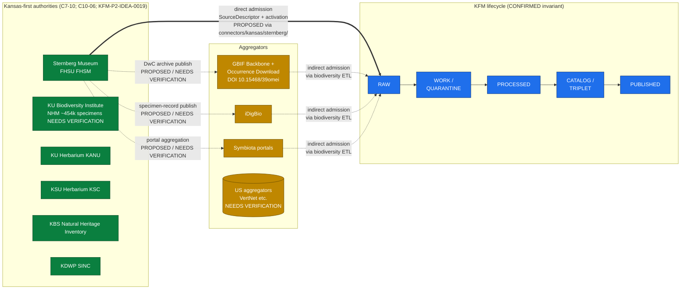
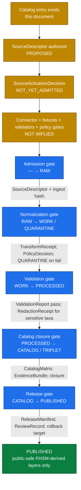

<!-- [KFM_META_BLOCK_V2]
doc_id: kfm://doc/sources/catalog/kansas/fhsu-sternberg
title: FHSU Sternberg Museum of Natural History — Source Catalog Entry
type: standard
version: v0.2
status: draft
owners: TODO-biodiversity-source-steward; TODO-paleontology-source-steward; TODO-rights-reviewer
created: 2026-05-20
updated: 2026-05-21
policy_label: public
related:
  - ../README.md
  - ../../README.md
  - ../../IDENTITY.md
  - ../../PROFILES.md
  - ../../RIGHTS-AND-SENSITIVITY-MAP.md
  - ../../OPEN-QUESTIONS.md
  - ../../_template/SOURCE_PRODUCT_TEMPLATE.md
  - ../../../doctrine/directory-rules.md
  - ../../../doctrine/authority-ladder.md
  - ../../../doctrine/truth-posture.md
  - ../../../domains/fauna/README.md
  - ../../../domains/flora/README.md
  - ../../../domains/geology/README.md
  - ../../../runbooks/fauna/SOURCE_REFRESH_RUNBOOK.md
  - ../../../standards/ISO-19115.md
  - ../../../standards/PROV.md
  - ../../../standards/SENSITIVITY_RUBRIC.md
  - ../../../registers/VERIFICATION_BACKLOG.md
  - ../../../adr/ADR-0001-schema-home.md
  - schemas/contracts/v1/source/source_descriptor.schema.json
  - schemas/contracts/v1/biodiversity/occurrence_evidence.schema.json
  - connectors/kansas/
  - data/registry/sources/
  - policy/sensitivity/
tags:
  - kfm
  - source-catalog
  - biodiversity
  - paleontology
  - fauna
  - flora
  - geology
  - kansas-first
  - kansas-family
  - C10-06
  - C7-10
notes:
  - >-
    v0.2 path migration: this doc now lives at
    `docs/sources/catalog/kansas/fhsu-sternberg.md` per the flat-to-folder
    reorganization. The kansas family README (v0.2) lists this product page
    explicitly as one of eight Kansas institutions. OQ-FHSM-01 is partially
    resolved by that reorganization; the `kansas/` family folder is the
    canonical home, with `catalog/<family>/<product>` as the adopted convention.
  - >-
    Doctrine placement of Sternberg in the biodiversity stack is CONFIRMED per
    `C10-06` ("KU and Sternberg are the in-state collections of record"). The
    Kansas-first authority posture is CONFIRMED per `C7-10` and `KFM-P2-IDEA-0019`.
  - >-
    `connectors/kansas/` lane is CONFIRMED (at commit
    `b6a27916bbb9e07cbf3752870c867476e1e094e7`) per Directory Rules v1.2 §7.3.
    Per-institution `connectors/kansas/sternberg/` content remains NEEDS
    VERIFICATION.
  - >-
    Specific specimen counts, division URLs, and license terms are EXTERNAL —
    sourced from the Sternberg Museum's public web pages and cited inline. All
    connector, pipeline, schema, policy, fixture, and CI claims remain PROPOSED
    until verified against a mounted repository.
  - >-
    Rights posture: the FHSM Herpetology Division publicly states a no-commercial
    no-redistribution license. KFM treats that restriction as the floor for all
    FHSM divisions until per-division terms are individually verified.
[/KFM_META_BLOCK_V2] -->

<a id="top"></a>

# FHSU Sternberg Museum of Natural History — Source Catalog Entry

> Governance-first source descriptor for the Sternberg Museum of Natural History at Fort Hays State University (FHSM), spanning paleontology, vertebrate zoology, paleobotany, and the Elam Bartholomew Herbarium. One of the two Kansas in-state collections of record named in `C10-06`.


-lightgrey?style=flat-square)


| Field | Value |
|---|---|
| **Source family** | `kansas/` — Kansas-first source family (CONFIRMED §7.3 canonical); FHSM is one of the in-state collections of record |
| **Doctrinal anchor** | `CONFIRMED` — Pass-10 `C10-06` "Biodiversity Stack… FHSU Sternberg"; Pass-10 `C7-10` Kansas-First Domain Authorities; supplementary to GBIF/iDigBio/Symbiota lanes |
| **Primary KFM domains touched** | `fauna` (zoology), `flora` (Bartholomew Herbarium), `geology` (paleontology/paleobotany) |
| **`source_family` enum value** | `other` (closed enum is `ebird \| inat \| gbif \| bison \| eddmaps \| other` per `KFM-P3-PROG-0001`) |
| **Status** | `draft` — catalog entry; no admitted connector implied |
| **Owners (placeholder)** | `TODO-biodiversity-source-steward`, `TODO-paleontology-source-steward`, `TODO-rights-reviewer` |
| **Last reviewed** | `2026-05-21` |
| **Implementation maturity** | family lane CONFIRMED at commit; per-institution content `UNKNOWN` — repository not mounted in this session |

> [!IMPORTANT]
> **Rights posture floor.** FHSM's Herpetology Division publicly states that its data and images "may be used freely by individuals and organizations for purposes of basic research, education, and conservation" but "may not be used for commercial or for-profit purposes without the express written consent of the Sternberg Museum of Natural History, and may not be repackaged, resold, or redistributed in any form." [EXTERNAL — FHSM Herpetology]
> Until per-division terms are individually verified, **KFM treats this restriction as the floor for all FHSM divisions** and routes any redistributive use through `policy/sensitivity/...` `DENY` by default. See §6.

---

## Quick jump

- [§1. Scope and identity](#1-scope-and-identity)
- [§2. Why this entry exists (doctrinal anchor)](#2-why-this-entry-exists-doctrinal-anchor)
- [§3. Position in the biodiversity stack](#3-position-in-the-biodiversity-stack)
- [§4. Divisions and content surfaces](#4-divisions-and-content-surfaces)
- [§5. Proposed SourceDescriptor surface](#5-proposed-sourcedescriptor-surface)
- [§6. Rights, license, and redistribution posture](#6-rights-license-and-redistribution-posture)
- [§7. Sensitivity register](#7-sensitivity-register)
- [§8. Lifecycle and gate map](#8-lifecycle-and-gate-map)
- [§9. KFM domain routing](#9-kfm-domain-routing)
- [§10. Catalog encoding (STAC × DwC + `kfm:provenance`)](#10-catalog-encoding-stac--dwc--kfmprovenance)
- [§11. Taxonomy and identity anchoring](#11-taxonomy-and-identity-anchoring)
- [§12. Related sources and crosswalks](#12-related-sources-and-crosswalks)
- [§13. Open questions and verification backlog](#13-open-questions-and-verification-backlog)
- [§14. Related docs](#14-related-docs)
- [Appendix A — External evidence inventory](#appendix-a--external-evidence-inventory)
- [Appendix B — Corpus evidence used](#appendix-b--corpus-evidence-used)
- [Appendix C — Change log](#appendix-c--change-log)

---

## 1. Scope and identity

`CONFIRMED doctrine / PROPOSED admission posture.` This catalog entry describes **one institutional source** — the Sternberg Museum of Natural History at Fort Hays State University (FHSM) — and the **source-admission constraints** that apply when KFM connectors propose ingest. It is **not** a connector spec, a schema home, a pipeline, or a release manifest. Per Directory Rules, source admission produces a `SourceDescriptor` (and ultimately a `SourceActivationDecision`); this document is the human-facing catalog companion to that descriptor.

> [!NOTE]
> **Path migration (v0.1 → v0.2).** This page was authored as `docs/sources/catalog/fhsu-sternberg.md` in v0.1 and **moved to `docs/sources/catalog/kansas/fhsu-sternberg.md`** in v0.2 during the flat-to-folder reorganization. The `kansas/` family README (v0.2) lists this product page explicitly as one of eight Kansas institutions. Relative links have been adjusted; any external link to the old flat path will break and should be retargeted. OQ-FHSM-01 from v0.1 is **partially resolved** — the `catalog/<family>/<product>` convention is the one the catalog now uses.

| Identity field | Value | Truth label |
|---|---|---|
| `name` | Sternberg Museum of Natural History | `EXTERNAL` The Sternberg Museum of Natural History houses over three million paleontology, zoology, and geology specimens that document life and environments in the Great Plains region of North America. |
| `parent_institution` | Fort Hays State University (FHSU), Hays, Kansas | `EXTERNAL` |
| `acronym_or_collection_code` | `FHSM` (used by Sternberg divisions for catalog numbers) | `EXTERNAL` The Herpetology Collection at the Sternberg Museum of Natural History, Fort Hays State University (FHSM) contains more than 16,000 recent cataloged specimens. |
| `public_landing_page` | `https://sternberg.fhsu.edu/` | `EXTERNAL` The Sternberg Museum of Natural History advances an appreciation and understanding of Earth's natural history and the evolutionary forces that impact it. |
| `proposed_kfm_source_id` | `kfm:source/fhsu-sternberg` | `PROPOSED` (naming convention) |
| `proposed_kfm_collection_code_namespace` | `kfm:institution/FHSM` | `PROPOSED` |
| `source_family` enum value | `other` | `CONFIRMED` enum (Sternberg is not in the named enum set) per `KFM-P3-PROG-0001` |
| `corpus_anchor` | Pass-10 `C10-06` (biodiversity stack); Pass-10 `C7-10` (Kansas-First Domain Authorities); Pass-23/32 §8.3.37 `KFM-P2-IDEA-0019` (Kansas-specific bio supplements) | `CONFIRMED` |
| `directory_rules_basis` | `docs/sources/` lane (§6.1); `connectors/kansas/` §7.3 family CONFIRMED at commit `b6a27916bbb9e07cbf3752870c867476e1e094e7` | `CONFIRMED` (family lane); per-institution adapter `PROPOSED` |

> [!NOTE]
> The acronym **FHSM** is used by the museum's own division portals as a specimen prefix (e.g., FHSM herpetology catalog numbers). KFM should treat **FHSM** as the canonical collection-code namespace and **`fhsu-sternberg`** as the source-catalog slug. These are `PROPOSED` until enshrined in a `SourceDescriptor`.

[↑ back to top](#top)

---

## 2. Why this entry exists (doctrinal anchor)

`CONFIRMED.` The KFM Components Pass-10 Idea Index, card **`C10-06` — Biodiversity Stack** (status: `CONFIRMED`), enumerates the Sternberg Museum at FHSU as one of the Kansas in-state collections of record alongside the KU Biodiversity Institute Natural History Museum, GBIF, iNaturalist, eBird EBD, NatureServe, USFWS, iDigBio, and Symbiota. The corpus treats Kansas-specific institutional sources as **supplementing** GBIF rather than replacing it: GBIF aggregates internationally, and per Pass-23 `KFM-P2-IDEA-0019` and Pass-10 `C7-10`, Kansas-first authorities receive first-class treatment alongside the global aggregator so that "Kansas-specific sources… make KFM a Kansas system rather than a general-U.S. system."

| Doctrinal claim | Truth label | Citation |
|---|---|---|
| FHSU Sternberg is part of KFM's biodiversity source set | `CONFIRMED` | Pass-10 `C10-06` |
| FHSU Sternberg is a "Kansas-first" authority alongside KANU, KSC, iDigBio, USDA PLANTS | `CONFIRMED` | Pass-10 `C7-10`; Pass-23/32 `KFM-P2-IDEA-0019` |
| Kansas-authority IRI is stored **in parallel** with federal/international anchor (do not replace) | `CONFIRMED` | Pass-10 `C7-10` |
| FHSU Sternberg supplements rather than replaces GBIF | `CONFIRMED` | Pass-23/32 `KFM-P2-IDEA-0018` ("supplements with Kansas-specific institutional sources where GBIF coverage is insufficient") |
| FHSM specimens are also ingestible via GBIF and iDigBio aggregations | `INFERRED` (typical of DwC-publishing US natural-history collections) | `NEEDS VERIFICATION` against the FHSM-by-FHSM GBIF/iDigBio publisher listings |
| "KU and Sternberg are the in-state collections of record" | `CONFIRMED` (verbatim from `C10-06` detail) | Pass-10 `C10-06` |
| Apply C6 redaction for any species ranked at S1/S2 by NatureServe or KDWP SINC | `CONFIRMED` doctrine | Pass-10 `C10-06`; `C6-01`; `KFM-P19-IDEA-0005` |

[↑ back to top](#top)

---

## 3. Position in the biodiversity stack

The diagram below positions FHSM relative to the rest of the biodiversity stack and the KFM lifecycle. Edges show **admission and aggregation relationships** (PROPOSED), not implemented data flow.



> [!NOTE]
> The dashed edges from FHSM to GBIF/iDigBio/Symbiota represent the **typical** publishing pattern for US natural-history collections and are `NEEDS VERIFICATION` until KFM confirms which FHSM divisions publish to which aggregators, on what cadence, and under which license. Even when an aggregator carries an FHSM specimen, the **authority-of-record remains FHSM**, and KFM source-role labelling must reflect that (`C7-10` parallel-anchor rule).

[↑ back to top](#top)

---

## 4. Divisions and content surfaces

`EXTERNAL` content below — sourced from FHSM's public collections pages. Specific counts are point-in-time facts and labelled accordingly.

| Division / collection | Material | Public-facing portal (proposed `PROPOSED` admission target) | Notes / scale | Truth |
|---|---|---|---|---|
| Paleontology (vertebrate + invertebrate) | "invertebrate and vertebrate specimens representing taxonomic diversity from all Phanerozoic time periods" | `https://sternberg.fhsu.edu/research-collections/paleontology/` | Foundational George F. Sternberg collection; NSF digitization grants 1559733 and 1601977 supported data digitization | `EXTERNAL` |
| Paleobotany (within Paleontology) | "more than 500,000 fossil plants… the largest collection of fossil grasses in the world" | (same division as paleontology) | Distinctive for fossil-grass coverage relevant to Kansas Great-Plains paleo-floristics | `EXTERNAL` |
| Zoology — Herpetology | recent specimens (skins, mounts, skeletons, fluid-preserved, tissue) | `https://webapps.fhsu.edu/fhsm-h/` | "more than 16,000 recent cataloged specimens"; restrictive use license stated on the portal | `EXTERNAL` |
| Zoology — Mammalogy | "skins, taxidermy mounts, skeletons, fluid-preserved specimens, and a tissue bank" | `https://webapps.fhsu.edu/FHSM-M/` | Specimen counts and license: `NEEDS VERIFICATION` per division | `EXTERNAL` (portal URL); `NEEDS VERIFICATION` (counts) |
| Zoology — additional divisions (entomology, ornithology, ichthyology, etc.) | Per FHSM division pages | Division-specific subpages of `https://sternberg.fhsu.edu/research-collections/` | Existence and exact division inventory: `NEEDS VERIFICATION` against FHSM's current division listing | `NEEDS VERIFICATION` |
| Botany — **Elam Bartholomew Herbarium** | Mycological herbarium developed by Bartholomew (fungal specimens) | (housed at FHSM; herbarium code / Index Herbariorum acronym: `NEEDS VERIFICATION`) | Maps onto KFM `flora` domain; nomenclature reconciliation per `KFM-P2-IDEA-0019` (USDA PLANTS authority) | `EXTERNAL` (presence) |
| **George F. Sternberg Digital Collections** (archival photographs) | "images dating from approximately 1906 through the 1950's" — paleo expeditions, primary-source photos | `https://scholars.fhsu.edu/sternberg_collection/` (FHSU Scholars Repository, not the museum portal) | Distinct from specimen records — these are **archival/photographic** sources; the host is the FHSU Scholars Repository, a separate institutional surface | `EXTERNAL` |

> [!TIP]
> The archival photo collection at `scholars.fhsu.edu/sternberg_collection/` is **a different source** than the specimen-record portals at `webapps.fhsu.edu/FHSM-*/`. KFM should treat them as **two distinct `SourceDescriptor` admissions** sharing only the institutional parent — they have different rights, different evidence semantics, and different downstream KFM domains (specimen records → fauna/flora/geology; archival photos → archives/history). See §13 OQ-FHSM-03.

[↑ back to top](#top)

---

## 5. Proposed SourceDescriptor surface

`PROPOSED.` The field surface below operationalizes the KFM `SourceDescriptor` family (defined in the Unified Implementation Architecture Build Manual as "machine-readable source identity, source role, rights, cadence, access, steward, sensitivity, and release posture") and the role-field extensions in the Domains v1.1 + Pass 23/32 Consolidated Atlas §24.1.3. **Field names are PROPOSED and not authoritative;** the canonical schema home defaults to `schemas/contracts/v1/source/source_descriptor.schema.json` per Directory Rules §7.4 and ADR-0001 unless an accepted ADR relocates it (`NEEDS VERIFICATION` against mounted repo).

```yaml
# PROPOSED — not validated against any mounted schema
source_id: kfm:source/fhsu-sternberg
source_family_enum: other            # closed enum per KFM-P3-PROG-0001
source_family: SRC-KANSAS            # PROPOSED membership in the kansas/ family
collection_code: FHSM
parent_institution: Fort Hays State University
landing_page: https://sternberg.fhsu.edu/
source_role: observed                # primary role; some divisions act as authority for taxonomic vouchers
role_authority: Sternberg Museum of Natural History, FHSU
sensitivity_label: mixed             # see §7 — paleontology localities and rare-taxa occurrences require generalization
rights:
  license_id: TODO_per_division                   # NEEDS VERIFICATION per division
  redistribution_allowed: false                   # PROPOSED floor — derived from FHSM Herpetology terms
  commercial_use_allowed: false                   # PROPOSED floor — derived from FHSM Herpetology terms
  attribution_required: true
  attribution_text: |
    Sternberg Museum of Natural History, Fort Hays State University.
    (Division-specific attribution required per division terms.)
cadence:
  pattern: irregular-institutional
  notes: |
    NEEDS VERIFICATION — institutional collections grow as specimens are
    accessioned; per-division publishing cadence to GBIF/iDigBio is
    not declared on the public pages reviewed.
access:
  primary:
    - mechanism: division-portal
      url_pattern: https://webapps.fhsu.edu/fhsm-h/        # herpetology
    - mechanism: division-portal
      url_pattern: https://webapps.fhsu.edu/FHSM-M/        # mammalogy
  indirect_aggregators:
    - gbif        # PROPOSED — FHSM publisher status NEEDS VERIFICATION
    - idigbio     # PROPOSED — FHSM publisher status NEEDS VERIFICATION
    - symbiota    # PROPOSED — herbarium portal status NEEDS VERIFICATION
sensitivity:
  rubric: C6-01                                       # CONFIRMED 0–5 scale
  default_rank_for_unknown_taxon: 3                   # fail-closed; treat as SINC/locally sensitive
  rare_species_default: DENY_PUBLIC_EXACT
  redaction_profile_default: point_10km_hex_seeded_v1  # a.k.a. profile:sinc-obscure-10km (C6-02)
  fossil_locality_default: DENY_PUBLIC_EXACT          # PROPOSED — see OQ-FHSM-05
taxonomy_anchors:
  primary: ITIS_TSN                                   # C7-07
  fallback: GBIF_BACKBONE                             # C7-08; DOI 10.15468/39omei pinned in receipt
  on_disagreement: surface_in_disagreement_report
stewards:
  - role: zoological-collections-manager
    name: TODO-name                                   # per current FHSM staff page
  - role: paleontology-curator
    name: TODO-name
  - role: KFM-source-steward
    name: TODO-kfm-steward
kfm_domains_touched:
  - fauna           # zoology divisions
  - flora           # Bartholomew Herbarium
  - geology         # paleontology, paleobotany
related_kfm_sources:
  - kfm:source/gbif
  - kfm:source/idigbio
  - kfm:source/symbiota
  - kfm:source/ku-biodiversity-institute-nhm
  - kfm:source/usda-plants
  - kfm:source/kdwp-sinc
  - kfm:source/natureserve
public_release_class: restricted                       # PROPOSED — flows from rights floor
activation_status: NOT_YET_ADMITTED                    # PROPOSED — no SourceActivationDecision implied by this catalog entry
```

> [!CAUTION]
> The activation status is **`NOT_YET_ADMITTED`**. This catalog entry is doctrine and reference only. **No connector, watcher, ingest pipeline, schema, or fixture is implied to exist** by this document, and presence in `docs/sources/catalog/kansas/` does **not** constitute a `SourceActivationDecision`. Per the Build Manual, activation requires a separate decision recording "allowed, restricted, denied, or needs-review use" alongside connector/fixture/validator/policy-gate readiness.

[↑ back to top](#top)

---

## 6. Rights, license, and redistribution posture

`EXTERNAL` evidence — `PROPOSED` KFM posture.

The FHSM Herpetology Division's public terms are the **most explicit per-division license language reviewed in this session** and serve as the **floor** for the catalog entry until each division's terms are individually verified:

> **FHSM Herpetology stated terms (paraphrased per copyright):** specimens, databases, and images are owned and copyrighted by Sternberg or licensed to it; freely usable for basic research, education, and conservation; **commercial or for-profit use requires express written consent**; and they **may not be repackaged, resold, or redistributed in any form**. [EXTERNAL — FHSM Herpetology]

### 6.1 KFM consequences of the rights floor

| KFM action | Default posture | Required artifacts |
|---|---|---|
| Ingest into `data/raw/<domain>/<source_id>/<run_id>/` | `PROPOSED` allowed under research-and-education clause, but only after a `SourceActivationDecision` records the per-division license | `SourceDescriptor` with rights fields; ingest receipt |
| Publish FHSM data as a downloadable KFM-derived dataset (DwC-A re-publish, GeoParquet, etc.) | `DENY` by default — collides with the no-redistribution clause | A `PolicyDecision` denying public republish; route to `restricted` release class |
| Display individual specimen records in a KFM evidence drawer with attribution | `ABSTAIN` until per-division terms reviewed; then `PROPOSED` allowed for the research/education clause with attribution | Citation in EvidenceBundle; attribution string in `SourceDescriptor.rights.attribution_text` |
| Use FHSM images in KFM Story Nodes, reports, or public maps | `DENY` by default; case-by-case with steward review | `RedactionReceipt` if generalized; `ReviewRecord` + steward signoff |
| Derive aggregate or generalized public layers (e.g., taxon-by-county heatmaps) | `PROPOSED` — likely allowed under the research clause provided no individual specimen images or full records are redistributed | `AggregationReceipt`; `PolicyDecision` |
| Commercial / for-profit derivation of any kind | `DENY` outright; correction note required if accidentally exposed | `PolicyDecision: deny` + `CorrectionNotice` (post-hoc) |

> [!IMPORTANT]
> The FHSM Herpetology terms apply to **the herpetology division as cited**. Other divisions (Mammalogy, Paleontology, Paleobotany, Bartholomew Herbarium, archival photo collection) **MUST** have their own per-division terms separately verified. The default of "no commercial; no redistribution" is the **most restrictive applicable row** posture per the KFM sensitive-domain matrix and is preserved until evidence narrows it. See §13 OQ-FHSM-04.

### 6.2 Distinct rights surface for the archival photo collection

The George F. Sternberg Digital Collection (hosted at FHSU Scholars Repository, not the museum portal) carries its own content-disclaimer language:

> **FHSU Scholars Repository disclaimer (paraphrased per copyright):** primary-source materials in FHSU Special Collections and Archives are placed for research, preservation, and historical-reflection purposes; some items "may be sensitive in nature and may not represent the attitudes, beliefs, or ideas of their creators, persons named in the collections, or the position of Fort Hays State University." [EXTERNAL — FHSU Scholars Repository]

This is **content-context language**, not a license. The repository's specific reuse license (e.g., rights statement, public-domain mark, or CC) is `NEEDS VERIFICATION` per item.

[↑ back to top](#top)

---

## 7. Sensitivity register

FHSM is the **only** KFM-cataloged source reviewed in this session that touches all three of: rare-species occurrences (zoology), paleontology fossil localities (sensitive to looting per the corpus's archaeology-adjacent reasoning), and primary-source archival imagery (potentially carrying culturally sensitive content). The deny-by-default register applies at the join of those domains.

> [!TIP]
> **C6-01 rubric mapping** (CONFIRMED). FHSM rare-taxa occurrences inherit the KFM 0–5 sensitivity rubric (`C6-01`). Rank 3 (SINC / locally sensitive) maps to the default named profile `profile:sinc-obscure-10km` — equivalent to `point_10km_hex_seeded_v1` per `C6-02`. Rank 4 (threatened/rare) requires stricter mask or embargo; rank 5 (sacred/critical) is fail-closed with no map or timeline exposure.

| Sensitive surface | Source within FHSM | Default disposition | Required transform before any public release | Citation |
|---|---|---|---|---|
| Rare/protected species occurrences (zoology) | Herpetology, Mammalogy, Ornithology, Ichthyology (where present) | `DENY` exact coordinates by default; rank ≥ 3 per `C6-01` | Geometry generalization via `point_10km_hex_seeded_v1` (`C6-02`); `RedactionReceipt`; review against NatureServe / KDWP SINC ranks | `KFM-P19-IDEA-0005` (KDWP listing canonicity); `KFM-P24-IDEA-0002`; `KFM-P24-PROG-0013`; `KFM-P17-PROG-0027` (cited as authored — title NEEDS VERIFICATION) |
| Paleontology / fossil locality precise coordinates | Paleontology, Paleobotany | `DENY` exact coordinates by default (looting risk; analogous to archaeology) | Generalize to county or formation outcrop; require curator review | `INFERRED` from Atlas §24 deny-by-default register (Archaeology-adjacent rationale); `NEEDS VERIFICATION` as explicit corpus rule for FHSM paleo |
| Specimen images / division portals (republish) | All zoology divisions; assumed for paleontology | `DENY` republish/redistribute by default | `PolicyDecision: deny`; steward review for case-by-case exceptions; attribution-only inline | FHSM Herpetology terms (see §6) |
| Archival photographs (Sternberg Digital Collection) | FHSU Scholars Repository — Sternberg Digital Collection | `ABSTAIN` until per-item rights reviewed | Per-item license check; cultural-context review where the disclaimer flags potential sensitivity | FHSU Scholars Repository disclaimer (see §6.2) |
| Joins from FHSM occurrence to private-land parcels | Cross-source join (FHSM + People/Land) | `DENY` — private-land joins are denied at the trust membrane | `RedactionReceipt`; private-parcel-join policy gate | Atlas §16 sensitivity matrix (private-land assertions) |

> [!WARNING]
> A fossil locality is **not the same as a biodiversity occurrence**. KFM's deny-by-default register for sensitive geometry was written primarily for living species and archaeology; the corpus does **not** make fossil-locality protection explicit. This catalog entry **treats fossil localities under the most restrictive applicable row** until a domain steward or ADR resolves the question. See §13 OQ-FHSM-05.

[↑ back to top](#top)

---

## 8. Lifecycle and gate map

The FHSM source descriptor passes through the same RAW → PUBLISHED gate sequence as every other admitted source. Nothing in this catalog entry shortcuts the invariant.



| Phase | What FHSM material looks like | Permitted | Forbidden |
|---|---|---|---|
| `data/raw/<domain>/fhsu-sternberg/<run_id>/` | Untransformed division-portal exports or aggregator slices | Immutable storage with retrieval metadata, hash, source time | Direct public access; AI context |
| `data/quarantine/<domain>/fhsu-sternberg/...` | Records with unresolved rights, missing license, over-precise sensitive geometry | Disposition pending steward review | Promotion without remediation |
| `data/work/<domain>/fhsu-sternberg/...` | Normalized DwC fields; coordinate-generalized variants for sensitive taxa | Candidate canonical records | Public surfaces |
| `data/processed/<domain>/fhsu-sternberg/...` | Validated, license-mapped, sensitivity-redacted records | Reference by `EvidenceBundle` | Assumed public/release status |
| `data/catalog/domain/<domain>/...` | STAC × DwC catalog records with `properties.taxon` block (per `C4-03`) | Cited claims, closed identifiers | Uncited / unclosed |
| `data/published/layers/<domain>/...` | Only **generalized, aggregate, attributed, non-redistributive** derivatives | Public-safe outputs | Raw record dumps; full image republish |

[↑ back to top](#top)

---

## 9. KFM domain routing

`PROPOSED.` FHSM is unusual in that it spans three KFM responsibility-root domain lanes simultaneously. The routing below allocates source-derived material to the responsibility-root that owns it, **without creating a new `fhsm/` domain folder**.

| FHSM division | Material | Primary KFM domain | Secondary touches | Notes |
|---|---|---|---|---|
| Herpetology, Mammalogy, Ornithology, Ichthyology, Entomology, etc. | Modern animal specimens, observations | `fauna` | `habitat` (occurrence-to-habitat join) | Subject to sensitive-species generalization (§7) |
| Paleontology (vertebrate + invertebrate) | Fossil specimens (Phanerozoic) | `geology` (stratigraphic / fossil-locality context) | `fauna` for trait/morphology evidence; `flora` for paleobotany | Locality protection per §7 |
| Paleobotany | Fossil plants (incl. world's largest fossil-grass collection) | `geology` (paleobotanical stratigraphy) | `flora` for nomenclature crosswalk | Locality protection per §7 |
| Elam Bartholomew Herbarium | Fungal / mycological specimens (botanical herbarium) | `flora` | `habitat`; `agriculture` (mycology cross-cuts) | Nomenclature reconciliation against USDA PLANTS per `KFM-P2-IDEA-0019` |
| George F. Sternberg Digital Collection | Archival photographs (paleo expeditions, FHSU history) | **Distinct source** — not the museum specimen source | `archaeology`-adjacent for historical context; `people-dna-land` for named individuals in photos | Different host, different rights; should be a separate `SourceDescriptor` (see §13 OQ-FHSM-03) |

> [!NOTE]
> Per Directory Rules §11 (Multi-domain and cross-cutting files), FHSM-derived material **MUST NOT** create a new `fhsm/` or `sternberg/` root-level domain folder. Records belong under their **responsibility-root domain lane** (`fauna/`, `flora/`, or `geology/`), with `source_id = kfm:source/fhsu-sternberg` carried in the record itself.

[↑ back to top](#top)

---

## 10. Catalog encoding (STAC × DwC + `kfm:provenance`)

FHSM specimen records — once admitted, normalized, and rights-cleared — are encoded as **STAC × Darwin Core hybrid** catalog records (CONFIRMED, `C4-03`): STAC anchors spatial/temporal context; DwC carries the biological semantics. DwC terms live **inside** `properties.taxon`, never at the top level.

STAC `item.properties.kfm:provenance` block (CONFIRMED block shape per `C4-01`):

| Field | Description |
|---|---|
| `spec_hash` | sha256 of the canonical record (deterministic from `source_record_id`, `event_date`, normalized geometry, accepted taxon name per `KFM-IDX-OCC-007`) |
| `evidence_bundle_ref` | `kfm://evidence/<digest>` — content-addressed JSON-LD bundle with receipts and validations |
| `run_record_ref` | `kfm://run/<run-id>` — pointer to the connector run record |
| `audit_ref` | `kfm://audit/<attestation-id>` — SLSA / OPA attestation pointer |
| `policy_digest` | sha256 of the policy bundle in force at promotion |

Per-asset integrity: `file:checksum` (per-file SHA-256, CONFIRMED per `C4-01` + `C3-02`).

> [!TIP]
> **Dedup with cross-source overlap** (CONFIRMED recipe per `KFM-P2-PROG-0001`). When a Sternberg specimen also appears in GBIF or iDigBio, dedup with **`(institutionCode, catalogNumber)`** as the primary key plus a rounded-coordinate fallback. **FHSM remains the authority-of-record** even when the aggregator carries the record — preserve `kfm:source/fhsu-sternberg` as the institutional anchor and add the aggregator as a related-source reference.

[↑ back to top](#top)

---

## 11. Taxonomy and identity anchoring

> [!IMPORTANT]
> The KFM biodiversity convention (CONFIRMED, `C7-07` and `C7-08`) is to anchor every species-level record to **ITIS TSN** where ITIS has coverage, with the **GBIF Backbone Taxonomy** (DOI `10.15468/39omei`, version pinned in the run receipt) as the second-line authority. FHSM is the originating institution; **its taxonomic determinations are preserved alongside the ITIS/GBIF anchors but do not replace them.**

| Step | Rule | Source citation |
|---|---|---|
| 1 | Resolve FHSM specimen `scientificName` (DwC) against ITIS TSN | `C7-07` (ITIS authority) |
| 2 | If ITIS is silent, resolve against GBIF Backbone (pin DOI version in receipt) | `C7-08` (GBIF backbone DOI `10.15468/39omei`) |
| 3 | Record both anchors plus the FHSM original determination in the catalog row | `C5-08` (lineage required); `C7-10` (Kansas-first parallel-anchor rule) |
| 4 | For botanical names (Bartholomew Herbarium), route through **USDA PLANTS** as the authoritative U.S. plant-name layer with ITIS as the back-anchor | `KFM-P2-IDEA-0019` |
| 5 | Where ITIS and GBIF disagree, surface the ambiguity in the disagreement report; do not silently pick one | Open question per `C7-07`; tie-breaker policy is the same OPEN-INAT-02 carried by other biodiversity sources |

[↑ back to top](#top)

---

## 12. Related sources and crosswalks

| Related KFM source | Relationship | Cross-source rule |
|---|---|---|
| `kfm:source/gbif` | FHSM may publish DwC-A to GBIF (`NEEDS VERIFICATION`) | Per `KFM-P2-PROG-0001` biodiversity ETL: deduplicate by `(institutionCode, catalogNumber)` with rounded-coordinate fallback; **FHSM remains the authority-of-record** even when an occurrence is also in GBIF |
| `kfm:source/idigbio` | FHSM specimen records likely flow through iDigBio (`NEEDS VERIFICATION`) | Same dedup rule; preserve FHSM provenance |
| `kfm:source/symbiota` | Herbarium / portal aggregation likely path for the Bartholomew Herbarium (`NEEDS VERIFICATION`) | Crosswalk `kbs_id` / institution code; preserve attribution |
| `kfm:source/ku-biodiversity-institute-nhm` | Companion in-state collection (KU NHM ~454k specimens — `NEEDS VERIFICATION` per `C7-10` evidence-needed list) | Sibling Kansas-first authority; KFM should ingest both rather than pick a winner |
| `kfm:source/usda-plants` | Nomenclature authority (`KFM-P2-IDEA-0019`) | Bartholomew Herbarium plant-name reconciliation routes through USDA PLANTS |
| `kfm:source/kdwp-sinc` | Sensitivity ranking authority (Kansas) | Drives generalization decisions for rare-taxa occurrences; `C6-01` rank 3 default profile `profile:sinc-obscure-10km`; `KFM-P19-IDEA-0005` makes KDWP listing canonical regulatory context |
| `kfm:source/natureserve` | Conservation-status ranking (international) | Same as KDWP SINC; both consulted at sensitivity gate; S1/S2 triggers redaction per `C10-06` |
| `kfm:source/fhsu-scholars-sternberg-digital` (PROPOSED separate source) | The archival photo collection | Distinct admission; see §13 OQ-FHSM-03 |

[↑ back to top](#top)

---

## 13. Open questions and verification backlog

| ID | Question | Why it matters | Evidence that would settle it | Status |
|---|---|---|---|---|
| OQ-FHSM-01 | Was `docs/sources/catalog/` the right subfolder under `docs/sources/`, or does the repo use a flat `docs/sources/<slug>.md` convention? | Directory Rules §6.1 lists `docs/sources/` but does not enumerate a `catalog/` subfolder. | The v0.2 flat-to-folder reorganization adopted `catalog/<family>/<product>` as the convention, with this doc moved under `kansas/`. | **PARTIALLY RESOLVED** — convention adopted; mounted-repo verification still NEEDS VERIFICATION |
| OQ-FHSM-02 | Does the canonical schema home `schemas/contracts/v1/source/source_descriptor.schema.json` exist, and do the field names in §5 match? | Determines whether the PROPOSED descriptor in §5 maps cleanly or needs renaming | Mounted-repo schema file inspection; ADR-0001 | `NEEDS VERIFICATION` |
| OQ-FHSM-03 | Should the George F. Sternberg Digital Collection be a **distinct** KFM source (`kfm:source/fhsu-scholars-sternberg-digital`) from the specimen source? | Different host (FHSU Scholars Repository), different rights surface, different downstream domain (archives vs biodiversity) | Steward decision; or ADR if it crosses domain boundaries | `PROPOSED` answer: YES, separate. `NEEDS VERIFICATION` formally. |
| OQ-FHSM-04 | What are the per-division license terms for Mammalogy, Paleontology, Paleobotany, and the Bartholomew Herbarium? | The Herpetology terms cited in §6 are the **only** division-specific terms reviewed. Other divisions may be more or less permissive. | Direct review of each division's portal terms page; correspondence with the FHSM Collections Manager | `NEEDS VERIFICATION` |
| OQ-FHSM-05 | Are fossil localities (paleo / paleobotany) covered by KFM's deny-by-default sensitive-geometry rule, or do they need a domain-specific rule? | The corpus's deny-by-default register names archaeology and rare-species explicitly; fossil localities are not explicit. Looting risk argues for analogous protection. | Steward decision; ADR; geology / paleontology dossier amendment | `OPEN` (steward review) |
| OQ-FHSM-06 | Does FHSM publish DwC-A to GBIF, iDigBio, and/or Symbiota — for which divisions, on what cadence, under which license? | Determines whether `kfm:source/fhsu-sternberg` should be admitted **directly** (preferred), **via aggregator**, or **both** with cross-source dedup | Lookup against GBIF and iDigBio publisher listings; per-division publishing statements | `NEEDS VERIFICATION` |
| OQ-FHSM-07 | What is the Bartholomew Herbarium's Index Herbariorum acronym and FHSM internal namespacing? | Required for nomenclature crosswalks against USDA PLANTS, Symbiota, and GBIF | Index Herbariorum lookup; FHSM Botany division page (existence and identifier `NEEDS VERIFICATION`) | `NEEDS VERIFICATION` |
| OQ-FHSM-08 | Should KFM model the multi-domain FHSM source with a **single** `SourceDescriptor` and per-division sub-descriptors, or with **one descriptor per division**? | Affects schema design, policy granularity, and how rights/sensitivity vary across divisions | ADR or schema PR | `PROPOSED` answer: one parent descriptor + per-division child records; `NEEDS VERIFICATION` |
| OQ-FHSM-09 (new) | Confirm corpus card IDs cited from v0.1 (`KFM-P17-PROG-0027` "sensitive species public geometry rule"; `KFM-P17-PROG-0026` "biodiversity source cadence matrix") match titles in the current atlas | The IDs are referenced but exact titles were not independently verified in this revision session | Idea-index lookup against Pass-23/32 atlas | `NEEDS VERIFICATION` (carried from v0.1 references) |
| OQ-FHSM-10 (new) | Confirm `connectors/kansas/sternberg/` (or analogous per-institution adapter path) layout under the canonical `connectors/kansas/` lane | Family lane is CONFIRMED at commit; per-institution adapter content is not | Mounted-repo `connectors/kansas/` tree | `NEEDS VERIFICATION` |

[↑ back to top](#top)

---

## 14. Related docs

- [`../README.md`](../README.md) — `docs/sources/catalog/kansas/` family README (v0.2 confirms `connectors/kansas/` as §7.3 canonical; lists this product page)
- [`../../README.md`](../../README.md) — `docs/sources/catalog/` index
- [`../../IDENTITY.md`](../../IDENTITY.md) — Collection-id and namespace conventions
- [`../../RIGHTS-AND-SENSITIVITY-MAP.md`](../../RIGHTS-AND-SENSITIVITY-MAP.md) — lane-wide rights/sensitivity matrix
- [`../../OPEN-QUESTIONS.md`](../../OPEN-QUESTIONS.md) — lane-wide `OPEN-DSC-*` items
- [`../../../doctrine/directory-rules.md`](../../../doctrine/directory-rules.md) — placement law (§6.1, §7.3, §11)
- [`../../../doctrine/authority-ladder.md`](../../../doctrine/authority-ladder.md) — Kansas-first authority posture
- [`../../../doctrine/truth-posture.md`](../../../doctrine/truth-posture.md) — cite-or-abstain rule and truth labels
- [`../../../domains/fauna/README.md`](../../../domains/fauna/README.md) — fauna domain dossier (zoology routing)
- [`../../../domains/flora/README.md`](../../../domains/flora/README.md) — flora domain dossier (Bartholomew Herbarium routing)
- [`../../../domains/geology/README.md`](../../../domains/geology/README.md) — geology domain dossier (paleontology / paleobotany routing)
- [`../../../runbooks/fauna/SOURCE_REFRESH_RUNBOOK.md`](../../../runbooks/fauna/SOURCE_REFRESH_RUNBOOK.md) — operational refresh runbook (CONFIRMED authored prior session; placement subject to OPEN-DR-02)
- [`../../../standards/ISO-19115.md`](../../../standards/ISO-19115.md) — metadata profile for source-level descriptions
- [`../../../standards/PROV.md`](../../../standards/PROV.md) — provenance vocabulary for `SourceDescriptor` → `EvidenceBundle` lineage
- [`../../../standards/SENSITIVITY_RUBRIC.md`](../../../standards/SENSITIVITY_RUBRIC.md) — C6-01 0–5 rubric (PROPOSED in corpus; not yet authored)
- [`../../../adr/ADR-0001-schema-home.md`](../../../adr/ADR-0001-schema-home.md) — schema-home authority for the `SourceDescriptor` JSON Schema location
- Pass-10 Idea Index — **`C10-06`** biodiversity stack card (doctrinal anchor for this entry); **`C7-10`** Kansas-First Domain Authorities
- Pass-23/32 Consolidated Atlas — **§24.1.3** source-role descriptor fields; **§24.2.1** receipt family catalog; **`KFM-P17-PROG-0027`** sensitive species public geometry rule (NEEDS VERIFICATION per OQ-FHSM-09); **`KFM-P19-IDEA-0005`** (KDWP listing-status canonicity)

[↑ back to top](#top)

---

## Appendix A — External evidence inventory

<details>
<summary>Click to expand the external sources consulted for this catalog entry</summary>

All entries below are `EXTERNAL` and are referenced inline in the body of this document. KFM doctrine is **not** derived from these sources; they inform only the descriptive facts about FHSM as an external institution.

| URL | Used for | Date observed |
|---|---|---|
| `https://sternberg.fhsu.edu/` | Museum identity, mission statement | 2026-05-20 |
| `https://sternberg.fhsu.edu/research-collections/` | Specimen-count claim (~3 million); divisions; paleobotany scale | 2026-05-20 |
| `https://sternberg.fhsu.edu/research-collections/paleontology/index.html` | Paleontology division history; NSF digitization grant numbers | 2026-05-20 |
| `https://webapps.fhsu.edu/fhsm-h/` | Herpetology portal; cataloged-specimen count; **license terms** | 2026-05-20 |
| `https://webapps.fhsu.edu/FHSM-M/history.aspx` | Mammalogy portal existence | 2026-05-20 |
| `https://scholars.fhsu.edu/sternberg_collection/` | George F. Sternberg Digital Collection; FHSU Scholars Repository content disclaimer | 2026-05-20 |

**External research triggers (per the doc contract):** institutional URL patterns and current portal hosts are version-sensitive and external (trigger: "current syntax or behavior of external tools the doc must describe accurately"); per-division license language is operationally current security/rights material (trigger: "security-relevant or operationally current facts"). No external research was used to make KFM-doctrine or KFM-repo-state claims.

</details>

[↑ back to top](#top)

---

## Appendix B — Corpus evidence used

<details>
<summary>Click to expand the corpus evidence used for this entry</summary>

| Corpus source | Section / card | What it grounds |
|---|---|---|
| KFM Components Pass-10 Idea Index | **`C10-06`** Biodiversity Stack (CONFIRMED) | FHSU Sternberg's inclusion in KFM's biodiversity sources; "KU and Sternberg are the in-state collections of record" |
| Pass-10 Idea Index | **`C7-10`** Kansas-First Domain Authorities (CONFIRMED) | The parallel-anchor rule; non-API-source tolerance; Kansas-Authority Compatibility Report future-work |
| Pass-10 Idea Index | **`C4-01`** STAC `kfm:provenance` namespace (CONFIRMED) | Catalog provenance block shape used in §10 |
| Pass-10 Idea Index | **`C4-02`** STAC Collection (CONFIRMED) | Collection-id convention `kfm-<org>-<product>` referenced in §5 |
| Pass-10 Idea Index | **`C4-03`** STAC × Darwin Core hybrid (CONFIRMED) | Catalog encoding for biodiversity occurrences sourced from FHSM or FHSM-via-aggregator |
| Pass-10 Idea Index | **`C5-02`** Default-deny promotion (CONFIRMED) | Anchors the deny-by-default sensitivity posture |
| Pass-10 Idea Index | **`C6-01`** Sensitivity rubric 0–5 (CONFIRMED) | Rank-3 SINC default profile `profile:sinc-obscure-10km`; mapping used in §7 |
| Pass-10 Idea Index | **`C6-02`** Named redaction profiles (CONFIRMED) | `point_10km_hex_seeded_v1`, `point_3km_jitter_v1`, `centroid_1km_v1`; profile-id convention |
| Pass-10 Idea Index | **`C7-07`** ITIS TSN authority (CONFIRMED) | Taxonomy anchor primary; used in §11 |
| Pass-10 Idea Index | **`C7-08`** GBIF Backbone Taxonomy DOI `10.15468/39omei` (CONFIRMED) | Taxonomy anchor fallback; used in §11 |
| Pass-23/32 Consolidated Atlas | **§24.1.3** | `source_role` enum and the never-edit-in-place rule |
| Pass-23/32 Consolidated Atlas | **§24.2.1** | `SourceDescriptor` as the anchor of the receipt family |
| Pass-23/32 Consolidated Atlas | **`KFM-P2-IDEA-0019`** | Kansas-specific biodiversity authorities supplement GBIF (KANU, KSC, iDigBio, USDA PLANTS) |
| Pass-23/32 Consolidated Atlas | **`KFM-P2-IDEA-0018`** | GBIF as canonical aggregator; institutional sources supplement |
| Pass-23/32 Consolidated Atlas | **`KFM-P2-PROG-0001`** | Biodiversity ETL recipe (dedup `(institutionCode, catalogNumber)` + rounded-coordinate fallback, license-map, sensitivity-redact) |
| Pass-23/32 Consolidated Atlas | **`KFM-P3-PROG-0001`** | `OccurrenceEvidenceObject` field set; `source_family` enum (`ebird \| inat \| gbif \| bison \| eddmaps \| other`) — Sternberg falls under `other` |
| Pass-23/32 Consolidated Atlas | **`KFM-P19-IDEA-0005`** | KDWP listing status as canonical Kansas regulatory context |
| Pass-23/32 Consolidated Atlas | **`KFM-P24-IDEA-0002`**, **`KFM-P24-PROG-0013`** | Sensitive species deny-by-default; OPA ABSTAIN/DENY unless redacted |
| Pass-23/32 Consolidated Atlas | **`KFM-P17-PROG-0027`** | Sensitive species public geometry rule (cited from v0.1; title NEEDS VERIFICATION per OQ-FHSM-09) |
| Pass-23/32 Consolidated Atlas | **`KFM-P17-PROG-0026`** | Biodiversity source cadence matrix (cited from v0.1; NEEDS VERIFICATION per OQ-FHSM-09) |
| Unified Implementation Architecture Build Manual | **§3.6** Source registry architecture | Source admission flow; `SourceActivationDecision`; rights/sensitivity/cadence/steward fields |
| `ai-build-operating-contract.md` | **§23** Sensitive-domain decision matrix | Per-domain defaults; required reviewers; required receipts |
| `directory-rules.md` v1.2 | **§6.1** | `docs/sources/` is "source-descriptor standards, source families" |
| `directory-rules.md` v1.2 | **§7.3** | `connectors/kansas/` CONFIRMED at commit `b6a27916bbb9e07cbf3752870c867476e1e094e7` as one of the nine canonical connector families |
| `directory-rules.md` v1.2 | **§7.4** + ADR-0001 | Schema-home convention `schemas/contracts/v1/source/` |
| `directory-rules.md` v1.2 | **§11** | Multi-domain and cross-cutting placement rules |
| KFM Repository Structure Guiding Document v0.1 | Root-tree and §7.3 readme contract | `connectors/kansas/` lane confirmation at commit `b6a27916bbb9e07cbf3752870c867476e1e094e7` |

</details>

[↑ back to top](#top)

---

## Appendix C — Change log

| Date | Author | Change | Reviewed by |
|---|---|---|---|
| 2026-05-20 | `<docs-steward — TODO>` | Initial v0.1 catalog entry: scope, identity, doctrinal anchor (`C10-06`), divisions, descriptor surface, rights floor (Herpetology), sensitivity register, lifecycle, domain routing, related sources, open questions. Path: flat `docs/sources/catalog/fhsu-sternberg.md`. | `<source-steward — TODO>` |
| 2026-05-21 | `<docs-steward — TODO>` | **v0.2 revision.** Path migration to `docs/sources/catalog/kansas/fhsu-sternberg.md` (flat-to-folder reorganization). Connected to kansas family README v0.2 (which lists this page as one of eight Kansas institutions and confirms `connectors/kansas/` as §7.3 canonical at commit `b6a27916bbb9e07cbf3752870c867476e1e094e7`). Added explicit `source_family: other` framing per `KFM-P3-PROG-0001`; `C6-01` rank-3 → `point_10km_hex_seeded_v1` profile mapping; `C7-07`/`C7-08` ITIS/GBIF anchoring; explicit `kfm:provenance` block (`C4-01`); §11 Taxonomy and identity anchoring (new); §10 Catalog encoding (new). Resolved OQ-FHSM-01 partially (convention adopted). Added OQ-FHSM-09 (corpus card ID verification) and OQ-FHSM-10 (per-institution adapter path verification). Adjusted all relative paths for the new depth. | `<source-steward — TODO>` |

[↑ back to top](#top)

---

> **Last reviewed:** 2026-05-21 · **Status:** draft (v0.2) · **Maturity:** catalog entry only; no activation implied.
>
> **Family:** [`../README.md`](../README.md) (kansas family) · **Catalog index:** [`../../README.md`](../../README.md) · **Doctrine:** [`../../../doctrine/directory-rules.md`](../../../doctrine/directory-rules.md) · **Domains:** [fauna](../../../domains/fauna/README.md) · [flora](../../../domains/flora/README.md) · [geology](../../../domains/geology/README.md)
>
> [↑ back to top](#top)
