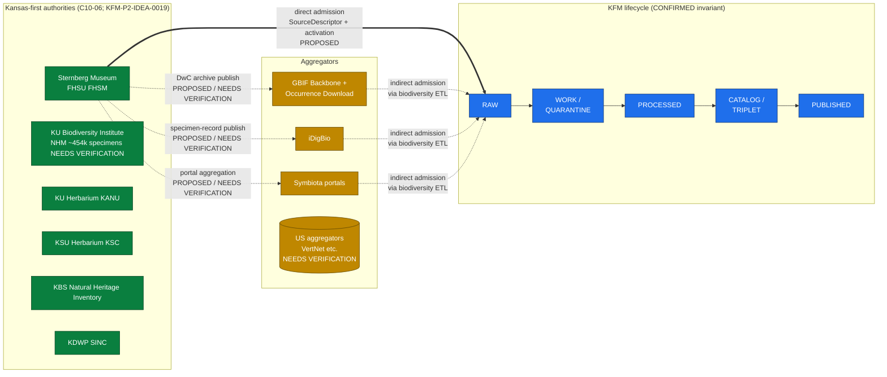
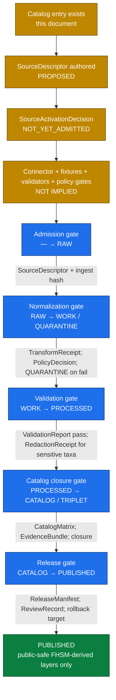

<!-- [KFM_META_BLOCK_V2]
doc_id: kfm://doc/sources/catalog/fhsu-sternberg
title: FHSU Sternberg Museum of Natural History — Source Catalog Entry
type: standard
version: v0.1
status: draft
owners: TODO-biodiversity-source-steward; TODO-paleontology-source-steward; TODO-rights-reviewer
created: 2026-05-20
updated: 2026-05-20
policy_label: public
related:
  - ../README.md
  - ../../doctrine/directory-rules.md
  - ../../doctrine/authority-ladder.md
  - ../../doctrine/truth-posture.md
  - ../../domains/fauna/README.md
  - ../../domains/flora/README.md
  - ../../domains/geology/README.md
  - ../../runbooks/fauna/SOURCE_REFRESH_RUNBOOK.md
  - ../../standards/ISO-19115.md
  - ../../standards/PROV.md
tags:
  - kfm
  - source-catalog
  - biodiversity
  - paleontology
  - fauna
  - flora
  - geology
  - kansas-first
  - C10-06
notes:
  - "Path docs/sources/catalog/fhsu-sternberg.md is PROPOSED. Directory Rules v1.1 §6.1 lists docs/sources/ for 'source-descriptor standards, source families' but does not enumerate a catalog/ subfolder. See §11 Open Questions OQ-FHSM-01."
  - "Doctrine placement of Sternberg in the biodiversity stack is CONFIRMED per C10-06 in the Pass-10 Idea Index. Specific specimen counts, division URLs, and license terms below are EXTERNAL — sourced from the Sternberg Museum's public web pages and cited inline."
  - "All connector, pipeline, schema, policy, fixture, and CI claims below are PROPOSED until verified against a mounted repository."
  - "Rights posture: herpetology collection terms explicitly forbid commercial use and redistribution; this constraint is treated as the floor for all FHSM divisions until per-division terms are individually verified."
[/KFM_META_BLOCK_V2] -->

<a id="top"></a>

# FHSU Sternberg Museum of Natural History — Source Catalog Entry

> Governance-first source descriptor for the Sternberg Museum of Natural History at Fort Hays State University (FHSM), spanning paleontology, vertebrate zoology, paleobotany, and the Elam Bartholomew Herbarium.


| Field | Value |
|---|---|
| **Source family** | Institutional natural-history collection (Kansas-first; in-state collection of record) |
| **Doctrinal anchor** | `CONFIRMED` — Pass-10 C10-06 "Biodiversity Stack… FHSU Sternberg"; supplementary to C10-06 GBIF/iDigBio/Symbiota lanes |
| **Primary KFM domains touched** | `fauna` (zoology), `flora` (Bartholomew Herbarium), `geology` (paleontology/paleobotany) |
| **Status** | `draft` — catalog entry; no admitted connector implied |
| **Owners (placeholder)** | `TODO-biodiversity-source-steward`, `TODO-paleontology-source-steward`, `TODO-rights-reviewer` |
| **Last reviewed** | `2026-05-20` |
| **Implementation maturity** | `UNKNOWN` — repository not mounted in this session |

> [!IMPORTANT]
> **Rights posture floor.** FHSM's Herpetology Division publicly states that its data and images "may be used freely by individuals and organizations for purposes of basic research, education, and conservation" but "may not be used for commercial or for-profit purposes without the express written consent of the Sternberg Museum of Natural History, and may not be repackaged, resold, or redistributed in any form."[EXTERNAL — FHSM Herpetology] The Division of Herpetology specimens, databases, and images are owned and copyrighted by the Sternberg Museum of Natural History or licensed to it. The data and images may be used freely by individuals and organizations for purposes of basic research, education, and conservation. These data and images may not be used for commercial or for-profit purposes without the express written consent of the Sternberg Museum of Natural History, and may not be repackaged, resold, or redistributed in any form.  Until per-division terms are individually verified, **KFM treats this restriction as the floor for all FHSM divisions** and routes any redistributive use through `policy/sensitivity/...` `DENY` by default. See §6.

---

## Quick jump

- [§1. Scope and identity](#1-scope-and-identity)
- [§2. Why this entry exists (doctrinal anchor)](#2-why-this-entry-exists-doctrinal-anchor)
- [§3. Position in the biodiversity stack](#3-position-in-the-biodiversity-stack)
- [§4. Divisions and content surfaces](#4-divisions-and-content-surfaces)
- [§5. Proposed SourceDescriptor surface](#5-proposed-sourcedescriptor-surface)
- [§6. Rights, license, and redistribution posture](#6-rights-license-and-redistribution-posture)
- [§7. Sensitivity register](#7-sensitivity-register)
- [§8. Lifecycle and gate map](#8-lifecycle-and-gate-map)
- [§9. KFM domain routing](#9-kfm-domain-routing)
- [§10. Related sources and crosswalks](#10-related-sources-and-crosswalks)
- [§11. Open questions and verification backlog](#11-open-questions-and-verification-backlog)
- [§12. Related docs](#12-related-docs)
- [Appendix A — External evidence inventory](#appendix-a--external-evidence-inventory)

---

## 1. Scope and identity

`CONFIRMED doctrine / PROPOSED admission posture.` This catalog entry describes **one institutional source** — the Sternberg Museum of Natural History at Fort Hays State University (FHSM) — and the **source-admission constraints** that apply when KFM connectors propose ingest. It is **not** a connector spec, a schema home, a pipeline, or a release manifest. Per Directory Rules, source admission produces a `SourceDescriptor` (and ultimately a `SourceActivationDecision`); this document is the human-facing catalog companion to that descriptor.

| Identity field | Value | Truth label |
|---|---|---|
| `name` | Sternberg Museum of Natural History | `EXTERNAL` The Sternberg Museum of Natural History houses over three million paleontology, zoology, and geology specimens that document life and environments in the Great Plains region of North America.  |
| `parent_institution` | Fort Hays State University (FHSU), Hays, Kansas | `EXTERNAL` |
| `acronym_or_collection_code` | `FHSM` (used by Sternberg divisions for catalog numbers) | `EXTERNAL` The Herpetology Collection at the Sternberg Museum of Natural History, Fort Hays State University (FHSM) contains more than 16,000 recent cataloged specimens.  |
| `public_landing_page` | `https://sternberg.fhsu.edu/` | `EXTERNAL` The Sternberg Museum of Natural History advances an appreciation and understanding of Earth's natural history and the evolutionary forces that impact it.  |
| `proposed_kfm_source_id` | `kfm:source/fhsu-sternberg` | `PROPOSED` (naming convention) |
| `proposed_kfm_collection_code_namespace` | `kfm:institution/FHSM` | `PROPOSED` |
| `corpus_anchor` | Pass-10 C10-06 (biodiversity stack); Pass-23 §8.3.37 KFM-P2-IDEA-0019 (Kansas-specific bio supplements) | `CONFIRMED` |
| `directory_rules_basis` | `docs/sources/` — "source-descriptor standards, source families" (§6.1 illustrative tree) | `CONFIRMED` (anchor); `PROPOSED` (the `catalog/` subfolder is not enumerated — see §11 OQ-FHSM-01) |

> [!NOTE]
> The acronym **FHSM** is used by the museum's own division portals as a specimen prefix (e.g., FHSM herpetology catalog numbers). KFM should treat **FHSM** as the canonical collection-code namespace and **`fhsu-sternberg`** as the source-catalog slug. These are `PROPOSED` until enshrined in a `SourceDescriptor`.

[↑ back to top](#top)

---

## 2. Why this entry exists (doctrinal anchor)

`CONFIRMED.` The KFM Components Pass-10 Idea Index, card **C10-06 — Biodiversity Stack** (status: `CONFIRMED`), enumerates the Sternberg Museum at FHSU as one of the Kansas in-state collections of record alongside the KU Biodiversity Institute Natural History Museum, GBIF, iNaturalist, eBird EBD, NatureServe, USFWS, iDigBio, and Symbiota. The corpus treats Kansas-specific institutional sources as **supplementing** GBIF rather than replacing it: GBIF aggregates internationally, and per Pass-23 KFM-P2-IDEA-0019, the Kansas-first dossiers (KANU, KSC, FHSM, iDigBio, USDA PLANTS) "receive first-class treatment alongside the global aggregator" so that "Kansas-specific sources… makes KFM a Kansas system rather than a general-U.S. system."

| Doctrinal claim | Truth label | Citation |
|---|---|---|
| FHSU Sternberg is part of KFM's biodiversity source set | `CONFIRMED` | Pass-10 C10-06 |
| FHSU Sternberg is a "Kansas-first" authority alongside KANU, KSC, iDigBio, USDA PLANTS | `INFERRED` from Pass-10 C10-06 + Pass-23 KFM-P2-IDEA-0019 | Pass-10; Pass-23 §8.3.37 |
| FHSU Sternberg supplements rather than replaces GBIF | `CONFIRMED` | Pass-23 KFM-P2-IDEA-0018 ("supplements with Kansas-specific institutional sources where GBIF coverage is insufficient") |
| FHSM specimens are also ingestible via GBIF and iDigBio aggregations | `INFERRED` (typical of DwC-publishing US natural-history collections) | `NEEDS VERIFICATION` against the FHSM-by-FHSM GBIF/iDigBio publisher listings |
| FHSM coverage is the in-state collection of record for paleontology in particular | `INFERRED` doctrine — corpus emphasizes paleontology as part of the Sternberg legacy and as a vertebrate/paleobotany authority | C10-06 detail; supported by `EXTERNAL` paleontology context |

[↑ back to top](#top)

---

## 3. Position in the biodiversity stack

The diagram below positions FHSM relative to the rest of the biodiversity stack and the KFM lifecycle. Edges show **admission and aggregation relationships** (PROPOSED), not implemented data flow.



> [!NOTE]
> The dashed edges from FHSM to GBIF/iDigBio/Symbiota represent the **typical** publishing pattern for US natural-history collections and are `NEEDS VERIFICATION` until KFM confirms which FHSM divisions publish to which aggregators, on what cadence, and under which license. Even when an aggregator carries an FHSM specimen, the **authority-of-record remains FHSM**, and KFM source-role labelling must reflect that.

[↑ back to top](#top)

---

## 4. Divisions and content surfaces

`EXTERNAL` content below — sourced from FHSM's public collections pages. Specific counts are point-in-time facts and labelled accordingly.

| Division / collection | Material | Public-facing portal (proposed `PROPOSED` admission target) | Notes / scale | Truth |
|---|---|---|---|---|
| Paleontology (vertebrate + invertebrate) | "invertebrate and vertebrate specimens representing taxonomic diversity from all Phanerozoic time periods" | `https://sternberg.fhsu.edu/research-collections/paleontology/` | Foundational George F. Sternberg collection; NSF digitization grants 1559733 and 1601977 supported data digitization | `EXTERNAL` The paleontology collection includes invertebrate and vertebrate specimens representing taxonomic diversity from all Phanerozoic time periods.  Digitizing and sharing data from this collection has been made possible by National Science Foundation grants award number 1559733 and award number 1601977.  |
| Paleobotany (within Paleontology) | "more than 500,000 fossil plants… the largest collection of fossil grasses in the world" | (same division as paleontology) | Distinctive for fossil-grass coverage relevant to Kansas Great-Plains paleo-floristics | `EXTERNAL` The paleobotany division houses more than 500,000 fossil plants and has the largest collection of fossil grasses in the world.  |
| Zoology — Herpetology | recent specimens (skins, mounts, skeletons, fluid-preserved, tissue) | `https://webapps.fhsu.edu/fhsm-h/` | "more than 16,000 recent cataloged specimens"; restrictive use license stated on the portal | `EXTERNAL` The Herpetology Collection at the Sternberg Museum of Natural History, Fort Hays State University (FHSM) contains more than 16,000 recent cataloged specimens.  |
| Zoology — Mammalogy | "skins, taxidermy mounts, skeletons, fluid-preserved specimens, and a tissue bank" | `https://webapps.fhsu.edu/FHSM-M/` | Specimen counts and license: `NEEDS VERIFICATION` per division | `EXTERNAL` (portal URL); `NEEDS VERIFICATION` (counts) The diverse zoology collection includes skins, taxidermy mounts, skeletons, fluid-preserved specimens, and a tissue bank.  |
| Zoology — additional divisions (entomology, ornithology, ichthyology, etc.) | Per FHSM division pages | Division-specific subpages of `https://sternberg.fhsu.edu/research-collections/` | Existence and exact division inventory: `NEEDS VERIFICATION` against FHSM's current division listing | `NEEDS VERIFICATION` |
| Botany — **Elam Bartholomew Herbarium** | World-known fungal/mycological herbarium developed by Bartholomew | (housed at FHSM; herbarium code / Index Herbariorum acronym: `NEEDS VERIFICATION`) | Maps onto KFM `flora` domain; nomenclature reconciliation per KFM-P2-IDEA-0019 (USDA PLANTS authority) | `EXTERNAL` (presence) The world-famous Elam Bartholomew Herbarium botanical collection was developed as a result of research by mycologist Elam Bartholomew.  |
| **George F. Sternberg Digital Collections** (archival photographs) | "images dating from approximately 1906 through the 1950's" — paleo expeditions, primary-source photos | `https://scholars.fhsu.edu/sternberg_collection/` (FHSU Scholars Repository, not the museum portal) | Distinct from specimen records — these are **archival/photographic** sources; the host is the FHSU Scholars Repository, a separate institutional surface | `EXTERNAL` The George F. Sternberg Digital Collection features images dating from approximately 1906 through the 1950's.  |

> [!TIP]
> The archival photo collection at `scholars.fhsu.edu/sternberg_collection/` is **a different source** than the specimen-record portals at `webapps.fhsu.edu/FHSM-*/`. KFM should treat them as **two distinct `SourceDescriptor` admissions** sharing only the institutional parent — they have different rights, different evidence semantics, and different downstream KFM domains (specimen records → fauna/flora/geology; archival photos → archives/history). See §11 OQ-FHSM-03.

[↑ back to top](#top)

---

## 5. Proposed SourceDescriptor surface

`PROPOSED.` The field surface below operationalizes the KFM `SourceDescriptor` family (defined in the Unified Implementation Architecture Build Manual as "machine-readable source identity, source role, rights, cadence, access, steward, sensitivity, and release posture") and the role-field extensions in the Domains v1.1 + Pass 23/32 Consolidated Atlas §24.1.3. **Field names are PROPOSED and not authoritative;** the canonical schema home defaults to `schemas/contracts/v1/source/source-descriptor.json` per Directory Rules §7.4 and ADR-0001 unless an accepted ADR relocates it (`NEEDS VERIFICATION` against mounted repo).

```yaml
# PROPOSED — not validated against any mounted schema
source_id: kfm:source/fhsu-sternberg
collection_code: FHSM
parent_institution: Fort Hays State University
landing_page: https://sternberg.fhsu.edu/
source_role: observed            # primary role; some divisions act as authority for taxonomic vouchers
role_authority: Sternberg Museum of Natural History, FHSU
sensitivity_label: mixed         # see §7 — paleontology localities and rare-taxa occurrences require generalization
rights:
  license_id: TODO_per_division                   # NEEDS VERIFICATION per division
  redistribution_allowed: false                   # PROPOSED floor — derived from FHSM Herpetology terms
  commercial_use_allowed: false                   # PROPOSED floor — derived from FHSM Herpetology terms
  attribution_required: true
  attribution_text: |
    Sternberg Museum of Natural History, Fort Hays State University.
    (Division-specific attribution required per division terms.)
cadence:
  pattern: irregular-institutional
  notes: |
    NEEDS VERIFICATION — institutional collections grow as specimens are
    accessioned; per-division publishing cadence to GBIF/iDigBio is
    not declared on the public pages reviewed.
access:
  primary:
    - mechanism: division-portal
      url_pattern: https://webapps.fhsu.edu/fhsm-h/        # herpetology
    - mechanism: division-portal
      url_pattern: https://webapps.fhsu.edu/FHSM-M/        # mammalogy
  indirect_aggregators:
    - gbif        # PROPOSED — FHSM publisher status NEEDS VERIFICATION
    - idigbio     # PROPOSED — FHSM publisher status NEEDS VERIFICATION
    - symbiota    # PROPOSED — herbarium portal status NEEDS VERIFICATION
stewards:
  - role: zoological-collections-manager
    name: TODO-name                                # per current FHSM staff page
  - role: paleontology-curator
    name: TODO-name
  - role: KFM-source-steward
    name: TODO-kfm-steward
kfm_domains_touched:
  - fauna           # zoology divisions
  - flora           # Bartholomew Herbarium
  - geology         # paleontology, paleobotany
related_kfm_sources:
  - kfm:source/gbif
  - kfm:source/idigbio
  - kfm:source/symbiota
  - kfm:source/ku-biodiversity-institute-nhm
public_release_class: restricted    # PROPOSED — flows from rights floor
activation_status: NOT_YET_ADMITTED  # PROPOSED — no SourceActivationDecision implied by this catalog entry
```

> [!CAUTION]
> The activation status is **`NOT_YET_ADMITTED`**. This catalog entry is doctrine and reference only. **No connector, watcher, ingest pipeline, schema, or fixture is implied to exist** by this document, and presence in `docs/sources/catalog/` does **not** constitute a `SourceActivationDecision`. Per the Build Manual, activation requires a separate decision recording "allowed, restricted, denied, or needs-review use" alongside connector/fixture/validator/policy-gate readiness.

[↑ back to top](#top)

---

## 6. Rights, license, and redistribution posture

`EXTERNAL` evidence — `PROPOSED` KFM posture.

The FHSM Herpetology Division's public terms are the **most explicit per-division license language reviewed in this session** and serve as the **floor** for the catalog entry until each division's terms are individually verified:

> **FHSM Herpetology stated terms (paraphrased per copyright):** specimens, databases, and images are owned and copyrighted by Sternberg or licensed to it; freely usable for basic research, education, and conservation; **commercial or for-profit use requires express written consent**; and they **may not be repackaged, resold, or redistributed in any form**.The Division of Herpetology specimens, databases, and images are owned and copyrighted by the Sternberg Museum of Natural History or licensed to it. The data and images may be used freely by individuals and organizations for purposes of basic research, education, and conservation. These data and images may not be used for commercial or for-profit purposes without the express written consent of the Sternberg Museum of Natural History, and may not be repackaged, resold, or redistributed in any form. 

### 6.1 KFM consequences of the rights floor

| KFM action | Default posture | Required artifacts |
|---|---|---|
| Ingest into `data/raw/<domain>/<source_id>/<run_id>/` | `PROPOSED` allowed under research-and-education clause, but only after a `SourceActivationDecision` records the per-division license | `SourceDescriptor` with rights fields; ingest receipt |
| Publish FHSM data as a downloadable KFM-derived dataset (DwC-A re-publish, GeoParquet, etc.) | `DENY` by default — collides with the no-redistribution clause | A `PolicyDecision` denying public republish; route to `restricted` release class |
| Display individual specimen records in a KFM evidence drawer with attribution | `ABSTAIN` until per-division terms reviewed; then `PROPOSED` allowed for the research/education clause with attribution | Citation in EvidenceBundle; attribution string in `SourceDescriptor.rights.attribution_text` |
| Use FHSM images in KFM Story Nodes, reports, or public maps | `DENY` by default; case-by-case with steward review | `RedactionReceipt` if generalized; `ReviewRecord` + steward signoff |
| Derive aggregate or generalized public layers (e.g., taxon-by-county heatmaps) | `PROPOSED` — likely allowed under the research clause provided no individual specimen images or full records are redistributed | `AggregationReceipt`; `PolicyDecision` |
| Commercial / for-profit derivation of any kind | `DENY` outright; correction note required if accidentally exposed | `PolicyDecision: deny` + `CorrectionNotice` (post-hoc) |

> [!IMPORTANT]
> The FHSM Herpetology terms apply to **the herpetology division as cited**. Other divisions (Mammalogy, Paleontology, Paleobotany, Bartholomew Herbarium, archival photo collection) **MUST** have their own per-division terms separately verified. The default of "no commercial; no redistribution" is the **most restrictive applicable row** posture per the KFM sensitive-domain matrix and is preserved until evidence narrows it. See §11 OQ-FHSM-04.

### 6.2 Distinct rights surface for the archival photo collection

The George F. Sternberg Digital Collection (hosted at FHSU Scholars Repository, not the museum portal) carries its own content-disclaimer language:

> **FHSU Scholars Repository disclaimer (paraphrased per copyright):** primary-source materials in FHSU Special Collections and Archives are placed for research, preservation, and historical-reflection purposes; some items "may be sensitive in nature and may not represent the attitudes, beliefs, or ideas of their creators, persons named in the collections, or the position of Fort Hays State University."The primary source materials contained in the Fort Hays State University Special Collections and Archives have been placed there for research purposes, preservation of the historical record, and as reflections of a past belonging to all members of society. Because this material reflects the expressions of an ongoing culture, some items in the collections may be sensitive in nature and may not represent the attitudes, beliefs, or ideas of their creators, persons named in the collections, or the position of Fort Hays State University. 

This is **content-context language**, not a license. The repository's specific reuse license (e.g., rights statement, public-domain mark, or CC) is `NEEDS VERIFICATION` per item.

[↑ back to top](#top)

---

## 7. Sensitivity register

FHSM is the **only** KFM-cataloged source reviewed in this session that touches all three of: rare-species occurrences (zoology), paleontology fossil localities (sensitive to looting per the corpus's archaeology-adjacent reasoning), and primary-source archival imagery (potentially carrying culturally sensitive content). The deny-by-default register applies at the join of those domains.

| Sensitive surface | Source within FHSM | Default disposition | Required transform before any public release | Citation |
|---|---|---|---|---|
| Rare/protected species occurrences (zoology) | Herpetology, Mammalogy, Ornithology, Ichthyology (where present) | `DENY` exact coordinates by default | Geometry generalization (county or coarser); `RedactionReceipt`; review against NatureServe / KDWP SINC ranks | Pass-23 KFM-P17-PROG-0027 "sensitive species public geometry rule"; ai-build-operating-contract.md §23.2 |
| Paleontology / fossil locality precise coordinates | Paleontology, Paleobotany | `DENY` exact coordinates by default (looting risk; analogous to archaeology) | Generalize to county or formation outcrop; require curator review | `INFERRED` from Atlas §24 deny-by-default register (Archaeology-adjacent rationale); `NEEDS VERIFICATION` as explicit corpus rule for FHSM paleo |
| Specimen images / division portals (republish) | All zoology divisions; assumed for paleontology | `DENY` republish/redistribute by default | `PolicyDecision: deny`; steward review for case-by-case exceptions; attribution-only inline | FHSM Herpetology terms (see §6) |
| Archival photographs (Sternberg Digital Collection) | FHSU Scholars Repository — Sternberg Digital Collection | `ABSTAIN` until per-item rights reviewed | Per-item license check; cultural-context review where the disclaimer flags potential sensitivity | FHSU Scholars Repository disclaimer (see §6.2) |
| Joins from FHSM occurrence to private-land parcels | Cross-source join (FHSM + People/Land) | `DENY` — private-land joins are denied at the trust membrane | `RedactionReceipt`; private-parcel-join policy gate | Pass-23 §16 sensitivity matrix (private-land assertions) |

> [!WARNING]
> A fossil locality is **not the same as a biodiversity occurrence**. KFM's deny-by-default register for sensitive geometry was written primarily for living species and archaeology; the corpus does **not** make fossil-locality protection explicit. This catalog entry **treats fossil localities under the most restrictive applicable row** until a domain steward or ADR resolves the question. See §11 OQ-FHSM-05.

[↑ back to top](#top)

---

## 8. Lifecycle and gate map

The FHSM source descriptor passes through the same RAW → PUBLISHED gate sequence as every other admitted source. Nothing in this catalog entry shortcuts the invariant.



| Phase | What FHSM material looks like | Permitted | Forbidden |
|---|---|---|---|
| `data/raw/<domain>/fhsu-sternberg/<run_id>/` | Untransformed division-portal exports or aggregator slices | Immutable storage with retrieval metadata, hash, source time | Direct public access; AI context |
| `data/quarantine/<domain>/fhsu-sternberg/...` | Records with unresolved rights, missing license, over-precise sensitive geometry | Disposition pending steward review | Promotion without remediation |
| `data/work/<domain>/fhsu-sternberg/...` | Normalized DwC fields; coordinate-generalized variants for sensitive taxa | Candidate canonical records | Public surfaces |
| `data/processed/<domain>/fhsu-sternberg/...` | Validated, license-mapped, sensitivity-redacted records | Reference by `EvidenceBundle` | Assumed public/release status |
| `data/catalog/domain/<domain>/...` | STAC × DwC catalog records with `properties.taxon` block (per Pass-10 C4-03) | Cited claims, closed identifiers | Uncited / unclosed |
| `data/published/layers/<domain>/...` | Only **generalized, aggregate, attributed, non-redistributive** derivatives | Public-safe outputs | Raw record dumps; full image republish |

[↑ back to top](#top)

---

## 9. KFM domain routing

`PROPOSED.` FHSM is unusual in that it spans three KFM responsibility-root domain lanes simultaneously. The routing below allocates source-derived material to the responsibility-root that owns it, without creating a new `fhsm/` domain folder.

| FHSM division | Material | Primary KFM domain | Secondary touches | Notes |
|---|---|---|---|---|
| Herpetology, Mammalogy, Ornithology, Ichthyology, Entomology, etc. | Modern animal specimens, observations | `fauna` | `habitat` (occurrence-to-habitat join) | Subject to sensitive-species generalization (§7) |
| Paleontology (vertebrate + invertebrate) | Fossil specimens (Phanerozoic) | `geology` (stratigraphic / fossil-locality context) | `fauna` for trait/morphology evidence; `flora` for paleobotany | Locality protection per §7 |
| Paleobotany | Fossil plants (incl. world's largest fossil-grass collection) | `geology` (paleobotanical stratigraphy) | `flora` for nomenclature crosswalk | Locality protection per §7 |
| Elam Bartholomew Herbarium | Fungal / mycological specimens (botanical herbarium) | `flora` | `habitat`; `agriculture` (mycology cross-cuts) | Nomenclature reconciliation against USDA PLANTS per KFM-P2-IDEA-0019 |
| George F. Sternberg Digital Collection | Archival photographs (paleo expeditions, FHSU history) | **Distinct source** — not the museum specimen source | `archaeology`-adjacent for historical context; `people-dna-land` for named individuals in photos | Different host, different rights; should be a separate `SourceDescriptor` (see §11 OQ-FHSM-03) |

> [!NOTE]
> Per Directory Rules §11 (Multi-domain and cross-cutting files), FHSM-derived material **MUST NOT** create a new `fhsm/` or `sternberg/` root-level domain folder. Records belong under their **responsibility-root domain lane** (`fauna/`, `flora/`, or `geology/`), with `source_id = kfm:source/fhsu-sternberg` carried in the record itself.

[↑ back to top](#top)

---

## 10. Related sources and crosswalks

| Related KFM source | Relationship | Cross-source rule |
|---|---|---|
| `kfm:source/gbif` | FHSM may publish DwC-A to GBIF (`NEEDS VERIFICATION`) | Per KFM-P2-PROG-0001 biodiversity ETL: deduplicate by `(institutionCode, catalogNumber)` with rounded-coordinate fallback; **FHSM remains the authority-of-record** even when an occurrence is also in GBIF |
| `kfm:source/idigbio` | FHSM specimen records likely flow through iDigBio (`NEEDS VERIFICATION`) | Same dedup rule; preserve FHSM provenance |
| `kfm:source/symbiota` | Herbarium / portal aggregation likely path for the Bartholomew Herbarium (`NEEDS VERIFICATION`) | Crosswalk `kbs_id` / institution code; preserve attribution |
| `kfm:source/ku-biodiversity-institute-nhm` | Companion in-state collection (KU NHM ~454k specimens — `NEEDS VERIFICATION` per Pass-10 §9.5) | Sibling Kansas-first authority; KFM should ingest both rather than pick a winner |
| `kfm:source/usda-plants` | Nomenclature authority (KFM-P2-IDEA-0019) | Bartholomew Herbarium plant-name reconciliation routes through USDA PLANTS |
| `kfm:source/kdwp-sinc` | Sensitivity ranking authority | Drives generalization decisions for rare-taxa occurrences |
| `kfm:source/natureserve` | Conservation-status ranking | Same as KDWP SINC; both consulted at sensitivity gate |
| `kfm:source/fhsu-scholars-sternberg-digital` (PROPOSED separate source) | The archival photo collection | Distinct admission; see §11 OQ-FHSM-03 |

[↑ back to top](#top)

---

## 11. Open questions and verification backlog

| ID | Question | Why it matters | Evidence that would settle it | Status |
|---|---|---|---|---|
| OQ-FHSM-01 | Is `docs/sources/catalog/` the right subfolder under `docs/sources/`, or does the repo use a flat `docs/sources/<slug>.md` convention? | Directory Rules §6.1 lists `docs/sources/` but does not enumerate a `catalog/` subfolder. Could become a §13.x drift pattern if mismatched. | Mounted repo inspection; per-root `docs/sources/README.md` if present; ADR | `NEEDS VERIFICATION` |
| OQ-FHSM-02 | Does the canonical schema home `schemas/contracts/v1/source/source-descriptor.json` exist, and do the field names in §5 match? | Determines whether the PROPOSED descriptor in §5 maps cleanly or needs renaming | Mounted-repo schema file inspection; ADR-0001 | `NEEDS VERIFICATION` |
| OQ-FHSM-03 | Should the George F. Sternberg Digital Collection be a **distinct** KFM source (`kfm:source/fhsu-scholars-sternberg-digital`) from the specimen source? | Different host (FHSU Scholars Repository), different rights surface, different downstream domain (archives vs biodiversity) | Steward decision; or ADR if it crosses domain boundaries | `PROPOSED` answer: YES, separate. `NEEDS VERIFICATION` formally. |
| OQ-FHSM-04 | What are the per-division license terms for Mammalogy, Paleontology, Paleobotany, and the Bartholomew Herbarium? | The Herpetology terms cited in §6 are the **only** division-specific terms reviewed. Other divisions may be more or less permissive. | Direct review of each division's portal terms page; correspondence with the FHSM Collections Manager | `NEEDS VERIFICATION` |
| OQ-FHSM-05 | Are fossil localities (paleo / paleobotany) covered by KFM's deny-by-default sensitive-geometry rule, or do they need a domain-specific rule? | The corpus's deny-by-default register names archaeology and rare-species explicitly; fossil localities are not explicit. Looting risk argues for analogous protection. | Steward decision; ADR; geology / paleontology dossier amendment | `OPEN` (steward review) |
| OQ-FHSM-06 | Does FHSM publish DwC-A to GBIF, iDigBio, and/or Symbiota — for which divisions, on what cadence, under which license? | Determines whether `kfm:source/fhsu-sternberg` should be admitted **directly** (preferred), **via aggregator**, or **both** with cross-source dedup | Lookup against GBIF and iDigBio publisher listings; per-division publishing statements | `NEEDS VERIFICATION` |
| OQ-FHSM-07 | What is the Bartholomew Herbarium's Index Herbariorum acronym and FHSM internal namespacing? | Required for nomenclature crosswalks against USDA PLANTS, Symbiota, and GBIF | Index Herbariorum lookup; FHSM Botany division page (existence and identifier `NEEDS VERIFICATION`) | `NEEDS VERIFICATION` |
| OQ-FHSM-08 | Should KFM model the multi-domain FHSM source with a **single** `SourceDescriptor` and per-division sub-descriptors, or with **one descriptor per division**? | Affects schema design, policy granularity, and how rights/sensitivity vary across divisions | ADR or schema PR | `PROPOSED` answer: one parent descriptor + per-division child records; `NEEDS VERIFICATION` |

[↑ back to top](#top)

---

## 12. Related docs

- `../README.md` — `docs/sources/` index (existence `NEEDS VERIFICATION`)
- `../../doctrine/directory-rules.md` — placement law (§6.1, §11)
- `../../doctrine/authority-ladder.md` — Kansas-first authority posture
- `../../doctrine/truth-posture.md` — cite-or-abstain rule and truth labels
- `../../domains/fauna/README.md` — fauna domain dossier (zoology routing)
- `../../domains/flora/README.md` — flora domain dossier (Bartholomew Herbarium routing)
- `../../domains/geology/README.md` — geology domain dossier (paleontology / paleobotany routing)
- `../../runbooks/fauna/SOURCE_REFRESH_RUNBOOK.md` — operational refresh runbook (CONFIRMED authored prior session; placement subject to OPEN-DR-02)
- `../../standards/ISO-19115.md` — metadata profile for source-level descriptions
- `../../standards/PROV.md` — provenance vocabulary for `SourceDescriptor` → `EvidenceBundle` lineage
- `../../adr/ADR-0001-schema-home.md` — schema-home authority for the `SourceDescriptor` JSON Schema location
- Pass-10 Idea Index — **C10-06** biodiversity stack card (doctrinal anchor for this entry)
- Pass-23/32 Consolidated Atlas — **§24.1.3** source-role descriptor fields; **§24.2.1** receipt family catalog; **KFM-P17-PROG-0027** sensitive species public geometry rule

---

## Appendix A — External evidence inventory

<details>
<summary>Click to expand the external sources consulted for this catalog entry</summary>

All entries below are `EXTERNAL` and are referenced inline in the body of this document. KFM doctrine is **not** derived from these sources; they inform only the descriptive facts about FHSM as an external institution.

| URL | Used for | Date observed |
|---|---|---|
| `https://sternberg.fhsu.edu/` | Museum identity, mission statement | 2026-05-20 |
| `https://sternberg.fhsu.edu/research-collections/` | Specimen-count claim (~3 million); divisions; paleobotany scale | 2026-05-20 |
| `https://sternberg.fhsu.edu/research-collections/paleontology/index.html` | Paleontology division history; NSF digitization grant numbers | 2026-05-20 |
| `https://webapps.fhsu.edu/fhsm-h/` | Herpetology portal; cataloged-specimen count; **license terms** | 2026-05-20 |
| `https://webapps.fhsu.edu/FHSM-M/history.aspx` | Mammalogy portal existence | 2026-05-20 |
| `https://scholars.fhsu.edu/sternberg_collection/` | George F. Sternberg Digital Collection; FHSU Scholars Repository content disclaimer | 2026-05-20 |

**External research triggers (per the doc contract):** institutional URL patterns and current portal hosts are version-sensitive and external (trigger: "current syntax or behavior of external tools the doc must describe accurately"); per-division license language is operationally current security/rights material (trigger: "security-relevant or operationally current facts"). No external research was used to make KFM-doctrine or KFM-repo-state claims.

</details>

<details>
<summary>Click to expand the corpus evidence used for this entry</summary>

| Corpus source | Section / card | What it grounds |
|---|---|---|
| KFM Components Pass-10 Idea Index | **C10-06** Biodiversity Stack (status: CONFIRMED) | FHSU Sternberg's inclusion in KFM's biodiversity sources |
| Pass-10 Idea Index | **C10-06 detail** | "KU and Sternberg are the in-state collections of record" |
| Pass-10 Idea Index | **C4-03** STAC × Darwin Core hybrid | Catalog encoding for biodiversity occurrences sourced from FHSM-via-aggregator |
| Pass-23/32 Consolidated Atlas | **§24.1.3** | `source_role` field, `role_authority`, related descriptor surface |
| Pass-23/32 Consolidated Atlas | **§24.2.1** | `SourceDescriptor` as the anchor of the receipt family |
| Pass-23/32 Consolidated Atlas | **KFM-P2-IDEA-0019** | Kansas-first biodiversity authorities supplement GBIF |
| Pass-23/32 Consolidated Atlas | **KFM-P2-IDEA-0018** | GBIF as canonical aggregator; institutional sources supplement |
| Pass-23/32 Consolidated Atlas | **KFM-P2-PROG-0001** | Biodiversity ETL recipe (dedup, license-map, sensitivity-redact) |
| Pass-23/32 Consolidated Atlas | **KFM-P17-PROG-0027** | Sensitive species public geometry rule |
| Pass-23/32 Consolidated Atlas | **KFM-P17-PROG-0026** | Biodiversity source cadence matrix |
| Pass-23/32 Consolidated Atlas | **§20.5** Deny-by-Default Register | Per-domain default disposition for sensitive geometry |
| Unified Implementation Architecture Build Manual | **§3.6** Source registry architecture | Source admission flow; `SourceActivationDecision`; rights/sensitivity/cadence/steward fields |
| `ai-build-operating-contract.md` | **§23** Sensitive-domain decision matrix | Per-domain defaults; required reviewers; required receipts |
| `directory-rules.md` | **§6.1** | `docs/sources/` is "source-descriptor standards, source families" |
| `directory-rules.md` | **§7.4** + ADR-0001 | Schema-home convention `schemas/contracts/v1/...` |
| `directory-rules.md` | **§11** | Multi-domain and cross-cutting placement rules |

</details>

---

> **Last reviewed:** 2026-05-20 · **Status:** draft · **Maturity:** catalog entry only; no activation implied.
>
> **Related docs:** [`../README.md`](../../README.md) · [`../../doctrine/directory-rules.md`](../../../doctrine/directory-rules.md) · [`../../domains/fauna/README.md`](../../../domains/fauna/README.md) · [`../../domains/flora/README.md`](../../../domains/flora/README.md) · [`../../domains/geology/README.md`](../../../domains/geology/README.md)
>
> [↑ back to top](#top)
