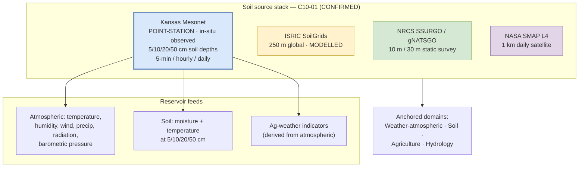

<!-- [KFM_META_BLOCK_V2]
doc_id: kfm://doc/docs-sources-catalog-kansas-kansas-mesonet
title: Kansas Mesonet
type: product-page
version: v0.2
status: draft
owners: <PLACEHOLDER — Docs steward + Source steward for kansas>
created: 2026-05-21
updated: 2026-05-21
policy_label: public
related:
  - docs/sources/catalog/kansas/README.md
  - docs/sources/catalog/README.md
  - docs/sources/catalog/IDENTITY.md
  - docs/sources/catalog/PROFILES.md
  - docs/sources/catalog/RIGHTS-AND-SENSITIVITY-MAP.md
  - docs/sources/catalog/OPEN-QUESTIONS.md
  - docs/sources/catalog/_examples/stac-item-example.json
  - docs/sources/catalog/_template/SOURCE_PRODUCT_TEMPLATE.md
  - docs/doctrine/directory-rules.md
  - docs/domains/soil/README.md
  - docs/domains/agriculture/README.md
  - docs/domains/weather-atmospheric/README.md
  - docs/domains/hydrology/README.md
  - docs/standards/SENSITIVITY_RUBRIC.md
  - docs/registers/VERIFICATION_BACKLOG.md
  - schemas/contracts/v1/source/source_descriptor.schema.json
  - schemas/contracts/v1/sensors/station_health.schema.json
  - connectors/kansas/
  - data/registry/sources/
  - policy/sensitivity/
  - policy/rights/
tags: [kfm, docs, sources, catalog, kansas, kansas-mesonet, in-situ-observed, soil-moisture, weather-atmospheric, agriculture]
notes:
  - >-
    Product-page scope: this doc covers ONE product within the Kansas state
    source family — the Kansas Mesonet sub-hourly station network. Operated by
    Kansas State University (operator identity to be confirmed in descriptor).
    Listed in the kansas family README v0.2 §3 "Known Kansas sources without
    product pages yet" — this v0.2 revision creates the page.
  - >-
    Description grounded in atlas idea cards `KFM-P2-IDEA-0023` (SMAP L4 vs
    Kansas Mesonet contrast — both ingested with native temporal resolution
    preserved), `KFM-P23-PROG-0039` (Mesonet soil-moisture watcher descriptor —
    station lists, variable support, 5-minute / hourly / daily cadence,
    freshness headers), `KFM-P21-PROG-0006` (station-health probe MUST produce
    `station_health` metadata before downstream analytics use the feed),
    `KFM-P2-IDEA-0024` (Kansas authorities), `KFM-P2-PROG-0017` (waterbody
    crosswalks: NHDPlus + NWIS + KGS + Kansas Mesonet), and Pass-10 `C10-01`
    (Kansas soil stack — Mesonet sensors at 5/10/20/50 cm depths).
  - >-
    Path correction (v0.1 → v0.2): the v0.1 scaffold referenced
    `connectors/kansas-mesonet/` as a top-level connector family. That is
    incorrect — `kansas-mesonet/` is NOT one of the nine canonical
    `directory-rules.md` v1.2 §7.3 families. The Mesonet adapter belongs under
    the CONFIRMED `connectors/kansas/` lane as `connectors/kansas/kansas-mesonet/`.
    Surfaced as OPEN-MESO-01.
  - >-
    Rights floor: "admission requires written consent from the network operator"
    per the v0.1 scaffold subtitle. Until per-product license terms are reviewed
    against current Kansas Mesonet terms-of-use, KFM treats this as a runtime
    gate — unknown rights default to DENY.
[/KFM_META_BLOCK_V2] -->

# Kansas Mesonet

> The Kansas Mesonet sub-hourly station network — **in-situ, point-station observed** atmospheric and soil observations for Kansas, with **native temporal resolution preserved** (5-minute / hourly / daily) per CONFIRMED doctrine `KFM-P2-IDEA-0023` and `KFM-P23-PROG-0039`.

<!-- Badge row — Shields.io placeholders; replace targets once owners/CI/policies land -->


-success)


| Status | Owners | Last reviewed |
|---|---|---|
| Draft — PROPOSED scaffold, no admission decision; operator consent NEEDS VERIFICATION | `<Docs steward + Source steward for kansas — TODO assign>` | 2026-05-21 |

> [!IMPORTANT]
> **Observed, not modelled.** Kansas Mesonet is `source_role = observed` (Atlas §24.1.3): real-time, in-situ sensor data at known point-station locations. **Native temporal resolution preserved** per `KFM-P2-IDEA-0023` (5-minute / hourly / daily — CONFIRMED). Per `KFM-P21-PROG-0006`, Mesonet feeds **MUST produce `station_health` metadata before downstream analytics use them**. Treating Mesonet point observations as a gridded surface — or silently merging with SMAP L4 / SoilGrids modelled grids — is a source-role collapse and resolution-mismatch violation.

> [!CAUTION]
> **Operator consent floor.** Per the v0.1 scaffold subtitle, admission requires **written consent from the network operator** (Kansas Mesonet, Kansas State University — operator identity to be confirmed in the `SourceDescriptor`). Until the consent record is captured in the descriptor's `rights` block, KFM treats this as a runtime gate — unknown rights default to DENY (`KFM-P6-PROG-0001` posture).

---

## Quick jump

- [1. Overview](#1-overview)
- [2. Product identity & scope](#2-product-identity--scope)
- [3. Source authority](#3-source-authority)
- [4. Admission posture — in-situ observed source](#4-admission-posture--in-situ-observed-source)
- [5. Catalog profiles used](#5-catalog-profiles-used)
- [6. Collection identity](#6-collection-identity)
- [7. Provenance fields (`kfm:provenance` + `station_health`)](#7-provenance-fields-kfmprovenance--station_health)
- [8. Temporal handling](#8-temporal-handling)
- [9. Geometry, projection, and station structure](#9-geometry-projection-and-station-structure)
- [10. Rights and sensitivity](#10-rights-and-sensitivity)
- [11. Validation and catalog closure](#11-validation-and-catalog-closure)
- [12. Path correction (v0.1 → v0.2)](#12-path-correction-v01--v02)
- [13. Related contracts and schemas](#13-related-contracts-and-schemas)
- [14. Related connectors and pipelines](#14-related-connectors-and-pipelines)
- [15. Examples](#15-examples)
- [16. Open questions](#16-open-questions)
- [17. Verification backlog](#17-verification-backlog)
- [Appendix A — Illustrative STAC point-station Item skeleton](#appendix-a--illustrative-stac-point-station-item-skeleton)

---

## 1. Overview

The Kansas Mesonet is a **point-station sensor network** operated by Kansas State University that provides real-time **in-situ atmospheric and soil observations for Kansas** (CONFIRMED per `KFM-P2-IDEA-0023`). Within the KFM soil stack (`C10-01`), Mesonet is the **station-level ground-truth** layer at 5/10/20/50-centimeter depths, complementary to NASA SMAP L4 (1 km satellite-derived), ISRIC SoilGrids (250 m global ML-modelled), and NRCS SSURGO/gNATSGO (10 m / 30 m static survey).

> [!NOTE]
> **What this page is:** the product-page surface for the Kansas Mesonet station network — its admission posture (observed in-situ), native-temporal-resolution rule, `station_health` precondition, point-station catalog encoding, and consent-from-operator rights floor. It points at the authoritative `SourceDescriptor` rather than restating it.
> **What it is not:** the kansas family landing page (see [`./README.md`](./README.md)), a connector spec, or a release manifest.

**CONFIRMED facts** (Pass-10 `C10-01`, idea cards `KFM-P2-IDEA-0023`, `KFM-P23-PROG-0039`, `KFM-P21-PROG-0006`):

| Attribute | Value | Citation |
|---|---|---|
| Coverage | Kansas (in-state) | `KFM-P2-IDEA-0023` |
| Production method | **In-situ sensor observations** (point stations) | `KFM-P2-IDEA-0023` |
| Soil-moisture sensor depths | **5 / 10 / 20 / 50 cm** | `C10-01` Soil Stack |
| Native temporal cadences | **5-minute / hourly / daily** (preserved) | `KFM-P23-PROG-0039`; `KFM-P2-IDEA-0023` |
| Required pre-analytics metadata | **`station_health`** must be produced before downstream analytics use the feed | `KFM-P21-PROG-0006` |
| KFM lane role | Station-level ground-truth in the multi-source soil stack; in-situ atmospheric authority for Kansas | `KFM-P2-IDEA-0023` |
| Waterbody crosswalk membership | Part of NHDPlus + NWIS + KGS + Kansas Mesonet waterbody crosswalk | `KFM-P2-PROG-0017` |

[Back to top](#quick-jump)

---

## 2. Product identity & scope



| Field | Value | Status |
|---|---|---|
| Product slug | `kansas-mesonet` | PROPOSED file slug |
| Source family | `kansas/` — CONFIRMED §7.3 canonical at commit `b6a27916bbb9e07cbf3752870c867476e1e094e7` | CONFIRMED family lane |
| Operator | Kansas Mesonet, Kansas State University (operator identity in descriptor: NEEDS VERIFICATION — likely K-State Climate Office / Department of Agronomy) | INFERRED organization; PROPOSED descriptor value |
| Coverage | Kansas | CONFIRMED — `KFM-P2-IDEA-0023` |
| Soil depths | 5 / 10 / 20 / 50 cm | CONFIRMED — `C10-01` |
| Cadences | 5-minute / hourly / daily (native, preserved) | CONFIRMED — `KFM-P23-PROG-0039`, `KFM-P2-IDEA-0023` |
| KFM `source_role` | `observed` | PROPOSED per Atlas §24.1.3 source-role enum (in-situ sensor = observed) |
| Anchor domains | Weather-atmospheric · Soil (`station_soil_moisture` term) · Agriculture · Hydrology | CONFIRMED per Domains Atlas §soil + `C10-01` + `KFM-P2-PROG-0017` |

> [!TIP]
> **`source_role: observed` matters** (Atlas §24.1.3, CONFIRMED). Mesonet is **in-situ** — physical sensors at known point locations. It is **not** `modeled` (that's SoilGrids), not `aggregate` (that's SMAP L4's grid summary), and not `regulatory` (that's KDWP listings). An AI summary that promotes Mesonet point data to "gridded surface" or treats it as interchangeable with SMAP L4 is a source-role collapse — a governance violation per Atlas §24.1.3.

[Back to top](#quick-jump)

---

## 3. Source authority

See [`data/registry/sources/`](../../../../data/registry/sources/) for the authoritative `SourceDescriptor`. **Do not duplicate descriptor fields here.**

For the source-family-level reading (Kansas authorities, parallel-anchor rule, non-API sources tolerance), see the sibling family README [`./README.md`](./README.md).

> [!IMPORTANT]
> Product pages **cite** authority; they do not **own** it. The descriptor is the source of truth for operator identity, written-consent record, rights, sensitivity, cadence, and citation. The schema (per ADR-0001 default home `schemas/contracts/v1/source/source_descriptor.schema.json`) is the source of truth for descriptor shape.

[Back to top](#quick-jump)

---

## 4. Admission posture — in-situ observed source

Kansas Mesonet is the canonical KFM example of a **point-station in-situ observed** source. The Atlas §24.1.3 source-role enum and rule set apply unmodified:

| Rule (CONFIRMED doctrine) | Effect for Kansas Mesonet |
|---|---|
| `source_role` is set at admission and **never edited in place**; corrections produce a new descriptor + `CorrectionNotice` | One descriptor per Mesonet network admission; per-station updates flow through the connector, not the descriptor |
| When `source_role = observed`, the descriptor records observation method, instrument metadata, and uncertainty per measurement | Descriptor MUST record sensor types, depths, units, calibration cadence, and any documented uncertainty/QC flags from the network |
| Source-role anti-collapse: role cannot be inferred by AI or upgraded for convenience | An AI summary that calls a Mesonet point-reading "the Kansas soil moisture at 30 m" is a source-role collapse |
| **Pre-analytics `station_health` MUST be produced** (PROPOSED per `KFM-P21-PROG-0006`) | The Mesonet adapter MUST emit `station_health` metadata (sensor up/down, last-seen, QC state) before any downstream analytics consume the feed |
| **Native temporal resolution preserved** (CONFIRMED per `KFM-P2-IDEA-0023`) | 5-min / hourly / daily feeds are kept as-is; aggregation to coarser intervals requires a `TransformReceipt` |
| Operator consent floor | Admission requires the operator's written-consent record in the descriptor's `rights` block (preserved from v0.1 scaffold subtitle) |

> [!WARNING]
> **Resolution-mismatch warning** (CONFIRMED, `C10-01`). Cross-source queries that mix **10 m SSURGO**, **30 m gNATSGO**, **250 m SoilGrids**, **1 km SMAP L4**, and **point-station Kansas Mesonet** require explicit reprojection or aggregation. The corpus warns against **silent resampling**. `KFM-P2-IDEA-0023` is explicit that SMAP L4 and Mesonet "should not be silently merged but should be available as parallel sources with explicit cross-referencing." Any derived KFM product that mixes Mesonet with the gridded soil sources MUST tag the derived value with source resolution (point vs grid) and the cross-reference method.

[Back to top](#quick-jump)

---

## 5. Catalog profiles used

> [!NOTE]
> Kansas Mesonet is a **point-station time-series** product, not biodiversity occurrences (the STAC × DwC hybrid `C4-03` does NOT apply) and not a gridded raster (the SoilGrids STAC `raster` extension does NOT apply directly). The relevant STAC extensions are **`proj`** (for the WGS84 / UTM CRS of station coordinates) and KFM **`kfm:provenance`**; time-series content is carried via STAC Item `datetime` ranges or per-Item snapshots with `kfm:source.cadence` metadata.

| Profile | Lane | Used by this product? | Citation |
|---|---|---|---|
| STAC Item (point geometry + datetime / datetime range) | `data/catalog/stac/` | **Yes (PROPOSED)** — natural fit for point-station time-series | `C4-01`, `C4-02` |
| STAC `proj` extension | inside STAC Item | **Yes (PROPOSED)** — station CRS, bbox per network | `KFM-P27-PROG-0011` |
| STAC × Darwin Core hybrid | — | **No** — DwC scoped to biodiversity occurrences | `C4-03` (scoped) |
| STAC `raster` extension | — | **No** — Mesonet is point, not gridded | external STAC convention |
| DCAT distribution | `data/catalog/dcat/` | **Yes (PROPOSED)** — dataset-level metadata for non-spatiotemporal time-series tables | `C4-05` |
| PROV-O | `data/catalog/prov/` | **Yes (PROPOSED)** — instrument-to-reading provenance trail | `C8-03`, `C5-08` |
| Domain projection | `data/catalog/domain/{weather-atmospheric,soil,agriculture,hydrology}/` | **Yes (PROPOSED)** — per measurement type | Directory Rules §6.1 |
| `kfm:care` extension | catalog | **Not expected** — point-station atmospheric/soil observations are non-sensitive at family level | `C15-02` |

[Back to top](#quick-jump)

---

## 6. Collection identity

- **PROPOSED Collection id pattern:** `kfm-<org>-kansas-mesonet` (network-level Collection) or `kfm-<org>-kansas-mesonet-<measurement-type>` (per atmospheric / soil-moisture / ag-weather) per `C4-02`. Renaming a Collection breaks links.
- **PROPOSED namespace:** `kfm:` — see **OPEN-DSC-03**; the `kfm:` vs `ks-kfm:` choice is unsettled per `C4-01`. The Kansas family is the most plausible argument **for** `ks-kfm:`.
- **Asset roles** (PROPOSED, per-station layout):

| Asset key | Role | Content |
|---|---|---|
| `observations` | `data` | Time-series readings (CSV / Parquet) keyed by `(station_id, datetime, variable)` |
| `station_metadata` | `metadata` | Station coordinates, elevation, instrumentation manifest, calibration history |
| `station_health` | `metadata` | `station_health` snapshot per `KFM-P21-PROG-0006` (sensor up/down, last-seen, QC) |
| `evidence_bundle` | `metadata` | KFM evidence bundle JSON-LD |
| `operator_consent` | `metadata` | Written-consent record per operator-consent floor |

NEEDS VERIFICATION — confirm exact asset-key convention against `schemas/contracts/v1/source/`.

[Back to top](#quick-jump)

---

## 7. Provenance fields (`kfm:provenance` + `station_health`)

STAC `item.properties.kfm:provenance` block (CONFIRMED block shape per `C4-01`):

| Field | Type | Description | Citation |
|---|---|---|---|
| `spec_hash` | sha256 hex | Deterministic digest of the canonical record (`station_id`, `datetime`, variable name, value, units, QC flags) | `C4-01`, `C1-02` |
| `evidence_bundle_ref` | `kfm://evidence/<digest>` | Content-addressed JSON-LD bundle with receipts and validations | `C4-01`, `C4-04` |
| `run_record_ref` | `kfm://run/<run-id>` | Pointer to the connector run record | `C4-01` |
| `audit_ref` | `kfm://audit/<attestation-id>` | SLSA / OPA attestation pointer | `C4-01` |
| `policy_digest` | sha256 hex | Digest of the policy bundle in force at promotion | `C4-01` |

Per-asset integrity: `file:checksum` (per-file SHA-256, CONFIRMED per `C4-01` + `C3-02`).

**Additional MUST for observed sensor sources** — per `KFM-P21-PROG-0006`, before any downstream analytics consume Mesonet feeds, a **`station_health`** metadata record MUST be produced:

| Field | Description (PROPOSED shape, per `KFM-P21-PROG-0006`) |
|---|---|
| `station_id` | Stable station identifier |
| `sensor_states` | Per-sensor up/down state (e.g., `air_temp: up`, `soil_moisture_5cm: down`) |
| `last_seen` | Timestamp of last successful sensor read per variable |
| `qc_flags` | Quality-control flags applied at the upstream Mesonet QC layer |
| `freshness_headers` | Freshness header values captured from the Mesonet API (`KFM-P23-PROG-0039`) |
| `health_at_run_time` | Snapshot at the time of this connector run |

[Back to top](#quick-jump)

---

## 8. Temporal handling

PROPOSED — keep distinct **source / observed / valid / retrieval / release / correction** times where material (CONFIRMED doctrine, Atlas §24.8). Mesonet is unusual among Kansas sources in that **native temporal resolution is preserved** as a first-class admission rule (CONFIRMED, `KFM-P2-IDEA-0023`).

| Time | Meaning for Kansas Mesonet |
|---|---|
| Source time | When the Mesonet station emitted the reading (sensor clock) |
| Observed time | Same as source time for in-situ readings (the sensor IS the observation) |
| Valid time | The instant the reading describes (typically equals observed time for instantaneous readings; for hourly/daily aggregates, the validity interval) |
| Retrieval time | When the KFM connector pulled the reading from the Mesonet API |
| Release time | When KFM published the public-safe derivative |
| Correction time | When a `CorrectionNotice` updated the released form (Mesonet upstream may publish corrections after initial release) |

> [!TIP]
> **Three native cadences must coexist** (CONFIRMED, `KFM-P23-PROG-0039`). The Mesonet watcher records **5-minute, hourly, AND daily** feeds. KFM does **not** select one and discard others — each is admitted at its native cadence. Downstream aggregation to coarser intervals (e.g., monthly means) requires a `TransformReceipt` with `input_geom_hash`, `output_geom_hash`, transform, parameters, tolerance, timestamp, and actor per Atlas §24.2.1.

[Back to top](#quick-jump)

---

## 9. Geometry, projection, and station structure

PROPOSED — confirm CRS and per-station geometry against the Mesonet API and per `KFM-P23-PROG-0039`.

| Aspect | PROPOSED value | Citation |
|---|---|---|
| Native CRS | WGS84 (EPSG:4326) — lat/lon decimal degrees | Standard for in-situ station networks; NEEDS VERIFICATION against current Mesonet API |
| Geometry per Item | `Point` (station coordinates) | Standard for point-station time-series |
| Stations | Variable count across Kansas (NEEDS VERIFICATION — Mesonet adds and retires stations over time) | `KFM-P23-PROG-0039` ("station lists") |
| Variable support per station | NEEDS VERIFICATION — not every station supports every variable; descriptor MUST record `variables[]` per station | `KFM-P23-PROG-0039` ("variable support") |
| Soil-moisture sensor depths | **5 / 10 / 20 / 50 cm** (CONFIRMED) | `C10-01` Soil Stack |
| STAC `proj` fields | `proj:code`, `proj:bbox`, `proj:geometry`, `proj:shape`, `proj:transform` validated by front-matter schema | `KFM-P27-PROG-0011` (PROPOSED) |

> [!CAUTION]
> **Station location vs private-land joins.** Most Mesonet stations are sited on cooperator land (some on private agricultural land). The station-coordinate fields themselves are **public, sensor-network metadata** (CC-by-default-attribution posture per most state mesonets); however, any KFM derivative that **joins** Mesonet readings with parcel-level private-land ownership data crosses the trust membrane and inherits the most-restrictive joined posture per Atlas §16 private-land assertions. The Mesonet feed alone is non-sensitive at family level; **joined products are not**.

[Back to top](#quick-jump)

---

## 10. Rights and sensitivity

NEEDS VERIFICATION per release — see [`policy/sensitivity/`](../../../../policy/sensitivity/) and [`RIGHTS-AND-SENSITIVITY-MAP.md`](../RIGHTS-AND-SENSITIVITY-MAP.md). **Do not restate policy here.**

| Concern | Kansas Mesonet posture |
|---|---|
| **License / consent floor** | **Admission requires written consent from the network operator** (preserved verbatim from v0.1 scaffold subtitle); unknown → DENY (`KFM-P6-PROG-0001` posture) |
| Attribution | Required — KFM citation template must preserve Kansas Mesonet + K-State + (where applicable) the cooperator-station identifier |
| Sensitivity rank (`C6-01`) | Default **0–1** (atmospheric / soil sensor data are non-sensitive at family level) |
| Geoprivacy | Not applicable — point-station network with publicly known station locations |
| CARE / `kfm:care` extension | Not expected at family level |
| Cross-join sensitivity | Joining Mesonet with **private-land parcels** inherits the most-restrictive joined posture; Mesonet alone does not introduce sensitivity |
| Operator-consent-record artifact | MUST be present in the descriptor's `rights` block before activation; flagged as OPEN-MESO-02 in §16 |

> [!WARNING]
> **The operator-consent record is not interchangeable with a published terms-of-use page.** The operator-consent floor in the v0.1 scaffold subtitle requires a **written-consent artifact** captured in the descriptor, not a passive read of an upstream license. Until that artifact exists, the descriptor's `rights.consent_record` is `NULL` and the source is `NOT_YET_ADMITTED` regardless of any other readiness.

[Back to top](#quick-jump)

---

## 11. Validation and catalog closure

| Gate | Purpose | Status |
|---|---|---|
| Catalog closure required before public release | No PUBLISHED edge from WORK / QUARANTINE; release decisions live in `release/` | CONFIRMED doctrine; original scaffold cites `KFM-P1-IDEA-0020` (NEEDS VERIFICATION) |
| STAC Projection front-matter validation | `proj:code`, `proj:bbox`, `proj:geometry`, `proj:shape`, `proj:transform` validated | PROPOSED — `KFM-P27-PROG-0011`; original scaffold also cites `KFM-P27-FEAT-0003` (NEEDS VERIFICATION) |
| STAC checksum closure against `ReleaseManifest` digest | Per-asset `file:checksum` matches manifest entry | PROPOSED — original scaffold cites `KFM-P22-PROG-0037` (NEEDS VERIFICATION) |
| Spec-hash-match gate | Claimed `spec_hash` matches recomputed hash | CONFIRMED doctrine — `C5-04`, `C1-02` |
| Lineage required | Every published asset has OpenLineage trail back to receipts | CONFIRMED doctrine — `C5-08` |
| Default-deny promotion | Promotion fails closed; explicit allow-rule required | CONFIRMED doctrine — `C5-02` |
| **`station_health` resolution gate** | `station_health` metadata MUST be present for every station whose readings appear in the release | CONFIRMED doctrine per `KFM-P21-PROG-0006`; implementation PROPOSED |
| **Native-cadence preservation gate** | Each native cadence (5-min / hourly / daily) admitted as-is; aggregations require `TransformReceipt` | CONFIRMED per `KFM-P2-IDEA-0023` + `KFM-P23-PROG-0039`; implementation PROPOSED |
| **Operator-consent gate** | `rights.consent_record` MUST be present and not-null | PROPOSED (carried from v0.1 scaffold subtitle) |
| **Resolution-tagging gate** | Any derived product mixing Mesonet with gridded soil sources MUST tag source resolution and cross-reference method | CONFIRMED tension per `C10-01` + `KFM-P2-IDEA-0023`; tagging policy itself remains OPEN |
| Citation validation | Every released record resolves to an `EvidenceBundle` | CONFIRMED doctrine — `C4-04`, cite-or-abstain |

[Back to top](#quick-jump)

---

## 12. Path correction (v0.1 → v0.2)

> [!IMPORTANT]
> **OPEN-MESO-01.** The v0.1 scaffold referenced `connectors/kansas-mesonet/` as a top-level connector family. That is incorrect. Per Directory Rules v1.2 §7.3, the canonical connector families are exactly nine: `usgs/`, `fema/`, `noaa/`, `nrcs/`, `kansas/`, `gbif/`, `inaturalist/`, `census/`, `local_upload/`. **`kansas-mesonet/` is NOT one of them.** The Mesonet adapter belongs under the CONFIRMED `connectors/kansas/` family lane as `connectors/kansas/kansas-mesonet/`.

| Item | v0.1 (incorrect) | v0.2 (corrected) | Citation |
|---|---|---|---|
| Connector path | `connectors/kansas-mesonet/` (top-level, non-canonical) | `connectors/kansas/kansas-mesonet/` (per-institution adapter under the CONFIRMED §7.3 family) | Directory Rules v1.2 §7.3; Repository Structure Guiding Document at commit `b6a27916bbb9e07cbf3752870c867476e1e094e7` |
| Raw output path | `data/raw/<domain>/kansas-mesonet/<run_id>/` | unchanged (`<source_id>` is still `kansas-mesonet`) | Directory Rules §7.3 |
| Descriptor home | `data/registry/sources/kansas-mesonet/` (likely v0.1 implication) | `data/registry/sources/kansas/kansas-mesonet/` (PROPOSED, mirrors connector layout) | NEEDS VERIFICATION |

[Back to top](#quick-jump)

---

## 13. Related contracts and schemas

- [`contracts/`](../../../../contracts/) — object families (notably `WeatherObservation`, `SoilMoistureObservation`, `Pedon` per Domains Atlas; `station_health` per `KFM-P21-PROG-0006`).
- [`schemas/contracts/v1/source/`](../../../../schemas/contracts/v1/source/) — `SourceDescriptor` machine shape per ADR-0001.
- [`schemas/contracts/v1/sensors/station_health.schema.json`](../../../../schemas/contracts/v1/sensors/station_health.schema.json) — `station_health` schema (PROPOSED home; NEEDS VERIFICATION).
- [`schemas/contracts/v1/timeseries/`](../../../../schemas/contracts/v1/timeseries/) — PROPOSED home for point-station time-series schema.

[Back to top](#quick-jump)

---

## 14. Related connectors and pipelines

- [`connectors/kansas/`](../../../../connectors/kansas/) — **CONFIRMED (at commit `b6a27916bbb9e07cbf3752870c867476e1e094e7`)** family lane per Directory Rules v1.2 §7.3.
- [`connectors/kansas/kansas-mesonet/`](../../../../connectors/kansas/kansas-mesonet/) — per-institution adapter (PROPOSED — was incorrectly referenced as top-level `connectors/kansas-mesonet/` in v0.1; see §12).
- Pipelines: [`pipelines/ingest/`](../../../../pipelines/ingest/), [`pipelines/normalize/`](../../../../pipelines/normalize/), [`pipelines/validate/`](../../../../pipelines/validate/), [`pipelines/catalog/`](../../../../pipelines/catalog/).
- Pipeline specs: [`pipeline_specs/soil/`](../../../../pipeline_specs/soil/), [`pipeline_specs/weather-atmospheric/`](../../../../pipeline_specs/weather-atmospheric/), [`pipeline_specs/agriculture/`](../../../../pipeline_specs/agriculture/), [`pipeline_specs/hydrology/`](../../../../pipeline_specs/hydrology/) (PROPOSED — confirm each per measurement type).

> [!IMPORTANT]
> **Connector-as-non-publisher** rule (CONFIRMED, Directory Rules §7.3). `connectors/kansas/kansas-mesonet/` MUST write only to `data/raw/<domain>/kansas-mesonet/<run_id>/` or `data/quarantine/...`. It MUST NOT write to `data/processed/`, `data/catalog/`, or `data/published/`.

[Back to top](#quick-jump)

---

## 15. Examples

*(Illustrative only — do not treat as authoritative.)*

See [`_examples/stac-item-example.json`](../_examples/stac-item-example.json) for the minimal STAC + `kfm:provenance` shape. The skeleton in Appendix A shows the **STAC point-station time-series** envelope this product targets (note: **not** STAC × DwC, **not** STAC raster).

[Back to top](#quick-jump)

---

## 16. Open questions

- **OPEN-MESO-01** — Resolve `connectors/kansas-mesonet/` (v0.1, top-level) vs `connectors/kansas/kansas-mesonet/` (v0.2, under CONFIRMED §7.3 family). v0.2 adopts the latter; mounted-repo verification still required.
- **OPEN-MESO-02** — Capture the operator-consent record in the descriptor's `rights.consent_record` before activation. Until then, source is `NOT_YET_ADMITTED` regardless of any other readiness.
- **OPEN-DSC-03** — Settle `kfm:` vs `ks-kfm:` STAC namespace (`C4-01`). The Kansas family is the most plausible argument **for** `ks-kfm:`.
- Confirm operator identity (Kansas Mesonet program at K-State Climate Office / Department of Agronomy / etc.) and pin in the descriptor.
- Confirm Mesonet API endpoint, auth posture (key required?), rate-limit handling, and bulk-download access.
- Confirm CC license / attribution wording against current Kansas Mesonet terms-of-use.
- Confirm exact station count, variable matrix per station, and soil-moisture sensor depth set in current use.
- Confirm whether a derived **in-situ-validated SMAP product** should be published per `KFM-P2-IDEA-0023` open question ("Probably yes as a research-derived artifact" per atlas).
- Confirm waterbody-crosswalk buffer distances per `KFM-P2-PROG-0017` (NHDPlus + NWIS + KGS + Kansas Mesonet).
- Confirm whether Mesonet warrants a single network-level STAC Collection or per-measurement-type Collections (atmospheric / soil-moisture / ag-weather).
- Confirm KFM resolution-tagging convention for derived multi-source soil products (open per `C10-01`).

[Back to top](#quick-jump)

---

## 17. Verification backlog

Inheritance: every family-level OPEN item from [`./README.md`](./README.md#11-open-questions) applies. Product-specific items below.

| Item | Evidence that would settle it | Status |
|---|---|---|
| OPEN-MESO-01 — Per-institution adapter path `connectors/kansas/kansas-mesonet/` under the CONFIRMED `connectors/kansas/` lane | Mounted-repo `connectors/kansas/` tree | NEEDS VERIFICATION |
| OPEN-MESO-02 — Operator-consent record captured in `data/registry/sources/.../rights.consent_record` | Mounted registry + signed consent artifact | NEEDS VERIFICATION |
| `data/registry/sources/` descriptor instance for Kansas Mesonet (`source_role: observed`, `station_health` schema referenced) | Mounted registry + descriptor file | NEEDS VERIFICATION |
| `station_health` schema present at `schemas/contracts/v1/sensors/station_health.schema.json` | Mounted schema | NEEDS VERIFICATION |
| Operator identity (likely K-State Climate Office / Department of Agronomy) pinned in descriptor | Source steward + Mesonet contact | NEEDS VERIFICATION |
| Confirmation of Mesonet API endpoint, auth, rate-limit handling | Source steward + Mesonet docs review | NEEDS VERIFICATION |
| Per-version license string and attribution wording | Source steward + Mesonet current terms | NEEDS VERIFICATION |
| Station count, variable matrix per station, and soil-moisture depth set in current use | Source steward + Mesonet API station list | NEEDS VERIFICATION |
| Native CRS confirmation | Source steward + Mesonet API metadata | NEEDS VERIFICATION |
| `KFM-P27-FEAT-0003` (STAC Projection lint) ID and relationship to `KFM-P27-PROG-0011` | Idea index entry | NEEDS VERIFICATION |
| `KFM-P22-PROG-0037` (STAC checksum closure) idea card | Idea index entry | NEEDS VERIFICATION |
| `KFM-P1-IDEA-0020` (catalog closure) idea card | Idea index entry | NEEDS VERIFICATION |
| Waterbody crosswalk buffer distances per `KFM-P2-PROG-0017` | Source steward + ADR if needed | OPEN |
| Resolution-tagging convention adopted for Mesonet × gridded-soil mixes | ADR + policy update | OPEN per `C10-01` |
| Sibling family-level files present (`PROFILES.md`, `IDENTITY.md`, `RIGHTS-AND-SENSITIVITY-MAP.md`, `OPEN-QUESTIONS.md`, `_template/SOURCE_PRODUCT_TEMPLATE.md`) | Mounted-repo `docs/sources/catalog/` tree | NEEDS VERIFICATION |
| Pipeline-spec lanes (`pipeline_specs/soil/`, `pipeline_specs/weather-atmospheric/`, `pipeline_specs/agriculture/`, `pipeline_specs/hydrology/`) presence | Mounted-repo `pipeline_specs/` tree | NEEDS VERIFICATION |

[Back to top](#quick-jump)

---

## Appendix A — Illustrative STAC point-station Item skeleton

> [!NOTE]
> **Illustrative only.** Field names follow STAC core + the `proj` extension + the KFM `kfm:provenance` namespace from `C4-01` + the `station_health` shape from `KFM-P21-PROG-0006` + the cadence/freshness shape from `KFM-P23-PROG-0039`. The authoritative STAC profile lives in (PROPOSED) `schemas/contracts/v1/source/` and `schemas/contracts/v1/sensors/`. Do not treat this block as a valid fixture without schema-side validation.

<details>
<summary>Click to expand — illustrative STAC point-station Item (NOT validated, NOT canonical)</summary>

```json
{
  "type": "Feature",
  "stac_version": "1.0.0",
  "id": "kfm://mesonet/<station-id>/<datetime>",
  "geometry": { "type": "Point", "coordinates": [-99.05, 38.87] },
  "bbox": [-99.05, 38.87, -99.05, 38.87],
  "properties": {
    "datetime": "2026-05-20T14:35:00Z",
    "proj:code": "EPSG:4326",
    "kfm:source": {
      "source_id": "kansas-mesonet",
      "source_family": "kansas",
      "source_role": "observed",
      "source_record_id": "mesonet:<station-id>:<reading-id>",
      "cadence": "5-minute"
    },
    "kfm:provenance": {
      "spec_hash": "sha256:<hex>",
      "evidence_bundle_ref": "kfm://evidence/<digest>",
      "run_record_ref": "kfm://run/<run-id>",
      "audit_ref": "kfm://audit/<attestation-id>",
      "policy_digest": "sha256:<hex>"
    },
    "kfm:rights": {
      "license": "<NEEDS VERIFICATION — Kansas Mesonet terms-of-use>",
      "consent_record": "kfm://consent/<consent-artifact-id>",
      "attribution": "Kansas Mesonet, Kansas State University (<station-id>)"
    },
    "kfm:station": {
      "station_id": "<station-id>",
      "station_name": "<station-name>",
      "elevation_m": 580,
      "variables": [
        "air_temperature",
        "relative_humidity",
        "wind_speed",
        "wind_direction",
        "precipitation",
        "solar_radiation",
        "barometric_pressure",
        "soil_moisture_5cm",
        "soil_moisture_10cm",
        "soil_moisture_20cm",
        "soil_moisture_50cm",
        "soil_temperature_5cm",
        "soil_temperature_10cm",
        "soil_temperature_20cm",
        "soil_temperature_50cm"
      ]
    },
    "kfm:station_health": {
      "station_id": "<station-id>",
      "sensor_states": {
        "air_temperature": "up",
        "soil_moisture_5cm": "up",
        "soil_moisture_50cm": "up"
      },
      "last_seen": "2026-05-20T14:35:00Z",
      "qc_flags": [],
      "freshness_headers": { "last_modified": "2026-05-20T14:35:00Z" },
      "health_at_run_time": "2026-05-20T14:36:12Z"
    }
  },
  "assets": {
    "observations": {
      "href": "./<station-id>_<datetime>.parquet",
      "type": "application/vnd.apache.parquet",
      "roles": ["data"],
      "file:checksum": "sha256:<hex>"
    },
    "station_metadata": {
      "href": "./<station-id>.metadata.json",
      "type": "application/json",
      "roles": ["metadata"],
      "file:checksum": "sha256:<hex>"
    },
    "station_health": {
      "href": "./<station-id>_<datetime>.health.json",
      "type": "application/json",
      "roles": ["metadata"],
      "file:checksum": "sha256:<hex>"
    },
    "evidence_bundle": {
      "href": "./<digest>.evidence.jsonld",
      "type": "application/ld+json",
      "roles": ["metadata"],
      "file:checksum": "sha256:<hex>"
    },
    "operator_consent": {
      "href": "./<consent-artifact-id>.consent.json",
      "type": "application/json",
      "roles": ["metadata"],
      "file:checksum": "sha256:<hex>"
    }
  },
  "links": [
    { "rel": "collection", "href": "./collection.json" },
    { "rel": "self", "href": "./<id>.json" },
    { "rel": "via", "href": "<kansas-mesonet-api-endpoint>", "title": "Upstream Kansas Mesonet API" }
  ]
}
```

</details>

[Back to top](#quick-jump)

---

### Footer

> **Related:** [`./README.md`](./README.md) (kansas family landing) · [`../README.md`](../README.md) (catalog index) · [`../IDENTITY.md`](../IDENTITY.md) · [`../PROFILES.md`](../PROFILES.md) · [`../RIGHTS-AND-SENSITIVITY-MAP.md`](../RIGHTS-AND-SENSITIVITY-MAP.md) · [`../OPEN-QUESTIONS.md`](../OPEN-QUESTIONS.md) · [Directory Rules](../../../doctrine/directory-rules.md) · [Soil domain](../../../domains/soil/README.md) · [Weather-atmospheric domain](../../../domains/weather-atmospheric/README.md) · [Agriculture domain](../../../domains/agriculture/README.md) · [Hydrology domain](../../../domains/hydrology/README.md)
> **Last updated:** 2026-05-21 *(Claude Code product-page revision; v0.1 → v0.2)* · **Status:** draft · **Authority of this doc:** explanatory product-page; does **not** decide admission, activation, or release. Family lane `connectors/kansas/` is CONFIRMED §7.3 at commit `b6a27916bbb9e07cbf3752870c867476e1e094e7`. Per-institution adapter `connectors/kansas/kansas-mesonet/` is **PROPOSED** (corrected from v0.1's incorrect top-level reference).
> [⬆ Back to top](#kansas-mesonet)
