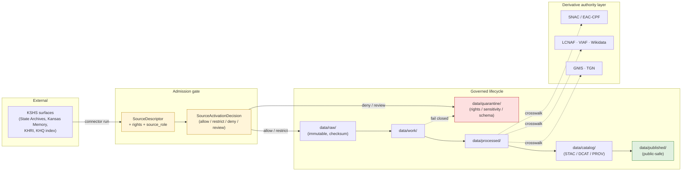
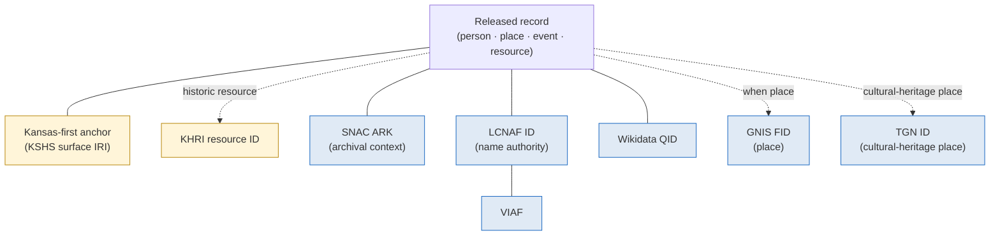

<!-- [KFM_META_BLOCK_V2]
doc_id: kfm://doc/source-catalog/kansas-state-archives
title: Kansas State Archives — Source-Family Brief
type: standard
version: v0.1
status: draft
owners: <TODO: source steward + archives domain liaison>
created: 2026-05-13
updated: 2026-05-13
policy_label: public
related:
  - docs/sources/README.md
  - docs/sources/catalog/README.md
  - docs/domains/archaeology/README.md
  - docs/domains/people-dna-land/README.md
  - docs/domains/settlements-infrastructure/README.md
  - docs/registers/AUTHORITY_LADDER.md
  - docs/standards/STAC_KFM_PROFILE.md
tags: [kfm, source-family, archives, kansas-first, kshs, kansas-memory, khri]
notes:
  - Path docs/sources/catalog/ is PROPOSED; the catalog/ subfolder is not explicitly listed in Directory Rules §6.1.
  - All implementation-level claims (paths, schema files, source_ids) are PROPOSED until verified against mounted-repo evidence.
[/KFM_META_BLOCK_V2] -->

# Kansas State Archives — Source-Family Brief

> Source-family doctrine and admission posture for the **Kansas State Historical Society (KSHS)** archival surfaces — the Kansas State Archives proper, **Kansas Memory**, the **Kansas Historic Resources Inventory (KHRI)**, and adjacent KSHS publication surfaces — as a **Kansas-first** authority for the KFM evidence chain.

<!-- Badge row · placeholders are acceptable until linked targets exist. -->


<!-- TODO: replace placeholder badges with Shields.io endpoints wired to source-registry signals once available. -->

| Field | Value |
|---|---|
| **Document type** | Source-family brief (standard doc) |
| **Status** | `draft` |
| **Owners** | `<TODO: source steward>` + `<TODO: archives domain liaison>` |
| **Last updated** | 2026-05-13 |
| **Authority of this brief** | PROPOSED until reviewed by source steward and at least one domain owner (Archaeology · People/Land · Settlements) |
| **Authority of paths quoted** | PROPOSED — no mounted repo was inspected in this session |
| **Lifecycle invariant referenced** | RAW → WORK / QUARANTINE → PROCESSED → CATALOG / TRIPLET → PUBLISHED |
| **Truth posture** | cite-or-abstain |

---

## Quick jump

- [1 · Scope and identity](#1--scope-and-identity)
- [2 · Repo fit and placement](#2--repo-fit-and-placement)
- [3 · Surface members of the source family](#3--surface-members-of-the-source-family)
- [4 · Admission flow and lifecycle](#4--admission-flow-and-lifecycle)
- [5 · Source roles (anti-collapse register)](#5--source-roles-anti-collapse-register)
- [6 · Rights, sensitivity, publication posture](#6--rights-sensitivity-publication-posture)
- [7 · Authority anchoring and crosswalks](#7--authority-anchoring-and-crosswalks)
- [8 · Cross-domain integration](#8--cross-domain-integration)
- [9 · Proposed registry fields](#9--proposed-registry-fields)
- [10 · Validators and tests (proposed)](#10--validators-and-tests-proposed)
- [11 · Verification backlog](#11--verification-backlog)
- [12 · Related docs](#12--related-docs)
- [Appendix A · Source ledger entry (proposed)](#appendix-a--source-ledger-entry-proposed)
- [Appendix B · Inputs / Exclusions / Task list](#appendix-b--inputs--exclusions--task-list)

---

## 1 · Scope and identity

**Identity.** In this brief, *"Kansas State Archives"* is the umbrella term for the archival surfaces operated by the **Kansas State Historical Society (KSHS)**, treated as a single KFM source family because they share an institutional steward, an underlying records community, and a common admission posture — even though their access mechanics and rights profiles differ per surface. The corpus identifies KSHS as a **Kansas-first domain authority** alongside KHRI, KU Biodiversity Institute, KBS Natural Heritage Inventory, and KDWP SINC. **(CONFIRMED doctrine — source: KFM Pass-10 dossier, C7-10 and C10-07.)**

> [!NOTE]
> "Kansas State Archives" in the strict legal sense is the **State Archives Division of KSHS** (the official archive of Kansas state government records). This brief uses the name more broadly — to also cover the **Kansas Memory** digital portal, the **Kansas Historic Resources Inventory (KHRI)**, and adjacent KSHS publication surfaces — because the KFM corpus treats them as a single archival source family for ingest, governance, and crosswalk purposes (see §3).

**Purpose.** Document what the family is, what role each surface plays, what rights and sensitivity posture applies, how it admits into the KFM lifecycle, how it crosswalks to federal and international authorities, and what is still unverified.

**Out of scope.** This brief does **not** define field-level schema (that belongs in `schemas/contracts/v1/source/source-descriptor.json` — PROPOSED per Directory Rules §7.4), does not decide release admissibility (that belongs in `policy/`), and does not stand in for institutional partnership terms. It is a doctrine and admission brief, not an operational runbook.

---

## 2 · Repo fit and placement

**Proposed canonical home.**

```text
docs/sources/catalog/kansas_state_archives.md
```

**Directory Rules basis (PROPOSED).** Per Directory Rules §6.1, `docs/sources/` is the explanatory home for **"source-descriptor standards, source families."** A `catalog/` subfolder is a reasonable extension for per-source-family briefs but is **not explicitly enumerated** in the Directory Rules tree; the subpath is PROPOSED and should be raised in `docs/registers/DRIFT_REGISTER.md` if convention diverges.

> [!IMPORTANT]
> **`docs/sources/` explains; it does not decide.** This brief is a human-facing explanation. The machine-readable counterpart lives in `data/registry/sources/<domain>/` and the field-level `SourceDescriptor` lives in `schemas/contracts/v1/source/source-descriptor.json` (default per Directory Rules §7.4 / ADR-0001). Doctrinal authority resides in those layers; this doc cites and explains them.

**Path neighbors (PROPOSED).**

| Concern | Canonical home | Status |
|---|---|---|
| Human-readable source-family brief (this doc) | `docs/sources/catalog/kansas_state_archives.md` | **PROPOSED** |
| Machine-readable source descriptor | `data/registry/source_descriptors/<source_id>.{json,yaml}` | PROPOSED — Directory Rules §9.1 |
| Source registry entry | `data/registry/sources/<domain>/...` | PROPOSED — Directory Rules §9.1 |
| Source-descriptor schema | `schemas/contracts/v1/source/source-descriptor.json` | PROPOSED — Directory Rules §7.4 / ADR-0001 |
| Connector lane | `connectors/kansas/<surface_id>/...` | PROPOSED — Directory Rules §7.3 |
| Raw captures | `data/raw/<domain>/<source_id>/<run_id>/` | PROPOSED — Directory Rules §9.1 |
| Sensitivity policy bindings | `policy/sensitivity/...` | PROPOSED |

> [!CAUTION]
> No mounted repository was inspected in this session. Every path above is **PROPOSED** and remains so until verified against current repo evidence. Do not cite this document as proof that these paths exist.

[Back to top](#kansas-state-archives--source-family-brief)

---

## 3 · Surface members of the source family

The KFM corpus identifies the Kansas archives stack as comprising multiple distinguishable surfaces; "Kansas State Archives" in this brief is the umbrella for the **KSHS-operated** subset of that stack. Each surface is admitted on its own `SourceDescriptor` because access mechanics, rights profiles, identifier schemes, and update cadence differ. **(CONFIRMED stack composition — source: C10-07 Archives Stack; C7-10 Kansas-First Domain Authorities.)**

| Surface (PROPOSED `source_id`) | Operator | What it holds | Reported scale (per corpus) | Access pattern (per corpus) | Status |
|---|---|---|---|---|---|
| Kansas State Archives proper (`kshs-state-archives`) | KSHS | State, county, municipal government records; manuscripts; maps; photographs | Not stated in corpus | NEEDS VERIFICATION — institutional reading-room and finding-aid surfaces | CONFIRMED family member |
| Kansas Memory (`kshs-kansas-memory`) | KSHS | Digitized historical materials across collections | "approximately 600,000 digitized items cited in the corpus" | NEEDS VERIFICATION — corpus mentions OAI-PMH as a *general* pattern; specific endpoint posture for Kansas Memory remains UNKNOWN | CONFIRMED family member; **item count is NEEDS VERIFICATION** (corpus expansion agenda lists "Verify KU NHM, KSU SC, and KSHS Kansas Memory item counts") |
| Kansas Historic Resources Inventory (`kshs-khri`) | KSHS | Canonical inventory of Kansas historic resources (buildings, sites, districts) | Not stated in corpus | NEEDS VERIFICATION | CONFIRMED family member |
| *Kansas Historical Quarterly* index (`kshs-khq-index`) | KSHS | Article-level index of the journal | Not stated in corpus | NEEDS VERIFICATION | CONFIRMED via corpus mention ("KSHS holds the canonical record for Kansas Historical Quarterly indexes") |

**Related Kansas archival surfaces — *not* owned by KSHS and *not* covered by this brief.** Each is a separate source family with its own brief (PROPOSED siblings under `docs/sources/catalog/`):

| Surface | Operator | Brief (PROPOSED) |
|---|---|---|
| Kenneth Spencer Research Library | University of Kansas (KU) | `docs/sources/catalog/ku_spencer_research_library.md` |
| KSU Special Collections | Kansas State University | `docs/sources/catalog/ksu_special_collections.md` |
| WSU Special Collections | Wichita State University | `docs/sources/catalog/wsu_special_collections.md` |
| County historical society holdings | County societies (many) | `docs/sources/catalog/county_historical_societies.md` |
| LOC IIIF presentations | Library of Congress | `docs/sources/catalog/loc_iiif.md` |
| SNAC / EAC-CPF cooperative | SNAC consortium | `docs/sources/catalog/snac_eac_cpf.md` (also an authority register entry) |

> [!NOTE]
> The corpus warns that **many county societies and small archives lack any structured publication interface**, and that the KFM harvest layer must tolerate manual submission flows. KSHS surfaces are the most structured tier of the Kansas archives stack but are not uniformly API-accessible. *(Source: C10-07 tensions.)*

[Back to top](#kansas-state-archives--source-family-brief)

---

## 4 · Admission flow and lifecycle

The Kansas State Archives family admits under the standard KFM lifecycle invariant. Promotion at each phase is a **governed state transition, not a file move**.



> [!IMPORTANT]
> **Connectors MUST NOT publish.** Per Directory Rules §7.3, KSHS connectors emit to `data/raw/<domain>/<source_id>/<run_id>/` or `data/quarantine/...` with checksums and ingest receipts; they do not write under `data/processed/`, `data/catalog/`, or `data/published/`. Promotion is a separate governed step.

[Back to top](#kansas-state-archives--source-family-brief)

---

## 5 · Source roles (anti-collapse register)

KFM treats `source_role` as a first-class identity attribute. The role is set at admission, preserved through every promotion, and **never collapsed**. For the Kansas State Archives family, the dominant roles are **administrative** and **observed** (historical observation by the original record creator), with **authority** applying to KHRI's inventory function. Modeled, synthetic, and aggregate roles are unusual here and should be treated as exceptions requiring explicit justification. *(Doctrine source: Atlas v1.1 §24.1 Master Source-Role Anti-Collapse Register.)*

| KSHS surface | Typical `source_role` | Rationale | Anti-collapse hazard | Required guardrail |
|---|---|---|---|---|
| Kansas State Archives proper | `administrative` | Government records are compiled for administration/registration, not as direct field observations | Compilation cited as observation (e.g., a deed index treated as an observed event timeline) | Preserve `source_role`; use named `LifeEvent` / `AdminEvent` types per the People/Land domain |
| Kansas State Archives — narrative records (diaries, correspondence, photographs) | `observed` (historical first-hand) | First-hand record by an original observer of a time and place | Treating later transcription or annotation as the original observation | Preserve original-record citation; record any transformation in a `TransformReceipt` |
| Kansas Memory (digitized items) | inherits role of underlying record | Digitization does not change the source role of the underlying material | Treating a digital surrogate as a new observation | Source-role inheritance must be explicit in the descriptor; digitization recorded as a `TransformReceipt`, not a new observation |
| KHRI (Historic Resources Inventory) | `authority` (inventory) — and per-listing `administrative` | KHRI is the canonical inventory of historic resources | Inventory listing cited as a regulatory determination | Distinguish KHRI listing from formal NRHP/state register designation; do not collapse with regulatory |
| *Kansas Historical Quarterly* index | `administrative` (bibliographic) | Indexing is a compilation function | Index entry cited as a primary source | Cite index as discovery; cite underlying article separately |

> [!WARNING]
> **Candidate records from these surfaces MUST NOT appear in `data/published/` without promotion.** Per Atlas v1.1 §24.1.2 anti-collapse failure modes: *"Candidate record exposed on a public surface → DENY at trust membrane; route to QUARANTINE."*

[Back to top](#kansas-state-archives--source-family-brief)

---

## 6 · Rights, sensitivity, publication posture

> [!CAUTION]
> **Rights and current terms for each KSHS surface remain NEEDS VERIFICATION.** Many KSHS-held materials are public domain or openly accessible through Kansas Memory, but a non-trivial portion of the holdings is subject to donor restrictions, third-party copyright, privacy considerations, or culturally sensitive material requiring tribal/community consultation. **Unknown rights fail closed** per the KFM Deny-by-Default Register (source class `SRC-BUILD` — *"Licensed, restricted, no-redistribution, uncertain terms"*).

### 6.1 Default posture by class

This family interacts heavily with the KFM Deny-by-Default Register because archival material commonly carries cross-domain sensitivity. The table below specifies the posture KFM applies when ingesting KSHS material into the relevant lane.

| Sensitive class encountered in KSHS holdings | Default posture | Required controls | Citation |
|---|---|---|---|
| **Living-person data** in 20th-century records (correspondence, photographs, oral histories) | DENY public exact/identifying output unless legal basis + consent/review + release state are proven | privacy review; redaction; aggregate; staged access | Deny-by-Default Register / `SRC-PEOPLE` |
| **Archaeological site coordinates** in survey reports, manuscript maps, or photograph captions | DENY exact public location by default | cultural/steward review; suppression/generalization (H3 r7+ public floor for sensitive sites per ML-061-159) | `SRC-ARCH` |
| **Sacred/culturally sensitive places** in oral histories, ethnographic correspondence, mission/agency records | DENY until steward review and access class approve | consultation record; sensitivity transform; tribal/steward review | `SRC-ARCH`, `SRC-ROAD` |
| **Critical infrastructure precision** in 20th-century engineering records | RESTRICT / DENY public precision | public-safe aggregation; role-based access | `SRC-SET` |
| **Source-rights-limited records** (third-party copyright, donor restriction) | DENY public release until terms resolved | rights register; attribution; no public derivative if barred | `SRC-BUILD` |
| **Emergency / advisory content** in historical disaster records | Contextual only; NOT life-safety | not-for-life-safety disclaimer; preserve issue/expiry freshness | `SRC-HAZ`, `SRC-AIR` |

### 6.2 What a redaction looks like in this family

When a KSHS-derived record contains a sensitive class, the public-safe artifact MUST be accompanied by a **`RedactionReceipt`** (per Atlas v1.1 §24.2 Master Receipt Catalog), recording: `policy_ref`, `redaction_method`, `kept_fields`, `removed_fields`, `geometry_transform`, and `reviewer`. The original record remains in `data/processed/` (or `data/quarantine/` if rights are unresolved); only the redacted derivative reaches `data/published/`.

[Back to top](#kansas-state-archives--source-family-brief)

---

## 7 · Authority anchoring and crosswalks

The Kansas State Archives family is a **Kansas-first authority**. The KFM convention is to **store the Kansas-authority identifier in parallel with federal or international anchors**, so records remain authoritatively Kansas-deep while staying readable in the wider research ecosystem. *(Source: C7-10 Kansas-First Domain Authorities; §7.6 "Kansas-First with Documented Crosswalk".)*



**Crosswalk roles for this family.**

| Authority | Role for Kansas State Archives | Status in corpus |
|---|---|---|
| **SNAC / EAC-CPF** | Cross-archive person/corporate-body authority; SNAC aggregates archival authority records contributed by U.S. archives **including KSHS** | CONFIRMED (C7-06) |
| **LCNAF** | Federal name authority; required parallel anchor for published persons/corporate bodies | CONFIRMED (C7-02) |
| **VIAF · ISNI · Wikidata** | International crosswalk layer | CONFIRMED (C7-03, C7-04, C7-01) |
| **GNIS** | Federal place authority; required anchor for in-scope KFM place records when GNIS has coverage | CONFIRMED (C7-09) |
| **Getty TGN** | Cultural-heritage place authority — layered on top of GNIS for historical/cultural place names | PROPOSED (C7-05) |
| **KHRI** | KFM-internal cross-reference for historic resources cited in archival material | CONFIRMED (C7-10) |

> [!NOTE]
> For figures whose primary evidentiary footprint is in unpublished archival collections — frontier settlers, county officials, regional newspaper editors, ranching families — **SNAC is often the only standing authority**. The KFM corpus identifies a **contribute-back** pattern: when a person is identified in KSHS material but is absent from SNAC, KFM can generate an EAC-CPF record and propose it upstream. This is PROPOSED future work; not yet a built capability. *(Source: C7-06 expansion direction.)*

[Back to top](#kansas-state-archives--source-family-brief)

---

## 8 · Cross-domain integration

Archives are the source corpus for genealogy, historical ecology, and place-history work — the corpus is explicit that **"Kansas-first work without deep archive integration is not credible"** (C10-07). Records from this family touch most KFM domains.

| KFM domain | Typical KSHS contribution | Caution |
|---|---|---|
| **People, Genealogy, DNA, and Land Ownership** | Vital records (where public/legal), deeds, land patents, manuscripts, photographs | Living-person fields fail closed; assessor records ≠ title truth |
| **Settlements, Cities, and Infrastructure** | Townsite records, ghost-town documentation, fort/mission/reservation community archives, gazetteers | Sensitive infrastructure precision restricted by default |
| **Roads, Rail, and Trade Routes** | Historical maps, county atlases, military/emigrant/stage/cattle trail sources, bridges/ferries records | Culturally sensitive corridors require steward review |
| **Archaeology and Cultural Heritage** | Historic maps, plats, land records, newspaper accounts of sites; museum/collection accessions | Exact-site denial by default; sacred/burial material requires cultural/steward review |
| **Hazards** | Historical event records (floods, severe weather, fires) as observed historical evidence | Cite as historical record, never as operational warning |
| **Spatial Foundation** | Historical maps for georeferencing | Source role and uncertainty must travel with derived geometries |
| **Frontier Demography, Economy, Settlement, Land, and Time Matrix** | County histories, land office records, public land records, historical gazetteers | Aggregate ≠ per-place truth; preserve aggregation receipts |

[Back to top](#kansas-state-archives--source-family-brief)

---

## 9 · Proposed registry fields

The following descriptor surface is **PROPOSED — illustrative, not authoritative**. The canonical schema home defaults to `schemas/contracts/v1/source/source-descriptor.json` per Directory Rules §7.4 and ADR-0001 (NEEDS VERIFICATION — actual file presence not asserted). Names and shapes here mirror Atlas v1.1 §24.1.3.

```yaml
# PROPOSED — not a verified shape. Mirror of Atlas v1.1 §24.1.3.
source_id: kshs-kansas-memory                       # one of: kshs-state-archives, kshs-kansas-memory, kshs-khri, kshs-khq-index
source_family: kansas-state-archives
operator: "Kansas State Historical Society (KSHS)"
source_role: administrative                          # PROPOSED default; see §5 for surface-specific overrides
role_authority: "Kansas State Historical Society"
rights:
  posture: NEEDS_VERIFICATION                        # default-deny until terms are confirmed per surface
  spdx: NOASSERTION                                  # set per-collection / per-item if known
  attribution_required: TBD
  redistribution_class: TBD                          # one of: open | attribution | restricted | none
sensitivity_classes:
  - SRC-PEOPLE       # living-person fields fail closed
  - SRC-ARCH         # archaeological coords / sacred places fail closed
  - SRC-BUILD        # rights-limited or donor-restricted materials
cadence:
  fetch_window: TBD                                  # corpus suggests "harvest cadence" recorded per surface
  freshness_tolerance: TBD
access:
  method: TBD                                        # OAI-PMH | API | IIIF | manual harvest — varies per surface
  endpoint: NEEDS_VERIFICATION                       # do not hard-code endpoints; record per descriptor
  authentication: TBD
crosswalks:
  required:
    - lcnaf      # when entity is a person or corporate body
    - snac_ark   # when archival context exists
    - gnis_fid   # when entity is a place with GNIS coverage
  optional:
    - viaf
    - wikidata_qid
    - tgn_id
    - khri_id
ingest_receipt_required: true
steward: "<TODO: source steward>"
contact: "<TODO: institutional liaison>"
```

> [!IMPORTANT]
> **Do not invent endpoint URLs, OAI-PMH base URLs, IIIF roots, or API keys in this brief.** Those belong in the per-surface `SourceDescriptor` and are sourced from the institution. The corpus is explicit that "specific schema paths remain PROPOSED until mounted-repo evidence verifies them."

[Back to top](#kansas-state-archives--source-family-brief)

---

## 10 · Validators and tests (proposed)

A first-PR posture for this family follows the **Atmosphere lane pattern** (Unified Manual §30.10): docs / registry / schema / fixture / validator / policy / dry-run only, with **no live fetch, no public promotion, and no UI/API binding** beyond typed contract notes.

| Validator (PROPOSED) | What it checks | Status |
|---|---|---|
| `source-descriptor` | All required fields present; `source_role` from enum; `rights.posture` resolved before any non-quarantine promotion | PROPOSED |
| `source-role-anti-collapse` | KSHS material not relabeled across `observed` / `administrative` / `regulatory` / `aggregate` boundaries during promotion | PROPOSED |
| `rights-fail-closed` | Any record without a resolved `rights.posture` fails admission | PROPOSED |
| `sensitivity-class-routing` | Records flagged with `SRC-PEOPLE`, `SRC-ARCH`, or `SRC-BUILD` route to the appropriate review queue | PROPOSED |
| `crosswalk-presence` | Persons released to PUBLISHED carry at least one of {LCNAF, SNAC ARK, VIAF, Wikidata}; places carry GNIS where applicable | PROPOSED |
| `redaction-receipt-required` | Any publication touching a sensitive class is accompanied by a `RedactionReceipt` | PROPOSED |
| `no-network-fixture` | A synthetic Kansas-Memory-shaped fixture exercises the pipeline without contacting KSHS | PROPOSED |

[Back to top](#kansas-state-archives--source-family-brief)

---

## 11 · Verification backlog

> [!WARNING]
> The items below are **explicit verification items** for this source family. Until each is resolved, this brief remains `draft` and the family's `SourceDescriptor` rows remain PROPOSED.

| # | Item | Evidence that would settle it | Status |
|---|---|---|---|
| 1 | Confirm the institutional name for each surface (State Archives proper vs. KSHS umbrella vs. KSHS Library & Archives Division) | KSHS public organizational documentation | NEEDS VERIFICATION |
| 2 | Verify Kansas Memory item count (corpus says "approximately 600,000"; KFM expansion agenda lists this as a verification item) | KSHS Kansas Memory landing page or public report | NEEDS VERIFICATION |
| 3 | Determine actual API / OAI-PMH / IIIF posture for each surface | KSHS publisher documentation per surface | NEEDS VERIFICATION |
| 4 | Determine rights / terms-of-use posture per surface and per collection | KSHS rights statements; per-collection metadata | NEEDS VERIFICATION |
| 5 | Establish steward of record and institutional liaison | Source-registry README + institutional contact | NEEDS VERIFICATION |
| 6 | Determine harvest cadence per surface | Institutional cadence statements + KFM cadence policy | NEEDS VERIFICATION |
| 7 | Confirm SNAC contribution governance model (KFM as EAC-CPF contributor — *who holds the editorial seat?*) | Future ADR + partnership agreement | UNKNOWN (corpus open question) |
| 8 | Decide path convention: `docs/sources/catalog/` vs `docs/sources/families/` vs `docs/sources/registry/` | Repo convention; ADR if needed | PROPOSED |
| 9 | Decide filename convention: `kansas_state_archives.md` (snake_case used here) vs `kansas-state-archives.md` (kebab-case used in `docs/domains/`) | Repo convention; per-root README | PROPOSED |
| 10 | Implement `SourceDescriptor` schema for source-family records | `schemas/contracts/v1/source/source-descriptor.json` | PROPOSED — Directory Rules §7.4 / ADR-0001 |
| 11 | Resolve `source_role` per surface — confirm `administrative` is the right default for State Archives proper, `authority` for KHRI | Atlas v1.1 §24.1; per-surface evidence | PROPOSED |
| 12 | Pilot the SNAC contribution-back pipeline using a *Kansas Historical Quarterly* volume (corpus medium-priority pilot, item #14) | Pilot run + receipts | PROPOSED |

[Back to top](#kansas-state-archives--source-family-brief)

---

## 12 · Related docs

<!-- Placeholders allowed; verify and remove TODOs as targets land. -->

- `docs/sources/README.md` — source-descriptor standards and source-family conventions *(TODO: verify presence)*
- `docs/sources/catalog/README.md` — index of source-family briefs in this catalog *(TODO: create or verify)*
- `docs/domains/archaeology/README.md` — primary consumer of archival sensitive-class enforcement
- `docs/domains/people-dna-land/README.md` — primary consumer of person/place anchoring
- `docs/domains/settlements-infrastructure/README.md` — primary consumer of historic-place and gazetteer material
- `docs/doctrine/lifecycle-law.md` — RAW → PUBLISHED governance
- `docs/doctrine/truth-posture.md` — cite-or-abstain
- `docs/doctrine/directory-rules.md` — §6.1 (`docs/sources/`), §7.3 (`connectors/`), §7.4 (schema home), §9.1 (data lifecycle), §11 (sensitive register)
- `docs/registers/AUTHORITY_LADDER.md` — KFM Authority Ladder
- `docs/standards/STAC_KFM_PROFILE.md` — KFM STAC namespace and provenance
- `docs/adr/ADR-0001-schema-home.md` — schema home convention

**Sibling briefs (PROPOSED, not yet written):** `ku_spencer_research_library.md` · `ksu_special_collections.md` · `wsu_special_collections.md` · `county_historical_societies.md` · `loc_iiif.md` · `snac_eac_cpf.md`

[Back to top](#kansas-state-archives--source-family-brief)

---

## Appendix A · Source ledger entry (proposed)

<details>
<summary><strong>PROPOSED source-ledger row — mirrors the Encyclopedia §3.2 ledger shape.</strong></summary>

| Source ID | Source name | Type | Status | Supports | Cannot prove | Domains |
|---|---|---|---|---|---|---|
| `SRC-KSHS` (PROPOSED) | Kansas State Historical Society — archival surfaces (State Archives proper · Kansas Memory · KHRI · KHQ index) | Institutional source family (Kansas-first authority) | **PROPOSED** — source family doctrine CONFIRMED by corpus C7-10 and C10-07; per-surface descriptors not yet drafted | Kansas-first archival evidence for Archaeology, People/Land, Settlements, Roads/Rail, Hazards (historical), Frontier Matrix; KHRI as inventory of historic resources; cross-archive anchoring via SNAC | Cannot prove rights posture for individual collections without per-collection review; cannot serve as regulatory authority; cannot stand in for tribal/community consent for culturally sensitive material | Archaeology · People/Land · Settlements · Roads/Rail · Frontier Matrix · Hazards (historical) |

The ledger row is **navigational**, not authoritative. Per Atlas v1.1 §24, *"EvidenceBundle, the source dossiers, and the schemas/contracts under schemas/contracts/v1/… remain the canonical sources for any claim."*

</details>

---

## Appendix B · Inputs / Exclusions / Task list

<details>
<summary><strong>What this catalog entry accepts and refuses (README-style impact block).</strong></summary>

**Inputs (what belongs here).**

- Doctrine, scope, and identity for the KSHS-operated archival surfaces as a single KFM source family.
- Proposed descriptor fields, source-role assignments, sensitivity-class mappings.
- Crosswalk obligations to SNAC, LCNAF, VIAF, Wikidata, GNIS, TGN, KHRI.
- Cross-domain integration notes (which domains consume from this family and under what guardrails).
- Verification backlog tied to evidence that would settle it.

**Exclusions (what does not belong here).**

- Field-level schema for `SourceDescriptor` — belongs in `schemas/contracts/v1/source/source-descriptor.json`.
- Release-admissibility decisions — belong in `policy/` and `release/`.
- Machine-readable registry rows — belong in `data/registry/sources/...` and `data/registry/source_descriptors/...`.
- Concrete endpoint URLs, OAI-PMH bases, IIIF roots, or API keys — belong in per-surface `SourceDescriptor` records, sourced from the institution.
- Per-collection rights statements — belong in per-collection metadata or a rights subregistry, not in this family-level brief.
- Operational runbooks (rotation, failure handling, backfill) — belong in `docs/runbooks/`.

**Task list (PROPOSED, next moves).**

- [ ] Verify Kansas Memory reported item count and add the verified figure as CONFIRMED.
- [ ] Resolve `source_id` naming convention across the catalog.
- [ ] Draft per-surface `SourceDescriptor` records (one per KSHS surface).
- [ ] Confirm rights posture per surface and per relevant collection class.
- [ ] Open a `docs/registers/DRIFT_REGISTER.md` entry if mounted-repo path conventions diverge from `docs/sources/catalog/`.
- [ ] Author sibling briefs (KU Spencer, KSU SC, WSU SC, county societies, LOC IIIF, SNAC) so the Kansas archives stack is complete in this catalog.
- [ ] File an ADR if the schema home for `source-descriptor.json` deviates from the Directory Rules §7.4 default.

</details>

---

<!-- Footer block per presentation standard. -->

<sub>**Last updated:** 2026-05-13 · **Status:** draft · **Owners:** `<TODO: source steward + archives domain liaison>`</sub>

<sub>**Related doctrine:** `docs/doctrine/directory-rules.md` · `docs/doctrine/lifecycle-law.md` · `docs/doctrine/truth-posture.md` · `docs/registers/AUTHORITY_LADDER.md`</sub>

<sub>[↑ Back to top](#kansas-state-archives--source-family-brief)</sub>
