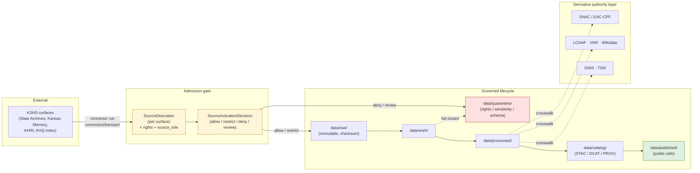
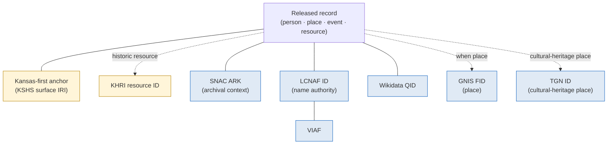

<!-- [KFM_META_BLOCK_V2]
doc_id: kfm://doc/docs-sources-catalog-kansas-kansas-state-archives
title: Kansas State Archives — Source-Family Brief
type: standard
version: v0.2
status: draft
owners: <TODO: source steward + archives domain liaison>
created: 2026-05-13
updated: 2026-05-21
policy_label: public
related:
  - docs/sources/catalog/kansas/README.md
  - docs/sources/catalog/kansas/kansas-memory.md
  - docs/sources/catalog/kansas/khri.md
  - docs/sources/catalog/README.md
  - docs/sources/catalog/IDENTITY.md
  - docs/sources/catalog/PROFILES.md
  - docs/sources/catalog/RIGHTS-AND-SENSITIVITY-MAP.md
  - docs/sources/catalog/OPEN-QUESTIONS.md
  - docs/sources/catalog/_template/SOURCE_PRODUCT_TEMPLATE.md
  - docs/domains/archaeology/README.md
  - docs/domains/people-dna-land/README.md
  - docs/domains/settlements-infrastructure/README.md
  - docs/doctrine/directory-rules.md
  - docs/doctrine/lifecycle-law.md
  - docs/doctrine/truth-posture.md
  - docs/doctrine/authority-ladder.md
  - docs/standards/SENSITIVITY_RUBRIC.md
  - docs/standards/STAC_KFM_PROFILE.md
  - docs/standards/oai-pmh.md
  - docs/standards/iiif.md
  - docs/standards/snac-eac-cpf.md
  - docs/registers/AUTHORITY_LADDER.md
  - docs/registers/VERIFICATION_BACKLOG.md
  - docs/adr/ADR-0001-schema-home.md
  - schemas/contracts/v1/source/source_descriptor.schema.json
  - connectors/kansas/
  - data/registry/sources/
  - policy/sensitivity/
  - policy/rights/
tags: [kfm, source-family, archives, kansas-first, kshs, kansas-memory, khri, c10-07, c7-10]
notes:
  - >-
    v0.2 path and slug migration: this doc was at
    `docs/sources/catalog/kansas_state_archives.md` (flat, snake_case) in v0.1
    and has moved to `docs/sources/catalog/kansas/kansas-state-archives.md`
    (nested under the `kansas/` family folder, kebab-case for consistency with
    sibling product pages — `kansas-memory.md`, `ksgs.md`, `kdwp.md`,
    `fhsu-sternberg.md`, `ku-nhm.md`, etc.). OQ #1 (path) and OQ #9 (slug) from
    v0.1 are PARTIALLY RESOLVED by this reorganization.
  - >-
    Structural reframing (v0.2): this doc is the **KSHS-umbrella brief** that
    explains shared institutional posture across KSHS-operated archival
    surfaces. Sibling product pages — `kansas-memory.md` (v0.2 revised this
    session), `khri.md` (PROPOSED), and a future `kshs-state-archives.md` for
    the State Archives Division proper — cover individual surface-level
    admission. Both layers are intended; the umbrella is not a substitute for
    per-surface descriptors. Surfaced as OQ-KSA-13.
  - >-
    `connectors/kansas/` lane is CONFIRMED (at commit
    `b6a27916bbb9e07cbf3752870c867476e1e094e7`) per Directory Rules v1.2 §7.3.
    Per-surface connector adapters (`connectors/kansas/kansas-memory/`,
    `connectors/kansas/khri/`, `connectors/kansas/kshs-state-archives/`) remain
    PROPOSED.
  - >-
    Atlas card lineage CONFIRMED: `C10-07` Archives Stack; `C7-10` Kansas-First
    Domain Authorities ("KSHS holds the canonical record for Kansas Historical
    Quarterly indexes and Kansas Memory items"); `C7-06` SNAC + EAC-CPF;
    `KFM-P18-PROG-0033` Kansas Memory source descriptor; `KFM-P17-PROG-0011`
    Kansas historical provenance source object. Sibling product page
    `kansas-memory.md` v0.2 grounds the per-surface detail.
[/KFM_META_BLOCK_V2] -->

# Kansas State Archives — Source-Family Brief

> Source-family doctrine and admission posture for the **Kansas State Historical Society (KSHS)** archival surfaces — the Kansas State Archives proper, **Kansas Memory**, the **Kansas Historic Resources Inventory (KHRI)**, and adjacent KSHS publication surfaces — as a **Kansas-first** authority for the KFM evidence chain.

<!-- Badge row · placeholders are acceptable until linked targets exist. -->


<!-- TODO: replace placeholder badges with Shields.io endpoints wired to source-registry signals once available. -->

| Field | Value |
|---|---|
| **Document type** | Source-family brief (standard doc) — **KSHS umbrella** layer |
| **Status** | `draft` (v0.2) |
| **Owners** | `<TODO: source steward>` + `<TODO: archives domain liaison>` |
| **Last updated** | 2026-05-21 |
| **Authority of this brief** | PROPOSED until reviewed by source steward and at least one domain owner (Archaeology · People/Land · Settlements) |
| **Authority of paths quoted** | PROPOSED — no mounted repo was inspected in this session |
| **Family lane** | `connectors/kansas/` — CONFIRMED (at commit `b6a27916bbb9e07cbf3752870c867476e1e094e7`) per Directory Rules v1.2 §7.3 |
| **Lifecycle invariant referenced** | RAW → WORK / QUARANTINE → PROCESSED → CATALOG / TRIPLET → PUBLISHED |
| **Truth posture** | cite-or-abstain |

---

## Quick jump

- [1 · Scope and identity](#1--scope-and-identity)
- [2 · Repo fit and placement](#2--repo-fit-and-placement)
- [3 · Surface members of the source family](#3--surface-members-of-the-source-family)
- [4 · Admission flow and lifecycle](#4--admission-flow-and-lifecycle)
- [5 · Source roles (anti-collapse register)](#5--source-roles-anti-collapse-register)
- [6 · Rights, sensitivity, publication posture](#6--rights-sensitivity-publication-posture)
- [7 · Authority anchoring and crosswalks](#7--authority-anchoring-and-crosswalks)
- [8 · Cross-domain integration](#8--cross-domain-integration)
- [9 · Proposed registry fields](#9--proposed-registry-fields)
- [10 · Validators and tests (proposed)](#10--validators-and-tests-proposed)
- [11 · Verification backlog](#11--verification-backlog)
- [12 · Related docs](#12--related-docs)
- [Appendix A · Source ledger entry (proposed)](#appendix-a--source-ledger-entry-proposed)
- [Appendix B · Inputs / Exclusions / Task list](#appendix-b--inputs--exclusions--task-list)
- [Appendix C · Atlas idea-card lineage](#appendix-c--atlas-idea-card-lineage)
- [Appendix D · Change log](#appendix-d--change-log)

---

## 1 · Scope and identity

> [!NOTE]
> **Path and slug migration (v0.1 → v0.2).** This page was authored as `docs/sources/catalog/kansas_state_archives.md` in v0.1 (flat path, snake_case slug) and **moved to `docs/sources/catalog/kansas/kansas-state-archives.md`** in v0.2 (nested under the `kansas/` family folder; kebab-case to match sibling product pages — `kansas-memory.md`, `ksgs.md`, `kdwp.md`, `fhsu-sternberg.md`, etc.). The kansas family README v0.2 lists this brief explicitly. Relative links have been adjusted; any external link to the old flat path or snake_case slug will break. OQ #1 (path) and OQ #9 (slug) from v0.1 are **partially resolved**.

> [!IMPORTANT]
> **Umbrella vs surface (v0.2 structural framing).** This brief documents the **KSHS-umbrella institutional posture** — the shared identity, rights floor, lifecycle invariant, anti-collapse register, crosswalk obligations, and cross-domain integration across KSHS-operated archival surfaces. **Sibling product pages** under `docs/sources/catalog/kansas/` cover individual surfaces:
> - [`./kansas-memory.md`](./kansas-memory.md) — Kansas Memory digital portal (v0.2 revised this session)
> - [`./khri.md`](./khri.md) — Kansas Historic Resources Inventory (PROPOSED)
> - (PROPOSED future) `./kshs-state-archives.md` — the State Archives Division proper (government records, manuscripts, maps)
>
> The umbrella is **not a substitute** for per-surface descriptors. Both layers exist; this brief sets the shared posture, and the per-surface pages set surface-specific admission detail.

**Identity.** In this brief, *"Kansas State Archives"* is the umbrella term for the archival surfaces operated by the **Kansas State Historical Society (KSHS)**, treated as a single KFM source family because they share an institutional steward, an underlying records community, and a common admission posture — even though their access mechanics and rights profiles differ per surface. The corpus identifies KSHS as a **Kansas-first domain authority** alongside KHRI, KU Biodiversity Institute, KBS Natural Heritage Inventory, and KDWP SINC. **(CONFIRMED doctrine — source: KFM Pass-10 dossier, `C7-10` and `C10-07`.)**

> [!NOTE]
> "Kansas State Archives" in the strict legal sense is the **State Archives Division of KSHS** (the official archive of Kansas state government records). This brief uses the name more broadly — to also cover the **Kansas Memory** digital portal, the **Kansas Historic Resources Inventory (KHRI)**, and adjacent KSHS publication surfaces — because the KFM corpus treats them as a single archival source family for ingest, governance, and crosswalk purposes (see §3).

**Purpose.** Document what the family is, what role each surface plays, what rights and sensitivity posture applies, how it admits into the KFM lifecycle, how it crosswalks to federal and international authorities, and what is still unverified.

**Out of scope.** This brief does **not** define field-level schema (that belongs in `schemas/contracts/v1/source/source_descriptor.schema.json` — PROPOSED per Directory Rules §7.4), does not decide release admissibility (that belongs in `policy/`), does not stand in for institutional partnership terms, and does **not** re-document the per-surface admission posture of Kansas Memory or KHRI (those live in their sibling product pages — see §3.1). It is a doctrine and admission brief at the institutional layer, not an operational runbook or a per-surface product page.

[Back to top](#quick-jump)

---

## 2 · Repo fit and placement

**Canonical home (v0.2).**

```text
docs/sources/catalog/kansas/kansas-state-archives.md
```

**Directory Rules basis.** Per Directory Rules §6.1, `docs/sources/` is the explanatory home for **"source-descriptor standards, source families."** The v0.2 reorganization adopted `docs/sources/catalog/<family>/<product>.md` as the catalog convention; `<family>` mirrors the §7.3 connector families. **`connectors/kansas/` is CONFIRMED (at commit `b6a27916bbb9e07cbf3752870c867476e1e094e7`)** as one of the nine canonical connector families per Directory Rules v1.2 §7.3, so `docs/sources/catalog/kansas/` is the explanatory companion for that lane.

> [!IMPORTANT]
> **`docs/sources/` explains; it does not decide.** This brief is a human-facing explanation. The machine-readable counterpart lives in `data/registry/sources/<domain>/` and the field-level `SourceDescriptor` lives in `schemas/contracts/v1/source/source_descriptor.schema.json` (default per Directory Rules §7.4 / ADR-0001). Doctrinal authority resides in those layers; this doc cites and explains them.

**Path neighbors (PROPOSED, v0.2 paths).**

| Concern | Canonical home | Status |
|---|---|---|
| Human-readable source-family brief (this doc, KSHS umbrella) | `docs/sources/catalog/kansas/kansas-state-archives.md` | **PROPOSED** (v0.2 path) |
| Surface-specific product page — Kansas Memory | `docs/sources/catalog/kansas/kansas-memory.md` | **PROPOSED** (v0.2 revised this session) |
| Surface-specific product page — KHRI | `docs/sources/catalog/kansas/khri.md` | **PROPOSED** sibling |
| Machine-readable source descriptors (per KSHS surface) | `data/registry/sources/archives/<surface_id>/source_descriptor.yaml` | PROPOSED — Directory Rules §9.1 |
| Source-descriptor schema | `schemas/contracts/v1/source/source_descriptor.schema.json` | PROPOSED — Directory Rules §7.4 / ADR-0001 |
| Connector lane (CONFIRMED family at commit) | `connectors/kansas/<surface_id>/...` | Family CONFIRMED §7.3; per-surface PROPOSED |
| Raw captures | `data/raw/<domain>/<source_id>/<run_id>/` | PROPOSED — Directory Rules §9.1 |
| Sensitivity policy bindings | `policy/sensitivity/...` | PROPOSED |

> [!CAUTION]
> No mounted repository was inspected in this session. Every PROPOSED path above remains so until verified against current repo evidence. Do not cite this document as proof that these paths exist.

[Back to top](#quick-jump)

---

## 3 · Surface members of the source family

The KFM corpus identifies the Kansas archives stack as comprising multiple distinguishable surfaces; "Kansas State Archives" in this brief is the umbrella for the **KSHS-operated** subset of that stack. Each surface is admitted on its own `SourceDescriptor` because access mechanics, rights profiles, identifier schemes, and update cadence differ. **(CONFIRMED stack composition — source: `C10-07` Archives Stack; `C7-10` Kansas-First Domain Authorities.)**

### 3.1 KSHS-operated surfaces (this umbrella)

| Surface (PROPOSED `source_id`) | Operator | What it holds | Reported scale (per corpus) | Sibling product page | Atlas card |
|---|---|---|---|---|---|
| Kansas State Archives proper (`kshs-state-archives`) | KSHS | State, county, municipal government records; manuscripts; maps; photographs | Not stated in corpus | (PROPOSED) `./kshs-state-archives.md` | (none specific; covered by `KFM-P17-PROG-0011`) |
| Kansas Memory (`kshs-kansas-memory` — slug `kansas-memory`) | KSHS | Digitized historical materials across collections | "approximately 600,000 digitized items" (corpus, NEEDS VERIFICATION per `C7-10` evidence-needed list) | [`./kansas-memory.md`](./kansas-memory.md) — v0.2 revised this session | `KFM-P18-PROG-0033` Kansas Memory source descriptor (CONFIRMED card exists) |
| Kansas Historic Resources Inventory (`kshs-khri` — slug `khri`) | KSHS | Canonical inventory of Kansas historic resources (buildings, sites, districts) | Not stated in corpus | (PROPOSED) [`./khri.md`](./khri.md) | (covered indirectly by `C7-10`) |
| *Kansas Historical Quarterly* index (`kshs-khq-index`) | KSHS | Article-level index of the journal | Not stated in corpus | (PROPOSED future sibling; may fold under `kshs-state-archives.md`) | `C7-10` mentions "KSHS holds the canonical record for Kansas Historical Quarterly indexes" |

> [!TIP]
> **Cross-reference rule.** When this umbrella brief states a shared posture (rights floor, sensitivity register, anti-collapse register, crosswalk obligations), the per-surface product page **inherits** it unless explicitly overridden. When the per-surface page differs (e.g., Kansas Memory has known scale ~600k; State Archives proper does not), the surface page is the authoritative reference.

### 3.2 Related Kansas archival surfaces — *not* KSHS-operated, *not* covered by this brief

Each is a separate source family with its own product page (PROPOSED siblings under `docs/sources/catalog/kansas/` for in-state institutions, or other family folders for federal / international entities). The kansas family README v0.2 flagged most of these as "Known Kansas sources without product pages yet."

| Surface | Operator | Sibling brief (PROPOSED) | Family folder |
|---|---|---|---|
| Kenneth Spencer Research Library | University of Kansas (KU) | `docs/sources/catalog/kansas/ku-spencer-research-library.md` | `kansas/` (in-state) |
| KSU Special Collections | Kansas State University | `docs/sources/catalog/kansas/ksu-special-collections.md` | `kansas/` (in-state) |
| WSU Special Collections | Wichita State University | `docs/sources/catalog/kansas/wsu-special-collections.md` | `kansas/` (in-state) |
| County historical society holdings | County societies (many) | `docs/sources/catalog/kansas/county-historical-societies.md` | `kansas/` (in-state) |
| LOC IIIF presentations | Library of Congress | `docs/sources/catalog/<federal-family>/loc-iiif.md` | **Not `kansas/`** — federal; family folder NEEDS VERIFICATION (LOC is not in §7.3) |
| SNAC / EAC-CPF cooperative | SNAC consortium | `docs/sources/catalog/<authority-family>/snac-eac-cpf.md` | **Not `kansas/`** — international consortium; family folder NEEDS VERIFICATION |

> [!NOTE]
> The corpus warns that **many county societies and small archives lack any structured publication interface**, and that the KFM harvest layer must tolerate manual submission flows. KSHS surfaces are the most structured tier of the Kansas archives stack but are not uniformly API-accessible. *(Source: `C10-07` tensions; `C7-10` non-API-source tolerance.)*

[Back to top](#quick-jump)

---

## 4 · Admission flow and lifecycle

The Kansas State Archives family admits under the standard KFM lifecycle invariant. Promotion at each phase is a **governed state transition, not a file move**.



> [!IMPORTANT]
> **Connectors MUST NOT publish.** Per Directory Rules v1.2 §7.3, KSHS connectors at `connectors/kansas/<surface>/...` emit to `data/raw/<domain>/<source_id>/<run_id>/` or `data/quarantine/...` with checksums and ingest receipts; they do not write under `data/processed/`, `data/catalog/`, or `data/published/`. Promotion is a separate governed step. This rule applies regardless of which KSHS surface is being admitted.

[Back to top](#quick-jump)

---

## 5 · Source roles (anti-collapse register)

KFM treats `source_role` as a first-class identity attribute. The role is set at admission, preserved through every promotion, and **never collapsed**. For the Kansas State Archives family, the dominant roles are **administrative** and **observed** (historical observation by the original record creator), with **authority** applying to KHRI's inventory function. Modeled, synthetic, and aggregate roles are unusual here and should be treated as exceptions requiring explicit justification. *(Doctrine source: Atlas v1.1 §24.1 Master Source-Role Anti-Collapse Register.)*

| KSHS surface | Typical `source_role` | Rationale | Anti-collapse hazard | Required guardrail |
|---|---|---|---|---|
| Kansas State Archives proper | `administrative` | Government records are compiled for administration/registration, not as direct field observations | Compilation cited as observation (e.g., a deed index treated as an observed event timeline) | Preserve `source_role`; use named `LifeEvent` / `AdminEvent` types per the People/Land domain |
| Kansas State Archives — narrative records (diaries, correspondence, photographs) | `observed` (historical first-hand) | First-hand record by an original observer of a time and place | Treating later transcription or annotation as the original observation | Preserve original-record citation; record any transformation in a `TransformReceipt` |
| Kansas Memory (digitized items) | inherits role of underlying record | Digitization does not change the source role of the underlying material | Treating a digital surrogate as a new observation | Source-role inheritance must be explicit in the descriptor; digitization recorded as a `TransformReceipt`, not a new observation |
| KHRI (Historic Resources Inventory) | `authority` (inventory) — and per-listing `administrative` | KHRI is the canonical inventory of historic resources | Inventory listing cited as a regulatory determination | Distinguish KHRI listing from formal NRHP/state register designation; do not collapse with `regulatory` |
| *Kansas Historical Quarterly* index | `administrative` (bibliographic) | Indexing is a compilation function | Index entry cited as a primary source | Cite index as discovery; cite underlying article separately |

> [!IMPORTANT]
> **Source-role anti-collapse** (CONFIRMED, Atlas §24.1.3). Role is set at admission and **never edited in place**. An AI summary that promotes Kansas Memory's digital surrogate to "primary historical document" status, or treats a KHRI inventory entry as a regulatory determination, is a governance violation. Corrections produce a new descriptor plus a `CorrectionNotice`.

> [!WARNING]
> **Candidate records from these surfaces MUST NOT appear in `data/published/` without promotion.** Per Atlas v1.1 §24.1.2 anti-collapse failure modes: *"Candidate record exposed on a public surface → DENY at trust membrane; route to QUARANTINE."*

[Back to top](#quick-jump)

---

## 6 · Rights, sensitivity, publication posture

> [!CAUTION]
> **Rights and current terms for each KSHS surface remain NEEDS VERIFICATION at the umbrella level.** For Kansas Memory specifically, see [`./kansas-memory.md`](./kansas-memory.md) §6 for the surface-level rights detail (still NEEDS VERIFICATION pending KSHS-specific terms review). Many KSHS-held materials are public domain or openly accessible through Kansas Memory, but a non-trivial portion of the holdings is subject to donor restrictions, third-party copyright, privacy considerations, or culturally sensitive material requiring tribal/community consultation. **Unknown rights fail closed** per the KFM Deny-by-Default Register (source class `SRC-BUILD` — *"Licensed, restricted, no-redistribution, uncertain terms"*) and Pass-10 `C5-02` default-deny promotion.

### 6.1 Default posture by class

This family interacts heavily with the KFM Deny-by-Default Register because archival material commonly carries cross-domain sensitivity. The table below specifies the posture KFM applies when ingesting KSHS material into the relevant lane. Per-surface product pages (`kansas-memory.md`, `khri.md`) inherit this posture unless explicitly overridden.

| Sensitive class encountered in KSHS holdings | Default posture | Required controls | `C6-01` rank guideline | Citation |
|---|---|---|---|---|
| **Living-person data** in 20th-century records (correspondence, photographs, oral histories) | DENY public exact/identifying output unless legal basis + consent/review + release state are proven | privacy review; redaction; aggregate; staged access | rank 4+; `C6-06` k-anonymity | Deny-by-Default Register / `SRC-PEOPLE`; `KFM-P24-IDEA-0002`; `KFM-P24-PROG-0013` |
| **Archaeological site coordinates** in survey reports, manuscript maps, or photograph captions | DENY exact public location by default | cultural/steward review; suppression/generalization (H3 r7+ public floor for sensitive sites per ML-061-159) | rank 3+; generalize to county or coarser | `SRC-ARCH`; `C6-01` rank-3 default profile `point_10km_hex_seeded_v1` |
| **Sacred/culturally sensitive places** in oral histories, ethnographic correspondence, mission/agency records | DENY until steward review and access class approve | consultation record; sensitivity transform; tribal/steward review | rank 4–5 typical; `kfm:care` extension (`C15-02`); OPA default-deny on CARE-tagged (`C15-03`) | `SRC-ARCH`, `SRC-ROAD` |
| **Critical infrastructure precision** in 20th-century engineering records | RESTRICT / DENY public precision | public-safe aggregation; role-based access | rank 3+ | `SRC-SET` |
| **Source-rights-limited records** (third-party copyright, donor restriction) | DENY public release until terms resolved | rights register; attribution; no public derivative if barred | rights gate (not rank) | `SRC-BUILD`; `C5-02` |
| **Emergency / advisory content** in historical disaster records | Contextual only; NOT life-safety | not-for-life-safety disclaimer; preserve issue/expiry freshness | rank 0–1 | `SRC-HAZ`, `SRC-AIR` |

### 6.2 What a redaction looks like in this family

When a KSHS-derived record contains a sensitive class, the public-safe artifact MUST be accompanied by a **`RedactionReceipt`** (per Atlas v1.1 §24.2 Master Receipt Catalog), recording: `policy_ref`, `redaction_method` (named profile per `C6-02` — e.g., `point_10km_hex_seeded_v1`, `point_3km_jitter_v1`, `centroid_1km_v1`, `kfm:redact:none`), `kept_fields`, `removed_fields`, `geometry_transform`, and `reviewer`. The original record remains in `data/processed/` (or `data/quarantine/` if rights are unresolved); only the redacted derivative reaches `data/published/`.

[Back to top](#quick-jump)

---

## 7 · Authority anchoring and crosswalks

The Kansas State Archives family is a **Kansas-first authority**. The KFM convention is to **store the Kansas-authority identifier in parallel with federal or international anchors** (CONFIRMED, `C7-10`), so records remain authoritatively Kansas-deep while staying readable in the wider research ecosystem.



**Crosswalk roles for this family.**

| Authority | Role for Kansas State Archives | Status in corpus |
|---|---|---|
| **SNAC / EAC-CPF** | Cross-archive person/corporate-body authority; SNAC aggregates archival authority records contributed by U.S. archives **including KSHS** | CONFIRMED (`C7-06`) |
| **LCNAF** | Federal name authority; required parallel anchor for published persons/corporate bodies | CONFIRMED (`C7-02`) |
| **VIAF · ISNI · Wikidata** | International crosswalk layer | CONFIRMED (`C7-03`, `C7-04`, `C7-01`) |
| **GNIS** | Federal place authority; required anchor for in-scope KFM place records when GNIS has coverage | CONFIRMED (`C7-09`) |
| **Getty TGN** | Cultural-heritage place authority — layered on top of GNIS for historical/cultural place names | PROPOSED (`C7-05`) |
| **KHRI** | KFM-internal cross-reference for historic resources cited in archival material | CONFIRMED (`C7-10`) |

> [!NOTE]
> For figures whose primary evidentiary footprint is in unpublished archival collections — frontier settlers, county officials, regional newspaper editors, ranching families — **SNAC is often the only standing authority**. The KFM corpus identifies a **contribute-back** pattern: when a person is identified in KSHS material but is absent from SNAC, KFM can generate an EAC-CPF record and propose it upstream. This is PROPOSED future work; not yet a built capability. *(Source: `C7-06` expansion direction.)*

> [!TIP]
> **Parallel-anchor rule (CONFIRMED, `C7-10`).** Kansas-authority IRI stored alongside federal/international anchor — does **not** replace SNAC / LCNAF / VIAF / Wikidata anchoring; sits next to them in the person/place/event record. This is the central operational doctrine of the Kansas-first authority posture.

[Back to top](#quick-jump)

---

## 8 · Cross-domain integration

Archives are the source corpus for genealogy, historical ecology, and place-history work — the corpus is explicit that **"Kansas-first work without deep archive integration is not credible"** (`C10-07`). Records from this family touch most KFM domains.

| KFM domain | Typical KSHS contribution | Caution |
|---|---|---|
| **People, Genealogy, DNA, and Land Ownership** | Vital records (where public/legal), deeds, land patents, manuscripts, photographs | Living-person fields fail closed; assessor records ≠ title truth |
| **Settlements, Cities, and Infrastructure** | Townsite records, ghost-town documentation, fort/mission/reservation community archives, gazetteers | Sensitive infrastructure precision restricted by default |
| **Roads, Rail, and Trade Routes** | Historical maps, county atlases, military/emigrant/stage/cattle trail sources, bridges/ferries records | Culturally sensitive corridors require steward review |
| **Archaeology and Cultural Heritage** | Historic maps, plats, land records, newspaper accounts of sites; museum/collection accessions | Exact-site denial by default; sacred/burial material requires cultural/steward review |
| **Hazards** | Historical event records (floods, severe weather, fires) as observed historical evidence | Cite as historical record, never as operational warning |
| **Spatial Foundation** | Historical maps for georeferencing | Source role and uncertainty must travel with derived geometries |
| **Frontier Demography, Economy, Settlement, Land, and Time Matrix** | County histories, land office records, public land records, historical gazetteers | Aggregate ≠ per-place truth; preserve aggregation receipts |

[Back to top](#quick-jump)

---

## 9 · Proposed registry fields

The following descriptor surface is **PROPOSED — illustrative, not authoritative**. The canonical schema home defaults to `schemas/contracts/v1/source/source_descriptor.schema.json` per Directory Rules §7.4 and ADR-0001 (NEEDS VERIFICATION — actual file presence not asserted). Names and shapes here mirror Atlas v1.1 §24.1.3.

The block below is the **umbrella-level template**; per-surface descriptors (Kansas Memory, KHRI, State Archives proper) override surface-specific fields. The Kansas Memory descriptor sketch lives in [`./kansas-memory.md`](./kansas-memory.md) Appendix A; this template covers the shared institutional fields.

```yaml
# PROPOSED — not a verified shape. Mirror of Atlas v1.1 §24.1.3.
# Umbrella-level template; surface-specific descriptors inherit and override.
source_id: kshs-kansas-memory                       # one of: kshs-state-archives, kshs-kansas-memory, kshs-khri, kshs-khq-index
source_family: kansas                                # v0.2: the canonical §7.3 family folder (CONFIRMED at commit b6a27916...)
source_family_enum: other                            # closed enum per KFM-P3-PROG-0001
archives_subfamily: kshs                             # internal sub-grouping under kansas
operator: "Kansas State Historical Society (KSHS)"
source_role: administrative                          # PROPOSED default; see §5 for surface-specific overrides
role_authority: "Kansas State Historical Society"
kansas_first_anchor: C7-10                           # CONFIRMED authority anchor
parallel_anchor_rule: C7-10                          # store Kansas IRI alongside federal/international anchor
rights:
  posture: NEEDS_VERIFICATION                        # default-deny until terms are confirmed per surface
  spdx: NOASSERTION                                  # set per-collection / per-item if known
  attribution_required: TBD
  redistribution_class: TBD                          # one of: open | attribution | restricted | none
sensitivity:
  rubric: C6-01                                       # CONFIRMED 0–5 scale
  classes_to_screen:
    - SRC-PEOPLE       # living-person fields fail closed
    - SRC-ARCH         # archaeological coords / sacred places fail closed
    - SRC-BUILD        # rights-limited or donor-restricted materials
  default_outcome: review_required
  default_redaction_profile_for_rank_3: point_10km_hex_seeded_v1  # C6-02
cadence:
  fetch_window: TBD                                  # corpus suggests "harvest cadence" recorded per surface
  freshness_tolerance: TBD
access:
  method: TBD                                        # OAI-PMH | API | IIIF | manual harvest — varies per surface
  endpoint: NEEDS_VERIFICATION                       # do not hard-code endpoints; record per descriptor
  authentication: TBD
crosswalks:
  required:
    - lcnaf      # when entity is a person or corporate body
    - snac_ark   # when archival context exists
    - gnis_fid   # when entity is a place with GNIS coverage
  optional:
    - viaf
    - wikidata_qid
    - tgn_id
    - khri_id
provenance_object:                                   # per KFM-P17-PROG-0011
  preserved_fields:
    - source_type
    - collection_or_program
    - source_ref
    - scan_ids
    - rights_spdx
    - page_level_references
ingest_receipt_required: true
care_review_required: true                           # per C15-02 / C15-03 when MetaBlock v2 declares non-empty authority_to_control
release:
  posture: not_yet_activated
  source_activation_decision_ref: NEEDS_VERIFICATION
steward: "<TODO: source steward>"
contact: "<TODO: institutional liaison>"
```

> [!IMPORTANT]
> **Do not invent endpoint URLs, OAI-PMH base URLs, IIIF roots, or API keys in this brief.** Those belong in the per-surface `SourceDescriptor` and are sourced from the institution. The corpus is explicit that "specific schema paths remain PROPOSED until mounted-repo evidence verifies them."

[Back to top](#quick-jump)

---

## 10 · Validators and tests (proposed)

A first-PR posture for this family follows the **Atmosphere lane pattern** (Unified Manual §30.10): docs / registry / schema / fixture / validator / policy / dry-run only, with **no live fetch, no public promotion, and no UI/API binding** beyond typed contract notes.

| Validator (PROPOSED) | What it checks | Status |
|---|---|---|
| `source-descriptor` | All required fields present; `source_role` from enum; `rights.posture` resolved before any non-quarantine promotion | PROPOSED |
| `source-role-anti-collapse` | KSHS material not relabeled across `observed` / `administrative` / `regulatory` / `aggregate` boundaries during promotion | PROPOSED |
| `rights-fail-closed` | Any record without a resolved `rights.posture` fails admission | PROPOSED |
| `sensitivity-class-routing` | Records flagged with `SRC-PEOPLE`, `SRC-ARCH`, or `SRC-BUILD` route to the appropriate review queue | PROPOSED |
| `crosswalk-presence` | Persons released to PUBLISHED carry at least one of {LCNAF, SNAC ARK, VIAF, Wikidata}; places carry GNIS where applicable | PROPOSED |
| `redaction-receipt-required` | Any publication touching a sensitive class is accompanied by a `RedactionReceipt` | PROPOSED |
| `provenance-object-required` | Per `KFM-P17-PROG-0011`: source type, collection or program, source_ref, scan IDs, rights_spdx, page-level references present | PROPOSED |
| `parallel-anchor-rule` | Per `C7-10`: Kansas-authority IRI present alongside federal/international anchor in catalog row | PROPOSED |
| `no-network-fixture` | A synthetic Kansas-Memory-shaped fixture exercises the pipeline without contacting KSHS | PROPOSED |

[Back to top](#quick-jump)

---

## 11 · Verification backlog

> [!WARNING]
> The items below are **explicit verification items** for this source family. Until each is resolved, this brief remains `draft` and the family's `SourceDescriptor` rows remain PROPOSED.

| # | Item | Evidence that would settle it | Status |
|---|---|---|---|
| 1 (v0.1) | Confirm the institutional name for each surface (State Archives proper vs. KSHS umbrella vs. KSHS Library & Archives Division) | KSHS public organizational documentation | NEEDS VERIFICATION |
| 2 (v0.1) | Verify Kansas Memory item count (corpus says "approximately 600,000"; KFM expansion agenda lists this as a verification item per `C7-10`) | KSHS Kansas Memory landing page or public report | NEEDS VERIFICATION |
| 3 (v0.1) | Determine actual API / OAI-PMH / IIIF posture for each surface | KSHS publisher documentation per surface | NEEDS VERIFICATION |
| 4 (v0.1) | Determine rights / terms-of-use posture per surface and per collection | KSHS rights statements; per-collection metadata | NEEDS VERIFICATION |
| 5 (v0.1) | Establish steward of record and institutional liaison | Source-registry README + institutional contact | NEEDS VERIFICATION |
| 6 (v0.1) | Determine harvest cadence per surface | Institutional cadence statements + KFM cadence policy | NEEDS VERIFICATION |
| 7 (v0.1) | Confirm SNAC contribution governance model (KFM as EAC-CPF contributor — *who holds the editorial seat?*) | Future ADR + partnership agreement | UNKNOWN (corpus open question) |
| 8 (v0.1) — path convention | Decide path convention: `docs/sources/catalog/` vs `docs/sources/families/` vs `docs/sources/registry/` | Repo convention; ADR if needed | **PARTIALLY RESOLVED (v0.2)** — `docs/sources/catalog/<family>/<product>.md` adopted across v0.2 reorganization; mounted-repo verification remains |
| 9 (v0.1) — slug convention | Decide filename convention: `kansas_state_archives.md` (snake_case) vs `kansas-state-archives.md` (kebab-case) | Repo convention; per-root README | **PARTIALLY RESOLVED (v0.2)** — kebab-case adopted across all v0.2 sibling product pages |
| 10 (v0.1) | Implement `SourceDescriptor` schema for source-family records | `schemas/contracts/v1/source/source_descriptor.schema.json` | PROPOSED — Directory Rules §7.4 / ADR-0001 |
| 11 (v0.1) | Resolve `source_role` per surface — confirm `administrative` is the right default for State Archives proper, `authority` for KHRI | Atlas v1.1 §24.1; per-surface evidence | PROPOSED |
| 12 (v0.1) | Pilot the SNAC contribution-back pipeline using a *Kansas Historical Quarterly* volume (corpus medium-priority pilot, item #14) | Pilot run + receipts | PROPOSED |
| 13 (new, OQ-KSA-13) | Decide structural relationship between this umbrella brief and per-surface product pages (`kansas-memory.md`, `khri.md`, etc.): is the umbrella authoritative, advisory, or duplicative? | ADR or per-root README | **PROPOSED** answer: umbrella + per-surface = two layers; NEEDS VERIFICATION |
| 14 (new, OQ-KSA-14) | Confirm per-surface connector adapter paths under the CONFIRMED `connectors/kansas/` lane (`connectors/kansas/kshs-state-archives/`, `connectors/kansas/kansas-memory/`, `connectors/kansas/khri/`) | Mounted-repo `connectors/kansas/` tree | NEEDS VERIFICATION |
| 15 (new, OQ-KSA-15) | Confirm sibling product page existence and the KSHS-umbrella → surface mapping | Mounted-repo `docs/sources/catalog/kansas/` tree | NEEDS VERIFICATION |
| 16 (new, OQ-KSA-16) | Confirm corpus card-ID stability: `KFM-P18-PROG-0033` (Kansas Memory descriptor) and `KFM-P17-PROG-0011` (Kansas historical provenance object) are cited as CONFIRMED idea-card existence in this revision; descriptor / provenance shapes remain PROPOSED | Idea-index lookup | PARTIALLY RESOLVED (cards verified to exist in atlas) |

[Back to top](#quick-jump)

---

## 12 · Related docs

<!-- v0.2 paths reflect the docs/sources/catalog/kansas/ family-folder reorganization. Placeholders allowed; verify and remove TODOs as targets land. -->

- [`./README.md`](./README.md) — `docs/sources/catalog/kansas/` family README v0.2 (lists this brief; confirms `connectors/kansas/` as §7.3 canonical at commit `b6a27916bbb9e07cbf3752870c867476e1e094e7`)
- [`./kansas-memory.md`](./kansas-memory.md) — sibling product page for the Kansas Memory surface (v0.2 revised this session)
- [`./khri.md`](./khri.md) — sibling product page for KHRI (PROPOSED)
- [`../README.md`](../README.md) — `docs/sources/catalog/` index (TODO: create or verify)
- [`../IDENTITY.md`](../IDENTITY.md) — Collection-id and namespace conventions
- [`../PROFILES.md`](../PROFILES.md) — catalog-profile selection guidance
- [`../RIGHTS-AND-SENSITIVITY-MAP.md`](../RIGHTS-AND-SENSITIVITY-MAP.md) — lane-wide rights/sensitivity matrix
- [`../OPEN-QUESTIONS.md`](../OPEN-QUESTIONS.md) — lane-wide `OPEN-DSC-*` items
- [`../../../doctrine/directory-rules.md`](../../../doctrine/directory-rules.md) — placement law (§6.1, §7.3, §7.4, §9.1, §11)
- [`../../../doctrine/lifecycle-law.md`](../../../doctrine/lifecycle-law.md) — RAW → PUBLISHED governance
- [`../../../doctrine/truth-posture.md`](../../../doctrine/truth-posture.md) — cite-or-abstain
- [`../../../doctrine/authority-ladder.md`](../../../doctrine/authority-ladder.md) — KFM Authority Ladder
- [`../../../domains/archaeology/README.md`](../../../domains/archaeology/README.md) — primary consumer of archival sensitive-class enforcement
- [`../../../domains/people-dna-land/README.md`](../../../domains/people-dna-land/README.md) — primary consumer of person/place anchoring
- [`../../../domains/settlements-infrastructure/README.md`](../../../domains/settlements-infrastructure/README.md) — primary consumer of historic-place and gazetteer material
- [`../../../standards/SENSITIVITY_RUBRIC.md`](../../../standards/SENSITIVITY_RUBRIC.md) — `C6-01` 0–5 rubric (PROPOSED in corpus)
- [`../../../standards/STAC_KFM_PROFILE.md`](../../../standards/STAC_KFM_PROFILE.md) — KFM STAC namespace and provenance
- [`../../../standards/oai-pmh.md`](../../../standards/oai-pmh.md) — OAI-PMH harvest standard (TODO: create if absent)
- [`../../../standards/iiif.md`](../../../standards/iiif.md) — IIIF v3 reference (TODO: create if absent)
- [`../../../standards/snac-eac-cpf.md`](../../../standards/snac-eac-cpf.md) — SNAC/EAC-CPF standard reference (TODO: create if absent)
- [`../../../registers/AUTHORITY_LADDER.md`](../../../registers/AUTHORITY_LADDER.md) — KFM Authority Ladder register
- [`../../../adr/ADR-0001-schema-home.md`](../../../adr/ADR-0001-schema-home.md) — schema-home authority
- Pass-10 Idea Index — **`C10-07`** Archives Stack (CONFIRMED); **`C7-10`** Kansas-First Domain Authorities (CONFIRMED); **`C7-06`** SNAC + EAC-CPF (CONFIRMED)
- Pass-23/32 Consolidated Atlas — **`KFM-P18-PROG-0033`** Kansas Memory source descriptor; **`KFM-P17-PROG-0011`** Kansas historical provenance source object

**Non-KSHS sibling briefs (PROPOSED, not yet written, v0.2 kebab-case paths under `kansas/` family folder for in-state, separate family folders for federal/international):** `./ku-spencer-research-library.md` · `./ksu-special-collections.md` · `./wsu-special-collections.md` · `./county-historical-societies.md` · `<federal-family>/loc-iiif.md` (non-Kansas; family folder NEEDS VERIFICATION) · `<authority-family>/snac-eac-cpf.md` (non-Kansas; family folder NEEDS VERIFICATION)

[Back to top](#quick-jump)

---

## Appendix A · Source ledger entry (proposed)

<details>
<summary><strong>PROPOSED source-ledger row — mirrors the Encyclopedia §3.2 ledger shape.</strong></summary>

| Source ID | Source name | Type | Status | Supports | Cannot prove | Domains |
|---|---|---|---|---|---|---|
| `SRC-KSHS` (PROPOSED) | Kansas State Historical Society — archival surfaces (State Archives proper · Kansas Memory · KHRI · KHQ index) | Institutional source family (Kansas-first authority); umbrella over per-surface `SRC-KSHS-*` ledger rows | **PROPOSED** — source family doctrine CONFIRMED by corpus `C7-10` and `C10-07`; per-surface descriptors not yet drafted; family lane `connectors/kansas/` CONFIRMED at commit | Kansas-first archival evidence for Archaeology, People/Land, Settlements, Roads/Rail, Hazards (historical), Frontier Matrix; KHRI as inventory of historic resources; cross-archive anchoring via SNAC | Cannot prove rights posture for individual collections without per-collection review; cannot serve as regulatory authority; cannot stand in for tribal/community consent for culturally sensitive material | Archaeology · People/Land · Settlements · Roads/Rail · Frontier Matrix · Hazards (historical) |

Per-surface child rows (PROPOSED): `SRC-KSHS-STATE-ARCHIVES`, `SRC-KSHS-KANSAS-MEMORY`, `SRC-KSHS-KHRI`, `SRC-KSHS-KHQ-INDEX`. Each carries its own ledger details; the umbrella row is navigational only.

The ledger row is **navigational**, not authoritative. Per Atlas v1.1 §24, *"EvidenceBundle, the source dossiers, and the schemas/contracts under schemas/contracts/v1/… remain the canonical sources for any claim."*

</details>

[Back to top](#quick-jump)

---

## Appendix B · Inputs / Exclusions / Task list

<details>
<summary><strong>What this catalog entry accepts and refuses (README-style impact block).</strong></summary>

**Inputs (what belongs here).**

- Doctrine, scope, and identity for the KSHS-operated archival surfaces as a single KFM source family.
- Proposed descriptor fields, source-role assignments, sensitivity-class mappings.
- Crosswalk obligations to SNAC, LCNAF, VIAF, Wikidata, GNIS, TGN, KHRI.
- Cross-domain integration notes (which domains consume from this family and under what guardrails).
- Verification backlog tied to evidence that would settle it.
- Umbrella-to-surface mapping (which sibling product pages cover which KSHS surfaces).

**Exclusions (what does not belong here).**

- Field-level schema for `SourceDescriptor` — belongs in `schemas/contracts/v1/source/source_descriptor.schema.json`.
- Release-admissibility decisions — belong in `policy/` and `release/`.
- Machine-readable registry rows — belong in `data/registry/sources/...` and `data/registry/source_descriptors/...`.
- Concrete endpoint URLs, OAI-PMH bases, IIIF roots, or API keys — belong in per-surface `SourceDescriptor` records, sourced from the institution.
- Per-collection rights statements — belong in per-collection metadata or a rights subregistry, not in this family-level brief.
- **Per-surface admission posture** (Kansas Memory cadence, KHRI access mechanics, etc.) — belongs in the per-surface product page (`kansas-memory.md`, `khri.md`, etc.).
- Operational runbooks (rotation, failure handling, backfill) — belong in `docs/runbooks/`.

**Task list (PROPOSED, next moves).**

- [ ] Verify Kansas Memory reported item count and add the verified figure as CONFIRMED.
- [ ] Resolve OQ-KSA-13 (umbrella-vs-flat-siblings structural model).
- [ ] Draft per-surface `SourceDescriptor` records (one per KSHS surface) — `kansas-memory.md` v0.2 already provides the Kansas Memory shape; KHRI and State Archives proper remain PROPOSED.
- [ ] Confirm rights posture per surface and per relevant collection class.
- [ ] Open a `docs/registers/DRIFT_REGISTER.md` entry if mounted-repo path conventions diverge from `docs/sources/catalog/kansas/`.
- [ ] Author non-KSHS sibling briefs for the rest of the Kansas archives stack (KU Spencer, KSU SC, WSU SC, county societies) under `docs/sources/catalog/kansas/`.
- [ ] Author non-Kansas sibling briefs (LOC IIIF, SNAC) under appropriate non-Kansas family folders.
- [ ] File an ADR if the schema home for `source_descriptor.schema.json` deviates from the Directory Rules §7.4 default.

</details>

[Back to top](#quick-jump)

---

## Appendix C · Atlas idea-card lineage

For traceability into the KFM Idea Index spine, the KSHS-umbrella brief draws on the following atlas cards.

<details>
<summary>Click to expand — idea-card lineage</summary>

| Stable ID | Title | Status (atlas) | Relevance to this brief |
|---|---|---|---|
| `C10-07` | Archives Stack | CONFIRMED (Pass-10) | KSHS Kansas Memory (~600k items), KHRI, KU Spencer, KSU SC, WSU SC, county societies, LOC IIIF, SNAC/EAC-CPF |
| `C7-10` | Kansas-First Domain Authorities | CONFIRMED (Pass-10) | KSHS holds the canonical record for Kansas Historical Quarterly indexes and Kansas Memory items; parallel-anchor rule (Kansas IRI alongside federal/international); non-API-source tolerance |
| `C7-06` | SNAC + EAC-CPF | CONFIRMED (Pass-10) | Archive-specific person/corporate-body authority; SNAC aggregates KSHS-contributed authority records |
| `C7-02` | LCNAF | CONFIRMED (Pass-10) | Federal name authority; parallel anchor for published persons |
| `C7-03` / `C7-04` / `C7-01` | VIAF / ISNI / Wikidata | CONFIRMED (Pass-10) | International crosswalk layer |
| `C7-09` | GNIS | CONFIRMED (Pass-10) | Federal place authority |
| `C7-05` | Getty TGN | PROPOSED (Pass-10) | Cultural-heritage place authority |
| `C5-02` | Default-deny promotion | CONFIRMED (Pass-10) | Anchors the deny-by-default rights posture |
| `C5-04` | Spec-hash-match gate | CONFIRMED (Pass-10) | Promotion gate referenced in §10 validators |
| `C5-08` | Lineage required | CONFIRMED (Pass-10) | OpenLineage trail back to receipts |
| `C6-01` | Sensitivity rubric 0–5 | CONFIRMED (Pass-10) | Rank guidelines in §6.1; default profile `point_10km_hex_seeded_v1` |
| `C6-02` | Named redaction profiles | CONFIRMED (Pass-10) | `RedactionReceipt.redaction_method` values |
| `C6-06` | k-anonymity for living-people overlays | CONFIRMED (Pass-10) | Rank-4 living-person row in §6.1 |
| `C15-02` | DCAT/STAC `kfm:care` extension | CONFIRMED (Pass-10) | CARE alignment for sacred / culturally sensitive material |
| `C15-03` | OPA default-deny on CARE-tagged assets | CONFIRMED (Pass-10) | Operational hinge between CARE-as-principle and CARE-as-policy |
| `C4-01` | STAC `kfm:provenance` block | CONFIRMED (Pass-10) | Provenance shape inherited by per-surface catalog rows |
| `C4-03` | STAC × DwC hybrid | CONFIRMED (Pass-10) | NOT applicable to archives — DwC is biodiversity-scoped |
| `KFM-P18-PROG-0033` | Kansas Memory source descriptor | active, Pass 32 | "Historical digital-collections source family with record identifiers, rights notes, media type, and provenance role"; descriptor shape applies to Kansas Memory specifically |
| `KFM-P17-PROG-0011` | Kansas historical provenance source object | active, Pass 32 | "Source type, collection or program, source_ref, scan IDs, rights_spdx, page-level references"; provenance shape applies to all KSHS surfaces |
| `KFM-P24-IDEA-0002` | Sensitive species deny-by-default posture | active, Pass 32 | Touchpoint for KSHS holdings that intersect rare-species occurrences |
| `KFM-P24-PROG-0013` | Sensitive taxa redaction policy | active, Pass 32 | OPA ABSTAIN/DENY unless redaction satisfied |

</details>

[Back to top](#quick-jump)

---

## Appendix D · Change log

| Date | Author | Change | Reviewed by |
|---|---|---|---|
| 2026-05-13 | `<docs-steward — TODO>` | Initial v0.1 source-family brief: scope, repo fit, surface members, admission flow, source roles, rights/sensitivity/publication posture, authority anchoring, cross-domain integration, proposed registry fields, validators, verification backlog, related docs, ledger entry, inputs/exclusions/task list. Path: flat `docs/sources/catalog/kansas_state_archives.md` (snake_case). | `<archives-domain-liaison — TODO>` |
| 2026-05-21 | `<docs-steward — TODO>` | **v0.2 revision.** Path migration to `docs/sources/catalog/kansas/kansas-state-archives.md` (flat-to-folder reorganization; slug normalized to kebab-case for consistency with sibling product pages — `kansas-memory.md`, `ksgs.md`, `kdwp.md`, `fhsu-sternberg.md`, `ku-nhm.md`, etc.). **Structural reframing**: explicitly positioned as the KSHS-umbrella brief, with sibling product pages (`kansas-memory.md` v0.2, `khri.md` PROPOSED, future `kshs-state-archives.md`) covering per-surface admission. Connected to kansas family README v0.2 (which lists this brief among Kansas institutions and confirms `connectors/kansas/` as §7.3 canonical at commit `b6a27916bbb9e07cbf3752870c867476e1e094e7`). Added §3.1 umbrella-to-surface mapping table with explicit atlas-card citations; §3.2 non-KSHS Kansas archival surfaces with v0.2 paths and federal/international family-folder caveats. Added `C6-01` rank guideline column to §6.1 sensitivity table; `C6-02` named profiles in §6.2; `C15-02`/`C15-03` CARE references. Added source-role anti-collapse IMPORTANT callout in §5 (Atlas §24.1.3). Added parallel-anchor rule TIP in §7.2. Updated §9 registry fields to include `source_family: kansas`, `source_family_enum: other`, `kansas_first_anchor: C7-10`, `parallel_anchor_rule: C7-10`, `sensitivity.default_redaction_profile_for_rank_3`, `provenance_object` block per `KFM-P17-PROG-0011`, `care_review_required`. Added validators for `provenance-object-required` and `parallel-anchor-rule`. Partially resolved v0.1 OQ #8 (path) and #9 (slug). Added OQ-KSA-13 (umbrella-vs-flat-siblings), OQ-KSA-14 (per-surface adapter paths), OQ-KSA-15 (sibling product page existence), OQ-KSA-16 (corpus card-ID stability). Updated §12 related-docs with v0.2 relative paths and explicit sibling references. Added Appendix C (atlas idea-card lineage, 20 cards) and Appendix D (this change log). Adjusted relative paths throughout to reflect the new depth. | `<archives-domain-liaison — TODO>` |

[Back to top](#quick-jump)

---

<!-- Footer block per presentation standard. -->

<sub>**Last updated:** 2026-05-21 · **Status:** draft (v0.2) · **Owners:** `<TODO: source steward + archives domain liaison>`</sub>

<sub>**Family lane:** `connectors/kansas/` — CONFIRMED §7.3 at commit `b6a27916bbb9e07cbf3752870c867476e1e094e7`. **Per-surface adapters:** `connectors/kansas/<surface_id>/` PROPOSED.</sub>

<sub>**Authority of this brief:** KSHS-umbrella explanatory layer; **does not substitute** for per-surface product pages ([`./kansas-memory.md`](./kansas-memory.md), [`./khri.md`](./khri.md), future `kshs-state-archives.md`).</sub>

<sub>**Related doctrine:** [`../../../doctrine/directory-rules.md`](../../../doctrine/directory-rules.md) · [`../../../doctrine/lifecycle-law.md`](../../../doctrine/lifecycle-law.md) · [`../../../doctrine/truth-posture.md`](../../../doctrine/truth-posture.md) · [`../../../registers/AUTHORITY_LADDER.md`](../../../registers/AUTHORITY_LADDER.md)</sub>

<sub>[↑ Back to top](#quick-jump)</sub>
