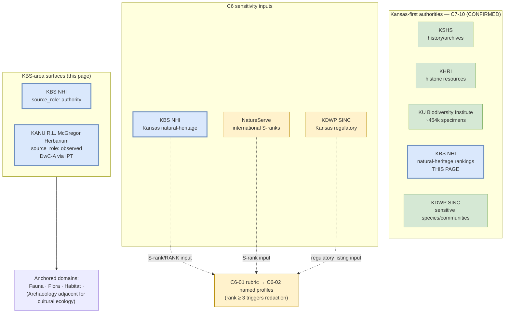

<!-- [KFM_META_BLOCK_V2]
doc_id: kfm://doc/docs-sources-catalog-kansas-kbs
title: Kansas Biological Survey (KBS) — incl. KU McGregor Herbarium (KANU)
type: product-page
version: v0.2
status: draft
owners: <PLACEHOLDER — Docs steward + Source steward for kansas>
created: 2026-05-21
updated: 2026-05-21
policy_label: public
related:
  - docs/sources/catalog/kansas/README.md
  - docs/sources/catalog/kansas/kdwp.md
  - docs/sources/catalog/kansas/ku-nhm.md
  - docs/sources/catalog/kansas/fhsu-sternberg.md
  - docs/sources/catalog/README.md
  - docs/sources/catalog/IDENTITY.md
  - docs/sources/catalog/PROFILES.md
  - docs/sources/catalog/RIGHTS-AND-SENSITIVITY-MAP.md
  - docs/sources/catalog/OPEN-QUESTIONS.md
  - docs/sources/catalog/_examples/stac-item-example.json
  - docs/sources/catalog/_template/SOURCE_PRODUCT_TEMPLATE.md
  - docs/doctrine/directory-rules.md
  - docs/domains/fauna/README.md
  - docs/domains/flora/README.md
  - docs/domains/habitat/README.md
  - docs/standards/SENSITIVITY_RUBRIC.md
  - docs/registers/VERIFICATION_BACKLOG.md
  - schemas/contracts/v1/source/source_descriptor.schema.json
  - schemas/contracts/v1/biodiversity/occurrence_evidence.schema.json
  - connectors/kansas/
  - data/registry/sources/
  - policy/sensitivity/
  - policy/rights/
tags: [kfm, docs, sources, catalog, kansas, kbs, kbs-nhi, kanu, mcgregor-herbarium, kansas-first, biodiversity, fauna, flora, habitat]
notes:
  - >-
    Product-page scope: this doc covers ONE product page under the kansas
    source family — the Kansas Biological Survey (KBS) at the University of
    Kansas, including its Natural Heritage Inventory (KBS NHI) and the paired
    R.L. McGregor Herbarium (KANU) flora surface. Listed in the kansas family
    README v0.2 §3 "Known Kansas sources without product pages yet" — this
    v0.2 revision creates the page.
  - >-
    Description grounded in atlas idea cards `C7-10` Kansas-First Domain
    Authorities (CONFIRMED: KBS NHI is one of five named Kansas-first
    authorities; "KU and KBS hold biodiversity occurrences and natural-heritage
    rankings"), `C10-06` Biodiversity Stack (corpus references KU McGregor
    Herbarium as a biodiversity briefing surface), `KFM-P2-IDEA-0019`
    (CONFIRMED Kansas-specific biodiversity authorities supplement GBIF — KANU
    named as primary in-state herbarium), `KFM-P2-PROG-0002` (Kansas flora
    watcher blueprint — PROPOSED DwC-A archives from KANU IPT), and Domains
    Atlas §flora source families (DOM-FLORA — "Kansas Biological Survey / KU
    herbarium surfaces").
  - >-
    Path correction (v0.1 → v0.2): the v0.1 scaffold referenced `connectors/kbs/`
    as a top-level connector family. That is incorrect — `kbs/` is NOT one of
    the nine canonical `directory-rules.md` v1.2 §7.3 families. The KBS adapter
    belongs under the CONFIRMED `connectors/kansas/` lane as
    `connectors/kansas/kbs/`. Surfaced as OPEN-KBS-01.
  - >-
    Source-role distinction: **KBS NHI** is `authority` (natural-heritage
    rankings, parallel with NatureServe and KDWP SINC); **KANU specimen
    records** are `observed` (specimen-backed observation). The two roles MUST
    be preserved separately in the descriptor.
[/KFM_META_BLOCK_V2] -->

# Kansas Biological Survey (KBS) — incl. KU McGregor Herbarium (KANU)

> The **Kansas Biological Survey** at the University of Kansas — a Kansas-first authority for biodiversity occurrences and natural-heritage rankings per CONFIRMED doctrine `C7-10` — paired with **KU R.L. McGregor Herbarium (KANU)** specimen exports per the Kansas flora watcher blueprint (`KFM-P2-PROG-0002`).

<!-- Badge row — Shields.io placeholders; replace targets once owners/CI/policies land -->


| Status | Owners | Last reviewed |
|---|---|---|
| Draft — PROPOSED scaffold, no admission decision; per-surface terms NEEDS VERIFICATION | `<Docs steward + Source steward for kansas — TODO assign>` | 2026-05-21 |

> [!IMPORTANT]
> **Two surfaces, two source-roles.** This product page documents **two paired KBS-area surfaces** that share an institutional home (University of Kansas / Kansas Biological Survey research center) but carry **different `source_role` values**: **KBS NHI** (Natural Heritage Inventory) is `authority` per `C7-10` — its natural-heritage rankings drive `C6` sensitivity policy alongside NatureServe and KDWP SINC. **KANU** (R.L. McGregor Herbarium) is `observed` — specimen-backed flora occurrences per `KFM-P2-IDEA-0019`. The descriptor MUST preserve both roles separately; collapsing them is a source-role violation per Atlas §24.1.3.

> [!CAUTION]
> **Restricted-taxa quarantine rule** (CONFIRMED per `KFM-P2-PROG-0002`). "Restricted taxa (NatureServe, listed species) are quarantined or redacted before any aggregate is published." This applies operationally to both KBS NHI rankings (which name the restricted taxa) and KANU specimen records (which carry the occurrences). KBS itself is one of the authorities that *defines* the restriction; that does not exempt KBS-derived aggregates from passing the quarantine gate.

---

## Quick jump

- [1. Overview](#1-overview)
- [2. Product identity & scope](#2-product-identity--scope)
- [3. Source authority](#3-source-authority)
- [4. Admission posture — paired authority + observed](#4-admission-posture--paired-authority--observed)
- [5. Catalog profiles used](#5-catalog-profiles-used)
- [6. Collection identity](#6-collection-identity)
- [7. Provenance fields (`kfm:provenance`)](#7-provenance-fields-kfmprovenance)
- [8. Temporal handling](#8-temporal-handling)
- [9. Geometry, projection, and taxonomic anchoring](#9-geometry-projection-and-taxonomic-anchoring)
- [10. Rights and sensitivity](#10-rights-and-sensitivity)
- [11. Validation and catalog closure](#11-validation-and-catalog-closure)
- [12. Path correction (v0.1 → v0.2)](#12-path-correction-v01--v02)
- [13. Related contracts and schemas](#13-related-contracts-and-schemas)
- [14. Related connectors and pipelines](#14-related-connectors-and-pipelines)
- [15. Examples](#15-examples)
- [16. Open questions](#16-open-questions)
- [17. Verification backlog](#17-verification-backlog)
- [Appendix A — Illustrative STAC × DwC Item skeleton (KANU)](#appendix-a--illustrative-stac--dwc-item-skeleton-kanu)
- [Appendix B — Atlas idea-card lineage](#appendix-b--atlas-idea-card-lineage)

---

## 1. Overview

The **Kansas Biological Survey** (KBS) is a research center at the University of Kansas. Within KFM, KBS surfaces are admitted as a **Kansas-first authority** per Pass-10 `C7-10` (CONFIRMED), which names KBS Natural Heritage Inventory (NHI) explicitly alongside KSHS, KHRI, KU Biodiversity Institute, and KDWP SINC. The corpus is also explicit that "KU and KBS hold biodiversity occurrences and natural-heritage rankings" (`C7-10` detail).

This product page covers two paired surfaces:

| Surface | What it provides | KFM `source_role` | Atlas citation |
|---|---|---|---|
| **KBS Natural Heritage Inventory (KBS NHI)** | Natural-heritage rankings (S-ranks, conservation status) for Kansas species and natural communities | `authority` | `C7-10` (CONFIRMED) |
| **KU R.L. McGregor Herbarium (KANU)** | Specimen-backed flora occurrence records (DwC-A via IPT) | `observed` | `KFM-P2-IDEA-0019` (CONFIRMED), `KFM-P2-PROG-0002` (PROPOSED watcher) |

**CONFIRMED facts:**

| Attribute | Value | Citation |
|---|---|---|
| Institutional home | University of Kansas — Kansas Biological Survey research center | `C7-10` |
| Authority class | Kansas-first domain authority (last resort for entities not covered by federal/international) | `C7-10` |
| KBS NHI provides | Natural-heritage rankings (parallel with NatureServe + KDWP SINC) | `C7-10` |
| KANU role | Primary in-state herbarium; specimen-backed flora authority | `KFM-P2-IDEA-0019` |
| Preferred access (KANU) | DwC-A archives via IPT (PROPOSED watcher per `KFM-P2-PROG-0002`) | `KFM-P2-PROG-0002` |
| Quarantine rule | Restricted taxa (NatureServe, listed species) quarantined or redacted before any aggregate is published | `KFM-P2-PROG-0002` |
| Domain Atlas reference | "Kansas Biological Survey / KU herbarium surfaces" listed as a key flora source family | Domains Atlas §flora (DOM-FLORA) |

> [!NOTE]
> **KBS NHI vs KU NHM vs Sternberg disambiguation.** Three KU-area / Kansas-area biodiversity surfaces are commonly confused:
> - **KBS NHI** (THIS PAGE) — Kansas Biological Survey's Natural Heritage Inventory; authority for natural-heritage rankings.
> - **KU NHM** (sibling page [`./ku-nhm.md`](./ku-nhm.md)) — KU Biodiversity Institute / Natural History Museum; ~454k specimens per `C10-06`.
> - **FHSU Sternberg** (sibling page [`./fhsu-sternberg.md`](./fhsu-sternberg.md)) — different institution (FHSU), Kansas in-state collection of record.
> - **KANU** — the R.L. McGregor Herbarium at KU, paired with KBS on this page per the Domains Atlas §flora grouping ("Kansas Biological Survey / KU herbarium surfaces").

NEEDS VERIFICATION: scope of KBS NHI rankings coverage, KANU specimen count, current IPT endpoint URL, license terms, harvest cadence.

[Back to top](#quick-jump)

---

## 2. Product identity & scope



| Field | Value | Status |
|---|---|---|
| Product slug | `kbs` | PROPOSED file slug |
| Source family | `kansas/` — CONFIRMED §7.3 canonical at commit `b6a27916bbb9e07cbf3752870c867476e1e094e7` | CONFIRMED family lane |
| Institutional home | University of Kansas — Kansas Biological Survey research center | CONFIRMED |
| Surfaces covered | KBS NHI + KANU (R.L. McGregor Herbarium) | CONFIRMED pairing per Domains Atlas §flora |
| `source_family` enum value | `other` (closed enum is `ebird \| inat \| gbif \| bison \| eddmaps \| other` per `KFM-P3-PROG-0001`) | CONFIRMED enum |
| KFM `source_role` (KBS NHI) | `authority` | PROPOSED per Atlas §24.1.3 (natural-heritage-rankings = authority role) |
| KFM `source_role` (KANU) | `observed` | PROPOSED per Atlas §24.1.3 (specimen-backed observation) |
| Anchor domains | Fauna · Flora · Habitat | CONFIRMED per Domains Atlas §flora + `C7-10` |

> [!TIP]
> **One product page, two descriptors.** Because KBS NHI and KANU carry different source-roles and different access mechanics (rankings table vs DwC-A specimen archive), KFM admits each on its **own `SourceDescriptor`** (PROPOSED `source_id`s: `kbs-nhi` and `kbs-kanu-mcgregor`). The two descriptors share a common institutional steward and the parallel-anchor rule per `C7-10`, but they are NOT a single descriptor with two modes. Collapsing them is a source-role anti-collapse violation.

[Back to top](#quick-jump)

---

## 3. Source authority

See [`data/registry/sources/`](../../../../data/registry/sources/) for the authoritative `SourceDescriptor`s (per surface). **Do not duplicate descriptor fields here.**

For the source-family-level reading (Kansas authorities, parallel-anchor rule, non-API sources tolerance), see the sibling family README [`./README.md`](./README.md).

> [!IMPORTANT]
> Product pages **cite** authority; they do not **own** it. The descriptors are the source of truth for KBS NHI ranking schemes, KANU IPT endpoint, rights, sensitivity, cadence, and citation. The schema (per ADR-0001 default home `schemas/contracts/v1/source/source_descriptor.schema.json`) is the source of truth for descriptor shape.

[Back to top](#quick-jump)

---

## 4. Admission posture — paired authority + observed

KBS surfaces are admitted under the standard Atlas §24.1.3 source-role rules, with two specific operational tensions worth foregrounding:

| Rule (CONFIRMED doctrine) | Effect for KBS-area surfaces |
|---|---|
| `source_role` is set at admission and **never edited in place**; corrections produce a new descriptor + `CorrectionNotice` | One descriptor per surface; per-record updates flow through the connector, not the descriptor |
| **Source-role anti-collapse** (Atlas §24.1.3) | KBS NHI (`authority`) and KANU (`observed`) MUST NOT be collapsed into a single descriptor. An AI summary that treats a KANU specimen-locality as "the KBS-authoritative natural-heritage finding" is a role-collapse violation |
| KBS NHI rankings drive `C6` sensitivity | Per `C7-10` ("KDWP SINC defines sensitivity rankings… that drives C6 redaction policy directly") and parallel logic for KBS NHI — rare-taxa records receive `C6-01` rank ≥ 3 with named profile `point_10km_hex_seeded_v1` (`C6-02`) |
| **KANU specimen-backed > crowd-observation** (CONFIRMED, `KFM-P2-PROG-0002`) | "Specimen-backed observations are preferred over crowd observations." Where a KANU specimen and an iNaturalist observation contradict, the specimen prevails as a higher-confidence record |
| **Restricted-taxa quarantine rule** (CONFIRMED, `KFM-P2-PROG-0002`) | "Restricted taxa (NatureServe, listed species) are quarantined or redacted before any aggregate is published." KBS-authored aggregates are NOT exempt; the rule applies regardless of which authority defined the restriction |
| Parallel-anchor rule (CONFIRMED, `C7-10`) | KBS NHI / KANU identifiers stored **in parallel with** NatureServe S-rank IRIs, ITIS TSN, GBIF Backbone DOI (`10.15468/39omei`), USDA PLANTS — not replacing them |

> [!WARNING]
> **KBS NHI is one of three S-rank-style inputs to C6, not the only one.** `C7-10` makes NatureServe and KDWP SINC parallel authorities. When the three disagree on a Kansas species' sensitivity rank, KFM does not silently pick a winner — the disagreement is recorded and resolution defers to the steward (operational policy TBD; surfaced as OPEN-KBS-04).

[Back to top](#quick-jump)

---

## 5. Catalog profiles used

> [!NOTE]
> KBS NHI rankings are **tabular authority records** (taxon → rank); KANU specimens are **biodiversity occurrences**. The STAC × DwC hybrid (`C4-03`, CONFIRMED) applies to KANU; KBS NHI is closer to a DCAT distribution + PROV-O lineage with a `kfm:authority` extension. The two surfaces use different catalog encodings.

| Profile | Lane | Used by KBS NHI? | Used by KANU? | Citation |
|---|---|---|---|---|
| STAC × Darwin Core hybrid | `data/catalog/stac/` (DwC inside `properties.taxon`) | **No** — rankings are not occurrences | **Yes (PROPOSED)** — specimen occurrences | `C4-03` (CONFIRMED for biodiversity occurrences) |
| STAC Item (point geometry + datetime) | `data/catalog/stac/` | **No** | **Yes (PROPOSED)** — per specimen | `C4-01`, `C4-02` |
| DCAT distribution | `data/catalog/dcat/` | **Yes (PROPOSED)** — rankings table as dataset | **Yes (PROPOSED)** — DwC-A archive as distribution | `C4-05` |
| PROV-O | `data/catalog/prov/` | **Yes (PROPOSED)** — required to carry ranking provenance | **Yes (PROPOSED)** — specimen → expedition → determiner lineage | `C8-03`, `C5-08` |
| Domain projection (`fauna` / `flora` / `habitat`) | `data/catalog/domain/<domain>/` | **Yes (PROPOSED)** | **Yes (PROPOSED)** — primarily `flora` | Directory Rules §6.1 |
| `kfm:care` extension | catalog | **Possibly** — natural-heritage rankings touching tribal/Indigenous-knowledge ties require CARE review | **Possibly** — per specimen if ethnobotanical ties | `C15-02`, `C15-03` |

[Back to top](#quick-jump)

---

## 6. Collection identity

- **PROPOSED Collection id patterns** (per `C4-02`, two surfaces = two Collections):
  - `kfm-<org>-kbs-nhi` (KBS Natural Heritage Inventory rankings)
  - `kfm-<org>-kbs-kanu-mcgregor` (KU R.L. McGregor Herbarium specimens)
- **PROPOSED namespace:** `kfm:` — see **OPEN-DSC-03**; the `kfm:` vs `ks-kfm:` choice is unsettled per `C4-01`. The Kansas family is the most plausible argument **for** `ks-kfm:`.
- **Asset roles** (PROPOSED):

| Surface | Asset key | Role | Content |
|---|---|---|---|
| KBS NHI | `rankings_table` | `data` | Tabular `(taxon_id, rank, scope, valid_from, valid_to)` records |
| KBS NHI | `ranking_provenance` | `metadata` | PROV-O record of rank-assignment review |
| KANU | `dwc_archive` | `data` | DwC-A `meta.xml` + occurrence/taxon/multimedia CSVs |
| KANU | `specimen_image` | `data` (optional) | Specimen sheet images (per specimen, where available) |
| both | `evidence_bundle` | `metadata` | KFM evidence bundle JSON-LD |

NEEDS VERIFICATION — confirm exact asset-key convention against `schemas/contracts/v1/source/`.

[Back to top](#quick-jump)

---

## 7. Provenance fields (`kfm:provenance`)

STAC `item.properties.kfm:provenance` block (CONFIRMED block shape per `C4-01`):

| Field | Type | Description | Citation |
|---|---|---|---|
| `spec_hash` | sha256 hex | Deterministic digest of the canonical record (taxon + rank for KBS NHI; institutionCode + catalogNumber for KANU per `KFM-P2-PROG-0001` dedup recipe) | `C4-01`, `C1-02` |
| `evidence_bundle_ref` | `kfm://evidence/<digest>` | Content-addressed JSON-LD bundle with receipts and validations | `C4-01`, `C4-04` |
| `run_record_ref` | `kfm://run/<run-id>` | Pointer to the connector run record | `C4-01` |
| `audit_ref` | `kfm://audit/<attestation-id>` | SLSA / OPA attestation pointer | `C4-01` |
| `policy_digest` | sha256 hex | Digest of the policy bundle in force at promotion | `C4-01` |

Per-asset integrity: `file:checksum` (per-file SHA-256, CONFIRMED per `C4-01` + `C3-02`).

> [!TIP]
> **Dedup with cross-source overlap** (CONFIRMED recipe per `KFM-P2-PROG-0001`). When a KANU specimen also appears in GBIF, iDigBio, or Symbiota, dedup with **`(institutionCode, catalogNumber)`** as the primary key plus a rounded-coordinate fallback. **KANU remains the authority-of-record** even when the aggregator carries the record — preserve `kfm:source/kbs-kanu-mcgregor` as the institutional anchor and add the aggregator as a related-source reference.

[Back to top](#quick-jump)

---

## 8. Temporal handling

PROPOSED — keep distinct **source / observed / valid / retrieval / release / correction** times where material (CONFIRMED doctrine, Atlas §24.8).

| Time | Meaning for KBS NHI rankings | Meaning for KANU specimen records |
|---|---|---|
| Source time | When KBS published the ranking version | When the KANU IPT released the DwC-A archive |
| Observed time | N/A (rankings are not field observations) | The collection event's `eventDate` (DwC) |
| Valid time | The validity envelope KBS asserts for the ranking (start → end, where applicable) | The instant of the field observation (typically equals observed time) |
| Retrieval time | When the KFM connector pulled the ranking | When the connector pulled the archive |
| Release time | When KFM published the public-safe derivative | When KFM published the public-safe derivative |
| Correction time | When a `CorrectionNotice` updated the rankings (revisions are routine for S-ranks) | When a `CorrectionNotice` updated specimen records (re-determinations are routine) |

> [!NOTE]
> **Re-determination is a `CorrectionNotice`, not a new record.** When a KANU specimen is re-determined to a different taxon, the original record is corrected via `CorrectionNotice` and a new descriptor row is created; the prior identification is preserved in lineage. Treating re-determination as a new observation is a temporal-collapse violation.

[Back to top](#quick-jump)

---

## 9. Geometry, projection, and taxonomic anchoring

PROPOSED — confirm CRS and geometry against KANU IPT outputs; rankings (KBS NHI) typically have no per-record geometry.

| Aspect | PROPOSED value | Citation |
|---|---|---|
| Native CRS (KANU specimens) | EPSG:4326 (lat/lon decimal degrees) — DwC convention | DwC standard; NEEDS VERIFICATION |
| Geometry per Item (KANU) | `Point` (collection event coordinates) | Standard for occurrence records |
| Geometry per Item (KBS NHI) | None (taxon-rank table, not per-locality) | N/A |
| Coordinate uncertainty | DwC `coordinateUncertaintyInMeters` preserved per `KFM-P2-PROG-0001` | Atlas |
| STAC `proj` fields (KANU) | `proj:code`, `proj:bbox`, `proj:geometry`, `proj:shape`, `proj:transform` validated by front-matter schema | `KFM-P27-PROG-0011` (PROPOSED) |

> [!IMPORTANT]
> **Taxonomy anchoring rule** (CONFIRMED, `C7-07` + `C7-08` + `KFM-P2-IDEA-0019`). For KANU plant records, the canonical anchor ladder is:
> 1. **USDA PLANTS** — primary nomenclature authority for U.S. plant names (`KFM-P2-IDEA-0019`)
> 2. **ITIS TSN** — secondary (`C7-07`)
> 3. **GBIF Backbone Taxonomy** — fallback (DOI `10.15468/39omei`, version pinned in receipt; `C7-08`)
> 4. **Disagreement report** if authorities conflict — do not silently pick one
> Per `KFM-P2-IDEA-0019` tension: "Nomenclature divergence between sources is real; the corpus directs that **USDA PLANTS be the authority for plant names**, with documented exceptions."

[Back to top](#quick-jump)

---

## 10. Rights and sensitivity

NEEDS VERIFICATION per release — see [`policy/sensitivity/`](../../../../policy/sensitivity/) and [`RIGHTS-AND-SENSITIVITY-MAP.md`](../RIGHTS-AND-SENSITIVITY-MAP.md). **Do not restate policy here.**

> [!CAUTION]
> **Restricted-taxa quarantine** (CONFIRMED, `KFM-P2-PROG-0002`). "Restricted taxa (NatureServe, listed species) are quarantined or redacted before any aggregate is published." This is the central operational rule for both KBS NHI and KANU. The rule applies regardless of who defined the restriction — KBS-authored aggregates are NOT exempt.

| Concern | KBS NHI posture | KANU posture |
|---|---|---|
| License | NEEDS VERIFICATION — KBS NHI rankings (likely require attribution); unknown → DENY | NEEDS VERIFICATION — KANU IPT terms; specimen records typically attribution-required |
| Attribution | Required — KFM citation template MUST preserve "Kansas Biological Survey" + ranking version | Required — KFM citation template MUST preserve "R.L. McGregor Herbarium (KANU)" + collector + date |
| Sensitivity rank (`C6-01`) | NHI rankings themselves are public (rank labels), but rare-taxa records they cover are rank ≥ 3 → DENY exact location | Rare-taxa specimens (NHI / NatureServe / KDWP SINC S1/S2): default rank 3+; profile `point_10km_hex_seeded_v1` (`C6-02`) |
| Geoprivacy | Not applicable (no per-locality geometry) | DwC `coordinateUncertaintyInMeters` preserved; sensitive specimens generalize geometry per redaction profile |
| CARE / `kfm:care` extension | Applies if NHI rankings touch tribal-led restoration / Indigenous-knowledge ties | Applies for ethnobotanical specimens or specimens collected under tribal partnerships |
| Cross-source ranking disagreement | NHI vs NatureServe vs KDWP SINC — surface in disagreement report, do not silently pick winner | N/A |

[Back to top](#quick-jump)

---

## 11. Validation and catalog closure

| Gate | Purpose | Status |
|---|---|---|
| Catalog closure required before public release | No PUBLISHED edge from WORK / QUARANTINE; release decisions live in `release/` | CONFIRMED doctrine; original scaffold cites `KFM-P1-IDEA-0020` (NEEDS VERIFICATION) |
| STAC Projection front-matter validation (KANU) | `proj:code`, `proj:bbox`, `proj:geometry`, `proj:shape`, `proj:transform` validated | PROPOSED — `KFM-P27-PROG-0011`; original scaffold also cites `KFM-P27-FEAT-0003` (NEEDS VERIFICATION) |
| STAC checksum closure against `ReleaseManifest` digest | Per-asset `file:checksum` matches manifest entry | PROPOSED — original scaffold cites `KFM-P22-PROG-0037` (NEEDS VERIFICATION) |
| Spec-hash-match gate | Claimed `spec_hash` matches recomputed hash | CONFIRMED doctrine — `C5-04`, `C1-02` |
| Lineage required | Every published asset has OpenLineage trail back to receipts | CONFIRMED doctrine — `C5-08` |
| Default-deny promotion | Promotion fails closed; explicit allow-rule required | CONFIRMED doctrine — `C5-02` |
| **Restricted-taxa quarantine gate** | Restricted taxa (NHI / NatureServe / KDWP SINC ranked sensitive) MUST be quarantined or redacted before any aggregate publishes | CONFIRMED doctrine per `KFM-P2-PROG-0002`; implementation PROPOSED |
| **Specimen-preferred-over-crowd gate** | When KANU specimen contradicts iNaturalist crowd observation, specimen prevails; KFM records the disagreement | CONFIRMED doctrine per `KFM-P2-PROG-0002`; implementation PROPOSED |
| **Parallel-anchor rule gate** | Kansas IRI (KBS NHI / KANU) stored in parallel with NatureServe + ITIS + GBIF + USDA PLANTS anchors | CONFIRMED doctrine per `C7-10`; implementation PROPOSED |
| **Source-role-anti-collapse gate** | KBS NHI (`authority`) and KANU (`observed`) MUST NOT merge into one descriptor | CONFIRMED doctrine per Atlas §24.1.3; implementation PROPOSED |
| Citation validation | Every released record resolves to an `EvidenceBundle` | CONFIRMED doctrine — `C4-04`, cite-or-abstain |

[Back to top](#quick-jump)

---

## 12. Path correction (v0.1 → v0.2)

> [!IMPORTANT]
> **OPEN-KBS-01.** The v0.1 scaffold referenced `connectors/kbs/` as a top-level connector family. That is incorrect. Per Directory Rules v1.2 §7.3, the canonical connector families are exactly nine: `usgs/`, `fema/`, `noaa/`, `nrcs/`, `kansas/`, `gbif/`, `inaturalist/`, `census/`, `local_upload/`. **`kbs/` is NOT one of them.** The KBS adapter belongs under the CONFIRMED `connectors/kansas/` family lane as `connectors/kansas/kbs/`. This mirrors the OPEN-MESO-01 correction made for the Kansas Mesonet product page.

| Item | v0.1 (incorrect) | v0.2 (corrected) | Citation |
|---|---|---|---|
| Connector path | `connectors/kbs/` (top-level, non-canonical) | `connectors/kansas/kbs/` (per-institution adapter under the CONFIRMED §7.3 family) | Directory Rules v1.2 §7.3; Repository Structure Guiding Document at commit `b6a27916bbb9e07cbf3752870c867476e1e094e7` |
| Raw output path | `data/raw/<domain>/kbs/<run_id>/` | unchanged (`<source_id>` is still `kbs-nhi` or `kbs-kanu-mcgregor`) | Directory Rules §7.3 |
| Descriptor home | `data/registry/sources/kbs/` (likely v0.1 implication) | `data/registry/sources/kansas/kbs-nhi/` and `data/registry/sources/kansas/kbs-kanu-mcgregor/` (PROPOSED per-surface) | NEEDS VERIFICATION |

[Back to top](#quick-jump)

---

## 13. Related contracts and schemas

- [`contracts/`](../../../../contracts/) — object families. KBS surfaces contribute evidence into `OccurrenceEvidence`, `OccurrencePublic`, `OccurrenceRestricted`, `ConservationStatus`, `RangePolygon`, `SensitiveSite` (Fauna/Flora object families per Domains Atlas).
- [`schemas/contracts/v1/source/`](../../../../schemas/contracts/v1/source/) — `SourceDescriptor` machine shape per ADR-0001.
- [`schemas/contracts/v1/biodiversity/`](../../../../schemas/contracts/v1/biodiversity/) — PROPOSED consolidation home for `OccurrenceEvidenceObject` (per `KFM-P3-PROG-0001`); current PROPOSED home `schemas/occurrence_evidence/occurrence_evidence.schema.json`.

[Back to top](#quick-jump)

---

## 14. Related connectors and pipelines

- [`connectors/kansas/`](../../../../connectors/kansas/) — **CONFIRMED (at commit `b6a27916bbb9e07cbf3752870c867476e1e094e7`)** family lane per Directory Rules v1.2 §7.3.
- [`connectors/kansas/kbs/`](../../../../connectors/kansas/kbs/) — per-institution adapter (PROPOSED — corrected from v0.1's incorrect top-level `connectors/kbs/`; see §12). Adapter may further sub-organize per surface (`connectors/kansas/kbs/nhi/`, `connectors/kansas/kbs/kanu-mcgregor/`) — NEEDS VERIFICATION.
- Pipelines: [`pipelines/ingest/`](../../../../pipelines/ingest/), [`pipelines/normalize/`](../../../../pipelines/normalize/), [`pipelines/validate/`](../../../../pipelines/validate/), [`pipelines/catalog/`](../../../../pipelines/catalog/).
- Pipeline specs: [`pipeline_specs/fauna/`](../../../../pipeline_specs/fauna/), [`pipeline_specs/flora/`](../../../../pipeline_specs/flora/), [`pipeline_specs/habitat/`](../../../../pipeline_specs/habitat/) (PROPOSED — confirm per surface).
- Related blueprint: **`kansas_flora_watch`** per `KFM-P2-PROG-0002` (PROPOSED watcher pulling DwC-A archives from the KU R.L. McGregor Herbarium (KANU) IPT and the Kansas State University Herbarium (KSC) IPT, with GBIF/iDigBio as coverage and USDA PLANTS as taxonomy/state-presence baseline).

> [!IMPORTANT]
> **Connector-as-non-publisher** rule (CONFIRMED, Directory Rules §7.3). `connectors/kansas/kbs/` MUST write only to `data/raw/<domain>/<source_id>/<run_id>/` or `data/quarantine/...`. It MUST NOT write to `data/processed/`, `data/catalog/`, or `data/published/`.

[Back to top](#quick-jump)

---

## 15. Examples

*(Illustrative only — do not treat as authoritative.)*

See [`_examples/stac-item-example.json`](../_examples/stac-item-example.json) for the minimal STAC + `kfm:provenance` shape. The skeleton in Appendix A shows the **STAC × DwC** envelope for a KANU specimen Item.

[Back to top](#quick-jump)

---

## 16. Open questions

- **OPEN-KBS-01** — Resolve `connectors/kbs/` (v0.1, top-level) vs `connectors/kansas/kbs/` (v0.2, under CONFIRMED §7.3 family). v0.2 adopts the latter; mounted-repo verification still required.
- **OPEN-KBS-02** — Confirm KBS NHI access modality: web portal? PDF reports? GIS exports? `C7-10` warns that Kansas authorities commonly lack stable APIs — KBS NHI specifically may require PDF/CSV harvest.
- **OPEN-KBS-03** — Confirm whether KBS NHI and KANU should share a single per-institution adapter (`connectors/kansas/kbs/`) or each get its own (`connectors/kansas/kbs/nhi/`, `connectors/kansas/kbs/kanu-mcgregor/`).
- **OPEN-KBS-04** — Resolve NHI vs NatureServe vs KDWP SINC disagreement policy: when the three authorities disagree on a Kansas species' rank, what is the operational tie-breaker?
- **OPEN-KBS-05** — Confirm KANU IPT endpoint URL and DwC-A archive cadence.
- **OPEN-KBS-06** — Confirm KANU rights / license terms; specimen-image rights may differ from specimen-record rights.
- **OPEN-DSC-03** — Settle `kfm:` vs `ks-kfm:` STAC namespace (`C4-01`). The Kansas family is the most plausible argument **for** `ks-kfm:`.
- Confirm KBS NHI ranking-coverage scope (taxa-only vs taxa + natural-communities; spatial coverage).
- Confirm whether `kansas_flora_watch` (`KFM-P2-PROG-0002`) is the canonical pipeline for the KANU surface or whether KFM uses a different blueprint.
- Confirm KBS NHI cooperator agreements and whether published rankings are CC-BY-derivative or require per-use review.

[Back to top](#quick-jump)

---

## 17. Verification backlog

Inheritance: every family-level OPEN item from [`./README.md`](./README.md#11-open-questions) applies. Product-specific items below.

| Item | Evidence that would settle it | Status |
|---|---|---|
| OPEN-KBS-01 — Per-institution adapter path `connectors/kansas/kbs/` under the CONFIRMED `connectors/kansas/` lane | Mounted-repo `connectors/kansas/` tree | NEEDS VERIFICATION |
| OPEN-KBS-02 — KBS NHI access modality | Source steward + KBS NHI contact | NEEDS VERIFICATION |
| OPEN-KBS-03 — Single adapter vs per-surface adapters | ADR or per-root README | OPEN |
| OPEN-KBS-04 — NHI / NatureServe / KDWP SINC disagreement policy | Steward decision; ADR | OPEN |
| OPEN-KBS-05 — KANU IPT endpoint URL and DwC-A cadence | Source steward + KANU IPT docs review | NEEDS VERIFICATION |
| OPEN-KBS-06 — KANU rights / license per record class | Source steward + KANU current terms | NEEDS VERIFICATION |
| `data/registry/sources/` descriptor instances (two — `kbs-nhi`, `kbs-kanu-mcgregor`) | Mounted registry + descriptor files | NEEDS VERIFICATION |
| KBS NHI ranking-coverage scope (taxa vs taxa + natural communities; spatial) | Source steward + KBS NHI documentation | NEEDS VERIFICATION |
| `kansas_flora_watch` blueprint adoption per `KFM-P2-PROG-0002` | Mounted-repo pipeline spec | NEEDS VERIFICATION |
| Per-version license string for both surfaces | Source steward + current terms | NEEDS VERIFICATION |
| Native CRS confirmation for KANU records | Source steward + KANU IPT metadata | NEEDS VERIFICATION |
| Specimen-count baseline for KANU | Source steward + KANU public report | NEEDS VERIFICATION |
| `KFM-P27-FEAT-0003` (STAC Projection lint) ID and relationship to `KFM-P27-PROG-0011` | Idea index entry | NEEDS VERIFICATION |
| `KFM-P22-PROG-0037` (STAC checksum closure) idea card | Idea index entry | NEEDS VERIFICATION |
| `KFM-P1-IDEA-0020` (catalog closure) idea card | Idea index entry | NEEDS VERIFICATION |
| Sibling family-level files present (`PROFILES.md`, `IDENTITY.md`, `RIGHTS-AND-SENSITIVITY-MAP.md`, `OPEN-QUESTIONS.md`, `_template/SOURCE_PRODUCT_TEMPLATE.md`) | Mounted-repo `docs/sources/catalog/` tree | NEEDS VERIFICATION |
| Pipeline-spec lanes (`pipeline_specs/fauna/`, `pipeline_specs/flora/`, `pipeline_specs/habitat/`) presence | Mounted-repo `pipeline_specs/` tree | NEEDS VERIFICATION |

[Back to top](#quick-jump)

---

## Appendix A — Illustrative STAC × DwC Item skeleton (KANU)

> [!NOTE]
> **Illustrative only.** Field names follow STAC core + `proj` extension + `kfm:provenance` (`C4-01`) + STAC × DwC hybrid (`C4-03`) with DwC inside `properties.taxon`. The authoritative STAC × DwC profile lives in (PROPOSED) `schemas/contracts/v1/biodiversity/`. Do not treat this block as a valid fixture without schema-side validation. KBS NHI is encoded differently (DCAT distribution + PROV-O, not STAC) and is not shown here.

<details>
<summary>Click to expand — illustrative STAC × DwC Item for a KANU specimen (NOT validated, NOT canonical)</summary>

```json
{
  "type": "Feature",
  "stac_version": "1.0.0",
  "id": "kfm://occurrence/kanu/<institutionCode>:<catalogNumber>",
  "geometry": { "type": "Point", "coordinates": [-95.24, 38.95] },
  "bbox": [-95.24, 38.95, -95.24, 38.95],
  "properties": {
    "datetime": "1923-06-12T00:00:00Z",
    "proj:code": "EPSG:4326",
    "taxon": {
      "scientific_name": "<accepted scientific name>",
      "accepted_scientific_name": "<accepted scientific name>",
      "common_name": "<common name>",
      "taxon_rank": "species",
      "usda_plants_symbol": "<USDA PLANTS Symbol>",
      "itis_tsn": "<ITIS-TSN>",
      "gbif_backbone_doi": "10.15468/39omei",
      "gbif_backbone_version": "<version>",
      "nature_serve_s_rank": "<S-rank, if any>",
      "kbs_nhi_rank": "<KBS NHI rank, if any>",
      "kdwp_status": "<status>",
      "sensitivity_rank": 1
    },
    "kfm:source": {
      "source_id": "kbs-kanu-mcgregor",
      "source_family": "kansas",
      "source_role": "observed",
      "source_record_id": "kanu:<institutionCode>:<catalogNumber>"
    },
    "kfm:provenance": {
      "spec_hash": "sha256:<hex>",
      "evidence_bundle_ref": "kfm://evidence/<digest>",
      "run_record_ref": "kfm://run/<run-id>",
      "audit_ref": "kfm://audit/<attestation-id>",
      "policy_digest": "sha256:<hex>"
    },
    "kfm:rights": {
      "license": "<NEEDS VERIFICATION — KANU IPT terms>",
      "attribution": "R.L. McGregor Herbarium (KANU), University of Kansas. <collector>, <date>."
    },
    "kfm:specimen": {
      "institution_code": "KANU",
      "collection_code": "<collection-code>",
      "catalog_number": "<catalogNumber>",
      "collector": "<collector-name>",
      "determiner": "<determiner-name>",
      "determination_date": "<determination-date>",
      "preserved_as": "herbarium-sheet"
    },
    "kfm:geoprivacy": {
      "status": "open",
      "coordinate_uncertainty_m": 250,
      "public_safe_geometry": null
    },
    "redaction_profile": "kfm:redact:none"
  },
  "assets": {
    "specimen_image": {
      "href": "./<catalogNumber>.jpg",
      "type": "image/jpeg",
      "roles": ["data"],
      "file:checksum": "sha256:<hex>"
    },
    "evidence_bundle": {
      "href": "./<digest>.evidence.jsonld",
      "type": "application/ld+json",
      "roles": ["metadata"],
      "file:checksum": "sha256:<hex>"
    }
  },
  "links": [
    { "rel": "collection", "href": "./collection.json" },
    { "rel": "self", "href": "./<id>.json" },
    { "rel": "via", "href": "<kanu-ipt-endpoint>", "title": "Upstream KANU IPT" }
  ]
}
```

</details>

[Back to top](#quick-jump)

---

## Appendix B — Atlas idea-card lineage

For traceability into the KFM Idea Index spine, this brief draws on the following atlas cards.

<details>
<summary>Click to expand — idea-card lineage</summary>

| Stable ID | Title | Status (atlas) | Relevance to this brief |
|---|---|---|---|
| `C7-10` | Kansas-First Domain Authorities | CONFIRMED (Pass-10) | Names KBS NHI as one of five Kansas-first authorities; "KU and KBS hold biodiversity occurrences and natural-heritage rankings" |
| `C10-06` | Biodiversity Stack | CONFIRMED (Pass-10) | Names KU McGregor Herbarium as a biodiversity briefing surface |
| `C7-07` | ITIS TSN | CONFIRMED (Pass-10) | Taxonomy anchor secondary; used in §9 |
| `C7-08` | GBIF Backbone Taxonomy DOI `10.15468/39omei` | CONFIRMED (Pass-10) | Taxonomy anchor fallback; used in §9 |
| `C6-01` | Sensitivity rubric 0–5 | CONFIRMED (Pass-10) | Rank-3 default profile `point_10km_hex_seeded_v1` for KBS-NHI-ranked rare taxa |
| `C6-02` | Named redaction profiles | CONFIRMED (Pass-10) | Profile-id convention referenced in §10 |
| `C4-01` | STAC `kfm:provenance` namespace | CONFIRMED (Pass-10) | Provenance block shape used in §7 |
| `C4-02` | STAC Collection | CONFIRMED (Pass-10) | Collection-id convention referenced in §6 |
| `C4-03` | STAC × Darwin Core hybrid | CONFIRMED (Pass-10) | Catalog encoding for KANU specimens; NOT applicable to KBS NHI |
| `C5-02` | Default-deny promotion | CONFIRMED (Pass-10) | Anchors deny-by-default sensitivity posture |
| `C5-04` | Spec-hash-match gate | CONFIRMED (Pass-10) | Promotion gate |
| `C5-08` | Lineage required | CONFIRMED (Pass-10) | OpenLineage trail to receipts |
| `C15-02` / `C15-03` | `kfm:care` extension + OPA default-deny on CARE-tagged | CONFIRMED (Pass-10) | Applies for ethnobotanical specimens or tribal-led restoration ties |
| `KFM-P2-IDEA-0019` | KANU, KSC, iDigBio, USDA PLANTS as Kansas-specific biodiversity authorities | CONFIRMED, Pass 32 | "University of Kansas Herbarium (KANU)" named as primary in-state herbarium; USDA PLANTS as the plant nomenclature authority |
| `KFM-P2-IDEA-0018` | GBIF as canonical aggregator | CONFIRMED, Pass 32 | KANU specimens supplement GBIF; KANU remains authority-of-record |
| `KFM-P2-PROG-0001` | Biodiversity ETL recipe | active, Pass 32 | Dedup primary key `(institutionCode, catalogNumber)` for KANU + GBIF/iDigBio overlap |
| `KFM-P2-PROG-0002` | Kansas flora watcher (`kansas_flora_watch`) blueprint | active, Pass 32 | DwC-A archives from KANU IPT + KSC IPT; specimen-backed > crowd; restricted taxa quarantine rule |
| `KFM-P3-PROG-0001` | OccurrenceEvidenceObject + `source_family` enum | active, Pass 32 | KBS falls under `source_family: other` (closed enum) |
| `KFM-P19-IDEA-0005` | KDWP listing status as canonical regulatory context | active, Pass 32 | Sibling authority to KBS NHI; both drive `C6` sensitivity policy |
| `KFM-P24-IDEA-0002` / `KFM-P24-PROG-0013` | Sensitive species deny-by-default + redaction policy | active, Pass 32 | Operational gates for restricted-taxa quarantine |

</details>

[Back to top](#quick-jump)

---

### Footer

> **Related:** [`./README.md`](./README.md) (kansas family landing) · [`./kdwp.md`](./kdwp.md) (sibling Kansas authority) · [`./ku-nhm.md`](./ku-nhm.md) (sibling KU biodiversity surface — disambiguation NOTE in §1) · [`./fhsu-sternberg.md`](./fhsu-sternberg.md) (sibling in-state biodiversity collection) · [`../README.md`](../README.md) (catalog index) · [`../IDENTITY.md`](../IDENTITY.md) · [`../PROFILES.md`](../PROFILES.md) · [`../RIGHTS-AND-SENSITIVITY-MAP.md`](../RIGHTS-AND-SENSITIVITY-MAP.md) · [`../OPEN-QUESTIONS.md`](../OPEN-QUESTIONS.md) · [Directory Rules](../../../doctrine/directory-rules.md) · [Fauna domain](../../../domains/fauna/README.md) · [Flora domain](../../../domains/flora/README.md) · [Habitat domain](../../../domains/habitat/README.md)
> **Last updated:** 2026-05-21 *(Claude Code product-page revision; v0.1 → v0.2)* · **Status:** draft · **Authority of this doc:** explanatory product-page; does **not** decide admission, activation, or release. Family lane `connectors/kansas/` is CONFIRMED §7.3 at commit `b6a27916bbb9e07cbf3752870c867476e1e094e7`. Per-institution adapter `connectors/kansas/kbs/` is **PROPOSED** (corrected from v0.1's incorrect top-level `connectors/kbs/`).
> [⬆ Back to top](#kansas-biological-survey-kbs--incl-ku-mcgregor-herbarium-kanu)
