<!-- [KFM_META_BLOCK_V2]
doc_id: kfm://doc/docs-sources-catalog-kansas-kcc-oil-gas-reg
title: Kansas Corporation Commission — Oil and Gas Regulatory Data
type: product-page
version: v0.2
status: draft
owners: <PLACEHOLDER — Docs steward + Source steward for kansas>
created: 2026-05-21
updated: 2026-05-21
policy_label: public
related:
  - docs/sources/catalog/kansas/README.md
  - docs/sources/catalog/kansas/ksgs.md
  - docs/sources/catalog/kansas/kdwp.md
  - docs/sources/catalog/kansas/kdhe.md
  - docs/sources/catalog/kansas/kda.md
  - docs/sources/catalog/README.md
  - docs/sources/catalog/IDENTITY.md
  - docs/sources/catalog/PROFILES.md
  - docs/sources/catalog/RIGHTS-AND-SENSITIVITY-MAP.md
  - docs/sources/catalog/OPEN-QUESTIONS.md
  - docs/sources/catalog/_examples/stac-item-example.json
  - docs/sources/catalog/_template/SOURCE_PRODUCT_TEMPLATE.md
  - docs/doctrine/directory-rules.md
  - docs/domains/geology/README.md
  - docs/domains/environment/README.md
  - docs/domains/infrastructure/README.md
  - docs/standards/SENSITIVITY_RUBRIC.md
  - docs/registers/VERIFICATION_BACKLOG.md
  - schemas/contracts/v1/source/source_descriptor.schema.json
  - connectors/kansas/
  - data/registry/sources/
  - policy/sensitivity/
  - policy/rights/
tags: [kfm, docs, sources, catalog, kansas, kcc, oil-gas, regulatory, geology, source-role-regulatory]
notes:
  - >-
    Product-page scope: this doc covers ONE product page under the kansas
    source family — the Kansas Corporation Commission's oil-and-gas regulatory
    and filing records (well permits, operator filings, plugging compliance,
    UIC permits, production reporting, enforcement records). Listed in DOM-GEOL
    key-source-families table as a peer of KGS oil and gas data. This v0.2
    revision creates the page.
  - >-
    Description grounded in Domains Atlas §geology source families (DOM-GEOL —
    "KCC oil and gas regulatory data" appears alongside "KGS oil and gas wells
    and production"), atlas idea card `KFM-P25-IDEA-0001` (CONFIRMED, Pass 32 —
    "Kansas oil and gas production refreshes should trigger incremental ingest
    and manifest/spec_hash comparison before hydrocarbon analyses are treated
    as current"), and `KFM-P25-PROG-0001` (active, Pass 32 — KGS oil-and-gas
    source descriptor shape, which KCC's descriptor mirrors with regulatory
    fields).
  - >-
    Path correction (v0.1 → v0.2): the v0.1 scaffold referenced
    `connectors/kcc_oil_gas_reg/` as a top-level connector family with
    snake_case slug. Both are incorrect — `kcc_oil_gas_reg/` is NOT one of the
    nine canonical `directory-rules.md` v1.2 §7.3 families, and v0.2 catalog
    convention is kebab-case. The KCC adapter belongs at
    `connectors/kansas/kcc-oil-gas-reg/`. Surfaced as OPEN-KCC-01.
  - >-
    Source-role distinction (central frame): KCC's `source_role` is
    **`regulatory`** per Atlas §24.1.3. KCC is the authority on the regulatory
    framework around oil-and-gas activity (permits, filings, compliance,
    enforcement). KCC is NOT authoritative for what minerals/hydrocarbons exist
    in the subsurface — that role belongs to **KGS** with `source_role:
    authority` / `observed`. Collapsing KCC `regulatory` into KGS
    `authority`/`observed` is a source-role anti-collapse violation.
[/KFM_META_BLOCK_V2] -->

# Kansas Corporation Commission — Oil and Gas Regulatory Data

> Kansas Corporation Commission (KCC) **oil-and-gas regulatory and filing records** — well permits, operator filings, plugging compliance, UIC (underground injection control) permits, production reporting, and enforcement records. KCC's `source_role` is **`regulatory`** per Atlas §24.1.3; **KCC is not authoritative for mineral or hydrocarbon occurrences** — that role belongs to the Kansas Geological Survey (KGS).

<!-- Badge row — Shields.io placeholders; replace targets once owners/CI/policies land -->


| Status | Owners | Last reviewed |
|---|---|---|
| Draft — PROPOSED scaffold, no admission decision; rights and current terms NEEDS VERIFICATION | `<Docs steward + Source steward for kansas — TODO assign>` | 2026-05-21 |

> [!IMPORTANT]
> **Regulatory, not authority-for-occurrences.** KCC's records are about the **regulatory framework** around oil-and-gas activity in Kansas: permits issued, filings submitted, compliance status, enforcement actions, UIC authorizations. They are **not** authoritative on whether a producing reservoir exists, what hydrocarbons it contains, or what the subsurface geology looks like. That role belongs to **KGS** (Kansas Geological Survey — see sibling product page [`./ksgs.md`](./ksgs.md)). An AI summary that treats a KCC well-permit as evidence of a productive well, or a KCC operator filing as evidence of subsurface mineralization, is a **source-role anti-collapse** violation per Atlas §24.1.3.

> [!CAUTION]
> **KCC records are NOT for life-safety or operational decisions.** Regulatory filings are administrative — they document permits issued and filings submitted, not real-time well status or hazard advisories. KCC data MUST carry a not-for-life-safety disclaimer in any release. Joining KCC operator/lease records with private-land ownership, royalty-owner identity, or non-public business records crosses the trust membrane and inherits the most-restrictive joined posture; sensitive joins **fail closed** per `DOM-GEOL` source-family rules.

---

## Quick jump

- [1. Overview](#1-overview)
- [2. Product identity & scope](#2-product-identity--scope)
- [3. Source authority](#3-source-authority)
- [4. Admission posture — regulatory source](#4-admission-posture--regulatory-source)
- [5. Catalog profiles used](#5-catalog-profiles-used)
- [6. Collection identity](#6-collection-identity)
- [7. Provenance fields (`kfm:provenance`)](#7-provenance-fields-kfmprovenance)
- [8. Temporal handling](#8-temporal-handling)
- [9. Geometry, projection, and PLSS handling](#9-geometry-projection-and-plss-handling)
- [10. Rights and sensitivity](#10-rights-and-sensitivity)
- [11. Validation and catalog closure](#11-validation-and-catalog-closure)
- [12. Path correction (v0.1 → v0.2)](#12-path-correction-v01--v02)
- [13. Related contracts and schemas](#13-related-contracts-and-schemas)
- [14. Related connectors and pipelines](#14-related-connectors-and-pipelines)
- [15. Examples](#15-examples)
- [16. Open questions](#16-open-questions)
- [17. Verification backlog](#17-verification-backlog)
- [Appendix A — Illustrative STAC point Item skeleton (KCC well permit)](#appendix-a--illustrative-stac-point-item-skeleton-kcc-well-permit)
- [Appendix B — Atlas idea-card lineage](#appendix-b--atlas-idea-card-lineage)

---

## 1. Overview

The **Kansas Corporation Commission (KCC)** is the Kansas state agency that regulates oil-and-gas activity within the state. The Domains Atlas §geology source-families table (`DOM-GEOL`) names **"KCC oil and gas regulatory data"** as a key source family **alongside** "KGS oil and gas wells and production" — they are peers, not duplicates: KCC carries the regulatory record (who filed what, when, with what compliance status), while KGS carries the geological/production record (what wells exist, what they produced, what's in the subsurface).

**CONFIRMED facts:**

| Attribute | Value | Citation |
|---|---|---|
| Domain anchor | Geology (primary); Environment + Infrastructure (adjacent) | `DOM-GEOL` source families table |
| Peer source families in same domain | KGS oil and gas wells and production; KGS/KDHE WWC5 and water-well program; KGS LAS digital well logs; USGS MRDS; USGS NGMDB/GeMS | `DOM-GEOL` |
| Regulatory function | Well permits, operator filings, plugging compliance, UIC permits, production reporting, enforcement | NEEDS VERIFICATION (corpus identifies KCC's role but does not enumerate filing types) |
| KFM `source_role` | **`regulatory`** | PROPOSED per Atlas §24.1.3 source-role enum |
| Sibling Kansas authority per agency-watcher pattern | One of several Kansas state agencies (KGS, KDA, KDHE, KDWP, KCC, KDOT) — each with its own watcher, license posture, cadence | `KFM-P2-IDEA-0024` + atlas warning that the enumeration is non-exhaustive ("Are there other Kansas agencies that should be ingested?... Yes; the corpus mentions but does not exhaustively enumerate") |
| Refresh-as-baseline-change applies | Same operational pattern as `KFM-P25-IDEA-0001` for KGS — incremental ingest and `spec_hash` comparison before analyses are treated as current | `KFM-P25-IDEA-0001` applied by analogy |

NEEDS VERIFICATION: scope of KCC filing types ingested; current endpoint URL(s); cadence; rights and license terms; whether KCC publishes via API, portal exports, or both.

> [!NOTE]
> **Kansas oil-and-gas data spans three agencies.** A complete picture requires reading three sources together:
> - **KGS** (Kansas Geological Survey) — authority for what wells exist, what they produced, what the subsurface contains
> - **KCC** (THIS PAGE) — regulatory framework: permits, filings, compliance, enforcement
> - **KDHE** (Kansas Department of Health and Environment) — environmental compliance, brine/produced-water disposal oversight (`KFM-P2-IDEA-0024`)
> Each agency has its own `SourceDescriptor`, license posture, cadence, and quarantine policy per `KFM-P2-IDEA-0024`. KFM does NOT collapse them into a single "Kansas oil and gas" surface.

[Back to top](#quick-jump)

---

## 2. Product identity & scope

```mermaid
flowchart TB
    subgraph GEOL["DOM-GEOL key source families (CONFIRMED)"]
        KGSGEN[KGS data and maps<br/>authority]
        KGSSURF[KGS surficial geology<br/>authority/observed]
        KGSOG[KGS oil and gas wells<br/>+ production<br/>authority/observed]
        KCC[KCC oil and gas<br/>regulatory data<br/>regulatory<br/>THIS PAGE]
        WWC5[KGS/KDHE WWC5<br/>water-well program]
        LAS[KGS LAS digital well logs<br/>+ well tops]
        MRDS[USGS MRDS]
        NGMDB[USGS NGMDB / GeMS]
    end

    subgraph KCCRECORDS["KCC regulatory record families (PROPOSED scope)"]
        PERMIT[Well permits<br/>drilling intent / spud]
        FILE[Operator filings<br/>completion reports / annual]
        PLUG[Plugging records<br/>P&A compliance]
        UIC[UIC permits<br/>Class I/II/V injection wells]
        PROD[Production reporting<br/>monthly/annual]
        ENF[Enforcement<br/>citations / penalties]
    end

    KCC --> PERMIT
    KCC --> FILE
    KCC --> PLUG
    KCC --> UIC
    KCC --> PROD
    KCC --> ENF

    KCC -. parallel-but-distinct .- KGSOG
    KCC -. joint UIC/produced-water .- WWC5

    GEOL --> DOMAINS["Anchored domains:<br/>Geology (primary) ·<br/>Environment · Infrastructure"]

    classDef confirmed fill:#d5e8d4,stroke:#82b366;
    classDef thispage fill:#dae8fc,stroke:#6c8ebf,stroke-width:3px;
    classDef record fill:#fff2cc,stroke:#b58900;
    class KGSGEN,KGSSURF,KGSOG,WWC5,LAS,MRDS,NGMDB confirmed
    class KCC thispage
    class PERMIT,FILE,PLUG,UIC,PROD,ENF record
```



| Field | Value | Status |
|---|---|---|
| Product slug | `kcc-oil-gas-reg` | PROPOSED file slug (kebab-case per v0.2 catalog convention) |
| Source family | `kansas/` — CONFIRMED §7.3 canonical at commit `b6a27916bbb9e07cbf3752870c867476e1e094e7` | CONFIRMED family lane |
| Operator | Kansas Corporation Commission (KCC) — Conservation Division (PROPOSED — division identity NEEDS VERIFICATION) | INFERRED organizational sub-unit; PROPOSED descriptor value |
| Domain anchor | Geology (primary); Environment + Infrastructure (adjacent) | CONFIRMED per `DOM-GEOL` |
| KFM `source_role` | **`regulatory`** | PROPOSED per Atlas §24.1.3 |
| `source_family_enum` value | `other` (closed enum is `ebird \| inat \| gbif \| bison \| eddmaps \| other` per `KFM-P3-PROG-0001`) | CONFIRMED enum value |
| Filing-type scope | PROPOSED: well permits, operator filings, plugging records, UIC permits, production reporting, enforcement | NEEDS VERIFICATION per release |
| Geographic coverage | Kansas (in-state) | CONFIRMED |

> [!TIP]
> **`source_role: regulatory` matters operationally** (Atlas §24.1.3, CONFIRMED). The `regulatory` role means: records describe **what was permitted, filed, or enforced**, not what was observed. A KCC well-permit record is evidence that an operator was authorized to drill — it is NOT evidence that a well was actually drilled, completed, or produced. For drilled/produced status, cross-reference KGS oil-and-gas data (`source_role: authority` / `observed`). KFM stores both in parallel with explicit per-record source citations; downstream consumers should never silently substitute one for the other.

[Back to top](#quick-jump)

---

## 3. Source authority

See [`data/registry/sources/`](../../../../data/registry/sources/) for the authoritative `SourceDescriptor`. **Do not duplicate descriptor fields here.**

For the source-family-level reading (Kansas authorities, parallel-anchor rule, non-API sources tolerance, per-agency watcher pattern), see the sibling family README [`./README.md`](./README.md). For the parallel KGS oil-and-gas surface, see [`./ksgs.md`](./ksgs.md).

> [!IMPORTANT]
> Product pages **cite** authority; they do not **own** it. The descriptor is the source of truth for KCC division identity, current endpoint URLs, rights, cadence, sensitivity bindings, and filing-type scope. The schema (per ADR-0001 default home `schemas/contracts/v1/source/source_descriptor.schema.json`) is the source of truth for descriptor shape.

[Back to top](#quick-jump)

---

## 4. Admission posture — regulatory source

KCC is admitted as a **`source_role: regulatory`** source under Atlas §24.1.3:

| Rule (CONFIRMED doctrine) | Effect for KCC oil-and-gas data |
|---|---|
| `source_role` set at admission, never edited in place; corrections produce a new descriptor + `CorrectionNotice` | One descriptor per scoped filing-type family; per-record updates flow through the connector, not the descriptor |
| **Source-role anti-collapse** (Atlas §24.1.3) | KCC `regulatory` MUST NOT be collapsed into KGS `authority`/`observed`. A KCC permit ≠ a producing well; a KCC operator filing ≠ subsurface mineralization evidence; a KCC UIC permit ≠ groundwater impact assessment |
| When `source_role = regulatory`, descriptor records the regulatory framework, issuing authority, decision date, decision class, expiry, and citation back to the upstream filing system | Descriptor MUST record KCC docket numbers, permit IDs, filing types, decision dates, status |
| **Not-for-life-safety** caveat | Regulatory data documents administrative state, not real-time well status; release MUST carry a not-for-life-safety disclaimer |
| Per-agency-watcher pattern (CONFIRMED per `KFM-P2-IDEA-0024`) | KCC ingested with its own watcher, license posture, cadence, and quarantine policy; agency-specific peculiarities encoded near the watcher rather than smoothed into a shared layer |
| Baseline-change refresh (analogous to `KFM-P25-IDEA-0001`) | KCC refreshes trigger incremental ingest and manifest/`spec_hash` comparison before downstream regulatory-context analyses are treated as current |

> [!WARNING]
> **KCC's regulatory authority is jurisdictional, not technical.** KCC's authority is to issue and enforce permits under Kansas oil-and-gas statute — that is a legal/jurisdictional role. KFM should not, on the basis of a KCC filing, claim that a well is "producing" or that a UIC injection is "safe for the aquifer." Those are technical determinations belonging to other authorities or requiring independent evidence. The corpus is explicit (per `DOM-GEOL`) that "sensitive joins fail closed" for this family.

[Back to top](#quick-jump)

---

## 5. Catalog profiles used

> [!NOTE]
> KCC records are heterogeneous: well-permit records carry point geometry (well location); UIC permits carry point + injection-interval depth; production-reporting records are tabular per-lease; enforcement records are administrative without geometry. The relevant STAC extensions are **`proj`** (for point geometry on well-keyed records) and KFM **`kfm:provenance`**; tabular content carries via DCAT distribution + STAC Item references where geometry exists.

| Profile | Lane | Used by this product? | Citation |
|---|---|---|---|
| STAC Item (point geometry + datetime) | `data/catalog/stac/` | **Yes (PROPOSED)** — for well-keyed records (permits, plugging, UIC) | `C4-01`, `C4-02` |
| STAC `proj` extension | inside STAC Item | **Yes (PROPOSED)** — well-location CRS | `KFM-P27-PROG-0011` |
| STAC × Darwin Core hybrid | — | **No** — DwC scoped to biodiversity occurrences | `C4-03` (scoped) |
| DCAT distribution | `data/catalog/dcat/` | **Yes (PROPOSED)** — dataset-level metadata for tabular filing tables (operator filings, production reporting, enforcement) | `C4-05` |
| PROV-O | `data/catalog/prov/` | **Yes (PROPOSED)** — filing → decision → enforcement lineage | `C8-03`, `C5-08` |
| Domain projection | `data/catalog/domain/{geology,environment,infrastructure}/` | **Yes (PROPOSED)** — per record type | Directory Rules §6.1 |
| `kfm:care` extension | catalog | **Not expected** at family level — regulatory records on public-record state agency filings | `C15-02` |

[Back to top](#quick-jump)

---

## 6. Collection identity

- **PROPOSED Collection id patterns** (per `C4-02`, potentially multiple Collections per filing-type family):
  - `kfm-<org>-kcc-oil-gas-permits` (drilling permits)
  - `kfm-<org>-kcc-oil-gas-filings` (operator filings, production reporting)
  - `kfm-<org>-kcc-oil-gas-uic` (UIC permits Class I/II/V)
  - `kfm-<org>-kcc-oil-gas-enforcement` (enforcement, citations)
  - Or a single network-level `kfm-<org>-kcc-oil-gas-reg` Collection with filing-type as Item-level property (PROPOSED alternative; see OPEN-KCC-03)
- **PROPOSED namespace:** `kfm:` — see **OPEN-DSC-03**; the `kfm:` vs `ks-kfm:` choice is unsettled per `C4-01`. The Kansas family is the most plausible argument **for** `ks-kfm:`.
- **Asset roles** (PROPOSED, per-record layout):

| Asset key | Role | Content |
|---|---|---|
| `record` | `data` | Canonical filing record (JSON / Parquet) |
| `original_filing_pdf` | `data` (optional) | Scan/PDF of original filing where available |
| `regulatory_lineage` | `metadata` | PROV-O block recording filing → review → decision → enforcement chain |
| `disclaimer` | `metadata` | Not-for-life-safety + use-constraints disclaimer text |
| `evidence_bundle` | `metadata` | KFM evidence bundle JSON-LD |

NEEDS VERIFICATION — confirm exact asset-key convention against `schemas/contracts/v1/source/`.

[Back to top](#quick-jump)

---

## 7. Provenance fields (`kfm:provenance`)

STAC `item.properties.kfm:provenance` block (CONFIRMED block shape per `C4-01`):

| Field | Type | Description | Citation |
|---|---|---|---|
| `spec_hash` | sha256 hex | Deterministic digest of the canonical record (KCC docket # + filing type + version + decision date) | `C4-01`, `C1-02` |
| `evidence_bundle_ref` | `kfm://evidence/<digest>` | Content-addressed JSON-LD bundle with receipts and validations | `C4-01`, `C4-04` |
| `run_record_ref` | `kfm://run/<run-id>` | Pointer to the connector run record | `C4-01` |
| `audit_ref` | `kfm://audit/<attestation-id>` | SLSA / OPA attestation pointer | `C4-01` |
| `policy_digest` | sha256 hex | Digest of the policy bundle in force at promotion | `C4-01` |

Per-asset integrity: `file:checksum` (per-file SHA-256, CONFIRMED per `C4-01` + `C3-02`).

**Additional MUST for `regulatory` sources** — the descriptor MUST also record the **regulatory lineage** chain (PROPOSED shape):

| Field | Description |
|---|---|
| `issuing_authority` | "Kansas Corporation Commission — Conservation Division" (NEEDS VERIFICATION — division identity) |
| `regulatory_basis` | Kansas statute / regulation under which the filing was made (PROPOSED — citation per filing type) |
| `docket_id` | KCC docket number |
| `permit_id` | Permit identifier (where applicable) |
| `decision_class` | one of: issued / denied / pending / revoked / expired / amended (PROPOSED enum) |
| `decision_date` | When KCC's decision was rendered |
| `expiry_date` | When the permit/authorization expires (where applicable) |
| `upstream_url` | Direct link to the KCC system of record (filings portal) |

[Back to top](#quick-jump)

---

## 8. Temporal handling

PROPOSED — keep distinct **source / observed / valid / retrieval / release / correction** times where material (CONFIRMED doctrine, Atlas §24.8). Regulatory data has a richer temporal model than most observed sources because of the filing→review→decision→enforcement lifecycle.

| Time | Meaning for KCC oil-and-gas regulatory data |
|---|---|
| Source time | When the operator submitted the filing to KCC |
| Observed time | Generally N/A (regulatory records are not field observations) — for plugging records, equals plugging completion date |
| Valid time | The validity envelope of the regulatory state: permit issuance → expiry, enforcement issued → resolved, UIC authorization active → revoked |
| Retrieval time | When the KFM connector pulled the filing from the KCC source |
| Release time | When KFM published the public-safe derivative |
| Correction time | When a `CorrectionNotice` updated the released form (KCC amendments and post-decision modifications are routine) |

> [!IMPORTANT]
> **Filing time ≠ decision time ≠ enforcement time.** A KCC docket has multiple temporal stamps that downstream consumers MUST NOT collapse: the operator filed on date A; KCC accepted/denied on date B; the permit was active from date C to date D; an enforcement action was issued on date E and resolved on date F. KFM preserves all of these separately per Atlas §24.8 (CONFIRMED). An AI summary that conflates "filed" with "active" with "enforced" is a temporal-collapse violation.

[Back to top](#quick-jump)

---

## 9. Geometry, projection, and PLSS handling

PROPOSED — confirm CRS, generalization rules, and PLSS-to-coordinate translation against the KCC source artifacts.

| Aspect | PROPOSED value | Citation |
|---|---|---|
| Native CRS | EPSG:4326 (WGS84 lat/lon) for portal exports; some legacy records in NAD27 or NAD83 (NEEDS VERIFICATION) | Standard for state regulatory portals; CRS confirmation NEEDS VERIFICATION |
| Geometry per Item (well-keyed records) | `Point` (well surface location); UIC records also carry injection-depth interval | Standard for well records |
| Geometry per Item (tabular filings, enforcement) | None (administrative records) | N/A |
| PLSS encoding | Many KCC records carry PLSS (Township/Range/Section/Quarter); lat/lon may be derived from PLSS centroid → positional uncertainty varies | Parallel to WWC5: "Latitude/longitude is sometimes inferred from legal survey description (T/R/S), so positional accuracy varies" per `KFM-P2-PROG-0009` |
| Coordinate uncertainty | When lat/lon is PLSS-derived, record uncertainty per PLSS resolution level (Section ≈ ±800 m; Quarter-Quarter ≈ ±200 m) | NEEDS VERIFICATION — confirm KCC's convention |
| STAC `proj` fields | `proj:code`, `proj:bbox`, `proj:geometry`, `proj:shape`, `proj:transform` validated by front-matter schema | `KFM-P27-PROG-0011` (PROPOSED) |

> [!CAUTION]
> **PLSS-derived coordinates carry uncertainty.** Per the parallel WWC5 doctrine (`KFM-P2-PROG-0009` — KGS+KDA-DWR joint program): "Latitude/longitude is sometimes inferred from legal survey description (T/R/S), so positional accuracy varies." KCC permit records have the same pattern. A KCC well-permit lat/lon may be the PLSS-Section centroid, not the actual wellhead. Downstream consumers MUST treat the lat/lon as the recorded position with its native uncertainty — not as a high-precision surveyed location. Any derived product that joins KCC point data with high-precision surface features (rivers, parcels, infrastructure) MUST tag the join uncertainty.

[Back to top](#quick-jump)

---

## 10. Rights and sensitivity

NEEDS VERIFICATION per release — see [`policy/sensitivity/`](../../../../policy/sensitivity/) and [`RIGHTS-AND-SENSITIVITY-MAP.md`](../RIGHTS-AND-SENSITIVITY-MAP.md). **Do not restate policy here.**

| Concern | KCC oil-and-gas regulatory posture |
|---|---|
| **License / public-records status** | KCC filings are Kansas public records under state open-records law (KORA, PROPOSED — verify); republication generally allowed with attribution and **disclaimers preserved** (NEEDS VERIFICATION) |
| Attribution | Required — KFM citation template MUST preserve "Kansas Corporation Commission — Oil and Gas Conservation Division" (NEEDS VERIFICATION on exact division name) + KCC docket ID + as-of-date |
| Sensitivity rank (`C6-01`) | Default **0–1** at family level (public-records regulatory data); rank ≥ 3 ONLY when joined with sensitive overlays |
| **Operator/lease join sensitivity** | **Joining KCC operator filings with private-land ownership, royalty-owner identity, or non-public business records** crosses the trust membrane → joined product inherits the most-restrictive posture |
| **UIC well location sensitivity** | UIC wells are public regulatory records; precise locations are publishable. Joins with neighboring private-residence locations, drinking-water-source-area precision, or aquifer-vulnerability assessments require steward review |
| **Critical-infrastructure precision** | Oil-and-gas wells and pipelines have known critical-infrastructure precision considerations (per Barton County focus-mode build-plan note); aggregation policy may apply for high-precision derivative releases |
| **Not-for-life-safety** | MUST be marked not-for-life-safety in every release; KCC regulatory state is administrative, not operational status |
| **Disclaimer preservation** | Per `KFM-P2-PROG-0009` parallel doctrine: "public records with disclaimers and use constraints that map awkwardly onto open-data assumptions" — KCC disclaimers MUST be preserved in the released asset's `disclaimer` metadata |
| Geoprivacy | Not applicable at family level (publicly known well locations); applicable only when crossing trust-membrane joins |
| CARE / `kfm:care` extension | Not expected at family level |

> [!WARNING]
> **Disclaimer-preservation rule** (CONFIRMED parallel doctrine, `KFM-P2-PROG-0009`). Kansas regulatory data is "**public-but-not-unrestricted** data: public records with disclaimers and use constraints that map awkwardly onto open-data assumptions." KCC disclaimers are NOT decoration — they are use-constraint statements. Every KCC-derived public-safe artifact MUST carry the upstream disclaimer text in its `disclaimer` asset.

[Back to top](#quick-jump)

---

## 11. Validation and catalog closure

| Gate | Purpose | Status |
|---|---|---|
| Catalog closure required before public release | No PUBLISHED edge from WORK / QUARANTINE; release decisions live in `release/` | CONFIRMED doctrine; original scaffold cites `KFM-P1-IDEA-0020` (NEEDS VERIFICATION) |
| STAC Projection front-matter validation | `proj:code`, `proj:bbox`, `proj:geometry`, `proj:shape`, `proj:transform` validated | PROPOSED — `KFM-P27-PROG-0011`; original scaffold also cites `KFM-P27-FEAT-0003` (NEEDS VERIFICATION) |
| STAC checksum closure against `ReleaseManifest` digest | Per-asset `file:checksum` matches manifest entry | PROPOSED — original scaffold cites `KFM-P22-PROG-0037` (NEEDS VERIFICATION) |
| Spec-hash-match gate | Claimed `spec_hash` matches recomputed hash | CONFIRMED doctrine — `C5-04`, `C1-02` |
| Lineage required | Every published asset has OpenLineage trail back to receipts | CONFIRMED doctrine — `C5-08` |
| Default-deny promotion | Promotion fails closed; explicit allow-rule required | CONFIRMED doctrine — `C5-02` |
| **Source-role anti-collapse gate** | KCC `regulatory` MUST NOT merge into KGS `authority`/`observed` at catalog level | CONFIRMED doctrine per Atlas §24.1.3; implementation PROPOSED |
| **Regulatory-lineage required** | Every KCC record carries `issuing_authority`, `regulatory_basis`, `docket_id`, `decision_class`, `decision_date`, `upstream_url` | PROPOSED per §7 second table |
| **Disclaimer-preservation gate** | Released asset carries upstream KCC disclaimer text in `disclaimer` metadata | CONFIRMED parallel doctrine per `KFM-P2-PROG-0009`; implementation PROPOSED |
| **Not-for-life-safety gate** | Released asset carries not-for-life-safety marker | CONFIRMED doctrine per `SRC-HAZ` / `SRC-AIR` analogy in DOM-GEOL; implementation PROPOSED |
| **PLSS-derived-coordinate uncertainty tagging** | Where lat/lon is PLSS-derived, uncertainty MUST be tagged | CONFIRMED tension per `KFM-P2-PROG-0009` parallel; implementation PROPOSED |
| **Baseline-change refresh gate** | Incremental ingest + manifest/`spec_hash` comparison before downstream analyses treat KCC as current | CONFIRMED parallel doctrine per `KFM-P25-IDEA-0001` (KGS oil-and-gas) applied by analogy |
| Citation validation | Every released record resolves to an `EvidenceBundle` | CONFIRMED doctrine — `C4-04`, cite-or-abstain |

[Back to top](#quick-jump)

---

## 12. Path correction (v0.1 → v0.2)

> [!IMPORTANT]
> **OPEN-KCC-01.** The v0.1 scaffold referenced `connectors/kcc_oil_gas_reg/` as a top-level connector family with snake_case slug. **Both are incorrect:** (a) `kcc_oil_gas_reg/` is NOT one of the nine canonical §7.3 connector families (`usgs/`, `fema/`, `noaa/`, `nrcs/`, `kansas/`, `gbif/`, `inaturalist/`, `census/`, `local_upload/`); (b) v0.2 catalog convention is kebab-case across all sibling pages (`kansas-mesonet`, `kansas-memory`, `fhsu-sternberg`, `kbs`, etc.). The KCC adapter belongs at `connectors/kansas/kcc-oil-gas-reg/`. This mirrors OPEN-MESO-01 (Mesonet) and OPEN-KBS-01 (KBS) corrections.

| Item | v0.1 (incorrect) | v0.2 (corrected) | Citation |
|---|---|---|---|
| Connector path | `connectors/kcc_oil_gas_reg/` (top-level + snake_case) | `connectors/kansas/kcc-oil-gas-reg/` (per-institution adapter under the CONFIRMED §7.3 family, kebab-case) | Directory Rules v1.2 §7.3; Repository Structure Guiding Document at commit `b6a27916bbb9e07cbf3752870c867476e1e094e7` |
| Raw output path | `data/raw/<domain>/kcc_oil_gas_reg/<run_id>/` | `data/raw/<domain>/kcc-oil-gas-reg/<run_id>/` (kebab-case `<source_id>`) | Directory Rules §7.3 |
| Descriptor home | `data/registry/sources/kcc_oil_gas_reg/` (likely v0.1 implication) | `data/registry/sources/kansas/kcc-oil-gas-reg/` (PROPOSED, mirrors connector layout) | NEEDS VERIFICATION |

[Back to top](#quick-jump)

---

## 13. Related contracts and schemas

- [`contracts/`](../../../../contracts/) — object families. KCC records most plausibly land in PROPOSED `RegulatoryFiling`, `PermitRecord`, `EnforcementAction`, `UICAuthorization` object families (NEEDS VERIFICATION — corpus does not enumerate these by name; structures inferred from `DOM-GEOL` Extraction Site / ResourceEstimate terms).
- [`schemas/contracts/v1/source/`](../../../../schemas/contracts/v1/source/) — `SourceDescriptor` machine shape per ADR-0001.
- [`schemas/contracts/v1/regulatory/`](../../../../schemas/contracts/v1/regulatory/) — PROPOSED home for regulatory-record schemas (NEEDS VERIFICATION).

[Back to top](#quick-jump)

---

## 14. Related connectors and pipelines

- [`connectors/kansas/`](../../../../connectors/kansas/) — **CONFIRMED (at commit `b6a27916bbb9e07cbf3752870c867476e1e094e7`)** family lane per Directory Rules v1.2 §7.3.
- [`connectors/kansas/kcc-oil-gas-reg/`](../../../../connectors/kansas/kcc-oil-gas-reg/) — per-institution adapter (PROPOSED — corrected from v0.1's incorrect top-level `connectors/kcc_oil_gas_reg/`; see §12).
- Pipelines: [`pipelines/ingest/`](../../../../pipelines/ingest/), [`pipelines/normalize/`](../../../../pipelines/normalize/), [`pipelines/validate/`](../../../../pipelines/validate/), [`pipelines/catalog/`](../../../../pipelines/catalog/).
- Pipeline specs: [`pipeline_specs/geology/`](../../../../pipeline_specs/geology/), [`pipeline_specs/environment/`](../../../../pipeline_specs/environment/), [`pipeline_specs/infrastructure/`](../../../../pipeline_specs/infrastructure/) (PROPOSED — confirm per filing-type).
- Sibling KGS adapter: PROPOSED `connectors/kansas/ksgs/` (or `kgs/` — see OPEN-DSC-15 / `ksgs.md` for slug-vs-corpus-abbreviation discussion). KGS is the parallel-but-distinct oil-and-gas authority surface.

> [!IMPORTANT]
> **Connector-as-non-publisher** rule (CONFIRMED, Directory Rules §7.3). `connectors/kansas/kcc-oil-gas-reg/` MUST write only to `data/raw/<domain>/kcc-oil-gas-reg/<run_id>/` or `data/quarantine/...`. It MUST NOT write to `data/processed/`, `data/catalog/`, or `data/published/`.

[Back to top](#quick-jump)

---

## 15. Examples

*(Illustrative only — do not treat as authoritative.)*

See [`_examples/stac-item-example.json`](../_examples/stac-item-example.json) for the minimal STAC + `kfm:provenance` shape. The skeleton in Appendix A shows the **STAC point Item with regulatory-lineage block** envelope this product targets for well-keyed records.

[Back to top](#quick-jump)

---

## 16. Open questions

- **OPEN-KCC-01** — Resolve `connectors/kcc_oil_gas_reg/` (v0.1, top-level + snake_case) vs `connectors/kansas/kcc-oil-gas-reg/` (v0.2, under CONFIRMED §7.3 family, kebab-case). v0.2 adopts the latter; mounted-repo verification still required.
- **OPEN-KCC-02** — Confirm KCC division identity ("KCC Oil and Gas Conservation Division" inferred but NEEDS VERIFICATION) and pin in the descriptor.
- **OPEN-KCC-03** — Confirm Collection structure: per-filing-type Collections (`kcc-oil-gas-permits`, `…-filings`, `…-uic`, `…-enforcement`) vs single network-level Collection with filing-type as Item property.
- **OPEN-KCC-04** — Confirm KCC publishing posture: REST API? portal CSV/PDF exports? combination? Per `KFM-P2-IDEA-0024`, Kansas agencies often expose data through portals or FOIA-style flows rather than RESTful endpoints — KCC's modality NEEDS VERIFICATION.
- **OPEN-KCC-05** — Confirm KCC disclaimer / use-constraint text per release; ensure disclaimer preservation pipeline carries it.
- **OPEN-KCC-06** — Confirm KCC's PLSS-to-lat/lon translation convention and the uncertainty stamping rule for KFM derivatives.
- **OPEN-KCC-07** — Confirm KCC docket ID stability over time; some regulatory systems re-issue IDs on amendment.
- **OPEN-KCC-08** — Confirm relationship to **KGS** oil-and-gas wells/production surface: does KFM produce a unified well registry that joins KCC permit lineage with KGS production records? If yes, joined surface needs its own descriptor with `source_role: aggregate` and explicit per-attribute source citations.
- **OPEN-DSC-03** — Settle `kfm:` vs `ks-kfm:` STAC namespace (`C4-01`).

[Back to top](#quick-jump)

---

## 17. Verification backlog

Inheritance: every family-level OPEN item from [`./README.md`](./README.md#11-open-questions) applies. Product-specific items below.

| Item | Evidence that would settle it | Status |
|---|---|---|
| OPEN-KCC-01 — Per-institution adapter path `connectors/kansas/kcc-oil-gas-reg/` under CONFIRMED `connectors/kansas/` lane, kebab-case | Mounted-repo `connectors/kansas/` tree | NEEDS VERIFICATION |
| OPEN-KCC-02 — Division identity pinned in descriptor | Source steward + KCC contact | NEEDS VERIFICATION |
| OPEN-KCC-03 — Collection structure decision | ADR or steward decision | OPEN |
| OPEN-KCC-04 — KCC publishing posture (API / portal / both) | Source steward + KCC docs review | NEEDS VERIFICATION |
| OPEN-KCC-05 — KCC disclaimer text + preservation pipeline | Source steward + current KCC use terms | NEEDS VERIFICATION |
| OPEN-KCC-06 — PLSS uncertainty stamping convention | Source steward + KCC docs review | NEEDS VERIFICATION |
| OPEN-KCC-07 — KCC docket ID stability over amendment | Source steward + KCC docs review | NEEDS VERIFICATION |
| OPEN-KCC-08 — KCC × KGS joined registry decision | ADR or steward decision | OPEN |
| `data/registry/sources/` descriptor instance for KCC oil-and-gas regulatory (`source_role: regulatory`, regulatory_lineage fields present) | Mounted registry + descriptor file | NEEDS VERIFICATION |
| Native CRS confirmation | Source steward + KCC docs review | NEEDS VERIFICATION |
| Filing-type scope confirmation (permits, filings, plugging, UIC, production, enforcement — and any others) | Source steward + KCC docs review | NEEDS VERIFICATION |
| Per-version license string per filing-type | Source steward + KCC current terms | NEEDS VERIFICATION |
| `KFM-P27-FEAT-0003` (STAC Projection lint) ID and relationship to `KFM-P27-PROG-0011` | Idea index entry | NEEDS VERIFICATION |
| `KFM-P22-PROG-0037` (STAC checksum closure) idea card | Idea index entry | NEEDS VERIFICATION |
| `KFM-P1-IDEA-0020` (catalog closure) idea card | Idea index entry | NEEDS VERIFICATION |
| Sibling family-level files present (`PROFILES.md`, `IDENTITY.md`, `RIGHTS-AND-SENSITIVITY-MAP.md`, `OPEN-QUESTIONS.md`, `_template/SOURCE_PRODUCT_TEMPLATE.md`) | Mounted-repo `docs/sources/catalog/` tree | NEEDS VERIFICATION |
| Pipeline-spec lanes (`pipeline_specs/geology/`, `pipeline_specs/environment/`, `pipeline_specs/infrastructure/`) presence | Mounted-repo `pipeline_specs/` tree | NEEDS VERIFICATION |

[Back to top](#quick-jump)

---

## Appendix A — Illustrative STAC point Item skeleton (KCC well permit)

> [!NOTE]
> **Illustrative only.** Field names follow STAC core + `proj` extension + `kfm:provenance` (`C4-01`) + a PROPOSED `kfm:regulatory` block carrying issuing authority, regulatory basis, docket ID, decision class/date, and upstream URL. The authoritative profile lives in (PROPOSED) `schemas/contracts/v1/source/` and (PROPOSED) `schemas/contracts/v1/regulatory/`. Do not treat this block as a valid fixture without schema-side validation.

<details>
<summary>Click to expand — illustrative STAC point Item for a KCC well permit (NOT validated, NOT canonical)</summary>

```json
{
  "type": "Feature",
  "stac_version": "1.0.0",
  "id": "kfm://regulatory/kcc/<docket-id>:<filing-version>",
  "geometry": { "type": "Point", "coordinates": [-99.0, 38.5] },
  "bbox": [-99.0, 38.5, -99.0, 38.5],
  "properties": {
    "datetime": "2024-03-15T00:00:00Z",
    "proj:code": "EPSG:4326",
    "kfm:source": {
      "source_id": "kcc-oil-gas-reg",
      "source_family": "kansas",
      "source_role": "regulatory",
      "source_record_id": "kcc:<docket-id>:<filing-version>",
      "filing_type": "well-permit"
    },
    "kfm:regulatory": {
      "issuing_authority": "Kansas Corporation Commission — Oil and Gas Conservation Division (NEEDS VERIFICATION)",
      "regulatory_basis": "<Kansas statute / regulation reference — NEEDS VERIFICATION>",
      "docket_id": "<KCC docket #>",
      "permit_id": "<KCC permit #>",
      "decision_class": "issued",
      "decision_date": "2024-03-15",
      "expiry_date": "2025-03-15",
      "upstream_url": "<KCC system-of-record URL>"
    },
    "kfm:provenance": {
      "spec_hash": "sha256:<hex>",
      "evidence_bundle_ref": "kfm://evidence/<digest>",
      "run_record_ref": "kfm://run/<run-id>",
      "audit_ref": "kfm://audit/<attestation-id>",
      "policy_digest": "sha256:<hex>"
    },
    "kfm:rights": {
      "license": "<NEEDS VERIFICATION — KCC public-records posture under KORA>",
      "attribution": "Kansas Corporation Commission, Oil and Gas Conservation Division. Docket <id>, as of <date>.",
      "disclaimer_ref": "./disclaimer.txt"
    },
    "kfm:geometry_provenance": {
      "lat_lon_source": "plss_derived",
      "plss_resolution": "section",
      "coordinate_uncertainty_m": 800,
      "plss_t_r_s": "<T/R/S as recorded>"
    },
    "kfm:not_for_life_safety": true,
    "redaction_profile": "kfm:redact:none"
  },
  "assets": {
    "record": {
      "href": "./<docket-id>.json",
      "type": "application/json",
      "roles": ["data"],
      "file:checksum": "sha256:<hex>"
    },
    "original_filing_pdf": {
      "href": "./<docket-id>.pdf",
      "type": "application/pdf",
      "roles": ["data"],
      "file:checksum": "sha256:<hex>"
    },
    "regulatory_lineage": {
      "href": "./<docket-id>.lineage.json",
      "type": "application/json",
      "roles": ["metadata"],
      "file:checksum": "sha256:<hex>"
    },
    "disclaimer": {
      "href": "./disclaimer.txt",
      "type": "text/plain",
      "roles": ["metadata"],
      "file:checksum": "sha256:<hex>"
    },
    "evidence_bundle": {
      "href": "./<digest>.evidence.jsonld",
      "type": "application/ld+json",
      "roles": ["metadata"],
      "file:checksum": "sha256:<hex>"
    }
  },
  "links": [
    { "rel": "collection", "href": "./collection.json" },
    { "rel": "self", "href": "./<id>.json" },
    { "rel": "via", "href": "<kcc-filings-portal-url>", "title": "Upstream KCC filings portal" },
    { "rel": "related", "href": "kfm://collection/kgs-oil-gas-wells", "title": "Parallel KGS oil-and-gas wells/production surface" }
  ]
}
```

</details>

[Back to top](#quick-jump)

---

## Appendix B — Atlas idea-card lineage

For traceability into the KFM Idea Index spine, this brief draws on the following atlas cards.

<details>
<summary>Click to expand — idea-card lineage</summary>

| Stable ID | Title | Status (atlas) | Relevance to this brief |
|---|---|---|---|
| `DOM-GEOL` (Domains Atlas §geology source families) | KCC oil and gas regulatory data | CONFIRMED listing | Names KCC as a key geology source family alongside KGS oil-and-gas, WWC5, LAS well logs, USGS MRDS/NGMDB |
| `KFM-P25-IDEA-0001` | KGS oil and gas refresh as analytic baseline change | active, Pass 32 | "Kansas oil and gas production refreshes should trigger incremental ingest and manifest/spec_hash comparison before hydrocarbon analyses are treated as current" — applied by analogy to KCC refresh cadence |
| `KFM-P25-PROG-0001` | KGS oil-and-gas source descriptor | active, Pass 32 | "Production table scope, update date, county/field/lease/well-header layers, source URI, cadence, rights, and source role" — KCC's descriptor mirrors this shape with regulatory-specific fields |
| `KFM-P2-IDEA-0024` | USDA NASS, KGS, KDA, KDHE, KDWP as Kansas-specific authorities | CONFIRMED, Pass 32 | Per-agency-watcher pattern: "each agency as its own authority root with a per-agency watcher, license posture, cadence, and quarantine policy"; KCC fits the pattern; corpus open question explicitly notes "Are there other Kansas agencies that should be ingested?... Yes" |
| `KFM-P2-PROG-0009` | WIMAS/WWC5 (KGS+KDA-DWR joint program) | active, Pass 32 | Parallel doctrine: "Latitude/longitude is sometimes inferred from legal survey description (T/R/S), so positional accuracy varies"; "public-but-not-unrestricted data: public records with disclaimers and use constraints that map awkwardly onto open-data assumptions" — both apply to KCC by analogy |
| `KFM-P3-PROG-0001` | OccurrenceEvidenceObject + `source_family` enum | active, Pass 32 | KCC falls under `source_family: other` (closed enum is `ebird \| inat \| gbif \| bison \| eddmaps \| other`) |
| `C4-01` | STAC `kfm:provenance` namespace | CONFIRMED (Pass-10) | Provenance block shape used in §7 |
| `C4-02` | STAC Collection (`kfm-<org>-<product>`) | CONFIRMED (Pass-10) | Collection-id convention referenced in §6 |
| `C4-03` | STAC × Darwin Core hybrid | CONFIRMED (Pass-10) | Scoped to biodiversity — NOT applicable to KCC |
| `C4-05` | DCAT distribution | CONFIRMED (Pass-10) | Applicable to KCC tabular filings |
| `C5-02` | Default-deny promotion | CONFIRMED (Pass-10) | Anchors deny-by-default sensitivity posture for joins |
| `C5-04` | Spec-hash-match gate | CONFIRMED (Pass-10) | Promotion gate; baseline-change refresh |
| `C5-08` | Lineage required | CONFIRMED (Pass-10) | OpenLineage trail to receipts |
| `C6-01` | Sensitivity rubric 0–5 | CONFIRMED (Pass-10) | Family default 0–1; ≥ 3 only on sensitive joins |
| `C8-03` | PROV-O for provenance | CONFIRMED (Pass-10) | Filing → review → decision → enforcement lineage |
| `KFM-P27-PROG-0011` | STAC Projection front-matter | PROPOSED, Pass 32 | `proj:code`, `proj:bbox`, `proj:geometry`, `proj:shape`, `proj:transform` validation |

</details>

[Back to top](#quick-jump)

---

### Footer

> **Related:** [`./README.md`](./README.md) (kansas family landing) · [`./ksgs.md`](./ksgs.md) (sibling KGS surface — parallel-but-distinct oil-and-gas authority) · [`./kdwp.md`](./kdwp.md) (sibling Kansas authority) · [`./kdhe.md`](./kdhe.md) (sibling Kansas authority) · [`./kda.md`](./kda.md) (sibling Kansas authority) · [`../README.md`](../README.md) (catalog index) · [`../IDENTITY.md`](../IDENTITY.md) · [`../PROFILES.md`](../PROFILES.md) · [`../RIGHTS-AND-SENSITIVITY-MAP.md`](../RIGHTS-AND-SENSITIVITY-MAP.md) · [`../OPEN-QUESTIONS.md`](../OPEN-QUESTIONS.md) · [Directory Rules](../../../doctrine/directory-rules.md) · [Geology domain](../../../domains/geology/README.md) · [Environment domain](../../../domains/environment/README.md) · [Infrastructure domain](../../../domains/infrastructure/README.md)
> **Last updated:** 2026-05-21 *(Claude Code product-page revision; v0.1 → v0.2)* · **Status:** draft · **Authority of this doc:** explanatory product-page; does **not** decide admission, activation, or release. Family lane `connectors/kansas/` is CONFIRMED §7.3 at commit `b6a27916bbb9e07cbf3752870c867476e1e094e7`. Per-institution adapter `connectors/kansas/kcc-oil-gas-reg/` is **PROPOSED** (corrected from v0.1's incorrect top-level snake_case `connectors/kcc_oil_gas_reg/`).
> [⬆ Back to top](#kansas-corporation-commission--oil-and-gas-regulatory-data)
