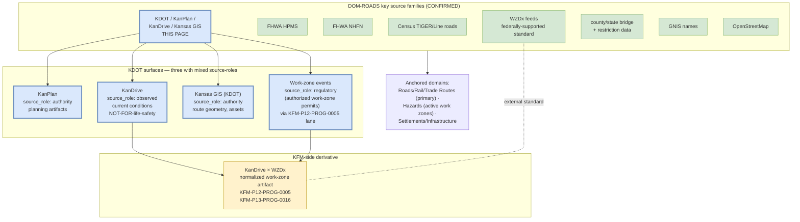

<!-- [KFM_META_BLOCK_V2]
doc_id: kfm://doc/docs-sources-catalog-kansas-kdot
title: Kansas Department of Transportation (KDOT)
type: product-page
version: v0.2
status: draft
owners: <PLACEHOLDER — Docs steward + Source steward for kansas>
created: 2026-05-21
updated: 2026-05-21
policy_label: public
related:
  - docs/sources/catalog/kansas/README.md
  - docs/sources/catalog/kansas/ksgs.md
  - docs/sources/catalog/kansas/kcc-oil-gas-reg.md
  - docs/sources/catalog/kansas/kdwp.md
  - docs/sources/catalog/README.md
  - docs/sources/catalog/IDENTITY.md
  - docs/sources/catalog/PROFILES.md
  - docs/sources/catalog/RIGHTS-AND-SENSITIVITY-MAP.md
  - docs/sources/catalog/OPEN-QUESTIONS.md
  - docs/sources/catalog/_examples/stac-item-example.json
  - docs/sources/catalog/_template/SOURCE_PRODUCT_TEMPLATE.md
  - docs/doctrine/directory-rules.md
  - docs/domains/roads-rail-trade-routes/README.md
  - docs/domains/settlements-infrastructure/README.md
  - docs/domains/hazards/README.md
  - docs/standards/SENSITIVITY_RUBRIC.md
  - docs/standards/wzdx.md
  - docs/registers/VERIFICATION_BACKLOG.md
  - schemas/contracts/v1/source/source_descriptor.schema.json
  - connectors/kansas/
  - data/registry/sources/
  - policy/sensitivity/
  - policy/rights/
tags: [kfm, docs, sources, catalog, kansas, kdot, kanplan, kandrive, wzdx, roads, transportation, source-role-mixed]
notes:
  - >-
    Product-page scope: this doc covers ONE product page under the kansas
    source family — the Kansas Department of Transportation (KDOT) and its
    publication surfaces (KanPlan, KanDrive, Kansas GIS, work-zone / WZDx).
    Listed in DOM-ROADS key-source-families table as "KDOT / KanPlan /
    KanDrive / Kansas GIS"; in C10-04 Transit Stack as "KanDrive for KDOT
    roadway conditions"; explicitly named in `KFM-P2-IDEA-0024` open question
    ("Are there other Kansas agencies that should be ingested? — Yes; e.g.,
    KDOT for roads"). This v0.2 revision creates the page.
  - >-
    Description grounded in Domains Atlas §roads-rail-trade-routes source
    families (DOM-ROADS — "KDOT / KanPlan / KanDrive / Kansas GIS" listed
    alongside Census TIGER/Line, FHWA HPMS, FHWA NHFN, WZDx feeds, county
    bridge data, GNIS, OpenStreetMap), Pass-10 `C10-04` (CONFIRMED — Transit
    Stack including KanDrive), and atlas idea cards `KFM-P12-PROG-0005` and
    `KFM-P13-PROG-0016` (both active, Pass 32 — KanDrive + WZDx normalization
    lane).
  - >-
    Path correction (v0.1 → v0.2): the v0.1 scaffold referenced `connectors/kdot/`
    as a top-level connector family. That is incorrect — `kdot/` is NOT one
    of the nine canonical `directory-rules.md` v1.2 §7.3 families. The KDOT
    adapter belongs under the CONFIRMED `connectors/kansas/` lane as
    `connectors/kansas/kdot/`. Surfaced as OPEN-KDOT-01.
  - >-
    Mixed source-roles across surfaces: route designations / asset rosters are
    `source_role: authority` (KDOT IS authoritative for state-route
    designation); KanDrive traveler-information data is `source_role: observed`
    (current conditions, NOT life-safety); work-zone permits/authorizations
    are `source_role: regulatory`. The three roles MUST be preserved
    separately in their respective descriptors. See §2 and §4.
[/KFM_META_BLOCK_V2] -->

# Kansas Department of Transportation (KDOT)

> **KDOT** publication surfaces — **KanPlan** (long-range planning), **KanDrive** (public traveler-information; KDOT roadway conditions per CONFIRMED `C10-04`), **Kansas GIS** (KDOT GIS portal), and the **KanDrive × WZDx work-zone normalization lane** per CONFIRMED atlas cards `KFM-P12-PROG-0005` and `KFM-P13-PROG-0016` — covering route designation, asset roster, current conditions, and work-zone events.

<!-- Badge row — Shields.io placeholders; replace targets once owners/CI/policies land -->


-blue)


| Status | Owners | Last reviewed |
|---|---|---|
| Draft — PROPOSED scaffold, no admission decision; per-surface license terms NEEDS VERIFICATION | `<Docs steward + Source steward for kansas — TODO assign>` | 2026-05-21 |

> [!IMPORTANT]
> **Multiple surfaces, multiple source-roles.** KDOT publishes through several distinguishable surfaces (KanPlan, KanDrive, Kansas GIS, work-zone events) that carry **different `source_role` values** per Atlas §24.1.3. Route designations and asset rosters are `authority` (KDOT IS authoritative for state-route designation). KanDrive traveler-information data is `observed` (current observed conditions). Work-zone permits/authorizations from KDOT's ArcGIS REST services are `regulatory` per the WZDx-alignment lane. **The three roles MUST be preserved separately** — each on its own `SourceDescriptor`. Collapsing them is a source-role anti-collapse violation per Atlas §24.1.3.

> [!CAUTION]
> **KanDrive is NOT for life-safety or emergency operational decisions.** KanDrive provides public traveler information — current observed road conditions, work zones, weather impacts. It is administrative public-information, not an emergency-warning system. Per the corpus pattern observed in the Saline County focus-mode build plan ("Do not use stale operational data; public UI needs staleness gate"), every KanDrive-derived KFM release MUST carry: (1) a **not-for-life-safety disclaimer**, (2) a **staleness gate** (refuse to render data past a stewarded freshness window), and (3) **source freshness headers** preserved in the asset.

---

## Quick jump

- [1. Overview](#1-overview)
- [2. Product identity & scope](#2-product-identity--scope)
- [3. Source authority](#3-source-authority)
- [4. Admission posture — mixed-surface, schema-validate-first](#4-admission-posture--mixed-surface-schema-validate-first)
- [5. Catalog profiles used](#5-catalog-profiles-used)
- [6. Collection identity](#6-collection-identity)
- [7. Provenance fields (`kfm:provenance`)](#7-provenance-fields-kfmprovenance)
- [8. Temporal handling](#8-temporal-handling)
- [9. Geometry, projection, and LRS handling](#9-geometry-projection-and-lrs-handling)
- [10. Rights and sensitivity](#10-rights-and-sensitivity)
- [11. Validation and catalog closure](#11-validation-and-catalog-closure)
- [12. Path correction (v0.1 → v0.2)](#12-path-correction-v01--v02)
- [13. Related contracts and schemas](#13-related-contracts-and-schemas)
- [14. Related connectors and pipelines](#14-related-connectors-and-pipelines)
- [15. Examples](#15-examples)
- [16. Open questions](#16-open-questions)
- [17. Verification backlog](#17-verification-backlog)
- [Appendix A — Illustrative STAC point Item skeleton (KanDrive × WZDx work-zone event)](#appendix-a--illustrative-stac-point-item-skeleton-kandrive--wzdx-work-zone-event)
- [Appendix B — Atlas idea-card lineage](#appendix-b--atlas-idea-card-lineage)

---

## 1. Overview

The **Kansas Department of Transportation (KDOT)** is the Kansas state agency responsible for the state highway system, multimodal transportation planning, and traveler information. KDOT appears in three CONFIRMED corpus locations:

| Corpus location | Statement | Relevance |
|---|---|---|
| `DOM-ROADS` key source families (CONFIRMED listing) | "**KDOT / KanPlan / KanDrive / Kansas GIS**" listed alongside Census TIGER/Line, FHWA HPMS, FHWA NHFN, WZDx feeds, county/state bridge data, GNIS, OpenStreetMap | Names KDOT as a key roads source family with three named surfaces |
| Pass-10 `C10-04` Transit Stack (CONFIRMED) | "**KanDrive for KDOT roadway conditions**" alongside GTFS / GTFS-rt / KCATA / WZDx | KanDrive is the canonical traveler-information surface |
| `KFM-P2-IDEA-0024` open question (CONFIRMED) | "Are there other Kansas agencies that should be ingested (**e.g., KDOT for roads**)? **Yes**; the corpus mentions but does not exhaustively enumerate." | Direct corpus confirmation that KDOT belongs in the Kansas-first agency authority set |

**CONFIRMED facts:**

| Attribute | Value | Citation |
|---|---|---|
| Primary domain anchor | Roads/Rail/Trade Routes (`DOM-ROADS`) | DOM-ROADS source families table |
| Secondary domain anchor | Hazards (active work zones); Settlements/Infrastructure (route designation, asset roster) | DOM-ROADS adjacency |
| Named KDOT surfaces (CONFIRMED) | KanPlan, KanDrive, Kansas GIS | DOM-ROADS row "KDOT / KanPlan / KanDrive / Kansas GIS" |
| KanDrive function | KDOT public traveler-information system | `C10-04` |
| WZDx alignment lane | "KDOT public event and ArcGIS REST services should be normalized into a WZDx-aligned work-zone dataset only after schema validation, external ID capture, license review, and provenance recording" | `KFM-P12-PROG-0005` (active, Pass 32, EXPANDED) |
| KanDrive + WZDx normalization (map surface) | "KFM transport pipelines should normalize KanDrive traveler layers and WZDx work-zone, detour, and device feeds into structured road-event artifacts with source provenance and schema validation" | `KFM-P13-PROG-0016` (active, Pass 32, EXPANDED) |
| Per-agency-watcher pattern | KDOT ingested with its own watcher, license posture, cadence, and quarantine policy (parallel to KGS / KDA / KDHE / KDWP / USDA NASS) | `KFM-P2-IDEA-0024` |

NEEDS VERIFICATION: per-surface endpoint URLs; cadence per surface (KanDrive likely sub-minute realtime; KanPlan likely annual; Kansas GIS likely versioned); license terms per surface; full filing-type/asset-type scope; whether KDOT publishes WZDx natively or only via the normalization lane.

> [!NOTE]
> **Three surfaces, four use cases.** A complete KDOT ingest covers:
> 1. **KanPlan** — long-range planning artifacts (PROPOSED — corpus does not enumerate KanPlan contents in detail)
> 2. **KanDrive** — current observed road conditions, work-zone events, weather impacts, traveler information
> 3. **Kansas GIS** (KDOT-published) — route geometry, asset roster (bridges, signs, signals), administrative boundaries
> 4. **KDOT × WZDx normalization** — derivative product mapping KDOT events to WZDx (federally-supported work-zone standard)
> Each lands in its own descriptor; the WZDx normalization is a KFM-side derivative, not a KDOT-direct surface.

[Back to top](#quick-jump)

---

## 2. Product identity & scope



| Field | Value | Status |
|---|---|---|
| Product slug | `kdot` | PROPOSED file slug (kebab-case per v0.2 catalog convention) |
| Source family | `kansas/` — CONFIRMED §7.3 canonical at commit `b6a27916bbb9e07cbf3752870c867476e1e094e7` | CONFIRMED family lane |
| Operator | Kansas Department of Transportation | CONFIRMED |
| Domain anchor | Roads/Rail/Trade Routes (primary); Hazards + Settlements/Infrastructure (adjacent) | CONFIRMED per DOM-ROADS |
| Surfaces covered (CONFIRMED-named) | KanPlan + KanDrive + Kansas GIS (KDOT) + work-zone events | CONFIRMED per DOM-ROADS row; per-surface scope NEEDS VERIFICATION |
| `source_role` (route designations / KanPlan / KDOT Kansas GIS) | `authority` | PROPOSED per Atlas §24.1.3 |
| `source_role` (KanDrive traveler conditions) | `observed` | PROPOSED per Atlas §24.1.3 — current observed conditions |
| `source_role` (work-zone permits / authorizations) | `regulatory` | PROPOSED per Atlas §24.1.3 — administrative work-zone authorization |
| `source_family_enum` value | `other` (closed enum per `KFM-P3-PROG-0001`) | CONFIRMED enum |
| Native release cadence | KanPlan: likely annual; KanDrive realtime/sub-minute; Kansas GIS versioned | NEEDS VERIFICATION |

> [!TIP]
> **`source_role` discipline matters per surface** (Atlas §24.1.3, CONFIRMED). The same agency (KDOT) publishes records under three different roles:
> - A KDOT route-designation record is `authority` — KDOT IS the authority for what is a state route.
> - A KanDrive lane-blockage report is `observed` — what KDOT's sensors and field reports say is happening now.
> - A work-zone permit is `regulatory` — what KDOT has authorized.
> An AI summary that treats a KanDrive lane-blockage report (observed, possibly stale) as an authoritative route designation, or a work-zone permit (regulatory, authorized but not necessarily active) as an observed road condition, is a source-role anti-collapse violation.

[Back to top](#quick-jump)

---

## 3. Source authority

See [`data/registry/sources/`](../../../../data/registry/sources/) for the authoritative `SourceDescriptor`s (per surface). **Do not duplicate descriptor fields here.**

For the source-family-level reading (Kansas authorities, parallel-anchor rule, non-API sources tolerance, per-agency-watcher pattern), see the sibling family README [`./README.md`](./README.md). For the WZDx standard reference (PROPOSED standards doc), see [`docs/standards/wzdx.md`](../../../standards/wzdx.md).

> [!IMPORTANT]
> Product pages **cite** authority; they do not **own** it. The descriptors are the source of truth for each KDOT surface's endpoint, cadence, rights, sensitivity bindings, and citation. The schema (per ADR-0001 default home `schemas/contracts/v1/source/source_descriptor.schema.json`) is the source of truth for descriptor shape.

[Back to top](#quick-jump)

---

## 4. Admission posture — mixed-surface, schema-validate-first

KDOT is admitted as a **mixed-surface, mixed-role** source under Atlas §24.1.3 with a CONFIRMED schema-validation-first discipline per `KFM-P12-PROG-0005`:

| Rule (CONFIRMED doctrine) | Effect for KDOT surfaces |
|---|---|
| `source_role` set at admission, never edited in place; corrections produce a new descriptor + `CorrectionNotice` | One descriptor per surface (KanPlan / KanDrive / Kansas GIS / work-zone); per-record updates flow through the connector, not the descriptor |
| **Source-role anti-collapse** (Atlas §24.1.3) | KanPlan / Kansas GIS `authority` MUST NOT be collapsed with KanDrive `observed`. A planned route is not an observed route condition. An authorized work-zone permit is not an active lane closure. |
| **Schema-validation-FIRST** (CONFIRMED, `KFM-P12-PROG-0005`) | "KDOT public event and ArcGIS REST services should be normalized into a WZDx-aligned work-zone dataset **only after schema validation, external ID capture, license review, and provenance recording**" — four-step gate; any one failure routes to quarantine |
| External-ID capture (CONFIRMED, `KFM-P12-PROG-0005`) | Upstream IDs (KDOT event ID, ArcGIS object ID, WZDx feed event ID) MUST be captured as `kfm:source.source_record_id` and parallel-anchor identifiers |
| Per-agency-watcher pattern (CONFIRMED per `KFM-P2-IDEA-0024`) | KDOT ingested with its own watcher, license posture, cadence, and quarantine policy; agency-specific peculiarities (e.g., ArcGIS REST pagination, KanDrive realtime feed envelope) encoded near the watcher |
| **Not-for-life-safety** (CONFIRMED operational pattern; see top CAUTION callout) | KanDrive surface MUST carry not-for-life-safety marker and staleness gate; downstream UI MUST refuse to render KanDrive data past the freshness window |
| **Schema-pinning for realtime feeds** (CONFIRMED parallel doctrine, `C10-04`) | "GTFS-rt's Protocol Buffers serialization is non-negotiable: schemas are pinned, decoders are versioned, and the receipt records the .proto schema version used at decode time." If KanDrive uses protobuf realtime, same rule applies; for JSON/REST, schema-version pinning still required |
| **WZDx alignment** (PROPOSED derivative, `KFM-P13-PROG-0016`) | Work-zone events normalized to WZDx-aligned shape with `kfm:source` preserving the upstream KDOT origin AND the WZDx normalization step recorded in a `TransformReceipt` |

> [!WARNING]
> **The KDOT × WZDx normalization is a derivative, not an upstream surface.** Per `KFM-P12-PROG-0005` and `KFM-P13-PROG-0016`, WZDx is a federally-supported standard (separately listed in DOM-ROADS as "WZDx feeds"). KFM normalizes KDOT KanDrive + KDOT ArcGIS REST events INTO a WZDx-aligned artifact; that artifact is `source_role: aggregate` (a KFM-side derivative). The original KDOT-direct records must be preserved alongside the WZDx-normalized derivative, with the transform recorded in a `TransformReceipt` per Atlas §24.2.1.

[Back to top](#quick-jump)

---

## 5. Catalog profiles used

> [!NOTE]
> KDOT records are heterogeneous across surfaces: KanPlan artifacts are documents/plans; Kansas GIS layers are geospatial vector; KanDrive realtime is point/segment events; work-zone events are point/polygon with time intervals. The relevant STAC extensions are **`proj`** (for geometry CRS) and KFM **`kfm:provenance`**; tabular planning content uses DCAT distribution; map-tile derivatives may use PMTiles per `KFM-P13-PROG-0016` map-surface context.

| Profile | Lane | KanPlan | KanDrive | Kansas GIS (KDOT) | Work-zone events | Citation |
|---|---|---|---|---|---|---|
| STAC Item (point + datetime) | `data/catalog/stac/` | **No** (document artifacts) | **Yes (PROPOSED)** — per event | **Yes (PROPOSED)** — per feature | **Yes (PROPOSED)** — per event with time interval | `C4-01`, `C4-02` |
| STAC `proj` extension | inside STAC Item | — | **Yes** | **Yes** | **Yes** | `KFM-P27-PROG-0011` |
| DCAT distribution | `data/catalog/dcat/` | **Yes (PROPOSED)** — planning documents | **Yes (PROPOSED)** | **Yes (PROPOSED)** | **Yes (PROPOSED)** | `C4-05` |
| PROV-O | `data/catalog/prov/` | **Yes (PROPOSED)** | **Yes (PROPOSED)** | **Yes (PROPOSED)** | **Yes (PROPOSED)** — incl. WZDx normalization receipt | `C8-03`, `C5-08` |
| Domain projection | `data/catalog/domain/{roads-rail-trade-routes,hazards,settlements-infrastructure}/` | roads | roads + hazards | roads + infrastructure | roads + hazards | Directory Rules §6.1 |
| STAC × Darwin Core hybrid | — | **No** | **No** | **No** | **No** — DwC scoped to biodiversity | `C4-03` (scoped) |
| `kfm:care` extension | catalog | **Not expected** | **Not expected** | **Not expected** | **Not expected** | `C15-02` |

[Back to top](#quick-jump)

---

## 6. Collection identity

- **PROPOSED Collection id patterns** (per `C4-02`, multiple Collections per surface):
  - `kfm-<org>-kdot-kanplan` (KanPlan planning artifacts)
  - `kfm-<org>-kdot-kandrive` (KanDrive realtime traveler information)
  - `kfm-<org>-kdot-kansas-gis-routes` (KDOT-published Kansas GIS route geometry)
  - `kfm-<org>-kdot-kansas-gis-assets` (KDOT-published Kansas GIS asset roster — bridges, signs, signals)
  - `kfm-<org>-kdot-workzones` (work-zone permit records — `regulatory` role)
  - `kfm-<org>-kdot-wzdx-normalized` (KFM-side WZDx-aligned derivative — `aggregate` role)
- **PROPOSED namespace:** `kfm:` — see **OPEN-DSC-03**.
- **Asset roles** (PROPOSED per surface):

| Surface | Asset key | Role | Content |
|---|---|---|---|
| KanPlan | `planning_artifact` | `data` | Planning document(s) |
| KanDrive | `event` | `data` | Event record JSON |
| Kansas GIS | `feature_collection` | `data` | Vector geometry + attributes |
| Work-zone | `permit_record` | `data` | Permit / authorization record |
| WZDx-normalized | `wzdx_feature` | `data` | WZDx-shaped feature collection |
| all | `external_ids` | `metadata` | Captured upstream IDs per `KFM-P12-PROG-0005` |
| all | `disclaimer` | `metadata` | Not-for-life-safety disclaimer (KanDrive especially) |
| all | `evidence_bundle` | `metadata` | KFM evidence bundle JSON-LD |

NEEDS VERIFICATION — confirm asset-key naming against `schemas/contracts/v1/source/`.

[Back to top](#quick-jump)

---

## 7. Provenance fields (`kfm:provenance`)

STAC `item.properties.kfm:provenance` block (CONFIRMED block shape per `C4-01`):

| Field | Type | Description | Citation |
|---|---|---|---|
| `spec_hash` | sha256 hex | Deterministic digest of the canonical record (KDOT event ID + ArcGIS object ID + version + as-of-date) | `C4-01`, `C1-02` |
| `evidence_bundle_ref` | `kfm://evidence/<digest>` | Content-addressed JSON-LD bundle | `C4-01`, `C4-04` |
| `run_record_ref` | `kfm://run/<run-id>` | Connector run record | `C4-01` |
| `audit_ref` | `kfm://audit/<attestation-id>` | SLSA / OPA attestation pointer | `C4-01` |
| `policy_digest` | sha256 hex | Digest of the policy bundle in force at promotion | `C4-01` |

Per-asset integrity: `file:checksum` (per-file SHA-256, CONFIRMED per `C4-01` + `C3-02`).

**Additional MUST for KDOT** — per `KFM-P12-PROG-0005`, the descriptor MUST also record **external-ID capture**:

| Field | Description (PROPOSED shape, per `KFM-P12-PROG-0005`) |
|---|---|
| `kdot_event_id` | Upstream KDOT event identifier (where applicable) |
| `arcgis_object_id` | ArcGIS REST OBJECTID (where the source is an ArcGIS REST service) |
| `wzdx_feed_event_id` | WZDx feed event ID (where present in upstream) |
| `schema_version_observed` | Upstream schema version pinned at fetch time |
| `schema_validation_outcome` | one of: `pass` / `fail` / `degraded` (degraded = parsed with tolerance for known drift) |
| `freshness_headers` | Upstream `Last-Modified` / `ETag` / `Cache-Control` values |

For the WZDx-normalized derivative, **additionally** record a `TransformReceipt` per Atlas §24.2.1 documenting the KDOT → WZDx mapping.

[Back to top](#quick-jump)

---

## 8. Temporal handling

PROPOSED — keep distinct **source / observed / valid / retrieval / release / correction** times where material (CONFIRMED doctrine, Atlas §24.8). KDOT data is unusual because it spans both slow-cadence planning artifacts (KanPlan, annual) and sub-minute realtime feeds (KanDrive).

| Time | KanPlan | KanDrive | Kansas GIS (KDOT) | Work-zone permits |
|---|---|---|---|---|
| Source time | When KDOT published the planning artifact | When the KanDrive event was emitted | When the GIS layer was last published | When KDOT issued the permit |
| Observed time | N/A | Time the field condition was observed | N/A (administrative geometry) | N/A (administrative) |
| Valid time | Validity envelope of the plan | Validity envelope of the event (start → expiry) | Validity envelope of the GIS layer version | Validity envelope of the work-zone (start → end) |
| Retrieval time | When the connector pulled the artifact | When the connector pulled the event | When the connector pulled the GIS layer | When the connector pulled the permit record |
| Release time | When KFM published the public-safe derivative | When KFM published the public-safe derivative | When KFM published the public-safe derivative | When KFM published the public-safe derivative |
| Correction time | When a `CorrectionNotice` updated the released form | When a `CorrectionNotice` updated the released form | When a `CorrectionNotice` updated the released form | When a `CorrectionNotice` updated the released form |

> [!CAUTION]
> **Staleness gate on KanDrive.** Per the corpus operational pattern (Saline County focus-mode build plan note: "Do not use stale operational data; public UI needs staleness gate"), KFM derivatives of KanDrive data MUST:
> 1. Preserve upstream `Last-Modified` / `ETag` / `Cache-Control` headers in the `freshness_headers` field
> 2. Compute and store `staleness_seconds = release_time − source_time`
> 3. Refuse to render data past a stewarded freshness window (PROPOSED default: 15 minutes; stewarded per-deployment)
> 4. Always carry the not-for-life-safety marker
> A KanDrive event released to KFM PUBLISHED without these guardrails is an operational-data-as-truth anti-pattern (`SRC-HAZ` analogue: "Cite as historical record, never as operational warning"). Same discipline applies even when the data is current; staleness is a release-time check.

[Back to top](#quick-jump)

---

## 9. Geometry, projection, and LRS handling

PROPOSED — confirm CRS, generalization rules, and LRS (linear referencing system) handling against KDOT source artifacts.

| Aspect | PROPOSED value | Citation |
|---|---|---|
| Native CRS (Kansas GIS routes) | Likely `EPSG:4326` for portal exports; KDOT internal LRS may use a Kansas state-plane CRS (NEEDS VERIFICATION) | Standard for state DOT GIS portals; CRS NEEDS VERIFICATION |
| Geometry per Item (Kansas GIS routes) | `LineString` or `MultiLineString` (route segments) | Standard for routes |
| Geometry per Item (Kansas GIS assets) | `Point` (bridges, signs, signals) | Standard for asset rosters |
| Geometry per Item (KanDrive events) | `Point` (event location) or `LineString` (segment-affected) | Standard for traveler events |
| Geometry per Item (work-zone permits) | `Point` + bbox, or `LineString` (work-zone extent) | WZDx convention |
| **LRS (linear referencing) handling** | KDOT internal records often use route + milepost LRS; KFM derivatives MUST preserve LRS values where present AND derive `(lat, lon)` from the LRS-to-geometry crosswalk with explicit uncertainty | PROPOSED — parallel to PLSS uncertainty handling per `KFM-P2-PROG-0009` |
| STAC `proj` fields | `proj:code`, `proj:bbox`, `proj:geometry`, `proj:shape`, `proj:transform` validated by front-matter schema | `KFM-P27-PROG-0011` (PROPOSED) |

> [!IMPORTANT]
> **LRS-derived coordinates carry uncertainty.** State DOT data often uses linear referencing systems (route ID + milepost offset) rather than direct lat/lon. When KFM derives lat/lon from LRS, the resulting position has uncertainty that depends on (a) the LRS reference geometry version, (b) the offset measurement precision, and (c) any route-realignment edits between the LRS reference and the actual on-the-ground position. KFM MUST stamp every LRS-derived coordinate with `geometry_source: lrs_derived` and the LRS reference version. This is a direct parallel to the PLSS-uncertainty doctrine for KCC oil-and-gas records (`KFM-P2-PROG-0009`).

[Back to top](#quick-jump)

---

## 10. Rights and sensitivity

NEEDS VERIFICATION per release — see [`policy/sensitivity/`](../../../../policy/sensitivity/) and [`RIGHTS-AND-SENSITIVITY-MAP.md`](../RIGHTS-AND-SENSITIVITY-MAP.md). **Do not restate policy here.**

| Concern | KDOT posture |
|---|---|
| License | NEEDS VERIFICATION — KDOT data is generally state public records (KORA, PROPOSED); per-surface terms NEEDS VERIFICATION |
| Attribution | Required — KFM citation template MUST preserve "Kansas Department of Transportation" + surface name + as-of-date |
| **WZDx-normalized derivative attribution** | Citation MUST preserve BOTH the upstream KDOT origin AND the KFM normalization transform per `TransformReceipt` |
| Sensitivity rank (`C6-01`) | Default **0–1** at family level for KanPlan, KanDrive events, Kansas GIS public layers, work-zone permits |
| **Critical-infrastructure precision** | **Asset roster** (bridges, signs, signals, ITS device locations) may carry critical-infrastructure precision concerns; per the corpus pattern (Barton County focus-mode build plan note re: oil/gas infrastructure sensitivity), high-precision asset locations may need RESTRICT for non-public layers. Public-published KDOT asset locations are generally PUBLIC; non-public security-sensitive assets MUST NOT be ingested without steward review |
| **Not-for-life-safety** (KanDrive especially) | KanDrive carries not-for-life-safety marker on every release; staleness gate enforced (see §8 CAUTION) |
| **Joins with private property / parcel data** | Cross trust membrane; joined product inherits most-restrictive posture |
| Geoprivacy | Not applicable at family level |
| CARE / `kfm:care` extension | Not expected at family level; **possibly applies** for routes through tribal lands or culturally sensitive corridors per Atlas §archaeology |
| ITS device-feed access | KDOT ITS (Intelligent Transportation System) device feeds may have restricted-redistribution terms — NEEDS VERIFICATION per device type |

> [!WARNING]
> **Asset-roster precision is a release-time decision.** KDOT publishes most route geometry and asset locations through Kansas GIS; those are public. However, certain assets — security-sensitive ITS device locations, critical-bridge inspection details, materials-of-construction records — may carry restricted-redistribution terms. KFM MUST screen the asset roster for restricted classes during admission and route restricted records to QUARANTINE per `C5-02` default-deny.

[Back to top](#quick-jump)

---

## 11. Validation and catalog closure

| Gate | Purpose | Status |
|---|---|---|
| Catalog closure required before public release | No PUBLISHED edge from WORK / QUARANTINE; release decisions live in `release/` | CONFIRMED doctrine; original scaffold cites `KFM-P1-IDEA-0020` (NEEDS VERIFICATION) |
| STAC Projection front-matter validation | `proj:code`, `proj:bbox`, `proj:geometry`, `proj:shape`, `proj:transform` validated | PROPOSED — `KFM-P27-PROG-0011`; original scaffold also cites `KFM-P27-FEAT-0003` (NEEDS VERIFICATION) |
| STAC checksum closure against `ReleaseManifest` digest | Per-asset `file:checksum` matches manifest entry | PROPOSED — original scaffold cites `KFM-P22-PROG-0037` (NEEDS VERIFICATION) |
| Spec-hash-match gate | Claimed `spec_hash` matches recomputed hash | CONFIRMED doctrine — `C5-04`, `C1-02` |
| Lineage required | Every published asset has OpenLineage trail back to receipts | CONFIRMED doctrine — `C5-08` |
| Default-deny promotion | Promotion fails closed; explicit allow-rule required | CONFIRMED doctrine — `C5-02` |
| **Source-role anti-collapse gate** | KanPlan / Kansas GIS `authority` MUST NOT merge with KanDrive `observed` or work-zone `regulatory` at catalog level | CONFIRMED doctrine per Atlas §24.1.3; implementation PROPOSED |
| **Schema-validation-FIRST gate** | Four-step gate per `KFM-P12-PROG-0005`: schema validation → external ID capture → license review → provenance recording. Any failure quarantines | CONFIRMED doctrine; implementation PROPOSED |
| **External-ID-capture required** | KDOT event ID, ArcGIS object ID, WZDx feed event ID captured in descriptor and per-record `kfm:source.source_record_id` | CONFIRMED doctrine per `KFM-P12-PROG-0005`; implementation PROPOSED |
| **Schema-version pinning** | Upstream schema version pinned at fetch time; receipt records schema version | CONFIRMED parallel doctrine `C10-04` (protobuf pinning), applied to KDOT REST/JSON; implementation PROPOSED |
| **Not-for-life-safety + staleness gate (KanDrive)** | Released KanDrive asset carries not-for-life-safety marker AND staleness gate per §8 CAUTION | CONFIRMED operational pattern; implementation PROPOSED |
| **WZDx-normalization TransformReceipt** | Every WZDx-aligned derivative carries a `TransformReceipt` per Atlas §24.2.1 documenting the KDOT → WZDx mapping | CONFIRMED doctrine per Atlas §24.2.1; implementation PROPOSED |
| **LRS-uncertainty stamping** | LRS-derived lat/lon carries `geometry_source: lrs_derived` and LRS reference version | PROPOSED parallel to PLSS-uncertainty doctrine (`KFM-P2-PROG-0009`); implementation PROPOSED |
| **Asset-roster restriction screen** | Asset records screened for restricted-redistribution classes; restricted records route to QUARANTINE | PROPOSED per Atlas §infrastructure sensitivity discipline |
| Citation validation | Every released record resolves to an `EvidenceBundle` | CONFIRMED doctrine — `C4-04`, cite-or-abstain |

[Back to top](#quick-jump)

---

## 12. Path correction (v0.1 → v0.2)

> [!IMPORTANT]
> **OPEN-KDOT-01.** The v0.1 scaffold referenced `connectors/kdot/` as a top-level connector family. That is incorrect. Per Directory Rules v1.2 §7.3, the canonical connector families are exactly nine: `usgs/`, `fema/`, `noaa/`, `nrcs/`, `kansas/`, `gbif/`, `inaturalist/`, `census/`, `local_upload/`. **`kdot/` is NOT one of them.** The KDOT adapter belongs under the CONFIRMED `connectors/kansas/` family lane as `connectors/kansas/kdot/`. This mirrors OPEN-MESO-01 (Mesonet), OPEN-KBS-01 (KBS), and OPEN-KCC-01 (KCC oil-and-gas regulatory).

| Item | v0.1 (incorrect) | v0.2 (corrected) | Citation |
|---|---|---|---|
| Connector path | `connectors/kdot/` (top-level, non-canonical) | `connectors/kansas/kdot/` (per-institution adapter under the CONFIRMED §7.3 family) | Directory Rules v1.2 §7.3; Repository Structure Guiding Document at commit `b6a27916bbb9e07cbf3752870c867476e1e094e7` |
| Raw output path | `data/raw/<domain>/kdot/<run_id>/` | unchanged (`<source_id>` is still surface-specific: `kdot-kanplan`, `kdot-kandrive`, etc.) | Directory Rules §7.3 |
| Descriptor home | `data/registry/sources/kdot/` (likely v0.1 implication) | `data/registry/sources/kansas/kdot-*/` per surface (PROPOSED, mirrors connector layout) | NEEDS VERIFICATION |
| Sub-surface adapter layout | (not addressed in v0.1) | `connectors/kansas/kdot/kanplan/`, `connectors/kansas/kdot/kandrive/`, `connectors/kansas/kdot/kansas-gis/`, `connectors/kansas/kdot/workzones/` PROPOSED | OPEN-KDOT-03 |

[Back to top](#quick-jump)

---

## 13. Related contracts and schemas

- [`contracts/`](../../../../contracts/) — object families. KDOT records most plausibly land in PROPOSED `RoadSegment` (CONFIRMED term per DOM-ROADS), `RoadEvent`, `WorkZone`, `Asset` (bridge/sign/signal), `PlanningArtifact`, `TransitFeed` (NEEDS VERIFICATION — corpus does not enumerate all by name).
- [`schemas/contracts/v1/source/`](../../../../schemas/contracts/v1/source/) — `SourceDescriptor` machine shape per ADR-0001.
- [`schemas/contracts/v1/roads/`](../../../../schemas/contracts/v1/roads/) — PROPOSED home for road-event / work-zone schemas (NEEDS VERIFICATION).
- [`schemas/contracts/v1/wzdx/`](../../../../schemas/contracts/v1/wzdx/) — PROPOSED home for the WZDx-aligned derivative schema per `KFM-P12-PROG-0005` (NEEDS VERIFICATION).

[Back to top](#quick-jump)

---

## 14. Related connectors and pipelines

- [`connectors/kansas/`](../../../../connectors/kansas/) — **CONFIRMED (at commit `b6a27916bbb9e07cbf3752870c867476e1e094e7`)** family lane per Directory Rules v1.2 §7.3.
- [`connectors/kansas/kdot/`](../../../../connectors/kansas/kdot/) — per-institution adapter (PROPOSED — corrected from v0.1's incorrect top-level `connectors/kdot/`; see §12). Sub-surface adapters (`kanplan/`, `kandrive/`, `kansas-gis/`, `workzones/`) PROPOSED but unresolved — see OPEN-KDOT-03.
- Pipelines: [`pipelines/ingest/`](../../../../pipelines/ingest/), [`pipelines/normalize/`](../../../../pipelines/normalize/), [`pipelines/validate/`](../../../../pipelines/validate/), [`pipelines/catalog/`](../../../../pipelines/catalog/).
- Pipeline specs: [`pipeline_specs/roads-rail-trade-routes/`](../../../../pipeline_specs/roads-rail-trade-routes/), [`pipeline_specs/hazards/`](../../../../pipeline_specs/hazards/), [`pipeline_specs/settlements-infrastructure/`](../../../../pipeline_specs/settlements-infrastructure/) (PROPOSED — confirm per surface).
- Related blueprints: **`KFM-P12-PROG-0005`** (KDOT KanDrive + WZDx normalization lane) and **`KFM-P13-PROG-0016`** (KanDrive + WZDx event-normalization lane / map surface).
- Federal sibling: WZDx feeds (separately listed in DOM-ROADS); KFM may also ingest WZDx directly from the federal aggregator alongside the KDOT-derived normalization.

> [!IMPORTANT]
> **Connector-as-non-publisher** rule (CONFIRMED, Directory Rules §7.3). `connectors/kansas/kdot/` MUST write only to `data/raw/<domain>/kdot-*/<run_id>/` or `data/quarantine/...`. It MUST NOT write to `data/processed/`, `data/catalog/`, or `data/published/`. The WZDx normalization step is a `pipelines/normalize/` operation, NOT a connector operation — the connector captures raw KDOT records; normalization produces the WZDx-aligned derivative.

[Back to top](#quick-jump)

---

## 15. Examples

*(Illustrative only — do not treat as authoritative.)*

See [`_examples/stac-item-example.json`](../_examples/stac-item-example.json) for the minimal STAC + `kfm:provenance` shape. The skeleton in Appendix A shows a **STAC point Item for a KanDrive × WZDx-aligned work-zone event** — the most operationally interesting KDOT surface because it exercises external-ID capture, schema-version pinning, the not-for-life-safety + staleness gate, and the WZDx normalization `TransformReceipt`.

[Back to top](#quick-jump)

---

## 16. Open questions

- **OPEN-KDOT-01** — Resolve `connectors/kdot/` (v0.1, top-level) vs `connectors/kansas/kdot/` (v0.2, under CONFIRMED §7.3 family). v0.2 adopts the latter; mounted-repo verification still required.
- **OPEN-KDOT-02** — Confirm exact KanPlan scope: is KanPlan one surface or a family of planning artifacts (STIP, LRTP, project-level NEPA docs, performance reports)?
- **OPEN-KDOT-03** — Confirm sub-surface adapter layout: single `connectors/kansas/kdot/` adapter that internally routes by surface, vs per-surface adapters `connectors/kansas/kdot/kanplan/`, `…/kandrive/`, `…/kansas-gis/`, `…/workzones/`.
- **OPEN-KDOT-04** — Confirm KanDrive realtime cadence and protocol (REST? GTFS-rt protobuf? other?). Per `C10-04` parallel doctrine, protobuf serialization MUST have schema pinning.
- **OPEN-KDOT-05** — Confirm KanDrive staleness-window default (PROPOSED 15 minutes; stewarded per-deployment).
- **OPEN-KDOT-06** — Confirm KDOT LRS reference geometry version and the LRS-to-lat/lon crosswalk convention.
- **OPEN-KDOT-07** — Confirm KDOT × WZDx normalization mapping: per-attribute mapping table and `TransformReceipt` shape.
- **OPEN-KDOT-08** — Confirm which KDOT ITS device feeds (cameras, traffic detectors, RWIS weather stations) are publicly redistributable vs restricted.
- **OPEN-KDOT-09** — Confirm KDOT asset-roster scope: are bridge/sign/signal locations all publicly published, or are subsets restricted?
- **OPEN-KDOT-10** — Confirm the relationship between KDOT-direct work-zone records and the federal WZDx feed — does KDOT publish to WZDx natively, or only via KFM's normalization lane?
- **OPEN-KDOT-11** — Should KDOT routes carry KHRI / historic-route crosswalk for routes that overlap historic trails (e.g., Santa Fe Trail per Barton/Saline County focus-mode build plans)?
- **OPEN-DSC-03** — Settle `kfm:` vs `ks-kfm:` STAC namespace (`C4-01`).

[Back to top](#quick-jump)

---

## 17. Verification backlog

Inheritance: every family-level OPEN item from [`./README.md`](./README.md#11-open-questions) applies. Product-specific items below.

| Item | Evidence that would settle it | Status |
|---|---|---|
| OPEN-KDOT-01 — Per-institution adapter path `connectors/kansas/kdot/` under CONFIRMED `connectors/kansas/` lane | Mounted-repo `connectors/kansas/` tree | NEEDS VERIFICATION |
| OPEN-KDOT-02 — KanPlan scope (single artifact family vs multiple) | Source steward + KDOT KanPlan documentation | NEEDS VERIFICATION |
| OPEN-KDOT-03 — Sub-surface adapter layout | ADR or steward decision | OPEN |
| OPEN-KDOT-04 — KanDrive realtime cadence + protocol | Source steward + KDOT KanDrive docs review | NEEDS VERIFICATION |
| OPEN-KDOT-05 — KanDrive staleness-window default | Steward decision | OPEN |
| OPEN-KDOT-06 — KDOT LRS reference geometry version + crosswalk | Source steward + KDOT GIS team | NEEDS VERIFICATION |
| OPEN-KDOT-07 — KDOT × WZDx attribute mapping | Source steward + WZDx spec review | NEEDS VERIFICATION |
| OPEN-KDOT-08 — KDOT ITS device-feed redistribution rights | Source steward + per-device terms | NEEDS VERIFICATION |
| OPEN-KDOT-09 — Asset-roster scope and restricted subsets | Source steward + KDOT review | NEEDS VERIFICATION |
| OPEN-KDOT-10 — KDOT-direct vs federal WZDx relationship | Source steward + WZDx aggregator docs | NEEDS VERIFICATION |
| OPEN-KDOT-11 — Routes-over-historic-corridors crosswalk to KHRI | ADR or steward decision | OPEN |
| `data/registry/sources/` descriptor instances per surface (`kdot-kanplan`, `kdot-kandrive`, `kdot-kansas-gis`, `kdot-workzones`, `kdot-wzdx-normalized`) | Mounted registry + descriptor files | NEEDS VERIFICATION |
| `KFM-P27-FEAT-0003` (STAC Projection lint) ID and relationship to `KFM-P27-PROG-0011` | Idea index entry | NEEDS VERIFICATION |
| `KFM-P22-PROG-0037` (STAC checksum closure) idea card | Idea index entry | NEEDS VERIFICATION |
| `KFM-P1-IDEA-0020` (catalog closure) idea card | Idea index entry | NEEDS VERIFICATION |
| Sibling family-level files present (`PROFILES.md`, `IDENTITY.md`, `RIGHTS-AND-SENSITIVITY-MAP.md`, `OPEN-QUESTIONS.md`, `_template/SOURCE_PRODUCT_TEMPLATE.md`) | Mounted-repo `docs/sources/catalog/` tree | NEEDS VERIFICATION |
| Standards doc `docs/standards/wzdx.md` presence | Mounted-repo `docs/standards/` tree | NEEDS VERIFICATION |
| Pipeline-spec lanes (`pipeline_specs/roads-rail-trade-routes/`, `…/hazards/`, `…/settlements-infrastructure/`) presence | Mounted-repo `pipeline_specs/` tree | NEEDS VERIFICATION |

[Back to top](#quick-jump)

---

## Appendix A — Illustrative STAC point Item skeleton (KanDrive × WZDx work-zone event)

> [!NOTE]
> **Illustrative only.** This skeleton shows the KanDrive × WZDx-normalized derivative — the most operationally complete KDOT surface, exercising external-ID capture (`KFM-P12-PROG-0005`), schema-version pinning, the not-for-life-safety + staleness gate, and a `TransformReceipt` for the KDOT → WZDx normalization. The authoritative profile lives in (PROPOSED) `schemas/contracts/v1/source/` and `schemas/contracts/v1/wzdx/`. Do not treat this block as a valid fixture without schema-side validation.

<details>
<summary>Click to expand — illustrative STAC point Item for a KanDrive × WZDx work-zone event (NOT validated, NOT canonical)</summary>

```json
{
  "type": "Feature",
  "stac_version": "1.0.0",
  "id": "kfm://event/kdot-wzdx/<kdot-event-id>:<observation-time>",
  "geometry": { "type": "Point", "coordinates": [-97.34, 38.04] },
  "bbox": [-97.34, 38.04, -97.34, 38.04],
  "properties": {
    "datetime": "2026-05-21T14:32:00Z",
    "proj:code": "EPSG:4326",
    "kfm:source": {
      "source_id": "kdot-wzdx-normalized",
      "upstream_source_id": "kdot-kandrive",
      "source_family": "kansas",
      "source_role": "aggregate",
      "upstream_source_role": "observed",
      "source_record_id": "kdot:event:<kdot-event-id>"
    },
    "kfm:external_ids": {
      "kdot_event_id": "<kdot-event-id>",
      "arcgis_object_id": 12345,
      "wzdx_feed_event_id": "<wzdx-event-id>",
      "schema_version_observed": "wzdx-v4.2",
      "schema_validation_outcome": "pass",
      "freshness_headers": {
        "last_modified": "2026-05-21T14:32:00Z",
        "etag": "\"<etag>\"",
        "cache_control": "max-age=60"
      }
    },
    "kfm:provenance": {
      "spec_hash": "sha256:<hex>",
      "evidence_bundle_ref": "kfm://evidence/<digest>",
      "run_record_ref": "kfm://run/<run-id>",
      "audit_ref": "kfm://audit/<attestation-id>",
      "policy_digest": "sha256:<hex>"
    },
    "kfm:transform": {
      "transform_id": "kdot-to-wzdx-v1",
      "input_geom_hash": "sha256:<hex>",
      "output_geom_hash": "sha256:<hex>",
      "parameters": { "wzdx_version": "4.2", "mapping_table_version": "1.0.0" },
      "tolerance": "exact",
      "timestamp": "2026-05-21T14:32:30Z",
      "actor": "pipelines/normalize/kdot-wzdx@v1"
    },
    "kfm:rights": {
      "license": "<NEEDS VERIFICATION — KORA public-records posture>",
      "attribution": "Kansas Department of Transportation (KanDrive). Event <kdot-event-id>, as of <datetime>. WZDx-normalized by KFM."
    },
    "kfm:geometry_provenance": {
      "geometry_source": "kdot_event_direct",
      "lrs_route_id": "I-135-N",
      "lrs_milepost": 87.4,
      "coordinate_uncertainty_m": 50
    },
    "kfm:not_for_life_safety": true,
    "kfm:staleness": {
      "source_time": "2026-05-21T14:32:00Z",
      "release_time": "2026-05-21T14:33:15Z",
      "staleness_seconds": 75,
      "freshness_window_seconds": 900
    },
    "wzdx": {
      "core_details": {
        "event_type": "work-zone",
        "data_source_id": "kdot",
        "road_names": ["I-135"],
        "direction": "northbound",
        "description": "<event description per WZDx core_details>"
      },
      "start_date": "2026-05-21T08:00:00Z",
      "end_date": "2026-05-21T18:00:00Z",
      "vehicle_impact": "some-lanes-closed"
    },
    "redaction_profile": "kfm:redact:none"
  },
  "assets": {
    "event": {
      "href": "./<kdot-event-id>.json",
      "type": "application/json",
      "roles": ["data"],
      "file:checksum": "sha256:<hex>"
    },
    "wzdx_feature": {
      "href": "./<kdot-event-id>.wzdx.geojson",
      "type": "application/geo+json",
      "roles": ["data"],
      "file:checksum": "sha256:<hex>"
    },
    "external_ids": {
      "href": "./<kdot-event-id>.external_ids.json",
      "type": "application/json",
      "roles": ["metadata"],
      "file:checksum": "sha256:<hex>"
    },
    "transform_receipt": {
      "href": "./<kdot-event-id>.transform.json",
      "type": "application/json",
      "roles": ["metadata"],
      "file:checksum": "sha256:<hex>"
    },
    "disclaimer": {
      "href": "./disclaimer.txt",
      "type": "text/plain",
      "roles": ["metadata"],
      "file:checksum": "sha256:<hex>"
    },
    "evidence_bundle": {
      "href": "./<digest>.evidence.jsonld",
      "type": "application/ld+json",
      "roles": ["metadata"],
      "file:checksum": "sha256:<hex>"
    }
  },
  "links": [
    { "rel": "collection", "href": "./collection.json" },
    { "rel": "self", "href": "./<id>.json" },
    { "rel": "via", "href": "https://kandrive.gov/", "title": "Upstream KDOT KanDrive" },
    { "rel": "derived_from", "href": "kfm://event/kdot-kandrive/<kdot-event-id>", "title": "Upstream KDOT KanDrive event (pre-normalization)" }
  ]
}
```

</details>

[Back to top](#quick-jump)

---

## Appendix B — Atlas idea-card lineage

For traceability into the KFM Idea Index spine, this brief draws on the following atlas cards.

<details>
<summary>Click to expand — idea-card lineage</summary>

| Stable ID | Title | Status (atlas) | Relevance to this brief |
|---|---|---|---|
| `DOM-ROADS` (Domains Atlas §roads-rail-trade-routes source families) | KDOT / KanPlan / KanDrive / Kansas GIS | CONFIRMED listing | Names KDOT-with-three-surfaces as a key roads source family |
| `C10-04` | Transit Stack: GTFS, GTFS-rt, KCATA, KanDrive, WZDx | CONFIRMED (Pass-10) | "KanDrive for KDOT roadway conditions"; protobuf schema-pinning doctrine applied by analogy |
| `KFM-P12-PROG-0005` | KDOT KanDrive and WZDx normalization lane | active, Pass 32, EXPANDED | "KDOT public event and ArcGIS REST services should be normalized into a WZDx-aligned work-zone dataset only after schema validation, external ID capture, license review, and provenance recording" — four-step admission gate |
| `KFM-P13-PROG-0016` | KanDrive and WZDx event normalization lane | active, Pass 32, EXPANDED | "KFM transport pipelines should normalize KanDrive traveler layers and WZDx work-zone, detour, and device feeds into structured road-event artifacts with source provenance and schema validation" — map-surface context |
| `KFM-P2-IDEA-0024` | USDA NASS, KGS, KDA, KDHE, KDWP as Kansas-specific authorities | CONFIRMED, Pass 32 | Open question explicitly names KDOT as a Kansas agency that should be ingested ("Are there other Kansas agencies… e.g., KDOT for roads? Yes"); per-agency-watcher pattern applies |
| `KFM-P2-PROG-0009` | WIMAS/WWC5 (KGS+KDA-DWR joint program) | active, Pass 32 | Parallel doctrine: "public records with disclaimers and use constraints that map awkwardly onto open-data assumptions" — KORA posture for KDOT applies; LRS-uncertainty parallel to PLSS-uncertainty |
| `KFM-P3-PROG-0001` | OccurrenceEvidenceObject + `source_family` enum | active, Pass 32 | KDOT falls under `source_family: other` (closed enum) |
| `C4-01` | STAC `kfm:provenance` namespace | CONFIRMED (Pass-10) | Provenance block shape used in §7 |
| `C4-02` | STAC Collection (`kfm-<org>-<product>`) | CONFIRMED (Pass-10) | Collection-id convention referenced in §6 |
| `C4-03` | STAC × Darwin Core hybrid | CONFIRMED (Pass-10) | NOT applicable to KDOT |
| `C4-05` | DCAT distribution | CONFIRMED (Pass-10) | Applicable to KDOT tabular planning artifacts |
| `C5-02` | Default-deny promotion | CONFIRMED (Pass-10) | Anchors deny-by-default sensitivity posture for joins and ITS device feeds |
| `C5-04` | Spec-hash-match gate | CONFIRMED (Pass-10) | Promotion gate; baseline-change refresh |
| `C5-08` | Lineage required | CONFIRMED (Pass-10) | OpenLineage trail to receipts |
| `C6-01` | Sensitivity rubric 0–5 | CONFIRMED (Pass-10) | Family default 0–1; rank ≥ 3 only on sensitive joins or restricted asset classes |
| `C7-09` | USGS GNIS | CONFIRMED (Pass-10) | Sibling place authority; KDOT route + GNIS feature crosswalk where applicable |
| `C8-03` | PROV-O for provenance | CONFIRMED (Pass-10) | Plan → publish → event → normalization lineage |
| Atlas §24.1.3 | Source-role enum | CONFIRMED (Pass-23/32) | `authority`, `observed`, `regulatory`, `aggregate` all in play for KDOT surfaces |
| Atlas §24.2.1 | Master receipt catalog (TransformReceipt) | CONFIRMED (Pass-23/32) | KDOT → WZDx normalization carries a TransformReceipt |
| Atlas §24.8 | Time discipline (source / observed / valid / retrieval / release / correction) | CONFIRMED (Pass-23/32) | §8 temporal matrix |
| `KFM-P27-PROG-0011` | STAC Projection front-matter | PROPOSED, Pass 32 | `proj:code`, `proj:bbox`, `proj:geometry`, `proj:shape`, `proj:transform` validation |

</details>

[Back to top](#quick-jump)

---

### Footer

> **Related:** [`./README.md`](./README.md) (kansas family landing) · [`./ksgs.md`](./ksgs.md) (sibling Kansas geology authority) · [`./kcc-oil-gas-reg.md`](./kcc-oil-gas-reg.md) (sibling regulatory source — parallel mixed-role pattern) · [`./kdwp.md`](./kdwp.md) (sibling Kansas authority) · [`../README.md`](../README.md) (catalog index) · [`../IDENTITY.md`](../IDENTITY.md) · [`../PROFILES.md`](../PROFILES.md) · [`../RIGHTS-AND-SENSITIVITY-MAP.md`](../RIGHTS-AND-SENSITIVITY-MAP.md) · [`../OPEN-QUESTIONS.md`](../OPEN-QUESTIONS.md) · [Directory Rules](../../../doctrine/directory-rules.md) · [WZDx standard](../../../standards/wzdx.md) · [Roads/Rail/Trade Routes domain](../../../domains/roads-rail-trade-routes/README.md) · [Hazards domain](../../../domains/hazards/README.md) · [Settlements/Infrastructure domain](../../../domains/settlements-infrastructure/README.md)
> **Last updated:** 2026-05-21 *(Claude Code product-page revision; v0.1 → v0.2)* · **Status:** draft · **Authority of this doc:** explanatory product-page; does **not** decide admission, activation, or release. Family lane `connectors/kansas/` is CONFIRMED §7.3 at commit `b6a27916bbb9e07cbf3752870c867476e1e094e7`. Per-institution adapter `connectors/kansas/kdot/` is **PROPOSED** (corrected from v0.1's incorrect top-level `connectors/kdot/`).
> [⬆ Back to top](#kansas-department-of-transportation-kdot)
