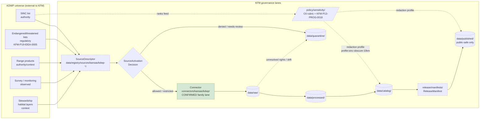

# KDWP — Kansas Department of Wildlife and Parks

> **Source family catalog entry.** KDWP is a *Kansas-First domain authority* (CONFIRMED per `C7-10`) and "the controlling Kansas regulatory source family for listed-species status and spatial context" per `KFM-P19-IDEA-0005`. Its stewardship outputs — chief among them the SINC (Sensitive Species and Natural Communities) program — feed the Fauna, Flora, and Habitat lanes and **drive the C6 sensitivity rubric that governs public-safe redaction across KFM**.

[](#)
[](#)
[](#)
[](#)
[](#)
[](#)
[](#)
[](#)
[](#)
[](#)

**Status:** `draft` (v0.2) &nbsp;·&nbsp; **Owners:** `<TODO — source steward + fauna domain steward>` &nbsp;·&nbsp; **Updated:** `2026-05-21`

<!-- [KFM_META_BLOCK_V2]
doc_id: kfm://doc/docs-sources-catalog-kansas-kdwp
title: KDWP — Kansas Department of Wildlife and Parks (Source Catalog Entry)
type: standard
subtype: source-catalog-entry
version: v0.2
status: draft
owners: <TODO — source steward (admission, rights); fauna domain steward (object meaning)>
created: 2026-05-13
updated: 2026-05-21
policy_label: public
related:
  - docs/sources/catalog/kansas/README.md
  - docs/sources/catalog/kansas/kbs.md
  - docs/sources/catalog/kansas/ku-nhm.md
  - docs/sources/catalog/kansas/fhsu-sternberg.md
  - docs/sources/catalog/kansas/kansas-state-archives.md
  - docs/sources/catalog/kansas/kansas-memory.md
  - docs/sources/catalog/kansas/khri.md
  - docs/sources/catalog/README.md
  - docs/sources/catalog/IDENTITY.md
  - docs/sources/catalog/PROFILES.md
  - docs/sources/catalog/RIGHTS-AND-SENSITIVITY-MAP.md
  - docs/sources/catalog/OPEN-QUESTIONS.md
  - docs/sources/catalog/_template/SOURCE_PRODUCT_TEMPLATE.md
  - docs/doctrine/directory-rules.md
  - docs/doctrine/lifecycle-law.md
  - docs/doctrine/truth-posture.md
  - docs/sources/SOURCE_DESCRIPTOR_STANDARD.md
  - docs/domains/fauna/README.md
  - docs/domains/flora/README.md
  - docs/domains/habitat/README.md
  - docs/standards/SENSITIVITY_RUBRIC.md
  - docs/security/sensitive_register.md
  - docs/registers/AUTHORITY_LADDER.md
  - docs/registers/DRIFT_REGISTER.md
  - docs/registers/VERIFICATION_BACKLOG.md
  - docs/adr/ADR-0001-schema-home.md
  - schemas/contracts/v1/source/source_descriptor.schema.json
  - connectors/kansas/kdwp/
  - data/registry/sources/
  - policy/sensitivity/
tags: [kfm, source-catalog, kansas, kansas-first, kdwp, sinc, fauna, flora, habitat, c7-10, c6-01, kfm-p19-idea-0005, sensitivity]
notes:
  - >-
    v0.2 path migration: this doc was at `docs/sources/catalog/kdwp.md` (flat)
    in v1 and has moved to `docs/sources/catalog/kansas/kdwp.md` (nested under
    the `kansas/` family folder per v0.2 catalog convention). v1 OV #1 (path
    convention) is PARTIALLY RESOLVED by this reorganization.
  - >-
    Connector path was ALREADY correct in v1: `connectors/kansas/kdwp/` sits
    under the canonical `connectors/kansas/` §7.3 family. This distinguishes
    KDWP from sibling v0.2 revisions (kansas-mesonet, kbs, kcc-oil-gas-reg,
    kdot) which all required path corrections from incorrect top-level family
    placements. No OPEN-KDWP-PATH item is needed.
  - >-
    Atlas card lineage CONFIRMED: `C7-10` (Kansas-First Domain Authorities —
    KDWP SINC explicitly named); `KFM-P19-IDEA-0005` (CONFIRMED, Pass 32 —
    "KFM should treat KDWP endangered, threatened, and SINC lists and range
    products as the controlling Kansas regulatory source family for
    listed-species status and spatial context"); `KFM-P2-IDEA-0024`
    (CONFIRMED, Pass 32 — KDWP named in the five Kansas-specific authorities,
    each with its own watcher, license posture, cadence); `KFM-P13-PROG-0018`
    (active, Pass 32, EXPANDED — sensitive-species grid generalization
    policy); `KFM-P24-IDEA-0002` + `KFM-P24-PROG-0013` (sensitive species
    deny-by-default + OPA ABSTAIN/DENY); `C6-01` (sensitivity rubric;
    `profile:sinc-obscure-10km` for rank-3 default); `C10-06` (biodiversity
    stack — "C6 redaction for any species that NatureServe or KDWP SINC ranks
    at S1/S2 sensitivity").
  - >-
    `connectors/kansas/` lane is CONFIRMED (at commit
    `b6a27916bbb9e07cbf3752870c867476e1e094e7`) per Directory Rules v1.2 §7.3.
[/KFM_META_BLOCK_V2] -->

---

## Quick jump

- [1. Scope](#1-scope) · [2. Status and source basis](#2-status-and-source-basis) · [3. Repo fit](#3-repo-fit) · [4. Inputs accepted](#4-inputs-accepted)
- [5. Exclusions](#5-exclusions) · [6. Lifecycle placement](#6-lifecycle-placement) · [7. Domains served](#7-domains-served) · [8. Source roles](#8-source-roles-applicable-to-kdwp-material)
- [9. SINC and the sensitivity machinery](#9-sinc-and-the-sensitivity-machinery) · [10. Pipeline diagram](#10-pipeline-diagram) · [11. Rights and freshness](#11-rights-freshness-and-access-posture)
- [12. Sensitive / deny-by-default](#12-sensitive--deny-by-default-interactions) · [13. Authority anchoring](#13-authority-anchoring-and-crosswalks) · [14. Pre-admission checklist](#14-pre-admission-checklist)
- [15. Open verification](#15-open-verification-items) · [16. FAQ](#16-faq) · [17. Related docs](#17-related-docs)
- [Appendix A: Descriptor field placeholders](#appendix-a-source-descriptor-field-placeholders) · [Appendix B: Atlas idea-card lineage](#appendix-b-atlas-idea-card-lineage) · [Appendix C: Change log](#appendix-c-change-log)

---

## 1. Scope

> [!NOTE]
> **Path migration (v1 → v0.2).** This page was authored as `docs/sources/catalog/kdwp.md` in v1 (flat) and **moved to `docs/sources/catalog/kansas/kdwp.md`** in v0.2 (nested under the `kansas/` family folder, consistent with sibling product pages — `kbs.md`, `kansas-memory.md`, `kansas-state-archives.md`, `fhsu-sternberg.md`, `kansas-mesonet.md`, `kcc-oil-gas-reg.md`, `kdot.md`, etc.). The kansas family README v0.2 lists this brief explicitly under §3 "Kansas authority sources." v1 OV #1 (path convention) is **partially resolved**.

> [!IMPORTANT]
> **Connector path was ALREADY correct in v1.** Unlike sibling v0.2 revisions (Kansas Mesonet OPEN-MESO-01, KBS OPEN-KBS-01, KCC OPEN-KCC-01, KDOT OPEN-KDOT-01) — which all required corrections from incorrect top-level family placements (`connectors/kansas-mesonet/`, `connectors/kbs/`, `connectors/kcc_oil_gas_reg/`, `connectors/kdot/`) — **KDWP's v1 already used `connectors/kansas/kdwp/`** correctly under the canonical `connectors/kansas/` §7.3 family lane. No path-correction OPEN item is needed.

**CONFIRMED doctrine / PROPOSED implementation.** This entry catalogs **KDWP** as a *source family* — an authoritative Kansas state agency whose data, stewardship determinations, and sensitivity rankings KFM admits and governs. It does **not** define the meaning of KFM object families (see `contracts/`), the machine-checkable shape of any record (see `schemas/`), or the admit/restrict/deny decision for a specific dataset (see `policy/` and `data/registry/`).

KDWP appears in project doctrine in two distinct guises that this entry must hold apart:

| Guise | Role in KFM | Project basis |
|---|---|---|
| **KDWP-as-authority** | Authoritative source for legal status, sensitivity ranking (SINC), and stewardship determinations on Kansas species and natural communities. | `C7-10` Kansas-First Domain Authorities (CONFIRMED, Pass-10) — KDWP SINC named alongside KSHS, KHRI, KU Biodiversity Institute, KBS NHI; `KFM-P19-IDEA-0005` (CONFIRMED, Pass 32) — KDWP listing status is canonical regulatory context. |
| **KDWP-as-observation** | Steward of monitoring, survey, mortality, and disease observations contributed by agency programs. | DOM-FAUNA "Key source families" lists "KDWP/steward sources" first; Atlas §24.1.3 source-role taxonomy distinguishes legal status, occurrence aggregator, model, observation. |

Conflating the two collapses authority into observation, which the source-role doctrine explicitly forbids per Atlas §24.1.3.

> [!IMPORTANT]
> Source role cannot be inferred from convenience. A KDWP CSV that mixes "Kansas-listed status" (`authority` / `regulatory`) with "observed at this site on this date" (`observed`) MUST be admitted under the role that applies, with corrections producing a new descriptor rather than editing in-place per Atlas §24.1.3.

[⬆ Back to top](#kdwp--kansas-department-of-wildlife-and-parks)

---

## 2. Status and source basis

| Claim | Label | Basis |
|---|---|---|
| KDWP is a Kansas-First Domain Authority. | **CONFIRMED doctrine** | `C7-10` (CONFIRMED, Pass-10) — KDWP SINC named alongside KSHS, KHRI, KU NHM, KBS NHI as the Kansas-first authority cluster. |
| KDWP SINC defines sensitivity rankings used by C6 redaction. | **CONFIRMED doctrine** | `C6-01` sensitivity rubric pins rank 3 ("SINC/locally sensitive", default profile `profile:sinc-obscure-10km`); `C10-06` biodiversity stack "apply C6 redaction for any species that NatureServe or KDWP SINC ranks at S1/S2 sensitivity." |
| **KDWP listing status is the controlling Kansas regulatory source family.** | **CONFIRMED doctrine** | `KFM-P19-IDEA-0005` (active, Pass 32, UNCHANGED) — "KFM should treat KDWP endangered, threatened, and SINC lists and range products as the controlling Kansas regulatory source family for listed-species status and spatial context." |
| KDWP is one of five named Kansas-specific authorities ingested by KFM. | **CONFIRMED doctrine** | `KFM-P2-IDEA-0024` (CONFIRMED, Pass 32) — Kansas-specific authorities include USDA NASS, KGS, KDA, KDHE, and **KDWP**; "Each is ingested with its own watcher, license posture, and cadence." |
| KDWP feeds Fauna as a primary source family. | **CONFIRMED doctrine** | DOM-FAUNA "Key source families" lists "KDWP/steward sources" first; Atlas DOM-FAUNA / DOM-HF term registry. |
| KDWP feeds Flora context (listed species, Ecological Review Tool). | **CONFIRMED doctrine** | DOM-FLORA "Key source families" lists "KDWP flora/listed species context" and "KDWP Ecological Review Tool or stewardship outputs". |
| KDWP feeds Habitat context. | **INFERRED** | Fauna source basis cites SRC-HF and SRC-HAB; habitat overlays consume the same KDWP/steward stream in domain encyclopedia. |
| Sensitive species records require deterministic grid generalization with rule-version provenance. | **CONFIRMED doctrine** | `KFM-P13-PROG-0018` (active, Pass 32, EXPANDED) — "Sensitive species records should use deterministic grid snapping, representative point plus uncertainty, or withholding tiers while preserving precise private coordinates and rule-version provenance." |
| Sensitive species records are deny-by-default with OPA ABSTAIN/DENY unless redaction satisfied. | **CONFIRMED doctrine** | `KFM-P24-IDEA-0002` + `KFM-P24-PROG-0013` (active, Pass 32). |
| KDWP carries rights/terms requiring verification before admission. | **CONFIRMED doctrine** | Domains Atlas source-family rows mark KDWP-like steward sources as "rights and current terms NEEDS VERIFICATION; sensitive joins fail closed". |
| Several Kansas authorities (including KDWP) lack stable HTTP APIs; harvest must tolerate PDF/CSV publication. | **CONFIRMED doctrine** | `C7-10` tension explicitly names this; `KFM-P2-IDEA-0024` confirms "KDA, KDHE, and KDWP through a mix of agency portals, FOIA-style requests, and occasional GIS exports." |
| KDWP SINC MOU is the most plausible first pilot for stable identifiers + documented cadence. | **CONFIRMED expansion direction** | `C7-10` expansion: "Pilot a memorandum-of-understanding with one Kansas authority (most plausible: KDWP SINC)." |
| `connectors/kansas/` family lane CONFIRMED. | **CONFIRMED** | Directory Rules v1.2 §7.3 at commit `b6a27916bbb9e07cbf3752870c867476e1e094e7`. |
| KDWP currently has a registered `SourceDescriptor`, an admission decision, or a live connector in the mounted repo. | **UNKNOWN / NEEDS VERIFICATION** | No mounted-repo evidence available in this session; doctrine alone does not prove implementation. |
| Specific KDWP endpoints, dataset list, cadence, and license terms. | **NEEDS VERIFICATION** | Not enumerated in project knowledge; must be captured in the `SourceDescriptor` at admission. |

[⬆ Back to top](#kdwp--kansas-department-of-wildlife-and-parks)

---

## 3. Repo fit

> [!NOTE]
> Per `docs/doctrine/directory-rules.md` §6.1, `docs/sources/` is the doctrinal home for *source-descriptor standards and source families*. The v0.2 reorganization adopted `docs/sources/catalog/<family>/<product>.md` as the catalog convention — this brief sits at `docs/sources/catalog/kansas/kdwp.md` where `<family>` mirrors the §7.3 connector families. **`connectors/kansas/` is CONFIRMED (at commit `b6a27916...`)** as one of the nine canonical connector families per Directory Rules v1.2 §7.3.

This document is **explanation**. It does not store machine-readable descriptors, define object meaning, validate shape, or make admit/deny decisions. Those live in their canonical homes:

| Concern | Canonical home (v0.2 path) | What lives there |
|---|---|---|
| Human-readable catalog entry (this file) | `docs/sources/catalog/kansas/kdwp.md` | This document. |
| Source-descriptor standard | `docs/sources/SOURCE_DESCRIPTOR_STANDARD.md` (PROPOSED — referenced in plans, NEEDS VERIFICATION in repo) | Field-by-field doctrine for `SourceDescriptor`. |
| Machine-readable descriptor records | `data/registry/sources/kansas/kdwp-*/source_descriptor.yaml` (one per KDWP product) | Per-product `SourceDescriptor` instances. |
| Schema (shape) | `schemas/contracts/v1/source/source_descriptor.schema.json` (default per ADR-0001) | JSON Schema for `SourceDescriptor`. |
| Object-family meaning | `contracts/source/` (semantic Markdown) | What a `SourceDescriptor` means and invariants it carries. |
| Admit / restrict / deny policy | `policy/<domain>/` and `policy/sensitivity/` | OPA / policy bundle entries (rights, sensitivity, source-role gates). |
| Connector (fetch + admission) | `connectors/kansas/kdwp/` — **CONFIRMED family lane at commit `b6a27916...`**, per-institution adapter PROPOSED | Source-specific fetcher; output → `data/raw/<domain>/<source_id>/<run_id>/`. |
| Pipelines (executable) | `pipelines/ingest/`, `pipelines/normalize/`, `pipelines/validate/`, `pipelines/catalog/`, `pipelines/publish/` with `pipeline_specs/<domain>/` declarative companion | Promotion gates RAW → WORK / QUARANTINE → PROCESSED → CATALOG / TRIPLET → PUBLISHED. |
| Domain mapping | `docs/domains/fauna/`, `docs/domains/flora/`, `docs/domains/habitat/` | Where KDWP-sourced object families are owned. |
| Sensitivity policy parameters | `policy/sensitivity/` (consumes KDWP SINC ranks as input) | C6 rubric implementation. |

**Directory Rules basis:** Each path above is selected by *responsibility root*, not topic. KDWP material does **not** justify a `kdwp/` top-level root folder — it threads through the responsibility lanes of `docs/`, `schemas/`, `policy/`, `connectors/kansas/`, `pipelines/`, `data/`, and `release/` like any other source.

[⬆ Back to top](#kdwp--kansas-department-of-wildlife-and-parks)

---

## 4. Inputs accepted

The following classes of KDWP-derived material are **in scope** for admission, subject to source-role tagging, rights resolution, sensitivity classification, and the standard receipt envelope.

- **Endangered, threatened, and SINC lists** — the canonical regulatory artifacts per `KFM-P19-IDEA-0005`; pulled with retrieval metadata; treated as **`regulatory` / `authority`** material; never collapsed into "observation."
- **Range products** — KDWP-published range polygons / spatial context for listed species per `KFM-P19-IDEA-0005`; treated as **`authority` / `context`** material; geometry handled per Fauna's spatial model and screened against Atlas §16 private-land assertions.
- **Sensitivity rankings (SINC S-ranks)** — S1, S2, S3, S4, S5, SH, SX for species and natural communities; treated as **`authority`** material that feeds `policy/sensitivity/` and the C6 rubric (`C6-01`).
- **Legal status determinations** — Kansas-listed status (threatened, endangered, species in need of conservation); treated as **`regulatory` / `authority`** material per `KFM-P19-IDEA-0005`.
- **Survey, monitoring, mortality, and disease observations** contributed by agency programs; treated as **`observed`** material; geometry handled per Fauna's spatial model (points / generalized public tiles / range polygons / migration lines).
- **Habitat and natural-community polygons / stewardship layers** where KDWP is the publishing steward; treated as **`context`** material for the Habitat lane, with source-role retained so a habitat polygon is never cited as a per-place truth claim about an animal.
- **Stewardship outputs** such as the Kansas Ecological Review Tool (named in Flora source families); typically `context` or `model` depending on each output's nature; source-role decided at admission.

Every admitted KDWP record carries: source identity, source role, rights posture, sensitivity rank, retrieval metadata, content checksum, and a citation back to the issuing KDWP program. Records lacking any of these MUST go to `data/quarantine/`.

[⬆ Back to top](#kdwp--kansas-department-of-wildlife-and-parks)

---

## 5. Exclusions

The following are **out of scope** here or routed elsewhere. This list is not exhaustive; the source steward applies the same logic to material not enumerated.

- **Federal authority claims** — USFWS ECOS listings, NatureServe G-ranks, ITIS / GBIF Backbone taxonomy. KDWP records that *cite* these MUST be anchored to the federal/international authority, with the KDWP IRI stored *in parallel* per `C7-10` parallel-anchor rule — not promoted to override.
- **Aggregator-routed occurrences** — Records that originated in iNaturalist, eBird, GBIF, or iDigBio and merely pass through a KDWP collation are admitted via the *originating aggregator's* source family, not as KDWP records.
- **Exact sensitive locations on public surfaces** — Exact coordinates for SINC-ranked taxa, nests, dens, roosts, hibernacula, and spawning sites are **deny-by-default** for public release per `KFM-P24-IDEA-0002` + `KFM-P24-PROG-0013`; restricted lane only, with documented geoprivacy transform per `KFM-P13-PROG-0018` and review state.
- **Operational warnings / emergency content** — Hunting/fishing season notices, wildfire-on-WMA closures, and similar transient operational content are not authoritative for KFM's evidence-bound timeline; admission requires a clear not-for-life-safety disclaimer per the sensitive register's "Emergency warning misuse" row.
- **Hunting harvest reports tied to private land or individual hunters** — Treated as private landowner-sensitive data; deny-by-default per the sensitive register's "Private landowner-sensitive data" row.
- **Wildlife area facility precision** — Hatcheries, dams, or other restricted infrastructure points within KDWP-managed areas may carry critical-infrastructure precision considerations; restrict / deny public precision per `SRC-SET`.

[⬆ Back to top](#kdwp--kansas-department-of-wildlife-and-parks)

---

## 6. Lifecycle placement

KDWP material follows the standard KFM lifecycle. Promotion between phases is a **governed state transition**, not a file move.

```text
RAW                 →  WORK / QUARANTINE  →  PROCESSED  →  CATALOG / TRIPLET  →  PUBLISHED
data/raw/<domain>/     data/work/...         data/processed/  data/catalog/        data/published/
  kdwp-*/<run_id>/     data/quarantine/...     <domain>/        domain/<dataset>/    layers/<domain>/
```

| Phase | KDWP-specific handling | Required artifact |
|---|---|---|
| RAW | Source-native, immutable capture (e.g., CSV, shapefile, PDF table extraction with parser receipt). | `SourceDescriptor`; `RawCaptureReceipt`; checksum. |
| WORK | Normalize geometry, time, identity (ITIS / GBIF Backbone anchors), evidence, rights, sensitivity. | `TransformReceipt`; `DatasetVersion`. |
| QUARANTINE | Rights unresolved, SINC unranked, geometry over-precise, parser shape unrecognized. | `QuarantineRecord` with reason. |
| PROCESSED | Validated canonical records; SINC rank assigned; geoprivacy transform if required (per `KFM-P13-PROG-0018`). | `EvidenceRef`; `ValidationReport`; `RedactionReceipt` where applicable. |
| CATALOG / TRIPLET | STAC / DCAT / PROV records, EvidenceBundles, triplet projections. | `CatalogRecord`; closure check. |
| PUBLISHED | Public-safe derivative; sensitive lanes denied or generalized per default profile `profile:sinc-obscure-10km` at rank 3. | `LayerManifest`; `ReleaseManifest`; rollback target. |

> [!WARNING]
> A pipeline that writes KDWP-sourced material directly from `data/raw/` to `data/published/` violates the lifecycle invariant regardless of which directory the bytes land in. The same rule applies to AI-rendered summaries of KDWP claims: they do not skip the gates. Per `C5-02` (CONFIRMED), promotion fails closed; explicit allow-rule required.

[⬆ Back to top](#kdwp--kansas-department-of-wildlife-and-parks)

---

## 7. Domains served

KDWP material is admitted under, and owned by, the responsibility roots of the *receiving domain* — not by a synthetic "KDWP domain." The matrix below records which domains receive KDWP material and in what posture.

| Domain | Primary KDWP material | Source role(s) typical | Sensitivity posture |
|---|---|---|---|
| **Fauna** | Kansas-listed status; SINC ranks; range products; monitoring/survey observations; mortality and disease observations; sensitive-site stewardship metadata. | `authority`, `regulatory`, `observed` | High — exact sensitive locations (nests/dens/roosts/spawning, SINC S1/S2) deny-by-default for public surfaces per `KFM-P24-IDEA-0002`. |
| **Flora** | KDWP flora / listed-species context; Kansas Ecological Review Tool stewardship outputs. | `authority`, `context` | High for rare-plant exact locations — same generalize-or-deny posture as fauna sensitive sites. |
| **Habitat** | Stewardship habitat/natural-community polygons; context overlays. | `context`, `authority` | Medium — habitat polygons admit publicly, but joins to sensitive taxa are gated. |
| **Hazards (downstream)** | Disease / wildlife-mortality context where it intersects hazard timelines. | `context` | Mortality records must not be staged as emergency life-safety information. |
| **Roads, Rail, and Trade Routes (downstream)** | Wildlife-vehicle interaction context where steward records exist. | `context` | Standard sensitivity unless individual incidents identify private parties. |

Cross-lane joins (e.g., Fauna × Habitat × Hydrology) preserve ownership, source role, sensitivity, and `EvidenceBundle` support — they do not aggregate KDWP material into a generic blob.

[⬆ Back to top](#kdwp--kansas-department-of-wildlife-and-parks)

---

## 8. Source roles applicable to KDWP material

The source-role taxonomy is **doctrine**, not stylistic preference (Atlas §24.1.3). Each KDWP admission picks exactly one role; corrections produce a *new* descriptor and a `CorrectionNotice`, never an in-place edit.

| Role | Used for KDWP when… | Example (illustrative, not authoritative) | Required additional fields (PROPOSED, per descriptor surface) |
|---|---|---|---|
| `authority` | KDWP is the *issuing body* for the claim (SINC ranks, Kansas-listed status, stewardship determinations). | A SINC list naming species X at S2. | `role_authority` = `KDWP SINC`. |
| `regulatory` | KDWP material expresses legal force (regulation, listing instrument). Per `KFM-P19-IDEA-0005`, this is the *primary* role for KDWP endangered/threatened/SINC lists. | Kansas Threatened Species list as published instrument. | `role_authority` = `KDWP`; separated from observation lanes. |
| `observed` | KDWP staff or contractors recorded the event (survey, monitoring run, mortality event). | A survey-event row with date, place, observer, taxon. | Standard observation envelope; `observed_time` distinct from `source_time` and `retrieval_time` per Atlas §24.8. |
| `aggregate` | KDWP publishes a county-level or HUC-level rollup. | A county-by-county summary of harvest. | `role_aggregation_unit` (e.g., `county`); deny joins to single records. |
| `model` | KDWP publishes a modeled surface (e.g., habitat suitability model). | A predicted-distribution raster. | `role_model_run_ref` → `ModelRunReceipt` per Atlas §24.2.1. |
| `administrative` | KDWP material is an administrative compilation, not an observation. | A multi-source compilation index. | Source role preserved; never cited as observation. |
| `candidate` | A KDWP record proposed for admission but not yet merged. | Pre-admission staging. | `role_candidate_disposition`; `PUBLISHED` edge forbidden until merged. |

> [!CAUTION]
> **Role downcast forbidden** (CONFIRMED, Atlas §24.1.3). A regulatory or authority claim MUST NOT be promoted to `observed` to make a public layer easier to render. Doing so is named in the Domains Atlas under "Administrative compilation cited as observation" and "Aggregate cited as a per-place truth" — both deny-at-trust-membrane patterns.

[⬆ Back to top](#kdwp--kansas-department-of-wildlife-and-parks)

---

## 9. SINC and the sensitivity machinery

> [!IMPORTANT]
> **KDWP SINC drives the C6 sensitivity rubric.** Per project doctrine (`C6-01`, CONFIRMED, Pass-10), records carry a `sensitivity_rank` in 0–5: 0 public/open, 1 common non-sensitive, 2 watchlist, **3 SINC / locally sensitive** (default profile `profile:sinc-obscure-10km`), 4 threatened/rare (strict mask or embargo), 5 sacred/critical (fail-closed; no map or timeline exposure). The C6 sensitivity machinery cannot operate correctly without KDWP SINC and KBS NHI rank inputs per `C7-10`.

What this means operationally for KDWP-sourced records:

1. **Every fauna and flora occurrence record** admitted through KFM MUST carry a `sensitivity_rank`. KDWP SINC and KBS Natural Heritage Inventory ranks are the *primary inputs* to the rank assignment for Kansas taxa.
2. **NatureServe G-ranks and KDWP S-ranks together** drive redaction per `C10-06` (CONFIRMED): redaction for "any species that NatureServe or KDWP SINC ranks at S1/S2 sensitivity."
3. **Default profile for SINC-ranked records** is `profile:sinc-obscure-10km` (CONFIRMED per `C6-01`). Stricter masks or embargo apply at rank 4; rank 5 fails closed.
4. **Geoprivacy transforms are deterministic and auditable** per `KFM-P13-PROG-0018` — "deterministic grid snapping, representative point plus uncertainty, or withholding tiers while preserving precise private coordinates and rule-version provenance." Every transform emits a `RedactionReceipt` per Atlas §24.2.1; transforms are not improvised at the renderer.
5. **Sensitive joins fail closed** per `C5-02` and `KFM-P24-IDEA-0002`. A spatial join between a KDWP sensitive-site polygon and a public occurrence layer requires policy approval; OPA default is ABSTAIN/DENY per `KFM-P24-PROG-0013`.

> [!TIP]
> **Three-way ranking disagreements need surface, not silence.** When KDWP SINC, NatureServe G-rank, and KBS NHI ranks disagree on a Kansas taxon's sensitivity, KFM does NOT silently pick a winner. The disagreement is recorded in the catalog and resolution defers to the steward (operational policy TBD — see sibling `kbs.md` OPEN-KBS-04 for the same tension at the KBS surface).

For the explicit Kansas-deny-by-default register and the cross-domain matrix of redaction triggers, see [`docs/security/sensitive_register.md`](../../../security/sensitive_register.md) *(PROPOSED path)*.

[⬆ Back to top](#kdwp--kansas-department-of-wildlife-and-parks)

---

## 10. Pipeline diagram



> [!NOTE]
> Solid `CONN` node = family lane `connectors/kansas/` CONFIRMED at commit `b6a27916bbb9e07cbf3752870c867476e1e094e7`; per-institution adapter `connectors/kansas/kdwp/` PROPOSED. Dashed nodes are **PROPOSED** lanes — they reflect Directory Rules placement, not verified mounted-repo presence. The lifecycle invariant (`RAW → WORK / QUARANTINE → PROCESSED → CATALOG / TRIPLET → PUBLISHED`) holds regardless of which lanes are currently realized.

[⬆ Back to top](#kdwp--kansas-department-of-wildlife-and-parks)

---

## 11. Rights, freshness, and access posture

| Posture dimension | Value | Status | Notes |
|---|---|---|---|
| Rights / terms of use | Per-dataset; KDWP-published material is governed by KDWP's terms. | **NEEDS VERIFICATION** | Domains Atlas explicitly marks KDWP-like steward sources "rights and current terms NEEDS VERIFICATION; sensitive joins fail closed." |
| Attribution requirement | Required when terms permit republication. | **NEEDS VERIFICATION** | Captured in `SourceDescriptor.attribution`. |
| Redistribution | Not assumed; must be confirmed per dataset. | **NEEDS VERIFICATION** | Unknown rights fail closed per `C5-02`. |
| Access method | Mixed: web pages, PDFs, CSVs, occasionally GIS service endpoints. | **CONFIRMED** mixed posture | Per `KFM-P2-IDEA-0024` — "KDA, KDHE, and KDWP through a mix of agency portals, FOIA-style requests, and occasional GIS exports." `C7-10` tension also names this. |
| Cadence | Per-dataset; source-vintage specific. | **NEEDS VERIFICATION** | Captured per dataset in `SourceDescriptor.cadence`. |
| Stewardship contact | KDWP program staff per dataset (e.g., SINC program for sensitivity lists). | **NEEDS VERIFICATION** | Source-steward role mediates rights confirmation at admission. |
| Persistent identifiers | Mixed; no project evidence of a stable agency-wide IRI scheme. | **NEEDS VERIFICATION** | `C7-10` proposes a KDWP SINC MOU as the most plausible first pilot for stable IDs and documented cadence. |
| Live connector in mounted repo | UNKNOWN. | **UNKNOWN** | No mounted repo in this session; doctrine alone does not prove implementation. `connectors/kansas/` family lane CONFIRMED at commit; per-institution adapter PROPOSED. |

> [!CAUTION]
> **Unknown rights fail closed** per `C5-02`. Until a `SourceDescriptor` and `SourceActivationDecision` exist for a specific KDWP dataset, that dataset MUST NOT be promoted past `data/work/` or `data/quarantine/`. Any connector or watcher referencing the dataset stays inactive.

[⬆ Back to top](#kdwp--kansas-department-of-wildlife-and-parks)

---

## 12. Sensitive / deny-by-default interactions

KDWP material intersects several rows of the deny-by-default register. Each row applies independently and the strictest applicable rule governs the release.

| Sensitive class | Why KDWP material engages it | Default outcome | `C6-01` rank guideline | Required controls |
|---|---|---|---|---|
| **Rare species (exact sites)** | KDWP SINC ranks identify species at S1/S2 / state-listed status per `KFM-P19-IDEA-0005`. | DENY public exact location; generalized products only. | rank 3+ (S3-S5); rank 4+ for S1/S2 (`C6-06` k-anonymity layer where joins to demographics) | Geoprivacy transform receipt per `KFM-P13-PROG-0018`; steward review; default profile `profile:sinc-obscure-10km` at rank 3. |
| **Sacred / culturally sensitive places** | Some stewardship records and traditional-use areas may overlap KDWP holdings. | DENY until steward review and access class approve. | rank 4–5; `kfm:care` extension (`C15-02`); OPA default-deny on CARE-tagged (`C15-03`). | Consultation record; sensitivity transform; coordinate with archaeology lane. |
| **Critical infrastructure (downstream)** | Wildlife area facilities may include hatcheries, dams, or other restricted infrastructure points. | RESTRICT / DENY public precision. | rank 3+ | Public-safe aggregation; role-based access. |
| **Private landowner-sensitive data** | Walk-in access enrollment, harvest reports tied to private parcels, and similar records reveal landowner identity. | DENY exact / public if private or rights unclear. | rank 3+ | Aggregation; permissions; policy review. |
| **Emergency warning misuse** | Operational closures or wildlife advisories are *not* substitutes for life-safety channels. | DENY life-safety replacement; contextual-only with official redirection. | rank 0–1 | Not-for-life-safety disclaimer; issue/expiry freshness. |
| **Source-rights-limited records** | Licensed, restricted, or no-redistribution KDWP datasets. | DENY public release until terms resolved. | rights gate (not rank) | Rights register entry; attribution; no public derivative if barred. |

[⬆ Back to top](#kdwp--kansas-department-of-wildlife-and-parks)

---

## 13. Authority anchoring and crosswalks

KDWP records anchor to the relevant *external* authority for the entity type, with the KDWP identifier stored in parallel per `C7-10` parallel-anchor rule — never instead.

| Entity in KDWP material | Required external anchor | KDWP identifier role | Notes |
|---|---|---|---|
| Species (Kansas vertebrate / invertebrate / plant) | ITIS TSN (primary, `C7-07`); GBIF Backbone DOI `10.15468/39omei` (secondary where ITIS lags, `C7-08`) | Stored alongside as Kansas-authority IRI for routing. | Federal data partners emit ITIS TSN; KFM cannot reconcile without it. For plants, USDA PLANTS is the canonical nomenclature authority per `KFM-P2-IDEA-0019`. |
| Sensitivity rank for a taxon | NatureServe G-rank (global / national); KDWP SINC S-rank (state) | KDWP S-rank is the *primary* state-level authority input per `C7-10`; cite alongside NatureServe G-rank. | C6 rubric reads both per `C10-06`. |
| Geographic place names (WMAs, refuges, lakes) | USGS GNIS (primary, `C7-09`); Wikidata for crosswalk (`C7-01`) | KDWP place identifier stored in parallel if one exists. | `C7-09` mandates GNIS anchoring for in-scope places. |
| Natural community type | NatureServe Ecological Systems (where applicable); KBS Natural Heritage Inventory | KDWP designation preserved as Kansas-authority IRI. | `C7-10` cluster. |
| Stewardship program / steward identity | None canonical externally; Wikidata QID where one exists | KDWP program is the steward of record. | `C7-01` Wikidata as crosswalk substrate, not truth source. |

> [!NOTE]
> Per project doctrine, **the Wikidata QID is a routing anchor, not a truth source** (`C7-01`), and the upstream authority IRI (ITIS, GBIF Backbone, GNIS, NatureServe, KDWP SINC) remains the citation target for substantive claims.

[⬆ Back to top](#kdwp--kansas-department-of-wildlife-and-parks)

---

## 14. Pre-admission checklist

The following items SHOULD be satisfied before any specific KDWP dataset is admitted past `data/raw/`. None of the items below claims to exist in the mounted repo today; they are the *gates* a green-field admission would pass through.

- [ ] **`SourceDescriptor` drafted** for the specific KDWP dataset (not for "KDWP" in general). Fields populated: identity, source role, rights posture, access method, cadence, steward contact, sensitivity class, freshness expectation, attribution, public-release class.
- [ ] **Rights confirmation** recorded — explicit reference to KDWP's published terms for the dataset; if unclear, source steward escalates rather than guesses.
- [ ] **Source-role assignment** justified in the descriptor (one of `authority`, `regulatory`, `observed`, `aggregate`, `model`, `administrative`, `candidate`); role-specific required fields populated per Atlas §24.1.3.
- [ ] **Sensitivity classification** assigned at the dataset level (`sensitivity_rank` 0–5 per `C6-01`); SINC-driven if applicable; redaction profile pinned (e.g., `profile:sinc-obscure-10km` at rank 3 per `C6-02`).
- [ ] **Anchoring strategy** declared: which external authority each entity in the dataset will anchor to (ITIS TSN / GBIF Backbone / GNIS / NatureServe / Wikidata / USDA PLANTS for plants).
- [ ] **`SourceActivationDecision`** issued: `allowed | restricted | denied | needs-review`. Connectors and watchers remain inactive until this decision exists per `C5-02`.
- [ ] **Fixtures and validators** exist before any live fetch — at minimum one valid and one invalid fixture; schema, geometry, temporal, rights, sensitivity, and evidence validators wired.
- [ ] **Policy gates** present in `policy/` — admit / restrict / deny / abstain rules covering source-role, sensitivity, and rights per `KFM-P24-PROG-0013`.
- [ ] **Receipt envelope** — admission emits `RawCaptureReceipt`; promotion emits `TransformReceipt`, `ValidationReport`, `EvidenceRef` per Atlas §24.2.1.
- [ ] **Quarantine path documented** for known failure modes (shape change, rights revocation, geometry over-precision, SINC unranked).
- [ ] **Rollback target** declared before any `PUBLISHED` transition.

> [!TIP]
> A useful early pilot — consistent with `C7-10` expansion direction — is to pilot a **KDWP SINC MOU** that establishes a stable identifier scheme and documented harvest cadence for *one* KDWP product (the SINC list itself is the obvious candidate, since it is what the C6 sensitivity machinery actually needs, per `C10-06`).

[⬆ Back to top](#kdwp--kansas-department-of-wildlife-and-parks)

---

## 15. Open verification items

| # | Item | Owner | Why it matters |
|---|---|---|---|
| 1 (v1) — path | Confirm `docs/sources/catalog/kansas/` is the intended human-readable home for per-source-family entries, or migrate to the actual repo convention via a drift entry. | Docs steward | Avoids parallel-authority drift. **PARTIALLY RESOLVED (v0.2)** — `docs/sources/catalog/<family>/<product>.md` adopted across v0.2 reorganization; mounted-repo verification remains. |
| 2 (v1) | Confirm path of `SOURCE_DESCRIPTOR_STANDARD.md` in the mounted repo. | Docs steward + Contract/schema steward | Cross-link target. |
| 3 (v1) | Inventory KDWP-published products that KFM actually intends to admit (SINC list; endangered/threatened lists; range products; survey programs; Ecological Review Tool outputs; habitat layers; others). | Source steward + Fauna domain steward | Drives one `SourceDescriptor` per product, not one for "KDWP." |
| 4 (v1) | Resolve KDWP terms of use per product; record in `SourceDescriptor.rights`. | Source steward | Unknown rights fail closed per `C5-02`. |
| 5 (v1) | Confirm whether KDWP SINC currently publishes machine-readable S-rank lists or only PDF / spreadsheet. | Source steward | Drives connector design and watcher cadence; per `KFM-P2-IDEA-0024` "KDWP through a mix of agency portals, FOIA-style requests, and occasional GIS exports." |
| 6 (v1) | Decide on KDWP-SINC MOU pilot (per `C7-10` expansion). | Docs steward + Source steward | Establishes stable IDs and documented cadence. |
| 7 (v1) | Verify schema home of `source_descriptor.schema.json` against ADR-0001. | Contract/schema steward | Schema-home is ADR-class. |
| 8 (v1) | Confirm presence (or absence) of `connectors/kansas/kdwp/` in the mounted repo. | Pipeline owner | Distinguish "doctrine only" from "implementation in progress." Family lane `connectors/kansas/` CONFIRMED at commit; per-institution adapter PROPOSED. |
| 9 (v1) | Confirm KDWP entity coverage in `control_plane/source_authority_register.yaml`. | Docs steward | Authority register integrity. |
| 10 (v1) | Confirm tribal / sovereignty consultation expectations for any KDWP stewardship record that overlaps culturally sensitive areas. | Rights-holder representative + Archaeology domain steward | CARE-side governance per `C15-02` + `C15-03`, not optional. |
| 11 (new v0.2) — OQ-KDWP-11 | Confirm three-way ranking disagreement policy: when KDWP SINC, NatureServe G-rank, and KBS NHI disagree on a Kansas taxon, what is the operational tie-breaker? | Source steward + Fauna domain steward | Mirrors the same OPEN at the KBS sibling product page (OPEN-KBS-04). |
| 12 (new v0.2) — OQ-KDWP-12 | Confirm `KFM-P19-IDEA-0005` carry-forward at current pass; the doc cites it as Pass 32 active/UNCHANGED but mounted-atlas verification remains. | Docs steward | Card stability. |
| 13 (new v0.2) — OQ-KDWP-13 | Confirm corpus card-ID stability for `KFM-P13-PROG-0018` (sensitive-species grid generalization), `KFM-P24-IDEA-0002`, and `KFM-P24-PROG-0013`. | Docs steward | Card stability. |
| 14 (new v0.2) — OQ-KDWP-14 | Confirm sibling product pages exist under `docs/sources/catalog/kansas/`: `kbs.md`, `ku-nhm.md`, `fhsu-sternberg.md`, `kansas-state-archives.md`, `kansas-memory.md`, `khri.md`. | Docs steward | Cross-reference integrity. |

[⬆ Back to top](#kdwp--kansas-department-of-wildlife-and-parks)

---

## 16. FAQ

<details>
<summary><strong>Is KDWP "one source" or "many sources"?</strong></summary>

Many. KDWP is a *source family* — an agency that publishes several distinct products (SINC lists, endangered/threatened lists, range products, survey programs, habitat layers, stewardship outputs, Ecological Review Tool exports, and others). Each product gets its own `SourceDescriptor`. This catalog entry orients to the family; it does not stand in for the per-product descriptors. Per `KFM-P2-IDEA-0024`, KDWP "is ingested with its own watcher, license posture, and cadence."

</details>

<details>
<summary><strong>Does KDWP "own" any KFM object families?</strong></summary>

No. KFM object families (`Taxon`, `OccurrenceEvidence`, `SensitiveSite`, `SeasonalRange`, `MonitoringEvent`, etc. — all CONFIRMED terms per DOM-FAUNA / DOM-HF) are *owned* by their domain (Fauna, Flora, Habitat, …). KDWP is one of several *source families* whose material is admitted into those domains under the appropriate source role.

</details>

<details>
<summary><strong>Why is the SINC list not just a regular dataset?</strong></summary>

Because it is *authority* material that *drives policy* — the C6 sensitivity rubric (`C6-01`) reads SINC ranks to decide what gets redacted, generalized, or denied. Admitting SINC under `observed` would collapse the authority/observation split and break the rubric's input contract. The source-role taxonomy (Atlas §24.1.3) exists precisely to prevent this. Per `KFM-P19-IDEA-0005`, KDWP listing status is "the controlling Kansas regulatory source family for listed-species status and spatial context."

</details>

<details>
<summary><strong>What happens if KDWP changes its publication format?</strong></summary>

The connector tolerates known shapes; unknown shapes route to `data/quarantine/` with a shape-version recorded in the receipt. Promotion is held until the parser is extended and validators pass. This is the same pattern KFM uses for WIMAS/WRIS shape drift in the water stack per `KFM-P2-PROG-0009`.

</details>

<details>
<summary><strong>Can a public KFM layer show exact locations from a KDWP sensitive-site dataset?</strong></summary>

No, not by default. Per `KFM-P24-IDEA-0002` + `KFM-P24-PROG-0013`, exact locations of SINC-ranked taxa and stewardship-sensitive sites are deny-by-default for public surfaces; OPA returns ABSTAIN/DENY unless redaction is satisfied. A generalized public derivative (e.g., 10 km obscuration via `profile:sinc-obscure-10km`) MAY be released after the geoprivacy transform is applied per `KFM-P13-PROG-0018`, a `RedactionReceipt` is recorded, and review state is satisfied.

</details>

<details>
<summary><strong>Is this document the citation target when KFM cites a KDWP claim?</strong></summary>

No. Citations resolve through `EvidenceRef` → `EvidenceBundle` to the per-dataset `SourceDescriptor` and the underlying retrieved record per Atlas §24. This entry explains the family; it is not itself the cite-target for a claim.

</details>

<details>
<summary><strong>Why does this doc emphasize that the connector path was already correct?</strong></summary>

Because the sibling v0.2 revisions (Kansas Mesonet, KBS, KCC oil-and-gas, KDOT) all required path corrections from incorrect top-level family placements (`connectors/kansas-mesonet/`, `connectors/kbs/`, etc.). KDWP's v1 author already used `connectors/kansas/kdwp/` — the correct per-institution-adapter pattern under the canonical `connectors/kansas/` §7.3 lane. Noting this distinguishes KDWP from the others and avoids a phantom OPEN item.

</details>

[⬆ Back to top](#kdwp--kansas-department-of-wildlife-and-parks)

---

## 17. Related docs

> [!NOTE]
> Targets below reflect the v0.2 catalog reorganization (`docs/sources/catalog/<family>/<product>.md`, kebab-case slugs, nested under §7.3 family folders). Sibling product pages PROPOSED until verified in the mounted repo. Adjust paths via a drift entry rather than silently divergent siblings.

- [`./README.md`](./README.md) — `docs/sources/catalog/kansas/` family README v0.2 (lists this brief; confirms `connectors/kansas/` as §7.3 canonical at commit `b6a27916bbb9e07cbf3752870c867476e1e094e7`)
- [`./kbs.md`](./kbs.md) — Kansas Biological Survey / KU McGregor Herbarium (sibling Kansas-first biodiversity authority per `C7-10`)
- [`./ku-nhm.md`](./ku-nhm.md) — KU Biodiversity Institute / Natural History Museum (sibling Kansas-first biodiversity authority per `C7-10`)
- [`./fhsu-sternberg.md`](./fhsu-sternberg.md) — FHSU Sternberg Museum (sibling in-state biodiversity collection)
- [`./kansas-state-archives.md`](./kansas-state-archives.md) — KSHS umbrella brief (sibling Kansas-first archives authority per `C7-10`)
- [`./kansas-memory.md`](./kansas-memory.md) — Kansas Memory digital portal (sibling KSHS surface)
- [`./khri.md`](./khri.md) — Kansas Historic Resources Inventory (sibling KSHS surface, Kansas-first historic-resources authority per `C7-10`)
- [`../README.md`](../README.md) — `docs/sources/catalog/` index (TODO: create or verify)
- [`../IDENTITY.md`](../IDENTITY.md) — Collection-id and namespace conventions
- [`../PROFILES.md`](../PROFILES.md) — catalog-profile selection guidance
- [`../RIGHTS-AND-SENSITIVITY-MAP.md`](../RIGHTS-AND-SENSITIVITY-MAP.md) — lane-wide rights/sensitivity matrix
- [`../OPEN-QUESTIONS.md`](../OPEN-QUESTIONS.md) — lane-wide `OPEN-DSC-*` items
- [`../../../doctrine/directory-rules.md`](../../../doctrine/directory-rules.md) — placement law; `docs/sources/` doctrine (§6.1, §7.3, §7.4, §9.1, §11)
- [`../../../doctrine/lifecycle-law.md`](../../../doctrine/lifecycle-law.md) — RAW → PUBLISHED governance
- [`../../../doctrine/truth-posture.md`](../../../doctrine/truth-posture.md) — cite-or-abstain
- [`../../SOURCE_DESCRIPTOR_STANDARD.md`](../../SOURCE_DESCRIPTOR_STANDARD.md) — `SourceDescriptor` field standard *(PROPOSED — referenced in plans; NEEDS VERIFICATION in repo.)*
- [`../../../domains/fauna/README.md`](../../../domains/fauna/README.md) — primary receiving domain *(PROPOSED placement)*
- [`../../../domains/flora/README.md`](../../../domains/flora/README.md) — Flora context: KDWP listed-species and Ecological Review Tool outputs *(PROPOSED placement)*
- [`../../../domains/habitat/README.md`](../../../domains/habitat/README.md) — Habitat overlays, including KDWP stewardship layers *(PROPOSED placement)*
- [`../../../security/sensitive_register.md`](../../../security/sensitive_register.md) — sensitive / deny-by-default register *(PROPOSED placement)*
- [`../../../standards/SENSITIVITY_RUBRIC.md`](../../../standards/SENSITIVITY_RUBRIC.md) — `C6-01` 0–5 rubric (PROPOSED in corpus)
- [`../../../standards/`](../../../standards/) — external standards KFM conforms to (STAC, DCAT, PROV-O, etc.)
- [`../../../registers/AUTHORITY_LADDER.md`](../../../registers/AUTHORITY_LADDER.md) — authority order for placement and citation *(PROPOSED)*
- [`../../../registers/DRIFT_REGISTER.md`](../../../registers/DRIFT_REGISTER.md) — where to log conflicts between this entry and mounted-repo state *(PROPOSED)*
- [`../../../adr/ADR-0001-schema-home.md`](../../../adr/ADR-0001-schema-home.md) — schema-home convention for `SourceDescriptor` *(PROPOSED — referenced by Directory Rules §7.4; NEEDS VERIFICATION in repo)*
- Pass-10 Idea Index — **`C7-10`** Kansas-First Domain Authorities (CONFIRMED); **`C6-01`** Sensitivity Rubric (CONFIRMED); **`C10-06`** Biodiversity Stack (CONFIRMED)
- Pass-23/32 Consolidated Atlas — **`KFM-P19-IDEA-0005`** KDWP listing canonical regulatory context (CONFIRMED); **`KFM-P2-IDEA-0024`** Kansas-specific authorities (CONFIRMED); **`KFM-P13-PROG-0018`** sensitive-species grid generalization (active); **`KFM-P24-IDEA-0002`** + **`KFM-P24-PROG-0013`** sensitive species deny-by-default + OPA ABSTAIN/DENY (active)

[⬆ Back to top](#kdwp--kansas-department-of-wildlife-and-parks)

---

## Appendix A: Source descriptor field placeholders

> [!NOTE]
> The field surface below is **PROPOSED and illustrative**, drawn from the descriptor surface sketched in the Domains Culmination Atlas + sibling product-page v0.2 revisions (`kbs.md`, `kansas-state-archives.md`). Authoritative shape lives in `schemas/contracts/v1/source/source_descriptor.schema.json` per ADR-0001 (NEEDS VERIFICATION in repo). Do not treat this appendix as a contract.

<details>
<summary><strong>Illustrative SourceDescriptor skeleton for a KDWP product</strong></summary>

```yaml
# PROPOSED illustrative skeleton — NOT a contract.
# One descriptor per KDWP product, not one for "KDWP" in general.
id: TODO/source/kdwp-sinc-list-v<version>
name: KDWP SINC — Sensitive Species and Natural Communities (Kansas state list)
publisher: Kansas Department of Wildlife and Parks (KDWP)
program: SINC
source_id: kdwp-sinc                                # PROPOSED per-product source_id
source_family: kansas                               # v0.2 catalog folder; CONFIRMED §7.3 family at commit b6a27916...
source_family_enum: other                           # closed enum per KFM-P3-PROG-0001
source_role: regulatory                             # PROPOSED per KFM-P19-IDEA-0005 — controlling Kansas regulatory source
role_authority: KDWP SINC                           # required when role in {authority, regulatory, aggregate, modeled}
kansas_first_anchor: C7-10                          # CONFIRMED authority anchor
parallel_anchor_rule: C7-10                         # store Kansas IRI alongside federal/international anchor
access:
  method: TODO                                      # e.g., http, pdf-harvest, csv-download (mixed per KFM-P2-IDEA-0024)
  endpoint_or_url: TODO                             # NEEDS VERIFICATION
  auth: TODO                                        # none | api-key | mou | …
rights:
  terms_url: TODO                                   # NEEDS VERIFICATION
  redistribution: TODO                              # allow | restrict | deny | unknown (fail closed if unknown per C5-02)
  attribution: TODO
cadence:
  expected: TODO                                    # e.g., annual; ad-hoc
  observed: TODO                                    # last actual update window
sensitivity:
  rubric: C6-01                                      # CONFIRMED 0-5 scale
  default_rank: 3                                    # SINC default per C6-01
  default_profile: profile:sinc-obscure-10km         # C6-02 named profile
  s1_s2_redaction: required                          # per C10-06 — redaction for any species ranked S1/S2
  notes: ranks per-record govern publication, not the default
freshness:
  staleness_tolerance: TODO
anchoring:
  taxon_authority: ITIS TSN (primary, C7-07); GBIF Backbone DOI 10.15468/39omei (fallback, C7-08)
  plant_taxon_authority: USDA PLANTS (per KFM-P2-IDEA-0019)
  place_authority: USGS GNIS (C7-09)
  community_authority: NatureServe Ecological Systems; KBS NHI
public_release_class: restricted-by-default          # per KFM-P24-IDEA-0002
steward:
  source_steward: TODO
  domain_steward: Fauna domain steward
  sensitivity_reviewer: TODO
status:
  activation_decision: needs-review                  # allowed | restricted | denied | needs-review
  fixtures_present: false
  validators_present: false
  policy_gates_present: false
care_review_required: true                          # per C15-02 / C15-03 when MetaBlock v2 declares non-empty authority_to_control
```

</details>

[⬆ Back to top](#kdwp--kansas-department-of-wildlife-and-parks)

---

## Appendix B: Atlas idea-card lineage

For traceability into the KFM Idea Index spine, this brief draws on the following atlas cards.

<details>
<summary>Click to expand — idea-card lineage</summary>

| Stable ID | Title | Status (atlas) | Relevance to this brief |
|---|---|---|---|
| `C7-10` | Kansas-First Domain Authorities | CONFIRMED (Pass-10) | Names **KDWP SINC** as one of five Kansas-first authorities alongside KSHS, KHRI, KU Biodiversity Institute, KBS NHI. "KDWP SINC defines sensitivity rankings for species and natural communities — a list that drives C6 redaction policy directly." Names KDWP SINC MOU as the most plausible first pilot. |
| `KFM-P19-IDEA-0005` | **KDWP listing status is canonical regulatory context** | active, Pass 32, UNCHANGED | **Central card for this brief.** "KFM should treat KDWP endangered, threatened, and SINC lists and range products as the controlling Kansas regulatory source family for listed-species status and spatial context." |
| `KFM-P2-IDEA-0024` | USDA NASS, KGS, KDA, KDHE, KDWP as Kansas-specific authorities | CONFIRMED, Pass 32 | KDWP named in the five Kansas-specific authorities; "Each is ingested with its own watcher, license posture, and cadence"; "KDWP through a mix of agency portals, FOIA-style requests, and occasional GIS exports." |
| `C10-06` | Biodiversity Stack | CONFIRMED (Pass-10) | "Apply C6 redaction for any species that NatureServe or KDWP SINC ranks at S1/S2 sensitivity" — operational hinge for rank 3+ deny-by-default. |
| `C6-01` | Sensitivity rubric 0-5 | CONFIRMED (Pass-10) | rank 3 = "SINC/locally sensitive" with default profile `profile:sinc-obscure-10km`; rank 4 = threatened/rare strict mask or embargo; rank 5 = sacred/critical fail-closed. |
| `C6-02` | Named redaction profiles | CONFIRMED (Pass-10) | `profile:sinc-obscure-10km`, `profile:nesting-obscure`, `profile:roost-obscure`, etc. |
| `C6-04` | Grid generalization | CONFIRMED (Pass-10) | H3 r7+ public floor for sensitive sites. |
| `C6-06` | k-anonymity for living-people overlays | CONFIRMED (Pass-10) | Applies where SINC-ranked taxa joins to demographics. |
| `KFM-P13-PROG-0018` | Sensitive species grid generalization policy | active, Pass 32, EXPANDED | "Sensitive species records should use deterministic grid snapping, representative point plus uncertainty, or withholding tiers while preserving precise private coordinates and rule-version provenance." |
| `KFM-P24-IDEA-0002` | Sensitive species deny-by-default posture | active, Pass 32 | Anchors the operational deny-by-default for KDWP-ranked taxa. |
| `KFM-P24-PROG-0013` | Sensitive taxa redaction policy | active, Pass 32 | OPA ABSTAIN/DENY unless redaction satisfied. |
| `C5-02` | Default-deny promotion | CONFIRMED (Pass-10) | Anchors deny-by-default rights posture; "unknown rights fail closed." |
| `C5-04` | Spec-hash-match gate | CONFIRMED (Pass-10) | Promotion gate; baseline-change refresh. |
| `C5-08` | Lineage required | CONFIRMED (Pass-10) | OpenLineage trail back to receipts. |
| `C7-01` | Wikidata as universal crosswalk substrate | CONFIRMED (Pass-10) | QID as routing anchor, not truth source. |
| `C7-07` | ITIS TSN | CONFIRMED (Pass-10) | Primary taxonomy anchor for animals. |
| `C7-08` | GBIF Backbone DOI `10.15468/39omei` | CONFIRMED (Pass-10) | Taxonomy anchor fallback. |
| `C7-09` | USGS GNIS | CONFIRMED (Pass-10) | Place anchor for WMAs, refuges, lakes. |
| `C15-02` / `C15-03` | `kfm:care` extension + OPA default-deny on CARE-tagged | CONFIRMED (Pass-10) | Applies when KDWP holdings overlap culturally sensitive areas. |
| `KFM-P2-IDEA-0019` | KANU, KSC, iDigBio, USDA PLANTS as Kansas-specific biodiversity authorities | CONFIRMED, Pass 32 | USDA PLANTS as plant-name authority for KDWP flora records. |
| `KFM-P2-PROG-0002` | Kansas flora watcher (`kansas_flora_watch`) blueprint | active, Pass 32 | "Restricted taxa (NatureServe, listed species) are quarantined or redacted before any aggregate is published" — operational rule that KDWP listings activate. |
| `KFM-P2-PROG-0009` | WIMAS/WWC5 (KGS+KDA-DWR joint program) | active, Pass 32 | Parallel "public-but-not-unrestricted" doctrine — applies to KDWP terms posture by analogy. |
| `KFM-P3-PROG-0001` | OccurrenceEvidenceObject + `source_family` enum | active, Pass 32 | KDWP falls under `source_family: other` (closed enum). |
| Atlas §24.1.3 | Source-role enum (Atlas Master Source-Role Anti-Collapse Register) | CONFIRMED (Pass-23/32) | `authority`, `regulatory`, `observed`, `aggregate`, `model`, `administrative`, `candidate` — all in play for KDWP material. |
| Atlas §24.2.1 | Master receipt catalog | CONFIRMED (Pass-23/32) | `SourceDescriptor`, `TransformReceipt`, `RedactionReceipt`, `ModelRunReceipt`, `ReviewRecord`. |
| Atlas §24.8 | Time discipline | CONFIRMED (Pass-23/32) | source / observed / valid / retrieval / release / correction times preserved separately. |
| DOM-FAUNA / DOM-HF | Domains Atlas Fauna / Habitat term registry | CONFIRMED listing | Terms `SensitiveSite`, `SeasonalRange`, `MonitoringEvent`, `Redaction Receipt`, `Geoprivacy transform`, `Public-safe derivative`. |
| DOM-FLORA | Domains Atlas Flora term registry | CONFIRMED listing | "KDWP flora/listed species context" + "KDWP Ecological Review Tool or stewardship outputs" listed as key source families. |

</details>

[⬆ Back to top](#kdwp--kansas-department-of-wildlife-and-parks)

---

## Appendix C: Change log

| Date | Author | Change | Reviewed by |
|---|---|---|---|
| 2026-05-13 | `<docs-steward — TODO>` | Initial v1 source-catalog entry: scope, source basis, repo fit, inputs accepted, exclusions, lifecycle placement, domains served, source roles, SINC sensitivity machinery, pipeline diagram, rights/freshness/access posture, sensitive deny-by-default interactions, authority anchoring and crosswalks, pre-admission checklist, open verification items, FAQ, related docs, descriptor field placeholders. Path: `docs/sources/catalog/kdwp.md` (flat). Connector path `connectors/kansas/kdwp/` already correctly placed under §7.3 canonical family. | `<archives-domain-liaison / fauna-domain-steward — TODO>` |
| 2026-05-21 | `<docs-steward — TODO>` | **v0.2 revision.** Path migration to `docs/sources/catalog/kansas/kdwp.md` (flat-to-folder reorganization; consistent with sibling product pages — `kbs.md`, `ku-nhm.md`, `fhsu-sternberg.md`, `kansas-state-archives.md`, etc.). **Substantive doctrinal additions:** explicit citation to `KFM-P19-IDEA-0005` ("KDWP listing status is canonical regulatory context") which v1 did not cite — this is the central regulatory-source claim for KDWP. Added explicit citations to `KFM-P2-IDEA-0024`, `KFM-P13-PROG-0018`, `KFM-P24-IDEA-0002`, `KFM-P24-PROG-0013`, `C10-06`. Upgraded `connectors/kansas/` family lane to **CONFIRMED at commit `b6a27916...`** (was PROPOSED in v1); per-institution adapter `connectors/kansas/kdwp/` remains PROPOSED but family lane status is now solid. Added explicit IMPORTANT callout in §1 noting that KDWP's connector path was ALREADY correct in v1 (distinguishing from sibling v0.2 revisions which all required path corrections). Updated §2 status table with five new rows: `KFM-P19-IDEA-0005`, `KFM-P2-IDEA-0024`, `KFM-P13-PROG-0018`, `KFM-P24-IDEA-0002/0013`, family-lane commit confirmation. Updated §3 repo fit table with v0.2 paths. Updated §4 inputs to lead with "endangered, threatened, and SINC lists" per `KFM-P19-IDEA-0005` framing. Updated §5 exclusions to cite `KFM-P24-IDEA-0002` + `KFM-P13-PROG-0018` for deny-by-default. Updated §6 lifecycle to cite `KFM-P13-PROG-0018` for geoprivacy transform and `C5-02` for fail-closed promotion. Updated §8 source-role table — primary role for KDWP listings is `regulatory` per `KFM-P19-IDEA-0005`; replaced "observation" with "observed" (Atlas §24.1.3 enum value). Updated §9 SINC machinery with explicit `KFM-P13-PROG-0018` + `KFM-P24-PROG-0013` citations and added TIP callout on three-way ranking disagreements. Updated §10 Mermaid pipeline diagram — added `LIST` and `RANGE` nodes per `KFM-P19-IDEA-0005`; marked `CONN` (connectors/kansas/kdwp/) as solid (CONFIRMED family lane); kept other nodes dashed (PROPOSED). Updated §11 rights table — Access method row now CONFIRMED per `KFM-P2-IDEA-0024`. Updated §12 sensitive-class table with `C6-01` rank guideline column and citations to `KFM-P24-IDEA-0002`, `KFM-P13-PROG-0018`, `C6-06`, `C15-02`, `C15-03`. Updated §13 anchor table with explicit `C7-07/08/09/01` citations and USDA PLANTS for plants. Updated §14 pre-admission checklist with explicit `C6-01`, `C6-02`, `C5-02`, `KFM-P24-PROG-0013`, `C7-10` citations. Updated §15 open-verification items: marked v1 OV #1 (path) as PARTIALLY RESOLVED; added four new items (OQ-KDWP-11 through OQ-KDWP-14). Updated §16 FAQ — added Q&A on three-way ranking disagreement and on why connector path was already correct. Updated §17 related-docs with v0.2 paths and seven sibling product pages under `kansas/` family folder. Updated Appendix A descriptor skeleton with explicit `source_family: kansas`, `source_family_enum: other`, `kansas_first_anchor: C7-10`, `parallel_anchor_rule: C7-10`, `sensitivity.rubric: C6-01`, `sensitivity.default_profile: profile:sinc-obscure-10km`, `sensitivity.s1_s2_redaction: required` per `C10-06`, `anchoring.plant_taxon_authority: USDA PLANTS` per `KFM-P2-IDEA-0019`, `care_review_required: true`. Added Appendix B (atlas idea-card lineage, 26 cards). Added Appendix C (this change log). Updated meta block to v0.2 with full related-docs list and notes block explaining the v0.1 → v0.2 changes. Updated badges: added doc-version, family, KFM-P19-IDEA-0005 regulatory-anchor; fixed timestamp. Updated owners/dates from TODO placeholders to 2026-05-13 (created) / 2026-05-21 (updated). | `<archives-domain-liaison / fauna-domain-steward — TODO>` |

[⬆ Back to top](#kdwp--kansas-department-of-wildlife-and-parks)

---

<!-- Footer block per presentation standard. -->

<sub>**Last updated:** 2026-05-21 · **Status:** draft (v0.2) · **Owners:** `<TODO — source steward + fauna domain steward>`</sub>

<sub>**Family lane:** `connectors/kansas/` — CONFIRMED §7.3 at commit `b6a27916bbb9e07cbf3752870c867476e1e094e7`. **Per-institution adapter:** `connectors/kansas/kdwp/` — v1 already correctly placed; PROPOSED until mounted-repo verification.</sub>

<sub>**Authority of this brief:** explanatory source-catalog entry; cites authority, does not own it. The `SourceDescriptor` per KDWP product is the source of truth for rights, sensitivity, cadence, citation.</sub>

<sub>**Related doctrine:** [`../../../doctrine/directory-rules.md`](../../../doctrine/directory-rules.md) · [`../../../doctrine/lifecycle-law.md`](../../../doctrine/lifecycle-law.md) · [`../../../doctrine/truth-posture.md`](../../../doctrine/truth-posture.md) · [`../../../registers/AUTHORITY_LADDER.md`](../../../registers/AUTHORITY_LADDER.md)</sub>

<sub>[↑ Back to top](#kdwp--kansas-department-of-wildlife-and-parks)</sub>
