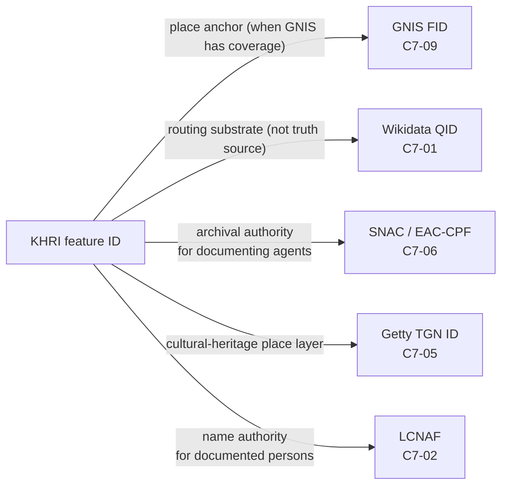

<!-- [KFM_META_BLOCK_V2]
doc_id: kfm://doc/docs-sources-catalog-kansas-khri
title: KHRI — Kansas Historic Resources Inventory (Source Dossier)
type: standard
subtype: source-catalog-entry
version: v0.2
status: draft
owners: <TODO — sources steward (docs/sources/); Kansas-First Domain Authority lead>
created: 2026-05-13
updated: 2026-05-21
policy_label: public
related:
  - docs/sources/catalog/kansas/README.md
  - docs/sources/catalog/kansas/kansas-state-archives.md
  - docs/sources/catalog/kansas/kansas-memory.md
  - docs/sources/catalog/kansas/kbs.md
  - docs/sources/catalog/kansas/ku-nhm.md
  - docs/sources/catalog/kansas/kdwp.md
  - docs/sources/catalog/kansas/fhsu-sternberg.md
  - docs/sources/catalog/README.md
  - docs/sources/catalog/IDENTITY.md
  - docs/sources/catalog/PROFILES.md
  - docs/sources/catalog/RIGHTS-AND-SENSITIVITY-MAP.md
  - docs/sources/catalog/OPEN-QUESTIONS.md
  - docs/sources/catalog/_template/SOURCE_PRODUCT_TEMPLATE.md
  - docs/sources/SOURCE_DESCRIPTOR_STANDARD.md
  - docs/domains/archaeology/README.md
  - docs/domains/settlements-infrastructure/README.md
  - docs/domains/people-dna-land/README.md
  - docs/doctrine/directory-rules.md
  - docs/doctrine/lifecycle-law.md
  - docs/doctrine/truth-posture.md
  - docs/standards/SENSITIVITY_RUBRIC.md
  - docs/registers/AUTHORITY_LADDER.md
  - docs/registers/DRIFT_REGISTER.md
  - docs/registers/VERIFICATION_BACKLOG.md
  - docs/adr/ADR-0001-schema-home.md
  - schemas/contracts/v1/source/source_descriptor.schema.json
  - connectors/kansas/khri/
  - data/registry/sources/
  - policy/sensitivity/
  - policy/rights/
tags: [kfm, sources, catalog, kansas, kansas-first, authority, khri, kshs, archives, archaeology, settlements, c7-10, c10-07, c7-09]
notes:
  - >-
    v0.2 path migration: this doc was at `docs/sources/catalog/khri.md` (flat)
    in v1 and has moved to `docs/sources/catalog/kansas/khri.md` (nested under
    the `kansas/` family folder per v0.2 catalog convention; kebab-case slug
    preserved). The kansas family README v0.2 lists this brief explicitly. The
    KSHS-umbrella brief (kansas-state-archives.md v0.2) also lists KHRI as one
    of its per-surface product pages.
  - >-
    Connector path was ALREADY correct in v1: `connectors/kansas/khri/` sits
    under the canonical `connectors/kansas/` §7.3 family. Same situation as
    KDWP v0.2 — no path-correction OPEN item needed.
  - >-
    Atlas card lineage CONFIRMED: `C7-10` (Kansas-First Domain Authorities —
    KHRI explicitly named: "the canonical inventory of Kansas historic
    resources (buildings, sites, districts)"); `C10-07` (Archives Stack —
    KHRI named alongside KSHS Kansas Memory, KU Spencer, KSU SC, WSU SC,
    county societies, LOC IIIF, SNAC/EAC-CPF); `C7-09` (GNIS as federal place
    authority; KHRI sits below GNIS in the proposed place-anchoring ladder);
    `KFM-P17-PROG-0011` (Kansas historical provenance source object — applies
    to KHRI surveys); `KFM-P2-IDEA-0024` (Kansas authorities mixed-modality
    publishing posture); `KFM-P24-IDEA-0002` + `KFM-P24-PROG-0013` (sensitive
    species / cultural-site deny-by-default + OPA ABSTAIN/DENY).
  - >-
    Structural framing (new in v0.2): KHRI is a **per-surface product page**
    under the KSHS-umbrella source-family brief at `./kansas-state-archives.md`
    (v0.2). The two layers coexist — the umbrella brief sets the shared KSHS
    institutional posture (rights floor, sensitivity register, anti-collapse
    register, crosswalk obligations, cross-domain integration); this page sets
    the KHRI-surface-specific admission posture.
  - >-
    `connectors/kansas/` lane is CONFIRMED (at commit
    `b6a27916bbb9e07cbf3752870c867476e1e094e7`) per Directory Rules v1.2 §7.3.
[/KFM_META_BLOCK_V2] -->

# KHRI — Kansas Historic Resources Inventory

> Source dossier for the Kansas Historic Resources Inventory (KHRI) — a **KSHS-operated** surface (one of the per-surface product pages under the KSHS-umbrella brief at [`./kansas-state-archives.md`](./kansas-state-archives.md)) and a **Kansas-First Domain Authority** per CONFIRMED `C7-10`: *"KHRI is the canonical inventory of Kansas historic resources (buildings, sites, districts)."* What KFM admits, what it cites, what it cannot prove, and how the lifecycle gates apply.

<!-- Badges: placeholders until owners, CI, and policy targets are confirmed. -->


-7e57c2)


**Status:** `draft` (v0.2) &nbsp;·&nbsp; **Owners:** _TODO — sources steward; Kansas-First Domain Authority lead_ &nbsp;·&nbsp; **Last updated:** 2026-05-21

---

## Quick jump

- [1. Scope](#1-scope) · [2. Repo fit](#2-repo-fit) · [3. KFM role and authority class](#3-kfm-role-and-authority-class) · [4. Source identity](#4-source-identity)
- [5. Source roles applicable to KHRI](#5-source-roles-applicable-to-khri) · [6. Sensitivity tiers and redaction posture](#6-sensitivity-tiers-and-redaction-posture)
- [7. Inputs KFM accepts from KHRI](#7-inputs-kfm-accepts-from-khri) · [8. Exclusions and "cannot prove"](#8-exclusions-and-cannot-prove)
- [9. Access pattern and harvest](#9-access-pattern-and-harvest) · [10. Lifecycle flow](#10-lifecycle-flow)
- [11. Domain bindings](#11-domain-bindings) · [12. Crosswalk anchors](#12-crosswalk-anchors)
- [13. Cite-or-abstain expectations](#13-cite-or-abstain-expectations) · [14. Governance hooks](#14-governance-hooks)
- [15. Task list (verification backlog)](#15-task-list-verification-backlog) · [16. FAQ](#16-faq) · [17. Related docs](#17-related-docs)
- [Appendix A — Source-role × tier matrix](#appendix-a--source-role--tier-matrix) · [Appendix B — Reference field outline](#appendix-b--reference-field-outline)
- [Appendix C — Atlas idea-card lineage](#appendix-c--atlas-idea-card-lineage) · [Appendix D — Change log](#appendix-d--change-log)

---

## 1. Scope

> [!NOTE]
> **Path migration (v1 → v0.2).** This page was authored as `docs/sources/catalog/khri.md` in v1 (flat) and **moved to `docs/sources/catalog/kansas/khri.md`** in v0.2 (nested under the `kansas/` family folder per v0.2 catalog convention; kebab-case slug preserved, consistent with sibling product pages — `kansas-state-archives.md`, `kansas-memory.md`, `kbs.md`, `ku-nhm.md`, `kdwp.md`, `fhsu-sternberg.md`, etc.). v1 §2 "PROPOSED catalog subdirectory" question is **partially resolved** by this reorganization.

> [!IMPORTANT]
> **Connector path was ALREADY correct in v1.** Like the sibling KDWP v0.2 revision — and unlike the four other sibling v0.2 revisions in this conversation series (Kansas Mesonet OPEN-MESO-01, KBS OPEN-KBS-01, KCC OPEN-KCC-01, KDOT OPEN-KDOT-01) — **KHRI's v1 already used `connectors/kansas/khri/`** correctly under the canonical `connectors/kansas/` §7.3 family lane. No path-correction OPEN item is needed.

> [!IMPORTANT]
> **Structural framing (new in v0.2): umbrella vs surface.** This dossier is the **per-surface product page** for KHRI. The **KSHS-umbrella brief** at [`./kansas-state-archives.md`](./kansas-state-archives.md) (v0.2) sets the shared institutional posture across KSHS surfaces (KHRI · Kansas Memory · KSHS State Archives proper · *Kansas Historical Quarterly* index). The two layers are intentional and coexist:
> - **Umbrella brief** (`kansas-state-archives.md`) — shared rights floor, sensitivity register, anti-collapse register, crosswalk obligations, cross-domain integration.
> - **Per-surface page** (THIS DOC) — KHRI-specific admission posture (source identity, access pattern, sensitivity tiers per content type, harvest design).
>
> Where this dossier states a posture, it **inherits** from the umbrella unless explicitly overridden. The umbrella is not a substitute for this page; this page is not a substitute for the umbrella.

**This dossier** is the human-facing description of KHRI as a KFM source. It binds the abstract `SourceDescriptor` (whose machine shape lives under `schemas/contracts/v1/source/`, **PROPOSED** per ADR-0001) to a single, named, real-world authority and records:

- what role KHRI plays in the KFM source ladder,
- what claims it can support (and which it cannot),
- the rights, sensitivity, and access posture that admission must respect,
- the lifecycle gates a KHRI-derived record passes before it touches a public surface.

**What this dossier is not.** It is **not** a `SourceDescriptor` instance, a connector, a policy bundle, a route, or a release manifest. Each of those has its own canonical home.

> [!IMPORTANT]
> KHRI is treated as a **Kansas-First Domain Authority** under CONFIRMED `C7-10` (Pass-10): *"KHRI is the canonical inventory of Kansas historic resources (buildings, sites, districts)."* The project's stated convention is that Kansas-first dossiers run against Kansas-specific authorities even when federal authorities are present, because local authorities carry detail that federal aggregators drop. The KFM convention stores the Kansas-authority anchor in parallel with any federal or international anchor (e.g., GNIS) per `C7-10` parallel-anchor rule.

[Back to top](#khri--kansas-historic-resources-inventory)

---

## 2. Repo fit

`docs/sources/` is the documentation lane for source-descriptor standards and per-source dossiers (Directory Rules v1.2 §6.1; UI/AI expansion report mentions `docs/sources/SOURCE_DESCRIPTOR_STANDARD.md`). The v0.2 reorganization adopted `docs/sources/catalog/<family>/<product>.md` as the catalog convention; `<family>` mirrors the §7.3 connector families. **`connectors/kansas/` is CONFIRMED (at commit `b6a27916bbb9e07cbf3752870c867476e1e094e7`)** as one of the nine canonical connector families per Directory Rules v1.2 §7.3, so `docs/sources/catalog/kansas/` is the explanatory companion for that lane.

```text
docs/
└── sources/
    ├── README.md                              # PROPOSED — lane overview
    ├── SOURCE_DESCRIPTOR_STANDARD.md          # PROPOSED — descriptor field spec
    └── catalog/                               # v0.2 catalog convention
        ├── README.md                          # PROPOSED — catalog index
        ├── IDENTITY.md                        # PROPOSED — namespace + Collection-id
        ├── PROFILES.md                        # PROPOSED — STAC/DCAT/PROV-O guidance
        ├── RIGHTS-AND-SENSITIVITY-MAP.md      # PROPOSED — lane-wide matrix
        ├── OPEN-QUESTIONS.md                  # PROPOSED — OPEN-DSC-* register
        └── kansas/                            # §7.3 canonical family folder
            ├── README.md                      # kansas family README v0.2
            ├── kansas-state-archives.md       # KSHS-umbrella brief (PROPOSED sibling)
            ├── khri.md                        # THIS FILE
            ├── kansas-memory.md               # Sister KSHS surface
            ├── kbs.md                         # Sibling Kansas-first biodiversity authority
            ├── ku-nhm.md                      # Sibling Kansas-first biodiversity authority
            ├── kdwp.md                        # Sibling Kansas-first authority
            ├── fhsu-sternberg.md              # Sibling in-state collection
            └── ...
```

> [!NOTE]
> v1 left the `catalog/` subdirectory PROPOSED; v0.2 adopts `docs/sources/catalog/<family>/<product>.md` as the catalog convention across the in-series revisions (kansas-mesonet, kbs, kansas-state-archives, kansas-memory, fhsu-sternberg, kdwp, kcc-oil-gas-reg, kdot, this doc). Mounted-repo verification of the v0.2 catalog tree remains — file a `DRIFT_REGISTER` entry if the mounted repo diverges.

### Upstream / downstream

| Direction | Surface | Role |
|---|---|---|
| **Upstream of this dossier** | `docs/sources/SOURCE_DESCRIPTOR_STANDARD.md` (PROPOSED) | Defines the field grammar this dossier instantiates in prose. |
| **Upstream of this dossier** | `schemas/contracts/v1/source/source_descriptor.schema.json` (PROPOSED) | Machine shape; per ADR-0001 default schema-home. |
| **Upstream sibling (umbrella)** | [`./kansas-state-archives.md`](./kansas-state-archives.md) (v0.2 PROPOSED) | KSHS-umbrella brief that this per-surface page inherits from. |
| **Lateral sibling (KSHS surface)** | [`./kansas-memory.md`](./kansas-memory.md) (v0.2 PROPOSED) | Sister KSHS surface — different access mechanics, shared institutional posture. |
| **Downstream of this dossier** | `connectors/kansas/khri/` | Source-specific fetch/admission; **family lane CONFIRMED at commit `b6a27916...`**; per-institution adapter PROPOSED. |
| **Downstream of this dossier** | `policy/sensitivity/`, `policy/rights/` (PROPOSED) | Sensitivity and rights gates resolve KHRI records to a tier and decision. |
| **Downstream of this dossier** | `data/registry/sources/kansas/khri/...` (PROPOSED) | Operational descriptor instance, not the prose dossier. |

[Back to top](#khri--kansas-historic-resources-inventory)

---

## 3. KFM role and authority class

`CONFIRMED (doctrine)` from the KFM corpus:

- KHRI is one of the **Kansas-First Domain Authorities** (`C7-10`, CONFIRMED Pass-10), alongside KSHS, KU Biodiversity Institute, KBS Natural Heritage Inventory, and KDWP SINC. These serve as the **domain authority of last resort** for entities not covered by federal or international authorities.
- KHRI is *"the canonical inventory of Kansas historic resources (buildings, sites, districts)"* (`C10-07` Archives Stack; `C7-10` Kansas-First Domain Authorities).
- KHRI appears in the **C10.g Archives and Cultural Heritage** subcategory of the Kansas archives stack, with KSHS Kansas Memory, KU Spencer, KSU SC, WSU SC, county societies, LOC IIIF, and SNAC/EAC-CPF as siblings.
- KHRI is **KSHS-operated** — the umbrella brief at [`./kansas-state-archives.md`](./kansas-state-archives.md) (v0.2) treats KHRI as one of the KSHS surfaces alongside Kansas Memory, KSHS State Archives proper, and *Kansas Historical Quarterly* index.
- KHRI surveys carry **Kansas historical provenance source object** fields per `KFM-P17-PROG-0011` (active, Pass 32): "source type, collection or program, source_ref, scan IDs, rights_spdx, and page-level references."

`PROPOSED` (KFM doctrine, not yet adopted): a **place-anchoring ladder** of the form
`GNIS → TGN → KHRI → Wikidata`, mirroring the personal-name ladder, with explicit handling for Indigenous-name records (`C7-09` Expansion Directions). Under this proposal KHRI sits between TGN and Wikidata for Kansas-specific cultural-historical place anchoring; until the ladder ADR lands, callers MUST NOT treat KHRI as the federal-place anchor.

> [!TIP]
> KFM doctrine separates two senses of "authority" (CONFIRMED, `C7-01` and parallel):
> - **Routing anchor** — the identifier KFM stores to federate across systems. KHRI feature identifiers fill this role for surveyed Kansas historic resources.
> - **Truth source** — what supports a specific claim. KHRI's truth scope is the survey record itself (methodology, findings, recommendations), not derived facts beyond it.

[Back to top](#khri--kansas-historic-resources-inventory)

---

## 4. Source identity

| Field | Value | Truth label |
|---|---|---|
| **KFM short name** | KHRI | CONFIRMED (project) |
| **Full name** | Kansas Historic Resources Inventory | CONFIRMED (project) |
| **Administering body** | State Historic Preservation Office (SHPO) at the Kansas Historical Society (KSHS) | EXTERNAL |
| **Umbrella source family** | KSHS (see [`./kansas-state-archives.md`](./kansas-state-archives.md) v0.2) | CONFIRMED (umbrella relationship per v0.2 reorganization) |
| **Portal URL** | `https://khri.kansasgis.org/` | EXTERNAL |
| **Jurisdiction** | State of Kansas, United States | CONFIRMED (project) |
| **Subject scope** | Historic buildings, structures, landscapes, objects, and districts; survey records; archaeological resources where survey-documented | EXTERNAL |
| **Cited inventory size** | > 50,000 surveyed historic properties | EXTERNAL |
| **Public access** | Free public search; registration required for survey submission/editing; some content restricted to protect sensitive resources | EXTERNAL |
| **License / rights** | _TODO — confirm with SHPO; KFM-side classification PENDING rights review_ | NEEDS VERIFICATION |
| **Stable persistent identifier scheme** | _TODO — KHRI uses internal survey identifiers; persistence and exposure semantics PENDING_ | NEEDS VERIFICATION |
| **Public API** | None CONFIRMED. Per `KFM-P2-IDEA-0024` (CONFIRMED, Pass 32), Kansas authorities are accessed through "a mix of agency portals, FOIA-style requests, and occasional GIS exports"; `C7-10` tension warns "the harvest layer must tolerate non-API sources for the foreseeable future." | UNKNOWN / NEEDS VERIFICATION |

> [!WARNING]
> The KFM corpus explicitly cautions (`C7-10` tension) that "several Kansas authorities lack stable HTTP APIs or persistent identifiers and rely on PDF or spreadsheet publication." Treat KHRI identifier persistence as **NEEDS VERIFICATION** and design the harvest path to tolerate non-API access. Do not assume a stable URI scheme.

[Back to top](#khri--kansas-historic-resources-inventory)

---

## 5. Source roles applicable to KHRI

KHRI surfaces content that maps to several `source_role` values. The KFM source-role enum (CONFIRMED per Atlas §24.1.3, Pass-23/32) is:

`observed | regulatory | modeled | aggregate | administrative | candidate | synthetic`

> [!CAUTION]
> Source role is set at admission and **never edited in-place** per Atlas §24.1.3. A correction produces a **new descriptor** plus a `CorrectionNotice`. A single KHRI payload may admit as **multiple descriptors** when its content carries more than one role.

| KHRI content type | Primary `source_role` | Notes |
|---|---|---|
| Survey record (methodology, findings, recommendations) | `administrative` | SHPO-curated inventory record; an authoritative administrative compilation about the resource. |
| Photographs / drawings inside a survey | `observed` | When admitted as evidence of physical condition at the survey date. |
| Register nominations (NRHP / Register of Historic Kansas Places) | `administrative` | Status decisions and listings administered by SHPO. |
| Eligibility determinations | `administrative` | Authoritative determinations about resource status. |
| Aggregated counts (county totals, period summaries) | `aggregate` | Subject to anti-collapse rules per Atlas §24.1.2; geometry scope must be preserved. |
| Survey forms still under review | `candidate` | MUST stay out of the PUBLISHED edge until merged. |

> [!IMPORTANT]
> **KHRI is not `regulatory` despite being administered by SHPO.** Eligibility determinations and Register listings are `administrative` decisions of record, not regulatory instruments — they document status under the historic-resources inventory, not legal force creating new requirements. Compare KDWP listings (`KFM-P19-IDEA-0005`), which ARE `regulatory` because they have legal force as listed-species status. Conflating the two is a source-role anti-collapse violation.

[Back to top](#khri--kansas-historic-resources-inventory)

---

## 6. Sensitivity tiers and redaction posture

> [!NOTE]
> The T0–T4 tier scheme below is drawn from Domains Atlas v1.1 §24.1 Master Sensitivity / Rights Tier Reference (PROPOSED). It is parallel to but distinct from the Pass-10 **`C6-01` Sensitivity Rubric** (0–5 scale, CONFIRMED) used elsewhere in the KFM catalog (e.g., `kdwp.md` v0.2, `kbs.md` v0.2). The two schemes have not yet been reconciled in a single ADR; until they are, this dossier preserves the T0–T4 framing as authored in v1 with cross-reference to `C6-01` where helpful.

`CONFIRMED (doctrine)` from the Domains Atlas v1.1 Master Sensitivity / Rights Tier Reference (T0–T4 PROPOSED scheme):

| KHRI content | Default tier | `C6-01` cross-reference (PROPOSED mapping) | Allowed transforms (PROPOSED) | Required gates |
|---|---|---|---|---|
| Building, structure, landscape, district survey records (public) | T0 / T1 | rank 0–1 (public/open / common non-sensitive) | Direct publish, or generalization for fields where rights or steward review applies. | `ReviewRecord` when rights are unclear; standard release gates. |
| Archaeological site location | **T4 default** | rank 4+ (threatened/rare → strict mask or embargo) | Steward review + cultural review + generalized geometry (coarse cell) + `RedactionReceipt` → T2 or T1. | `RedactionReceipt` + `ReviewRecord` + `PolicyDecision`; OPA ABSTAIN/DENY per `KFM-P24-PROG-0013` unless redaction satisfied. |
| Human remains / sacred sites | **T4** | **rank 5** (sacred/critical — fail-closed; no map or timeline exposure) | No transform releases this to T0; T3 only under explicit named authorization. | Sovereignty review + `ReviewRecord` + `PolicyDecision`; `kfm:care` extension (`C15-02`) + OPA default-deny on CARE-tagged (`C15-03`). |
| Survey content marked restricted by KSHS/SHPO | **T4 default** until rights review | rights gate (not rank) | Tier promotion requires explicit named agreement. | Rights review + `ReviewRecord`. |
| Aggregate counts by county/period | T0 | rank 0 (with anti-collapse guard) | Anti-collapse rule applies — aggregate MUST NOT be cited as per-place truth. | `AggregationReceipt`; geometry-scope guard. |

> [!IMPORTANT]
> KHRI's own public surface notes that "Public access to some of this information is restricted to protect and preserve precious resources." KFM MUST honor that restriction at admission; an unrestricted KHRI surface field does not by itself constitute permission for KFM to expose downstream. **Rights and sensitivity gates are applied independently at every promotion step.** Per `C5-02` (CONFIRMED), unknown rights fail closed.

### Sensitive-geometry rule (CONFIRMED, cross-cutting)

For sensitive archaeology products, any geometry **below H3 r7** is prohibited without review (ML-061-159; parallel to `C6-04` grid generalization). KHRI-derived archaeological-site geometry MUST satisfy this constraint or remain in WORK/QUARANTINE until generalized.

Per `KFM-P13-PROG-0018` (active, Pass 32, EXPANDED) — *the deterministic-generalization rule applies*: "Sensitive species records should use deterministic grid snapping, representative point plus uncertainty, or withholding tiers while preserving precise private coordinates and rule-version provenance." The same posture applies to KHRI sensitive-site geometry: every redaction emits a `RedactionReceipt` per Atlas §24.2.1; rule-version provenance is mandatory.

[Back to top](#khri--kansas-historic-resources-inventory)

---

## 7. Inputs KFM accepts from KHRI

KFM admits the following from KHRI, subject to the role, rights, and tier rules above:

- Surveyed historic property records (buildings, structures, landscapes, objects, districts) with attached metadata: location reference, period, architectural style, condition, historic context, and recommendations.
- Reconnaissance and intensive-level survey reports, including methodology and findings.
- Register listings and eligibility determinations (NRHP, Register of Historic Kansas Places) accessed via KHRI for nominations on or after the KSHS-stated cutover date (`NEEDS VERIFICATION` — current KSHS publication states January 1, 2024 cutover for nominations via the KHRI portal).
- Survey-attached imagery and drawings — admitted as `observed` evidence at the date of survey, never as a continuing claim about present condition.
- **Provenance object fields per `KFM-P17-PROG-0011`** — every KHRI-derived record carries source_type, collection_or_program, source_ref, scan_ids (where applicable), rights_spdx, and page_level_references (where applicable). This is the Kansas historical provenance source object shape and applies uniformly across KSHS surfaces (Kansas Memory, KHRI, KSHS State Archives proper).

[Back to top](#khri--kansas-historic-resources-inventory)

---

## 8. Exclusions and "cannot prove"

KHRI MUST NOT be used to support, anchor, or stand in for:

- **Exact location of culturally sensitive resources** — archaeological sites, sacred sites, burial places, human remains. (T4 default per §6; `KFM-P24-IDEA-0002` deny-by-default; `KFM-P24-PROG-0013` OPA ABSTAIN/DENY.)
- **Living-person fields.** KHRI is a property authority, not a person authority. Person/genealogy claims anchor under People/Genealogy doctrine and its own authority ladder.
- **Title or ownership truth.** KHRI carries historic-resource survey content; KFM doctrine explicitly separates title truth from inventory or assessor compilations.
- **Current condition.** A survey record evidences condition at survey date, not today. Treating a 1990s survey as a present-condition observation is a source-role collapse (Atlas §24.1.3) and a publication-gate failure.
- **Aggregate as per-place truth.** County totals or period summaries MUST NOT be cited as a single-record fact (anti-collapse rule per Atlas §24.1.2; ABSTAIN at AI; DENY at publication).
- **Federal place authority.** Even where KHRI assigns a stable inventory ID, the federal place anchor is GNIS (`C7-09`). Until the proposed `GNIS → TGN → KHRI → Wikidata` ladder is ratified by ADR, KHRI MUST NOT be substituted for GNIS where GNIS has coverage.
- **Regulatory-instrument substitution.** KHRI eligibility determinations and Register listings are `administrative` decisions of record — NOT regulatory instruments creating legal force. For Kansas regulatory anchors, see [`./kdwp.md`](./kdwp.md) (KDWP listings per `KFM-P19-IDEA-0005`) and [`./kcc-oil-gas-reg.md`](./kcc-oil-gas-reg.md) (KCC oil-and-gas regulatory).

[Back to top](#khri--kansas-historic-resources-inventory)

---

## 9. Access pattern and harvest

> [!NOTE]
> `NEEDS VERIFICATION` — operational details below are derived from KSHS public-facing pages and from KFM corpus generalizations about Kansas authorities. Specific KFM connector behavior, cadence, headers, and pagination are PROPOSED until the connector under `connectors/kansas/khri/` (PROPOSED per-institution adapter; **family lane CONFIRMED at commit `b6a27916...`**) is implemented and exercised.

- **Primary surface (CONFIRMED operational):** the KHRI public portal at `https://khri.kansasgis.org/` is an HTML search interface, with non-registered users able to search and print but not edit; registered users can submit/edit surveys. The Search tab is the homepage. (EXTERNAL.)
- **Bulk-export / public API surface:** none confirmed publicly. (UNKNOWN.) Project doctrine (`KFM-P2-IDEA-0024`; `C7-10` tension) confirms the mixed-modality posture: "agency portals, FOIA-style requests, and occasional GIS exports."
- **Recommended posture:**
  - Treat KHRI as a **page-scraping or PDF-harvest** source pending a documented harvest agreement.
  - Record every fetch with a `RunReceipt` per Atlas §24.2.1: fetch time, URL, query parameters, response hash, robots/terms applicable at fetch time.
  - Stage admitted payloads under `data/raw/<domain>/khri/<run_id>/` (PROPOSED per Directory Rules §7.3).
  - Sensitive or unclear-rights material routes to `data/quarantine/...` per the lifecycle invariant.
  - All connectors MUST NOT publish per Directory Rules §7.3; only `data/raw/` or `data/quarantine/` emission is permitted.
- **Cadence:** PROPOSED — quarterly survey of changes; daily checks discouraged absent steward agreement.

### Suggested partnership work (from project doctrine)

The corpus recommends "working with the publishers to establish stable IDs" (`C7-10`) and proposes a **memorandum-of-understanding** with one Kansas authority (the corpus names KDWP SINC as most plausible first pilot per `C7-10` expansion directions) to establish stable identifier schemes and documented harvest cadence. **PROPOSED expansion:** extend that work to KHRI as a second pilot, given KHRI's role as the canonical inventory and its known non-API access modality.

[Back to top](#khri--kansas-historic-resources-inventory)

---

## 10. Lifecycle flow

KHRI-derived records traverse the standard KFM lifecycle. Every transition is gated per `C5-02` (default-deny promotion, CONFIRMED); no path skips a phase.

```mermaid
flowchart LR
    KHRI["KHRI portal<br/>(SHPO @ KSHS)"]
    R["RAW<br/>data/raw/&lt;domain&gt;/khri/&lt;run&gt;/"]
    W["WORK<br/>data/work/..."]
    Q["QUARANTINE<br/>data/quarantine/..."]
    P["PROCESSED<br/>data/processed/..."]
    C["CATALOG / TRIPLET<br/>data/catalog/..."]
    PUB["PUBLISHED<br/>via apps/governed-api/"]

    KHRI -- "connector fetch<br/>connectors/kansas/khri/<br/>RunReceipt + SourceDescriptor" --> R
    R -- "normalize<br/>TransformReceipt + ValidationReport" --> W
    R -. "rights / sensitivity unclear<br/>fail-closed (C5-02)" .-> Q
    W -- "validation pass" --> P
    W -. "fail validation" .-> W
    P -- "EvidenceRef resolves<br/>CatalogMatrix entry" --> C
    C -- "ReleaseManifest<br/>ReviewRecord<br/>RollbackCard" --> PUB
    Q -. "steward review +<br/>RedactionReceipt<br/>(KFM-P13-PROG-0018)" .-> W

    classDef confirmed fill:#d5e8d4,stroke:#82b366;
    classDef quarantine fill:#fff4e0,stroke:#d4882b;
    classDef public fill:#e8f5e9,stroke:#2e7d32;
    class Q quarantine;
    class PUB public;
```



> [!NOTE]
> The diagram reflects the **CONFIRMED lifecycle invariant** RAW → WORK / QUARANTINE → PROCESSED → CATALOG / TRIPLET → PUBLISHED. The `connectors/kansas/khri/` adapter writes only to `data/raw/` or `data/quarantine/` per Directory Rules §7.3 connector-as-non-publisher rule. Concrete repo paths under `data/...` are PROPOSED until verified in the mounted repo; family lane `connectors/kansas/` is CONFIRMED at commit `b6a27916...`.

[Back to top](#khri--kansas-historic-resources-inventory)

---

## 11. Domain bindings

KHRI is principally cited by the following KFM domains (CONFIRMED ownership from the Domains Atlas; specific binding strengths PROPOSED here):

| Domain | Citation role | Notes |
|---|---|---|
| **Archaeology and Cultural Heritage** | Primary Kansas-first authority for survey-documented archaeology where KHRI carries the record. | T4 default; geometry generalization mandatory before any public surface per `KFM-P13-PROG-0018`. |
| **Settlements, Cities, and Infrastructure** | Historic property anchor for towns, districts, fort/mission/reservation community archives. | T0/T1 for non-sensitive surveyed properties. |
| **People, Genealogy, DNA, and Land Ownership** | Cited only for property association — never as person evidence directly. | Living-person fields denied; deceased-person property links permitted under public-records doctrine. |
| **Roads, Rail, and Trade Routes** | Historic corridor and crossing context where KHRI carries the resource record. | Sensitive cultural corridors require steward review. Cross-reference with KDOT route data via [`./kdot.md`](./kdot.md) v0.2 OPEN-KDOT-11 (routes-over-historic-corridors crosswalk). |
| **Spatial Foundation, Cartography, Reference Systems** | Indirect — KHRI place anchors layered atop GNIS via the proposed authority ladder. | PROPOSED until ladder ADR adopted per `C7-09`. |

[Back to top](#khri--kansas-historic-resources-inventory)

---

## 12. Crosswalk anchors

KHRI records are NOT a sole-source anchor in KFM doctrine. Crosswalk anchors stored alongside the KHRI identifier (CONFIRMED `C7-10` parallel-anchor convention; specific store paths PROPOSED):



- **GNIS** (`C7-09`, CONFIRMED) — federal place authority; required when GNIS has coverage.
- **Wikidata** (`C7-01`, CONFIRMED) — universal crosswalk substrate; routing only, not a truth source.
- **SNAC / EAC-CPF** (`C7-06`, CONFIRMED) — archival authority for persons/corporate bodies referenced in KHRI surveys.
- **Getty TGN** (`C7-05`, PROPOSED in Pass-10) — cultural-heritage place layer for vernacular and historical names.
- **LCNAF** (`C7-02`, CONFIRMED) — federal name authority for persons referenced in KHRI surveys (architects, original owners).

> [!TIP]
> The KFM convention is to store the Kansas-authority identifier **in parallel with** the federal or international anchor per `C7-10` parallel-anchor rule — not in place of it. Removed or merged KHRI identifiers should be retained as lineage, not silently deleted (open question in `C7-09`).

[Back to top](#khri--kansas-historic-resources-inventory)

---

## 13. Cite-or-abstain expectations

The KFM truth posture is **cite-or-abstain** (CONFIRMED doctrine). For any user-facing or AI-facing claim drawn from KHRI:

1. The claim resolves through an `EvidenceRef` to an `EvidenceBundle` (per Atlas §24.2.1) that includes the KHRI source descriptor, the fetch receipt, and the policy decision in effect at publication.
2. Bibliographic citation language MUST identify SHPO @ KSHS as the administering body and KHRI as the inventory, with the fetch date.
3. If a claim depends on a KHRI record currently restricted (rights, sovereignty, or sensitivity), Focus Mode and any AI surface MUST `ABSTAIN`. They MUST NOT paraphrase the underlying detail to circumvent the gate.
4. Aggregate KHRI numbers cited as per-place facts → `DENY` at the trust membrane per Atlas §24.1.2; `ABSTAIN` at AI; raise as a violation if observed in published content.
5. Survey-date condition cited as present condition → `DENY`; route to correction (`CorrectionNotice` per Atlas §24.2.1).
6. **Per-record `AIReceipt` MUST resolve** to an `EvidenceBundle` whose underlying KHRI record's policy decision is currently `allowed` — not merely captured at admission.

[Back to top](#khri--kansas-historic-resources-inventory)

---

## 14. Governance hooks

| Hook | Owner (PROPOSED) | Artifact / contract |
|---|---|---|
| **SourceDescriptor instance** | Sources steward | PROPOSED at `data/registry/sources/kansas/khri/source_descriptor.yaml` — machine descriptor whose shape is governed by `schemas/contracts/v1/source/source_descriptor.schema.json` per ADR-0001. |
| **SourceActivationDecision** | Sources steward + rights reviewer | Declares `allowed | restricted | denied | needs-review` use; required before any connector emits per `C5-02`. |
| **Connector** | Connector author | `connectors/kansas/khri/` — **family lane CONFIRMED at commit `b6a27916...`**; per-institution adapter PROPOSED; emits only to `data/raw/` or `data/quarantine/`. |
| **Rights gate** | Rights reviewer | `policy/rights/` (PROPOSED). Unknown rights fail closed per `C5-02`. |
| **Sensitivity gate** | Sensitivity steward | `policy/sensitivity/` (PROPOSED). Tier defaults per §6. OPA ABSTAIN/DENY for sensitive cultural sites per `KFM-P24-PROG-0013`. |
| **CARE / sovereignty gate** | Rights-holder representative | `kfm:care` extension per `C15-02`; OPA default-deny on CARE-tagged per `C15-03`. |
| **Promotion / release gate** | Release manager | `policy/release/`; `ReleaseManifest`; rollback target; correction path. |
| **AIReceipt requirement** | Governed-AI subsystem | Every Focus Mode answer touching KHRI carries an `AIReceipt` per Atlas §24.2.1; ABSTAIN if cite-or-abstain cannot be satisfied. |

[Back to top](#khri--kansas-historic-resources-inventory)

---

## 15. Task list (verification backlog)

- [x] **Path migration (v1 OV PROPOSED catalog subdirectory)** — PARTIALLY RESOLVED in v0.2: moved to `docs/sources/catalog/kansas/khri.md` under §7.3 canonical family folder. Mounted-repo verification remains.
- [x] **Connector path** — ALREADY CORRECT in v1: `connectors/kansas/khri/` under canonical §7.3 family lane. No path-correction item needed.
- [ ] **Rights confirmation** — obtain SHPO/KSHS terms in writing; classify license; populate the rights row in §4. (NEEDS VERIFICATION)
- [ ] **Identifier persistence** — document KHRI's internal identifier scheme; confirm whether identifiers persist across survey updates. (NEEDS VERIFICATION)
- [ ] **Harvest mechanism** — confirm whether any bulk export, OAI-PMH, GIS-service endpoint, or partnership-only feed is available; record outcome. (UNKNOWN)
- [ ] **Sensitive-content disclosure list** — capture the SHPO definition of restricted content so the connector can fail closed on type matches. (NEEDS VERIFICATION)
- [ ] **Place-anchoring ladder ADR** — author ADR for `GNIS → TGN → KHRI → Wikidata`; until landed, KHRI is not a federal-place anchor. (PROPOSED per `C7-09`)
- [ ] **Source-role ADR (ADR-S-04)** — confirm `administrative` is the canonical primary role for KHRI survey records under the v1 enum per Atlas §24.1.3.
- [ ] **MoU pilot** — track project-doctrine proposal (`C7-10` expansion) to pilot a stable-ID partnership with one Kansas authority (initially KDWP SINC); evaluate KHRI as second pilot.
- [ ] **Connector implementation** — `connectors/kansas/khri/` with descriptor, fixtures, validators, and gate hooks before activation; family lane CONFIRMED at commit, adapter PROPOSED.
- [ ] **Umbrella alignment** — confirm the KSHS-umbrella brief at [`./kansas-state-archives.md`](./kansas-state-archives.md) v0.2 carries posture statements this dossier inherits cleanly; flag any inheritance conflicts.
- [ ] **OQ-KHRI-12 (new v0.2)** — confirm whether KHRI eligibility determinations should ever carry `source_role: regulatory` instead of `administrative` (parallels KDWP regulatory framing per `KFM-P19-IDEA-0005`); current posture is `administrative` per §5.
- [ ] **OQ-KHRI-13 (new v0.2)** — confirm corpus card-ID stability for `KFM-P17-PROG-0011` (Kansas historical provenance source object) and `KFM-P13-PROG-0018` (sensitive-species grid generalization, applied by parallel to sensitive cultural sites).
- [ ] **OQ-KHRI-14 (new v0.2)** — reconcile T0–T4 (Atlas v1.1) and 0–5 (`C6-01`) sensitivity tier schemes via ADR.

[Back to top](#khri--kansas-historic-resources-inventory)

---

## 16. FAQ

> [!NOTE]
> Answers reflect current project doctrine and externally verified KHRI surface facts. They do not assert KFM implementation state.

**Q. Can KFM republish KHRI photographs or survey forms?**
A. NEEDS VERIFICATION — pending written rights confirmation. Default posture is `DENY` per `C5-02` until rights are explicit.

**Q. Why is KHRI not used as the federal place anchor?**
A. Because GNIS is the federal place authority for U.S. places (`C7-09`, CONFIRMED). The KFM convention layers KHRI atop GNIS per `C7-10` parallel-anchor rule — it does not replace it. The proposed `GNIS → TGN → KHRI → Wikidata` ladder is PROPOSED, not ratified.

**Q. What happens if KHRI's identifier for a property changes upstream?**
A. Open question across Kansas-first authorities (`C7-09` Open Questions). PROPOSED handling: retain the prior identifier as lineage; record the upstream change in a `DRIFT_REGISTER` entry; do not silently overwrite.

**Q. Can Focus Mode quote a KHRI restricted-access survey?**
A. No. `ABSTAIN` is required when cite-or-abstain cannot be satisfied under the active policy decision. AI text is not evidence.

**Q. Is KHRI an "API" source?**
A. Not confirmed. Per `KFM-P2-IDEA-0024` (CONFIRMED, Pass 32), Kansas authorities are accessed through "a mix of agency portals, FOIA-style requests, and occasional GIS exports." Project doctrine names KHRI specifically among authorities that may need PDF/CSV harvesting; design accordingly.

**Q. How does this dossier relate to the KSHS-umbrella brief?** *(new v0.2)*
A. KHRI is one of several KSHS-operated surfaces. The umbrella brief at [`./kansas-state-archives.md`](./kansas-state-archives.md) (v0.2) sets shared KSHS institutional posture — rights floor, sensitivity register, anti-collapse register, crosswalk obligations, cross-domain integration. This dossier sets the KHRI-surface-specific admission posture (identity, access mechanics, sensitivity per content type). Both layers exist by design; the umbrella does not substitute for this page and this page does not substitute for the umbrella.

**Q. Why does this doc emphasize that the connector path was already correct?** *(new v0.2)*
A. Because four sibling v0.2 revisions in this conversation series (Kansas Mesonet, KBS, KCC oil-and-gas, KDOT) all required path corrections from incorrect top-level family placements (`connectors/kansas-mesonet/`, `connectors/kbs/`, `connectors/kcc_oil_gas_reg/`, `connectors/kdot/`). KHRI's v1 already used `connectors/kansas/khri/` — the correct per-institution-adapter pattern under the canonical `connectors/kansas/` §7.3 lane. Noting this distinguishes KHRI from the four siblings and avoids a phantom OPEN item. (KDWP v0.2 made the same observation.)

[Back to top](#khri--kansas-historic-resources-inventory)

---

## 17. Related docs

> [!NOTE]
> Targets below reflect the v0.2 catalog reorganization (`docs/sources/catalog/<family>/<product>.md`, kebab-case slugs, nested under §7.3 family folders). Sibling product pages PROPOSED until verified in the mounted repo. Adjust paths via a `DRIFT_REGISTER` entry rather than silently divergent siblings.

- [`./README.md`](./README.md) — `docs/sources/catalog/kansas/` family README v0.2 (lists this brief; confirms `connectors/kansas/` as §7.3 canonical at commit `b6a27916...`)
- [`./kansas-state-archives.md`](./kansas-state-archives.md) — **KSHS-umbrella brief (v0.2)** — this dossier inherits institutional posture from the umbrella
- [`./kansas-memory.md`](./kansas-memory.md) — sister KSHS surface (digital portal)
- [`./kbs.md`](./kbs.md) — sibling Kansas-first biodiversity authority per `C7-10`
- [`./ku-nhm.md`](./ku-nhm.md) — sibling Kansas-first biodiversity authority per `C7-10`
- [`./kdwp.md`](./kdwp.md) — sibling Kansas-first authority per `C7-10`; regulatory framing for comparison with KHRI's administrative framing
- [`./fhsu-sternberg.md`](./fhsu-sternberg.md) — sibling in-state collection (FHSU; not KSHS-operated)
- [`./kdot.md`](./kdot.md) — sibling Kansas agency; cross-reference for historic-corridor crosswalk (OPEN-KDOT-11)
- [`../README.md`](../README.md) — `docs/sources/catalog/` index (TODO: create or verify)
- [`../IDENTITY.md`](../IDENTITY.md) — Collection-id and namespace conventions
- [`../PROFILES.md`](../PROFILES.md) — catalog-profile selection guidance
- [`../RIGHTS-AND-SENSITIVITY-MAP.md`](../RIGHTS-AND-SENSITIVITY-MAP.md) — lane-wide rights/sensitivity matrix
- [`../OPEN-QUESTIONS.md`](../OPEN-QUESTIONS.md) — lane-wide `OPEN-DSC-*` items
- [`../../SOURCE_DESCRIPTOR_STANDARD.md`](../../SOURCE_DESCRIPTOR_STANDARD.md) — PROPOSED. Descriptor field grammar
- [`../../../doctrine/directory-rules.md`](../../../doctrine/directory-rules.md) — placement law (§6.1, §7.3, §7.4, §9.1, §11)
- [`../../../doctrine/lifecycle-law.md`](../../../doctrine/lifecycle-law.md) — PROPOSED. Lifecycle invariant authority
- [`../../../doctrine/truth-posture.md`](../../../doctrine/truth-posture.md) — PROPOSED. Cite-or-abstain doctrine
- [`../../../domains/archaeology/README.md`](../../../domains/archaeology/README.md) — Domain that most exercises KHRI's sensitivity machinery
- [`../../../domains/settlements-infrastructure/README.md`](../../../domains/settlements-infrastructure/README.md) — Domain that most exercises KHRI's place anchoring
- [`../../../standards/SENSITIVITY_RUBRIC.md`](../../../standards/SENSITIVITY_RUBRIC.md) — `C6-01` 0–5 rubric (PROPOSED in corpus); cross-reference for T0–T4 mapping
- [`../../../registers/AUTHORITY_LADDER.md`](../../../registers/AUTHORITY_LADDER.md) — authority order for placement and citation
- [`../../../registers/DRIFT_REGISTER.md`](../../../registers/DRIFT_REGISTER.md) — where to file repo/doctrine drift
- [`../../../adr/ADR-0001-schema-home.md`](../../../adr/ADR-0001-schema-home.md) — Schema-home rule
- Pass-10 Idea Index — **`C7-10`** Kansas-First Domain Authorities (CONFIRMED); **`C10-07`** Archives Stack (CONFIRMED); **`C7-09`** GNIS as federal place authority (CONFIRMED); **`C7-01`/`C7-02`/`C7-05`/`C7-06`** authority crosswalks; **`C6-01`** Sensitivity Rubric (CONFIRMED); **`C5-02`** default-deny promotion (CONFIRMED); **`C15-02`/`C15-03`** CARE extension + OPA default-deny
- Pass-23/32 Consolidated Atlas — **`KFM-P17-PROG-0011`** Kansas historical provenance source object (active); **`KFM-P2-IDEA-0024`** Kansas authorities mixed-modality (CONFIRMED); **`KFM-P13-PROG-0018`** sensitive grid generalization (active); **`KFM-P24-IDEA-0002`** + **`KFM-P24-PROG-0013`** sensitive deny-by-default + OPA ABSTAIN/DENY (active); Atlas §24.1.2 + §24.1.3 + §24.2.1 + §24.8 (CONFIRMED)

> Link targets are written relative to this file's v0.2 location (`docs/sources/catalog/kansas/khri.md`). Verify after path is confirmed in the mounted repo.

[Back to top](#khri--kansas-historic-resources-inventory)

---

## Appendix A — Source-role × tier matrix

<details>
<summary>Click to expand the per-content-type role and tier reference</summary>

| KHRI content | `source_role` | Default tier (Atlas v1.1) | `C6-01` cross-reference | Transform path to public | Cross-cited domains |
|---|---|---|---|---|---|
| Building / structure survey (public) | `administrative` | T0 / T1 | rank 0–1 | Direct or generalized as required by SHPO terms. | Settlements; Roads/Rail (corridor context); Frontier Matrix. |
| Landscape / district survey | `administrative` | T0 / T1 | rank 0–1 | Direct or generalized. | Settlements; Archaeology (when overlapping). |
| Archaeological-site survey | `administrative` | **T4** | rank 4+ | Steward review + cultural review + coarse-cell geometry + `RedactionReceipt` → T2 or T1. | Archaeology (owner); Settlements (generalized context). |
| Survey of human-remains / sacred site | `administrative` | **T4 (no T0/T1 path)** | **rank 5** (sacred/critical, fail-closed) | T3 only under explicit named authorization; `kfm:care` extension. | Archaeology — sovereignty-gated. |
| Photographs / drawings (in-survey) | `observed` | Same as parent record; never less restrictive. | Same as parent | Per parent. | Per parent. |
| Register listing / nomination | `administrative` | T0 | rank 0 | Direct. | Settlements; Archaeology. |
| Eligibility determination | `administrative` | T0 | rank 0 | Direct. | Settlements; Archaeology. |
| Aggregate county / period counts | `aggregate` | T0 | rank 0 with anti-collapse guard | `AggregationReceipt` mandatory; anti-collapse rule binds per Atlas §24.1.2. | Frontier Matrix; UI. |
| Survey under review | `candidate` | n/a (pre-promotion) | n/a | Promotion gate required per `C5-02`; PUBLISHED edge forbidden until merged. | none until merged. |

</details>

[Back to top](#khri--kansas-historic-resources-inventory)

---

## Appendix B — Reference field outline

<details>
<summary>Click to expand the KFM SourceDescriptor field outline this dossier maps to (PROPOSED, illustrative)</summary>

> PROPOSED. This outline mirrors the descriptor surface sketched in the Domains Atlas v1.1 §24.1 and is not authoritative until the schema lands at `schemas/contracts/v1/source/source_descriptor.schema.json` per ADR-0001. Field names below are illustrative; aligned with sibling v0.2 descriptor sketches (kansas-state-archives.md, kdwp.md, kbs.md).

```yaml
# Illustrative SourceDescriptor instance for KHRI (PROPOSED; not a fixture)
source_id: khri
source_family: kansas                              # v0.2 catalog folder; CONFIRMED §7.3 family at commit b6a27916...
source_family_enum: other                          # closed enum per KFM-P3-PROG-0001
archives_subfamily: kshs                           # internal KSHS sub-grouping
source_name: "Kansas Historic Resources Inventory"
administering_body: "State Historic Preservation Office, Kansas Historical Society"
umbrella_family_ref: kansas-state-archives         # PROPOSED v0.2: KSHS-umbrella brief
portal_url: "https://khri.kansasgis.org/"
jurisdiction: "US-KS"
source_role: administrative                        # role-per-content payload may vary; see Appendix A
role_authority: "SHPO @ KSHS"
kansas_first_anchor: C7-10                         # CONFIRMED authority anchor
parallel_anchor_rule: C7-10                        # store Kansas IRI alongside federal/international anchor
archives_stack_member: C10-07                      # CONFIRMED Archives Stack membership
access:
  method: html-portal
  bulk_api: unknown                                # NEEDS VERIFICATION; KFM-P2-IDEA-0024 mixed-modality
  cadence_proposed: quarterly
rights:
  license: TODO                                    # NEEDS VERIFICATION
  attribution_required: true                       # PROPOSED default
  posture: NEEDS_VERIFICATION                      # default-deny per C5-02 until terms confirmed
sensitivity:
  rubric_atlas_v1_1: T0-T4                         # PROPOSED scheme
  rubric_pass10: C6-01                              # 0-5 cross-reference
  default_tier: mixed                              # see §6 per content type
  archaeology_default: T4                          # ≈ C6-01 rank 4+
  human_remains_default: T4                        # ≈ C6-01 rank 5 (fail-closed)
  default_redaction_profile: profile:sinc-obscure-10km  # C6-02 named profile (applied by parallel)
crosswalks:
  - target: gnis
    role: federal_place_anchor                     # C7-09
  - target: wikidata
    role: routing_substrate                        # C7-01
  - target: snac
    role: archival_agent_authority                 # C7-06
  - target: tgn
    role: cultural_heritage_place                  # C7-05
  - target: lcnaf
    role: name_authority                           # C7-02
provenance_object:                                 # per KFM-P17-PROG-0011
  preserved_fields:
    - source_type
    - collection_or_program
    - source_ref
    - scan_ids
    - rights_spdx
    - page_level_references
release:
  public_release_class: per-record
  ai_surface_class: cite-or-abstain
care_review_required: true                         # per C15-02 / C15-03 for culturally sensitive content
status:
  activation_decision: needs-review                # allowed | restricted | denied | needs-review
  fixtures_present: false
  validators_present: false
  policy_gates_present: false
```

</details>

[Back to top](#khri--kansas-historic-resources-inventory)

---

## Appendix C — Atlas idea-card lineage

For traceability into the KFM Idea Index spine, this brief draws on the following atlas cards.

<details>
<summary>Click to expand — idea-card lineage</summary>

| Stable ID | Title | Status (atlas) | Relevance to this brief |
|---|---|---|---|
| `C7-10` | Kansas-First Domain Authorities | CONFIRMED (Pass-10) | Names **KHRI** as one of five Kansas-first authorities alongside KSHS, KU Biodiversity Institute, KBS NHI, KDWP SINC. "KHRI holds the canonical record for historic resources (buildings, sites, districts)." Parallel-anchor rule. |
| `C10-07` | Archives Stack | CONFIRMED (Pass-10) | KHRI named alongside KSHS Kansas Memory (~600k), KU Spencer, KSU SC (~1M), WSU SC, county societies, LOC IIIF, SNAC/EAC-CPF. |
| `C7-09` | USGS GNIS for U.S. Place Authorities | CONFIRMED (Pass-10) | Federal place authority; proposes `GNIS → TGN → KHRI → Wikidata` ladder for cultural-historical place anchoring. |
| `C7-05` | Getty TGN | PROPOSED (Pass-10) | Cultural-heritage place authority layered between GNIS and KHRI. |
| `C7-06` | SNAC + EAC-CPF | CONFIRMED (Pass-10) | Archival authority for persons/corporate bodies referenced in KHRI surveys. |
| `C7-02` | LCNAF | CONFIRMED (Pass-10) | Name authority for documented persons (architects, original owners). |
| `C7-01` | Wikidata as universal crosswalk substrate | CONFIRMED (Pass-10) | Routing anchor, not truth source. |
| `KFM-P17-PROG-0011` | Kansas historical provenance source object | active, Pass 32 | "Source type, collection or program, source_ref, scan IDs, rights_spdx, page-level references" — provenance shape applies uniformly across KSHS surfaces (KHRI, Kansas Memory, KSHS State Archives proper). |
| `KFM-P2-IDEA-0024` | USDA NASS, KGS, KDA, KDHE, KDWP as Kansas-specific authorities | CONFIRMED, Pass 32 | Establishes the per-agency-watcher pattern; KHRI's KSHS-administered surfaces follow the same posture: "agency portals, FOIA-style requests, and occasional GIS exports." |
| `KFM-P13-PROG-0018` | Sensitive species grid generalization policy | active, Pass 32, EXPANDED | "Deterministic grid snapping, representative point plus uncertainty, or withholding tiers while preserving precise private coordinates and rule-version provenance" — operational doctrine for archaeology / sacred-site geometry in KHRI (applied by parallel). |
| `KFM-P24-IDEA-0002` | Sensitive species deny-by-default posture | active, Pass 32 | Anchors the operational deny-by-default for KHRI sensitive cultural sites. |
| `KFM-P24-PROG-0013` | Sensitive taxa redaction policy | active, Pass 32 | OPA ABSTAIN/DENY unless redaction satisfied — same operational discipline applies to KHRI sensitive cultural sites. |
| `C6-01` | Sensitivity rubric 0–5 | CONFIRMED (Pass-10) | Pass-10 sensitivity scale; cross-referenced to Atlas v1.1 T0–T4 in §6. |
| `C6-02` | Named redaction profiles | CONFIRMED (Pass-10) | Named-profile convention; PROPOSED `profile:sinc-obscure-10km` mapping for KHRI sensitive-site geometry. |
| `C6-04` | Grid generalization (H3 r7+ public floor) | CONFIRMED (Pass-10) | Sensitive-geometry floor cited in §6 sensitive-geometry rule. |
| `C15-02` / `C15-03` | `kfm:care` extension + OPA default-deny on CARE-tagged | CONFIRMED (Pass-10) | Sovereignty review for culturally sensitive material; relevant for KHRI sacred-site and traditional-use records. |
| `C5-02` | Default-deny promotion | CONFIRMED (Pass-10) | Anchors deny-by-default rights posture; "unknown rights fail closed." |
| `C5-04` | Spec-hash-match gate | CONFIRMED (Pass-10) | Promotion gate referenced in §10 lifecycle. |
| `C5-08` | Lineage required | CONFIRMED (Pass-10) | OpenLineage trail back to receipts per Atlas §24.2.1. |
| `C4-01` | STAC `kfm:provenance` namespace | CONFIRMED (Pass-10) | Provenance block shape inherited by KHRI catalog rows. |
| `C4-02` | STAC Collection (`kfm-<org>-<product>`) | CONFIRMED (Pass-10) | Collection-id convention. |
| `C4-05` | DCAT distribution | CONFIRMED (Pass-10) | Applicable to KHRI tabular survey-data exports. |
| Atlas §24.1.2 | Anti-collapse failure modes | CONFIRMED (Pass-23/32) | "Aggregate cited as a per-place truth" → DENY at trust membrane. |
| Atlas §24.1.3 | Source-role enum (Master Source-Role Anti-Collapse Register) | CONFIRMED (Pass-23/32) | `observed | regulatory | modeled | aggregate | administrative | candidate | synthetic`; KHRI primary role `administrative`. |
| Atlas §24.2.1 | Master receipt catalog | CONFIRMED (Pass-23/32) | `SourceDescriptor`, `RunReceipt`, `TransformReceipt`, `ValidationReport`, `RedactionReceipt`, `AggregationReceipt`, `AIReceipt`. |
| Atlas §24.8 | Time discipline | CONFIRMED (Pass-23/32) | source / observed / valid / retrieval / release / correction times preserved separately. |
| **`KFM-P19-IDEA-0005`** (referenced for contrast) | KDWP listing canonical regulatory context | active, Pass 32 | Cited in §8 to contrast KHRI's `administrative` framing with KDWP's `regulatory` framing — different roles, different doctrinal anchors. |

</details>

[Back to top](#khri--kansas-historic-resources-inventory)

---

## Appendix D — Change log

| Date | Author | Change | Reviewed by |
|---|---|---|---|
| 2026-05-13 | `<docs-steward — TODO>` | Initial v1 source-catalog entry: scope, repo fit, KFM role / authority class, source identity, source roles applicable to KHRI, sensitivity tiers (T0–T4 PROPOSED scheme), inputs accepted, exclusions, access pattern, lifecycle flow, domain bindings, crosswalk anchors, cite-or-abstain expectations, governance hooks, task list, FAQ, related docs, source-role × tier matrix, reference field outline. Path: `docs/sources/catalog/khri.md` (flat). Connector path `connectors/kansas/khri/` already correctly placed under §7.3 canonical family. | `<archives-domain-liaison — TODO>` |
| 2026-05-21 | `<docs-steward — TODO>` | **v0.2 revision.** Path migration to `docs/sources/catalog/kansas/khri.md` (flat-to-folder reorganization; consistent with sibling product pages — `kansas-state-archives.md`, `kansas-memory.md`, `kbs.md`, `ku-nhm.md`, `kdwp.md`, `fhsu-sternberg.md`). **Substantive doctrinal additions:** (a) explicit framing as a per-surface product page under the KSHS-umbrella brief at `./kansas-state-archives.md` (v0.2) — IMPORTANT callout in §1 makes the umbrella-vs-surface relationship explicit and ties to KFM-P17-PROG-0011 provenance shape. (b) IMPORTANT callout noting that connector path was ALREADY correct in v1 (distinguishing KHRI from four sibling v0.2 revisions that all required path corrections; same situation as KDWP v0.2). (c) Explicit citation to `KFM-P17-PROG-0011` (Kansas historical provenance source object) in §3 and §7 — the shared KSHS-surface provenance shape. (d) Explicit citations to `KFM-P24-IDEA-0002`, `KFM-P24-PROG-0013`, `KFM-P13-PROG-0018`, `KFM-P2-IDEA-0024` throughout §6, §8, §9, §10 — sensitive-site deny-by-default, OPA ABSTAIN/DENY, geometry generalization rule. (e) Added §5 IMPORTANT callout distinguishing KHRI `administrative` from KDWP `regulatory` per `KFM-P19-IDEA-0005` — preempts the natural source-role anti-collapse mistake. (f) Added §6 NOTE callout explaining T0–T4 (Atlas v1.1) vs `C6-01` (0–5) tier-scheme relationship; added `C6-01` cross-reference column to the sensitivity table. Surfaced reconciliation as OQ-KHRI-14. (g) Upgraded `connectors/kansas/` family lane to **CONFIRMED at commit `b6a27916...`** (was PROPOSED in v1); per-institution adapter `connectors/kansas/khri/` remains PROPOSED. Lifecycle Mermaid diagram updated to reflect this. (h) Added §6 cross-reference to `KFM-P13-PROG-0018` for deterministic grid generalization with rule-version provenance. (i) Added §12 LCNAF crosswalk anchor (`C7-02`) — overlooked in v1; relevant for documented persons in surveys. (j) Updated §11 with cross-reference to KDOT v0.2 OPEN-KDOT-11 (routes-over-historic-corridors crosswalk). (k) Updated §15 task list with three new items: OQ-KHRI-12 (administrative-vs-regulatory framing), OQ-KHRI-13 (corpus card stability for KFM-P17-PROG-0011 and KFM-P13-PROG-0018), OQ-KHRI-14 (T0–T4 vs 0–5 reconciliation). (l) Added §16 FAQ Q&A on umbrella relationship and connector-path-already-correct. (m) Updated §17 related docs with v0.2 sibling paths and Pass-10 + Pass-23/32 corpus-card reference group. (n) Expanded Appendix B descriptor sketch with `source_family: kansas`, `source_family_enum: other`, `archives_subfamily: kshs`, `umbrella_family_ref: kansas-state-archives`, `kansas_first_anchor: C7-10`, `parallel_anchor_rule: C7-10`, `archives_stack_member: C10-07`, sensitivity rubric cross-reference fields, LCNAF crosswalk, `provenance_object` block per `KFM-P17-PROG-0011`, `care_review_required: true`. (o) Added Appendix C (atlas idea-card lineage, 25 cards). (p) Added Appendix D (this change log). (q) Updated meta block to v0.2 with full related-docs list and notes block. (r) Updated badges: added doc-version, family, archives-stack, umbrella-sibling; fixed timestamp. | `<archives-domain-liaison — TODO>` |

[Back to top](#khri--kansas-historic-resources-inventory)

---

## External sources consulted

- KHRI public portal — `https://khri.kansasgis.org/` and `https://khri.kansasgis.org/KHRI_Instructions_LoggedOut.htm` — confirmed administering body, scope, registered-vs-non-registered access semantics, and surveyed-property count.
- KSHS / kansashistory.gov — `https://www.kansashistory.gov/p/buildings-structures-landscapes-and-districts/14669`, `/p/online-collections/18942`, `/p/register-database/14638`, `/p/surveys/19389`, `/p/tax-credit-basics/14673`, and `https://www.kshs.org/p/historic-preservation-collection/18591` — confirmed scope (buildings, structures, landscapes, objects, districts), restricted-access caveat, January 1, 2024 nomination-portal cutover statement.

These external sources informed only the operational surface (§4 identity row, §9 access pattern, §16 FAQ) and were not used to characterize KFM-internal architecture, terminology, paths, or governance state. No additional external research was performed in the v0.2 revision; all v0.2 additions are sourced from the KFM corpus (Pass-10 Idea Index, Pass-23/32 Consolidated Atlas, Directory Rules v1.2, Repository Structure Guiding Document) and prior in-conversation revisions (kansas-state-archives.md v0.2, kansas-memory.md v0.2, kdwp.md v0.2, etc.).

---

<!-- Footer block per presentation standard. -->

<sub>**Last updated:** 2026-05-21 · **Status:** `draft` (v0.2) · **Owners:** _TODO — sources steward; Kansas-First Domain Authority lead_</sub>

<sub>**Family lane:** `connectors/kansas/` — CONFIRMED §7.3 at commit `b6a27916bbb9e07cbf3752870c867476e1e094e7`. **Per-institution adapter:** `connectors/kansas/khri/` — v1 already correctly placed; PROPOSED until mounted-repo verification.</sub>

<sub>**Authority of this brief:** per-surface product page under the KSHS-umbrella brief at [`./kansas-state-archives.md`](./kansas-state-archives.md); cites authority, does not own it. The `SourceDescriptor` per KHRI product is the source of truth for rights, sensitivity, cadence, citation.</sub>

<sub>**Related doctrine:** [`../../../doctrine/directory-rules.md`](../../../doctrine/directory-rules.md) · [`../../../doctrine/lifecycle-law.md`](../../../doctrine/lifecycle-law.md) · [`../../../doctrine/truth-posture.md`](../../../doctrine/truth-posture.md) · [`../../../registers/AUTHORITY_LADDER.md`](../../../registers/AUTHORITY_LADDER.md)</sub>

<sub>**Path basis:** v0.2 catalog convention `docs/sources/catalog/<family>/<product>.md`; `kansas/` family folder per Directory Rules v1.2 §7.3.</sub>

<sub>[↑ Back to top](#khri--kansas-historic-resources-inventory)</sub>
