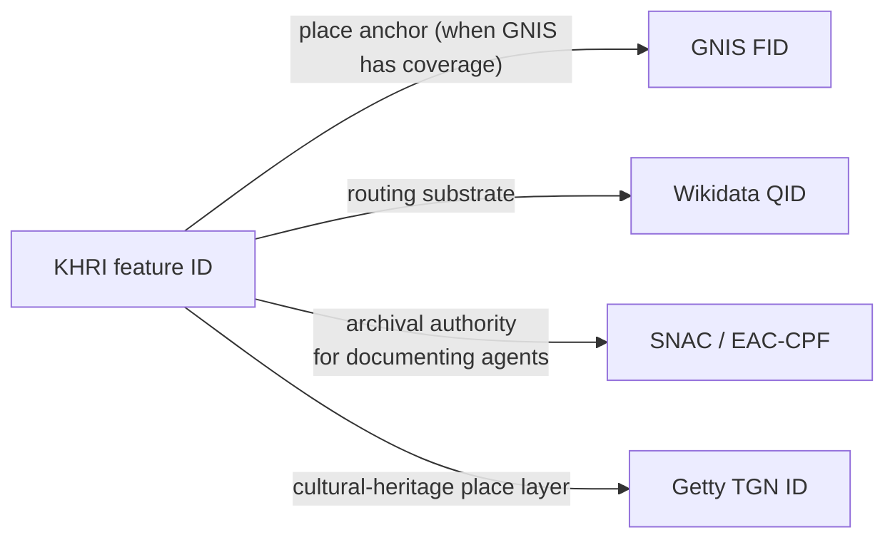

<!-- [KFM_META_BLOCK_V2]
doc_id: kfm://doc/sources/catalog/khri
title: KHRI — Kansas Historic Resources Inventory (Source Dossier)
type: standard
version: v1
status: draft
owners: TODO — sources steward (docs/sources/); Kansas-First Domain Authority lead
created: 2026-05-13
updated: 2026-05-13
policy_label: public
related:
  - docs/sources/SOURCE_DESCRIPTOR_STANDARD.md
  - docs/sources/catalog/README.md
  - docs/domains/archaeology/README.md
  - docs/domains/settlements-infrastructure/README.md
  - docs/domains/people-dna-land/README.md
  - kfm://schema/source/source_descriptor
  - kfm://policy/sensitivity
tags: [kfm, sources, kansas-first, authority, KHRI, KSHS, archives, archaeology, settlements]
notes:
  - Path PROPOSED. `docs/sources/` is established by Directory Rules §6.1 and the UI/AI expansion report; `docs/sources/catalog/` as a per-source subdirectory is a PROPOSED convention pending ADR or local README confirmation.
  - All implementation paths, route names, and schema fields remain PROPOSED until repo evidence verifies them.
[/KFM_META_BLOCK_V2] -->

# KHRI — Kansas Historic Resources Inventory

> Source dossier for the Kansas Historic Resources Inventory (KHRI): what KFM admits, what it cites, what it cannot prove, and how the lifecycle gates apply.

<!-- Badges: placeholders until owners, CI, and policy targets are confirmed. -->


**Status:** `draft` &nbsp;·&nbsp; **Owners:** _TODO — sources steward; Kansas-First Domain Authority lead_ &nbsp;·&nbsp; **Last updated:** 2026-05-13

---

## Quick jump

- [1. Scope](#1-scope) · [2. Repo fit](#2-repo-fit) · [3. KFM role and authority class](#3-kfm-role-and-authority-class) · [4. Source identity](#4-source-identity)
- [5. Source roles applicable to KHRI](#5-source-roles-applicable-to-khri) · [6. Sensitivity tiers and redaction posture](#6-sensitivity-tiers-and-redaction-posture)
- [7. Inputs KFM accepts from KHRI](#7-inputs-kfm-accepts-from-khri) · [8. Exclusions and "cannot prove"](#8-exclusions-and-cannot-prove)
- [9. Access pattern and harvest](#9-access-pattern-and-harvest) · [10. Lifecycle flow](#10-lifecycle-flow)
- [11. Domain bindings](#11-domain-bindings) · [12. Crosswalk anchors](#12-crosswalk-anchors)
- [13. Cite-or-abstain expectations](#13-cite-or-abstain-expectations) · [14. Governance hooks](#14-governance-hooks)
- [15. Task list (verification backlog)](#15-task-list-verification-backlog) · [16. FAQ](#16-faq) · [17. Related docs](#17-related-docs)
- [Appendix A — Source-role × tier matrix](#appendix-a--source-role--tier-matrix) · [Appendix B — Reference field outline](#appendix-b--reference-field-outline)

---

## 1. Scope

**This dossier** is the human-facing description of KHRI as a KFM source. It binds the abstract `SourceDescriptor` (whose machine shape lives under `schemas/contracts/v1/source/`, **PROPOSED** per ADR-0001) to a single, named, real-world authority and records:

- what role KHRI plays in the KFM source ladder,
- what claims it can support (and which it cannot),
- the rights, sensitivity, and access posture that admission must respect,
- the lifecycle gates a KHRI-derived record passes before it touches a public surface.

**What this dossier is not.** It is **not** a `SourceDescriptor` instance, a connector, a policy bundle, a route, or a release manifest. Each of those has its own canonical home.

> [!IMPORTANT]
> KHRI is treated as a **Kansas-First Domain Authority** under C7-10. The project's stated convention is that Kansas-first dossiers run against Kansas-specific authorities even when federal authorities are present, because local authorities carry detail that federal aggregators drop. The KFM convention stores the Kansas-authority anchor in parallel with any federal or international anchor (e.g., GNIS).

[Back to top](#khri--kansas-historic-resources-inventory)

---

## 2. Repo fit

`docs/sources/` is the documentation lane for source-descriptor standards and per-source dossiers (Directory Rules §6.1; UI/AI expansion report mentions `docs/sources/SOURCE_DESCRIPTOR_STANDARD.md`). This file proposes that per-source dossiers live in a `catalog/` subdirectory beneath that lane.

```text
docs/
└── sources/
    ├── README.md                              # PROPOSED — lane overview
    ├── SOURCE_DESCRIPTOR_STANDARD.md          # PROPOSED — descriptor field spec
    └── catalog/                               # PROPOSED — per-source dossiers
        ├── README.md                          # PROPOSED — catalog index
        ├── khri.md                            # THIS FILE
        ├── kshs-kansas-memory.md              # PROPOSED sibling
        ├── gnis.md                            # PROPOSED sibling
        └── ...
```

> [!NOTE]
> The `catalog/` subdirectory under `docs/sources/` is **PROPOSED**. The lane `docs/sources/` is established in Directory Rules §6.1 ("source-descriptor standards, source families") and in the UI/AI expansion report's update-propagation matrix, but the catalog subdirectory itself is not enumerated in inspectable evidence. If the mounted repo already places per-source dossiers elsewhere (e.g., `docs/sources/<source>.md` flat, or under `docs/domains/<domain>/sources/`), follow that convention and file a `DRIFT_REGISTER` entry rather than creating a parallel home.

### Upstream / downstream

| Direction | Surface | Role |
|---|---|---|
| **Upstream of this dossier** | `docs/sources/SOURCE_DESCRIPTOR_STANDARD.md` (PROPOSED) | Defines the field grammar this dossier instantiates in prose. |
| **Upstream of this dossier** | `schemas/contracts/v1/source/source_descriptor.schema.json` (PROPOSED) | Machine shape; per ADR-0001 default schema-home. |
| **Downstream of this dossier** | `connectors/kansas/khri/` (PROPOSED) | Source-specific fetch/admission; must reference this dossier's source-role and rights posture. |
| **Downstream of this dossier** | `policy/sensitivity/`, `policy/rights/` (PROPOSED) | Sensitivity and rights gates resolve KHRI records to a tier and decision. |
| **Downstream of this dossier** | `data/registry/sources/khri/...` (PROPOSED) | Operational descriptor instance, not the prose dossier. |

[Back to top](#khri--kansas-historic-resources-inventory)

---

## 3. KFM role and authority class

`CONFIRMED (doctrine)` from the KFM corpus:

- KHRI is one of the **Kansas-First Domain Authorities** (C7-10), alongside KSHS, KU Biodiversity Institute, KBS Natural Heritage Inventory, and KDWP SINC. These serve as the **domain authority of last resort** for entities not covered by federal or international authorities.
- KHRI is "the canonical inventory of Kansas historic resources (buildings, sites, districts)" (C10-07 Archives Stack; C7-10 Kansas-First Domain Authorities).
- KHRI appears in the **C10.g Archives and Cultural Heritage** subcategory of the Kansas archives stack, with KSHS Kansas Memory, KU Spencer, KSU SC, WSU SC, county societies, LOC IIIF, and SNAC/EAC-CPF as siblings.

`PROPOSED` (KFM doctrine, not yet adopted): a **place-anchoring ladder** of the form  
`GNIS → TGN → KHRI → Wikidata`, mirroring the personal-name ladder, with explicit handling for Indigenous-name records (C7-09 Expansion Directions). Under this proposal KHRI sits between TGN and Wikidata for Kansas-specific cultural-historical place anchoring; until the ladder ADR lands, callers MUST NOT treat KHRI as the federal-place anchor.

> [!TIP]
> KFM doctrine separates two senses of "authority":
> - **Routing anchor** — the identifier KFM stores to federate across systems. KHRI feature identifiers fill this role for surveyed Kansas historic resources.
> - **Truth source** — what supports a specific claim. KHRI's truth scope is the survey record itself (methodology, findings, recommendations), not derived facts beyond it.

[Back to top](#khri--kansas-historic-resources-inventory)

---

## 4. Source identity

| Field | Value | Truth label |
|---|---|---|
| **KFM short name** | KHRI | CONFIRMED (project) |
| **Full name** | Kansas Historic Resources Inventory | CONFIRMED (project) |
| **Administering body** | State Historic Preservation Office (SHPO) at the Kansas Historical Society (KSHS) | EXTERNAL |
| **Portal URL** | `https://khri.kansasgis.org/` | EXTERNAL |
| **Jurisdiction** | State of Kansas, United States | CONFIRMED (project) |
| **Subject scope** | Historic buildings, structures, landscapes, objects, and districts; survey records; archaeological resources where survey-documented | EXTERNAL |
| **Cited inventory size** | > 50,000 surveyed historic properties | EXTERNAL |
| **Public access** | Free public search; registration required for survey submission/editing; some content restricted to protect sensitive resources | EXTERNAL |
| **License / rights** | _TODO — confirm with SHPO; KFM-side classification PENDING rights review_ | NEEDS VERIFICATION |
| **Stable persistent identifier scheme** | _TODO — KHRI uses internal survey identifiers; persistence and exposure semantics PENDING_ | NEEDS VERIFICATION |
| **Public API** | _None CONFIRMED. Project doctrine notes Kansas authorities "rely on PDF or spreadsheet publication" and that "the harvest layer must tolerate non-API sources for the foreseeable future."_ | UNKNOWN / NEEDS VERIFICATION |

> [!WARNING]
> The KFM corpus explicitly cautions that "several Kansas authorities lack stable HTTP APIs or persistent identifiers and rely on PDF or spreadsheet publication." Treat KHRI identifier persistence as **NEEDS VERIFICATION** and design the harvest path to tolerate non-API access. Do not assume a stable URI scheme.

[Back to top](#khri--kansas-historic-resources-inventory)

---

## 5. Source roles applicable to KHRI

KHRI surfaces content that maps to several `source_role` values. The KFM source-role enum (PROPOSED v1, per Domains Atlas v1.1 §24.1) is:

`observed | regulatory | modeled | aggregate | administrative | candidate | synthetic`

> [!CAUTION]
> Source role is set at admission and **never edited in-place**. A correction produces a **new descriptor** plus a `CorrectionNotice`. A single KHRI payload may admit as **multiple descriptors** when its content carries more than one role.

| KHRI content type | Primary `source_role` | Notes |
|---|---|---|
| Survey record (methodology, findings, recommendations) | `administrative` | SHPO-curated inventory record; an authoritative administrative compilation about the resource. |
| Photographs / drawings inside a survey | `observed` | When admitted as evidence of physical condition at the survey date. |
| Register nominations (NRHP / Register of Historic Kansas Places) | `administrative` | Status decisions and listings administered by SHPO. |
| Eligibility determinations | `administrative` | Authoritative determinations about resource status. |
| Aggregated counts (county totals, period summaries) | `aggregate` | Subject to anti-collapse rules; geometry scope must be preserved. |
| Survey forms still under review | `candidate` | MUST stay out of the PUBLISHED edge until merged. |

[Back to top](#khri--kansas-historic-resources-inventory)

---

## 6. Sensitivity tiers and redaction posture

`CONFIRMED (doctrine)` from the Domains Atlas v1.1 Master Sensitivity / Rights Tier Reference (T0–T4 PROPOSED scheme):

| KHRI content | Default tier | Allowed transforms (PROPOSED) | Required gates |
|---|---|---|---|
| Building, structure, landscape, district survey records (public) | T0 / T1 | Direct publish, or generalization for fields where rights or steward review applies. | `ReviewRecord` when rights are unclear; standard release gates. |
| Archaeological site location | **T4 default** | Steward review + cultural review + generalized geometry (coarse cell) + `RedactionReceipt` → T2 or T1. | `RedactionReceipt` + `ReviewRecord` + `PolicyDecision`. |
| Human remains / sacred sites | **T4** | No transform releases this to T0; T3 only under explicit named authorization. | Sovereignty review + `ReviewRecord` + `PolicyDecision`. |
| Survey content marked restricted by KSHS/SHPO | **T4 default** until rights review | Tier promotion requires explicit named agreement. | Rights review + `ReviewRecord`. |
| Aggregate counts by county/period | T0 | Anti-collapse rule applies — aggregate MUST NOT be cited as per-place truth. | `AggregationReceipt`; geometry-scope guard. |

> [!IMPORTANT]
> KHRI's own public surface notes that "Public access to some of this information is restricted to protect and preserve precious resources." KFM MUST honor that restriction at admission; an unrestricted KHRI surface field does not by itself constitute permission for KFM to expose downstream. **Rights and sensitivity gates are applied independently at every promotion step.**

### Sensitive-geometry rule (CONFIRMED, cross-cutting)

For sensitive archaeology products, any geometry **below H3 r7** is prohibited without review (ML-061-159). KHRI-derived archaeological-site geometry MUST satisfy this constraint or remain in WORK/QUARANTINE until generalized.

[Back to top](#khri--kansas-historic-resources-inventory)

---

## 7. Inputs KFM accepts from KHRI

KFM admits the following from KHRI, subject to the role, rights, and tier rules above:

- Surveyed historic property records (buildings, structures, landscapes, objects, districts) with attached metadata: location reference, period, architectural style, condition, historic context, and recommendations.
- Reconnaissance and intensive-level survey reports, including methodology and findings.
- Register listings and eligibility determinations (NRHP, Register of Historic Kansas Places) accessed via KHRI for nominations on or after the KSHS-stated cutover date (`NEEDS VERIFICATION` — current KSHS publication states January 1, 2024 cutover for nominations via the KHRI portal).
- Survey-attached imagery and drawings — admitted as `observed` evidence at the date of survey, never as a continuing claim about present condition.

[Back to top](#khri--kansas-historic-resources-inventory)

---

## 8. Exclusions and "cannot prove"

KHRI MUST NOT be used to support, anchor, or stand in for:

- **Exact location of culturally sensitive resources** — archaeological sites, sacred sites, burial places, human remains. (T4 default; doctrine.)
- **Living-person fields.** KHRI is a property authority, not a person authority. Person/genealogy claims anchor under People/Genealogy doctrine and its own authority ladder.
- **Title or ownership truth.** KHRI carries historic-resource survey content; KFM doctrine explicitly separates title truth from inventory or assessor compilations.
- **Current condition.** A survey record evidences condition at survey date, not today. Treating a 1990s survey as a present-condition observation is a source-role collapse and a publication-gate failure.
- **Aggregate as per-place truth.** County totals or period summaries MUST NOT be cited as a single-record fact (anti-collapse rule; ABSTAIN at AI; DENY at publication).
- **Federal place authority.** Even where KHRI assigns a stable inventory ID, the federal place anchor is GNIS (C7-09). Until the proposed `GNIS → TGN → KHRI → Wikidata` ladder is ratified by ADR, KHRI MUST NOT be substituted for GNIS where GNIS has coverage.

[Back to top](#khri--kansas-historic-resources-inventory)

---

## 9. Access pattern and harvest

> [!NOTE]
> `NEEDS VERIFICATION` — operational details below are derived from KSHS public-facing pages and from KFM corpus generalizations about Kansas authorities. Specific KFM connector behavior, cadence, headers, and pagination are PROPOSED until the connector under `connectors/kansas/khri/` (PROPOSED) is implemented and exercised.

- **Primary surface (CONFIRMED operational):** the KHRI public portal at `https://khri.kansasgis.org/` is an HTML search interface, with non-registered users able to search and print but not edit; registered users can submit/edit surveys. The Search tab is the homepage. (EXTERNAL.)
- **Bulk-export / public API surface:** none confirmed publicly. (UNKNOWN.) Project doctrine anticipates that "the harvest layer must tolerate manual submission flows for the foreseeable future" for several Kansas authorities.
- **Recommended posture:**
  - Treat KHRI as a **page-scraping or PDF-harvest** source pending a documented harvest agreement.
  - Record every fetch with a `RunReceipt`: fetch time, URL, query parameters, response hash, robots/terms applicable at fetch time.
  - Stage admitted payloads under `data/raw/<domain>/khri/<run_id>/` (PROPOSED per Directory Rules §7.3).
  - Sensitive or unclear-rights material routes to `data/quarantine/...` per the lifecycle invariant.
  - All connectors MUST NOT publish; only `data/raw/` or `data/quarantine/` emission is permitted.
- **Cadence:** PROPOSED — quarterly survey of changes; daily checks discouraged absent steward agreement.

### Suggested partnership work (from project doctrine)

The corpus recommends "working with the publishers to establish stable IDs" and proposes a **memorandum-of-understanding** with one Kansas authority (the corpus names KDWP SINC as most plausible) to establish stable identifier schemes and documented harvest cadence. **PROPOSED expansion:** extend that work to KHRI as a second pilot.

[Back to top](#khri--kansas-historic-resources-inventory)

---

## 10. Lifecycle flow

KHRI-derived records traverse the standard KFM lifecycle. Every transition is gated; no path skips a phase.

```mermaid
flowchart LR
    KHRI["KHRI portal<br/>(SHPO @ KSHS)"]
    R["RAW<br/>data/raw/&lt;domain&gt;/khri/&lt;run&gt;/"]
    W["WORK<br/>data/work/..."]
    Q["QUARANTINE<br/>data/quarantine/..."]
    P["PROCESSED<br/>data/processed/..."]
    C["CATALOG / TRIPLET<br/>data/catalog/..."]
    PUB["PUBLISHED<br/>via apps/governed-api/"]

    KHRI -- "connector fetch<br/>RunReceipt + SourceDescriptor" --> R
    R -- "normalize<br/>TransformReceipt + ValidationReport" --> W
    R -. "rights / sensitivity unclear<br/>fail-closed" .-> Q
    W -- "validation pass" --> P
    W -. "fail validation" .-> W
    P -- "EvidenceRef resolves<br/>CatalogMatrix entry" --> C
    C -- "ReleaseManifest<br/>ReviewRecord<br/>RollbackCard" --> PUB
    Q -. "steward review +<br/>RedactionReceipt" .-> W

    classDef quarantine fill:#fff4e0,stroke:#d4882b;
    classDef public fill:#e8f5e9,stroke:#2e7d32;
    class Q quarantine;
    class PUB public;
```



> [!NOTE]
> The diagram reflects the **CONFIRMED lifecycle invariant** RAW → WORK / QUARANTINE → PROCESSED → CATALOG / TRIPLET → PUBLISHED. Concrete repo paths under `data/...` are PROPOSED until verified in the mounted repo.

[Back to top](#khri--kansas-historic-resources-inventory)

---

## 11. Domain bindings

KHRI is principally cited by the following KFM domains (CONFIRMED ownership from the Domains Atlas; specific binding strengths PROPOSED here):

| Domain | Citation role | Notes |
|---|---|---|
| **Archaeology and Cultural Heritage** | Primary Kansas-first authority for survey-documented archaeology where KHRI carries the record. | T4 default; geometry generalization mandatory before any public surface. |
| **Settlements, Cities, and Infrastructure** | Historic property anchor for towns, districts, fort/mission/reservation community archives. | T0/T1 for non-sensitive surveyed properties. |
| **People, Genealogy, DNA, and Land Ownership** | Cited only for property association — never as person evidence directly. | Living-person fields denied; deceased-person property links permitted under public-records doctrine. |
| **Roads, Rail, and Trade Routes** | Historic corridor and crossing context where KHRI carries the resource record. | Sensitive cultural corridors require steward review. |
| **Spatial Foundation, Cartography, Reference Systems** | Indirect — KHRI place anchors layered atop GNIS via the proposed authority ladder. | PROPOSED until ladder ADR adopted. |

[Back to top](#khri--kansas-historic-resources-inventory)

---

## 12. Crosswalk anchors

KHRI records are NOT a sole-source anchor in KFM doctrine. Crosswalk anchors stored alongside the KHRI identifier (CONFIRMED convention; specific store paths PROPOSED):



- **GNIS** (C7-09) — federal place authority; required when GNIS has coverage.
- **Wikidata** (C7-01) — universal crosswalk substrate; routing only, not a truth source.
- **SNAC / EAC-CPF** (C7-06) — archival authority for persons/corporate bodies referenced in KHRI surveys.
- **Getty TGN** (C7-05) — cultural-heritage place layer for vernacular and historical names.

> [!TIP]
> The KFM convention is to store the Kansas-authority identifier **in parallel with** the federal or international anchor — not in place of it. Removed or merged KHRI identifiers should be retained as lineage, not silently deleted (open question in C7-09).

[Back to top](#khri--kansas-historic-resources-inventory)

---

## 13. Cite-or-abstain expectations

The KFM truth posture is **cite-or-abstain**. For any user-facing or AI-facing claim drawn from KHRI:

1. The claim resolves through an `EvidenceRef` to an `EvidenceBundle` that includes the KHRI source descriptor, the fetch receipt, and the policy decision in effect at publication.
2. Bibliographic citation language MUST identify SHPO @ KSHS as the administering body and KHRI as the inventory, with the fetch date.
3. If a claim depends on a KHRI record currently restricted (rights, sovereignty, or sensitivity), Focus Mode and any AI surface MUST `ABSTAIN`. They MUST NOT paraphrase the underlying detail to circumvent the gate.
4. Aggregate KHRI numbers cited as per-place facts → `DENY` at the trust membrane; `ABSTAIN` at AI; raise as a violation if observed in published content.
5. Survey-date condition cited as present condition → `DENY`; route to correction.

[Back to top](#khri--kansas-historic-resources-inventory)

---

## 14. Governance hooks

| Hook | Owner (PROPOSED) | Artifact / contract |
|---|---|---|
| **SourceDescriptor instance** | Sources steward | PROPOSED at `data/registry/sources/khri/...` — machine descriptor whose shape is governed by `schemas/contracts/v1/source/source_descriptor.schema.json`. |
| **SourceActivationDecision** | Sources steward + rights reviewer | Declares `allowed | restricted | denied | needs-review` use; required before any connector emits. |
| **Connector** | Connector author | PROPOSED at `connectors/kansas/khri/`; emits only to `data/raw/` or `data/quarantine/`. |
| **Rights gate** | Rights reviewer | `policy/rights/` (PROPOSED). Unknown rights fail closed. |
| **Sensitivity gate** | Sensitivity steward | `policy/sensitivity/` (PROPOSED). Tier defaults per §6. |
| **Promotion / release gate** | Release manager | `policy/release/`; `ReleaseManifest`; rollback target; correction path. |
| **AIReceipt requirement** | Governed-AI subsystem | Every Focus Mode answer touching KHRI carries an `AIReceipt`; ABSTAIN if cite-or-abstain cannot be satisfied. |

[Back to top](#khri--kansas-historic-resources-inventory)

---

## 15. Task list (verification backlog)

- [ ] **Rights confirmation** — obtain SHPO/KSHS terms in writing; classify license; populate the rights row in §4. (NEEDS VERIFICATION)
- [ ] **Identifier persistence** — document KHRI's internal identifier scheme; confirm whether identifiers persist across survey updates. (NEEDS VERIFICATION)
- [ ] **Harvest mechanism** — confirm whether any bulk export, OAI-PMH, GIS-service endpoint, or partnership-only feed is available; record outcome. (UNKNOWN)
- [ ] **Sensitive-content disclosure list** — capture the SHPO definition of restricted content so the connector can fail closed on type matches. (NEEDS VERIFICATION)
- [ ] **Place-anchoring ladder ADR** — author ADR for `GNIS → TGN → KHRI → Wikidata`; until landed, KHRI is not a federal-place anchor. (PROPOSED)
- [ ] **Source-role ADR (ADR-S-04)** — confirm `administrative` is the canonical primary role for KHRI survey records under the v1 enum.
- [ ] **MoU pilot** — track project-doctrine proposal to pilot a stable-ID partnership with one Kansas authority (initially KDWP SINC); evaluate KHRI as second pilot.
- [ ] **Connector implementation** — `connectors/kansas/khri/` with descriptor, fixtures, validators, and gate hooks before activation.

[Back to top](#khri--kansas-historic-resources-inventory)

---

## 16. FAQ

> [!NOTE]
> Answers reflect current project doctrine and externally verified KHRI surface facts. They do not assert KFM implementation state.

**Q. Can KFM republish KHRI photographs or survey forms?**
A. NEEDS VERIFICATION — pending written rights confirmation. Default posture is `DENY` until rights are explicit.

**Q. Why is KHRI not used as the federal place anchor?**
A. Because GNIS is the federal place authority for U.S. places (C7-09). The KFM convention layers KHRI atop GNIS — it does not replace it. The proposed `GNIS → TGN → KHRI → Wikidata` ladder is PROPOSED, not ratified.

**Q. What happens if KHRI's identifier for a property changes upstream?**
A. Open question across Kansas-first authorities (C7-09 Open Questions). PROPOSED handling: retain the prior identifier as lineage; record the upstream change in a `DRIFT_REGISTER` entry; do not silently overwrite.

**Q. Can Focus Mode quote a KHRI restricted-access survey?**
A. No. `ABSTAIN` is required when cite-or-abstain cannot be satisfied under the active policy decision. AI text is not evidence.

**Q. Is KHRI an "API" source?**
A. Not confirmed. Project doctrine names KHRI specifically among authorities that may need PDF/CSV harvesting; design accordingly.

[Back to top](#khri--kansas-historic-resources-inventory)

---

## 17. Related docs

- [`docs/sources/SOURCE_DESCRIPTOR_STANDARD.md`](../../SOURCE_DESCRIPTOR_STANDARD.md) — PROPOSED. Descriptor field grammar.
- [`docs/sources/catalog/README.md`](../README.md) — PROPOSED. Source-catalog index.
- [`docs/sources/catalog/gnis.md`](../gnis.md) — PROPOSED sibling. Federal place anchor.
- [`docs/sources/catalog/kshs-kansas-memory.md`](./kansas-memory.md) — PROPOSED sibling. Sister Kansas archive.
- [`docs/sources/catalog/snac.md`](../snac.md) — PROPOSED sibling. Archival agent authority.
- [`docs/domains/archaeology/README.md`](../../../domains/archaeology/README.md) — Domain that most exercises KHRI's sensitivity machinery.
- [`docs/domains/settlements-infrastructure/README.md`](../../../domains/settlements-infrastructure/README.md) — Domain that most exercises KHRI's place anchoring.
- [`docs/doctrine/lifecycle-law.md`](../../../doctrine/lifecycle-law.md) — PROPOSED. Lifecycle invariant authority.
- [`docs/doctrine/truth-posture.md`](../../../doctrine/truth-posture.md) — PROPOSED. Cite-or-abstain doctrine.
- [`docs/adr/ADR-0001-schema-home.md`](../../../adr/ADR-0001-schema-home.md) — Schema-home rule.
- [`docs/registers/DRIFT_REGISTER.md`](../../../registers/DRIFT_REGISTER.md) — Where to file repo/doctrine drift.

> Link targets are written relative to this file's PROPOSED location (`docs/sources/catalog/khri.md`). Verify after path is confirmed.

[Back to top](#khri--kansas-historic-resources-inventory)

---

## Appendix A — Source-role × tier matrix

<details>
<summary>Click to expand the per-content-type role and tier reference</summary>

| KHRI content | `source_role` | Default tier | Transform path to public | Cross-cited domains |
|---|---|---|---|---|
| Building / structure survey (public) | `administrative` | T0 / T1 | Direct or generalized as required by SHPO terms. | Settlements; Roads/Rail (corridor context); Frontier Matrix. |
| Landscape / district survey | `administrative` | T0 / T1 | Direct or generalized. | Settlements; Archaeology (when overlapping). |
| Archaeological-site survey | `administrative` | **T4** | Steward review + cultural review + coarse-cell geometry + `RedactionReceipt` → T2 or T1. | Archaeology (owner); Settlements (generalized context). |
| Survey of human-remains / sacred site | `administrative` | **T4 (no T0/T1 path)** | T3 only under explicit named authorization. | Archaeology — sovereignty-gated. |
| Photographs / drawings (in-survey) | `observed` | Same as parent record; never less restrictive. | Per parent. | Per parent. |
| Register listing / nomination | `administrative` | T0 | Direct. | Settlements; Archaeology. |
| Eligibility determination | `administrative` | T0 | Direct. | Settlements; Archaeology. |
| Aggregate county / period counts | `aggregate` | T0 | `AggregationReceipt` mandatory; anti-collapse rule binds. | Frontier Matrix; UI. |
| Survey under review | `candidate` | n/a (pre-promotion) | Promotion gate required; PUBLISHED edge forbidden until merged. | none until merged. |

</details>

---

## Appendix B — Reference field outline

<details>
<summary>Click to expand the KFM SourceDescriptor field outline this dossier maps to (PROPOSED, illustrative)</summary>

> PROPOSED. This outline mirrors the descriptor surface sketched in the Domains Atlas v1.1 §24.1 and is not authoritative until the schema lands at `schemas/contracts/v1/source/source_descriptor.schema.json` per ADR-0001. Field names below are illustrative.

```yaml
# Illustrative SourceDescriptor instance for KHRI (PROPOSED; not a fixture)
source_id: khri
source_name: "Kansas Historic Resources Inventory"
administering_body: "State Historic Preservation Office, Kansas Historical Society"
portal_url: "https://khri.kansasgis.org/"
jurisdiction: "US-KS"
source_role: administrative          # role-per-content payload may vary; see Appendix A
role_authority: "SHPO @ KSHS"
access:
  method: html-portal
  bulk_api: unknown                  # NEEDS VERIFICATION
  cadence_proposed: quarterly
rights:
  license: TODO                      # NEEDS VERIFICATION
  attribution_required: true         # PROPOSED default
sensitivity:
  default_tier: mixed                # see §6 per content type
  archaeology_default: T4
  human_remains_default: T4
crosswalks:
  - target: gnis
    role: federal_place_anchor
  - target: wikidata
    role: routing_substrate
  - target: snac
    role: archival_agent_authority
  - target: tgn
    role: cultural_heritage_place
release:
  public_release_class: per-record
  ai_surface_class: cite-or-abstain
```

</details>

---

## External sources consulted

- KHRI public portal — `https://khri.kansasgis.org/` and `https://khri.kansasgis.org/KHRI_Instructions_LoggedOut.htm` — confirmed administering body, scope, registered-vs-non-registered access semantics, and surveyed-property count.
- KSHS / kansashistory.gov — `https://www.kansashistory.gov/p/buildings-structures-landscapes-and-districts/14669`, `/p/online-collections/18942`, `/p/register-database/14638`, `/p/surveys/19389`, `/p/tax-credit-basics/14673`, and `https://www.kshs.org/p/historic-preservation-collection/18591` — confirmed scope (buildings, structures, landscapes, objects, districts), restricted-access caveat, January 1, 2024 nomination-portal cutover statement.

These external sources informed only the operational surface (§4 identity row, §9 access pattern, §16 FAQ) and were not used to characterize KFM-internal architecture, terminology, paths, or governance state.

---

**Last updated:** 2026-05-13 &nbsp;·&nbsp; **Status:** `draft` &nbsp;·&nbsp; **Path basis:** Directory Rules §6.1 (`docs/sources/`); per-source `catalog/` subdirectory PROPOSED.

[↑ Back to top](#khri--kansas-historic-resources-inventory)
