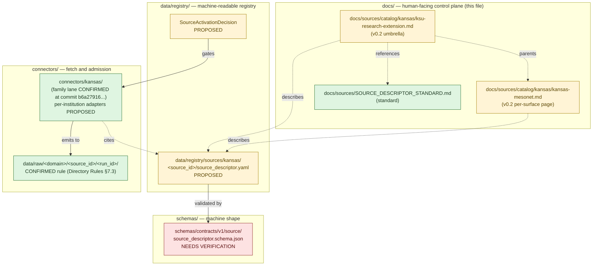
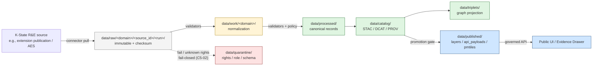

<!-- [KFM_META_BLOCK_V2]
doc_id: kfm://doc/docs-sources-catalog-kansas-ksu-research-extension
title: KSU Research and Extension — Source Catalog Entry
type: standard
subtype: source-catalog-entry
version: v0.2
status: draft
owners: <docs-steward; agriculture-domain-steward; atmosphere-domain-steward — TODO named>
created: 2026-05-13
updated: 2026-05-21
policy_label: public
related:
  - docs/sources/catalog/kansas/README.md
  - docs/sources/catalog/kansas/kansas-mesonet.md
  - docs/sources/catalog/kansas/kdwp.md
  - docs/sources/catalog/kansas/khri.md
  - docs/sources/catalog/kansas/ksgs.md
  - docs/sources/catalog/kansas/kcc-oil-gas-reg.md
  - docs/sources/catalog/kansas/kdhe.md
  - docs/sources/catalog/kansas/kda.md
  - docs/sources/catalog/kansas/kansas-state-archives.md
  - docs/sources/catalog/kansas/kansas-memory.md
  - docs/sources/catalog/kansas/kbs.md
  - docs/sources/catalog/kansas/ku-nhm.md
  - docs/sources/catalog/kansas/fhsu-sternberg.md
  - docs/sources/catalog/kansas/ksu-special-collections.md
  - docs/sources/catalog/README.md
  - docs/sources/catalog/IDENTITY.md
  - docs/sources/catalog/PROFILES.md
  - docs/sources/catalog/RIGHTS-AND-SENSITIVITY-MAP.md
  - docs/sources/catalog/OPEN-QUESTIONS.md
  - docs/sources/catalog/_template/SOURCE_PRODUCT_TEMPLATE.md
  - docs/sources/SOURCE_DESCRIPTOR_STANDARD.md
  - docs/doctrine/directory-rules.md
  - docs/doctrine/lifecycle-law.md
  - docs/doctrine/truth-posture.md
  - docs/domains/agriculture/README.md
  - docs/domains/atmosphere/README.md
  - docs/domains/soil/README.md
  - docs/domains/flora/README.md
  - docs/domains/hazards/README.md
  - docs/standards/SENSITIVITY_RUBRIC.md
  - docs/registers/AUTHORITY_LADDER.md
  - docs/registers/DRIFT_REGISTER.md
  - docs/registers/VERIFICATION_BACKLOG.md
  - docs/adr/ADR-0001-schema-home.md
  - schemas/contracts/v1/source/source_descriptor.schema.json
  - connectors/kansas/ksu-research-extension/
  - connectors/kansas/kansas-mesonet/
  - data/registry/sources/
  - policy/sensitivity/
  - policy/rights/
tags: [kfm, sources, catalog, kansas, ksu, k-state, research-and-extension, mesonet, agriculture, atmosphere, soil, hazards, c10-01, c10-04]
notes:
  - >-
    v0.2 path + slug migration: this doc was at
    `docs/sources/catalog/ksu_research_extension.md` (flat, snake_case) in v0.1
    and has moved to `docs/sources/catalog/kansas/ksu-research-extension.md`
    (nested under §7.3 canonical family folder; kebab-case per v0.2 catalog
    convention adopted across the sibling product-page series). Resolves v0.1
    OQ-5.
  - >-
    Structural reframing (NEW in v0.2) — umbrella-vs-surface model: in v0.1
    Kansas Mesonet was one row among many in §4 "Sub-products and source
    families." In v0.2 the Mesonet has been authored as its own per-surface
    product page at `./kansas-mesonet.md` (v0.2 in this conversation series).
    This page is now framed as the **KSU R&E umbrella**; Mesonet is referenced
    as a sibling surface page rather than as a sub-product row. This mirrors
    the KSHS umbrella pattern (kansas-state-archives.md → kansas-memory.md /
    khri.md). Resolves v0.1 OQ-2 in the affirmative.
  - >-
    Connector paths: v0.1 used `connectors/kansas/ksu_research_extension/`
    and `connectors/kansas/ksu_mesonet/` — both ALREADY correct under the
    canonical `connectors/kansas/` §7.3 family lane (matches KDWP, KHRI, KGS
    v0.2 — no family-lane path correction needed). v0.2 normalizes slugs to
    kebab-case (`connectors/kansas/ksu-research-extension/`,
    `connectors/kansas/kansas-mesonet/`) consistent with the sibling product
    pages. Family lane status CONFIRMED at commit
    `b6a27916bbb9e07cbf3752870c867476e1e094e7`.
  - >-
    Source_id convention (v0.1 OQ-8): RESOLVED in favor of kebab-case slugs
    consistent with v0.2 catalog convention. v0.1's `SRC-KSU-RE` /
    `SRC-KSU-MESONET` / `SRC-KSU-EXTPUB` / etc. are migrated to kebab-case in
    Appendix A.
  - >-
    Atlas card lineage CONFIRMED (v0.2 additions): `KFM-P21-PROG-0006`
    (Mesonet station_health probe — operational health-gate for Mesonet
    admission); `KFM-P23-PROG-0039` (Mesonet soil-moisture watcher — native
    5-min / hourly / daily cadences preserved; resolves v0.1 OQ-7 partially);
    `KFM-P2-IDEA-0023` (SMAP L4 vs Kansas Mesonet — native temporal scale
    preservation; resolves v0.1 OQ-4 partially); `C10-01` (Soil Stack —
    Mesonet for soil moisture/temperature); `C10-04`-adjacent (Atmosphere
    stack); DOM-AGRI / DOM-ATMOS source-family rows; `KFM-P2-PROG-0002`
    (Kansas flora watcher — variety trials → flora context); Atlas §24.1.2
    (anti-collapse), §24.1.3 (source-role enum), §24.2.1 (receipt catalog),
    §24.8 (time discipline).
  - >-
    **KSU R&E is NOT a Kansas-First Domain Authority per `C7-10`**. The
    `C7-10` cluster names KSHS, KHRI, KU Biodiversity Institute, KBS NHI,
    KDWP SINC. KSU R&E is a Kansas institution but is referenced indirectly
    through DOM-AGRI "local extension sources" and DOM-ATMOS "Kansas
    Mesonet". This distinction is surfaced in §1 IMPORTANT callout to prevent
    elevation drift.
[/KFM_META_BLOCK_V2] -->

# KSU Research and Extension — Source Catalog Entry

> **Umbrella source-family brief** for Kansas State University Research and Extension (K-State R&E) — Kansas's land-grant institution under the Smith-Lever framework. This umbrella entry sits above the per-surface product pages it parents — most notably **[`./kansas-mesonet.md`](./kansas-mesonet.md) (v0.2)** for the sensor network — and covers K-State extension publications, variety trials, Agricultural Experiment Station outputs, soil testing services, and advisory products. Admitted per-product under distinct source roles, rights postures, freshness cadences, and release classes.

[](#status-table)
[](#)
[](#)
[](../../SOURCE_DESCRIPTOR_STANDARD.md)
[-7e57c2)](./kansas-mesonet.md)
[](#)
[](../../../domains/)
[-orange)](#3-source-role-composition)
[](#5-rights-sensitivity-and-public-release-class)
[](#5-rights-sensitivity-and-public-release-class)
[](#7-lifecycle-and-governance-posture)
[](#)

| Field | Value |
|---|---|
| **Status** | `draft` (v0.2) — not yet activated; no `SourceActivationDecision` recorded in current session |
| **Owners** | Docs steward · Agriculture domain steward · Atmosphere domain steward — `<TODO named owners>` |
| **Last reviewed** | 2026-05-21 (v0.2 revision) |
| **Brief class** | **Umbrella source-family** (parents per-surface product pages; sets shared institutional posture) |
| **Source ID (umbrella)** | `ksu-research-extension` (v0.2 kebab-case; replaces v0.1's `SRC-KSU-RE`) — **PROPOSED**; final value set on admission |
| **Per-surface product page (KFM in-scope)** | [`./kansas-mesonet.md`](./kansas-mesonet.md) — Kansas Mesonet (v0.2 in this series) |
| **Replaces / supersedes** | v0.1 (flat path; Mesonet treated as sub-product row) |
| **Canonical `SourceDescriptor` home** | `data/registry/sources/kansas/<source_id>/source_descriptor.yaml` (PROPOSED per Directory Rules §9 / §6.1) |
| **Schema home** | `schemas/contracts/v1/source/source_descriptor.schema.json` per Directory Rules §7.4 / ADR-0001 (NEEDS VERIFICATION of file presence) |
| **Family lane** | `connectors/kansas/` — **CONFIRMED §7.3** at commit `b6a27916bbb9e07cbf3752870c867476e1e094e7` |

---

## Quick jump

- [1. Scope and identity](#1-scope-and-identity)
- [2. Repo fit and placement](#2-repo-fit-and-placement)
- [3. Source-role composition](#3-source-role-composition)
- [4. Sub-products and source families](#4-sub-products-and-source-families)
- [5. Rights, sensitivity, and public-release class](#5-rights-sensitivity-and-public-release-class)
- [6. Cadence and freshness](#6-cadence-and-freshness)
- [7. Lifecycle and governance posture](#7-lifecycle-and-governance-posture)
- [8. Domain mapping](#8-domain-mapping)
- [9. Connector, schema, and registry references](#9-connector-schema-and-registry-references)
- [10. Source activation status](#10-source-activation-status)
- [11. Open questions and verification items](#11-open-questions-and-verification-items)
- [12. Related docs](#12-related-docs)
- [Appendix A — KSU R&E at a glance](#appendix-a--ksu-re-at-a-glance)
- [Appendix B — Atlas idea-card lineage](#appendix-b--atlas-idea-card-lineage)
- [Appendix C — Change log](#appendix-c--change-log)

---

## 1. Scope and identity

> [!NOTE]
> **Path + slug migration (v0.1 → v0.2).** This page was authored as `docs/sources/catalog/ksu_research_extension.md` (flat, snake_case) in v0.1 and **moved to `docs/sources/catalog/kansas/ksu-research-extension.md`** in v0.2 (nested under the `kansas/` §7.3 family folder; kebab-case slug per v0.2 catalog convention). The kansas family README v0.2 lists this brief explicitly. Resolves v0.1 OQ-5 (catalog/ convention).

> [!IMPORTANT]
> **Structural reframing in v0.2 — umbrella-vs-surface model.** In v0.1 the Kansas Mesonet was listed as one row among many in §4 "Sub-products and source families." In v0.2 the **Mesonet has its own per-surface product page** at [`./kansas-mesonet.md`](./kansas-mesonet.md) (authored earlier in this v0.2 catalog series with explicit operator-consent floor, `KFM-P21-PROG-0006` station_health gate, and `KFM-P23-PROG-0039` native-cadence preservation). This page is now **the KSU R&E umbrella brief** — it sets the shared K-State R&E institutional posture and references Mesonet as a sibling surface, not as a row in its own sub-product table. This mirrors the **KSHS umbrella pattern** ([`./kansas-state-archives.md`](./kansas-state-archives.md) → [`./kansas-memory.md`](./kansas-memory.md) / [`./khri.md`](./khri.md)). **Resolves v0.1 OQ-2 in the affirmative.**

> [!IMPORTANT]
> **Connector path was ALREADY correct in v0.1.** Like the sibling KDWP v0.2, KHRI v0.2, and KGS v0.2 — and unlike the sibling Kansas Mesonet (OPEN-MESO-01), KBS (OPEN-KBS-01), KCC (OPEN-KCC-01), and KDOT (OPEN-KDOT-01) revisions which all required path corrections — **KSU R&E's v0.1 already used `connectors/kansas/ksu_research_extension/`** correctly under the canonical `connectors/kansas/` §7.3 family lane. v0.2 normalizes the slug to kebab-case (`connectors/kansas/ksu-research-extension/`) for consistency with sibling product pages, but the family-lane placement was already correct.

> [!IMPORTANT]
> **KSU R&E is NOT a Kansas-First Domain Authority per `C7-10`.** The `C7-10` cluster (CONFIRMED Pass-10) names FIVE Kansas-first authorities: **KSHS, KHRI, KU Biodiversity Institute, KBS NHI, KDWP SINC**. K-State R&E is a Kansas institution and a CONFIRMED source-family contributor — referenced through DOM-AGRI "local extension sources" and DOM-ATMOS "Kansas Mesonet" — but it does **not** carry the `C7-10` Kansas-First Domain Authority class. The `C7-10` parallel-anchor rule (store Kansas-authority IRI alongside federal/international anchor) still applies; the *authority-of-last-resort* property does not. Surfacing this preempts elevation drift in admission decisions.

**CONFIRMED doctrine / PROPOSED admission.** KSU Research and Extension (K-State R&E) is the research-and-outreach arm of Kansas State University — Kansas's land-grant institution under the Smith-Lever framework. For KFM purposes, "KSU Research and Extension" is treated as an **umbrella source family** whose individual products carry distinct source roles, rights postures, freshness cadences, and release classes. The Kansas Frontier Matrix corpus references K-State R&E products under several domain source-family lists:

- **Agriculture** (DOM-AGRI, CONFIRMED listing) — references "local extension sources" alongside USDA NASS CDL/QuickStats, NRCS conservation practice data, SSURGO, irrigation/water use, weather/soil moisture, and crop insurance/market/economy sources where permitted.
- **Atmosphere, Air, and Climate** (DOM-ATMOS, CONFIRMED listing) — names the **Kansas Mesonet** as a primary in-state weather and soil moisture network alongside EPA AQS/AirData, AirNow, and NOAA/NWS. **Mesonet posture lives in [`./kansas-mesonet.md`](./kansas-mesonet.md) v0.2** under the umbrella set by this page.
- **Soil (cross-cutting)** (`C10-01` Soil Stack, CONFIRMED Pass-10) — names Kansas Mesonet as the real-time sensor channel for soil moisture and temperature, alongside SSURGO / gNATSGO / SoilGrids / SMAP. See `KFM-P2-IDEA-0023` for the SMAP-L4-vs-Mesonet native-temporal-scale rule.

> [!IMPORTANT]
> K-State R&E is **not** a single source. It is a portfolio. Per KFM's **Source-Role Anti-Collapse Register** (Atlas §24.1.3, CONFIRMED Pass-23/32), an observed sensor reading is not interchangeable with an aggregate county bulletin, and neither is interchangeable with an administrative publication record. Every K-State R&E sub-product **MUST** carry its own `SourceDescriptor` with its own `source_role`, `role_authority`, and `role_aggregation_unit` where applicable.

### Boundary

- **In scope** for this umbrella entry: K-State R&E sub-products that KFM may ingest as evidence — extension publications acting as aggregated context, K-State variety trial / crop performance test reports, Agricultural Experiment Station (AES) outputs, soil testing service outputs, and adjacent advisory products from K-State R&E's research stations and county-extension offices.
- **In scope but cross-referenced via per-surface page**: **Kansas Mesonet** sensor network. Posture, descriptor shape, sensor-metadata details, station_health gate, and native cadence preservation live in [`./kansas-mesonet.md`](./kansas-mesonet.md) v0.2; this umbrella page inherits and coordinates rather than duplicates.
- **Out of scope:** **KSU Special Collections** (the archival holdings cited at approximately 1,000,000 items in the `C10-07` archives stack) is institutionally distinct from K-State Research and Extension. KSU SC is governed under the archives domain and **MUST** have its own catalog entry — see [`./ksu-special-collections.md`](./ksu-special-collections.md) (PROPOSED sibling under `docs/sources/catalog/kansas/`).

[Back to top](#ksu-research-and-extension--source-catalog-entry)

---

## 2. Repo fit and placement



**Where this file belongs.** Per `docs/doctrine/directory-rules.md` §6.1, `docs/sources/` is the canonical home for "source-descriptor standards, source families." Per the same section, `docs/` **explains**; machine-readable governance lives in `control_plane/`; object meaning lives in `contracts/`; object shape lives in `schemas/`. This catalog entry is the **human-readable companion** to one or more `SourceDescriptor` records under `data/registry/sources/kansas/...`. It is **not** the registry, **not** the schema, and **not** the activation decision.

| Placement claim | Status | Basis |
|---|---|---|
| `docs/sources/` is the right responsibility root | **CONFIRMED rule** | Directory Rules §6.1 |
| `docs/sources/catalog/<family>/<product>.md` v0.2 convention | **PROPOSED (adopted across v0.2 sibling-page series)** | v0.2 catalog convention — mirrors `connectors/<family>/` §7.3 |
| `docs/sources/catalog/kansas/` matches `connectors/kansas/` §7.3 family | **CONFIRMED at commit `b6a27916...`** | Directory Rules v1.2 §7.3; Repository Structure Guiding Document |
| Canonical `SourceDescriptor` machine record at `data/registry/sources/kansas/<source_id>/source_descriptor.yaml` | **CONFIRMED rule / PROPOSED specific path** | Directory Rules §9.1 / §12 |
| `source_descriptor.schema.json` lives at `schemas/contracts/v1/source/` | **PROPOSED schema-home / NEEDS VERIFICATION of file presence** | Directory Rules §7.4 / ADR-0001 |

> [!NOTE]
> v0.1 left `docs/sources/catalog/` PROPOSED; v0.2 adopts `docs/sources/catalog/<family>/<product>.md` as the catalog convention across the in-series revisions (kansas-mesonet, kbs, kansas-state-archives, kansas-memory, fhsu-sternberg, kdwp, khri, ksgs, kcc-oil-gas-reg, kdot, this doc). Mounted-repo verification of the v0.2 catalog tree remains — file a `DRIFT_REGISTER` entry if the mounted repo diverges.

[Back to top](#ksu-research-and-extension--source-catalog-entry)

---

## 3. Source-role composition

K-State R&E sub-products carry **multiple, distinct source roles**. The KFM **Source-Role Anti-Collapse Register** (CONFIRMED, Atlas §24.1.3, Pass-23/32) treats source role as a first-class identity attribute fixed at admission. Role MUST NOT be silently "upgraded" by promotion. The umbrella entry below lists the roles each sub-product is expected to carry; per-product `SourceDescriptor` records pin the final value.

| Role (per Atlas §24.1.3 enum) | Definition (CONFIRMED doctrine) | K-State R&E example(s) | Citation discipline |
|---|---|---|---|
| **`observed`** | Direct reading, measurement, or first-hand evidentiary record tied to a place and time. | Kansas Mesonet station readings (see [`./kansas-mesonet.md`](./kansas-mesonet.md) v0.2); AES research-station observations; soil-test sample readings. | Cite with station identity, observation time, instrument metadata. Never relabeled as regulatory or administrative. |
| **`aggregate`** | Published summary, total, or average over a unit (county, year, watershed); irreversible loss of individual record fidelity. | County-level crop performance summaries; multi-station climate summaries; variety-trial yield averages. | Cite with `AggregationReceipt` per Atlas §24.2.1 and `role_aggregation_unit`; never treated as a per-place record. |
| **`administrative`** | Compiled record produced by an agency for administration, registration, or accounting purposes — not an observation or regulation. | Extension publication registry; pesticide-application advisory bulletins; soil-test lab service records (where published). | Cite as administrative context; never collapsed with observation or regulation. |
| **`modeled`** | Derived product from inputs, assumptions, or fitted parameters; uncertainty and provenance of inputs must be preserved. | Soil-crop suitability indicators derived from K-State research models; drought / pest stress indices produced under K-State R&E methodologies. | Cite with model identity, `ModelRunReceipt` per Atlas §24.2.1, and uncertainty bounds; never labeled an observation. |

> [!WARNING]
> **Forbidden collapses for this source family** (CONFIRMED, Atlas §24.1.2):
> - Modeled K-State suitability raster cited or rendered as an **observed** field measurement → **DENY** at publication; **ABSTAIN** at AI surface.
> - Aggregate county-level extension summary cited as a **per-place** truth → **DENY** join from aggregate cell to a single record; **ABSTAIN** at AI.
> - Administrative publication record cited as an **observed event** timeline → **DENY** publication of compilation as observed event evidence.

> [!NOTE]
> **`regulatory` is NOT a K-State R&E role.** K-State R&E publishes research, observation, aggregate analyses, and advisory products — but does not issue regulatory instruments. Kansas regulatory authorities for adjacent domains live elsewhere: KDWP for listed species per `KFM-P19-IDEA-0005` (see [`./kdwp.md`](./kdwp.md) v0.2); KCC for oil-and-gas regulatory per DOM-GEOL §D row 5 (see [`./kcc-oil-gas-reg.md`](./kcc-oil-gas-reg.md) v0.2). KDHE for environmental regulatory (see [`./kdhe.md`](./kdhe.md) PROPOSED). Conflating K-State R&E advisory with regulatory authority is a source-role anti-collapse violation.

[Back to top](#ksu-research-and-extension--source-catalog-entry)

---

## 4. Sub-products and source families

Each sub-product below is a **candidate** `SourceDescriptor`. Naming, exact endpoints, and rights terms are **PROPOSED / NEEDS VERIFICATION** pending admission. Where the corpus explicitly names a sub-product, the row carries a stronger label.

> [!IMPORTANT]
> **Kansas Mesonet is intentionally excluded from the table below** in v0.2. The Mesonet has its own per-surface product page at [`./kansas-mesonet.md`](./kansas-mesonet.md) (v0.2 in this series) — including its operator-consent floor, `KFM-P21-PROG-0006` station_health probe gate, native 5-min / hourly / daily cadences per `KFM-P23-PROG-0039`, and SMAP-L4-vs-Mesonet temporal-preservation rule per `KFM-P2-IDEA-0023`. This umbrella entry **inherits** that posture rather than duplicating it. v0.1's Mesonet row in §4 is **migrated** to the sibling page. Resolves v0.1 OQ-2.

| Sub-product | Proposed `source_id` (v0.2 kebab-case) | Primary domain(s) | Default `source_role` | Status in corpus | Notes |
|---|---|---|---|---|---|
| K-State extension publications (bulletins, fact sheets, advisory documents) | `ksu-extension-publications` (PROPOSED; v0.1 was `SRC-KSU-EXTPUB`) | Agriculture (primary); domain-adjacent (Flora, Fauna, Hazards) | `administrative` (default) / `aggregate` when carrying summarized statistics | **CONFIRMED reference** — "local extension sources" in DOM-AGRI source family | Source-role MAY split: bulletin-as-publication is `administrative`; bulletin-as-summary-statistics is `aggregate`. Each release evaluated per-product. |
| K-State variety trials / crop performance tests | `ksu-variety-trials` (PROPOSED; v0.1 was `SRC-KSU-VTRIAL`) | Agriculture; Flora (cultivar context per `KFM-P2-PROG-0002`) | `aggregate` (typical) / `observed` per individual trial plot only with steward agreement | **INFERRED** from "local extension sources" doctrine | Field-level detail is **denied by default** under Agriculture sensitivity posture per §5; aggregated county/region products may be admitted. |
| K-State soil testing lab service outputs | `ksu-soil-testing` (PROPOSED; v0.1 was `SRC-KSU-SOILTEST`) | Agriculture; Soil (cross-cutting per `C10-01`) | `observed` (sample-level) — **denied for public** when tied to identifiable landowner | **INFERRED** | Living-person and private-landowner sensitivity rules apply per `KFM-P24-IDEA-0002`-parallel; see §5. |
| K-State R&E research-station weather / agronomy outputs (Agricultural Experiment Station / AES) | `ksu-aes` (PROPOSED; v0.1 was `SRC-KSU-AES`) | Agriculture; Atmosphere; Soil | `observed` (station-level) / `modeled` (derived indices) | **INFERRED** | Typically aggregable to county/season; specific station-level admission per descriptor. Parallel to Mesonet operator-consent floor recommended. |
| K-State drought / pest / disease advisory products | `ksu-advisory` (PROPOSED; v0.1 was `SRC-KSU-ADV`) | Agriculture; Hazards (advisory context only) | `administrative` (advisory) / `modeled` (where derived from a model) | **INFERRED** | **MUST NOT** stand in for official emergency advisories. Atmosphere doctrine: this lane "does not replace official advisories or emergency alerting." Not-for-life-safety disclaimer required per §5. |

[Back to top](#ksu-research-and-extension--source-catalog-entry)

---

## 5. Rights, sensitivity, and public-release class

### 5.1 Rights posture — fail-closed default

**CONFIRMED doctrine** (Unified Implementation Architecture Build Manual §5; `C5-02` Pass-10): unknown rights, unresolved source terms, unclear attribution duties, unknown source role, or missing `SourceActivationDecision` **blocks public release by default**. The safe state is quarantine, denial, restriction, or abstention until rights, source role, access conditions, cadence, and release class are recorded.

The KFM corpus explicitly flags Kansas Mesonet access terms as a **NEEDS VERIFICATION** item: "Confirm terms for ingesting and storing Kansas Mesonet REST feeds and any SCAN station data; some networks require written consent or specific attribution." Kansas Mesonet rights posture lives in [`./kansas-mesonet.md`](./kansas-mesonet.md) v0.2 §5; this page covers the umbrella institutional posture and the **non-Mesonet** sub-products.

| Sub-product (from §4) | Rights status | Attribution requirement | Public-release class | Required action |
|---|---|---|---|---|
| Extension publications | **NEEDS VERIFICATION** — typical K-State R&E publication notices vary by document | `<TODO per publication>` | Default: **public-context** with attribution and citation, **pending** per-publication review | Record per-publication rights at descriptor level; do not assume blanket terms. |
| Variety trials / crop performance | **NEEDS VERIFICATION** — published aggregates likely permissive; field-level detail subject to producer agreements | `<TODO>` | Aggregate: **public-context** with attribution; field-level: **denied** by default | Confirm with K-State R&E program; aggregate-only public-release until confirmed. |
| Soil testing lab outputs | **NEEDS VERIFICATION** — likely producer-confidential | `<TODO>` | **Denied** for any identifiable landowner; aggregate views with k-anonymity safeguards per `C6-06` `MAY` be considered after review | Treat as restricted intake; require producer / steward agreement for any public surface. |
| Research-station / AES outputs | **NEEDS VERIFICATION** | `<TODO>` | **Public-context** with attribution, **pending** terms | Per-station descriptor; parallel to Mesonet operator-consent floor. |
| Advisory products | **NEEDS VERIFICATION** | `<TODO>` | **Public-context with not-for-life-safety disclaimer** — `MUST NOT` substitute for official advisories | Atmosphere domain rule: advisory context with official-source redirection. |

### 5.2 Sensitivity posture — domain rules apply

KFM's **Sensitive / Deny-by-Default Register** (Encyclopedia §13; `KFM-P24-IDEA-0002` + `KFM-P24-PROG-0013` Pass 32) governs all K-State R&E sub-products that touch private-landowner data, farm-level operations, or living-person identifiers:

| Sensitivity class | Trigger | Default outcome | `C6-01` rank guideline | Required controls |
|---|---|---|---|---|
| **Private landowner-sensitive data** | Field boundaries, owner identity, farm operations, soil-test results tied to a parcel/owner | **DENY** exact/public if private or rights unclear | rank 3+ | Aggregation; permissions; policy review (`SRC-AG`, `SRC-PEOPLE`) |
| **Source-rights-limited records** | Licensed, restricted, no-redistribution, uncertain terms | **DENY** public release until terms resolved | rights gate (not rank) | Rights register; attribution; no public derivative if barred per `C5-02` |
| **Emergency warning misuse** | Operational warnings, hazard instructions repackaged as life-safety guidance | **DENY** life-safety replacement; contextual-only with official redirection | rank 0–1 | "Not-for-life-safety" disclaimer; issue/expiry freshness |
| **Geometry-generalization (parallel rule)** | Any field-level point that increases harm or producer-identification risk | **GENERALIZED** public geometry per `KFM-P13-PROG-0018` | rank 3+ | Deterministic grid snapping with rule-version provenance; `RedactionReceipt` per Atlas §24.2.1 |

> [!TIP]
> **T0–T4 vs `C6-01` 0–5 reconciliation** (same OPEN as sibling KHRI v0.2 OQ-KHRI-14). The Domains Atlas v1.1 Master Sensitivity / Rights Tier Reference uses a T0–T4 scheme; Pass-10 `C6-01` uses a 0–5 scheme. The two schemes are parallel and have not yet been reconciled by ADR. This page uses `C6-01` rank guidelines where applicable; future ADR resolution will harmonize both.

### 5.3 Public-release gate (CONFIRMED doctrine)

> [!IMPORTANT]
> Before any K-State R&E-derived artifact appears on a public KFM surface, the `ReleaseManifest` **MUST** carry, at minimum (per the corpus's public-runtime rule and `C5-02`):
> - `release_state == PUBLISHED`
> - `policy_label != unknown`
> - `rights_status != unknown`
> - `sensitivity == public` (or an approved restricted-tier release with explicit policy decision)
> - non-empty `evidence_refs`
> - non-empty artifact hashes
> - `rollback_supported == true`
> - policy gate `allow == true`
>
> If any of these are missing, the artifact **MUST NOT** be served by the governed API.

[Back to top](#ksu-research-and-extension--source-catalog-entry)

---

## 6. Cadence and freshness

> [!NOTE]
> **Kansas Mesonet cadence** (5-minute, hourly, daily — all native) is documented in [`./kansas-mesonet.md`](./kansas-mesonet.md) v0.2 §6 per `KFM-P23-PROG-0039` (Mesonet soil-moisture watcher — native temporal scales preserved) and `KFM-P2-IDEA-0023` (SMAP-L4-vs-Mesonet native-temporal-scale rule). v0.1 OQ-7 (debounce window for Mesonet streams) is **partially resolved** by `KFM-P23-PROG-0039`; concrete operational debounce window per environment remains.

| Sub-product | Expected update cadence | Freshness handling | Stale-state policy |
|---|---|---|---|
| Extension publications | Episodic / per-release | Conditional GETs; per-publication content hash | Publication-vintage badge; supersession tracking |
| Variety trials / crop performance | Annual / per growing season | Per-year release | Year-of-trial badge; comparison across years explicit |
| Soil testing | Service-driven (per sample) | Not a continuous-feed; sample-level | Not generally surfaced publicly; aggregate windows TBD |
| Research-station / AES outputs | Continuous to episodic | Per-station; smart-sync per `C3-01`/`C3-02` pattern | Station-vintage badge |
| Advisory products | Issued-on-event | Issue/expiry timestamps required | Expired-advisory badge; redirect to current official advisory |

> [!NOTE]
> CONFIRMED doctrine: every K-State R&E sub-product `SourceDescriptor` **MUST** record the cadence claim explicitly. Use HTTP validators (`ETag` / `Last-Modified`) and manifest checksums per the C3-01 / C3-02 patterns to detect upstream change without redundant fetches; record cadence and observed freshness on every `RunReceipt` per Atlas §24.2.1.

[Back to top](#ksu-research-and-extension--source-catalog-entry)

---

## 7. Lifecycle and governance posture



**CONFIRMED invariant** (Directory Rules §0 / §9; `C5-02` default-deny promotion): `RAW → WORK / QUARANTINE → PROCESSED → CATALOG / TRIPLET → PUBLISHED`. Promotion is a **governed state transition, not a file move.**

- **Connectors** for K-State R&E products belong under `connectors/kansas/` (**CONFIRMED §7.3 at commit `b6a27916...`**); per-institution adapters PROPOSED (`connectors/kansas/ksu-research-extension/` for the umbrella, `connectors/kansas/kansas-mesonet/` for the Mesonet per [`./kansas-mesonet.md`](./kansas-mesonet.md) v0.2). They emit to `data/raw/<domain>/<source_id>/<run_id>/` per Directory Rules §7.3 and **MUST NOT** write to `data/processed/`, `data/catalog/`, or `data/published/`.
- **RAW** for K-State R&E captures **MUST** carry: ingest hash (`content_hash`), retrieval timestamp, connector identity, and a back-reference to the descriptor's `source_id`. No public access to RAW (CONFIRMED).
- **QUARANTINE** holds: failed validation, rights-unknown pulls (default for Mesonet until terms confirmed — see §5), sensitive-rights pulls, schema drift, over-precise geometry.
- **CATALOG** entries follow STAC Collection / Item shapes with KFM provenance namespaces per `C4-01`. KSU R&E aggregates carry an `AggregationReceipt` pinning the `role_aggregation_unit`.
- **PUBLISHED** surfaces consume only released payloads through the governed API. No direct browser access to canonical stores (CONFIRMED trust-membrane rule).

[Back to top](#ksu-research-and-extension--source-catalog-entry)

---

## 8. Domain mapping

| KFM domain | K-State R&E contribution | Object families this source feeds | Source role(s) |
|---|---|---|---|
| **Agriculture** | Local extension sources (DOM-AGRI CONFIRMED); variety trials; advisory products; soil testing aggregates; AES outputs | `CropObservation`, `FieldCandidate`, `CropRotation`, `YieldObservation`, `ConservationPractice`, `SoilCropSuitability`, `DroughtStressIndicator`, `PestStressIndicator`, `AggregationReceipt` | `aggregate` (typical), `administrative` (publications), `modeled` (derived indices) |
| **Atmosphere, Air, and Climate** | **Via Mesonet sibling page only** — see [`./kansas-mesonet.md`](./kansas-mesonet.md) v0.2 for `WeatherStation`, `WeatherObservation`, `WindField`, `PrecipitationObservation`, `TemperatureObservation`. AES station weather aggregates handled here. | (cross-referenced) | (cross-referenced) |
| **Soil (cross-cutting via `C10-01`)** | Kansas Mesonet for real-time soil moisture/temperature (via [`./kansas-mesonet.md`](./kansas-mesonet.md) v0.2); KSU soil testing lab aggregates (this page) | Soil-moisture / soil-temperature time series; multi-source soil-condition view alongside SSURGO / gNATSGO / SMAP per `KFM-P2-IDEA-0023` native-temporal preservation | `observed` |
| **Hazards** | Advisory context only — not life-safety replacement | `AdvisoryContext` (contextual surface only) | `administrative` (advisory) |
| **Flora** | Cultivar / variety performance context per `KFM-P2-PROG-0002` Kansas flora watcher (where applicable) | Cultivar context for trials; restoration planting context | `aggregate` |
| **Frontier Demography / Land / Settlement Matrix** | Out of scope for this source family | — | — |

> [!TIP]
> Cross-domain joins involving K-State R&E aggregate outputs (e.g., joining a county-level extension yield summary to a Mesonet station observation) **MUST** preserve the role distinction. The Atlas §24.1.2 **anti-collapse rule** denies "aggregate cited as per-place truth" — a county roll-up is not a station fix, and a station fix is not a county roll-up. Use the `AggregationReceipt` and `OverlayReceipt` machinery accordingly.

[Back to top](#ksu-research-and-extension--source-catalog-entry)

---

## 9. Connector, schema, and registry references

| Object / surface | PROPOSED location (v0.2 kebab-case) | Status | Authority |
|---|---|---|---|
| Connector (umbrella K-State R&E adapters) | `connectors/kansas/ksu-research-extension/` | Family lane **CONFIRMED** at commit `b6a27916...`; per-institution adapter PROPOSED | Directory Rules §7.3 |
| Connector (Mesonet, separated) | `connectors/kansas/kansas-mesonet/` (per [`./kansas-mesonet.md`](./kansas-mesonet.md) v0.2) | Family lane CONFIRMED; per-institution adapter PROPOSED | Directory Rules §7.3 |
| RAW landing | `data/raw/<domain>/<source_id>/<run_id>/` | **CONFIRMED rule / PROPOSED specific path** | Directory Rules §7.3 / §9.1 |
| Per-sub-product `SourceDescriptor` (YAML) | `data/registry/sources/kansas/<source_id>/source_descriptor.yaml` | **PROPOSED** | Directory Rules §9.1 |
| Per-source-family rights register entry | `data/registry/rights/<source_id>.yaml` | **PROPOSED** | Directory Rules §9.1 |
| `SourceDescriptor` schema | `schemas/contracts/v1/source/source_descriptor.schema.json` | **PROPOSED schema-home / NEEDS VERIFICATION** | Directory Rules §7.4 / ADR-0001 |
| Source-role enum (governing vocabulary) | `schemas/contracts/v1/source/source_descriptor.schema.json` (field `source_role` — illustrative shape only) | **PROPOSED** | Atlas §24.1.3 |
| Policy lane for source rights / sensitivity | `policy/sensitivity/` and `policy/<domain>/` | **CONFIRMED rule / PROPOSED specific paths** | Directory Rules §2.3 |
| Connector-gate validator | `tools/validators/connector_gate/` | **CONFIRMED rule / PROPOSED specific path** | Directory Rules §7.5 |
| Source-descriptor validator | `tools/validators/source_descriptor/` | **CONFIRMED rule / PROPOSED specific path** | Directory Rules §7.5 |

> [!CAUTION]
> Until ADR-0001 is verified against the mounted repo, the schema-home path above remains PROPOSED. Do **not** create a parallel descriptor schema home (e.g., `contracts/source/...` alongside `schemas/contracts/v1/source/...`); Directory Rules §2.4(5) requires an ADR before creating any parallel home for schemas, contracts, policy, sources, registries, releases, proofs, or receipts.

[Back to top](#ksu-research-and-extension--source-catalog-entry)

---

## 10. Source activation status

**CONFIRMED activation flow** (Unified Implementation Architecture §11; `C5-02` default-deny): create or update `SourceDescriptor`; review source role, rights, sensitivity, cadence, and access; issue `SourceActivationDecision` declaring `allowed` / `restricted` / `denied` / `needs-review` use; keep connectors and watchers **inactive** until activation decision, fixtures, validators, and policy gates exist.

### Status table

| Gate | Required artifact | Status | Notes |
|---|---|---|---|
| `SourceDescriptor` (per sub-product) | YAML under `data/registry/sources/kansas/<source_id>/` | **NOT STARTED** | One descriptor per sub-product in §4 |
| Rights & terms resolution | Recorded license, attribution string, redistribution posture | **NEEDS VERIFICATION** — Mesonet flagged in [`./kansas-mesonet.md`](./kansas-mesonet.md) v0.2 | Block on Mesonet terms confirmation |
| Sensitivity classification | Per-product sensitivity tier; living-person / landowner screening rule | **NOT STARTED** | Producer-identifying data → restricted by default per `KFM-P24-IDEA-0002`-parallel |
| Role assignment | `source_role` set at admission; never silently changed | **NOT STARTED** | Multi-role family; one role per sub-product per Atlas §24.1.3 |
| Cadence and freshness policy | Debounce window, stale-state behavior, ETag/conditional GET plan | **NOT STARTED** | Mesonet native cadences documented in [`./kansas-mesonet.md`](./kansas-mesonet.md) v0.2 per `KFM-P23-PROG-0039`; operational debounce TBD |
| Fixtures | Valid + invalid fixtures under `fixtures/` | **NOT STARTED** | Block on schema verification |
| Validator coverage | `source_descriptor` validator + `connector_gate` validator | **NOT STARTED** | Block on validator presence verification |
| Policy gate | OPA / Conftest gate for release | **NOT STARTED** | Block on policy bundle verification |
| `SourceActivationDecision` | Recorded decision (`allow` / `restrict` / `deny` / `needs-review`) | **NOT ISSUED** | Connectors remain inactive per `C5-02` |

[Back to top](#ksu-research-and-extension--source-catalog-entry)

---

## 11. Open questions and verification items

<details>
<summary><strong>Click to expand — full open-item ledger (PROPOSED until resolved)</strong></summary>

| # | Item | Type | Status (v0.2 update) | Owner (PROPOSED) | Blocks |
|---|---|---|---|---|---|
| OQ-1 (v0.1) | Confirm Kansas Mesonet redistribution terms, attribution language, and rate-limit / consent posture | NEEDS VERIFICATION | **MIGRATED** to [`./kansas-mesonet.md`](./kansas-mesonet.md) v0.2 §5 (per-surface page now owns this) | Atmosphere domain steward | All Mesonet-derived public surfaces |
| OQ-2 (v0.1) | Decide whether Kansas Mesonet warrants its own catalog entry | DESIGN | **RESOLVED — YES** per v0.2 umbrella-vs-surface reorganization; sibling page exists at [`./kansas-mesonet.md`](./kansas-mesonet.md) | Docs steward + atmosphere domain steward | — |
| OQ-3 (v0.1) | Resolve K-State R&E extension publication rights — blanket terms or per-publication review? | NEEDS VERIFICATION | OPEN | Agriculture domain steward | Public-context publication |
| OQ-4 (v0.1) | Confirm exact soil-moisture / soil-temperature depths reported by current Mesonet surface | NEEDS VERIFICATION | **PARTIALLY RESOLVED** via `KFM-P23-PROG-0039` (native-cadence preservation 5-min / hourly / daily) and `KFM-P2-IDEA-0023` (SMAP-L4-vs-Mesonet); depth list per current Mesonet API surface still NEEDS VERIFICATION on per-surface page | Soil-cross-cutting steward | Soil-condition view |
| OQ-5 (v0.1) | Confirm whether `docs/sources/catalog/` is an accepted convention | NEEDS VERIFICATION | **PARTIALLY RESOLVED** in v0.2 — `docs/sources/catalog/<family>/<product>.md` adopted across v0.2 reorganization; mounted-repo verification remains | Docs steward | This file's final path |
| OQ-6 (v0.1) | Confirm `schemas/contracts/v1/source/source_descriptor.schema.json` exists | NEEDS VERIFICATION | OPEN | Schema steward | All descriptor admission |
| OQ-7 (v0.1) | Set concrete debounce / coalesce window for Mesonet streams | OPEN | **PARTIALLY RESOLVED** via `KFM-P23-PROG-0039` native-cadence rule; concrete operational window remains | Atmosphere domain steward | Connector activation |
| OQ-8 (v0.1) | Decide `source_id` pattern | DESIGN | **RESOLVED** in favor of kebab-case slugs consistent with v0.2 catalog convention (see Appendix A) | Docs steward | All descriptors |
| OQ-9 (v0.1) | Decide whether K-State R&E advisory products belong under Agriculture, Hazards, or both | DESIGN | OPEN | Agriculture + hazards domain stewards | Advisory surfaces |
| OQ-10 (v0.1) | Confirm CODEOWNERS for `docs/sources/catalog/` and `data/registry/sources/<domain>/` | NEEDS VERIFICATION | OPEN | Docs steward | Review workflow |
| OQ-KSURE-11 (new v0.2) | Confirm KSU R&E carries CONFIRMED status in `KFM-P2-IDEA-0024`-parallel — the Pass-32 card names USDA NASS, KGS, KDA, KDHE, KDWP but NOT KSU R&E. Is the umbrella's Kansas-authority-but-not-`C7-10` status correctly framed? | DESIGN | OPEN | Docs steward + agriculture domain steward | Authority elevation drift |
| OQ-KSURE-12 (new v0.2) | Confirm whether KSU R&E variety trials should anchor to USDA PLANTS per `KFM-P2-IDEA-0019` for cultivar-name authority | NEEDS VERIFICATION | OPEN | Agriculture + flora domain stewards | Authority anchoring |
| OQ-KSURE-13 (new v0.2) | Confirm three-way disagreement policy: when KSU R&E aggregates, NASS CDL, and Mesonet observations disagree at the county level — what is the operational tie-breaker? | DESIGN | OPEN | Agriculture domain steward | Cross-source reconciliation |
| OQ-KSURE-14 (new v0.2) | Confirm AES research-station operator-consent floor: parallel to Mesonet operator-consent posture per [`./kansas-mesonet.md`](./kansas-mesonet.md) v0.2 §5? | NEEDS VERIFICATION | OPEN | Atmosphere + agriculture domain stewards | AES admission |
| OQ-KSURE-15 (new v0.2) | Confirm sibling product pages exist under `docs/sources/catalog/kansas/`: `kansas-mesonet.md` (v0.2 CONFIRMED in this series), `ksu-special-collections.md`, `kdhe.md`, `kda.md` | NEEDS VERIFICATION | OPEN | Docs steward | Cross-reference integrity |
| OQ-KSURE-16 (new v0.2) | Confirm T0–T4 vs `C6-01` 0–5 tier-scheme reconciliation (same OPEN as KHRI v0.2 OQ-KHRI-14, KGS v0.2 cross-reference) | DESIGN | OPEN | Sensitivity steward | Sensitivity rubric harmonization |

</details>

[Back to top](#ksu-research-and-extension--source-catalog-entry)

---

## 12. Related docs

> [!NOTE]
> Targets below reflect the v0.2 catalog reorganization (`docs/sources/catalog/<family>/<product>.md`, kebab-case slugs, nested under §7.3 family folders). Sibling product pages PROPOSED until verified in the mounted repo. Adjust paths via a `DRIFT_REGISTER` entry rather than silently divergent siblings.

- [`./README.md`](./README.md) — `docs/sources/catalog/kansas/` family README v0.2 (lists this brief; confirms `connectors/kansas/` as §7.3 canonical at commit `b6a27916...`)
- [`./kansas-mesonet.md`](./kansas-mesonet.md) — **Kansas Mesonet per-surface product page (v0.2)** — this umbrella's primary parented surface
- [`./ksu-special-collections.md`](./ksu-special-collections.md) — KSU Special Collections (PROPOSED sibling; out-of-scope for this umbrella per §1 boundary; lives under archives stack `C10-07`)
- [`./kdwp.md`](./kdwp.md) — sibling Kansas-first authority per `C7-10` (KSU R&E is NOT in this cluster; see §1 IMPORTANT)
- [`./khri.md`](./khri.md) — sibling Kansas-first authority per `C7-10`
- [`./ksgs.md`](./ksgs.md) — sibling Kansas-first authority per `C7-10` (KGS, jointly publishes WWC5 with KDHE)
- [`./kcc-oil-gas-reg.md`](./kcc-oil-gas-reg.md) — sibling Kansas regulatory authority (oil-and-gas regulatory; KSU R&E is NOT regulatory)
- [`./kdhe.md`](./kdhe.md) — sibling Kansas authority (PROPOSED; joint publisher of WWC5 with KGS)
- [`./kda.md`](./kda.md) — sibling Kansas authority (PROPOSED; KDA-DWR for water rights via WIMAS)
- [`./kansas-state-archives.md`](./kansas-state-archives.md) — KSHS-umbrella brief (parallel umbrella pattern model)
- [`./kansas-memory.md`](./kansas-memory.md) — sibling KSHS surface
- [`./kbs.md`](./kbs.md) — sibling Kansas-first biodiversity authority
- [`./ku-nhm.md`](./ku-nhm.md) — sibling Kansas-first biodiversity authority
- [`./fhsu-sternberg.md`](./fhsu-sternberg.md) — sibling in-state collection
- [`../README.md`](../README.md) — `docs/sources/catalog/` index (TODO: create or verify)
- [`../IDENTITY.md`](../IDENTITY.md) — Collection-id and namespace conventions
- [`../PROFILES.md`](../PROFILES.md) — catalog-profile selection guidance
- [`../RIGHTS-AND-SENSITIVITY-MAP.md`](../RIGHTS-AND-SENSITIVITY-MAP.md) — lane-wide rights/sensitivity matrix
- [`../OPEN-QUESTIONS.md`](../OPEN-QUESTIONS.md) — lane-wide `OPEN-DSC-*` items
- [`../../SOURCE_DESCRIPTOR_STANDARD.md`](../../SOURCE_DESCRIPTOR_STANDARD.md) — source-descriptor field standard *(PROPOSED — referenced in plans; NEEDS VERIFICATION in repo)*
- [`../../../doctrine/directory-rules.md`](../../../doctrine/directory-rules.md) — placement law (§6.1, §7.3, §7.4, §9.1, §11)
- [`../../../doctrine/lifecycle-law.md`](../../../doctrine/lifecycle-law.md) — RAW → PUBLISHED governance
- [`../../../doctrine/truth-posture.md`](../../../doctrine/truth-posture.md) — cite-or-abstain
- [`../../../domains/agriculture/README.md`](../../../domains/agriculture/README.md) — primary receiving domain
- [`../../../domains/atmosphere/README.md`](../../../domains/atmosphere/README.md) — secondary receiving domain (via Mesonet sibling page)
- [`../../../domains/soil/README.md`](../../../domains/soil/README.md) — cross-cutting domain (`C10-01`)
- [`../../../domains/hazards/README.md`](../../../domains/hazards/README.md) — adjacent domain (advisory context only)
- [`../../../standards/SENSITIVITY_RUBRIC.md`](../../../standards/SENSITIVITY_RUBRIC.md) — `C6-01` 0–5 rubric (PROPOSED in corpus)
- [`../../../registers/AUTHORITY_LADDER.md`](../../../registers/AUTHORITY_LADDER.md) — authority order
- [`../../../registers/DRIFT_REGISTER.md`](../../../registers/DRIFT_REGISTER.md) — drift filing
- [`../../../adr/ADR-0001-schema-home.md`](../../../adr/ADR-0001-schema-home.md) — schema-home convention
- Pass-10 Idea Index — **`C10-01`** Soil Stack (CONFIRMED); **`C7-10`** Kansas-First Domain Authorities (CONFIRMED — KSU R&E NOT included); **`C5-02`** default-deny promotion (CONFIRMED); **`C6-01`/`C6-02`** sensitivity rubric + named profiles (CONFIRMED); **`C6-06`** k-anonymity (CONFIRMED); **`C4-01`** STAC kfm:provenance (CONFIRMED)
- Pass-23/32 Consolidated Atlas — **`KFM-P21-PROG-0006`** Mesonet station_health probe (active); **`KFM-P23-PROG-0039`** Mesonet soil-moisture watcher 5-min/hourly/daily (active); **`KFM-P2-IDEA-0023`** SMAP L4 vs Kansas Mesonet temporal preservation (CONFIRMED); **`KFM-P2-IDEA-0019`** USDA PLANTS as plant-name authority (CONFIRMED); **`KFM-P2-PROG-0002`** Kansas flora watcher (active); **`KFM-P19-IDEA-0005`** KDWP regulatory contrast (active, referenced for contrast); **`KFM-P24-IDEA-0002`** + **`KFM-P24-PROG-0013`** sensitive deny-by-default + OPA ABSTAIN/DENY (active); **`KFM-P13-PROG-0018`** sensitive grid generalization (active); Atlas §24.1.2 + §24.1.3 + §24.2.1 + §24.8 (CONFIRMED)

[Back to top](#ksu-research-and-extension--source-catalog-entry)

---

## Appendix A — KSU R&E at a glance

<details>
<summary><strong>Click to expand: condensed source-family card</strong> (umbrella brief; sub-product detail per descriptor)</summary>

```text
Publisher        Kansas State University Research and Extension (K-State R&E)
Brief class      Umbrella source-family (parents per-surface product pages)
Doc-slug         ksu-research-extension (v0.2 kebab-case; v0.1 was ksu_research_extension)
Connector-slug   ksu-research-extension (umbrella) + kansas-mesonet (per-surface)
Affiliation      Kansas State University (land-grant; Smith-Lever framework)  [public knowledge, NEEDS VERIFICATION]
KFM primary      Agriculture
KFM secondary    Atmosphere (via Mesonet sibling); Soil cross-cutting (C10-01); Flora (variety/cultivar); Hazards (advisory only)

C7-10 status     NOT a Kansas-First Domain Authority
                 (C7-10 names KSHS, KHRI, KU Biodiversity Institute, KBS NHI, KDWP SINC)
                 KSU R&E is a Kansas institution + corpus-confirmed source family, NOT a C7-10 cluster member

Parented per-surface pages (v0.2)
  - kansas-mesonet.md     [v0.2 in this series — Mesonet posture, operator-consent floor,
                           KFM-P21-PROG-0006 station_health gate, KFM-P23-PROG-0039 native cadences]

Sub-products in this umbrella (each gets its own descriptor)
  - ksu-extension-publications     (administrative / aggregate)   [DOM-AGRI "local extension sources"]
  - ksu-variety-trials             (aggregate / observed)         [DOM-AGRI; flora context]
  - ksu-soil-testing               (observed / restricted)        [C10-01 Soil Stack]
  - ksu-aes                        (observed / modeled)           [Agricultural Experiment Station]
  - ksu-advisory                   (administrative / modeled)     [advisory only, not-for-life-safety]

Out of scope (cross-referenced)
  - KSU Special Collections (~1M items) → ./ksu-special-collections.md PROPOSED
    [C10-07 archives stack member; institutionally distinct from K-State R&E]

Source-role posture (Atlas §24.1.3)
  observed / aggregate / administrative / modeled per descriptor
  regulatory is NOT a KSU R&E role (that is KDWP listings, KCC oil-and-gas, KDHE environmental)

Rights / terms
  NEEDS VERIFICATION per sub-product
  Default: DENY public release if terms unclear (C5-02)
  Mesonet operator-consent floor lives in kansas-mesonet.md v0.2 §5

Sensitivity defaults
  Private-landowner data (soil-test, variety-trial plot detail) -> DENY exact/public
  Advisory products -> not-for-life-safety disclaimer required
  Geometry generalization per KFM-P13-PROG-0018 by parallel where field-level points expose producer identity

Cadence
  Mesonet: 5-min / hourly / daily native cadences preserved (KFM-P23-PROG-0039)
  Other sub-products: episodic / annual / service-driven / issued-on-event [NEEDS VERIFICATION per product]

Activation
  Family lane connectors/kansas/ CONFIRMED at commit b6a27916...
  Per-institution adapter connectors/kansas/ksu-research-extension/ PROPOSED
  No SourceActivationDecision asserted in this session
```

</details>

<details>
<summary><strong>Click to expand: doctrinal references used in this entry</strong></summary>

- *Directory Rules v1.2* — §§0, 2.4, 2.5, 5, 6.1, 7.3, 7.4, 9.1, 11 *(authority order, placement law, schema-home, connector lane; commit `b6a27916...`)*
- *KFM Domain & Capability Encyclopedia* — §6 Cross-Domain Capability Taxonomy; §13 Sensitive / Deny-by-Default Register; Appendix D Source family index; Appendix E Feature index
- *KFM Domains Culmination Atlas v1.1* — DOM-AGRI source families; DOM-ATMOS source families; §24.1.2 Anti-collapse failure modes; §24.1.3 Master Source-Role Anti-Collapse Register; §24.2.1 Master receipt catalog; §24.8 Time discipline
- *KFM Components Pass 10* — `C10-01` Soil Stack; `C7-10` Kansas-First Domain Authorities (KSU R&E NOT included); `C5-02` default-deny promotion; `C5-04` spec-hash-match; `C5-08` lineage required; `C6-01` sensitivity rubric; `C6-02` named profiles; `C6-06` k-anonymity; `C4-01` STAC kfm:provenance
- *KFM Pass-23/32 Atlas* — `KFM-P21-PROG-0006` Mesonet station_health probe; `KFM-P23-PROG-0039` Mesonet soil-moisture watcher (5-min/hourly/daily cadences); `KFM-P2-IDEA-0023` SMAP L4 vs Kansas Mesonet temporal preservation; `KFM-P2-IDEA-0019` USDA PLANTS plant-name authority; `KFM-P2-PROG-0002` Kansas flora watcher; `KFM-P19-IDEA-0005` KDWP regulatory (referenced for contrast); `KFM-P24-IDEA-0002` + `KFM-P24-PROG-0013` sensitive deny-by-default + OPA ABSTAIN/DENY; `KFM-P13-PROG-0018` sensitive grid generalization
- *KFM Whole-UI Governed AI Expansion Report* — `SOURCE_DESCRIPTOR_STANDARD.md` creation row
- *Sibling product pages from this v0.2 series* — kansas-mesonet.md v0.2 (umbrella parents); kansas-state-archives.md v0.2 (parallel umbrella pattern); kdwp.md v0.2 (C7-10 contrast); khri.md v0.2 (parallel per-surface model); ksgs.md v0.2 (joint-program partner via WWC5)

</details>

[Back to top](#ksu-research-and-extension--source-catalog-entry)

---

## Appendix B — Atlas idea-card lineage

For traceability into the KFM Idea Index spine, this brief draws on the following atlas cards.

<details>
<summary>Click to expand — idea-card lineage</summary>

| Stable ID | Title | Status (atlas) | Relevance to this brief |
|---|---|---|---|
| `DOM-AGRI` (Domains Atlas source families) | Agriculture key source families | CONFIRMED listing | "Local extension sources" — direct corpus reference to K-State R&E. |
| `DOM-ATMOS` (Domains Atlas source families) | Atmosphere / Air / Climate key source families | CONFIRMED listing | "Kansas Mesonet" named — corpus-confirmed K-State R&E surface; posture lives in [`./kansas-mesonet.md`](./kansas-mesonet.md) v0.2. |
| `C10-01` | Soil Stack | CONFIRMED (Pass-10) | Mesonet for real-time soil moisture/temperature; SSURGO / gNATSGO / SoilGrids / SMAP peer sources. |
| `C7-10` | Kansas-First Domain Authorities | CONFIRMED (Pass-10) | **Contrast card.** Names KSHS, KHRI, KU Biodiversity Institute, KBS NHI, KDWP SINC. **KSU R&E is NOT in this cluster** — surfaced in §1 IMPORTANT to prevent elevation drift. Parallel-anchor rule still applies. |
| `KFM-P21-PROG-0006` | Mesonet station_health probe | active, Pass 32 | Operational health-gate for Mesonet admission; per [`./kansas-mesonet.md`](./kansas-mesonet.md) v0.2 §6. |
| `KFM-P23-PROG-0039` | Mesonet soil-moisture watcher | active, Pass 32 | "Native 5-min / hourly / daily cadences preserved" — anchors Mesonet cadence design and resolves v0.1 OQ-7 partially. |
| `KFM-P2-IDEA-0023` | SMAP L4 vs Kansas Mesonet | CONFIRMED, Pass 32 | "Native temporal scale preservation" — Mesonet sub-hourly preserved alongside SMAP L4 daily; no temporal-resolution erosion. Partially resolves v0.1 OQ-4. |
| `KFM-P2-IDEA-0024` | USDA NASS, KGS, KDA, KDHE, KDWP as Kansas-specific authorities | CONFIRMED, Pass 32 | **KSU R&E is NOT named** in this card — surfaced in §1 IMPORTANT + OQ-KSURE-11. KSU R&E sits adjacent to but outside this named cluster. |
| `KFM-P2-IDEA-0019` | KANU, KSC, iDigBio, USDA PLANTS as plant-name authorities | CONFIRMED, Pass 32 | USDA PLANTS for cultivar / variety-trial name authority; cf. OQ-KSURE-12. |
| `KFM-P2-PROG-0002` | Kansas flora watcher | active, Pass 32 | "Restricted taxa (NatureServe, listed species) are quarantined or redacted before any aggregate is published" — operational rule that K-State variety trials must respect when intersecting wild-flora records. |
| `KFM-P19-IDEA-0005` | KDWP listing canonical regulatory context | active, Pass 32 | **Referenced for contrast** in §3 NOTE — KDWP is `regulatory` for listed species; KSU R&E is NOT `regulatory`. |
| `KFM-P24-IDEA-0002` | Sensitive species deny-by-default posture | active, Pass 32 | Anchors deny-by-default for any K-State R&E sub-product intersecting listed species or sensitive cultural sites. |
| `KFM-P24-PROG-0013` | Sensitive taxa redaction policy | active, Pass 32 | OPA ABSTAIN/DENY unless redaction satisfied — applies to KSU R&E geometry releases where private-landowner risk exists. |
| `KFM-P13-PROG-0018` | Sensitive species grid generalization policy | active, Pass 32, EXPANDED | "Deterministic grid snapping, representative point plus uncertainty, or withholding tiers while preserving precise private coordinates and rule-version provenance" — applied by parallel to KSU R&E field-level points where producer-identification risk exists. |
| `C6-01` | Sensitivity rubric 0–5 | CONFIRMED (Pass-10) | Rank guidelines column in §5 sensitivity-class table. |
| `C6-02` | Named redaction profiles | CONFIRMED (Pass-10) | Named-profile convention; `profile:sinc-obscure-10km` cited by parallel where field-level points expose producer identity. |
| `C6-04` | Grid generalization (H3 r7+ public floor) | CONFIRMED (Pass-10) | Public-geometry floor for sensitive K-State R&E points. |
| `C6-06` | k-anonymity | CONFIRMED (Pass-10) | Soil-test aggregate views with k-anonymity safeguards per §5 row 3. |
| `C5-02` | Default-deny promotion | CONFIRMED (Pass-10) | Anchors deny-by-default rights posture; "unknown rights fail closed." |
| `C5-04` | Spec-hash-match gate | CONFIRMED (Pass-10) | Promotion gate. |
| `C5-08` | Lineage required | CONFIRMED (Pass-10) | OpenLineage trail back to receipts per Atlas §24.2.1. |
| `C4-01` | STAC `kfm:provenance` namespace | CONFIRMED (Pass-10) | Provenance block shape for K-State R&E catalog rows. |
| `C4-02` | STAC Collection (`kfm-<org>-<product>`) | CONFIRMED (Pass-10) | Collection-id convention; KSU R&E collections under `kfm-ksu-*`. |
| `C4-05` | DCAT distribution | CONFIRMED (Pass-10) | Applicable to K-State R&E tabular publication-data exports. |
| `C10-07` | Archives Stack | CONFIRMED (Pass-10) | **Referenced for boundary** in §1 — KSU Special Collections (~1M items) is institutionally distinct from K-State R&E and lives under the archives stack. |
| Atlas §24.1.2 | Anti-collapse failure modes | CONFIRMED (Pass-23/32) | "Aggregate cited as a per-place truth" → DENY at trust membrane; "Modeled product labeled as observed" → DENY. |
| Atlas §24.1.3 | Source-role enum (Master Source-Role Anti-Collapse Register) | CONFIRMED (Pass-23/32) | `observed | regulatory | observed | aggregate | administrative | modeled | candidate | synthetic`; KSU R&E exercises 4 of 7 (NOT `regulatory`). |
| Atlas §24.2.1 | Master receipt catalog | CONFIRMED (Pass-23/32) | `SourceDescriptor`, `TransformReceipt`, `AggregationReceipt`, `ModelRunReceipt`, `RunReceipt`, `RedactionReceipt`. |
| Atlas §24.8 | Time discipline | CONFIRMED (Pass-23/32) | source / observed / valid / retrieval / release / correction times preserved separately. |

</details>

[Back to top](#ksu-research-and-extension--source-catalog-entry)

---

## Appendix C — Change log

| Date | Author | Change | Reviewed by |
|---|---|---|---|
| 2026-05-13 | `<docs-steward — TODO>` | Initial v0.1 source-catalog entry: scope and identity, repo fit and placement, source-role composition, sub-products (six rows including Kansas Mesonet), rights/sensitivity/public-release class, cadence and freshness, lifecycle and governance posture, domain mapping, connector/schema/registry references, source activation status, open questions (OQ-1 through OQ-10), related docs, "KGS at a glance" appendix. Path: `docs/sources/catalog/ksu_research_extension.md` (flat, snake_case). Connector path `connectors/kansas/ksu_research_extension/` and `connectors/kansas/ksu_mesonet/` already correctly placed under §7.3 canonical family lane. | `<agriculture-domain-steward / atmosphere-domain-steward — TODO>` |
| 2026-05-21 | `<docs-steward — TODO>` | **v0.2 revision.** Path + slug migration to `docs/sources/catalog/kansas/ksu-research-extension.md` (flat-to-folder reorganization + snake_case-to-kebab-case slug normalization; consistent with sibling product pages — `kansas-mesonet.md`, `kdwp.md`, `khri.md`, `ksgs.md`, `kansas-state-archives.md`, etc.). **Substantive structural changes:** (a) **Umbrella-vs-surface reframing** — v0.1 listed Kansas Mesonet as one of six sub-product rows in §4; v0.2 establishes this page as the **KSU R&E umbrella brief** and references the Mesonet via its own per-surface product page at [`./kansas-mesonet.md`](./kansas-mesonet.md) (v0.2 in this series). Mirrors the KSHS umbrella pattern (kansas-state-archives.md → kansas-memory.md / khri.md). **Resolves v0.1 OQ-2 in the affirmative.** (b) **`C7-10` non-membership IMPORTANT callout in §1** — explicit framing that KSU R&E is NOT a Kansas-First Domain Authority per `C7-10` (which names KSHS, KHRI, KU Biodiversity Institute, KBS NHI, KDWP SINC). Surfaced in §1 IMPORTANT + OQ-KSURE-11 to prevent elevation drift. (c) **Connector-path-already-correct IMPORTANT callout in §1** — mirrors KDWP v0.2, KHRI v0.2, KGS v0.2 framing. Distinguishes KSU R&E from the four sibling v0.2 revisions (Mesonet, KBS, KCC, KDOT) that required path corrections. Slug normalization (snake_case → kebab-case) is a separate concern from family-lane placement. (d) **Slug convention resolution** — v0.1 OQ-8 (`SRC-KSU-RE` umbrella + `SRC-KSU-*` sub-products vs. flat) RESOLVED in favor of kebab-case slugs per v0.2 catalog convention (Appendix A). **Substantive doctrinal additions:** (e) explicit citations to `KFM-P21-PROG-0006` (Mesonet station_health probe), `KFM-P23-PROG-0039` (Mesonet soil-moisture watcher native cadences 5-min/hourly/daily), `KFM-P2-IDEA-0023` (SMAP L4 vs Kansas Mesonet temporal preservation), `C10-01` Soil Stack, `KFM-P2-IDEA-0019` (USDA PLANTS for plant names), `KFM-P2-PROG-0002` (Kansas flora watcher), `KFM-P19-IDEA-0005` (KDWP regulatory — referenced for contrast), `KFM-P24-IDEA-0002` + `KFM-P24-PROG-0013` (sensitive deny-by-default + OPA ABSTAIN/DENY), `KFM-P13-PROG-0018` (sensitive grid generalization applied by parallel), Atlas §24.1.2 + §24.1.3 + §24.2.1 + §24.8 throughout §1, §3, §5, §6, §7, §8. v0.1 cited "Atlas v1.1 §24.1" generically without these specific atlas-card spine references. (f) Upgraded `connectors/kansas/` family lane to **CONFIRMED at commit `b6a27916...`** (was PROPOSED in v0.1); per-institution adapters `connectors/kansas/ksu-research-extension/` and `connectors/kansas/kansas-mesonet/` remain PROPOSED. Lifecycle Mermaid diagram and §2 repo-fit diagram updated with explicit confirmed-styled connector node. (g) Added §3 NOTE callout: "`regulatory` is NOT a K-State R&E role" with cross-references to KDWP (`KFM-P19-IDEA-0005`), KCC oil-and-gas, KDHE environmental — preempts the natural source-role anti-collapse mistake. (h) Added §4 IMPORTANT callout: Kansas Mesonet intentionally excluded from sub-product table in v0.2 (migrated to per-surface page); preserves resolution of v0.1 OQ-2. (i) Removed Kansas Mesonet row from §4 sub-product table (5 remaining rows: extension-publications, variety-trials, soil-testing, AES, advisory). (j) Updated §5 sensitivity table with `C6-01` rank-guideline column and `KFM-P13-PROG-0018` parallel-rule row. (k) Added §5 TIP callout on T0-T4 vs `C6-01` 0-5 reconciliation (same OPEN as KHRI v0.2 OQ-KHRI-14). (l) Updated §6 cadence NOTE — Mesonet cadence migrated to per-surface page citing `KFM-P23-PROG-0039` + `KFM-P2-IDEA-0023`; v0.1 OQ-7 partially resolved. (m) Updated §8 domain mapping with explicit cross-references to Mesonet per-surface page rows for Atmosphere and Soil. (n) Updated §9 connector / schema / registry references with v0.2 kebab-case paths + family-lane CONFIRMED at commit. (o) Updated §10 activation status table with Mesonet rights row cross-referencing per-surface page. (p) Updated §11 open-questions table: marked v0.1 OQ-1 as MIGRATED, OQ-2 as RESOLVED (YES), OQ-4 and OQ-5 and OQ-7 as PARTIALLY RESOLVED, OQ-8 as RESOLVED (kebab-case); added six new items (OQ-KSURE-11 through OQ-KSURE-16) covering `KFM-P2-IDEA-0024`-parallel framing, USDA PLANTS anchor, three-way reconciliation, AES operator-consent, sibling-page integrity, T0-T4-vs-0-5 reconciliation. (q) Updated §12 related docs with v0.2 sibling paths — twelve sibling product pages under `kansas/` family folder; Pass-10 + Pass-23/32 corpus-card reference group at bottom; KSU SC cross-reference. (r) Expanded Appendix A "KSU R&E at a glance" condensed card with: brief class as umbrella; doc-slug vs connector-slug distinction; explicit non-`C7-10` status; parented per-surface pages list; sub-products list (5 items, Mesonet migrated); out-of-scope KSU SC explicit cross-reference; family-lane CONFIRMED status. (s) Added Appendix B (atlas idea-card lineage, 26 cards) — with `C7-10` flagged as "contrast card" and `KFM-P2-IDEA-0024` flagged as "KSU R&E NOT named." (t) Added Appendix C (this change log). (u) Updated meta block to v0.2 with full related-docs list and 7-paragraph notes block. (v) Updated badges: added doc-version, family, umbrella-of, NOT-in-C7-10, last-updated; fixed timestamp. (w) Updated header table with Brief class = Umbrella; Per-surface product page row; Family lane CONFIRMED row; replaces/supersedes row. | `<agriculture-domain-steward / atmosphere-domain-steward — TODO>` |

[Back to top](#ksu-research-and-extension--source-catalog-entry)

---

<a id="status-table"></a>

<sub>**Document status:** draft (v0.2) · **Brief class:** umbrella source-family (parents per-surface product pages) · **Authority class:** human-readable catalog entry (companion to machine-readable `SourceDescriptor`) · **Authority of doctrine cited here:** CONFIRMED · **Authority of specific paths / source_ids:** PROPOSED · **Last updated:** 2026-05-21</sub>

<sub>**Family lane:** `connectors/kansas/` — CONFIRMED §7.3 at commit `b6a27916bbb9e07cbf3752870c867476e1e094e7`. **Per-institution adapter:** `connectors/kansas/ksu-research-extension/` — v0.1 path already correctly placed under §7.3 (slug normalized to kebab-case in v0.2); PROPOSED until mounted-repo verification.</sub>

<sub>**Authority of this brief:** umbrella source-family explanatory brief; parents [`./kansas-mesonet.md`](./kansas-mesonet.md) v0.2 (per-surface page). Cites authority, does not own it. The `SourceDescriptor` per KSU R&E product is the source of truth for rights, sensitivity, cadence, citation.</sub>

<sub>**Per-surface child page (KFM-in-scope):** [`./kansas-mesonet.md`](./kansas-mesonet.md) (v0.2 — Mesonet posture, operator-consent floor, `KFM-P21-PROG-0006` station_health gate, `KFM-P23-PROG-0039` native cadences).</sub>

<sub>**C7-10 status:** KSU R&E is **NOT** a Kansas-First Domain Authority per `C7-10` (which names KSHS, KHRI, KU Biodiversity Institute, KBS NHI, KDWP SINC). KSU R&E is a corpus-confirmed source family via DOM-AGRI "local extension sources" and DOM-ATMOS "Kansas Mesonet"; the `C7-10` parallel-anchor rule still applies, but the authority-of-last-resort property does not. See §1 IMPORTANT and OQ-KSURE-11.</sub>

<sub>**Related doctrine:** [`../../../doctrine/directory-rules.md`](../../../doctrine/directory-rules.md) · [`../../../doctrine/lifecycle-law.md`](../../../doctrine/lifecycle-law.md) · [`../../../doctrine/truth-posture.md`](../../../doctrine/truth-posture.md) · [`../../../registers/AUTHORITY_LADDER.md`](../../../registers/AUTHORITY_LADDER.md)</sub>

<sub>**Path basis:** v0.2 catalog convention `docs/sources/catalog/<family>/<product>.md`; `kansas/` family folder per Directory Rules v1.2 §7.3.</sub>

<sub>[↑ Back to top](#ksu-research-and-extension--source-catalog-entry)</sub>
