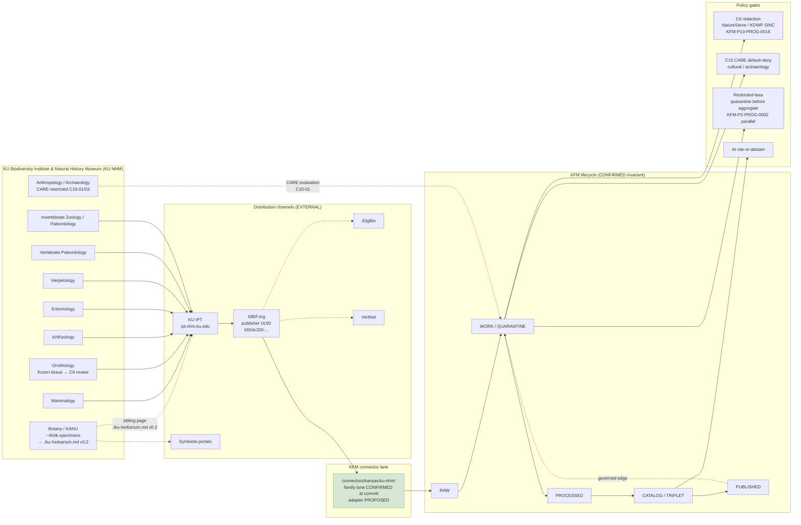

<!-- [KFM_META_BLOCK_V2]
doc_id: kfm://doc/docs-sources-catalog-kansas-ku-nhm
title: KU Biodiversity Institute & Natural History Museum (KU NHM) — Source Catalog Entry
type: standard
subtype: source-catalog-entry
version: v0.2
status: draft
owners: <TODO — docs steward + fauna domain steward + flora domain steward + archaeology domain steward>
created: 2026-05-20
updated: 2026-05-21
policy_label: public
related:
  - docs/sources/catalog/kansas/README.md
  - docs/sources/catalog/kansas/ku-herbarium.md
  - docs/sources/catalog/kansas/kbs.md
  - docs/sources/catalog/kansas/fhsu-sternberg.md
  - docs/sources/catalog/kansas/kdwp.md
  - docs/sources/catalog/kansas/khri.md
  - docs/sources/catalog/kansas/kansas-state-archives.md
  - docs/sources/catalog/kansas/kansas-memory.md
  - docs/sources/catalog/kansas/ksu-special-collections.md
  - docs/sources/catalog/kansas/ksu-research-extension.md
  - docs/sources/catalog/kansas/kansas-mesonet.md
  - docs/sources/catalog/kansas/ksgs.md
  - docs/sources/catalog/README.md
  - docs/sources/catalog/IDENTITY.md
  - docs/sources/catalog/PROFILES.md
  - docs/sources/catalog/RIGHTS-AND-SENSITIVITY-MAP.md
  - docs/sources/catalog/OPEN-QUESTIONS.md
  - docs/sources/catalog/_template/SOURCE_PRODUCT_TEMPLATE.md
  - docs/sources/SOURCE_DESCRIPTOR_STANDARD.md
  - docs/doctrine/directory-rules.md
  - docs/doctrine/lifecycle-law.md
  - docs/doctrine/truth-posture.md
  - docs/domains/fauna/README.md
  - docs/domains/flora/README.md
  - docs/domains/archaeology/README.md
  - docs/domains/geology/README.md
  - docs/standards/SENSITIVITY_RUBRIC.md
  - docs/registers/AUTHORITY_LADDER.md
  - docs/registers/DRIFT_REGISTER.md
  - docs/registers/VERIFICATION_BACKLOG.md
  - docs/runbooks/fauna/SOURCE_REFRESH_RUNBOOK.md
  - docs/adr/ADR-0001-schema-home.md
  - schemas/contracts/v1/source/source_descriptor.schema.json
  - connectors/kansas/ku-nhm/
  - data/registry/sources/
  - policy/sensitivity/
  - policy/rights/
tags: [kfm, sources, catalog, kansas, ku, ku-nhm, biodiversity-institute, natural-history-museum, fauna, flora, archaeology, c7-10, c10-06, c15-01, c15-03, kfm-p2-idea-0020, dwc-a]
notes:
  - >-
    v0.2 path migration: this doc moves from the v1 PROPOSED location (under
    `docs/sources/catalog/`, flat) to `docs/sources/catalog/kansas/ku-nhm.md`
    (nested under the `kansas/` §7.3 canonical family folder; kebab-case slug
    per v0.2 catalog convention). The kansas family README v0.2 lists this
    brief explicitly. v1 OPEN-KU-10 (catalog subfolder convention) is
    PARTIALLY RESOLVED by this reorganization.
  - >-
    Structural relationship to ku-herbarium.md v0.2: this page treats KU NHM
    as the INSTITUTION-LEVEL parent across nine+ divisions (Botany,
    Mammalogy, Ornithology, Ichthyology, Entomology, Herpetology, Vertebrate
    Paleontology, Invertebrate Zoology / Paleontology, Anthropology /
    Archaeology). The KU R.L. McGregor Herbarium (KANU) Botany division has
    its OWN per-surface product page at `./ku-herbarium.md` (v0.2 in this
    conversation series), because KFM-P2-IDEA-0019 explicitly names KANU
    separately as a Kansas-specific biodiversity authority alongside KSC,
    iDigBio, and USDA PLANTS. The two pages are intentional siblings — this
    page covers the museum-collection surfaces; ku-herbarium.md covers the
    herbarium-specific IPT/DwC-A surface.
  - >-
    KANU-vs-institution conflation (v1 OPEN-KU-01) — the corpus claim
    "approximately 454,000 specimens at the KU Biodiversity Institute Natural
    History Museum" (Pass-10 C10-06) is the KANU-only figure, not the
    institution-wide figure. v0.2 preserves this resolution and surfaces it
    explicitly in §2 and as OPEN-KUNHM-01 for ADR ratification.
  - >-
    **Connector path correction OPEN-KUNHM-02.** v1 did not specify a
    connector path; v0.2 establishes `connectors/kansas/ku-nhm/` under the
    canonical §7.3 family lane. Family lane CONFIRMED at commit
    `b6a27916bbb9e07cbf3752870c867476e1e094e7`.
  - >-
    Atlas card lineage CONFIRMED: `C7-10` (Kansas-First Domain Authorities —
    "KU Biodiversity Institute (Natural History Museum)" explicitly named);
    `C10-06` (Biodiversity Stack — "the KU Biodiversity Institute Natural
    History Museum collections (approximately 454,000 specimens cited in the
    corpus)"); `C15-01` + `C15-03` (CARE extension + OPA default-deny on
    CARE-tagged); `KFM-P2-IDEA-0019` (KANU named separately for flora
    context); `KFM-P2-IDEA-0020`-parallel (specimen-backed primacy);
    `KFM-P19-PROG-0014` (KU specimen holdings as distinct source-role
    families); `KFM-P29-IDEA-0013` (canonical source reference cards format);
    `KFM-P28-PROG-0012` (source_descriptor.schema.json design surface);
    `KFM-P24-IDEA-0002` + `KFM-P24-PROG-0013` (sensitive species
    deny-by-default + OPA ABSTAIN/DENY); `KFM-P13-PROG-0018` (deterministic
    grid generalization); `C7-07` ITIS, `C7-08` GBIF Backbone DOI
    10.15468/39omei, `C7-09` GNIS, `C7-01` Wikidata for crosswalks; Atlas
    §24.1.2 + §24.1.3 + §24.2.1 + §24.8.
  - >-
    `connectors/kansas/` lane is CONFIRMED (at commit
    `b6a27916bbb9e07cbf3752870c867476e1e094e7`) per Directory Rules v1.2 §7.3.
[/KFM_META_BLOCK_V2] -->

# KU Biodiversity Institute & Natural History Museum (KU NHM) — Source Catalog Entry

> **Institution-level source catalog entry** for the **University of Kansas Biodiversity Institute and Natural History Museum** ("KU NHM" / institution code **KU**) — a CONFIRMED Kansas-First Domain Authority per `C7-10`: *"Kansas-specific authorities — KSHS, KHRI, **KU Biodiversity Institute (Natural History Museum)**, KBS Natural Heritage Inventory, and KDWP SINC — serve as the domain authority of last resort for entities not covered by federal or international authorities."* This brief covers the museum-collection surfaces (Mammalogy, Ornithology, Ichthyology, Entomology, Herpetology, Vertebrate Paleontology, Invertebrate Zoology, Anthropology / Archaeology); the **KU R.L. McGregor Herbarium (KANU)** Botany division has its own per-surface page at [`./ku-herbarium.md`](./ku-herbarium.md) (v0.2) per `KFM-P2-IDEA-0019`.


-7e57c2)


-yellow)


> **Status:** `draft` (v0.2) — promotion of v1 from `docs/sources/catalog/ku-nhm.md` to `docs/sources/catalog/kansas/ku-nhm.md` &nbsp;·&nbsp; **Owners:** `<TODO — fauna + flora + archaeology stewards>` &nbsp;·&nbsp; **Last updated:** 2026-05-21

---

## Mini-TOC

1. [Why this catalog entry exists](#1-why-this-catalog-entry-exists)
2. [Identity & summary](#2-identity--summary)
3. [Source families covered](#3-source-families-covered)
4. [Access points & distribution channels](#4-access-points--distribution-channels)
5. [KFM source-role assignment](#5-kfm-source-role-assignment)
6. [SourceDescriptor mapping (PROPOSED)](#6-sourcedescriptor-mapping-proposed)
7. [Sensitivity, redaction & CARE posture](#7-sensitivity-redaction--care-posture)
8. [Lifecycle placement & cadence](#8-lifecycle-placement--cadence)
9. [Rights, licensing & citation](#9-rights-licensing--citation)
10. [Relationship diagram](#10-relationship-diagram)
11. [Open questions register](#11-open-questions-register)
12. [Related KFM doctrine](#12-related-kfm-doctrine)
13. [External sources consulted](#13-external-sources-consulted)
14. [Appendix A — Atlas idea-card lineage](#appendix-a--atlas-idea-card-lineage)
15. [Appendix B — Change log](#appendix-b--change-log)
16. [Footer](#footer)

---

## 1. Why this catalog entry exists

> [!NOTE]
> **Path migration (v1 → v0.2).** This page was authored as `docs/sources/catalog/ku-nhm.md` in v1 (flat under the catalog root) and **moved to `docs/sources/catalog/kansas/ku-nhm.md`** in v0.2 (nested under the `kansas/` §7.3 canonical family folder; kebab-case slug preserved). The kansas family README v0.2 lists this brief explicitly. **v1 OPEN-KU-10 (catalog/ subfolder convention) is PARTIALLY RESOLVED** by this reorganization.

> [!IMPORTANT]
> **Sibling relationship to `ku-herbarium.md` v0.2 (NEW in v0.2).** This page is the **institution-level brief** for KU NHM across nine+ divisions (Mammalogy, Ornithology, Ichthyology, Entomology, Herpetology, Vertebrate Paleontology, Invertebrate Zoology / Paleontology, Anthropology / Archaeology, **and Botany/KANU which has its own sibling page**). The **KU R.L. McGregor Herbarium (KANU)** Botany division has a **separate per-surface product page** at [`./ku-herbarium.md`](./ku-herbarium.md) (v0.2 in this conversation series), because `KFM-P2-IDEA-0019` (CONFIRMED, Pass 32) names *"the University of Kansas Herbarium (KANU)"* separately as one of four Kansas-specific biodiversity authorities (alongside KSC, iDigBio, USDA PLANTS). The two pages are intentional siblings — this page covers the museum-collection surfaces; `ku-herbarium.md` covers the herbarium-specific IPT/DwC-A surface with full operational detail per `KFM-P2-PROG-0002`.

> [!IMPORTANT]
> **Connector path established in v0.2 — OPEN-KUNHM-02.** v1 did not specify a connector path. v0.2 establishes `connectors/kansas/ku-nhm/` under the canonical `connectors/kansas/` §7.3 family lane (CONFIRMED at commit `b6a27916...`). The per-institution adapter remains PROPOSED.

KFM doctrine names the **KU Biodiversity Institute and Natural History Museum** as a Kansas-first **domain authority of last resort** for biodiversity entities not covered by federal or international authorities. The corpus calls for *"compact reference cards with canonical IDs, access points, publisher, license, retrieval time, and `spec_hash`"* for major public science data sources (`KFM-P29-IDEA-0013`, PROPOSED). This file is that reference card.

> [!NOTE]
> **CONFIRMED (doctrine):** KU NHM is listed in the Kansas biodiversity stack (`C10-06`) alongside GBIF, iNaturalist, eBird EBD, NatureServe, USFWS, iDigBio, Symbiota, and the Sternberg Museum at FHSU. It is also explicitly named under `C7-10` Kansas-First Domain Authorities as "KU Biodiversity Institute (Natural History Museum)."

| Why it matters | Where in doctrine |
|---|---|
| Kansas-specific authority carries occurrence-level provenance and taxonomic detail that federal/international aggregators *aggregate away*. | Pass-10 `C7-10` (CONFIRMED) |
| The biodiversity domain is where the C6 sensitivity machinery and C7 authority anchoring are exercised most heavily. | Pass-10 `C10-06` (CONFIRMED) |
| Specimen-backed records anchor against citizen-science noise (eBird, iNaturalist) in dedupe and trust weighting. | `KFM-P2-IDEA-0020`-parallel + `KFM-P2-PROG-0002` specimen-backed primacy (CONFIRMED) |
| KU specimen holdings should be registered as a distinct source-role family alongside NatureServe and GAP. | `KFM-P19-PROG-0014` (PROPOSED) |
| Archaeology/cultural-artifact holdings at KU trigger CARE / Indigenous-data-sovereignty obligations. | `C15-01`, `C15-03` (CONFIRMED) |

[Back to top](#mini-toc)

---

## 2. Identity & summary

| Field | Value | Label |
|---|---|---|
| **KFM source id** | `ku-nhm` (v0.2 kebab-case; v1 was `kfm:src/ku-nhm`) | PROPOSED |
| **Display name** | University of Kansas Biodiversity Institute and Natural History Museum | EXTERNAL biodiversity.ku.edu |
| **Short name** | KU NHM | CONFIRMED in corpus (`C7-10`, `C10-06`) |
| **Darwin Core `institutionCode`** | `KU` | EXTERNAL demo.gbif.org institution record |
| **Index Herbariorum acronym** (Botany — covered separately) | `KANU` (R.L. McGregor Herbarium) — see [`./ku-herbarium.md`](./ku-herbarium.md) v0.2 | EXTERNAL biodiversity.ku.edu/botany/collections |
| **Homepage** | <https://biodiversity.ku.edu/> | EXTERNAL biodiversity.ku.edu |
| **GBIF publisher UUID** | `b554c320-0560-11d8-b851-b8a03c50a862` (publisher since 3 May 2010) | EXTERNAL gbif.org/publisher record |
| **GBIF institution UUID** | `49fb6451-91b7-4af2-8cd3-354539a77589` | EXTERNAL scientific-collections.gbif.org |
| **IPT endpoint (Darwin Core Archives)** | <http://ipt.nhm.ku.edu/> | EXTERNAL ipt.nhm.ku.edu landing page |
| **Location** | Dyche Hall, 1345 Jayhawk Boulevard, Lawrence, KS 66045 | EXTERNAL demo.gbif.org institution record |
| **Founded** | 1873 | EXTERNAL demo.gbif.org institution record |
| **Holdings (institution-wide)** | "over 11 million plant, fungi, animal and fossil specimens, plus 2 million archaeological artifacts" | EXTERNAL biodiversity.ku.edu/collections |
| **Citation norms** | <https://biodiversity.ku.edu/research/university-kansas-biodiversity-institute-data-publication-and-use-norms> | EXTERNAL KU data publication & use norms |
| **`spec_hash`** | TODO — compute at promotion per ADR-0001 / C1-02 | PROPOSED |
| **Parent umbrella** | None — KU NHM is the institution-level brief itself | n/a |
| **Sibling per-surface page** | [`./ku-herbarium.md`](./ku-herbarium.md) v0.2 — Botany/KANU surface | CONFIRMED (this conversation series) |
| **Family lane** | `connectors/kansas/` — **CONFIRMED §7.3** at commit `b6a27916...` | CONFIRMED |
| **Per-institution adapter** | `connectors/kansas/ku-nhm/` | PROPOSED (OPEN-KUNHM-02) |

> [!IMPORTANT]
> **Conflict re-surfaced (NEEDS VERIFICATION; v1 OPEN-KU-01 → v0.2 OPEN-KUNHM-01):** The KFM corpus cites *"approximately 454,000 specimens at the KU Biodiversity Institute Natural History Museum"* (Pass-10 `C10-06`). KU's institutional collections page reports over 11 million plant, fungi, animal and fossil specimens plus 2 million archaeological artifacts. The 454,000 figure is consistent with the **R.L. McGregor Herbarium (KANU) alone**, not the institution: "The R.L. McGregor Herbarium (Index Herbariorum: KANU) houses approximately 454,000 plant specimens." This is corroborated by the v0.2 sibling page [`./ku-herbarium.md`](./ku-herbarium.md) which treats KANU separately per `KFM-P2-IDEA-0019`. KFM should treat the corpus's institution-level number as **a KANU-vs-institution conflation** and resolve via ADR or corrigendum. See OPEN-KUNHM-01.

[Back to top](#mini-toc)

---

## 3. Source families covered

KU NHM is a **multi-division institution**; KFM treats it as a *parent source family* with per-division **sub-sources** (one `SourceDescriptor` per division per dataset, per the per-source-watcher principle in `KFM-P2-IDEA-0019`).

> [!NOTE]
> The list below is sourced from KU's external division pages (EXTERNAL). The institution-wide GBIF demo record lists *"12 collections"* — KFM should reconcile the division list against the live GBIF publisher dataset list at promotion time. **The Botany / KANU row is handled by the sibling per-surface page [`./ku-herbarium.md`](./ku-herbarium.md) v0.2 per `KFM-P2-IDEA-0019` separate-naming**; included here for completeness but with cross-reference.

| Division | Scale (EXTERNAL) | KFM domain (CONFIRMED doctrine) | Primary KFM source-role | Notes |
|---|---|---|---|---|
| **Botany / R.L. McGregor Herbarium (KANU)** | ~454,000 plant specimens; ~65% from grassland biome of central North America | Flora | `observed` | **Handled at [`./ku-herbarium.md`](./ku-herbarium.md) v0.2** per `KFM-P2-IDEA-0019` separate naming; full operational detail in that sibling page (DwC-A via IPT, specimen-backed primacy, USDA PLANTS anchor, restricted-taxa quarantine per `KFM-P2-PROG-0002`). |
| **Mammalogy** | 5th largest mammal collection in North America; 3rd largest university collection in world | Fauna | `observed` | GBIF dataset DOI `10.15468/a3woj7` per `KFM-P29-IDEA-0013` reference-card pattern. |
| **Ornithology** | 85,000+ study skins, 33,000+ osteological specimens, ~35,000 frozen tissue samples | Fauna | `observed` | Frozen tissue samples may trigger C9 DTC-DNA / human-subject linkage review for any human-associated material (see §7.3 + OPEN-KUNHM-07). |
| **Ichthyology** | more than 45,000 cataloged lots | Fauna | `observed` | |
| **Entomology** | over a million individually digitized specimens, representing less than a quarter of physical holdings | Fauna | `observed` | Discover Life listed as external aggregator alongside GBIF and iDigBio. |
| **Vertebrate Paleontology** | approximately 160,000 specimens and nearly 600 types | Geology / Fauna (deep-time) | `observed` | Type specimens carry high taxonomic value; preserve specimen-backed citation. |
| **Herpetology, Invertebrate Zoology, Invertebrate Paleontology, Microbial Genomics, etc.** | NEEDS VERIFICATION — confirm full division list against KU GBIF publisher datasets per OPEN-KUNHM-03 | Fauna / Flora / Geology | `observed` | GBIF reports "12 collections"; this table enumerates 9 confidently. |
| **Anthropology / Archaeology (cultural artifacts)** | 2 million cultural artifacts | Archaeology / People-DNA-Land | **`observed` + `role_care_restricted: true`** | See §7 CARE posture. CARE evaluation per `C15-01` MUST populate `authority_to_control`; OPA default-deny on CARE-tagged per `C15-03`. |

> [!CAUTION]
> **Specimen-backed primacy** (CONFIRMED, by parallel from `KFM-P2-PROG-0002` for flora and `KFM-P2-IDEA-0020` for fauna): when a KU NHM specimen and an iNaturalist / eBird crowd observation describe the same occurrence, **the specimen is preferred**. AI surfaces and Evidence Drawer renderers MUST surface the specimen citation when both are present. This applies cross-divisionally to all `observed`-role KU NHM records.

[Back to top](#mini-toc)

---

## 4. Access points & distribution channels

KU NHM is a **multi-channel publisher**. KFM watchers must select the channel appropriate to each division and dataset.

| Channel | Use | Cadence (EXTERNAL / NEEDS VERIFICATION) | KFM ingest pattern (PROPOSED) |
|---|---|---|---|
| **GBIF.org datasets** (per division, DOI-anchored) | Authoritative DwC-A snapshots with version + DOI; e.g. KUBI Mammalogy dataset DOI `10.15468/a3woj7` | Per-division release cadence; per-version DOI | Conditional GET on dataset metadata; pin DOI in `EvidenceBundle`; `spec_hash` over canonicalized DwC-A. (`C3-01`, `C3-02`) |
| **KU IPT (Integrated Publishing Toolkit)** | Direct DwC-A publication endpoint operated by KU; "University of Kansas Biodiversity Institute natural history collections published via Darwin Core Archive files" | Per-resource update cadence | Watcher with ETag / Last-Modified on resource RSS / EML; receipt on no-op per Atlas §24.2.1. (`C3-01`, `KFM-P29-IDEA-0002`) |
| **iDigBio** | Aggregator surface; "Specimen data can be searched through iDigBio, GBIF, or our Specify database" | iDigBio aggregation cadence | Use as cross-check only; never as primary if KU IPT/GBIF dataset exists. |
| **VertNet** | Listed alongside Specify and GBIF for KU specimen data | Aggregator cadence | Vertebrate divisions only; cross-check. |
| **Symbiota portals** | "over 50 Symbiota portals have been used to mobilize 90 million biological specimen records from 1,800 collections worldwide"; KU also operates Symbiota Support Hub | Per-portal cadence | Botany / Mycology / Lichen — match per-portal terms; coordinate with [`./ku-herbarium.md`](./ku-herbarium.md) v0.2 for KANU-specific portal involvement. |
| **Specify (Collection Object Database)** | Institutional collection-management system surface | n/a — not a public publishing endpoint per se | Treat as upstream of IPT; do not bypass IPT/GBIF to scrape. |
| **Discover Life** | Listed as Entomology external aggregator alongside GBIF and iDigBio | Aggregator cadence | Cross-check; Entomology context. |
| **Direct loan / curatorial contact** | Per-division contact details published on each division page | Manual / curatorial | Out-of-band; record any received material with full provenance. |

> [!TIP]
> **Default channel = GBIF dataset DOI.** GBIF dataset DOIs provide stable, citable, version-anchored access; per the corpus, the GBIF Backbone DOI `10.15468/39omei` is the taxonomy crosswalk fallback when ITIS is silent (`C7-08` CONFIRMED). Prefer GBIF dataset DOI as the **canonical retrieval URI** and IPT as the **freshness probe**. Cross-source dedupe key `institutionCode + catalogNumber + eventDate` per `KFM-P2-PROG-0002` (CONFIRMED for flora; applies by parallel to fauna divisions — see OPEN-KUNHM-09).

[Back to top](#mini-toc)

---

## 5. KFM source-role assignment

KFM source-role taxonomy (CONFIRMED, Atlas §24.1.3): `observed | regulatory | modeled | aggregate | administrative | candidate | synthetic`.

| KU division class | Assigned `source_role` | Notes |
|---|---|---|
| Specimen-backed biological collections (Mammalogy, Ornithology, Ichthyology, Herpetology, Entomology, Vertebrate Paleontology, Invertebrate Paleontology, etc.) | `observed` | Each occurrence is a vouchered specimen with collector, date, locality. CONFIRMED doctrine treats these as specimen-backed authoritative observations (`KFM-P2-IDEA-0020`-parallel + `KFM-P2-PROG-0002` specimen-backed primacy). |
| Botany / KANU | `observed` (handled at [`./ku-herbarium.md`](./ku-herbarium.md) v0.2) | Cross-reference; not duplicated here. |
| Anthropology / Archaeology cultural artifacts | `observed` **plus** `role_care_restricted: true` | Material observed in collection; *publication* gated by CARE rules (`C15-03`). Public surfacing of precise provenance NEEDS curatorial review per `C15-01`. |
| KU-derived secondary aggregations (e.g., institution-wide reports, summary publications cited as data) | `aggregate` (when used) | Set `role_aggregation_unit` (taxonomic, geographic, or temporal scope token). Atlas §24.1.2 forbids using these as per-place truths. |

> [!CAUTION]
> **Role-purity is not optional.** Per Atlas §24.1.3 (CONFIRMED), `source_role` is *"Set at admission. Never edited in-place; corrections must produce a new descriptor and a `CorrectionNotice`."* A KU specimen record must not be silently reclassified from `observed` to `aggregate` (or vice versa) by downstream code.

> [!NOTE]
> **`regulatory` is NOT a KU NHM role.** Kansas regulatory authority for listed-species status is KDWP per `KFM-P19-IDEA-0005` (see [`./kdwp.md`](./kdwp.md) v0.2). A KU NHM specimen of a listed taxon anchors a place-time observation; the regulatory listing of that taxon is KDWP's. Conflating the two is a source-role anti-collapse violation per Atlas §24.1.3.

> [!NOTE]
> **`authority` is NOT a KU NHM role at the source-role enum level.** KU NHM holds Kansas-first **authority of last resort** status per `C7-10` (a doctrinal class), but in the per-record source-role enum its records are `observed`. Compare KBS NHI ([`./kbs.md`](./kbs.md) v0.2), which IS `authority` for Kansas natural-community classifications — that is a different scope (taxonomic / classification authority) from KU NHM's specimen-evidence scope. This is the same distinction surfaced in [`./ku-herbarium.md`](./ku-herbarium.md) v0.2 §5 IMPORTANT callout.

[Back to top](#mini-toc)

---

## 6. SourceDescriptor mapping (PROPOSED)

The fields below are the KFM **PROPOSED** `SourceDescriptor` shape for KU NHM, mapped against `KFM-P28-PROG-0012` (*"source_descriptor.schema.json … source URI, ETag, Last-Modified, retrieval window, source posture, and `kfm:spec_hash`"*) and Atlas §24.1.3 role fields.

> [!IMPORTANT]
> **Schema home.** Per Directory Rules §7.4 and ADR-0001, the canonical schema home defaults to `schemas/contracts/v1/source/source_descriptor.schema.json`. Actual file presence, field names, required-ness, and validator behavior are **NEEDS VERIFICATION**.

<details>
<summary><b>Show illustrative descriptor stub (PROPOSED, not authoritative)</b></summary>

```yaml
# kfm://source-descriptor/ku-nhm/<division>/<dataset>@<version>
# This is an ILLUSTRATIVE PROPOSED descriptor. Field names, required-ness, and
# enum vocabularies are PROPOSED per Atlas §24.1.3 and KFM-P28-PROG-0012;
# NEEDS VERIFICATION against the mounted SourceDescriptor schema.

source_id:                ku-nhm-mammalogy                       # v0.2 kebab-case per-division
parent_source_id:         ku-nhm                                  # institution-level parent (this brief)
source_family:            kansas                                  # v0.2 catalog folder; CONFIRMED §7.3 family at commit b6a27916...
source_family_enum:       other                                   # closed enum per KFM-P3-PROG-0001
biodiversity_subfamily:   ku-nhm-umbrella                         # internal grouping
display_name:             "KUBI Mammalogy Collection"             # CONFIRMED EXTERNAL (GBIF)
institution_code:         KU                                       # DwC institutionCode
collection_code:          <KU-CC>                                  # NEEDS VERIFICATION
publisher:                "University of Kansas Biodiversity Institute"
gbif_publisher_uuid:      b554c320-0560-11d8-b851-b8a03c50a862     # EXTERNAL
gbif_dataset_doi:         "https://doi.org/10.15468/a3woj7"        # EXTERNAL example
source_uri:               "https://www.gbif.org/dataset/1d04e739-98a9-4e16-9970-8f8f3bf9e9e3"
kansas_first_anchor:      C7-10                                    # CONFIRMED — KU Biodiversity Institute named
biodiversity_stack_member: C10-06                                  # CONFIRMED — KU NHM in biodiversity stack
parallel_anchor_rule:     C7-10                                    # store KU IRI alongside federal/international anchor
retrieval_validators:
  etag:                   "<set-by-watcher>"
  last_modified:          "<set-by-watcher>"
  content_length:         "<set-by-watcher>"
retrieval_window:
  policy:                 "weekly-conditional-get-on-metadata"     # PROPOSED per §8
  last_check:             "<set-by-watcher>"
  last_change:            "<set-by-watcher>"
source_role:              observed                                 # Atlas §24.1.3
role_authority:           "University of Kansas Biodiversity Institute"
role_care_restricted:     false                                    # true for Anthropology/Archaeology
sensitivity:
  rubric_pass10:          C6-01                                     # 0-5 rubric
  default_rank:           0                                         # Per-record overrides via NatureServe/KDWP SINC
  s1_s2_redaction:        required                                  # per C10-06: "apply C6 redaction for any species that NatureServe or KDWP SINC ranks at S1/S2"
  default_redaction_profile: profile:sinc-obscure-10km              # C6-02 named profile
specimen_backed_primacy:  true                                     # per KFM-P2-PROG-0002 parallel; prefer KU specimen over crowd observation in dedupe
dedupe:
  cross_source_key:       institutionCode + catalogNumber + eventDate  # per KFM-P2-PROG-0002 (applies by parallel to fauna)
  cross_source_partners:  [ku, gbif, idigbio, vertnet, discoverlife]
anchoring:
  taxon_authority:        ITIS TSN (primary, C7-07); GBIF Backbone DOI 10.15468/39omei (fallback, C7-08)
  place_authority:        USGS GNIS (C7-09)
  person_authority:       LCNAF (C7-02) / VIAF (C7-03) / Wikidata (C7-01)
license:                  "<dataset-specific; see GBIF metadata>"   # NEEDS VERIFICATION per dataset
rights_holder:            "University of Kansas Biodiversity Institute"  # DwC rightsHolder per KU norms
citation_required:        true
citation_template:        "<see §9>"
care_review_required:     false                                    # true for ku-nhm-anthropology — per C15-02 / C15-03
kfm:spec_hash:            "<computed at promotion: JCS+SHA-256>"
status:
  activation_decision:    needs-review
  fixtures_present:       false
  validators_present:     false
  policy_gates_present:   false
```

</details>

### Field highlights

- **`source_role` = `observed`** for all specimen-backed divisions — *do not* default to `aggregate` even when the dataset is large, because each row is a vouchered observation.
- **`role_care_restricted` = `true`** for Anthropology / Archaeology cultural artifacts — triggers OPA default-deny per `C15-03`.
- **`specimen_backed_primacy` = `true`** — per `KFM-P2-PROG-0002`-parallel doctrine for flora, applied by direct extension to fauna. KU specimen records outrank crowd observations in dedupe.
- **`retrieval_window.policy`** is **PROPOSED**; concrete debounce windows are flagged unresolved in Pass-10 §9.3 ("the right window is per-source") and remain open.
- **`citation_template`** must conform to KU's published norms (see §9), or KFM is in violation of KU's stated data-use community expectations.

[Back to top](#mini-toc)

---

## 7. Sensitivity, redaction & CARE posture

### 7.1 C6 sensitivity (biological divisions)

KU specimen occurrences carry the **`C6-01` sensitivity rubric 0–5** like all KFM biodiversity records (CONFIRMED).

| Rank | Profile (CONFIRMED corpus) | Applies to KU records when… |
|---|---|---|
| 0 | public / open | Common, non-listed taxa with no special concern. |
| 1 | common non-sensitive | Default for most KU specimens. |
| 2 | watchlist | Taxa flagged by KBS Natural Heritage Inventory (see [`./kbs.md`](./kbs.md) v0.2) or under monitoring. |
| 3 | SINC / locally sensitive (default `profile:sinc-obscure-10km`) | KDWP SINC species (S3 / regional concern) per [`./kdwp.md`](./kdwp.md) v0.2. |
| 4 | threatened / rare (strict mask or embargo) | NatureServe S1–S2 or USFWS listed species. |
| 5 | sacred / critical (fail-closed; no map/timeline exposure) | Determined by curatorial / community authority; **not auto-derivable**. |

> [!WARNING]
> **Per Pass-10 `C10-06` (CONFIRMED):** *"apply C6 redaction for any species that NatureServe or KDWP SINC ranks at S1/S2 sensitivity."* KU records of S1/S2 species must enter via WORK/QUARANTINE and reach PUBLISHED only after redaction is applied through a versioned profile (e.g., `point_10km_hex_seeded_v1`, `centroid_1km_v1`) with a `RedactionReceipt` per Atlas §24.2.1 — **never as raw coordinates**. Per `KFM-P13-PROG-0018` (active, Pass 32, EXPANDED): "deterministic grid snapping, representative point plus uncertainty, or withholding tiers while preserving precise private coordinates and rule-version provenance."

### 7.2 CARE posture (cultural / archaeological holdings)

KU NHM's 2 million cultural artifacts implicate KFM's CARE machinery:

- **MetaBlock v2 CARE fields are MUST-populate** for any artifact from this division (`C15-01`, CONFIRMED).
- **OPA default-deny** applies to any asset declaring a non-empty `authority_to_control` (`C15-03`, CONFIRMED).
- **Curatorial review is required** — the corpus is explicit that CARE-applicability is a curatorial judgment, not an engineering one (`C15-01` tensions).
- **Precise-location exposure** for archaeology sites is restricted per the AI Build Operating Contract §13 (Publication, Rights, and Sensitivity).
- **Sensitive-cultural-site geometry generalization** applied by parallel from `KFM-P13-PROG-0018` — same operational discipline as for sensitive species locations. See [`./khri.md`](./khri.md) v0.2 §6 for the parallel rule applied to KHRI sensitive cultural sites.

### 7.3 Living-people overlap (DNA / genomic specimens)

If any KU division (e.g., ornithology frozen-tissue, mammalogy tissue) holds material with identifiable human-subject linkage (NEEDS VERIFICATION per OPEN-KUNHM-07), the C9/C6 living-people and DTC-DNA rules apply and the descriptor's sensitivity floor rises accordingly.

### 7.4 Restricted-taxa quarantine-before-aggregate rule

Per `KFM-P2-PROG-0002` (active, Pass 32) — applies by parallel to KU NHM fauna divisions, just as it applies directly to the KANU sibling at [`./ku-herbarium.md`](./ku-herbarium.md) v0.2: *"restricted taxa (NatureServe, listed species) are quarantined or redacted **before any aggregate is published**."* This is a PRE-aggregate guard: a KU NHM mammalogy or ornithology dataset containing S1/S2 records routes those records to `data/quarantine/` for steward review before any taxon-by-county aggregate can be published. Cross-references `KFM-P24-IDEA-0002` deny-by-default + `KFM-P24-PROG-0013` OPA ABSTAIN/DENY.

> [!TIP]
> **T0–T4 vs `C6-01` 0–5 reconciliation** (same OPEN as sibling KHRI v0.2 OQ-KHRI-14, KSU R&E v0.2 OQ-KSURE-16, KBS v0.2 cross-reference, KU McGregor Herbarium v0.2 OPEN-KUHERB-10). The Domains Atlas v1.1 §24.1 uses a T0–T4 scheme; Pass-10 `C6-01` uses a 0–5 scheme. The two schemes have not yet been reconciled by ADR. This page uses `C6-01` rank guidelines; future ADR resolution will harmonize both.

[Back to top](#mini-toc)

---

## 8. Lifecycle placement & cadence

KU NHM data flows through the standard KFM lifecycle (CONFIRMED invariant):

> **RAW → WORK / QUARANTINE → PROCESSED → CATALOG / TRIPLET → PUBLISHED**
>
> Promotion is a **governed state transition, not a file move.** (Directory Rules §0 / Invariant; `C5-02` default-deny promotion CONFIRMED)

| Stage | KU-specific notes (PROPOSED unless cited) |
|---|---|
| **RAW** | DwC-A pulled from GBIF DOI or KU IPT; original archive bytes preserved with `spec_hash`, ETag, Last-Modified. (CONFIRMED principle — `C3-01`, `C3-02`) Lifecycle placement: `data/raw/fauna/ku-nhm-<division>/<timestamp>/`, `data/raw/archaeology/ku-nhm-anthropology/<timestamp>/`. |
| **WORK / QUARANTINE** | License/rights check; **CARE evaluation for Anthropology/Archaeology**; sensitive-taxon flagging against NatureServe + KDWP SINC; ITIS / GBIF Backbone anchoring (`C7-07`, `C7-08` CONFIRMED); **restricted-taxa quarantine-before-aggregate per `KFM-P2-PROG-0002`-parallel**. |
| **PROCESSED** | DwC fields normalized; KFM identity rule applied (per-domain object families); redaction profile applied to S1/S2 records before any public-facing derivative per `KFM-P13-PROG-0018`. |
| **CATALOG / TRIPLET** | STAC `kfm:provenance` item per dataset version (`C4-01` CONFIRMED); DCAT distribution (`C4-05`); PROV-O lineage (`C5-08`); CIDOC-CRM E20/E22/E53 mapping for cultural artifacts. |
| **PUBLISHED** | Cite-or-abstain enforced at AI surfaces; PMTiles for map layers gated by render-time PDP introspection (`C6-08`); no `PUBLISHED` edge to WORK / QUARANTINE (CONFIRMED invariant). |

**Cadence (PROPOSED):** GBIF dataset versions are typically released monthly to quarterly per division; the KFM watcher should default to **weekly conditional-GET on dataset metadata** with `EvidenceBundle` no-op receipts emitted on unchanged ETag (per `KFM-P29-FEAT-0003` PROPOSED). See OPEN-KUNHM-04.

[Back to top](#mini-toc)

---

## 9. Rights, licensing & citation

### 9.1 Citation requirement (EXTERNAL — binding on KFM)

KU publishes explicit **data publication and use norms**. KFM is bound by them as a downstream consumer.

> "As is best practice in scientific research, cite the data you are using … cite the data publisher (institutionCode and rightsHolder), the dataset name (datasetName), the link to the dataset (datasetID), and the record id (catalogNumber or occurrenceID)."

KFM citation template (PROPOSED, conforming to KU norms):

```text
[catalogNumber], [datasetName] from University of Kansas Biodiversity Institute
([datasetID]) (accessed on [retrieval_window.last_change]).
```

### 9.2 License (NEEDS VERIFICATION per dataset)

Licenses are **per-dataset** in GBIF metadata, not institution-wide. The watcher MUST extract and pin the license string per `SourceDescriptor` instance. Do **not** assume a single institutional license.

### 9.3 Rights holder

`dwc:rightsHolder = "University of Kansas Biodiversity Institute"` per KU norms. Preserve verbatim in CATALOG records and PUBLISHED derivatives.

### 9.4 License + rightsHolder + datasetID end-to-end preservation

Per `KFM-P2-PROG-0002` (CONFIRMED for flora; applies by parallel to fauna): KU NHM DwC-A archives carry per-record `license`, `rightsHolder`, and `datasetID` fields. These are NOT metadata decoration — they are the operational basis for rights enforcement. KFM normalization MUST preserve these three fields end-to-end. Validation that rejects DwC-A records missing `license`, `rightsHolder`, or `datasetID` is mandatory. This is the same discipline applied at [`./ku-herbarium.md`](./ku-herbarium.md) v0.2 §6 WARNING callout.

> [!CAUTION]
> **Unknown rights fail closed** per `C5-02`. Until a `SourceDescriptor` and `SourceActivationDecision` exist for a specific KU NHM division, any harvested KU NHM material stays in `data/raw/<domain>/ku-nhm-<division>/` or `data/quarantine/`.

[Back to top](#mini-toc)

---

## 10. Relationship diagram



> [!NOTE]
> The diagram reflects **CONFIRMED doctrine** (lifecycle, policy gates, `connectors/kansas/` family lane at commit `b6a27916...`) and **EXTERNAL channel facts** (GBIF / IPT / iDigBio / VertNet / Symbiota). The Botany / KANU edge is dashed because it is handled via the sibling page [`./ku-herbarium.md`](./ku-herbarium.md) v0.2. Specific routes inside KFM (e.g., which validator owns the `CARE evaluation` edge) are **NEEDS VERIFICATION** against mounted repo evidence.

[Back to top](#mini-toc)

---

## 11. Open questions register

| ID | Question | Status |
|---|---|---|
| **OPEN-KUNHM-01** (v1 OPEN-KU-01) | **KANU vs institution conflation.** Should the corpus's "~454k at KU NHM" (Pass-10 `C10-06`) be corrected via ADR or corrigendum to read "~454k at KANU"? Cross-confirmed by [`./ku-herbarium.md`](./ku-herbarium.md) v0.2 which treats KANU as its own per-surface page with 454k figure attached to it. | NEEDS VERIFICATION — ratification pending. |
| **OPEN-KUNHM-02** (NEW v0.2 — PATH) | **Connector path establishment.** v1 did not specify a connector path; v0.2 establishes `connectors/kansas/ku-nhm/` under canonical §7.3 family lane (CONFIRMED at commit `b6a27916...`). Per-institution adapter PROPOSED; mounted-repo verification required. | OPEN |
| **OPEN-KUNHM-03** (v1 OPEN-KU-02) | **Full division list.** GBIF reports "12 collections"; this entry enumerates ~9 confidently. Confirm the remaining divisions and bind each to a KFM domain. | NEEDS VERIFICATION |
| **OPEN-KUNHM-04** (v1 OPEN-KU-03) | **Per-dataset license inventory.** What is the license string for each KU GBIF dataset? Watcher must extract per descriptor; no institution-wide default. | NEEDS VERIFICATION |
| **OPEN-KUNHM-05** (v1 OPEN-KU-04) | **Retrieval cadence per division.** GBIF dataset version cadence varies; a single weekly probe vs per-division schedule. | PROPOSED |
| **OPEN-KUNHM-06** (v1 OPEN-KU-05) | **Symbiota portal identity.** Which Symbiota portals does KU operate vs participate in? Bind each portal to a `SourceDescriptor`. Coordinate with [`./ku-herbarium.md`](./ku-herbarium.md) v0.2 for KANU-related portals. | NEEDS VERIFICATION |
| **OPEN-KUNHM-07** (v1 OPEN-KU-06) | **Tribal / community authority overlap on archaeology holdings.** Which named authority/authorities populate `authority_to_control` for the 2M cultural artifacts? | NEEDS VERIFICATION — curatorial decision per `C15-01` |
| **OPEN-KUNHM-08** (v1 OPEN-KU-07) | **Frozen tissue / genomic linkage.** Do any KU divisions hold material with identifiable-human linkage triggering C9 DTC-DNA rules? | UNKNOWN |
| **OPEN-KUNHM-09** (v1 OPEN-KU-08) | **IPT-vs-GBIF freshness lag.** Empirically, how much lag exists between KU IPT publication and GBIF dataset version availability? Drives watcher targeting. | NEEDS VERIFICATION |
| **OPEN-KUNHM-10** (v1 OPEN-KU-09) | **eBird / GBIF-mediated duplication.** When KU ornithology records reach GBIF and KU is also an eBird-via-GBIF flow, how is dedupe arbitrated? Apply specimen-backed primacy per `KFM-P2-PROG-0002`-parallel; confirm operational mechanism. | PROPOSED |
| **OPEN-KUNHM-11** (v1 OPEN-KU-10 — RESOLVED partially in v0.2) | **`catalog/` subfolder convention.** v1 asked whether `docs/sources/catalog/<source>.md` was the established pattern. **v0.2 resolves PARTIALLY** by adopting `docs/sources/catalog/<family>/<product>.md` consistent with sibling v0.2 product pages. Mounted-repo verification remains. | PARTIALLY RESOLVED |
| **OPEN-KUNHM-12** (NEW v0.2 — SIBLING) | **Sibling-page relationship.** Confirm [`./ku-herbarium.md`](./ku-herbarium.md) v0.2 + this page model: KANU as separately-named per-surface page under KBS umbrella per `KFM-P2-IDEA-0019`, while this page covers institution-level KU NHM with non-botany divisions. Mounted-repo verification of both sibling pages required. | OPEN |
| **OPEN-KUNHM-13** (NEW v0.2 — SOURCE-ROLE) | **`authority`-of-last-resort (C7-10) vs `observed` (Atlas §24.1.3) framing.** KU NHM is `C7-10` Kansas-first authority of last resort but its per-record source-role is `observed`. Document this two-level framing explicitly so admission code does not collapse them. | OPEN |
| **OPEN-KUNHM-14** (NEW v0.2 — T0–T4 vs 0–5) | T0–T4 vs `C6-01` 0–5 sensitivity tier-scheme reconciliation (same OPEN as KHRI v0.2 OQ-KHRI-14, KSU R&E v0.2 OQ-KSURE-16, KU Herbarium v0.2 OPEN-KUHERB-10). | OPEN |
| **OPEN-KUNHM-15** (NEW v0.2 — DEDUPE) | **Cross-source dedupe key applicability.** `KFM-P2-PROG-0002` defines `institutionCode + catalogNumber + eventDate` for flora; confirm applicability to fauna divisions (Mammalogy, Ornithology, etc.) and coordinate with VertNet/iDigBio aggregator field semantics. | OPEN |
| **OPEN-KUNHM-16** (NEW v0.2 — CARD-ID) | Confirm corpus card-ID stability for `KFM-P2-IDEA-0019`, `KFM-P2-IDEA-0020`, `KFM-P19-PROG-0014`, `KFM-P28-PROG-0012`, `KFM-P29-IDEA-0013`. | OPEN |

[Back to top](#mini-toc)

---

## 12. Related KFM doctrine

| KFM reference | Topic | Status (corpus) |
|---|---|---|
| Pass-10 **`C10-06`** | Biodiversity Stack (GBIF, iNaturalist, eBird EBD, NatureServe, USFWS, iDigBio, Symbiota, KU NHM ~454k, FHSU Sternberg) | CONFIRMED |
| Pass-10 **`C7-10`** | Kansas-First Domain Authorities (KSHS, KHRI, **KU Biodiversity Institute (Natural History Museum)**, KBS, KDWP SINC) | CONFIRMED |
| Pass-10 **`C7-07` / `C7-08`** | ITIS TSN; GBIF Backbone DOI `10.15468/39omei` as taxonomic anchors | CONFIRMED |
| Pass-10 **`C7-01` / `C7-02` / `C7-03` / `C7-09`** | Wikidata, LCNAF, VIAF, GNIS crosswalk anchors | CONFIRMED |
| Pass-10 **`C6-01` … `C6-04`** | Sensitivity rubric; named redaction profiles; seeded jitter; grid generalization | CONFIRMED |
| Pass-10 **`C15-01` / `C15-03`** | MetaBlock v2 CARE fields; OPA default-deny on CARE-tagged assets | CONFIRMED |
| Pass-10 **`C5-02` / `C5-04` / `C5-08`** | Default-deny promotion; spec-hash-match gate; lineage required | CONFIRMED |
| Pass-10 **`C4-01` / `C4-02` / `C4-05`** | STAC `kfm:provenance` namespace; STAC Collection convention; DCAT distribution | CONFIRMED |
| **`KFM-P2-IDEA-0019`** | KANU, KSC, iDigBio, USDA PLANTS as Kansas-specific biodiversity authorities | CONFIRMED, Pass 32 |
| **`KFM-P2-PROG-0002`** | Kansas flora watcher / KANU IPT pipeline (applies by parallel to fauna divisions) | active, Pass 32 |
| **`KFM-P2-IDEA-0020`** | eBird as coverage-layer; KU/specimen-backed records dominate dedupe | active, Pass 32 |
| **`KFM-P19-PROG-0014`** | Register KU specimen holdings, NatureServe, GAP as distinct source-role families | PROPOSED |
| **`KFM-P28-PROG-0012`** | `source_descriptor.schema.json` design surface | PROPOSED |
| **`KFM-P29-IDEA-0013`** | Canonical source reference cards format | PROPOSED |
| **`KFM-P29-IDEA-0002`** | Watcher pattern with ETag / Last-Modified | PROPOSED |
| **`KFM-P29-FEAT-0003`** | Conditional-GET cadence pattern | PROPOSED |
| **`KFM-P24-IDEA-0002`** + **`KFM-P24-PROG-0013`** | Sensitive species deny-by-default + OPA ABSTAIN/DENY | active, Pass 32 |
| **`KFM-P13-PROG-0018`** | Deterministic grid generalization with rule-version provenance | active, Pass 32, EXPANDED |
| **`KFM-P19-IDEA-0005`** | KDWP listing canonical regulatory context (referenced for contrast) | active, Pass 32 |
| **Atlas §24.1.2** | Anti-collapse failure modes | CONFIRMED, Pass-23/32 |
| **Atlas §24.1.3** | Source-role enum (Master Source-Role Anti-Collapse Register) | CONFIRMED, Pass-23/32 |
| **Atlas §24.2.1** | Master receipt catalog | CONFIRMED, Pass-23/32 |
| **Atlas §24.8** | Time discipline | CONFIRMED, Pass-23/32 |
| **DOM-FLORA §D** | Source families incl. "Kansas Biological Survey / KU herbarium surfaces" | CONFIRMED listing |
| **Directory Rules v1.2 §7.3** | `connectors/` family lane — `connectors/kansas/` CONFIRMED at commit `b6a27916...` | CONFIRMED |
| **Directory Rules v1.2 §6.1** | `docs/sources/` — source-descriptor standards, source families | CONFIRMED location root |
| **Directory Rules v1.2 §7.4** | Schema home convention | CONFIRMED location root |
| **AI Build Operating Contract §10–§13** | Core invariants, governed AI rule, publication & sensitivity, change discipline | CONFIRMED |
| **Sibling product pages (v0.2 in this series)** | [`./ku-herbarium.md`](./ku-herbarium.md) (KANU per-surface); [`./kbs.md`](./kbs.md); [`./kdwp.md`](./kdwp.md); [`./khri.md`](./khri.md); [`./kansas-state-archives.md`](./kansas-state-archives.md); [`./fhsu-sternberg.md`](./fhsu-sternberg.md) | CONFIRMED in conversation series |

[Back to top](#mini-toc)

---

## 13. External sources consulted

External research was used **only** to ground operationally current external facts about the source itself (publisher identity, access endpoints, holdings statements, citation norms), per the prompt's external-research triggers. No external content was used to make KFM-internal repo-state or doctrine claims. **No new external research was performed in the v0.2 revision; the v1 external citations are preserved verbatim.**

<details>
<summary><b>Show external sources (each with trigger, source, what it informed)</b></summary>

| # | Trigger | Source | Informed |
|---|---|---|---|
| 1 | Operationally current institution identity & holdings claim | <https://biodiversity.ku.edu/collections> | Institution-wide holdings figure ("11M+ specimens, 2M artifacts"); discovery of the 454k conflict |
| 2 | Operationally current access endpoint (institutional GBIF publisher) | <https://www.gbif.org/publisher/b554c320-0560-11d8-b851-b8a03c50a862> | GBIF publisher UUID; "publisher since 3 May 2010"; admin & technical contact |
| 3 | Operationally current GBIF scientific-collections record | <https://scientific-collections.gbif.org/institution/49fb6451-91b7-4af2-8cd3-354539a77589> | GBIF institution UUID |
| 4 | Per-division scale (Botany / KANU) | <https://biodiversity.ku.edu/botany/about> | KANU 454k figure (resolving the corpus's institution-level claim) |
| 5 | Per-division scale (Mammalogy) and DOI example | <https://www.gbif.org/dataset/1d04e739-98a9-4e16-9970-8f8f3bf9e9e3> | Mammalogy ranking; DwC-A; dataset DOI `10.15468/a3woj7` |
| 6 | Per-division scale (Ornithology, Ichthyology, Entomology, Vertebrate Paleontology) | KU division pages under <https://biodiversity.ku.edu/> | Division-specific specimen counts and tissue/osteological figures |
| 7 | Citation norms (binding on downstream consumers) | <https://biodiversity.ku.edu/research/university-kansas-biodiversity-institute-data-publication-and-use-norms> | Citation template fields (institutionCode, datasetName, datasetID, catalogNumber); rightsHolder |
| 8 | KU IPT publishing endpoint | <http://ipt.nhm.ku.edu/> | IPT endpoint identity for DwC-A publication |
| 9 | Symbiota context | <https://biodiversity.ku.edu/products-services>, <https://www.ncbi.nlm.nih.gov/pmc/articles/PMC4092327/> | Symbiota platform role; KU's hub involvement |
| 10 | Institution-record secondary | <https://demo.gbif.org/institution/49fb6451-91b7-4af2-8cd3-354539a77589> | Founding date (1873); address; "12 collections" headcount |

</details>

[Back to top](#mini-toc)

---

## Appendix A — Atlas idea-card lineage

For traceability into the KFM Idea Index spine, this brief draws on the following atlas cards.

<details>
<summary>Click to expand — idea-card lineage</summary>

| Stable ID | Title | Status (atlas) | Relevance to this brief |
|---|---|---|---|
| `C7-10` | Kansas-First Domain Authorities | CONFIRMED (Pass-10) | **Central card for KU NHM authority class.** Names "KU Biodiversity Institute (Natural History Museum)" as one of five Kansas-First Domain Authorities. Parallel-anchor rule. |
| `C10-06` | Biodiversity Stack | CONFIRMED (Pass-10) | **Central card for KU NHM stack membership.** "The KU Biodiversity Institute Natural History Museum collections (approximately 454,000 specimens cited in the corpus)" — the 454k figure that v0.2 OPEN-KUNHM-01 resolves as a KANU-vs-institution conflation. Also: "apply C6 redaction for any species that NatureServe or KDWP SINC ranks at S1/S2 sensitivity." |
| `KFM-P2-IDEA-0019` | KANU, KSC, iDigBio, USDA PLANTS as Kansas-specific biodiversity authorities | CONFIRMED, Pass 32 | **Anchors the KU NHM ↔ KANU sibling split.** Names KANU separately as one of four Kansas-specific biodiversity authorities; basis for [`./ku-herbarium.md`](./ku-herbarium.md) v0.2 sibling page. |
| `KFM-P2-PROG-0002` | Kansas flora watcher (`kansas_flora_watch`) blueprint | active, Pass 32 | Operational doctrine for KANU at [`./ku-herbarium.md`](./ku-herbarium.md) v0.2; applies by parallel to KU NHM fauna divisions for specimen-backed primacy, restricted-taxa quarantine, license/rightsHolder/datasetID end-to-end preservation, cross-source dedupe key. |
| `KFM-P2-IDEA-0020` | eBird as coverage-layer; KU/specimen-backed records dominate dedupe | active, Pass 32 | Specimen-backed primacy doctrine — KU NHM ornithology and other fauna divisions outrank crowd observations in dedupe. |
| `KFM-P19-PROG-0014` | Register KU specimen holdings, NatureServe, GAP as distinct source-role families | PROPOSED | Doctrinal directive to treat KU specimen holdings as a distinct source-role family — this brief is the human-readable companion. |
| `KFM-P28-PROG-0012` | `source_descriptor.schema.json` design surface | PROPOSED | Descriptor field surface used in §6. |
| `KFM-P29-IDEA-0013` | Canonical source reference cards | PROPOSED | This brief implements the reference-card pattern. |
| `KFM-P29-IDEA-0002` | Watcher pattern with ETag / Last-Modified | PROPOSED | Cadence/freshness mechanism. |
| `KFM-P29-FEAT-0003` | Conditional-GET cadence pattern | PROPOSED | Weekly conditional-GET probe for KU NHM datasets. |
| `KFM-P24-IDEA-0002` | Sensitive species deny-by-default posture | active, Pass 32 | Anchors deny-by-default for S1/S2 KU NHM records. |
| `KFM-P24-PROG-0013` | Sensitive taxa redaction policy | active, Pass 32 | OPA ABSTAIN/DENY unless redaction satisfied. |
| `KFM-P13-PROG-0018` | Sensitive species grid generalization policy | active, Pass 32, EXPANDED | Deterministic grid snapping with rule-version provenance for KU NHM rare-species and sensitive-cultural-site geometry. |
| `KFM-P19-IDEA-0005` | KDWP listing canonical regulatory context | active, Pass 32 | **Referenced for contrast.** KDWP is `regulatory`; KU NHM is `observed` — different roles, complementary citations. |
| `C7-07` | ITIS TSN | CONFIRMED (Pass-10) | Primary taxonomic anchor. |
| `C7-08` | GBIF Backbone DOI `10.15468/39omei` | CONFIRMED (Pass-10) | Taxonomy fallback. |
| `C7-09` | USGS GNIS | CONFIRMED (Pass-10) | Place anchor. |
| `C7-01` | Wikidata as universal crosswalk substrate | CONFIRMED (Pass-10) | Routing anchor; not truth source. |
| `C7-02` | LCNAF | CONFIRMED (Pass-10) | Name authority for collectors/determiners. |
| `C7-03` | VIAF | CONFIRMED (Pass-10) | Person authority federation. |
| `C6-01` | Sensitivity rubric 0–5 | CONFIRMED (Pass-10) | Per-record sensitivity scale. |
| `C6-02` | Named redaction profiles | CONFIRMED (Pass-10) | `profile:sinc-obscure-10km` for rank-3 default. |
| `C6-04` | Grid generalization (H3 r7+ public floor) | CONFIRMED (Pass-10) | Geometry generalization floor. |
| `C6-08` | PDP / render-time introspection | CONFIRMED (Pass-10) | PMTiles gating. |
| `C15-01` / `C15-03` | `kfm:care` extension + OPA default-deny on CARE-tagged | CONFIRMED (Pass-10) | Sovereignty review for KU NHM Anthropology/Archaeology holdings. |
| `C5-02` | Default-deny promotion | CONFIRMED (Pass-10) | Anchors deny-by-default rights posture. |
| `C5-04` | Spec-hash-match gate | CONFIRMED (Pass-10) | Promotion gate. |
| `C5-08` | Lineage required | CONFIRMED (Pass-10) | OpenLineage trail. |
| `C3-01` / `C3-02` | Smart-sync HTTP validators / manifest checksums | CONFIRMED (Pass-10) | Watcher mechanism. |
| `C4-01` | STAC `kfm:provenance` namespace | CONFIRMED (Pass-10) | Provenance block shape. |
| `C4-02` | STAC Collection (`kfm-<org>-<product>`) | CONFIRMED (Pass-10) | Collection-id convention. |
| `C4-05` | DCAT distribution | CONFIRMED (Pass-10) | Applicable to KU NHM tabular distributions. |
| **DOM-FLORA §D** | "Kansas Biological Survey / KU herbarium surfaces" | CONFIRMED listing | Groups KBS + KU herbarium per the sibling [`./ku-herbarium.md`](./ku-herbarium.md) v0.2 umbrella relationship. |
| **Atlas §24.1.2** | Anti-collapse failure modes | CONFIRMED (Pass-23/32) | "Aggregate cited as a per-place truth" → DENY. |
| **Atlas §24.1.3** | Source-role enum | CONFIRMED (Pass-23/32) | `observed | regulatory | modeled | aggregate | administrative | candidate | synthetic`; KU NHM primary role `observed`. |
| **Atlas §24.2.1** | Master receipt catalog | CONFIRMED (Pass-23/32) | `SourceDescriptor`, `RawCaptureReceipt`, `TransformReceipt`, `ValidationReport`, `RedactionReceipt`, `AggregationReceipt`. |
| **Atlas §24.8** | Time discipline | CONFIRMED (Pass-23/32) | source / observed / valid / retrieval / release / correction times preserved separately. |

</details>

[Back to top](#mini-toc)

---

## Appendix B — Change log

| Date | Author | Change | Reviewed by |
|---|---|---|---|
| 2026-05-20 | `<docs-steward — TODO>` | Initial v1 source-catalog entry: scope/purpose, identity & summary table (15 rows), source families covered (8-row division table including Botany/KANU), access points & distribution channels (8-channel table), KFM source-role assignment, illustrative SourceDescriptor stub, sensitivity/redaction/CARE posture (C6 rubric + CARE + living-people overlap), lifecycle placement & cadence, rights/licensing/citation (KU norms quoted directly), Mermaid relationship diagram, open questions register (10 items OPEN-KU-01 through OPEN-KU-10), related KFM doctrine table, external sources consulted (10 sources), footer. Path: `docs/sources/catalog/ku-nhm.md` (flat under catalog root; v1 PROPOSED). Connector path not specified. **Surfaced the KANU-vs-institution 454k conflation as OPEN-KU-01.** | `<archives-domain-liaison / fauna-domain-steward — TODO>` |
| 2026-05-21 | `<docs-steward — TODO>` | **v0.2 revision.** Path migration to `docs/sources/catalog/kansas/ku-nhm.md` (flat-to-folder reorganization; consistent with sibling product pages — `ku-herbarium.md`, `kbs.md`, `kdwp.md`, `khri.md`, `kansas-state-archives.md`, etc.). **Substantive structural changes:** (a) **Sibling-page relationship to [`./ku-herbarium.md`](./ku-herbarium.md) v0.2** — frames this page as the INSTITUTION-level brief covering nine+ non-botany divisions; the Botany / KANU division has its own per-surface page per `KFM-P2-IDEA-0019` separate naming. v1's §3 Botany row is retained but with cross-reference annotation pointing to the sibling page. The 454k specimen figure is now resolved as belonging to KANU, not the institution, with both pages confirming the resolution. **v1 OPEN-KU-01 escalated to OPEN-KUNHM-01 with cross-reference to sibling page.** (b) **Connector path established (OPEN-KUNHM-02)** — v1 did not specify a connector path; v0.2 establishes `connectors/kansas/ku-nhm/` under canonical §7.3 family lane (CONFIRMED at commit `b6a27916...`). Per-institution adapter PROPOSED; this is parallel to (not a correction of) the other sibling product pages, since v1 simply did not specify. (c) **`C7-10` Kansas-First-Domain-Authority anchor framing** strengthened in §1, §5, §12, Appendix A — KU NHM IS a `C7-10` Kansas-First Domain Authority (one of five), so this page does NOT need an "NOT in C7-10" callout (unlike KSU R&E v0.2). The two-level framing distinction (C7-10 authority-of-last-resort doctrinal class vs Atlas §24.1.3 per-record `observed` role) surfaced as OPEN-KUNHM-13. **Substantive doctrinal additions:** (d) Explicit citation to **`KFM-P2-IDEA-0019`** (CONFIRMED Pass 32 — KANU named separately for flora context) — anchors the sibling-page relationship; v1 did not cite this. (e) Explicit citations to `KFM-P2-PROG-0002` (Kansas flora watcher operational doctrine applied by parallel to KU NHM fauna divisions; specimen-backed primacy + restricted-taxa quarantine + license/rightsHolder/datasetID end-to-end preservation + cross-source dedupe key); `KFM-P2-IDEA-0020` (specimen-backed primacy explicit for fauna); `KFM-P19-PROG-0014` (KU specimen holdings as distinct source-role family); `KFM-P28-PROG-0012` (descriptor schema design); `KFM-P29-IDEA-0013` (reference-card format); `KFM-P29-IDEA-0002` + `KFM-P29-FEAT-0003` (watcher/conditional-GET patterns); `KFM-P24-IDEA-0002` + `KFM-P24-PROG-0013` (sensitive deny-by-default + OPA ABSTAIN/DENY); `KFM-P13-PROG-0018` (deterministic grid generalization applied by parallel); `KFM-P19-IDEA-0005` (KDWP regulatory — referenced for contrast). v1 cited `KFM-P2-IDEA-0020`, `KFM-P19-PROG-0014`, `KFM-P28-PROG-0012`, `KFM-P29-IDEA-0013` only generically; v0.2 elevates them to first-class citations throughout the body. (f) Upgraded `connectors/kansas/` family lane to **CONFIRMED at commit `b6a27916...`** per Directory Rules v1.2 §7.3. Lifecycle Mermaid diagram updated with explicit CONFIRMED-styled connector node + new CARE / RTQ (restricted-taxa quarantine) gate. (g) Added §1 IMPORTANT callouts: path migration; sibling-page relationship to `ku-herbarium.md` v0.2; connector path establishment. (h) Added §2 sibling-per-surface-page row; family-lane row; per-institution-adapter row. (i) Added §5 NOTE callouts: `regulatory` is NOT a KU NHM role (cross-reference KDWP); `authority` is NOT a KU NHM source-role-enum value (cross-reference KBS NHI). (j) Added §5 CAUTION callout: specimen-backed primacy applied cross-divisionally. (k) Added §7.4 new subsection: restricted-taxa quarantine-before-aggregate rule (applied by parallel from `KFM-P2-PROG-0002`). (l) Added §7 TIP callout: T0–T4 vs `C6-01` 0–5 reconciliation (matches sibling v0.2 pages). (m) Added §9.4 new subsection: License + rightsHolder + datasetID end-to-end preservation (applied by parallel from `KFM-P2-PROG-0002`). (n) Added §9 CAUTION callout: unknown rights fail closed per `C5-02`. (o) Updated §10 Mermaid diagram: KANU edge dashed to indicate handoff to sibling page; added KU NHM connector lane subgraph (CONFIRMED at commit); added restricted-taxa quarantine gate. (p) Updated §11 open-questions: renamed v1 OPEN-KU-* to OPEN-KUNHM-* throughout; marked v1 OPEN-KU-10 (catalog/ subfolder) as PARTIALLY RESOLVED; added six new items OPEN-KUNHM-02 (path), OPEN-KUNHM-12 (sibling relationship), OPEN-KUNHM-13 (C7-10 vs source-role framing), OPEN-KUNHM-14 (T0-T4 vs 0-5), OPEN-KUNHM-15 (dedupe key applicability to fauna), OPEN-KUNHM-16 (corpus card-ID stability). (q) Updated §12 related-doctrine table with twelve new rows including all the atlas cards from this conversation series + sibling product page references. (r) Built Appendix A atlas idea-card lineage with 30 cards. (s) Built Appendix B (this change log). (t) Updated meta block to v0.2 with full related-docs list (29 entries) and 6-paragraph notes block. (u) Updated badges: added doc-version, family, sibling-of, DwC-A, last-updated; changed status to draft (v0.2); upgraded C10-06 from generic to citation badge. (v) Updated header status line with version, sibling-of, family-lane confirmation. | `<archives-domain-liaison / fauna-domain-steward — TODO>` |

[Back to top](#mini-toc)

---

## Footer

> [!NOTE]
> **Truth label summary.** *Doctrine and KFM invariants:* CONFIRMED from the attached Pass-10/23/32 corpus and the AI Build Operating Contract. *Path, schema home, descriptor field surface, watcher cadence, sub-source enumeration completeness:* PROPOSED or NEEDS VERIFICATION pending mounted-repo evidence. *Institution identity, access endpoints, holdings figures, citation norms:* EXTERNAL with inline citations to KU and GBIF sources. *Family lane `connectors/kansas/`:* CONFIRMED at commit `b6a27916...`; per-institution adapter `connectors/kansas/ku-nhm/` PROPOSED (OPEN-KUNHM-02).

**Related docs (v0.2 paths; placeholders pending verification):**

- [`./README.md`](./README.md) — `docs/sources/catalog/kansas/` family README v0.2 (lists this brief)
- [`./ku-herbarium.md`](./ku-herbarium.md) — **sibling per-surface page** for Botany / KANU (v0.2 in this series)
- [`./kbs.md`](./kbs.md) — sibling Kansas-first biodiversity authority per `C7-10` (KBS NHI authority + KANU observed umbrella)
- [`./fhsu-sternberg.md`](./fhsu-sternberg.md) — sibling in-state biodiversity collection
- [`./kdwp.md`](./kdwp.md) — sibling Kansas-first authority per `C7-10` (regulatory contrast)
- [`./khri.md`](./khri.md) — sibling Kansas-first authority per `C7-10`
- [`./kansas-state-archives.md`](./kansas-state-archives.md) — sibling Kansas-first umbrella (KSHS)
- [`./ksu-special-collections.md`](./ksu-special-collections.md) — sibling K-State institution (archives stack `C10-07`)
- [`./ksu-research-extension.md`](./ksu-research-extension.md) — sibling K-State umbrella
- [`../../../doctrine/directory-rules.md`](../../../doctrine/directory-rules.md) — placement law (§6.1, §7.3, §7.4)
- [`../../../domains/fauna/README.md`](../../../domains/fauna/README.md) — primary receiving domain
- [`../../../domains/flora/README.md`](../../../domains/flora/README.md) — secondary receiving domain (via sibling KANU page)
- [`../../../domains/archaeology/README.md`](../../../domains/archaeology/README.md) — secondary receiving domain (CARE-restricted)
- [`../../../domains/geology/README.md`](../../../domains/geology/README.md) — deep-time receiving domain (Vertebrate Paleontology)
- [`../../../runbooks/fauna/SOURCE_REFRESH_RUNBOOK.md`](../../../runbooks/fauna/SOURCE_REFRESH_RUNBOOK.md) — fauna source-refresh runbook (CONFIRMED authored prior session)
- [`../../../standards/SENSITIVITY_RUBRIC.md`](../../../standards/SENSITIVITY_RUBRIC.md) — PROPOSED in corpus (`C6-01`); not yet authored
- [`../../../../schemas/contracts/v1/source/source_descriptor.schema.json`](../../../../schemas/contracts/v1/source/source_descriptor.schema.json) — canonical schema home per Directory Rules §7.4 / ADR-0001 (NEEDS VERIFICATION)

<sub>**Last updated:** 2026-05-21 · **Status:** `draft` (v0.2) · **Brief class:** institution-level catalog entry · **Sibling per-surface page:** [`./ku-herbarium.md`](./ku-herbarium.md) v0.2 (KANU) · **Owners:** _TODO — fauna + flora + archaeology stewards_</sub>

<sub>**Family lane:** `connectors/kansas/` — CONFIRMED §7.3 at commit `b6a27916bbb9e07cbf3752870c867476e1e094e7`. **Per-institution adapter:** `connectors/kansas/ku-nhm/` — PROPOSED per OPEN-KUNHM-02 (v1 did not specify a connector path; v0.2 establishes the placement).</sub>

<sub>**Authority of this brief:** institution-level catalog entry; CONFIRMED Kansas-First Domain Authority per `C7-10`; CONFIRMED Biodiversity Stack member per `C10-06`. Cites authority, does not own it. The `SourceDescriptor` per KU NHM division is the source of truth for rights, sensitivity, cadence, citation.</sub>

<sub>**Sibling separation:** Botany / KANU is covered separately at [`./ku-herbarium.md`](./ku-herbarium.md) v0.2 per `KFM-P2-IDEA-0019` separate naming. The 454k specimen figure in `C10-06` is now resolved as KANU-only (OPEN-KUNHM-01).</sub>

<sub>**Specimen-backed primacy:** applied cross-divisionally per `KFM-P2-PROG-0002`-parallel — KU NHM specimens outrank crowd observations (eBird, iNaturalist) in dedupe.</sub>

<sub>**CARE posture:** Anthropology / Archaeology 2M cultural artifacts trigger `C15-01` MetaBlock v2 CARE fields + `C15-03` OPA default-deny.</sub>

<sub>**Related doctrine:** [`../../../doctrine/directory-rules.md`](../../../doctrine/directory-rules.md) · [`../../../doctrine/lifecycle-law.md`](../../../doctrine/lifecycle-law.md) · [`../../../doctrine/truth-posture.md`](../../../doctrine/truth-posture.md) · [`../../../registers/AUTHORITY_LADDER.md`](../../../registers/AUTHORITY_LADDER.md)</sub>

<sub>[↑ Back to top](#ku-biodiversity-institute--natural-history-museum-ku-nhm--source-catalog-entry)</sub>
