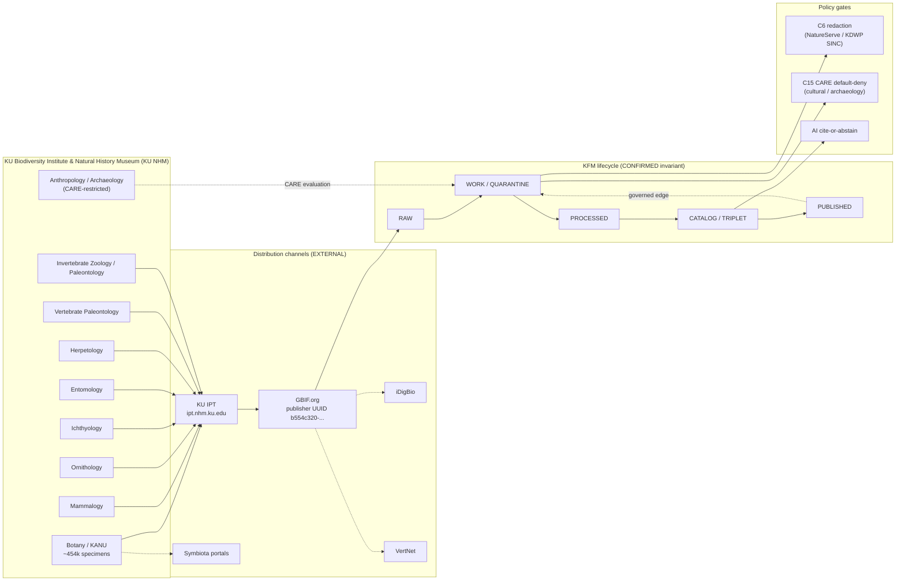

<!-- [KFM_META_BLOCK_V2]
doc_id: kfm://doc/source-catalog/ku-nhm
title: KU Biodiversity Institute & Natural History Museum — Source Catalog Entry
type: standard
version: v1
status: draft
owners: TODO-fauna-flora-stewards
created: 2026-05-20
updated: 2026-05-20
policy_label: public
related:
  - docs/sources/README.md                # PROPOSED — NEEDS VERIFICATION
  - docs/domains/fauna/README.md          # PROPOSED — NEEDS VERIFICATION
  - docs/domains/flora/README.md          # PROPOSED — NEEDS VERIFICATION
  - docs/domains/archaeology/README.md    # PROPOSED — NEEDS VERIFICATION
  - docs/standards/SENSITIVITY_RUBRIC.md  # PROPOSED in corpus (C6-01); not yet authored
  - docs/runbooks/fauna/SOURCE_REFRESH_RUNBOOK.md  # CONFIRMED authored (prior session)
tags: [kfm, source-catalog, biodiversity, fauna, flora, archaeology, kansas-first]
notes:
  - PROPOSED path per Directory Rules §7 ("docs/sources/ — source-descriptor standards, source families")
  - Catalog subfolder convention NEEDS VERIFICATION against repo evidence
  - Spec hash to be computed at promotion
[/KFM_META_BLOCK_V2] -->

# KU Biodiversity Institute & Natural History Museum — Source Catalog Entry

Canonical reference card for the **University of Kansas Biodiversity Institute and Natural History Museum** ("KU NHM" / institution code **KU**) as a Kansas-first source family within the KFM source catalog.


> **Status:** `draft` — initial authoring · **Owners:** `TODO-fauna-flora-stewards` (placeholder) · **Last updated:** 2026-05-20

---

## Mini-TOC

1. [Why this catalog entry exists](#1-why-this-catalog-entry-exists)
2. [Identity & summary](#2-identity--summary)
3. [Source families covered](#3-source-families-covered)
4. [Access points & distribution channels](#4-access-points--distribution-channels)
5. [KFM source-role assignment](#5-kfm-source-role-assignment)
6. [SourceDescriptor mapping (PROPOSED)](#6-sourcedescriptor-mapping-proposed)
7. [Sensitivity, redaction & CARE posture](#7-sensitivity-redaction--care-posture)
8. [Lifecycle placement & cadence](#8-lifecycle-placement--cadence)
9. [Rights, licensing & citation](#9-rights-licensing--citation)
10. [Relationship diagram](#10-relationship-diagram)
11. [Open questions register](#11-open-questions-register)
12. [Related KFM doctrine](#12-related-kfm-doctrine)
13. [External sources consulted](#13-external-sources-consulted)
14. [Footer](#footer)

---

## 1. Why this catalog entry exists

KFM doctrine names the **KU Biodiversity Institute and Natural History Museum** as a Kansas-first **domain authority of last resort** for biodiversity entities not covered by federal or international authorities. The corpus calls for *"compact reference cards with canonical IDs, access points, publisher, license, retrieval time, and `spec_hash`"* for major public science data sources (KFM-P29-IDEA-0013, PROPOSED). This file is that reference card.

> [!NOTE]
> **CONFIRMED (doctrine):** KU NHM is listed in the Kansas biodiversity stack (C10-06) alongside GBIF, iNaturalist, eBird EBD, NatureServe, USFWS, iDigBio, Symbiota, and the Sternberg Museum at FHSU. It is also explicitly named under C7-10 Kansas-First Domain Authorities.

| Why it matters | Where in doctrine |
|---|---|
| Kansas-specific authority carries occurrence-level provenance and taxonomic detail that federal/international aggregators *aggregate away*. | Pass-10 C7-10 (CONFIRMED) |
| The biodiversity domain is where the C6 sensitivity machinery and C7 authority anchoring are exercised most heavily. | Pass-10 C10-06 (CONFIRMED) |
| Specimen-backed records anchor against citizen-science noise (eBird, iNaturalist) in dedupe and trust weighting. | KFM-P2-IDEA-0020 (CONFIRMED) |
| Archaeology/cultural-artifact holdings at KU trigger CARE / Indigenous-data-sovereignty obligations. | C15-01, C15-03 (CONFIRMED) |

[Back to top](#mini-toc)

---

## 2. Identity & summary

| Field | Value | Label |
|---|---|---|
| **KFM source id** | `kfm:src/ku-nhm` | PROPOSED |
| **Display name** | University of Kansas Biodiversity Institute and Natural History Museum | EXTERNAL biodiversity.ku.edu  |
| **Short name** | KU NHM | CONFIRMED in corpus |
| **Darwin Core `institutionCode`** | `KU` | EXTERNAL demo.gbif.org institution record  |
| **Index Herbariorum acronym** (Botany only) | `KANU` (R.L. McGregor Herbarium) | EXTERNAL biodiversity.ku.edu/botany/collections  |
| **Homepage** | <https://biodiversity.ku.edu/> | EXTERNAL biodiversity.ku.edu  |
| **GBIF publisher UUID** | `b554c320-0560-11d8-b851-b8a03c50a862` (publisher since 3 May 2010) | EXTERNAL gbif.org/publisher record  |
| **GBIF institution UUID** | `49fb6451-91b7-4af2-8cd3-354539a77589` | EXTERNAL scientific-collections.gbif.org  |
| **IPT endpoint (Darwin Core Archives)** | <http://ipt.nhm.ku.edu/> | EXTERNAL ipt.nhm.ku.edu landing page  |
| **Location** | Dyche Hall, 1345 Jayhawk Boulevard, Lawrence, KS 66045 | EXTERNAL demo.gbif.org institution record  |
| **Founded** | 1873 | EXTERNAL demo.gbif.org institution record  |
| **Holdings (institution-wide)** | "over 11 million plant, fungi, animal and fossil specimens, plus 2 million archaeological artifacts" | EXTERNAL biodiversity.ku.edu/collections  |
| **Citation norms** | <https://biodiversity.ku.edu/research/university-kansas-biodiversity-institute-data-publication-and-use-norms> | EXTERNAL KU data publication & use norms  |
| **`spec_hash`** | TODO — compute at promotion per ADR-0001 / C1-02 | PROPOSED |

> [!IMPORTANT]
> **Conflict surfaced (NEEDS VERIFICATION):** The KFM corpus cites *"approximately 454,000 specimens at the KU Biodiversity Institute Natural History Museum"* (Pass-10 C10-06, with §9.5 already flagging the count for verification). KU's institutional collections page reports over 11 million plant, fungi, animal and fossil specimens plus 2 million archaeological artifacts.  The 454,000 figure is consistent with the **R.L. McGregor Herbarium (KANU) alone**, not the institution: "The R.L. McGregor Herbarium (Index Herbariorum: KANU) houses approximately 454,000 plant specimens."  KFM should treat the corpus's institution-level number as **likely a KANU-vs-institution conflation** and resolve via ADR or corrigendum.

[Back to top](#mini-toc)

---

## 3. Source families covered

KU NHM is a **multi-division institution**; KFM treats it as a *parent source family* with per-division **sub-sources** (one `SourceDescriptor` per division per dataset, per the per-source-watcher principle in KFM-P2-IDEA-0019).

> [!NOTE]
> The list below is sourced from KU's external division pages (EXTERNAL). The institution-wide GBIF demo record lists *"12 collections"* demo.gbif.org institution record  — KFM should reconcile the division list against the live GBIF publisher dataset list at promotion time.

| Division | Scale (EXTERNAL) | KFM domain (CONFIRMED doctrine) | Primary KFM source-role |
|---|---|---|---|
| **Botany / R.L. McGregor Herbarium (KANU)** | ~454,000 plant specimens; ~65% from grassland biome of central North America  | Flora | observation |
| **Mammalogy** | 5th largest mammal collection in North America; 3rd largest university collection in world  | Fauna | observation |
| **Ornithology** | 85,000+ study skins, 33,000+ osteological specimens, ~35,000 frozen tissue samples  | Fauna | observation |
| **Ichthyology** | more than 45,000 cataloged lots  | Fauna | observation |
| **Entomology** | over a million individually digitized specimens, representing less than a quarter of physical holdings  | Fauna | observation |
| **Vertebrate Paleontology** | approximately 160,000 specimens and nearly 600 types  | Geology / Fauna (deep-time) | observation |
| **Herpetology, Invertebrate Zoology, Invertebrate Paleontology, Microbial Genomics, etc.** | NEEDS VERIFICATION — confirm full division list against KU GBIF publisher datasets | Fauna / Flora / Geology | observation |
| **Anthropology / Archaeology (cultural artifacts)** | 2 million cultural artifacts  | Archaeology / People-DNA-Land | **CARE-restricted** — see §7 |

[Back to top](#mini-toc)

---

## 4. Access points & distribution channels

KU NHM is a **multi-channel publisher**. KFM watchers must select the channel appropriate to each division and dataset.

| Channel | Use | Cadence (EXTERNAL / NEEDS VERIFICATION) | KFM ingest pattern (PROPOSED) |
|---|---|---|---|
| **GBIF.org datasets** (per division, DOI-anchored) | Authoritative DwC-A snapshots with version + DOI; e.g. KUBI Mammalogy dataset DOI `10.15468/a3woj7`  | Per-division release cadence; per-version DOI | Conditional GET on dataset metadata; pin DOI in `EvidenceBundle`; `spec_hash` over canonicalized DwC-A. (C3-01, C3-02) |
| **KU IPT (Integrated Publishing Toolkit)** | Direct DwC-A publication endpoint operated by KU; "University of Kansas Biodiversity Institute natural history collections published via Darwin Core Archive files"  | Per-resource update cadence | Watcher with ETag / Last-Modified on resource RSS / EML; receipt on no-op. (C3-01, KFM-P29-IDEA-0002) |
| **iDigBio** | Aggregator surface; "Specimen data can be searched through iDigBio, GBIF, or our Specify database"  | iDigBio aggregation cadence | Use as cross-check only; never as primary if KU IPT/GBIF dataset exists. |
| **VertNet** | Listed alongside Specify and GBIF for KU specimen data  | Aggregator cadence | Vertebrate divisions only; cross-check. |
| **Symbiota portals** | "over 50 Symbiota portals have been used to mobilize 90 million biological specimen records from 1,800 collections worldwide";  KU also operates Symbiota Support Hub | Per-portal cadence | Botany / Mycology / Lichen — match per-portal terms. |
| **Specify (Collection Object Database)** | Institutional collection-management system surface  | n/a — not a public publishing endpoint per se | Treat as upstream of IPT; do not bypass IPT/GBIF to scrape. |
| **Discover Life** | Listed as Entomology external aggregator alongside GBIF and iDigBio  | Aggregator cadence | Cross-check; Entomology context. |
| **Direct loan / curatorial contact** | Per-division contact details published on each division page | Manual / curatorial | Out-of-band; record any received material with full provenance. |

> [!TIP]
> **Default channel = GBIF dataset DOI.** GBIF dataset DOIs provide stable, citable, version-anchored access; per the corpus, the GBIF Backbone is the taxonomy crosswalk fallback when ITIS is silent (C7-08 CONFIRMED). Prefer GBIF dataset DOI as the **canonical retrieval URI** and IPT as the **freshness probe**.

[Back to top](#mini-toc)

---

## 5. KFM source-role assignment

KFM source-role taxonomy (PROPOSED descriptor surface, per Pass-23/32 §24.1.3): `observed | regulatory | modeled | aggregate | administrative | candidate | synthetic`.

| KU division class | Assigned `source_role` | Notes |
|---|---|---|
| Specimen-backed biological collections (Botany, Mammalogy, Ornithology, Ichthyology, Herpetology, Entomology, Vertebrate Paleontology, Invertebrate Paleontology, etc.) | `observed` | Each occurrence is a vouchered specimen with collector, date, locality. CONFIRMED doctrine treats these as specimen-backed authoritative observations (KFM-P2-IDEA-0020). |
| Anthropology / Archaeology cultural artifacts | `observed` **plus** `role_care_restricted: true` | Material observed in collection; *publication* gated by CARE rules (C15-03). Public surfacing of precise provenance NEEDS curatorial review. |
| KU-derived secondary aggregations (e.g., institution-wide reports, summary publications cited as data) | `aggregate` (when used) | Set `role_aggregation_unit` (taxonomic, geographic, or temporal scope token). Pass-23/32 §24.1.3 forbids using these as per-place truths. |

> [!CAUTION]
> **Role-purity is not optional.** Per Pass-23/32 doctrine, `source_role` is *"Set at admission. Never edited in-place; corrections must produce a new descriptor and a CorrectionNotice."* A KU specimen record must not be silently reclassified from `observed` to `aggregate` (or vice versa) by downstream code.

[Back to top](#mini-toc)

---

## 6. SourceDescriptor mapping (PROPOSED)

The fields below are the KFM **PROPOSED** `SourceDescriptor` shape for KU NHM, mapped against KFM-P28-PROG-0012 (*"source_descriptor.schema.json … source URI, ETag, Last-Modified, retrieval window, source posture, and `kfm:spec_hash`"*) and Pass-23/32 §24.1.3 role fields.

> [!IMPORTANT]
> **Schema home.** Per Directory Rules §7.4 and ADR-0001, the canonical schema home defaults to `schemas/contracts/v1/source/source-descriptor.json`. Actual file presence, field names, required-ness, and validator behavior are **NEEDS VERIFICATION**.

<details>
<summary><b>Show illustrative descriptor stub (PROPOSED, not authoritative)</b></summary>

```yaml
# kfm://source-descriptor/ku-nhm/<division>/<dataset>@<version>
# This is an ILLUSTRATIVE PROPOSED descriptor. Field names, required-ness, and
# enum vocabularies are PROPOSED per Pass-23/32 §24.1.3 and KFM-P28-PROG-0012;
# NEEDS VERIFICATION against the mounted SourceDescriptor schema.

kfm_source_id:        kfm:src/ku-nhm/mammalogy/kubi-mammals
parent_source_id:     kfm:src/ku-nhm                       # institution-level parent
display_name:         "KUBI Mammalogy Collection"          # CONFIRMED EXTERNAL (GBIF)
institution_code:     KU                                    # DwC institutionCode
collection_code:      <KU-CC>                              # NEEDS VERIFICATION
publisher:            "University of Kansas Biodiversity Institute"
gbif_publisher_uuid:  b554c320-0560-11d8-b851-b8a03c50a862  # EXTERNAL
gbif_dataset_doi:     "https://doi.org/10.15468/a3woj7"     # EXTERNAL example
source_uri:           "https://www.gbif.org/dataset/1d04e739-98a9-4e16-9970-8f8f3bf9e9e3"
retrieval_validators:
  etag:               "<set-by-watcher>"
  last_modified:      "<set-by-watcher>"
  content_length:     "<set-by-watcher>"
retrieval_window:
  policy:             "monthly-or-on-version-change"        # PROPOSED
  last_check:         "<set-by-watcher>"
  last_change:        "<set-by-watcher>"
source_role:          observed                              # Pass-23/32 §24.1.3
role_authority:       "University of Kansas Biodiversity Institute"
role_care_restricted: false                                 # true for Anthropology/Archaeology
sensitivity_default:  0                                     # Per-record overrides via C6 rubric
license:              "<dataset-specific; see GBIF metadata>" # NEEDS VERIFICATION per dataset
rights_holder:        "University of Kansas Biodiversity Institute"  # DwC rightsHolder per KU norms
citation_required:    true
citation_template:    "<see §9>"
kfm:spec_hash:        "<computed at promotion: JCS+SHA-256>"
```

</details>

### Field highlights

- **`source_role` = `observed`** for all specimen-backed divisions — *do not* default to `aggregate` even when the dataset is large, because each row is a vouchered observation.
- **`role_care_restricted` = `true`** for Anthropology / Archaeology cultural artifacts — triggers OPA default-deny per C15-03.
- **`retrieval_window.policy`** is **PROPOSED**; concrete debounce windows are flagged unresolved in Pass-10 §9.3 ("the right window is per-source") and remain open.
- **`citation_template`** must conform to KU's published norms (see §9), or KFM is in violation of KU's stated data-use community expectations.

[Back to top](#mini-toc)

---

## 7. Sensitivity, redaction & CARE posture

### 7.1 C6 sensitivity (biological divisions)

KU specimen occurrences carry the **C6 sensitivity rubric 0–5** like all KFM biodiversity records (CONFIRMED — C6-01).

| Rank | Profile (CONFIRMED corpus) | Applies to KU records when… |
|---|---|---|
| 0 | public / open | Common, non-listed taxa with no special concern. |
| 1 | common non-sensitive | Default for most KU specimens. |
| 2 | watchlist | Taxa flagged by KBS Natural Heritage Inventory or under monitoring. |
| 3 | SINC / locally sensitive (default `profile:sinc-obscure-10km`) | KDWP SINC species (S3 / regional concern). |
| 4 | threatened / rare (strict mask or embargo) | NatureServe S1–S2 or USFWS listed species. |
| 5 | sacred / critical (fail-closed; no map/timeline exposure) | Determined by curatorial / community authority; **not auto-derivable**. |

> [!WARNING]
> **Per Pass-10 C10-06 (CONFIRMED):** *"apply C6 redaction for any species that NatureServe or KDWP SINC ranks at S1/S2 sensitivity."* KU records of S1/S2 species must enter via WORK/QUARANTINE and reach PUBLISHED only after redaction is applied through a versioned profile (e.g., `point_10km_hex_seeded_v1`, `centroid_1km_v1`) with a receipt — **never as raw coordinates**.

### 7.2 CARE posture (cultural / archaeological holdings)

KU NHM's 2 million cultural artifacts  implicate KFM's CARE machinery:

- **MetaBlock v2 CARE fields are MUST-populate** for any artifact from this division (C15-01, CONFIRMED).
- **OPA default-deny** applies to any asset declaring a non-empty `authority_to_control` (C15-03, CONFIRMED).
- **Curatorial review is required** — the corpus is explicit that CARE-applicability is a curatorial judgment, not an engineering one (C15-01 tensions).
- **Precise-location exposure** for archaeology sites is restricted per the AI Build Operating Contract §13 (Publication, Rights, and Sensitivity).

### 7.3 Living-people overlap (DNA / genomic specimens)

If any KU division (e.g., ornithology frozen-tissue, mammalogy tissue) holds material with identifiable human-subject linkage (NEEDS VERIFICATION), the C9/C6 living-people and DTC-DNA rules apply and the descriptor's sensitivity floor rises accordingly.

[Back to top](#mini-toc)

---

## 8. Lifecycle placement & cadence

KU NHM data flows through the standard KFM lifecycle (CONFIRMED invariant):

> **RAW → WORK / QUARANTINE → PROCESSED → CATALOG / TRIPLET → PUBLISHED**
>
> Promotion is a **governed state transition, not a file move.** (Directory Rules §0 / Invariant)

| Stage | KU-specific notes (PROPOSED unless cited) |
|---|---|
| **RAW** | DwC-A pulled from GBIF DOI or KU IPT; original archive bytes preserved with `spec_hash`, ETag, Last-Modified. (CONFIRMED principle — C3-01, C3-02) |
| **WORK / QUARANTINE** | License/rights check; CARE evaluation for cultural divisions; sensitive-taxon flagging against NatureServe + KDWP SINC; ITIS / GBIF Backbone anchoring (C7-07, C7-08 CONFIRMED). |
| **PROCESSED** | DwC fields normalized; KFM identity rule applied (per-domain object families); redaction profile applied to S1/S2 records before any public-facing derivative. |
| **CATALOG / TRIPLET** | STAC `kfm:provenance` item per dataset version (C4-01 CONFIRMED); DCAT distribution; PROV-O lineage; CIDOC-CRM E20/E22/E53 mapping for cultural artifacts. |
| **PUBLISHED** | Cite-or-abstain enforced at AI surfaces; PMTiles for map layers gated by render-time PDP introspection (C6-08); no `PUBLISHED` edge to WORK / QUARANTINE (CONFIRMED invariant). |

**Cadence (PROPOSED):** GBIF dataset versions are typically released monthly to quarterly per division; the KFM watcher should default to **weekly conditional-GET on dataset metadata** with `EvidenceBundle` no-op receipts emitted on unchanged ETag (per KFM-P29-FEAT-0003 PROPOSED).

[Back to top](#mini-toc)

---

## 9. Rights, licensing & citation

### 9.1 Citation requirement (EXTERNAL — binding on KFM)

KU publishes explicit **data publication and use norms**. KFM is bound by them as a downstream consumer.

> "As is best practice in scientific research, cite the data you are using … cite the data publisher (institutionCode and rightsHolder), the dataset name (datasetName), the link to the dataset (datasetID), and the record id (catalogNumber or occurrenceID)." 

KFM citation template (PROPOSED, conforming to KU norms):

```text
[catalogNumber], [datasetName] from University of Kansas Biodiversity Institute
([datasetID]) (accessed on [retrieval_window.last_change]).
```

### 9.2 License (NEEDS VERIFICATION per dataset)

Licenses are **per-dataset** in GBIF metadata, not institution-wide. The watcher MUST extract and pin the license string per `SourceDescriptor` instance. Do **not** assume a single institutional license.

### 9.3 Rights holder

`dwc:rightsHolder = "University of Kansas Biodiversity Institute"` per KU norms.  Preserve verbatim in CATALOG records and PUBLISHED derivatives.

[Back to top](#mini-toc)

---

## 10. Relationship diagram



> [!NOTE]
> The diagram reflects **CONFIRMED doctrine** (lifecycle, policy gates) and **EXTERNAL channel facts** (GBIF / IPT / iDigBio / VertNet / Symbiota). Specific routes inside KFM (e.g., which validator owns the `CARE evaluation` edge) are **NEEDS VERIFICATION** against mounted repo evidence.

[Back to top](#mini-toc)

---

## 11. Open questions register

| ID | Question | Status |
|---|---|---|
| OPEN-KU-01 | **KANU vs institution conflation.** Should the corpus's "~454k at KU NHM" (Pass-10 C10-06) be corrected via ADR or corrigendum to read "~454k at KANU"? | NEEDS VERIFICATION; surfaced this session. |
| OPEN-KU-02 | **Full division list.** GBIF reports "12 collections"; this entry enumerates ~9 confidently. Confirm the remaining divisions and bind each to a KFM domain. | NEEDS VERIFICATION |
| OPEN-KU-03 | **Per-dataset license inventory.** What is the license string for each KU GBIF dataset? Watcher must extract per descriptor; no institution-wide default. | NEEDS VERIFICATION |
| OPEN-KU-04 | **Retrieval cadence per division.** GBIF dataset version cadence varies; a single weekly probe vs per-division schedule. | PROPOSED |
| OPEN-KU-05 | **Symbiota portal identity.** Which Symbiota portals does KU operate vs participate in? Bind each portal to a `SourceDescriptor`. | NEEDS VERIFICATION |
| OPEN-KU-06 | **Tribal / community authority overlap on archaeology holdings.** Which named authority/authorities populate `authority_to_control` for the 2M cultural artifacts? | NEEDS VERIFICATION — curatorial decision per C15-01 |
| OPEN-KU-07 | **Frozen tissue / genomic linkage.** Do any KU divisions hold material with identifiable-human linkage triggering C9 DTC-DNA rules? | UNKNOWN |
| OPEN-KU-08 | **IPT-vs-GBIF freshness lag.** Empirically, how much lag exists between KU IPT publication and GBIF dataset version availability? Drives watcher targeting. | NEEDS VERIFICATION |
| OPEN-KU-09 | **EBird / GBIF-mediated duplication.** When KU ornithology records reach GBIF and KU is also an eBird-via-GBIF flow, how is dedupe arbitrated? | PROPOSED — see KFM-P2-IDEA-0020 |
| OPEN-KU-10 | **`catalog/` subfolder convention.** Is `docs/sources/catalog/<source>.md` the established pattern, or should reference cards sit flat under `docs/sources/`? | PROPOSED — directory rules show `docs/sources/` but no subfolder convention is asserted |

[Back to top](#mini-toc)

---

## 12. Related KFM doctrine

| KFM reference | Topic | Status (corpus) |
|---|---|---|
| Pass-10 **C10-06** | Biodiversity Stack (GBIF, iNaturalist, eBird EBD, NatureServe, USFWS, iDigBio, Symbiota, KU NHM, FHSU Sternberg) | CONFIRMED |
| Pass-10 **C7-10** | Kansas-First Domain Authorities (KSHS, KHRI, KU Biodiversity Institute, KBS, KDWP SINC) | CONFIRMED |
| Pass-10 **C7-07 / C7-08** | ITIS TSN; GBIF Backbone Taxonomy as taxonomic anchors | CONFIRMED |
| Pass-10 **C6-01 … C6-04** | Sensitivity rubric; named redaction profiles; seeded jitter; grid generalization | CONFIRMED |
| Pass-10 **C15-01 / C15-03** | MetaBlock v2 CARE fields; OPA default-deny on CARE-tagged assets | CONFIRMED |
| Pass-10 **C4-01** | STAC `kfm:provenance` namespace | CONFIRMED |
| **KFM-P28-PROG-0012** | `source_descriptor.schema.json` design surface | PROPOSED |
| **KFM-P29-IDEA-0013** | Canonical source reference cards | PROPOSED |
| **KFM-P2-IDEA-0020** | eBird as coverage-layer; KU/specimen-backed records dominate dedupe | PROPOSED / CONFIRMED |
| **KFM-P19-PROG-0014** | Register KU specimen holdings, NatureServe, GAP as distinct source-role families | PROPOSED |
| **Pass-23/32 §24.1.3** | Roles to source-descriptor fields (`source_role`, `role_authority`, …) | PROPOSED |
| **Directory Rules §7** | `docs/sources/` — source-descriptor standards, source families | CONFIRMED location root |
| **AI Build Operating Contract §10–§13** | Core invariants, governed AI rule, publication & sensitivity, change discipline | CONFIRMED |

[Back to top](#mini-toc)

---

## 13. External sources consulted

External research was used **only** to ground operationally current external facts about the source itself (publisher identity, access endpoints, holdings statements, citation norms), per the prompt's external-research triggers. No external content was used to make KFM-internal repo-state or doctrine claims.

<details>
<summary><b>Show external sources (each with trigger, source, what it informed)</b></summary>

| # | Trigger | Source | Informed |
|---|---|---|---|
| 1 | Operationally current institution identity & holdings claim | <https://biodiversity.ku.edu/collections> | Institution-wide holdings figure ("11M+ specimens, 2M artifacts"); discovery of the 454k conflict |
| 2 | Operationally current access endpoint (institutional GBIF publisher) | <https://www.gbif.org/publisher/b554c320-0560-11d8-b851-b8a03c50a862> | GBIF publisher UUID; "publisher since 3 May 2010"; admin & technical contact |
| 3 | Operationally current GBIF scientific-collections record | <https://scientific-collections.gbif.org/institution/49fb6451-91b7-4af2-8cd3-354539a77589> | GBIF institution UUID |
| 4 | Per-division scale (Botany / KANU) | <https://biodiversity.ku.edu/botany/about> | KANU 454k figure (resolving the corpus's institution-level claim) |
| 5 | Per-division scale (Mammalogy) and DOI example | <https://www.gbif.org/dataset/1d04e739-98a9-4e16-9970-8f8f3bf9e9e3> | Mammalogy ranking; DwC-A; dataset DOI `10.15468/a3woj7` |
| 6 | Per-division scale (Ornithology, Ichthyology, Entomology, Vertebrate Paleontology) | KU division pages under <https://biodiversity.ku.edu/> | Division-specific specimen counts and tissue/osteological figures |
| 7 | Citation norms (binding on downstream consumers) | <https://biodiversity.ku.edu/research/university-kansas-biodiversity-institute-data-publication-and-use-norms> | Citation template fields (institutionCode, datasetName, datasetID, catalogNumber); rightsHolder |
| 8 | KU IPT publishing endpoint | <http://ipt.nhm.ku.edu/> | IPT endpoint identity for DwC-A publication |
| 9 | Symbiota context | <https://biodiversity.ku.edu/products-services>, <https://www.ncbi.nlm.nih.gov/pmc/articles/PMC4092327/> | Symbiota platform role; KU's hub involvement |
| 10 | Institution-record secondary | <https://demo.gbif.org/institution/49fb6451-91b7-4af2-8cd3-354539a77589> | Founding date (1873); address; "12 collections" headcount |

</details>

[Back to top](#mini-toc)

---

## Footer

> [!NOTE]
> **Truth label summary.** *Doctrine and KFM invariants:* CONFIRMED from the attached Pass-10/23/32 corpus and the AI Build Operating Contract. *Path, schema home, descriptor field surface, watcher cadence, sub-source enumeration completeness:* PROPOSED or NEEDS VERIFICATION pending mounted-repo evidence. *Institution identity, access endpoints, holdings figures, citation norms:* EXTERNAL with inline citations to KU and GBIF sources.

**Related docs (placeholders pending verification):**

- [`docs/sources/README.md`](../../README.md) — source-family overview (NEEDS VERIFICATION)
- [`docs/domains/fauna/README.md`](../../../domains/fauna/README.md) — fauna domain dossier (NEEDS VERIFICATION)
- [`docs/domains/flora/README.md`](../../../domains/flora/README.md) — flora domain dossier (NEEDS VERIFICATION)
- [`docs/domains/archaeology/README.md`](../../../domains/archaeology/README.md) — archaeology domain dossier (NEEDS VERIFICATION)
- [`docs/runbooks/fauna/SOURCE_REFRESH_RUNBOOK.md`](../../../runbooks/fauna/SOURCE_REFRESH_RUNBOOK.md) — fauna source-refresh runbook (CONFIRMED authored prior session)
- [`docs/standards/SENSITIVITY_RUBRIC.md`](../../../standards/SENSITIVITY_RUBRIC.md) — PROPOSED in corpus (C6-01); not yet authored
- [`schemas/contracts/v1/source/source-descriptor.json`](../../../../schemas/contracts/v1/source/source-descriptor.json) — canonical schema home per Directory Rules §7.4 / ADR-0001 (NEEDS VERIFICATION)

*Last updated: 2026-05-20.*
*[Back to top](#ku-biodiversity-institute--natural-history-museum--source-catalog-entry)*
