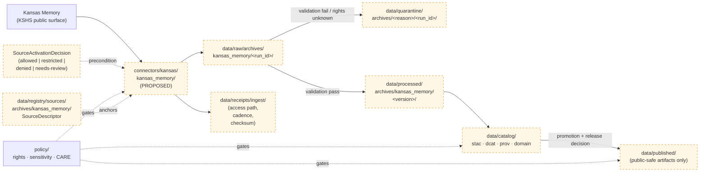

<!-- [KFM_META_BLOCK_V2]
doc_id: kfm://doc/source-family/kansas-memory
title: Kansas Memory — Source Family
type: standard
version: v0.1
status: draft
owners: <Source Registry Steward — TODO assign>, <Archives Domain Lead — TODO assign>
created: 2026-05-13
updated: 2026-05-13
policy_label: public
related:
  - docs/sources/README.md
  - docs/sources/catalog/khri.md
  - docs/sources/catalog/spencer.md
  - docs/sources/catalog/ksu_special_collections.md
  - docs/sources/catalog/wsu_special_collections.md
  - docs/sources/catalog/loc_iiif.md
  - docs/standards/snac-eac-cpf.md
  - docs/domains/archaeology/README.md
  - docs/doctrine/truth-posture.md
  - docs/doctrine/lifecycle-law.md
  - control_plane/source_authority_register.yaml
  - data/registry/sources/archives/kansas_memory/source_descriptor.yaml
tags: [kfm, source-family, archives, kansas, kshs, c10-07]
notes:
  - "PROPOSED placement under docs/sources/catalog/; the catalog/ subdivision is not codified in Directory Rules §6.1."
  - "Item-count, API surface, rights terms remain on the medium-priority verification backlog."
[/KFM_META_BLOCK_V2] -->

# Kansas Memory — Source Family

> Source-family record for the **Kansas State Historical Society's Kansas Memory** digital collection — the largest single source for digitized Kansas historical materials in the KFM Archives Stack (C10-07).

<!-- Badges: placeholders permitted per presentation standard; targets unverified -->


| Field | Value |
|---|---|
| **Status** | `draft` (PROPOSED source-family record; not activated) |
| **Owners** | Source Registry Steward · Archives Domain Lead — **TODO assign** |
| **Updated** | 2026-05-13 |
| **Lifecycle invariant** | RAW → WORK / QUARANTINE → PROCESSED → CATALOG / TRIPLET → PUBLISHED |
| **Activation gate** | `SourceActivationDecision` required before any connector emits public-path output |

---

## Quick jump

- [1. Scope](#1-scope)
- [2. Repo fit](#2-repo-fit)
- [3. Source identity](#3-source-identity)
- [4. Source role and authority posture](#4-source-role-and-authority-posture)
- [5. Access methods and ingest topology](#5-access-methods-and-ingest-topology)
- [6. Rights, attribution, and public release](#6-rights-attribution-and-public-release)
- [7. Sensitivity and CARE considerations](#7-sensitivity-and-care-considerations)
- [8. Authority anchoring](#8-authority-anchoring)
- [9. Lifecycle expectations](#9-lifecycle-expectations)
- [10. Related sources in the Archives Stack](#10-related-sources-in-the-archives-stack)
- [11. Implementation status](#11-implementation-status)
- [12. Verification backlog](#12-verification-backlog)
- [13. Open questions](#13-open-questions)
- [14. Related docs](#14-related-docs)
- [Appendix A — Compact source descriptor sketch](#appendix-a--compact-source-descriptor-sketch)
- [Appendix B — Glossary of terms used here](#appendix-b--glossary-of-terms-used-here)

---

## 1. Scope

**CONFIRMED doctrine.** This document is the human-facing **source-family record** for KSHS Kansas Memory. It describes who publishes the source, what KFM ingests from it, what role it plays in the C10-07 Archives Stack, how it travels through the lifecycle, and which governance gates it must clear before any public-path use.

**What this document is.**

- A `docs/sources/` human-facing description of the source family (per Directory Rules §6.1: *"source-descriptor standards, source families"*).
- The narrative companion to the machine-readable `SourceDescriptor` that will live (PROPOSED) under `data/registry/sources/archives/kansas_memory/`.
- An anchor for downstream connector code, schemas, validators, fixtures, and policy rules.

**What this document is not.**

- It is **not** the SourceDescriptor itself; that is a structured artifact under `data/registry/sources/` (PROPOSED path).
- It is **not** the connector implementation; that lives under `connectors/kansas/` (PROPOSED path).
- It is **not** a release decision; promotion is governed by `SourceActivationDecision` and downstream gates.
- It is **not** authority for rights, sensitivity, or release class — those live in `policy/`, `data/registry/rights/`, and `data/registry/sensitivity/`.

> [!IMPORTANT]
> **Source role cannot be inferred from convenience.** A source-family doc is a *description*, not an admission decision. Connectors and watchers must remain inactive until a `SourceActivationDecision` exists for Kansas Memory, validators are in place, and policy gates have been wired.

[↑ Back to top](#quick-jump)

---

## 2. Repo fit

### 2.1 This file

| Field | Value | Status |
|---|---|---|
| **Path** | `docs/sources/catalog/kansas_memory.md` | PROPOSED — see §2.3 |
| **Responsibility root** | `docs/` (human-facing control plane) | CONFIRMED — Directory Rules §6.1 |
| **Subdivision** | `docs/sources/` | CONFIRMED — Directory Rules §6.1 lists `sources/` as a `docs/` lane |
| **Sub-subdivision** | `docs/sources/catalog/` | PROPOSED — not codified in Directory Rules |
| **Doc type** | Standard doc (KFM Meta Block v2 applies) | CONFIRMED |
| **Authority class** | Descriptive (explains); not normative (does not decide admissibility) | CONFIRMED |

### 2.2 Upstream and downstream

```text
                       ┌────────────────────────────────┐
                       │   docs/doctrine/                │
                       │   ├─ authority-ladder.md        │
                       │   ├─ truth-posture.md           │
                       │   └─ lifecycle-law.md           │
                       └────────────┬───────────────────┘
                                    │ governs
                                    ▼
                       ┌────────────────────────────────┐
                       │   docs/sources/README.md        │
                       │   (source-family index)         │
                       └────────────┬───────────────────┘
                                    │ contains
                                    ▼
                       ┌────────────────────────────────┐
                       │   docs/sources/catalog/         │  ◀── you are here
                       │   kansas_memory.md              │
                       └────────────┬───────────────────┘
                                    │ anchors
                  ┌─────────────────┼──────────────────────┐
                  ▼                 ▼                      ▼
         data/registry/    connectors/kansas/        schemas/contracts/v1/
         sources/          kansas_memory/            source/
         archives/         (PROPOSED)                source_descriptor.schema.json
         kansas_memory/                              (PROPOSED per ADR-0001)
         (PROPOSED)
```

### 2.3 PROPOSED `catalog/` subdivision

The `catalog/` subdirectory under `docs/sources/` is **PROPOSED** organization. Directory Rules §6.1 lists `docs/sources/` as the lane for *"source-descriptor standards, source families"* but does not codify an internal grouping.

A reasonable PROPOSED grouping is:

| Bucket | Members it would hold |
|---|---|
| `docs/sources/catalog/` | Catalog-style archival and discovery surfaces with item-level metadata (Kansas Memory, KHRI, Spencer, KSU SC, WSU, LOC IIIF) |
| `docs/sources/api/` | Programmatic API sources (USGS NWIS, GBIF, etc.) |
| `docs/sources/feed/` | Streaming or event feeds (GTFS-rt, WZDx) |
| `docs/sources/bulk/` | Bulk file-based exports (SSURGO, RCMAP) |

This grouping is **not authoritative** absent an ADR or a per-root README in `docs/sources/`. If the mounted repo or `docs/sources/README.md` codifies a different grouping, this file should be moved and the change recorded in `docs/registers/DRIFT_REGISTER.md`.

[↑ Back to top](#quick-jump)

---

## 3. Source identity

> [!NOTE]
> The item-count figure of **~600,000** comes from the KFM corpus's normalized statement for **C10-07 Archives Stack** in the Pass 10 Idea Index. The corpus itself flags this count as a medium-priority verification item ("Verify KU NHM, KSU SC, and KSHS Kansas Memory item counts and clarify denominators"), so the number is treated here as **NEEDS VERIFICATION**.

| Field | Value | Status |
|---|---|---|
| **KFM source family ID** | `kansas_memory` (PROPOSED stable slug) | PROPOSED |
| **Publisher** | Kansas State Historical Society (KSHS) | CONFIRMED — corpus |
| **Family name** | Kansas Memory | CONFIRMED — corpus |
| **Category** | C10 Domain Datasets | CONFIRMED — corpus |
| **Subcategory** | C10.g Archives and Cultural Heritage | CONFIRMED — corpus |
| **Stack** | C10-07 Archives Stack | CONFIRMED — corpus |
| **Role in stack** | "Largest single source for digitized Kansas historical materials" | CONFIRMED — corpus |
| **Approximate scale** | ~600,000 digitized items | NEEDS VERIFICATION |
| **Material types** | Digitized historical materials (photographs, documents, maps, periodicals, etc.) | INFERRED — corpus describes "digitized Kansas historical materials" without itemizing types |
| **Public web surface** | KSHS-operated Kansas Memory site | INFERRED — not explicitly URL-cited in corpus |
| **Current access modalities** | Mix per Kansas archives stack: APIs, OAI-PMH, PDFs, CSVs, bespoke agents | CONFIRMED for the stack as a whole; per-source split is NEEDS VERIFICATION for Kansas Memory specifically |

[↑ Back to top](#quick-jump)

---

## 4. Source role and authority posture

### 4.1 Source role classification

| Aspect | Posture | Status |
|---|---|---|
| **Primary source role** | Archival-evidence aggregator: digitized representations of primary historical materials | INFERRED from corpus characterization |
| **Authority weight** | Canonical record for "Kansas Historical Quarterly indexes and Kansas Memory items" | CONFIRMED — corpus |
| **Evidence character** | Source-edge captures referenced by `EvidenceRef`; never sovereign truth in their own right | CONFIRMED doctrine |
| **Sensitivity default** | Review-required; CARE considerations apply for cultural materials, living-person references, sensitive places, and archaeology adjacencies | INFERRED from cross-domain CARE/sensitivity doctrine |
| **AI-inference posture** | AI may summarize or classify referenced items; AI **never** establishes truth, bypasses steward review, publishes, overrides policy, or replaces `EvidenceBundle`s | CONFIRMED doctrine |

### 4.2 Authority within the Kansas authority constellation

**CONFIRMED doctrine.** The corpus emphasizes that *Kansas-first dossiers must run against Kansas-specific authorities even when federal authorities are present, because the local authorities carry detail that federal authorities aggregate away.* Kansas Memory is the canonical home for *Kansas Memory items and Kansas Historical Quarterly indexes*; it does not substitute for, but anchors alongside, the federal authority layer.

> [!TIP]
> KFM convention is to **store the Kansas-authority IRI in parallel with the federal or international anchor** (e.g., LCNAF, VIAF, Wikidata, SNAC). A Kansas Memory item reference does not displace SNAC EAC-CPF anchoring or LCNAF anchoring; it sits next to them in the person/place/event record.

[↑ Back to top](#quick-jump)

---

## 5. Access methods and ingest topology

### 5.1 Stack-wide ingest posture

**CONFIRMED — corpus.** "The KFM ingest approach varies per institution: some publish stable APIs, some publish OAI-PMH, some publish PDFs and CSVs that must be harvested with bespoke agents. The receipt records the access path and the harvest cadence."

Which of those access paths Kansas Memory currently exposes is **NEEDS VERIFICATION**: the corpus describes the stack-wide variability without pinning Kansas Memory specifically to a single modality, and the Pass 10 medium-priority backlog includes *"Document Kansas-authority API stability and harvest cadence per authority."*

### 5.2 Stack-wide dependencies

| Dependency | Status |
|---|---|
| Per-institution access agreements | CONFIRMED requirement — corpus |
| OAI-PMH harvesters | CONFIRMED requirement for OAI-PMH-publishing institutions — corpus |
| Bespoke agents for non-API institutions | CONFIRMED requirement — corpus |
| IIIF v3 viewer integration | CONFIRMED requirement for IIIF-presenting items — corpus |

### 5.3 Connector-side flow (PROPOSED)



**Interpretation.**

- The connector path `connectors/kansas/kansas_memory/` is **PROPOSED** until verified against repo state. Directory Rules §7.3 establishes `connectors/kansas/` as the Kansas connector lane.
- `connectors/` output **MUST** land in `data/raw/<domain>/<source_id>/<run_id>/` or `data/quarantine/...` per Directory Rules §7.3. The connector **MUST NOT** write to `data/processed/`, `data/catalog/`, or `data/published/`.
- Promotion from `data/processed/` to `data/catalog/` to `data/published/` is a **governed state transition**, not a file move. It must pass validators, policy gates, evidence-bundle creation, catalog closure, and release-decision recording.
- The `SourceActivationDecision` is a **precondition** for the connector to run on the public path at all. Without it, the connector remains inactive.

> [!WARNING]
> **Watcher-as-non-publisher applies.** Whatever harvester is built for Kansas Memory must emit receipts and candidate decisions; it **MUST NOT** publish, mutate canonical truth, or write under `data/catalog/` or `data/published/`. Bypassing the trust membrane is a violation of the KFM invariant regardless of where the bytes end up.

[↑ Back to top](#quick-jump)

---

## 6. Rights, attribution, and public release

### 6.1 Rights posture

| Aspect | Posture | Status |
|---|---|---|
| **Per-item license** | Varies by item; some materials are out-of-copyright, others retain restrictions | INFERRED — typical for archival digital collections; **NEEDS VERIFICATION** against current KSHS rights statements |
| **KFM default outcome on unknown rights** | DENY | CONFIRMED doctrine — *"Unknown rights fail closed"* |
| **Attribution requirement** | Attribution to KSHS and originating collection is expected at minimum | INFERRED from standard archival reuse norms; specific KSHS terms NEEDS VERIFICATION |
| **Redistribution posture** | Per-item; **MUST** be recorded in the SourceDescriptor and verified before public release | CONFIRMED doctrine — `RightsDecision` precedes any release |

### 6.2 Public release class

**CONFIRMED doctrine.** Every published KFM dataset or layer derived from Kansas Memory items **MUST** carry:

- A resolved `SourceDescriptor` with rights, role, sensitivity, cadence, access method, and attribution
- A `RightsDecision` per item (or per item-class)
- A `ValidationReport` proving schema, geometry (where applicable), temporal, rights, sensitivity, and evidence checks
- An `EvidenceBundle` that the `EvidenceRef` resolves to
- A `PolicyDecision` of ALLOW (or RESTRICT with documented redaction)
- A `ReleaseManifest` with rollback target

Items lacking any of those **MUST** be quarantined or denied.

### 6.3 What this means in practice

| Situation | Required action |
|---|---|
| Item with explicit public-domain or open license | Eligible for public layer with attribution; still passes the full gate stack |
| Item with restricted or unclear rights | Quarantine; no public derivative until terms resolved |
| Aggregate or derivative work (e.g., a map composed of many Kansas Memory items) | Each underlying item resolved individually; aggregate cannot rely on "fair use as a whole" |
| Embedded living-person references (letters, photographs, oral histories) | Privacy and CARE review required before public release; defaults to DENY for living persons per the Sensitive / Deny-by-Default Register |

[↑ Back to top](#quick-jump)

---

## 7. Sensitivity and CARE considerations

> [!CAUTION]
> Archival materials carry sensitivities that the source publisher may not have flagged. KFM's **fail-closed** posture and **CARE alignment** govern how Kansas Memory items can be republished, mapped, or used to anchor claims.

### 7.1 Applicable sensitivity classes

Per the KFM Sensitive / Deny-by-Default Register (CONFIRMED doctrine), Kansas Memory items may intersect:

| Sensitivity class | Why it can apply to Kansas Memory items | Default outcome |
|---|---|---|
| **Living persons** | Letters, photographs, oral histories, vital records adjacent to living individuals | DENY public exact/identifying output unless legal basis, consent/review, and release state proven |
| **Archaeology / cultural heritage** | Documents referencing archaeological sites, burial grounds, sacred places | DENY exact public location by default |
| **Sacred / culturally sensitive places** | Oral histories, cultural routes, sacred sites mentioned in Kansas Memory items | DENY until steward review and access class approve |
| **Private landowner-sensitive data** | Historical land records that touch operations or owner identity of private parcels | DENY exact/public if private or rights unclear |
| **Source-rights-limited records** | Items with restricted, no-redistribution, or uncertain terms | DENY public release until terms resolved |

### 7.2 CARE alignment

**CONFIRMED doctrine.** The C8 person-place-event graph layer is *"the layer most exposed to the FAIR+CARE tension because identity, kinship, and provenance about Indigenous and marginalized communities live here."* Kansas Memory items that touch Indigenous people, communities, places, or cultural practices **MUST** be reviewed against the CARE Principles for Indigenous Data Governance (Collective Benefit, Authority to Control, Responsibility, Ethics) before any public-path republication.

### 7.3 Transforms and receipts

Any sensitivity-driven transform applied to a Kansas Memory derivative **MUST** record:

- `RedactionReceipt` — policy reference, redaction method, kept fields, removed fields, geometry transform (if any), reviewer
- `TransformReceipt` — for projection or generalization of any associated geometry
- `ReviewRecord` — steward review state, notes, decisions, release/correction references

[↑ Back to top](#quick-jump)

---

## 8. Authority anchoring

### 8.1 Related authorities

| Authority | KFM idea ID | Role in relation to Kansas Memory |
|---|---|---|
| **KSHS (Kansas State Historical Society)** | C7-10 | Publisher; canonical record for Kansas Historical Quarterly indexes and Kansas Memory items |
| **KHRI (Kansas Historic Resources Inventory)** | C7-10 | Canonical inventory of Kansas historic resources (buildings, sites, districts) — anchors place-based references found in Kansas Memory |
| **SNAC + EAC-CPF** | C7-06 | Archive-specific person/corporate-body authority; anchors persons documented through Kansas Memory and other KSHS collections |
| **LCNAF** | C7-02 | National authority for published-work creators that also appear in Kansas Memory |
| **VIAF** | C7-03 | International cross-reference for named persons |
| **GNIS** | C7-09 | Place-name authority for places referenced in Kansas Memory items |
| **CIDOC-CRM** | C8-01 | Graph backbone vocabulary (E5 Event, E7 Activity, E21 Person, E53 Place, E55 Type, E74 Group) for items anchored to the person/place/event graph |
| **Wikidata** | (C7 family) | Web-discoverable cross-reference target |

### 8.2 Anchoring posture

**CONFIRMED doctrine.** For figures whose primary evidentiary footprint is in unpublished archival collections — *frontier settlers, county officials, regional newspaper editors, ranching families* — SNAC is often the only authority that exists. KFM person records anchor to SNAC in addition to LCNAF when published works also survive. **SNAC IDs are first-class identifiers stored next to LCNAF, VIAF, and Wikidata.**

[↑ Back to top](#quick-jump)

---

## 9. Lifecycle expectations

### 9.1 Lifecycle invariant

> **RAW → WORK / QUARANTINE → PROCESSED → CATALOG / TRIPLET → PUBLISHED**

| Phase | What lives here for Kansas Memory | MUST NOT |
|---|---|---|
| `raw/` | Source-edge captures of Kansas Memory items with retrieval metadata, source descriptor reference, checksums, ingest receipts | Public clients · AI context · UI layers · normalized records |
| `work/` | Normalized intermediates, candidate assertions about persons/places/events derived from items | Public API/UI · release aliases |
| `quarantine/` | Items with failed validation, unresolved rights/sensitivity, schema drift, or over-precise geometry references | Promotion candidates without remediation |
| `processed/` | Validated canonical records anchored to authorities | Assumption of public/release status |
| `catalog/` | STAC, DCAT, PROV records, and domain catalog entries | Uncited claims · unclosed identifiers |
| `triplets/` | Relationship projections (person → place → event) backed by Kansas Memory `EvidenceRef`s | Canonical replacement semantics |
| `published/` | Public-safe artifacts only, with `ReleaseManifest`, rollback target, and rights/sensitivity satisfied | Raw items · quarantined items · exact restricted geometry |
| `receipts/`, `proofs/`, `rollback/` | Emitted alongside; record process memory, evidence integrity, and rollback artifacts | Substitute for the release decision itself |

### 9.2 Promotion is a governed state transition

**CONFIRMED doctrine.** Promotion of a Kansas Memory–derived asset is not a file move. A bypass of validators, policy gates, evidence-bundle creation, catalog closure, or release-decision recording is a **violation of the invariant** regardless of which directory the bytes ended up in.

[↑ Back to top](#quick-jump)

---

## 10. Related sources in the Archives Stack

Kansas Memory is one node in the C10-07 Archives Stack. The full stack as recorded in the KFM corpus:

| Source | Cited scale | Subcategory | Notes |
|---|---|---|---|
| **KSHS Kansas Memory** | ~600,000 digitized items (NEEDS VERIFICATION) | C10.g | Largest single source for digitized Kansas historical materials |
| **KHRI (Kansas Historic Resources Inventory)** | Inventory (not item-counted in corpus) | C10.g | Canonical inventory of Kansas historic resources |
| **KU Spencer Research Library** | Archival collections (count NEEDS VERIFICATION) | C10.g | Kenneth Spencer Research Library's archival holdings |
| **KSU Special Collections** | ~1,000,000 items (NEEDS VERIFICATION) | C10.g | Order-of-magnitude larger volume than Kansas Memory per corpus |
| **WSU Special Collections** | Regional holdings (count not cited) | C10.g | Additional regional holdings |
| **County historical societies** | Variable; many lack structured publication | C10.g | "Harvest layer must tolerate manual submission flows for the foreseeable future" |
| **LOC IIIF** | Federal discovery surface | C10.g | Federal-level discovery presentation |
| **SNAC / EAC-CPF** | Cross-archive authority | C7-06 | Cross-archive authority layer for persons, corporate bodies, families |

> [!TIP]
> The Archives Stack documents will live as siblings under `docs/sources/catalog/` (PROPOSED grouping). When a sibling file is created, link it from §10 and from the related-docs section.

[↑ Back to top](#quick-jump)

---

## 11. Implementation status

| Item | Status | Notes |
|---|---|---|
| C10-07 Archives Stack (doctrinal) | CONFIRMED | Pass 10 Idea Index records as CONFIRMED |
| Source role classification for Kansas Memory | INFERRED | Archival aggregator; not synthetic/modeled |
| Kansas Memory `SourceDescriptor` artifact | UNKNOWN | No current-session repo evidence; PROPOSED home is `data/registry/sources/archives/kansas_memory/` |
| Kansas Memory connector | UNKNOWN | No current-session repo evidence; PROPOSED home is `connectors/kansas/kansas_memory/` |
| Validators (schema, rights, sensitivity) | UNKNOWN | Stack-wide validator surface is PROPOSED across the KFM corpus |
| `SourceActivationDecision` | UNKNOWN | Required precondition; not verifiable in current session |
| Connector–pipeline–catalog wiring | UNKNOWN | Not verifiable absent mounted repo |
| Public release of any Kansas Memory–derived layer | UNKNOWN | None confirmed; **MUST** clear the full gate stack first |

> [!NOTE]
> This document presents **doctrine confidently** where the corpus supports it, and keeps **implementation maturity bounded**. No claim above asserts that the Kansas Memory pipeline exists in the mounted repository.

[↑ Back to top](#quick-jump)

---

## 12. Verification backlog

| # | Item | Priority | Source |
|---|---|---|---|
| 1 | Verify Kansas Memory item count and clarify denominator | Medium | Pass 10 Backlog C.2 #19 |
| 2 | Document Kansas-authority API stability and harvest cadence per authority (Kansas Memory included) | High | Pass 10 Backlog C.1 / C.2 #19 |
| 3 | Confirm current access modality for Kansas Memory specifically (API · OAI-PMH · IIIF · bespoke harvester) | Medium | Stack-wide variability cited; per-source not pinned |
| 4 | Confirm rights statements and license terms per item-class | High | "Unknown rights fail closed" — must resolve before public release |
| 5 | Confirm attribution requirements (institution, collection, item ID format) | Medium | Standard archival practice; specific terms NEEDS VERIFICATION |
| 6 | Confirm `SourceDescriptor` shape (PROPOSED schema-home: `schemas/contracts/v1/source/source_descriptor.schema.json`) | High | ADR-0001 schema home; specific path PROPOSED |
| 7 | Verify CARE-applicable item classes within Kansas Memory and steward-review channel | High | Cross-domain CARE doctrine |
| 8 | Identify SNAC EAC-CPF coverage gaps for Kansas Memory–referenced persons | Medium | Pass 10 Tasks: "Pilot SNAC contribution pipeline using a Kansas Historical Quarterly volume" |
| 9 | Confirm whether `docs/sources/catalog/` is the canonical home for archival source-family docs, or whether a flat `docs/sources/` is preferred | Low | Subdivision PROPOSED; depends on repo convention or ADR |
| 10 | Track this file's badge targets to real Shields.io endpoints | Low | Badges currently use placeholder schemas |

[↑ Back to top](#quick-jump)

---

## 13. Open questions

These mirror open questions from the C10-07 record and the broader Pass 10 backlog as they touch Kansas Memory specifically:

- What is the right governance model for **KFM-as-aggregator** across the Kansas archive ecosystem? Who holds the editorial seat for the federated catalog?
- What is the current API-stability posture of KSHS / Kansas Memory specifically?
- What pilot is the right first move for KFM-derived **contribution-back** to Kansas Memory or SNAC (the Pass 10 task names a Kansas Historical Quarterly volume as a candidate pilot)?
- Which Kansas Memory item-classes are most CARE-sensitive, and what is the per-class default outcome?
- How does Kansas Memory's de-facto coverage of pre-1900 vs post-1900 materials interact with the GNIS / TGN / KHRI / Wikidata place-anchoring ladder?

[↑ Back to top](#quick-jump)

---

## 14. Related docs

- [`docs/doctrine/lifecycle-law.md`](../../doctrine/lifecycle-law.md) — RAW → WORK / QUARANTINE → PROCESSED → CATALOG / TRIPLET → PUBLISHED invariant (PROPOSED path per Directory Rules §6.1)
- [`docs/doctrine/truth-posture.md`](../../doctrine/truth-posture.md) — cite-or-abstain posture (PROPOSED path)
- [`docs/doctrine/directory-rules.md`](../../doctrine/directory-rules.md) — placement law (PROPOSED canonical home per its own §0)
- [`docs/sources/README.md`](../README.md) — source-family index — **TODO** create if absent
- [`docs/standards/snac-eac-cpf.md`](../../standards/snac-eac-cpf.md) — SNAC/EAC-CPF standard reference — **TODO** if absent
- [`docs/standards/oai-pmh.md`](../../standards/oai-pmh.md) — OAI-PMH harvest standard reference — **TODO** if absent
- [`docs/standards/iiif.md`](../../standards/iiif.md) — IIIF v3 reference — **TODO** if absent
- [`docs/domains/archaeology/README.md`](../../domains/archaeology/README.md) — adjacent domain that consumes Kansas Memory references
- [`docs/domains/people-dna-land/README.md`](../../domains/people-dna-land/README.md) — adjacent domain that consumes Kansas Memory references
- [`control_plane/source_authority_register.yaml`](../../../control_plane/source_authority_register.yaml) — machine-readable register of source authority — see Directory Rules §6.2
- [`data/registry/sources/archives/kansas_memory/source_descriptor.yaml`](../../../data/registry/sources/archives/kansas_memory/source_descriptor.yaml) — PROPOSED `SourceDescriptor` artifact home

[↑ Back to top](#quick-jump)

---

## Appendix A — Compact source descriptor sketch

> [!NOTE]
> The block below is an **illustrative sketch** of what a Kansas Memory `SourceDescriptor` could look like. It is **not** the canonical schema. The authoritative shape lives under `schemas/contracts/v1/source/source_descriptor.schema.json` (PROPOSED per ADR-0001), with `contracts/` defining the meaning. All values below are placeholders or PROPOSED.

<details>
<summary>Click to expand: illustrative SourceDescriptor sketch (PROPOSED shape, not authoritative)</summary>

```yaml
# data/registry/sources/archives/kansas_memory/source_descriptor.yaml
# Illustrative PROPOSED shape — NOT canonical until validated against
# schemas/contracts/v1/source/source_descriptor.schema.json
source_id: "kansas_memory"
source_family: "archives"
publisher:
  name: "Kansas State Historical Society"
  short_name: "KSHS"
  authority_iri: "<TODO: KSHS authority IRI>"
classification:
  kfm_idea: "C10-07"
  category: "C10"
  subcategory: "C10.g"
  stack: "archives"
role:
  source_role: "actual"          # actual | modeled | synthetic | candidate
  evidence_character: "archival_aggregator"
  candidate_disposition: null    # only when source_role = candidate
authority_anchors:
  - { scheme: "kshs", id_pattern: "<TODO>" }
  - { scheme: "snac", optional: true }
  - { scheme: "lcnaf", optional: true }
access:
  modality: "NEEDS_VERIFICATION"  # api | oai_pmh | iiif | bulk | bespoke
  endpoint: "NEEDS_VERIFICATION"
  cadence: "NEEDS_VERIFICATION"
  fixture_path: "fixtures/sources/archives/kansas_memory/"
rights:
  per_item: true
  default_outcome_on_unknown: "DENY"
  attribution_required: true
  attribution_template: "NEEDS_VERIFICATION"
sensitivity:
  classes_to_screen:
    - "living_persons"
    - "archaeology"
    - "sacred_culturally_sensitive"
    - "private_landowner_sensitive"
    - "source_rights_limited"
  default_outcome: "review_required"
review:
  steward: "<TODO: archives steward>"
  care_review_required: true
release:
  posture: "not_yet_activated"
  source_activation_decision_ref: "NEEDS_VERIFICATION"
provenance:
  ingest_receipt_template: "data/receipts/ingest/archives/kansas_memory/"
  evidence_bundle_required: true
notes:
  - "Item count ~600,000 is corpus-cited; verification on Pass 10 backlog."
  - "Per-institution access modality is corpus-stack-level; Kansas Memory specifics NEEDS VERIFICATION."
```

</details>

[↑ Back to top](#quick-jump)

---

## Appendix B — Glossary of terms used here

<details>
<summary>Click to expand: glossary (KFM terminology preserved exactly)</summary>

- **`EvidenceBundle`** — content-addressed JSON-LD bundle that packages a graph fragment with its evidence. Outranks generated language.
- **`EvidenceRef`** — stable reference from a claim to the `EvidenceBundle` that supports it. Must resolve before publication.
- **`SourceDescriptor`** — machine-readable source identity record: role, rights, cadence, access, steward, sensitivity, release posture. Anchors every downstream receipt.
- **`SourceActivationDecision`** — gate record deciding whether a source may be used, restricted, quarantined, denied, or held for review.
- **`RightsDecision`** — explicit decision recording rights posture for a source or item.
- **`PolicyDecision`** — finite ALLOW / DENY / RESTRICT / ABSTAIN / ERROR decision.
- **`RedactionReceipt`** — record of a public-safe transformation that removed, masked, fuzzed, or withheld content for sensitivity, rights, or policy.
- **`TransformReceipt`** — record of a spatial or attribute transform (reprojection, generalization, etc.).
- **`ValidationReport`** — schema, geometry, temporal, rights, sensitivity, evidence-check results.
- **`ReleaseManifest`** — release-decision artifact carrying rollback target.
- **`RollbackCard`** — rollback artifact: prior release manifest, artifact digests, cache invalidation, replay steps.
- **`ReviewRecord`** — steward review state, notes, decisions, release/correction references.
- **`CorrectionNotice`** — public correction lineage object linked to claims and releases.
- **C10-07 Archives Stack** — KFM-corpus identifier for the Kansas archives source family (KSHS Kansas Memory, KHRI, KU Spencer, KSU SC, WSU, county societies, LOC IIIF, SNAC/EAC-CPF).
- **C7-06 SNAC + EAC-CPF** — KFM-corpus identifier for the archive-specific person/corporate-body authority layer.
- **Lifecycle invariant** — `RAW → WORK / QUARANTINE → PROCESSED → CATALOG / TRIPLET → PUBLISHED`. Promotion is a **governed state transition, not a file move.**
- **CARE Principles** — Collective Benefit, Authority to Control, Responsibility, Ethics — the governance frame for Indigenous and marginalized-community data. Applied jointly with FAIR.
- **Trust membrane** — the boundary between canonical/internal stores and the public surface. Public clients use governed interfaces, not canonical stores.
- **Watcher-as-non-publisher** — invariant that connectors and workers emit receipts and candidate decisions but never publish or mutate canonical truth.

</details>

[↑ Back to top](#quick-jump)

---

**Related docs:** see [§14](#14-related-docs) · **Last updated:** 2026-05-13 · [↑ Back to top](#quick-jump)
