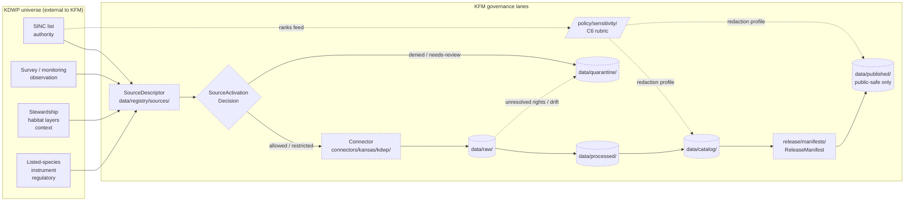

# KDWP — Kansas Department of Wildlife and Parks

> **Source family catalog entry.** KDWP is a *Kansas-First domain authority* whose stewardship outputs — chief among them the SINC (Sensitive Species and Natural Communities) program — feed the Fauna, Flora, and Habitat lanes and drive the sensitivity rubric that governs public-safe redaction across KFM.

[](#)
[](#)
[](#)
[](#)
[](#)
[](#)
[](#)

**Status:** `draft` &nbsp;·&nbsp; **Owners:** `TODO — source steward + fauna domain steward` &nbsp;·&nbsp; **Updated:** `TODO`

<!-- [KFM_META_BLOCK_V2]
doc_id: kfm://doc/TODO-uuid-kdwp-source-catalog
title: KDWP — Kansas Department of Wildlife and Parks (Source Catalog Entry)
type: standard
subtype: source-catalog-entry
version: v1
status: draft
owners: TODO — source steward (admission, rights); fauna domain steward (object meaning)
created: TODO-YYYY-MM-DD
updated: TODO-YYYY-MM-DD
policy_label: public
related:
  - docs/doctrine/directory-rules.md
  - docs/sources/SOURCE_DESCRIPTOR_STANDARD.md   # PROPOSED — referenced by Whole-UI report, not verified in repo
  - docs/domains/fauna/README.md                  # PROPOSED placement
  - docs/domains/flora/README.md                  # PROPOSED placement
  - docs/domains/habitat/README.md                # PROPOSED placement
  - schemas/contracts/v1/source/source_descriptor.schema.json  # PROPOSED schema home per ADR-0001
  - data/registry/sources/                        # canonical machine-readable source registry
tags: [kfm, source-catalog, kansas-first, fauna, flora, habitat, sinc, sensitivity]
notes:
  - Placement of this file under docs/sources/catalog/ is PROPOSED — see §3 Repo fit.
  - All KDWP-specific rights, endpoints, cadence, and admission state are NEEDS VERIFICATION until source descriptor exists.
[/KFM_META_BLOCK_V2] -->

---

## Quick jump

- [1. Scope](#1-scope) · [2. Status and source basis](#2-status-and-source-basis) · [3. Repo fit](#3-repo-fit) · [4. Inputs accepted](#4-inputs-accepted)
- [5. Exclusions](#5-exclusions) · [6. Lifecycle placement](#6-lifecycle-placement) · [7. Domains served](#7-domains-served) · [8. Source roles](#8-source-roles-applicable-to-kdwp-material)
- [9. SINC and the sensitivity machinery](#9-sinc-and-the-sensitivity-machinery) · [10. Pipeline diagram](#10-pipeline-diagram) · [11. Rights and freshness](#11-rights-freshness-and-access-posture)
- [12. Sensitive / deny-by-default](#12-sensitive--deny-by-default-interactions) · [13. Authority anchoring](#13-authority-anchoring-and-crosswalks) · [14. Pre-admission checklist](#14-pre-admission-checklist)
- [15. Open verification](#15-open-verification-items) · [16. FAQ](#16-faq) · [17. Related docs](#17-related-docs) · [Appendix A: Descriptor field placeholders](#appendix-a-source-descriptor-field-placeholders)

---

## 1. Scope

**CONFIRMED doctrine / PROPOSED implementation.** This entry catalogs **KDWP** as a *source family* — an authoritative Kansas state agency whose data, stewardship determinations, and sensitivity rankings KFM admits and governs. It does **not** define the meaning of KFM object families (see `contracts/`), the machine-checkable shape of any record (see `schemas/`), or the admit/restrict/deny decision for a specific dataset (see `policy/` and `data/registry/`).

KDWP appears in project doctrine in two distinct guises that this entry must hold apart:

| Guise | Role in KFM | Project basis |
|---|---|---|
| **KDWP-as-authority** | Authoritative source for legal status, sensitivity ranking (SINC), and stewardship determinations on Kansas species and natural communities. | Listed as a Kansas-First Domain Authority alongside KSHS, KHRI, KU NHM, KBS NHI; SINC explicitly named. |
| **KDWP-as-observation** | Steward of monitoring, survey, mortality, and disease observations contributed by agency programs. | Listed in fauna source families as "KDWP/steward sources" with source-role taxonomy distinguishing legal status, occurrence aggregator, model, observation. |

Conflating the two collapses authority into observation, which the source-role doctrine explicitly forbids.

> [!IMPORTANT]
> Source role cannot be inferred from convenience. A KDWP CSV that mixes "Kansas-listed status" (authority) with "observed at this site on this date" (observation) MUST be admitted under the role that applies, with corrections producing a new descriptor rather than editing in-place.

---

## 2. Status and source basis

| Claim | Label | Basis |
|---|---|---|
| KDWP is a Kansas-First Domain Authority. | **CONFIRMED doctrine** | Encyclopedia / Components Atlas list KDWP SINC alongside KSHS, KHRI, KU NHM, KBS NHI as the Kansas-first authority cluster. |
| KDWP SINC defines sensitivity rankings used by C6 redaction. | **CONFIRMED doctrine** | Encyclopedia C6-01 sensitivity rubric pins rank 3 ("SINC/locally sensitive", default profile `profile:sinc-obscure-10km`); biodiversity entries require redaction for SINC S1/S2. |
| KDWP feeds Fauna as a primary source family. | **CONFIRMED doctrine** | Fauna domain "Key source families" lists "KDWP/steward sources" first. |
| KDWP feeds Flora context (listed species, Ecological Review Tool). | **CONFIRMED doctrine** | Flora domain "Key source families" lists "KDWP flora/listed species context" and "KDWP Ecological Review Tool or stewardship outputs". |
| KDWP feeds Habitat context. | **INFERRED** | Fauna source basis cites SRC-HF and SRC-HAB; habitat overlays consume the same KDWP/steward stream in domain encyclopedia. |
| KDWP carries rights/terms requiring verification before admission. | **CONFIRMED doctrine** | Domains Atlas source-family rows mark KDWP-like steward sources as "rights and current terms NEEDS VERIFICATION; sensitive joins fail closed". |
| Several Kansas authorities (including KDWP) lack stable HTTP APIs; harvest must tolerate PDF/CSV publication. | **CONFIRMED doctrine** | Components Atlas C7-10 tension explicitly names this and proposes a KDWP SINC MOU as the most plausible first pilot. |
| KDWP currently has a registered `SourceDescriptor`, an admission decision, or a live connector in the repo. | **UNKNOWN / NEEDS VERIFICATION** | No mounted-repo evidence available in this session; doctrine alone does not prove implementation. |
| Specific KDWP endpoints, dataset list, cadence, and license terms. | **NEEDS VERIFICATION** | Not enumerated in project knowledge; must be captured in the `SourceDescriptor` at admission. |

---

## 3. Repo fit

> [!NOTE]
> Per `docs/doctrine/directory-rules.md` §6.1, `docs/sources/` is the doctrinal home for *source-descriptor standards and source families*. A `catalog/` subfolder for one human-readable entry per source family is **PROPOSED** — it is a natural read of "source families," but Directory Rules do not name it explicitly. If a different convention exists in the mounted repo, raise a drift entry rather than silently divergent siblings.

This document is **explanation**. It does not store machine-readable descriptors, define object meaning, validate shape, or make admit/deny decisions. Those live in their canonical homes:

| Concern | Canonical home (per Directory Rules) | What lives there |
|---|---|---|
| Human-readable catalog entry (this file) | `docs/sources/catalog/kdwp.md` (PROPOSED) | This document. |
| Source-descriptor standard | `docs/sources/SOURCE_DESCRIPTOR_STANDARD.md` (PROPOSED — referenced in plans, NEEDS VERIFICATION in repo) | Field-by-field doctrine for `SourceDescriptor`. |
| Machine-readable descriptor records | `data/registry/sources/<domain>/` and `data/registry/source_descriptors/` | Per-dataset `SourceDescriptor` instances. |
| Schema (shape) | `schemas/contracts/v1/source/source_descriptor.schema.json` (default per ADR-0001) | JSON Schema for `SourceDescriptor`. |
| Object-family meaning | `contracts/source/` (semantic Markdown) | What a `SourceDescriptor` means and invariants it carries. |
| Admit / restrict / deny policy | `policy/<domain>/` and `policy/sensitivity/` | OPA / policy bundle entries (rights, sensitivity, source-role gates). |
| Connector (fetch + admission) | `connectors/kansas/kdwp/` (PROPOSED) | Source-specific fetcher; output → `data/raw/<domain>/<source_id>/<run_id>/`. |
| Pipelines (executable) | `pipelines/ingest/`, `pipelines/normalize/`, `pipelines/validate/`, `pipelines/catalog/`, `pipelines/publish/` with `pipeline_specs/<domain>/` declarative companion | Promotion gates RAW → WORK / QUARANTINE → PROCESSED → CATALOG / TRIPLET → PUBLISHED. |
| Domain mapping | `docs/domains/fauna/`, `docs/domains/flora/`, `docs/domains/habitat/` | Where KDWP-sourced object families are owned. |
| Sensitivity policy parameters | `policy/sensitivity/` (consumes KDWP SINC ranks as input) | C6 rubric implementation. |

**Directory Rules basis:** Each path above is selected by *responsibility root*, not topic. KDWP material does **not** justify a `kansas/` or `kdwp/` root folder — it threads through the responsibility lanes of `docs/`, `schemas/`, `policy/`, `connectors/`, `pipelines/`, `data/`, and `release/` like any other source.

[⬆ Back to top](#kdwp--kansas-department-of-wildlife-and-parks)

---

## 4. Inputs accepted

The following classes of KDWP-derived material are **in scope** for admission, subject to source-role tagging, rights resolution, sensitivity classification, and the standard receipt envelope.

- **Sensitivity rankings** — KDWP SINC S-ranks (S1, S2, S3, S4, S5, SH, SX, …) for species and natural communities; pulled with retrieval metadata; treated as **authority** material that feeds `policy/sensitivity/` and the C6 rubric.
- **Legal status determinations** — Kansas-listed status (threatened, endangered, species in need of conservation); treated as **regulatory / authority** material; never collapsed into "observation."
- **Survey, monitoring, mortality, and disease observations** contributed by agency programs; treated as **observation** material; geometry handled per Fauna's spatial model (points / generalized public tiles / range polygons / migration lines).
- **Habitat and natural-community polygons / stewardship layers** where KDWP is the publishing steward; treated as **context** material for the Habitat lane, with source-role retained so a habitat polygon is never cited as a per-place truth claim about an animal.
- **Stewardship outputs** such as the Kansas Ecological Review Tool (named in Flora source families); typically context or model depending on each output's nature; source-role decided at admission.

Every admitted KDWP record carries: source identity, source role, rights posture, sensitivity rank, retrieval metadata, content checksum, and a citation back to the issuing KDWP program. Records lacking any of these MUST go to `data/quarantine/`.

---

## 5. Exclusions

The following are **out of scope** here or routed elsewhere. This list is not exhaustive; the source steward applies the same logic to material not enumerated.

- **Federal authority claims** — USFWS ECOS listings, NatureServe G-ranks, ITIS / GBIF taxonomy. KDWP records that *cite* these MUST be anchored to the federal/international authority, with the KDWP IRI stored *in parallel* — not promoted to override.
- **Aggregator-routed occurrences** — Records that originated in iNaturalist, eBird, GBIF, or iDigBio and merely pass through a KDWP collation are admitted via the *originating aggregator's* source family, not as KDWP records.
- **Exact sensitive locations on public surfaces** — Exact coordinates for SINC-ranked taxa, nests, dens, roosts, hibernacula, and spawning sites are **deny-by-default** for public release; restricted lane only, with documented geoprivacy transform and review state.
- **Operational warnings / emergency content** — Hunting/fishing season notices, wildfire-on-WMA closures, and similar transient operational content are not authoritative for KFM's evidence-bound timeline; admission requires a clear non-life-safety disclaimer per the sensitive-register's "Emergency warning misuse" row.
- **Hunting harvest reports tied to private land or individual hunters** — Treated as private landowner-sensitive data; deny-by-default per the sensitive register's "Private landowner-sensitive data" row.

---

## 6. Lifecycle placement

KDWP material follows the standard KFM lifecycle. Promotion between phases is a **governed state transition**, not a file move.

```text
RAW                 →  WORK / QUARANTINE  →  PROCESSED  →  CATALOG / TRIPLET  →  PUBLISHED
data/raw/<domain>/     data/work/...         data/processed/  data/catalog/        data/published/
  kdwp/<run_id>/       data/quarantine/...     <domain>/        domain/<dataset>/    layers/<domain>/
```

| Phase | KDWP-specific handling | Required artifact |
|---|---|---|
| RAW | Source-native, immutable capture (e.g., CSV, shapefile, PDF table extraction with parser receipt). | `SourceDescriptor`; `RawCaptureReceipt`; checksum. |
| WORK | Normalize geometry, time, identity (ITIS / GBIF anchors), evidence, rights, sensitivity. | `TransformReceipt`; `DatasetVersion`. |
| QUARANTINE | Rights unresolved, SINC unranked, geometry over-precise, parser shape unrecognized. | `QuarantineRecord` with reason. |
| PROCESSED | Validated canonical records; SINC rank assigned; geoprivacy transform if required. | `EvidenceRef`; `ValidationReport`; `RedactionReceipt` where applicable. |
| CATALOG / TRIPLET | STAC / DCAT / PROV records, EvidenceBundles, triplet projections. | `CatalogRecord`; closure check. |
| PUBLISHED | Public-safe derivative; sensitive lanes denied or generalized. | `LayerManifest`; `ReleaseManifest`; rollback target. |

> [!WARNING]
> A pipeline that writes KDWP-sourced material directly from `data/raw/` to `data/published/` violates the lifecycle invariant regardless of which directory the bytes land in. The same rule applies to AI-rendered summaries of KDWP claims: they do not skip the gates.

[⬆ Back to top](#kdwp--kansas-department-of-wildlife-and-parks)

---

## 7. Domains served

KDWP material is admitted under, and owned by, the responsibility roots of the *receiving domain* — not by a synthetic "KDWP domain." The matrix below records which domains receive KDWP material and in what posture.

| Domain | Primary KDWP material | Source role(s) typical | Sensitivity posture |
|---|---|---|---|
| **Fauna** | Kansas-listed status; SINC ranks; monitoring/survey observations; mortality and disease observations; sensitive-site stewardship metadata. | `authority`, `regulatory`, `observation` | High — exact sensitive locations (nests/dens/roosts/spawning, SINC S1/S2) deny-by-default for public surfaces. |
| **Flora** | KDWP flora / listed-species context; Kansas Ecological Review Tool stewardship outputs. | `authority`, `context` | High for rare-plant exact locations — same generalize-or-deny posture as fauna sensitive sites. |
| **Habitat** | Stewardship habitat/natural-community polygons; context overlays. | `context`, `authority` | Medium — habitat polygons admit publicly, but joins to sensitive taxa are gated. |
| **Hazards (downstream)** | Disease / wildlife-mortality context where it intersects hazard timelines. | `context` | Mortality records must not be staged as emergency life-safety information. |
| **Roads, Rail, and Trade Routes (downstream)** | Wildlife-vehicle interaction context where steward records exist. | `context` | Standard sensitivity unless individual incidents identify private parties. |

Cross-lane joins (e.g., Fauna × Habitat × Hydrology) preserve ownership, source role, sensitivity, and `EvidenceBundle` support — they do not aggregate KDWP material into a generic blob.

---

## 8. Source roles applicable to KDWP material

The source-role taxonomy is **doctrine**, not stylistic preference. Each KDWP admission picks exactly one role; corrections produce a *new* descriptor and a `CorrectionNotice`, never an in-place edit.

| Role | Used for KDWP when… | Example (illustrative, not authoritative) | Required additional fields (PROPOSED, per descriptor surface) |
|---|---|---|---|
| `authority` | KDWP is the *issuing body* for the claim (SINC ranks, Kansas-listed status, stewardship determinations). | A SINC list naming species X at S2. | `role_authority` = `KDWP SINC`. |
| `regulatory` | KDWP material expresses legal force (regulation, listing instrument). | Kansas Threatened Species list as published instrument. | `role_authority` = `KDWP`; separated from observation lanes. |
| `observation` | KDWP staff or contractors recorded the event (survey, monitoring run, mortality event). | A survey-event row with date, place, observer, taxon. | Standard observation envelope; `observed_time` distinct from `source_time` and `retrieval_time`. |
| `aggregate` | KDWP publishes a county-level or HUC-level rollup. | A county-by-county summary of harvest. | `role_aggregation_unit` (e.g., `county`); deny joins to single records. |
| `model` | KDWP publishes a modeled surface (e.g., habitat suitability model). | A predicted-distribution raster. | `role_model_run_ref` → `ModelRunReceipt`. |
| `administrative` | KDWP material is an administrative compilation, not an observation. | A multi-source compilation index. | Source role preserved; never cited as observation. |
| `candidate` | A KDWP record proposed for admission but not yet merged. | Pre-admission staging. | `role_candidate_disposition`; `PUBLISHED` edge forbidden until merged. |

> [!CAUTION]
> **Role downcast forbidden.** A regulatory or authority claim MUST NOT be promoted to `observation` to make a public layer easier to render. Doing so is named in the Domains Atlas under "Administrative compilation cited as observation" and "Aggregate cited as a per-place truth" — both deny-at-trust-membrane patterns.

[⬆ Back to top](#kdwp--kansas-department-of-wildlife-and-parks)

---

## 9. SINC and the sensitivity machinery

> [!IMPORTANT]
> **KDWP SINC drives the C6 sensitivity rubric.** Per project doctrine, records carry a `sensitivity_rank` in 0–5: 0 public/open, 1 common non-sensitive, 2 watchlist, **3 SINC / locally sensitive** (default profile `profile:sinc-obscure-10km`), 4 threatened/rare (strict mask or embargo), 5 sacred/critical (fail-closed; no map or timeline exposure). The C6 sensitivity machinery cannot operate correctly without KDWP SINC and KBS rank inputs.

What this means operationally for KDWP-sourced records:

1. **Every fauna and flora occurrence record** admitted through KFM MUST carry a `sensitivity_rank`. KDWP SINC and KBS Natural Heritage Inventory ranks are the *primary inputs* to the rank assignment for Kansas taxa.
2. **NatureServe G-ranks and KDWP S-ranks together** drive redaction. Project doctrine names redaction for "any species that NatureServe or KDWP SINC ranks at S1/S2 sensitivity."
3. **Default profile for SINC-ranked records** is `profile:sinc-obscure-10km`. Stricter masks or embargo apply at rank 4; rank 5 fails closed.
4. **Geoprivacy transforms are deterministic and auditable.** Every transform emits a `RedactionReceipt`; transforms are not improvised at the renderer.
5. **Sensitive joins fail closed.** A spatial join between a KDWP sensitive-site polygon and a public occurrence layer requires policy approval; default is `DENY`.

For the explicit Kansas-deny-by-default register and the cross-domain matrix of redaction triggers, see [docs/security/sensitive_register.md](../../security/sensitive_register.md) *(PROPOSED path)*.

---

## 10. Pipeline diagram



> [!NOTE]
> Dashed nodes are **PROPOSED** lanes — they reflect Directory Rules placement, not verified mounted-repo presence. The lifecycle invariant (`RAW → WORK / QUARANTINE → PROCESSED → CATALOG / TRIPLET → PUBLISHED`) holds regardless of which lanes are currently realized.

[⬆ Back to top](#kdwp--kansas-department-of-wildlife-and-parks)

---

## 11. Rights, freshness, and access posture

| Posture dimension | Value | Status | Notes |
|---|---|---|---|
| Rights / terms of use | Per-dataset; KDWP-published material is governed by KDWP's terms. | **NEEDS VERIFICATION** | Domains Atlas explicitly marks KDWP-like steward sources "rights and current terms NEEDS VERIFICATION; sensitive joins fail closed." |
| Attribution requirement | Required when terms permit republication. | **NEEDS VERIFICATION** | Captured in `SourceDescriptor.attribution`. |
| Redistribution | Not assumed; must be confirmed per dataset. | **NEEDS VERIFICATION** | Unknown rights fail closed (Encyclopedia §13 and capability taxonomy). |
| Access method | Mixed: web pages, PDFs, CSVs, occasionally GIS service endpoints. | **NEEDS VERIFICATION** | C7-10 tension: several Kansas authorities (KDWP among them) "lack stable HTTP APIs or persistent identifiers and rely on PDF or spreadsheet publication." |
| Cadence | Per-dataset; source-vintage specific. | **NEEDS VERIFICATION** | Captured per dataset in `SourceDescriptor.cadence`. |
| Stewardship contact | KDWP program staff per dataset (e.g., SINC program for sensitivity lists). | **NEEDS VERIFICATION** | Source-steward role mediates rights confirmation at admission. |
| Persistent identifiers | Mixed; no project evidence of a stable agency-wide IRI scheme. | **NEEDS VERIFICATION** | Components Atlas C7-10 proposes a KDWP SINC MOU as the most plausible first pilot for stable IDs and documented cadence. |
| Live connector in mounted repo | UNKNOWN. | **UNKNOWN** | No mounted repo in this session; doctrine alone does not prove implementation. |

> [!CAUTION]
> **Unknown rights fail closed.** Until a `SourceDescriptor` and `SourceActivationDecision` exist for a specific KDWP dataset, that dataset MUST NOT be promoted past `data/work/` or `data/quarantine/`. Any connector or watcher referencing the dataset stays inactive.

---

## 12. Sensitive / deny-by-default interactions

KDWP material intersects several rows of the deny-by-default register. Each row applies independently and the strictest applicable rule governs the release.

| Sensitive class | Why KDWP material engages it | Default outcome | Required controls |
|---|---|---|---|
| **Rare species (exact sites)** | KDWP SINC ranks identify species at S1/S2 / state-listed status. | DENY public exact location; generalized products only. | Geoprivacy transform receipt; steward review; default profile `profile:sinc-obscure-10km` at rank 3. |
| **Sacred / culturally sensitive places** | Some stewardship records and traditional-use areas may overlap KDWP holdings. | DENY until steward review and access class approve. | Consultation record; sensitivity transform; coordinate with archaeology lane. |
| **Critical infrastructure (downstream)** | Wildlife area facilities may include hatcheries, dams, or other restricted infrastructure points. | RESTRICT / DENY public precision. | Public-safe aggregation; role-based access. |
| **Private landowner-sensitive data** | Walk-in access enrollment, harvest reports tied to private parcels, and similar records reveal landowner identity. | DENY exact / public if private or rights unclear. | Aggregation; permissions; policy review. |
| **Emergency warning misuse** | Operational closures or wildlife advisories are *not* substitutes for life-safety channels. | DENY life-safety replacement; contextual-only with official redirection. | Not-for-life-safety disclaimer; issue/expiry freshness. |
| **Source-rights-limited records** | Licensed, restricted, or no-redistribution KDWP datasets. | DENY public release until terms resolved. | Rights register entry; attribution; no public derivative if barred. |

[⬆ Back to top](#kdwp--kansas-department-of-wildlife-and-parks)

---

## 13. Authority anchoring and crosswalks

KDWP records anchor to the relevant *external* authority for the entity type, with the KDWP identifier stored in parallel — never instead.

| Entity in KDWP material | Required external anchor | KDWP identifier role | Notes |
|---|---|---|---|
| Species (Kansas vertebrate / invertebrate / plant) | ITIS TSN (primary); GBIF Backbone (secondary where ITIS lags) | Stored alongside as Kansas-authority IRI for routing. | Federal data partners emit ITIS TSN; KFM cannot reconcile without it. |
| Sensitivity rank for a taxon | NatureServe G-rank (global / national); KDWP SINC S-rank (state) | KDWP S-rank is the *primary* state-level authority input; cite alongside NatureServe G-rank. | C6 rubric reads both. |
| Geographic place names (WMAs, refuges, lakes) | USGS GNIS (primary); Wikidata for crosswalk | KDWP place identifier stored in parallel if one exists. | C7-09 mandates GNIS anchoring for in-scope places. |
| Natural community type | NatureServe Ecological Systems (where applicable); KBS Natural Heritage Inventory | KDWP designation preserved as Kansas-authority IRI. | C7-10 cluster. |
| Stewardship program / steward identity | None canonical externally; Wikidata QID where one exists | KDWP program is the steward of record. | C7-01 Wikidata as crosswalk substrate, not truth source. |

> [!NOTE]
> Per project doctrine, **the Wikidata QID is a routing anchor, not a truth source**, and the upstream authority IRI (ITIS, GBIF, GNIS, NatureServe, KDWP SINC) remains the citation target for substantive claims.

---

## 14. Pre-admission checklist

The following items SHOULD be satisfied before any specific KDWP dataset is admitted past `data/raw/`. None of the items below claims to exist in the mounted repo today; they are the *gates* a green-field admission would pass through.

- [ ] **`SourceDescriptor` drafted** for the specific KDWP dataset (not for "KDWP" in general). Fields populated: identity, source role, rights posture, access method, cadence, steward contact, sensitivity class, freshness expectation, attribution, public-release class.
- [ ] **Rights confirmation** recorded — explicit reference to KDWP's published terms for the dataset; if unclear, source steward escalates rather than guesses.
- [ ] **Source-role assignment** justified in the descriptor (one of `authority`, `regulatory`, `observation`, `aggregate`, `model`, `administrative`, `candidate`); role-specific required fields populated.
- [ ] **Sensitivity classification** assigned at the dataset level (`sensitivity_rank` 0–5); SINC-driven if applicable; redaction profile pinned (e.g., `profile:sinc-obscure-10km` at rank 3).
- [ ] **Anchoring strategy** declared: which external authority each entity in the dataset will anchor to (ITIS / GBIF / GNIS / NatureServe / Wikidata).
- [ ] **`SourceActivationDecision`** issued: `allowed | restricted | denied | needs-review`. Connectors and watchers remain inactive until this decision exists.
- [ ] **Fixtures and validators** exist before any live fetch — at minimum one valid and one invalid fixture; schema, geometry, temporal, rights, sensitivity, and evidence validators wired.
- [ ] **Policy gates** present in `policy/` — admit / restrict / deny / abstain rules covering source-role, sensitivity, and rights.
- [ ] **Receipt envelope** — admission emits `RawCaptureReceipt`; promotion emits `TransformReceipt`, `ValidationReport`, `EvidenceRef`.
- [ ] **Quarantine path documented** for known failure modes (shape change, rights revocation, geometry over-precision, SINC unranked).
- [ ] **Rollback target** declared before any `PUBLISHED` transition.

> [!TIP]
> A useful early pilot — consistent with C7-10 expansion direction — is to pilot a KDWP SINC MOU that establishes a stable identifier scheme and documented harvest cadence for *one* KDWP product (the SINC list itself is the obvious candidate, since it is what the C6 sensitivity machinery actually needs).

[⬆ Back to top](#kdwp--kansas-department-of-wildlife-and-parks)

---

## 15. Open verification items

| # | Item | Owner | Why it matters |
|---|---|---|---|
| 1 | Confirm `docs/sources/catalog/` is the intended human-readable home for per-source-family entries, or migrate to the actual repo convention via a drift entry. | Docs steward | Avoids parallel-authority drift. |
| 2 | Confirm path of `SOURCE_DESCRIPTOR_STANDARD.md` in the mounted repo. | Docs steward + Contract/schema steward | Cross-link target. |
| 3 | Inventory KDWP-published products that KFM actually intends to admit (SINC list; survey programs; Ecological Review Tool outputs; habitat layers; others). | Source steward + Fauna domain steward | Drives one `SourceDescriptor` per product, not one for "KDWP." |
| 4 | Resolve KDWP terms of use per product; record in `SourceDescriptor.rights`. | Source steward | Unknown rights fail closed. |
| 5 | Confirm whether KDWP SINC currently publishes machine-readable S-rank lists or only PDF / spreadsheet. | Source steward | Drives connector design and watcher cadence. |
| 6 | Decide on KDWP-SINC MOU pilot (per C7-10 expansion). | Docs steward + Source steward | Establishes stable IDs and documented cadence. |
| 7 | Verify schema home of `source_descriptor.schema.json` against ADR-0001. | Contract/schema steward | Schema-home is ADR-class. |
| 8 | Confirm presence (or absence) of `connectors/kansas/kdwp/` in the mounted repo. | Pipeline owner | Distinguish "doctrine only" from "implementation in progress." |
| 9 | Confirm KDWP entity coverage in `control_plane/source_authority_register.yaml`. | Docs steward | Authority register integrity. |
| 10 | Confirm tribal / sovereignty consultation expectations for any KDWP stewardship record that overlaps culturally sensitive areas. | Rights-holder representative + Archaeology domain steward | CARE-side governance, not optional. |

---

## 16. FAQ

<details>
<summary><strong>Is KDWP "one source" or "many sources"?</strong></summary>

Many. KDWP is a *source family* — an agency that publishes several distinct products (SINC lists, survey programs, habitat layers, stewardship outputs, Ecological Review Tool exports, and others). Each product gets its own `SourceDescriptor`. This catalog entry orients to the family; it does not stand in for the per-product descriptors.

</details>

<details>
<summary><strong>Does KDWP "own" any KFM object families?</strong></summary>

No. KFM object families (`Taxon`, `OccurrenceEvidence`, `SensitiveSite`, etc.) are *owned* by their domain (Fauna, Flora, Habitat, …). KDWP is one of several *source families* whose material is admitted into those domains under the appropriate source role.

</details>

<details>
<summary><strong>Why is the SINC list not just a regular dataset?</strong></summary>

Because it is *authority* material that *drives policy* — the C6 sensitivity rubric reads SINC ranks to decide what gets redacted, generalized, or denied. Admitting SINC under `observation` would collapse the authority/observation split and break the rubric's input contract. The source-role taxonomy exists precisely to prevent this.

</details>

<details>
<summary><strong>What happens if KDWP changes its publication format?</strong></summary>

The connector tolerates known shapes; unknown shapes route to `data/quarantine/` with a shape-version recorded in the receipt. Promotion is held until the parser is extended and validators pass. This is the same pattern KFM uses for WIMAS/WRIS shape drift in the water stack.

</details>

<details>
<summary><strong>Can a public KFM layer show exact locations from a KDWP sensitive-site dataset?</strong></summary>

No, not by default. Exact locations of SINC-ranked taxa and stewardship-sensitive sites are deny-by-default for public surfaces. A generalized public derivative (e.g., 10 km obscuration via `profile:sinc-obscure-10km`) MAY be released after the geoprivacy transform is applied, a `RedactionReceipt` is recorded, and review state is satisfied.

</details>

<details>
<summary><strong>Is this document the citation target when KFM cites a KDWP claim?</strong></summary>

No. Citations resolve through `EvidenceRef` → `EvidenceBundle` to the per-dataset `SourceDescriptor` and the underlying retrieved record. This entry explains the family; it is not itself the cite-target for a claim.

</details>

[⬆ Back to top](#kdwp--kansas-department-of-wildlife-and-parks)

---

## 17. Related docs

> [!NOTE]
> Targets below are PROPOSED until verified in the mounted repo. Adjust paths via a drift entry rather than silently divergent siblings.

- [`docs/doctrine/directory-rules.md`](../../doctrine/directory-rules.md) — placement law; `docs/sources/` doctrine.
- [`docs/sources/SOURCE_DESCRIPTOR_STANDARD.md`](../SOURCE_DESCRIPTOR_STANDARD.md) — `SourceDescriptor` field standard. *(PROPOSED — referenced in plans; NEEDS VERIFICATION in repo.)*
- [`docs/domains/fauna/README.md`](../../domains/fauna/README.md) — primary receiving domain. *(PROPOSED placement.)*
- [`docs/domains/flora/README.md`](../../domains/flora/README.md) — Flora context: KDWP listed-species and Ecological Review Tool outputs. *(PROPOSED placement.)*
- [`docs/domains/habitat/README.md`](../../domains/habitat/README.md) — Habitat overlays, including KDWP stewardship layers. *(PROPOSED placement.)*
- [`docs/security/sensitive_register.md`](../../security/sensitive_register.md) — sensitive / deny-by-default register. *(PROPOSED placement; cross-domain reference.)*
- [`docs/standards/`](../../standards/) — external standards KFM conforms to (STAC, DCAT, PROV-O, etc.).
- [`docs/registers/AUTHORITY_LADDER.md`](../../registers/AUTHORITY_LADDER.md) — authority order for placement and citation. *(PROPOSED.)*
- [`docs/registers/DRIFT_REGISTER.md`](../../registers/DRIFT_REGISTER.md) — where to log conflicts between this entry and mounted-repo state. *(PROPOSED.)*
- [`docs/adr/ADR-0001-schema-home.md`](../../adr/ADR-0001-schema-home.md) — schema-home convention for `SourceDescriptor`. *(PROPOSED — referenced by Directory Rules §7.4; NEEDS VERIFICATION in repo.)*
- Related Kansas-First authorities (sibling catalog entries, all PROPOSED):
  - `docs/sources/catalog/kshs.md` — Kansas State Historical Society
  - `docs/sources/catalog/khri.md` — Kansas Historic Resources Inventory
  - `docs/sources/catalog/ku-biodiversity-institute.md` — KU Biodiversity Institute (NHM)
  - `docs/sources/catalog/kbs.md` — Kansas Biological Survey / Natural Heritage Inventory

---

## Appendix A: Source descriptor field placeholders

> [!NOTE]
> The field surface below is **PROPOSED and illustrative**, drawn from the descriptor surface sketched in the Domains Culmination Atlas. Authoritative shape lives in `schemas/contracts/v1/source/source_descriptor.schema.json` per ADR-0001 (NEEDS VERIFICATION in repo). Do not treat this appendix as a contract.

<details>
<summary><strong>Illustrative SourceDescriptor skeleton for a KDWP product</strong></summary>

```yaml
# PROPOSED illustrative skeleton — NOT a contract.
# One descriptor per KDWP product, not one for "KDWP" in general.
id: TODO/source/kdwp-sinc-list-v<version>
name: KDWP SINC — Sensitive Species and Natural Communities (Kansas state list)
publisher: Kansas Department of Wildlife and Parks (KDWP)
program: SINC
source_role: authority              # one of: authority|regulatory|observation|aggregate|model|administrative|candidate
role_authority: KDWP SINC           # required when role in {authority, regulatory, aggregate, modeled}
access:
  method: TODO                      # e.g., http, pdf-harvest, csv-download
  endpoint_or_url: TODO             # NEEDS VERIFICATION
  auth: TODO                        # none | api-key | mou | …
rights:
  terms_url: TODO                   # NEEDS VERIFICATION
  redistribution: TODO              # allow | restrict | deny | unknown (fail closed if unknown)
  attribution: TODO
cadence:
  expected: TODO                    # e.g., annual; ad-hoc
  observed: TODO                    # last actual update window
sensitivity:
  default_rank: 3                   # SINC default; rank 4/5 for specific entries
  default_profile: profile:sinc-obscure-10km
  notes: ranks per-record govern publication, not the default
freshness:
  staleness_tolerance: TODO
anchoring:
  taxon_authority: ITIS TSN (primary); GBIF Backbone (fallback)
  place_authority: USGS GNIS
  community_authority: NatureServe Ecological Systems; KBS NHI
public_release_class: restricted-by-default
steward:
  source_steward: TODO
  domain_steward: Fauna domain steward
  sensitivity_reviewer: TODO
status:
  activation_decision: needs-review  # allowed | restricted | denied | needs-review
  fixtures_present: false
  validators_present: false
  policy_gates_present: false
```

</details>

---

<div align="right">

*Last updated: `TODO`* · [⬆ Back to top](#kdwp--kansas-department-of-wildlife-and-parks)

</div>
