<!-- [KFM_META_BLOCK_V2]
doc_id: kfm://doc/source-catalog/ksgs
title: Kansas Geological Survey (KGS) — Source Catalog Entry
type: standard
version: v1
status: draft
owners: <docs steward + Geology subsystem owner — PLACEHOLDER, NEEDS VERIFICATION>
created: 2026-05-13
updated: 2026-05-13
policy_label: public
related:
  - docs/sources/README.md
  - docs/sources/SOURCE_DESCRIPTOR_STANDARD.md
  - docs/doctrine/directory-rules.md
  - docs/domains/geology/README.md
  - docs/domains/hydrology/README.md
  - control_plane/source_authority_register.yaml
  - schemas/contracts/v1/source/source-descriptor.json
tags: [kfm, source-catalog, geology, hydrology, kansas, kgs]
notes:
  - Filename ksgs.md preserved as supplied. Corpus canonical short name is KGS.
  - catalog/ subfolder under docs/sources/ is PROPOSED; not yet declared in Directory Rules.
  - All concrete paths are PROPOSED until verified against a mounted repo.
[/KFM_META_BLOCK_V2] -->

# Kansas Geological Survey (KGS) — Source Catalog Entry

> Per-publisher catalog entry for the **Kansas Geological Survey (KGS)** — publisher of Kansas bedrock and surficial geology, oil-and-gas wells and production, the WWC5 water-well program (jointly with KDHE), LAS digital well logs and well tops, and the KGS Geoportal. Used across the Geology / Natural Resources and Hydrology lanes.

<!-- BADGES — Shields.io endpoints are PLACEHOLDERS; replace once review state is established. -->


**Status:** `draft` &middot; **Owners:** `docs steward + Geology subsystem owner` *(placeholder, NEEDS VERIFICATION)* &middot; **Updated:** `2026-05-13`

---

> [!NOTE]
> **Naming.** Across the KFM corpus the canonical short name for this publisher is **KGS** (Kansas Geological Survey). This file is preserved at the supplied path `docs/sources/catalog/ksgs.md`. If `ksgs` is intentional — e.g., to disambiguate against another `kgs` (Kansas Genealogical Society, Kansas Gas Service, etc.) — record that decision in `docs/sources/README.md`. Otherwise consider renaming to `kgs.md` to match corpus terminology. **NEEDS VERIFICATION.**

> [!IMPORTANT]
> **This document is a human-readable catalog entry, not the canonical source register.** The machine-readable authority surface lives in `control_plane/source_authority_register.yaml` (CONFIRMED doctrine, PROPOSED file path). This file *describes* a publisher and its sub-products; it does **not** decide admission, role, rights, sensitivity, or release class. Those decisions live in `SourceDescriptor` records and the activation flow.

---

## Quick links

- [1. Scope](#1-scope)
- [2. Publisher and authority](#2-publisher-and-authority)
- [3. Sub-products in scope](#3-sub-products-in-scope)
- [4. Source-role posture](#4-source-role-posture)
- [5. Rights, terms, and attribution](#5-rights-terms-and-attribution)
- [6. Sensitivity and publication posture](#6-sensitivity-and-publication-posture)
- [7. Cadence and freshness](#7-cadence-and-freshness)
- [8. Identifiers and crosswalks](#8-identifiers-and-crosswalks)
- [9. Lifecycle placement and dataflow](#9-lifecycle-placement-and-dataflow)
- [10. Schema, contract, and connector surface](#10-schema-contract-and-connector-surface)
- [11. Domain consumers](#11-domain-consumers)
- [12. Validators, gates, and tests](#12-validators-gates-and-tests)
- [13. Open questions and verification backlog](#13-open-questions-and-verification-backlog)
- [14. Related docs](#14-related-docs)
- [Appendix A — KGS at a glance (collapsible)](#appendix-a--kgs-at-a-glance)

---

## 1. Scope

**This catalog entry covers** KGS-published datasets that feed KFM's Geology / Natural Resources lane and (via WWC5 and the KGS Geoportal) the Hydrology lane. It records what the publisher offers, how KFM treats it at admission, what rights and sensitivity defaults apply, and where the corresponding `SourceDescriptor`, connector, and lifecycle outputs are expected to live.

**This entry does not:**

- Set source role for any specific sub-product (that is per-`SourceDescriptor`, set at admission).
- Approve or deny ingestion (that is a `SourceActivationDecision`).
- Replace the machine-readable register at `control_plane/source_authority_register.yaml`.
- Claim that any of the paths below exist in the current repository.

> [!TIP]
> Use this entry as the **human-facing orientation** for a reviewer asked to admit, refresh, restrict, or retire a KGS-derived source. Pair it with the `SOURCE_DESCRIPTOR_STANDARD.md` and the relevant domain README.

[⬆ Back to top](#kansas-geological-survey-kgs--source-catalog-entry)

---

## 2. Publisher and authority

| Field | Value |
|---|---|
| **Publisher (full)** | Kansas Geological Survey *(CONFIRMED — corpus consistent)* |
| **Publisher (short)** | KGS *(CONFIRMED — corpus canonical)* |
| **Affiliation** | University of Kansas *(NEEDS VERIFICATION — not asserted in corpus extracts)* |
| **Primary KFM domain** | Geology and Natural Resources |
| **Secondary KFM domain(s)** | Hydrology *(via WWC5 well-completion records and KGS Geoportal groundwater products)* |
| **Corpus source-family entries** | "Kansas Geological Survey data and maps"; "KGS surficial geology and geologic maps"; "KGS oil and gas wells and production"; "KGS/KDHE WWC5 and water-well program"; "KGS LAS digital well logs and well tops" *(CONFIRMED — Domains Atlas §D, Geology)* |
| **Authority class** | Kansas-first domain authority *(CONFIRMED doctrine — Components Pass 10 §7.6)*; pairs with USGS and federal anchors via documented crosswalk |
| **Role at admission** | **Per `SourceDescriptor`** — see §4. The corpus lists KGS as serving "authority / observation / context / model **as source role requires**." A publisher cannot be assigned a single role at the publisher level. |
| **Rights / current terms** | **NEEDS VERIFICATION** per the Domains Atlas. Default posture is deny-public-release until terms are resolved. |
| **Activation status** | **PROPOSED** — no `SourceActivationDecision` is asserted to exist in this session. |

[⬆ Back to top](#kansas-geological-survey-kgs--source-catalog-entry)

---

## 3. Sub-products in scope

The following KGS sub-products are referenced in the KFM corpus and are expected to drive separate `SourceDescriptor` records. Each sub-product is admitted, role-tagged, and rights-reviewed **independently**.

| Sub-product | Primary domain | Typical role candidate | Notes / corpus reference |
|---|---|---|---|
| **Surficial geology & geologic maps** | Geology | observed *(map compilation)* / context | "KGS surficial geology and geologic maps" — Domains Atlas §D, Geology. Vintage-specific; pair with USGS NGMDB / GeMS where available. |
| **Bedrock geology** | Geology | observed *(map compilation)* / context | Part of "Kansas Geological Survey data and maps" — corpus general entry; vintage-specific. |
| **Oil & gas wells and production** | Geology *(extraction / resource context)* | observed *(well records)* and/or aggregate *(production totals)* | "KGS oil and gas wells and production" — Domains Atlas §D, Geology. Distinguish well-record observation from production aggregate; never collapse roles. |
| **WWC5 water-well program (with KDHE)** | Hydrology / Geology | observed *(per-well completion)* | "KGS/KDHE WWC5 and water-well program" — Domains Atlas §D, Geology. Also referenced under C10-03 *Water Stack*. Per-well completion records essential for groundwater modeling. |
| **LAS digital well logs & well tops** | Geology *(subsurface)* | observed *(log curves)* / context *(picked tops)* | "KGS LAS digital well logs and well tops" — Domains Atlas §D, Geology. Tops are interpretations; preserve interpretation lineage. |
| **KGS Geoportal — groundwater & geological products** | Hydrology / Geology | mixed *(per resource)* | Cited in C10-03 *Water Stack* as the source of additional state-level products. Treat each Geoportal resource as a separate descriptor. |

> [!CAUTION]
> **Anti-collapse rule (CONFIRMED doctrine).** An *observed* well-completion record is not interchangeable with an *aggregate* production total; a *regulatory* determination by KCC is not the same as a KGS *observation*; an *interpretation* (well top) is not the same as the underlying log curve. Each must carry its own role and citation per the Source-Role Anti-Collapse Register (Domains Atlas §24.1).

[⬆ Back to top](#kansas-geological-survey-kgs--source-catalog-entry)

---

## 4. Source-role posture

Source role is a **first-class identity attribute set at admission** and preserved through every promotion. It is recorded on the `SourceDescriptor` and never edited in place; corrections must produce a new descriptor plus a `CorrectionNotice`.

The corpus assigns KGS source families the role label **"authority / observation / context / model — as source role requires"**, which is doctrinal shorthand for *the role is sub-product-specific*. Below is a **PROPOSED** mapping; treat as guidance, not authority.

| Role *(CONFIRMED enum)* | KGS example | Citation rule |
|---|---|---|
| `observed` | Per-well WWC5 completion record; raw LAS log curve; field observation point | Cite as observation with vintage; never relabel as regulatory or aggregate. |
| `aggregate` | County or field-level oil/gas production totals; resource estimate summaries | Pin geometry scope via `role_aggregation_unit`; never cite at sub-unit precision. |
| `administrative` | Tract/permit roster compilations not produced as observations | Cite as administrative context; never as observed event timeline. |
| `modeled` | Geoportal-published interpreted surfaces, derived structural maps, picked well tops as interpretation | Pin `role_model_run_ref` to a `ModelRunReceipt`. |
| `context` | Generalized bedrock or surficial map at small scale | Cite as context layer; never as per-place observation. |
| `candidate` | Pre-review WWC5 batch or LAS upload pending validation | May appear in WORK / QUARANTINE only; never PUBLISHED. |
| `synthetic` | *(Not expected from KGS as primary publisher.)* | If a derivative is synthesized inside KFM from KGS inputs, it carries `synthetic` and a Reality Boundary Note. |

> [!NOTE]
> `regulatory` is **explicitly not a KGS role**. Oil and gas regulatory determinations are published by the Kansas Corporation Commission (KCC), tracked as a separate publisher per the Domains Atlas geology source family table.

[⬆ Back to top](#kansas-geological-survey-kgs--source-catalog-entry)

---

## 5. Rights, terms, and attribution

| Field | Value |
|---|---|
| **License / terms** | **NEEDS VERIFICATION** per sub-product. Corpus posture: "current terms NEEDS VERIFICATION; sensitive joins fail closed." |
| **Default outcome if rights unknown** | **DENY public release.** Doctrine: "Unknown rights fail closed" *(CONFIRMED — Encyclopedia §6 Cross-Domain Capability Taxonomy)*. |
| **Attribution requirement** | **NEEDS VERIFICATION.** Must be captured in each `SourceDescriptor` at admission so downstream citation can render correctly. |
| **Redistribution** | **NEEDS VERIFICATION.** No public derivative may be released if redistribution is barred *(CONFIRMED — Sensitive / Deny-by-Default Register, "Source-rights-limited records")*. |
| **Per-sub-product variance expected** | Yes. WWC5 (jointly with KDHE) may carry different terms than LAS logs or Geoportal map services. Each descriptor is reviewed independently. |

[⬆ Back to top](#kansas-geological-survey-kgs--source-catalog-entry)

---

## 6. Sensitivity and publication posture

> [!WARNING]
> **Exact borehole, sample, sensitive resource, well-log, and private well locations default to RESTRICTED or GENERALIZED public geometry** *(CONFIRMED — Domains Atlas, Geology §I, "Sensitivity, rights, and publication posture")*. Public release of exact point coordinates for these classes requires steward review, a `RedactionReceipt` or equivalent geometry transform, and an approved release class.

| Sensitivity class *(corpus)* | Applies to KGS via | Default outcome | Required controls |
|---|---|---|---|
| **Private landowner-sensitive data** | Private water wells in WWC5; landowner-attached attributes on oil/gas wells | DENY exact / public if private or rights unclear | aggregation; permissions; policy review *(SRC-AG, SRC-PEOPLE basis)* |
| **Critical infrastructure** *(applicable subset)* | Active production / pipeline-adjacent records, where applicable | RESTRICT / DENY public precision | public-safe aggregation; role-based access |
| **Exact sensitive locations** | Any exact point that increases harm risk | DENY by default | redaction / generalization; audit |
| **Source-rights-limited records** | Any KGS sub-product with unresolved terms | DENY public release until terms resolved | rights register; attribution; no public derivative if barred |

**Anti-collapse rules that affect KGS publication:**

- *Occurrence, deposit, estimate, permit, production, and reserve claims must remain distinct.* (Geology §I, CONFIRMED doctrine.)
- *Aggregate cited as a per-place truth* → DENY join from aggregate cell to single record (§24.1.2).
- *Modeled product labeled or queried as observed* → DENY at publication, ABSTAIN at AI (§24.1.2).

[⬆ Back to top](#kansas-geological-survey-kgs--source-catalog-entry)

---

## 7. Cadence and freshness

| Sub-product | Cadence | Freshness expectation | Status |
|---|---|---|---|
| Surficial / bedrock geology & maps | Source-vintage specific *(map sheets update on irregular schedules)* | Track vintage in `SourceDescriptor`; do not assume currency | NEEDS VERIFICATION per publication |
| Oil & gas wells & production | Periodic *(reporting cadence varies; well-add vs production roll-ups differ)* | Separate cadence per role *(observed well-add vs aggregate production)* | NEEDS VERIFICATION |
| WWC5 water-well program | Continuous-add (per-well submission) | Per-well completion timestamps preserved | NEEDS VERIFICATION; expected weekly or finer in operational pipelines per C10-03 |
| LAS digital well logs & well tops | Continuous-add with curation lag | Treat tops as interpretation with own provenance | NEEDS VERIFICATION |
| KGS Geoportal products | Per-resource | Per-resource cadence record | NEEDS VERIFICATION |

> [!TIP]
> Use HTTP validators (`ETag` / `Last-Modified`) and manifest checksums per the C3-01 / C3-02 patterns to detect upstream change without redundant fetches; record cadence and observed freshness on every `RunReceipt`.

[⬆ Back to top](#kansas-geological-survey-kgs--source-catalog-entry)

---

## 8. Identifiers and crosswalks

KFM doctrine: every in-scope record carries one or more **durable authority IRIs** and a machine-readable crosswalk; identifiers without authority anchors decay into local strings *(CONFIRMED — Components Pass 10 §6.7 Authority Anchoring)*.

| Anchor layer | Example for KGS records | Status |
|---|---|---|
| **Kansas-first authority** | KGS publication ID / well API number / WWC5 record ID / KGS map ID | CONFIRMED doctrine *(Kansas-first with documented crosswalk, §7.6 Pass 10)*; specific scheme per sub-product is NEEDS VERIFICATION |
| **Federal anchor** | USGS NGMDB / GeMS identifier for geologic units; USGS NWIS for hydrologic measurements where they co-locate | CONFIRMED doctrine; NEEDS VERIFICATION per join |
| **Universal crosswalk substrate** | Wikidata QID as routing anchor *(not sole truth)* | CONFIRMED doctrine |
| **Place anchor (for sites)** | GNIS FID *(USGS)* with KHRI / TGN secondary | CONFIRMED doctrine |

[⬆ Back to top](#kansas-geological-survey-kgs--source-catalog-entry)

---

## 9. Lifecycle placement and dataflow

KGS sources enter the KFM lifecycle through `connectors/` and traverse the canonical invariant:
**RAW → WORK / QUARANTINE → PROCESSED → CATALOG / TRIPLET → PUBLISHED.**
Promotion is a **governed state transition, not a file move** *(CONFIRMED doctrine — Directory Rules §0)*.

```mermaid
flowchart LR
  KGS["Kansas Geological Survey<br/>(publisher)"]:::pub

  subgraph products["KGS sub-products (each its own SourceDescriptor)"]
    A1["surficial &amp;<br/>bedrock geology"]
    A2["oil &amp; gas wells<br/>&amp; production"]
    A3["WWC5 water-well<br/>(with KDHE)"]
    A4["LAS digital well logs<br/>&amp; tops"]
    A5["KGS Geoportal<br/>(groundwater &amp; geology)"]
  end

  KGS --> products
  products -->|"SourceDescriptor + rights review"| C["connectors/kansas/kgs/<br/>(PROPOSED path)"]:::prop
  C -->|"approved · role · cadence"| RAW["data/raw/{geology,hydrology}/kgs/&lt;run_id&gt;/<br/>(PROPOSED paths)"]:::prop
  C -.->|"unclear rights / sensitive"| Q["data/quarantine/<br/>(no public surface)"]:::quar
  RAW --> WORK["WORK · normalize · validate"]
  WORK --> PROC["PROCESSED"]
  PROC --> CAT["CATALOG / TRIPLET"]
  CAT -->|"PromotionReceipt + ReleaseManifest"| PUB["PUBLISHED<br/>(governed-api only)"]:::pub
  PUB -.->|"correction / rollback"| CAT

  classDef pub fill:#fef9c3,stroke:#854d0e,stroke-width:1.5px,color:#1f2937;
  classDef prop fill:#e0f2fe,stroke:#075985,stroke-width:1px,color:#1f2937;
  classDef quar fill:#fee2e2,stroke:#991b1b,stroke-width:1.5px,color:#1f2937;
```



> [!NOTE]
> **All paths in the diagram are PROPOSED.** Directory Rules §7.3 places connector output at `data/raw/<domain>/<source_id>/<run_id>/`; the concrete `source_id = kgs` and the under-`connectors/kansas/` placement are inferences from the connectors example tree and Pass-10 Kansas-first stacks. Verify against mounted repo before treating as fact.

[⬆ Back to top](#kansas-geological-survey-kgs--source-catalog-entry)

---

## 10. Schema, contract, and connector surface

| Surface | PROPOSED location | Status |
|---|---|---|
| `SourceDescriptor` (one per sub-product) | `schemas/contracts/v1/source/source-descriptor.json` *(per ADR-0001 schema-home, Directory Rules §7.4)* | CONFIRMED doctrine / PROPOSED file |
| Connector | `connectors/kansas/kgs/` *(per Directory Rules §7.3)* | PROPOSED path |
| Connector output (RAW) | `data/raw/geology/kgs/<run_id>/` and `data/raw/hydrology/kgs/<run_id>/` | PROPOSED path |
| Quarantine target | `data/quarantine/...` | PROPOSED path |
| Pipeline spec(s) | `pipeline_specs/geology/`, `pipeline_specs/hydrology/` | PROPOSED path |
| Pipeline executable(s) | `pipelines/ingest/`, `pipelines/normalize/`, `pipelines/validate/` | PROPOSED path |
| Validator | `tools/validators/source_descriptor/`, `tools/validators/connector_gate/` | PROPOSED path |
| Machine-readable register entry | `control_plane/source_authority_register.yaml` | CONFIRMED doctrine / PROPOSED file |
| Geology domain doc | `docs/domains/geology/` | PROPOSED path |
| Hydrology domain doc | `docs/domains/hydrology/` | PROPOSED path |

> [!IMPORTANT]
> A connector **MUST NOT** publish, mutate canonical truth, or write under `data/processed/`, `data/catalog/`, or `data/published/` *(CONFIRMED — Directory Rules §7.3)*. The connector emits RAW + receipts; promotion is a separate governed event.

[⬆ Back to top](#kansas-geological-survey-kgs--source-catalog-entry)

---

## 11. Domain consumers

| KFM domain | What it consumes from KGS | Source basis |
|---|---|---|
| **Geology & Natural Resources** | Surficial / bedrock geology, oil & gas wells, LAS logs & tops, geophysics / geochemistry references via Geoportal, reclamation context | Encyclopedia §7.8 "Geology and Natural Resources" |
| **Hydrology** | WWC5 well-completion (groundwater modeling), Geoportal groundwater products | C10-03 "Water Stack" |
| **Settlements / Infrastructure** *(boundary)* | Indirect via well-density / mineral history context — not a direct consumer | Encyclopedia §7.10 *(boundary, not ownership)* |
| **Hazards** *(boundary)* | Indirect via subsurface context for induced-seismicity or well-related hazards | Encyclopedia §7.9 *(boundary, not ownership)* |

> [!NOTE]
> Hydrology consumes KGS via specific descriptors (WWC5, Geoportal groundwater products) — not as a generic publisher import. The water stack also leans on KDA-DWR (WIMAS/WRIS), USGS NWIS, and WIZARD; KGS is one publisher among several in that lane *(C10-03)*.

[⬆ Back to top](#kansas-geological-survey-kgs--source-catalog-entry)

---

## 12. Validators, gates, and tests

The following are CONFIRMED-doctrine / PROPOSED-implementation per the Geology Atlas §K. They must be present and passing before any KGS-derived layer reaches a public surface.

- **Source-role validators** — assert per-descriptor `source_role` and refuse role drift.
- **Resource-class anti-collapse tests** — refuse aggregation-to-per-place joins for production / estimate / reserve.
- **Public-safe geometry tests** — assert well-point generalization or removal in public outputs.
- **Borehole / well-log rights tests** — fail closed where rights are unresolved.
- **Catalog closure tests** — every published KGS-derived dataset has source, schema, validation, policy, and release metadata.
- **AI evidence-before-model tests** — AI summaries of KGS evidence must resolve `EvidenceRef → EvidenceBundle` and emit an `AIReceipt`; ABSTAIN when evidence is insufficient.

> [!TIP]
> A new KGS sub-product should not be activated until its **fixtures, validators, and policy gates exist** *(CONFIRMED doctrine — Source Registry Architecture, BLD-COMP §§8.1–8.2; IMPL-PIPE §13)*. Activation precedes connector wake-up, not the other way around.

[⬆ Back to top](#kansas-geological-survey-kgs--source-catalog-entry)

---

## 13. Open questions and verification backlog

These items must be resolved before relying on this entry to drive admission or promotion. Each should land in `docs/registers/VERIFICATION_BACKLOG.md` (PROPOSED).

| # | Item | Action | Why it matters |
|---|---|---|---|
| 1 | Canonical short name vs filename | Decide whether `KGS` or `KSGS` is the file slug; align with `control_plane/source_authority_register.yaml` | Naming drift breeds duplicate descriptors |
| 2 | Current license / redistribution terms for each sub-product | Per-sub-product rights review with KGS | Default is DENY until resolved |
| 3 | Attribution string | Capture exact required citation form per sub-product | Required by citation-or-abstain doctrine |
| 4 | Cadence per sub-product | Document observed cadence (WWC5, oil/gas production, LAS adds, map sheet vintage, Geoportal layer-by-layer) | Receipts and conditional GETs depend on it |
| 5 | Identifier scheme per sub-product | Document well API, WWC5 ID, KGS publication ID schemes and crosswalks to USGS / Wikidata / GNIS | Federation across authorities |
| 6 | `docs/sources/catalog/` placement | Document this subfolder in `docs/sources/README.md` or by ADR if it elevates a new convention | Avoid silent root drift *(Directory Rules §2.5)* |
| 7 | `SourceActivationDecision` per sub-product | Open intake records | Without it, connectors stay inactive *(BLD-COMP §8.1)* |
| 8 | Sensitivity policy fixtures for KGS classes | Author DENY / ABSTAIN fixtures for well-location, private-well, and production-aggregate joins | Fail-closed proof *(Sensitive / Deny-by-Default Register)* |
| 9 | Drift entry if mounted repo conflicts | If repo evidence shows a different KGS placement, file in `docs/registers/DRIFT_REGISTER.md` rather than silently conforming | Directory Rules §2.5 |
| 10 | Anchor-to-federal crosswalk for unit and well IDs | Pilot a KGS-unit ↔ USGS NGMDB / WBD / NWIS crosswalk on one county | Kansas-first with documented crosswalk *(§7.6 Pass 10)* |

[⬆ Back to top](#kansas-geological-survey-kgs--source-catalog-entry)

---

## 14. Related docs

- [`docs/sources/README.md`](../README.md) — *PROPOSED; should declare `catalog/` subfolder if retained*
- [`docs/sources/SOURCE_DESCRIPTOR_STANDARD.md`](../SOURCE_DESCRIPTOR_STANDARD.md) — *PROPOSED CREATE per Whole-UI Governed AI report*
- [`docs/doctrine/directory-rules.md`](../../doctrine/directory-rules.md) — placement law and authority order
- [`docs/domains/geology/README.md`](../../domains/geology/README.md) — primary consuming domain *(PROPOSED)*
- [`docs/domains/hydrology/README.md`](../../domains/hydrology/README.md) — secondary consuming domain via WWC5 / Geoportal *(PROPOSED)*
- [`docs/adr/ADR-0001-schema-home.md`](../../adr/ADR-0001-schema-home.md) — schema-home convention *(PROPOSED)*
- [`control_plane/source_authority_register.yaml`](../../../control_plane/source_authority_register.yaml) — machine-readable register *(PROPOSED)*
- [`schemas/contracts/v1/source/source-descriptor.json`](../../../schemas/contracts/v1/source/source-descriptor.json) — `SourceDescriptor` schema home *(PROPOSED)*

Sibling catalog entries (PROPOSED siblings under `docs/sources/catalog/`):

- `kcc.md` *(Kansas Corporation Commission — oil & gas regulatory)*
- `kdhe.md` *(Kansas Department of Health & Environment — joint WWC5 publisher, air bulletins)*
- `kda-dwr.md` *(Kansas Department of Agriculture, Division of Water Resources — WIMAS / WRIS)*
- `kdwp.md` *(Kansas Department of Wildlife & Parks — SINC and steward sources)*
- `kshs.md` *(Kansas State Historical Society — archives and place authority)*
- `khri.md` *(Kansas Historic Resources Inventory)*

[⬆ Back to top](#kansas-geological-survey-kgs--source-catalog-entry)

---

## Appendix A — KGS at a glance

<details>
<summary><strong>Click to expand: condensed source-family card</strong> (mirrors Domains Atlas §D, Geology, with annotations)</summary>

```text
Publisher        Kansas Geological Survey (KGS)
Affiliation      University of Kansas              [NEEDS VERIFICATION]
KFM primary      Geology and Natural Resources
KFM secondary    Hydrology (WWC5, Geoportal groundwater)

Sub-products (corpus-named)
  - Surficial geology & geologic maps
  - Bedrock geology
  - Oil and gas wells and production
  - WWC5 water-well program (with KDHE)
  - LAS digital well logs and well tops
  - KGS Geoportal (groundwater & geological products)

Source-role posture
  authority / observation / context / model — per descriptor
  regulatory is NOT a KGS role (that is KCC for oil & gas)

Rights / terms
  NEEDS VERIFICATION per sub-product
  Default: DENY public release if terms unclear

Sensitivity defaults
  Exact well / borehole / sample / private-well locations -> RESTRICTED or GENERALIZED public geometry
  Production vs reserve vs estimate vs permit -> kept distinct (anti-collapse)

Cadence
  source-vintage or cadence specific per sub-product [NEEDS VERIFICATION]

Activation
  PROPOSED — no SourceActivationDecision asserted in this session
```

</details>

<details>
<summary><strong>Click to expand: doctrinal references used in this entry</strong></summary>

- *Directory Rules* — §§0, 2.4, 2.5, 5, 6.1, 7.3, 7.4 *(authority order, placement law, schema-home, connector lane)*
- *KFM Domain & Capability Encyclopedia* — §6 Cross-Domain Capability Taxonomy; §7.8 Geology and Natural Resources; §13 Sensitive / Deny-by-Default Register; Appendix D Source family index; Appendix E Feature index
- *KFM Domains Culmination Atlas v1.1* — §D Geology key source families; §I Sensitivity, rights, and publication posture; §24.1 Master Source-Role Anti-Collapse Register; §24.1.3 Roles to source-descriptor fields
- *KFM Components Pass 10* — §6.7 Authority Anchoring; §7.6 Kansas-First with Documented Crosswalk; C10-03 Water Stack; C7-10 Kansas-First Domain Authorities
- *KFM Whole-UI Governed AI Expansion Report* — `SOURCE_DESCRIPTOR_STANDARD.md` creation row

</details>

[⬆ Back to top](#kansas-geological-survey-kgs--source-catalog-entry)

---

**Related:** [Directory Rules](../../doctrine/directory-rules.md) &middot; [Source Descriptor Standard](../SOURCE_DESCRIPTOR_STANDARD.md) *(PROPOSED)* &middot; [Geology domain](../../domains/geology/README.md) *(PROPOSED)* &middot; [Source Authority Register](../../../control_plane/source_authority_register.yaml) *(PROPOSED)*

**Last updated:** 2026-05-13 &middot; **Doc version:** v1 (draft)

[⬆ Back to top](#kansas-geological-survey-kgs--source-catalog-entry)
