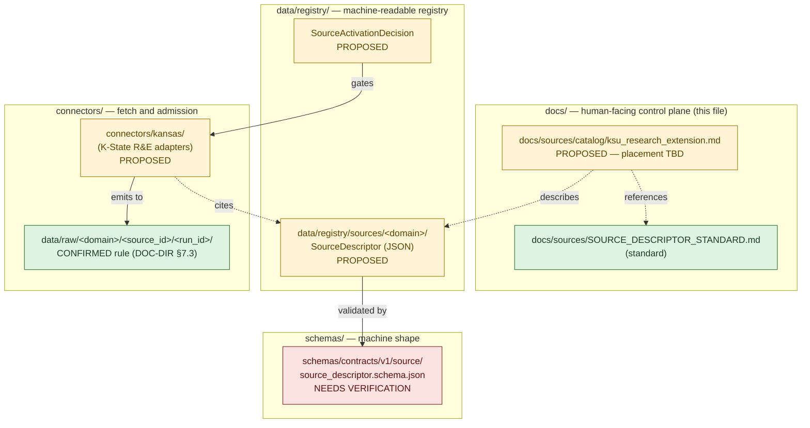
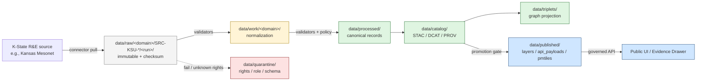

<!-- [KFM_META_BLOCK_V2]
doc_id: kfm://doc/source-catalog/ksu-research-extension
title: KSU Research and Extension — Source Catalog Entry
type: standard
version: v0.1
status: draft
owners: docs-steward; agriculture-domain-steward; atmosphere-domain-steward
created: 2026-05-13
updated: 2026-05-13
policy_label: public
related:
  - docs/sources/SOURCE_DESCRIPTOR_STANDARD.md
  - docs/sources/catalog/README.md
  - docs/domains/agriculture/
  - docs/domains/atmosphere/
  - data/registry/sources/agriculture/
  - data/registry/sources/atmosphere/
  - schemas/contracts/v1/source/source_descriptor.schema.json
  - docs/doctrine/directory-rules.md
tags: [kfm, source-catalog, agriculture, atmosphere, kansas, ksu, mesonet]
notes:
  - Placement and source_id values are PROPOSED until verified against mounted repo.
  - This is a human-facing catalog entry; the canonical SourceDescriptor lives under data/registry/.
[/KFM_META_BLOCK_V2] -->

# KSU Research and Extension — Source Catalog Entry

> Multi-product Kansas land-grant source family covering the Kansas Mesonet sensor network, K-State extension publications, agricultural variety trials, and adjacent advisory products — admitted into KFM under per-product source roles, rights, and sensitivity terms.

| Field | Value |
|---|---|
| **Status** | `draft` — not yet activated; no `SourceActivationDecision` recorded in current session |
| **Owners** | Docs steward · Agriculture domain steward · Atmosphere domain steward — `TODO` named owners |
| **Last reviewed** | 2026-05-13 (initial draft) |
| **Source ID (umbrella)** | `SRC-KSU-RE` — **PROPOSED**; final value set on admission |
| **Replaces / supersedes** | — |
| **Canonical SourceDescriptor home** | `data/registry/sources/<domain>/...` (PROPOSED per Directory Rules §9 and §6.1) |
| **Schema home** | `schemas/contracts/v1/source/source_descriptor.schema.json` per Directory Rules §7.4 / ADR-0001 (NEEDS VERIFICATION of file presence) |

---

## Quick jump

- [1. Scope and identity](#1-scope-and-identity)
- [2. Repo fit and placement](#2-repo-fit-and-placement)
- [3. Source-role composition](#3-source-role-composition)
- [4. Sub-products and source families](#4-sub-products-and-source-families)
- [5. Rights, sensitivity, and public-release class](#5-rights-sensitivity-and-public-release-class)
- [6. Cadence and freshness](#6-cadence-and-freshness)
- [7. Lifecycle and governance posture](#7-lifecycle-and-governance-posture)
- [8. Domain mapping](#8-domain-mapping)
- [9. Connector, schema, and registry references](#9-connector-schema-and-registry-references)
- [10. Source activation status](#10-source-activation-status)
- [11. Open questions and verification items](#11-open-questions-and-verification-items)
- [12. Related docs](#12-related-docs)

---

## 1. Scope and identity

**CONFIRMED doctrine / PROPOSED admission.** KSU Research and Extension (K-State R&E) is the research-and-outreach arm of Kansas State University — Kansas's land-grant institution under the Smith-Lever framework. For KFM purposes, "KSU Research and Extension" is treated as an **umbrella source family** whose individual products carry distinct source roles, rights postures, freshness cadences, and release classes. The Kansas Frontier Matrix corpus references K-State R&E products under several domain source-family lists:

- **Agriculture** — `CONFIRMED` doctrine references "local extension sources" alongside USDA NASS CDL/QuickStats, NRCS conservation practice data, SSURGO, irrigation/water use, weather/soil moisture, and crop insurance/market/economy sources where permitted.
- **Atmosphere, Air, and Climate** — `CONFIRMED` doctrine names the **Kansas Mesonet** as a primary in-state weather and soil moisture network alongside EPA AQS/AirData, AirNow, and NOAA/NWS.
- **Soil (cross-cutting)** — `CONFIRMED` doctrine names Kansas Mesonet as the real-time sensor channel for soil moisture and temperature at four standardized depths, alongside SSURGO/gNATSGO/SoilGrids/SMAP.

> [!IMPORTANT]
> K-State R&E is **not** a single source. It is a portfolio. Per KFM's **Source-Role Anti-Collapse Register** (Atlas v1.1 §24.1), an observed sensor reading is not interchangeable with an aggregate county bulletin, and neither is interchangeable with an administrative publication record. Every K-State R&E sub-product **MUST** carry its own `SourceDescriptor` with its own `source_role`, `role_authority`, and `role_aggregation_unit` where applicable.

### Boundary

- **In scope** for this catalog entry: K-State R&E sub-products that KFM may ingest as evidence — Kansas Mesonet sensor data, extension publications acting as aggregated context, K-State variety trial / crop performance test reports, and adjacent advisory outputs from K-State R&E's research stations and county-extension offices.
- **Out of scope:** **KSU Special Collections** (the archival holdings cited at approximately 1,000,000 items in the C10-07 archives stack) is institutionally distinct from K-State Research and Extension. KSU SC is governed under the archives domain and **MUST** have its own catalog entry — see [`docs/sources/catalog/ksu_special_collections.md`](./ksu_special_collections.md) (PROPOSED; placeholder link).

[Back to top](#ksu-research-and-extension--source-catalog-entry)

---

## 2. Repo fit and placement

**Where this file belongs.** Per `docs/doctrine/directory-rules.md` §6.1, `docs/sources/` is the canonical home for "source-descriptor standards, source families." Per the same section, `docs/` **explains**; machine-readable governance lives in `control_plane/`; object meaning lives in `contracts/`; object shape lives in `schemas/`. This catalog entry is the **human-readable companion** to one or more `SourceDescriptor` JSON records under `data/registry/sources/...`. It is **not** the registry, **not** the schema, and **not** the activation decision.

| Placement claim | Status | Basis |
|---|---|---|
| `docs/sources/` is the right responsibility root | **CONFIRMED rule** | Directory Rules §6.1 |
| `docs/sources/catalog/` subdirectory exists or is conventional | **PROPOSED** | Not enumerated in Directory Rules §6.1; inferred as natural sibling to `docs/sources/SOURCE_DESCRIPTOR_STANDARD.md` |
| Canonical `SourceDescriptor` machine record belongs under `data/registry/sources/<domain>/` | **CONFIRMED rule / PROPOSED specific path** | Directory Rules §9.1 / §12 |
| `source_descriptor.schema.json` lives at `schemas/contracts/v1/source/` | **PROPOSED schema-home / NEEDS VERIFICATION of file presence** | Directory Rules §7.4 / ADR-0001 |

> [!NOTE]
> If `docs/sources/catalog/` is not yet a documented convention in the mounted repo, this PR should either (a) be co-landed with a `docs/sources/catalog/README.md` declaring the subdirectory's purpose under the Required README Contract (Directory Rules §15), or (b) raise a `docs/registers/DRIFT_REGISTER.md` entry per Directory Rules §2.5.

[Back to top](#ksu-research-and-extension--source-catalog-entry)

---

## 3. Source-role composition

K-State R&E sub-products carry **multiple, distinct source roles**. The KFM **Source-Role Anti-Collapse Register** (CONFIRMED doctrine, Atlas v1.1 §24.1) treats source role as a first-class identity attribute fixed at admission. Role MUST NOT be silently "upgraded" by promotion. The umbrella entry below lists the roles each sub-product is expected to carry; per-product `SourceDescriptor` records pin the final value.

| Role (per Atlas v1.1 §24.1.1) | Definition (CONFIRMED doctrine) | K-State R&E example(s) | Citation discipline |
|---|---|---|---|
| **observed** | Direct reading, measurement, or first-hand evidentiary record tied to a place and time. | Kansas Mesonet station readings (air temperature, precipitation, wind, soil moisture/temperature at standardized depths). | Cite with station identity, observation time, instrument metadata. Never relabeled as regulatory or administrative. |
| **aggregate** | Published summary, total, or average over a unit (county, year, watershed); irreversible loss of individual record fidelity. | County-level crop performance summaries; multi-station climate summaries; variety-trial yield averages. | Cite with `AggregationReceipt` and `role_aggregation_unit`; never treated as a per-place record. |
| **administrative** | Compiled record produced by an agency for administration, registration, or accounting purposes — not an observation or regulation. | Extension publication registry; pesticide-application advisory bulletins; soil test lab service records (where published). | Cite as administrative context; never collapsed with observation or regulation. |
| **modeled** | Derived product from inputs, assumptions, or fitted parameters; uncertainty and provenance of inputs must be preserved. | Soil-crop suitability indicators derived from K-State research models; drought/pest stress indices produced under K-State R&E methodologies. | Cite with model identity, `ModelRunReceipt`, and uncertainty bounds; never labeled an observation. |

> [!WARNING]
> **Forbidden collapses for this source family** (Atlas v1.1 §24.1.2):
> - Modeled K-State suitability raster cited or rendered as an **observed** field measurement → **DENY** at publication; **ABSTAIN** at AI surface.
> - Aggregate county-level extension summary cited as a **per-place** truth → **DENY** join from aggregate cell to a single record; **ABSTAIN** at AI.
> - Administrative publication record cited as an **observed event** timeline → **DENY** publication of compilation as observed event evidence.

[Back to top](#ksu-research-and-extension--source-catalog-entry)

---

## 4. Sub-products and source families

Each sub-product below is a **candidate** `SourceDescriptor`. Naming, exact endpoints, and rights terms are **PROPOSED / NEEDS VERIFICATION** pending admission. Where the corpus explicitly names a sub-product, the row carries a stronger label.

| Sub-product | Proposed `source_id` | Primary domain(s) | Default `source_role` | Status in corpus | Notes |
|---|---|---|---|---|---|
| Kansas Mesonet — sensor observations (air temp, precip, wind, soil moisture/temperature) | `SRC-KSU-MESONET` (PROPOSED) | Atmosphere; Agriculture; Soil (cross-cutting) | `observed` | **CONFIRMED reference** in atmosphere and agriculture source families | Soil moisture measured at standardized depths cited in corpus (4 depths in soil-stack doctrine; specific depths NEEDS VERIFICATION on current Mesonet surface). |
| K-State extension publications (bulletins, fact sheets, advisory documents) | `SRC-KSU-EXTPUB` (PROPOSED) | Agriculture (primary); domain-adjacent (Flora, Fauna, Hazards) | `administrative` (default) / `aggregate` when carrying summarized statistics | **CONFIRMED reference** — "local extension sources" in agriculture source family | Source-role MAY split: bulletin-as-publication is administrative; bulletin-as-summary-statistics is aggregate. Each release evaluated per-product. |
| K-State variety trials / crop performance tests | `SRC-KSU-VTRIAL` (PROPOSED) | Agriculture; Flora (cultivar context) | `aggregate` (typical) / `observed` per individual trial plot only with steward agreement | **INFERRED** from "local extension sources" doctrine | Field-level detail is **denied by default** under Agriculture sensitivity posture; aggregated county/region products may be admitted. |
| K-State soil testing lab service outputs | `SRC-KSU-SOILTEST` (PROPOSED) | Agriculture; Soil (cross-cutting) | `observed` (sample-level) — **denied for public** when tied to identifiable landowner | **INFERRED** | Living-person and private-landowner sensitivity rules apply; see §5. |
| K-State R&E research-station weather / agronomy outputs (Agricultural Experiment Station outputs) | `SRC-KSU-AES` (PROPOSED) | Agriculture; Atmosphere; Soil | `observed` (station-level) / `modeled` (derived indices) | **INFERRED** | Typically aggregable to county/season; specific station-level admission per descriptor. |
| K-State drought / pest / disease advisory products | `SRC-KSU-ADV` (PROPOSED) | Agriculture; Hazards (advisory context only) | `administrative` (advisory) / `modeled` (where derived from a model) | **INFERRED** | **MUST NOT** stand in for official emergency advisories. Atmosphere doctrine: this lane "does not replace official advisories or emergency alerting." |

> [!NOTE]
> A separate catalog entry for **Kansas Mesonet** as a stand-alone source is recommended once admission begins (PROPOSED file: `docs/sources/catalog/kansas_mesonet.md`). The Mesonet has its own access surface, attribution requirements, and sensor metadata posture that justify a dedicated descriptor distinct from the umbrella K-State R&E entry. See §10 / open question OQ-2.

[Back to top](#ksu-research-and-extension--source-catalog-entry)

---

## 5. Rights, sensitivity, and public-release class

### 5.1 Rights posture — fail-closed default

**CONFIRMED doctrine** (Unified Implementation Architecture Build Manual §5, "publication, rights, and sensitivity posture"): unknown rights, unresolved source terms, unclear attribution duties, unknown source role, or missing `SourceActivationDecision` **blocks public release by default**. The safe state is quarantine, denial, restriction, or abstention until rights, source role, access conditions, cadence, and release class are recorded.

The KFM corpus explicitly flags Kansas Mesonet access terms as a **NEEDS VERIFICATION** item: "Confirm terms for ingesting and storing Kansas Mesonet REST feeds and any SCAN station data; some networks require written consent or specific attribution."

| Sub-product (from §4) | Rights status | Attribution requirement | Public-release class | Required action |
|---|---|---|---|---|
| Kansas Mesonet | **NEEDS VERIFICATION** — terms for ingest/redistribution; attribution language; rate-limit / volume conditions | `TODO` — capture exact attribution string into `SourceDescriptor.attribution_text` | Default: **public-context** with attribution, **pending** terms confirmation | Resolve terms with K-State R&E / Mesonet program before admission. Quarantine RAW pulls in the interim. |
| Extension publications | **NEEDS VERIFICATION** — typical K-State R&E publication notices vary by document | `TODO` per publication | Default: **public-context** with attribution and citation, **pending** per-publication review | Record per-publication rights at descriptor level; do not assume blanket terms. |
| Variety trials / crop performance | **NEEDS VERIFICATION** — published aggregates likely permissive; field-level detail subject to producer agreements | `TODO` | Aggregate: **public-context** with attribution; field-level: **denied** by default | Confirm with K-State R&E program; aggregate-only public-release until confirmed. |
| Soil testing lab outputs | **NEEDS VERIFICATION** — likely producer-confidential | `TODO` | **Denied** for any identifiable landowner; aggregate views with k-anonymity safeguards `MAY` be considered after review | Treat as restricted intake; require producer / steward agreement for any public surface. |
| Research-station outputs | **NEEDS VERIFICATION** | `TODO` | **Public-context** with attribution, **pending** terms | Per-station descriptor. |
| Advisory products | **NEEDS VERIFICATION** | `TODO` | **Public-context with non-emergency disclaimer** — `MUST NOT` substitute for official advisories | Atmosphere domain rule: advisory context with official-source redirection. |

### 5.2 Sensitivity posture — domain rules apply

KFM's **Sensitive / Deny-by-Default Register** (Encyclopedia §13) governs all K-State R&E sub-products that touch private-landowner data, farm-level operations, or living-person identifiers:

| Sensitivity class | Trigger | Default outcome | Required controls |
|---|---|---|---|
| **Private landowner-sensitive data** | Field boundaries, owner identity, farm operations, soil-test results tied to a parcel/owner | **DENY** exact/public if private or rights unclear | Aggregation; permissions; policy review (`SRC-AG`, `SRC-PEOPLE`) |
| **Source-rights-limited records** | Licensed, restricted, no-redistribution, uncertain terms | **DENY** public release until terms resolved | Rights register; attribution; no public derivative if barred |
| **Emergency warning misuse** | Operational warnings, hazard instructions repackaged as life-safety guidance | **DENY** life-safety replacement; contextual-only with official redirection | "Not-for-life-safety" disclaimer; issue/expiry freshness |

### 5.3 Public-release gate (CONFIRMED doctrine)

> [!IMPORTANT]
> Before any K-State R&E-derived artifact appears on a public KFM surface, the `ReleaseManifest` **MUST** carry, at minimum (per the corpus's public-runtime rule):
> - `release_state == PUBLISHED`
> - `policy_label != unknown`
> - `rights_status != unknown`
> - `sensitivity == public` (or an approved restricted-tier release with explicit policy decision)
> - non-empty `evidence_refs`
> - non-empty artifact hashes
> - `rollback_supported == true`
> - policy gate `allow == true`
>
> If any of these are missing, the artifact **MUST NOT** be served by the governed API.

[Back to top](#ksu-research-and-extension--source-catalog-entry)

---

## 6. Cadence and freshness

| Sub-product | Expected update cadence | Freshness handling | Stale-state policy |
|---|---|---|---|
| Kansas Mesonet (sensor stream) | Continuous (sub-hourly); historical at 5-min / hourly / daily — **NEEDS VERIFICATION** of current surface | Smart-sync layer (corpus: ETag / `If-None-Match`, manifest checksums, debounce/coalesce per source family); per-source debounce window | Freshness badge on UI; abstain on materially stale claims |
| Extension publications | Episodic / per-release | Conditional GETs; per-publication content hash | Publication-vintage badge; supersession tracking |
| Variety trials / crop performance | Annual / per growing season | Per-year release | Year-of-trial badge; comparison across years explicit |
| Soil testing | Service-driven (per sample) | Not a continuous-feed; sample-level | Not generally surfaced publicly; aggregate windows TBD |
| Research-station outputs | Continuous to episodic | Per-station; smart-sync | Station-vintage badge |
| Advisory products | Issued-on-event | Issue/expiry timestamps required | Expired-advisory badge; redirect to current official advisory |

> [!NOTE]
> CONFIRMED doctrine: every K-State R&E sub-product `SourceDescriptor` **MUST** record the cadence claim explicitly. The KFM corpus flags **per-source debounce windows** as a medium-priority unresolved item in the C10-aligned backlog; concrete numeric windows for Mesonet streams are **NEEDS VERIFICATION**.

[Back to top](#ksu-research-and-extension--source-catalog-entry)

---

## 7. Lifecycle and governance posture

**CONFIRMED invariant** (Directory Rules §0 / §9): `RAW → WORK / QUARANTINE → PROCESSED → CATALOG / TRIPLET → PUBLISHED`. Promotion is a **governed state transition, not a file move.**

- **Connectors** for K-State R&E products belong under `connectors/kansas/` (PROPOSED naming under the corpus's `connectors/{usgs,fema,noaa,nrcs,kansas,...}` convention). They emit to `data/raw/<domain>/<source_id>/<run_id>/` per Directory Rules §7.3 and **MUST NOT** write to `data/processed/`, `data/catalog/`, or `data/published/`.
- **RAW** for K-State R&E captures **MUST** carry: ingest hash (`content_hash`), retrieval timestamp, connector identity, and a back-reference to the descriptor's `source_id`. No public access to RAW (CONFIRMED).
- **QUARANTINE** holds: failed validation, rights-unknown pulls (default for Mesonet until terms confirmed — see §5), sensitive-rights pulls, schema drift, over-precise geometry.
- **CATALOG** entries follow STAC Collection / Item shapes with KFM provenance namespaces. KSU R&E aggregates carry an `AggregationReceipt` pinning the `role_aggregation_unit`.
- **PUBLISHED** surfaces consume only released payloads through the governed API. No direct browser access to canonical stores (CONFIRMED trust-membrane rule).

[Back to top](#ksu-research-and-extension--source-catalog-entry)

---

## 8. Domain mapping

| KFM domain | K-State R&E contribution | Object families this source feeds | Source role(s) |
|---|---|---|---|
| **Agriculture** | Local extension sources (CONFIRMED reference); variety trials; advisory products; soil testing aggregates | `CropObservation`, `FieldCandidate`, `CropRotation`, `YieldObservation`, `ConservationPractice`, `SoilCropSuitability`, `DroughtStressIndicator`, `PestStressIndicator`, `AggregationReceipt` | `aggregate` (typical), `administrative` (publications), `modeled` (derived indices) |
| **Atmosphere, Air, and Climate** | Kansas Mesonet (CONFIRMED reference) — wind, precipitation, temperature, station observations | `WeatherStation`, `WeatherObservation`, `WindField`, `PrecipitationObservation`, `TemperatureObservation` | `observed` (primary) |
| **Soil (cross-cutting)** | Kansas Mesonet (CONFIRMED reference) — real-time soil moisture and temperature at standardized depths | Soil-moisture / soil-temperature time series; multi-source soil-condition view alongside SSURGO / gNATSGO / SMAP | `observed` |
| **Hazards** | Advisory context only — not life-safety replacement | `AdvisoryContext` (contextual surface only) | `administrative` (advisory) |
| **Flora** | Cultivar / variety performance context (where applicable) | Cultivar context for trials; restoration planting context | `aggregate` |
| **Frontier Demography / Land / Settlement Matrix** | Out of scope for this source family | — | — |

> [!TIP]
> Cross-domain joins involving K-State R&E aggregate outputs (e.g., joining a county-level extension yield summary to a Mesonet station observation) **MUST** preserve the role distinction. The corpus's **Cross-Surface Anti-Collapse** rule denies "aggregate cited as per-place truth" — a county roll-up is not a station fix, and a station fix is not a county roll-up. Use the `AggregationReceipt` and `OverlayReceipt` machinery accordingly.

[Back to top](#ksu-research-and-extension--source-catalog-entry)

---

## 9. Connector, schema, and registry references

| Object / surface | Proposed path | Status | Authority |
|---|---|---|---|
| Connector (umbrella K-State R&E adapters) | `connectors/kansas/ksu_research_extension/` | **PROPOSED** | Directory Rules §7.3 |
| Connector (Mesonet, if separated) | `connectors/kansas/ksu_mesonet/` | **PROPOSED** | Directory Rules §7.3 |
| RAW landing | `data/raw/<domain>/<source_id>/<run_id>/` | **CONFIRMED rule / PROPOSED specific path** | Directory Rules §7.3 / §9.1 |
| Per-sub-product `SourceDescriptor` (JSON) | `data/registry/sources/<domain>/<source_id>.json` | **PROPOSED** | Directory Rules §9.1 |
| Per-source-family rights register entry | `data/registry/rights/<source_id>.json` | **PROPOSED** | Directory Rules §9.1 |
| `SourceDescriptor` schema | `schemas/contracts/v1/source/source_descriptor.schema.json` | **PROPOSED schema-home / NEEDS VERIFICATION** | Directory Rules §7.4 / ADR-0001 |
| Source-role enum (governing vocabulary) | `schemas/contracts/v1/source/source_descriptor.schema.json` (field `source_role`) — illustrative shape only | **PROPOSED** | Atlas v1.1 §24.1.3 |
| Policy lane for source rights / sensitivity | `policy/sensitivity/` and `policy/<domain>/` | **CONFIRMED rule / PROPOSED specific paths** | Directory Rules §2.3 |
| Connector-gate validator | `tools/validators/connector_gate/` | **CONFIRMED rule / PROPOSED specific path** | Directory Rules §7.5 |
| Source-descriptor validator | `tools/validators/source_descriptor/` | **CONFIRMED rule / PROPOSED specific path** | Directory Rules §7.5 |

> [!CAUTION]
> Until ADR-0001 is verified against the mounted repo, the schema-home path above remains PROPOSED. Do **not** create a parallel descriptor schema home (e.g., `contracts/source/...` alongside `schemas/contracts/v1/source/...`); Directory Rules §2.4(5) requires an ADR before creating any parallel home for schemas, contracts, policy, sources, registries, releases, proofs, or receipts.

[Back to top](#ksu-research-and-extension--source-catalog-entry)

---

## 10. Source activation status

**CONFIRMED activation flow** (Unified Implementation Architecture §11): create or update `SourceDescriptor`; review source role, rights, sensitivity, cadence, and access; issue `SourceActivationDecision` declaring `allowed` / `restricted` / `denied` / `needs-review` use; keep connectors and watchers **inactive** until activation decision, fixtures, validators, and policy gates exist.

### Status table

| Gate | Required artifact | Status | Notes |
|---|---|---|---|
| `SourceDescriptor` (per sub-product) | JSON under `data/registry/sources/<domain>/` | **NOT STARTED** | One descriptor per sub-product in §4 |
| Rights & terms resolution | Recorded license, attribution string, redistribution posture | **NEEDS VERIFICATION** — Mesonet flagged in corpus | Block on Mesonet terms confirmation |
| Sensitivity classification | Per-product sensitivity tier; living-person / landowner screening rule | **NOT STARTED** | Producer-identifying data → restricted by default |
| Role assignment | `source_role` set at admission; never silently changed | **NOT STARTED** | Multi-role family; one role per sub-product |
| Cadence and freshness policy | Debounce window, stale-state behavior, ETag/conditional GET plan | **NOT STARTED** | Concrete debounce windows = corpus open item |
| Fixtures | Valid + invalid fixtures under `fixtures/` | **NOT STARTED** | Block on schema verification |
| Validator coverage | `source_descriptor` validator + `connector_gate` validator | **NOT STARTED** | Block on validator presence verification |
| Policy gate | OPA / Conftest gate for release | **NOT STARTED** | Block on policy bundle verification |
| `SourceActivationDecision` | Recorded decision (allow / restrict / deny / needs-review) | **NOT ISSUED** | Connectors remain inactive |

[Back to top](#ksu-research-and-extension--source-catalog-entry)

---

## 11. Open questions and verification items

<strong>Click to expand — full open-item ledger (PROPOSED until resolved)</strong>

| # | Item | Type | Owner (PROPOSED) | Blocks |
|---|---|---|---|---|
| OQ-1 | Confirm Kansas Mesonet redistribution terms, attribution language, and rate-limit / consent posture | NEEDS VERIFICATION | Atmosphere domain steward | All Mesonet-derived public surfaces |
| OQ-2 | Decide whether Kansas Mesonet warrants its own catalog entry (`docs/sources/catalog/kansas_mesonet.md`) separate from this umbrella entry | DESIGN | Docs steward + atmosphere domain steward | None (cosmetic split) |
| OQ-3 | Resolve K-State R&E extension publication rights — blanket terms or per-publication review? | NEEDS VERIFICATION | Agriculture domain steward | Public-context publication |
| OQ-4 | Confirm exact soil-moisture / soil-temperature depths reported by current Mesonet surface (corpus references "four depths"; SCAN cites 5/10/20/50 cm) | NEEDS VERIFICATION | Soil-cross-cutting steward | Soil-condition view |
| OQ-5 | Confirm whether `docs/sources/catalog/` is an accepted convention in the mounted repo, or whether this file should land at `docs/sources/ksu_research_extension.md` | NEEDS VERIFICATION | Docs steward | This file's final path |
| OQ-6 | Confirm `schemas/contracts/v1/source/source_descriptor.schema.json` exists and validates the field set used by this entry's descriptors | NEEDS VERIFICATION | Schema steward | All descriptor admission |
| OQ-7 | Set concrete debounce / coalesce window for Mesonet streams (corpus medium-priority backlog item) | OPEN | Atmosphere domain steward | Connector activation |
| OQ-8 | Decide source_id pattern: `SRC-KSU-RE` umbrella + `SRC-KSU-*` sub-products vs. flat sub-product IDs (e.g., `SRC-MESONET`) | DESIGN | Docs steward | All descriptors |
| OQ-9 | Decide whether K-State R&E advisory products belong under Agriculture, Hazards (advisory-context only), or both with lane-cross receipts | DESIGN | Agriculture + hazards domain stewards | Advisory surfaces |
| OQ-10 | Confirm CODEOWNERS for `docs/sources/catalog/` and `data/registry/sources/<domain>/` | NEEDS VERIFICATION | Docs steward | Review workflow |

[Back to top](#ksu-research-and-extension--source-catalog-entry)

---

## 12. Related docs

- [`docs/sources/SOURCE_DESCRIPTOR_STANDARD.md`](../SOURCE_DESCRIPTOR_STANDARD.md) — `TODO` link target; the source-descriptor standard this entry conforms to.
- [`docs/sources/catalog/README.md`](./README.md) — `TODO` link target; sibling README declaring `catalog/` subdirectory purpose (PROPOSED to co-land).
- [`docs/domains/agriculture/`](../../domains/agriculture/) — `TODO` link target; agriculture domain doctrine that consumes this source family.
- [`docs/domains/atmosphere/`](../../domains/atmosphere/) — `TODO` link target; atmosphere domain doctrine that consumes Kansas Mesonet.
- [`docs/doctrine/directory-rules.md`](../../doctrine/directory-rules.md) — placement law cited throughout this entry.
- [`docs/adr/ADR-0001-schema-home.md`](../../adr/ADR-0001-schema-home.md) — `TODO` link target; schema-home convention.
- [`data/registry/sources/`](../../../data/registry/sources/) — `TODO` link target; canonical machine-readable source descriptors.
- [`schemas/contracts/v1/source/source_descriptor.schema.json`](../../../schemas/contracts/v1/source/source_descriptor.schema.json) — `TODO` link target; descriptor schema.
- Related catalog entries (PROPOSED, not yet authored): `kansas_mesonet.md`, `ksu_special_collections.md`, `kgs_kansas_geological_survey.md`, `kdhe.md`, `kdwp.md`, `kdot.md`.

[Back to top](#ksu-research-and-extension--source-catalog-entry)

---

**Document status:** draft · **Authority class:** human-readable catalog entry (companion to machine-readable `SourceDescriptor`) · **Authority of doctrine cited here:** CONFIRMED · **Authority of specific paths / source_ids:** PROPOSED · **Last updated:** 2026-05-13 · [Back to top](#ksu-research-and-extension--source-catalog-entry)
