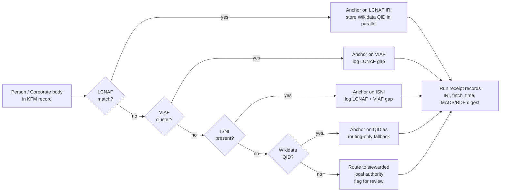
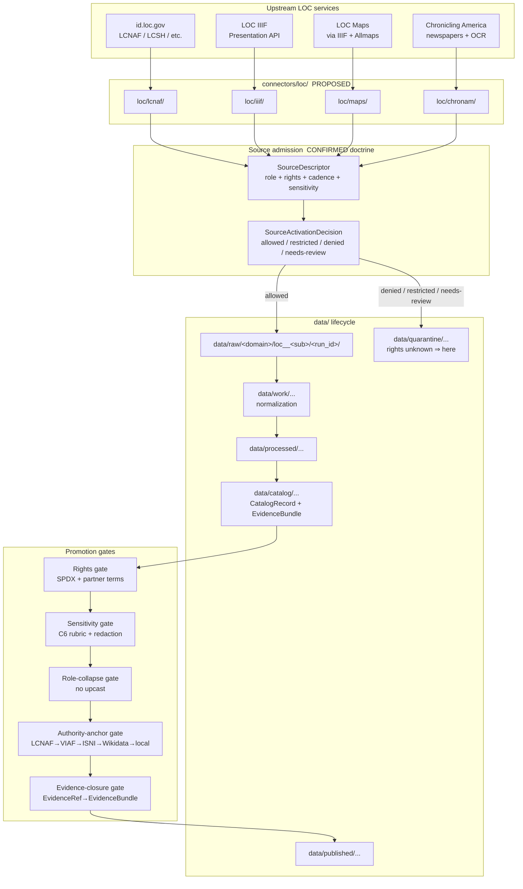

<!-- [KFM_META_BLOCK_V2]
doc_id: kfm://doc/source-catalog-loc
title: Library of Congress (LOC) — Source Family Catalog
type: standard
version: v1
status: draft
owners: <TODO — Sources steward + Archives/People-DNA-Land domain stewards>
created: <TODO — set on first merge>
updated: <TODO — set on first merge>
policy_label: public
related: [docs/sources/README.md, docs/doctrine/directory-rules.md, docs/doctrine/authority-ladder.md, docs/architecture/contract-schema-policy-split.md, schemas/contracts/v1/source/source-descriptor.json, connectors/loc/README.md, control_plane/source_authority_register.yaml]
tags: [kfm, sources, loc, lcnaf, iiif, archives, authority-anchoring]
notes: [Path docs/sources/catalog/loc.md is PROPOSED; the `docs/sources/` root is CONFIRMED in directory-rules.md §6.1 but the `catalog/` sub-segment is not explicitly enumerated. See Section 2 — Notes & Citations for the placement basis.]
[/KFM_META_BLOCK_V2] -->

# Library of Congress (LOC) — Source Family Catalog

> Governance-facing source-family page for the Library of Congress in Kansas Frontier Matrix. Records what LOC content KFM admits, what role each sub-source carries, what rights and sensitivity posture applies, and what gates that content must clear before it reaches a public surface.


**Status:** draft &nbsp;·&nbsp; **Owners:** _<TODO — Sources steward + Archives/People-DNA-Land domain stewards>_ &nbsp;·&nbsp; **Last reviewed:** _<TODO — set on first merge>_

---

## Quick jump

- [1. Scope](#1-scope)
- [2. Repo fit](#2-repo-fit)
- [3. Why LOC sits in KFM](#3-why-loc-sits-in-kfm)
- [4. LOC sub-sources at a glance](#4-loc-sub-sources-at-a-glance)
- [5. Source-role mapping](#5-source-role-mapping)
- [6. Authority-ladder placement (LCNAF)](#6-authority-ladder-placement-lcnaf)
- [7. Inputs accepted into KFM from LOC](#7-inputs-accepted-into-kfm-from-loc)
- [8. Exclusions — what does NOT belong here](#8-exclusions--what-does-not-belong-here)
- [9. Lifecycle and admission flow](#9-lifecycle-and-admission-flow)
- [10. Rights and sensitivity posture](#10-rights-and-sensitivity-posture)
- [11. SourceDescriptor stub (illustrative)](#11-sourcedescriptor-stub-illustrative)
- [12. Validation gates and receipts](#12-validation-gates-and-receipts)
- [13. Open questions and NEEDS VERIFICATION](#13-open-questions-and-needs-verification)
- [14. FAQ](#14-faq)
- [15. Related docs](#15-related-docs)

---

## 1. Scope

This page is the **governance face** of LOC inside KFM. It is not a vendor brochure for the Library of Congress, and it is not a fetch script. It is the place where:

- KFM declares **which LOC sub-sources** it admits (LCNAF, LOC IIIF presentations, Chronicling America historical newspapers, LOC Geography & Map Division materials, and adjacent LOC services).
- Each sub-source is bound to a **CONFIRMED KFM source-role** (`observed | regulatory | modeled | aggregate | administrative | candidate | synthetic`), to an **authority-ladder position** where applicable, and to a **rights / sensitivity posture**.
- The page surfaces the **gates** any LOC-derived content must clear before reaching the `PUBLISHED` lane.

Scope **out**: object meaning lives in `contracts/`, machine shape lives in `schemas/`, admit/deny rulings live in `policy/`, and operational fetchers live in `connectors/loc/`. This page **explains and orients**; it does not decide. [DIRRULES §1, §6.1]

> [!IMPORTANT]
> Source-role is a first-class identity attribute and is **fixed at admission**. Promotion never upgrades an LCNAF authority record (administrative) into an observation, nor a historic LOC map (context) into a regulatory layer. Corrections produce a **new SourceDescriptor and a CorrectionNotice**, not an in-place edit. [Domains Atlas §24.1]

---

## 2. Repo fit

**Proposed path:** `docs/sources/catalog/loc.md`

| Field | Value | Truth label |
|---|---|---|
| Responsibility root | `docs/` — human-facing control plane that explains | CONFIRMED [DIRRULES §6.1] |
| Sub-lane | `docs/sources/` — source-descriptor standards and source families | CONFIRMED [DIRRULES §6.1, line 277] |
| Sub-sub-lane | `docs/sources/catalog/` — per-source-family catalog page | **PROPOSED** — not enumerated in `directory-rules.md`; see callout below |
| Owning root for the executable side | `connectors/loc/` | PROPOSED [DIRRULES §7.3 pattern] |
| Owning root for canonical SourceDescriptor JSON | `schemas/contracts/v1/source/source-descriptor.json` | PROPOSED per ADR-0001 [DIRRULES §0, §7.4] |
| Owning root for object meaning | `contracts/source/source_descriptor.md` | PROPOSED [DIRRULES §6.3] |
| Machine-readable authority register entry | `control_plane/source_authority_register.yaml` | PROPOSED [DIRRULES §6.2] |
| Data lifecycle path for ingested LOC artifacts | `data/raw/<domain>/loc__<sub_source>/<run_id>/` | CONFIRMED pattern [DIRRULES §7.3] |

> [!NOTE]
> The `catalog/` segment under `docs/sources/` is a **PROPOSED** organizational grouping for per-source-family pages. The `docs/sources/` tree in `directory-rules.md` §6.1 is one line ("source-descriptor standards, source families") and does not enumerate sub-segments. If a mounted-repo inspection shows `docs/sources/` is currently flat or uses a different sub-naming (e.g., `docs/sources/families/`, `docs/sources/<source_id>.md`), this file should move and `docs/sources/README.md` should resolve the convention. Open a `docs/registers/DRIFT_REGISTER.md` entry rather than silently conforming. [DIRRULES §2.5]

**Upstream of this page**

- `docs/doctrine/authority-ladder.md` — the LCNAF → VIAF → ISNI → Wikidata → local rule this page applies to LOC content.
- `docs/doctrine/directory-rules.md` — placement law that puts this file under `docs/sources/`.
- `docs/architecture/contract-schema-policy-split.md` — explains why SourceDescriptor lives in three layers (meaning / shape / admissibility).

**Downstream of this page**

- `schemas/contracts/v1/source/source-descriptor.json` — machine shape for the LOC sub-source descriptors. _PROPOSED schema home._
- `connectors/loc/` — fetchers per LOC sub-source. _PROPOSED home._
- `policy/sources/loc.rego` — admission and rights gates for LOC content. _PROPOSED home._
- `control_plane/source_authority_register.yaml` — machine-readable register entry for each LOC sub-source.

[Back to top ↑](#library-of-congress-loc--source-family-catalog)

---

## 3. Why LOC sits in KFM

LOC is **not a single source** in KFM — it is a family of services with distinct identities, distinct rights postures, and distinct roles. Three independent lines of KFM doctrine pull LOC content into scope:

1. **LCNAF as the U.S.-canonical name authority** for persons and corporate bodies appearing in published literature. KFM person and organization records **anchor to LCNAF IRIs** when available, alongside the Wikidata QID; the QID routes between authorities while the LCNAF IRI carries the upstream truth posture. [C7-02, CONFIRMED]
2. **LOC IIIF presentations** as the **federal-level discovery surface** for the Kansas archives stack (alongside KSHS Kansas Memory, KHRI, KU Spencer, KSU Special Collections, WSU, county historical societies, and SNAC/EAC-CPF for cross-archive authority). [C10-07, CONFIRMED]
3. **LOC-hosted historic maps and newspapers** as **context evidence** for Story Nodes, place histories, and the People–Place–Event graph — including IIIF/Allmaps overlays for warped historic maps and Chronicling America historic newspaper context. [ML-064-036, KFM-P18-INV-449, CONFIRMED at idea level; implementation PROPOSED]

Without LCNAF anchoring, KFM cannot reconcile to the upstream descriptions used by its primary Kansas archive partners. Without LOC IIIF, KFM loses the federal-level discovery layer for materials those partners hold. Without LOC maps and newspapers as **context** (never as observed events), KFM forfeits a substantial portion of pre-statehood and frontier-era contextual evidence. [C7-02, C10-07]

> [!WARNING]
> **LCNAF coverage of vernacular Kansas names — particularly Indigenous, immigrant, and women's names — is uneven, and the corpus warns that defaulting to LCNAF can encode that unevenness as a feature.** [C7-02, CONFIRMED] Anchoring to LCNAF without falling through to VIAF/ISNI/Wikidata and a stewarded local authority for unmatched names will systematically erase exactly the populations KFM is most accountable to.

[Back to top ↑](#library-of-congress-loc--source-family-catalog)

---

## 4. LOC sub-sources at a glance

This table is the **inventory header** for the LOC family. Each row is a sub-source that will own a separate `SourceDescriptor`, separate connector module, separate rights record, and separate cadence.

| Sub-source | Short ID (PROPOSED) | KFM role family | Primary KFM use | Status |
|---|---|---|---|---|
| LCNAF — LC Name Authority File (`id.loc.gov/authorities/names`) | `loc__lcnaf` | **authority** (administrative, in the source-role enum) | Anchoring person/corporate-body identity in CIDOC-CRM E21/E74 nodes alongside Wikidata QID | CONFIRMED in scope [C7-02] |
| LCSH — LC Subject Headings (`id.loc.gov/authorities/subjects`) | `loc__lcsh` | **authority** (administrative) | Controlled-vocabulary anchoring for archival description crosswalks | PROPOSED — implied by C7-02 cataloging stream, not enumerated as a separate KFM idea card |
| LOC IIIF presentations (archive items, manuscripts, photographs) | `loc__iiif` | **context** (administrative carrier of observed/representational evidence) | Federal-level discovery surface for Kansas-related holdings; Story-Node evidence carrier | CONFIRMED in scope [C10-07] |
| LOC Geography & Map Division — historic maps via IIIF + Allmaps overlays | `loc__maps` | **context** (with `historic_overlay_uncertainty`) | Warped historic-map overlays in Story-Node map panels; pre-statehood and frontier mapping context | CONFIRMED at idea level [ML-064-036, KFM-P18-INV-449]; implementation PROPOSED |
| Chronicling America — historic newspaper pages and OCR | `loc__chronam` | **context** (historic newspaper text as carrier of contextual evidence) | Place-history and event context for the People–Place–Event graph; never the observed event itself | INFERRED from C10-07 archives stack (newspapers); explicit idea-card status NEEDS VERIFICATION |
| LOC linked-data services (other `id.loc.gov` vocabularies) | `loc__id` | **authority** (administrative) | Controlled-vocabulary crosswalks beyond LCNAF/LCSH (e.g., LCGFT, MARC relators) | PROPOSED — adjacent to C7-02 |

> [!NOTE]
> The short IDs (`loc__lcnaf`, `loc__iiif`, etc.) are **PROPOSED naming**. They follow the directory-rules pattern `<root>/<source_id>/<run_id>/` and the convention of using `loc__<lane>` to keep the LOC family namespaced. Final IDs MUST be decided in `control_plane/source_authority_register.yaml` and `schemas/contracts/v1/source/source-descriptor.json` before any connector activates. [DIRRULES §7.3]

[Back to top ↑](#library-of-congress-loc--source-family-catalog)

---

## 5. Source-role mapping

KFM uses a **closed enum** of source-roles, and `source_role` is `MUST`-set at admission. The corpus is emphatic that an observation is not interchangeable with a regulation, an aggregate, an administrative compilation, a candidate record, or synthetic content; the lifecycle and the governed API **fail closed when these roles are conflated**. [Domains Atlas §24.1.1, CONFIRMED]

| LOC sub-source | KFM `source_role` | `role_authority` | Why this role | Allowed downstream uses |
|---|---|---|---|---|
| `loc__lcnaf` | **administrative** | Library of Congress, Name Authority Cooperative Program (NACO) | Authority records are compiled cataloging records, not first-hand observations | Cite as authority anchor; never relabeled as observation |
| `loc__lcsh` | **administrative** | Library of Congress, Policy and Standards Division | Same as above — controlled-vocabulary compilation | Crosswalk substrate; never an observed claim about a place or event |
| `loc__iiif` | **context** (carries underlying `observed` or `administrative` artifact role per item) | LOC + contributing partner per item | A presentation manifest is a discovery wrapper; the underlying artifact carries its own role | Cite as discovery surface and rights surface; item-level role inherits from the contributing institution |
| `loc__maps` | **context** with PROPOSED `historic_overlay_uncertainty` field | LOC Geography and Map Division | Warped historic maps are approximate contextual evidence, not surveyed alignment [KFM-P18-INV-449] | Story-Node overlay only; never collapsed with TIGER/GNIS/3DEP alignment claims |
| `loc__chronam` | **context** (administrative carrier of contemporaneous reporting) | LOC + contributing state partner | Newspaper text is contemporaneous context, not a verified observation of the event it reports | Cite as period-context evidence; never as the observed event itself |
| `loc__id` (other vocabularies) | **administrative** | Library of Congress | Same as LCNAF/LCSH | Crosswalk substrate |

> [!CAUTION]
> **DENY conditions that apply to LOC content.** The Anti-Collapse Register names these explicitly; LOC content fits each pattern: [Domains Atlas §24.1.2, CONFIRMED]
> - Historic map (context) labeled as observed event timeline → **DENY publication; ABSTAIN at AI surface.**
> - Newspaper compilation labeled as observation → **DENY publication of compilation as observed event timeline.**
> - LCNAF administrative record exposed as if it were the person's first-hand testimony → **DENY**; source-role tag MUST be preserved through DTO and UI.
> - Synthetic enrichment (AI summary of an LCNAF record) presented as observed reality → **DENY publication; HOLD for steward review; ABSTAIN at AI.**

[Back to top ↑](#library-of-congress-loc--source-family-catalog)

---

## 6. Authority-ladder placement (LCNAF)

For person and corporate-body anchoring, the KFM authority ladder is documented in the corpus as **LCNAF → VIAF → ISNI → Wikidata → local stewarded authority**. The ladder is PROPOSED as a policy-bundle gate (`gate B` in the C5 promotion gates) so that promotion is denied when in-scope record types lack a required anchor. [C7-02, C7-03, C7-04 — CONFIRMED at doctrine level; gate enforcement PROPOSED]



**Storage convention (CONFIRMED doctrine, PROPOSED field realization):** When LCNAF is present, the LCNAF IRI is the **anchoring identifier** in CIDOC-CRM E21 Person / E74 Group nodes; the Wikidata QID is stored **in parallel** as the routing anchor, not as the truth source. When LCNAF is absent and the person is in scope, the record proceeds with VIAF or ISNI as the anchor, but the **absence of LCNAF is logged and surfaced in the catalog**. [C7-02]

**Run-receipt requirement:** Every authority fetch MUST record the IRI, the fetch_time, the MADS/RDF (or JSON-LD) digest, and any cluster-shape snapshot relevant to drift detection. VIAF in particular merges and splits clusters over time, so a run-receipt that does not capture cluster shape will lose identity stability downstream. [C7-03]

[Back to top ↑](#library-of-congress-loc--source-family-catalog)

---

## 7. Inputs accepted into KFM from LOC

What this folder governs admission of — by sub-source:

- **LCNAF MADS/RDF authority records** keyed by IRI, fetched with conditional GETs and a documented re-harvest cadence so splits and merges propagate. [C7-02, CONFIRMED]
- **VIAF cluster snapshots** for names where LCNAF alone cannot disambiguate; cluster ID is recorded at fetch time. [C7-03]
- **LOC IIIF Presentation API manifests** (v2 or v3, NEEDS VERIFICATION for the current accepted version) for Kansas-related items; manifest rights, attribution, and provenance are captured before any image asset is fetched. [C10-07, ML-064-036]
- **LOC Geography & Map Division historic map IIIF manifests**, with Allmaps georeference annotations captured as separate artifacts; warp parameters and GCP provenance are admitted alongside the manifest. [KFM-P18-INV-449]
- **Chronicling America newspaper page manifests, OCR text, and METS/ALTO sidecars** as contemporaneous context for the People–Place–Event graph. _Acceptance specifics NEEDS VERIFICATION against the current Chronicling America API._
- **Linked-data dumps from `id.loc.gov`** for controlled vocabularies (LCSH, LCGFT, MARC relators) needed for archival-description crosswalks.

Each input MUST land in `data/raw/<domain>/loc__<sub_source>/<run_id>/` with source descriptors, checksums, and ingest receipts. Connector output MUST NOT write under `data/processed/`, `data/catalog/`, or `data/published/`. [DIRRULES §7.3, CONFIRMED]

[Back to top ↑](#library-of-congress-loc--source-family-catalog)

---

## 8. Exclusions — what does NOT belong here

This page does not host, and the LOC connector family does not admit:

- **LOC content presented as observed reality of a Kansas event.** A historic map showing "Pawnee village, 1872" is context; an LCNAF record for a 19th-century editor is administrative; a Chronicling America article about a flood is contemporaneous context — none of these is an observed measurement of the event. Treat them as their declared role or **DENY publication**. [Domains Atlas §24.1.2]
- **LOC-derived AI summaries treated as evidence.** AIReceipt mandatory; cite-or-abstain; ABSTAIN at Focus Mode if the underlying LOC EvidenceBundle cannot be resolved. [GAI, ENCY]
- **Unreviewed bulk LOC dumps written into `data/processed/` or `data/catalog/`.** Connectors are admitters, not publishers. Promotion is a governed state transition. [DIRRULES §7.3]
- **LCNAF-derived inferences about living-person attributes** (e.g., race, ethnicity, current address) propagated without sensitivity review. LCNAF is a public name-authority surface; KFM's living-person rules (C6) still apply downstream. [C6-06]
- **Image assets fetched ahead of rights resolution.** IIIF presentation manifests can be retrieved for inspection; image assets covered by partner-institution rights MUST clear the rights gate before retrieval and MUST clear the sensitivity gate before any republication. [Build Manual §2.5 — rights posture, CONFIRMED]
- **Bypass paths.** No "admin shortcut" connector that writes directly to `data/catalog/` or `data/published/`. The trust membrane forbids it. [Domains Atlas §24.6.2, CONFIRMED]

[Back to top ↑](#library-of-congress-loc--source-family-catalog)

---

## 9. Lifecycle and admission flow

The LOC family follows the **CONFIRMED lifecycle invariant**: `RAW → WORK / QUARANTINE → PROCESSED → CATALOG / TRIPLET → PUBLISHED`. Promotion is a **governed state transition, not a file move**. [DIRRULES §0]



> [!NOTE]
> The flow above is **CONFIRMED at the doctrine level** (lifecycle, default-deny promotion, role preservation, evidence closure). Specific connector paths under `connectors/loc/<sub>/`, specific gate names, and specific policy bundle locations are **PROPOSED** until mounted-repo evidence verifies them.

[Back to top ↑](#library-of-congress-loc--source-family-catalog)

---

## 10. Rights and sensitivity posture

KFM's **rights posture is CONFIRMED**: unknown rights, unresolved source terms, unclear attribution duties, unknown source role, prohibited source use, or missing `SourceActivationDecision` **blocks public release by default**. The safe state is **quarantine, denial, restriction, or abstention** until rights, source role, access conditions, cadence, and release class are recorded. [Build Manual §2.5, CONFIRMED]

| LOC sub-source | Rights baseline (typical) | KFM default admission posture | Notes |
|---|---|---|---|
| `loc__lcnaf` | U.S. federal government work; widely treated as public domain | **allowed** for IRIs, MADS/RDF, and metadata, subject to attribution per LC guidance | Attribution duty NEEDS VERIFICATION against current LC terms |
| `loc__lcsh` | U.S. federal government work; widely treated as public domain | **allowed** | Same caveat |
| `loc__iiif` | **Varies per contributing institution and per item.** LOC-held items often public domain; contributed items carry the contributing partner's terms | **needs-review by default**; per-item rights MUST be captured in the manifest descriptor before image retrieval | This is the central rights surface for LOC IIIF; the open question ML-Z-023 ("IIIF and LoC rights mapping") tracks the unresolved mapping work |
| `loc__maps` | LOC-published originals often public domain; **georeference annotations** (Allmaps) carry their own rights | **allowed** for manifest and metadata; **needs-review** for derived warped raster artifacts depending on annotation rights | GCP provenance and overlay uncertainty MUST be recorded [KFM-P18-INV-449] |
| `loc__chronam` | Most state-contributed batches are public-domain newspaper images; OCR carries its own quality posture | **allowed** for metadata, OCR text, and METS/ALTO | Sensitivity review applies to the People–Place–Event graph downstream, not to the source admission itself |
| `loc__id` (other vocabs) | U.S. federal government work; treated as public domain | **allowed** | — |

> [!WARNING]
> **Living-person posture (C6).** Even when LOC-side rights are clear, KFM's downstream living-person policies still apply. LCNAF records for living persons surface biographical fields that may join with other KFM data to produce inferences that are sensitive even when each input was public. K-anonymity for living-person aggregates, named redaction profiles for living-person fields, and the trust-membrane rule that public surfaces **never** reach RAW or candidate stores all continue to apply to LOC-derived data. [C6-02, C6-06, CONFIRMED]

> [!CAUTION]
> **IIIF-side rights variability.** A LOC IIIF presentation can wrap an item held by a partner institution whose terms differ from LC's. The connector MUST capture per-item rights from the manifest and route any item with unresolvable terms to `data/quarantine/...`. **Style filters and UI badges are not sufficient** — sensitive geometry and rights-bound media MUST be filtered before tile build or public release, not after. [Map-Master 12 — Validation and Test Plan]

[Back to top ↑](#library-of-congress-loc--source-family-catalog)

---

## 11. SourceDescriptor stub (illustrative)

> [!IMPORTANT]
> The descriptor below is **illustrative, not authoritative**. The canonical shape lives in `schemas/contracts/v1/source/source-descriptor.json` (PROPOSED home per ADR-0001). Field names follow the PROPOSED descriptor surface in Domains Atlas §24.1.3 and the source-intake feature in the KFM Encyclopedia, both labeled CONFIRMED at the doctrine level / NEEDS VERIFICATION at the schema-file level.

<details>
<summary><strong>Click to expand — illustrative <code>SourceDescriptor</code> for <code>loc__lcnaf</code></strong></summary>

```json
{
  "source_id": "loc__lcnaf",
  "source_role": "administrative",
  "role_authority": "Library of Congress · Name Authority Cooperative Program (NACO)",
  "authority": {
    "iri_pattern": "http://id.loc.gov/authorities/names/{lcnaf_id}",
    "format_accepted": ["MADS/RDF", "SKOS/RDF", "JSON-LD"],
    "fetch_method": "HTTPS conditional GET (If-None-Match / If-Modified-Since)"
  },
  "rights": {
    "spdx": "TODO — verify against current LC terms of use",
    "attribution_required": true,
    "redistribution_class": "TODO — NEEDS VERIFICATION",
    "policy_label": "public"
  },
  "sensitivity": {
    "default_class": "0",
    "living_person_field_rule": "downstream-C6-applies",
    "notes": "LCNAF records for living persons trigger C6 review when joined with other KFM data."
  },
  "cadence": {
    "harvest_interval": "TODO — periodic; default monthly until reviewed",
    "stale_after": "TODO",
    "etag_handling": "respect",
    "split_merge_detection": "required"
  },
  "access": {
    "api_base": "https://id.loc.gov/",
    "rate_limit": "NEEDS VERIFICATION",
    "auth_required": false
  },
  "steward": "<TODO — Sources steward + Genealogy/People-DNA-Land domain steward>",
  "freshness_expectation": "MADS/RDF re-harvest cadence MUST keep LCNAF splits and merges propagating; lag tolerance is PROPOSED.",
  "attribution_text": "<TODO — verify the exact LC attribution string>",
  "release_class": "public",
  "limitations": [
    "Coverage of vernacular Kansas names is uneven — Indigenous, immigrant, and women's names disproportionately under-represented.",
    "Anchor only; not a truth source for biographical claims about living persons."
  ],
  "evidence_basis": {
    "primary": "C7-02 in KFM Components Pass 10 Idea Index",
    "policy_gate": "authority-ladder gate B (PROPOSED)"
  }
}
```

</details>

A parallel descriptor MUST exist for each LOC sub-source (`loc__iiif`, `loc__maps`, `loc__chronam`, `loc__lcsh`, `loc__id`). Per Directory Rules, an **ADR is required** before creating a parallel home for source descriptors outside `schemas/contracts/v1/source/`. [DIRRULES §2.4]

[Back to top ↑](#library-of-congress-loc--source-family-catalog)

---

## 12. Validation gates and receipts

The default-deny promotion contract (C5-02, CONFIRMED) names these conditions; LOC content MUST satisfy them before any LOC-derived claim reaches a public surface.

| Gate | What it checks for LOC content | Required artifact | Truth label |
|---|---|---|---|
| Source-ledger completeness | Every LOC `source_id` resolves to a ledgered `SourceDescriptor` with role, rights, sensitivity, authority, cadence, and limitations | `SourceDescriptor` + `SourceActivationDecision` | CONFIRMED doctrine / PROPOSED execution |
| Rights gate | SPDX rights are in the allowlist; partner-institution terms captured per IIIF item | RightsDecision; SPDX allowlist | CONFIRMED doctrine [C5-02] |
| Sensitivity gate (C6) | Living-person and culturally-sensitive content cleared per the C6 rubric and named redaction profiles | RedactionReceipt where transforms apply | CONFIRMED doctrine [C6-01..C6-08] |
| Role-collapse gate | `source_role` is preserved end-to-end; no observation upcast from LCNAF / IIIF / Chronicling America content | role-preserving DTO field; validator | CONFIRMED doctrine [§24.1.2] |
| Authority-anchor gate (gate B) | For in-scope persons/orgs: LCNAF → VIAF → ISNI → Wikidata → local fallthrough recorded | Authority-ladder receipt | PROPOSED gate, CONFIRMED doctrine [C7-02..C7-04] |
| Evidence-closure gate | Every consequential LOC-cited claim has `EvidenceRef → EvidenceBundle` that resolves | EvidenceBundle | CONFIRMED doctrine [§24.6.2] |
| Signed receipt | Run receipt is cosign-signed; spec_hash matches recomputation | RunReceipt + cosign bundle | CONFIRMED doctrine [C5-02] |
| Citation validation | Focus-Mode answers citing LOC content pass `CitationValidationReport` or ABSTAIN | CitationValidationReport | CONFIRMED doctrine [GAI, MAP-MASTER §12] |

> [!IMPORTANT]
> **Cite-or-abstain is the default truth posture.** A statement that depends on an LCNAF record, an LOC IIIF item, a historic LOC map, or a Chronicling America article either cites a resolving `EvidenceBundle` or abstains. Missing, denied, conflicted, stale, or policy-blocked support produces ABSTAIN, DENY, ERROR, REVIEW_NEEDED, quarantine, or a visible limitation — never confident prose. [Build Manual §2.4, CONFIRMED]

[Back to top ↑](#library-of-congress-loc--source-family-catalog)

---

## 13. Open questions and NEEDS VERIFICATION

<details>
<summary><strong>Click to expand — verification backlog for LOC source admission</strong></summary>

| Item | Status | Disposition |
|---|---|---|
| Is `docs/sources/catalog/` the right sub-segment, or does the current repo use a different convention (flat / `families/` / `<source_id>.md`)? | **NEEDS VERIFICATION** | Inspect mounted repo; resolve in `docs/sources/README.md`; open drift entry if needed |
| Is `connectors/loc/` the canonical home, or does the current repo already use a different connector layout for LOC? | **NEEDS VERIFICATION** | Inspect `connectors/` tree |
| What is the current LC.gov terms-of-use string KFM should record in `rights.attribution_text` for each LOC sub-source? | **NEEDS VERIFICATION** | External research permitted (rights are version-sensitive); record in descriptor + register |
| LC.gov current rate-limit posture for `id.loc.gov`, the IIIF Presentation API, and Chronicling America | **NEEDS VERIFICATION** | External research permitted (operationally current) |
| IIIF Presentation API version accepted (v2, v3, both) | **NEEDS VERIFICATION** | Pin in connector README + descriptor |
| Chronicling America current authoritative status as a KFM idea card | **NEEDS VERIFICATION** | Search idea-card index for an explicit `loc__chronam` card; if absent, draft a Phase 5 idea card |
| Default re-harvest cadence for LCNAF MADS/RDF | **OPEN** [C7-02] | Sources steward decision + policy bundle entry |
| Rebinding policy when a VIAF cluster splits | **OPEN** [C7-03] | Author VIAF stability policy; not a blocker for first LCNAF activation |
| ISNI required versus fallback for in-scope creator classes | **OPEN** [C7-04] | Defer until LCNAF + VIAF ladder is operational |
| Mapping IIIF/LoC rights to the SPDX allowlist | **OPEN** [ML-Z-023] | Cross-reference with `policy/sources/` SPDX list |
| Should LCNAF MADS/RDF be normalized to JSON-LD for storage? | **OPEN** [C7-02] | Storage-format decision; affects fixtures + validators |
| Authority-ladder gate B implementation as Conftest/OPA policy | **PROPOSED** [C5-02] | Pilot on one domain dossier (e.g., Genealogy) and measure coverage |

</details>

[Back to top ↑](#library-of-congress-loc--source-family-catalog)

---

## 14. FAQ

<details>
<summary><strong>If a person has a Wikidata QID but no LCNAF record, do we still publish the KFM person node?</strong></summary>

Yes, but the absence of LCNAF MUST be logged and surfaced in the catalog, and the authority-ladder ladder (VIAF → ISNI → Wikidata → local) MUST be walked and recorded in the run receipt. Wikidata QID is the **routing anchor**, not a substitute for upstream authority. [C7-01, C7-02 — CONFIRMED]
</details>

<details>
<summary><strong>Can a Chronicling America newspaper article be cited as the observed event in a KFM Story Node?</strong></summary>

No. Chronicling America content is `source_role = context` (contemporaneous reporting), not `observed`. Citing it as the observed event collapses source roles and triggers DENY at publication. The article can be cited **as the reporting-context evidence** for the event in the People–Place–Event graph, alongside the observed-event evidence from another source. [Domains Atlas §24.1.2]
</details>

<details>
<summary><strong>What happens when an LOC IIIF item's rights cannot be resolved?</strong></summary>

The item is routed to `data/quarantine/...` with a quarantine record; the connector does not retrieve image assets; the trust membrane forbids any public-surface exposure. The release stays in `quarantine` until a `SourceActivationDecision` resolves the rights posture. [DIRRULES §7.3, Build Manual §2.5]
</details>

<details>
<summary><strong>Can a historic LOC map (via Allmaps overlay) be used as a positional source for a place's location?</strong></summary>

No. Historic-map overlays are approximate **contextual evidence**, with georeference uncertainty, control-point provenance, and rights status that differ from modern GIS layers. They belong in Story-Node map panels with a clear UI badge for `historic_overlay_uncertainty`; they do not feed TIGER, GNIS, or 3DEP-equivalent alignment claims. [KFM-P18-INV-449, ML-064-036]
</details>

<details>
<summary><strong>Do AI summaries of LCNAF records count as evidence?</strong></summary>

No. AI text is never an evidence substrate; an AIReceipt is mandatory, the surface must cite an EvidenceBundle that resolves to the underlying LCNAF MADS/RDF (or abstain), and Focus-Mode answers without resolving citations ABSTAIN. [GAI, CONFIRMED]
</details>

[Back to top ↑](#library-of-congress-loc--source-family-catalog)

---

## 15. Related docs

- [`docs/sources/README.md`](../README.md) — _<TODO — link target NEEDS VERIFICATION; should exist per directory-rules §6.1 and §15>_
- [`docs/doctrine/authority-ladder.md`](../../doctrine/authority-ladder.md) — _PROPOSED canonical home per DIRRULES §0_
- [`docs/doctrine/directory-rules.md`](../../doctrine/directory-rules.md) — placement law
- [`docs/doctrine/truth-posture.md`](../../doctrine/truth-posture.md) — cite-or-abstain rule
- [`docs/doctrine/trust-membrane.md`](../../doctrine/trust-membrane.md) — public-path discipline
- [`docs/doctrine/lifecycle-law.md`](../../doctrine/lifecycle-law.md) — RAW → WORK / QUARANTINE → PROCESSED → CATALOG / TRIPLET → PUBLISHED
- [`docs/architecture/contract-schema-policy-split.md`](../../architecture/contract-schema-policy-split.md) — why SourceDescriptor lives in three layers
- [`docs/adr/ADR-0001-schema-home.md`](../../adr/ADR-0001-schema-home.md) — schema-home convention
- [`contracts/source/source_descriptor.md`](../../../contracts/source/source_descriptor.md) — _PROPOSED — object meaning_
- [`schemas/contracts/v1/source/source-descriptor.json`](../../../schemas/contracts/v1/source/source-descriptor.json) — _PROPOSED — machine shape_
- [`connectors/loc/README.md`](../../../connectors/loc/README.md) — _PROPOSED — connector family_
- [`policy/sources/loc.rego`](../../../policy/sources/loc.rego) — _PROPOSED — admission gates_
- [`control_plane/source_authority_register.yaml`](../../../control_plane/source_authority_register.yaml) — register entries for each LOC sub-source
- [`docs/registers/VERIFICATION_BACKLOG.md`](../../registers/VERIFICATION_BACKLOG.md) — items flagged from §13
- [`docs/registers/DRIFT_REGISTER.md`](../../registers/DRIFT_REGISTER.md) — open this if the mounted repo conflicts with §2

> [!NOTE]
> Relative-link targets above assume the proposed canonical tree in `directory-rules.md` §5/§6. If the mounted repo uses different homes (e.g., `contracts/` vs. `schemas/contracts/v1/`; `policy/` vs. `policies/`), these links will need to be adjusted to match the live convention. Mark such adjustments via the path-validation checklist in `directory-rules.md` §16.

---

<sub>Doc ID: <code>kfm://doc/source-catalog-loc</code> &nbsp;·&nbsp; Status: draft &nbsp;·&nbsp; Version: v1 &nbsp;·&nbsp; Last reviewed: <em>&lt;TODO — set on first merge&gt;</em> &nbsp;·&nbsp; <a href="#library-of-congress-loc--source-family-catalog">Back to top ↑</a></sub>
