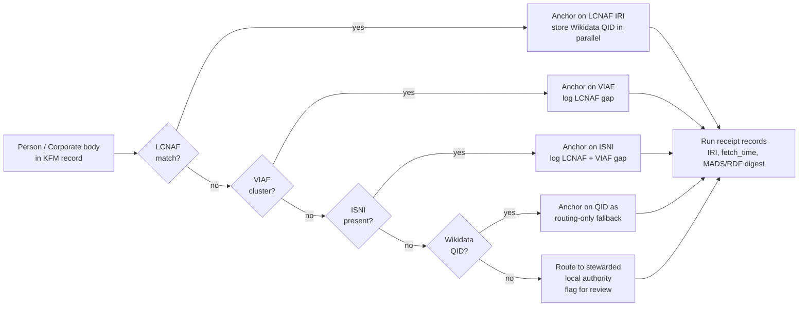
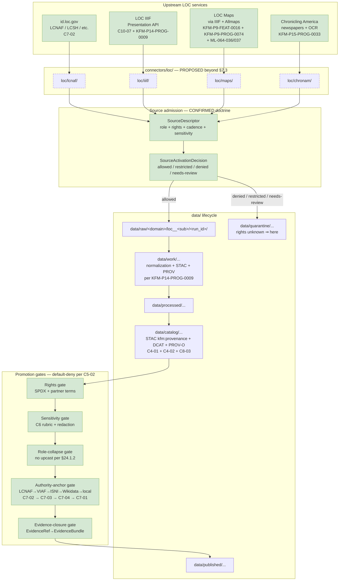

<!-- [KFM_META_BLOCK_V2]
doc_id: kfm://doc/docs-sources-catalog-loc-readme
title: Library of Congress (LOC) — Source Family Catalog
type: standard
subtype: source-family-readme
version: v0.2
status: draft
owners: <TODO — Sources steward + Archives + People-DNA-Land + Genealogy domain stewards>
created: 2026-05-20
updated: 2026-05-21
policy_label: public
related:
  - docs/sources/catalog/README.md
  - docs/sources/catalog/IDENTITY.md
  - docs/sources/catalog/PROFILES.md
  - docs/sources/catalog/RIGHTS-AND-SENSITIVITY-MAP.md
  - docs/sources/catalog/OPEN-QUESTIONS.md
  - docs/sources/catalog/_template/SOURCE_PRODUCT_TEMPLATE.md
  - docs/sources/catalog/loc/lcnaf.md
  - docs/sources/catalog/loc/lcsh.md
  - docs/sources/catalog/loc/iiif.md
  - docs/sources/catalog/loc/maps.md
  - docs/sources/catalog/loc/chronam.md
  - docs/sources/catalog/loc/id-loc-gov.md
  - docs/sources/catalog/isric/README.md
  - docs/sources/catalog/landfire/README.md
  - docs/sources/catalog/kansas/README.md
  - docs/sources/catalog/kansas/kansas-state-archives.md
  - docs/sources/catalog/kansas/kansas-memory.md
  - docs/sources/catalog/kansas/khri.md
  - docs/sources/catalog/kansas/ksu-special-collections.md
  - docs/sources/SOURCE_DESCRIPTOR_STANDARD.md
  - docs/doctrine/directory-rules.md
  - docs/doctrine/authority-ladder.md
  - docs/doctrine/lifecycle-law.md
  - docs/doctrine/truth-posture.md
  - docs/doctrine/trust-membrane.md
  - docs/architecture/contract-schema-policy-split.md
  - docs/domains/archaeology/README.md
  - docs/domains/people-dna-land/README.md
  - docs/domains/genealogy/README.md
  - docs/domains/settlements/README.md
  - docs/standards/SENSITIVITY_RUBRIC.md
  - docs/registers/AUTHORITY_LADDER.md
  - docs/registers/DRIFT_REGISTER.md
  - docs/registers/VERIFICATION_BACKLOG.md
  - docs/adr/ADR-0001-schema-home.md
  - schemas/contracts/v1/source/source_descriptor.schema.json
  - connectors/loc/
  - data/registry/sources/
  - policy/sensitivity/
  - policy/rights/
  - policy/sources/
  - control_plane/source_authority_register.yaml
tags: [kfm, sources, catalog, loc, library-of-congress, lcnaf, lcsh, iiif, chronicling-america, allmaps, archives, c7-02, c7-03, c7-04, c10-07, kfm-p14-prog-0009, kfm-p15-prog-0033, kfm-p9-prog-0074, kfm-p9-feat-0016, kfm-p18-inv-449, ml-064-036, ml-064-037]
notes:
  - >-
    v0.2 promotes the v1 PROPOSED scaffold (single-file family page;
    `kfm://doc/source-catalog-loc` doc_id; flat `docs/sources/catalog/loc.md`
    path) into a full family-README brief with corpus-grounded LOC
    operational doctrine. Mirrors the family-README pattern established for
    `landfire/` and `isric/` v0.2 family READMEs.
  - >-
    Path migration in v0.2 — v1 was at `docs/sources/catalog/loc.md` (flat
    under catalog root); v0.2 moves to `docs/sources/catalog/loc/README.md`
    (nested under family folder). v1 OPEN about `docs/sources/catalog/` sub-
    segment convention is PARTIALLY RESOLVED by adopting
    `docs/sources/catalog/<family>/README.md` consistent with sibling v0.2
    family READMEs (`landfire/`, `isric/`, `kansas/`).
  - >-
    `connectors/loc/` lane is **PROPOSED beyond §7.3** per Directory Rules
    v1.2 §7.3 (CONFIRMED at commit
    `b6a27916bbb9e07cbf3752870c867476e1e094e7`): nine canonical families =
    `usgs/`, `fema/`, `noaa/`, `nrcs/`, `kansas/`, `gbif/`, `inaturalist/`,
    `census/`, `local_upload/`. LOC NOT among them; OPEN-DSC-14 ADR pending.
    Same status as `landfire/` v0.2 and `isric/` v0.2.
  - >-
    Atlas card lineage CONFIRMED: `C7-02` (LCNAF as U.S.-canonical name
    authority); `C7-03` (VIAF); `C7-04` (ISNI); `C7-01` (Wikidata routing
    anchor); `C10-07` (Archives Stack — "LOC IIIF presentations" named
    explicitly alongside KSHS Kansas Memory ~600k, KHRI, KU Spencer, KSU SC
    ~1M, WSU, county societies, SNAC/EAC-CPF); `KFM-P14-PROG-0009` (active,
    Pass 32 EXPANDED — "LoC item pages can enter KFM as source records by
    fetching their IIIF Presentation Manifests, hashing manifest bytes,
    writing STAC metadata assets, and attaching PROV wasDerivedFrom
    links."); `KFM-P15-PROG-0033` (active, Pass 32 — "Chronicling America
    and LOC services should be admitted as OCR, image, IIIF, and visual-
    metadata source families for NER-to-event extraction with rights
    propagation."); `KFM-P9-FEAT-0016` (active, Pass 32 — "KFM should treat
    historic-map overlays from IIIF/Allmaps or similar systems as
    interpretive georeferenced artifacts requiring source rights, control
    points, and uncertainty metadata."); `KFM-P9-PROG-0074` (active, Pass 32
    — "KFM historic-map overlays should preserve IIIF rights,
    georeferencing annotation provenance, and plugin governance before
    MapLibre display."); `KFM-P18-INV-449` (LOC Geography & Map Division
    inventory card per SRC-P18-039 Master MapLibre); `ML-064-036` /
    `ML-064-037` (Master MapLibre — IIIF + Allmaps WarpedMapLayer); `C4-01`
    STAC `kfm:provenance`; `C4-02` STAC Collection; `C8-03` PROV-O; `C5-02`
    default-deny promotion; `C5-08` lineage required; `C6-02` named
    redaction profiles; `C6-06` k-anonymity.
[/KFM_META_BLOCK_V2] -->

# Library of Congress (LOC) — Source Family Catalog

> Governance-facing **family-README** for the Library of Congress source family in Kansas Frontier Matrix. CONFIRMED multi-card LOC presence in the corpus: **`C7-02`** (LCNAF as U.S.-canonical name authority — "anchors person/corporate-body identity in CIDOC-CRM E21/E74 nodes alongside Wikidata QID"), **`C10-07`** (Archives Stack — "LOC IIIF presentations" named explicitly alongside Kansas archive partners), **`KFM-P14-PROG-0009`** (active Pass 32 EXPANDED — "LoC item pages can enter KFM as source records by fetching their IIIF Presentation Manifests, hashing manifest bytes, writing STAC metadata assets, and attaching PROV wasDerivedFrom links"), and **`KFM-P15-PROG-0033`** (active Pass 32 — "Chronicling America and LOC services should be admitted as OCR, image, IIIF, and visual-metadata source families for NER-to-event extraction with rights propagation").

[](#)
[](#)
[-orange)](#)
[-7e57c2)](#4-loc-sub-sources-at-a-glance)
[](#)
[](#)
[](#6-authority-ladder-placement-lcnaf)
[](#9-lifecycle-and-admission-flow)
[](#10-rights-and-sensitivity-posture)
[](#)
[](#)

**Status:** `draft` (v0.2) &nbsp;·&nbsp; **§7.3 status:** PROPOSED beyond canonical nine — see `OPEN-DSC-14` &nbsp;·&nbsp; **Owners:** _<TODO — Sources steward + Archives/People-DNA-Land/Genealogy domain stewards>_ &nbsp;·&nbsp; **Last reviewed:** 2026-05-21

---

## Quick jump

- [1. Scope](#1-scope) · [2. Repo fit](#2-repo-fit) · [3. Why LOC sits in KFM](#3-why-loc-sits-in-kfm) · [4. LOC sub-sources at a glance](#4-loc-sub-sources-at-a-glance)
- [5. Source-role mapping](#5-source-role-mapping) · [6. Authority-ladder placement (LCNAF)](#6-authority-ladder-placement-lcnaf) · [7. Inputs accepted](#7-inputs-accepted-into-kfm-from-loc)
- [8. Exclusions](#8-exclusions--what-does-not-belong-here) · [9. Lifecycle and admission flow](#9-lifecycle-and-admission-flow) · [10. Rights and sensitivity posture](#10-rights-and-sensitivity-posture)
- [11. SourceDescriptor stub (illustrative)](#11-sourcedescriptor-stub-illustrative) · [12. Validation gates and receipts](#12-validation-gates-and-receipts) · [13. Open questions and NEEDS VERIFICATION](#13-open-questions-and-needs-verification)
- [14. FAQ](#14-faq) · [15. Related docs](#15-related-docs) · [Appendix A — Atlas idea-card lineage](#appendix-a--atlas-idea-card-lineage) · [Appendix B — Change log](#appendix-b--change-log)

---

## 1. Scope

> [!NOTE]
> **v1 → v0.2 promotion.** v1 was a single-file family page at `docs/sources/catalog/loc.md` with `kfm://doc/source-catalog-loc` doc_id and substantial doctrinal content (LCNAF authority, IIIF, maps, Chronicling America already enumerated). v0.2 (a) **migrates the path** from flat `docs/sources/catalog/loc.md` to nested `docs/sources/catalog/loc/README.md` consistent with v0.2 family-README convention (parallel to `landfire/`, `isric/`, `kansas/`); (b) **elevates atlas-card citations** — v1 cited C7-02, C10-07, ML-064-036, KFM-P18-INV-449 but did not cite the four other LOC-specific atlas cards verified in this session (`KFM-P14-PROG-0009`, `KFM-P15-PROG-0033`, `KFM-P9-FEAT-0016`, `KFM-P9-PROG-0074`); (c) **resolves the umbrella-vs-per-sub-source model** — v1 enumerated six sub-sources in §4 but they remained inline; v0.2 establishes per-sub-source pages at `loc/lcnaf.md`, `loc/lcsh.md`, `loc/iiif.md`, `loc/maps.md`, `loc/chronam.md`, `loc/id-loc-gov.md` (PROPOSED).

> [!IMPORTANT]
> **Beyond §7.3 — OPEN-DSC-14.** Per Directory Rules v1.2 §7.3 (CONFIRMED at commit `b6a27916bbb9e07cbf3752870c867476e1e094e7`), the nine canonical connector families are: **`usgs/`, `fema/`, `noaa/`, `nrcs/`, `kansas/`, `gbif/`, `inaturalist/`, `census/`, `local_upload/`**. **`loc/` is NOT among them.** This family folder is scaffolded because corpus doctrine names LOC explicitly in four CONFIRMED Pass-10 cards (`C7-02`, `C10-07`) + four CONFIRMED Pass-32 cards (`KFM-P14-PROG-0009`, `KFM-P15-PROG-0033`, `KFM-P9-FEAT-0016`, `KFM-P9-PROG-0074`) — strong doctrinal claims that the corpus expects to be ingested distinctly. The family awaits ADR ratification under `OPEN-DSC-14` (shared with `landfire/`, `isric/`, and other beyond-§7.3 families). ADR options: (a) promote `loc/` as a tenth canonical family; (b) nest under existing family (no clean parent — LOC is sui generis); (c) other arrangement.

This page is the **governance face** of LOC inside KFM. It is not a vendor brochure for the Library of Congress, and it is not a fetch script. It is the place where:

- KFM declares **which LOC sub-sources** it admits (LCNAF, LCSH, LOC IIIF presentations, Chronicling America historical newspapers, LOC Geography & Map Division materials, and adjacent LOC linked-data services).
- Each sub-source is bound to a **CONFIRMED KFM source-role** (`observed | regulatory | modeled | aggregate | administrative | candidate | synthetic`), to an **authority-ladder position** where applicable, and to a **rights / sensitivity posture**.
- The page surfaces the **gates** any LOC-derived content must clear before reaching the `PUBLISHED` lane.

Scope **out**: object meaning lives in `contracts/`, machine shape lives in `schemas/`, admit/deny rulings live in `policy/`, and operational fetchers live in `connectors/loc/` (PROPOSED beyond §7.3 per OPEN-DSC-14). This page **explains and orients**; it does not decide. [Directory Rules §1, §6.1]

> [!IMPORTANT]
> Source-role is a first-class identity attribute and is **fixed at admission** per Atlas §24.1.3 (CONFIRMED). Promotion never upgrades an LCNAF authority record (administrative) into an observation, nor a historic LOC map (context/administrative carrier) into a regulatory layer. Corrections produce a **new SourceDescriptor and a CorrectionNotice** per Atlas §24.2.1, not an in-place edit. This is the same role-purity rule applied across sibling v0.2 product pages (KU NHM, LANDFIRE, KBS, KDWP).

[Back to top ↑](#library-of-congress-loc--source-family-catalog)

---

## 2. Repo fit

**v0.2 canonical path:** `docs/sources/catalog/loc/README.md` (migrated from v1's `docs/sources/catalog/loc.md`).

| Field | Value | Truth label |
|---|---|---|
| Responsibility root | `docs/` — human-facing control plane that explains | CONFIRMED [Directory Rules §6.1] |
| Sub-lane | `docs/sources/` — source-descriptor standards and source families | CONFIRMED [Directory Rules §6.1] |
| Sub-sub-lane | `docs/sources/catalog/<family>/README.md` — v0.2 catalog convention adopted across sibling families (`landfire/`, `isric/`, `kansas/`) | **PROPOSED but consistent** — v0.2 catalog convention |
| Owning root for the executable side | `connectors/loc/` | **PROPOSED beyond §7.3** per OPEN-DSC-14 |
| Owning root for canonical SourceDescriptor JSON | `schemas/contracts/v1/source/source_descriptor.schema.json` | PROPOSED per ADR-0001 [Directory Rules §0, §7.4] |
| Owning root for object meaning | `contracts/source/source_descriptor.md` | PROPOSED [Directory Rules §6.3] |
| Machine-readable authority register entry | `control_plane/source_authority_register.yaml` | PROPOSED [Directory Rules §6.2] |
| Data lifecycle path for ingested LOC artifacts | `data/raw/<domain>/loc__<sub_source>/<run_id>/` | CONFIRMED pattern [Directory Rules §7.3] |
| Per-sub-source pages | `docs/sources/catalog/loc/{lcnaf,lcsh,iiif,maps,chronam,id-loc-gov}.md` | PROPOSED |

> [!NOTE]
> **Path migration (v1 → v0.2)** — v1 was at `docs/sources/catalog/loc.md` (flat under catalog root). v0.2 migrates to `docs/sources/catalog/loc/README.md` (nested under family folder). This adopts the v0.2 family-README convention applied across sibling families in this conversation series. v1 OPEN about `docs/sources/catalog/` sub-segment convention is PARTIALLY RESOLVED by this migration.

**Upstream of this page**

- `docs/doctrine/authority-ladder.md` — the LCNAF → VIAF → ISNI → Wikidata → local rule this page applies to LOC content.
- `docs/doctrine/directory-rules.md` — placement law that puts this file under `docs/sources/`.
- `docs/architecture/contract-schema-policy-split.md` — explains why SourceDescriptor lives in three layers (meaning / shape / admissibility).

**Downstream of this page**

- `schemas/contracts/v1/source/source_descriptor.schema.json` — machine shape for the LOC sub-source descriptors. _PROPOSED schema home per ADR-0001._
- `connectors/loc/` — fetchers per LOC sub-source. _PROPOSED beyond §7.3._
- `policy/sources/loc.rego` — admission and rights gates for LOC content. _PROPOSED home._
- `control_plane/source_authority_register.yaml` — machine-readable register entry for each LOC sub-source.

[Back to top ↑](#library-of-congress-loc--source-family-catalog)

---

## 3. Why LOC sits in KFM

LOC is **not a single source** in KFM — it is a family of services with distinct identities, distinct rights postures, and distinct roles. Four independent CONFIRMED corpus citations pull LOC content into scope:

1. **LCNAF as the U.S.-canonical name authority** for persons and corporate bodies appearing in published literature (CONFIRMED, `C7-02`). KFM person and organization records **anchor to LCNAF IRIs** when available, alongside the Wikidata QID; the QID routes between authorities while the LCNAF IRI carries the upstream truth posture. The corpus is explicit: "Most U.S. archive and library partners that the corpus discusses (KSHS, KU Spencer, KSU SC, WSU) describe their holdings using LCNAF; without LCNAF anchoring the KFM cannot reconcile to those upstream descriptions."
2. **LOC IIIF presentations** as the **federal-level discovery surface** for the Kansas archives stack (CONFIRMED, `C10-07`) — named explicitly alongside KSHS Kansas Memory (~600,000 items), KHRI, KU Spencer, KSU Special Collections (~1,000,000 items), WSU Special Collections, county historical societies, and SNAC/EAC-CPF.
3. **LOC IIIF as STAC-PROV-anchored ingestor** per `KFM-P14-PROG-0009` (active Pass 32 EXPANDED — "LoC item pages can enter KFM as source records by fetching their IIIF Presentation Manifests, hashing manifest bytes, writing STAC metadata assets, and attaching PROV wasDerivedFrom links"). This is the operationally definitive LOC card for IIIF admission.
4. **Chronicling America historical newspapers** as **NER-to-event extraction sources with rights propagation** per `KFM-P15-PROG-0033` (active Pass 32 — "Chronicling America and LOC services should be admitted as OCR, image, IIIF, and visual-metadata source families for NER-to-event extraction with rights propagation"). **v1 flagged ChronAm as INFERRED from `C10-07`; v0.2 elevates it to CONFIRMED corpus citation** via `KFM-P15-PROG-0033`.

Additionally, **LOC Geography & Map Division materials** sit at the intersection of `KFM-P9-FEAT-0016` (active Pass 32 — "KFM should treat historic-map overlays from IIIF/Allmaps or similar systems as interpretive georeferenced artifacts requiring source rights, control points, and uncertainty metadata") and `KFM-P9-PROG-0074` (active Pass 32 — "KFM historic-map overlays should preserve IIIF rights, georeferencing annotation provenance, and plugin governance before MapLibre display"). Plus `ML-064-036` and `ML-064-037` (Master MapLibre — Allmaps WarpedMapLayer rendering).

Without LCNAF anchoring, KFM cannot reconcile to the upstream descriptions used by its primary Kansas archive partners. Without LOC IIIF, KFM loses the federal-level discovery layer for materials those partners hold. Without LOC maps and newspapers as **context** (never as observed events), KFM forfeits a substantial portion of pre-statehood and frontier-era contextual evidence.

> [!WARNING]
> **LCNAF coverage of vernacular Kansas names — particularly Indigenous, immigrant, and women's names — is uneven, and the corpus warns that defaulting to LCNAF can encode that unevenness as a feature.** [`C7-02`, CONFIRMED] Anchoring to LCNAF without falling through to VIAF/ISNI/Wikidata and a stewarded local authority for unmatched names will systematically erase exactly the populations KFM is most accountable to.

[Back to top ↑](#library-of-congress-loc--source-family-catalog)

---

## 4. LOC sub-sources at a glance

This table is the **inventory header** for the LOC family. Each row is a sub-source that owns a separate `SourceDescriptor`, separate connector module under `connectors/loc/<sub>/`, separate per-sub-source page at `docs/sources/catalog/loc/<sub>.md`, separate rights record, and separate cadence.

| Sub-source | Per-page (PROPOSED) | Short ID | KFM role family | Primary KFM use | Status |
|---|---|---|---|---|---|
| LCNAF — LC Name Authority File (`id.loc.gov/authorities/names`) | [`./lcnaf.md`](./lcnaf.md) | `loc__lcnaf` | **authority** (administrative, in the source-role enum) | Anchoring person/corporate-body identity in CIDOC-CRM E21/E74 nodes alongside Wikidata QID | **CONFIRMED in scope** [`C7-02`] |
| LCSH — LC Subject Headings (`id.loc.gov/authorities/subjects`) | [`./lcsh.md`](./lcsh.md) | `loc__lcsh` | **authority** (administrative) | Controlled-vocabulary anchoring for archival description crosswalks | PROPOSED — implied by `C7-02` cataloging stream, not enumerated as a separate KFM idea card |
| LOC IIIF presentations (archive items, manuscripts, photographs) | [`./iiif.md`](./iiif.md) | `loc__iiif` | **context** (administrative carrier of observed/representational evidence) | Federal-level discovery surface for Kansas-related holdings; Story-Node evidence carrier; STAC-PROV-anchored ingest per `KFM-P14-PROG-0009` | **CONFIRMED in scope** [`C10-07`, `KFM-P14-PROG-0009` (Pass 32 EXPANDED)] |
| LOC Geography & Map Division — historic maps via IIIF + Allmaps overlays | [`./maps.md`](./maps.md) | `loc__maps` | **context** (with `historic_overlay_uncertainty`) | Warped historic-map overlays in Story-Node map panels; pre-statehood and frontier mapping context | **CONFIRMED at idea level** [`KFM-P9-FEAT-0016`, `KFM-P9-PROG-0074` (active Pass 32), `KFM-P18-INV-449`, `ML-064-036`, `ML-064-037`]; implementation PROPOSED |
| Chronicling America — historic newspaper pages and OCR | [`./chronam.md`](./chronam.md) | `loc__chronam` | **context** (historic newspaper text as carrier of contextual evidence) | Place-history and event context for the People–Place–Event graph; never the observed event itself; NER-to-event extraction per `KFM-P15-PROG-0033` | **CONFIRMED at idea level** [`KFM-P15-PROG-0033` (active Pass 32), `C10-07`-archives-stack-implied] |
| LOC linked-data services (other `id.loc.gov` vocabularies — LCGFT, MARC relators) | [`./id-loc-gov.md`](./id-loc-gov.md) | `loc__id` | **authority** (administrative) | Controlled-vocabulary crosswalks beyond LCNAF/LCSH (e.g., LCGFT, MARC relators) | PROPOSED — adjacent to `C7-02` |

> [!NOTE]
> The short IDs (`loc__lcnaf`, `loc__iiif`, etc.) are **PROPOSED naming**. They follow the directory-rules pattern `<root>/<source_id>/<run_id>/` and the convention of using `loc__<lane>` to keep the LOC family namespaced. Final IDs MUST be decided in `control_plane/source_authority_register.yaml` and `schemas/contracts/v1/source/source_descriptor.schema.json` before any connector activates. [Directory Rules §7.3]

> [!TIP]
> **`KFM-P15-PROG-0033` resolves the v1 ChronAm INFERRED status.** v1 flagged Chronicling America as "INFERRED from C10-07 archives stack (newspapers); explicit idea-card status NEEDS VERIFICATION." v0.2 verifies the explicit idea card: `KFM-P15-PROG-0033` (active Pass 32) directly names "Chronicling America and LOC services should be admitted as OCR, image, IIIF, and visual-metadata source families for NER-to-event extraction with rights propagation." This upgrades ChronAm from INFERRED to **CONFIRMED at idea level** with full operational doctrine (OCR + image + IIIF + visual-metadata + NER + rights propagation).

[Back to top ↑](#library-of-congress-loc--source-family-catalog)

---

## 5. Source-role mapping

KFM uses a **closed enum** of source-roles per Atlas §24.1.3, and `source_role` is `MUST`-set at admission. The corpus is emphatic that an observation is not interchangeable with a regulation, an aggregate, an administrative compilation, a candidate record, or synthetic content; the lifecycle and the governed API **fail closed when these roles are conflated**. [Atlas §24.1.1, CONFIRMED]

| LOC sub-source | KFM `source_role` | `role_authority` | Why this role | Allowed downstream uses |
|---|---|---|---|---|
| `loc__lcnaf` | **administrative** | Library of Congress, Name Authority Cooperative Program (NACO) | Authority records are compiled cataloging records, not first-hand observations | Cite as authority anchor; never relabeled as observation |
| `loc__lcsh` | **administrative** | Library of Congress, Policy and Standards Division | Same as above — controlled-vocabulary compilation | Crosswalk substrate; never an observed claim about a place or event |
| `loc__iiif` | **context** (carries underlying `observed` or `administrative` artifact role per item) | LOC + contributing partner per item | A presentation manifest is a discovery wrapper; the underlying artifact carries its own role per `KFM-P14-PROG-0009` STAC-PROV-anchored model | Cite as discovery surface and rights surface; item-level role inherits from the contributing institution |
| `loc__maps` | **context** with `historic_overlay_uncertainty` per `KFM-P9-FEAT-0016` | LOC Geography and Map Division | Warped historic maps are approximate contextual evidence, not surveyed alignment — per `KFM-P9-FEAT-0016` "interpretive georeferenced artifacts requiring source rights, control points, and uncertainty metadata" | Story-Node overlay only; never collapsed with TIGER/GNIS/3DEP alignment claims; `KFM-P9-PROG-0074` requires IIIF rights + georeferencing annotation provenance + plugin governance before MapLibre display |
| `loc__chronam` | **context** (administrative carrier of contemporaneous reporting) | LOC + contributing state partner | Newspaper text is contemporaneous context, not a verified observation of the event it reports per `KFM-P15-PROG-0033` "NER-to-event extraction" framing — newspapers are evidence FOR events, not events themselves | Cite as period-context evidence; never as the observed event itself |
| `loc__id` (other vocabularies) | **administrative** | Library of Congress | Same as LCNAF/LCSH | Crosswalk substrate |

> [!CAUTION]
> **DENY conditions that apply to LOC content.** Atlas §24.1.2 anti-collapse failure modes (CONFIRMED) name these explicitly; LOC content fits each pattern:
> - Historic map (context) labeled as observed event timeline → **DENY publication; ABSTAIN at AI surface.**
> - Newspaper compilation labeled as observation → **DENY publication of compilation as observed event timeline.**
> - LCNAF administrative record exposed as if it were the person's first-hand testimony → **DENY**; source-role tag MUST be preserved through DTO and UI.
> - Synthetic enrichment (AI summary of an LCNAF record) presented as observed reality → **DENY publication; HOLD for steward review; ABSTAIN at AI.**

> [!NOTE]
> **`regulatory`, `observed`, `modeled` are NOT LOC source-role-enum values.** LOC is a national library / federal-government agency publishing authority compilations, IIIF discovery surfaces, and historic-document context — not a regulatory body (compare KDWP per `KFM-P19-IDEA-0005`), not an observation system (compare USGS NHD or Kansas Mesonet), not a modeled-product publisher (compare LANDFIRE per `KFM-P2-IDEA-0028`). All LOC sub-sources sit in the `administrative` or `context` lanes.

[Back to top ↑](#library-of-congress-loc--source-family-catalog)

---

## 6. Authority-ladder placement (LCNAF)

For person and corporate-body anchoring, the KFM authority ladder is documented in the corpus as **LCNAF → VIAF → ISNI → Wikidata → local stewarded authority**. The ladder is PROPOSED as a policy-bundle gate (`gate B` in the C5 promotion gates) so that promotion is denied when in-scope record types lack a required anchor. [`C7-02`, `C7-03`, `C7-04` — CONFIRMED at doctrine level; gate enforcement PROPOSED]



**Storage convention** (CONFIRMED doctrine per `C7-02`, PROPOSED field realization): When LCNAF is present, the LCNAF IRI is the **anchoring identifier** in CIDOC-CRM E21 Person / E74 Group nodes; the Wikidata QID is stored **in parallel** as the routing anchor, not as the truth source. When LCNAF is absent and the person is in scope, the record proceeds with VIAF or ISNI as the anchor, but the **absence of LCNAF is logged and surfaced in the catalog**.

**Run-receipt requirement** (CONFIRMED per `C7-03`): Every authority fetch MUST record the IRI, the fetch_time, the MADS/RDF (or JSON-LD) digest, and any cluster-shape snapshot relevant to drift detection. VIAF in particular merges and splits clusters over time, so a run-receipt that does not capture cluster shape will lose identity stability downstream.

> [!TIP]
> **Same parallel-anchor discipline applies across sibling C7-10 Kansas-First authorities** (KU NHM, KBS, KDWP, KSHS, KHRI) where local Kansas-first IRIs are stored alongside federal anchors (USGS GNIS, ITIS TSN, GBIF Backbone DOI). The KFM authority ladder is a project-wide pattern; LCNAF is the people-and-organizations leg of it. See sibling v0.2 product pages (`../kansas/ku-nhm.md`, `../kansas/kbs.md`) for parallel applications.

[Back to top ↑](#library-of-congress-loc--source-family-catalog)

---

## 7. Inputs accepted into KFM from LOC

What this folder governs admission of — by sub-source:

- **LCNAF MADS/RDF authority records** keyed by IRI, fetched with conditional GETs and a documented re-harvest cadence so splits and merges propagate. [`C7-02`, CONFIRMED]
- **VIAF cluster snapshots** for names where LCNAF alone cannot disambiguate; cluster ID is recorded at fetch time. [`C7-03`, CONFIRMED]
- **LOC IIIF Presentation API manifests** (v2 or v3, NEEDS VERIFICATION for the current accepted version) for Kansas-related items; per `KFM-P14-PROG-0009` (CONFIRMED Pass 32 EXPANDED): "fetching their IIIF Presentation Manifests, hashing manifest bytes, writing STAC metadata assets, and attaching PROV wasDerivedFrom links." Manifest rights, attribution, and provenance are captured before any image asset is fetched. [`C10-07`, `KFM-P14-PROG-0009`]
- **LOC Geography & Map Division historic map IIIF manifests**, with Allmaps georeference annotations captured as separate artifacts per `KFM-P9-FEAT-0016` and `KFM-P9-PROG-0074`. Warp parameters, GCP provenance, and overlay uncertainty admitted alongside the manifest. [`KFM-P18-INV-449`, `ML-064-036`, `ML-064-037`]
- **Chronicling America newspaper page manifests, OCR text, METS/ALTO sidecars, and visual-metadata** per `KFM-P15-PROG-0033` (CONFIRMED Pass 32): "OCR, image, IIIF, and visual-metadata source families for NER-to-event extraction with rights propagation." Acceptance specifics NEEDS VERIFICATION against the current Chronicling America API per OPEN-LOC-09.
- **Linked-data dumps from `id.loc.gov`** for controlled vocabularies (LCSH, LCGFT, MARC relators) needed for archival-description crosswalks.

Each input MUST land in `data/raw/<domain>/loc__<sub_source>/<run_id>/` with source descriptors, checksums, and ingest receipts. Connector output MUST NOT write under `data/processed/`, `data/catalog/`, or `data/published/`. [Directory Rules §7.3, CONFIRMED]

[Back to top ↑](#library-of-congress-loc--source-family-catalog)

---

## 8. Exclusions — what does NOT belong here

This page does not host, and the LOC connector family does not admit:

- **LOC content presented as observed reality of a Kansas event.** A historic map showing "Pawnee village, 1872" is context; an LCNAF record for a 19th-century editor is administrative; a Chronicling America article about a flood is contemporaneous context per `KFM-P15-PROG-0033` NER-to-event framing — none of these is an observed measurement of the event. Treat them as their declared role or **DENY publication**. [Atlas §24.1.2]
- **LOC-derived AI summaries treated as evidence.** AIReceipt mandatory; cite-or-abstain; ABSTAIN at Focus Mode if the underlying LOC EvidenceBundle cannot be resolved. [GAI, ENCY]
- **Unreviewed bulk LOC dumps written into `data/processed/` or `data/catalog/`.** Connectors are admitters, not publishers. Promotion is a governed state transition. [Directory Rules §7.3, `C5-02`]
- **LCNAF-derived inferences about living-person attributes** (e.g., race, ethnicity, current address) propagated without sensitivity review. LCNAF is a public name-authority surface; KFM's living-person rules (`C6-06`) still apply downstream.
- **Image assets fetched ahead of rights resolution.** IIIF presentation manifests can be retrieved for inspection per `KFM-P14-PROG-0009` "hashing manifest bytes"; image assets covered by partner-institution rights MUST clear the rights gate before retrieval and MUST clear the sensitivity gate before any republication. [`KFM-P9-PROG-0074` IIIF rights preservation]
- **Bypass paths.** No "admin shortcut" connector that writes directly to `data/catalog/` or `data/published/`. The trust membrane forbids it. [Atlas §24.6.2, CONFIRMED]

[Back to top ↑](#library-of-congress-loc--source-family-catalog)

---

## 9. Lifecycle and admission flow

The LOC family follows the **CONFIRMED lifecycle invariant**: `RAW → WORK / QUARANTINE → PROCESSED → CATALOG / TRIPLET → PUBLISHED`. Promotion is a **governed state transition, not a file move**. [Directory Rules §0]



> [!NOTE]
> The flow above is **CONFIRMED at the doctrine level** (lifecycle, default-deny promotion, role preservation, evidence closure, STAC-PROV-anchored IIIF ingest per `KFM-P14-PROG-0009`). Specific connector paths under `connectors/loc/<sub>/`, specific gate names, and specific policy bundle locations are **PROPOSED** until mounted-repo evidence verifies them.

[Back to top ↑](#library-of-congress-loc--source-family-catalog)

---

## 10. Rights and sensitivity posture

KFM's **rights posture is CONFIRMED**: unknown rights, unresolved source terms, unclear attribution duties, unknown source role, prohibited source use, or missing `SourceActivationDecision` **blocks public release by default** per `C5-02`. The safe state is **quarantine, denial, restriction, or abstention** until rights, source role, access conditions, cadence, and release class are recorded. [Build Manual §2.5, CONFIRMED]

| LOC sub-source | Rights baseline (typical) | KFM default admission posture | Notes |
|---|---|---|---|
| `loc__lcnaf` | U.S. federal government work; widely treated as public domain | **allowed** for IRIs, MADS/RDF, and metadata, subject to attribution per LC guidance | Attribution duty NEEDS VERIFICATION against current LC terms per OPEN-LOC-04 |
| `loc__lcsh` | U.S. federal government work; widely treated as public domain | **allowed** | Same caveat |
| `loc__iiif` | **Varies per contributing institution and per item.** LOC-held items often public domain; contributed items carry the contributing partner's terms | **needs-review by default**; per-item rights MUST be captured in the manifest descriptor per `KFM-P9-PROG-0074` "preserve IIIF rights … before MapLibre display" | The central rights surface for LOC IIIF; ML-Z-023 / OPEN-LOC-12 tracks the unresolved IIIF-to-SPDX mapping work |
| `loc__maps` | LOC-published originals often public domain; **georeference annotations** (Allmaps) carry their own rights per `KFM-P9-FEAT-0016` | **allowed** for manifest and metadata; **needs-review** for derived warped raster artifacts depending on annotation rights | GCP provenance and overlay uncertainty MUST be recorded [`KFM-P9-FEAT-0016`, `KFM-P9-PROG-0074`] |
| `loc__chronam` | Most state-contributed batches are public-domain newspaper images; OCR carries its own quality posture; per `KFM-P15-PROG-0033` "rights propagation" required | **allowed** for metadata, OCR text, and METS/ALTO; rights-propagation discipline applies to NER-derived events | Sensitivity review applies to the People–Place–Event graph downstream, not to the source admission itself |
| `loc__id` (other vocabs) | U.S. federal government work; treated as public domain | **allowed** | — |

> [!WARNING]
> **Living-person posture (C6).** Even when LOC-side rights are clear, KFM's downstream living-person policies still apply. LCNAF records for living persons surface biographical fields that may join with other KFM data to produce inferences that are sensitive even when each input was public. K-anonymity for living-person aggregates per `C6-06`, named redaction profiles for living-person fields per `C6-02`, and the trust-membrane rule that public surfaces **never** reach RAW or candidate stores all continue to apply to LOC-derived data. [`C6-02`, `C6-06`, CONFIRMED]

> [!CAUTION]
> **IIIF-side rights variability.** A LOC IIIF presentation can wrap an item held by a partner institution whose terms differ from LC's. Per `KFM-P9-PROG-0074` (CONFIRMED Pass 32): "KFM historic-map overlays should preserve IIIF rights, georeferencing annotation provenance, and plugin governance before MapLibre display." The connector MUST capture per-item rights from the manifest and route any item with unresolvable terms to `data/quarantine/...`. **Style filters and UI badges are not sufficient** — sensitive geometry and rights-bound media MUST be filtered before tile build or public release, not after. [Map-Master 12 — Validation and Test Plan]

> [!TIP]
> **T0–T4 vs `C6-01` 0–5 reconciliation** (same OPEN as sibling v0.2 pages — KHRI OQ-KHRI-14, KSU R&E OQ-KSURE-16, KU Herbarium OPEN-KUHERB-10, KU NHM OPEN-KUNHM-14, LANDFIRE per landfire/README v0.2). For LOC, this primarily affects living-person LCNAF records joining with sensitive partner data.

[Back to top ↑](#library-of-congress-loc--source-family-catalog)

---

## 11. SourceDescriptor stub (illustrative)

> [!IMPORTANT]
> The descriptor below is **illustrative, not authoritative**. The canonical shape lives in `schemas/contracts/v1/source/source_descriptor.schema.json` (PROPOSED home per ADR-0001). Field names follow the PROPOSED descriptor surface in Atlas §24.1.3 and the source-intake feature in the KFM Encyclopedia, both labeled CONFIRMED at the doctrine level / NEEDS VERIFICATION at the schema-file level.

<details>
<summary><strong>Click to expand — illustrative <code>SourceDescriptor</code> for <code>loc__lcnaf</code></strong></summary>

```json
{
  "source_id": "loc__lcnaf",
  "source_family": "loc",
  "source_role": "administrative",
  "role_authority": "Library of Congress · Name Authority Cooperative Program (NACO)",
  "authority": {
    "iri_pattern": "http://id.loc.gov/authorities/names/{lcnaf_id}",
    "format_accepted": ["MADS/RDF", "SKOS/RDF", "JSON-LD"],
    "fetch_method": "HTTPS conditional GET (If-None-Match / If-Modified-Since)",
    "doctrine_card_primary": "C7-02",
    "doctrine_card_ladder": ["C7-02", "C7-03", "C7-04", "C7-01"]
  },
  "rights": {
    "spdx": "TODO — verify against current LC terms of use",
    "attribution_required": true,
    "redistribution_class": "TODO — NEEDS VERIFICATION",
    "policy_label": "public"
  },
  "sensitivity": {
    "default_class": "0",
    "living_person_field_rule": "downstream-C6-applies",
    "rubric_pass10": "C6-01",
    "notes": "LCNAF records for living persons trigger C6 review when joined with other KFM data."
  },
  "cadence": {
    "harvest_interval": "TODO — periodic; default monthly until reviewed",
    "stale_after": "TODO",
    "etag_handling": "respect",
    "split_merge_detection": "required"
  },
  "access": {
    "api_base": "https://id.loc.gov/",
    "rate_limit": "NEEDS VERIFICATION (per OPEN-LOC-05)",
    "auth_required": false
  },
  "steward": "<TODO — Sources steward + Genealogy/People-DNA-Land domain steward>",
  "freshness_expectation": "MADS/RDF re-harvest cadence MUST keep LCNAF splits and merges propagating; lag tolerance is PROPOSED.",
  "attribution_text": "<TODO — verify the exact LC attribution string>",
  "release_class": "public",
  "limitations": [
    "Coverage of vernacular Kansas names is uneven — Indigenous, immigrant, and women's names disproportionately under-represented per C7-02 tension.",
    "Anchor only; not a truth source for biographical claims about living persons."
  ],
  "evidence_basis": {
    "primary": "C7-02 in KFM Components Pass 10 Idea Index (CONFIRMED)",
    "ladder_anchors": ["C7-02 LCNAF", "C7-03 VIAF", "C7-04 ISNI", "C7-01 Wikidata"],
    "policy_gate": "authority-ladder gate B (PROPOSED)"
  }
}
```

</details>

<details>
<summary><strong>Click to expand — illustrative <code>SourceDescriptor</code> for <code>loc__iiif</code></strong></summary>

```json
{
  "source_id": "loc__iiif",
  "source_family": "loc",
  "source_role": "context",
  "role_authority": "Library of Congress + contributing partner per item",
  "iiif": {
    "presentation_api_version": "TODO — v2 or v3 NEEDS VERIFICATION per OPEN-LOC-08",
    "manifest_hash_required": true,
    "stac_anchoring_required": true,
    "prov_was_derived_from_required": true,
    "doctrine_card": "KFM-P14-PROG-0009 (active Pass 32 EXPANDED)"
  },
  "rights": {
    "default_posture": "needs-review",
    "per_item_rights_required": true,
    "doctrine_card": "KFM-P9-PROG-0074 — preserve IIIF rights before MapLibre display"
  },
  "stac": {
    "collection_id_pattern": "kfm-loc-iiif-<item-namespace>",
    "kfm_provenance_namespace": "C4-01",
    "manifest_bytes_hash": "spec_hash per C5-04"
  },
  "prov": {
    "was_derived_from": "LOC IIIF Presentation Manifest URL",
    "doctrine_card": "C8-03 PROV-O"
  }
}
```

</details>

<details>
<summary><strong>Click to expand — illustrative <code>SourceDescriptor</code> for <code>loc__chronam</code></strong></summary>

```json
{
  "source_id": "loc__chronam",
  "source_family": "loc",
  "source_role": "context",
  "role_authority": "Library of Congress + contributing state partner per batch",
  "chronam": {
    "modalities_accepted": ["OCR", "image", "IIIF", "visual-metadata"],
    "ner_to_event_extraction": true,
    "rights_propagation_required": true,
    "doctrine_card": "KFM-P15-PROG-0033 (active Pass 32)"
  },
  "ner_event_discipline": {
    "anti_collapse_rule": "newspaper article is NOT the observed event — Atlas §24.1.2",
    "evidence_basis": "newspaper page = contemporaneous context, not first-hand observation",
    "downstream_use": "place-history and event context for People–Place–Event graph"
  },
  "rights": {
    "default_posture": "allowed for metadata + OCR + METS/ALTO",
    "state_partner_terms": "verify per batch"
  }
}
```

</details>

A parallel descriptor MUST exist for each LOC sub-source (`loc__lcsh`, `loc__maps`, `loc__id`). Per Directory Rules, an **ADR is required** before creating a parallel home for source descriptors outside `schemas/contracts/v1/source/`. [Directory Rules §2.4]

[Back to top ↑](#library-of-congress-loc--source-family-catalog)

---

## 12. Validation gates and receipts

The default-deny promotion contract (`C5-02`, CONFIRMED) names these conditions; LOC content MUST satisfy them before any LOC-derived claim reaches a public surface.

| Gate | What it checks for LOC content | Required artifact | Truth label |
|---|---|---|---|
| Source-ledger completeness | Every LOC `source_id` resolves to a ledgered `SourceDescriptor` with role, rights, sensitivity, authority, cadence, and limitations | `SourceDescriptor` + `SourceActivationDecision` | CONFIRMED doctrine / PROPOSED execution |
| Rights gate | SPDX rights are in the allowlist; partner-institution terms captured per IIIF item per `KFM-P9-PROG-0074` | RightsDecision; SPDX allowlist | CONFIRMED doctrine [`C5-02`] |
| Sensitivity gate (C6) | Living-person and culturally-sensitive content cleared per the `C6-01` rubric and named redaction profiles per `C6-02` | RedactionReceipt where transforms apply | CONFIRMED doctrine [`C6-01`..`C6-08`] |
| Role-collapse gate | `source_role` is preserved end-to-end; no observation upcast from LCNAF / IIIF / Chronicling America content per `KFM-P15-PROG-0033` NER-to-event framing | role-preserving DTO field; validator | CONFIRMED doctrine [Atlas §24.1.2] |
| Authority-anchor gate (gate B) | For in-scope persons/orgs: LCNAF → VIAF → ISNI → Wikidata → local fallthrough recorded | Authority-ladder receipt | PROPOSED gate, CONFIRMED doctrine [`C7-02`..`C7-04`] |
| IIIF manifest hash gate | IIIF Presentation Manifest bytes hashed per `KFM-P14-PROG-0009` | Manifest hash + STAC metadata asset + PROV wasDerivedFrom | CONFIRMED doctrine [`KFM-P14-PROG-0009`] |
| Historic-overlay rights gate | IIIF rights + GCP provenance + plugin governance per `KFM-P9-FEAT-0016` and `KFM-P9-PROG-0074` | HistoricMapOverlayManifest + GCP provenance + plugin allowlist | CONFIRMED doctrine [`KFM-P9-FEAT-0016`, `KFM-P9-PROG-0074`] |
| Evidence-closure gate | Every consequential LOC-cited claim has `EvidenceRef → EvidenceBundle` that resolves | EvidenceBundle | CONFIRMED doctrine [Atlas §24.6.2] |
| Signed receipt | Run receipt is cosign-signed; `spec_hash` matches recomputation | RunReceipt + cosign bundle | CONFIRMED doctrine [`C5-02`] |
| Citation validation | Focus-Mode answers citing LOC content pass `CitationValidationReport` or ABSTAIN | CitationValidationReport | CONFIRMED doctrine [GAI, MAP-MASTER §12] |

> [!IMPORTANT]
> **Cite-or-abstain is the default truth posture.** A statement that depends on an LCNAF record, an LOC IIIF item, a historic LOC map, or a Chronicling America article either cites a resolving `EvidenceBundle` or abstains. Missing, denied, conflicted, stale, or policy-blocked support produces ABSTAIN, DENY, ERROR, REVIEW_NEEDED, quarantine, or a visible limitation — never confident prose. [Build Manual §2.4, CONFIRMED]

[Back to top ↑](#library-of-congress-loc--source-family-catalog)

---

## 13. Open questions and NEEDS VERIFICATION

<details open>
<summary><strong>Click to collapse — verification backlog for LOC source admission</strong></summary>

| # | Item | Status | Disposition |
|---|---|---|---|
| **OPEN-LOC-01** (PATH — RESOLVED in v0.2) | Is `docs/sources/catalog/` the right sub-segment, or does the current repo use a different convention (flat / `families/` / `<source_id>.md`)? | **PARTIALLY RESOLVED** | v0.2 migrates from flat `loc.md` to nested `loc/README.md` per family-folder convention; mounted-repo verification remains |
| **OPEN-LOC-02** (= OPEN-DSC-14) | Is `connectors/loc/` ADR-ratifiable as a tenth §7.3 canonical family, or does it nest elsewhere? Shared with `landfire/`, `isric/`. | OPEN | Docs steward + ADR sponsor |
| **OPEN-LOC-03** | Confirm umbrella-vs-per-sub-source page model — this page is the family-README; per-sub-source pages PROPOSED at `./lcnaf.md`, `./lcsh.md`, `./iiif.md`, `./maps.md`, `./chronam.md`, `./id-loc-gov.md`. | OPEN | Docs steward |
| **OPEN-LOC-04** | What is the current LC.gov terms-of-use string KFM should record in `rights.attribution_text` for each LOC sub-source? | **NEEDS VERIFICATION** | External research permitted (rights are version-sensitive); record in descriptor + register |
| **OPEN-LOC-05** | LC.gov current rate-limit posture for `id.loc.gov`, the IIIF Presentation API, and Chronicling America | **NEEDS VERIFICATION** | External research permitted (operationally current) |
| **OPEN-LOC-06** | LCNAF MADS/RDF default re-harvest cadence | OPEN [`C7-02`] | Sources steward decision + policy bundle entry |
| **OPEN-LOC-07** | Rebinding policy when a VIAF cluster splits | OPEN [`C7-03`] | Author VIAF stability policy; not a blocker for first LCNAF activation |
| **OPEN-LOC-08** | IIIF Presentation API version accepted (v2, v3, both) per `KFM-P14-PROG-0009` STAC-PROV-anchored ingest | **NEEDS VERIFICATION** | Pin in connector README + descriptor |
| **OPEN-LOC-09** | Chronicling America NER-to-event extraction pipeline implementation per `KFM-P15-PROG-0033` — rights propagation mechanism, OCR quality threshold, NER model choice | OPEN [`KFM-P15-PROG-0033`] | Archives + AI stewards joint decision |
| **OPEN-LOC-10** | ISNI required versus fallback for in-scope creator classes | OPEN [`C7-04`] | Defer until LCNAF + VIAF ladder is operational |
| **OPEN-LOC-11** | Authority-ladder gate B implementation as Conftest/OPA policy | PROPOSED [`C5-02`] | Pilot on one domain dossier (e.g., Genealogy) and measure coverage |
| **OPEN-LOC-12** (= ML-Z-023) | Mapping IIIF/LoC rights to the SPDX allowlist | OPEN [ML-Z-023] | Cross-reference with `policy/sources/` SPDX list |
| **OPEN-LOC-13** | Should LCNAF MADS/RDF be normalized to JSON-LD for storage? | OPEN [`C7-02`] | Storage-format decision; affects fixtures + validators |
| **OPEN-LOC-14** | Historic-map overlay GCP provenance + uncertainty disclosure UI per `KFM-P9-FEAT-0016` and `KFM-P9-PROG-0074` | OPEN | UI + Maps stewards |
| **OPEN-LOC-15** | Allmaps plugin allowlist governance per `KFM-P9-PROG-0074` | OPEN [`KFM-P9-PROG-0074`] | MapLibre + Maps stewards |
| **OPEN-LOC-16** | Corpus card-ID stability for `C7-02`, `C7-03`, `C7-04`, `C10-07`, `KFM-P14-PROG-0009`, `KFM-P15-PROG-0033`, `KFM-P9-FEAT-0016`, `KFM-P9-PROG-0074`, `KFM-P18-INV-449`, `ML-064-036`, `ML-064-037` | OPEN | Docs steward |
| **OPEN-DSC-03** | Namespace pin: `kfm:` vs `ks-kfm:` (shared lane-wide question; same as in sibling family READMEs). | OPEN | Docs steward |

</details>

[Back to top ↑](#library-of-congress-loc--source-family-catalog)

---

## 14. FAQ

<details>
<summary><strong>If a person has a Wikidata QID but no LCNAF record, do we still publish the KFM person node?</strong></summary>

Yes, but the absence of LCNAF MUST be logged and surfaced in the catalog, and the authority-ladder (VIAF → ISNI → Wikidata → local) MUST be walked and recorded in the run receipt. Wikidata QID is the **routing anchor**, not a substitute for upstream authority per `C7-01` and `C7-02` (CONFIRMED).
</details>

<details>
<summary><strong>Can a Chronicling America newspaper article be cited as the observed event in a KFM Story Node?</strong></summary>

No. Chronicling America content is `source_role = context` (contemporaneous reporting), not `observed`. Per `KFM-P15-PROG-0033` (CONFIRMED Pass 32), the framing is "NER-to-event extraction with rights propagation" — newspapers are evidence FOR events, not events themselves. Citing it as the observed event collapses source roles and triggers DENY at publication per Atlas §24.1.2. The article can be cited **as the reporting-context evidence** for the event in the People–Place–Event graph, alongside the observed-event evidence from another source.
</details>

<details>
<summary><strong>What happens when an LOC IIIF item's rights cannot be resolved?</strong></summary>

The item is routed to `data/quarantine/...` with a quarantine record; the connector does not retrieve image assets; the trust membrane forbids any public-surface exposure. The release stays in `quarantine` until a `SourceActivationDecision` resolves the rights posture. Per `KFM-P9-PROG-0074` (CONFIRMED Pass 32): "preserve IIIF rights, georeferencing annotation provenance, and plugin governance before MapLibre display." [Directory Rules §7.3, Build Manual §2.5]
</details>

<details>
<summary><strong>Can a historic LOC map (via Allmaps overlay) be used as a positional source for a place's location?</strong></summary>

No. Historic-map overlays are approximate **contextual evidence** per `KFM-P9-FEAT-0016` (CONFIRMED Pass 32): "interpretive georeferenced artifacts requiring source rights, control points, and uncertainty metadata." Warped historic maps carry georeference uncertainty, control-point provenance, and rights status that differ from modern GIS layers. They belong in Story-Node map panels with a clear UI badge for `historic_overlay_uncertainty`; they do not feed TIGER, GNIS, or 3DEP-equivalent alignment claims. [`KFM-P18-INV-449`, `ML-064-036`, `ML-064-037`]
</details>

<details>
<summary><strong>Do AI summaries of LCNAF records count as evidence?</strong></summary>

No. AI text is never an evidence substrate; an AIReceipt is mandatory, the surface must cite an EvidenceBundle that resolves to the underlying LCNAF MADS/RDF (or abstain), and Focus-Mode answers without resolving citations ABSTAIN. [GAI, CONFIRMED]
</details>

<details>
<summary><strong>How does <code>KFM-P14-PROG-0009</code> shape the LOC IIIF connector design?</strong></summary>

Per `KFM-P14-PROG-0009` (active Pass 32 EXPANDED): "LoC item pages can enter KFM as source records by fetching their IIIF Presentation Manifests, hashing manifest bytes, writing STAC metadata assets, and attaching PROV wasDerivedFrom links." This is a four-step operational doctrine: (1) fetch IIIF Presentation Manifest; (2) hash manifest bytes as `spec_hash` per `C5-04`; (3) write STAC metadata asset per `C4-01` `kfm:provenance` namespace; (4) attach PROV-O `wasDerivedFrom` link per `C8-03`. The connector implements all four steps before any image asset retrieval. The card is "EXPANDED" in Pass 32 with additional cadence + provenance + STAC/DCAT/PROV distribution mapping guidance.
</details>

<details>
<summary><strong>How does this page relate to per-sub-source pages?</strong></summary>

This page is the **LOC family-README**. Per-sub-source pages enumerate at [`./lcnaf.md`](./lcnaf.md), [`./lcsh.md`](./lcsh.md), [`./iiif.md`](./iiif.md), [`./maps.md`](./maps.md), [`./chronam.md`](./chronam.md), [`./id-loc-gov.md`](./id-loc-gov.md) (all PROPOSED). This page sets family-level posture (rights floor, authority-ladder anchor, lifecycle gates, source-role discipline); per-sub-source pages set sub-source-specific admission posture (specific endpoints, specific OCR/IIIF/MADS-RDF details). The umbrella pattern mirrors KBS / KSHS / KSU R&E / LANDFIRE umbrella-vs-surface models established in sibling v0.2 product pages.
</details>

[Back to top ↑](#library-of-congress-loc--source-family-catalog)

---

## 15. Related docs

> [!NOTE]
> Targets below reflect the v0.2 catalog reorganization (`docs/sources/catalog/<family>/<product>.md`, kebab-case slugs). Per-sub-source pages PROPOSED until verified in the mounted repo.

- [`./lcnaf.md`](./lcnaf.md) — per-sub-source page: LCNAF (PROPOSED)
- [`./lcsh.md`](./lcsh.md) — per-sub-source page: LCSH (PROPOSED)
- [`./iiif.md`](./iiif.md) — per-sub-source page: LOC IIIF presentations (PROPOSED)
- [`./maps.md`](./maps.md) — per-sub-source page: LOC Geography & Map Division (PROPOSED)
- [`./chronam.md`](./chronam.md) — per-sub-source page: Chronicling America (PROPOSED)
- [`./id-loc-gov.md`](./id-loc-gov.md) — per-sub-source page: other `id.loc.gov` vocabularies (PROPOSED)
- [`../README.md`](../README.md) — `docs/sources/catalog/` index (TODO: create or verify)
- [`../landfire/README.md`](../landfire/README.md) — sibling beyond-§7.3 family README (parallel structural model, v0.2)
- [`../isric/README.md`](../isric/README.md) — sibling beyond-§7.3 family README (parallel structural model, v0.2)
- [`../kansas/README.md`](../kansas/README.md) — sibling §7.3 family README (Kansas archive partners that LOC IIIF discovers per `C10-07`)
- [`../kansas/kansas-state-archives.md`](../kansas/kansas-state-archives.md) — KSHS umbrella per `C10-07` archives stack
- [`../kansas/kansas-memory.md`](../kansas/kansas-memory.md) — Kansas Memory per-surface (~600k items per `C10-07`)
- [`../kansas/khri.md`](../kansas/khri.md) — KHRI sibling Kansas-first authority per `C7-10` + `C10-07`
- [`../kansas/ksu-special-collections.md`](../kansas/ksu-special-collections.md) — KSU SC sibling per `C10-07` archives stack (~1M items)
- [`../IDENTITY.md`](../IDENTITY.md) — Collection-id and namespace conventions
- [`../PROFILES.md`](../PROFILES.md) — catalog-profile selection guidance
- [`../RIGHTS-AND-SENSITIVITY-MAP.md`](../RIGHTS-AND-SENSITIVITY-MAP.md) — lane-wide rights/sensitivity matrix
- [`../OPEN-QUESTIONS.md`](../OPEN-QUESTIONS.md) — lane-wide `OPEN-DSC-*` items including OPEN-DSC-14
- [`../../SOURCE_DESCRIPTOR_STANDARD.md`](../../SOURCE_DESCRIPTOR_STANDARD.md) — source-descriptor field standard (PROPOSED — NEEDS VERIFICATION)
- [`../../../doctrine/directory-rules.md`](../../../doctrine/directory-rules.md) — placement law (§6.1, §7.3, §7.4)
- [`../../../doctrine/authority-ladder.md`](../../../doctrine/authority-ladder.md) — LCNAF → VIAF → ISNI → Wikidata → local
- [`../../../doctrine/lifecycle-law.md`](../../../doctrine/lifecycle-law.md) — RAW → PUBLISHED governance
- [`../../../doctrine/truth-posture.md`](../../../doctrine/truth-posture.md) — cite-or-abstain
- [`../../../doctrine/trust-membrane.md`](../../../doctrine/trust-membrane.md) — public-path discipline
- [`../../../architecture/contract-schema-policy-split.md`](../../../architecture/contract-schema-policy-split.md) — why SourceDescriptor lives in three layers
- [`../../../adr/ADR-0001-schema-home.md`](../../../adr/ADR-0001-schema-home.md) — schema-home convention
- [`../../../domains/archaeology/README.md`](../../../domains/archaeology/README.md) — primary receiving domain
- [`../../../domains/people-dna-land/README.md`](../../../domains/people-dna-land/README.md) — secondary receiving domain (LCNAF identity)
- [`../../../domains/genealogy/README.md`](../../../domains/genealogy/README.md) — tertiary receiving domain (LCNAF + Wikidata QID anchoring)
- [`../../../domains/settlements/README.md`](../../../domains/settlements/README.md) — quaternary receiving domain (historic-map context)
- [`../../../standards/SENSITIVITY_RUBRIC.md`](../../../standards/SENSITIVITY_RUBRIC.md) — `C6-01` 0–5 rubric (PROPOSED in corpus)
- [`../../../registers/AUTHORITY_LADDER.md`](../../../registers/AUTHORITY_LADDER.md) — authority order
- [`../../../registers/DRIFT_REGISTER.md`](../../../registers/DRIFT_REGISTER.md) — drift filing
- [`../../../registers/VERIFICATION_BACKLOG.md`](../../../registers/VERIFICATION_BACKLOG.md) — items flagged from §13
- [`../../../../schemas/contracts/v1/source/source_descriptor.schema.json`](../../../../schemas/contracts/v1/source/source_descriptor.schema.json) — canonical schema home per ADR-0001
- [`../../../../contracts/source/source_descriptor.md`](../../../../contracts/source/source_descriptor.md) — object meaning (PROPOSED)
- [`../../../../connectors/loc/README.md`](../../../../connectors/loc/README.md) — connector family (PROPOSED beyond §7.3 per OPEN-DSC-14)
- [`../../../../policy/sources/loc.rego`](../../../../policy/sources/loc.rego) — admission gates (PROPOSED home)
- [`../../../../control_plane/source_authority_register.yaml`](../../../../control_plane/source_authority_register.yaml) — register entries for each LOC sub-source
- Pass-10 Idea Index — **`C7-01`** Wikidata; **`C7-02`** LCNAF (CONFIRMED — central card); **`C7-03`** VIAF; **`C7-04`** ISNI; **`C7-09`** USGS GNIS; **`C10-07`** Archives Stack (CONFIRMED — LOC IIIF named); **`C4-01`** STAC `kfm:provenance`; **`C4-02`** STAC Collection; **`C5-02`** default-deny promotion; **`C5-08`** lineage required; **`C6-01`/`C6-02`/`C6-06`** sensitivity rubric + redaction profiles + k-anonymity; **`C8-01`** CIDOC-CRM; **`C8-03`** PROV-O
- Pass-23/32 Consolidated Atlas — **`KFM-P14-PROG-0009`** LOC IIIF STAC PROV ingestor (active Pass 32 EXPANDED — operationally definitive); **`KFM-P15-PROG-0033`** Chronicling America OCR/IIIF NER-to-event (active Pass 32 — confirms ChronAm corpus presence); **`KFM-P9-FEAT-0016`** IIIF/Allmaps overlays require georeference and rights evidence (active Pass 32); **`KFM-P9-PROG-0074`** IIIF and Allmaps historic overlays as rights-bound map context (active Pass 32); **`KFM-P18-INV-449`** LOC Geography & Map Division inventory (Pass 18); Atlas §24.1.1 + §24.1.2 + §24.1.3 + §24.2.1 + §24.6.2
- Master MapLibre Components — **`ML-064-036`** IIIF plus Allmaps overlays historic maps into MapLibre/Leaflet; **`ML-064-037`** Allmaps WarpedMapLayer belongs in Story Node map panels

[Back to top ↑](#library-of-congress-loc--source-family-catalog)

---

## Appendix A — Atlas idea-card lineage

For traceability into the KFM Idea Index spine, this family-README draws on the following atlas cards.

<details>
<summary>Click to expand — idea-card lineage</summary>

| Stable ID | Title | Status (atlas) | Relevance to this README |
|---|---|---|---|
| `C7-02` | LCNAF | **CONFIRMED (Pass-10)** | **Central card for LCNAF.** U.S.-canonical authority for personal and corporate names that appear in published literature. KFM person and organization records anchor to LCNAF IRIs when available, alongside the Wikidata QID. "Most U.S. archive and library partners that the corpus discusses (KSHS, KU Spencer, KSU SC, WSU) describe their holdings using LCNAF; without LCNAF anchoring the KFM cannot reconcile to those upstream descriptions." |
| `C10-07` | Archives Stack | **CONFIRMED (Pass-10)** | **Central card for LOC IIIF in archives stack.** Names "LOC IIIF presentations" alongside KSHS Kansas Memory (~600k items), KHRI, KU Spencer, KSU SC (~1M items), WSU, county historical societies, and SNAC/EAC-CPF. |
| `KFM-P14-PROG-0009` | Library of Congress IIIF STAC PROV ingestor | **active Pass 32 EXPANDED** | **Operationally definitive LOC IIIF card.** "LoC item pages can enter KFM as source records by fetching their IIIF Presentation Manifests, hashing manifest bytes, writing STAC metadata assets, and attaching PROV wasDerivedFrom links." Pass 32 addendums: source-watch cadence, artifact provenance, STAC/DCAT/PROV distribution mapping, PMTiles render verification. |
| `KFM-P15-PROG-0033` | Chronicling America and LOC services admission | active, Pass 32 | **Resolves v1 ChronAm INFERRED status.** "Chronicling America and LOC services should be admitted as OCR, image, IIIF, and visual-metadata source families for NER-to-event extraction with rights propagation." |
| `KFM-P9-FEAT-0016` | IIIF/Allmaps overlays require georeference and rights evidence | active, Pass 32 | "KFM should treat historic-map overlays from IIIF/Allmaps or similar systems as interpretive georeferenced artifacts requiring source rights, control points, and uncertainty metadata." |
| `KFM-P9-PROG-0074` | IIIF and Allmaps historic overlays as rights-bound map context | active, Pass 32 | "KFM historic-map overlays should preserve IIIF rights, georeferencing annotation provenance, and plugin governance before MapLibre display." |
| `KFM-P18-INV-449` | LOC Geography & Map Division inventory | Pass 18 | Inventory card per SRC-P18-039 Master MapLibre — original Pass-18 support for historic-map admission. |
| `ML-064-036` | IIIF plus Allmaps overlays historic maps into MapLibre/Leaflet | Master MapLibre — CONFIRMED source evidence | "IIIF manifests and Allmaps georeference annotations can warp historic maps into web maps without rehosting." Validation: IIIF manifest rights, GCP provenance, annotation digest. |
| `ML-064-037` | Allmaps WarpedMapLayer belongs in Story Node map panels | Master MapLibre — CONFIRMED source evidence | "Use as a conditional overlay plugin with dependency governance. Plugin allowlist and attribution/rights test." |
| `C7-01` | Wikidata as universal crosswalk substrate | CONFIRMED (Pass-10) | Routing anchor; not truth source. Stored in parallel with LCNAF IRI. |
| `C7-03` | VIAF | CONFIRMED (Pass-10) | Ladder position 2; cluster-shape recording mandatory per `C7-03` for split/merge stability. |
| `C7-04` | ISNI | CONFIRMED (Pass-10) | Ladder position 3; ISO 27729 standard name identifier. |
| `C7-09` | USGS GNIS | CONFIRMED (Pass-10) | Place anchor (cross-reference, not LOC-specific). |
| `C6-01` | Sensitivity rubric 0–5 | CONFIRMED (Pass-10) | Default rank 0 for LOC public material; downstream C6 review for living-person LCNAF records. |
| `C6-02` | Named redaction profiles | CONFIRMED (Pass-10) | Applies to living-person LCNAF records joined with other KFM data. |
| `C6-06` | K-anonymity for living-person aggregates | CONFIRMED (Pass-10) | Living-person LCNAF aggregations gate. |
| `C5-02` | Default-deny promotion | CONFIRMED (Pass-10) | Anchors deny-by-default rights posture for IIIF items with unresolved partner terms. |
| `C5-04` | Spec-hash-match gate | CONFIRMED (Pass-10) | IIIF manifest-bytes-hash per `KFM-P14-PROG-0009`. |
| `C5-08` | Lineage required | CONFIRMED (Pass-10) | PROV-O `wasDerivedFrom` per `KFM-P14-PROG-0009`. |
| `C4-01` | STAC `kfm:provenance` namespace | CONFIRMED (Pass-10) | STAC metadata asset shape per `KFM-P14-PROG-0009`. |
| `C4-02` | STAC Collection (`kfm-<org>-<product>`) | CONFIRMED (Pass-10) | Collection-id convention: `kfm-loc-iiif-<item>`. |
| `C8-01` | CIDOC-CRM Core Classes | CONFIRMED (Pass-10) | E21 Person / E74 Group nodes — anchoring target for LCNAF IRIs. |
| `C8-03` | PROV-O and PAV | CONFIRMED (Pass-10) | PROV-O `wasDerivedFrom` per `KFM-P14-PROG-0009`. |
| **Atlas §24.1.1** | Source-role at admission | CONFIRMED (Pass-23/32) | `source_role` MUST-set at admission; fail-closed on role conflation. |
| **Atlas §24.1.2** | Anti-collapse failure modes | CONFIRMED (Pass-23/32) | DENY conditions for LOC content (historic map as observed, newspaper as observation, LCNAF as testimony). |
| **Atlas §24.1.3** | Source-role enum | CONFIRMED (Pass-23/32) | LOC primary roles `administrative` (LCNAF, LCSH, id.loc.gov) and `context` (IIIF, maps, ChronAm). |
| **Atlas §24.2.1** | Master receipt catalog | CONFIRMED (Pass-23/32) | `SourceDescriptor`, `RawCaptureReceipt`, `TransformReceipt`, `CorrectionNotice`. |
| **Atlas §24.6.2** | Trust membrane | CONFIRMED (Pass-23/32) | No bypass paths from raw to public. |
| **Directory Rules v1.2 §7.3** | Nine canonical connector families | CONFIRMED at commit `b6a27916...` | LOC not in nine — OPEN-DSC-14. |

</details>

[Back to top ↑](#library-of-congress-loc--source-family-catalog)

---

## Appendix B — Change log

| Date | Author | Change | Reviewed by |
|---|---|---|---|
| 2026-05-20 | `<docs-steward — TODO>` | Initial v1 single-file family page at `docs/sources/catalog/loc.md`. Doc_id `kfm://doc/source-catalog-loc`. Substantial doctrinal scaffold including: scope statement, repo fit table with §6.1 / §6.2 / §6.3 / §7.3 / §7.4 references, sub-source inventory enumerating 6 sub-sources (LCNAF / LCSH / IIIF / Maps / ChronAm / id.loc.gov), source-role mapping with role-authority + DENY conditions, authority-ladder mermaid (LCNAF → VIAF → ISNI → Wikidata → local), inputs-accepted listing, exclusions listing, lifecycle mermaid with promotion gates, rights-and-sensitivity table, illustrative LCNAF descriptor stub, validation-gates-and-receipts table, open-questions backlog, FAQ, related docs. Cited `C7-02`, `C7-03`, `C7-04`, `C10-07`, `ML-064-036`, `KFM-P18-INV-449`, Atlas §24.1.x, Build Manual §2.5, GAI. **Flagged ChronAm as INFERRED with idea-card status NEEDS VERIFICATION.** | `<TODO — initial doctrinal scaffold>` |
| 2026-05-21 | `<docs-steward — TODO>` | **v0.2 revision.** Path migration + atlas-card elevation + umbrella structuring. **Path migration:** `docs/sources/catalog/loc.md` → `docs/sources/catalog/loc/README.md` (nested under family folder; consistent with v0.2 family-README convention applied to `landfire/`, `isric/`, `kansas/` in this conversation series). v1 OPEN about `docs/sources/catalog/` sub-segment convention PARTIALLY RESOLVED. **Atlas-card elevations (new in v0.2):** (a) **`KFM-P14-PROG-0009`** elevated to operationally definitive LOC IIIF card (active Pass 32 EXPANDED) — "LoC item pages can enter KFM as source records by fetching their IIIF Presentation Manifests, hashing manifest bytes, writing STAC metadata assets, and attaching PROV wasDerivedFrom links." v1 did not cite. (b) **`KFM-P15-PROG-0033`** elevated to ChronAm CONFIRMED card (active Pass 32) — "Chronicling America and LOC services should be admitted as OCR, image, IIIF, and visual-metadata source families for NER-to-event extraction with rights propagation." This **resolves v1's ChronAm INFERRED flag** to CONFIRMED at idea level. (c) **`KFM-P9-FEAT-0016`** elevated to historic-map overlay CONFIRMED card (active Pass 32) — "KFM should treat historic-map overlays from IIIF/Allmaps or similar systems as interpretive georeferenced artifacts requiring source rights, control points, and uncertainty metadata." v1 did not cite explicitly (referenced via `KFM-P18-INV-449` only). (d) **`KFM-P9-PROG-0074`** elevated to historic-map MapLibre-display CONFIRMED card (active Pass 32) — "KFM historic-map overlays should preserve IIIF rights, georeferencing annotation provenance, and plugin governance before MapLibre display." v1 did not cite. (e) **`ML-064-037`** elevated alongside `ML-064-036` (v1 cited only ML-064-036). (f) Atlas §24.1.1, §24.1.2, §24.1.3, §24.2.1, §24.6.2 explicit citations. (g) `C7-01` Wikidata routing-anchor, `C8-01` CIDOC-CRM E21/E74, `C8-03` PROV-O explicit citations. (h) `C6-02` named redaction profiles + `C6-06` k-anonymity explicit citations. **Substantive structural additions:** (i) Path migration NOTE callout in §1 acknowledging v1 → v0.2 path change. (j) Beyond-§7.3 IMPORTANT callout in §1 enumerating nine canonical §7.3 families and OPEN-DSC-14 ADR posture (parallel to `landfire/` and `isric/` v0.2). (k) **Umbrella-vs-per-sub-source model** established — this page is the family-README; per-sub-source pages PROPOSED at `./lcnaf.md`, `./lcsh.md`, `./iiif.md`, `./maps.md`, `./chronam.md`, `./id-loc-gov.md` (mirrors KBS / KSHS / KSU R&E / LANDFIRE umbrella patterns). Surfaced in §1 IMPORTANT callout, §4 per-page column, §15 first six related-docs entries, §14 FAQ Q7, OPEN-LOC-03. (l) §4 ChronAm row upgraded from INFERRED to CONFIRMED with `KFM-P15-PROG-0033` citation; new TIP callout explicitly resolving v1's INFERRED status. (m) §5 enriched with `KFM-P14-PROG-0009` reference for IIIF row, `KFM-P9-FEAT-0016` / `KFM-P9-PROG-0074` references for Maps row, `KFM-P15-PROG-0033` reference for ChronAm row; new NOTE callout that `regulatory` / `observed` / `modeled` are NOT LOC source-role-enum values. (n) §6 new TIP callout cross-referencing C7-10 Kansas-First parallel-anchor discipline. (o) §7 inputs-accepted listing reframed with explicit atlas-card citations per input class. (p) §9 lifecycle mermaid enriched with atlas-card annotations on upstream nodes + per-stage doctrine references in WORK/CATALOG nodes; gate nodes annotated with C5-02/C6/§24.1.2/C7-02-04 references; CONFIRMED-vs-PROPOSED styling. (q) §10 rights table enriched with `KFM-P9-PROG-0074` reference in IIIF row, `KFM-P9-FEAT-0016` reference in Maps row, `KFM-P15-PROG-0033` rights-propagation reference in ChronAm row. (r) §10 new CAUTION callout citing `KFM-P9-PROG-0074` for IIIF-side rights variability; new TIP callout for T0-T4 vs C6-01 reconciliation (parallel to sibling v0.2 pages). (s) §11 descriptor stub expanded from one (LCNAF) to three (LCNAF + IIIF + ChronAm) — IIIF stub anchored to `KFM-P14-PROG-0009` four-step doctrine; ChronAm stub anchored to `KFM-P15-PROG-0033` four-modality + NER + rights-propagation framing. (t) §12 validation-gates table augmented with two new gates: **IIIF manifest hash gate** per `KFM-P14-PROG-0009`; **Historic-overlay rights gate** per `KFM-P9-FEAT-0016` and `KFM-P9-PROG-0074`. (u) §13 verification backlog renumbered OPEN-LOC-01 through OPEN-LOC-16 + OPEN-DSC-03 (v1 had 12 untracked items); OPEN-LOC-01 marked PARTIALLY RESOLVED by v0.2 path migration; new items OPEN-LOC-02 (= OPEN-DSC-14), OPEN-LOC-03 (umbrella-vs-per-sub-source), OPEN-LOC-09 (`KFM-P15-PROG-0033` NER pipeline), OPEN-LOC-14 (historic-map UI), OPEN-LOC-15 (Allmaps plugin allowlist), OPEN-LOC-16 (corpus card-ID stability). (v) §14 FAQ expanded from 5 to 7 entries: added `KFM-P14-PROG-0009` IIIF connector design Q&A; added umbrella-vs-per-sub-source page-graph Q&A. (w) §15 related docs expanded from 14 entries to 40+ entries with per-sub-source pages + sibling v0.2 family READMEs + corpus-card reference group. (x) Built Appendix A atlas idea-card lineage with 27 cards (vs v1 had no Appendix A). (y) Built Appendix B change log (this entry; v1 had no Appendix B). (z) Updated meta block to v0.2: doc_id changed to `kfm://doc/docs-sources-catalog-loc-readme` (path-aligned); version v1 → v0.2; created 2026-05-20 preserved; updated 2026-05-21; related-docs list expanded from 8 entries to 45+ entries; notes block expanded from 1 paragraph to 5 paragraphs explaining path migration, atlas-card elevation, §7.3 beyond-canonical posture, umbrella structuring, sibling family-README parallels. (aa) Badges: added doc-version, family-status, multi-sub-source (with 6-sub-source enumeration), C7-02-anchor, C10-07-member, last-updated; preserved authority-ladder + lifecycle + rights + release-class from v1. | `<archives-domain-liaison / people-dna-land-steward / genealogy-steward — TODO>` |

[Back to top ↑](#library-of-congress-loc--source-family-catalog)

---

<sub>**Last updated:** 2026-05-21 · **Status:** `draft` (v0.2) · **Brief class:** family-README · **§7.3 status:** PROPOSED beyond canonical nine — `OPEN-DSC-14` · **Owners:** _TODO — Sources steward + Archives/People-DNA-Land/Genealogy domain stewards_</sub>

<sub>**Family lane:** `connectors/loc/` — PROPOSED beyond §7.3 per OPEN-LOC-02 / OPEN-DSC-14 (canonical nine: `usgs/`, `fema/`, `noaa/`, `nrcs/`, `kansas/`, `gbif/`, `inaturalist/`, `census/`, `local_upload/`).</sub>

<sub>**Authority of this brief:** family-README; CONFIRMED multi-card LOC corpus presence — `C7-02` (LCNAF U.S.-canonical name authority), `C10-07` (Archives Stack member), `KFM-P14-PROG-0009` (IIIF STAC PROV ingestor — Pass 32 EXPANDED), `KFM-P15-PROG-0033` (Chronicling America NER-to-event extraction), `KFM-P9-FEAT-0016` + `KFM-P9-PROG-0074` (IIIF/Allmaps overlay discipline). Cites authority, does not own it.</sub>

<sub>**Authority ladder:** LCNAF → VIAF → ISNI → Wikidata → local stewarded authority per `C7-02` + `C7-03` + `C7-04` + `C7-01`. Run-receipt MUST record IRI + fetch_time + MADS/RDF digest + cluster-shape snapshot per `C7-03`.</sub>

<sub>**Source-role discipline:** LCNAF / LCSH / id.loc.gov = `administrative`; LOC IIIF / Maps / ChronAm = `context`. NO LOC sub-source is `observed`, `regulatory`, or `modeled`. Per Atlas §24.1.2, conflating context with observed = DENY.</sub>

<sub>**Sibling separation:** per-sub-source pages PROPOSED at `./lcnaf.md`, `./lcsh.md`, `./iiif.md`, `./maps.md`, `./chronam.md`, `./id-loc-gov.md`. This page sets family-level posture; per-sub-source pages set sub-source-specific admission posture.</sub>

<sub>**Related doctrine:** [`../../../doctrine/directory-rules.md`](../../../doctrine/directory-rules.md) · [`../../../doctrine/authority-ladder.md`](../../../doctrine/authority-ladder.md) · [`../../../doctrine/lifecycle-law.md`](../../../doctrine/lifecycle-law.md) · [`../../../doctrine/truth-posture.md`](../../../doctrine/truth-posture.md) · [`../../../doctrine/trust-membrane.md`](../../../doctrine/trust-membrane.md) · [`../../../registers/AUTHORITY_LADDER.md`](../../../registers/AUTHORITY_LADDER.md) · [`../../../registers/DRIFT_REGISTER.md`](../../../registers/DRIFT_REGISTER.md)</sub>

<sub>[↑ Back to top](#library-of-congress-loc--source-family-catalog)</sub>
