<!-- [KFM_META_BLOCK_V2]
doc_id: kfm://doc/docs-sources-catalog-loc-chronicling-america
title: Chronicling America Historic Newspapers
type: product-page
version: v0.2
status: draft
owners: <PLACEHOLDER — Docs steward + Source steward for `loc` family>
created: 2026-05-20
updated: 2026-05-22
policy_label: public
related:
  - docs/sources/catalog/loc/README.md
  - docs/sources/catalog/loc/IDENTITY.md
  - docs/sources/catalog/loc/RIGHTS-AND-SENSITIVITY-MAP.md
  - docs/sources/catalog/loc/_examples/stac-item-example.json
  - docs/sources/catalog/README.md
  - docs/standards/STAC_KFM_PROFILE.md
  - docs/standards/PROV.md
  - docs/doctrine/directory-rules.md
  - data/registry/sources/loc/chronicling-america/
  - schemas/contracts/v1/source/source-descriptor.schema.json
  - connectors/loc/chronicling-america/
  - pipeline_specs/people-dna-land/loc-chronicling-america/
tags: [kfm, docs, sources, catalog, loc, newspapers, ocr, iiif, ner, event-extraction]
notes:
  - "PROPOSED product-page scaffold; the docs/sources/catalog/loc/ tree itself is PROPOSED until repo verification."
  - "All paths are PROPOSED per Directory Rules §0; no repository is mounted in this session."
  - "Owners, badge targets, and example links are explicit placeholders — not fabricated."
[/KFM_META_BLOCK_V2] -->

# Chronicling America — Historic Newspapers

> Historic U.S. newspaper pages, page-level OCR text, and IIIF imagery used as a **recall-layer** evidence source for the KFM People · Place · Event graph — never as primary truth, never as published fact without an `EvidenceBundle`.

[]() &nbsp;
[](./README.md) &nbsp;
[]() &nbsp;
[](./RIGHTS-AND-SENSITIVITY-MAP.md) &nbsp;
[](../../../doctrine/directory-rules.md) &nbsp;
[]()

**Status:** PROPOSED — scaffold only · **Source family:** [`loc`](./README.md) · **Source role (proposed):** `context` + `observation` (page-level)  
**Owners:** `<PLACEHOLDER — Docs steward + Source steward for loc>` · **Last reviewed:** 2026-05-22

---

## Contents

- [1. Overview](#1-overview)
- [2. Where this product fits in the KFM corpus](#2-where-this-product-fits-in-the-kfm-corpus)
- [3. Source authority (no descriptor fields here)](#3-source-authority-no-descriptor-fields-here)
- [4. Catalog profiles used](#4-catalog-profiles-used)
- [5. Collection identity](#5-collection-identity)
- [6. Provenance fields (`kfm:provenance`)](#6-provenance-fields-kfmprovenance)
- [7. Temporal handling](#7-temporal-handling)
- [8. Geometry, projection, and generalization](#8-geometry-projection-and-generalization)
- [9. Rights, sensitivity, and publication posture](#9-rights-sensitivity-and-publication-posture)
- [10. Validation and catalog closure](#10-validation-and-catalog-closure)
- [11. Related contracts and schemas](#11-related-contracts-and-schemas)
- [12. Related connectors and pipelines](#12-related-connectors-and-pipelines)
- [13. Examples (illustrative only)](#13-examples-illustrative-only)
- [14. Open questions](#14-open-questions)
- [15. Related docs](#15-related-docs)
- [Appendix · Field expectations and disposition matrix](#appendix--field-expectations-and-disposition-matrix)

---

## 1. Overview

CONFIRMED (doctrine): The KFM corpus admits **Chronicling America** and other LoC services as a candidate **OCR, image, IIIF, and visual-metadata** source family for **NER-to-event extraction with rights propagation** (Pass 15 idea `KFM-P15-PROG-0033`; cross-referenced by `KFM-P14-PROG-0009` "LoC IIIF STAC PROV ingestor" and `KFM-P17-PROG-0042` "Public authority catalog connector set").

CONFIRMED (doctrine, **layering**): The KFM provenance strategy explicitly separates **Kansas Memory as primary layer**, **HathiTrust as context layer**, and **Chronicling America as the recall layer** (`KFM-P17-IDEA-0004`). Page-level newspapers, contextual monographs, and curated state collections are **distinct evidence roles** and must not be collapsed into one undifferentiated citation bucket.

PROPOSED (this product): The product page describes how Chronicling America material is admitted, described, and catalog-closed under KFM doctrine. It does **not** describe an implemented pipeline; no live repository is mounted in this session.

> [!NOTE]
> Page-level newspaper OCR is **recall-layer evidence**. It supports event extraction, name resolution, and place-claim corroboration. It is **not** an authority for biographical, legal, or location-precision claims and must never be promoted to the main KFM citation surface without a cross-source `EvidenceBundle`.

[↑ Back to top](#chronicling-america--historic-newspapers)

---

## 2. Where this product fits in the KFM corpus

CONFIRMED (Directory Rules §0, §5, §6, §6.4, §6.5, §7.3, §7.4, §9.1): KFM uses **responsibility roots**, not topic roots. A product page belongs in `docs/`; the source descriptor belongs in `data/registry/sources/`; schemas live under `schemas/contracts/v1/source/` per **ADR-0001**; policy lives in `policy/`; connectors live in `connectors/`; pipelines live in `pipelines/` and their declarative specs live in `pipeline_specs/`.

PROPOSED (path of this file): `docs/sources/catalog/loc/CHRONICLING-AMERICA.md`. NEEDS VERIFICATION — the `docs/sources/catalog/loc/` tree itself is PROPOSED; if `docs/dossiers/sources/` or `docs/sources/` (without `catalog/`) already exists as the established convention, this product page should be relocated and the sibling links updated. Do **not** create parallel docs roots without an ADR (Directory Rules §13.5 anti-pattern: *Compatibility root used as authority*).

```mermaid
flowchart LR
    A[Chronicling America<br/>LoC service] -->|fetch IIIF + OCR| B[connectors/loc/<br/>chronicling-america/]
    B -->|raw bytes + receipts| C[data/raw/<domain>/loc-ca/]
    C --> D[data/work/ &<br/>data/quarantine/]
    D -->|validators + policy| E[data/processed/]
    E --> F[data/catalog/<br/>stac/ · dcat/ · prov/]
    F -->|catalog closure| G[release/]
    G -->|ReleaseManifest| H[data/published/]
    H -.->|governed API| I[Public UI · Focus Mode]
    style A fill:#eef,stroke:#88a
    style I fill:#efe,stroke:#8a8
    style D fill:#fee,stroke:#a88
```



> [!IMPORTANT]
> The diagram reflects **CONFIRMED doctrine** (RAW → WORK / QUARANTINE → PROCESSED → CATALOG/TRIPLET → PUBLISHED) — not a verified implementation. Box paths are **PROPOSED**; presence in the live repo is NEEDS VERIFICATION.

[↑ Back to top](#chronicling-america--historic-newspapers)

---

## 3. Source authority (no descriptor fields here)

CONFIRMED (doctrine, Directory Rules §9.1; `kfm_repository_structure_guiding_document.md`): The **authoritative `SourceDescriptor`** for this product lives under [`data/registry/sources/`](../../../../data/registry/sources/) (PROPOSED leaf: `data/registry/sources/loc/chronicling-america/`). The schema home is `schemas/contracts/v1/source/source-descriptor.schema.json` per **ADR-0001**.

> [!WARNING]
> **Do not duplicate descriptor fields here.** A product page explains; the **registry owns identity, role, rights, cadence, steward, sensitivity, and access method**. Parallel authority for source identity is a Directory Rules §13 anti-pattern and is grounds for a default-deny review.

| Descriptor responsibility | Home (CONFIRMED) | Authored here? |
|---|---|---|
| Identity, role, access, cadence, rights | `data/registry/sources/loc/chronicling-america/` | **No** — registry owns |
| Machine shape of the descriptor | `schemas/contracts/v1/source/` (ADR-0001) | **No** — schemas owns |
| Allow / deny / restrict / abstain | `policy/sensitivity/` and `policy/release/` | **No** — policy owns |
| Human-facing orientation, layering, examples | this product page (`docs/`) | **Yes** |

[↑ Back to top](#chronicling-america--historic-newspapers)

---

## 4. Catalog profiles used

CONFIRMED (Pass 10 C4 category): Every promoted KFM dataset gets a **STAC** record (spatiotemporal), a **DCAT** record (catalog-level), and a **PROV-O / PAV** lineage record; biodiversity hybrids further use Darwin Core. The full triplet plus `EvidenceBundle` is what enables **catalog closure** (`KFM-P1-IDEA-0020`) before public release.

| Profile | Lane (CONFIRMED canonical home) | Used by this product? | Basis |
|---|---|---|---|
| STAC (Items + Collection) | `data/catalog/stac/` | **PROPOSED — Yes** | `KFM-P14-PROG-0009` (LoC IIIF STAC PROV ingestor); newspaper pages are spatiotemporal assets |
| DCAT | `data/catalog/dcat/` | **PROPOSED — Yes** (dataset-level catalog row) | `KFM-P26-PROG-0025` (catalog closure writers) |
| PROV-O / PAV | `data/catalog/prov/` | **PROPOSED — Yes** (`wasDerivedFrom` IIIF manifest) | `KFM-P14-PROG-0009` |
| Domain projection | `data/catalog/domain/<domain>/` | **NEEDS VERIFICATION** — depends on whether newspaper claims project into People, Settlements, or Hazards lanes per claim | Directory Rules §9.1 |
| Darwin Core hybrid | `data/catalog/stac/` (in-Item) | **No** — not biodiversity | Pass 10 C4.c |

[↑ Back to top](#chronicling-america--historic-newspapers)

---

## 5. Collection identity

PROPOSED (Pass 10 C4-02): Collection id pattern is `kfm-<org>-<product>`; the exact form for this product is left to [`IDENTITY.md`](./IDENTITY.md). Collection ids are **stable handles** — renaming a Collection breaks links throughout the catalog.

PROPOSED (Pass 10 C4-01 open question, also tracked as **OPEN-DSC-03**): The vendor namespace for KFM STAC extension fields is **unresolved between `kfm:` (KFM-global) and `ks-kfm:` (Kansas-scoped)**. This product page **MUST NOT** pin the choice; it follows whatever [`docs/standards/STAC_KFM_PROFILE.md`](../../../standards/STAC_KFM_PROFILE.md) declares once the ADR lands.

| Identity item | Status | Notes |
|---|---|---|
| Collection id pattern | PROPOSED | `kfm-<org>-<product>` (Pass 10 C4-02) |
| Namespace | UNKNOWN | `kfm:` vs `ks-kfm:` — pending **OPEN-DSC-03** ADR |
| Asset roles | NEEDS VERIFICATION | Confirm asset-role vocabulary against `schemas/contracts/v1/source/` and Pass 10 C4-01 |
| Provider block | NEEDS VERIFICATION | Library of Congress as `host`; KFM as `processor` (PROPOSED) |

[↑ Back to top](#chronicling-america--historic-newspapers)

---

## 6. Provenance fields (`kfm:provenance`)

CONFIRMED (Pass 10 C4-01): STAC Items carry an `item.properties.kfm:provenance` block whose fields are:

| Field | Role | Resolves to |
|---|---|---|
| `spec_hash` | Deterministic identity of the canonical record (JCS + SHA-256) | n/a — opaque digest |
| `evidence_bundle_ref` | Truth-bearing JSON-LD bundle (claims + citations + receipts) | `kfm://evidence/<digest>` |
| `run_record_ref` | The run that produced this artifact | `kfm://run/<run-id>` |
| `audit_ref` | SLSA / OPA attestation chain | `kfm://audit/<attestation-id>` |
| `policy_digest` | The policy bundle at promotion time | sha256 of the policy set |

**Per-asset integrity:** `file:checksum` (STAC `file` extension) per Pass 10 C4-01.

CONFIRMED (Pass 23 / Pass 32 `KFM-P7-PROG-0001`, "STAC attestation hook"): STAC Items SHOULD additionally expose an explicit attestation link (`rel: attestation`) pointing at the `EvidenceBundle` whose `spec_hash` certifies them, so any STAC client can resolve from a catalog hit to the evidence without bespoke API knowledge. PROPOSED for this product; NEEDS VERIFICATION against the STAC extension process.

> [!TIP]
> Treat the `kfm:provenance` block as the **join point** between STAC and the rest of the KFM trust machinery. A STAC Item without a resolvable `evidence_bundle_ref` is a candidate, not a publication.

[↑ Back to top](#chronicling-america--historic-newspapers)

---

## 7. Temporal handling

CONFIRMED (doctrine, repeatedly): KFM keeps **multi-temporal** fields distinct. For newspaper material, the relevant times are:

| Time field | Meaning for this product | Status |
|---|---|---|
| `source_time` | Publication date printed on the newspaper page | PROPOSED — required |
| `observed_time` | If an extracted event has its own observation time inside the article | PROPOSED — required when a claim asserts it |
| `valid_time` | Interval over which the extracted claim is asserted to hold | NEEDS VERIFICATION per claim |
| `retrieval_time` | When KFM fetched the page / manifest | PROPOSED — required |
| `release_time` | When the KFM record was admitted to PUBLISHED | PROPOSED — required (set by `ReleaseManifest`) |
| `correction_time` | If the article retracted, corrected, or superseded an earlier claim | PROPOSED — required when applicable |

CONFIRMED (`KFM-P9-PROG-0030`, "Temporal keys and constraints as first-class validation"): KFM validates **temporal uniqueness, overlap, referential integrity, and interval / period constraints explicitly** rather than treating dates as ordinary columns. Fuzzy or approximate dates (common in historic newspapers) require an interval representation that the validator can reason about — see Pass 9 open question on fuzzy valid-time intervals.

CONFIRMED (doctrine, §24.8): Stale-state markers (source freshness expired, schema drift, geography-version drift, model-version drift, review aged out, rights change, policy change) each have a UI badge and a required action. Newspaper material is **rarely "stale" in the freshness sense** (the page does not change), but `valid_time` of the **extracted claim** can become stale or wrong.

[↑ Back to top](#chronicling-america--historic-newspapers)

---

## 8. Geometry, projection, and generalization

PROPOSED — newspaper pages themselves are non-spatial; geometry attaches to **extracted events** (Pass 15 `KFM-P15-PROG-0033`). For extracted geometry:

- **CRS for provenance:** keep at the source authority's CRS (typically `EPSG:4326` for derived geocodes). NEEDS VERIFICATION against the geocoder used.
- **Reprojection for tiling:** `EPSG:3857` only at tile time per the broader KFM rule that source CRS is preserved for provenance and reprojected only for tiling.
- **Generalization rules:** any extracted location with **person-level identifiability**, **archaeological precision**, or **sensitive-species precision** MUST be generalized or denied per [`./RIGHTS-AND-SENSITIVITY-MAP.md`](./RIGHTS-AND-SENSITIVITY-MAP.md) and [`policy/sensitivity/`](../../../../policy/sensitivity/). NEEDS VERIFICATION per extracted record.

> [!CAUTION]
> A geocode derived from an OCR'd 1880s newspaper sentence is an **inference**, not an observation. It should carry an `EvidenceRef` to the OCR span and a generalization receipt if it touches a sensitive lane.

[↑ Back to top](#chronicling-america--historic-newspapers)

---

## 9. Rights, sensitivity, and publication posture

NEEDS VERIFICATION (default for this product): defer to [`policy/sensitivity/`](../../../../policy/sensitivity/) and [`./RIGHTS-AND-SENSITIVITY-MAP.md`](./RIGHTS-AND-SENSITIVITY-MAP.md). **Do not restate policy here.**

CONFIRMED (`Master MapLibre`, ML-Q section; CDB §16 sensitivity matrix; `KFM-P10-PROG-0014` SPDX guard):

- **Anti-pattern (CONFIRMED):** *"Assuming all mirrors inherit federal public domain rights."* Federal-domain assumptions MUST NOT be applied silently to LoC-hosted material — rights are verified per item, per collection, per derivative.
- **SPDX discipline (PROPOSED):** STAC `license`, DCAT `license`, and any package manifest touching this product MUST carry a valid SPDX identifier or an accepted license IRI. `license_map.json` (`KFM-P26-PROG-0021`) maps CC0 / CC-BY / restricted / unknown / attribution-required statuses to allowed flags.
- **Sensitivity tier (PROPOSED baseline):** **T0** (open public) for *raw newspaper page imagery and OCR* whose LoC item record asserts no restriction — pending per-item verification. **T1+** wherever the **extracted claim** falls into a sensitive lane (living-person identifiers, archaeology coordinates, infrastructure precision, rare-species occurrence). Tier transitions require `RedactionReceipt` + `ReviewRecord` + `PolicyDecision` per CDB §16.

> [!WARNING]
> Living-person identifiers, DNA-related references, archaeology site coordinates, and infrastructure precision encountered inside newspaper OCR DO NOT inherit the page's public posture. They route to **T2–T4** per `policy/sensitivity/` and require a `RedactionReceipt` before any public surface sees them.

[↑ Back to top](#chronicling-america--historic-newspapers)

---

## 10. Validation and catalog closure

CONFIRMED (`KFM-P1-IDEA-0020`, "Catalog closure before public release"): Public release requires **catalog closure** that links evidence, source role, policy, proof, release state, and rollback target. Closure **fails** if any source attribution, rights status, policy decision, release manifest, or rollback pointer is missing.

| Gate | Reference | Status for this product |
|---|---|---|
| Catalog closure (STAC + DCAT + PROV + evidence) | `KFM-P1-IDEA-0020` | **Required** before publication |
| STAC Projection lint (`proj:code`, `proj:bbox`, `proj:geometry`, `proj:shape`, `proj:transform`) | `KFM-P27-FEAT-0003` | PROPOSED — required wherever the extracted record asserts geometry |
| Catalog QA surface (missing license, providers, `stac_extensions`, broken links, JSON errors) | `KFM-P27-FEAT-0004` | PROPOSED |
| Dataset promotion MetaBlock v2 checklist (`spec_hash` recomputation, licenses, evidence policy, STAC/DCAT/PROV, receipts, checksums, release index) | `KFM-P14-PROG-0033` | PROPOSED — fail-closed |
| SPDX license guard | `KFM-P10-PROG-0014` | PROPOSED — required |
| STAC checksum closure vs. ReleaseManifest digest | `KFM-P22-PROG-0037` *(citation NEEDS VERIFICATION — Pass-22 reference inferred; verify against atlas)* | PROPOSED |

[↑ Back to top](#chronicling-america--historic-newspapers)

---

## 11. Related contracts and schemas

| Object family | Home (CONFIRMED doctrine) | Status |
|---|---|---|
| Source descriptor (meaning) | [`contracts/source/`](../../../../contracts/source/) | NEEDS VERIFICATION |
| Source descriptor (shape) | [`schemas/contracts/v1/source/`](../../../../schemas/contracts/v1/source/) — per **ADR-0001** | CONFIRMED schema-home rule; per-file presence NEEDS VERIFICATION |
| `EvidenceBundle` (shape) | `schemas/contracts/v1/evidence/evidence_bundle.schema.json` | CONFIRMED in Master MapLibre object table |
| `LayerManifest` (if surfaced on the map) | `schemas/contracts/v1/map/layer_manifest.schema.json` | CONFIRMED in Master MapLibre object table |
| Catalog records | `schemas/contracts/v1/{stac,dcat,prov}/` *(structure NEEDS VERIFICATION)* | PROPOSED |
| Policy bundle | [`policy/`](../../../../policy/) — singular, canonical | CONFIRMED (Directory Rules §6.5) |

> [!NOTE]
> If contracts and schemas conflict (e.g., a `*.schema.json` under `contracts/`), the **schema-home rule (ADR-0001)** wins: `schemas/contracts/v1/...` is canonical. Do not author parallel schema homes for this product.

[↑ Back to top](#chronicling-america--historic-newspapers)

---

## 12. Related connectors and pipelines

CONFIRMED (Directory Rules §7.3, §7.4): Connectors fetch and admit; they **do not publish**. Pipelines transition lifecycle phases; they do not own source identity.

| Stage | Path (CONFIRMED canonical home) | Status for this product |
|---|---|---|
| Source fetch + admission | `connectors/loc/chronicling-america/` | **PROPOSED** — verify sibling alignment with `data/registry/sources/loc/chronicling-america/` |
| Ingest | `pipelines/ingest/` | PROPOSED — uses ETag / `If-None-Match` (Pass 10 C3-01) |
| Normalize | `pipelines/normalize/` | PROPOSED — OCR span cleanup, identity resolution, geocoding |
| Validate | `pipelines/validate/` | PROPOSED — temporal, license, sensitivity, projection lints |
| Catalog | `pipelines/catalog/` | PROPOSED — STAC + DCAT + PROV emission |
| Watchers | `pipelines/watchers/` | PROPOSED — debounce + delta manifests (Pass 10 C3-04) |
| Declarative spec | `pipeline_specs/<domain>/loc-chronicling-america/` | PROPOSED — domain lane NEEDS VERIFICATION |

NEEDS VERIFICATION (Directory Rules §13.5 anti-pattern *Source alias drift risk*): the **connector folder name** must align with the source id under `data/registry/sources/`. Do not introduce a connector alias that diverges from the registry id without a recorded compatibility map.

[↑ Back to top](#chronicling-america--historic-newspapers)

---

## 13. Examples (illustrative only)

> [!NOTE]
> Examples below are **illustrative**, not authoritative. Authoritative samples live under [`_examples/`](./_examples/) and the fixture lanes (`fixtures/` and `tests/fixtures/`) — do not treat any block on this page as a contract.

See [`_examples/stac-item-example.json`](./_examples/stac-item-example.json) for the minimal STAC + `kfm:provenance` shape.

<details>
<summary><strong>Illustrative STAC Item sketch (DO NOT COPY VERBATIM)</strong></summary>

```json
{
  "type": "Feature",
  "stac_version": "1.0.0",
  "id": "<PROPOSED collection-id>/<page-or-issue-id>",
  "collection": "<PROPOSED kfm-<org>-loc-chronicling-america>",
  "geometry": null,
  "bbox": null,
  "properties": {
    "datetime": "<source_time YYYY-MM-DDTHH:MM:SSZ>",
    "title": "<page title>",
    "license": "<SPDX identifier — NEEDS VERIFICATION per item>",
    "kfm:provenance": {
      "spec_hash": "sha256:<...>",
      "evidence_bundle_ref": "kfm://evidence/<digest>",
      "run_record_ref": "kfm://run/<run-id>",
      "audit_ref": "kfm://audit/<attestation-id>",
      "policy_digest": "sha256:<...>"
    }
  },
  "assets": {
    "iiif_manifest": {
      "href": "<IIIF Presentation Manifest URL>",
      "type": "application/json",
      "roles": ["metadata", "iiif"],
      "file:checksum": "sha256:<...>"
    },
    "ocr_text": {
      "href": "<OCR text URL>",
      "type": "text/plain",
      "roles": ["data", "ocr"],
      "file:checksum": "sha256:<...>"
    }
  },
  "links": [
    { "rel": "attestation", "href": "kfm://evidence/<digest>", "title": "EvidenceBundle (KFM)" }
  ]
}
```

</details>

<details>
<summary><strong>Illustrative DCAT distribution sketch</strong></summary>

```json
{
  "@type": "dcat:Dataset",
  "dct:title": "<dataset title>",
  "dct:license": "<SPDX or license IRI — NEEDS VERIFICATION>",
  "dct:rightsHolder": "<rights holder>",
  "dcat:distribution": [
    {
      "@type": "dcat:Distribution",
      "dcat:accessURL": "<URL>",
      "dct:format": "application/json"
    }
  ]
}
```

</details>

[↑ Back to top](#chronicling-america--historic-newspapers)

---

## 14. Open questions

- **OPEN-CA-01** — Confirm cadence and current endpoint URL for Chronicling America's IIIF / OCR delivery surfaces. NEEDS VERIFICATION against the live LoC service.
- **OPEN-CA-02** — Confirm per-item rights and CARE applicability. Federal-domain default MUST NOT be applied silently.
- **OPEN-CA-03** — Confirm whether this product warrants its **own STAC Collection** or **shares one** with sibling LoC products (LoC IIIF general, LCNAF, SNAC adjuncts).
- **OPEN-CA-04** — Confirm the **domain lane** for the declarative spec: People / Genealogy / DNA / Land (`pipeline_specs/people-dna-land/`), Settlements, or cross-domain. The extracted claim's primary domain determines this; the source itself is cross-cutting.
- **OPEN-CA-05** — Pin namespace choice (`kfm:` vs `ks-kfm:`) — tracked as **OPEN-DSC-03** in the standards register.
- **OPEN-CA-06** — Resolve docs filename naming (`PROV.md` vs `PROVENANCE.md`) — tracked as **ADR-S-06**; relevant because this product's PROV records cite that standards page.
- **OPEN-CA-07** — Confirm whether `docs/sources/catalog/loc/` is the established docs convention for source product pages, or whether they live under `docs/dossiers/sources/`. Relocate if a sibling convention is already in place.

[↑ Back to top](#chronicling-america--historic-newspapers)

---

## 15. Related docs

- [`./README.md`](./README.md) — `loc` source family overview
- [`./IDENTITY.md`](./IDENTITY.md) — collection-id pattern, namespace decisions for the `loc` family
- [`./RIGHTS-AND-SENSITIVITY-MAP.md`](./RIGHTS-AND-SENSITIVITY-MAP.md) — rights and sensitivity disposition for `loc` products
- [`./_examples/stac-item-example.json`](./_examples/stac-item-example.json) — minimal STAC + `kfm:provenance` shape
- [`../README.md`](../README.md) — `docs/sources/catalog/` overview
- [`../../../standards/STAC_KFM_PROFILE.md`](../../../standards/STAC_KFM_PROFILE.md) — KFM STAC profile (namespace, extensions, attestation hook)
- [`../../../standards/PROV.md`](../../../standards/PROV.md) — PROV-O / PAV provenance profile *(filename pending ADR-S-06)*
- [`../../../doctrine/directory-rules.md`](../../../doctrine/directory-rules.md) — placement law
- [`../../../adr/ADR-0001-schema-home.md`](../../../adr/ADR-0001-schema-home.md) — schema-home rule *(path PROPOSED)*

[↑ Back to top](#chronicling-america--historic-newspapers)

---

## Appendix · Field expectations and disposition matrix

<details>
<summary><strong>Expand: per-field expectations summary</strong></summary>

| Concern | Field / artifact | Required? | Status |
|---|---|---|---|
| Identity | `id`, `collection` | MUST | PROPOSED pattern: `kfm-<org>-<product>` |
| Time | `datetime` (source_time), `properties.kfm:retrieval_time` | MUST | PROPOSED |
| Geometry | `geometry`, `bbox` | when claim asserts location | PROPOSED — null for page-level records |
| License | `properties.license` (SPDX) | MUST | NEEDS VERIFICATION per item |
| Provenance | `properties.kfm:provenance.{spec_hash, evidence_bundle_ref, run_record_ref, audit_ref, policy_digest}` | MUST | CONFIRMED shape (Pass 10 C4-01) |
| Asset integrity | `assets.*.file:checksum` | MUST | CONFIRMED shape (Pass 10 C4-01) |
| Attestation link | `links[rel=attestation]` → EvidenceBundle | SHOULD | PROPOSED (`KFM-P7-PROG-0001`) |
| Sensitivity | `policy/sensitivity/...` decisions | when applicable | NEEDS VERIFICATION per extracted record |
| Catalog closure | STAC + DCAT + PROV + EvidenceBundle + receipt + rollback target | MUST before publish | CONFIRMED gate (`KFM-P1-IDEA-0020`) |
| Stale-state markers | freshness, schema drift, rights change, policy change | UI badge required | CONFIRMED (§24.8) |

</details>

<details>
<summary><strong>Expand: disposition by source-role family</strong></summary>

| KFM source role | Applies to this product? | Notes |
|---|---|---|
| `observed` | **PROPOSED — Yes** for page-level publication facts (an article was published on date X) | Article publication is observed |
| `regulatory` | No | Not a regulatory authority |
| `modeled` | No (raw); **Yes** for downstream NER-derived claims | NER outputs require `ModelRunReceipt` |
| `aggregate` | No (raw); possible downstream | Aggregate roll-ups require `AggregationReceipt` |
| `administrative` | Sometimes (legal notices, marriage notices, etc.) | Must be tagged as administrative, not observed |
| `candidate` | **Yes** during admission | `role_candidate_disposition` tracks promotion state |
| `synthetic` | No | Newspapers are not synthetic |

</details>

---

> [!NOTE]
> **Truth posture:** Every implementation-shaped claim on this page is **PROPOSED** or **NEEDS VERIFICATION** until a mounted-repo inspection, an accepted ADR, and the relevant per-root README review confirm the placements. Doctrine references (Directory Rules §§0, 5, 6, 7, 9; ADR-0001; CDB §16; Pass 10 C4; Pass 15 `KFM-P15-PROG-0033`; Pass 14 `KFM-P14-PROG-0009`) are **CONFIRMED** as doctrinal references; their implementation in this repo is **NEEDS VERIFICATION**.

---

**Related docs:** [loc family README](./README.md) · [IDENTITY](./IDENTITY.md) · [RIGHTS-AND-SENSITIVITY-MAP](./RIGHTS-AND-SENSITIVITY-MAP.md) · [STAC KFM Profile](../../../standards/STAC_KFM_PROFILE.md) · [Directory Rules](../../../doctrine/directory-rules.md)

*Last updated: 2026-05-22 · Doc version: v0.2 · Status: PROPOSED scaffold*

[↑ Back to top](#chronicling-america--historic-newspapers)
