<!-- [KFM_META_BLOCK_V2]
doc_id: kfm://doc/docs-sources-catalog-loc-lcnaf-name-authority
title: LOC Name Authority File (LCNAF)
type: product-page
version: v0.2
status: draft
owners: <PLACEHOLDER — Docs steward + Source steward for `loc` family>
created: 2026-05-20
updated: 2026-05-22
policy_label: public
related:
  - docs/sources/catalog/loc/README.md
  - docs/sources/catalog/loc/IDENTITY.md
  - docs/sources/catalog/loc/RIGHTS-AND-SENSITIVITY-MAP.md
  - docs/sources/catalog/loc/CHRONICLING-AMERICA.md
  - docs/sources/catalog/loc/_examples/dcat-distribution-example.json
  - docs/sources/catalog/README.md
  - docs/standards/STAC_KFM_PROFILE.md
  - docs/standards/PROV.md
  - docs/standards/AUTHORITY_LADDER.md
  - docs/doctrine/directory-rules.md
  - data/registry/sources/loc/lcnaf/
  - schemas/contracts/v1/source/source-descriptor.schema.json
  - connectors/loc/lcnaf/
  - pipeline_specs/people-dna-land/loc-lcnaf/
tags: [kfm, docs, sources, catalog, loc, authority, name-authority, lcnaf, identity, crosswalk, cidoc-crm]
notes:
  - "PROPOSED product-page scaffold; the docs/sources/catalog/loc/ tree itself is PROPOSED until repo verification."
  - "LCNAF is an AUTHORITY-anchor source (not geospatial); STAC participation is marginal; DCAT + PROV-O are primary."
  - "Owners, badge targets, and example links are explicit placeholders — not fabricated."
[/KFM_META_BLOCK_V2] -->

# LOC Name Authority File (LCNAF)

> The **U.S.-canonical authority** for personal and corporate-body names — the anchoring identifier for KFM Person and Group nodes in CIDOC-CRM, and the **first rung** of the personal-name authority ladder (LCNAF → VIAF → ISNI → Wikidata → local).

[]() &nbsp;
[](./README.md) &nbsp;
[]() &nbsp;
[]() &nbsp;
[](./RIGHTS-AND-SENSITIVITY-MAP.md) &nbsp;
[](../../../doctrine/directory-rules.md) &nbsp;
[]()

**Status:** PROPOSED — scaffold only · **Source family:** [`loc`](./README.md) · **Source role:** **`authority`** (anchor, not observation)  
**Anchored object families (CONFIRMED doctrine):** CIDOC-CRM **E21 Person**, **E74 Group**  
**Owners:** `<PLACEHOLDER — Docs steward + Source steward for loc>` · **Last reviewed:** 2026-05-22

---

## Contents

- [1. Overview](#1-overview)
- [2. Where this product fits in the KFM corpus](#2-where-this-product-fits-in-the-kfm-corpus)
- [3. Source authority (no descriptor fields here)](#3-source-authority-no-descriptor-fields-here)
- [4. The authority ladder · LCNAF's place](#4-the-authority-ladder--lcnafs-place)
- [5. Catalog profiles used](#5-catalog-profiles-used)
- [6. Collection identity](#6-collection-identity)
- [7. Provenance fields (`kfm:provenance`)](#7-provenance-fields-kfmprovenance)
- [8. Temporal handling](#8-temporal-handling)
- [9. Geometry, projection, and generalization](#9-geometry-projection-and-generalization)
- [10. Rights, sensitivity, and CARE posture](#10-rights-sensitivity-and-care-posture)
- [11. Validation and catalog closure](#11-validation-and-catalog-closure)
- [12. Related contracts and schemas](#12-related-contracts-and-schemas)
- [13. Related connectors and pipelines](#13-related-connectors-and-pipelines)
- [14. Examples (illustrative only)](#14-examples-illustrative-only)
- [15. Open questions](#15-open-questions)
- [16. Related docs](#16-related-docs)
- [Appendix · Field expectations and disposition matrix](#appendix--field-expectations-and-disposition-matrix)

---

## 1. Overview

CONFIRMED (Pass 10 C7-02): **LCNAF is the U.S.-canonical authority for personal and corporate names** that appear in published literature. **KFM person and organization records anchor to LCNAF identifiers when available**, alongside their Wikidata QID, with the LCNAF IRI as the **anchoring identifier** in CIDOC-CRM **E21 Person** and **E74 Group** nodes. The Wikidata QID is stored in parallel as a **routing anchor**, not as the truth source.

CONFIRMED (Pass 10 C7-02 doctrine): When **LCNAF is absent** and the person is in scope, the record is allowed to proceed with **VIAF or ISNI** as the anchor, but **the absence of LCNAF is logged and surfaced in the catalog**. This is the operational form of the authority-ladder rule (§4).

PROPOSED (this product): The page describes how LCNAF material is admitted, anchored to the graph, and catalog-closed. It does **not** describe an implemented pipeline; no live repository is mounted in this session.

> [!NOTE]
> **LCNAF is an authority source, not an observation source.** Its records do not have spatiotemporal extent; they assign **identity**. STAC participation is **marginal**; **DCAT + PROV-O** are the primary catalog profiles for this product. Treat LCNAF as a crosswalk-and-anchoring input to the graph (C8), not as a publishable map layer.

[↑ Back to top](#loc-name-authority-file-lcnaf)

---

## 2. Where this product fits in the KFM corpus

CONFIRMED (Directory Rules §0, §5, §6, §6.4, §6.5, §7.3, §7.4, §9.1): KFM uses **responsibility roots**, not topic roots. A product page belongs in `docs/`; the source descriptor belongs in `data/registry/sources/`; schemas live under `schemas/contracts/v1/source/` per **ADR-0001**; policy lives in `policy/`; connectors live in `connectors/`; pipelines live in `pipelines/` and their declarative specs live in `pipeline_specs/`.

PROPOSED (path of this file): `docs/sources/catalog/loc/LCNAF.md`. NEEDS VERIFICATION — the `docs/sources/catalog/loc/` tree itself is PROPOSED; if `docs/dossiers/sources/` or `docs/sources/` (without `catalog/`) is the established convention, this file should be relocated and the sibling links updated. Do **not** create parallel docs roots without an ADR.

```mermaid
flowchart LR
    A[LCNAF<br/>id.loc.gov/authorities/names] -->|conditional GET<br/>MADS/RDF| B[connectors/loc/<br/>lcnaf/]
    B -->|raw IRI + MADS bytes<br/>+ receipts| C[data/raw/people-dna-land/<br/>loc-lcnaf/]
    C --> D[data/work/<br/>normalize MADS → JSON-LD]
    D -->|validators + policy| E[data/processed/]
    E --> F[data/catalog/<br/>dcat/ · prov/]
    E -.->|crosswalk emission| G[Graph projection<br/>CIDOC-CRM E21 / E74]
    F --> H[release/]
    G -.-> H
    H -->|ReleaseManifest| I[data/published/<br/>api_payloads/]
    I -.->|governed API| J[Public UI · Focus Mode]
    style A fill:#eef,stroke:#88a
    style G fill:#fef,stroke:#a8a
    style J fill:#efe,stroke:#8a8
    style D fill:#fee,stroke:#a88
```



> [!IMPORTANT]
> The diagram reflects **CONFIRMED doctrine** (RAW → WORK / QUARANTINE → PROCESSED → CATALOG / TRIPLET → PUBLISHED; authority anchoring into CIDOC-CRM E21 / E74) — not a verified implementation. Box paths are **PROPOSED**; presence in the live repo is NEEDS VERIFICATION. The dashed line to "Graph projection" reflects C8-04 doctrine that the graph is a **derived projection** of catalog + receipt layers.

[↑ Back to top](#loc-name-authority-file-lcnaf)

---

## 3. Source authority (no descriptor fields here)

CONFIRMED (doctrine, Directory Rules §9.1): The **authoritative `SourceDescriptor`** for this product lives under [`data/registry/sources/`](../../../../data/registry/sources/) (PROPOSED leaf: `data/registry/sources/loc/lcnaf/`). The schema home is `schemas/contracts/v1/source/source-descriptor.schema.json` per **ADR-0001**.

> [!WARNING]
> **Do not duplicate descriptor fields here.** A product page explains; the **registry owns identity, role, rights, cadence, steward, sensitivity, and access method**. Parallel authority for source identity is a Directory Rules §13 anti-pattern.

| Descriptor responsibility | Home (CONFIRMED) | Authored here? |
|---|---|---|
| Identity, role, access, cadence, rights | `data/registry/sources/loc/lcnaf/` | **No** — registry owns |
| Machine shape of the descriptor | `schemas/contracts/v1/source/` (ADR-0001) | **No** — schemas owns |
| Allow / deny / restrict / abstain | `policy/sensitivity/` and `policy/release/` | **No** — policy owns |
| Human-facing orientation, ladder placement, examples | this product page (`docs/`) | **Yes** |

[↑ Back to top](#loc-name-authority-file-lcnaf)

---

## 4. The authority ladder · LCNAF's place

CONFIRMED (Pass 10 C7-02, C7-03, C7-04; expansion direction in C7-02): The personal-name authority ladder runs **LCNAF → VIAF → ISNI → Wikidata → stewarded local authority**, with the unmatched residual class routed to local review. The ladder is to be **documented in the policy bundle so it can be machine-checked** (gate B refuses promotion when required anchors are missing — Pass 10 C7 category overview).

CONFIRMED (Pass 10 C7-06): For figures whose primary evidentiary footprint is in **archival collections** (frontier settlers, county officials, regional newspaper editors, ranching families), **SNAC / EAC-CPF** is often the only authority that exists. SNAC IDs are stored as first-class identifiers **alongside** LCNAF, VIAF, and Wikidata when published works also survive.

| Rung | Authority | When it applies | Recorded in graph as |
|---|---|---|---|
| 1 | **LCNAF** | U.S. published-author or corporate-body name | LCNAF IRI on E21 / E74 (primary anchor) |
| 2 | **VIAF** | Cross-jurisdictional disambiguation needed; LCNAF heading absent or ambiguous | VIAF cluster ID (snapshot at fetch time) |
| 3 | **ISNI** | International presence, no LCNAF heading | ISNI 16-digit (ISO 27729) |
| 4 | **Wikidata** | Routing-only; never sole truth for sensitive claims | Wikidata QID (parallel routing anchor) |
| Local | Stewarded local authority | None of the above applies; residual class | Local IRI + steward review note |
| Archive | **SNAC / EAC-CPF** | Primary footprint in archival collections | SNAC ID alongside LCNAF when both exist |

> [!TIP]
> The authority ladder is **policy**, not opinion. Gate B (catalog promotion) should fail closed for in-scope record classes that lack at least one ladder anchor. See [`docs/standards/AUTHORITY_LADDER.md`](../../../standards/AUTHORITY_LADDER.md) *(path PROPOSED)* and `policy/sources/` for the enforceable form.

[↑ Back to top](#loc-name-authority-file-lcnaf)

---

## 5. Catalog profiles used

CONFIRMED (Pass 10 C4): KFM publishes through **STAC** (spatiotemporal), **DCAT** (dataset-level), and **PROV-O / PAV** (lineage). LCNAF differs from typical KFM sources because **its records carry identity, not spatiotemporal extent** — so STAC participation is marginal.

| Profile | Lane (CONFIRMED canonical home) | Used by this product? | Basis |
|---|---|---|---|
| STAC (Items + Collection) | `data/catalog/stac/` | **PROPOSED — No** (authority records are not spatiotemporal assets). If KFM ever wraps an LCNAF *dataset snapshot* as a STAC Collection for catalog symmetry, that is an explicit decision — NEEDS VERIFICATION | Pass 10 C4-01/C4-02 |
| DCAT | `data/catalog/dcat/` | **PROPOSED — Yes** (dataset-level row for the LCNAF snapshot KFM consumes) | Pass 10 C4-05; `KFM-P26-PROG-0025` |
| PROV-O / PAV | `data/catalog/prov/` | **PROPOSED — Yes** (every cached MADS/RDF record gets `wasDerivedFrom` / fetch-time lineage) | Pass 10 C8-03; `KFM-P14-PROG-0009` analogue for authority sources |
| Domain projection | `data/catalog/domain/people-dna-land/` | **PROPOSED — Yes** (this is the graph anchor for E21 Person / E74 Group) | Directory Rules §9.1 + Pass 10 C8-01 |
| `kfm:care` extension on DCAT | `data/catalog/dcat/` | **PROPOSED — Yes** for any record that touches Indigenous, immigrant-community, or under-represented names where CARE applicability is asserted | Pass 10 C15-02 |

[↑ Back to top](#loc-name-authority-file-lcnaf)

---

## 6. Collection identity

PROPOSED (Pass 10 C4-02): Collection id pattern is `kfm-<org>-<product>`; the exact form for this product is left to [`IDENTITY.md`](./IDENTITY.md). Collection ids are **stable handles** — renaming a Collection breaks links throughout the catalog.

PROPOSED (Pass 10 C4-01 open question, tracked as **OPEN-DSC-03**): The vendor namespace for KFM STAC / DCAT extension fields is **unresolved between `kfm:` (KFM-global) and `ks-kfm:` (Kansas-scoped)**. This product page **MUST NOT** pin the choice; it follows [`docs/standards/STAC_KFM_PROFILE.md`](../../../standards/STAC_KFM_PROFILE.md) once the ADR lands.

| Identity item | Status | Notes |
|---|---|---|
| Collection id pattern | PROPOSED | `kfm-<org>-<product>` (Pass 10 C4-02) |
| Namespace | UNKNOWN | `kfm:` vs `ks-kfm:` — pending **OPEN-DSC-03** ADR |
| Per-record anchor IRI | CONFIRMED format | `https://id.loc.gov/authorities/names/<n##########>` (LCNAF IRI form, Pass 10 C7-02) |
| Asset roles | NEEDS VERIFICATION | Confirm asset-role vocabulary against `schemas/contracts/v1/source/` |
| Provider block | NEEDS VERIFICATION | Library of Congress as `publisher`; KFM as `processor` (PROPOSED) |

[↑ Back to top](#loc-name-authority-file-lcnaf)

---

## 7. Provenance fields (`kfm:provenance`)

CONFIRMED (Pass 10 C4-01): KFM provenance fields are the same across catalog profiles; on a **DCAT** row the block lives in the equivalent KFM-namespaced extension. The fields are:

| Field | Role | Resolves to |
|---|---|---|
| `spec_hash` | Deterministic identity of the canonical record (JCS + SHA-256) | n/a — opaque digest |
| `evidence_bundle_ref` | Truth-bearing JSON-LD bundle (claims + citations + receipts) | `kfm://evidence/<digest>` |
| `run_record_ref` | The run that produced this artifact | `kfm://run/<run-id>` |
| `audit_ref` | SLSA / OPA attestation chain | `kfm://audit/<attestation-id>` |
| `policy_digest` | The policy bundle at promotion time | sha256 of the policy set |

**Per-asset integrity:** `file:checksum` (Pass 10 C4-01) applies to each cached MADS/RDF document.

CONFIRMED (Pass 10 C7.e Crosswalk Provenance): For authority sources specifically, **each crosswalk decision must record the source IRI, the fetch_time, and the confidence behind the anchoring** — not only the IRI itself. This is **stricter than the default catalog provenance** because crosswalks are themselves data points that need receipts (Pass 10 C7 category overview).

> [!TIP]
> Treat each LCNAF IRI in KFM as carrying its **own crosswalk receipt**: source, fetch time, MADS/RDF digest, and the binding decision. A bare IRI without that receipt is a string, not an anchor.

[↑ Back to top](#loc-name-authority-file-lcnaf)

---

## 8. Temporal handling

CONFIRMED (doctrine §24.8 + People/DNA/Land object table): KFM keeps **source / observed / valid / retrieval / release / correction** times distinct where material. For LCNAF the relevant times are:

| Time field | Meaning for this product | Status |
|---|---|---|
| `source_time` | The LCNAF record's own modification timestamp (when LoC last updated the authority record) | PROPOSED — required where the record exposes it |
| `valid_time` | The interval over which the LCNAF heading is asserted to apply (rare — most LCNAF records are open-ended) | NEEDS VERIFICATION per record |
| `retrieval_time` | When KFM fetched the MADS/RDF | **MUST** — required by the crosswalk receipt (Pass 10 C7.e) |
| `release_time` | When the KFM cached record entered PUBLISHED | PROPOSED — required (set by `ReleaseManifest`) |
| `correction_time` | When LoC split / merged the authority and KFM re-bound | PROPOSED — required when applicable |
| `cluster_snapshot_time` *(adjacent VIAF concern)* | When VIAF was last observed clustering this LCNAF | PROPOSED — required when VIAF is co-anchored (Pass 10 C7-03) |

CONFIRMED (Pass 10 C7-02 Dependencies / Prerequisites): A **periodic re-harvest cadence** is required so that **LCNAF splits and merges propagate**. A merge that is not re-harvested becomes silent identity drift in the KFM graph.

CONFIRMED (§24.8 stale-state markers): When LoC supersedes an LCNAF record (split / merge), KFM must show a **schema-or-source-drift** badge and trigger re-bind on dependent graph nodes; otherwise the dependent claims are **stale**, not wrong.

[↑ Back to top](#loc-name-authority-file-lcnaf)

---

## 9. Geometry, projection, and generalization

PROPOSED — **LCNAF records have no geometry**; this product never emits map layers. Any geocoding of a name into a place is a **downstream inference** that belongs to the place-authority ladder (GNIS / TGN / Wikidata-place per Pass 10 C7.b), not to this product page. CRS / projection / generalization rules **do not apply here**.

> [!CAUTION]
> Do not derive a geometry from an LCNAF record alone. An author's "associated place" in a MADS/RDF record is **biographical context**, not a positional observation, and must not be promoted to a map layer without a place-authority resolution.

[↑ Back to top](#loc-name-authority-file-lcnaf)

---

## 10. Rights, sensitivity, and CARE posture

NEEDS VERIFICATION (default for this product): defer to [`policy/sensitivity/`](../../../../policy/sensitivity/) and [`./RIGHTS-AND-SENSITIVITY-MAP.md`](./RIGHTS-AND-SENSITIVITY-MAP.md). **Do not restate policy here.**

CONFIRMED (Master MapLibre Q section; CDB §16; Pass 10 C15 CARE; `KFM-P10-PROG-0014` SPDX guard):

- **Anti-pattern (CONFIRMED):** *"Assuming all mirrors inherit federal public domain rights."* LoC-hosted authority records do **not** automatically inherit federal-domain status; rights must be checked per snapshot and per derivative.
- **SPDX discipline (PROPOSED):** DCAT `license` and any package manifest touching this product MUST carry a valid SPDX identifier or accepted license IRI; `license_map.json` (`KFM-P26-PROG-0021`) maps statuses to allowed flags.
- **Sensitivity tier (PROPOSED baseline):** **T0** (open public) for LCNAF authority records whose LoC posture asserts no restriction. **Escalate** when:
  - the named entity is a **living person** with sensitivity attributes encoded *outside* LCNAF (e.g., a DTC genomic match in a KFM People record);
  - the anchor binds into a **CARE-tagged** record (`kfm:care` per Pass 10 C15-02), in which case OPA default-deny on publication applies until the named authority's consent grant is present, valid, and unrevoked (Pass 10 C15-03);
  - the record is part of a **person-parcel** or **DNA-vendor** join — those lanes are **T4 deny-default** per CDB §16, irrespective of LCNAF's own posture.

CONFIRMED (Pass 10 C7-02 limitation): **LCNAF coverage of vernacular Kansas names — particularly Indigenous, immigrant, and women's names — is uneven**, and the corpus warns that **defaulting to LCNAF can encode that unevenness as a feature**. The ladder's local-authority residual class (§4) is the operational answer; treat absence of an LCNAF heading as a **first-class signal**, not a hole.

> [!WARNING]
> When LCNAF anchoring fails or is unavailable for an Indigenous, immigrant, or otherwise under-represented name, route to the **stewarded local authority** with a `ReviewRecord`. Do **not** silently fall through to Wikidata as the primary anchor for such records — that pattern reproduces the coverage bias as policy.

[↑ Back to top](#loc-name-authority-file-lcnaf)

---

## 11. Validation and catalog closure

CONFIRMED (`KFM-P1-IDEA-0020`, "Catalog closure before public release"): Public release requires **catalog closure** that links evidence, source role, policy, proof, release state, and rollback target. Closure **fails** if any source attribution, rights status, policy decision, release manifest, or rollback pointer is missing.

| Gate | Reference | Status for this product |
|---|---|---|
| Catalog closure (DCAT + PROV + evidence) | `KFM-P1-IDEA-0020` | **Required** before publication |
| **Authority anchor present (gate B)** | Pass 10 C7 category overview ("fails closed when authority IRIs missing for in-scope record types") | **Required** for any E21 / E74 promotion |
| Crosswalk provenance complete | Pass 10 C7.e (source IRI + fetch_time + confidence) | **Required** for every LCNAF anchor |
| Catalog QA surface (missing license, providers, broken links, JSON errors) | `KFM-P27-FEAT-0004` | PROPOSED |
| Dataset promotion MetaBlock v2 checklist (`spec_hash` recomputation, licenses, evidence policy, STAC/DCAT/PROV, receipts, checksums, release index) | `KFM-P14-PROG-0033` | PROPOSED — fail-closed |
| SPDX license guard | `KFM-P10-PROG-0014` | PROPOSED — required |
| MADS/RDF normalization receipt (if normalizing to JSON-LD for storage) | Pass 10 C7-02 open question | PROPOSED — see §15 OPEN-LCNAF-02 |

[↑ Back to top](#loc-name-authority-file-lcnaf)

---

## 12. Related contracts and schemas

| Object family | Home (CONFIRMED doctrine) | Status |
|---|---|---|
| Source descriptor (meaning) | [`contracts/source/`](../../../../contracts/source/) | NEEDS VERIFICATION |
| Source descriptor (shape) | [`schemas/contracts/v1/source/`](../../../../schemas/contracts/v1/source/) — per **ADR-0001** | CONFIRMED schema-home rule; per-file presence NEEDS VERIFICATION |
| Person authority record (template) | shape under `schemas/contracts/v1/people/` (PROPOSED), meaning under `contracts/domains/people/` | CONFIRMED concept (`KFM-P12-PROG-0026`: LCNAF + VIAF + Wikidata + role + place + custodian + DCAT + CARE + provenance + checksum + validation); home NEEDS VERIFICATION |
| `EvidenceBundle` (shape) | `schemas/contracts/v1/evidence/evidence_bundle.schema.json` | CONFIRMED in Master MapLibre object table |
| Graph projection (CIDOC-CRM E21 / E74) | derived; not a primary store (Pass 10 C8-01 / C8-04) | CONFIRMED doctrine |
| Catalog records (DCAT, PROV) | `schemas/contracts/v1/{dcat,prov}/` *(structure NEEDS VERIFICATION)* | PROPOSED |
| Policy bundle | [`policy/`](../../../../policy/) — singular, canonical | CONFIRMED (Directory Rules §6.5) |

> [!NOTE]
> If contracts and schemas conflict (e.g., a `*.schema.json` under `contracts/`), the **schema-home rule (ADR-0001)** wins: `schemas/contracts/v1/...` is canonical.

[↑ Back to top](#loc-name-authority-file-lcnaf)

---

## 13. Related connectors and pipelines

CONFIRMED (Directory Rules §7.3, §7.4): Connectors fetch and admit; they **do not publish**. Pipelines transition lifecycle phases; they do not own source identity. CONFIRMED (Pass 10 C7-02 Dependencies): the LCNAF connector requires an **IRI fetcher with conditional GETs** and a **cached map keyed by IRI** to the most recently fetched MADS/RDF record.

| Stage | Path (CONFIRMED canonical home) | Status for this product |
|---|---|---|
| Source fetch + admission | `connectors/loc/lcnaf/` | **PROPOSED** — uses conditional GET (Pass 10 C3-01); cache keyed by LCNAF IRI |
| Ingest | `pipelines/ingest/` | PROPOSED — MADS/RDF byte capture + digest |
| Normalize | `pipelines/normalize/` | PROPOSED — MADS/RDF → KFM JSON-LD (see §15 OPEN-LCNAF-02) |
| Validate | `pipelines/validate/` | PROPOSED — IRI well-formedness, ladder gate, crosswalk-provenance presence |
| Catalog | `pipelines/catalog/` | PROPOSED — DCAT + PROV emission |
| Triplets / graph projection | `pipelines/triplets/` | PROPOSED — E21 / E74 node binding (Pass 10 C8-01) |
| Watchers | `pipelines/watchers/` | PROPOSED — periodic re-harvest for split / merge propagation (Pass 10 C7-02) |
| Declarative spec | `pipeline_specs/people-dna-land/loc-lcnaf/` | PROPOSED — domain lane is **People / Genealogy / DNA / Land** because LCNAF anchors are consumed there first |

NEEDS VERIFICATION (Directory Rules §13.5 anti-pattern *Source alias drift risk*): the connector folder name must align with the source id under `data/registry/sources/`. Do not introduce a connector alias that diverges from the registry id without a recorded compatibility map.

[↑ Back to top](#loc-name-authority-file-lcnaf)

---

## 14. Examples (illustrative only)

> [!NOTE]
> Examples below are **illustrative**, not authoritative. Authoritative samples live under [`_examples/`](./_examples/) and the fixture lanes (`fixtures/` and `tests/fixtures/`) — do not treat any block on this page as a contract.

See [`_examples/dcat-distribution-example.json`](./_examples/dcat-distribution-example.json) for the minimal DCAT + `kfm:provenance` shape.

<details>
<summary><strong>Illustrative DCAT distribution sketch (DO NOT COPY VERBATIM)</strong></summary>

```json
{
  "@type": "dcat:Dataset",
  "dct:title": "<dataset title — KFM LCNAF snapshot>",
  "dct:publisher": "Library of Congress",
  "dct:license": "<SPDX identifier or license IRI — NEEDS VERIFICATION>",
  "dct:issued": "<source_time YYYY-MM-DD>",
  "dct:modified": "<source_time YYYY-MM-DD>",
  "kfm:provenance": {
    "spec_hash": "sha256:<...>",
    "evidence_bundle_ref": "kfm://evidence/<digest>",
    "run_record_ref": "kfm://run/<run-id>",
    "audit_ref": "kfm://audit/<attestation-id>",
    "policy_digest": "sha256:<...>",
    "retrieval_time": "<ISO-8601>"
  },
  "dcat:distribution": [
    {
      "@type": "dcat:Distribution",
      "dcat:accessURL": "https://id.loc.gov/authorities/names/<n##########>",
      "dct:format": "application/rdf+xml"
    }
  ]
}
```

</details>

<details>
<summary><strong>Illustrative per-record crosswalk receipt sketch</strong></summary>

```json
{
  "@context": "<kfm:crosswalk JSON-LD context — PROPOSED>",
  "kfm:anchor_class": "person",
  "kfm:authority_iri": "https://id.loc.gov/authorities/names/<n##########>",
  "kfm:ladder_position": "lcnaf",
  "kfm:co_anchors": {
    "viaf": "https://viaf.org/viaf/<...>",
    "wikidata": "http://www.wikidata.org/entity/Q<...>",
    "isni": null,
    "snac": null
  },
  "kfm:fetch_time": "<ISO-8601>",
  "kfm:mads_rdf_digest": "sha256:<...>",
  "kfm:confidence": "<documented value>",
  "kfm:run_record_ref": "kfm://run/<run-id>",
  "kfm:reviewer": null
}
```

</details>

<details>
<summary><strong>Illustrative CIDOC-CRM E21 binding sketch</strong></summary>

```turtle
@prefix crm: <http://www.cidoc-crm.org/cidoc-crm/> .
@prefix kfm: <https://kfm.example/ns/> .
@prefix loc: <https://id.loc.gov/authorities/names/> .
@prefix wd:  <http://www.wikidata.org/entity/> .

<kfm://person/<canonical-id>> a crm:E21_Person ;
    crm:P1_is_identified_by loc:n## ;
    kfm:wikidata_qid wd:Q## ;
    kfm:authority_ladder_anchor "lcnaf" ;
    kfm:crosswalk_receipt_ref <kfm://run/<run-id>> .
```

</details>

[↑ Back to top](#loc-name-authority-file-lcnaf)

---

## 15. Open questions

- **OPEN-LCNAF-01** — Confirm re-harvest cadence and policy for handling LCNAF **splits and merges** so dependent E21 / E74 nodes re-bind rather than drift (Pass 10 C7-02 Open Questions).
- **OPEN-LCNAF-02** — Should LCNAF MADS/RDF be **normalized to a JSON-LD form for storage**, or kept in MADS/RDF with a JSON-LD projection at query time? (Pass 10 C7-02 Open Questions.)
- **OPEN-LCNAF-03** — How is the **residual class** of unmatched names governed, and what is the steward sign-off pattern for local-authority anchors? (Pass 10 C7-02.)
- **OPEN-LCNAF-04** — Confirm rights status and license; LoC's posture for LCNAF must be checked per snapshot — federal-domain default MUST NOT be applied silently.
- **OPEN-LCNAF-05** — Confirm whether this product warrants its own **DCAT dataset** or shares one with sibling LoC authority products (a single `kfm-<org>-loc-authorities` collection vs. per-authority datasets).
- **OPEN-LCNAF-06** — Pin namespace choice (`kfm:` vs `ks-kfm:`) — tracked as **OPEN-DSC-03**.
- **OPEN-LCNAF-07** — Resolve docs filename naming (`PROV.md` vs `PROVENANCE.md`) — tracked as **ADR-S-06**.
- **OPEN-LCNAF-08** — Confirm whether `docs/sources/catalog/loc/` is the established docs convention for source product pages, or whether they live under `docs/dossiers/sources/`.
- **OPEN-LCNAF-09** — Codify the **authority-ladder gate (gate B)** in `policy/sources/` so promotion fails closed for in-scope record classes that lack at least one ladder anchor (Pass 10 C7 category overview; expansion direction in C7-02).

[↑ Back to top](#loc-name-authority-file-lcnaf)

---

## 16. Related docs

- [`./README.md`](./README.md) — `loc` source family overview
- [`./IDENTITY.md`](./IDENTITY.md) — collection-id pattern, namespace decisions for the `loc` family
- [`./RIGHTS-AND-SENSITIVITY-MAP.md`](./RIGHTS-AND-SENSITIVITY-MAP.md) — rights and sensitivity disposition for `loc` products
- [`./CHRONICLING-AMERICA.md`](./CHRONICLING-AMERICA.md) — sibling LoC product (recall-layer newspapers); LCNAF anchors the names that appear there
- [`./_examples/dcat-distribution-example.json`](./_examples/dcat-distribution-example.json) — minimal DCAT + `kfm:provenance` shape
- [`../README.md`](../README.md) — `docs/sources/catalog/` overview
- [`../../../standards/STAC_KFM_PROFILE.md`](../../../standards/STAC_KFM_PROFILE.md) — KFM STAC profile (namespace, extensions, attestation hook)
- [`../../../standards/PROV.md`](../../../standards/PROV.md) — PROV-O / PAV provenance profile *(filename pending ADR-S-06)*
- [`../../../standards/AUTHORITY_LADDER.md`](../../../standards/AUTHORITY_LADDER.md) — personal-name authority ladder *(path PROPOSED)*
- [`../../../doctrine/directory-rules.md`](../../../doctrine/directory-rules.md) — placement law
- [`../../../adr/ADR-0001-schema-home.md`](../../../adr/ADR-0001-schema-home.md) — schema-home rule *(path PROPOSED)*

[↑ Back to top](#loc-name-authority-file-lcnaf)

---

## Appendix · Field expectations and disposition matrix

<details>
<summary><strong>Expand: per-field expectations summary</strong></summary>

| Concern | Field / artifact | Required? | Status |
|---|---|---|---|
| Anchor IRI | LCNAF IRI (`https://id.loc.gov/authorities/names/<n##########>`) | MUST when LCNAF applies | CONFIRMED form (Pass 10 C7-02) |
| Co-anchors | VIAF cluster ID, ISNI, Wikidata QID, SNAC ID | when present | CONFIRMED concept; storage shape NEEDS VERIFICATION |
| Time | `retrieval_time` (crosswalk receipt), `source_time` (LoC modification) | MUST | CONFIRMED concept |
| Geometry | n/a | n/a | LCNAF carries no geometry |
| License | DCAT `dct:license` (SPDX) | MUST | NEEDS VERIFICATION per snapshot |
| Provenance | `kfm:provenance.{spec_hash, evidence_bundle_ref, run_record_ref, audit_ref, policy_digest}` | MUST | CONFIRMED shape (Pass 10 C4-01) |
| Asset integrity | `file:checksum` on cached MADS/RDF | MUST | CONFIRMED shape (Pass 10 C4-01) |
| Authority gate | gate B (ladder anchor present) | MUST for in-scope record classes | CONFIRMED doctrine (Pass 10 C7 overview) |
| CARE handling | `kfm:care` block on DCAT for sensitive lanes | when applicable | CONFIRMED extension (Pass 10 C15-02) |
| Catalog closure | DCAT + PROV + EvidenceBundle + receipt + rollback target | MUST before publish | CONFIRMED gate (`KFM-P1-IDEA-0020`) |
| Stale-state markers | split / merge re-harvest, schema drift, policy change | UI badge required | CONFIRMED (§24.8) |

</details>

<details>
<summary><strong>Expand: disposition by source-role family</strong></summary>

| KFM source role | Applies to this product? | Notes |
|---|---|---|
| `observed` | No | LCNAF does not observe events |
| `regulatory` | No | Not a regulatory authority |
| `modeled` | No | LCNAF is not a model output |
| `aggregate` | No | LCNAF is per-name authority, not aggregate |
| `administrative` | **Marginal** | An LCNAF record is an administrative cataloging act, but it functions as an anchor in KFM |
| `candidate` | **Yes** during admission | New harvests are candidates until validated; `role_candidate_disposition` tracks promotion |
| `synthetic` | No | LCNAF records are not synthetic |
| **`authority`** *(KFM-specific role)* | **Yes — primary role** | The anchoring role for E21 / E74 graph nodes (Pass 10 C7-02) |

</details>

<details>
<summary><strong>Expand: ladder-fall-through worked rows (illustrative)</strong></summary>

| Case | Outcome | Required artifact |
|---|---|---|
| LCNAF heading exists, single VIAF cluster, Wikidata QID present | LCNAF as primary anchor; VIAF + Wikidata co-anchored | crosswalk receipt with three IRIs + fetch times |
| LCNAF absent; VIAF cluster covers the name | VIAF as primary anchor; LCNAF absence logged | crosswalk receipt + catalog flag "LCNAF absent" |
| LCNAF and VIAF both absent; ISNI present | ISNI as primary anchor | crosswalk receipt + catalog flag |
| All four absent; in-scope name | Route to stewarded local authority; **steward review required** | local IRI + `ReviewRecord` |
| Indigenous / immigrant / women's name, LCNAF coverage thin | Prefer stewarded local authority over silent Wikidata fall-through (§10) | local IRI + `ReviewRecord` + CARE block where applicable |
| Person primarily in archival collections (no LCNAF) | SNAC / EAC-CPF anchor (Pass 10 C7-06) | SNAC ID + crosswalk receipt |

</details>

---

> [!NOTE]
> **Truth posture:** Every implementation-shaped claim on this page is **PROPOSED** or **NEEDS VERIFICATION** until a mounted-repo inspection, an accepted ADR, and the relevant per-root README review confirm the placements. Doctrine references (Directory Rules §§0, 5, 6, 7, 9; ADR-0001; CDB §16; §24.8; Pass 10 C4; Pass 10 C7-01 through C7-06; Pass 10 C8-01; Pass 10 C15-02; `KFM-P12-PROG-0026`; `KFM-P17-IDEA-0005`; `KFM-P17-PROG-0042`) are **CONFIRMED** as doctrinal references; their implementation in this repo is **NEEDS VERIFICATION**.

---

**Related docs:** [loc family README](./README.md) · [IDENTITY](./IDENTITY.md) · [RIGHTS-AND-SENSITIVITY-MAP](./RIGHTS-AND-SENSITIVITY-MAP.md) · [Chronicling America](./CHRONICLING-AMERICA.md) · [Authority Ladder](../../../standards/AUTHORITY_LADDER.md) · [STAC KFM Profile](../../../standards/STAC_KFM_PROFILE.md) · [Directory Rules](../../../doctrine/directory-rules.md)

*Last updated: 2026-05-22 · Doc version: v0.2 · Status: PROPOSED scaffold*

[↑ Back to top](#loc-name-authority-file-lcnaf)
