<!-- [KFM_META_BLOCK_V2]
doc_id: kfm://doc/docs-sources-catalog-loc-lcsh-subject-headings
title: LOC Subject Headings (LCSH)
type: product-page
version: v0.2
status: draft
owners: <PLACEHOLDER — Docs steward + Source steward for `loc` family>
created: 2026-05-20
updated: 2026-05-22
policy_label: public
related:
  - docs/sources/catalog/loc/README.md
  - docs/sources/catalog/loc/IDENTITY.md
  - docs/sources/catalog/loc/RIGHTS-AND-SENSITIVITY-MAP.md
  - docs/sources/catalog/loc/LCNAF.md
  - docs/sources/catalog/loc/CHRONICLING-AMERICA.md
  - docs/sources/catalog/loc/_examples/dcat-distribution-example.json
  - docs/sources/catalog/README.md
  - docs/standards/STAC_KFM_PROFILE.md
  - docs/standards/PROV.md
  - docs/standards/AUTHORITY_LADDER.md
  - docs/doctrine/directory-rules.md
  - data/registry/sources/loc/lcsh/
  - schemas/contracts/v1/source/source-descriptor.schema.json
  - connectors/loc/lcsh/
  - pipeline_specs/cross-domain/loc-lcsh/
tags: [kfm, docs, sources, catalog, loc, authority, subject-headings, lcsh, controlled-vocabulary, crosswalk, cidoc-crm, e55-type]
notes:
  - "PROPOSED product-page scaffold; the docs/sources/catalog/loc/ tree itself is PROPOSED until repo verification."
  - "LCSH is a CONTROLLED-VOCABULARY authority source for topical subjects (CIDOC-CRM E55 Type). STAC participation is marginal; DCAT + PROV-O are primary."
  - "LCSH is not named in a dedicated Pass 10 C-card; behavior is grounded in the C7 category overview (controlled-vocabulary concepts are in scope for authority anchoring) and C8-01 (E55 Type)."
  - "Owners, badge targets, and example links are explicit placeholders — not fabricated."
[/KFM_META_BLOCK_V2] -->

# LOC Subject Headings (LCSH)

> The **U.S.-canonical controlled vocabulary** for topical subjects, geographic-as-subject headings, and genre / form terms — the anchoring identifier for **CIDOC-CRM E55 Type** nodes and for subject-heading crosswalks in archival description.

[]() &nbsp;
[](./README.md) &nbsp;
[]() &nbsp;
[]() &nbsp;
[]() &nbsp;
[](./RIGHTS-AND-SENSITIVITY-MAP.md) &nbsp;
[](../../../doctrine/directory-rules.md) &nbsp;
[]()

**Status:** PROPOSED — scaffold only · **Source family:** [`loc`](./README.md) · **Source role:** **`authority`** (controlled vocabulary, not observation)  
**Anchored object family (CONFIRMED doctrine):** CIDOC-CRM **E55 Type**  
**Owners:** `<PLACEHOLDER — Docs steward + Source steward for loc>` · **Last reviewed:** 2026-05-22

---

## Contents

- [1. Overview](#1-overview)
- [2. Where this product fits in the KFM corpus](#2-where-this-product-fits-in-the-kfm-corpus)
- [3. Source authority (no descriptor fields here)](#3-source-authority-no-descriptor-fields-here)
- [4. The subject-heading authority frame](#4-the-subject-heading-authority-frame)
- [5. Catalog profiles used](#5-catalog-profiles-used)
- [6. Collection identity](#6-collection-identity)
- [7. Provenance fields (`kfm:provenance`)](#7-provenance-fields-kfmprovenance)
- [8. Temporal handling](#8-temporal-handling)
- [9. Geometry, projection, and generalization](#9-geometry-projection-and-generalization)
- [10. Rights, sensitivity, and CARE posture](#10-rights-sensitivity-and-care-posture)
- [11. Validation and catalog closure](#11-validation-and-catalog-closure)
- [12. Related contracts and schemas](#12-related-contracts-and-schemas)
- [13. Related connectors and pipelines](#13-related-connectors-and-pipelines)
- [14. Examples (illustrative only)](#14-examples-illustrative-only)
- [15. Open questions](#15-open-questions)
- [16. Related docs](#16-related-docs)
- [Appendix · Field expectations and disposition matrix](#appendix--field-expectations-and-disposition-matrix)

---

## 1. Overview

CONFIRMED (Pass 10 C7 category overview): KFM doctrine treats **authority anchoring as a non-negotiable design law** for *"every entity that the knowledge fabric publishes — whether a person, a place, a taxon, a corporate body, an event, **or a controlled-vocabulary concept***." LCSH falls in the controlled-vocabulary-concept class; this product page records how that frame is operationalized for topical subject headings.

CONFIRMED (Pass 10 C8-01): The KFM person-place-event graph uses **CIDOC-CRM** as its primary vocabulary, with **E55 Type** among the load-bearing classes. **LCSH IRIs bind to E55 Type nodes** as the U.S.-canonical anchor for topical subject classification on KFM records that carry subject metadata (archival descriptions, story-node tags, dataset-keyword fields, archaeology / cultural-heritage classifications). PROPOSED: a Wikidata QID is stored in parallel as a **routing anchor** where one exists, consistent with Pass 10 C7-01 doctrine for the broader authority graph.

PROPOSED (this product, family-wide gap): Unlike LCNAF (Pass 10 C7-02), LCSH **does not have a dedicated C-card** in the Pass 10 Idea Index. Its inclusion as the U.S.-canonical subject authority is grounded in the C7 frame and the standing KFM convention that U.S. cataloging authorities feed the graph; the specific operational pattern below is therefore PROPOSED until codified in a dedicated atlas card or ADR.

> [!NOTE]
> **LCSH is an authority source, not an observation source.** Its records do not have spatiotemporal extent; they assign **topical classification**. STAC participation is **marginal**; **DCAT + PROV-O** are the primary catalog profiles. Treat LCSH as a crosswalk-and-classification input to the graph (C8), not as a publishable map layer.

[↑ Back to top](#loc-subject-headings-lcsh)

---

## 2. Where this product fits in the KFM corpus

CONFIRMED (Directory Rules §0, §5, §6, §6.4, §6.5, §7.3, §7.4, §9.1): KFM uses **responsibility roots**, not topic roots. A product page belongs in `docs/`; the source descriptor belongs in `data/registry/sources/`; schemas live under `schemas/contracts/v1/source/` per **ADR-0001**; policy lives in `policy/`; connectors live in `connectors/`; pipelines live in `pipelines/`; declarative specs live in `pipeline_specs/`.

PROPOSED (path of this file): `docs/sources/catalog/loc/LCSH.md`. NEEDS VERIFICATION — the `docs/sources/catalog/loc/` tree itself is PROPOSED; if `docs/dossiers/sources/` or `docs/sources/` (without `catalog/`) is the established convention, this file should be relocated and sibling links updated. Do **not** create parallel docs roots without an ADR.

```mermaid
flowchart LR
    A[LCSH<br/>id.loc.gov/authorities/subjects] -->|conditional GET<br/>MADS/RDF · SKOS| B[connectors/loc/<br/>lcsh/]
    B -->|raw IRI + MADS/SKOS bytes<br/>+ receipts| C[data/raw/cross-domain/<br/>loc-lcsh/]
    C --> D[data/work/<br/>normalize → KFM JSON-LD]
    D -->|validators + policy| E[data/processed/]
    E --> F[data/catalog/<br/>dcat/ · prov/]
    E -.->|topical classification| G[Graph projection<br/>CIDOC-CRM E55 Type]
    G -.->|crosswalk to<br/>E21 / E74 / E53 / E5| H[Person · Group · Place · Event<br/>annotated with subject]
    F --> I[release/]
    G -.-> I
    I -->|ReleaseManifest| J[data/published/<br/>api_payloads/]
    J -.->|governed API| K[Public UI · Focus Mode]
    style A fill:#eef,stroke:#88a
    style G fill:#fef,stroke:#a8a
    style H fill:#eff,stroke:#8aa
    style K fill:#efe,stroke:#8a8
    style D fill:#fee,stroke:#a88
```



> [!IMPORTANT]
> The diagram reflects **CONFIRMED doctrine** (RAW → WORK / QUARANTINE → PROCESSED → CATALOG / TRIPLET → PUBLISHED; subject-heading anchoring into CIDOC-CRM E55 Type) — not a verified implementation. Box paths are **PROPOSED**; presence in the live repo is NEEDS VERIFICATION. The dashed line to "Graph projection" reflects Pass 10 C8-04 doctrine that the graph is a **derived projection** of catalog + receipt layers.

[↑ Back to top](#loc-subject-headings-lcsh)

---

## 3. Source authority (no descriptor fields here)

CONFIRMED (doctrine, Directory Rules §9.1): The **authoritative `SourceDescriptor`** for this product lives under [`data/registry/sources/`](../../../../data/registry/sources/) (PROPOSED leaf: `data/registry/sources/loc/lcsh/`). The schema home is `schemas/contracts/v1/source/source-descriptor.schema.json` per **ADR-0001**.

> [!WARNING]
> **Do not duplicate descriptor fields here.** A product page explains; the **registry owns identity, role, rights, cadence, steward, sensitivity, and access method**. Parallel authority for source identity is a Directory Rules §13 anti-pattern.

| Descriptor responsibility | Home (CONFIRMED) | Authored here? |
|---|---|---|
| Identity, role, access, cadence, rights | `data/registry/sources/loc/lcsh/` | **No** — registry owns |
| Machine shape of the descriptor | `schemas/contracts/v1/source/` (ADR-0001) | **No** — schemas owns |
| Allow / deny / restrict / abstain | `policy/sensitivity/` and `policy/release/` | **No** — policy owns |
| Human-facing orientation, scope, examples | this product page (`docs/`) | **Yes** |

[↑ Back to top](#loc-subject-headings-lcsh)

---

## 4. The subject-heading authority frame

CONFIRMED (Pass 10 C7 category overview): KFM doctrine extends the authority-anchoring law to **controlled-vocabulary concepts**, with the system **failing closed when required anchors are absent** for in-scope record classes. Authority IRIs are themselves data points that need receipts (C7.e Crosswalk Provenance: source IRI + fetch_time + confidence).

CONFIRMED (Pass 10 C8-01): **E55 Type** is the CIDOC-CRM load-bearing class for typing / classification. Subject-heading anchors land on E55 Type instances; those instances are then attached to E21 Person / E74 Group / E53 Place / E5 Event / E7 Activity through CRM properties (e.g., `crm:P2_has_type`).

PROPOSED (LCSH-specific operational rules — no Pass 10 C-card yet):

| Rule | Status | Basis |
|---|---|---|
| LCSH is the U.S.-canonical subject-heading authority for KFM | **PROPOSED** | Parallels Pass 10 C7-02 (LCNAF) doctrine for U.S. published authority streams; LCSH not named explicitly |
| LCSH IRI is the primary anchor on E55 Type nodes when a heading exists | **PROPOSED** | Pass 10 C7 category overview + C8-01 |
| Wikidata QID stored in parallel as routing anchor (when one exists) | **PROPOSED** | Pass 10 C7-01 doctrine |
| Absence of LCSH heading for an in-scope record is logged and surfaced in the catalog | **PROPOSED** | Mirrors Pass 10 C7-02 LCNAF-absence-logged rule |
| Subject-heading authority **ladder** (LCSH → FAST → AAT/TGM → Wikidata → local) | **UNKNOWN** | The KFM corpus codifies a personal-name ladder (Pass 10 C7-02 expansion direction); a parallel subject-heading ladder is **not yet codified** — see §15 OPEN-LCSH-01 |

> [!CAUTION]
> The corpus codifies a **personal-name** authority ladder (LCNAF → VIAF → ISNI → Wikidata → local) explicitly. It does **not** yet codify an equivalent **subject-heading** ladder. Do not write code or policy that assumes a settled subject-heading ladder. Until that ladder is recorded — likely as an ADR — treat LCSH as the *primary* subject anchor while LCSH-absence cases route to steward review.

[↑ Back to top](#loc-subject-headings-lcsh)

---

## 5. Catalog profiles used

CONFIRMED (Pass 10 C4): KFM publishes through **STAC** (spatiotemporal), **DCAT** (dataset-level), and **PROV-O / PAV** (lineage). LCSH differs from typical KFM sources because **its records carry classification, not spatiotemporal extent** — so STAC participation is marginal.

| Profile | Lane (CONFIRMED canonical home) | Used by this product? | Basis |
|---|---|---|---|
| STAC (Items + Collection) | `data/catalog/stac/` | **PROPOSED — No** (subject-heading records are not spatiotemporal assets). LCSH may appear as **keywords / sameAs links on a STAC record**, but the LCSH product itself is not a STAC family. NEEDS VERIFICATION if KFM wraps an LCSH snapshot as a STAC Collection for catalog symmetry | Pass 10 C4-01 / C4-02; Pass 10 C7 overview ("STAC and DCAT records carry the IRIs as keywords or sameAs links") |
| DCAT | `data/catalog/dcat/` | **PROPOSED — Yes** (dataset-level row for the LCSH snapshot KFM consumes) | Pass 10 C4-05; `KFM-P26-PROG-0025` |
| PROV-O / PAV | `data/catalog/prov/` | **PROPOSED — Yes** (every cached MADS/RDF / SKOS record gets `wasDerivedFrom` / fetch-time lineage) | Pass 10 C8-03; analogue of `KFM-P14-PROG-0009` for authority sources |
| Domain projection | `data/catalog/domain/cross-domain/` | **PROPOSED — Yes** (LCSH is cross-domain; it anchors topical classification across Archaeology, People, Settlements, Roads, Habitat, etc.) | Directory Rules §9.1 + Pass 10 C8-01 |
| `kfm:care` extension on DCAT | `data/catalog/dcat/` | **PROPOSED — Yes** for any heading that touches Indigenous, immigrant-community, or sovereignty-relevant subject matter | Pass 10 C15-02 |

[↑ Back to top](#loc-subject-headings-lcsh)

---

## 6. Collection identity

PROPOSED (Pass 10 C4-02): Collection id pattern is `kfm-<org>-<product>`; the exact form for this product is left to [`IDENTITY.md`](./IDENTITY.md). Collection ids are **stable handles** — renaming a Collection breaks links throughout the catalog.

PROPOSED (Pass 10 C4-01 open question, tracked as **OPEN-DSC-03**): The vendor namespace for KFM extension fields is **unresolved between `kfm:` (KFM-global) and `ks-kfm:` (Kansas-scoped)**. This product page **MUST NOT** pin the choice; it follows [`docs/standards/STAC_KFM_PROFILE.md`](../../../standards/STAC_KFM_PROFILE.md) once the ADR lands.

| Identity item | Status | Notes |
|---|---|---|
| Collection id pattern | PROPOSED | `kfm-<org>-<product>` (Pass 10 C4-02) |
| Namespace | UNKNOWN | `kfm:` vs `ks-kfm:` — pending **OPEN-DSC-03** ADR |
| Per-record anchor IRI | NEEDS VERIFICATION | `https://id.loc.gov/authorities/subjects/sh##########` (LCSH IRI form, EXTERNAL — widely-known LoC URL convention; confirm against the live service before pinning) |
| Asset roles | NEEDS VERIFICATION | Confirm asset-role vocabulary against `schemas/contracts/v1/source/` |
| Provider block | NEEDS VERIFICATION | Library of Congress as `publisher`; KFM as `processor` (PROPOSED) |

[↑ Back to top](#loc-subject-headings-lcsh)

---

## 7. Provenance fields (`kfm:provenance`)

CONFIRMED (Pass 10 C4-01): KFM provenance fields are the same across catalog profiles; on a **DCAT** row the block lives in the equivalent KFM-namespaced extension. The fields are:

| Field | Role | Resolves to |
|---|---|---|
| `spec_hash` | Deterministic identity of the canonical record (JCS + SHA-256) | n/a — opaque digest |
| `evidence_bundle_ref` | Truth-bearing JSON-LD bundle (claims + citations + receipts) | `kfm://evidence/<digest>` |
| `run_record_ref` | The run that produced this artifact | `kfm://run/<run-id>` |
| `audit_ref` | SLSA / OPA attestation chain | `kfm://audit/<attestation-id>` |
| `policy_digest` | The policy bundle at promotion time | sha256 of the policy set |

**Per-asset integrity:** `file:checksum` (Pass 10 C4-01) applies to each cached MADS/RDF and SKOS document.

CONFIRMED (Pass 10 C7.e Crosswalk Provenance): For authority sources specifically, **each crosswalk decision must record the source IRI, the fetch_time, and the confidence behind the anchoring** — not only the IRI itself. This is **stricter than the default catalog provenance** because crosswalks are themselves data points that need receipts (Pass 10 C7 category overview).

> [!TIP]
> Each LCSH IRI in KFM carries its **own crosswalk receipt**: source, fetch time, MADS/RDF (or SKOS) digest, and the binding decision (which E55 Type instance, attached via which CRM property). A bare LCSH IRI without that receipt is a string, not an anchor.

[↑ Back to top](#loc-subject-headings-lcsh)

---

## 8. Temporal handling

CONFIRMED (doctrine §24.8 + repeated source/observed/valid/retrieval/release/correction time discipline): KFM keeps multi-temporal fields distinct where material. For LCSH the relevant times are:

| Time field | Meaning for this product | Status |
|---|---|---|
| `source_time` | The LCSH record's own modification timestamp (when LoC last updated the heading) | PROPOSED — required where the record exposes it |
| `valid_time` | The interval over which the LCSH heading is asserted to apply (rare — most LCSH records are open-ended) | NEEDS VERIFICATION per record |
| `retrieval_time` | When KFM fetched the MADS/RDF / SKOS | **MUST** — required by the crosswalk receipt (Pass 10 C7.e) |
| `release_time` | When the KFM cached record entered PUBLISHED | PROPOSED — required (set by `ReleaseManifest`) |
| `correction_time` | When LoC deprecated / split / merged the heading and KFM re-bound | PROPOSED — required when applicable |
| `deprecation_event_time` *(LCSH-specific)* | When a heading was withdrawn or replaced; LCSH headings are revised periodically as terminology evolves | PROPOSED — surface as a stale-state badge per §24.8 |

PROPOSED (mirrors Pass 10 C7-02 LCNAF re-harvest doctrine): A **periodic re-harvest cadence** is required so that LCSH **deprecations, splits, and replacements propagate** to dependent E55 Type nodes. A deprecation that is not re-harvested becomes silent classification drift in the KFM graph.

CONFIRMED (§24.8 stale-state markers): When LoC deprecates an LCSH heading, KFM must show a **schema-or-source-drift** badge and trigger re-bind on dependent graph nodes; otherwise dependent classifications are **stale**, not wrong. Outdated subject terminology — especially around Indigenous, immigrant, and historically marginalized identities — is a **CARE-relevant** stale-state case (see §10).

[↑ Back to top](#loc-subject-headings-lcsh)

---

## 9. Geometry, projection, and generalization

PROPOSED — **LCSH records have no geometry**; this product never emits map layers. LCSH does include geographic-as-subject headings (e.g., "Kansas — History"); those are **classification metadata**, not positional observations, and must not be promoted to a map layer without a place-authority resolution against GNIS / TGN / Wikidata-place per Pass 10 C7.b. CRS / projection / generalization rules **do not apply here**.

> [!CAUTION]
> An LCSH geographic-subject heading (e.g., `Kansas — Frontier and pioneer life`) is **bibliographic classification**, not geometry. Do not infer a place geometry from an LCSH heading; route the spatial side through a place-authority and the topical side through this product.

[↑ Back to top](#loc-subject-headings-lcsh)

---

## 10. Rights, sensitivity, and CARE posture

NEEDS VERIFICATION (default for this product): defer to [`policy/sensitivity/`](../../../../policy/sensitivity/) and [`./RIGHTS-AND-SENSITIVITY-MAP.md`](./RIGHTS-AND-SENSITIVITY-MAP.md). **Do not restate policy here.**

CONFIRMED (Master MapLibre Q section; CDB §16; Pass 10 C15 CARE; `KFM-P10-PROG-0014` SPDX guard):

- **Anti-pattern (CONFIRMED):** *"Assuming all mirrors inherit federal public domain rights."* LoC-hosted authority records do **not** automatically inherit federal-domain status; rights must be checked per snapshot and per derivative.
- **SPDX discipline (PROPOSED):** DCAT `license` and any package manifest touching this product MUST carry a valid SPDX identifier or accepted license IRI; `license_map.json` (`KFM-P26-PROG-0021`) maps statuses to allowed flags.
- **Sensitivity tier (PROPOSED baseline):** **T0** (open public) for LCSH authority records whose LoC posture asserts no restriction. **Escalate** when:
  - the heading binds into a **CARE-tagged** record (`kfm:care` per Pass 10 C15-02), in which case OPA default-deny on publication applies until the named authority's consent grant is present, valid, and unrevoked (Pass 10 C15-03);
  - the heading is **deprecated, outdated, or historically harmful** terminology (a recurring concern with mid-20th-century LCSH headings related to Indigenous peoples, ethnicity, and gender) — surface a CARE / stale-language flag and route to steward review.

CONFIRMED-by-parallel (Pass 10 C7-02 LCNAF vernacular-coverage limitation): LCNAF coverage of *"vernacular Kansas names — particularly Indigenous, immigrant, and women's names — is uneven, and... defaulting to LCNAF can encode that unevenness as a feature."* PROPOSED extension: the **same caution applies to LCSH** for topical terminology touching the same communities; the corpus does not state this for LCSH explicitly but the doctrine is family-shaped and worth surfacing.

> [!WARNING]
> When LCSH provides only a deprecated or culturally outdated heading for an Indigenous, immigrant, or otherwise under-represented topic, route to **stewarded local subject terms** with a `ReviewRecord`. Do **not** silently fall through to Wikidata or a bare keyword as the primary anchor for such records — that pattern reproduces the terminology bias as policy.

[↑ Back to top](#loc-subject-headings-lcsh)

---

## 11. Validation and catalog closure

CONFIRMED (`KFM-P1-IDEA-0020`, "Catalog closure before public release"): Public release requires **catalog closure** that links evidence, source role, policy, proof, release state, and rollback target. Closure **fails** if any source attribution, rights status, policy decision, release manifest, or rollback pointer is missing.

| Gate | Reference | Status for this product |
|---|---|---|
| Catalog closure (DCAT + PROV + evidence) | `KFM-P1-IDEA-0020` | **Required** before publication |
| **Authority anchor present (gate B)** | Pass 10 C7 category overview ("fails closed when authority IRIs missing for in-scope record types") | **Required** for any E55 Type promotion that asserts a subject-heading anchor |
| Crosswalk provenance complete | Pass 10 C7.e (source IRI + fetch_time + confidence) | **Required** for every LCSH anchor |
| Catalog QA surface (missing license, providers, broken links, JSON errors) | `KFM-P27-FEAT-0004` | PROPOSED |
| Dataset promotion MetaBlock v2 checklist (`spec_hash` recomputation, licenses, evidence policy, STAC/DCAT/PROV, receipts, checksums, release index) | `KFM-P14-PROG-0033` | PROPOSED — fail-closed |
| SPDX license guard | `KFM-P10-PROG-0014` | PROPOSED — required |
| MADS/RDF + SKOS normalization receipt (if normalizing to JSON-LD for storage) | Parallels Pass 10 C7-02 LCNAF open question | PROPOSED — see §15 OPEN-LCSH-02 |
| Deprecated-heading detection | §24.8 stale-state markers (CONFIRMED doctrine) | PROPOSED — required at re-harvest |

[↑ Back to top](#loc-subject-headings-lcsh)

---

## 12. Related contracts and schemas

| Object family | Home (CONFIRMED doctrine) | Status |
|---|---|---|
| Source descriptor (meaning) | [`contracts/source/`](../../../../contracts/source/) | NEEDS VERIFICATION |
| Source descriptor (shape) | [`schemas/contracts/v1/source/`](../../../../schemas/contracts/v1/source/) — per **ADR-0001** | CONFIRMED schema-home rule; per-file presence NEEDS VERIFICATION |
| Subject-classification record (template) | shape under `schemas/contracts/v1/cross-domain/` (PROPOSED), meaning under `contracts/domains/cross-domain/` | PROPOSED (no Pass 10 C-card pins this; parallels `KFM-P12-PROG-0026` for person records) |
| `EvidenceBundle` (shape) | `schemas/contracts/v1/evidence/evidence_bundle.schema.json` | CONFIRMED in Master MapLibre object table |
| Graph projection (CIDOC-CRM E55 Type) | derived; not a primary store (Pass 10 C8-01 / C8-04) | CONFIRMED doctrine |
| Catalog records (DCAT, PROV) | `schemas/contracts/v1/{dcat,prov}/` *(structure NEEDS VERIFICATION)* | PROPOSED |
| Policy bundle | [`policy/`](../../../../policy/) — singular, canonical | CONFIRMED (Directory Rules §6.5) |

> [!NOTE]
> If contracts and schemas conflict (e.g., a `*.schema.json` under `contracts/`), the **schema-home rule (ADR-0001)** wins: `schemas/contracts/v1/...` is canonical.

[↑ Back to top](#loc-subject-headings-lcsh)

---

## 13. Related connectors and pipelines

CONFIRMED (Directory Rules §7.3, §7.4): Connectors fetch and admit; they **do not publish**. Pipelines transition lifecycle phases; they do not own source identity. PROPOSED (parallels Pass 10 C7-02 LCNAF Dependencies): the LCSH connector requires an **IRI fetcher with conditional GETs** and a **cached map keyed by IRI** to the most recently fetched MADS/RDF (and / or SKOS) record.

| Stage | Path (CONFIRMED canonical home) | Status for this product |
|---|---|---|
| Source fetch + admission | `connectors/loc/lcsh/` | **PROPOSED** — uses conditional GET (Pass 10 C3-01); cache keyed by LCSH IRI |
| Ingest | `pipelines/ingest/` | PROPOSED — MADS/RDF + SKOS byte capture + digest |
| Normalize | `pipelines/normalize/` | PROPOSED — MADS/RDF → KFM JSON-LD; SKOS retained as parallel asset (see §15 OPEN-LCSH-02) |
| Validate | `pipelines/validate/` | PROPOSED — IRI well-formedness, deprecation detection, crosswalk-provenance presence |
| Catalog | `pipelines/catalog/` | PROPOSED — DCAT + PROV emission |
| Triplets / graph projection | `pipelines/triplets/` | PROPOSED — E55 Type node binding + CRM-property attachment to E21 / E74 / E53 / E5 (Pass 10 C8-01) |
| Watchers | `pipelines/watchers/` | PROPOSED — periodic re-harvest for deprecation / replacement propagation |
| Declarative spec | `pipeline_specs/cross-domain/loc-lcsh/` | PROPOSED — domain lane is **cross-domain** because LCSH anchors classification across multiple domains (Archaeology, People, Settlements, Habitat, etc.). NEEDS VERIFICATION — alternative is to scope by primary consuming domain. See §15 OPEN-LCSH-04 |

NEEDS VERIFICATION (Directory Rules §13.5 anti-pattern *Source alias drift risk*): the connector folder name must align with the source id under `data/registry/sources/`. Do not introduce a connector alias that diverges from the registry id without a recorded compatibility map.

[↑ Back to top](#loc-subject-headings-lcsh)

---

## 14. Examples (illustrative only)

> [!NOTE]
> Examples below are **illustrative**, not authoritative. Authoritative samples live under [`_examples/`](./_examples/) and the fixture lanes (`fixtures/` and `tests/fixtures/`) — do not treat any block on this page as a contract.

See [`_examples/dcat-distribution-example.json`](./_examples/dcat-distribution-example.json) for the minimal DCAT + `kfm:provenance` shape.

<details>
<summary><strong>Illustrative DCAT distribution sketch (DO NOT COPY VERBATIM)</strong></summary>

```json
{
  "@type": "dcat:Dataset",
  "dct:title": "<dataset title — KFM LCSH snapshot>",
  "dct:publisher": "Library of Congress",
  "dct:license": "<SPDX identifier or license IRI — NEEDS VERIFICATION>",
  "dct:issued": "<source_time YYYY-MM-DD>",
  "dct:modified": "<source_time YYYY-MM-DD>",
  "kfm:provenance": {
    "spec_hash": "sha256:<...>",
    "evidence_bundle_ref": "kfm://evidence/<digest>",
    "run_record_ref": "kfm://run/<run-id>",
    "audit_ref": "kfm://audit/<attestation-id>",
    "policy_digest": "sha256:<...>",
    "retrieval_time": "<ISO-8601>"
  },
  "dcat:distribution": [
    {
      "@type": "dcat:Distribution",
      "dcat:accessURL": "https://id.loc.gov/authorities/subjects/sh##########",
      "dct:format": "application/rdf+xml"
    },
    {
      "@type": "dcat:Distribution",
      "dcat:accessURL": "https://id.loc.gov/authorities/subjects/sh##########.skos.rdf",
      "dct:format": "application/rdf+xml",
      "dct:conformsTo": "http://www.w3.org/2004/02/skos/core"
    }
  ]
}
```

</details>

<details>
<summary><strong>Illustrative per-record crosswalk receipt sketch</strong></summary>

```json
{
  "@context": "<kfm:crosswalk JSON-LD context — PROPOSED>",
  "kfm:anchor_class": "topical_subject",
  "kfm:authority_iri": "https://id.loc.gov/authorities/subjects/sh##########",
  "kfm:co_anchors": {
    "wikidata": "http://www.wikidata.org/entity/Q<...>",
    "fast": null,
    "aat": null,
    "local": null
  },
  "kfm:heading_status": "current",
  "kfm:fetch_time": "<ISO-8601>",
  "kfm:mads_rdf_digest": "sha256:<...>",
  "kfm:skos_digest": "sha256:<...>",
  "kfm:confidence": "<documented value>",
  "kfm:run_record_ref": "kfm://run/<run-id>",
  "kfm:reviewer": null,
  "kfm:care_flag": false
}
```

</details>

<details>
<summary><strong>Illustrative CIDOC-CRM E55 Type binding sketch</strong></summary>

```turtle
@prefix crm:  <http://www.cidoc-crm.org/cidoc-crm/> .
@prefix kfm:  <https://kfm.example/ns/> .
@prefix lcsh: <https://id.loc.gov/authorities/subjects/> .
@prefix wd:   <http://www.wikidata.org/entity/> .

<kfm://type/<canonical-id>> a crm:E55_Type ;
    crm:P1_is_identified_by lcsh:sh## ;
    kfm:wikidata_qid wd:Q## ;
    kfm:authority_source "lcsh" ;
    kfm:heading_status "current" ;
    kfm:crosswalk_receipt_ref <kfm://run/<run-id>> .

# Attach the type to a Person, Group, Place, or Event:
<kfm://person/<canonical-id>> crm:P2_has_type <kfm://type/<canonical-id>> .
```

</details>

[↑ Back to top](#loc-subject-headings-lcsh)

---

## 15. Open questions

- **OPEN-LCSH-01** — Codify a **subject-heading authority ladder** (e.g., LCSH → FAST → AAT/TGM → Wikidata → stewarded local) parallel to the personal-name ladder in Pass 10 C7-02. The corpus does not yet contain this; it is a candidate ADR.
- **OPEN-LCSH-02** — Should LCSH MADS/RDF be **normalized to a JSON-LD form** for storage, or kept native (MADS/RDF + SKOS) with JSON-LD projection at query time? Parallels Pass 10 C7-02 open question for LCNAF.
- **OPEN-LCSH-03** — Confirm re-harvest cadence and the policy for handling **deprecated / replaced headings** so dependent E55 Type nodes re-bind rather than drift.
- **OPEN-LCSH-04** — Confirm the **domain lane** for the declarative spec: `cross-domain/loc-lcsh/` (PROPOSED) vs. scoping per primary consuming domain (Archaeology, People, etc.). The former is preferred for a true cross-cutting authority.
- **OPEN-LCSH-05** — How is the **residual class** of unmatched topical concepts governed, and what is the steward sign-off pattern for local-authority terms? Especially relevant for Indigenous, immigrant, and culturally-specific topics where LCSH coverage is thin or outdated.
- **OPEN-LCSH-06** — Confirm rights status and license; LoC's posture for LCSH must be checked per snapshot — federal-domain default MUST NOT be applied silently.
- **OPEN-LCSH-07** — Confirm whether this product warrants its own **DCAT dataset** or shares one with sibling LoC authority products (a single `kfm-<org>-loc-authorities` collection vs. per-authority datasets).
- **OPEN-LCSH-08** — Pin namespace choice (`kfm:` vs `ks-kfm:`) — tracked as **OPEN-DSC-03**.
- **OPEN-LCSH-09** — Resolve docs filename naming (`PROV.md` vs `PROVENANCE.md`) — tracked as **ADR-S-06**.
- **OPEN-LCSH-10** — Confirm whether `docs/sources/catalog/loc/` is the established docs convention for source product pages, or whether they live under `docs/dossiers/sources/`.
- **OPEN-LCSH-11** — Author a dedicated Pass-N atlas card for "LCSH as KFM subject authority" so this product page is grounded in a CONFIRMED idea card and not in a parallel inference from Pass 10 C7 / C8.

[↑ Back to top](#loc-subject-headings-lcsh)

---

## 16. Related docs

- [`./README.md`](./README.md) — `loc` source family overview
- [`./IDENTITY.md`](./IDENTITY.md) — collection-id pattern, namespace decisions for the `loc` family
- [`./RIGHTS-AND-SENSITIVITY-MAP.md`](./RIGHTS-AND-SENSITIVITY-MAP.md) — rights and sensitivity disposition for `loc` products
- [`./LCNAF.md`](./LCNAF.md) — sibling LoC product (name authority); shares the C7 frame and `loc` family infrastructure
- [`./CHRONICLING-AMERICA.md`](./CHRONICLING-AMERICA.md) — sibling LoC product (recall-layer newspapers); LCSH classifies subject metadata about people, places, and events surfaced from these pages
- [`./_examples/dcat-distribution-example.json`](./_examples/dcat-distribution-example.json) — minimal DCAT + `kfm:provenance` shape
- [`../README.md`](../README.md) — `docs/sources/catalog/` overview
- [`../../../standards/STAC_KFM_PROFILE.md`](../../../standards/STAC_KFM_PROFILE.md) — KFM STAC profile (namespace, extensions, attestation hook)
- [`../../../standards/PROV.md`](../../../standards/PROV.md) — PROV-O / PAV provenance profile *(filename pending ADR-S-06)*
- [`../../../standards/AUTHORITY_LADDER.md`](../../../standards/AUTHORITY_LADDER.md) — personal-name authority ladder (subject-heading ladder PROPOSED in OPEN-LCSH-01)
- [`../../../doctrine/directory-rules.md`](../../../doctrine/directory-rules.md) — placement law
- [`../../../adr/ADR-0001-schema-home.md`](../../../adr/ADR-0001-schema-home.md) — schema-home rule *(path PROPOSED)*

[↑ Back to top](#loc-subject-headings-lcsh)

---

## Appendix · Field expectations and disposition matrix

<details>
<summary><strong>Expand: per-field expectations summary</strong></summary>

| Concern | Field / artifact | Required? | Status |
|---|---|---|---|
| Anchor IRI | LCSH IRI (`https://id.loc.gov/authorities/subjects/sh##########`) | MUST when LCSH applies | EXTERNAL — IRI form is widely-known LoC convention; NEEDS VERIFICATION per snapshot |
| Co-anchors | Wikidata QID, FAST URI, AAT URI, local terms | when present | PROPOSED — co-anchor storage shape NEEDS VERIFICATION |
| Time | `retrieval_time` (crosswalk receipt), `source_time` (LoC modification) | MUST | CONFIRMED concept; field names PROPOSED |
| Heading status | current / deprecated / replaced | MUST | PROPOSED — `kfm:heading_status` shape needs ADR or atlas card |
| Geometry | n/a | n/a | LCSH carries no geometry |
| License | DCAT `dct:license` (SPDX) | MUST | NEEDS VERIFICATION per snapshot |
| Provenance | `kfm:provenance.{spec_hash, evidence_bundle_ref, run_record_ref, audit_ref, policy_digest}` | MUST | CONFIRMED shape (Pass 10 C4-01) |
| Asset integrity | `file:checksum` on cached MADS/RDF and SKOS | MUST | CONFIRMED shape (Pass 10 C4-01) |
| Authority gate | gate B (anchor present for in-scope subject classification) | MUST for in-scope record classes | CONFIRMED doctrine (Pass 10 C7 overview) |
| CARE handling | `kfm:care` block on DCAT for sensitive / culturally-relevant headings | when applicable | CONFIRMED extension (Pass 10 C15-02) |
| Catalog closure | DCAT + PROV + EvidenceBundle + receipt + rollback target | MUST before publish | CONFIRMED gate (`KFM-P1-IDEA-0020`) |
| Stale-state markers | deprecation, replacement, schema drift, policy change | UI badge required | CONFIRMED (§24.8) |
| Outdated-terminology badge | flag for headings with known CARE issues | recommended | PROPOSED |

</details>

<details>
<summary><strong>Expand: disposition by source-role family</strong></summary>

| KFM source role | Applies to this product? | Notes |
|---|---|---|
| `observed` | No | LCSH does not observe events |
| `regulatory` | No | Not a regulatory authority |
| `modeled` | No | LCSH is not a model output |
| `aggregate` | No | LCSH is per-heading, not aggregate |
| `administrative` | **Marginal** | An LCSH record is an administrative cataloging act, but its KFM role is anchoring |
| `candidate` | **Yes** during admission | New harvests are candidates until validated |
| `synthetic` | No | LCSH headings are not synthetic |
| **`authority`** *(KFM-specific role)* | **Yes — primary role** | Controlled-vocabulary authority for E55 Type (Pass 10 C7 + C8-01) |

</details>

<details>
<summary><strong>Expand: worked rows for heading-lookup outcomes (illustrative)</strong></summary>

| Case | Outcome | Required artifact |
|---|---|---|
| Current LCSH heading present, Wikidata QID present | LCSH as primary anchor on E55 Type; Wikidata co-anchored | crosswalk receipt with two IRIs + fetch times |
| Current LCSH heading present, no Wikidata mapping | LCSH as sole anchor; Wikidata absence logged | crosswalk receipt + catalog flag "Wikidata absent" |
| LCSH heading exists but is **deprecated / replaced** | Re-bind to the LCSH replacement; emit `CorrectionNotice` on dependent claims | crosswalk receipt + supersession link + correction notice |
| No LCSH heading for the topic | Route to stewarded local authority; **steward review required** | local term + `ReviewRecord` |
| LCSH heading is current but culturally outdated (e.g., for Indigenous / immigrant topics) | Prefer stewarded local term; LCSH retained as `sameAs` for interoperability; CARE block applied | local term + `ReviewRecord` + `kfm:care` |
| Geographic-as-subject heading (e.g., `Kansas — History`) | Use for **topical classification only**; do not derive geometry; route geometry through GNIS / TGN | crosswalk receipt; no place authority co-anchor in this record |

</details>

---

> [!NOTE]
> **Truth posture:** Every implementation-shaped claim on this page is **PROPOSED** or **NEEDS VERIFICATION** until a mounted-repo inspection, an accepted ADR, and the relevant per-root README review confirm the placements. LCSH-specific operational rules (§4) are **PROPOSED** because the Pass 10 Idea Index does not yet contain a dedicated LCSH C-card; the doctrine they extend (Pass 10 C7 category overview; C8-01 E55 Type; C4-01 `kfm:provenance`; C7.e Crosswalk Provenance; §24.8 stale-state markers; Directory Rules §§0, 5–9; ADR-0001) is **CONFIRMED** as doctrinal reference; its implementation in this repo is **NEEDS VERIFICATION**.

---

**Related docs:** [loc family README](./README.md) · [IDENTITY](./IDENTITY.md) · [RIGHTS-AND-SENSITIVITY-MAP](./RIGHTS-AND-SENSITIVITY-MAP.md) · [LCNAF](./LCNAF.md) · [Chronicling America](./CHRONICLING-AMERICA.md) · [Authority Ladder](../../../standards/AUTHORITY_LADDER.md) · [STAC KFM Profile](../../../standards/STAC_KFM_PROFILE.md) · [Directory Rules](../../../doctrine/directory-rules.md)

*Last updated: 2026-05-22 · Doc version: v0.2 · Status: PROPOSED scaffold*

[↑ Back to top](#loc-subject-headings-lcsh)
