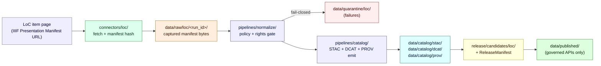

<!-- [KFM_META_BLOCK_V2]
doc_id: kfm://doc/docs-sources-catalog-loc-loc-iiif-presentations
title: LOC IIIF Presentations
type: product-page
version: v0.2
status: draft
owners: <PLACEHOLDER — Docs steward + Source steward for loc>
created: 2026-05-20
updated: 2026-05-22
policy_label: public
related:
  - docs/sources/catalog/loc/README.md
  - docs/sources/catalog/README.md
  - docs/doctrine/directory-rules.md
  - docs/sources/catalog/loc/IDENTITY.md
  - docs/sources/catalog/loc/RIGHTS-AND-SENSITIVITY-MAP.md
  - docs/sources/catalog/loc/_examples/stac-item-example.json
tags: [kfm, docs, sources, catalog, loc, iiif]
notes:
  - "PROPOSED product-page scaffold; placement and sibling-link presence remain NEEDS VERIFICATION against mounted repo."
  - "Grounded in KFM-P14-PROG-0009 (LoC IIIF STAC PROV ingestor) and C10-07 (Archives Stack)."
[/KFM_META_BLOCK_V2] -->

# LOC IIIF Presentations

> Product page (**PROPOSED scaffold**) for the federal-level archive-discovery surface admitted into KFM via IIIF Presentation Manifests.


**Status:** `draft` — PROPOSED product-page scaffold.
**Family:** [`loc`](./README.md) · **Catalog root:** [`../`](../README.md)
**Owners:** _PLACEHOLDER — Docs steward + Source steward for `loc`_
**Last reviewed:** 2026-05-22 · **Lifecycle phase:** documentation (does not own RAW/WORK/PROCESSED/CATALOG/PUBLISHED state).

---

## On this page

- [Overview](#overview)
- [Admission flow (PROPOSED)](#admission-flow-proposed)
- [Source authority](#source-authority)
- [Catalog profiles used](#catalog-profiles-used)
- [Collection identity](#collection-identity)
- [Provenance fields](#provenance-fields)
- [Temporal handling](#temporal-handling)
- [Geometry, projection, and image rights](#geometry-projection-and-image-rights)
- [Rights and sensitivity](#rights-and-sensitivity)
- [Validation and catalog closure](#validation-and-catalog-closure)
- [Related contracts and schemas](#related-contracts-and-schemas)
- [Related connectors and pipelines](#related-connectors-and-pipelines)
- [Examples (illustrative)](#examples-illustrative)
- [Open questions](#open-questions)
- [Related docs](#related-docs)

---

## Overview

> [!IMPORTANT]
> This page is a **PROPOSED scaffold**. It documents the *intended* shape of the LOC IIIF Presentations product as it would enter KFM under doctrine. It does **not** assert that the connector, pipelines, schemas, policies, or catalog entries exist in the mounted repository.

PROPOSED — The **Library of Congress (LOC)** is treated in KFM doctrine as a **federal-level discovery surface** within the archives stack, alongside KSHS Kansas Memory, KHRI, KU Spencer, KSU SC, WSU, county societies, and SNAC/EAC-CPF (per the Pass-10 atlas card **C10-07 — Archives Stack**). CONFIRMED doctrine: LOC IIIF provides the federal-level discovery surface; **IIIF v3 viewer integration** is a stated dependency at the archives-stack level.

PROPOSED admission model (per KFM atlas card **KFM-P14-PROG-0009 — Library of Congress IIIF STAC PROV ingestor**): _LoC item pages can enter KFM as source records by fetching their **IIIF Presentation Manifests**, **hashing manifest bytes**, writing **STAC metadata assets**, and attaching **PROV `wasDerivedFrom`** links._ NEEDS VERIFICATION at every implementation layer (paths, connector behavior, current endpoint URL, namespace pinning, tests).

What this page **is**:

- A product-level orientation for one product inside the `loc` source family.
- A pointer surface into the **canonical** SourceDescriptor, contracts, schemas, policy bundles, and catalog artifacts.
- A truth-labeled scaffold showing what must be confirmed before promotion.

What this page **is not**:

- A SourceDescriptor (lives in `data/registry/sources/`).
- A schema or contract (lives in `schemas/contracts/v1/source/` and `contracts/`).
- A policy decision (lives in `policy/`).
- A catalog record (lives in `data/catalog/stac/`, `data/catalog/dcat/`, `data/catalog/prov/`).
- A claim that the LOC IIIF endpoint, rights terms, or freshness behavior have been verified in this session.

[Back to top](#loc-iiif-presentations)

---

## Admission flow (PROPOSED)

> [!NOTE]
> The flow below mirrors KFM's lifecycle invariant (`RAW → WORK/QUARANTINE → PROCESSED → CATALOG/TRIPLET → PUBLISHED`) applied to a generic LoC IIIF Presentation Manifest. It is **PROPOSED** and **NEEDS VERIFICATION** against the mounted repo, the current LoC endpoint surface, and current rights terms.



[Back to top](#loc-iiif-presentations)

---

## Source authority

PROPOSED — The **authoritative SourceDescriptor** for this product lives under [`data/registry/sources/`](../../../../data/registry/sources/), with machine shape governed by `schemas/contracts/v1/source/` per Directory Rules §7.4 and ADR-0001 (schema home).

> [!WARNING]
> **Do not duplicate descriptor fields here.** This page is documentation; the SourceDescriptor is the canonical record. If a field appears in both places, the SourceDescriptor wins. PROPOSED placement; NEEDS VERIFICATION against the mounted repo.

| Surface | PROPOSED home | Owns |
|---|---|---|
| SourceDescriptor record | `data/registry/sources/` | Identity, role, rights posture, cadence, access method, sensitivity. |
| SourceDescriptor schema | `schemas/contracts/v1/source/` | Machine-checkable shape (per ADR-0001). |
| SourceDescriptor semantics | `contracts/` | Field meanings and obligations. |
| Source policy bundle | `policy/sources/` (and `policy/sensitivity/` for sensitivity rules) | Allow / deny / restrict / abstain. |
| Source fetcher | `connectors/loc/` | Admission fetch + manifest hash. |

[Back to top](#loc-iiif-presentations)

---

## Catalog profiles used

PROPOSED — KFM doctrine maps spatial and non-spatial artifacts through compatible **STAC**, **DCAT**, and **PROV** profiles where fit-for-purpose (Pass-23 card **KFM-P1-PROG-0021**). Which profiles this specific product emits depends on the descriptor and the candidate Items being produced.

| Profile | Lane (PROPOSED) | Used by this product? | Notes |
|---|---|---|---|
| **STAC** (Item / Collection with `kfm:provenance`) | `data/catalog/stac/` | PROPOSED — Yes / No (NEEDS VERIFICATION) | Item shape carries `properties.kfm:provenance` and per-asset `file:checksum`. |
| **DCAT** (Dataset / Distribution) | `data/catalog/dcat/` | PROPOSED — Yes / No (NEEDS VERIFICATION) | Required for non-spatial catalog records. |
| **PROV-O** | `data/catalog/prov/` | PROPOSED — Yes / No (NEEDS VERIFICATION) | `wasDerivedFrom` link from KFM record → LoC manifest. |
| **Domain projection** | `data/catalog/domain/<domain>/` | PROPOSED — Yes / No (NEEDS VERIFICATION) | Only if the product enters a domain lane (e.g. archaeology, settlements). |

[Back to top](#loc-iiif-presentations)

---

## Collection identity

- PROPOSED Collection id pattern: `kfm-<org>-<product>` (per Pass-10 **C4-02** suggested convention; see [`IDENTITY.md`](./IDENTITY.md)).
- PROPOSED namespace: `kfm:` (Pass-10 **C4-01**). The choice between `kfm:` and `ks-kfm:` is an **OPEN ATLAS QUESTION** (referenced here as **OPEN-DSC-03**); NEEDS VERIFICATION against the namespace declared in the live Collection summary.
- PROPOSED asset roles: TBD — confirm against `schemas/contracts/v1/source/` and the STAC profile contract files (Pass-31 card **KFM-P31-PROG-0004**). NEEDS VERIFICATION.

[Back to top](#loc-iiif-presentations)

---

## Provenance fields

PROPOSED — STAC Items emitted by this product carry an `item.properties.kfm:provenance` block per Pass-10 atlas card **C4-01**. The block is the join point between the catalog Item and the rest of KFM's evidence machinery.

| Field | Type / resolves to | Purpose (PROPOSED) |
|---|---|---|
| `spec_hash` | `sha256:…` | Hash of the canonical (JCS-normalized) record. |
| `evidence_bundle_ref` | `kfm://evidence/<digest>` → EvidenceBundle | Receipts + validations bundle. |
| `run_record_ref` | `kfm://run/<run-id>` → RunRecord | Pipeline run that produced the Item. |
| `audit_ref` | `kfm://audit/<attestation-id>` → attestation | SLSA / cosign / OPA decision attestation. |
| `policy_digest` | `sha256:…` | Hash of the policy bundle applied at promotion. |

Per-asset integrity is recorded as `file:checksum` (CONFIRMED doctrine; PROPOSED realization for this product).

> [!TIP]
> For LoC IIIF specifically: PROPOSED — the **IIIF Presentation Manifest bytes** are themselves a captured asset, and their SHA-256 should appear both at the asset level (`file:checksum`) and contribute to `spec_hash` of the KFM record. NEEDS VERIFICATION against the implemented ingestor.

[Back to top](#loc-iiif-presentations)

---

## Temporal handling

PROPOSED — KFM doctrine keeps **source**, **observed**, **valid**, **retrieval**, **release**, and **correction** times distinct where material. For LoC IIIF Presentations specifically:

- `source_time` — manifest's own dated metadata, where present.
- `observed_time` — the historical date attached to the depicted item (often manuscript / photograph date).
- `retrieval_time` — when KFM fetched the manifest (always recorded).
- `release_time` — when the KFM Item entered `data/published/`.
- `correction_time` — when a correction notice replaced or amended the record.

NEEDS VERIFICATION per product: which of these fields are required, which are optional, and what defaults apply when source metadata is silent.

[Back to top](#loc-iiif-presentations)

---

## Geometry, projection, and image rights

PROPOSED — Many LoC IIIF Presentations carry **no explicit geometry** (manuscripts, photographs) and others carry **historic-map geometry** that must be georeferenced before map use. Per Pass-23 card **KFM-P9-PROG-0074**, _KFM historic-map overlays should preserve IIIF rights, georeferencing annotation provenance, and plugin governance before MapLibre display._

PROPOSED handling matrix:

| Item type | Geometry treatment | Rights treatment |
|---|---|---|
| Manuscript / photograph (no inherent geometry) | No geometry; placed via subject linkage if any. | IIIF manifest rights propagate; image-server access terms preserved. |
| Historic map (georeferenceable) | PROPOSED — handled as **overlay** with Allmaps-style annotation provenance; never used as canonical geometry. | IIIF rights + georeferencing-error disclosure (NEEDS VERIFICATION). |
| Born-digital cartographic IIIF | PROPOSED — confirm CRS, generalization rules, and scale support against `data/catalog/` artifacts. | IIIF rights + standard map-attribution rules. |

NEEDS VERIFICATION — confirm CRS, generalization rules, scale support, and renderer-boundary behavior against current `data/catalog/` artifacts and MapLibre style contracts.

[Back to top](#loc-iiif-presentations)

---

## Rights and sensitivity

> [!CAUTION]
> **Do not restate policy on this page.** Rights and sensitivity decisions live in [`policy/sensitivity/`](../../../../policy/sensitivity/) and the family-level rights-and-sensitivity map at [`RIGHTS-AND-SENSITIVITY-MAP.md`](../RIGHTS-AND-SENSITIVITY-MAP.md). If this page and the policy bundle disagree, **the policy bundle wins**.

NEEDS VERIFICATION — confirm for this product:

- LoC rights statement / license terms for each retrieved manifest.
- CARE applicability (Indigenous data sovereignty considerations for items depicting tribal cultural heritage).
- Living-person exposure (rare for archival LoC content but possible — see [`../../../../policy/sensitivity/`](../../../../policy/sensitivity/)).
- Aggregate or third-party rights riders on derivative use.

PROPOSED tier default: **T0 / T1** for most LoC public-domain content (per KFM tier scheme T0–T4); **T2 / T3** for any rights-restricted or culturally sensitive items, escalated by policy bundle and not by this page.

[Back to top](#loc-iiif-presentations)

---

## Validation and catalog closure

PROPOSED — Before public release, a record from this product must satisfy KFM catalog closure (Pass-1 atlas idea **KFM-P1-IDEA-0020** / Pass-10 catalog discipline):

- **Catalog closure**: STAC + DCAT + PROV entries consistent and cross-linked.
- **STAC Projection lint** (Pass-27 card **KFM-P27-FEAT-0003**) — PROPOSED; surfaces `proj:code`, `proj:bbox`, `proj:geometry`, `proj:shape`, `proj:transform` compliance.
- **STAC checksum closure** against the ReleaseManifest digest (Pass-22 card **KFM-P22-PROG-0037**) — PROPOSED.
- **Catalog QA CI surface** (Pass-27 card **KFM-P27-FEAT-0004**) — PROPOSED; lists missing license, providers, stac_extensions, broken links, JSON errors, warning/fail outcomes.
- **Manifest-hash regression**: re-fetching the same LoC manifest must produce the same `spec_hash` modulo expected upstream change (NEEDS VERIFICATION — debounce / cadence policy).

[Back to top](#loc-iiif-presentations)

---

## Related contracts and schemas

| Surface | PROPOSED path | Status |
|---|---|---|
| Contracts (semantic) | `contracts/` (source family + object meanings) | NEEDS VERIFICATION |
| Schemas (machine shape) | `schemas/contracts/v1/source/` | PROPOSED per ADR-0001 |
| STAC profile contract | per Pass-31 card **KFM-P31-PROG-0004** | PROPOSED |
| Evidence bundle profile | `profiles/evidence-bundle/` (Pass-10 **C4-04**) | PROPOSED |

[Back to top](#loc-iiif-presentations)

---

## Related connectors and pipelines

| Surface | PROPOSED path | Owns |
|---|---|---|
| Connector | [`connectors/loc/`](../../../../connectors/loc/) | Fetch + hash IIIF Presentation Manifest bytes; emit to `data/raw/loc/`. |
| Ingest pipeline | `pipelines/ingest/` | Capture + receipt. |
| Normalize pipeline | `pipelines/normalize/` | Schema + rights + sensitivity gates. |
| Validate pipeline | `pipelines/validate/` | STAC / DCAT / PROV conformance. |
| Catalog pipeline | `pipelines/catalog/` | Emit `data/catalog/stac|dcat|prov/` + cross-links. |
| Domain spec (if any) | `pipeline_specs/<domain>/` | Declarative spec when product enters a domain lane. |

NEEDS VERIFICATION — each path above is PROPOSED and not asserted to exist in the mounted repo.

[Back to top](#loc-iiif-presentations)

---

## Examples (illustrative)

> [!NOTE]
> Examples below are **illustrative only**. Do not treat them as authoritative. Concrete examples should live under [`_examples/`](../_examples/) and be tested as fixtures.

See [`_examples/stac-item-example.json`](../_examples/stac-item-example.json) for the minimal STAC Item shape with the `kfm:provenance` block. The minimal sketch (illustrative, not normative) is:

```json
{
  "type": "Feature",
  "stac_version": "1.1.0",
  "id": "<kfm-loc-iiif-presentations-item-id>",
  "properties": {
    "datetime": "<source_time>",
    "kfm:provenance": {
      "spec_hash": "sha256:…",
      "evidence_bundle_ref": "kfm://evidence/<digest>",
      "run_record_ref": "kfm://run/<run-id>",
      "audit_ref": "kfm://audit/<attestation-id>",
      "policy_digest": "sha256:…"
    }
  },
  "assets": {
    "iiif_manifest": {
      "href": "<LoC IIIF Presentation Manifest URL — NEEDS VERIFICATION>",
      "type": "application/ld+json",
      "file:checksum": "sha256:…",
      "roles": ["metadata", "source"]
    }
  }
}
```

[Back to top](#loc-iiif-presentations)

---

## Open questions

<details>
<summary><strong>Verification backlog (click to expand)</strong></summary>

PROPOSED — Each item below blocks promotion to `status: review` for this page.

- **OPEN-LOC-IIIF-01** — Confirm cadence and current endpoint URL for the LoC IIIF Presentation API surface against the live source. NEEDS VERIFICATION.
- **OPEN-LOC-IIIF-02** — Confirm rights status (license / public-domain / rights-statement) per manifest, and CARE applicability for culturally significant items. NEEDS VERIFICATION.
- **OPEN-LOC-IIIF-03** — Confirm whether this product warrants its own STAC Collection (`kfm-loc-iiif-presentations`) or shares one with sibling products inside the `loc` family. NEEDS VERIFICATION.
- **OPEN-LOC-IIIF-04** — Confirm asset roles, MIME types, and conformance class against the STAC profile contract (Pass-31 card **KFM-P31-PROG-0004**). NEEDS VERIFICATION.
- **OPEN-LOC-IIIF-05** — Confirm georeferencing-error disclosure rule for warped historic maps sourced via LoC IIIF (Pass-23 card **KFM-P9-PROG-0074** open question). NEEDS VERIFICATION.
- **OPEN-DSC-03** (atlas-level) — Resolve `kfm:` vs `ks-kfm:` namespace pinning at the Collection level (Pass-10 **C4-01** open question).
- **OPEN-LOC-IIIF-06** — Confirm steward / owners for this product (currently placeholder).

</details>

[Back to top](#loc-iiif-presentations)

---

## Related docs

- [`docs/sources/catalog/loc/README.md`](./README.md) — family README for `loc`.
- [`docs/sources/catalog/README.md`](../README.md) — catalog lane orientation.
- [`docs/sources/catalog/loc/IDENTITY.md`](./IDENTITY.md) — collection-id and namespace conventions for the `loc` family.
- [`docs/sources/catalog/loc/RIGHTS-AND-SENSITIVITY-MAP.md`](./RIGHTS-AND-SENSITIVITY-MAP.md) — family-level rights/sensitivity map.
- [`docs/doctrine/directory-rules.md`](../../../../docs/doctrine/directory-rules.md) — placement doctrine.
- [`docs/standards/STAC_KFM_PROFILE.md`](../../../../docs/standards/STAC_KFM_PROFILE.md) — STAC × `kfm:provenance` profile (PROPOSED; NEEDS VERIFICATION).
- TODO — link to the LoC IIIF connector README at [`connectors/loc/README.md`](../../../../connectors/loc/README.md) once present.

---

<sub>**Last reviewed:** 2026-05-22 · **Doc version:** v0.2 (draft) · **Evidence basis:** docs-only (no mounted repo this session) · [Back to top](#loc-iiif-presentations)</sub>
