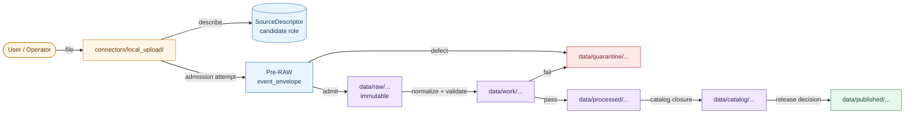
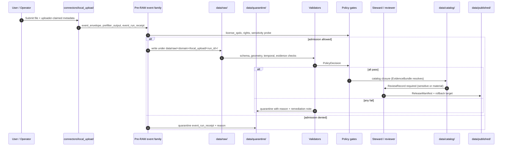

<!-- [KFM_META_BLOCK_V2]
doc_id: kfm://doc/sources-catalog-local-upload
title: Local Upload — Source Catalog Entry
type: standard
version: v2
status: draft
owners: <docs steward + source-intake steward — placeholder>
created: 2026-05-13
updated: 2026-05-22
policy_label: public
related:
  - docs/sources/SOURCE_DESCRIPTOR_STANDARD.md
  - docs/sources/catalog/README.md
  - docs/sources/catalog/loc/iiif-presentations.md
  - docs/doctrine/directory-rules.md
  - docs/doctrine/trust-membrane.md
  - docs/doctrine/lifecycle-law.md
  - docs/doctrine/truth-posture.md
  - connectors/local_upload/README.md
  - schemas/contracts/v1/source/source_descriptor.schema.json
  - policy/sources/local_upload/
tags: [kfm, sources, catalog, local_upload, connector, intake, quarantine]
notes:
  - "`connectors/local_upload/` is named in Directory Rules §7.3 and in the proposed target tree; specific file presence at any commit remains NEEDS VERIFICATION."
  - "Subdirectory `docs/sources/catalog/` remains PROPOSED — not directly attested in Directory Rules; see §13.1."
  - "All other referenced repo paths are PROPOSED until mounted-repo verification."
  - "v2: refreshed truth labels, sibling product-page cross-link, evidence appendix; no anchor changes vs v1."
[/KFM_META_BLOCK_V2] -->

# Local Upload — Source Catalog Entry

> Governance entry for the `local_upload` connector — the source family that admits user-supplied files at the trust edge with **rights, sensitivity, and source role unknown until proven**.

<p align="left">
  
  
  
  
  
  
  
  
</p>

| Field | Value |
|---|---|
| **Status** | `draft` |
| **Owners** | Docs steward + source-intake steward · *placeholder, NEEDS VERIFICATION* |
| **Last updated** | 2026-05-22 |
| **Doc class** | Standard governance doc (source catalog entry) |
| **Authority of this entry** | PROPOSED until source descriptor, fixtures, validators, and policy gates exist |
| **Authority of paths quoted here** | Mixed — `connectors/local_upload/` is CONFIRMED at the doctrine level (Directory Rules §7.3); specific file presence at any commit and all other paths remain PROPOSED until verified against mounted-repo evidence |
| **Default policy posture** | `DENY` for publication · `QUARANTINE` for admission unless rights & sensitivity resolved |
| **Lifecycle invariant** | RAW → WORK / QUARANTINE → PROCESSED → CATALOG / TRIPLET → PUBLISHED |

---

## Contents

- [1. Scope](#1-scope)
- [2. Repo fit](#2-repo-fit)
- [3. Accepted inputs](#3-accepted-inputs)
- [4. Exclusions](#4-exclusions)
- [5. Source descriptor (PROPOSED surface)](#5-source-descriptor-proposed-surface)
- [6. Lifecycle and admission flow](#6-lifecycle-and-admission-flow)
- [7. Directory placement](#7-directory-placement)
- [8. Sensitive content & deny-by-default register](#8-sensitive-content--deny-by-default-register)
- [9. Validation, fixtures, and gates](#9-validation-fixtures-and-gates)
- [10. Quickstart (illustrative)](#10-quickstart-illustrative)
- [11. FAQ](#11-faq)
- [12. Related docs](#12-related-docs)
- [13. Appendix — open questions and verification backlog](#13-appendix--open-questions-and-verification-backlog)

---

## 1. Scope

The `local_upload` source family covers any file admitted into KFM **from a person rather than from a versioned external source endpoint** — drag-and-drop uploads, browser file pickers, CLI imports, and watcher-detected staging-folder additions where the producer is a KFM user or operator rather than a third-party publisher.

This is the **highest-uncertainty intake lane in KFM**. Identity, rights, sensitivity, geometry precision, datum, source role, freshness, and redistribution posture are all **unknown at the moment of admission**. The lane therefore follows the strictest of KFM's intake defaults:

- **PROPOSED** — `local_upload` is treated as a `candidate` source role at admission, never `observed`, `regulatory`, `modeled`, `aggregate`, `administrative`, or `synthetic` until a steward review re-roles it. CONFIRMED doctrine: *source role cannot be inferred from convenience*, and *promotion never upgrades source role* (Atlas v1.1 §24.9.3).
- **CONFIRMED doctrine** — *"Unknown rights fail closed."* Material with unresolved rights stays in `QUARANTINE` until a `RightsDecision` and `SourceActivationDecision` permit movement (per Unified Implementation Architecture, source-registry doctrine).
- **CONFIRMED doctrine** — *"Quarantine is not a publishable staging area."* No path from `local_upload` to `PUBLISHED` may skip lifecycle gates.
- **CONFIRMED doctrine** — **trust membrane** (Atlas v1.1 §24.9.2): *public clients and the map shell **must not** read `RAW`, `WORK`, `QUARANTINE`, or unpublished candidates from this lane.* Governed APIs and released artifacts are the only public path.

> [!IMPORTANT]
> A `local_upload` file is **not a source** until a `SourceDescriptor` is created, reviewed, and a `SourceActivationDecision` permits its use. Until then it is a candidate awaiting steward action.

---

## 2. Repo fit

`local_upload` is a connector. It lives in the `connectors/` responsibility root and emits to `data/raw/` or `data/quarantine/` only — **never** to `processed/`, `catalog/`, or `published/`. This rule is **CONFIRMED in Directory Rules §7.3** (*"Connectors MUST NOT publish, mutate canonical truth, or write under `data/processed/`, `data/catalog/`, or `data/published/`"*).

This entry in `docs/sources/` is the **human-facing governance record** for the connector; it does not replace the per-connector README, the source descriptor schema, the validators, the policy gates, or the fixtures.



**PROPOSED diagram surface, CONFIRMED doctrine.** The arrows reflect Directory Rules and the lifecycle invariant; the specific implementation that realizes each arrow is **NEEDS VERIFICATION**. Promotion is a **governed state transition**, never a file move.

[⬆ Back to top](#local-upload--source-catalog-entry)

---

## 3. Accepted inputs

The connector **MAY** accept the following file classes as candidate material. Acceptance is not approval; every class still passes through admission, descriptor creation, sensitivity screening, and policy evaluation.

| Class | Typical extensions | Default admission posture | Notes |
|---|---|---|---|
| Tabular | `.csv`, `.tsv`, `.parquet` | `RAW` if schema-recognizable, else `QUARANTINE` | PII / DNA / parcel data trips deny-by-default per §8 |
| Vector geo | `.geojson`, `.shp` (zipped), `.gpkg` | `RAW` if geometry valid; `QUARANTINE` on datum/CRS unknown | CRS / datum provenance required (per source family doctrine) |
| Raster | `.tif`/`.tiff` (GeoTIFF/COG), `.png` (georef sidecar) | `RAW` if header parseable; `QUARANTINE` otherwise | Large rasters require downstream tile/COG conversion in `pipelines/` |
| Tabular archives | `.zip`, `.7z` containing tabular or DwC-A bundles | Unpacked into `data/work/` after virus / safety scan; per-file admission | Darwin Core Archive structure is illustrative, not authoritative |
| Documents | `.pdf`, `.docx`, `.md`, `.txt` | `RAW` with text-extraction sidecar; `QUARANTINE` if encrypted | Document content is candidate evidence, not graph truth |
| Imagery (non-geo) | `.jpg`, `.png` | `QUARANTINE` by default — EXIF / face / location risks | Requires explicit steward review before exit from quarantine |
| Unknown / opaque | anything not in this table | `QUARANTINE` | Never silently admitted |

> [!CAUTION]
> The table above is **illustrative**. Extension is not identity. Magic-byte sniffing, schema probing, and steward review govern actual class assignment. Do not treat the extensions list as a whitelist.

[⬆ Back to top](#local-upload--source-catalog-entry)

---

## 4. Exclusions

The `local_upload` lane **MUST NOT** accept, and the connector **MUST** refuse or quarantine:

| Excluded class | Reason | Goes instead to |
|---|---|---|
| Files from versioned external publishers (USGS, FEMA, NOAA, NRCS, GBIF, iNaturalist, Census, Kansas, LOC, etc.) | These have dedicated connectors with rights/cadence/access already declared | `connectors/<vendor>/` |
| Files claiming to be release artifacts (`.pmtiles`, `.json` release manifests, signed receipts) | Release artifacts originate from governed pipelines, not user uploads | Rejected; `release/` is not a user-writable surface |
| Files containing real secrets (API keys, tokens, private cosign keys) | `configs/` carries templates and defaults only; no real secrets in repo | Rejected at admission; security incident path |
| Files that bypass the trust membrane (uploads addressed to `data/processed/`, `data/catalog/`, `data/published/`) | Connectors **MUST NOT** publish or mutate canonical truth | Rejected at admission |
| Files generated by an AI model and presented as observed reality | Synthetic content requires `RealityBoundaryNote` and `synthetic` source role at admission | Re-roled as `synthetic` with a Reality Boundary Note, or rejected |
| Files identifying living persons, exact archaeological coordinates, DNA/genomic data, rare-species exact locations, critical-infrastructure precision data | Deny-by-default register; see §8 | `QUARANTINE` with steward escalation |

[⬆ Back to top](#local-upload--source-catalog-entry)

---

## 5. Source descriptor (PROPOSED surface)

Every successful admission produces a `SourceDescriptor`. For `local_upload` the descriptor carries elevated defaults reflecting the elevated uncertainty of the lane. Atlas card **KFM-P1-PROG-0007** records that *every admitted source should have a descriptor that records identity, role, rights posture, update cadence, authority scope, and verification obligations* — and that descriptors should be validated before fetch, before transformation, and before publication.

> [!NOTE]
> **PROPOSED schema home:** `schemas/contracts/v1/source/source_descriptor.schema.json` per Directory Rules §7.4 and ADR-0001. **NEEDS VERIFICATION** — actual file presence and field names are not asserted here.

| Field | Default for `local_upload` | Notes |
|---|---|---|
| `source_id` | Deterministic — e.g. `local-upload:<bao_root_hash>` (PROPOSED) | Derived from content digest, not filename, not timestamp |
| `source_family` | `local_upload` | Fixed for this lane |
| `source_role` | `candidate` | **MUST NOT** be admitted as `observed`; re-role requires steward review and a new descriptor |
| `role_candidate_disposition` | `pending` | Tracks promotion state; `PUBLISHED` edge forbidden until `merged` |
| `rights_status` | `unknown` | Triggers deny-by-default for public release until a `RightsDecision` resolves |
| `license_spdx` | `unknown` (PROPOSED) | If the uploader provides one, it is recorded but not trusted until reviewed |
| `sensitivity` | `restricted` (default) | Downgrade requires reviewer + transform receipts; see §8 |
| `cadence` | `one-shot` | Uploads are point-in-time admissions; re-upload produces a new descriptor |
| `steward` | uploader handle + assigned reviewer | Author ≠ release authority when materiality applies (separation of duties) |
| `attribution_required` | `true` until resolved | Default-true is safer than default-false |
| `public_release_class` | `denied` | Until steward action; the lane is private by default |

Fields beyond the table above (e.g. `role_authority`, `role_aggregation_unit`, `role_model_run_ref`, `role_synthetic_basis`) apply only when the descriptor is **later re-roled** away from `candidate`. See `docs/sources/SOURCE_DESCRIPTOR_STANDARD.md` *(NEEDS VERIFICATION — path PROPOSED).*

> [!TIP]
> **Watcher intake envelope (PROPOSED).** Atlas card **KFM-P4-PROG-0001** proposes that watcher / connector outputs normalize into a `SourceIntakeRecord` carrying `source_role`, `publication_state`, `promotion_required`, `evidence_bundle_resolved`, `policy_review_required`, `source_descriptor_ref`, and `drift_summary`. For `local_upload`, that envelope sits **alongside** the `SourceDescriptor`; it does not replace it. NEEDS VERIFICATION against mounted-repo schema homes.

[⬆ Back to top](#local-upload--source-catalog-entry)

---

## 6. Lifecycle and admission flow

The lifecycle invariant applies in full. `local_upload` adds **no shortcut**.



**CONFIRMED doctrine** — every transition is a governed state change, never a file move (Atlas v1.1 §24.9.1; Directory Rules §0 "Lifecycle invariant"). **PROPOSED** — exact validator names, route names, and receipt schema paths remain unverified. The pre-RAW event family itself is **PROPOSED** per Atlas card **KFM-P1-PROG-0008** (*"Watchers should produce pre-RAW or WORK-candidate events with receipts, not direct published records"*); whether it is modeled as its own contract package or as `SourceDescriptor` output is an **open atlas question**.

### Receipts emitted along the way

| Receipt | Where emitted | Required for |
|---|---|---|
| `event_run_receipt` (pre-RAW) | `data/receipts/ingest/` | Every admission attempt — successful or not |
| `SourceDescriptor` | `data/registry/sources/` | Every admitted file |
| `RawCaptureReceipt` | `data/receipts/ingest/` | RAW capture with content checksum |
| `QuarantineRecord` | `data/quarantine/<reason>/<run_id>/` | Anything that fails admission, validation, rights, or sensitivity |
| `ValidationReport` | `data/receipts/validation/` | WORK → PROCESSED transitions |
| `RedactionReceipt` | `data/receipts/pipeline/` | When sensitivity transforms apply |
| `ReviewRecord` | `data/proofs/review/` | Sensitive lanes and any material release |
| `ReleaseManifest` | `release/manifests/` | Publication; **always** with a rollback target |

Paths above are **PROPOSED** and follow the proposed lifecycle tree in the *KFM Repository Structure Guiding Document* (which mirrors Directory Rules §9 and §7.4). NEEDS VERIFICATION against mounted repo at the file level.

[⬆ Back to top](#local-upload--source-catalog-entry)

---

## 7. Directory placement

```text
PROPOSED tree — reflects Directory Rules §6.1, §7.3, §7.4, §9, and the proposed target tree in
the KFM Repository Structure Guiding Document. NEEDS VERIFICATION against mounted-repo evidence
beyond the doctrinal naming of connectors/local_upload/ (CONFIRMED doctrine, §7.3).

connectors/
└── local_upload/                        # CONFIRMED named in Directory Rules §7.3
    ├── README.md                        # connector-level doc, source descriptor reference
    ├── src/                             # admission code, prefilter, magic-byte sniff
    ├── tests/                           # connector tests + negative fixtures
    └── pipeline_specs/local_upload/     # declarative intake spec (or under pipeline_specs/)

docs/
└── sources/
    ├── SOURCE_DESCRIPTOR_STANDARD.md    # PROPOSED — referenced by every source-catalog entry
    └── catalog/                         # PROPOSED subdirectory; see §13
        ├── README.md                    # catalog of source-family entries (PROPOSED)
        ├── local_upload.md              # THIS FILE
        └── loc/                         # sibling family example (LOC IIIF Presentations, etc.)
            ├── README.md
            └── iiif-presentations.md

schemas/contracts/v1/
├── source/source_descriptor.schema.json # PROPOSED per ADR-0001 default
└── intake/event_envelope.schema.json    # PROPOSED (pre-RAW event family)

policy/
└── sources/                             # rights, sensitivity, admission gates
    └── local_upload/                    # PROPOSED — lane-specific overrides if any

tests/fixtures/sources/local_upload/     # PROPOSED — valid + invalid sample uploads
                                         # MUST include negative fixtures

data/
├── raw/<domain>/local_upload/<run_id>/  # immutable admitted material
├── quarantine/<reason>/<run_id>/        # admission / validation / rights failures
├── registry/sources/                    # SourceDescriptor records
└── receipts/ingest/                     # event + raw capture receipts
```

> [!IMPORTANT]
> **Connectors MUST NOT publish, mutate canonical truth, or write under `data/processed/`, `data/catalog/`, or `data/published/`.** This rule (Directory Rules §7.3 and the watcher-as-non-publisher invariant per Atlas card **KFM-P1-PROG-0008**) is non-negotiable. A `local_upload` admission that ends up in `data/published/` without traversing every gate above is a doctrine violation.

[⬆ Back to top](#local-upload--source-catalog-entry)

---

## 8. Sensitive content & deny-by-default register

The `local_upload` lane intersects nearly every sensitive class KFM names. The connector treats these as **deny-by-default**: admission is allowed (to `RAW` or `QUARANTINE`), publication is not.

| Class (CONFIRMED doctrine) | If detected in upload | Default outcome |
|---|---|---|
| Living-person personal data, residences, identifying assertions | Flag for privacy review; redact / aggregate / staged access | DENY public exact / identifying output |
| DNA / genomic data, raw DTC exports | Encrypted-storage isolation; no public AI inference | DENY by default; restricted steward/research only |
| Rare-species exact occurrence / nest / den / roost | Apply geoprivacy transform with receipt | DENY public exact location; generalized only |
| Archaeology coordinates, burial / sacred / culturally sensitive materials | Cultural / steward review; suppression or generalization | DENY exact public location |
| Sacred / culturally sensitive places (oral history, cultural routes) | Consultation record; sensitivity transform | DENY until steward review and access class approve |
| Critical infrastructure exact facilities / dependencies | Public-safe aggregation; role-based access | RESTRICT / DENY public precision |
| Private landowner-sensitive (field boundaries, owner identity) | Aggregation; permissions; policy review | DENY exact / public if private or rights unclear |
| Source-rights-limited records (licensed, no-redistribution, uncertain terms) | Rights register; attribution; deny derivative if barred | DENY public release until terms resolved |
| Emergency-warning misuse (operational warnings, hazard instructions) | Not-for-life-safety disclaimer | DENY life-safety replacement |
| Synthetic content (AI-generated maps, reconstructions) | Source role = `synthetic`; `RealityBoundaryNote` required | DENY publication without note; HOLD for steward review |

> [!WARNING]
> Detection is **best-effort**, not perfect. A file that *passes* automated screens is not certified clean — it is **not-yet-flagged**. Public release still requires a `ReviewRecord` and a `ReleaseManifest`. **CONFIRMED doctrine — *"Documenting a change is not validating it."* (Atlas v1.1 §24.9.3)**

[⬆ Back to top](#local-upload--source-catalog-entry)

---

## 9. Validation, fixtures, and gates

### Required validators (PROPOSED locations)

| Validator family | Proposed location | What it must prove |
|---|---|---|
| Source descriptor validator | `tools/validators/source_descriptor/` | Descriptor present; `source_role = candidate` at admission; rights & sensitivity fields populated (even if `unknown`) |
| Connector gate | `tools/validators/connector_gate/` | Connector did not write outside `data/raw/` or `data/quarantine/` |
| Rights / license validator | `tools/validators/connector_gate/` (or `policy/sources/local_upload/`) | `license_spdx` is governed; `unknown` posture routes to `QUARANTINE` |
| Geometry / CRS validator | `tools/validators/<geo>` | Datum / CRS provenance preserved; no silent reprojection |
| Sensitivity probe | `policy/sensitivity/` | Deny-by-default classes per §8 flagged before any catalog closure |
| Promotion gate | `tools/validators/promotion_gate/` | No path skips a phase; fail-closed on missing receipts |

### Negative fixtures (REQUIRED)

Per KFM testing doctrine, every validator **MUST** carry at least one negative fixture proving it fails closed. For `local_upload` that means **at minimum**:

- An upload with `license_spdx = unknown` proving admission routes to `QUARANTINE`.
- An upload with a precise sensitive-class coordinate proving publication is denied.
- An upload missing a `SourceDescriptor` proving catalog closure is denied.
- An upload claiming `source_role = observed` directly proving the candidate-default rule fires.
- An upload with synthetic / AI-generated content lacking a `RealityBoundaryNote` proving release denial.
- An upload that attempts to write to `data/processed/` proving the connector boundary holds.

> [!NOTE]
> Fixture paths above are **PROPOSED** following the `tests/fixtures/sources/local_upload/` convention. NEEDS VERIFICATION against mounted repo conventions.

[⬆ Back to top](#local-upload--source-catalog-entry)

---

## 10. Quickstart (illustrative)

> The block below is **illustrative pseudocode**, not a runnable command. Tool names, flag spellings, output paths, and validator names are PROPOSED and require verification against mounted-repo evidence.

```bash
# 1. Stage an uploaded file (admission attempt, pre-RAW).
#    Records event_envelope + event_run_receipt regardless of outcome.
kfm intake local-upload stage \
  --file ./incoming/spreadsheet.csv \
  --uploader-handle alice \
  --uploader-claimed-license "CC-BY-4.0" \
  --domain hydrology \
  --run-id $(uuidgen)

# 2. Inspect the SourceDescriptor that was produced.
#    Note: source_role is 'candidate' regardless of what the uploader claimed.
cat data/registry/sources/local-upload-*.json | jq '.source_role,.rights_status,.sensitivity'

# 3. Run admission validators. Fail-closed on rights / sensitivity / schema.
kfm validate connector-gate --run-id <run_id>
kfm validate source-descriptor --run-id <run_id>

# 4. If anything fails, the file is in data/quarantine/ with a QuarantineRecord.
ls data/quarantine/

# 5. Public release is NOT a flag on this command.
#    It requires: ReviewRecord (sensitive or material), ReleaseManifest,
#    and a rollback target — issued by release authority, not by uploader.
```

**CONFIRMED doctrine** — *no public surface change* happens at upload time. The uploader cannot publish; the connector cannot publish; only a release authority can publish, against a `ReleaseManifest` with a rollback target.

[⬆ Back to top](#local-upload--source-catalog-entry)

---

## 11. FAQ

<details>
<summary><strong>Can a user upload a file and have it appear on the public map?</strong></summary>

Not directly, and not quickly. Admission produces (at best) a `RAW` capture and a `SourceDescriptor` with `source_role = candidate`. Reaching `PUBLISHED` requires normalization, validation, sensitivity screening, catalog closure with a resolvable `EvidenceBundle`, a `ReviewRecord` where materiality or sensitivity applies, and a signed `ReleaseManifest` with a rollback target — produced by a release authority distinct from the uploader. **Promotion is a governed state transition, not a file move.**
</details>

<details>
<summary><strong>Why does <code>local_upload</code> default to <code>QUARANTINE</code> rather than <code>RAW</code>?</strong></summary>

It doesn't, strictly — well-formed uploads with admissible identity, schema, rights, and sensitivity move to `RAW`. But the *publication* posture is deny-by-default. Per CONFIRMED doctrine, *"Unknown rights fail closed."* Most user-supplied files at first contact have unknown rights, unknown sensitivity, or unknown geometry provenance. The lane is therefore conservative.
</details>

<details>
<summary><strong>What if the uploader provides a license and rights statement?</strong></summary>

Recorded, not trusted. The uploader's claim is stored on the `SourceDescriptor` for audit, but `rights_status` does not become `resolved` until a `RightsDecision` records steward review. An incorrect or fraudulent uploader claim does not move the file out of quarantine on its own.
</details>

<details>
<summary><strong>Is <code>local_upload</code> a single connector or a family?</strong></summary>

Directory Rules §7.3 names `connectors/local_upload/` as a single connector slot. In practice the lane may support multiple admission surfaces (browser drop, CLI, watcher) sharing one source family and one descriptor schema. The catalog entry covers the family; per-surface details live in the connector's own README.
</details>

<details>
<summary><strong>What happens to an upload that is denied or withdrawn?</strong></summary>

Denied admission produces a `QuarantineRecord` with a reason and remains in `data/quarantine/`. Withdrawn material after publication requires a `WithdrawalNotice` in `release/withdrawal_notices/`, a `CorrectionNotice` listing invalidated derivatives, and a `RollbackCard` if a release manifest is being reverted. Quarantine is not deletion — it is a **governed holding state**.
</details>

<details>
<summary><strong>Why is the public-release default <code>denied</code> rather than <code>restricted</code>?</strong></summary>

Because at admission KFM has no resolved rights, no validated provenance, no sensitivity classification, and no review record. `denied` is the safest publication-class default for a lane whose evidentiary posture is unestablished. A steward review can downgrade to `restricted` or `public` once support exists.
</details>

<details>
<summary><strong>How does <code>local_upload</code> differ from a versioned-publisher connector (e.g. LOC IIIF)?</strong></summary>

A versioned publisher arrives with declared identity (the LoC manifest URL), declared rights (the IIIF / LoC rights statement), and a cadence inferable from upstream change. A `local_upload` arrives with **none** of these. The LoC IIIF Presentations connector can admit at `source_role = observed` (or `authority`) once the descriptor is reviewed; `local_upload` cannot, by construction — it admits at `candidate` and re-roling requires a steward and a new descriptor. See the sibling product page at [`docs/sources/catalog/loc/iiif-presentations.md`](./loc/iiif-presentations.md) for contrast.
</details>

[⬆ Back to top](#local-upload--source-catalog-entry)

---

## 12. Related docs

- [`docs/sources/SOURCE_DESCRIPTOR_STANDARD.md`](../../SOURCE_DESCRIPTOR_STANDARD.md) — *PROPOSED* — descriptor fields, rights & sensitivity intake posture.
- [`docs/sources/catalog/README.md`](../README.md) — *PROPOSED / TODO* — catalog-lane orientation for source-family entries.
- [`docs/sources/catalog/loc/iiif-presentations.md`](./loc/iiif-presentations.md) — sibling product-page example (LOC IIIF Presentations) for contrast with this lane.
- [`docs/doctrine/directory-rules.md`](../../../doctrine/directory-rules.md) — §6.1 (`docs/`), §7.3 (`connectors/`), §7.4 (`pipelines/` and schema home), §9 (`data/` and `release/`).
- [`docs/doctrine/trust-membrane.md`](../../../doctrine/trust-membrane.md) — *PROPOSED* — public-client boundary.
- [`docs/doctrine/lifecycle-law.md`](../../../doctrine/lifecycle-law.md) — *PROPOSED* — RAW → PUBLISHED governance.
- [`docs/doctrine/truth-posture.md`](../../../doctrine/truth-posture.md) — *PROPOSED* — cite-or-abstain default.
- [`docs/governance/SEPARATION_OF_DUTIES.md`](../../../governance/SEPARATION_OF_DUTIES.md) — release-authority vs author.
- [`connectors/local_upload/README.md`](../../../../connectors/local_upload/README.md) — *PROPOSED / TODO* — connector-level README.
- [`schemas/contracts/v1/source/source_descriptor.schema.json`](../../../../schemas/contracts/v1/source/source_descriptor.schema.json) — *PROPOSED / NEEDS VERIFICATION* — descriptor schema per ADR-0001.
- [`policy/sources/`](../../../../policy/sources/) — *PROPOSED / TODO* — rights, sensitivity, admission gates.
- [`tests/fixtures/sources/local_upload/`](../../../../tests/fixtures/sources/local_upload/) — *PROPOSED / TODO* — valid + negative fixtures.

[⬆ Back to top](#local-upload--source-catalog-entry)

---

## 13. Appendix — open questions and verification backlog

<details>
<summary><strong>13.1 Open questions (NEEDS VERIFICATION / NEEDS ADR)</strong></summary>

1. **Subdirectory authority.** Directory Rules §6.1 attests `docs/sources/` for *"source-descriptor standards, source families."* It does **not** explicitly attest `docs/sources/catalog/` as a subdirectory. The Whole-UI Expansion Report references `docs/sources/SOURCE_DESCRIPTOR_STANDARD.md` (flat). The catalog subdirectory pattern used by this file (and by the sibling LOC product page) is therefore **PROPOSED** and merits either (a) a per-root README confirming the convention, or (b) a placement of this file at `docs/sources/local_upload.md` flat. Resolve before scaling the pattern across all source families.
2. **Connector activation order.** *"Keep connectors / watchers inactive until activation decision, fixtures, validators, and policy gates exist."* For `local_upload`, are all four prerequisites in place in the mounted repo? **UNKNOWN.**
3. **Pre-RAW event family.** The pre-RAW admission edge (`event_envelope`, `prefilter_output`, `event_run_receipt`) is **PROPOSED** per Atlas card **KFM-P1-PROG-0008**. Schema home, fixture home, and validator coverage for `local_upload` are **UNKNOWN.** The open atlas question — *modeled as its own contract package or as `SourceDescriptor` output?* — remains unresolved.
4. **SourceIntakeRecord envelope.** Atlas card **KFM-P4-PROG-0001** proposes a watcher-output envelope; the relationship to `SourceDescriptor` (parallel record vs. embedded fields) is **OPEN.**
5. **Default sensitivity.** This entry proposes `sensitivity = restricted` at admission. Is that consistent with the canonical sensitivity tier scheme (ADR-S-05 is on the open ADR backlog)? **NEEDS VERIFICATION / NEEDS ADR.**
6. **Uploader identity attestation.** Should `local_upload` require an authenticated uploader handle, an anonymous-but-receipted upload, or both? **OPEN.**
7. **Virus / safety scanning.** Where in the pipeline does AV / archive-bomb / zip-slip protection sit? `tools/validators/connector_gate/`, `infra/`, or a dedicated scanner package? **OPEN.**
8. **Re-roling.** The procedure for re-roling a `candidate` descriptor to `observed`, `regulatory`, `modeled`, `aggregate`, `administrative`, or `synthetic` is **PROPOSED** (new descriptor + `CorrectionNotice`, never an in-place edit per Atlas v1.1 §24.1.3). Concrete validator and CI workflow are **UNKNOWN.**

</details>

<details>
<summary><strong>13.2 Repository-state claims (UNKNOWN until mounted-repo inspection)</strong></summary>

The following statements are **UNKNOWN** in this session and remain so until the repository is inspected:

- Whether `connectors/local_upload/` exists *at a given commit* (the slot is CONFIRMED in doctrine per Directory Rules §7.3, but file presence at any commit is not asserted here).
- Whether `docs/sources/` or `docs/sources/catalog/` exists.
- Whether `schemas/contracts/v1/source/source_descriptor.schema.json` exists with the fields summarized in §5.
- Whether any of the validators in §9 exist by those names or any other.
- Whether the policy gates in `policy/sources/` exist.
- Whether ADR-0001 (schema home) is in `accepted` status.
- Whether the pre-RAW event family schemas are present.
- Whether `release/` and `data/registry/sources/` exist as Directory Rules §9 describes.

This file makes no claim about the runtime state, the CI workflow state, the test coverage, the branch protections, the deployment posture, or the public-route maturity of `local_upload`. All such claims would require mounted-repo evidence not available in this session.

</details>

<details>
<summary><strong>13.3 Evidence basis (this entry)</strong></summary>

- **CONFIRMED doctrine** — Directory Rules v1.2 §0 (lifecycle invariant), §6.1 (`docs/`), §7.3 (`connectors/`), §7.4 (schema home).
- **CONFIRMED doctrine** — Atlas v1.1 §24.9.1 (placement / authority anti-patterns), §24.9.2 (trust-membrane anti-patterns), §24.9.3 (governance-process anti-patterns), §24.1.3 (source-role anti-collapse register).
- **CONFIRMED doctrine** — KFM Connected Dots Architecture Brief (canonical-evidence vs delivery vs runtime layer separation).
- **PROPOSED tree** — KFM Repository Structure Guiding Document (proposed target tree under `connectors/`, `data/`, `release/`).
- **Atlas cards referenced** — KFM-P1-PROG-0007 (source descriptors and source-role registry), KFM-P1-PROG-0008 (pre-RAW events and watcher intake), KFM-P4-PROG-0001 (SourceIntakeRecord envelope).
- **Out of scope** — current LoC endpoint behavior, current AV scanner choice, current ADR-S-05 disposition, runtime / CI state of `local_upload` in any specific commit.

</details>

<details>
<summary><strong>13.4 Anchor & link breakage notice</strong></summary>

- This is a v2 revision of a draft doc; **no Section-1 through Section-13 anchors changed** between v1 and v2. Outbound links remain placeholders until target docs are created or verified.
- v2 adds one new outbound link to the sibling product page at [`./loc/iiif-presentations.md`](./loc/iiif-presentations.md). Adopting (or rejecting) the `docs/sources/catalog/` subdirectory pattern affects both this file and the sibling; coordinate with the docs steward before broad adoption.

</details>

[⬆ Back to top](#local-upload--source-catalog-entry)

---

<sub>**Related docs:** [SOURCE_DESCRIPTOR_STANDARD](../../SOURCE_DESCRIPTOR_STANDARD.md) · [Catalog README](../README.md) · [LOC IIIF Presentations (sibling)](./loc/iiif-presentations.md) · [Directory Rules](../../../doctrine/directory-rules.md) · [Trust membrane](../../../doctrine/trust-membrane.md) · [Lifecycle law](../../../doctrine/lifecycle-law.md)</sub>

<sub>**Last updated:** 2026-05-22 · **Status:** draft · **Version:** v2 · **Authority:** PROPOSED until source descriptor, fixtures, validators, and policy gates exist · **Evidence basis:** docs-only (no mounted repo this session) · [⬆ Back to top](#local-upload--source-catalog-entry)</sub>
