<!-- [KFM_META_BLOCK_V2]
doc_id: kfm://doc/docs-sources-catalog-loc-loc-iiif-presentations
title: LOC IIIF Presentations
type: product-page
version: v0.2
status: draft
owners: <PLACEHOLDER — Docs steward + Source steward for `loc` family>
created: 2026-05-20
updated: 2026-05-22
policy_label: public
related:
  - docs/sources/catalog/loc/README.md
  - docs/sources/catalog/loc/IDENTITY.md
  - docs/sources/catalog/loc/RIGHTS-AND-SENSITIVITY-MAP.md
  - docs/sources/catalog/loc/LCNAF.md
  - docs/sources/catalog/loc/LCSH.md
  - docs/sources/catalog/loc/CHRONICLING-AMERICA.md
  - docs/sources/catalog/loc/HISTORIC-MAPS.md
  - docs/sources/catalog/loc/_examples/stac-item-example.json
  - docs/sources/catalog/README.md
  - docs/standards/STAC_KFM_PROFILE.md
  - docs/standards/PROV.md
  - docs/standards/IIIF_PROFILE.md
  - docs/standards/PLUGIN_ALLOWLIST.md
  - docs/doctrine/directory-rules.md
  - data/registry/sources/loc/iiif-presentations/
  - schemas/contracts/v1/source/source-descriptor.schema.json
  - connectors/loc/iiif-presentations/
  - pipeline_specs/cross-domain/loc-iiif-presentations/
tags: [kfm, docs, sources, catalog, loc, iiif, presentation-manifest, archive, manuscript, photograph, base-pattern]
notes:
  - "PROPOSED product-page scaffold; the docs/sources/catalog/loc/ tree itself is PROPOSED until repo verification."
  - "This is the UMBRELLA / BASE-PATTERN product for general LoC IIIF holdings (manuscripts, photographs, prints, drawings) NOT covered by sibling products."
  - "Doctrine grounded in KFM-P14-PROG-0009 (LoC IIIF STAC PROV ingestor) and C10-07 (Archives Stack: LOC IIIF as federal-level discovery surface)."
  - "Sibling products extend this base pattern: HISTORIC-MAPS.md adds georeferencing; CHRONICLING-AMERICA.md specializes for newspapers."
  - "Owners, badge targets, and example links are explicit placeholders — not fabricated."
[/KFM_META_BLOCK_V2] -->

# LOC IIIF Presentations

> The **federal-level discovery surface** for general Library of Congress holdings — manuscripts, photographs, prints, drawings, and items — admitted into KFM as source records via their **IIIF Presentation Manifests**, with manifest digests, STAC metadata assets, and PROV `wasDerivedFrom` lineage. **This is the base IIIF-ingest pattern** that sibling LoC products extend (Historic Maps adds Allmaps georeferencing; Chronicling America specializes for newspapers).

[]() &nbsp;
[](./README.md) &nbsp;
[]() &nbsp;
[]() &nbsp;
[]() &nbsp;
[](./RIGHTS-AND-SENSITIVITY-MAP.md) &nbsp;
[](../../../doctrine/directory-rules.md) &nbsp;
[]()

**Status:** PROPOSED — scaffold only · **Source family:** [`loc`](./README.md) · **Source role (PROPOSED):** **`context`** by default; **`observation`** for items where the photograph or manuscript carries date-stamped, located, attributed evidence  
**Anchored object families (CONFIRMED doctrine):** `SourceDescriptor`, catalog records (STAC, DCAT, PROV), `EvidenceBundle`, authority crosswalks (LCNAF + LCSH + GNIS as applicable)  
**Owners:** `<PLACEHOLDER — Docs steward + Source steward for loc>` · **Last reviewed:** 2026-05-22

---

## Contents

- [1. Overview](#1-overview)
- [2. Where this product fits in the KFM corpus](#2-where-this-product-fits-in-the-kfm-corpus)
- [3. Source authority (no descriptor fields here)](#3-source-authority-no-descriptor-fields-here)
- [4. The IIIF base-ingest pattern](#4-the-iiif-base-ingest-pattern)
- [5. Catalog profiles used](#5-catalog-profiles-used)
- [6. Collection identity](#6-collection-identity)
- [7. Provenance fields (`kfm:provenance` + manifest digest)](#7-provenance-fields-kfmprovenance--manifest-digest)
- [8. Temporal handling](#8-temporal-handling)
- [9. Geometry, projection, and spatial handling](#9-geometry-projection-and-spatial-handling)
- [10. Rights, sensitivity, and CARE posture](#10-rights-sensitivity-and-care-posture)
- [11. Viewer plugin governance (Mirador · UniversalViewer)](#11-viewer-plugin-governance-mirador--universalviewer)
- [12. Validation and catalog closure](#12-validation-and-catalog-closure)
- [13. Related contracts and schemas](#13-related-contracts-and-schemas)
- [14. Related connectors and pipelines](#14-related-connectors-and-pipelines)
- [15. Examples (illustrative only)](#15-examples-illustrative-only)
- [16. Open questions](#16-open-questions)
- [17. Related docs · sibling products](#17-related-docs--sibling-products)
- [Appendix · Field expectations and disposition matrix](#appendix--field-expectations-and-disposition-matrix)

---

## 1. Overview

CONFIRMED (`KFM-P14-PROG-0009`, CAT category, EXPANDED through Pass 32): *"LoC item pages can enter KFM as source records by **fetching their IIIF Presentation Manifests**, **hashing manifest bytes**, **writing STAC metadata assets**, and **attaching PROV `wasDerivedFrom` links**."* This is the **base IIIF-ingest pattern** for KFM.

CONFIRMED (Pass 10 C10-07, "Archives Stack"): *"LOC IIIF provides the **federal-level discovery surface**"* alongside KSHS Kansas Memory (~600,000 items cited), KHRI, KU Spencer, KSU Special Collections (~1,000,000 items cited), WSU, county historical societies, and SNAC/EAC-CPF as the cross-archive authority. The Kansas archives stack is *plurally sourced*; LoC IIIF is the federal anchor in that stack.

CONFIRMED (`KFM-P14-PROG-0009` Pass 27 addendum): catalog QA, STAC Projection lint, time-series collections, and workflow-security STAC items reinforce catalog closure and federation readiness.

CONFIRMED (`KFM-P14-PROG-0009` Pass 32 addendum): **source-watch cadence**, **artifact provenance**, **STAC/DCAT/PROV distribution mapping**, **consent/reveal controls**, and **PMTiles render verification** refine this card.

PROPOSED (this product's scope, by elimination from sibling products):
- Manuscripts, personal papers, correspondence held in LoC's Manuscript Division
- Photographs, prints, drawings, and posters from LoC's Prints and Photographs (P&P) Division
- Items, collections, and exhibition objects served as IIIF Presentation Manifests
- **Excludes** newspapers (handled by [`CHRONICLING-AMERICA.md`](./CHRONICLING-AMERICA.md))
- **Excludes** georeferenced / warped historic maps (handled by [`HISTORIC-MAPS.md`](./HISTORIC-MAPS.md))
- **Excludes** controlled-vocabulary authority records (handled by [`LCNAF.md`](./LCNAF.md), [`LCSH.md`](./LCSH.md))

PROPOSED (this product page): The page describes the canonical IIIF base ingest, scoped to the umbrella case. No live repository is mounted in this session.

> [!NOTE]
> **This page is the base-pattern reference.** If a sibling LoC product (or a future non-LoC IIIF-based product) needs to specialize the ingest, it should **extend** the pattern defined here rather than re-author it. The Historic Maps product page (with Allmaps georeferencing + Representation Receipt) and the Chronicling America product page (with NER-to-event recall layer) are the two extant examples of that extension model.

[↑ Back to top](#loc-iiif-presentations)

---

## 2. Where this product fits in the KFM corpus

CONFIRMED (Directory Rules §0, §5, §6, §6.4, §6.5, §7.3, §7.4, §9.1): KFM uses **responsibility roots**, not topic roots. A product page belongs in `docs/`; the source descriptor belongs in `data/registry/sources/`; schemas live under `schemas/contracts/v1/source/` per **ADR-0001**; policy lives in `policy/`; connectors live in `connectors/`; pipelines live in `pipelines/`; declarative specs live in `pipeline_specs/`.

PROPOSED (path of this file): `docs/sources/catalog/loc/IIIF-PRESENTATIONS.md`. NEEDS VERIFICATION — the `docs/sources/catalog/loc/` tree itself is PROPOSED.

```mermaid
flowchart LR
    A[LoC item page<br/>IIIF Presentation Manifest] -->|conditional GET| B[connectors/loc/<br/>iiif-presentations/]
    B -->|raw IIIF bytes<br/>manifest digest<br/>+ receipts| C[data/raw/cross-domain/<br/>loc-iiif-presentations/]
    C --> D[data/work/<br/>extract metadata · resolve authorities]
    D -->|validators + policy| E[data/processed/]
    E --> F[data/catalog/<br/>stac/ · dcat/ · prov/]
    E -.->|authority anchoring| G[Graph projection<br/>E21 · E74 · E53 · E5<br/>via LCNAF · LCSH · GNIS]
    F --> H[release/]
    G -.-> H
    H -->|ReleaseManifest| I[data/published/<br/>api_payloads/]
    I -.->|governed API| J[Public UI · Focus Mode<br/>IIIF viewer plugin<br/>via plugin allowlist]
    style A fill:#eef,stroke:#88a
    style G fill:#fef,stroke:#a8a
    style J fill:#eff,stroke:#8aa
    style D fill:#fee,stroke:#a88
```



> [!IMPORTANT]
> The diagram reflects **CONFIRMED doctrine** (RAW → WORK / QUARANTINE → PROCESSED → CATALOG / TRIPLET → PUBLISHED; the IIIF Presentation Manifest fetch → digest → STAC + PROV mapping per `KFM-P14-PROG-0009`; authority anchoring per Pass 10 C7) — not a verified implementation. Box paths are **PROPOSED**; presence in the live repo is NEEDS VERIFICATION.

[↑ Back to top](#loc-iiif-presentations)

---

## 3. Source authority (no descriptor fields here)

CONFIRMED (doctrine, Directory Rules §9.1): The **authoritative `SourceDescriptor`** for this product lives under [`data/registry/sources/`](../../../../data/registry/sources/) (PROPOSED leaf: `data/registry/sources/loc/iiif-presentations/`). The schema home is `schemas/contracts/v1/source/source-descriptor.schema.json` per **ADR-0001**.

> [!WARNING]
> **Do not duplicate descriptor fields here.** A product page explains; the **registry owns identity, role, rights, cadence, steward, sensitivity, and access method**. Parallel authority for source identity is a Directory Rules §13 anti-pattern.

| Descriptor responsibility | Home (CONFIRMED) | Authored here? |
|---|---|---|
| Identity, role, access, cadence, rights | `data/registry/sources/loc/iiif-presentations/` | **No** — registry owns |
| Machine shape of the descriptor | `schemas/contracts/v1/source/` (ADR-0001) | **No** — schemas owns |
| Allow / deny / restrict / abstain | `policy/sensitivity/` and `policy/release/` | **No** — policy owns |
| Viewer-plugin allowlist | `policy/plugins/` (PROPOSED — see §11) | **No** — policy owns |
| Human-facing orientation, base-pattern reference, examples | this product page (`docs/`) | **Yes** |

[↑ Back to top](#loc-iiif-presentations)

---

## 4. The IIIF base-ingest pattern

This section defines the **canonical IIIF-ingest pattern** that other KFM IIIF-based products extend. The pattern is grounded in `KFM-P14-PROG-0009` (CONFIRMED atlas card) and informed by the broader archives doctrine in Pass 10 C10-07.

CONFIRMED (`KFM-P14-PROG-0009` PROPOSED operational normalization):

| Step | Behavior | Status |
|---|---|---|
| 1. **Fetch** | Pull the IIIF Presentation Manifest with conditional GET (Pass 10 C3-01) | CONFIRMED requirement |
| 2. **Hash manifest bytes** | Compute SHA-256 of the manifest JSON-LD bytes as fetched; this is the **`iiif_manifest_digest`** | CONFIRMED requirement |
| 3. **Write STAC metadata assets** | Emit a STAC Item with the manifest as an asset, plus extracted metadata as STAC properties | CONFIRMED requirement |
| 4. **Attach PROV `wasDerivedFrom` links** | Every downstream KFM artifact derived from this item carries `prov:wasDerivedFrom` back to the manifest IRI + digest | CONFIRMED requirement |

CONFIRMED extensions across the `loc` family:

| Extension | Carried by | Status |
|---|---|---|
| **Georeferencing** (warped overlay + GCPs + RMS receipt + Representation Receipt + Reality Boundary Note) | [`HISTORIC-MAPS.md`](./HISTORIC-MAPS.md) — Allmaps-annotated maps | CONFIRMED (`KFM-P9-FEAT-0016`, `KFM-P9-PROG-0074`) |
| **OCR / NER-to-event recall layer** | [`CHRONICLING-AMERICA.md`](./CHRONICLING-AMERICA.md) — newspapers | CONFIRMED (`KFM-P15-PROG-0033`) |
| **Plain item ingest** (this product) | manuscripts, photographs, prints, drawings, items | CONFIRMED (`KFM-P14-PROG-0009` base case) |

> [!TIP]
> Read in family order: this page → `HISTORIC-MAPS.md` → `CHRONICLING-AMERICA.md`. The siblings inherit (and rely on) the base pattern defined here. A new IIIF-based product should likewise inherit this page and document only the deltas.

[↑ Back to top](#loc-iiif-presentations)

---

## 5. Catalog profiles used

CONFIRMED (Pass 10 C4 + `KFM-P14-PROG-0009`): KFM publishes through **STAC** (spatiotemporal), **DCAT** (dataset-level), and **PROV-O / PAV** (lineage). The base IIIF-ingest pattern writes STAC metadata assets and attaches PROV `wasDerivedFrom` lineage — both are required.

| Profile | Lane (CONFIRMED canonical home) | Used by this product? | Basis |
|---|---|---|---|
| STAC (Items + Collection) | `data/catalog/stac/` | **PROPOSED — Yes**. Each LoC IIIF item is a STAC Item with `datetime` (from manifest metadata) and `geometry` (null or a point/bbox when location is documented). | CONFIRMED (`KFM-P14-PROG-0009`); Pass 10 C4-01 |
| DCAT | `data/catalog/dcat/` | **PROPOSED — Yes** (dataset-level row for the LoC IIIF snapshot KFM consumes) | Pass 10 C4-05; `KFM-P14-PROG-0009` Pass 32 STAC/DCAT/PROV mapping |
| PROV-O / PAV | `data/catalog/prov/` | **PROPOSED — Yes — REQUIRED**. `prov:wasDerivedFrom` chains every downstream KFM artifact back to the manifest IRI + digest | CONFIRMED (`KFM-P14-PROG-0009`); Pass 10 C8-03 |
| Domain projection | `data/catalog/domain/cross-domain/` | **PROPOSED — Yes** (cross-domain — items feed People, Settlements, Roads, Archaeology, etc.) | Directory Rules §9.1 |
| `kfm:care` extension on STAC / DCAT | as above | **PROPOSED — Yes** for items touching Indigenous communities, sovereignty-relevant content, or living-person privacy | Pass 10 C15-02 |

> [!NOTE]
> Most LoC IIIF items have a **`datetime`** value (creation date or interval) but **no geometry**. The STAC profile must support null-geometry Items for archive material. Where geometry is present (e.g., a photograph documenting a specific dated, located event), it is recorded as a point (`Point`) or bounding box (`Polygon`), not as a raster overlay.

[↑ Back to top](#loc-iiif-presentations)

---

## 6. Collection identity

PROPOSED (Pass 10 C4-02): Collection id pattern is `kfm-<org>-<product>`; the exact form for this product is left to [`IDENTITY.md`](./IDENTITY.md). Collection ids are **stable handles** — renaming a Collection breaks links throughout the catalog.

PROPOSED (Pass 10 C4-01 open question, tracked as **OPEN-DSC-03**): The vendor namespace for KFM extension fields is **unresolved between `kfm:` (KFM-global) and `ks-kfm:` (Kansas-scoped)**.

| Identity item | Status | Notes |
|---|---|---|
| Collection id pattern | PROPOSED | `kfm-<org>-<product>` (Pass 10 C4-02) |
| Namespace | UNKNOWN | `kfm:` vs `ks-kfm:` — pending **OPEN-DSC-03** ADR |
| Asset roles | NEEDS VERIFICATION | Likely `["iiif", "metadata"]` for the Presentation Manifest; `["image", "thumbnail"]` for IIIF Image API derivatives — confirm against `schemas/contracts/v1/source/` |
| Provider block | NEEDS VERIFICATION | Library of Congress as `publisher`; KFM as `processor` (PROPOSED) |
| Sub-collection breakdown | PROPOSED | Likely one Collection per LoC Division consumed (Manuscripts, P&P, Geography & Map, etc.) — see OPEN-IIIF-04 |

[↑ Back to top](#loc-iiif-presentations)

---

## 7. Provenance fields (`kfm:provenance` + manifest digest)

CONFIRMED (Pass 10 C4-01): STAC Items carry `item.properties.kfm:provenance` with:

| Field | Role | Resolves to |
|---|---|---|
| `spec_hash` | Deterministic identity of the canonical record (JCS + SHA-256) | n/a — opaque digest |
| `evidence_bundle_ref` | Truth-bearing JSON-LD bundle (claims + citations + receipts) | `kfm://evidence/<digest>` |
| `run_record_ref` | The run that produced this artifact | `kfm://run/<run-id>` |
| `audit_ref` | SLSA / OPA attestation chain | `kfm://audit/<attestation-id>` |
| `policy_digest` | The policy bundle at promotion time | sha256 of the policy set |

**Per-asset integrity:** `file:checksum` applies to each cached IIIF Presentation Manifest snapshot and any cached IIIF Image API derivative.

CONFIRMED (`KFM-P14-PROG-0009` — the **base pattern**): an `kfm:iiif` block is required:

| Field | Role | Status |
|---|---|---|
| `manifest_iri` | The IIIF Presentation Manifest IRI (LoC item page derived) | CONFIRMED requirement |
| `manifest_digest` | sha256 of the manifest JSON-LD bytes at fetch time | **CONFIRMED requirement** (`KFM-P14-PROG-0009` "hashing manifest bytes") |
| `manifest_version` | IIIF Presentation API version (2.x or 3.x — see §11) | PROPOSED — required |
| `retrieval_time` | When KFM fetched the manifest | **MUST** — required |
| `prov_wasDerivedFrom[]` | One entry per downstream KFM artifact derived from this manifest | **CONFIRMED requirement** (`KFM-P14-PROG-0009` "attaching PROV wasDerivedFrom links") |

> [!TIP]
> The `manifest_digest` is the **integrity anchor** for the whole product. If LoC changes the manifest, KFM detects it at next harvest and triggers re-validation of dependent artifacts (Story Nodes, Evidence Drawer payloads, derivative renders). A KFM artifact lacking a `manifest_digest` is not a governed IIIF artifact, regardless of what STAC fields it carries.

[↑ Back to top](#loc-iiif-presentations)

---

## 8. Temporal handling

CONFIRMED (doctrine §24.8 + repeated multi-temporal discipline): KFM keeps source / observed / valid / retrieval / release / correction times distinct where material. For LoC IIIF items:

| Time field | Meaning for this product | Status |
|---|---|---|
| `source_time` | The item's **creation date** (a photograph's exposure date, a manuscript's writing date) — often an interval | PROPOSED — required where the IIIF manifest exposes it; encode as interval where imprecise |
| `observed_time` | For an `observation`-role item (e.g., a date-stamped photograph documenting an event), the time the event was observed — typically equals `source_time` | PROPOSED — required for observation-role items |
| `valid_time` | Rarely applicable to archive items; sometimes used for manuscripts whose validity is bounded (a deed for a parcel valid between two dates) | NEEDS VERIFICATION per item |
| `retrieval_time` | When KFM fetched the IIIF manifest | **MUST** — required |
| `release_time` | When the KFM cached item entered PUBLISHED | PROPOSED — required (set by `ReleaseManifest`) |
| `correction_time` | When LoC re-released the item or KFM re-ingested | PROPOSED — required when applicable |
| `manifest_revision_time` *(IIIF-specific)* | When the IIIF Presentation Manifest itself was last modified | PROPOSED — surface as a stale-state badge per §24.8 |

CONFIRMED (`KFM-P14-PROG-0009` Pass 32 addendum): **source-watch cadence** is required so that manifest revisions propagate. A manifest revised upstream without re-harvest produces silent drift in dependent KFM artifacts.

CONFIRMED (§24.8 stale-state markers): When LoC revises a manifest, KFM must show a **schema-or-source-drift** badge and trigger re-validation on dependent artifacts.

> [!NOTE]
> Archive item dating is **structurally imprecise**: a "1872 photograph" may have a date stamped in pencil years later, a manuscript "ca. 1880" may span 1875–1885. Encode `source_time` as an interval where the manifest supports it; do not collapse to a single year for UI convenience.

[↑ Back to top](#loc-iiif-presentations)

---

## 9. Geometry, projection, and spatial handling

CONFIRMED (Pass 10 C4-01): STAC Items have `geometry` and `bbox`. For LoC IIIF items, geometry is **conditionally present** depending on item type and metadata richness.

| Item type (illustrative) | Typical geometry | Notes |
|---|---|---|
| Personal correspondence, manuscript | **null** (no documented location) | STAC profile must support null-geometry Items |
| Photograph with documented location | `Point` (where the photographer stood) — encoded EPSG:4326 | Cite the source of the location in `kfm:provenance.evidence_bundle_ref` |
| Photograph documenting a region | `Polygon` (bbox of depicted area) — encoded EPSG:4326 | Same |
| Manuscript bound to a specific place | `Point` or `Polygon` from authority resolution (GNIS / TGN / Wikidata-place) | Place authority resolved separately, see §13 |
| Architectural drawing of a built structure | `Point` (structure location) — encoded EPSG:4326 | If the structure is geocoded; null otherwise |

> [!CAUTION]
> A geometry on a LoC item is a **derived inference**, not an observed measurement, unless the item itself contains geospatial coordinates (rare). The Evidence Drawer must surface the **basis** of the geometry (manifest field, authority resolution, or steward annotation) so the user can judge confidence.

PROPOSED rules:
- **CRS for geometry-carrying Items:** `EPSG:4326` for catalog records; tile-time CRS (`EPSG:3857`) applies only if the item enters a map-layer publication path.
- **Generalization:** archive-item geometries are typically point or bbox; generalization rules do not apply in the way they do to raster overlays.
- **Geocoding provenance:** every geometry must record its provenance (manifest, place authority, steward) — bare coordinates without provenance are denied.

[↑ Back to top](#loc-iiif-presentations)

---

## 10. Rights, sensitivity, and CARE posture

NEEDS VERIFICATION (default for this product): defer to [`policy/sensitivity/`](../../../../policy/sensitivity/) and [`./RIGHTS-AND-SENSITIVITY-MAP.md`](./RIGHTS-AND-SENSITIVITY-MAP.md). **Do not restate policy here.**

CONFIRMED (Master MapLibre Q section; Pass 10 C15 CARE; `KFM-P10-PROG-0014` SPDX guard):

- **Anti-pattern (CONFIRMED):** *"Assuming all mirrors inherit federal public domain rights."* LoC IIIF items have **highly variable** rights postures — some U.S.-government works in the public domain, some donated collections with separate rights, some items where rights are unknown. Rights **MUST be checked per item**, not assumed federal-domain.
- **IIIF rights propagation (CONFIRMED, `KFM-P15-PROG-0033`):** LOC services should be admitted *"with **rights propagation**"*. The rights statement carried in the IIIF manifest MUST be preserved as a STAC asset on the Item and surfaced in the Evidence Drawer.
- **SPDX discipline (PROPOSED):** DCAT `license` and any package manifest touching this product MUST carry a valid SPDX identifier or accepted license IRI; `license_map.json` (`KFM-P26-PROG-0021`) maps statuses to allowed flags.

PROPOSED (sensitivity tier baseline):

- **T0** (open public) for items whose IIIF manifest asserts no restriction and whose content is not culturally or personally sensitive.
- **T1+ escalation** when the item:
  - depicts a **living person** without consent (rare in archive material but possible in 20th-century collections);
  - depicts **Indigenous individuals, ceremonies, sacred sites, or culturally-restricted material** — CARE applicability per Pass 10 C15-02 / C15-03; OPA default-deny on publication applies until the named authority's consent grant is present, valid, and unrevoked;
  - depicts **medical / military / law-enforcement** content with a documented restriction;
  - is part of a **donor-restricted collection** where the IIIF manifest's rights statement signals restriction.

CONFIRMED (`KFM-P14-PROG-0009` Pass 32 addendum): **consent/reveal controls** are part of the IIIF-ingest pattern's runtime obligations — the UI surface (per `KFM-P32-FEAT-0010` "Reveal timer HUD") must display reveal state, time remaining, consent scope, and revoke action while sensitive overlays are active.

> [!WARNING]
> LoC's Manuscript Division and Prints & Photographs Division both contain material that **documents communities and individuals who did not consent to its preservation or publication**. CARE flags + steward review + a public-facing interpretive caveat in the Evidence Drawer are required for such material. Do not silently render Indigenous, immigrant, or marginalized-community material as if it were neutral archive content.

[↑ Back to top](#loc-iiif-presentations)

---

## 11. Viewer plugin governance (Mirador · UniversalViewer)

CONFIRMED (Pass 10 C10-07 Dependencies): **IIIF v3 viewer integration** is a named dependency for the Kansas archives stack.

CONFIRMED (parallel to `ML-064-037` for Allmaps `WarpedMapLayer`): KFM treats third-party viewer plugins as **conditional overlay plugins with dependency governance** — plugin allowlist + attribution/rights tests are required.

PROPOSED (operational rules for IIIF viewer plugins):

| Concern | Rule |
|---|---|
| Allowlist | The IIIF viewer (e.g., Mirador, UniversalViewer, or any other IIIF v3 viewer) must appear in `policy/plugins/` (PROPOSED path) with pinned versions and digests |
| IIIF Presentation API version | Both v2 and v3 are observed in the wild; KFM SHOULD prefer v3 and document v2 → v3 migration per the IIIF specification | PROPOSED |
| SRI / version pinning | Browser-loaded viewer assets must be SRI-pinned or shipped as in-tree packages |
| Attribution test | A CI test must verify that every Story Node consuming a LoC IIIF item surfaces the LoC attribution and IIIF rights statement |
| Sandboxing | The viewer runs only inside the Story Node / Evidence Drawer panel; it does not gain access to other governed UI surfaces |
| Update governance | A new viewer version must enter via an ADR or per-root README update — never as a silent dependency bump |

> [!IMPORTANT]
> The viewer plugin allowlist is **policy**, not a build-time convenience. The Historic Maps product page applies the same pattern for Allmaps `WarpedMapLayer` (`ML-064-037`). Both sibling products share `policy/plugins/` as the canonical home.

[↑ Back to top](#loc-iiif-presentations)

---

## 12. Validation and catalog closure

CONFIRMED (`KFM-P1-IDEA-0020`, "Catalog closure before public release"): Public release requires **catalog closure** that links evidence, source role, policy, proof, release state, and rollback target.

| Gate | Reference | Status for this product |
|---|---|---|
| Catalog closure (STAC + DCAT + PROV + evidence) | `KFM-P1-IDEA-0020` | **Required** before publication |
| **IIIF manifest digest computed and stored** | `KFM-P14-PROG-0009` ("hashing manifest bytes") | **Required** — the integrity anchor |
| **PROV `wasDerivedFrom` chain present** | `KFM-P14-PROG-0009` ("attaching PROV wasDerivedFrom links") | **Required** for every downstream KFM artifact |
| **IIIF manifest rights preserved and surfaced** | `KFM-P15-PROG-0033` ("rights propagation") | **Required** |
| Viewer plugin allowlist + attribution test | parallel `ML-064-037`; Pass 10 C10-07 | **Required** |
| Source-watch cadence configured | `KFM-P14-PROG-0009` Pass 32 addendum | **Required** |
| Consent/reveal controls for T1+ items | `KFM-P14-PROG-0009` Pass 32 addendum; `KFM-P32-FEAT-0010` | **Required** for sensitive items |
| Catalog QA surface | `KFM-P27-FEAT-0004` | PROPOSED |
| STAC Projection lint | `KFM-P27-FEAT-0003` | PROPOSED (for geometry-carrying Items) |
| Dataset promotion MetaBlock v2 checklist | `KFM-P14-PROG-0033` | PROPOSED — fail-closed |
| SPDX license guard | `KFM-P10-PROG-0014` | PROPOSED — required |

[↑ Back to top](#loc-iiif-presentations)

---

## 13. Related contracts and schemas

| Object family | Home (CONFIRMED doctrine) | Status |
|---|---|---|
| `SourceDescriptor` (meaning) | [`contracts/source/`](../../../../contracts/source/) | NEEDS VERIFICATION |
| `SourceDescriptor` (shape) | [`schemas/contracts/v1/source/`](../../../../schemas/contracts/v1/source/) — per **ADR-0001** | CONFIRMED schema-home rule |
| `EvidenceBundle` (shape) | `schemas/contracts/v1/evidence/evidence_bundle.schema.json` | CONFIRMED in Master MapLibre object table |
| STAC Item / Collection (shape) | `schemas/contracts/v1/stac/` *(structure NEEDS VERIFICATION)* | PROPOSED |
| `EvidenceDrawerPayload` | `schemas/contracts/v1/ui/evidence_drawer_payload.schema.json` | CONFIRMED in Master MapLibre object table |
| Catalog records (DCAT, PROV) | `schemas/contracts/v1/{dcat,prov}/` *(structure NEEDS VERIFICATION)* | PROPOSED |
| Graph projection (CIDOC-CRM) | derived; not a primary store (Pass 10 C8-01 / C8-04) | CONFIRMED doctrine |
| Authority crosswalks | See sibling pages [`LCNAF.md`](./LCNAF.md), [`LCSH.md`](./LCSH.md) | CONFIRMED (Pass 10 C7-02 + C7 overview) |
| Plugin allowlist | [`policy/plugins/`](../../../../policy/plugins/) (PROPOSED) | PROPOSED |
| Policy bundle | [`policy/`](../../../../policy/) — singular, canonical | CONFIRMED (Directory Rules §6.5) |

> [!NOTE]
> If contracts and schemas conflict (e.g., a `*.schema.json` under `contracts/`), the **schema-home rule (ADR-0001)** wins: `schemas/contracts/v1/...` is canonical.

[↑ Back to top](#loc-iiif-presentations)

---

## 14. Related connectors and pipelines

CONFIRMED (Directory Rules §7.3, §7.4): Connectors fetch and admit; pipelines transition lifecycle phases.

| Stage | Path (CONFIRMED canonical home) | Status for this product |
|---|---|---|
| Source fetch + admission | `connectors/loc/iiif-presentations/` | **PROPOSED** — uses conditional GET (Pass 10 C3-01); cache keyed by IIIF manifest IRI |
| Ingest | `pipelines/ingest/` | PROPOSED — IIIF manifest byte capture + digest computation |
| Normalize | `pipelines/normalize/` | PROPOSED — extract STAC properties; resolve authorities (LCNAF, LCSH, GNIS as applicable) |
| Validate | `pipelines/validate/` | PROPOSED — IIIF v2 / v3 schema validation, rights presence, authority anchor presence for in-scope record classes |
| Catalog | `pipelines/catalog/` | PROPOSED — STAC Item + DCAT row + PROV chain |
| Triplets / graph projection | `pipelines/triplets/` | PROPOSED — bind to E5 / E7 / E21 / E53 / E55 / E74 per CIDOC-CRM C8-01 |
| Watchers | `pipelines/watchers/` | PROPOSED — periodic re-harvest for manifest revisions (`KFM-P14-PROG-0009` Pass 32 source-watch cadence) |
| Declarative spec | `pipeline_specs/cross-domain/loc-iiif-presentations/` | PROPOSED — cross-domain because consumers span People, Settlements, Roads, Archaeology, etc. |

NEEDS VERIFICATION (Directory Rules §13.5 anti-pattern *Source alias drift risk*): the connector folder name must align with the source id under `data/registry/sources/`. Do not introduce a connector alias that diverges from the registry id without a recorded compatibility map.

[↑ Back to top](#loc-iiif-presentations)

---

## 15. Examples (illustrative only)

> [!NOTE]
> Examples below are **illustrative**, not authoritative. Authoritative samples live under [`_examples/`](./_examples/) and the fixture lanes — do not treat any block on this page as a contract.

See [`_examples/stac-item-example.json`](./_examples/stac-item-example.json).

<details>
<summary><strong>Illustrative STAC Item sketch for a manuscript or photograph (DO NOT COPY VERBATIM)</strong></summary>

```json
{
  "type": "Feature",
  "stac_version": "1.0.0",
  "id": "<PROPOSED collection-id>/<loc-item-id>",
  "collection": "<PROPOSED kfm-<org>-loc-iiif-presentations>",
  "geometry": null,
  "bbox": null,
  "properties": {
    "datetime": null,
    "start_datetime": "<source_time_lower YYYY-MM-DDTHH:MM:SSZ>",
    "end_datetime": "<source_time_upper YYYY-MM-DDTHH:MM:SSZ>",
    "title": "<item title from IIIF manifest>",
    "description": "<item description>",
    "license": "<SPDX or rights statement IRI — NEEDS VERIFICATION per item>",
    "kfm:provenance": {
      "spec_hash": "sha256:<...>",
      "evidence_bundle_ref": "kfm://evidence/<digest>",
      "run_record_ref": "kfm://run/<run-id>",
      "audit_ref": "kfm://audit/<attestation-id>",
      "policy_digest": "sha256:<...>"
    },
    "kfm:iiif": {
      "manifest_iri": "<IIIF Presentation Manifest URL>",
      "manifest_digest": "sha256:<...>",
      "manifest_version": "3.0",
      "retrieval_time": "<ISO-8601>",
      "prov_wasDerivedFrom": []
    },
    "kfm:authority_anchors": {
      "lcnaf": ["https://id.loc.gov/authorities/names/<n##########>"],
      "lcsh":  ["https://id.loc.gov/authorities/subjects/sh##########"],
      "gnis":  null,
      "wikidata": ["http://www.wikidata.org/entity/Q<...>"]
    }
  },
  "assets": {
    "iiif_manifest": {
      "href": "<IIIF Presentation Manifest URL>",
      "type": "application/ld+json",
      "roles": ["metadata", "iiif"],
      "file:checksum": "sha256:<...>"
    },
    "iiif_thumbnail": {
      "href": "<IIIF Image API thumbnail URL>",
      "type": "image/jpeg",
      "roles": ["thumbnail", "image"],
      "file:checksum": "sha256:<...>"
    }
  },
  "links": [
    { "rel": "attestation", "href": "kfm://evidence/<digest>", "title": "EvidenceBundle (KFM)" },
    { "rel": "via", "href": "<LoC item page URL>", "title": "Library of Congress item page" }
  ]
}
```

</details>

<details>
<summary><strong>Illustrative STAC Item sketch for a photograph with documented location</strong></summary>

```json
{
  "type": "Feature",
  "stac_version": "1.0.0",
  "id": "<PROPOSED collection-id>/<loc-item-id>",
  "collection": "<PROPOSED kfm-<org>-loc-iiif-presentations>",
  "geometry": { "type": "Point", "coordinates": [/* lon, lat in EPSG:4326 */] },
  "bbox": [/* point bbox */],
  "properties": {
    "datetime": "<source_time YYYY-MM-DDTHH:MM:SSZ>",
    "title": "<photo title>",
    "kfm:geometry_basis": "iiif_manifest_field",
    "kfm:provenance": { /* as above */ },
    "kfm:iiif": { /* as above */ }
  },
  "assets": { /* as above */ }
}
```

</details>

<details>
<summary><strong>Illustrative PROV chain sketch (DO NOT COPY VERBATIM)</strong></summary>

```turtle
@prefix prov: <http://www.w3.org/ns/prov#> .
@prefix kfm:  <https://kfm.example/ns/> .

<kfm://artifact/<downstream-id>> a prov:Entity ;
    prov:wasDerivedFrom <kfm://iiif/manifest/<digest>> ;
    prov:wasGeneratedBy <kfm://run/<run-id>> .

<kfm://iiif/manifest/<digest>> a prov:Entity ;
    kfm:manifest_iri "<LoC IIIF Presentation Manifest URL>" ;
    kfm:manifest_digest "sha256:<...>" ;
    kfm:retrieval_time "<ISO-8601>" .

<kfm://run/<run-id>> a prov:Activity ;
    prov:used <kfm://iiif/manifest/<digest>> ;
    kfm:run_receipt_ref <kfm://run/<run-id>> .
```

</details>

[↑ Back to top](#loc-iiif-presentations)

---

## 16. Open questions

- **OPEN-IIIF-01** — Confirm whether KFM standardizes on **IIIF Presentation API v3** as the canonical version, with v2 → v3 migration handled at ingest. CONFIRMED dependency (`C10-07`) names "IIIF v3 viewer integration"; specific KFM policy pending an ADR.
- **OPEN-IIIF-02** — Pin the **IIIF viewer plugin allowlist** (`policy/plugins/` PROPOSED) — which viewer (Mirador, UniversalViewer, or other) is the canonical choice; SRI / version-pin convention.
- **OPEN-IIIF-03** — Resolve `source_role` defaulting: this page proposes **`context`** by default, **`observation`** for date-stamped located photographs / manuscripts. Pin in an ADR or in the source descriptor's role enum.
- **OPEN-IIIF-04** — Confirm whether this product warrants its own **STAC Collection** or one Collection per LoC Division (Manuscripts, P&P, etc.) or a single `kfm-<org>-loc-iiif-presentations` umbrella Collection.
- **OPEN-IIIF-05** — Confirm rights status per snapshot — federal-domain default MUST NOT be applied silently.
- **OPEN-IIIF-06** — Pin namespace choice (`kfm:` vs `ks-kfm:`) — tracked as **OPEN-DSC-03**.
- **OPEN-IIIF-07** — Resolve docs filename naming (`PROV.md` vs `PROVENANCE.md`) — tracked as **ADR-S-06**.
- **OPEN-IIIF-08** — Confirm whether `docs/sources/catalog/loc/` is the established docs convention for source product pages, or whether they live under `docs/dossiers/sources/`.
- **OPEN-IIIF-09** — Confirm the **source-watch cadence** for LoC IIIF manifests (`KFM-P14-PROG-0009` Pass 32 addendum names the requirement; specific cadence values are pending).
- **OPEN-IIIF-10** — Define the **`kfm:authority_anchors`** field shape conclusively; this page treats it as a multi-authority object keyed by authority name. Codify in an ADR or atlas card.
- **OPEN-IIIF-11** — Confirm domain lane: `pipeline_specs/cross-domain/loc-iiif-presentations/` (PROPOSED) vs. per-primary-consumer-domain scoping.
- **OPEN-IIIF-12** — Confirm IIIF Image API derivative handling — whether KFM mirrors thumbnails / full images locally for offline reads, or always references LoC's IIIF Image API endpoint at view time.

[↑ Back to top](#loc-iiif-presentations)

---

## 17. Related docs · sibling products

- [`./README.md`](./README.md) — `loc` source family overview
- [`./IDENTITY.md`](./IDENTITY.md) — collection-id pattern, namespace decisions for the `loc` family
- [`./RIGHTS-AND-SENSITIVITY-MAP.md`](./RIGHTS-AND-SENSITIVITY-MAP.md) — rights and sensitivity disposition for `loc` products
- **Sibling `loc` products (extension relationships explicit):**
  - [`./LCNAF.md`](./LCNAF.md) — authority anchor for persons / corporate bodies that appear in LoC IIIF items (CIDOC-CRM E21 / E74 binding)
  - [`./LCSH.md`](./LCSH.md) — authority anchor for topical subject classification on LoC IIIF items (CIDOC-CRM E55 Type binding)
  - [`./CHRONICLING-AMERICA.md`](./CHRONICLING-AMERICA.md) — **extends** this base pattern for LoC newspapers, adding OCR + NER-to-event recall layer
  - [`./HISTORIC-MAPS.md`](./HISTORIC-MAPS.md) — **extends** this base pattern for LoC G&M historic maps, adding Allmaps georeferencing + Representation Receipt + Reality Boundary Note
- [`./_examples/stac-item-example.json`](./_examples/stac-item-example.json) — minimal STAC + `kfm:provenance` + `kfm:iiif` shape
- [`../README.md`](../README.md) — `docs/sources/catalog/` overview
- [`../../../standards/STAC_KFM_PROFILE.md`](../../../standards/STAC_KFM_PROFILE.md) — KFM STAC profile (namespace, extensions, attestation hook)
- [`../../../standards/PROV.md`](../../../standards/PROV.md) — PROV-O / PAV provenance profile *(filename pending ADR-S-06)*
- [`../../../standards/IIIF_PROFILE.md`](../../../standards/IIIF_PROFILE.md) — KFM IIIF profile (version pin, viewer choices) *(path PROPOSED)*
- [`../../../standards/PLUGIN_ALLOWLIST.md`](../../../standards/PLUGIN_ALLOWLIST.md) — plugin-allowlist convention *(path PROPOSED)*
- [`../../../doctrine/directory-rules.md`](../../../doctrine/directory-rules.md) — placement law
- [`../../../adr/ADR-0001-schema-home.md`](../../../adr/ADR-0001-schema-home.md) — schema-home rule *(path PROPOSED)*

[↑ Back to top](#loc-iiif-presentations)

---

## Appendix · Field expectations and disposition matrix

<details>
<summary><strong>Expand: per-field expectations summary</strong></summary>

| Concern | Field / artifact | Required? | Status |
|---|---|---|---|
| Identity | STAC `id`, `collection` | MUST | PROPOSED pattern: `kfm-<org>-<product>` |
| Manifest IRI | `kfm:iiif.manifest_iri` | MUST | CONFIRMED requirement (`KFM-P14-PROG-0009`) |
| **Manifest digest** | `kfm:iiif.manifest_digest` (sha256 of manifest bytes) | **MUST — integrity anchor** | CONFIRMED requirement (`KFM-P14-PROG-0009`) |
| Manifest version | `kfm:iiif.manifest_version` (2 or 3) | MUST | PROPOSED |
| Authority anchors | `kfm:authority_anchors.{lcnaf, lcsh, gnis, wikidata}[]` | when applicable | PROPOSED — see OPEN-IIIF-10 |
| Time | `start_datetime` / `end_datetime` (source interval), `retrieval_time` | MUST | PROPOSED |
| Geometry | `geometry` (null OK; Point or Polygon when documented) + `kfm:geometry_basis` | when applicable | PROPOSED |
| License | DCAT `dct:license` (SPDX or rights statement IRI) | MUST | NEEDS VERIFICATION per item |
| Provenance | `kfm:provenance.{spec_hash, evidence_bundle_ref, run_record_ref, audit_ref, policy_digest}` | MUST | CONFIRMED shape (Pass 10 C4-01) |
| **PROV chain** | `prov:wasDerivedFrom` linking downstream artifacts to the manifest IRI + digest | MUST | CONFIRMED requirement (`KFM-P14-PROG-0009`) |
| Asset integrity | `file:checksum` on cached manifest + thumbnails | MUST | CONFIRMED shape (Pass 10 C4-01) |
| Viewer plugin | allowlist entry + SRI / version pin | MUST | PROPOSED (parallel to `ML-064-037`) |
| Attribution test | CI test for LoC attribution + IIIF rights surfacing | MUST | CONFIRMED requirement (`KFM-P15-PROG-0033` "rights propagation") |
| CARE handling | `kfm:care` block on STAC / DCAT for sensitive items | when applicable | CONFIRMED extension (Pass 10 C15-02) |
| Consent/reveal | reveal HUD per `KFM-P32-FEAT-0010`; default-deny per Pass 10 C15-03 | when applicable (T1+) | CONFIRMED requirement |
| Catalog closure | STAC + DCAT + PROV + EvidenceBundle + receipt + rollback target | MUST before publish | CONFIRMED gate (`KFM-P1-IDEA-0020`) |
| Source-watch cadence | watcher configured per `KFM-P14-PROG-0009` Pass 32 addendum | MUST | CONFIRMED requirement |
| Stale-state markers | manifest revision, schema drift, policy change | UI badge required | CONFIRMED (§24.8) |

</details>

<details>
<summary><strong>Expand: disposition by source-role family</strong></summary>

| KFM source role | Applies to this product? | Notes |
|---|---|---|
| `observed` | **Sometimes** | Date-stamped located photographs and dated manuscripts documenting specific events can be `observation`-role |
| `regulatory` | No | LoC IIIF items are not regulatory artifacts |
| `modeled` | No | Items are not model outputs |
| `aggregate` | No | Items are per-item, not aggregate |
| `administrative` | Sometimes | Some manuscripts (deeds, certificates) are administrative artifacts |
| `candidate` | **Yes** during admission | New harvests are candidates until validated |
| `synthetic` | No | LoC items are not synthetic |
| `authority` | No | Authorities (LCNAF, LCSH) are sibling products, not this one |
| **`context`** *(KFM-specific default for this product)* | **Yes — primary role** | Most LoC IIIF items provide contextual evidence for Story Nodes and Focus Mode; pin in OPEN-IIIF-03 |

</details>

<details>
<summary><strong>Expand: worked rows for item outcomes (illustrative)</strong></summary>

| Case | Outcome | Required artifact |
|---|---|---|
| Manuscript with clear LoC rights, no geometry, full LCNAF / LCSH anchoring | Promote to PUBLISHED; surface in Story Node / Focus Mode | full STAC Item + `kfm:iiif` + `kfm:authority_anchors` + Evidence Drawer payload |
| Photograph with documented location, LoC rights clear | Promote with `geometry` as Point + `kfm:geometry_basis: "iiif_manifest_field"` | as above + non-null `geometry` |
| Photograph depicting Indigenous individuals / ceremony / sacred site | CARE flag; route to steward review; reveal controls per `KFM-P32-FEAT-0010` before any public surface | `kfm:care` block + `ReviewRecord` + reveal HUD |
| Item with uncertain LoC rights | Deny publication; route to rights-clearance review | `PolicyDecision` (DENY) + `ReviewRecord` |
| Manifest revised upstream after KFM cache | Trigger re-harvest watcher; mark dependent artifacts stale until re-validated | stale-state badge per §24.8 |
| Viewer plugin version bump without ADR | Catalog-closure gate fails closed | block release; require ADR or per-root README update |
| Item without LCNAF / LCSH coverage for an in-scope authority class | Route to stewarded local authority; do not fall through to bare Wikidata | local term + `ReviewRecord` |

</details>

---

> [!NOTE]
> **Truth posture:** Every implementation-shaped claim on this page is **PROPOSED** or **NEEDS VERIFICATION** until a mounted-repo inspection, an accepted ADR, and the relevant per-root README review confirm the placements. Doctrine references (Directory Rules §§0, 5–9; ADR-0001; CDB §24.7 receipts; §24.8 stale-state; Pass 10 C4-01, C4-05, C8-01, C8-03, C10-07, C15-02 / C15-03; `KFM-P14-PROG-0009`; `KFM-P15-PROG-0033`; `KFM-P9-FEAT-0016`; `KFM-P9-PROG-0074`; `KFM-P1-IDEA-0020`; `KFM-P14-PROG-0033`; `KFM-P32-FEAT-0010`) are **CONFIRMED** as doctrinal references; their implementation in this repo is **NEEDS VERIFICATION**.

---

**Related docs:** [loc family README](./README.md) · [IDENTITY](./IDENTITY.md) · [RIGHTS-AND-SENSITIVITY-MAP](./RIGHTS-AND-SENSITIVITY-MAP.md) · [LCNAF](./LCNAF.md) · [LCSH](./LCSH.md) · [Chronicling America](./CHRONICLING-AMERICA.md) · [Historic Maps](./HISTORIC-MAPS.md) · [STAC KFM Profile](../../../standards/STAC_KFM_PROFILE.md) · [IIIF Profile](../../../standards/IIIF_PROFILE.md) · [Plugin Allowlist](../../../standards/PLUGIN_ALLOWLIST.md) · [Directory Rules](../../../doctrine/directory-rules.md)

*Last updated: 2026-05-22 · Doc version: v0.2 · Status: PROPOSED scaffold*

[↑ Back to top](#loc-iiif-presentations)
