<!-- [KFM_META_BLOCK_V2]
doc_id: kfm://doc/docs-sources-catalog-local_upload-user-file-upload
title: Local Upload — User File Upload (product)
type: product-page
version: v0.2
status: draft
owners: <PLACEHOLDER — Docs steward + Source steward for local_upload>
created: 2026-05-20
updated: 2026-05-22
policy_label: public
related:
  - docs/sources/catalog/local_upload/README.md
  - docs/sources/catalog/local_upload.md
  - docs/sources/catalog/README.md
  - docs/sources/catalog/loc/iiif-presentations.md
  - docs/sources/SOURCE_DESCRIPTOR_STANDARD.md
  - docs/doctrine/directory-rules.md
  - docs/doctrine/trust-membrane.md
  - docs/doctrine/lifecycle-law.md
  - connectors/local_upload/README.md
  - schemas/contracts/v1/source/source_descriptor.schema.json
  - policy/sources/local_upload/
  - policy/sensitivity/
tags: [kfm, docs, sources, catalog, local_upload, intake, quarantine, candidate]
notes:
  - "PROPOSED product-page scaffold for the user-initiated admission product within the local_upload family."
  - "`connectors/local_upload/` is CONFIRMED at the doctrine level (Directory Rules §7.3); file presence at any commit is NEEDS VERIFICATION."
  - "Subdirectory pattern docs/sources/catalog/local_upload/ remains PROPOSED — see OPEN-LU-UFU-01."
  - "v0.2: tailored template to local_upload reality (no endpoint URL, no cadence, candidate role default); added sibling cross-links and pattern-resolution open question."
[/KFM_META_BLOCK_V2] -->

# Local Upload Connector

> Product page (**PROPOSED scaffold**) for the **user-initiated file-upload admission product** inside the `local_upload` source family — the highest-uncertainty intake lane in KFM, admitting human-submitted files (browser drag-and-drop, file picker, CLI import) at the trust edge.


**Status:** `draft` — PROPOSED product-page scaffold.
**Family:** [`local_upload`](./README.md) · **Catalog root:** [`../`](../README.md) · **Family governance doc:** [`../local_upload.md`](../local_upload.md)
**Owners:** _PLACEHOLDER — Docs steward + Source steward for `local_upload`_
**Last reviewed:** 2026-05-22 · **Lifecycle phase:** documentation (does not own RAW/WORK/PROCESSED/CATALOG/PUBLISHED state).

---

## On this page

- [Overview](#overview)
- [What this product is (and is not)](#what-this-product-is-and-is-not)
- [Admission flow (PROPOSED)](#admission-flow-proposed)
- [Source authority](#source-authority)
- [Catalog profiles used](#catalog-profiles-used)
- [Collection identity](#collection-identity)
- [Provenance fields](#provenance-fields)
- [Temporal handling](#temporal-handling)
- [Geometry, projection, and content typing](#geometry-projection-and-content-typing)
- [Rights and sensitivity](#rights-and-sensitivity)
- [Validation and catalog closure](#validation-and-catalog-closure)
- [Related contracts and schemas](#related-contracts-and-schemas)
- [Related connectors and pipelines](#related-connectors-and-pipelines)
- [Examples (illustrative)](#examples-illustrative)
- [Open questions](#open-questions)
- [Related docs](#related-docs)

---

## Overview

> [!IMPORTANT]
> This page is a **PROPOSED scaffold**. It documents the *intended* shape of the user-initiated file-upload product as it would enter KFM under doctrine. It does **not** assert that the connector, pipelines, schemas, policies, fixtures, or catalog entries exist in the mounted repository.

CONFIRMED doctrine — the `local_upload` family is named in Directory Rules §7.3 as a canonical connector slot under `connectors/`. The **user-file-upload product** is the human-initiated admission surface within that family: a browser drop zone, a file picker, or a CLI import where the *producer is a KFM user or operator* rather than a third-party publisher. Sibling products inside the same family — e.g. server-side watcher staging — share this product's descriptor schema and admission gates but expose different surfaces.

The defining attribute of this product is **elevated uncertainty at first contact**. Identity, rights, sensitivity, geometry precision, datum, source role, freshness, and redistribution posture are all **unknown** at the moment a user clicks *upload*. The lane therefore follows the strictest of KFM's intake defaults (per Atlas v1.1 §24.1.3 and Atlas card **KFM-P1-PROG-0007**):

- `source_role = candidate` at admission. **Never** `observed`, `regulatory`, `modeled`, `aggregate`, `administrative`, or `synthetic` until a steward re-roles it via a new descriptor.
- `public_release_class = denied` by default. Reaching `PUBLISHED` requires a full traversal of validation, sensitivity screening, catalog closure, `ReviewRecord`, and a signed `ReleaseManifest` with a rollback target.
- Connector output goes **only** to `data/raw/<domain>/local_upload/<run_id>/` or `data/quarantine/<reason>/<run_id>/` (CONFIRMED Directory Rules §7.3).

> [!CAUTION]
> A user-uploaded file is **not a source** until a `SourceDescriptor` exists, a `SourceActivationDecision` permits its use, and steward review resolves rights and sensitivity. Until then it is a candidate awaiting steward action.

[Back to top](#local-upload-connector)

---

## What this product is (and is not)

| This product **IS** | This product **IS NOT** |
|---|---|
| The user-initiated admission surface within `local_upload` (browser drop, file picker, CLI import). | A versioned-publisher connector (LOC IIIF, USGS, FEMA, GBIF, etc.). See the sibling product page at [`../loc/iiif-presentations.md`](../loc/iiif-presentations.md) for contrast. |
| A pointer into the canonical `SourceDescriptor` and family-level governance doc. | A SourceDescriptor (which lives in `data/registry/sources/`). |
| A scaffold listing intended catalog profiles, provenance fields, and gates. | A schema, contract, policy bundle, or catalog record. |
| Truth-labeled, evidence-light orientation for reviewers. | A claim that the connector, pipelines, validators, or fixtures exist in the mounted repo. |

For full lane governance — scope, accepted inputs by file class, exclusions, sensitive-content register, validators / fixtures / gates — see the family-level governance doc at [`../local_upload.md`](../local_upload.md). This product page is **complementary**, not a replacement.

[Back to top](#local-upload-connector)

---

## Admission flow (PROPOSED)

> [!NOTE]
> The flow below mirrors KFM's lifecycle invariant (`RAW → WORK/QUARANTINE → PROCESSED → CATALOG/TRIPLET → PUBLISHED`) applied to a single user-initiated file upload. It is **PROPOSED** and **NEEDS VERIFICATION** against the mounted repo. Pre-RAW event-family details follow Atlas card **KFM-P1-PROG-0008**.

```mermaid
flowchart LR
  A["User / Operator<br/>(browser drop · file picker · CLI)"]:::ext
  B["connectors/local_upload/<br/>magic-byte sniff + AV scan"]:::conn
  C["Pre-RAW event_envelope<br/>(KFM-P1-PROG-0008)"]:::gov
  D["data/raw/&lt;domain&gt;/local_upload/&lt;run_id&gt;/"]:::raw
  E["data/quarantine/&lt;reason&gt;/&lt;run_id&gt;/"]:::quar
  F["pipelines/normalize/<br/>+ pipelines/validate/<br/>+ policy/sensitivity/"]:::pipe
  G["pipelines/catalog/<br/>STAC + DCAT + PROV emit"]:::cat
  H["release/candidates/&lt;domain&gt;/<br/>+ ReleaseManifest (with rollback)"]:::rel
  I["data/published/<br/>(governed APIs only)"]:::pub

  A -->|file + uploader-claimed metadata| B
  B -->|admission attempt| C
  C -->|admit| D
  C -->|defect| E
  D --> F
  F -- pass --> G
  F -- fail / rights / sensitivity --> E
  G --> H
  H --> I

  classDef ext fill:#eef,stroke:#779,color:#003;
  classDef conn fill:#dfe,stroke:#393,color:#031;
  classDef gov fill:#e8f4fd,stroke:#2b6cb0,color:#1a365d;
  classDef raw fill:#fed,stroke:#a72,color:#310;
  classDef quar fill:#fee,stroke:#a33,color:#400;
  classDef pipe fill:#eef,stroke:#557,color:#013;
  classDef cat fill:#dff,stroke:#377,color:#013;
  classDef rel fill:#ffd,stroke:#aa3,color:#310;
  classDef pub fill:#dfd,stroke:#393,color:#020;
```



**CONFIRMED doctrine** — every transition is a governed state change, **never** a file move. **PROPOSED** — exact validator names, route names, schema homes, and receipt paths remain unverified.

[Back to top](#local-upload-connector)

---

## Source authority

PROPOSED — The **authoritative SourceDescriptor** for each admitted file lives under [`data/registry/sources/`](../../../../data/registry/sources/), with machine shape governed by `schemas/contracts/v1/source/` per Directory Rules §7.4 and ADR-0001 (schema home).

> [!WARNING]
> **Do not duplicate descriptor fields on this page.** This page is documentation; the `SourceDescriptor` is the canonical record. If a field appears in both places, the descriptor wins. For lane-wide descriptor defaults (e.g. `source_role = candidate`, `public_release_class = denied`), see the family-level governance doc at [`../local_upload.md`](../local_upload.md) §5.

| Surface | PROPOSED home | Owns |
|---|---|---|
| SourceDescriptor record | `data/registry/sources/` | Identity, role, rights posture, cadence, sensitivity. |
| SourceDescriptor schema | `schemas/contracts/v1/source/` | Machine-checkable shape (per ADR-0001). |
| SourceDescriptor semantics | `contracts/` | Field meanings and obligations. |
| Source policy bundle | `policy/sources/local_upload/` (lane-specific overrides) + `policy/sensitivity/` | Allow / deny / restrict / abstain. |
| Source fetcher (the connector) | `connectors/local_upload/` | Admission attempt + manifest/event hash; emits to `data/raw/` or `data/quarantine/` only. |

[Back to top](#local-upload-connector)

---

## Catalog profiles used

PROPOSED — KFM doctrine maps spatial and non-spatial artifacts through compatible **STAC**, **DCAT**, and **PROV** profiles where fit-for-purpose (Pass-23 card **KFM-P1-PROG-0021**). For a `local_upload` user file, the applicable profile depends on the **uploaded content type**, not on the connector itself — a user-uploaded GeoJSON earns a STAC Item, an uploaded CSV table earns a DCAT Distribution, and both carry a PROV `wasDerivedFrom` link back to the upload event.

| Profile | Lane (PROPOSED) | Used by this product? | Notes |
|---|---|---|---|
| **STAC** (Item / Collection with `kfm:provenance`) | `data/catalog/stac/` | PROPOSED — **Yes**, when the upload is spatiotemporal and survives admission. NEEDS VERIFICATION. | Item shape carries `properties.kfm:provenance` and per-asset `file:checksum`. |
| **DCAT** (Dataset / Distribution) | `data/catalog/dcat/` | PROPOSED — **Yes**, when the upload is non-spatial (tabular, document). NEEDS VERIFICATION. | Per Pass-10 **C4-05**. |
| **PROV-O** | `data/catalog/prov/` | PROPOSED — **Yes**, always. NEEDS VERIFICATION. | `wasDerivedFrom` link from emitted KFM record → the uploaded artifact + uploader event. |
| **Domain projection** | `data/catalog/domain/<domain>/` | PROPOSED — **Conditional**, only when the upload is bound to a recognized domain lane at admission. NEEDS VERIFICATION. | Domain binding does not happen until normalization. |

[Back to top](#local-upload-connector)

---

## Collection identity

> [!NOTE]
> Collection identity for `local_upload` is **structurally different** from a versioned-publisher product like [LOC IIIF Presentations](../loc/iiif-presentations.md). LoC has a stable upstream that justifies a stable STAC Collection. `local_upload` has **per-upload provenance** and may not warrant its own long-lived Collection at all.

- PROPOSED Collection id pattern (if used): `kfm-local-upload-<domain>` or `kfm-local-upload-candidates` (catch-all). NEEDS VERIFICATION — see **OPEN-LU-UFU-02**.
- PROPOSED alternative: no stable Collection; emitted Items are **orphan candidates** until re-roling moves them into a domain Collection. NEEDS VERIFICATION.
- PROPOSED namespace: `kfm:` (Pass-10 **C4-01**). The `kfm:` vs `ks-kfm:` choice is an **OPEN ATLAS QUESTION** (**OPEN-DSC-03**); NEEDS VERIFICATION.
- PROPOSED asset roles: confirm against `schemas/contracts/v1/source/` and the STAC profile contract files (Pass-31 card **KFM-P31-PROG-0004**). NEEDS VERIFICATION.

[Back to top](#local-upload-connector)

---

## Provenance fields

PROPOSED — When a `local_upload` file produces a STAC Item, the Item carries an `item.properties.kfm:provenance` block per Pass-10 atlas card **C4-01**. The block is the join point between the catalog Item and the rest of KFM's evidence machinery.

| Field | Type / resolves to | Purpose (PROPOSED) |
|---|---|---|
| `spec_hash` | `sha256:…` | Hash of the canonical (JCS-normalized) record. |
| `evidence_bundle_ref` | `kfm://evidence/<digest>` → EvidenceBundle | Receipts + validations bundle, including the uploader-event chain. |
| `run_record_ref` | `kfm://run/<run-id>` → RunRecord | The admission + normalization pipeline run that produced the Item. |
| `audit_ref` | `kfm://audit/<attestation-id>` → attestation | SLSA / cosign / OPA decision attestation. |
| `policy_digest` | `sha256:…` | Hash of the policy bundle applied at promotion (records the rights / sensitivity gate result). |

Per-asset integrity is recorded as `file:checksum` (CONFIRMED doctrine; PROPOSED realization for this product).

> [!TIP]
> **Uploader event chain (PROPOSED).** Atlas card **KFM-P4-PROG-0001** proposes a `SourceIntakeRecord` envelope carrying `source_role`, `publication_state`, `promotion_required`, `evidence_bundle_resolved`, `policy_review_required`, `source_descriptor_ref`, and `drift_summary`. For user-file-upload specifically, that envelope should pin **uploader-claimed metadata** (handle, claimed license, claimed source) as **claims**, never as facts, until steward review resolves them.

[Back to top](#local-upload-connector)

---

## Temporal handling

PROPOSED — KFM doctrine keeps **source**, **observed**, **valid**, **retrieval**, **release**, and **correction** times distinct where material. For a user-uploaded file these collapse and clarify differently than for a versioned publisher:

| Time | Default for user-file-upload | Notes |
|---|---|---|
| `retrieval_time` | The upload timestamp (always recorded). | Generated by the connector at admission. |
| `source_time` | Uploader-claimed; recorded but **not trusted** until review. | An uploader claiming a 1900 source date does not move the descriptor. |
| `observed_time` | Frequently **unknown** for user uploads. | Resolved at steward review or left as `unknown`. |
| `valid_time` | Frequently **unknown**. | NEEDS VERIFICATION per upload class. |
| `release_time` | Set only when (and if) the candidate is re-roled and a `ReleaseManifest` issues. | May never occur for candidates that stay quarantined or get withdrawn. |
| `correction_time` | Set by `CorrectionNotice` for published derivatives. | Tracked at the release lane, not at admission. |

PROPOSED rule: a missing or implausible uploader-claimed `source_time` is **not a quarantine condition by itself**, but it does block re-roling to `observed` (per the source-role anti-collapse register, Atlas §24.1.3).

[Back to top](#local-upload-connector)

---

## Geometry, projection, and content typing

PROPOSED — Geometry handling for a `local_upload` file depends entirely on the **file class admitted** (see the family-level governance doc [`../local_upload.md`](../local_upload.md) §3 *Accepted inputs* for the class table):

| File class | Geometry treatment | Datum / CRS treatment |
|---|---|---|
| Vector geo (`.geojson`, `.shp` zipped, `.gpkg`) | Validate before admission; quarantine on invalid geometry. | CRS / datum provenance **required**; silent reprojection is forbidden. |
| Raster (`.tif`/COG, `.png` + sidecar) | Header parse for georef; quarantine if absent. | CRS from header; missing CRS routes to quarantine. |
| Tabular with coordinate columns | No emitted geometry until normalization confirms column semantics. | CRS / datum captured as descriptor fields if uploader provides; `unknown` otherwise. |
| Documents, non-geo imagery | No geometry; the upload itself is candidate evidence, not a map artifact. | n/a |

NEEDS VERIFICATION — confirm generalization rules, scale support, and renderer-boundary behavior against current `data/catalog/` artifacts and MapLibre style contracts. For sensitive-location data (rare species, archaeology, infrastructure), see *Rights and sensitivity* below — the geometry must be generalized or denied **before** any catalog emission.

[Back to top](#local-upload-connector)

---

## Rights and sensitivity

> [!CAUTION]
> **Do not restate policy on this page.** Rights and sensitivity decisions live in [`policy/sensitivity/`](../../../../policy/sensitivity/) and at the family rights-and-sensitivity map. If this page and the policy bundle disagree, **the policy bundle wins**. For the deny-by-default register that applies to every `local_upload` admission, see the family governance doc [`../local_upload.md`](../local_upload.md) §8.

PROPOSED — Rights and sensitivity posture for a user-uploaded file:

- `rights_status = unknown` at admission. Uploader claims are **recorded, not trusted**. Resolution requires a `RightsDecision`.
- `sensitivity = restricted` default. Downgrade requires a reviewer + transform receipts.
- Deny-by-default classes (living persons, DNA/genomic, rare-species exact locations, archaeology coords, sacred / culturally sensitive places, critical-infrastructure precision, private-landowner identity) trigger **immediate quarantine + steward escalation**, regardless of uploader claims.
- Synthetic / AI-generated content presented as observed reality is **either re-roled to `synthetic` with a `RealityBoundaryNote` or rejected**.

NEEDS VERIFICATION per upload — CARE applicability is **case-specific** for user-uploaded material because the uploader may submit Indigenous cultural heritage data without disclosure. The sensitivity probe must run on **content**, not on uploader-claimed labels.

[Back to top](#local-upload-connector)

---

## Validation and catalog closure

PROPOSED — Before any catalog emission for a `local_upload` file, the following must hold (per Pass-10 catalog discipline and Atlas v1.1 §24.9.1):

- **Catalog closure** — STAC + DCAT + PROV entries consistent and cross-linked (when applicable to the upload class).
- **STAC Projection lint** (Pass-27 card **KFM-P27-FEAT-0003**) — PROPOSED; surfaces `proj:code`, `proj:bbox`, `proj:geometry`, `proj:shape`, `proj:transform` compliance for emitted spatial Items.
- **STAC checksum closure** against the `ReleaseManifest` digest (Pass-22 card **KFM-P22-PROG-0037**) — PROPOSED.
- **Catalog QA CI surface** (Pass-27 card **KFM-P27-FEAT-0004**) — PROPOSED; lists missing license, providers, `stac_extensions`, broken links, JSON errors, warning/fail outcomes.
- **Connector boundary gate** — the validator MUST prove the connector did not write outside `data/raw/` or `data/quarantine/` (CONFIRMED Directory Rules §7.3).
- **Rights gate** — `license_spdx = unknown` MUST route the upload to `QUARANTINE`, not to `PROCESSED`.
- **Negative fixtures** — per KFM testing doctrine, validators MUST carry at least one negative fixture proving fail-closed behavior. See family governance doc [`../local_upload.md`](../local_upload.md) §9 for the required negative fixture list.

[Back to top](#local-upload-connector)

---

## Related contracts and schemas

| Surface | PROPOSED path | Status |
|---|---|---|
| Contracts (semantic) | `contracts/` (source family + object meanings) | NEEDS VERIFICATION |
| SourceDescriptor schema | `schemas/contracts/v1/source/source_descriptor.schema.json` | PROPOSED per ADR-0001 |
| Pre-RAW event family schema | `schemas/contracts/v1/intake/event_envelope.schema.json` | PROPOSED (KFM-P1-PROG-0008) |
| STAC profile contract | per Pass-31 card **KFM-P31-PROG-0004** | PROPOSED |
| Evidence bundle profile | `profiles/evidence-bundle/` (Pass-10 **C4-04**) | PROPOSED |

[Back to top](#local-upload-connector)

---

## Related connectors and pipelines

| Surface | PROPOSED path | Owns |
|---|---|---|
| Connector | [`connectors/local_upload/`](../../../../connectors/local_upload/) | Admission attempt; emits to `data/raw/local_upload/` or `data/quarantine/`. CONFIRMED named in Directory Rules §7.3; file presence at any commit NEEDS VERIFICATION. |
| Ingest pipeline | `pipelines/ingest/` | Capture + receipt. |
| Normalize pipeline | `pipelines/normalize/` | Schema + rights + sensitivity gates. |
| Validate pipeline | `pipelines/validate/` | STAC / DCAT / PROV conformance. |
| Catalog pipeline | `pipelines/catalog/` | Emit `data/catalog/stac|dcat|prov/` + cross-links. |
| Domain spec | `pipeline_specs/<domain>/` | Declarative spec when an upload enters a domain lane. |

NEEDS VERIFICATION — each path above is PROPOSED beyond the `connectors/local_upload/` doctrinal naming.

[Back to top](#local-upload-connector)

---

## Examples (illustrative)

> [!NOTE]
> Examples below are **illustrative only**. Do not treat them as authoritative. Concrete examples should live under [`../_examples/`](../_examples/) and be tested as fixtures.

See [`../_examples/stac-item-example.json`](../_examples/stac-item-example.json) for the minimal STAC Item shape with the `kfm:provenance` block. The minimal sketch for a user-uploaded geospatial file (illustrative, not normative) is:

```json
{
  "type": "Feature",
  "stac_version": "1.1.0",
  "id": "<kfm-local-upload-candidate-id>",
  "properties": {
    "datetime": null,
    "kfm:provenance": {
      "spec_hash": "sha256:…",
      "evidence_bundle_ref": "kfm://evidence/<digest>",
      "run_record_ref": "kfm://run/<upload-run-id>",
      "audit_ref": "kfm://audit/<attestation-id>",
      "policy_digest": "sha256:…"
    },
    "kfm:source_role": "candidate",
    "kfm:public_release_class": "denied",
    "kfm:uploader_claim": {
      "uploader_handle": "<handle>",
      "claimed_license": "<spdx-or-unknown>",
      "claimed_source": "<free-text>"
    }
  },
  "assets": {
    "uploaded_artifact": {
      "href": "<content-addressed reference under data/raw/local_upload/…>",
      "type": "<media-type>",
      "file:checksum": "sha256:…",
      "roles": ["data", "source"]
    }
  }
}
```

[Back to top](#local-upload-connector)

---

## Open questions

<details>
<summary><strong>Verification backlog (click to expand)</strong></summary>

PROPOSED — Each item below blocks promotion of this page to `status: review`.

- **OPEN-LU-UFU-01** — **Subdirectory authority.** Is `docs/sources/catalog/local_upload/<product>.md` the canonical pattern, or should this page live flat at `docs/sources/catalog/local_upload-user-file-upload.md`? The sibling page at [`../loc/iiif-presentations.md`](../loc/iiif-presentations.md) uses the nested pattern. Pattern resolution NEEDS VERIFICATION; see also the family doc [`../local_upload.md`](../local_upload.md) §13.1.
- **OPEN-LU-UFU-02** — **Collection identity.** Does `local_upload` warrant a stable STAC Collection (e.g. `kfm-local-upload-candidates`), per-domain Collections, or no Collection at all (Items are orphan candidates until re-roling)? NEEDS VERIFICATION.
- **OPEN-LU-UFU-03** — **Uploader identity attestation.** Does this product require an authenticated uploader handle, an anonymous-but-receipted upload, or both? Same as family doc §13.1 item 5. OPEN.
- **OPEN-LU-UFU-04** — **Virus / safety scanning location.** Where does AV / archive-bomb / zip-slip protection sit — `tools/validators/connector_gate/`, `infra/`, or a dedicated scanner package? Same as family doc §13.1 item 6. OPEN.
- **OPEN-LU-UFU-05** — **Pre-RAW event family.** Modeled as its own contract package or as `SourceDescriptor` output? Atlas card **KFM-P1-PROG-0008** flags this as unresolved. NEEDS VERIFICATION.
- **OPEN-LU-UFU-06** — **Default sensitivity tier.** `sensitivity = restricted` at admission — consistent with the canonical T0–T4 tier scheme (ADR-S-05 is on the open ADR backlog)? NEEDS VERIFICATION / NEEDS ADR.
- **OPEN-LU-UFU-07** — **Re-roling procedure.** Validator and CI workflow for converting a `candidate` descriptor to `observed` / `regulatory` / `modeled` / `aggregate` / `administrative` / `synthetic` (new descriptor + `CorrectionNotice`, never in-place edit per Atlas §24.1.3). UNKNOWN.
- **OPEN-DSC-03** (atlas-level) — Resolve `kfm:` vs `ks-kfm:` namespace pinning at the Collection level (Pass-10 **C4-01** open question).

</details>

[Back to top](#local-upload-connector)

---

## Related docs

- [`../local_upload.md`](../local_upload.md) — **family-level governance doc** (scope, accepted inputs by class, exclusions, sensitive-content register, validators, fixtures, FAQ).
- [`./README.md`](./README.md) — family README (nested-pattern landing page).
- [`../README.md`](../README.md) — catalog lane orientation.
- [`../loc/iiif-presentations.md`](../loc/iiif-presentations.md) — sibling product page (LOC IIIF Presentations) — the versioned-publisher counter-example to this product.
- [`../../SOURCE_DESCRIPTOR_STANDARD.md`](../../SOURCE_DESCRIPTOR_STANDARD.md) — *PROPOSED* — descriptor fields, rights & sensitivity intake posture.
- [`../../../doctrine/directory-rules.md`](../../../doctrine/directory-rules.md) — §7.3 (`connectors/`), §7.4 (schema home), §9 (`data/` and `release/`).
- [`../../../doctrine/trust-membrane.md`](../../../doctrine/trust-membrane.md) — *PROPOSED* — public-client boundary.
- [`../../../doctrine/lifecycle-law.md`](../../../doctrine/lifecycle-law.md) — *PROPOSED* — RAW → PUBLISHED governance.
- TODO — link to the connector README at [`connectors/local_upload/README.md`](../../../../connectors/local_upload/README.md) once present.

---

<sub>**Last reviewed:** 2026-05-22 · **Doc version:** v0.2 (draft) · **Evidence basis:** docs-only (no mounted repo this session) · [Back to top](#local-upload-connector)</sub>
