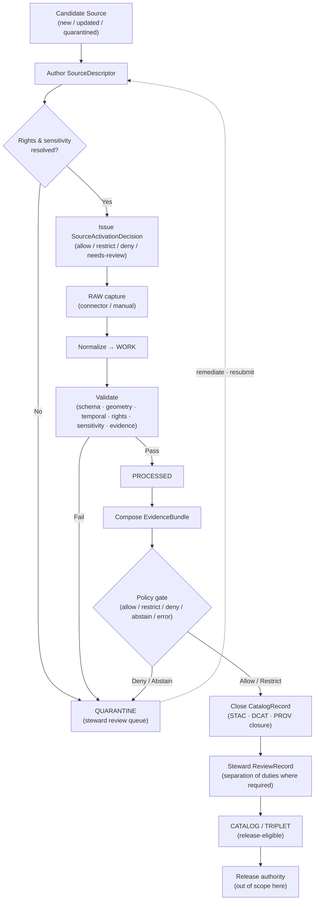

<!-- [KFM_META_BLOCK_V2]
doc_id: kfm://doc/sources-catalog-manual-curation
title: Manual Curation — Sources to Catalog
type: standard
version: v1
status: draft
owners: Source steward · Docs steward
created: 2026-05-13
updated: 2026-05-13
policy_label: public
related: [
  docs/doctrine/directory-rules.md,
  docs/sources/SOURCE_DESCRIPTOR_STANDARD.md,
  docs/architecture/contract-schema-policy-split.md,
  docs/architecture/review/README.md,
  docs/governance/separation-of-duties.md,
  docs/registers/DRIFT_REGISTER.md,
  docs/adr/ADR-0001-schema-home.md
]
tags: [kfm, sources, catalog, curation, governance, lifecycle]
notes: [
  "Path PROPOSED — verify against mounted-repo evidence before treating as canonical.",
  "All schema and route references PROPOSED unless verified.",
  "Cite-or-abstain throughout."
]
[/KFM_META_BLOCK_V2] -->

# Manual Curation — Sources to Catalog

> The steward-led path that walks a source from admission through review, validation, and catalog closure — never around the gates, always through them.


**Status:** draft · **Owners:** Source steward · Docs steward · **Last updated:** 2026-05-13

---

## Quick jump

- [Status & Authority](#0-status--authority)
- [Purpose](#1-purpose)
- [Scope](#2-scope)
- [Repo fit](#3-repo-fit)
- [Accepted inputs](#4-accepted-inputs)
- [Exclusions](#5-exclusions)
- [Proposed layout](#6-proposed-layout)
- [Curation flow](#7-curation-flow)
- [Stages and required artifacts](#8-stages-and-required-artifacts)
- [Roles and separation of duties](#9-roles-and-separation-of-duties)
- [Gate failures and reason codes](#10-gate-failures-and-reason-codes)
- [Sensitive-lane curation](#11-sensitive-lane-curation)
- [Catalog-closure checklist](#12-catalog-closure-checklist)
- [Worked example](#13-worked-example)
- [Anti-patterns](#14-anti-patterns)
- [Related docs](#15-related-docs)

---

## 0. Status & Authority

| Field | Value |
|---|---|
| **Document type** | Standard doc — curation methodology and steward reference |
| **Authority of this guide** | CONFIRMED doctrine (lifecycle, trust membrane, cite-or-abstain). PROPOSED operational details. |
| **Authority of any specific path quoted here** | PROPOSED until verified against mounted-repo evidence |
| **Proposed canonical home** | `docs/sources/catalog/manual_curation.md` (PROPOSED) |
| **Owner** | Source steward |
| **Co-owner** | Docs steward |
| **Reviewers required for change** | Source steward + Docs steward; ADR if it alters the SourceDescriptor lifecycle or catalog-closure rule |
| **Schema-home convention** | `schemas/contracts/v1/<…>` per ADR-0001 (PROPOSED reference) |
| **Lifecycle invariant** | RAW → WORK / QUARANTINE → PROCESSED → CATALOG / TRIPLET → PUBLISHED. Promotion is a **governed state transition, not a file move.** |

> [!IMPORTANT]
> This document **explains** a workflow. It does not certify that the workflow is implemented in any specific mounted-repo path, tool, schema, or route. Repo-state claims here are PROPOSED or NEEDS VERIFICATION unless verified against the working tree.

---

## 1. Purpose

Manual curation is the **human-driven path** that takes a source — a dataset, archive, descriptor, document, or candidate record — from admission to a catalog entry that is fit for release consideration. It is the slow, evidence-first counterpart to automated watchers and connectors, and it is the **only path** for source material whose rights, sensitivity, role, or evidence posture is unresolved.

Manual curation exists because:

1. **Source role cannot be inferred from convenience.** Authority, observation, regulatory, modeled, aggregate, administrative, candidate, and synthetic sources have different downstream obligations, and only a steward — not a watcher and not an AI assistant — can assign that role at admission. [CONFIRMED doctrine]
2. **Rights and sensitivity must be resolved before publication.** Unknown rights fail closed; sensitive classes (rare species, archaeology, living-person data, DNA, critical infrastructure, sacred places, private-landowner) deny by default until reviewed. [CONFIRMED doctrine]
3. **Catalog closure is gated.** A release candidate does not reach PUBLISHED until catalog records, provenance records, artifact manifests, evidence references, source roles, policy decisions, digests, review state, correction path, and rollback target agree. [PROPOSED catalog-closure pattern; doctrinally CONFIRMED]
4. **AI and watchers are advisory at this stage.** They may suggest, score, score-explain, or fetch — they may not approve. EvidenceBundle outranks generated text. [CONFIRMED doctrine]

---

## 2. Scope

This document covers the steward-driven steps that move source material from **admission** through **catalog closure**. It is operational reference, not invariant doctrine; the invariants live in Directory Rules and the encyclopedia.

**In scope**

- Steward-led admission of new and updated sources.
- Authoring and updating `SourceDescriptor` records.
- Issuing `SourceActivationDecision` records.
- Driving review queues for rights, sensitivity, evidence closure, and schema validation.
- Resolving items returned from `QUARANTINE`.
- Closing `CatalogRecord` entries with required source, schema, validation, policy, and release metadata.
- Manual rebuild and re-issuance of curation artifacts when a correction is required.

**Out of scope**

- Object-family meaning (lives in `contracts/`).
- Field-level schema shape (lives in `schemas/`).
- Allow/deny/restrict/abstain rules (live in `policy/`).
- Connector or watcher mechanics (live in `connectors/`, `tools/ingest/watchers/`).
- Release decisions (live in `release/`).
- Public-surface presentation (lives in `apps/explorer-web/`, `packages/ui/`).

---

## 3. Repo fit

> [!NOTE]
> All paths here are **PROPOSED** until verified against mounted-repo evidence. Treat them as the intended responsibility-root placement under Directory Rules, not as a snapshot of the current tree.

| Upstream / governs | This doc | Downstream / governed |
|---|---|---|
| `docs/doctrine/directory-rules.md` | `docs/sources/catalog/manual_curation.md` | `tools/validators/source_descriptor/` (PROPOSED) |
| `docs/sources/SOURCE_DESCRIPTOR_STANDARD.md` |  | `schemas/contracts/v1/source/source-descriptor.json` (PROPOSED) |
| `contracts/OBJECT_MAP.md` (semantic crosswalk) |  | `data/registry/` (PROPOSED append-only register) |
| `policy/sources/` (PROPOSED) |  | `data/catalog/` lifecycle phase |
| `docs/architecture/review/README.md` (PROPOSED) |  | `release/candidates/`, `release/manifests/` (PROPOSED) |

---

## 4. Accepted inputs

A source becomes a manual-curation candidate when **any** of the following holds:

- The source is new to KFM (no prior `SourceDescriptor`).
- The source's rights, license, terms, or attribution requirements are unresolved or have changed.
- The source's sensitivity class is unknown, contested, or has been raised by a steward.
- The source's role (authority, observation, regulatory, modeled, aggregate, administrative, candidate, synthetic) cannot be set deterministically by a watcher.
- A watcher emitted a `QUARANTINE` event referencing the source — see watcher fail-closed rules. [CONFIRMED doctrine]
- A correction notice or rollback card requires the source's curation state to be re-examined.
- A candidate record (`CandidateFeature`, `CandidateDelta`, similar) needs steward judgement before promotion.

---

## 5. Exclusions

Manual curation is **not** the home for:

- **Bulk automated ingestion.** That belongs to `connectors/` and `tools/ingest/watchers/`. Watchers and connectors emit receipts and candidates only; they MUST NOT publish.
- **Validator authorship.** Validators are deterministic and live under `tools/validators/`. Curation **runs** validators; it does not **define** them.
- **Policy authoring.** Allow/deny/restrict/abstain logic lives under `policy/`. Curation **invokes** policy gates; it does not **encode** them.
- **Release decisions.** Issuing `ReleaseManifest`, rollback authorization, and PUBLISHED promotion live under `release/` and require a release authority distinct from the original author when materiality applies.
- **AI-driven publication.** AI may summarize evidence and score candidates; it MUST NOT approve a curation step or substitute its output for an `EvidenceBundle`.

---

## 6. Proposed layout

> [!CAUTION]
> The tree below is **PROPOSED**. It expresses where curation artifacts should land under Directory Rules; it is not a claim about the current mounted-repo state. Where any specific subpath is contested, route the conflict to `docs/registers/DRIFT_REGISTER.md`, not to a parallel home here.

```text
docs/sources/
├── README.md
├── SOURCE_DESCRIPTOR_STANDARD.md       # standard fields and intake posture
└── catalog/
    ├── README.md                       # PROPOSED — catalog lane orientation
    ├── manual_curation.md              # this file (PROPOSED home)
    ├── review_queues.md                # PROPOSED — queue inventory and SLAs
    ├── sensitive_lanes.md              # PROPOSED — sensitivity-class procedures
    └── examples/
        ├── hydrology_example.md        # PROPOSED — illustrative walkthrough
        └── archaeology_example.md      # PROPOSED — sensitive-lane walkthrough
```

Adjacent canonical homes referenced by this doc (all PROPOSED until verified):

```text
schemas/contracts/v1/source/source-descriptor.schema.json
schemas/contracts/v1/source/source-activation-decision.schema.json
schemas/contracts/v1/catalog/catalog-record.schema.json
schemas/contracts/v1/evidence/evidence-bundle.schema.json
schemas/contracts/v1/review/review-record.schema.json

policy/sources/admission.rego
policy/sources/rights.rego
policy/sensitivity/<class>.rego
policy/catalog/closure.rego

tools/validators/source_descriptor/
tools/validators/evidence_bundle/
tools/validators/connector_gate/
tools/validators/promotion_gate/

data/registry/                          # append-only source/rights/sensitivity
data/proofs/                            # EvidenceBundle, ProofPack
data/receipts/                          # RunReceipt, IngestReceipt, ReviewRecord
data/catalog/                           # STAC/DCAT/PROV CatalogRecord
release/candidates/                     # release-candidate dossiers
```

---

## 7. Curation flow

The diagram below sketches the **steward path** through the lifecycle. Each transition is a gate; the gate emits a record; missing records fail closed and preserve the prior state. [CONFIRMED gate doctrine]



> [!NOTE]
> The diagram reflects the **doctrinal** flow. Specific step names, tools, file paths, and record schemas remain PROPOSED until verified against mounted-repo evidence. If the implemented pipeline names these steps differently, open a `DRIFT_REGISTER.md` entry rather than silently renaming this guide.

---

## 8. Stages and required artifacts

Each stage emits at least one artifact. A stage is **closed** only when every required artifact exists, resolves its references (not just names them), and a policy decision has been recorded. [CONFIRMED universal closure rules]

| Stage | Trigger | Required artifact(s) | Owning role | Closure rule |
|---|---|---|---|---|
| **Admission** | New / updated source | `SourceDescriptor`, `SourceIntakeRecord` | Source steward | Rights and source-role must be **set**, not blank. Unknown rights fail closed. |
| **Activation** | Admission complete | `SourceActivationDecision` (allow / restrict / deny / needs-review) | Source steward + rights-holder rep (when applicable) | Connectors / watchers MUST remain inactive until activation decision exists. |
| **RAW capture** | Activation = allow / restrict | `RawCaptureReceipt` with retrieval metadata + checksum | Source connector (under descriptor) | No public RAW path. |
| **Normalization** | Captured payload | `TransformReceipt`, `DatasetVersion` | Domain steward | Record transform and loss. |
| **Validation** | Normalized payload | `ValidationReport` (schema · geometry · temporal · rights · sensitivity · evidence) | Domain steward | Fail closed on high-risk ambiguity. |
| **Evidence assembly** | Validation pass | `EvidenceBundle`, `EvidenceRef` | Domain steward | `EvidenceRef` MUST resolve to `EvidenceBundle`. |
| **Policy gate** | Bundle composed | `PolicyDecision`, `DecisionEnvelope` | Policy admin / runtime | DENY by default for sensitive classes. |
| **Catalog closure** | Policy allow / restrict | `CatalogRecord` (STAC · DCAT · PROV closure), digests, manifests | Domain steward + Docs steward (per Directory Rules) | No orphan artifacts; every published dataset/layer knows its source, schema, validation, policy, review, and release context. |
| **Review** | Catalog candidate | `ReviewRecord` (separation of duties where required) | Reviewer (≠ author when materiality applies) | Reviewer action must be auditable. |

> [!TIP]
> Every emitted artifact above has a **PROPOSED schema home** under `schemas/contracts/v1/…` per ADR-0001. Specific schema files and field shapes are PROPOSED until inspected. Do not invent or freeze a field shape from this document alone.

---

## 9. Roles and separation of duties

KFM separates policy-significant release duties when maturity justifies it. Manual curation is the stage where most of those separations are first applied. [CONFIRMED operating-law invariant]

### 9.1 Role definitions (PROPOSED)

| Role | Curation responsibility |
|---|---|
| **Source steward** | Owns admission, rights confirmation, sensitivity tag for a named source family. |
| **Domain steward** | Owns the meaning, contracts, and validators of a domain's object families during curation. |
| **Sensitivity reviewer** | Reviews redaction, generalization, withholding, and tier decisions for sensitive content. |
| **Rights-holder representative** | Confirms sovereignty, cultural-heritage, or consent-based release decisions. Required for archaeology, sovereign data, living-person data, DNA. |
| **Reviewer** | Approves / denies source activation, policy result, or promotion candidate. Distinct from author when materiality applies. |
| **Docs steward** | Owns governance documentation, ADR index, drift register, and curation-guide integrity. |
| **AI surface steward** | Reviews any AI assistance touching curation (scoring, summarization, suggestion). |

### 9.2 Separation-of-duties matrix (PROPOSED)

| Curation action | May the author also approve? | Required separation |
|---|---|---|
| Source admission (— → RAW) | Yes for routine; **No** when source has unresolved rights or sovereignty | Source steward + rights-holder rep where applicable |
| Normalization receipts | Yes for routine; **No** when transforms are sensitivity-relevant | Domain steward; sensitivity reviewer when sensitivity-relevant |
| Validator authorship and run | Yes (validators are deterministic) | Domain steward; periodic audit by Docs steward |
| Promotion to PROCESSED / CATALOG | Yes for non-sensitive routine; **No** for sensitive lanes | Domain steward + sensitivity reviewer (sensitive lanes) |
| Sensitive-lane catalog closure | **No** | Author + sensitivity reviewer + rights-holder rep |
| AI-assisted scoring on a curation step | **No** | AI surface steward + Docs steward (policy binding) |
| Atlas / curation-guide publication | **No** | Docs steward + at least one subsystem owner |

> [!WARNING]
> Separation of duties is **maturity-dependent**. Early-stage doctrine work may be authored and approved by the same actor when materiality is low; as the public trust surface expands, separation MUST be enforced through tooling, not custom. This guide does not pretend that tooling-enforced separation is already in place — that posture remains PROPOSED until verified.

---

## 10. Gate failures and reason codes

Curation gates emit failures as **structured reason codes**, not as free text. A failure preserves the prior state and routes the candidate to QUARANTINE for remediation. The catalog of codes below is PROPOSED and consolidates curation-relevant entries from the gate-failure register. [PROPOSED reason-code catalog]

| Failure family | Reason code (PROPOSED) | Gates where it fires | Curation remediation |
|---|---|---|---|
| Missing required artifact | `MISSING_RECEIPT`, `MISSING_EVIDENCE`, `MISSING_REVIEW` | Normalization · Validation · Catalog · Review | Re-emit the missing receipt; re-run the missing review or validation; resubmit. |
| Schema / contract mismatch | `SCHEMA_MISMATCH`, `CONTRACT_DRIFT` | Normalization · Validation | Schema fix and/or ADR; re-run validator. |
| Rights / sensitivity unresolved | `RIGHTS_UNKNOWN`, `SENSITIVITY_UNRESOLVED` | Admission · Validation · Catalog · Release | Steward review; rights resolution; sensitivity-tier reassignment. |
| Source-role collapse | `ROLE_COLLAPSE`, `ROLE_DOWNCAST_FORBIDDEN` | Validation · Catalog · Release | Restore source role on the descriptor; refuse upcast. |
| Review state inadequate | `REVIEW_NEEDED`, `REVIEW_INSUFFICIENT`, `REVIEW_REJECTED` | Catalog · Release | Run the required review; supply `ReviewRecord`. |
| Correction lineage broken | `CORRECTION_DERIVATIVES_UNRESOLVED`, `CORRECTION_PRIOR_RELEASE_MISSING` | Correction | Resolve dependent derivatives; add supersession entry. |

---

## 11. Sensitive-lane curation

> [!CAUTION]
> Sensitive classes deny by default. Manual curation in these lanes is slower, demands additional reviewers, and ends in **generalized**, **staged**, or **withheld** public products — never in exact restricted geometry. [CONFIRMED sensitive deny-by-default register]

The deny-by-default register applies categorically. Curation in any of these classes MUST add the indicated reviewers and required controls before catalog closure:

| Class | Default outcome | Required controls |
|---|---|---|
| **Living persons** | DENY public exact/identifying output | Privacy review · redaction · aggregation · staged access |
| **DNA / genomics** | DENY by default; restricted only with approval | Separate restricted store · no public AI inference |
| **Rare species** | DENY public exact locations | Geoprivacy transform receipt · steward review |
| **Archaeology / sacred places** | DENY exact public locations | Cultural / steward review · suppression or generalization · rights-holder rep |
| **Critical infrastructure** | RESTRICT / DENY public precision | Public-safe aggregation · role-based access |
| **Private landowner data** | DENY exact / public if rights unclear | Aggregation · permissions · policy review |
| **Source-rights-limited records** | DENY public release until terms resolved | Rights register · attribution · no public derivative if barred |

> [!IMPORTANT]
> The trust membrane forbids any public client, normal UI surface, or released AI surface from reaching RAW, WORK, QUARANTINE, candidate records, canonical / internal stores, graph internals, vector indexes, source APIs, or direct model runtimes. Manual curation MUST NOT engineer an exception path "just for stewards" that leaks into the public surface. Admin shortcuts must be justified, constrained, documented, and kept out of the normal public path.

---

## 12. Catalog-closure checklist

Before a `CatalogRecord` is treated as release-eligible, every box below must be checked or the record fails closed and remains at PROCESSED. [CONFIRMED catalog-closure doctrine]

- [ ] `SourceDescriptor` exists, with `source_role`, rights status, sensitivity, cadence, steward, and access method set (not blank, not "unknown").
- [ ] `SourceActivationDecision` exists and is `allow` or `restrict` (not `needs-review`, not `deny`).
- [ ] `RawCaptureReceipt` resolves to retrieval metadata and a checksum.
- [ ] `TransformReceipt` records normalization steps and any information loss.
- [ ] `ValidationReport` covers schema, geometry, temporal, rights, sensitivity, and evidence checks — and its outcome is `ANSWER`.
- [ ] `EvidenceBundle` is composed, and every `EvidenceRef` on the candidate resolves to it.
- [ ] `PolicyDecision` (or `DecisionEnvelope`) exists, evaluated, and is recorded.
- [ ] `CatalogRecord` carries source, schema, validation, policy, review, and release metadata — STAC · DCAT · PROV closure.
- [ ] `ReviewRecord` exists where separation of duties or sensitivity applies, naming a reviewer distinct from the author.
- [ ] Stable identifiers (e.g., `spec_hash`, `content_hash`, `geometry_hash`) are computed and recorded; run hash is not conflated with content hash.
- [ ] Correction path and rollback target are nominated before the record is offered to a release authority.

---

## 13. Worked example

<details>
<summary><strong>Illustrative walkthrough — admitting a new hydrology dataset (PROPOSED, not implementation proof)</strong></summary>

> The walkthrough below is **illustrative**. It uses doctrinal names and stage transitions to show how a manual curation pass should look. It does not assert that any specific file, route, schema, or tool exists in the mounted repository.

**Step 1 — Admission.** Source steward authors a `SourceDescriptor` for a county-level streamflow dataset: source ID, owner, retrieval URL, license SPDX, attribution requirements, source role (`observation`), cadence (daily), sensitivity (`public`), and steward.

**Step 2 — Activation.** Source steward reviews the descriptor against the rights register and issues a `SourceActivationDecision = allow`. No rights-holder representative is required for this class.

**Step 3 — RAW capture.** The connector fetches the file under the approved descriptor and emits a `RawCaptureReceipt` carrying ETag, Last-Modified, checksum, and timestamp. Output lands under `data/raw/hydrology/<source_id>/<run_id>/` (PROPOSED).

**Step 4 — Normalization.** A pipeline step transforms the payload to canonical schema and emits a `TransformReceipt`. The candidate moves to `data/work/...` (PROPOSED).

**Step 5 — Validation.** The validators run and emit a `ValidationReport` with outcome `ANSWER`. Schema, geometry, temporal, rights, sensitivity, and evidence checks all pass.

**Step 6 — Evidence assembly.** Domain steward composes an `EvidenceBundle` linking the descriptor, capture receipt, transform receipt, validation report, and the canonical record's `spec_hash`. Every `EvidenceRef` resolves.

**Step 7 — Policy gate.** Policy evaluates `allow` because rights status is `public`, sensitivity is `public`, and the review state is `approved`. A `PolicyDecision` is recorded.

**Step 8 — Catalog closure.** A `CatalogRecord` is composed with STAC core fields, DCAT distribution metadata, and PROV activity links. Identifiers are stable and digest-pinned.

**Step 9 — Review.** Reviewer (distinct from the domain steward) issues a `ReviewRecord = approve`. Correction path and rollback target are nominated.

**Outcome.** The record is now release-eligible. It moves to `data/catalog/...` (PROPOSED) and waits for the release authority. Manual curation ends here; release decisions are out of scope for this guide.

</details>

---

## 14. Anti-patterns

| Anti-pattern | Symptom | Correction |
|---|---|---|
| **Watcher publishes** | A worker writes to `data/catalog/` or `data/published/` | Watcher-as-non-publisher invariant: workers emit receipts and candidate decisions only. Return the case to manual curation. |
| **Author also approves a sensitive release** | One actor authors the descriptor and signs off on a sensitive-lane catalog record | Apply §9.2 separation-of-duties matrix; require a sensitivity reviewer. |
| **Unknown rights treated as "probably fine"** | `SourceDescriptor` shipped with rights `unknown` and activation `allow` | Unknown rights fail closed. Set activation to `needs-review` or `deny` until terms are resolved. |
| **AI text used as evidence** | `EvidenceBundle` cites a generated summary instead of a source | `EvidenceBundle` outranks generated language. Curation MUST resolve evidence to a source, not to a model output. |
| **Lifecycle skip** | A pipeline writes directly to `data/catalog/` from `data/raw/` | All lifecycle phases run; promotion is a governed state transition, not a file move. |
| **Catalog record without closure** | `CatalogRecord` exists with missing `EvidenceBundle`, `ValidationReport`, or `PolicyDecision` | Orphan artifact. Withdraw from CATALOG; complete closure or route to QUARANTINE. |
| **Documentation as truth** | This guide cited as the source of a canonical decision | Promote the decision to an ADR or `control_plane/` register. This guide explains; it does not decide. |
| **Parallel curation home** | A second `docs/.../manual_curation.md` or `policy/sources/manual_curation/` springs up | Compatibility roots and parallel authority are forbidden without an ADR. Route via `docs/registers/DRIFT_REGISTER.md`. |

[Back to top](#manual-curation--sources-to-catalog)

---

## 15. Related docs

- [`docs/doctrine/directory-rules.md`](../../doctrine/directory-rules.md) — placement law, compatibility roots, lifecycle invariant. **(CONFIRMED in project knowledge.)**
- [`docs/sources/SOURCE_DESCRIPTOR_STANDARD.md`](../SOURCE_DESCRIPTOR_STANDARD.md) — descriptor field standard. **(PROPOSED — referenced in expansion plan.)**
- `docs/architecture/contract-schema-policy-split.md` — the contracts / schemas / policy / tests / fixtures responsibility split. **(PROPOSED reference.)**
- `docs/architecture/review/README.md` — read-only review surfaces, queue model, decision envelopes. **(PROPOSED reference.)**
- `docs/governance/separation-of-duties.md` — full separation-of-duties matrix. **(PROPOSED — derived from atlas §24.7.2.)**
- `docs/registers/DRIFT_REGISTER.md` — where to log any conflict between this guide and mounted-repo conventions. **(PROPOSED.)**
- `docs/adr/ADR-0001-schema-home.md` — schema-home authority. **(PROPOSED — referenced by Directory Rules §7.4.)**
- `docs/standards/STAC.md`, `docs/standards/DCAT.md`, `docs/standards/PROV.md` — external standards used for catalog closure. **(PROPOSED — externals consumed by KFM STAC profile v1.)**

---

## Verification backlog

The items below are explicitly **not** verified by this guide and should be checked against mounted-repo evidence before any of them are quoted as fact:

- Existence and exact path of `docs/sources/catalog/` and this file.
- Existence and field shape of `SourceDescriptor`, `SourceActivationDecision`, `EvidenceBundle`, `CatalogRecord`, and `ReviewRecord` schemas under `schemas/contracts/v1/...`.
- Existence and contents of `policy/sources/`, `policy/sensitivity/`, and `policy/catalog/` packages.
- Existence and behavior of validators under `tools/validators/`.
- Existence and contents of `data/registry/`, `data/proofs/`, `data/receipts/`, `data/catalog/`.
- Existence and contents of ADR-0001 (schema home).
- Whether the implemented pipeline names curation stages, gates, and reason codes as proposed here.
- Whether tooling enforces separation of duties for sensitive-lane curation.

---

<sub>**Last updated:** 2026-05-13 · **Status:** draft · **Owners:** Source steward · Docs steward · [Back to top](#manual-curation--sources-to-catalog)</sub>
