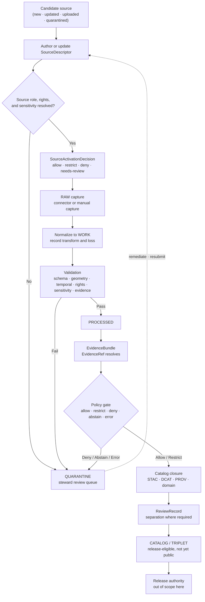

<!-- [KFM_META_BLOCK_V2]
doc_id: kfm://doc/sources-catalog-manual-curation
title: Manual Curation — Sources to Catalog
type: standard
version: v3
status: draft
owners: Source steward · Docs steward
created: 2026-05-13
updated: 2026-06-11
supersedes: v2 (2026-05-22)
policy_label: public
related:
  - docs/doctrine/directory-rules.md
  - docs/doctrine/trust-membrane.md
  - docs/doctrine/lifecycle-law.md
  - docs/doctrine/truth-posture.md
  - docs/sources/SOURCE_DESCRIPTOR_STANDARD.md
  - docs/sources/source-roles.md
  - docs/sources/catalog/README.md
  - docs/sources/catalog/OPEN-QUESTIONS.md
  - docs/sources/catalog/local_upload/README.md
  - docs/sources/catalog/local_upload/user-file-upload.md
  - docs/sources/catalog/loc/iiif-presentations.md
  - docs/architecture/contract-schema-policy-split.md
  - docs/architecture/review/README.md
  - docs/governance/separation-of-duties.md
  - docs/registers/DRIFT_REGISTER.md
  - docs/adr/ADR-0001-schema-home.md
tags: [kfm, sources, catalog, curation, governance, lifecycle, stewardship, source-roles]
notes:
  - "v3 polish pass: aligned with docs/sources/catalog/README.md v0.4 and docs/sources/source-roles.md; clarified that this file is methodology, not the manual_curation source-family page."
  - "Path PROPOSED: docs/sources/catalog/manual_curation.md remains a candidate home; naming collision with a possible manual_curation/ family folder is flagged for OPEN-QUESTIONS / drift review."
  - "connectors/local_upload/ is CONFIRMED at the Directory Rules doctrine level; concrete repo-file presence remains NEEDS VERIFICATION without mounted-repo inspection."
  - "All schema, route, validator, policy-package, and release-path references are PROPOSED unless verified against the mounted repo."
  - "Cite-or-abstain throughout. EvidenceBundle outranks generated language."
[/KFM_META_BLOCK_V2] -->

# Manual Curation — Sources to Catalog

> The steward-led path that walks source material from admission through review, validation, evidence assembly, and catalog closure — never around the gates, always through them.


**Status:** draft · **Version:** v3 · **Owners:** Source steward · Docs steward · **Last updated:** 2026-06-11

---

## Quick jump

- [0. Status and authority](#0-status-and-authority)
- [1. Purpose](#1-purpose)
- [2. Scope](#2-scope)
- [3. Repo fit](#3-repo-fit)
- [4. Accepted inputs](#4-accepted-inputs)
- [5. Exclusions](#5-exclusions)
- [6. Proposed layout](#6-proposed-layout)
- [7. Curation flow](#7-curation-flow)
- [8. Stages and required artifacts](#8-stages-and-required-artifacts)
- [9. Roles and separation of duties](#9-roles-and-separation-of-duties)
- [10. Gate failures and reason codes](#10-gate-failures-and-reason-codes)
- [11. Sensitive-lane curation](#11-sensitive-lane-curation)
- [12. Catalog-closure checklist](#12-catalog-closure-checklist)
- [13. Worked examples](#13-worked-examples)
- [14. Anti-patterns](#14-anti-patterns)
- [15. Related docs](#15-related-docs)
- [16. Verification backlog](#16-verification-backlog)
- [17. Changelog](#17-changelog)

---

## 0. Status and authority

| Field | Value |
|---|---|
| **Document type** | Standard doc — curation methodology and steward reference. |
| **Authority of this guide** | CONFIRMED for doctrine it restates: lifecycle, trust membrane, cite-or-abstain, source-role anti-collapse, and deny-by-default posture. PROPOSED for operational details, exact paths, exact schemas, tools, route names, and workflow names. |
| **Authority of any specific path quoted here** | Mixed. `connectors/local_upload/` is CONFIRMED as a Directory Rules connector slot at the doctrine level. Concrete file presence at any commit, and all other path references in this document, are NEEDS VERIFICATION until checked against mounted-repo evidence. |
| **Proposed canonical home** | `docs/sources/catalog/manual_curation.md` — PROPOSED. See naming-collision note below. |
| **Potential naming conflict** | `manual_curation/` may also be a source-family folder in the catalog lane. If that folder is retained, this methodology file may need to move to `docs/sources/catalog/guides/manual-curation.md` or a similar docs-guide home by ADR or per-root README decision. |
| **Owner** | Source steward. |
| **Co-owner** | Docs steward. |
| **Reviewers required for change** | Source steward + Docs steward. Add sensitivity reviewer, policy steward, domain steward, or rights-holder representative when the change affects sensitive lanes, source roles, rights, policy, or release posture. ADR required if the change alters lifecycle, schema-home, source-role, or catalog-closure rules. |
| **Schema-home convention** | `schemas/contracts/v1/<...>` per ADR-0001 doctrine; concrete file presence NEEDS VERIFICATION. |
| **Lifecycle invariant** | RAW → WORK / QUARANTINE → PROCESSED → CATALOG / TRIPLET → PUBLISHED. Promotion is a governed state transition, not a file move. |

> [!IMPORTANT]
> This document explains **how a steward should curate** source material. It does not certify that the workflow is implemented in any mounted-repo tool, schema, route, queue, validator, or CI job. Repo-state claims remain PROPOSED or NEEDS VERIFICATION unless verified in the working tree.

[Back to top](#manual-curation--sources-to-catalog)

---

## 1. Purpose

Manual curation is the **human-governed path** for source material that cannot safely advance by automation alone. It applies to datasets, archives, documents, local uploads, candidate features, and proposed source records whose rights, sensitivity, source role, provenance, evidence closure, or review state is unresolved.

Manual curation exists because:

1. **Source role cannot be inferred from convenience.** A source may be observational, regulatory, administrative, modeled, aggregate, candidate, synthetic, legal authority, context, or corroborating evidence. These roles are not interchangeable. The source role must be assigned deliberately and preserved downstream. See [`docs/sources/source-roles.md`](../source-roles.md).
2. **Rights and sensitivity fail closed.** Unknown rights, unknown consent, unclear sovereignty, rare-species precision, archaeology precision, DNA/genomics, living-person data, and critical-infrastructure exposure do not become public by default.
3. **Catalog closure is gated.** A release candidate is not catalog-closed until source descriptors, receipts, validation, EvidenceBundle references, policy decisions, review records, catalog metadata, correction path, and rollback target agree.
4. **AI and watchers are advisory, not approving authorities.** They may fetch, summarize, score, compare, or explain. They may not approve admission, validation, catalog closure, publication, or source-role upgrade. EvidenceBundle outranks generated language.

[Back to top](#manual-curation--sources-to-catalog)

---

## 2. Scope

This document covers steward-led steps from **admission** through **catalog closure**. It is methodology and review guidance, not a machine contract.

### 2.1 In scope

- Steward-led admission of new or changed sources.
- Authoring and updating `SourceDescriptor` records.
- Issuing `SourceActivationDecision` records.
- Routing rights, sensitivity, source-role, evidence, and validation review.
- Resolving materials returned to QUARANTINE.
- Closing `CatalogRecord` entries with source, schema, validation, policy, proof, review, correction, and rollback metadata.
- Rebuilding or reissuing curation artifacts when corrections require re-evaluation.

### 2.2 Out of scope

| Out of scope item | Canonical owner |
|---|---|
| Object-family meaning | `contracts/` |
| Field-level schema shape | `schemas/contracts/v1/...` |
| Allow / deny / restrict / abstain policy | `policy/` |
| Connector and watcher mechanics | `connectors/`, `pipelines/`, `tools/ingest/` |
| Validator logic | `tools/validators/` |
| Release decisions | `release/` |
| Public UI and map presentation | `apps/`, `packages/ui/`, governed API clients |
| Family-level source governance | `docs/sources/catalog/<family>/README.md` or the accepted per-family equivalent |
| Product-specific source behavior | `docs/sources/catalog/<family>/<product>.md` |

> [!TIP]
> **Methodology / family / product split.** This guide describes *how* a steward walks a source through the gates. A family page describes *which sources belong to a lane*. A product page describes *one specific source product*. All three can apply at the same time; none replaces the others.

[Back to top](#manual-curation--sources-to-catalog)

---

## 3. Repo fit

> [!NOTE]
> Most paths below are PROPOSED until verified against mounted-repo evidence. Treat them as responsibility-root placement guidance, not as a current-tree inventory.

| Upstream / governs | This document | Downstream / governed |
|---|---|---|
| `docs/doctrine/directory-rules.md` | `docs/sources/catalog/manual_curation.md` | `tools/validators/source_descriptor/` |
| `docs/sources/source-roles.md` | | `data/registry/sources/` |
| `docs/sources/SOURCE_DESCRIPTOR_STANDARD.md` | | `schemas/contracts/v1/source/source_descriptor.schema.json` |
| `contracts/OBJECT_MAP.md` | | `data/catalog/{stac,dcat,prov,domain}/` |
| `policy/sources/`, `policy/sensitivity/`, `policy/catalog/` | | `release/candidates/`, `release/manifests/` |
| `docs/architecture/review/README.md` | | `data/receipts/`, `data/proofs/` |

### 3.1 Sibling catalog docs that apply this methodology

| Sibling doc | Role | Preferred path | Status |
|---|---|---|---|
| Source roles | Cross-lane source-role vocabulary and anti-collapse rule. | [`../source-roles.md`](../source-roles.md) | PROPOSED file; authored in workspace. |
| Catalog lane README | Orientation for the source-to-catalog documentation lane. | [`./README.md`](./README.md) | PROPOSED path; v0.4 workspace artifact. |
| Family governance — `local_upload` | Family-level admission defaults, accepted inputs, exclusions, and sensitive-content posture. | `./local_upload/README.md` | PROPOSED preferred folder form. Flat `./local_upload.md` may exist as legacy or alternative; verify. |
| Product page — user file upload | One product within `local_upload`: user-initiated drop, picker, or CLI import. | [`./local_upload/user-file-upload.md`](./local_upload/user-file-upload.md) | PROPOSED. |
| Product page — LOC IIIF Presentations | Versioned-publisher counter-example within the `loc` family. | [`./loc/iiif-presentations.md`](./loc/iiif-presentations.md) | PROPOSED. |

[Back to top](#manual-curation--sources-to-catalog)

---

## 4. Accepted inputs

A source becomes a manual-curation candidate when any of the following is true:

- It is new to KFM and has no approved `SourceDescriptor`.
- Its rights, license, terms, attribution requirements, consent state, or sovereignty status are unresolved or changed.
- Its sensitivity class is unknown, contested, raised, or domain-specific.
- Its source role cannot be set deterministically by a watcher.
- A watcher emitted a QUARANTINE event or a `SourceIntakeRecord` candidate.
- A correction notice, withdrawal, rollback card, or supersession event requires re-examining its curation state.
- A candidate record, candidate geometry, candidate claim, or local upload requires steward judgment before it can move forward.

[Back to top](#manual-curation--sources-to-catalog)

---

## 5. Exclusions

Manual curation is not the home for:

- **Bulk automated ingestion.** Watchers and connectors emit receipts, pre-RAW events, and candidates only. They must not publish, mutate canonical truth, or write directly to catalog or published outputs.
- **Validator authorship.** Curation runs deterministic validators; it does not define them.
- **Policy authoring.** Curation invokes policy; it does not encode allow / deny / restrict / abstain rules.
- **Release decisions.** Release manifests, rollback authorization, and PUBLISHED promotion belong to the release authority.
- **AI-driven approval.** AI may summarize evidence or suggest triage. It must not approve curation, substitute for EvidenceBundle, or upgrade a source role.

[Back to top](#manual-curation--sources-to-catalog)

---

## 6. Proposed layout

> [!CAUTION]
> This tree is PROPOSED. It expresses the intended responsibility split. It is not a claim about current repo state. If a mounted repo shows a different convention, log the conflict in `docs/registers/DRIFT_REGISTER.md` and resolve it by ADR or migration plan.

```text
docs/sources/
├── README.md
├── SOURCE_DESCRIPTOR_STANDARD.md
├── source-roles.md
└── catalog/
    ├── README.md
    ├── manual_curation.md              # this file; methodology guide, not source-family folder
    ├── local_upload/
    │   ├── README.md
    │   └── user-file-upload.md
    ├── loc/
    │   ├── README.md
    │   └── iiif-presentations.md
    ├── guides/                         # PROPOSED alternative if guide/source-family name conflicts
    │   └── manual-curation.md
    ├── review_queues.md                # PROPOSED
    ├── sensitive_lanes.md              # PROPOSED
    └── examples/
        ├── hydrology-example.md        # PROPOSED
        └── archaeology-example.md      # PROPOSED
```

Adjacent homes referenced by this guide:

```text
schemas/contracts/v1/source/source_descriptor.schema.json
schemas/contracts/v1/source/source_activation_decision.schema.json
schemas/contracts/v1/intake/event_envelope.schema.json
schemas/contracts/v1/catalog/catalog_record.schema.json
schemas/contracts/v1/evidence/evidence_bundle.schema.json
schemas/contracts/v1/review/review_record.schema.json

policy/sources/admission.rego
policy/sources/rights.rego
policy/sensitivity/<class>.rego
policy/catalog/closure.rego

tools/validators/source_descriptor/
tools/validators/evidence_bundle/
tools/validators/connector_gate/
tools/validators/promotion_gate/

connectors/local_upload/                # Directory Rules connector slot; repo presence NEEDS VERIFICATION

data/registry/
data/receipts/
data/proofs/
data/catalog/
release/candidates/
release/manifests/
```

[Back to top](#manual-curation--sources-to-catalog)

---

## 7. Curation flow

The steward path below is a doctrinal flow. Each transition emits a record. Missing records fail closed and preserve the prior state.



> [!IMPORTANT]
> `CATALOG` is not equivalent to `PUBLISHED`. A catalog-closed artifact is release-eligible only. Public exposure still requires release review, release manifest, rollback target, and governed API / published artifact projection.

[Back to top](#manual-curation--sources-to-catalog)

---

## 8. Stages and required artifacts

A stage is closed only when every required artifact exists, resolves its references, and records a policy or review outcome where required.

| Stage | Trigger | Required artifact(s) | Owning role | Closure rule |
|---|---|---|---|---|
| **Admission** | New / updated / uploaded / quarantined source | `SourceDescriptor`, `SourceIntakeRecord` | Source steward | Source role, rights, sensitivity, steward, and access method are set. Unknown rights fail closed. |
| **Activation** | Admission complete | `SourceActivationDecision` | Source steward; rights-holder rep where applicable | Connector / watcher remains inactive unless decision is `allow` or `restrict`. |
| **RAW capture** | Activation = `allow` / `restrict` | `RawCaptureReceipt`, checksum, retrieval metadata | Connector under descriptor or manual curator | No public RAW path. |
| **Normalization** | Captured payload | `TransformReceipt`, `DatasetVersion` | Domain steward | Transform and information loss are recorded. |
| **Validation** | Normalized payload | `ValidationReport` | Domain steward | Schema, geometry, temporal, rights, sensitivity, and evidence checks pass or route to QUARANTINE. |
| **Evidence assembly** | Validation pass | `EvidenceBundle`, resolvable `EvidenceRef` values | Domain steward | Every claim that needs evidence resolves to a bundle. |
| **Policy gate** | Bundle composed | `PolicyDecision`, `DecisionEnvelope` | Policy runtime / policy admin | DENY by default on sensitive ambiguity or policy error. |
| **Catalog closure** | Policy `allow` / `restrict` | `CatalogRecord` with STAC, DCAT, PROV, and/or domain closure | Domain steward + docs steward where docs are touched | No orphan artifacts. Catalog record links to source, schema, validation, policy, review, release context, correction path, and rollback target. |
| **Review** | Catalog candidate | `ReviewRecord` | Reviewer distinct from author where materiality or sensitivity applies | Reviewer action is auditable. |

[Back to top](#manual-curation--sources-to-catalog)

---

## 9. Roles and separation of duties

KFM separates policy-significant duties when materiality, sensitivity, or public trust requires it. Manual curation is where those separations first become visible.

### 9.1 Role definitions

| Role | Curation responsibility |
|---|---|
| **Source steward** | Owns admission, rights confirmation, source-role declaration, and source-family disposition. |
| **Domain steward** | Owns object-family meaning, domain validation posture, and normalized-domain interpretation. |
| **Sensitivity reviewer** | Reviews redaction, generalization, withholding, sensitivity tier, and public-safe transforms. |
| **Rights-holder representative** | Confirms sovereignty, cultural-heritage, consent-based, or legal-rights release decisions where required. |
| **Reviewer** | Approves, denies, or requests changes on activation, policy result, or catalog candidate. Distinct from author when materiality applies. |
| **Docs steward** | Owns governance documentation, ADR links, drift register references, and guide integrity. |
| **AI surface steward** | Reviews any AI support used for scoring, triage, explanation, or summarization in curation. |

### 9.2 Separation-of-duties matrix

| Curation action | May author also approve? | Required separation |
|---|---|---|
| Source admission | Yes for routine public sources; no for unresolved rights, sovereignty, consent, or high sensitivity | Source steward + rights-holder representative where applicable |
| Normalization receipt | Yes for routine transforms; no where transform changes sensitivity or location precision | Domain steward + sensitivity reviewer when relevant |
| Validator run | Yes, because validators are deterministic; validator authoring needs review | Domain steward; periodic audit by docs steward or validator owner |
| Promotion to PROCESSED / CATALOG | Yes for low-risk routine material; no for sensitive lanes | Domain steward + reviewer |
| Sensitive-lane catalog closure | No | Author + sensitivity reviewer + rights-holder representative where applicable |
| AI-assisted scoring used in triage | No, when result influences gate outcome | AI surface steward + docs steward or policy steward |
| Guide or standard publication | No, when it changes binding posture | Docs steward + subsystem owner |

> [!WARNING]
> Separation of duties may start as manual review in early-stage work, but trust-bearing lanes should become tooling-enforced as the public surface matures. This guide does not claim tooling enforcement exists.

[Back to top](#manual-curation--sources-to-catalog)

---

## 10. Gate failures and reason codes

Gate failures should emit structured reason codes, preserve prior state, and route the candidate to QUARANTINE or review. The catalog below is PROPOSED and should be reconciled with the implemented policy/validator reason-code registry.

| Failure family | Reason code (PROPOSED) | Gates where it fires | Remediation |
|---|---|---|---|
| Missing required artifact | `MISSING_RECEIPT`, `MISSING_EVIDENCE`, `MISSING_REVIEW` | Normalization · validation · catalog · review | Re-emit or attach the missing artifact; re-run the gate. |
| Schema / contract mismatch | `SCHEMA_MISMATCH`, `CONTRACT_DRIFT` | Normalization · validation | Fix schema or contract mapping; ADR if semantics changed; re-run validator. |
| Rights / sensitivity unresolved | `RIGHTS_UNKNOWN`, `SENSITIVITY_UNRESOLVED`, `CONSENT_UNRESOLVED` | Admission · validation · catalog · release | Steward review; rights or consent decision; sensitivity tier reassignment. |
| Source-role collapse | `ROLE_COLLAPSE`, `ROLE_DOWNCAST_FORBIDDEN`, `ROLE_UPCAST_FORBIDDEN` | Validation · catalog · release | Restore the declared source role; issue a new descriptor if the role must change. |
| Review state inadequate | `REVIEW_NEEDED`, `REVIEW_INSUFFICIENT`, `REVIEW_REJECTED` | Catalog · release | Obtain required review and attach `ReviewRecord`. |
| Evidence closure failure | `EVIDENCE_REF_UNRESOLVED`, `EVIDENCE_BUNDLE_INCOMPLETE` | Evidence · catalog · API | Resolve references; rebuild EvidenceBundle; re-run policy. |
| Correction lineage broken | `CORRECTION_DERIVATIVES_UNRESOLVED`, `CORRECTION_PRIOR_RELEASE_MISSING` | Correction · rollback | Resolve dependent derivatives; add supersession or rollback record. |
| Trust membrane breach | `PUBLIC_PATH_INTERNAL_STATE`, `RAW_EXPOSED`, `QUARANTINE_EXPOSED` | API · UI · release | Withdraw exposure, fix route/layer manifest, add negative-path test. |

[Back to top](#manual-curation--sources-to-catalog)

---

## 11. Sensitive-lane curation

> [!CAUTION]
> Sensitive classes deny by default. Manual curation in these lanes is slower, requires additional reviewers, and usually ends in generalized, staged, restricted, delayed, or withheld public products — never exact restricted geometry by convenience.

| Class | Default outcome | Required controls |
|---|---|---|
| **Living persons** | DENY public exact or identifying output | Privacy review · aggregation · consent check · staged access |
| **DNA / genomics** | DENY by default; restricted only with approval | Separate restricted store · no public AI inference · consent and revocation checks |
| **Rare species** | DENY public exact locations | Geoprivacy transform receipt · steward review · generalized public geometry |
| **Archaeology / sacred places** | DENY exact public locations | Cultural / steward review · suppression or generalization · rights-holder representative |
| **Critical infrastructure** | RESTRICT or DENY public precision | Public-safe aggregation · role-based access · vulnerability review |
| **Private landowner data** | DENY exact public release if rights unclear | Aggregation · permissions · policy review |
| **Source-rights-limited records** | DENY public release until terms resolved | Rights register · attribution · derivative restrictions honored |

Manual curation must not create an admin shortcut that becomes a public path. Steward tooling may view restricted material only through constrained, auditable, role-appropriate surfaces kept separate from normal public clients.

[Back to top](#manual-curation--sources-to-catalog)

---

## 12. Catalog-closure checklist

Before a `CatalogRecord` is release-eligible, every item below is checked or the record remains at PROCESSED / QUARANTINE.

- [ ] `SourceDescriptor` exists and sets `source_role`, rights status, sensitivity, cadence, steward, and access method.
- [ ] `SourceActivationDecision` exists and is `allow` or `restrict`.
- [ ] `RawCaptureReceipt` resolves to retrieval metadata and checksum.
- [ ] `TransformReceipt` records normalization steps and any information loss.
- [ ] `ValidationReport` covers schema, geometry, temporal, rights, sensitivity, and evidence checks.
- [ ] `EvidenceBundle` exists, and every required `EvidenceRef` resolves to it.
- [ ] `PolicyDecision` / `DecisionEnvelope` exists, has been evaluated, and is recorded.
- [ ] `CatalogRecord` carries source, schema, validation, policy, review, and release metadata.
- [ ] STAC / DCAT / PROV / domain catalog closure is complete for the artifact type.
- [ ] `ReviewRecord` exists where separation of duties or sensitivity applies.
- [ ] Stable identifiers such as `spec_hash`, `content_hash`, `geometry_hash`, or `source_record_hash` are computed and recorded.
- [ ] Run hash is not conflated with content hash.
- [ ] Correction path and rollback target are nominated before release consideration.
- [ ] Public examples, screenshots, maps, or AI summaries do not expose non-public lifecycle states.

[Back to top](#manual-curation--sources-to-catalog)

---

## 13. Worked examples

<details>
<summary><strong>Illustrative walkthrough — admitting a new hydrology dataset</strong></summary>

> This walkthrough is illustrative. It uses doctrinal object names and stage transitions; it does not assert that any specific route, schema, file, or tool exists.

1. **Admission.** Source steward authors a `SourceDescriptor` for a county-level streamflow dataset: source ID, owner, retrieval URL, license, attribution requirements, source role (`observation`), cadence, sensitivity (`public`), and steward.
2. **Activation.** Source steward reviews the descriptor and issues `SourceActivationDecision = allow`.
3. **RAW capture.** Connector fetches under the approved descriptor and emits `RawCaptureReceipt` with ETag, Last-Modified, checksum, and timestamp.
4. **Normalization.** Pipeline transforms payload to canonical schema and emits `TransformReceipt`.
5. **Validation.** Validators emit `ValidationReport`; schema, geometry, temporal, rights, sensitivity, and evidence checks pass.
6. **Evidence assembly.** Domain steward composes `EvidenceBundle` linking descriptor, capture receipt, transform receipt, validation report, and canonical record identifiers.
7. **Policy gate.** Policy evaluates `allow`; a `PolicyDecision` is recorded.
8. **Catalog closure.** `CatalogRecord` is composed with STAC, DCAT, and PROV links.
9. **Review.** Reviewer issues `ReviewRecord = approve`; correction path and rollback target are nominated.
10. **Outcome.** Record is release-eligible, not public. Release authority is out of scope for this guide.

</details>

<details>
<summary><strong>Contrast walkthrough — admitting a user-uploaded file via <code>local_upload</code></strong></summary>

> This contrast shows what changes when the starting source is a user-uploaded candidate rather than a versioned external publisher product.

| Step | Versioned hydrology dataset | User-uploaded file |
|---|---|---|
| Source role at admission | `observation` if source authority supports it | `candidate` by default; never upgraded by promotion alone |
| Rights status at admission | Confirmed license or public terms | Unknown or uploader-asserted until reviewed |
| Sensitivity default | Often public, but still checked | Restricted until sensitivity review clears or transforms it |
| Activation decision | May be `allow` for routine sources | Usually `needs-review` until rights/sensitivity resolved |
| Connector path | `connectors/<family>/` | `connectors/local_upload/` connector slot |
| Identifier | Source-issued ID + deterministic hashes | Content-addressed ID using content hash / digest |
| Catalog collection | Stable collection per product | Open question: candidate collection, family collection, or no public collection |
| Public release | Standard release authority flow | Same flow, but most uploads remain candidates unless re-curated |

The gates are identical. The defaults and failure rate are different.

</details>

[Back to top](#manual-curation--sources-to-catalog)

---

## 14. Anti-patterns

| Anti-pattern | Symptom | Correction |
|---|---|---|
| **Watcher publishes** | Worker writes directly to `data/catalog/` or `data/published/`. | Watcher emits candidate/receipt only; route to curation and promotion. |
| **Author self-approves sensitive release** | One actor authors descriptor and approves sensitive catalog closure. | Enforce separation of duties; add sensitivity reviewer and rights-holder representative where applicable. |
| **Unknown rights treated as probably fine** | `rights = unknown` with activation `allow`. | Set `needs-review`, `restrict`, or `deny` until terms are resolved. |
| **AI text used as evidence** | EvidenceBundle cites generated summary instead of source material. | Replace with source-bound evidence; retain AI summary only as interpretation. |
| **Lifecycle skip** | Pipeline writes from RAW directly to CATALOG or PUBLISHED. | Re-run through WORK/QUARANTINE, PROCESSED, catalog closure, and release gate. |
| **Catalog record without closure** | Catalog entry lacks EvidenceBundle, ValidationReport, PolicyDecision, or ReviewRecord. | Withdraw from CATALOG; complete closure or quarantine. |
| **Source-role upcast at promotion** | Candidate source becomes observation because release needs it. | Source role is fixed for that descriptor. Issue a new descriptor with steward review if warranted. |
| **Documentation as authority** | This guide is cited as the source of a binding policy. | Promote the decision to ADR, contract, schema, policy, or control-plane register. |
| **Parallel curation home** | A second manual-curation standard appears elsewhere. | Log drift; migrate, supersede, or ADR the placement. |

[Back to top](#manual-curation--sources-to-catalog)

---

## 15. Related docs

| Doc | Relationship | Status |
|---|---|---|
| [`docs/doctrine/directory-rules.md`](../../../doctrine/directory-rules.md) | Placement law, compatibility roots, lifecycle invariant. | CONFIRMED doctrine. |
| [`docs/doctrine/trust-membrane.md`](../../../doctrine/trust-membrane.md) | Public-path discipline and governed API boundary. | PROPOSED path; doctrine referenced. |
| [`docs/doctrine/lifecycle-law.md`](../../../doctrine/lifecycle-law.md) | RAW → WORK / QUARANTINE → PROCESSED → CATALOG / TRIPLET → PUBLISHED. | PROPOSED path; doctrine referenced. |
| [`docs/sources/source-roles.md`](../source-roles.md) | Source-role vocabulary and anti-collapse guidance. | Workspace artifact; repo merge NEEDS VERIFICATION. |
| [`docs/sources/SOURCE_DESCRIPTOR_STANDARD.md`](../../SOURCE_DESCRIPTOR_STANDARD.md) | Descriptor field standard. | PROPOSED. |
| [`docs/sources/catalog/README.md`](./README.md) | Catalog lane orientation. | Workspace artifact v0.4; repo merge NEEDS VERIFICATION. |
| `docs/sources/catalog/local_upload/README.md` | `local_upload` family governance. | PROPOSED preferred path. |
| [`docs/sources/catalog/local_upload/user-file-upload.md`](./local_upload/user-file-upload.md) | User-file-upload product page. | PROPOSED. |
| [`docs/sources/catalog/loc/iiif-presentations.md`](./loc/iiif-presentations.md) | LOC IIIF Presentations product page. | PROPOSED. |
| `docs/architecture/contract-schema-policy-split.md` | Contracts / schemas / policy responsibility split. | PROPOSED. |
| `docs/architecture/review/README.md` | Review queues and decision envelopes. | PROPOSED. |
| `docs/governance/separation-of-duties.md` | Full separation-of-duties matrix. | PROPOSED. |
| `docs/registers/DRIFT_REGISTER.md` | Placement and authority drift log. | PROPOSED. |
| `docs/adr/ADR-0001-schema-home.md` | Schema-home authority. | PROPOSED path; doctrine confirmed by Directory Rules. |
| `docs/standards/STAC.md`, `docs/standards/DCAT.md`, `docs/standards/PROV.md` | Catalog standards used by closure. | PROPOSED / NEEDS VERIFICATION. |

[Back to top](#manual-curation--sources-to-catalog)

---

## 16. Verification backlog

The items below are not verified by this guide and should be checked before quoting as repo fact:

- Exact canonical home for this guide: `docs/sources/catalog/manual_curation.md` vs `docs/sources/catalog/guides/manual-curation.md` or another accepted path.
- Whether a `manual_curation/` source-family folder exists and conflicts with this guide's filename.
- Existence and field shape of `SourceDescriptor`, `SourceActivationDecision`, `SourceIntakeRecord`, `EvidenceBundle`, `CatalogRecord`, `ReviewRecord`, `PolicyDecision`, and `DecisionEnvelope` schemas under `schemas/contracts/v1/...`.
- Existence and content of `policy/sources/`, `policy/sensitivity/`, and `policy/catalog/`.
- Existence and behavior of validators under `tools/validators/`.
- Existence and content of `data/registry/`, `data/receipts/`, `data/proofs/`, `data/catalog/`, and `release/candidates/`.
- Current disposition of ADR-0001, ADR-S-04, ADR-S-05, ADR-S-09, and any ADR governing manual curation / source-family docs.
- Whether pipeline tools use the stage and reason-code names proposed here.
- Whether tooling enforces separation of duties for sensitive-lane curation.
- Whether sibling docs referenced in §15 exist at the preferred folder paths or under flat-file alternatives.

<details>
<summary><strong>Evidence basis for this guide</strong></summary>

- **Directory Rules doctrine** — placement responsibility, schema-home convention, lifecycle invariant, ADR requirement for root/schema/lifecycle/parallel-authority changes, and drift-register handling.
- **Source-role doctrine** — source-role anti-collapse: source roles are not quality scores and cannot be upgraded by convenience or promotion.
- **KFM atlas doctrine** — EvidenceBundle outranks generated language; master atlases and summaries are navigation aids, not substitutes for evidence, policy, review, or release state.
- **Watcher doctrine** — watchers and connectors produce candidates and receipts; they are not publishers.
- **Trust membrane doctrine** — public clients use governed APIs and released artifacts, not RAW, WORK, QUARANTINE, candidate records, internal stores, direct source APIs, or direct model runtime outputs.

</details>

[Back to top](#manual-curation--sources-to-catalog)

---

## 17. Changelog

| Edition | Date | Change |
|---|---|---|
| **v3** | 2026-06-11 | Polished wording, updated metadata, aligned with `docs/sources/catalog/README.md` v0.4 and `docs/sources/source-roles.md`, clarified docs-standard authority, added naming-collision warning for `manual_curation.md` vs `manual_curation/`, changed sibling `local_upload` reference to folder-README preferred form, tightened trust membrane language, added public-state distinction between CATALOG and PUBLISHED, expanded reason-code table, and normalized verification backlog. |
| v2 | 2026-05-22 | Added sibling cross-links to `local_upload` and product examples, added evidence-basis appendix, preserved section anchors, and tightened docs-only truth labels. |
| v1 | 2026-05-13 | Initial manual-curation standard draft. |

Removal of v3 changes should restore v2 by reverting the metadata version/date, the naming-collision note, the source-roles alignment, the folder-README sibling paths, the expanded reason-code and verification tables, and this changelog row.

[Back to top](#manual-curation--sources-to-catalog)

---

<sub>**Last updated:** 2026-06-11 · **Status:** draft · **Version:** v3 · **Owners:** Source steward · Docs steward · **Evidence basis:** docs-only in this polishing pass · [Back to top](#manual-curation--sources-to-catalog)</sub>
