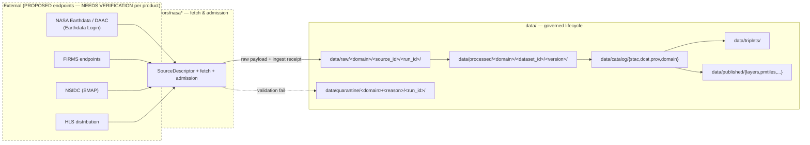

<!-- [KFM_META_BLOCK_V2]
doc_id: kfm://doc/docs-sources-catalog-nasa-readme
title: NASA source family
type: readme
version: v0.2
status: draft
owners: <PLACEHOLDER — Docs steward + Source steward for nasa>
created: 2026-05-21
updated: 2026-05-22
policy_label: public
related:
  - docs/sources/catalog/README.md
  - docs/sources/catalog/OPEN-QUESTIONS.md
  - docs/sources/catalog/PROFILES.md
  - docs/sources/catalog/IDENTITY.md
  - docs/sources/catalog/RIGHTS-AND-SENSITIVITY-MAP.md
  - docs/sources/catalog/_template/SOURCE_PRODUCT_TEMPLATE.md
  - docs/doctrine/directory-rules.md
  - docs/adr/ADR-NNNN-nasa-source-family-promotion.md
tags: [kfm, docs, sources, catalog, nasa]
notes:
  - "Family scaffolded from the connectors/ inventory; descriptions grounded in docs/domains SOURCE_REGISTRY files. Beyond directory-rules.md §7.3 — see OPEN-DSC-14."
  - "v0.2: full presentation polish per docs standard; truth labels preserved; PROPOSED status retained pending ADR ratification."
[/KFM_META_BLOCK_V2] -->

<a id="top"></a>

# `nasa` source family

> Source-oriented catalog documentation for the **NASA** (National Aeronautics and Space Administration) source family in the KFM source catalog.

<!-- Badge row — all targets are PROPOSED placeholders; replace as CI/registry surfaces land. -->


<!-- TODO: replace with generated badges (KFM-P3-FEAT-0005): truth, gate, freshness, source-role -->

**Status:** draft — **PROPOSED** (this family is **beyond `directory-rules.md` §7.3** and awaits ADR ratification) · **Owners:** `<PLACEHOLDER — Docs steward + Source steward for nasa>` · **Last reviewed:** 2026-05-22

---

## Contents

- [Overview](#overview)
- [Product pages](#product-pages)
- [Domain footprint](#domain-footprint)
- [Repo fit](#repo-fit)
- [Lifecycle flow](#lifecycle-flow)
- [Inputs](#inputs)
- [Exclusions — what does NOT belong here](#exclusions--what-does-not-belong-here)
- [Source authority](#source-authority)
- [Catalog profiles](#catalog-profiles)
- [Identity & namespaces](#identity--namespaces)
- [Rights & sensitivity](#rights--sensitivity)
- [Validation](#validation)
- [Related contracts & schemas](#related-contracts--schemas)
- [Related connectors & pipelines](#related-connectors--pipelines)
- [Acceptance — when this family page is considered complete](#acceptance--when-this-family-page-is-considered-complete)
- [Open questions](#open-questions)
- [Related docs](#related-docs)
- [Appendix A — Why NASA is "beyond §7.3"](#appendix-a--why-nasa-is-beyond-73)

---

## Overview

**NASA** is the U.S. federal agency whose Earth-observation programs supply satellite remote-sensing products that KFM uses across multiple domain lanes. This family folder was scaffolded on 2026-05-21 because a companion `connectors/nasa*/` inventory exists in the live workspace; the folder itself is **PROPOSED** because it is **not** one of the nine source family folders enumerated in `directory-rules.md` §7.3 (`usgs/`, `fema/`, `noaa/`, `nrcs/`, `kansas/`, `gbif/`, `inaturalist/`, `census/`, `local_upload/`). Promotion to a canonical §7.3 entry — or relocation under one of those entries — is tracked as **OPEN-DSC-14** in [`../OPEN-QUESTIONS.md`](../OPEN-QUESTIONS.md). See [Appendix A](#appendix-a--why-nasa-is-beyond-73) for the doctrine basis.

> [!IMPORTANT]
> **This family is PROPOSED.** Nothing on this page may be cited as canonical source-family doctrine until the ADR resolving OPEN-DSC-14 is accepted. The product pages below carry their own per-product truth labels and remain governed by the existing SourceDescriptors in [`data/registry/sources/`](../../../../data/registry/sources/).

[Back to top](#top)

---

## Product pages

Each product page follows [`../_template/SOURCE_PRODUCT_TEMPLATE.md`](../_template/SOURCE_PRODUCT_TEMPLATE.md). Domain footprint summarizes the lane(s) where the product appears as a *key source family* in the KFM Domains atlas (see [Domain footprint](#domain-footprint) for citations).

| Page | Product | Primary KFM use | Domain footprint (atlas evidence) |
|---|---|---|---|
| [`nasa-earthdata.md`](./nasa-earthdata.md) | **NASA Earthdata** | Auth/access surface for NASA DAACs (Earthdata Login). | Cross-lane (auth/access; not itself a measurement product). **NEEDS VERIFICATION** per product. |
| [`nasa-firms.md`](./nasa-firms.md) | **NASA FIRMS active fire** | MODIS/VIIRS active-fire detections; FRP signal. | Hazards (key source family). **CONFIRMED** in DOM-HAZ source-family table. |
| [`nasa-hls.md`](./nasa-hls.md) | **NASA HLS / HLS-VI** (Harmonized Landsat–Sentinel-2) | Harmonized surface reflectance & vegetation indices. | Agriculture (key source family). **CONFIRMED** in DOM-AG source-family table. |
| [`nasa-smap.md`](./nasa-smap.md) | **NASA SMAP** (Soil Moisture Active Passive) | L4 surface & root-zone soil moisture (NSIDC under Earthdata Login). | Soil (key source family); Agriculture (key source family). **CONFIRMED** in DOM-SOIL and DOM-AG source-family tables. |

[Back to top](#top)

---

## Domain footprint

> [!NOTE]
> Domain attributions below cite the *Kansas Frontier Matrix — Domains v1.1 + Pass 23/32 Consolidated Atlas* source-family tables. Status per source family in the atlas is `[DOM-*] [ENCY]` with `rights and current terms NEEDS VERIFICATION; sensitive joins fail closed`. Apply that posture per product, not at the family level.

| Domain lane | NASA product(s) referenced | Atlas role | Atlas rights/sensitivity |
|---|---|---|---|
| **Hazards** | NASA FIRMS active fire | authority / observation / context / model **as source role requires** | rights and current terms **NEEDS VERIFICATION**; sensitive joins fail closed |
| **Soil** | NASA SMAP | authority / observation / context / model **as source role requires** | rights and current terms **NEEDS VERIFICATION**; sensitive joins fail closed |
| **Agriculture** | NASA SMAP; NASA HLS / HLS-VI | authority / observation / context / model **as source role requires** | rights and current terms **NEEDS VERIFICATION**; sensitive joins fail closed |
| **Atmosphere/Air** (related) | VIIRS fire/hotspot (delivered via FIRMS) | authority / observation / context / model **as source role requires** | rights and current terms **NEEDS VERIFICATION**; sensitive joins fail closed |

[Back to top](#top)

---

## Repo fit

| Aspect | Value |
|---|---|
| **Path of this README** | `docs/sources/catalog/nasa/README.md` *(PROPOSED — depends on OPEN-DSC-14)* |
| **Upstream (governing doctrine)** | [`docs/doctrine/directory-rules.md`](../../../doctrine/directory-rules.md), [`docs/sources/catalog/README.md`](../README.md), [`docs/sources/catalog/PROFILES.md`](../PROFILES.md), [`docs/sources/catalog/IDENTITY.md`](../IDENTITY.md), [`docs/sources/catalog/RIGHTS-AND-SENSITIVITY-MAP.md`](../RIGHTS-AND-SENSITIVITY-MAP.md) |
| **Companion connector folders** *(live workspace inventory; NEEDS VERIFICATION against mounted repo)* | `connectors/nasa/`, `connectors/nasa-earthdata/`, `connectors/nasa-firms/`, `connectors/nasa-hls/`, `connectors/nasa-smap/` |
| **Authoritative source registry** | [`data/registry/sources/`](../../../../data/registry/sources/) — SourceDescriptor lives there, not here. |
| **Authority class** | Documentation explainer (docs root); **does not** own machine schemas, contracts, policy, or descriptor fields. |

[Back to top](#top)

---

## Lifecycle flow

NASA products move through the standard KFM lifecycle. The diagram below is **PROPOSED** for this family and reflects the canonical RAW → PUBLISHED phases enforced by Directory Rules.



> [!NOTE]
> **PROPOSED diagram.** Edges and node labels follow `directory-rules.md` §7.3 (connector output rule), §7.4 (pipelines), and the `data/` lifecycle tree in the *KFM Repository Structure Guiding Document*. External endpoints are **NEEDS VERIFICATION** per product page. Connectors **MUST NOT** publish, mutate canonical truth, or write under `data/processed/`, `data/catalog/`, or `data/published/` (per §7.3).

[Back to top](#top)

---

## Inputs

What belongs on a NASA product page in this folder:

- Product identity (mission, instrument, level, version where applicable).
- Provider/agency identifier and access class (e.g., Earthdata Login required: yes/no).
- KFM use within domain lane(s), referencing the KFM Domains atlas role.
- Source descriptor reference (pointer into `data/registry/sources/`, **not** a duplicate of descriptor fields).
- Cadence/freshness expectation as the atlas frames it (`source-vintage or cadence specific`).
- Catalog profile mapping (STAC, DCAT, PROV-O, domain projection) — see [`../PROFILES.md`](../PROFILES.md).
- Identity & namespace pin (collection-id form) — see [`../IDENTITY.md`](../IDENTITY.md).
- Rights & sensitivity tier — see [`../RIGHTS-AND-SENSITIVITY-MAP.md`](../RIGHTS-AND-SENSITIVITY-MAP.md).
- Truth labels on every substantive claim.

## Exclusions — what does NOT belong here

| Belongs elsewhere | Canonical home |
|---|---|
| SourceDescriptor field values | [`data/registry/sources/`](../../../../data/registry/sources/) |
| Source admission policy / Rego | [`policy/sources/`](../../../../policy/sources/) |
| Sensitivity rubric or redaction profiles | [`policy/sensitivity/`](../../../../policy/sensitivity/) |
| Connector code (fetch, admission) | `connectors/nasa*/` |
| Pipeline code (ingest/normalize/validate/catalog) | [`pipelines/`](../../../../pipelines/) |
| Machine schemas / JSON Schema | [`schemas/contracts/v1/source/`](../../../../schemas/contracts/v1/source/) *(per ADR-0001)* |
| Object meaning / semantic contract | [`contracts/`](../../../../contracts/) |
| Receipts, proofs, validation reports | [`data/receipts/`](../../../../data/receipts/), [`data/proofs/`](../../../../data/proofs/) |
| Release/promotion/correction artifacts | [`release/`](../../../../release/) |

> [!WARNING]
> **Never restate policy or descriptor fields on this page.** Catalog docs explain and link; they do not own authority. Doing so creates a parallel-authority drift candidate per `directory-rules.md` §13.5.

[Back to top](#top)

---

## Source authority

Authoritative `SourceDescriptor` records for each NASA product live in [`data/registry/sources/`](../../../../data/registry/sources/). The KFM doctrine treats the source registry as an *admission and authority-control surface*, not a bibliography — it records identity, role, rights posture, access method, cadence, steward, sensitivity, freshness expectations, attribution requirements, and public-release class.

> [!IMPORTANT]
> **Do not duplicate descriptor fields here.** Link to the registry entry from each product page. If a descriptor field appears on a product page and conflicts with the registry, the registry wins; the page is drift.

## Catalog profiles

**PROPOSED** — confirm per product which of STAC, DCAT, PROV-O, and the domain projections under [`data/catalog/`](../../../../data/catalog/) each product lands in. See [`../PROFILES.md`](../PROFILES.md) for the lane-wide mapping rules.

| Profile | Home | Per-product status |
|---|---|---|
| STAC Collections | `data/catalog/stac/` | NEEDS VERIFICATION per product |
| DCAT | `data/catalog/dcat/` | NEEDS VERIFICATION per product |
| PROV-O | `data/catalog/prov/` | NEEDS VERIFICATION per product |
| Domain projection | `data/catalog/domain/<domain>/` | NEEDS VERIFICATION per product |

## Identity & namespaces

Collection-id and namespace conventions follow [`../IDENTITY.md`](../IDENTITY.md). The repo-wide namespace pin (`kfm:` vs. `ks-kfm:`) is **UNRESOLVED** — see **OPEN-DSC-03** in [`../OPEN-QUESTIONS.md`](../OPEN-QUESTIONS.md).

## Rights & sensitivity

**NEEDS VERIFICATION per product.** The atlas marks every NASA family entry as `rights and current terms NEEDS VERIFICATION; sensitive joins fail closed`. Concrete tier assignments live in [`../RIGHTS-AND-SENSITIVITY-MAP.md`](../RIGHTS-AND-SENSITIVITY-MAP.md) and the policy bundle under [`policy/sensitivity/`](../../../../policy/sensitivity/). Never restate policy here.

> [!CAUTION]
> Several NASA products carry near-real-time vs. reprocessed-version distinctions (SMAP L4, FIRMS). Per-product pages must record `extraction_timestamp`, `source_uri`, `dataset_version`, and QA-flag block that distinguishes preliminary vs. reprocessed releases. PROPOSED per `KFM-P2-PROG-0004` (SMAP L4 ingest with CI-friendly QA) and `KFM-P14-PROG-0020` (FIRMS fire-event clustering).

[Back to top](#top)

---

## Validation

| Check | Tool / mechanism | Status |
|---|---|---|
| Markdown lint | repo lint workflow | **NEEDS VERIFICATION** — workflow not yet wired |
| Link integrity (repo-relative) | link-check workflow | **NEEDS VERIFICATION** |
| Per-product page conformance | [`../_template/SOURCE_PRODUCT_TEMPLATE.md`](../_template/SOURCE_PRODUCT_TEMPLATE.md) | **PROPOSED** — manual review until validator exists |
| Meta block schema (`KFM_META_BLOCK_V2`) | docs meta validator | **NEEDS VERIFICATION** |

## Related contracts & schemas

- [`schemas/contracts/v1/source/`](../../../../schemas/contracts/v1/source/) — machine shape for SourceDescriptor (per ADR-0001 schema-home convention).
- [`contracts/`](../../../../contracts/) — object meaning, service commitments, domain vocabulary.

## Related connectors & pipelines

- **Connector folders** *(live workspace inventory; NEEDS VERIFICATION against mounted repo)*:
  - `connectors/nasa/`
  - `connectors/nasa-earthdata/`
  - `connectors/nasa-firms/`
  - `connectors/nasa-hls/`
  - `connectors/nasa-smap/`
  
  All five are currently empty stubs per the scaffolding pass that created this folder. Per `directory-rules.md` §7.3, connectors **MUST NOT** publish; output goes to `data/raw/<domain>/<source_id>/<run_id>/` or `data/quarantine/...`.

- **Pipelines**: [`pipelines/ingest/`](../../../../pipelines/ingest/) · [`pipelines/normalize/`](../../../../pipelines/normalize/) · [`pipelines/validate/`](../../../../pipelines/validate/) · [`pipelines/catalog/`](../../../../pipelines/catalog/).

[Back to top](#top)

---

## Acceptance — when this family page is considered complete

> [!NOTE]
> Acceptance criteria below follow the KFM repo doc template pattern (META / BADGES / DESCRIPTION / FILES / ACCEPTANCE) from `KFM-P7-PROG-0008`. They are **PROPOSED** acceptance conditions for this folder, not for individual product pages.

- [ ] ADR resolving **OPEN-DSC-14** (family promotion or relocation) is accepted; this page is updated to reflect the outcome and the PROPOSED status is downgraded.
- [ ] Every product listed under [Product pages](#product-pages) has a corresponding `.md` file conforming to [`../_template/SOURCE_PRODUCT_TEMPLATE.md`](../_template/SOURCE_PRODUCT_TEMPLATE.md).
- [ ] Each product page links to a live `SourceDescriptor` in [`data/registry/sources/`](../../../../data/registry/sources/) and does not duplicate descriptor fields.
- [ ] Each product page carries a confirmed catalog profile mapping (STAC / DCAT / PROV-O / domain).
- [ ] Each product page carries a confirmed rights & sensitivity tier reference.
- [ ] Companion connector folders under `connectors/nasa*/` are no longer empty stubs (or have been consolidated per the ADR outcome).
- [ ] Markdown lint and link-integrity workflows are wired in CI and pass for this folder.

[Back to top](#top)

---

## Open questions

- **OPEN-DSC-14** — Does this family warrant `directory-rules.md` §7.3 promotion via ADR, or relocation under an existing §7.3 entry, or `connectors/domains/` re-routing? See [`../OPEN-QUESTIONS.md`](../OPEN-QUESTIONS.md). **PROPOSED resolutions to weigh in the ADR:**

  <details>
  <summary>Three candidate resolutions (click to expand)</summary>

  - **R1 — Promote NASA to §7.3.** Add `nasa/` as a tenth source family folder. Lightest disruption to current scaffolding; requires §7.3 doctrine update and ADR.
  - **R2 — Re-home as domain adapter set.** Move per-product connectors under `connectors/domains/<domain>/` (atmosphere, soil, agriculture, hazards). Heavier scaffolding cost; aligns with the §7.3 footnote that `connectors/domains/` is optional when source folders need domain adapters.
  - **R3 — Re-home under a federal-EO family.** Group NASA, USGS (Earth-observation portions), and similar federal Earth-observation programs under a single canonical family. Highest doctrine change; potentially highest long-term clarity.

  Recommendation is **NOT YET CHOSEN** in this draft. ADR authors should review all three with mounted-repo evidence and stakeholder input.
  </details>

- **OPEN-DSC-03** — Repo-wide namespace pin (`kfm:` vs. `ks-kfm:`) unresolved; affects per-product collection-ids on the product pages.
- **Per product**: confirm rights, cadence, endpoints, dataset versions, near-real-time vs. reprocessed distinctions, and authentication requirements (e.g., Earthdata Login).
- **Connector inventory**: confirm whether the five `connectors/nasa*/` folders should consolidate to one `connectors/nasa/` with sub-folders, or remain as siblings.

See [`../OPEN-QUESTIONS.md`](../OPEN-QUESTIONS.md) for the lane-wide `OPEN-DSC-*` register.

[Back to top](#top)

---

## Related docs

- [`../README.md`](../README.md) — `docs/sources/catalog/` landing page
- [`../OPEN-QUESTIONS.md`](../OPEN-QUESTIONS.md) — lane-wide open questions (`OPEN-DSC-*`)
- [`../PROFILES.md`](../PROFILES.md) — catalog profile mapping rules (STAC / DCAT / PROV-O / domain)
- [`../IDENTITY.md`](../IDENTITY.md) — collection-id and namespace conventions
- [`../RIGHTS-AND-SENSITIVITY-MAP.md`](../RIGHTS-AND-SENSITIVITY-MAP.md) — per-product rights/sensitivity assignments
- [`../_template/SOURCE_PRODUCT_TEMPLATE.md`](../_template/SOURCE_PRODUCT_TEMPLATE.md) — per-product page template
- [`../../../doctrine/directory-rules.md`](../../../doctrine/directory-rules.md) — placement authority (§7.3 source families)
- `<TODO>` `docs/adr/ADR-NNNN-nasa-source-family-promotion.md` — pending ADR resolving OPEN-DSC-14

---

## Appendix A — Why NASA is "beyond §7.3"

<details>
<summary>Doctrine excerpt and reasoning (click to expand)</summary>

`directory-rules.md` §7.3 enumerates the canonical `connectors/` source family folders:

```text
connectors/
├── README.md
├── usgs/    fema/    noaa/    nrcs/    kansas/
├── gbif/    inaturalist/      census/   local_upload/
└── README per connector with source descriptor reference
```

`nasa/` is **not** in this list. Per `directory-rules.md` §3 (responsibility-rooted placement) and §13.5 (anti-patterns / parallel authority), creating a new top-level source family folder requires either:

1. An ADR amending §7.3 to add the family (per `directory-rules.md` §2.4 — ADR-class triggers for new root-level structures), **or**
2. Re-homing the products under an existing §7.3 entry or under `connectors/domains/`.

Until the ADR is accepted, this page and its `connectors/nasa*/` companions are **PROPOSED**. The atlas evidence cited in [Domain footprint](#domain-footprint) confirms that NASA *products* (FIRMS, HLS, SMAP) are themselves CONFIRMED key source families in their respective domain lanes — what is PROPOSED is the *catalog-folder grouping*, not the products' standing.

</details>

---

**Last reviewed:** 2026-05-22 *(Claude session — v0.2: full presentation polish applied; truth labels preserved; PROPOSED status retained pending ADR ratification of OPEN-DSC-14.)*

[Back to top](#top)
