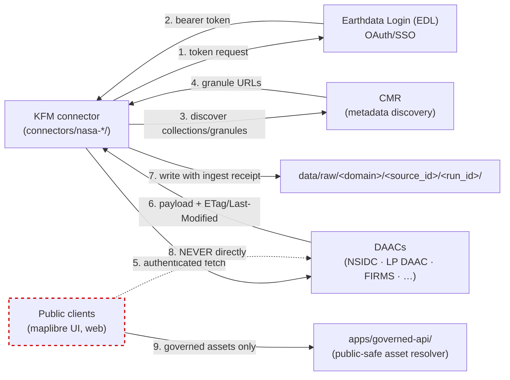

<!-- [KFM_META_BLOCK_V2]
doc_id: kfm://doc/docs-sources-catalog-nasa-nasa-earthdata
title: NASA Earthdata
type: product-page
version: v0.2
status: draft
owners: <PLACEHOLDER — Docs steward + Source steward for nasa>
created: 2026-05-21
updated: 2026-05-22
policy_label: public
related:
  - docs/sources/catalog/nasa/README.md
  - docs/sources/catalog/nasa/nasa-firms.md
  - docs/sources/catalog/nasa/nasa-hls.md
  - docs/sources/catalog/nasa/nasa-smap.md
  - docs/sources/catalog/README.md
  - docs/sources/catalog/PROFILES.md
  - docs/sources/catalog/IDENTITY.md
  - docs/sources/catalog/RIGHTS-AND-SENSITIVITY-MAP.md
  - docs/sources/catalog/_template/SOURCE_PRODUCT_TEMPLATE.md
  - docs/doctrine/directory-rules.md
  - docs/standards/STAC_KFM_PROFILE.md
  - docs/adr/ADR-NNNN-nasa-source-family-promotion.md
tags: [kfm, docs, sources, catalog, nasa, earthdata, edl, cmr]
notes:
  - "PROPOSED product-page scaffold; framing as auth/access surface grounded in KFM-P31-IDEA-0018 (Earth observation harvest authority matrix) and ML-063-010 (NASA/CMR auth tokens must not be public map dependencies)."
  - "v0.2: reframed from measurement product to access surface; added authority matrix, downstream-product table, no-browser-token-exposure governance callout, mermaid auth flow, and acceptance section."
[/KFM_META_BLOCK_V2] -->

<a id="top"></a>

# NASA Earthdata

> NASA's Earth-science **credentialed access surface** — Earthdata Login (EDL) and the Common Metadata Repository (CMR) — through which downstream NASA products (FIRMS, HLS / HLS-VI, SMAP, MAIAC AOD) are discovered, authenticated, and retrieved into KFM's governed lifecycle.

<!-- Badge row — all targets are PROPOSED placeholders; replace as CI/registry surfaces land. -->


<!-- TODO: replace with generated badges (KFM-P3-FEAT-0005): truth, gate, freshness, source-role -->

**Status:** PROPOSED — scaffold; family is **beyond `directory-rules.md` §7.3** (see family README and OPEN-DSC-14). · **Family:** [`nasa`](./README.md) · **Owners:** `<PLACEHOLDER — Docs steward + Source steward for nasa>` · **Last reviewed:** 2026-05-22

---

## Contents

- [Overview — what Earthdata is in the KFM model](#overview--what-earthdata-is-in-the-kfm-model)
- [Products fetched through this surface](#products-fetched-through-this-surface)
- [Auth & harvest flow](#auth--harvest-flow)
- [Source authority](#source-authority)
- [CMR / Earthdata harvest authority matrix](#cmr--earthdata-harvest-authority-matrix)
- [Catalog profile applicability](#catalog-profile-applicability)
- [Collection identity](#collection-identity)
- [Provenance fields (per downstream Item)](#provenance-fields-per-downstream-item)
- [Temporal, geometry, and projection — handled per downstream product](#temporal-geometry-and-projection--handled-per-downstream-product)
- [Rights and sensitivity](#rights-and-sensitivity)
- [Governance — no browser token exposure](#governance--no-browser-token-exposure)
- [Validation and catalog closure](#validation-and-catalog-closure)
- [Related contracts and schemas](#related-contracts-and-schemas)
- [Related connectors and pipelines](#related-connectors-and-pipelines)
- [Examples](#examples)
- [Acceptance — when this product page is considered complete](#acceptance--when-this-product-page-is-considered-complete)
- [Open questions](#open-questions)
- [Related docs](#related-docs)
- [Appendix A — Evidence for the access-surface framing](#appendix-a--evidence-for-the-access-surface-framing)

---

## Overview — what Earthdata is in the KFM model

**NASA Earthdata** is NASA's Earth-science data access platform. In the KFM model, it is **NOT itself a measurement product** — it is the **credentialed access surface** that downstream NASA products use:

- **Earthdata Login (EDL)** is the OAuth/SSO surface that authenticates fetch requests against NASA DAACs (e.g., NSIDC for SMAP, LP DAAC for HLS).
- **Common Metadata Repository (CMR)** is the metadata discovery surface that exposes collections and granules across NASA EO programs.
- Together, **CMR/Earthdata access** forms one row of the **Earth observation harvest authority matrix** (PROPOSED per `KFM-P31-IDEA-0018`), alongside STAC endpoints, provider auth, pagination, and rate-limit behavior.

> [!IMPORTANT]
> **Earthdata is an access surface, not a STAC collection.** Per-product catalog records (STAC Items/Collections, DCAT entries, PROV-O provenance, domain projections) live with the **downstream products** ([`nasa-firms.md`](./nasa-firms.md), [`nasa-hls.md`](./nasa-hls.md), [`nasa-smap.md`](./nasa-smap.md), and any MAIAC AOD product page once added). This page documents the **gateway** they share, not a dataset of its own.

[Back to top](#top)

---

## Products fetched through this surface

| Downstream KFM product | EDL required? | Originating DAAC (PROPOSED — NEEDS VERIFICATION) | KFM evidence anchor |
|---|---|---|---|
| **NASA SMAP** (L4 surface & root-zone soil moisture) | **Yes** | NSIDC | `KFM-P2-PROG-0004` (SMAP L4 ingest with CI-friendly QA); `KFM-P23-PROG-0042` (SMAP watcher descriptor) |
| **NASA HLS / HLS-VI** (Harmonized Landsat–Sentinel-2) | **Yes** | LP DAAC (PROPOSED) | `KFM-P20-IDEA-0002` (HLS vegetation analytics — mask-aware evidence); `KFM-P20-PROG-0005` (MAIAC/FIRMS mask gate) |
| **NASA FIRMS** (Active fire: MODIS / VIIRS) | Conditional (NEEDS VERIFICATION per endpoint) | FIRMS infrastructure | `KFM-P14-PROG-0020` (FIRMS GOES fire-event clustering); `KFM-P28-IDEA-0003` (FIRMS proximity + FRP signal) |
| **NASA MAIAC AOD** (aerosol optical depth) | **Yes** (NEEDS VERIFICATION per dataset version) | LP DAAC (PROPOSED) | `KFM-P15-PROG-0011` (MAIAC/VIIRS AOD QA-bitmask ingestion); `KFM-P28-IDEA-0002` (MAIAC AOD tile-health gate); `KFM-P28-PROG-0001` (`probe_maiac_aod.py`) |

> [!NOTE]
> The MAIAC AOD entry is included here because the corpus evidences MAIAC as an active KFM candidate, but **no `nasa-maiac.md` product page exists yet** in this family folder. Adding it is tracked as an open item; until then, MAIAC-specific catalog records are NEEDS VERIFICATION.

[Back to top](#top)

---

## Auth & harvest flow



> [!CAUTION]
> **Step 8 is the forbidden path.** Per `ML-063-010` (CONFIRMED evidence from *Master MapLibre Components-Functions-Features*), NASA/CMR auth tokens **MUST NOT** become public map dependencies. Clients **MUST NOT** fetch protected catalogs directly; the governed API resolves public-safe assets. See [Governance — no browser token exposure](#governance--no-browser-token-exposure).

[Back to top](#top)

---

## Source authority

See [`data/registry/sources/`](../../../../data/registry/sources/) for the authoritative `SourceDescriptor` for NASA Earthdata as an *access surface*, and one descriptor per downstream product (SMAP, HLS, FIRMS, MAIAC AOD). **Do not duplicate descriptor fields here.**

> [!WARNING]
> If a field on this page conflicts with the `SourceDescriptor` in the registry, **the registry wins** and the page is drift. Policy decisions, sensitivity tiers, and access classes live in [`policy/sources/`](../../../../policy/sources/) and [`policy/sensitivity/`](../../../../policy/sensitivity/) — **never restated here**.

## CMR / Earthdata harvest authority matrix

**PROPOSED** per `KFM-P31-IDEA-0018` (Earth observation harvest authority matrix): EO ingest should maintain an authority matrix covering STAC endpoints, CMR/Earthdata access, provider auth, pagination, and rate-limit behavior. The row for this surface:

| Authority field | Value (PROPOSED / NEEDS VERIFICATION) |
|---|---|
| Surface name | NASA Earthdata (EDL + CMR) |
| Discovery endpoint | CMR — **NEEDS VERIFICATION** (confirm endpoint URL against current NASA documentation) |
| Auth model | OAuth 2.0 via Earthdata Login — **NEEDS VERIFICATION** |
| Token storage | Server-side only — secrets manager / pipeline runtime; **NEVER** in browser, repo, or build artifacts |
| Pagination | **NEEDS VERIFICATION** per CMR API version |
| Rate-limit posture | **NEEDS VERIFICATION** per DAAC; treat as fail-closed if unknown |
| Validators (HTTP cache) | ETag + Last-Modified (per `C3-01` Conditional GETs); `If-None-Match` for debouncing |
| Watchlist signal | Distinguish stable availability from material schema/content changes (per `KFM-P32-FEAT-0016`) |

[Back to top](#top)

---

## Catalog profile applicability

Earthdata itself is not a STAC Collection. The table below records **which profiles apply to the products fetched through it**, not to the gateway. Confirm per downstream product page.

| Profile | Home | Applies to **Earthdata gateway**? | Applies to **downstream products**? |
|---|---|---|---|
| STAC Items / Collections | `data/catalog/stac/` | **No** — gateway is not a dataset | **Yes** (per product); confirm in each product page |
| DCAT distributions | `data/catalog/dcat/` | **PROPOSED — possibly** as a distribution-method/service record | **Yes** (per product) |
| PROV-O provenance | `data/catalog/prov/` | **Yes** — gateway appears in `prov:used` of fetch activities | **Yes** (per product) |
| Domain projection | `data/catalog/domain/<domain>/` | **No** — no domain ownership | **Yes** (per product) |

See [`../PROFILES.md`](../PROFILES.md) for the catalog-wide profile mapping rules and [`docs/standards/STAC_KFM_PROFILE.md`](../../../standards/STAC_KFM_PROFILE.md) *(NEEDS VERIFICATION — confirm path)* for the STAC profile.

## Collection identity

Earthdata as a gateway does not receive its own `kfm:` collection-id. Downstream products do; their identity follows [`../IDENTITY.md`](../IDENTITY.md).

- **PROPOSED** collection-id pattern for *downstream products*: `kfm-<org>-<product>` (e.g., `kfm-nasa-smap-l4`, `kfm-nasa-hls-vi`).
- **PROPOSED** namespace: `kfm:` — namespace pin is **UNRESOLVED**; see **OPEN-DSC-03** in [`../OPEN-QUESTIONS.md`](../OPEN-QUESTIONS.md).
- Asset roles: **NEEDS VERIFICATION** per product against [`schemas/contracts/v1/source/`](../../../../schemas/contracts/v1/source/).

[Back to top](#top)

---

## Provenance fields (per downstream Item)

CONFIRMED per `C4-01` (STAC Item with `kfm:provenance` Namespace, Pass-10 components atlas). Downstream STAC Items for products fetched through Earthdata carry an `item.properties.kfm:provenance` block with:

| Field | Value |
|---|---|
| `spec_hash` | `jcs:sha256:<hex>` — RFC 8785 JCS canonicalization + SHA-256 (per `C1-02`) |
| `evidence_bundle_ref` | `kfm://evidence/<digest>` — content-addressed JSON-LD bundle (per `C4-04`) |
| `run_record_ref` | `kfm://run/<run-id>` — receipt for the fetch + ingest run (per `C1-01`) |
| `audit_ref` | `kfm://audit/<attestation-id>` — SLSA / cosign attestation |
| `policy_digest` | `sha256:<hex>` — policy bundle used at promotion |
| Per-asset integrity | `file:checksum` on each asset |

> [!NOTE]
> Earthdata-specific provenance signal: the run receipt **SHOULD** record `http_validators` (ETag, Last-Modified) seen at fetch and the EDL token fingerprint (not the token itself). This supports cache-aware re-fetch (per `C3-01`) and lets verifiers re-derive who held the credential without exposing it.

[Back to top](#top)

---

## Temporal, geometry, and projection — handled per downstream product

These dimensions belong to the **products fetched through this surface**, not to Earthdata itself. Each downstream product page carries:

- **Temporal handling** — distinct *source*, *observed*, *valid*, *retrieval*, *release*, and *correction* times preserved where material. Earthdata's role is to record the **retrieval time** (and `extraction_timestamp`, `dataset_version`, NRT-vs-reprocessed QA flag per `KFM-P2-PROG-0004`).
- **Geometry and CRS** — confirmed per product against catalog artifacts.
- **Generalization rules / scale support** — confirmed per product against [`policy/sensitivity/`](../../../../policy/sensitivity/).

## Rights and sensitivity

**NEEDS VERIFICATION** per downstream product — Earthdata as a surface does not own rights or sensitivity tiers; those attach to the products it gates. Consult [`policy/sensitivity/`](../../../../policy/sensitivity/) and [`../RIGHTS-AND-SENSITIVITY-MAP.md`](../RIGHTS-AND-SENSITIVITY-MAP.md). **Do not restate policy here.**

The atlas posture for every NASA family entry is `rights and current terms NEEDS VERIFICATION; sensitive joins fail closed` — this applies until a per-product rights determination lands.

[Back to top](#top)

---

## Governance — no browser token exposure

> [!CAUTION]
> **CONFIRMED governance rule** (`ML-063-010`, *Master MapLibre Components-Functions-Features*, SRC-063 pp. 10–11): **NASA/CMR auth tokens MUST NOT be public map dependencies.** Auth tokens are required for some Earthdata metadata and quota tracking; clients **MUST NOT** fetch protected catalogs directly. The **governed API** ([`apps/governed-api/`](../../../../apps/governed-api/)) resolves public-safe assets.

### Required tests

| Test | Status |
|---|---|
| No browser token exposure (no EDL token in any client bundle, source map, or public artifact) | **PROPOSED** — must be wired in CI |
| Public map dependency audit (no direct CMR / DAAC fetches from MapLibre, web, or styles) | **PROPOSED** — must be wired in CI |
| Token-rotation runbook exists and is current | **NEEDS VERIFICATION** |

### Forbidden patterns

- EDL bearer tokens checked into the repo, including `.env` examples that look like real tokens.
- EDL tokens shipped in client JS, source maps, public PMTiles metadata, or any artifact under [`data/published/`](../../../../data/published/).
- `apps/explorer-web/` (the canonical map shell, per `directory-rules.md` §7.1.a) calling CMR or DAAC endpoints directly.
- "Admin shortcut" paths that bypass [`apps/governed-api/`](../../../../apps/governed-api/) for protected catalogs in the normal public flow.

[Back to top](#top)

---

## Validation and catalog closure

| Check | Anchor | Status |
|---|---|---|
| Catalog closure required before public release | Pass-10 `C4-04` (Evidence-Bundle JSON-LD with Content Addressing); `KFM-P1-IDEA-0020` *(NEEDS VERIFICATION — confirm card id)* | **PROPOSED** |
| STAC Projection lint | `KFM-P27-FEAT-0003` *(NEEDS VERIFICATION — card body not directly inspected this session)* | **PROPOSED** |
| STAC checksum closure against `ReleaseManifest` digest | `KFM-P22-PROG-0037` *(NEEDS VERIFICATION — card body not directly inspected this session)* | **PROPOSED** |
| HTTP validator capture (ETag + Last-Modified) | `C3-01` Conditional GETs | **PROPOSED** |
| Spec-hash gate (recomputed `jcs:sha256` matches claimed) | `C1-02` + `C5-04` Spec-Hash-Match Gate | **PROPOSED** |
| No-browser-token-exposure test | `ML-063-010` | **PROPOSED** — see [Governance](#governance--no-browser-token-exposure) |

## Related contracts and schemas

- [`contracts/`](../../../../contracts/) — object meaning / source vocabulary; **NEEDS VERIFICATION**.
- [`schemas/contracts/v1/source/`](../../../../schemas/contracts/v1/source/) — machine shape for `SourceDescriptor` (per ADR-0001 schema-home).

## Related connectors and pipelines

- [`connectors/nasa-earthdata/`](../../../../connectors/nasa-earthdata/) — connector folder (currently an empty stub per the family scaffolding pass).
- Sibling connector folders that depend on EDL: `connectors/nasa-smap/`, `connectors/nasa-hls/`, `connectors/nasa-firms/`, and (PROPOSED) `connectors/nasa-maiac/`.
- Pipelines: [`pipelines/ingest/`](../../../../pipelines/ingest/), [`pipelines/normalize/`](../../../../pipelines/normalize/), [`pipelines/validate/`](../../../../pipelines/validate/), [`pipelines/catalog/`](../../../../pipelines/catalog/).
- Pipeline specs: [`pipeline_specs/atmosphere/`](../../../../pipeline_specs/atmosphere/), [`pipeline_specs/soil/`](../../../../pipeline_specs/soil/), [`pipeline_specs/agriculture/`](../../../../pipeline_specs/agriculture/), [`pipeline_specs/hazards/`](../../../../pipeline_specs/hazards/).

[Back to top](#top)

---

## Examples

*(Illustrative only — do not treat as authoritative; per-product Items live in the product pages and `data/catalog/stac/`.)*

<details>
<summary>Minimal STAC Item + <code>kfm:provenance</code> shape for a product fetched through Earthdata (click to expand)</summary>

```json
{
  "type": "Feature",
  "stac_version": "1.0.0",
  "id": "kfm-nasa-smap-l4-<granule>",
  "collection": "kfm-nasa-smap-l4",
  "properties": {
    "datetime": "<observed-time-ISO8601>",
    "kfm:provenance": {
      "spec_hash": "jcs:sha256:<hex>",
      "evidence_bundle_ref": "kfm://evidence/<digest>",
      "run_record_ref": "kfm://run/<run-id>",
      "audit_ref": "kfm://audit/<attestation-id>",
      "policy_digest": "sha256:<hex>",
      "http_validators": {
        "etag": "<etag-seen-at-fetch>",
        "last_modified": "<rfc-2822-or-iso>"
      },
      "edl_token_fingerprint": "sha256:<hex-not-the-token>"
    }
  },
  "assets": {
    "data": {
      "href": "<DAAC-URI>",
      "file:checksum": "sha256:<hex>"
    }
  },
  "links": [
    {"rel": "attestation", "href": "kfm://evidence/<digest>"}
  ]
}
```

See also [`_examples/stac-item-example.json`](../_examples/stac-item-example.json) *(NEEDS VERIFICATION — path PROPOSED).*

</details>

[Back to top](#top)

---

## Acceptance — when this product page is considered complete

> [!NOTE]
> Acceptance criteria below follow the KFM repo doc template pattern (META / BADGES / DESCRIPTION / FILES / ACCEPTANCE) from `KFM-P7-PROG-0008`. They are **PROPOSED** acceptance conditions for this page.

- [ ] ADR resolving **OPEN-DSC-14** (family promotion or relocation) is accepted; this page is updated to reflect the outcome.
- [ ] `SourceDescriptor` for the **Earthdata access surface** exists in [`data/registry/sources/`](../../../../data/registry/sources/) and is linked here without duplication.
- [ ] CMR endpoint URL and EDL OAuth flow are CONFIRMED against current NASA documentation.
- [ ] All four downstream product pages (SMAP, HLS, FIRMS, MAIAC AOD) link back to this page and carry confirmed catalog records.
- [ ] No-browser-token-exposure test is wired in CI and passing.
- [ ] Public map dependency audit is wired in CI and passing.
- [ ] Token rotation runbook exists under [`docs/runbooks/`](../../../runbooks/) and is current.
- [ ] HTTP validator capture (`ETag` + `Last-Modified`) is implemented in `connectors/nasa-earthdata/`.

[Back to top](#top)

---

## Open questions

- **OPEN** — confirm the current CMR endpoint URL and EDL OAuth flow against authoritative NASA documentation.
- **OPEN** — confirm per downstream product whether EDL is mandatory or optional (FIRMS in particular has historically had partially open endpoints — **NEEDS VERIFICATION**).
- **OPEN** — confirm whether MAIAC AOD warrants its own product page (`nasa-maiac.md`) or rolls under another file.
- **OPEN** — confirm rights status and CARE applicability per downstream product.
- **OPEN** — confirm whether a DCAT Service or DCAT DataService distribution describing the EDL/CMR surface is in scope.
- **OPEN-DSC-03** — namespace pin (`kfm:` vs. `ks-kfm:`) unresolved; affects collection-ids on downstream product pages.
- **OPEN-DSC-14** — family is PROPOSED; see [`../OPEN-QUESTIONS.md`](../OPEN-QUESTIONS.md).

[Back to top](#top)

---

## Related docs

- [`./README.md`](./README.md) — NASA source family landing
- [`./nasa-firms.md`](./nasa-firms.md) — FIRMS active fire product page
- [`./nasa-hls.md`](./nasa-hls.md) — HLS / HLS-VI product page
- [`./nasa-smap.md`](./nasa-smap.md) — SMAP soil moisture product page
- *(planned)* `./nasa-maiac.md` — MAIAC AOD product page *(PROPOSED — does not yet exist)*
- [`../PROFILES.md`](../PROFILES.md) · [`../IDENTITY.md`](../IDENTITY.md) · [`../RIGHTS-AND-SENSITIVITY-MAP.md`](../RIGHTS-AND-SENSITIVITY-MAP.md) · [`../OPEN-QUESTIONS.md`](../OPEN-QUESTIONS.md)
- [`../_template/SOURCE_PRODUCT_TEMPLATE.md`](../_template/SOURCE_PRODUCT_TEMPLATE.md)
- [`../../../doctrine/directory-rules.md`](../../../doctrine/directory-rules.md)
- [`../../../standards/STAC_KFM_PROFILE.md`](../../../standards/STAC_KFM_PROFILE.md) *(NEEDS VERIFICATION — confirm path)*
- `<TODO>` `docs/runbooks/EDL_TOKEN_ROTATION.md` — token rotation runbook (does not yet exist)

---

## Appendix A — Evidence for the access-surface framing

<details>
<summary>KFM idea-card anchors that establish Earthdata as auth/access infrastructure (click to expand)</summary>

| Anchor | Class | Status | What it establishes |
|---|---|---|---|
| `KFM-P31-IDEA-0018` — Earth observation harvest authority matrix | idea | normalized statement PROPOSED; carry-forward CONFIRMED | EO ingest maintains an authority matrix for "STAC endpoints, **CMR/Earthdata access**, provider auth, pagination, and rate-limit behavior." Establishes Earthdata as one row of the matrix, not a dataset. |
| `ML-063-010` — NASA/CMR auth tokens must not be public map dependencies (*Master MapLibre Components-Functions-Features*, SRC-063 pp. 10–11) | mapping | CONFIRMED evidence | "Auth tokens are required for some Earthdata metadata and quota tracking. Clients should not fetch protected catalogs directly; governed API resolves public-safe assets." Test: "No browser token exposure test." |
| `KFM-P2-PROG-0004` — SMAP L4 ingest with CI-friendly QA | programming | normalized statement PROPOSED | SMAP "fetched from NSIDC under **Earthdata Login**" — establishes EDL as the canonical auth surface for SMAP. |
| `KFM-P23-PROG-0042` — SMAP watcher descriptor | programming | PROPOSED | "SMAP watcher for satellite HDF/NetCDF or LANCE near-real-time products with **Earthdata auth notes**" — confirms watcher pattern depends on EDL. |
| `KFM-P15-PROG-0011` — MAIAC/VIIRS AOD QA-bitmask ingestion | programming | PROPOSED | MAIAC is an active KFM candidate that flows through this surface. |
| `KFM-P28-IDEA-0002` — MAIAC AOD tile-health gate | idea | PROPOSED | Records that MAIAC AOD should be tile-health-gated with product lineage, ETags, Last-Modified, and tile statistics. |
| `C3-01` — Conditional GETs (ETag/If-None-Match) | component | CONFIRMED | Standard HTTP-validator discipline for Earthdata fetches. |
| `C4-01` — STAC `kfm:provenance` Namespace | component | CONFIRMED | Provenance fields recorded on downstream Items (not on the gateway itself). |

</details>

---

**Last reviewed:** 2026-05-22 *(Claude session — v0.2: reframed as access surface; added authority matrix, downstream-product table, no-browser-token-exposure governance, mermaid auth flow, acceptance section, evidence appendix.)*

[Back to top](#top)
