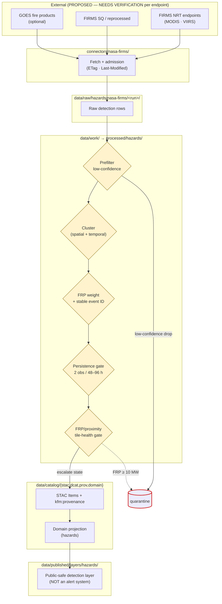

<!-- [KFM_META_BLOCK_V2]
doc_id: kfm://doc/docs-sources-catalog-nasa-nasa-firms
title: NASA FIRMS Active Fire
type: product-page
version: v0.2
status: draft
owners: <PLACEHOLDER — Docs steward + Source steward for nasa>
created: 2026-05-21
updated: 2026-05-22
policy_label: public
related:
  - docs/sources/catalog/nasa/README.md
  - docs/sources/catalog/nasa/nasa-earthdata.md
  - docs/sources/catalog/nasa/nasa-hls.md
  - docs/sources/catalog/README.md
  - docs/sources/catalog/PROFILES.md
  - docs/sources/catalog/IDENTITY.md
  - docs/sources/catalog/RIGHTS-AND-SENSITIVITY-MAP.md
  - docs/sources/catalog/_template/SOURCE_PRODUCT_TEMPLATE.md
  - docs/doctrine/directory-rules.md
  - docs/adr/ADR-NNNN-nasa-source-family-promotion.md
tags: [kfm, docs, sources, catalog, nasa, firms, fire, hazards, atmosphere]
notes:
  - "PROPOSED product-page scaffold. Framing as candidate-detection (not confirmed fire) grounded in KFM-P28-IDEA-0003, KFM-P14-PROG-0020, and the ML-065-003 anti-pattern that 'KFM must not become an emergency alert system'."
  - "v0.2: full presentation polish; lifecycle gate diagram, FRP/proximity gate table, persistence-window, watcher trigger rules, acceptance section, evidence appendix."
[/KFM_META_BLOCK_V2] -->

<a id="top"></a>

# NASA FIRMS Active Fire

> NASA **Fire Information for Resource Management System** — near-real-time satellite **active-fire and hot-spot detections** from MODIS (Aqua/Terra), VIIRS (S-NPP / NOAA-20 / NOAA-21), and optionally GOES. Admitted into KFM as **candidate detections**, never as confirmed fires.

<!-- Badge row — all targets are PROPOSED placeholders; replace as CI/registry surfaces land. -->


<!-- TODO: replace with generated badges (KFM-P3-FEAT-0005): truth, gate, freshness, source-role -->

**Status:** PROPOSED — scaffold; family is **beyond `directory-rules.md` §7.3** (see family README and OPEN-DSC-14). · **Family:** [`nasa`](./README.md) · **Owners:** `<PLACEHOLDER — Docs steward + Source steward for nasa>` · **Last reviewed:** 2026-05-22

---

## Contents

- [Overview — detections, not fires](#overview--detections-not-fires)
- [Mission & sensor inventory](#mission--sensor-inventory)
- [Cadence — NRT vs reprocessed](#cadence--nrt-vs-reprocessed)
- [Lifecycle & gate flow](#lifecycle--gate-flow)
- [FRP and proximity tile-health gates](#frp-and-proximity-tile-health-gates)
- [Persistence window](#persistence-window)
- [Watcher event triggers](#watcher-event-triggers)
- [Source authority](#source-authority)
- [Auth & access](#auth--access)
- [Catalog profiles used](#catalog-profiles-used)
- [Collection identity](#collection-identity)
- [Provenance fields](#provenance-fields)
- [Temporal handling](#temporal-handling)
- [Geometry and projection](#geometry-and-projection)
- [Rights and sensitivity](#rights-and-sensitivity)
- [Governance — not an emergency alert system](#governance--not-an-emergency-alert-system)
- [Validation and catalog closure](#validation-and-catalog-closure)
- [Related contracts and schemas](#related-contracts-and-schemas)
- [Related connectors and pipelines](#related-connectors-and-pipelines)
- [Examples](#examples)
- [Acceptance — when this product page is considered complete](#acceptance--when-this-product-page-is-considered-complete)
- [Open questions](#open-questions)
- [Related docs](#related-docs)
- [Appendix A — Evidence anchors](#appendix-a--evidence-anchors)

---

## Overview — detections, not fires

**NASA FIRMS** delivers satellite active-fire and thermal-hotspot detections, typically within 3 hours of overpass for near-real-time (NRT) feeds and within months for reprocessed Standard Quality products. In the KFM model, every FIRMS record enters the lifecycle as a **candidate detection** — a sensor pixel that crossed an anomaly threshold — and **must not** be presented as a confirmed fire, an alert, or an authoritative incident.

The doctrine reasons for this framing are cumulative:

- **`KFM-P28-IDEA-0003`** — "FIRMS proximity and Fire Radiative Power checks should act as **contextual** smoke/fire signals tied to query windows and dataset-version tags."
- **`KFM-P1-PROG-0062`** — "AOD and active-fire FRP thresholds can support tile-health or review states **only when framed as policy-bound operational gates, not universal scientific conclusions.**"
- **`ML-065-003`** (CONFIRMED source evidence) — anti-pattern: **"KFM must not become an emergency alert system."**
- **`KFM-P14-PROG-0020`** — fire-event pipelines must **prefilter low-confidence signals, cluster detections, weight FRP, and produce stable event IDs** before any downstream claim. Raw detections are not events.

> [!IMPORTANT]
> **A FIRMS detection is not a fire.** It is a sensor pixel flagged by an algorithm against confidence, cloud, water, and adjacency criteria. Downstream KFM artifacts must say "**detection**" (or, after clustering, "**candidate fire event**"), not "fire," "wildfire," or "incident." Public-facing tile and layer copy must preserve this distinction.

[Back to top](#top)

---

## Mission & sensor inventory

| Source | Sensor / platform | Resolution (PROPOSED — NEEDS VERIFICATION) | KFM scope |
|---|---|---|---|
| MODIS NRT | Terra · Aqua | ~1 km nominal | CONFIRMED in `KFM-P14-PROG-0020` as in-scope |
| VIIRS NRT | S-NPP · NOAA-20 · NOAA-21 (PROPOSED) | ~375 m (I-band) / ~750 m (M-band) | CONFIRMED in `KFM-P14-PROG-0020` as in-scope |
| GOES fire products | GOES-East · GOES-West | ~2 km nominal (PROPOSED) | **Optional** per `KFM-P14-PROG-0020` |

> [!NOTE]
> Sensor / resolution specifics above are PROPOSED placeholders consistent with the KFM corpus; the **`SourceDescriptor` in [`data/registry/sources/`](../../../../data/registry/sources/)** is the authoritative anchor. If this table conflicts with the registry, the registry wins.

## Cadence — NRT vs reprocessed

The cadence distinction is operationally significant per `KFM-P2-PROG-0004` (the NRT-vs-reprocessed discipline introduced for SMAP applies equally to FIRMS):

| Cadence class | Latency (PROPOSED) | Trust class | Supersession behavior |
|---|---|---|---|
| **NRT (near-real-time)** | ~3 h post-overpass | **Lower confidence**; ingest with `dataset_version` and `extraction_timestamp`; do not promote without operational policy gate. | May be **superseded** by Standard Quality reprocessed records. Receipts MUST record `supersedes:` pointers where applicable. |
| **Standard Quality (reprocessed)** | Months (NEEDS VERIFICATION) | Higher confidence; eligible for analytical lanes. | Authoritative over NRT for the same scene; preserve both with supersession trail. |

> [!CAUTION]
> NRT records can be revised in subsequent Standard Quality publications. Per the temporal-discipline doctrine that recurs throughout the corpus (see also `KFM-P2-IDEA-0022` on AQS/AirNow revisions), revisions MUST be tracked explicitly with `supersedes` pointers. **Do not delete superseded records** — emit a tombstone and a replacement pointer per `C5-09`.

[Back to top](#top)

---

## Lifecycle & gate flow



**Gate chain anchors:** `KFM-P14-PROG-0020` (prefilter → cluster → FRP weight → event ID) · `ML-065-003` (FRP/proximity tile gate) · `ML-065-004` (persistence window) · `C5-09` (tombstones for supersession).

[Back to top](#top)

---

## FRP and proximity tile-health gates

**PROPOSED implementation, CONFIRMED source evidence** per `ML-065-003` (SRC-065 pp. 1–4). Thresholds below are policy-bound operational gates per `KFM-P1-PROG-0062` — they are **not** scientific conclusions about fire presence.

| Gate | Threshold (PROPOSED) | Tile-health effect | Required fixtures |
|---|---|---|---|
| Proximity escalation | FIRMS detection within **5 km** of tile centroid | Escalate tile state to `TILE_DEGRADED` (PROPOSED label) | `FRP > 0` with detection in window |
| Large-event quarantine | **FRP ≥ 10 MW** | Quarantine as large-event candidate; route to review | `FRP >= 10` with detection in window |
| No-fire baseline | No detection within window | Tile remains nominal | "no nearby fire" fixture |
| Stale-window guard | FIRMS window older than configured staleness | Tile health → unknown; do NOT extrapolate | "stale FIRMS window" fixture |
| Missing-version guard | `dataset_version` absent or unparseable | Fail closed | "missing source version" fixture |

> [!WARNING]
> **Thresholds are policy decisions, not science absolutes** (`ML-065-003`). Any change to 5 km or 10 MW requires a recorded policy decision, fixture refresh, and a `policy_digest` bump in downstream `kfm:provenance` blocks.

## Persistence window

Per `ML-065-004` (CONFIRMED source evidence, SRC-065 pp. 2–4): **State changes should persist for at least two independent observations within a rolling 48–96 hour window** before they drive promoted state. This adds temporal hysteresis to tile health watchers and reduces churn from noisy single-pixel detections.

| Window posture | Behavior |
|---|---|
| 1 detection only | Watcher records context; **no state promotion** |
| 2+ detections in rolling 48–96 h | Eligible for state change subject to FRP/proximity gates |
| Stale window (no recent detections, prior state set) | Decay state per documented decay rule (NEEDS VERIFICATION) |

## Watcher event triggers

Per `ML-065-005` (CONFIRMED source evidence): watcher events are emitted **only** when `kfm:spec_hash`, `ETag`, or `Last-Modified` changes. HEAD requests and sidecar checks act as source-admission controls **before** any work record is created.

| Trigger | Action |
|---|---|
| New `ETag` or `Last-Modified` from FIRMS endpoint | Open work record; fetch and compute `spec_hash` |
| `If-None-Match` returns 304 | Refresh `last_seen`; emit no work record |
| `spec_hash` unchanged but headers churned | Record metadata-only event; no downstream gate fires |
| `spec_hash` changed | Open candidate work record; run cluster + FRP gates |

[Back to top](#top)

---

## Source authority

See [`data/registry/sources/`](../../../../data/registry/sources/) for the authoritative `SourceDescriptor` for NASA FIRMS. **Do not duplicate descriptor fields here.** Policy decisions live in [`policy/sources/`](../../../../policy/sources/); sensitivity tiers in [`policy/sensitivity/`](../../../../policy/sensitivity/) — never restated here.

## Auth & access

| Aspect | Status |
|---|---|
| Endpoint URL | **NEEDS VERIFICATION** — confirm current FIRMS API endpoint against NASA documentation |
| Earthdata Login required? | **NEEDS VERIFICATION** per endpoint. Some FIRMS endpoints have historically been partially open; others require EDL. Treat as required until verified otherwise. |
| Quota / rate-limit | **NEEDS VERIFICATION** |
| Public map dependency forbidden? | **CONFIRMED** — see [`./nasa-earthdata.md` § Governance](./nasa-earthdata.md#governance--no-browser-token-exposure) and `ML-063-010`. Tokens / API keys MUST NOT reach the browser. |

See [`./nasa-earthdata.md`](./nasa-earthdata.md) for the shared auth surface and the no-browser-token-exposure rule.

[Back to top](#top)

---

## Catalog profiles used

| Profile | Lane | Used by this product? | Notes |
|---|---|---|---|
| STAC Items / Collections | `data/catalog/stac/` | **PROPOSED — Yes** | Detection records carry `kfm:provenance`; clustered events get their own Collection. **NEEDS VERIFICATION** of Collection split (per-sensor vs combined). |
| DCAT distribution | `data/catalog/dcat/` | **PROPOSED — Yes** | Dataset-level metadata for the FIRMS family entry. |
| PROV-O provenance | `data/catalog/prov/` | **PROPOSED — Yes** | Fetch activities cite Earthdata gateway in `prov:used`. |
| Domain projection | `data/catalog/domain/hazards/` | **PROPOSED — Yes** (primary lane: hazards) | Secondary projections into `atmosphere/` (smoke context) and `agriculture/` (HLS masking) are **PROPOSED — NEEDS VERIFICATION**. |

> [!NOTE]
> FIRMS appears as a **key source family** in DOM-HAZ (Hazards) per the *Kansas Frontier Matrix Domains v1.1 + Pass 23/32 Consolidated Atlas* (CONFIRMED). It also informs DOM-AIR (VIIRS fire/hotspot row) and DOM-AG (HLS mask gate per `KFM-P20-PROG-0005`). Domain projection MUST land in `hazards/`; secondary references in `atmosphere/` and `agriculture/` are cross-references, not duplicate sources of truth.

## Collection identity

- **PROPOSED** collection-id patterns (per [`../IDENTITY.md`](../IDENTITY.md)):
  - `kfm-nasa-firms-modis-nrt`
  - `kfm-nasa-firms-viirs-nrt`
  - `kfm-nasa-firms-sq` (Standard Quality, possibly combined)
  - `kfm-nasa-firms-events` (clustered events per `KFM-P14-PROG-0020`)
- **PROPOSED** namespace: `kfm:` — pin **UNRESOLVED**; see **OPEN-DSC-03**.
- Asset roles: **NEEDS VERIFICATION** against [`schemas/contracts/v1/source/`](../../../../schemas/contracts/v1/source/).

[Back to top](#top)

---

## Provenance fields

STAC `properties.kfm:provenance` block per `C4-01` (Pass-10 components atlas, CONFIRMED):

| Field | Value |
|---|---|
| `spec_hash` | `jcs:sha256:<hex>` — RFC 8785 JCS canonicalization + SHA-256 (per `C1-02`) |
| `evidence_bundle_ref` | `kfm://evidence/<digest>` |
| `run_record_ref` | `kfm://run/<run-id>` |
| `audit_ref` | `kfm://audit/<attestation-id>` |
| `policy_digest` | `sha256:<hex>` — policy bundle used at promotion |
| `http_validators` | `{etag, last_modified}` seen at fetch (per `C3-01` / `ML-065-005`) |
| `dataset_version` | FIRMS dataset version (NRT vs SQ) |
| `cadence_class` | `nrt` \| `sq` (PROPOSED label vocabulary) |
| `supersedes` | Optional pointer to a prior `kfm:` id this record replaces |

Per-asset integrity: `file:checksum`.

## Temporal handling

| Time field | Source | Notes |
|---|---|---|
| `acq_date` / `acq_time` | FIRMS record | Native FIRMS detection time |
| `observed_time` | derived | ISO 8601 from `acq_date` + `acq_time` + sensor scan geometry |
| `valid_time` | derived | Window of validity for downstream gates (per `KFM-P28-IDEA-0003`) |
| `retrieval_time` | run receipt | When KFM fetched the record |
| `release_time` | release manifest | When the KFM artifact was released |
| `correction_time` | supersession | When a Standard Quality reprocessed record superseded the NRT |

> [!IMPORTANT]
> Distinct **source / observed / valid / retrieval / release / correction** times **MUST** stay separate where material — this is CONFIRMED doctrine across DOM-HAZ, DOM-AIR, DOM-AG, and DOM-SOIL. Collapsing them is a §13.5 anti-pattern candidate.

## Geometry and projection

- **CRS:** EPSG:4326 (PROPOSED — confirm against FIRMS record schema).
- **Geometry shape:** Point per detection; clustered events emit polygon hulls and centroid points (PROPOSED per `KFM-P14-PROG-0020`).
- **Generalization rules:** None expected for hazards (public posture); but tile rendering may simplify clusters at low zoom — NEEDS VERIFICATION.
- **Scale support:** NEEDS VERIFICATION against `data/published/layers/hazards/`.

## Rights and sensitivity

**NEEDS VERIFICATION** — consult [`policy/sensitivity/`](../../../../policy/sensitivity/) and [`../RIGHTS-AND-SENSITIVITY-MAP.md`](../RIGHTS-AND-SENSITIVITY-MAP.md). The atlas marks this row as `rights and current terms NEEDS VERIFICATION; sensitive joins fail closed` (DOM-HAZ source-family table). **Do not restate policy here.**

[Back to top](#top)

---

## Governance — not an emergency alert system

> [!CAUTION]
> **CONFIRMED anti-pattern** (`ML-065-003`, SRC-065 pp. 1–4): **KFM must not become an emergency alert system.** FIRMS detections are inputs to **governed, evidence-first** map and analytical surfaces — not warnings, not advisories, not incident calls. Public copy, UI labels, API responses, and AI explanations MUST preserve this distinction.

### Required posture

- Surface FIRMS records as **"satellite detection"** or **"candidate fire event"** — never **"fire"**, **"wildfire"**, **"alert"**, or **"warning"**.
- Always pair a detection with: `dataset_version`, `cadence_class` (NRT / SQ), `confidence`, `FRP`, and a link to the EvidenceBundle.
- For **operational alerting**, route the consuming application to **NWS warnings**, **state emergency management**, or **NOAA HMS Fire and Smoke**, which are also represented in DOM-HAZ but carry alert authority.

### Forbidden patterns

- UI copy that reads "Fire at \<location\>" without the detection caveat.
- AI-generated narratives that claim a fire is "confirmed" or "ongoing" from FIRMS alone.
- Public layers that display NRT detections without the cadence label and confidence value.
- Direct browser fetches of FIRMS endpoints requiring keys (per `ML-063-010`).

[Back to top](#top)

---

## Validation and catalog closure

| Check | Anchor | Status |
|---|---|---|
| Prefilter low-confidence detections | `KFM-P14-PROG-0020` | **PROPOSED** |
| Spatial + temporal clustering produces stable event IDs | `KFM-P14-PROG-0020` | **PROPOSED** |
| FRP/proximity tile-health gate fixtures present | `ML-065-003` | **PROPOSED** — fixtures for `FRP > 0`, `FRP ≥ 10`, no-nearby-fire, stale window, missing version |
| Persistence window (2 obs / 48–96 h) | `ML-065-004` | **PROPOSED** |
| Watcher event triggers (`spec_hash` / ETag / Last-Modified) | `ML-065-005` | **PROPOSED** |
| Supersession tombstones (NRT → SQ) | `C5-09` Tombstones for Revocation | **PROPOSED** |
| Catalog closure before public release | `C4-04` Evidence-Bundle JSON-LD; `KFM-P1-IDEA-0020` *(NEEDS VERIFICATION — confirm card id)* | **PROPOSED** |
| STAC Projection lint | `KFM-P27-FEAT-0003` *(NEEDS VERIFICATION — card body not directly inspected)* | **PROPOSED** |
| STAC checksum closure against `ReleaseManifest` digest | `KFM-P22-PROG-0037` *(NEEDS VERIFICATION — card body not directly inspected)* | **PROPOSED** |
| Spec-hash gate (recomputed `jcs:sha256` matches claimed) | `C1-02` + `C5-04` | **PROPOSED** |
| "Not an alert system" UI / copy audit | `ML-065-003` | **PROPOSED** — wire as a docs/lint check |

## Related contracts and schemas

- [`contracts/`](../../../../contracts/) — fire-event / detection object semantics; **NEEDS VERIFICATION**.
- [`schemas/contracts/v1/source/`](../../../../schemas/contracts/v1/source/) — machine shape for `SourceDescriptor` (per ADR-0001 schema-home).

## Related connectors and pipelines

- [`connectors/nasa-firms/`](../../../../connectors/nasa-firms/) — connector folder (currently an empty stub per the family scaffolding pass).
- [`connectors/nasa-earthdata/`](../../../../connectors/nasa-earthdata/) — shared auth surface (where applicable).
- Pipelines: [`pipelines/ingest/`](../../../../pipelines/ingest/), [`pipelines/normalize/`](../../../../pipelines/normalize/), [`pipelines/validate/`](../../../../pipelines/validate/), [`pipelines/catalog/`](../../../../pipelines/catalog/).
- Pipeline specs: [`pipeline_specs/hazards/`](../../../../pipeline_specs/hazards/) *(primary)*; cross-references in `pipeline_specs/atmosphere/` and `pipeline_specs/agriculture/` for masking use.

[Back to top](#top)

---

## Examples

*(Illustrative only — do not treat as authoritative; canonical Items live in `data/catalog/stac/`.)*

<details>
<summary>Minimal STAC Item shape for a single FIRMS detection (click to expand)</summary>

```json
{
  "type": "Feature",
  "stac_version": "1.0.0",
  "id": "kfm-nasa-firms-viirs-nrt-<granule>-<row>",
  "collection": "kfm-nasa-firms-viirs-nrt",
  "geometry": {
    "type": "Point",
    "coordinates": [-98.5, 38.7]
  },
  "properties": {
    "datetime": "<observed-time-ISO8601>",
    "acq_date": "<YYYY-MM-DD>",
    "acq_time": "<HHMM>",
    "confidence": "<nominal|low|high or numeric>",
    "frp_mw": 12.4,
    "kfm:provenance": {
      "spec_hash": "jcs:sha256:<hex>",
      "evidence_bundle_ref": "kfm://evidence/<digest>",
      "run_record_ref": "kfm://run/<run-id>",
      "audit_ref": "kfm://audit/<attestation-id>",
      "policy_digest": "sha256:<hex>",
      "http_validators": {"etag": "<etag>", "last_modified": "<lm>"},
      "dataset_version": "<firms-product-version>",
      "cadence_class": "nrt"
    }
  },
  "assets": {
    "row": {
      "href": "<FIRMS-source-uri>",
      "file:checksum": "sha256:<hex>"
    }
  },
  "links": [
    {"rel": "attestation", "href": "kfm://evidence/<digest>"},
    {"rel": "via", "href": "./nasa-earthdata.md"}
  ]
}
```

See also [`_examples/stac-item-example.json`](../_examples/stac-item-example.json) *(NEEDS VERIFICATION — path PROPOSED)*.

</details>

[Back to top](#top)

---

## Acceptance — when this product page is considered complete

> [!NOTE]
> Acceptance criteria follow the KFM doc template pattern (META / BADGES / DESCRIPTION / FILES / ACCEPTANCE) from `KFM-P7-PROG-0008`.

- [ ] ADR resolving **OPEN-DSC-14** is accepted; this page reflects the outcome.
- [ ] `SourceDescriptor` for FIRMS (NRT and SQ) exists in [`data/registry/sources/`](../../../../data/registry/sources/) and is linked from this page without duplication.
- [ ] Mission/sensor inventory confirmed against the SourceDescriptor.
- [ ] FRP/proximity gate fixtures (5 km, ≥10 MW, no-nearby, stale, missing-version) exist in `fixtures/` and are wired into validators.
- [ ] Persistence-window logic (2 obs / 48–96 h) is implemented in `connectors/nasa-firms/` or `pipelines/`.
- [ ] Watcher event triggers (`spec_hash` / ETag / Last-Modified) are implemented and tested.
- [ ] Supersession tombstones from NRT → SQ are emitted and visible in `release/changelog/`.
- [ ] "Not an alert system" UI/copy audit passes in CI for `apps/explorer-web/` and any AI surface.
- [ ] Catalog records (STAC + DCAT + PROV-O + hazards projection) are present and closed against the ReleaseManifest digest.

[Back to top](#top)

---

## Open questions

- **OPEN** — confirm current FIRMS endpoint URLs (NRT and SQ) and EDL requirement per endpoint.
- **OPEN** — confirm whether KFM operates a single combined FIRMS collection or one collection per sensor (`modis-nrt`, `viirs-nrt`, `sq`) plus an `events` collection for clustered output.
- **OPEN** — confirm whether GOES fire products are activated for KFM (optional per `KFM-P14-PROG-0020`).
- **OPEN** — confirm clustering algorithm parameters (spatial radius, temporal window) and pin them in `pipeline_specs/hazards/`.
- **OPEN** — confirm whether tile-health labels `TILE_DEGRADED` / `TILE_QUARANTINE` are part of a stable vocabulary or per-source.
- **OPEN** — confirm rights status and CARE applicability.
- **OPEN-DSC-03** — namespace pin (`kfm:` vs. `ks-kfm:`) unresolved; affects collection-ids.
- **OPEN-DSC-14** — family is PROPOSED; see [`../OPEN-QUESTIONS.md`](../OPEN-QUESTIONS.md).

[Back to top](#top)

---

## Related docs

- [`./README.md`](./README.md) — NASA source family landing
- [`./nasa-earthdata.md`](./nasa-earthdata.md) — shared auth/access surface (EDL + CMR)
- [`./nasa-hls.md`](./nasa-hls.md) — HLS / HLS-VI (masking dependency on FIRMS per `KFM-P20-PROG-0005`)
- [`./nasa-smap.md`](./nasa-smap.md) — SMAP soil moisture (sibling product)
- [`../PROFILES.md`](../PROFILES.md) · [`../IDENTITY.md`](../IDENTITY.md) · [`../RIGHTS-AND-SENSITIVITY-MAP.md`](../RIGHTS-AND-SENSITIVITY-MAP.md) · [`../OPEN-QUESTIONS.md`](../OPEN-QUESTIONS.md)
- [`../_template/SOURCE_PRODUCT_TEMPLATE.md`](../_template/SOURCE_PRODUCT_TEMPLATE.md)
- [`../../../doctrine/directory-rules.md`](../../../doctrine/directory-rules.md)
- `<TODO>` `docs/standards/STAC_KFM_PROFILE.md` — STAC profile (NEEDS VERIFICATION — confirm path)

---

## Appendix A — Evidence anchors

<details>
<summary>KFM idea-card and ML-component anchors that govern this page (click to expand)</summary>

| Anchor | Class | Status | What it establishes |
|---|---|---|---|
| `KFM-P14-PROG-0020` — FIRMS GOES fire-event clustering source package | programming | normalized PROPOSED; carry-forward CONFIRMED | Pipelines ingest MODIS/VIIRS + optional GOES, prefilter low-confidence, cluster, weight FRP, produce stable event IDs. |
| `KFM-P28-IDEA-0003` — FIRMS fire proximity and FRP signal | idea | normalized PROPOSED; carry-forward CONFIRMED | FRP/proximity are **contextual** signals tied to query windows + dataset-version tags. |
| `KFM-P1-PROG-0062` — AOD and FRP tile-health gates when policy-bound | programming | normalized PROPOSED; carry-forward CONFIRMED | FRP thresholds support tile-health **only as policy-bound operational gates, not universal scientific conclusions.** |
| `KFM-P25-IDEA-0015` — Burn-relevant derived metrics | idea | normalized PROPOSED; carry-forward CONFIRMED | Governed soil-weather-air fabric can support fuel moisture, smoke dispersion, ignition risk **when evidence and uncertainty are visible.** |
| `ML-065-003` — FIRMS FRP proximity gates (*Master MapLibre Components-Functions-Features*, SRC-065 pp. 1–4) | mapping | CONFIRMED source evidence; PROPOSED implementation | 5 km proximity + 10 MW FRP gates; anti-pattern: **"KFM must not become an emergency alert system."** |
| `ML-065-004` — Independent-observation persistence window (SRC-065 pp. 2–4) | mapping | CONFIRMED source evidence; PROPOSED implementation | 2 observations within rolling 48–96 h before state promotion. |
| `ML-065-005` — Watcher events keyed to spec_hash or source head (SRC-065 pp. 2–3) | mapping | CONFIRMED source evidence; PROPOSED implementation | Watcher events emitted only on `kfm:spec_hash`, ETag, or Last-Modified changes. |
| `ML-063-010` — NASA/CMR auth tokens must not be public map dependencies (SRC-063 pp. 10–11) | mapping | CONFIRMED evidence | Where FIRMS requires auth, tokens must not reach the browser. |
| `C1-02` — Deterministic `spec_hash` via RFC 8785 JCS + SHA-256 | component | CONFIRMED | `jcs:sha256:<hex>` discipline applied to FIRMS records. |
| `C3-01` — Conditional GETs (ETag / If-None-Match) | component | CONFIRMED | HTTP validators captured in run receipts. |
| `C4-01` — STAC Item with `kfm:provenance` Namespace | component | CONFIRMED | Provenance block on every FIRMS Item. |
| `C5-09` — Tombstones for Revocation | component | CONFIRMED | NRT → SQ supersession emits tombstone + replacement pointer. |
| *KFM Domains v1.1 + Pass 23/32 Consolidated Atlas* DOM-HAZ source-family table | atlas | CONFIRMED that FIRMS is a key source family in Hazards | DOM-AIR `VIIRS fire/hotspot` row references the same upstream sensor stream. |

</details>

---

**Last reviewed:** 2026-05-22 *(Claude session — v0.2: detections-not-fires framing elevated; FRP / proximity / persistence / watcher-trigger gates documented; "not an alert system" governance added; acceptance + evidence appendix.)*

[Back to top](#top)
